# DRF - Informes

---

## Índice

- [1. Confidencialidad](#1-confidencialidad)
- [2. Información del Proyecto](#2-información-del-proyecto)
- [3. Responsables](#3-responsables)
- [4. Aprobaciones](#4-aprobaciones)
- [5. Situación Actual](#5-situación-actual)
- [6. Propósito del proyecto](#6-propósito-del-proyecto)
- [7. Alcance del proyecto](#7-alcance-del-proyecto)
- [8. SGP Administrador](#8-sgp-administrador)
  - [8.1. Aporte Nutricional Sansis (I_ApoNutSansis.frm)](#81-aporte-nutricional-sansis-i_aponutsansisfrm)
  - [8.2. Composición Minuta Sansis (E_ComposicionMinutasSansis.frm)](#82-composición-minuta-sansis-e_composicionminutassansisfrm)
  - [8.3. Consumo Ingrediente Minuta Bloque (C_ConIngMinBlo.frm)](#83-consumo-ingrediente-minuta-bloque-c_coningminblofrm)
  - [8.4. Costo Merma Sitio (E_CostoMermaSitio.frm)](#84-costo-merma-sitio-e_costomermasitiofrm)
  - [8.5. Costos Minutas (I_CostoSansis.frm)](#85-costos-minutas-i_costosansisfrm)
    - [8.5.1. Costo Minutas Resumido (I_CostoMinutaResumidosSansis)](#851-costo-minutas-resumido-i_costominutaresumidossansis)
    - [8.5.2. Costo Minutas Detallado (I_CostoMinutaDetalladoSansis)](#852-costo-minutas-detallado-i_costominutadetalladosansis)
  - [8.6. Costos Plan Teórico Real Realizado (I_CostoPlanTeoRealRealizado.frm)](#86-costos-plan-teórico-real-realizado-i_costoplanteorealrealizadofrm)
  - [8.7. Excel Q Sitios (E_QSitios.frm)](#87-excel-q-sitios-e_qsitiosfrm)
    - [8.7.1. Detalle x Tipo Q](#871-detalle-x-tipo-q)
    - [8.7.2. Detalle x Cliente](#872-detalle-x-cliente)
    - [8.7.3. Resumen Mensual](#873-resumen-mensual)
    - [8.7.4. Detalle Q x día](#874-detalle-q-x-día)
    - [8.7.5. Detallado x Precio Venta](#875-detallado-x-precio-venta)
  - [8.8. Exportación Excel Varios (E_ExcelVarios.frm)](#88-exportación-excel-varios-e_excelvariosfrm)
    - [8.8.1. Ingredientes con Aportes (01)](#881-ingredientes-con-aportes-01)
    - [8.8.2. Ingrediente – productos SGP – Material SAP (02)](#882-ingrediente-productos-sgp-material-sap-02)
    - [8.8.3. Resumen de Recetas con Aportes (03)](#883-resumen-de-recetas-con-aportes-03)
    - [8.8.4. Detalle de Recetas (04)](#884-detalle-de-recetas-04)
    - [8.8.5. Listado de Ceco Ultima Planificación (05)](#885-listado-de-ceco-ultima-planificación-05)
    - [8.8.6. Listado Cantidades Comensales x Sitios (06)](#886-listado-cantidades-comensales-x-sitios-06)
    - [8.8.7. Listado Recetas en Planificación Maxima Fecha con Frecuencia](#887-listado-recetas-en-planificación-maxima-fecha-con-frecuencia)
    - [8.8.8. Ubicar Estructura Servicio Minuta Bloque](#888-ubicar-estructura-servicio-minuta-bloque)
    - [8.8.9. Transformar Recetas Optimum Excel](#889-transformar-recetas-optimum-excel)
    - [8.8.10. Transformar Ingredientes Optimum Excel](#8810-transformar-ingredientes-optimum-excel)
    - [8.8.11. Listado Receta Método Preparación](#8811-listado-receta-método-preparación)
  - [8.9. Exportar Excel Detalle Minutas II (I_ExpDetMinBloque.frm)](#89-exportar-excel-detalle-minutas-ii-i_expdetminbloquefrm)
  - [8.10. Exportar Detalle Minuta Bloque (I_ExpDetMinBloque.frm)](#810-exportar-detalle-minuta-bloque-i_expdetminbloquefrm)
    - [8.10.1. Modo Detallado](#8101-modo-detallado)
    - [8.10.2. Modo Resumido](#8102-modo-resumido)
  - [8.11. Exportar Excel Minuta Bloque](#811-exportar-excel-minuta-bloque)
  - [8.12. Exportar Ingrediente sin Precio Vigente (E_PrecioIngredienteNoVigente.frm)](#812-exportar-ingrediente-sin-precio-vigente-e_precioingredientenovigentefrm)
  - [8.13. Exportar SO Health (C_SoHealth.frm)](#813-exportar-so-health-c_sohealthfrm)
  - [8.14. Frecuencia de Recetas Gramos Productos Mensual (I_FreGrP.frm)](#814-frecuencia-de-recetas-gramos-productos-mensual-i_fregrpfrm)
    - [8.14.1. Frecuencia Recetas Con Costo (I_FrecuenciaRecetas)](#8141-frecuencia-recetas-con-costo-i_frecuenciarecetas)
    - [8.14.2. Frecuencia Recetas Sin Costo (I_FrecuenciaRecetas)](#8142-frecuencia-recetas-sin-costo-i_frecuenciarecetas)
    - [8.14.3. Grs Prod. Mensual (I_GramosProductos)](#8143-grs-prod-mensual-i_gramosproductos)
  - [8.15. Informe Planificación (I_PlanifBloque.frm)](#815-informe-planificación-i_planifbloquefrm)
    - [8.15.1. Menú Mecano (Función Impresión I_MenuPlanMecanoBloque)](#8151-menú-mecano-función-impresión-i_menuplanmecanobloque)
    - [8.15.2. Menú Mensual (Función Impresión I_MenuPlanMensualSemanaCerradaokBloque, I_MenuPlanMensualBloque)](#8152-menú-mensual-función-impresión-i_menuplanmensualsemanacerradaokbloque-i_menuplanmensualbloque)
    - [8.15.3. Aporte Nutricional Detallado (Función Impresión I_MenuPlanMensualSemanaCerradaokBloque – I_MenuPlanMensualBloque.frm)](#8153-aporte-nutricional-detallado-función-impresión-i_menuplanmensualsemanacerradaokbloque-i_menuplanmensualbloquefrm)
    - [8.15.4. Aporte Nutricional Resumido (Función Impresión I_AportePlanDetalladoBloque)](#8154-aporte-nutricional-resumido-función-impresión-i_aporteplandetalladobloque)
    - [8.15.5. Aporte Nutricional por Estructura Resumido (Función Impresión I_AportePlanResBloque)](#8155-aporte-nutricional-por-estructura-resumido-función-impresión-i_aporteplanresbloque)
    - [8.15.6. Aporte Nutricional por Estructura (I_AportePlanEstrResBloque)](#8156-aporte-nutricional-por-estructura-i_aporteplanestrresbloque)
    - [8.15.7. Menú Mensual Servicios](#8157-menú-mensual-servicios)
    - [8.15.8. Menú Mensual Formato Comercial (Función Exportar Excel ExportarExcelMenuMensualMKT)](#8158-menú-mensual-formato-comercial-función-exportar-excel-exportarexcelmenumensualmkt)
    - [8.15.9. Aporte Nutricional Detallado Formato Comercial (Función Exportar Excel ExportarExcelPlanDetalladoResumidoMKT opción 1 detallado)](#8159-aporte-nutricional-detallado-formato-comercial-función-exportar-excel-exportarexcelplandetalladoresumidomkt-opción-1-detallado)
    - [8.15.10. Aporte Nutricional Resumido (Formato Comercial) (Función Exportar Excel ExportarExcelAportePlanEstrResMKT)](#81510-aporte-nutricional-resumido-formato-comercial-función-exportar-excel-exportarexcelaporteplanestrresmkt)
    - [8.15.11. Aporte Nutricional por Estructura Formato Comercial (Función Exportar Excel ExportarExcelAportePlanEstrResMKT)](#81511-aporte-nutricional-por-estructura-formato-comercial-función-exportar-excel-exportarexcelaporteplanestrresmkt)
    - [8.15.12. Solo Tabla Gramaje Formato Comercial (ExportarExcelSoloTablaGramajeMKT)](#81512-solo-tabla-gramaje-formato-comercial-exportarexcelsolotablagramajemkt)
    - [8.15.13. Tabla Gramaje y Frecuencia Formato Comercial (ExportarExcelTablaGramajeFrecuenciaMKT)](#81513-tabla-gramaje-y-frecuencia-formato-comercial-exportarexceltablagramajefrecuenciamkt)
    - [8.15.14. Molécula Calórica Diario Detallado (ExportaExcelDetalleMoleculaCalorica)](#81514-molécula-calórica-diario-detallado-exportaexceldetallemoleculacalorica)
    - [8.15.15. Huella Carbono x Estructura Servicio (ExportarExcelHuellaCarbonoxEstructuraSer)](#81515-huella-carbono-x-estructura-servicio-exportarexcelhuellacarbonoxestructuraser)
    - [8.15.16. Huella Carbono x Minuta Detallado (ExportarExcelHuellaCarbonoxMinutaEstructuraSer)](#81516-huella-carbono-x-minuta-detallado-exportarexcelhuellacarbonoxminutaestructuraser)
    - [8.15.17. Huella Carbono x Minuta Resumido (Excel)](#81517-huella-carbono-x-minuta-resumido-excel)
  - [8.16. Planificación Minuta Sansis](#816-planificación-minuta-sansis)
  - [8.17. Template Minuta Bloque (E_TemplateMinI.frm)](#817-template-minuta-bloque-e_templateminifrm)
    - [8.17.1. Plantilla Frecuencia](#8171-plantilla-frecuencia)
    - [8.17.2. Ponderaciones por Estructura](#8172-ponderaciones-por-estructura)
  - [8.18. Trabajo Lotes (E_TrabajosPorLotes.frm)](#818-trabajo-lotes-e_trabajosporlotesfrm)
- [9. SGP Local](#9-sgp-local)
  - [9.1. Informe Consulta Salida o Devolución a Bodega](#91-informe-consulta-salida-o-devolución-a-bodega)
  - [9.2. Detalle de Compras por Producto](#92-detalle-de-compras-por-producto)
  - [9.3. Documentos Pendientes Proveedores](#93-documentos-pendientes-proveedores)
  - [9.4. Impresión de Etiqueta de Receta](#94-impresión-de-etiqueta-de-receta)
  - [9.5. Resultado Operacional Mensual (A13)](#95-resultado-operacional-mensual-a13)
  - [9.6. Informe de Compras por Período](#96-informe-de-compras-por-período)
  - [9.7. Informe Planificación Teórica / Planificación Real](#97-informe-planificación-teórica-planificación-real)
    - [9.7.1. Costo Detallado (I_CostoPlanDetallado)](#971-costo-detallado-i_costoplandetallado)
    - [9.7.2. Costo Resumido (I_CostoPlanResumido)](#972-costo-resumido-i_costoplanresumido)
    - [9.7.3. Ingredientes Valor Cero en Planificación (I_IngValCeroPlan)](#973-ingredientes-valor-cero-en-planificación-i_ingvalceroplan)
  - [9.8. Informe de Stock](#98-informe-de-stock)
  - [9.9. Informe Traspasos](#99-informe-traspasos)
    - [9.9.1. Resumen Traspasos Por Periodo](#991-resumen-traspasos-por-periodo)
    - [9.9.2. Detalle Traspasos por Periodo](#992-detalle-traspasos-por-periodo)
    - [9.9.3. Diferencia Entre Contrato](#993-diferencia-entre-contrato)
  - [9.10. Costos Totales del Período](#910-costos-totales-del-período)
  - [9.11. Food Cost](#911-food-cost)
  - [9.12. Costo x Sector](#912-costo-x-sector)
  - [9.13. Insumos no Planificados en Salida Bodega](#913-insumos-no-planificados-en-salida-bodega)
  - [9.14. Costo Detalle Periodo Realizado](#914-costo-detalle-periodo-realizado)
  - [9.15. Curva ABC](#915-curva-abc)
  - [9.16. Comparativo Curva ABC](#916-comparativo-curva-abc)
  - [9.17. Comparativo de Raciones](#917-comparativo-de-raciones)
  - [9.18. Raciones no Vendidas (modo por defecto)](#918-raciones-no-vendidas-modo-por-defecto)
  - [9.19. Comparativo de Costos: Planificación Teórica, Real y Realizado](#919-comparativo-de-costos-planificación-teórica-real-y-realizado)
    - [9.19.1. Plan. Teórico & Realizado](#9191-plan-teórico-realizado)
    - [9.19.2. Plan. Real & Realizado](#9192-plan-real-realizado)
    - [9.19.3. Plan. Teórico & Realizado Acumulado](#9193-plan-teórico-realizado-acumulado)
    - [9.19.4. Plan. Real & Realizado Acumulado](#9194-plan-real-realizado-acumulado)
    - [9.19.5. Comparativo Plan. Teórico & Negociado](#9195-comparativo-plan-teórico-negociado)
  - [9.20. Ficha Stock](#920-ficha-stock)
  - [9.21. Detalle Cartola de Inventario](#921-detalle-cartola-de-inventario)
  - [9.22. Producto Sin Movimiento](#922-producto-sin-movimiento)
  - [9.23. Inflación Interna (I_InflacionInterna)](#923-inflación-interna-i_inflacioninterna)
  - [9.24. Análisis de Consumo Precio Fijo (I_AnalisisConsumoPrecioFijo)](#924-análisis-de-consumo-precio-fijo-i_analisisconsumopreciofijo)
  - [9.25. Salida y Devolución de Producción](#925-salida-y-devolución-de-producción)
    - [9.25.1. Formato de Requisición Resumido (I_SalBodega)](#9251-formato-de-requisición-resumido-i_salbodega)
    - [9.25.2. Formato de Requisición x Sector (I_SalBodegaSector)](#9252-formato-de-requisición-x-sector-i_salbodegasector)
    - [9.25.3. Formato de Requisición x Estructura Servicio Detallado (I_SalBodegaDet)](#9253-formato-de-requisición-x-estructura-servicio-detallado-i_salbodegadet)
    - [9.25.4. Formato de Requisición x Estructura Servicio Resumido (I_SalBodegaxEst)](#9254-formato-de-requisición-x-estructura-servicio-resumido-i_salbodegaxest)
    - [9.25.5. Resumen de Salida a Bodega (I_SalidasDevolBod)](#9255-resumen-de-salida-a-bodega-i_salidasdevolbod)
    - [9.25.6. Devolución de Salida a Bodega (I_SalidasDevolBod)](#9256-devolución-de-salida-a-bodega-i_salidasdevolbod)
    - [9.25.7. Salida Menos Devoluciones a Bodega (I_SalidasDevolBod)](#9257-salida-menos-devoluciones-a-bodega-i_salidasdevolbod)
  - [9.26. Venta Directa (I_VenDir.frm)](#926-venta-directa-i_vendirfrm)
  - [9.27. Cartola Inventario (I_CarInv.frm)](#927-cartola-inventario-i_carinvfrm)
  - [9.28. Control Facturas Compras – Control Traspasos Entre Casino – Fofi (I_CtrFCo.frm)](#928-control-facturas-compras-control-traspasos-entre-casino-fofi-i_ctrfcofrm)
    - [9.28.1. Control Facturas Compras](#9281-control-facturas-compras)
    - [9.28.2. Control Traspasos Entre Contratos](#9282-control-traspasos-entre-contratos)
    - [9.28.3. Control Fondo Fijo (Fofi)](#9283-control-fondo-fijo-fofi)
    - [9.28.4. Envió de documentos al sistema SAP o plataforma OPTIMUM](#9284-envió-de-documentos-al-sistema-sap-o-plataforma-optimum)
    - [9.28.5. Generación Manual de archivos de facturación](#9285-generación-manual-de-archivos-de-facturación)
  - [9.29. Control Facturas Compras (Cierres de Mes) (I_CfcCie.frm)](#929-control-facturas-compras-cierres-de-mes-i_cfcciefrm)
  - [9.30. Facturación Clientes (I_FacCli.frm)](#930-facturación-clientes-i_facclifrm)
  - [9.31. Informe Mermas por Periodo e Ajuste Inventario (I_MerPed.frm)](#931-informe-mermas-por-periodo-e-ajuste-inventario-i_merpedfrm)
    - [9.31.1. Mermas por Periodo](#9311-mermas-por-periodo)
    - [9.31.2. Ajuste Inventario Detallado o Resumido](#9312-ajuste-inventario-detallado-o-resumido)
  - [9.32. Venta Cafetería (I_VenCaf.frm)](#932-venta-cafetería-i_vencaffrm)
    - [9.32.1. Ventas por Articulo de Cafetería](#9321-ventas-por-articulo-de-cafetería)
    - [9.32.2. Ventas de Cafetería por Cliente y Centro de Costo](#9322-ventas-de-cafetería-por-cliente-y-centro-de-costo)
    - [9.32.3. Ventas de Cafetería por Cliente y Centro de Costo Detallado](#9323-ventas-de-cafetería-por-cliente-y-centro-de-costo-detallado)
    - [9.32.4. Salida de Bodega por Ventas de Cafetería](#9324-salida-de-bodega-por-ventas-de-cafetería)
  - [9.33. Calculo Precio Minuta](#933-calculo-precio-minuta)
    - [9.33.1. Centro de Costo Normal (tipoceco = 0)](#9331-centro-de-costo-normal-tipoceco-0)
    - [9.33.2. Centro de Costo Propuesta (tipoceco = 1)](#9332-centro-de-costo-propuesta-tipoceco-1)
- [10. Tabla de Gramaje](#10-tabla-de-gramaje)
- [11. Cálculos Nutricionales Aportes Nutricionales](#11-cálculos-nutricionales-aportes-nutricionales)
  - [11.1. Calculo Aporte Nutricionales](#111-calculo-aporte-nutricionales)
  - [11.2. Calculo Proteína de Alto Valor Biológico](#112-calculo-proteína-de-alto-valor-biológico)
  - [11.3. Calculo de Huela de Carbono](#113-calculo-de-huela-de-carbono)
- [12. Nuevo Reporte](#12-nuevo-reporte)
- [13. Mejoras Generales](#13-mejoras-generales)
- [14. Glosario](#14-glosario)
- [15. Requerimientos General](#15-requerimientos-general)

---

**
**

# 1. Confidencialidad

La información de este documento y documentos anexos es propiedad de **SODEXO CHILE** y de carácter confidencial, por lo cual el proveedor debe mantener la información en reserva y usarla sólo para el propósito de prestar los servicios solicitados.

El proveedor se obliga además a tomar las medidas para que quienes tengan acceso a la Información, guarden bajo estricta reserva, protejan y no revelen a terceros dicha Información, siendo responsabilidad del proveedor velar por el cumplimiento de esta obligación.

En caso de avanzar con el proyecto, el proveedor deberá firmar un documento de Confidencialidad de la Información (NDA Sodexo), donde se describe con mayor detalle estas obligaciones.

Toda la información entregada por el proveedor para la evaluación de un servicio, sistema y/o solución informática será propiedad de **SODEXO CHILE**, sin que esto signifique un costo o genere algún tipo de cargo para la empresa.

# 2. Información del Proyecto

| Estructura | Descripción |
| --- | --- |
| Segmento | Sodexo Chile |
| Área | Operaciones / Planificación / Compras / Nutrición / Logística |
| Sección | Módulo de Informes |
| Proyecto | SGP Upgrade – Módulo de Informes |

# 3. Responsables

| ROL | Nombre | Correo Electrónico |
| --- | --- | --- |
| Sponsor | Francisco González | Francisco.gonzalez@sodexo.com |
| Líder Proyecto | Claudia Muñoz | Claudia.munoz@sodexo.com |
| Key User | Jaime Orrego Griselda Galeno Evelyn Ponce Cecilia Sandoval | Jaime.orrego@sodexo.com Griselda.galeno@sodexo.com Evelyn.ponce@sodexo.com Cecilia.sandoval@sodexo.com |
| Líder TI | Jorge Paz | jorge.paz@sodexo.com |

# 4. Aprobaciones

Comité de Tecnología.

# 5. Situación Actual

El **SGP Administrador** actúa como el sistema central de planificación, parametrización y análisis transversal. En su estado actual, concentra la generación de informes nutricionales, de planificación y de costos que consumen información proveniente de múltiples módulos y sistemas externos.
El módulo de **Informes** en SGP Administrador funciona como una **capa de consulta y exportación**, consolidando datos desde las tablas de recetas, minutas, ingredientes, costos y catálogos maestros. Su principal fortaleza es la **amplitud funcional**, ya que soporta una gran variedad de reportes críticos para las áreas de Nutrición, Planificación, Operaciones, Compras y TI.
Desde el punto de vista tecnológico, el sistema está desarrollado en **Visual Basic 6 con SQL Server**, utilizando procedimientos almacenados complejos y el componente **VSPrinter** para visualización e impresión. Los informes se exportan principalmente a **Excel**, aunque también existen salidas en RTF, TXT o CSV según el caso.
El conocimiento funcional se encuentra **altamente acoplado a la lógica técnica**, con reglas de negocio embebidas en código y SP, muchas veces sin documentación formal previa. Esto genera dependencia del conocimiento experto y dificulta la mantención, evolución y modernización del módulo.

El **SGP Local** es el sistema operativo utilizado en los casinos para registrar la ejecución diaria del servicio. En su situación actual, es la **fuente principal de datos reales**, tales como raciones producidas y vendidas, consumo de ingredientes, mermas, inventarios y cierres operativos.
El módulo de **Informes Local** permite analizar el desempeño operacional y financiero de cada casino, entregando reportes de compras, stock, food cost, raciones, comparativos de planificación teórica versus real, y costos por período. Estos informes son clave para el control local y para la posterior consolidación a nivel administrador.
Al igual que SGP Administrador, el sistema está basado en **Visual Basic 6 y SQL Server**, con una fuerte dependencia de reportes impresos o exportados a Excel. La generación de informes requiere múltiples validaciones manuales, selección de filtros en grillas y manejo de grandes volúmenes de datos, lo que impacta en la experiencia de usuario.
Existe una **fuerte dependencia del correcto cierre diario**: muchos informes solo consideran información hasta el último cierre procesado, lo que obliga al usuario a conocer el estado operativo del casino para interpretar correctamente los resultados.

**Tecnología actual:** Visual Basic 6 + SQL Server. Los informes se generan mediante el componente VSPrinter (previsualización e impresión) y se exportan a archivos RTF, TXT o XLS según el tipo de informe.

**Ciclo general de un informe:**
Selección de filtros (CECO / Período / Régimen / Tipo) → Ejecución de SP en SQL Server → Renderizado VSPrinter → Previsualización / Exportación (RTF / Excel / TXT / CSV)

| **Grupo** | **Descripción** | **Área usuaria principal** |
| --- | --- | --- |
| **Maestros y Parámetros** | Reportes de catálogos del sistema: casinos, ingredientes, productos, categorías dietéticas, tipos de plato, servicios, regímenes, zonas, segmentos, proveedores, etc. | TI / Administración |
| **Recetas** | Tarjeta de receta, aporte nutricional por receta, costos, recetas con productos sin precio, ingredientes sin productos asociados, clasificaciones (alergenos, sellos, cocción, etc.). | Nutrición / Planificación |
| **Planificación de Minutas (Segmento)** | Informe mensual de minutas por subsegmento/régimen, formato mecano, aportes nutricionales detallados/resumidos, costos de planificación, lista de recetas planificadas. Incluye variantes por semana cerrada, con/sin nombres de recetas, con/sin costos. | Planificación / Nutrición |
| **Planificación de Minutas (Bloque / CECO)** | Mismas vistas que el grupo anterior pero filtradas por CECO individual en lugar de por subsegmento. Incluye exportaciones Excel de detalle, plantillas y frecuencia de recetas. | Planificación / Casino |
| **Sansis / Exportaciones Especiales** | Aporte nutricional Sansis, costo de minuta resumido/detallado Sansis, composición de minutas, minuta costo, frecuencia de recetas/gramos, homologación FoodUp, productos no homologados, So Health. | Nutrición / TI |
| **Bodega e Inventario** | Saldo de bodega, movimiento de stock, toma de inventario, mermas de pedido, documentos pendientes. | Operaciones Casino |
| **Compras** | Informe de compras por período, detalle de compras, cotejo de recetas, control de facturas. | Compras / Casino |
| **Facturación y SSLL** | Consolidado de facturación, Top 10 de productos, canasta de medición, 80/20, nivel de servicio, evolución de compras, IPA, nota de venta, porcentaje de costo de servicio, precios de referencia, descuento por volumen. | Costos / SSLL |
| **Rutas y Despacho** | Informes de rutas, calendario de rutas, calendario de casinos por día, días feriados, parámetros de despacho y grupo despacho por CECO. | Logística |
| **Parámetros del Sistema** | Reglas de negocio (por familia, producto, casino), listas de precio, tabla de gramajes, usuarios web, estructura de servicio, cantidad de productos por ruta, retención fuente/ICA. | TI / Administración |

# 6. Propósito del proyecto

Documentar en profundidad el comportamiento funcional actual de los distintos informes del SGP Administrador y Local, con el objetivo de:

Constituir una base de referencia para el diseño del nuevo sistema.
Identificar funcionalidades críticas a preservar, mejorar o eliminar.
Levantar reglas de negocio explícitas que hoy son conocimiento tácito de los operadores.
Definir el alcance funcional del módulo para la etapa de modernización.

# 7. Alcance del proyecto

El alcance de este documento cubre el módulo de Informes del SGP Local (GestionCasino) y SGP Administrador, incluyendo los siguientes submódulos y pantallas:
**Sub-módulo Maestros y Parámetros**
(I_Casinos, I_IngredientesProductos, I_CatDie, I_TipPla, I_Servic, I_EstructuraServicio, I_Regime, I_SubSeg, I_Zona, I_Segmento, I_Region, I_Provee, I_TipoServicio, I_FormatoCompra, I_FormatoCompras, I_ParametroDespachos, I_ParametroNReceta, I_ParametroGrupoDespacho, I_ParametroGrupoDespachoCeco, I_ParametroCodigoBarra)
**Sub-módulo Recetas**
(I_TarjetaRecetas, I_AporteRecetas, I_NombreRecetas, I_RecetasConProdCostoCero, I_ProductosCostoCero, I_IngredienteSinProductos, I_CategoriaComplejaReceta, I_CostoReceta, I_EfectoMeteorizanteReceta, I_EstacionalidadReceta, I_IntoleranciaReceta, I_MetodoCoccionReceta, I_SellosReceta, I_EtiquetadoSelloReceta, I_TiempoCoccionReceta, I_TiempoHHReceta, I_TipoIngPrincipalReceta, I_TipoNegocioReceta, I_GrupoIngPrincipal, I_GrupoEstructura, I_EquipamientoCoccion, I_ParametroSalsa, I_Alergeno, I_Color, I_EstiloAlimentacion, I_IngCruceGarnituraReceta)
**Sub-módulo Planificación de Minutas – Segmento**
(I_MenuPlanMensual, I_MenuPlanMensual2, I_MenuPlanMecano, I_MenuPlanMensualSemanaCerrada, I_MenuPlanMensualSemanaCerradaok, I_MenuPlanMensualServicio, I_MenuPlanMensualServicioOk, I_AportePlanDetallado, I_AportePlanRes, I_AportePlanEstrRes, I_AportePlanResumido, I_CostoPlanEstrRes, I_CostoPlanEstrRes1, I_CostoDetMinuta, I_ListaRecetaPlanificacion)
**Sub-módulo Planificación de Minutas – Bloque / CECO**
(I_MenuPlanMecanoBloque, I_MenuPlanMensualBloque, I_MenuPlanMensualSemanaCerradaokBloque, I_MenuPlanBloqueMensualServicioOk, I_AportePlanDetalladoBloque, I_AportePlanResBloque, I_AportePlanEstrResBloque, I_ListaRecetaPlanificacionBloque)
**Sub-módulo Sansis / Exportaciones Especiales**
(I_AporteNutricionalSansis, I_CostoMinutaResumidoSansis, I_CostoMinutaDetalladoSansis, I_HomologacionFoodUp, I_MinutasRealesConRecetasPropuesta, I_ProductosnoHomologados)
**Sub-módulo Bodega e Inventario**
(pantallas: I_SalBod.frm, I_MovSto.frm, I_TomInv.frm, I_MerPed.frm, I_DocPen.frm)
**Sub-módulo**** ****Compras**
(pantallas: I_ComPer.frm, I_DetCom.frm, I_CoteRe.frm, I_CtrFCo.frm)
**Sub-módulo Facturación y SSLL**
(I_ConsolidadoFacturacion, I_SSLL_Top10, I_CanastaMedicion, I_OchentaVeinte, I_SSLL_NivelServicio, I_SSLL_ComprasEvolucion, I_SsllIPA, I_SsllNotaVenta, I_EmitirNotaVenta, I_PorcCostoServ, I_SsllPrecRef, I_DsctoxVolumen; pantallas: I_FacCli.frm, I_VenDir.frm)
**Sub-módulo Rutas y Despacho**
(I_Ruta, I_RutaProductos, I_RutaCalendarios, I_RutaCalendarioCasinos, I_CalendarioDiasFeriados)
**Sub-módulo Parámetros del Sistema**
(I_ReglasdeNegocios, I_ReglasdeNegociosFamilia, I_ReglasdeNegociosProducto, I_ReglasdeNegociosCasino, I_ListaPrecios, I_ListadePreciosCasinoAsignados, I_ListadePrecioss, I_TablaGramaje, I_TablaGramajeCeco, I_UsuariosWeb, I_RetencionFuente, I_RetencionIca, I_Productos1, I_Productos2, I_Ingrediente, I_AporteProductos, I_ImpuestoProductos, I_CtaCon, I_AgregarCantidadProductos, I_ListarCantidadProductos, I_CostoPrecioIngrediente, I_AsociarListaPrecio, I_GrupoCambioIng)

**Fuera del alcance:**
Módulos de Recetas y Minutas del SGP Administrador (contexto/prerrequisito, documentados en DRF separado)
Módulo de Pedidos del SGP Administrador (documentado en DRF separado)
Sistema PEL (sistema destino de pedidos)
Sistema SAP (fuente de convenios y precios)
Sistema Sansis (sistema externo de nutrición)
Módulo de Convocatorias y facturación SAP

# 8. SGP Administrador

## 8.1. Aporte Nutricional Sansis (I_ApoNutSansis.frm)

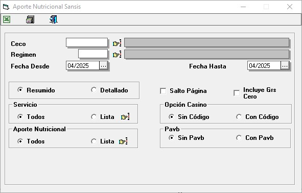
*F**ormula**rio: Aporte **Nutricional Sansis*

<u>**Descripción:**</u>

Esta pantalla genera un informe de aporte nutricional calculado a partir de las minutas planificadas de un casino, para un régimen y un período mensual determinado. El informe muestra, receta por receta y día por día, los gramos servidos, el peso bruto, el peso neto, peso neto nutricional y los valores de cada nutriente seleccionado (calorías, proteínas, lípidos, hidratos de carbono, ácidos grasos saturados y cualquier otro nutriente del catálogo). Permite evaluar si la planificación alimentaria de un período cumple con los aportes nutricionales esperados.
La pantalla se organiza en dos áreas principales: un panel de filtros en la parte superior donde el usuario define el casino, el régimen y el rango de fechas; y una zona de opciones que permite controlar qué servicios y qué nutrientes incluir en el informe, así como si el resultado se presenta de forma resumida (una línea por receta y día) o detallada (con el desglose de cada ingrediente que compone cada receta). Adicionalmente, la pantalla incluye un acceso al historial de minutas planificadas para facilitar la navegación entre períodos.
El informe consolida datos de un único casino a la vez. La selección de servicios puede ser global (todos los que tienen minuta en el período) o manual (eligiendo servicios específicos desde una lista). De igual forma, la selección de nutrientes puede incluir todo el catálogo activo o solo los que el usuario marque. El resultado siempre se entrega como un archivo Excel que el usuario puede guardar y analizar libremente.

| **Campo** | **Descripción** | **Obligatorio** |
| --- | --- | --- |
| Ceco | Código del casino. Se puede escribir directamente o buscar mediante el selector de clientes que se abre con el ícono de búsqueda contiguo. Al ingresar un código válido, el sistema muestra automáticamente el nombre del casino en el campo de ayuda. | Sí |
| Regimen | Código numérico del régimen alimentario del casino. Se puede escribir o seleccionar mediante el selector de regímenes. Al ingresar un régimen válido, el sistema muestra su nombre en el campo de ayuda. | Sí |
| Fecha Desde | Mes y año de inicio del período a consultar, en formato mm/aaaa. El sistema inicializa este campo con el mes y año actual. | Sí |
| Fecha Hasta | Mes y año de término del período a consultar, en formato mm/aaaa. El sistema inicializa este campo con el mes y año actual. | Sí |
| Nivel de detalle | Indica si el informe muestra solo el resumen por receta ("Resumido") o también el desglose de cada ingrediente ("Detallado"). Por defecto está seleccionado "Resumido". | Sí |
| Servicio | Define si se incluyen todos los servicios con minuta en el período ("Todos") o solo los que el usuario marque en la lista de servicios ("Lista"). Por defecto está seleccionado "Todos". | Sí |
| Aporte Nutricional | Define si se incluyen todos los nutrientes del catálogo ("Todos") o solo los que el usuario marque en la lista de nutrientes ("Lista"). Por defecto está seleccionado "Todos". | Sí |
| Opción Casino | Controla si el encabezado del informe muestra solo el nombre del casino o también su código. Las opciones son "Sin Código" (por defecto) y "Con Código". | No |
| Pavb | Controla si el informe incluye columnas de Proteína de Alto Valor Biológico (PAVB y PAVB%). Las opciones son "Sin Pavb" (por defecto) y "Con Pavb". | No |
| Incluye Grs Cero | Casilla que, al estar marcada, incluye en el informe los ingredientes cuyo porcentaje nutricional es cero. Por defecto no está marcada (se excluyen los ingredientes con peso neto cero). | No |
| Salto Página | Casilla de salto de página. Presente en la pantalla, pero sin efecto visible documentado en la generación Excel. | No |

Una vez ingresados el centro de costo, el régimen y el período, la pantalla carga automáticamente la lista de servicios con minuta registrada en ese período, sin necesidad de que el usuario realice ninguna acción adicional.
Al abrir el formulario, el sistema también carga automáticamente el catálogo completo de nutrientes activos y preselecciona como marcados aquellos definidos como prioritarios en el catálogo (campo nut_indpri > 0).

<u>**Reglas de Negocio:**</u>

| **#** | **Cuando aparece** | **Qué verifica el sistema** | **Qué ve o experimenta el usuario** |
| --- | --- | --- | --- |
| 1 | Al abrir la pantalla | Existencia del catálogo de nutrientes activos | Si no existe ningún nutriente registrado, aparece el mensaje "No existe maestros nutrientes" y la pantalla se cierra automáticamente. |
| 2 | Al presionar "Exportar Excel" | Que el campo de casino tenga un casino válido ingresado | Si el nombre del casino está vacío, aparece el mensaje "Debe registrar centro costo..." y no se genera el archivo. |
| 3 | Al presionar "Exportar Excel" | Que el campo de régimen tenga un régimen válido ingresado | Si el nombre del régimen está vacío, aparece el mensaje "Debe registrar régimen..." y no se genera el archivo. |
| 4 | Al presionar "Exportar Excel" | Que ambos campos de fecha estén completos | Si alguna fecha está vacía, aparece el mensaje "Unas de las fechas esta nula..." y no se genera el archivo. |
| 5 | Al presionar "Exportar Excel" | Que la fecha de inicio sea menor o igual a la fecha de término | Si "Fecha Desde" es posterior a "Fecha Hasta", aparece el mensaje "Fecha Origen No Puede Ser Mayor Que Fecha Destino" y no se genera el archivo. |
| 6 | Al presionar "Exportar Excel" | Que el rango de fechas no supere 98 días | Si el rango supera los 98 días (equivalente a 14 semanas), aparece el mensaje "Sobre pasa los 98 días corresponde a 14 semana" y no se genera el archivo. |
| 7 | Al presionar "Exportar Excel" | Que el rango de fechas no supere 3 meses | Si el rango abarca más de 3 meses, aparece el mensaje "Rango De Fecha No Puede Ser Mayor a 3 Meses" y no se genera el archivo. |
| 8 | Al presionar "Exportar Excel" | Que al menos un servicio esté seleccionado en la lista | Si ningún servicio está marcado (y la opción es "Lista"), aparece el mensaje "Seleccione Opción Dentro Grilla" y no se genera el archivo. |
| 9 | Al presionar "Exportar Excel" | Que al menos un nutriente esté seleccionado | Si ningún nutriente está marcado, aparece el mensaje "Debe Seleccionar A lo Menos Un Aporte Nutricional" y no se genera el archivo. |
| 10 | Al intentar abrir el selector de nutrientes | Que el casino y el régimen estén ingresados | Si el campo de casino o el campo de régimen están vacíos, el selector de nutrientes no se abre. |
| 11 | Al presionar "Histórico Planificación Teórica" | Que el casino tenga minutas registradas | Si el casino no tiene minutas, aparece el mensaje "No existe centro costo planificado" y no se abre el historial. |

<u>**Cálculo — Cantidad (gramaje con reemplazo)**</u>
CECO + régimen + receta + ingrediente original (tabla de gramaje por CECO)
CECO + régimen + tipo de plato + ingrediente original (tabla de gramaje por nivel)
CECO + régimen + ingrediente original (sin tipo de plato)
CECO + ingrediente original (sin régimen ni tipo de plato)

<u>**Cálculo — G/V Servir (canservida)**</u>
G/V Servir = (red_pctapr / 100) × red_canpro × (red_pctcoc / 100)
Componente:
red_canpro: Cantidad en gramos del ingrediente según la receta base (por porción base)
red_pctapr: Porcentaje de aprovechamiento del ingrediente (merma por limpieza/preparación)
red_pctcoc: Porcentaje de cocción del ingrediente (merma por cocción)

<u>**Cálculo — Bruta (WsNumPorcion)**</u>
Bruta = red_canpro / rec_basrac
Componente:
red_canpro: Cantidad en gramos del ingrediente según la receta para el total de porciones base
rec_basrac: Número de raciones base para el que está diseñada la receta

<u>**Cálculo — G/V Neto (pneto)**</u>
G/V Neto = ((red_pctnut / 100) × red_canpro)
> Comentario - Paz Jorge (2026-04-01): Debe cambiar la formula:G/V Neto = ((red_pctapr / 100) × red_canpro)
Componente:
red_pctnut: Porcentaje nutricional del ingrediente
red_canpro: Cantidad en gramos del ingrediente según la receta

<u>**Cálculo — G/V Neto Nut (pnetoApr)**</u>
G/V Neto Nut = ((red_pctapr / 100) × red_canpro)
> Comentario - Paz Jorge (2026-04-01): Debe cambiar la formula:G/V Neto Nut = ((red_pctnut / 100) × red_canpro)
Componente:
red_pctapr: Porcentaje de aprovechamiento del ingrediente
red_canpro: Cantidad en gramos del ingrediente según la receta
Nota: los Porcentaje aprovechamiento, cocción y aprovechamiento nutricional se extraen del maestro ingrediente.
<u>**Cálculo — Valor de cada nutriente seleccionado**</u>
Aporte Nutriente = (Porcentaje Nutricional / 100) × (pnu_canapo × WsNumPorcion) / ing_facnut
Componente:
Porcentaje Nutricional (red_pctnut): Proporción del ingrediente que se considera nutritivamente aprovechable
pnu_canapo: Cantidad del nutriente por unidad de referencia del ingrediente (según las tablas de composición nutricional)
WsNumPorcion: Gramos brutos del ingrediente por porción individual (= red_canpro / rec_basrac)
ing_facnut: Factor de conversión nutricional del ingrediente (base de referencia de la tabla nutricional, normalmente 100 g)

<u>**Cálculo — Porcentajes calóricos (P%, G%, Cho%, AGS)**</u>
P%   = (Proteínas_totales × 4 / Calorías_totales) × 100
G%   = (Lípidos_totales × 9 / Calorías_totales) × 100
Cho% = (Hidratos_totales × 4 / Calorías_totales) × 100
AGS% = (AcGrSat_totales × 9 / Calorías_totales) × 100
Los factores 4 y 9 corresponden a las kilocalorías por gramo de cada macronutriente según los estándares nutricionales (proteínas y carbohidratos aportan 4 kcal/g; grasas aportan 9 kcal/g). Estos porcentajes solo se calculan cuando el total de calorías es mayor que cero.

<u>**Cálculo — Pavb y Pavb%**</u>
Pavb   = suma de Proteínas de ingredientes con ing_indpav = 1
Pavb%  = (Pavb / Proteínas_totales) × 100

El indicador ing_indpav se encuentra en el maestro de ingredientes y marca aquellos que el catálogo considera fuente de proteína de alto valor biológico.

<u>**Formato de salida:**</u>
Al hacer clic en el icono Excel muestra: Una única hoja llamada "Aportes Sansis". El archivo se abre automáticamente en Excel al finalizar la generación; el usuario debe guardarlo manualmente en la carpeta que elija.
El encabezado del archivo (filas 1 a 6) contiene:
Fila 1: título "Aporte Nutricional Resumido" o "Aporte Nutricional Detallado" según la opción elegida.
Fila 3: nombre del casino (y su código si se eligió "Con Código").
Fila 4: nombre del régimen.
Fila 5: período consultado ("Correspondiente al periodo de: mm/aaaa Hasta mm/aaaa").
Los datos comienzan en la fila 7 y están organizados por bloques de fecha. Cada bloque de fecha muestra una cabecera con la fecha y debajo las filas por servicio. Dentro de cada servicio aparecen las recetas (y sus ingredientes en modo detallado). Al cerrar cada servicio se agrega una fila "Total" con los acumulados del servicio. Al cerrar cada fecha se agrega una fila "A. Nutricional del Día" con los acumulados diarios.
Las columnas fijas son: A (descripción), B (G/V Servir), C (Bruta), D (G/V Neto), E (G/V Neto Nut). A partir de la columna F se agregan dinámicamente una columna por cada nutriente seleccionado, y al final las columnas de porcentajes (P%, G%, Cho%, AGS o bien Pavb, Pavb%, P%, G%, Cho%, AGS% si se eligió "Con Pavb").

A continuación, una visualización de los informes.

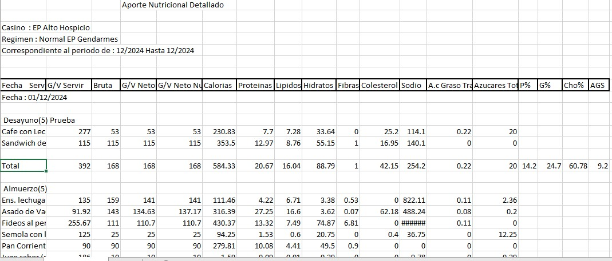
*Informe**:** **Aporte Nutricional Detallado.*

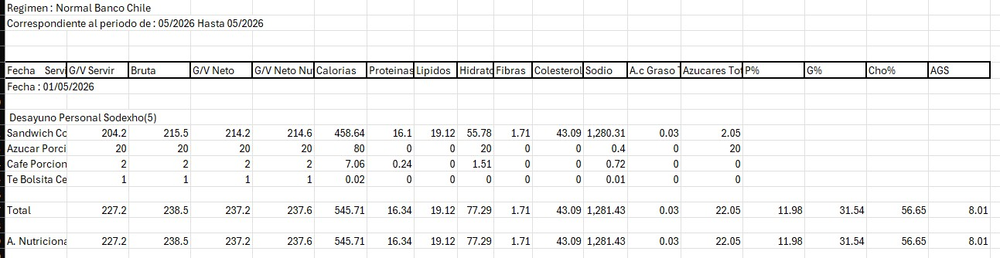
*Informe**:** Aporte Nutricional **Resumido**.*

<u>**Tablas Relacionadas:**</u>

| **Tabla** | **Para qué se usa** | **Campos clave** |
| --- | --- | --- |
| b_clientes | Catálogo de casinos. Se usa para validar el código ingresado y obtener el nombre del casino. | cli_codigo, cli_nombre, cli_tipo |
| a_regimen | Catálogo de regímenes alimentarios. Se usa para validar el régimen y obtener su nombre. | reg_codigo, reg_nombre, reg_indppr |
| a_nutriente | Catálogo de nutrientes activos. Se usa al abrir la pantalla para cargar la lista de nutrientes disponibles y sus indicadores de prioridad. | nut_codigo, nut_nombre, nut_indpri, nut_activo, nut_secnro |
| cas_b_minuta | Minutas planificadas por casino. Es la fuente principal de datos: define qué recetas se planificaron en qué fecha y para qué servicio. | min_cecori, min_codreg, min_codigo, min_codser, min_fecmin |
| cas_b_minutadet | Detalle de las líneas de cada minuta. Indica qué receta corresponde a cada línea y el número de raciones planificadas. | mid_cecori, mid_codigo, mid_codrec, mid_numrac, mid_numlin, mid_tipmin |
| b_receta | Maestro de recetas. Aporta el nombre de la receta, su base de raciones y si es de tipo plato. | rec_codigo, rec_nombre, rec_basrac, rec_canser, rec_tippla |
| b_recetadet | Ingredientes que componen cada receta, con sus gramos y porcentajes de merma. | red_codigo, red_codpro, red_canpro, red_pctapr, red_pctcoc, red_pctnut |
| b_ingrediente | Maestro de ingredientes. Aporta el nombre, el factor nutricional de referencia, los porcentajes de merma y el indicador de proteína de alto valor biológico. | ing_codigo, ing_nombre, ing_facnut, ing_pctnut, ing_pctapr, ing_pctcoc, ing_indpav, ing_activo |
| b_productonut | Tabla de composición nutricional por ingrediente y nutriente. Registra qué cantidad de cada nutriente aporta el ingrediente por unidad de referencia. | pnu_codpro, pnu_codapo, pnu_canapo |
| a_servicio | Catálogo de servicios (almuerzo, cena, colación, etc.). Se usa para obtener el nombre del servicio. | ser_codigo, ser_nombre, ser_posicion |
| b_tablagramajececo | Tabla de gramajes personalizados por casino y régimen. Permite que un casino use cantidades o ingredientes distintos a los de la receta base. Se aplica automáticamente durante el cálculo. | tgc_ceco, tgc_codreg, tgc_codrec, tgc_coding, tgc_codins, tgc_cantgr |

## 8.2. Composición Minuta Sansis (E_ComposicionMinutasSansis.frm)

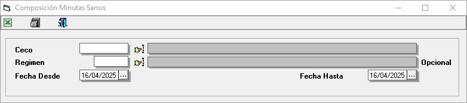
*Formulario: **Composición Minutas Sansis*

<u>**Descripción:**</u>
Esta pantalla permite exportar a Excel el detalle completo de ingredientes que componen las recetas incluidas en la minuta planificada de un casino, para un período de fechas determinado. El resultado muestra, por cada línea de la minuta y cada receta, qué ingredientes se utilizan, en qué cantidad por ración, a qué precio unitario según el convenio de compras vigente, y cuántas unidades de producto (en formato de compra) se requerirán considerando las raciones planificadas.
La pantalla está organizada en un único panel de filtros con tres datos a completar: el código del casino (CECO), el régimen alimenticio (opcional) y el rango de fechas. Además del botón de exportación, dispone de una acción auxiliar que permite consultar el histórico de planificación del casino para seleccionar rápidamente un período ya planificado, lo que facilita pre-completar las fechas y el régimen sin necesidad de ingresarlos manualmente.
Este formulario no consolida datos de múltiples casinos en una sola ejecución: la consulta siempre corresponde a un único CECO. Si el régimen se deja en blanco, el sistema entrega los ingredientes de todos los regímenes planificados para ese casino en el período indicado.

| **Campo** | **Descripción** | **Obligatorio** |
| --- | --- | --- |
| Ceco | Código del casino (centro de costo). Se puede escribir directamente o buscar usando el ícono de lupa, que abre un selector de casinos activos de tipo servicio de alimentación y con tipo de minuta Sansis (tipos 3 o 4). Al ingresar el código, el sistema muestra automáticamente el nombre del casino en el campo de ayuda adyacente. | Sí |
| Regimen | Número del régimen alimenticio. Se puede ingresar directamente o buscar con el ícono de lupa correspondiente, que abre un selector de regímenes. Al ingresar el número, el sistema muestra el nombre del régimen en el campo de ayuda. Si se deja vacío, el informe incluye todos los regímenes planificados para el casino. | No |
| Fecha Desde | Fecha de inicio del período a consultar, en formato dd/mm/aaaa. Al abrir el formulario se inicializa con la fecha del día. | Sí |
| Fecha Hasta | Fecha de término del período a consultar, en formato dd/mm/aaaa. Al abrir el formulario se inicializa con la fecha del día. | Sí |

<u>**Reglas de Negocio:**</u>

| **#** | **Cuando aparece** | **Qué verifica el sistema** | **Qué ve o experimenta el usuario** |
| --- | --- | --- | --- |
| 1 | Al hacer clic en Histórico Planificación | Que el casino ingresado tenga al menos una minuta en la tabla de minutas planificadas | Si no tiene planificación: "No existe ceco planificado" |
| 2 | Al hacer clic en Exportar Excel | Que el campo de nombre del casino no esté vacío (es decir, que se haya ingresado y validado un CECO) | Si el CECO no está registrado: "Debe registrar ceco..." |
| 3 | Al hacer clic en Exportar Excel | Que los campos Fecha Desde y Fecha Hasta tengan un valor ingresado | Si alguna fecha está vacía: "Unas de las fecha esta nula..." |
| 4 | Al hacer clic en Exportar Excel | Que la Fecha Desde no sea posterior a la Fecha Hasta | Si el rango es inválido: "Fecha Origen No Puede Ser Mayor Que Fecha Destino" |
| 5 | Después de consultar la base de datos | Que el número de filas del resultado no supere el límite de Excel (1.020.000 filas) | Si se supera: "El resultado sobrepasa maximo de fila en excel, Debera seleccionar menos Ceco". El usuario debe acotar el período o el régimen. |
| 6 | En el cuadro de guardado de archivo | Que el usuario proporcione un nombre de archivo y no cancele el diálogo | Si cancela: "Proceso cancelado". Si no escribe nombre: "Debe seleccionar la ruta y nombre de archivo" |
| 7 | En el cuadro de guardado de archivo | Que la extensión del archivo sea .xls o .xlsx | Si la extensión es otra: "La extensión del archivo debe ser (*.xls,*.xlsx)" |
| 8 | Al ingresar el CECO manualmente | Que el casino sea de tipo servicio de alimentación (tipo 1), esté activo y tenga tipo de minuta Sansis (3 o 4) | Si no cumple las condiciones, el campo de nombre queda vacío y el sistema no lo reconoce como válido |

<u>**Cálculo — Cantidad (gramaje con reemplazo)**</u>
CECO + régimen + receta + ingrediente original (tabla de gramaje por CECO)
CECO + régimen + tipo de plato + ingrediente original (tabla de gramaje por nivel)
CECO + régimen + ingrediente original (sin tipo de plato)
CECO + ingrediente original (sin régimen ni tipo de plato)
Si ningún nivel coincide, se usa el gramaje original de la receta.
Componente:
Gramaje original: Cantidad del ingrediente según la definición de la receta
Ingrediente/gramaje de reemplazo: Cantidad alternativa configurada para el casino

<u>**Cálculo — Precio**</u>
El cálculo varía según si el casino es un sitio de operación real (tipo CECO = 0) o un sitio de propuesta (tipo CECO = 1): en el caso de propuesta, el precio más alto disponible tiene preferencia.
Componente:
Precio del convenio: Precio unitario negociado con el proveedor
Orden de preferencia: Jerarquía que determina cuál precio usar cuando hay múltiples precios vigentes
Precio vigente más reciente: Precio del último convenio disponible si no hay vigencia exacta

<u>**Cálculo — Unidad Ing. (unidades totales del ingrediente)**</u>
Unidad Ing. = Cantidad × Raciones
Componente:
Cantidad: Gramaje por ración (con reemplazo si aplica)
Raciones: Número de raciones planificadas en esa línea de minuta

<u>**Cálculo — Unidad Producto. (unidades en formato de compra)**</u>
Unidad Producto. = (Cantidad × Raciones) / Facing del producto
Componente:
Cantidad × Raciones: Total de unidades del ingrediente (ver cálculo anterior)
Facing: Cantidad de ingrediente que contiene una unidad de compra del producto

<u>**Formato de salida:**</u>
Al hacer clic en el icono Excel muestra: Una única hoja llamada "Hoja1". El usuario elige el nombre y la carpeta del archivo a través del cuadro de diálogo de guardado. El archivo se abre automáticamente en modo lectura al finalizar la exportación.
Estructura de la hoja:
**Fila 1:** título "Composición Minutas"
**Fila 2:** "Casino" | nombre y código del casino seleccionado
**Fila 3:** "Regimen" | nombre y código del régimen, o "Todos" si no se especificó
**Fila 4:** "Periodo" | rango de fechas seleccionado
**Fila 6:** encabezados de columna (nombres de campos del resultado)
**Fila 7 en adelante:** datos del informe, un registro por ingrediente por receta por día de minuta
Las columnas se ajustan automáticamente al ancho del contenido. Los datos se ordenan por fecha, régimen, servicio (orden y código), y línea de minuta.

A continuación, una visualización del informe.

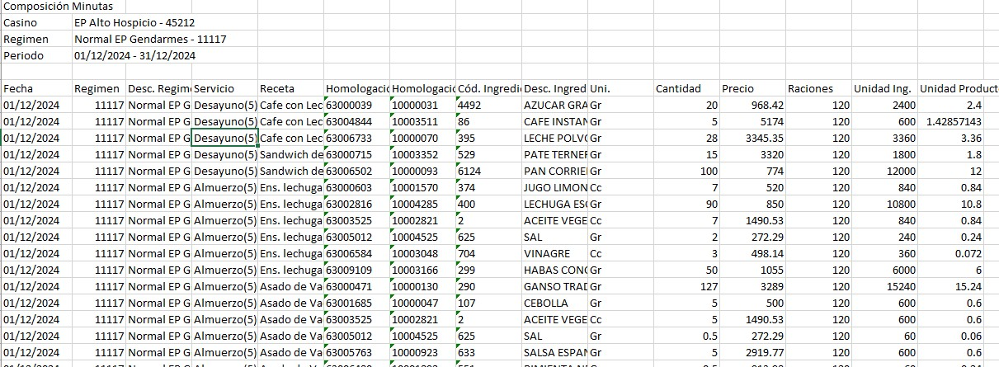
*Informe**:** *Composición Minutas*.*

<u>**Tablas Relacionadas:**</u>

| **Tabla** | **Para qué se usa** | **Campos clave** |
| --- | --- | --- |
| cas_b_minuta | Cabecera de minutas planificadas por casino. Fuente principal para identificar qué recetas están planificadas en cada fecha. | min_cecori, min_fecmin, min_codigo, min_codreg, min_codser, ID_Bloque |
| cas_b_MinutaBloque | Define el bloque de planificación del casino, incluyendo el rango de fechas de vigencia de la minuta. | ID_Bloque, Ceco, FechaDesde, FechaHasta |
| cas_b_minutadet | Detalle de recetas por línea de minuta. Contiene el código de receta y las raciones planificadas por línea. | mid_cecori, mid_codigo, mid_codrec, mid_numrac, mid_numlin, mid_tipmin |
| b_receta | Maestro de recetas. Proporciona el nombre de la receta y su tipo de plato. | rec_codigo, rec_nombre, rec_tippla |
| b_recetadet | Detalle de ingredientes por receta con el gramaje original. | red_codigo, red_codpro, red_canpro |
| b_ingrediente | Maestro de ingredientes. Proporciona el nombre, unidad de medida y porcentajes de aprovechamiento. | ing_codigo, ing_nombre, ing_unimed |
| a_regimen | Catálogo de regímenes alimenticios. Proporciona el nombre del régimen. | reg_codigo, reg_nombre, reg_indppr |
| a_servicio | Catálogo de servicios (tiempos de comida). Proporciona el nombre y orden del servicio. | ser_codigo, ser_nombre, ser_orden |
| a_unidadmed | Catálogo de unidades de medida. Proporciona la abreviatura de la unidad del ingrediente. | unm_codigo, unm_nomcor |
| b_clientes | Maestro de casinos (centros de costo). Permite validar el casino y determinar su tipo (sitio real o sitio propuesta) para aplicar la lógica de precios correspondiente. | cli_codigo, cli_nombre, cli_tipo, cli_activo, cli_tipominuta, cli_tipoformatocompras, cli_tipoceco |
| b_tablagramajececo | Tabla de sustitución de ingredientes a nivel de CECO + régimen + receta (nivel 1 de reemplazo). | tgc_ceco, tgc_codreg, tgc_codrec, tgc_coding, tgc_codins, tgc_cantgr |
| b_tablagramajececo_nivel | Tabla de sustitución de ingredientes por niveles 2, 3 y 4 (combinaciones de CECO, régimen, tipo de plato e ingrediente). | IdCeco, IdRegimen, IdTipoPlato, IdIngredienteOrigen, IdIngredienteCambio, CantidadBruta, Activo |
| b_precio_ingrediente | Precios de ingredientes por convenio SAP, con rango de fechas de vigencia. | Ceco, Ingrediente, Valido_Desde, Valido_Hasta, Precio, Proveedor, Codigo_Material, Id_OrgCompra |
| I_CONVENIO_SAP | Tabla de integración con los convenios de compra SAP. Relaciona material, proveedor y organización de compra. | ID_ORGCOMPRA, ID_MATERIAL, ID_PROVEEDOR, CONDICIONES, BORRADO |
| b_formatocompras_sap | Catálogo de formatos de compra SAP con la descripción del material. | fcs_CodMaterial, fcs_DenMaterial, fcs_tipoformatocompras |
| b_formatocompras_sap_sgp | Homologación entre códigos de material SAP y códigos de producto SGP. | fss_CodMaterial, fss_CodSgp |
| b_formatocompras_sap_siges | Homologación entre códigos de material SAP y códigos de material SIGES (sistema de Gendarmería/Justicia). | fcs_CodMaterial, fcs_CodMaterial_siges |
| b_productos | Maestro de productos SGP. Proporciona el facing (contenido por unidad de compra). | pro_codigo, pro_facing |
| b_Pedido_ExcepcionFormatoCompra | Excepciones al formato de compra por proveedor, casino e ingrediente, con rango de fechas de vigencia. Afecta la prioridad con que se selecciona el precio del convenio. | proveedor, cencos, ing_codigo, fcs_CodMaterial, Fecha_inicio, Fecha_Termino |
| b_tipominuta | Catálogo de tipos de minuta. Usado para validar que el casino tenga un tipo de minuta Sansis activo. | tip_codigo, Activo |

Mejoras:
Posibilidad de bajar por Organización Compras (Zona). Y que despliegue los centros de costo asociados, que esta opción tenga la posibilidad de seleccionar más de un sitio.

## 8.3. Consumo Ingrediente Minuta Bloque (C_ConIngMinBlo.frm)

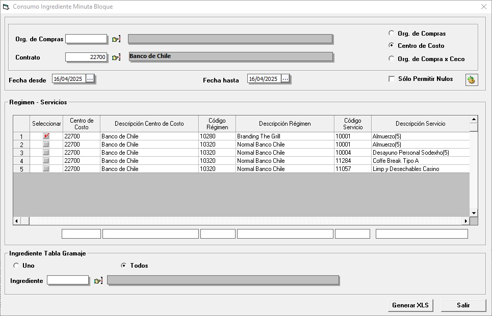
*Formulario: **Consumo Ingrediente Minuta Bloque*

<u>**Descripción:**</u>
Esta pantalla genera un archivo Excel con el detalle de los ingredientes que se consumen en las minutas de tipo bloque de uno o varios casinos durante un período seleccionado. Para cada ingrediente muestra la cantidad bruta que aparece en la receta, el número de raciones planificadas, la cantidad a comprar según el formato de convenio vigente, el proveedor negociado y el último precio pactado.
La pantalla ofrece dos modos de consulta. En el modo **Centro de Costo** el usuario selecciona un casino específico y luego elige qué combinaciones de régimen y servicio incluir en el informe; el resultado entrega el consumo desglosado por fecha de minuta, régimen y servicio. En el modo **Organización de Compras****(Zona)** el usuario selecciona una organización de compras SAP y obtiene el consumo consolidado de todos los casinos que pertenecen a esa organización, sin desagregación por régimen ni servicio.
Visualmente la pantalla se organiza en tres zonas: un panel superior con los parámetros de búsqueda (modo de consulta, entidad de referencia y rango de fechas), una grilla intermedia donde el sistema carga las combinaciones de régimen y servicio disponibles para el período indicado (solo activa en los modos Centro de Costo y Organización de Compras por CECO), y un panel inferior con el filtro opcional por ingrediente de tabla de gramaje. Los botones **Generar XLS** y **Salir** se ubican en la parte inferior del formulario.

| **Campo** | **Descripción** | **Obligatorio** |
| --- | --- | --- |
| Modo de consulta | Selector con tres opciones: Org. de Compras, Centro de Costo u Org. de Compra x Ceco. Determina qué campo de entidad se habilita y qué procedimiento se ejecuta. | Sí |
| Org. de Compras | Código de la organización de compras SAP. Se habilita cuando el modo es "Org. de Compras" o "Org. de Compra x Ceco". Admite búsqueda mediante un selector auxiliar de organizaciones de compra. | Condicional |
| Contrato (CECO) | Código del centro de costo (casino). Se habilita cuando el modo es "Centro de Costo". El sistema muestra automáticamente el nombre del casino al escribir el código. Admite búsqueda mediante un selector auxiliar de clientes. Solo acepta casinos de tipo Simap. | Condicional |
| Fecha desde | Fecha de inicio del período a consultar. El sistema inicializa este campo con la fecha del día al abrir el formulario. | Sí |
| Fecha hasta | Fecha de fin del período a consultar. El sistema inicializa este campo con la fecha del día al abrir el formulario. | Sí |
| Ingrediente tabla gramaje — Uno / Todos | Selector que indica si el informe filtra por un ingrediente específico de la tabla de gramaje o incluye todos. Por defecto está en "Todos". | Sí |
| Ingrediente (código) | Código del ingrediente a filtrar. Solo se habilita cuando se selecciona "Uno". Admite búsqueda mediante un selector auxiliar de ingredientes. Solo acepta ingredientes activos marcados como referencia de gramaje (ing_indppr = 1). | Condicional |
| Solo Permitir Nulos | Casilla de verificación. Cuando está marcada, el informe muestra únicamente los ingredientes que no tienen proveedor negociado o cuyo convenio de precio no cubre el período de la minuta. | No |

El botón de proceso de la barra superior (ícono de carga) es necesario para poblar la grilla de régimen-servicios antes de generar el Excel cuando se usa el modo Centro de Costo o el modo Organización de Compras por CECO. Sin ese paso previo el sistema rechaza la exportación.

<u>**Reglas de Negocio:**</u>

| **#** | **Cuando aparece** | **Qué verifica el sistema** | **Qué ve o experimenta el usuario** |
| --- | --- | --- | --- |
| 1 | Al presionar "Cargar Información" con modo Centro de Costo | Que el código de CECO ingresado exista en el catálogo de clientes y sea de tipo 0 | Mensaje: No existe ceco... |
| 2 | Al presionar "Cargar Información" o "Generar XLS" con modo Centro de Costo | Que el CECO sea de tipo minuta Simap (cli_tipominuta = 3) | Mensaje: Ceco debe ser Simap... |
| 3 | Al presionar "Generar XLS" con modo Centro de Costo | Que exista minuta bloque registrada para el CECO y el período indicado | Mensaje: No existe Minuta... |
| 4 | Al presionar "Generar XLS" con modo Centro de Costo | Que al menos una fila de la grilla de régimen-servicios esté marcada | Mensaje: Regimen debe ser informado de la lista |
| 5 | Al presionar "Generar XLS" con modo Centro de Costo y grilla vacía | Que la grilla haya sido cargada previamente con el botón de proceso | Mensaje: Para la visualizar lista de regimen, debe seleccionar icono de proceso |
| 6 | Al presionar "Generar XLS" con modo Org. de Compras | Que el código de organización de compras exista en la tabla i_org_ceco y no esté borrado | Mensaje: No existe organización de compras... |
| 7 | Al presionar "Generar XLS" con modo Org. de Compra x Ceco | Que al menos una fila de la grilla esté marcada | Mensaje: Debe haber selecionado al menos un dato de la grilla. |
| 8 | Al presionar "Generar XLS" (todos los modos) | Que Fecha desde no sea posterior a Fecha hasta | Mensaje: Fecha Desde No Puede Ser Mayor a Fecha Hasta. Restablece Fecha desde a la fecha actual. |
| 9 | Al presionar "Generar XLS" con ingrediente específico seleccionado | Que el código de ingrediente ingresado exista, esté activo y sea referencia de gramaje | Mensaje: No existe Ingrediente |
| 10 | Al evaluar el resultado de la consulta | Que el número de filas devuelto no supere 1.020.000 (límite de filas en Excel) | Mensaje: El resultado sobrepasa máximo de fila en Excel, Debe seleccionar menos datos. |
| 11 | Al finalizar sin datos | Que el resultado de la consulta no esté vacío | Mensaje: Proceso finalizado. (sin apertura del explorador) |

<u>**Cálculo — Consumo Ingrediente**</u>
El sistema obtiene el detalle de ingredientes de las recetas asociadas a las minutas bloque del período y las combinaciones régimen-servicio seleccionadas.
Si existe una regla de reemplazo de ingrediente en la tabla de gramaje por nivel (fn_ObtenerIngredienteReemplazoJerarquia), reemplaza el código de ingrediente y la cantidad antes de agrupar.
Agrupa por fecha, régimen, servicio e ingrediente y suma la cantidad bruta resultante.
Componente:
Cantidad bruta receta: Cantidad del ingrediente según la receta base
Reemplazo de ingrediente: Sustitución de ingrediente o cantidad según tabla de gramaje jerárquica del CECO

<u>**Cálculo — Cantidad Consumir**</u>
Cantidad Consumir = REDONDEAR( (Consumo Ingrediente × Raciones) / Facing del producto , 4 )
Componente:
Consumo Ingrediente: Cantidad bruta del ingrediente por ración (sumada para el grupo)
Raciones: Número de raciones planificadas para la fecha, régimen y servicio
Facing del producto: Factor de conversión al formato de compra (unidades por envase o caja)

<u>**Cálculo — Formato Compra**</u>
> Comentario - Paz Jorge (2026-04-01): No considerar
Valor en convenio:
1: GR (granel)
2: CH (chico)
3: ST (stock)
Otro o sin convenio: S/F

<u>**Formato de salida:**</u>
Al hacer clic en el icono Excel muestra: Una única hoja (Hoja1). El usuario no elige la ruta: el archivo se guarda automáticamente en la subcarpeta ExcelMinutaSGP dentro del directorio de trabajo del sistema. El nombre del archivo tiene el patrón FiltroIngrediente <CECO> <fecha>-<hora>.xlsx. El encabezado ocupa las filas 1 a 5: fila 1 con el título "Consumo Ingrediente Minuta Bloque" (celdas A1 a E1 combinadas), fila 3 con el rótulo "Centro de Costo:" y su valor, fila 4 con el rótulo "Periodo:" y el rango de fechas. Los nombres de columna se escriben en la fila 6 directamente desde los nombres de campo del resultado de la consulta. Los datos comienzan en la fila 7. Las columnas se ajustan automáticamente al contenido.

A continuación, una visualización del informe.

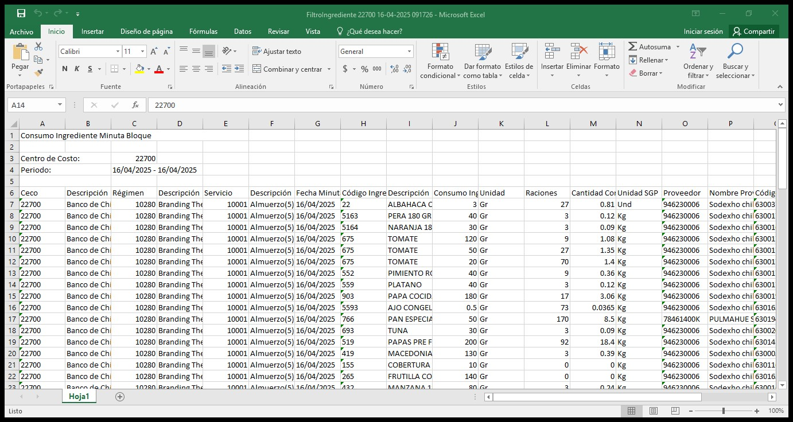
*Informe: **Consumo de Ingredientes**.*

<u>**Tablas Relacionadas:**</u>

| **Tabla** | **Para qué se usa** | **Campos clave** |
| --- | --- | --- |
| Código Ingrediente | Código del ingrediente según catálogo | No |
| Descripción (ingrediente) | Nombre del ingrediente | No |
| Unidad | Unidad de medida del ingrediente | No |
| Consumo | Cantidad total consumida sumada para todos los casinos, fechas y servicios del período | Sí |
| Proveedor | Código del proveedor negociado en el convenio SAP | No |
| Código Material SAP | Código de material SAP del producto | No |
| Descripción (material) | Descripción del material SAP | No |
| Ult. Precio Neg. | Último precio unitario negociado (redondeado a 2 decimales) | No |
| Fecha Vig. | Fecha hasta la cual es válido el convenio de precio (vacío si no hay formato registrado) | No |
| Formato Compra | Tipo de formato de compra: GR, CH, ST o S/F | Sí |

Mejoras:
Que considere la excepción de formato de compras y que las columnas descripción tenga en nombre del detalle del dato. Ejemplo “Regimen| Descripción Regimen”

## 8.4. Costo Merma Sitio (E_CostoMermaSitio.frm)

> Comentario - Paz Jorge (2026-04-07): Cambiar nombre a Merma Producción y Desconche

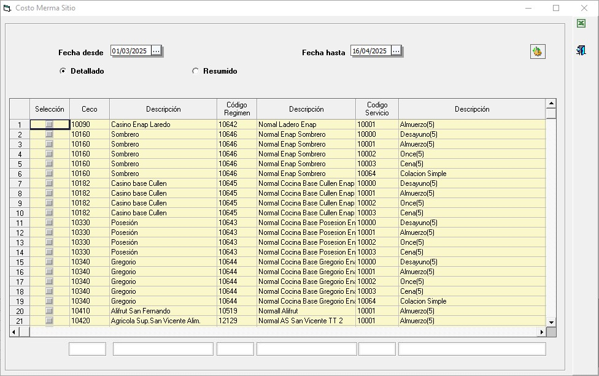
*Formulario: **Costo Merma Sitio*

<u>**Descripción:**</u>
Esta pantalla permite consultar el costo económico de las mermas de desconche registradas en uno o varios sitios (casinos) durante un rango de fechas determinado. Para cada combinación de sitio, régimen y servicio, el sistema calcula cuántos kilogramos se perdieron en cada tipo de desconche —General, de Pan y de Producción— y los multiplica por el costo unitario vigente para ese segmento y período, entregando el costo total resultante.
La pantalla se organiza en dos etapas visuales. En la primera, el usuario ingresa el rango de fechas y hace clic en el botón de carga para obtener en la grilla central la lista de combinaciones sitio-régimen-servicio que registraron mermas en ese período. En la segunda etapa, el usuario selecciona de esa grilla los registros que desea incluir en el informe, elige la modalidad (Detallado o Resumido) y exporta el resultado a un archivo Excel.
El formulario opera exclusivamente sobre datos ya registrados en el sistema; no permite ingresar ni modificar mermas. El botón de exportación a Excel solo está habilitado si el usuario tiene el permiso correspondiente asignado en su perfil.

| **Campo** | **Descripción** | **Obligatorio** |
| --- | --- | --- |
| Fecha desde | Fecha de inicio del período a consultar. Al abrir el formulario se inicializa con la fecha del día. | Sí |
| Fecha hasta | Fecha de fin del período a consultar. Al abrir el formulario se inicializa con la fecha del día. | Sí |
| Selección de sitios en la grilla | Luego de cargar los datos, el usuario debe marcar con un check al menos un sitio (fila) de la grilla para poder exportar. | Sí |
| Modalidad del informe | Opción entre Detallado (una fila por día y tipo de desconche) y Resumido (una fila por mes y tipo de desconche). El sistema selecciona Detallado por defecto al abrir el formulario. | Sí |

<u>**Reglas de Negocio:**</u>

| **#** | **Cuando aparece** | **Qué verifica el sistema** | **Qué ve o experimenta el usuario** |
| --- | --- | --- | --- |
| 1 | Al hacer clic en "Cargar Información" o en "Exportar Excel" | Que la fecha desde no sea posterior a la fecha hasta. | Mensaje: Fecha Desde No Puede Ser Mayor a Fecha Hasta. El campo de fecha desde se resetea a la fecha actual y recibe el foco. |
| 2 | Al hacer clic en "Cargar Información" o en "Exportar Excel" | Que la fecha hasta no sea anterior a la fecha desde. | Mensaje: Fecha Hasta No Puede Ser Mayor a Fecha Desde. El campo de fecha hasta se resetea a la fecha actual y recibe el foco. |
| 3 | Al hacer clic en "Cargar Información" o en "Exportar Excel" | Que el rango entre ambas fechas no supere los 12 meses (365 días). | Mensaje: Rango De Fecha No Puede Ser Mayor a 12 Meses. La grilla se limpia. |
| 4 | Al hacer clic en "Exportar Excel" | Que la grilla tenga al menos una fila cargada. | Mensaje: No existe datos selecionado en la grilla... |
| 5 | Al hacer clic en "Exportar Excel" | Que al menos una fila de la grilla esté marcada como seleccionada. | Mensaje: Debe haber a lo menos un dato seleccionado en la grilla... |
| 6 | Tras ejecutar la consulta de exportación | Que el resultado no supere 1.020.000 filas (límite de filas de Excel). | Mensaje: El resultado sobrepasa maximo de fila en excel, Debera seleccionar menos Ceco. El proceso se cancela; el usuario debe reducir la selección de sitios. |
| 7 | En el cuadro de diálogo de guardado | Que el usuario elija un nombre de archivo con extensión .xls o .xlsx. | Mensaje: La extensión del archivo debe ser (*.xls,*.xlsx). El proceso se cancela. |
| 8 | En el cuadro de diálogo de guardado | Que el usuario no haya cancelado sin elegir un archivo. | Mensaje: Proceso cancelado si se cierra el diálogo, o Debe seleccionar la ruta y nombre de archivo si el nombre queda vacío. |
| 9 | Al abrir el formulario | Que el perfil del usuario tenga el permiso de exportación a Excel. | El botón "Exportar Excel" aparece deshabilitado si el usuario no tiene el permiso correspondiente. |

<u>**Cálculo — Total Costo**</u>
Total Costo = Kilos × Costo
Componente:
Kilos: Kilogramos de merma registrados
Costo: Costo unitario por kg activo para el segmento y servicio

<u>**Formato de salida:**</u>
Al hacer clic en el icono Excel muestra: Excel. Una única hoja (Hoja1). La fila 1 contiene los encabezados de columna generados automáticamente desde el conjunto de resultados. Los datos comienzan en la fila 2. El usuario elige el nombre y la carpeta del archivo mediante cuadro de diálogo de guardado. Las columnas y filas se ajustan automáticamente al contenido (AutoFit). El archivo se abre automáticamente en modo solo lectura al terminar.
El módulo tiene 2 modos de impresión “Detallado” y “Resumido”.  A continuación, una visualización de los informes.
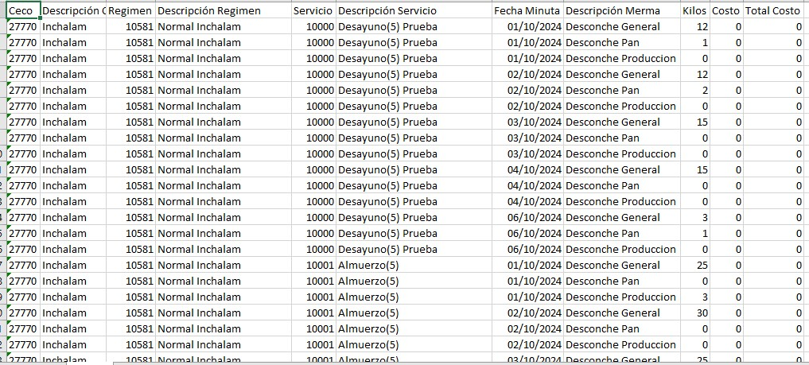
*Informe**:** **Costo **Merma Sitio **Detallado**.*

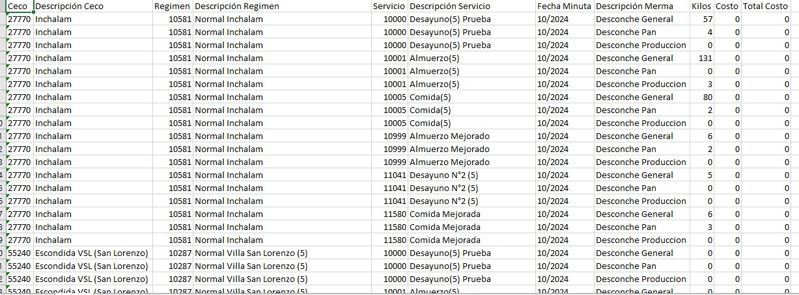
*Informe**:** **Costo Merma Sitio Resumido**.*

<u>**Tablas Relacionadas:**</u>

| **Tabla** | **Para qué se usa** | **Campos clave** |
| --- | --- | --- |
| cas_b_mermadesconche | Fuente principal. Contiene los registros de mermas de desconche por sitio, régimen, servicio y fecha. Solo se consultan registros con Considera_Merma = '0'. | IdCeco, IdRegimen, IdServicio, Fecha_Merma, Merma_Desconche, Merma_Pan, Merma_Produccion, Considera_Merma |
| b_CostoMermas | Catálogo de parámetros de costos de merma. Relaciona un segmento de cliente y un servicio con los costos unitarios (por kg) de cada tipo de desconche, dentro de un rango de vigencia. Solo se usan registros con Activo = '1'. | IdSegmento, IdServicio, Fecha_Desde, Fecha_Hasta, Costo_Desconche, Costo_Pan, Costo_Produccion, Activo |
| b_clientes | Catálogo de sitios (casinos). Se usa para obtener el nombre del CECO. Solo se consideran registros con cli_tipo = 0. | cli_codigo, cli_nombre, cli_tipo, cli_codseg |
| a_regimen | Catálogo de regímenes de alimentación. Se usa para obtener el nombre del régimen. | reg_codigo, reg_nombre |
| a_servicio | Catálogo de servicios (tipos de comida). Se usa para obtener el nombre del servicio. | ser_codigo, ser_nombre |

Mejoras:
La valorización de merma, producción y pan desde la información. **Si se considera este cálculo debería de no ir el mantenedor en la opción general**, su fórmula seria la siguiente:

| **Mermas Pan  $/Kg** |  |  |  |
| --- | --- | --- | --- |
|  |  |  |  |
| Promedio precio (PMP) Productos por Kilo de las familias |  |  |  |
| 199 | ALIMENTOS\PASTELERIA / PANADERIA / PASTAS\PANADERIA\FRESCO |  |  |
| 155 | ALIMENTOS\PASTELERIA / PANADERIA / PASTAS\PANADERIA\CONGELADO |  |  |
|  |  |  |  |
|  |  |  |  |
| **Merma Desconche $/Kg** |  |  |  |
|  |  |  |  |
| **Corporate  - Salud** | **Ejemplo** |  |  |
| (Costo Bandeja realizado mes - PMP Pan*0.075)/1.1 | $             1,482 | Volumen Bandeja Ponderado sin Pan:1.1 kg |  |
|  |  |  | Costo Pan en Bandeja $1775*0.075 = $130 |
| **E&R** |  |  | grs Promedio Pan 75 |
| (Costo Bandeja realizado mes - PMP Pan*0.075)/1.3 | $             2,550 | Volumen Bandeja Ponderado sin Pan:1.3 kg |  |
|  |  |  | Costo Pan en Bandeja $1775*0.075 = $130 |
| **Merma Producción $/Kg (Merma Desconche *0.05)** |  | grs Promedio Pan 75 |  |
|  |  |  |  |
| **Corporate  - Salud** |  |  |  |
| (Costo Bandeja realizado mes - PMP Pan*0.075)/1.1*0.05 | $                     74 | Merma Promedio ponderada en recetas 5% |  |
|  |  |  |  |
| **E&R** |  |  |  |
| (Costo Bandeja realizado mes - PMP Pan*0.075)/1.3*0.05 | $                  128 | Merma Promedio ponderada en recetas 5% |  |

## 8.5. Costos Minutas (I_CostoSansis.frm)

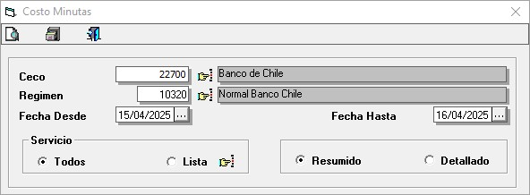
*Formulario: **Costo Minutas*

<u>**Descripción:**</u>
Esta pantalla permite consultar el costo económico de las minutas planificadas para un casino durante un rango de fechas. Para cada día del período seleccionado, el sistema toma las recetas que componen la minuta, suma el costo de cada ingrediente según el precio vigente, y entrega un valor de costo por servicio y por día.
La pantalla tiene dos modalidades de presentación. El modo **Resumido** muestra una tabla comparativa con una columna por servicio y una fila por día, de modo que el usuario puede ver rápidamente la evolución del costo diario en todos los servicios a la vez y obtener un total promedio al final. El modo **Detallado** recorre servicio por servicio, listando receta por receta con su costo individual, subtotales por servicio y un promedio del período.
Para definir el alcance del informe, la pantalla solicita el código del casino (CECO), el régimen y el rango de fechas. Una vez ingresados esos cuatro parámetros, el sistema carga automáticamente la lista de servicios con minuta planificada en ese período. El usuario puede optar por incluir todos los servicios o seleccionar una lista específica. El informe se genera como documento para visualización en vista previa, desde donde puede imprimirse. Si algún ingrediente de la minuta tiene precio cero o gramaje cero, el sistema agrega una página de advertencia al final del informe con los productos problemáticos.

| **Campo** | **Descripción** | **Obligatorio** |
| --- | --- | --- |
| Ceco | Código del casino cuyas minutas se consultarán. Se puede escribir directamente o buscarlo mediante el ícono de búsqueda, que abre un selector de clientes (sitios remotos activos). Al ingresar un código válido, el sistema muestra el nombre del casino junto al campo. | Sí |
| Regimen | Código numérico del régimen alimenticio para el cual se quiere ver el costo. Se puede escribir directamente o buscarlo con el ícono de búsqueda, que abre el selector de regímenes. Al ingresar un valor válido el sistema muestra el nombre del régimen. | Sí |
| Fecha Desde | Fecha de inicio del período a consultar, en formato dd/mm/aaaa. Al abrirse la pantalla queda inicializada con la fecha del día. | Sí |
| Fecha Hasta | Fecha de fin del período a consultar, en formato dd/mm/aaaa. Al abrirse la pantalla queda inicializada con la fecha del día. | Sí |
| Servicio — Todos / Lista | Indica si se incluyen todos los servicios o solo los marcados. Si se elige Todos, el sistema marca automáticamente todos los servicios antes de generar el informe. Si se elige Lista, el usuario debe marcar manualmente al menos un servicio en la grilla de servicios. | Sí |
| Nivel de detalle — Resumido / Detallado | Determina el formato del informe: una tabla comparativa por día y servicio (Resumido), o el detalle receta por receta dentro de cada servicio (Detallado). Por defecto queda seleccionado Resumido. | Sí |

Una vez que los cuatro parámetros obligatorios de filtro (CECO, Régimen, Fecha Desde, Fecha Hasta) están completos, el sistema carga automáticamente la grilla de servicios sin necesidad de presionar ningún botón.

<u>**Reglas de Negocio:**</u>

| **#** | **Cuando aparece** | **Qué verifica el sistema** | **Qué ve o experimenta el usuario** |
| --- | --- | --- | --- |
| 1 | Al intentar generar el informe | Que el campo CECO tenga un casino reconocido (nombre no vacío) | Mensaje: "Debe registrar ceco..." y el proceso se detiene. |
| 2 | Al intentar generar el informe | Que el campo Régimen tenga un régimen reconocido (nombre no vacío) | Mensaje: "Debe registrar regimen..." y el proceso se detiene. |
| 3 | Al intentar generar el informe | Que ambas fechas estén completas | Mensaje: "Unas de las fecha esta nula..." y el proceso se detiene. |
| 4 | Al intentar generar el informe | Que Fecha Desde no sea posterior a Fecha Hasta | Mensaje: "Fecha Origen No Puede Ser Mayor Que Fecha Destino" y el proceso se detiene. |
| 5 | Al intentar generar el informe | Que al menos un servicio esté marcado en la grilla (o que la opción "Todos" esté seleccionada) | Mensaje: "Servicio debe ser selecionado" y el proceso se detiene. |
| 6 | Al hacer clic en el botón de Histórico Planificación Teórica | Que el casino tenga al menos una minuta registrada en el sistema | Mensaje: "No existe ceco planificado" y el proceso se detiene. |
| 7 | Durante la generación del informe, al encontrar ingredientes con problema | Que todos los ingredientes de las recetas planificadas tengan precio mayor que cero y gramaje mayor que cero | Mensaje: "Existe producto valor cero. Ver Página : [N]" y se agrega una página de advertencia al documento con el código, descripción y tipo de error de cada producto problemático (Gramaje Cero o Precio Cero). |

<u>**Tablas Relacionadas:**</u>

| **Tabla** | **Para qué se usa** | **Campos clave** |
| --- | --- | --- |
| b_clientes | Catálogo de casinos (CECOs); se valida que el casino ingresado exista y esté activo | cli_codigo, cli_nombre, cli_activo, cli_tipo, cli_tipoceco |
| a_regimen | Catálogo de regímenes alimenticios; se valida el código ingresado y se obtiene el nombre | reg_codigo, reg_nombre, reg_indppr |
| cas_b_minuta | Cabecera de minutas planificadas; fuente principal de la consulta (período, CECO, régimen, servicio) | min_cecori, min_fecmin, min_codreg, min_codser, min_codigo, min_racteo |
| cas_b_minutadet | Detalle de recetas por día de minuta | mid_cecori, mid_codigo, mid_codrec, mid_numlin, mid_numrac |
| b_receta | Maestro de recetas; proporciona nombre y tipo de planificación | rec_codigo, rec_nombre, rec_tippla, rec_indppr, rec_fecvig, rec_LYD |
| b_recetadet | Detalle de ingredientes de cada receta con sus gramajes | red_codigo, red_codpro, red_canpro |
| b_ingrediente | Catálogo de ingredientes; provee el nombre de cada ingrediente | ing_codigo, ing_nombre, ing_indppr |
| b_productosing | Tabla de relación entre ingredientes y productos de compra | pri_coding, pri_codpro |
| b_productos | Catálogo de productos comerciales (unidades de compra) | pro_codigo, pro_nombre, pro_facing, pro_indppr, pro_fecven |
| b_precio_ingrediente | Precios de ingredientes por convenio SAP, con rangos de vigencia | Ingrediente, Valido_Desde, Valido_Hasta, Precio, Cod_Sgp, Ceco, Proveedor, Codigo_Material |
| I_CONVENIO_SAP | Convenios de compra vigentes; se usa para determinar el precio por convenio | ID_ORGCOMPRA, ID_MATERIAL, ID_PROVEEDOR, FECHA_INICIO_VALIDEZ, FECHA_FIN_VALIDEZ, CONDICIONES, BORRADO |
| b_formatocompras_sap | Formato de compras por material; se usa para priorizar el convenio aplicable | fcs_CodMaterial, fcs_tipoformatocompras |
| b_Pedido_ExcepcionFormatoCompra | Excepciones al formato de compras para ingredientes específicos por casino | cencos, ing_codigo, fcs_CodMaterial, proveedor, fecha_inicio, Fecha_Termino |
| a_servicio | Catálogo de servicios; proporciona nombre y posición para la grilla y el informe | ser_codigo, ser_nombre, Ser_Posicion |
| fn_ObtenerIngredienteReemplazoJerarquia | Función que resuelve reemplazos jerárquicos de ingredientes por CECO, régimen y tipo de planificación | Parámetros: @Ceco, @Regimen, @rec_codigo, @red_codpro, @rec_tippla |

### 8.5.1. Costo Minutas Resumido (I_CostoMinutaResumidosSansis)

<u>**Descripción:**</u>
Muestra una tabla donde cada columna corresponde a un servicio seleccionado y cada fila representa un día del período. La celda de intersección contiene el costo total de ese servicio en ese día. Al final aparece una fila de totales promedio por servicio y el gran total del período.
<u>**Reglas de Negocio:**</u>

<u>**Cálculo — Costo de servicio por día**</u>
Costo servicio-día = Σ (Gramaje del ingrediente en la receta × Precio unitario del ingrediente vigente en esa fecha)
Componente:
Gramaje del ingrediente: Cantidad bruta del ingrediente que indica la receta
Precio unitario del ingrediente: Precio vigente según la modalidad seleccionada del Convenio para la fecha del día

<u>**Cálculo — Total promedio**</u>
Promedio servicio = Costo total del período para el servicio ÷ Número de días planificados para ese servicio

El divisor es la cantidad de días en que ese servicio efectivamente tiene al menos una receta planificada en el período, no el total de días del rango.

<u>**Formato Salida:**</u>
Documento RTF. Orientación horizontal (paisaje). Una única tabla con todos los servicios. Encabezado: "Sodexho Chile S.A. | Costo Minutas Resumido | Fecha: [fecha actual]". Pie: número de página. Cabecera de datos con nombre del casino, régimen y rango de fechas. Si existen ingredientes con precio o gramaje cero, se agrega una nueva página con la tabla "Listado Producto Con Error" (columnas: Código, Descripción, Tipo Error).

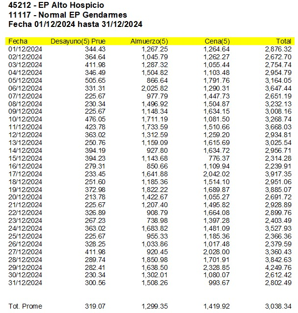
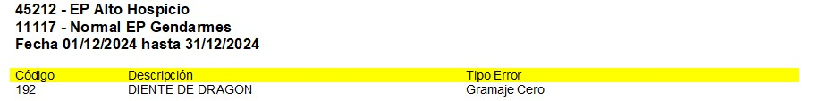
*Informe: **Costo Minutas Resumido*

### 8.5.2. Costo Minutas Detallado (I_CostoMinutaDetalladoSansis)

<u>**Descripción:**</u>
Muestra para cada servicio seleccionado, una tabla con tres columnas — Fecha, Nombre Receta y Costo — donde cada fila corresponde a una receta planificada. Al final de cada servicio se incluyen dos filas de resumen: Total Servicio (suma de costos del período) y Costo Promedio (total dividido por los días planificados). Si se seleccionaron varios servicios, cada uno ocupa su propia página.

<u>**Regla de Negocio:**</u>

<u>**Cálculo — Costo de receta**</u>
Costo receta = Σ (Gramaje del ingrediente × Precio unitario vigente en la fecha)
Componente:
Gramaje del ingrediente: Cantidad bruta indicada en la receta, campo Ing_Cost del resultado del SP
Precio unitario: Precio del producto en el período, según modalidad (Convenio, PMP o Lista)

<u>**Cálculo — Costo Promedio de servicio**</u>
Costo Promedio = TOTAL SERVICIO ÷ número de días con minuta planificada en el período.

Si no hay ningún día planificado (división por cero), el sistema muestra $0,00.

<u>**Formato Salida:**</u>

Documento RTF. Orientación vertical (retrato). Una sección por servicio seleccionado; cada sección inicia en página nueva. Encabezado: fecha de emisión a la derecha. Pie: número de página. Cabecera de datos con nombre del casino, régimen, nombre del servicio y rango de fechas. Tabla de datos con columnas Fecha | Nombre Receta | Costo. Si existen ingredientes con precio o gramaje cero, se agrega una nueva página con la tabla "Listado Producto Con Error" (columnas: Código, Descripción, Tipo Error) por cada servicio afectado.

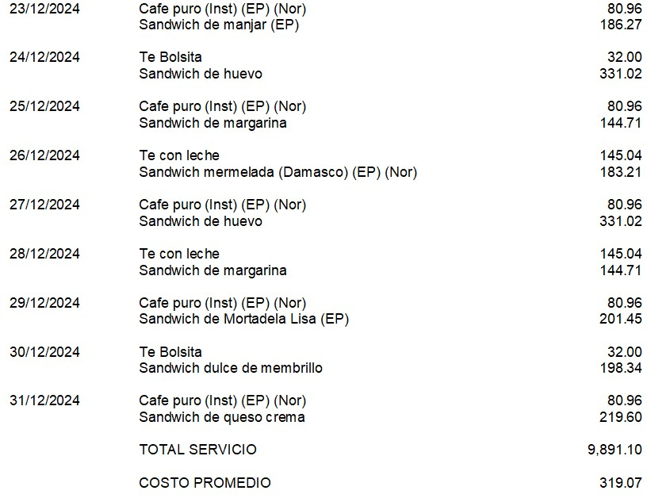
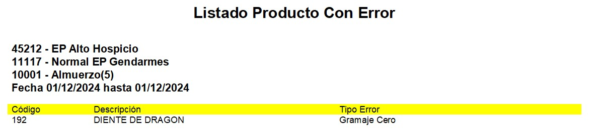
*Informe: **Costo Minutas **Detallado*

## 8.6. Costos Plan Teórico Real Realizado (I_CostoPlanTeoRealRealizado.frm)

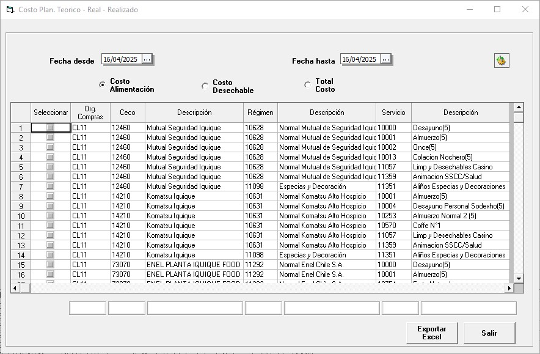
*Formulario: **Costo Planificado Teórico - Real - Realizado*

<u>**Descripción:**</u>
Esta pantalla permite obtener un informe comparativo de costos de alimentación para uno o varios servicios de casino (SGP LOCAL), contrastando tres dimensiones del costo en un mismo período: el **costo teórico** (calculado en base a la planificación de recetas), el **costo real** (según las raciones vendidas y el valor de los ingredientes al momento de producción) y el **costo realizado** (correspondiente al consumo efectivo registrado durante el cierre). El resultado se exporta como archivo Excel para su análisis fuera del sistema.
La pantalla se organiza en dos etapas claramente diferenciadas. En la primera, el usuario define un rango de fechas y carga la lista de servicios disponibles para ese período: aparece una grilla con las combinaciones de casino, régimen y servicio que tienen registros de costo en el rango indicado. En la segunda etapa, el usuario selecciona qué servicios incluir en el informe, elige el tipo de costo que desea analizar (alimentación, desechable o total) y ejecuta la exportación.
El formulario no genera ningún documento de vista previa: el resultado es directamente un archivo Excel (.xls o .xlsx) que el usuario guarda en la ruta que elija. El informe puede consolidar datos de múltiples casinos, regímenes y servicios simultáneamente, siempre que todos ellos sean seleccionados en la grilla antes de exportar.

| **Campo** | **Descripción** | **Obligatorio** |
| --- | --- | --- |
| Fecha desde | Fecha de inicio del período a analizar. El sistema inicializa automáticamente con la fecha del día al abrir el formulario. | Sí |
| Fecha hasta | Fecha de fin del período a analizar. El sistema inicializa automáticamente con la fecha del día al abrir el formulario. | Sí |
| Selección de servicios | Al menos un servicio debe ser marcado en la grilla de resultados. La grilla solo se llena después de usar el botón "Cargar Información". | Sí |
| Tipo de costo | Botón de opción que determina qué dimensión de costo se incluirá en el Excel. Valor por defecto: "Costo Alimentación". | Sí |

<u>**Reglas de Negocio:**</u>

| **#** | **Cuando aparece** | **Qué verifica el sistema** | **Qué ve o experimenta el usuario** |
| --- | --- | --- | --- |
| 1 | Al hacer clic en "Cargar Información" o en "Exportar Excel" | Que la fecha desde no sea posterior a la fecha hasta | Mensaje: Fecha Desde No Puede Ser Mayor a Fecha Hasta. El campo de fecha desde vuelve a la fecha del día. |
| 2 | Al hacer clic en "Cargar Información" o en "Exportar Excel" | Que la fecha hasta no sea anterior a la fecha desde | Mensaje: Fecha Hasta No Puede Ser Mayor a Fecha Desde. El campo de fecha hasta vuelve a la fecha del día. |
| 3 | Al hacer clic en "Exportar Excel" | Que al menos una fila de la grilla esté marcada como seleccionada | Mensaje: Debe seleccionar a lo menos un item de la lista... La exportación no se inicia. |
| 4 | Al elegir el nombre del archivo en el cuadro de diálogo | Que el archivo tenga extensión .xls o .xlsx | Mensaje: La extensión del archivo debe ser (*.xls,*.xlsx). El cuadro de diálogo vuelve a abrirse. |
| 5 | Si el usuario cancela el cuadro de diálogo de guardado | Cancelación explícita del diálogo | Mensaje: Proceso cancelado. La exportación se detiene sin generar ningún archivo. |
| 6 | Después de ejecutar la consulta, antes de generar el Excel | Que el número de registros no supere el límite del formato .xlsx (1.020.000 filas) | Mensaje: El resultado sobrepasa maximo de fila en excel 1020000, proceso cancelado utilice filtros. La exportación se cancela. |
| 7 | Después de ejecutar la consulta, antes de generar el Excel | Que el número de registros no supere el límite del formato .xls (65.533 filas) | Mensaje: El resultado sobrepasa maximo de fila en excel 65533, proceso cancelado utilice filtros La exportación se cancela. |

<u>**Cálculo — Costo Bandeja Teórico**</u>
Costo Bandeja Teórico = Costo Total Teórico ÷ Nro. Rac. Teórica (si Nro. Rac. Teórica = 0, resultado = 0)
Componente:
Costo Total Teórico: Costo total planificado del servicio en ese día
Nro. Rac. Teórica: Raciones planificadas para el servicio en ese día

<u>**Cálculo — Costo Bandeja Real**</u>
Costo Bandeja Real = Costo Total Real ÷ Nro. Rac. Real (si Nro. Rac. Real = 0, resultado = 0)
Componente:
Costo Total Real: Costo total según raciones vendidas y precio real de ingredientes
Nro. Rac. Real: Raciones vendidas para el servicio en ese día

<u>**Cálculo — Desviación C.Ban. Plan.**</u>
Desviación C.Ban. Plan. = Costo Bandeja Real − Costo Bandeja Teórico (si cualquiera de los dos componentes es cero o no tiene raciones, resultado = 0)
Componente:
Costo Bandeja Real: Costo promedio por ración real
Costo Bandeja Teórico: Costo promedio por ración teórica

<u>**Cálculo — Costo Bandeja Realizado**</u>
Costo Bandeja Realizado = Costo Total Realizado ÷ Nro. Rac. Producidas Reales (si Nro. Rac. Producidas Reales = 0, resultado = 0)
Componente:
Costo Total Realizado: Costo total según el consumo real de ingredientes registrado al cierre
Nro. Rac. Producidas Reales

<u>**Cálculo — Desviación C.Ban. Realizado**</u>
Desviación C.Ban. Realizado = Costo Bandeja Realizado − Costo Bandeja Real (si cualquiera de los dos componentes es cero, resultado = 0)
Componente:
Costo Bandeja Realizado: Costo promedio por ración según consumo efectivo al cierre
Costo Bandeja Real: Costo promedio por ración según raciones vendidas

<u>**Formato de salida:**</u>
Excel (.xls o .xlsx, a elección del usuario mediante el cuadro de diálogo de guardado). Una única hoja llamada Hoja1. El usuario elige nombre y carpeta del archivo. Los datos comienzan a partir de la fila 2 (la fila 1 se reserva para el encabezado generado por la función encabezado). Las columnas H, J, K, M, O y Q tienen formato numérico #,##0.00. Las columnas C y E, que contienen los códigos de régimen y servicio respectivamente, tienen el valor 999999999 reemplazado por celda vacía en las filas de total general. El archivo se abre automáticamente en modo solo lectura al finalizar la generación. Cada centro costo, régimen y servicio tienen un total.

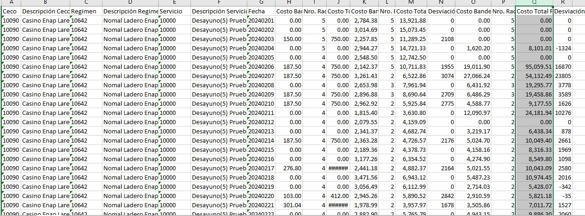
*Informe**:** **Costo Planificado Teórico - Real - Realizado**.*

<u>**Tablas Relacionadas:**</u>

| **Tabla** | **Para qué se usa** | **Campos clave** |
| --- | --- | --- |
| Cas_B_CostoMinutaRealizadoFoodCost | Fuente principal. Contiene los costos consolidados de minuta por tipo (teórico, real y realizado) para cada combinación de casino, régimen, servicio y fecha. | IdCeco, IdRegimen, IdServicio, Fecha_Minuta, Raciones_Teorica, Raciones_Real, Costo_Teorico_Alim, Costo_Real_Alim, Costo_Realizado_Alim, Costo_Teorico_Desec, Costo_Real_Desec, Costo_Realizado_Desec |
| b_clientes | Catálogo de casinos. Proporciona el nombre del casino y filtra solo los activos de tipo casino (no clientes de otro tipo). | cli_codigo, cli_nombre, cli_activo, cli_tipo |
| i_org_ceco | Tabla de relación entre organización de compras y casino. Permite mostrar el código de organización y filtra registros marcados como borrados o sin carga en el sistema de compras (PEL). | Id_Ceco, Id_OrgCompra, borrado, cargado_pel |
| a_regimen | Catálogo de regímenes alimentarios. Proporciona el nombre del régimen. | reg_codigo, reg_nombre |
| a_servicio | Catálogo de servicios. Proporciona el nombre del servicio (Almuerzo, Cena, etc.). | ser_codigo, ser_nombre |
| #TmpMinuta | Tabla temporal creada por el procedimiento almacenado a partir del XML de servicios seleccionados. Aísla los datos de la sesión activa para evitar interferencias entre usuarios conectados simultáneamente. | Org, Ceco, Reg, Ser |

## 8.7. Excel Q Sitios (E_QSitios.frm)

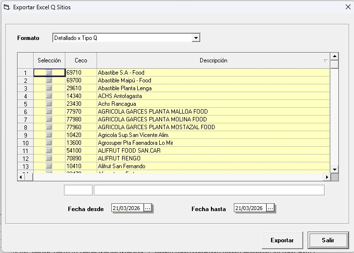
<u>**Descripción:**</u>
Esta pantalla permite exportar a Excel información de raciones (Q) de uno o varios casinos para un período determinado. El usuario selecciona los centros de costo que desea incluir en el reporte, define un rango de fechas y elige uno de cinco formatos de análisis: detallado por tipo de ración, detallado por cliente, resumen mensual, detallado por día o detallado por precio de venta. El resultado se guarda como archivo Excel (.xls o .xlsx) y se abre automáticamente al finalizar.
La pantalla se organiza en una zona central con una grilla que lista todos los casinos disponibles en el sistema. El usuario marca los casinos de interés en esa grilla, pudiendo filtrarlos por código o por nombre mediante campos de búsqueda. En la parte inferior se encuentran los campos de fecha de inicio y fecha de término del período a consultar, y en la parte superior el selector del tipo de informe que se desea generar. Dos botones al pie permiten ejecutar la exportación o cerrar la pantalla.
Un aspecto clave del funcionamiento es que los datos entregados cubren solo hasta la fecha del último diario cierre procesado en cada casino, incluso si la fecha de término indicada es posterior. Esto garantiza que el informe muestre únicamente información ya consolidada. La pantalla puede procesar múltiples casinos simultáneamente; la única restricción de volumen es que el total de filas resultantes no supere el máximo admitido por Excel.

| **Campo** | **Descripción** | **Obligatorio** |
| --- | --- | --- |
| Formato | Lista desplegable con cinco tipos de informe. Determina qué información se incluye en el Excel generado y qué procedimiento almacenado se ejecuta. | Sí |
| Selección de centros de costo | Grilla con todos los casinos activos que tienen registros de raciones en el sistema. El usuario debe marcar al menos uno haciendo clic sobre la fila. Se puede filtrar la grilla usando los campos de búsqueda por código o por nombre. | Sí (mínimo 1) |
| Búsqueda por código | Campo de texto que filtra la grilla ocultando las filas cuyo código de casino no coincide con el texto ingresado. Se excluye con el campo de búsqueda por nombre: al escribir en uno, el otro se borra. | No |
| Búsqueda por nombre | Campo de texto que filtra la grilla ocultando las filas cuyo nombre de casino no coincide con el texto ingresado. Se excluye con el campo de búsqueda por código. | No |
| Fecha desde | Fecha de inicio del período a consultar. Se inicializa con la fecha del día al abrir el formulario. | Sí |
| Fecha hasta | Fecha de término del período a consultar. Se inicializa con la fecha del día al abrir el formulario. Debe ser igual o posterior a la Fecha desde. | Sí |

Al abrir el formulario, el sistema carga automáticamente la lista de centros de costo y establece ambas fechas con la fecha actual. No se requiere ninguna acción previa del usuario para que la pantalla esté operativa.

<u>**Reglas de Negocio:**</u>

| **#** | **Cuándo aparece** | **Qué verifica el sistema** | **Qué ve o experimenta el usuario** |
| --- | --- | --- | --- |
| 1 | Al hacer clic en Exportar | Que ambos campos de fecha estén completos | Mensaje: “Unas de las fecha esta nula...” El proceso se detiene y el usuario debe completar las fechas. |
| 2 | Al hacer clic en Exportar | Que la Fecha hasta no sea anterior a la Fecha desde | Mensaje: “La fecha de hasta no puede ser menor que la fecha desde...” El proceso se detiene. |
| 3 | Al hacer clic en Exportar | Que al menos un casino esté marcado en la grilla | Mensaje: “Se debe seleccionar un ceco por lo menos” El proceso se detiene. |
| 4 | Al hacer clic en Exportar, tras obtener el resultado | Que el resultado de la consulta no supere 1.020.000 filas | Mensaje: “El resultado sobrepasa máximo de fila en Excel, Deberá seleccionar menos Ceco” El proceso se detiene y el usuario debe reducir la selección de casinos o acotar el período. |
| 5 | Al cerrar el cuadro de guardado sin elegir archivo | Que el usuario haya elegido una ruta de destino | Mensaje: “Debe seleccionar la ruta y nombre de archivo” El proceso se detiene. |
| 6 | Al cancelar el cuadro de guardado | El usuario presionó Cancelar explícitamente | Mensaje: “Proceso cancelado” El proceso se detiene limpiamente. |
| 7 | Al confirmar la ruta del archivo | Que la extensión del archivo elegido sea .xls o .xlsx | Mensaje: “La extensión del archivo debe ser (*.xls,*.xlsx)” El cuadro de guardado se vuelve a mostrar. |
| 8 | Al abrir el formulario | Que existan casinos con registros de raciones en el sistema | Si no hay datos, muestra mensaje: “No existe información requerida” y la grilla queda vacía. |
| 9 | Para todos los tipos 1 al 4 | Los datos se acotarán hasta la fecha del último cierre procesado de cada casino, incluso si la Fecha hasta indicada es posterior | El usuario no ve un mensaje de aviso, pero el informe solo incluirá datos hasta el cierre más reciente de cada casino seleccionado. |

<u>**Tablas Relacionadas:**</u>

| **Tabla** | **Para qué se usa en este reporte** | **Campos clave** |
| --- | --- | --- |
| b_clientes | Catálogo de casinos (centros de costo). Se usa para poblar la grilla al abrir el formulario y para obtener el nombre del casino en los informes. Solo se incluyen casinos de tipo 0 o 2, activos, con tipo de minuta 1, 2 o 3, no borrados de la organización de compra. | cli_codigo, cli_nombre, cli_tipo, cli_activo, cli_TipoMinuta |
| cas_b_minutaraciones | Fuente principal de raciones reales (vendidas, producidas). Contiene una fila por cada cliente y fecha con sus raciones registradas. Se usa en los tipos 1, 2, 3 y 4. | mir_cecori, mir_codreg, mir_codser, mir_fecmin, mir_rutcli, mir_nrorac |
| cas_b_minuta | Fuente de raciones planificadas (teóricas). Se usa en los tipos 1, 2, 3 y 4 para comparar contra las raciones reales. | min_cecori, min_codreg, min_codser, min_fecmin, min_racteo |
| cas_b_preciovta | Tabla de precios de venta por cliente, régimen y servicio. Se usa exclusivamente en el tipo 5. | prv_cecori, prv_codreg, prv_codser, prv_rutcli, prv_fecvig, prv_preven, prv_activo |
| cas_log_envio | Registro de cierres enviados. Se usa en los tipos 1, 2, 3 y 4 para determinar la fecha máxima de datos disponibles por casino (último cierre con estado 99). | len_cecori, len_feccie, len_estenv |
| cas_a_regimen | Catálogo de regímenes alimenticios del casino. Se cruza para obtener el nombre del régimen. | reg_cecori, reg_codigo, reg_nombre |
| cas_a_servicio | Catálogo de servicios del casino (desayuno, almuerzo, etc.). Se cruza para obtener el nombre del servicio. | ser_cecori, ser_codigo, ser_nombre |
| cas_b_clientes | Catálogo de clientes por casino (distinto de b_clientes). Se cruza para obtener el nombre del cliente en los tipos 1 y 2. | cli_cecori, cli_codigo, cli_nombre |
| I_ORG_CECO | Tabla de organización de compra por casino. Se usa al cargar la grilla para excluir casinos marcados como borrados en la organización de compra. | ID_CECO, ID_ORGCOMPRA, BORRADO |

### 8.7.1. Detalle x Tipo Q

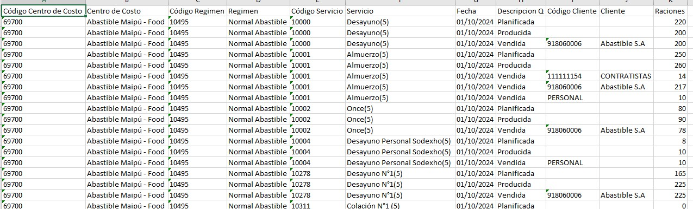
<u>**Descripción:**</u>
El informe presenta un formato que permite revisar en detalle la información asociada a las Q registradas en SGP Local. En esta vista se despliega, para cada centro de costo, el régimen, el servicio, la fecha, el cliente y la cantidad de raciones generadas, ya sea en estado planificado, producido o vendido.
La estructura de la hoja permite identificar rápidamente qué servicios fueron asignados a cada centro de costo y cómo se distribuyeron las raciones durante el período seleccionado. Cada línea corresponde a un servicio específico —como desayunos, almuerzos u onces— y muestra los códigos y descripciones necesarios para analizar o validar la operación diaria.
Si bien este informe es de solo lectura, su organización facilita el control, la trazabilidad y el análisis de las Q, permitiendo verificar diferencias entre lo planificado, lo producido y lo finalmente vendido, así como revisar información asociada a clientes y cargas operacionales.
**Estructura de datos del informe:**

| **Campo / Columna** | **Descripción** | **Calculado** |
| --- | --- | --- |
| Código Centro de Costo | Código del casino | No |
| Centro de Costo | Nombre del casino | No |
| Código Regimen | Código del régimen alimenticio | No |
| Regimen | Nombre del régimen alimenticio | No |
| Código Servicio | Código del servicio (desayuno, almuerzo, etc.) | No |
| Servicio | Nombre del servicio | No |
| Fecha | Fecha de la ración en formato dd/mm/aaaa | Sí |
| Descripcion Q | Etiqueta del tipo de ración: Planificada, Producida o Vendida | Sí |
| Código Cliente | RUT o identificador del cliente que consumió las raciones. Vacío para filas de tipo Planificada o Producida. | No |
| Cliente | Nombre del cliente. Vacío para filas de tipo Planificada o Producida. | No |
| Raciones | Cantidad de raciones del tipo indicado en ese día, régimen y servicio | Sí |

<u>**Regla de Negocio:**</u>
**Cálculo — Fecha**
La fecha se almacena como número entero en formato YYYYMMDD y se convierte a formato legible dd/mm/aaaa en la presentación final.
Fórmula o lógica: Fecha visible = conversión de YYYYMMDD a formato datetime y luego a varchar con estilo 103 (dd/mm/aaaa)

| **Componente** | **Qué representa** | **De dónde viene** |
| --- | --- | --- |
| Fecha numérica | Fecha de la ración almacenada como entero | cas_b_minutaraciones.mir_fecmin o cas_b_minuta.min_fecmin |

**Cálculo — Descripción Q**
Este campo no se almacena: se calcula en el momento de la consulta para identificar el tipo de ración con una etiqueta descriptiva de ancho fijo.
**Fórmula o lógica:** Si el identificador de cliente es PRODUCIDAS → Producida; en cualquier otro caso (incluyendo clientes reales) → Vendida; las filas provenientes de la planificación llevan Planificada.

| **Componente** | **Qué representa** | **De dónde viene** |
| --- | --- | --- |
| Identificador de cliente | Código que identifica el tipo de registro (cliente real, PRODUCIDAS, PLANIFICADO) | cas_b_minutaraciones.mir_rutcli |

**Cálculo — Raciones**
Las raciones se agregan (suman) por casino, régimen, servicio, fecha e identificador de cliente, ya que en la tabla pueden existir múltiples registros para la misma combinación.
**Fórmula o lógica:** Raciones = SUMA de mir_nrorac agrupado por casino, régimen, servicio, fecha e identificador de cliente

| **Componente** | **Qué representa** | **De dónde viene** |
| --- | --- | --- |
| mir_nrorac | Cantidad de raciones en cada registro | cas_b_minutaraciones.mir_nrorac |

<u>**Formato Salida:**</u>
Excel. Una única hoja (Hoja1). El usuario elige nombre y carpeta del archivo mediante cuadro de diálogo de guardado. La fila 1 contiene los nombres de las columnas tomados directamente del resultado de la consulta. Los datos comienzan en la fila 2. Las columnas y filas se ajustan automáticamente al contenido. El archivo se abre al terminar en modo solo lectura.

### 8.7.2. Detalle x Cliente

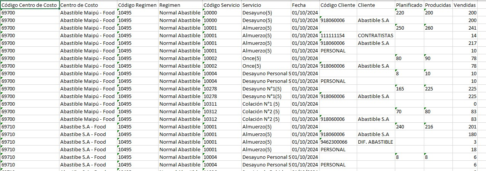
<u>**Descripción:**</u>
El informe presenta un formato que permite visualizar de manera detallada las Q asociadas a cada cliente dentro de un centro de costo. La hoja muestra, para cada servicio del día, información como el régimen, el tipo de servicio, el cliente asignado y las cantidades planificadas, producidas y vendidas.
La estructura incluye columnas que permiten identificar rápidamente qué cliente recibe cada servicio y cómo se distribuyen las raciones entre lo planificado y lo efectivamente producido o vendido. Cada fila corresponde a un servicio específico —por ejemplo, desayunos, almuerzos, onces o colaciones— e incorpora los códigos necesarios para facilitar el análisis operativo.
Aunque este informe es de carácter informativo y no editable, su composición está diseñada para entregar un control detallado por cliente, permitiendo validar cargas, contrastar diferencias entre planificación y venta, y revisar el comportamiento de los servicios dentro del período seleccionado. Esto facilita la trazabilidad y el seguimiento del consumo real asociado a cada cliente registrado en SGP Local.
**Estructura de datos del informe:**

| **Campo / Columna** | **Descripción** | **Calculado** |
| --- | --- | --- |
| Código Centro de Costo | Código del casino | No |
| Centro de Costo | Nombre del casino | No |
| Código Regimen | Código del régimen alimenticio | No |
| Regimen | Nombre del régimen alimenticio | No |
| Código Servicio | Código del servicio | No |
| Servicio | Nombre del servicio | No |
| Fecha | Fecha en formato dd/mm/aaaa | Sí |
| Código Cliente | Identificador del cliente. Vacío en filas de resumen diario. | No |
| Cliente | Nombre del cliente. Vacío en filas de resumen diario. | No |
| Planificado | Raciones planificadas para ese día, régimen y servicio. Vacío si el valor es cero. | Sí |
| Producidas | Raciones producidas para ese día, régimen y servicio. Vacío si el valor es cero. | Sí |
| Vendidas | Total de raciones vendidas para ese día, régimen y servicio (suma de todos los clientes). En filas de detalle por cliente, corresponde a las raciones de ese cliente específico. | Sí |

<u>**Regla de Negocio:**</u>
**Cálculo — Planificado**
Las raciones planificadas provienen de la tabla de minutas (planificación teórica) y se suman por casino, régimen, servicio y fecha. Se muestra vacío cuando el valor es cero para facilitar la lectura.
**Fórmula o lógica:** Planificado = comensales totales de la planificación teóricas donde el identificador de cliente es PLANIFICADO, agrupado por casino, régimen, servicio y fecha. Si el resultado es 0, se muestra como cadena vacía.

| **Componente** | **Qué representa** | **De dónde viene** |
| --- | --- | --- |
| min_racteo | Raciones teóricas planificadas | cas_b_minuta.min_racteo |

**Cálculo — Producidas**
Las raciones producidas provienen de los registros con identificador PRODUCIDAS y se suman por casino, régimen, servicio y fecha. Se muestra vacío cuando el valor es cero.
**Fórmula o lógica:** Producidas = comensales totales de la planificación real de raciones donde el identificador de cliente es PRODUCIDAS, agrupado por casino, régimen, servicio y fecha. Si el resultado es 0, se muestra como cadena vacía.

| **Componente** | **Qué representa** | **De dónde viene** |
| --- | --- | --- |
| mir_nrorac (PRODUCIDAS) | Cantidad de raciones marcadas como producidas | cas_b_minutaraciones.mir_nrorac donde mir_rutcli = 'PRODUCIDAS' |

**Cálculo — Vendidas**
Las raciones vendidas son la suma de todos los registros que no corresponden a PLANIFICADO ni a PRODUCIDAS, es decir, los registros asociados a clientes reales.
**Fórmula o lógica:** Vendidas = SUMA de raciones donde el identificador de cliente no es PLANIFICADO ni PRODUCIDAS, agrupado por casino, régimen, servicio y fecha.

| **Componente** | **Qué representa** | **De dónde viene** |
| --- | --- | --- |
| mir_nrorac (clientes reales) | Cantidad de raciones vendidas a clientes | cas_b_minutaraciones.mir_nrorac donde mir_rutcli NOT IN ('PLANIFICADO','PRODUCIDAS') |

<u>**Formato Salida:**</u>
Excel. Una única hoja (Hoja1). El usuario elige nombre y carpeta mediante cuadro de diálogo de guardado. La fila 1 contiene los nombres de las columnas. Los datos comienzan en la fila 2. El archivo se abre al terminar en modo solo lectura.

### 8.7.3. Resumen Mensual

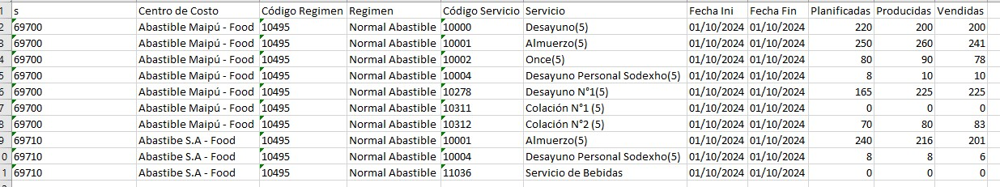
<u>**Descripción:**</u>
El informe presenta un formato que consolida la información mensual de las Q generadas en cada centro de costo. Esta hoja resume, por servicio, las cantidades planificadas, producidas y vendidas dentro del período seleccionado, permitiendo obtener una visión global del comportamiento operativo.
La estructura del resumen incluye columnas que identifican el centro de costo, el régimen, el servicio y el rango de fechas considerado. A partir de estos datos, el sistema agrupa todas las Q del mes y muestra los totales correspondientes a cada tipo de servicio —como desayunos, almuerzos, onces, colaciones u otros— junto a los valores planificados, producidos y vendidos.
Este resumen está diseñado para facilitar el análisis mensual, permitiendo comparar la planificación con la ejecución real y validar desviaciones en la producción o en las ventas. Al concentrar la información en un solo registro por servicio, se simplifica la revisión de tendencias, cargas operativas y resultados generales del período.
**Estructura de datos del informe:**

| **Campo / Columna** | **Descripción** | **Calculado** |
| --- | --- | --- |
| Código Centro de Costo | Código del casino | No |
| Centro de Costo | Nombre del casino | No |
| Código Regimen | Código del régimen alimenticio | No |
| Regimen | Nombre del régimen alimenticio | No |
| Código Servicio | Código del servicio | No |
| Servicio | Nombre del servicio | No |
| Fecha Ini | Fecha más antigua con datos en el período, en formato dd/mm/aaaa | Sí |
| Fecha Fin | Fecha más reciente con datos en el período, en formato dd/mm/aaaa | Sí |
| Planificadas | Total de raciones planificadas en el período para este casino, régimen y servicio | Sí |
| Producidas | Total de raciones producidas en el período para este casino, régimen y servicio | Sí |
| Vendidas | Total de raciones vendidas en el período para este casino, régimen y servicio | Sí |

<u>**Regla de Negocio:**</u>
**Cálculo — Fecha Ini / Fecha Fin**
En lugar de mostrar una fila por día, el resumen agrupa todo el período y determina las fechas extremas con datos reales.
**Fórmula o lógica:** Fecha Ini = mínimo de las fechas de ración en el período; Fecha Fin = máximo de las fechas de ración en el período. Ambas convertidas a formato dd/mm/aaaa.

| **Componente** | **Qué representa** | **De dónde viene** |
| --- | --- | --- |
| mir_fecmin | Fecha de cada registro de ración | cas_b_minutaraciones.mir_fecmin |

**Cálculo — Planificadas, Producidas, Vendidas**
Cada total es la suma de las raciones de su tipo en todo el período, agrupadas por casino, régimen y servicio (sin desglose por día).
**Fórmula o lógica:** Planificadas = SUMA de min_racteo del período, agrupado por casino+régimen+servicio; Producidas = SUMA de raciones con identificador PRODUCIDAS; Vendidas = SUMA de raciones con identificadores distintos de PLANIFICADO y PRODUCIDAS.

| **Componente** | **Qué representa** | **De dónde viene** |
| --- | --- | --- |
| min_racteo | Raciones teóricas | cas_b_minuta.min_racteo |
| mir_nrorac | Raciones reales registradas | cas_b_minutaraciones.mir_nrorac |

<u>**Formato Salida:**</u>
Excel. Una única hoja (Hoja1). El usuario elige nombre y carpeta mediante cuadro de diálogo de guardado. La fila 1 contiene los nombres de las columnas. Los datos comienzan en la fila 2. El archivo se abre al terminar en modo solo lectura.

### 8.7.4. Detalle Q x día

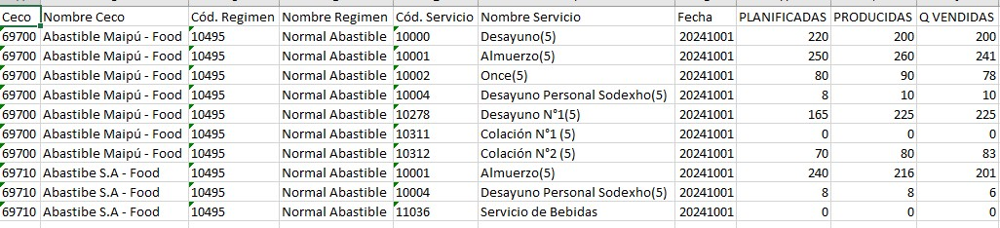
<u>**Descripción:**</u>
El informe presenta un formato que permite visualizar, de manera detallada, las Q generadas para un día específico en cada centro de costo. La hoja muestra información esencial como el centro de costo, el régimen, el servicio, la fecha y las cantidades planificadas, producidas y vendidas.
La estructura incluye columnas que identifican claramente el servicio ejecutado —como desayunos, almuerzos, onces, colaciones o servicios especiales— junto con los códigos correspondientes, lo que facilita la trazabilidad operativa. Cada fila representa un servicio entregado durante la fecha indicada, permitiendo revisar en detalle la carga diaria por tipo de servicio.
Este informe está diseñado para apoyar el control operativo diario, ya que permite comparar en un solo vistazo lo planificado versus lo producido y lo efectivamente vendido. Su organización contribuye a una revisión rápida del comportamiento de los servicios en el día, facilitando validaciones, análisis de diferencias y seguimiento de la ejecución en terreno.
**Estructura de datos del informe:**

| **Campo / Columna** | **Descripción** | **Calculado** |
| --- | --- | --- |
| Ceco | Código del casino | No |
| Nombre Ceco | Nombre del casino | No |
| Cód. Regimen | Código del régimen alimenticio | No |
| Nombre Regimen | Nombre del régimen alimenticio | No |
| Cód. Servicio | Código del servicio | No |
| Nombre Servicio | Nombre del servicio | No |
| Fecha | Fecha en formato numérico YYYYMMDD | No |
| PLANIFICADAS | Total de raciones planificadas para ese día, régimen y servicio | Sí |
| PRODUCIDAS | Total de raciones producidas para ese día, régimen y servicio | Sí |
| Q VENDIDAS | Total de raciones vendidas (suma de todos los clientes) para ese día, régimen y servicio | Sí |

<u>**Regla de Negocio:**</u>
**Cálculo — PLANIFICADAS, PRODUCIDAS, Q VENDIDAS**
El sistema separa los registros según su identificador de cliente y suma las raciones de cada tipo por casino, régimen, servicio y fecha.
**Fórmula o lógica:** PLANIFICADAS = SUMA de raciones donde identificador = PLANIFICADO; PRODUCIDAS = SUMA donde identificador = PRODUCIDAS; Q VENDIDAS = SUMA donde identificador no es PLANIFICADO ni PRODUCIDAS (es decir, raciones vendidas a clientes reales agrupados como VENDIDAS).

| **Componente** | **Qué representa** | **De dónde viene** |
| --- | --- | --- |
| min_racteo | Raciones planificadas | cas_b_minuta.min_racteo |
| mir_nrorac (PRODUCIDAS) | Raciones producidas | cas_b_minutaraciones.mir_nrorac donde mir_rutcli = 'PRODUCIDAS' |
| mir_nrorac (VENDIDAS) | Suma de raciones de todos los clientes | cas_b_minutaraciones.mir_nrorac donde identificador no es PLANIFICADO ni PRODUCIDAS |

<u>**Formato Salida:**</u>
Excel. Una única hoja (Hoja1). El usuario elige nombre y carpeta mediante cuadro de diálogo de guardado. La fila 1 contiene los nombres de las columnas. Los datos comienzan en la fila 2. El archivo se abre al terminar en modo solo lectura.

### 8.7.5. Detallado x Precio Venta

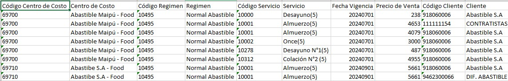

<u>**Descripción:**</u>
El informe presenta un formato el precio de venta vigente para cada combinación de centro de costo, régimen, servicio y cliente. La hoja muestra información clave como el centro de costo, el régimen, el servicio, la fecha de vigencia del precio, el cliente asociado y el valor de venta que aplica en el período consultado.
La estructura del detalle permite identificar de forma rápida qué precio de venta corresponde a cada servicio —por ejemplo, desayunos, almuerzos, onces, colaciones o servicios especiales— y cómo estos valores varían según el cliente registrado. Cada fila consolida los códigos relevantes del régimen y del servicio, facilitando la trazabilidad en la configuración comercial de SGP Local.
Este informe está diseñado para apoyar el control tarifario y la validación comercial, permitiendo revisar los precios activos para cada cliente y detectar posibles diferencias o actualizaciones según las fechas de vigencia. La información presentada facilita el análisis de tarifas, la correcta asignación de precios.
**Estructura de datos del informe:**

| **Campo / Columna** | **Descripción** | **Calculado** |
| --- | --- | --- |
| Código Centro de Costo | Código del casino | No |
| Centro de Costo | Nombre del casino | No |
| Código Regimen | Código del régimen alimenticio | No |
| Regimen | Nombre del régimen alimenticio | No |
| Código Servicio | Código del servicio | No |
| Servicio | Nombre del servicio | No |
| Fecha Vigencia | Fecha desde la que rige el precio de venta | Sí |
| Precio de Venta | Precio de venta pactado con el cliente para ese régimen y servicio | No |
| Código Cliente | Identificador del cliente | No |
| Cliente | Nombre del cliente | No |

<u>**Regla de Negocio:**</u>
**Cálculo — Fecha Vigencia**
Para cada combinación de casino, régimen, servicio y cliente, el sistema determina la fecha de vigencia del precio más reciente dentro del período consultado.
**Fórmula o lógica:** Fecha Vigencia = máximo de prv_fecvig donde la fecha de ración sea mayor o igual a la fecha de vigencia del precio.

| **Componente** | **Qué representa** | **De dónde viene** |
| --- | --- | --- |
| prv_fecvig | Fecha desde la que rige el precio | cas_b_preciovta.prv_fecvig |
| mir_fecmin | Fecha de la ración registrada | cas_b_minutaraciones.mir_fecmin |

<u>**Formato Salida:**</u>
Excel. Una única hoja (Hoja1). El usuario elige nombre y carpeta mediante cuadro de diálogo de guardado. La fila 1 contiene los nombres de las columnas. Los datos comienzan en la fila 2. El archivo se abre al terminar en modo solo lectura.

## 8.8. Exportación Excel Varios (E_ExcelVarios.frm)

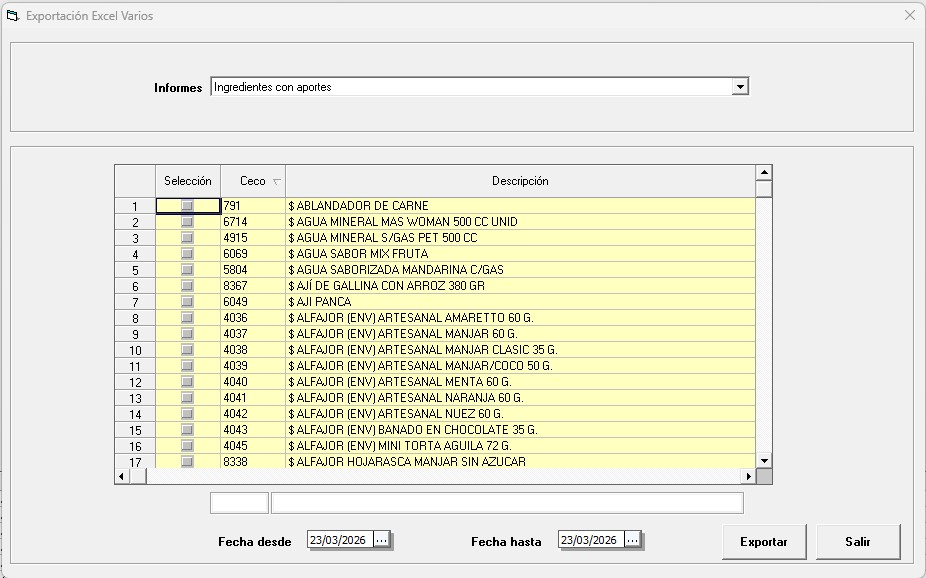
<u>**Descripción:**</u>
Esta pantalla centraliza distinto de exportación Excel que no tienen un lugar propio en el resto del sistema. Agrupa en un único acceso la extracción masiva de datos sobre ingredientes, recetas, planificación y estructura de servicios, orientada a análisis, integración con otras herramientas y tareas de administración que requieren manejar los datos fuera del sistema.
La pantalla se organiza en dos áreas principales. En la parte superior hay un panel con el selector de tipo de informe y campos complementarios que aparecen o se ocultan según la opción elegida. En la parte central e inferior hay una grilla que muestra los elementos disponibles para seleccionar (ingredientes, recetas o centros de costo según el tipo), junto con campos de búsqueda para filtrar la lista y campos de fecha que se habilitan cuando el informe lo requiere. Los botones de acción se ubican en la parte inferior derecha.
Dependiendo del tipo seleccionado, el usuario trabaja de una de estas dos formas: (a) elige uno o más elementos de la grilla y exporta la información asociada a esos elementos a un archivo Excel nuevo; o (b) proporciona un archivo Excel de origen que el sistema transforma y convierte a un formato diferente. Los tipos del 01 al 08 y el 11 siguen el primer flujo; los tipos 09 y 10 siguen el segundo.

| **Campo** | **Descripción** | **Obligatorio** |
| --- | --- | --- |
| Informes | Lista desplegable con los once tipos de exportación disponibles. Al cambiar la selección, la grilla de elementos se recarga automáticamente. | Sí |
| Grilla de elementos | Lista de ingredientes, recetas o centros de costo que el sistema carga según el tipo elegido. El usuario debe marcar al menos un elemento antes de exportar (salvo en los tipos 08, 09 y 10). | Sí (según tipo) |
| Fecha desde | Fecha de inicio del período a consultar. Solo visible y requerida para los tipos (06) y (07). | Según tipo |
| Fecha hasta | Fecha de fin del período. Solo visible y requerida para el tipo (06). | Según tipo |
| Org. Compras | Código de la organización de compras (por ejemplo, CL14). Solo visible y requerido para el tipo (04) Detalle de Recetas. | Según tipo |
| Código estructura servicio | Código o lista de códigos de estructura de servicio/minuta separados por coma. Solo visible y requerido para el tipo (08). | Según tipo |
| Casilla "No Mostrar Recetas No Vigentes" | Opción disponible para los tipos (03), (04) y (07). Cuando está marcada, la grilla excluye recetas que ya superaron su fecha de vigencia. Por defecto viene marcada. | No |
| Archivo Excel de origen | Solo para los tipos (09) y (10): el usuario debe seleccionar un archivo .xls o .xlsx existente desde el explorador de archivos que el sistema abre. | Según tipo |

<u>**Reglas de Negocio:**</u>

| **#** | **Cuándo aparece** | **Qué verifica el sistema** | **Qué ve o experimenta el usuario** |
| --- | --- | --- | --- |
| 1 | Al hacer clic en Exportar (tipo 04) | Que el campo Org. Compras no esté vacío | Mensaje: Debe seleccinar Org. Compras... y el proceso se detiene. |
| 2 | Al hacer clic en Exportar (tipo 06) | Que ambas fechas estén completas | Mensaje: Unas de las fecha esta nula... y el proceso se detiene. |
| 3 | Al hacer clic en Exportar (tipo 06) | Que la fecha hasta no sea anterior a la fecha desde | Mensaje: La fecha de hasta no puede ser menor que la fecha desde... y el proceso se detiene. |
| 4 | Al hacer clic en Exportar (tipos 01 al 07 y 11) | Que al menos una fila de la grilla esté seleccionada | Mensaje: Se debe seleccionar un item por lo menos y el proceso se detiene. |
| 5 | Al hacer clic en Exportar (tipo 08) | Que el campo de código de estructura no esté vacío | Mensaje: Debe ingresar código estructura servicio... y el proceso se detiene. |
| 6 | Al hacer clic en Exportar (tipos 09 y 10) | Que se haya seleccionado un archivo de origen | Mensaje: No seleccionó ningún archivo y el proceso se detiene. |
| 7 | Después de consultar la base de datos | Que el volumen de datos no supere 1.020.000 filas | Mensaje: El resultado sobrepasa maximo de fila en excel, Debera seleccionar menos Ceco y el proceso se detiene. El usuario debe reducir la cantidad de elementos seleccionados. |
| 8 | Al elegir el nombre del archivo de destino | Que el usuario no cancele el diálogo de guardado | Mensaje: Proceso cancelado si se cierra sin elegir archivo. |
| 9 | Al elegir el nombre del archivo de destino | Que se ingrese un nombre de archivo | Mensaje: Debe seleccionar la ruta y nombre de archivo si el campo queda vacío. |
| 10 | Al elegir el nombre del archivo de destino | Que la extensión del archivo sea .xls o .xlsx | Mensaje: La extensión del archivo debe ser (*.xls,*.xlsx) y el proceso se detiene. |
| 11 | Al cargar la grilla | Que existan datos para el tipo seleccionado | Mensaje: No existe información requerida y la grilla queda vacía. |

<u>**Tablas Relacionadas:**</u>

| **Tabla** | **Para qué se usa en este reporte** | **Campos clave** |
| --- | --- | --- |
| b_ingrediente | Catálogo maestro de ingredientes. Se usa en todos los tipos que involucran ingredientes (01, 02, 03, 04, 07, 11). | ing_codigo, ing_nombre, ing_activo, ing_indppr, ing_pctapr, ing_pctcoc, ing_pctnut, ing_facnut |
| b_productonut | Valores de aportes nutricionales por ingrediente y nutriente. Se usa en los tipos 01 y 03. | pnu_codpro, pnu_codapo, pnu_canapo |
| b_productosing | Vínculo entre ingredientes y productos. Se usa en los tipos 01 y 02. | pri_coding, pri_codpro |
| b_productos | Catálogo de productos SGP. Se usa en el tipo 02. | pro_codigo, pro_nombre, pro_codtip, pro_facing, pro_facsto |
| b_formatocompras_sap | Catálogo de materiales SAP. Se usa en el tipo 02 para cruzar el código SAP. | fcs_CodMaterial, fcs_DenMaterial |
| b_formatocompras_sap_sgp | Tabla de correspondencia entre materiales SAP y productos SGP. | fss_CodMaterial, fss_CodSgp |
| b_receta | Catálogo maestro de recetas. Se usa en los tipos 03, 04, 07 y 11. | rec_codigo, rec_nombre, rec_nomfan, rec_activo, rec_indppr, rec_fecvig, rec_catdie, rec_tippla, rec_basrac |
| b_recetadet | Detalle de ingredientes de cada receta. Se usa en los tipos 03, 04 y 07. | red_codigo, red_codpro, red_canpro, red_pctapr, red_pctcoc, red_pctnut, red_nroite |
| b_receta_Oferta | Vinculación entre recetas y ofertas comerciales. Se usa en los tipos 03 y 04. | rec_codigo, codigo_oferta, Activo |
| b_Ofertas | Catálogo de ofertas comerciales. Se usa en los tipos 03 y 04. | Codigo_oferta, Descripcion, DescripcionCorta |
| cas_b_minuta | Encabezados de minutas planificadas. Se usa en los tipos 05, 06 y 07. | min_cecori, min_codreg, min_codser, min_fecmin, min_racteo, min_codigo, ID_Bloque |
| cas_b_minutadet | Detalle de recetas en la minuta. Se usa en los tipos 07 y 08. | mid_cecori, mid_codigo, mid_codrec, mid_estser, mid_tipmin |
| CAS_b_MinutaBloque | Bloques de planificación de minutas con fechas de inicio y fin. Se usa en los tipos 05 y 08. | ID_Bloque, Ceco, Regimen, Servicio, FechaDesde, FechaHasta |
| b_clientes | Catálogo de centros de costo (casinos). Se usa en los tipos 05 y 08. | cli_codigo, cli_nombre |
| a_regimen | Catálogo de regímenes alimenticios. Se usa en los tipos 05, 06 y 08. | reg_codigo, reg_nombre |
| a_servicio | Catálogo de servicios (desayuno, almuerzo, etc.). Se usa en los tipos 05, 06 y 08. | ser_codigo, ser_nombre |
| a_unidadmed | Catálogo de unidades de medida. Se usa en el tipo 02. | unm_codigo, unm_nomcor, unm_nombre |
| a_tipopro | Catálogo de tipos de productos. Se usa en el tipo 02. | tip_codigo |
| a_nutriente | Catálogo de nutrientes. Se usa como referencia para los códigos de nutrientes en los tipos 01 y 03. | nut_codigo, nut_nombre |

### 8.8.1. Ingredientes con Aportes (01)

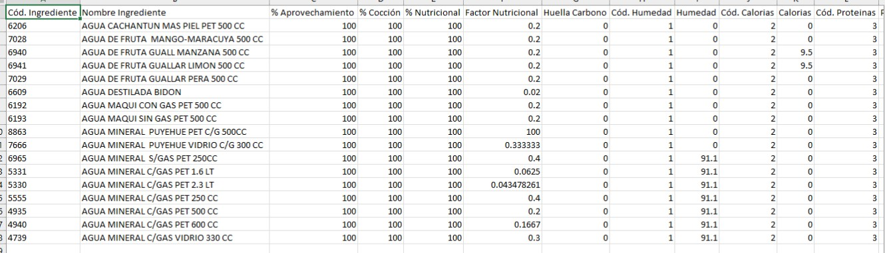
<u>**Descripción:**</u>
Esta planilla Excel contiene el listado de ingredientes con sus aportes nutricionales, donde cada fila representa un ingrediente y cada columna describe sus características principales:
Cód. Ingrediente / Nombre Ingrediente: identificador y nombre de cada ingrediente.
% Aprovechamiento, % Cocción y % Nutricional: porcentajes utilizados para el cálculo nutricional.
Factor Nutricional: factor de conversión utilizado para calcular los aportes nutricionales.
Huella Carbono: impacto ambiental asociado al ingrediente.
Los ingredientes asociados a sus aportes nutricionales.
**Estructura del archivo generado:**

| **Columna** | **Descripción** |
| --- | --- |
| Cód. Ingrediente | Código interno del ingrediente |
| Nombre Ingrediente | Nombre del ingrediente en el catálogo |
| % Aprovechamiento | Porcentaje de aprovechamiento configurado en el catálogo |
| % Cocción | Porcentaje de cocción configurado en el catálogo |
| % Nutricional | Porcentaje nutricional configurado |
| Factor Nutricional | Factor de conversión nutricional |
| Huella Carbono | Huella de carbono asociada al ingrediente |
| Cód. Humedad / Humedad | Código interno y valor de humedad (g/100g) |
| Cód. Calorias / Calorias | Código interno y kilocalorías |
| Cód. Proteinas / Proteinas | Código interno y gramos de proteínas |
| Cód. Hidratos / Hidratos | Código interno y gramos de hidratos de carbono |
| Cód. Fibras / Fibras | Código interno y gramos de fibra dietética |
| Cód. Lipidos / Lipidos | Código interno y gramos de lípidos totales |
| Cód. Grasa Total / Grasa Total | Código interno y gramos de grasa total |
| Cód. Ac. Grasos Sat. / Ac. Grasos Sat. | Código interno y ácidos grasos saturados |
| Cód. Grasos Mon / Ac. Grasos Mon | Código interno y ácidos grasos monoinsaturados |
| Cód. Ac. Grasos Poli / Ac. Grasos Poli | Código interno y ácidos grasos poliinsaturados |
| Cód. Colesterol / Colesterol | Código interno y mg de colesterol |
| Cód. N6 / N6 | Código interno y ácidos grasos omega-6 |
| Cód. N3 / N3 | Código interno y ácidos grasos omega-3 |
| Cód. Caroteno / Caroteno | Código interno y microgramos de caroteno |
| Cód. Retinol / Retinol | Código interno y microgramos de retinol |
| Cód. Vit. A Tot Re / Vit. A Tot Re | Código interno y vitamina A total (equivalentes retinol) |
| Cód. Vitamina B1 / Vitamina B1 | Código interno y tiamina |
| Cód. Vitamina B2 / Vitamina B2 | Código interno y riboflavina |
| Cód. Niacina (B3) / Niacina ( B3) | Código interno y niacina |
| Cód. Vitamina B6 / Vitamina B6 | Código interno y piridoxina |
| Cód. Vitamina B12 / Vitamina B12 | Código interno y cobalamina |
| Cód. Folatos / Folatos | Código interno y folatos |
| Cód. Ac. Pantot (B5) / Ac. Pantot (B5) | Código interno y ácido pantoténico |
| Cód. Vitamina C / Vitamina C | Código interno y ácido ascórbico |
| Cód. Vitamina E / Vitamina E | Código interno y tocoferol |
| Cód. Calcio / Calcio | Código interno y mg de calcio |
| Cód. Cobre / Cobre | Código interno y mg de cobre |
| Cód. Hierro / Hierro | Código interno y mg de hierro |
| Cód. Magnesio / Magnesio | Código interno y mg de magnesio |
| Cód. Fosforo / Fosforo | Código interno y mg de fósforo |
| Cód. Potasio / Potasio | Código interno y mg de potasio |
| Cód. Selenio / Selenio | Código interno y microgramos de selenio |
| Cód. Sodio / Sodio | Código interno y mg de sodio |
| Cód. Zinc / Zinc | Código interno y mg de zinc |
| Cód. A.c Graso Trans. / A.c Graso Trans. | Código interno y ácidos grasos trans |
| Cód. Azucares Totales / Azucares Totales | Código interno y gramos de azúcares totales |

<u>**Formato Salida:**</u>
Archivo Excel (.xls o .xlsx), una hoja, con encabezados en la primera fila y una fila por ingrediente.

### 8.8.2. Ingrediente – productos SGP – Material SAP (02)

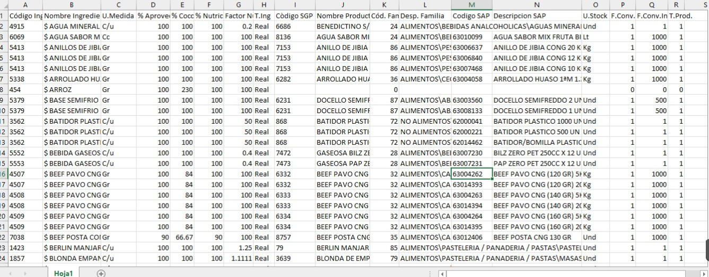
<u>**Descripción:**</u>
Esta planilla Excel contiene la asociación entre ingredientes, productos SGP y materiales SAP, donde cada fila representa una relación entre estos tres sistemas. Sus columnas describen:
Código Ingrediente / Nombre Ingrediente / U. Medida: identificador, nombre y unidad de medida del ingrediente.
% Aprovechamiento, % Cocción, % Nutricional y Factor Nutricional: parámetros nutricionales asociados al ingrediente.
T. Ing (Tipo Ingrediente): clasificación del tipo de ingrediente.
> Comentario - Paz Jorge (2026-04-01): Es item no va maestro de ingrediente.
Código SGP / Nombre Producto: identificador y nombre del producto equivalente en el sistema SGP.
Cód. Familia / Desp. Familia: código y descripción de la familia de alimentos a la que pertenece el producto.
Código SAP / Descripción SAP: identificador y descripción del material correspondiente en el sistema SAP.
U. Stock: unidad de medida utilizada para el stock en SAP.
F. Conv. / F. Conv. In / T. Prod.: factores de conversión entre unidades y tipo de producción asociado al material.
**Estructura del archivo generado:**

| **Columna** | **Descripción** |
| --- | --- |
| Código Ingrediente | Código interno del ingrediente en SGP |
| Nombre Ingrediente | Nombre del ingrediente |
| U.Medida | Unidad de medida del ingrediente |
| % Aprovechamiento | Porcentaje de aprovechamiento |
| % Coccion | Porcentaje de cocción |
| % Nutricional | Porcentaje nutricional |
| Factor Nutricional | Factor de conversión nutricional |
| T.Ing | Tipo de ingrediente: Real si es un ingrediente real (ing_indppr=1), Prop. si es propuesto |
| Còdigo SGP | Código del producto en el catálogo de productos SGP (puede estar vacío si no hay vínculo) |
| Nombre Producto | Nombre del producto SGP asociado |
| Cód. Familia | Código de la familia de productos en el catálogo |
| Desp. Familia | Descripción de la familia de productos (árbol completo) |
| Codigo SAP | Código del material en SAP |
| Descripcion SAP | Descripción del material en SAP |
| U.Stock | Unidad de stock del producto SGP |
| F.Conv. Prod. | Factor de conversión del producto (pro_facsto) |
| F.Conv.Ingr. | Factor de conversión del ingrediente (pro_facing) |
| T.Prod. | Tipo del producto en el catálogo SGP |

<u>**Formato Salida:**</u>
Archivo Excel, una hoja, ordenado por nombre de ingrediente y nombre de producto.

### 8.8.3. Resumen de Recetas con Aportes (03)

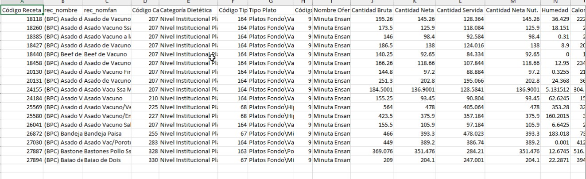
<u>**Descripción:**</u>
Esta planilla Excel contiene el resumen de recetas con sus aportes nutricionales, donde cada fila                               representa una receta y sus columnas describen:
Código Receta / rec_nombre / rec_nomfan: identificador, nombre oficial y nombre fantasía de cada receta.
Código Categoría / Categoría Dietética: clasificación dietética a la que pertenece la receta.
Código Tipo / Tipo Plato: identificador y descripción del tipo de plato al que corresponde la receta.
Código Oferta / Nombre Oferta: identificador y nombre de la oferta asociada a la receta.
Cantidad Bruta / Cantidad Neta / Cantidad Servida: cantidades del producto en sus distintas etapas, desde el peso bruto hasta la porción servida.
Cantidad Nutricional: cantidad utilizada para el cálculo de los aportes nutricionales.
Con sus aportes nutricionales calculados para cada receta.
**Estructura del archivo generado:**

| **Columna** | **Descripción** |
| --- | --- |
| Código Receta | Código interno de la receta |
| rec_nombre | Nombre de la receta |
| rec_nomfan | Nombre de fantasía de la receta |
| Código Categoria Dietitica | Código de la categoría dietética |
| Categoría Dietética | Nombre completo de la categoría dietética (árbol) |
| Código Tipo Plato | Código del tipo de plato |
| Tipo Plato | Nombre del tipo de plato (árbol) |
| Código Oferta | Código de la oferta comercial vinculada a la receta |
| Nombre Oferta | Descripción de la oferta (descripción + descripción corta) |
| Cantidad Bruta | Suma de los gramajes brutos de todos los ingredientes |
| Cantidad Neta | Suma de gramajes después de aplicar el porcentaje de aprovechamiento |
| Cantidad Servida | Suma de gramajes después de aprovechamiento y cocción |
| Cantidad Neta Nut. | Suma de gramajes después de aplicar el porcentaje nutricional |
| Humedad … Azucares Totales | Todos loa aprotes nutrientes de la tabla nutrientes, calculados para la receta completa |

<u>**Regla de Negocio:**</u>
**Cálculo de cada nutriente por receta:**
Por cada ingrediente de la receta, el valor del nutriente se calcula como:
(% Nutricional / 100) × (Valor del nutriente × (Cantidad ingrediente Nutricional / Raciones base)) / Factor Nutricional
Donde el Factor Nutricional equivale a 1 si el ingrediente lo tiene definido como cero. Luego se suman todos los ingredientes de la receta.

<u>**Formato Salida:**</u>
Archivo Excel, una hoja, con una fila por receta.

### 8.8.4. Detalle de Recetas (04)

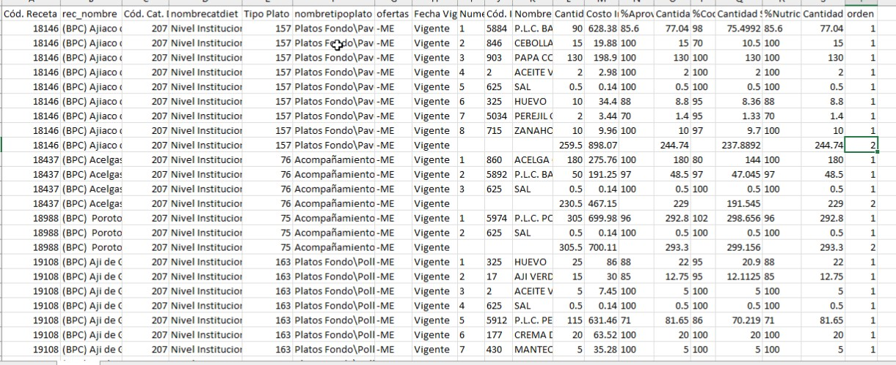
<u>**Descripción:**</u>
Esta planilla Excel contiene el detalle de recetas con el costo de cada ingrediente, donde cada fila representa un ingrediente dentro de una receta y sus columnas describen:
Cód. Receta / rec_nombre: identificador y nombre de la receta a la que pertenece el ingrediente.
Cód. Cat. / nombrecatdiet: código y nombre de la categoría dietética de la receta.
Tipo Plato / nombretipoplato: clasificación y descripción del tipo de plato.
Ofertas / Fecha Vig.: número de oferta y estado de vigencia de la receta.
Num. / Cód. I / Nombre: número de orden, código e identificador del ingrediente dentro de la receta.
Cantidad / Costo / % Aprov.: cantidad utilizada, costo unitario y porcentaje de aprovechamiento del ingrediente.
Cantidad / % Coc. / Cantidad / % Nutric. / Cantidad: cantidades y porcentajes en las distintas etapas de cocción y cálculo nutricional.
Orden: número de orden del ingrediente dentro de la receta.
Cada receta presenta una fila de totales que resume el costo y las cantidades globales de todos sus ingredientes. El costo de cada ingrediente es rescatado desde la organización de compras indicadas antes de bajar el informe del sistema.
**Estructura del archivo generado:**

| **Columna** | **Descripción** |
| --- | --- |
| Cód. Receta | Código interno de la receta |
| rec_nombre | Nombre de la receta |
| Cód. Cat. Dietetica | Código de categoría dietética |
| nombrecatdiet | Nombre de la categoría dietética |
| Tipo Plato | Código del tipo de plato |
| nombretipoplato | Nombre del tipo de plato |
| ofertas | Descripción corta de las ofertas asociadas a la receta (separadas por guión) |
| Fecha Vigencia | Fecha de vigencia de la receta o el texto "Vigente" si no tiene vencimiento |
| Numero Linea | Número de línea del ingrediente dentro de la receta (vacío en la fila de totales) |
| Cód. Ingrediente | Código del ingrediente (vacío en la fila de totales) |
| Nombre Ingrediente | Nombre del ingrediente (vacío en la fila de totales) |
| Cantidad Ingrediente | Gramaje bruto del ingrediente en la receta |
| Costo Ingrediente | Costo del ingrediente calculado según precio de convenio y factor de conversión |
| %Aprovechamiento | Porcentaje de aprovechamiento del ingrediente |
| Cantidad Neta | Gramaje después de aplicar el aprovechamiento |
| %Cocción | Porcentaje de cocción |
| Cantidad Servida | Gramaje después de aprovechamiento y cocción |
| %Nutricional | Porcentaje nutricional |
| Cantidad Neta Nut | Gramaje después de aplicar el porcentaje nutricional |

<u>**Regla de Negocio:**</u>
**Cálculo — Costo Ingrediente:**
Costo Ingrediente = ROUND(SUM(Cantidad Ingrediente × (Precio Convenio / Factor Conversión)), 2)
> Comentario - Paz Jorge (2026-04-04): Este es calculo costo receta x Zona
El precio se obtiene del procedimiento PA_sgpadm_CostoRecetaxOrgCompras usando la organización de compras indicada, con prioridad: primero precio de convenio.

<u>**Formato Salida:**</u>
Archivo Excel, una hoja, ordenado por código de receta y número de orden (detalle primero, totales al final).

### 8.8.5. Listado de Ceco Ultima Planificación (05)

> Comentario - Paz Jorge (2026-04-01): No considerar

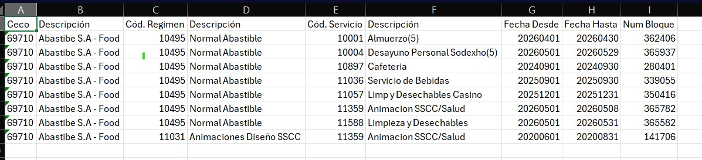

<u>**Descripción:**</u>
Un archivo Excel con la información del bloque de planificación más reciente de cada centro de costo seleccionado, desglosado por régimen y servicio. Permite saber hasta qué fechas tiene planificación vigente cada combinación de casino/régimen/servicio.
**Estructura del archivo generado:**

| **Columna** | **Descripción** |
| --- | --- |
| Ceco | Código del centro de costo (casino) |
| Descripción | Nombre del centro de costo |
| Cód. Regimen | Código del régimen alimenticio |
| Descripción | Nombre del régimen |
| Cód. Servicio | Código del servicio (desayuno, almuerzo, etc.) |
| Descripción | Nombre del servicio |
| Fecha Desde | Fecha de inicio del bloque de planificación más reciente |
| Fecha Hasta | Fecha de término del bloque de planificación más reciente |
| Num Bloque | Identificador del bloque de planificación |

<u>**Formato Salida:**</u>
Archivo Excel, ordenado por centro de costo, régimen y servicio.

### 8.8.6. Listado Cantidades Comensales x Sitios (06)

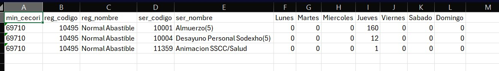

<u>**Descripción:**</u>
Un archivo Excel con la cantidad de raciones promedio planificadas por día de la semana (lunes a domingo), desglosadas por centro de costo, régimen y servicio, en el período de fechas indicado. Es útil para analizar la distribución de comensales a lo largo de la semana en cada casino y servicio.
**Estructura del archivo generado:**

| **Columna** | **Descripción** |
| --- | --- |
| min_cecori | Código del centro de costo |
| reg_codigo | Código del régimen |
| reg_nombre | Nombre del régimen |
| ser_codigo | Código del servicio |
| ser_nombre | Nombre del servicio |
| Lunes | Total de raciones planificadas en días lunes dentro del período |
| Martes | Total de raciones planificadas en días martes |
| Miercoles | Total de raciones planificadas en días miércoles |
| Jueves | Total de raciones planificadas en días jueves |
| Viernes | Total de raciones planificadas en días viernes |
| Sabado | Total de raciones planificadas en días sábado |
| Domingo | Total de raciones planificadas en días domingo |

<u>**Formato Salida:**</u>
Archivo Excel, ordenado por centro de costo, régimen y servicio.

### 8.8.7. Listado Recetas en Planificación Maxima Fecha con Frecuencia

> Comentario - Paz Jorge (2026-04-01): No Considerar
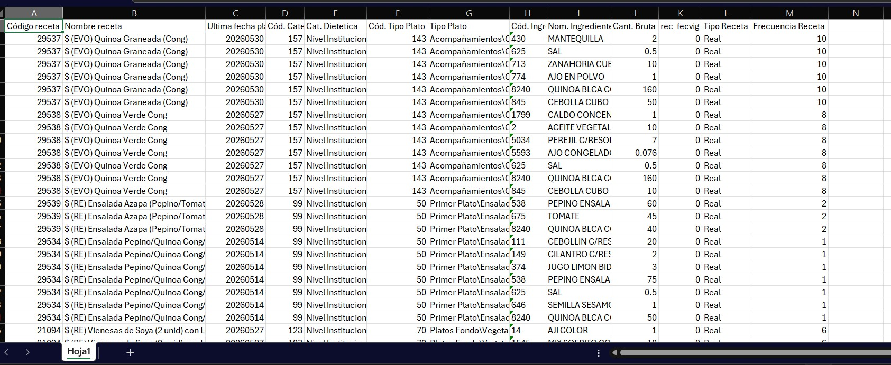

<u>**Descripción:**</u>
Un archivo Excel con el detalle de ingredientes de cada receta seleccionada, junto con la última fecha en que esa receta fue planificada y la cantidad de veces que aparece en la planificación desde la fecha indicada. Permite identificar qué recetas se usan más y cuándo se usaron por última vez.
**Estructura del archivo generado:**

| **Columna** | **Descripción** |
| --- | --- |
| Código receta | Código interno de la receta |
| Nombre receta | Nombre de la receta |
| Ultima fecha planificada | Última fecha en que la receta fue incluida en una minuta |
| Cód. Categoria Dietetica | Código de categoría dietética |
| Cat. Dietetica | Nombre completo de la categoría dietética |
| Cód. Tipo Plato | Código del tipo de plato |
| Tipo Plato | Nombre del tipo de plato |
| Cód. Ingrediente | Código del ingrediente de la receta |
| Nom. Ingrediente | Nombre del ingrediente |
| Cant. Bruta | Gramaje bruto del ingrediente en la receta |
| rec_fecvig | Fecha de vigencia de la receta |
| Tipo Receta | Real o Propuesta según el tipo de receta |
| Frecuencia Receta | Número de veces que la receta aparece en la planificación desde la fecha indicada |

<u>**Formato Salida:**</u>
Archivo Excel, ordenado por nombre de receta.

### 8.8.8. Ubicar Estructura Servicio Minuta Bloque

> Comentario - Paz Jorge (2026-04-01): No Coniderar

<u>**Descripción:**</u>
Un archivo Excel que, dado un código de estructura de servicio/minuta, devuelve todos los centros de costo, regímenes, servicios y bloques de fechas en los que esa estructura aparece en la planificación. Permite saber en qué casinos y períodos se usa un menú o estructura de servicio específico.
**Estructura del archivo generado:**

| **Columna** | **Descripción** |
| --- | --- |
| Código Ceco | Código del centro de costo |
| Nombre Ceco | Nombre del centro de costo |
| Código Regimen | Código del régimen |
| Nombre Regimen | Nombre del régimen |
| Código Servicio | Código del servicio |
| Nombre Servicio | Nombre del servicio |
| Fecha Desde | Fecha de inicio del bloque de planificación |
| Fecha Hasta | Fecha de término del bloque de planificación |

<u>**Formato Salida:**</u>
Archivo Excel, ordenado por código de ceco, régimen, servicio y fechas.

### 8.8.9. Transformar Recetas Optimum Excel

> Comentario - Paz Jorge (2026-04-07): No considerar

<u>**Descripción:**</u>
Este tipo no genera un informe desde la base de datos. En cambio, recibe un archivo Excel exportado desde el sistema Optimum y lo convierte a un formato tabular plano separado por barras verticales (|), abriendo el resultado en Excel. El archivo resultante contiene el detalle de recetas e ingredientes en el formato que SGP puede consumir.
**Estructura del archivo resultante:**

| **Columna** | **Descripción** |
| --- | --- |
| Código Receta | Código de la receta (prefijo REC0, ING0 o PRO0) |
| Nombre Receta | Nombre de la receta |
| Código Ingrediente | Código del ingrediente (prefijo ING o PRO) |
| Nombre Ingrediente | Nombre del ingrediente |
| Num Lin | Número de línea del ingrediente dentro de la receta |
| Gramaje | Cantidad del ingrediente en la receta |
| Bom Receta | Código BOM (lista de materiales) asociado a la receta |
| Sitio | Sitio o casino al que pertenece la receta |

<u>**Formato Salida:**</u>
El resultado se abre en Excel como archivo de texto delimitado por |.

> Comentario - Paz Jorge (2026-04-01): No Considerar

### 8.8.10. Transformar Ingredientes Optimum Excel

<u>**Descripción:**</u>
Este tipo sigue el mismo flujo que “Transformar Ingredientes Optimum Excel”, pero el archivo de origen contiene datos de ingredientes en formato Optimum. El sistema lo convierte a un formato tabular plano separado por | y lo abre en Excel para su uso posterior.
<u>**Formato Salida:**</u>
El resultado se abre en Excel como archivo de texto delimitado por |.

### 8.8.11. Listado Receta Método Preparación

<u>**Descripción:**</u>
Un archivo Excel con el texto del método de preparación de cada receta seleccionada, extraído desde el campo de texto enriquecido (RTF) del catálogo de recetas. El texto se convierte a texto plano eliminando el formato RTF. Es útil para extraer y revisar masivamente los métodos de preparación registrados en el sistema.
**Estructura del archivo generado:**

| **Columna** | **Descripción** |
| --- | --- |
| Código Receta | Código interno de la receta |
| Nombre Receta | Nombre de la receta |
| Metodo Preparación | Texto del método de preparación, convertido a texto plano desde formato RTF |

<u>**Formato Salida:**</u>
El resultado se abre en Excel como archivo de texto delimitado por |.
Mejoras:
Incluir columna categoría dietética y tipo de plato ambos con código y descripción.

## 8.9. Exportar Excel Detalle Minutas II (I_ExpDetMinBloque.frm)

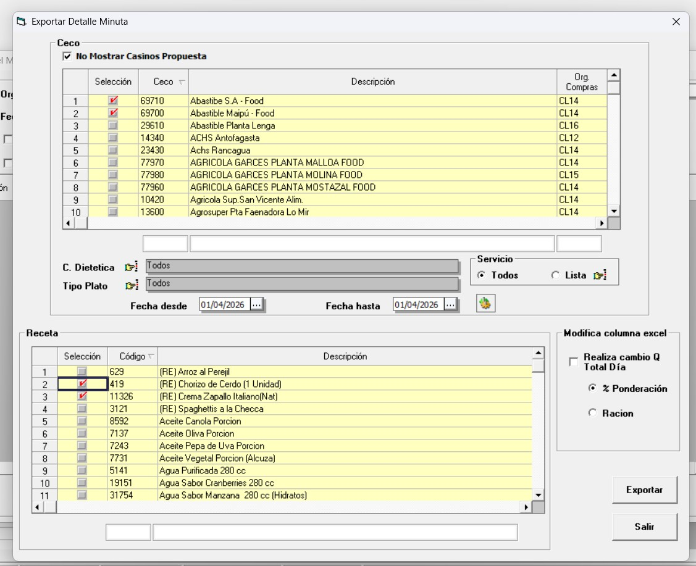

<u>**Descripción:**</u>
Esta pantalla permite exportar a Excel el detalle de la planificación de minutas de uno o varios casinos para un rango de fechas determinado. El resultado es un archivo Excel que contiene, por cada día y casino seleccionado, las recetas planificadas con sus raciones, porcentajes de ponderación, comensales teóricos, categoría dietética y tipo de plato. Existe además un modo simplificado que entrega únicamente el total de comensales por minuta, sin el detalle de recetas.
La pantalla está organizada en dos áreas principales. La parte superior muestra la lista de casinos disponibles con casillas de selección, campos de búsqueda y los filtros de rango de fechas, categoría dietética y tipo de plato. La parte inferior muestra las recetas que corresponden a los casinos y fechas seleccionados, junto con un panel de opciones para ajustar qué columna del Excel queda disponible para edición posterior.
El formulario no tiene un selector de tipo de informe con lista desplegable como otros formularios del sistema. En cambio, el modo de operación se determina mediante una casilla de verificación ("Realiza cambio Q Total Día") que conmuta entre exportar el detalle completo de recetas o exportar únicamente los totales de comensales. La distinción determina qué procedimiento almacenado se ejecuta y qué columnas aparecen en el archivo Excel resultante.

| **Campo** | **Descripción** | **Obligatorio** |
| --- | --- | --- |
| Casinos (lista de CECO) | Lista de casinos que se carga automáticamente al abrir el formulario. El usuario debe marcar uno o más casinos de la lista para incluirlos en el reporte. Soporta búsqueda por código o nombre escribiendo en los campos de búsqueda y presionando Enter. | Sí (al menos uno) |
| No Mostrar Casinos Propuesta | Casilla marcada por defecto. Cuando está activada, oculta los casinos en estado de propuesta y muestra solo casinos en producción activa. Al cambiar su estado se recarga la lista de casinos automáticamente. | No (tiene valor por defecto) |
| Fecha desde | Inicio del rango de fechas a consultar, en formato dd/mm/yyyy. Se inicializa con la fecha actual. Al cambiar el valor se recarga la lista de servicios disponibles. | Sí |
| Fecha hasta | Fin del rango de fechas a consultar, en formato dd/mm/yyyy. Se inicializa con la fecha actual. Al cambiar el valor se recarga la lista de servicios disponibles. | Sí |
| C. Dietética | Filtro opcional de categoría dietética. Permite restringir las recetas al grupo dietético seleccionado. Si muestra "Todos" no hay filtro activo. Al hacer clic en el ícono contiguo se abre un selector jerárquico de categorías dietéticas. Si el usuario tiene un valor guardado en sus parámetros personales, se carga automáticamente al abrir el formulario. | No |
| Tipo Plato | Filtro opcional de tipo de plato. Permite restringir las recetas al tipo de plato seleccionado. Si muestra "Todos" no hay filtro activo. Al hacer clic en el ícono contiguo se abre un selector jerárquico de tipos de plato. Si el usuario tiene un valor guardado en sus parámetros personales, se carga automáticamente al abrir el formulario. | No |
| Servicio — Todos / Lista | Selector que determina si se incluyen todos los servicios disponibles en el período o solo los que el usuario elija explícitamente. Con la opción "Lista" se habilita el ícono para abrir el selector de servicios; con "Todos" el ícono queda inhabilitado. | Sí (tiene valor por defecto "Todos") |
| Recetas (grilla de recetas) | Grilla que se carga al presionar el botón "Cargar Información". Muestra las recetas que corresponden a los casinos, fechas y servicios seleccionados. El usuario puede marcar recetas individuales para filtrar el Excel por recetas específicas; si no marca ninguna, se exportan todas las recetas encontradas. Soporta búsqueda por código o nombre. | No (si no se marca ninguna, se exportan todas) |
| Realiza cambio Q Total Día | Casilla dentro del panel "Modifica columna excel". Cuando está marcada, el modo de exportación cambia a totales de comensales (sin detalle de recetas). Cuando está desmarcada, se exporta el detalle completo de recetas. Al marcar esta casilla, las opciones "% Ponderación" y "Ración" se deshabilitan. | No (por defecto desmarcado) |
| % Ponderación / Ración | Par de opciones dentro del panel "Modifica columna excel" (disponibles solo cuando la casilla "Realiza cambio Q Total Día" está desmarcada). Determina cuál de las dos columnas del Excel queda habilitada para que el usuario pueda editarla: si selecciona "% Ponderación", la columna de porcentaje queda editable y la columna de raciones se calcula automáticamente mediante fórmula; si selecciona "Ración", la columna de raciones queda editable y la de porcentaje se calcula. Por defecto se selecciona "% Ponderación". |  |

<u>**Reglas de Negocio:**</u>

| **#** | **Cuándo aparece** | **Qué verifica el sistema** | **Qué ve o experimenta el usuario** |
| --- | --- | --- | --- |
| 1 | Al presionar "Cargar Información" o "Exportar" | Que ambas fechas (desde y hasta) estén completas | Mensaje: "Unas de las fecha esta nula..." |
| 2 | Al presionar "Cargar Información" o "Exportar" | Que la fecha hasta no sea anterior a la fecha desde | Mensaje: "La fecha de hasta no puede ser menor que la fecha desde..." |
| 3 | Al presionar "Cargar Información" o "Exportar" | Que haya al menos un casino marcado en la lista | Mensaje: "Se debe seleccionar un Bloque por lo menos" |
| 4 | Al presionar "Cargar Información" o "Exportar" (solo cuando se eligió la opción "Lista" para servicios) | Que haya al menos un servicio marcado en la lista de servicios | Mensaje: "Se debe seleccionar un Servicio por lo menos" |
| 5 | Al cargar recetas con "Cargar Información" | Que existan recetas para los filtros aplicados | Mensaje: "No existe información requerida". La grilla de recetas queda vacía y el botón Exportar se desactiva. |
| 6 | Al presionar "Exportar" (verificación de volumen, modo detalle) | Que el número de filas del resultado no supere 1.020.000 (límite de filas de Excel) | Mensaje: "El resultado sobrepasa maximo de fila en excel, Debera seleccionar menos Ceco" |
| 7 | Al presionar "Exportar" (verificación de volumen, modo comensales) | Que el número de registros de comensales no supere 1.020.000 | Mismo mensaje que la validación anterior. |
| 8 | En el cuadro de diálogo de guardado, si el usuario cancela | Que el usuario haya seleccionado un archivo de destino | Mensaje: "Proceso cancelado". El proceso se interrumpe y el usuario puede reintentar. |
| 9 | Al elegir nombre de archivo | Que el archivo tenga extensión .xls o .xlsx | Mensaje: "La extensión del archivo debe ser (*.xls,*.xlsx)" |

Este archivo Excel se utiliza en mantenedor cambio de receta minuta bloque, esto permite actualizar receta y/o ponderaciones, receta y/o raciones, además también este archivo permite actualizar comensales totales.
<u>**Tablas Relacionadas:**</u>

| **Tabla** | **Para qué se usa en este reporte** | **Campos clave** |
| --- | --- | --- |
| cas_b_minuta | Cabecera de la minuta planificada. Fuente principal de fechas, comensales totales, casino, régimen y servicio | min_cecori, min_codigo, min_fecmin, min_codreg, min_codser, min_racteo |
| cas_b_minutadet | Detalle de cada receta dentro de la minuta. Fuente de raciones planificadas, porcentaje de ponderación y estructura de servicio | mid_cecori, mid_codigo, mid_codrec, mid_numrac, mid_porrac, mid_estser, mid_numlin, mid_desest, mid_tipmin |
| b_receta | Catálogo de recetas. Proporciona nombre, categoría dietética y tipo de plato | rec_codigo, rec_nombre, rec_catdie, rec_tippla |
| a_regimen | Catálogo de regímenes alimentarios. Proporciona el nombre del régimen | reg_codigo, reg_nombre |
| a_servicio | Catálogo de servicios (almuerzo, cena, etc.). Proporciona nombre y clasificación L&D | ser_codigo, ser_nombre, ser_orden, ser_activo, ser_Lyd |
| a_estservicio | Catálogo de estructuras de servicio (subdivisiones dentro del servicio) | ess_codigo, ess_nombre, ess_codser |
| b_clientes | Catálogo de clientes/casinos. Se usa para filtrar por tipo de minuta activo y tipo de casino | cli_codigo, cli_nombre, cli_activo, cli_tipo, cli_TipoMinuta |
| a_tiposervicio | Catálogo de tipos de servicio. Se usa para limitar los casinos con TipoServicio = 1 (casino comedor) | tis_codigo, tis_activo |
| I_ORG_CECO | Tabla de organización de compras por CECO. Proporciona el indicador de estado de propuesta (CARGADO_PEL) para el filtro "No Mostrar Casinos Propuesta" | ID_CECO, ID_ORGCOMPRA, CARGADO_PEL, BORRADO |
| b_paramtiporeceta | Tabla de parámetros personalizados por usuario. Almacena el último valor de categoría dietética y tipo de plato seleccionados por el usuario | par_codigo, par_valor |
| a_recetacatdie | Árbol jerárquico de categorías dietéticas. Se usa en el selector de categoría y para resolver la descripción en el Excel | car_codigo |
| a_recetatippla | Árbol jerárquico de tipos de plato. Se usa en el selector de tipo de plato y para resolver la descripción en el Excel | tip_codigo |

<u>**Detalle Cambio Receta y/o Ponderaciones Raciones:**</u>
<u>**Formato Salida:**</u>
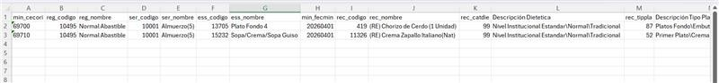

<u>**Descripción:**</u>
Este formulario produce un único archivo Excel con dos modos de contenido. El modo se elige antes de exportar mediante la casilla "Realiza cambio Q Total Día":

| **Modo** | **Descripción** | **Casilla marcada** | **Procedimiento principal** |
| --- | --- | --- | --- |
| Detalle Minuta | Exporta cada receta planificada con raciones, ponderación, comensales, categoría dietética y tipo de plato | No (desmarcada) | sgpadm_Sel_DetalleMinuta_V04 |
| Comensales Totales | Exporta únicamente el total de comensales por día, régimen y servicio, sin detalle de recetas | Sí (marcada) | sgpadm_Sel_ComensalesMinutaBloque |

**Modo Detalle Minuta**
**Qué muestra:** una fila por cada receta planificada en la minuta, con toda la información de identificación del casino, régimen, servicio, fecha, receta, categoría dietética, tipo de plato, raciones, porcentaje de ponderación y comensales teóricos. Este modo es el principal para análisis de minutas planificadas a nivel de receta individual.
**Opciones de configuración disponibles:**
**% Ponderación (opción activa por defecto):** la columna "% Ponderación" se almacena en la base de datos y queda editable en el Excel (fondo amarillo); la columna "Raciones" se genera mediante fórmula automática = (% Ponderación × Comensales) / 100. La columna de Raciones queda bloqueada para escritura manual.
**Ración (opción alternativa):** la columna "Raciones" queda editable en el Excel (fondo amarillo); la columna "% Ponderación" se genera mediante fórmula automática = (Raciones / Comensales) × 100. La columna de Ponderación queda bloqueada.
**Estructura de datos del informe:**

| **Campo / Columna** | **Descripción** | **Calculado** |
| --- | --- | --- |
| (col. auxiliar, se elimina antes de entregar) | Columna técnica que el sistema elimina automáticamente antes de guardar el archivo | Sí |
| CECO | Código del casino de origen | No |
| Código Régimen | Código del régimen alimentario al que pertenece la minuta | No |
| Nombre Régimen | Nombre del régimen alimentario | No |
| Código Servicio | Código del servicio (tipo de comida: almuerzo, cena, etc.) | No |
| Nombre Servicio | Nombre del servicio | No |
| Código Estructura Servicio | Código de la estructura de servicio (subdivisión dentro del servicio) | No |
| Nombre Estructura Servicio | Nombre de la estructura de servicio. Se prioriza el nombre guardado en el detalle de minuta sobre el nombre del maestro | No |
| Fecha Minuta | Fecha del día al que corresponde la planificación | No |
| Código Receta | Código interno de la receta | No |
| Nombre Receta | Nombre de la receta | No |
| rec_catdie | Código numérico de la categoría dietética de la receta | No |
| Descripción Dietética | Nombre completo de la categoría dietética con su jerarquía | Sí |
| rec_tippla | Código numérico del tipo de plato | No |
| Descripción Tipo Plato | Nombre completo del tipo de plato con su jerarquía | Sí |
| % Ponderación o % Ponderación_1 | Porcentaje de ponderación de la receta dentro del servicio. La variante "_1" indica que queda bloqueada (el usuario eligió opción "Ración") | No (viene de la base de datos) |
| Raciones o Raciones_1 | Cantidad de raciones planificadas para la receta. La variante "_1" indica que queda bloqueada (el usuario eligió opción "% Ponderación") | No (viene de la base de datos) |
| Comensales | Total de comensales teóricos de la minuta completa para ese día | No |
| mid_numlin | Número de línea del detalle de minuta (uso técnico de ordenamiento) | No |
| Cód. New Receta | Columna reservada para código nuevo de receta; queda como cero, editable en Excel | Sí |

**Cálculo — Descripción Dietética**
La categoría dietética se almacena como un código numérico. El nombre descriptivo con su jerarquía completa se obtiene invocando una función de base de datos que recorre el árbol de categorías desde la hoja hasta la raíz.
**Fórmula o lógica:** La función sgpadm_p_buscararbolcatdietetica(rec_catdie) devuelve la ruta jerárquica de la categoría; se toma todo el texto excepto el último carácter (separador final).

| **Componente** | **Qué representa** | **De dónde viene** |
| --- | --- | --- |
| rec_catdie | Código de la categoría dietética de la receta | Tabla b_receta, campo rec_catdie |
| sgpadm_p_buscararbolcatdietetica | Función que recorre el árbol jerárquico de categorías | SP/función en SGP_Admin.sql |

**Cálculo — Descripción Tipo Plato**
De modo idéntico al anterior, el tipo de plato se almacena como código y se resuelve a texto mediante una función que recorre el árbol jerárquico.
**Fórmula o lógica:** La función sgpadm_p_buscararboltipplato1(rec_tippla) devuelve la ruta jerárquica del tipo de plato; se toma todo el texto excepto el último carácter.

| **Componente** | **Qué representa** | **De dónde viene** |
| --- | --- | --- |
| rec_tippla | Código del tipo de plato de la receta | Tabla b_receta, campo rec_tippla |
| sgpadm_p_buscararboltipplato1 | Función que recorre el árbol jerárquico de tipos de plato | SP/función en SGP_Admin.sql |

**Cálculo — Raciones (fórmula Excel, modo % Ponderación activo)**
Cuando el usuario elige exportar con la opción "% Ponderación", las raciones no provienen directamente de la base de datos como valor editable; en cambio, el Excel inserta una fórmula que calcula las raciones a partir de lo que el usuario modifique en la columna de ponderación.
**Fórmula:** Raciones = (% Ponderación × Comensales) / 100

| **Componente** | **Qué representa** | **De dónde viene** |
| --- | --- | --- |
| % Ponderación | Porcentaje que la receta representa dentro del servicio | Columna P del Excel (editable por el usuario) |
| Comensales | Total de comensales del servicio para ese día | Columna R del Excel (desde la base de datos) |

Ejemplo: si el usuario ajusta el porcentaje de ponderación de una receta a 45 % y los comensales son 200, la columna Raciones calculará automáticamente 90 raciones.
**Cálculo — % Ponderación (fórmula Excel, modo Ración activo)**
Cuando el usuario elige exportar con la opción "Ración", el porcentaje se calcula a partir de las raciones que el usuario edite.
**Fórmula:** % Ponderación = (Raciones / Comensales) × 100

| **Componente** | **Qué representa** | **De dónde viene** |
| --- | --- | --- |
| Raciones | Cantidad de raciones editada por el usuario | Columna Q del Excel (editable) |
| Comensales | Total de comensales del servicio para ese día | Columna R del Excel (desde la base de datos) |

Ejemplo: si el usuario ingresa 90 raciones y los comensales son 200, el porcentaje calculado será 45 %.
**Formato de salida:** Excel (.xls o .xlsx). Una única hoja de cálculo ("Hoja1"). El usuario elige la ruta y nombre del archivo mediante un cuadro de diálogo de guardado. La fila 1 contiene los nombres de columna (los mismos del resultado del procedimiento almacenado). Los datos comienzan desde la fila 2. Según la opción elegida, una de las columnas P o Q queda con fondo amarillo indicando que es editable. La columna T (Cód. New Receta) también queda desbloqueada para uso posterior. Las columnas de ancho se ajustan automáticamente. Después de guardar, el archivo se abre directamente en modo solo lectura para revisión inmediata.
Mejoras:
Que considere costo de la receta, según CL y tablas gramajes y excepción formato compras a nivel de sitio.
<u>**Q Total Día**</u><u>**:**</u>
<u>**Formato de Salida**</u><u>**:**</u>
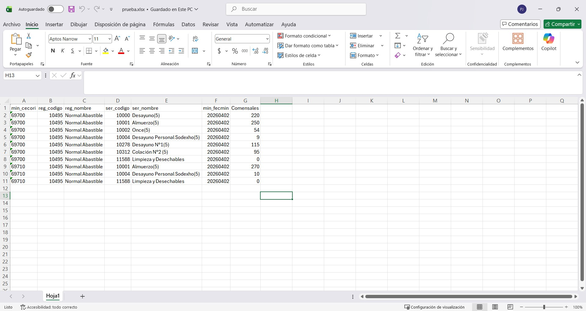
<u>**Descripción:**</u>
**Qué muestra:** una fila por cada combinación de casino, régimen, servicio y fecha de minuta, con el total de comensales teóricos de la minuta (sin desglosar por recetas). Este modo es útil para obtener un resumen de la demanda planificada sin el detalle de qué recetas se sirvieron.
**Restricciones propias del modo:** el filtro de recetas (grilla de recetas) no tiene efecto en este modo: aunque el usuario haya marcado recetas específicas, estas no se utilizan como filtro en la consulta de comensales. Los filtros activos son solo casino, servicio y rango de fechas.
**Estructura de datos del informe:**

| **Campo / Columna** | **Descripción** | **Calculado** |
| --- | --- | --- |
| (col. auxiliar, se elimina antes de entregar) | Columna técnica que el sistema elimina antes de guardar el archivo | Sí |
| min_cecori | Código del casino de origen | No |
| reg_codigo | Código del régimen alimentario | No |
| reg_nombre | Nombre del régimen alimentario | No |
| ser_codigo | Código del servicio | No |
| ser_nombre | Nombre del servicio | No |
| min_fecmin | Fecha de la minuta | No |
| Comensales | Total de comensales teóricos registrados en la cabecera de la minuta para ese día | No |

**Opciones de configuración disponibles:**
En este modo, las opciones "% Ponderación" y "Ración" quedan deshabilitadas ya que no aplican al resumen de comensales. La columna H del Excel queda desbloqueada para edición posterior por el usuario.
**Formato de salida:** Excel (.xls o .xlsx). Una única hoja de cálculo. El usuario elige la ruta y nombre del archivo mediante un cuadro de diálogo de guardado. Fila 1 con nombres de columna, datos desde fila 2. La columna H queda desbloqueada para edición. Las columnas se ajustan automáticamente al contenido. El archivo se abre en modo solo lectura al finalizar.

## 8.10. Exportar Detalle Minuta Bloque (I_ExpDetMinBloque.frm)

> Comentario - Paz Jorge (2026-04-01): No considerar

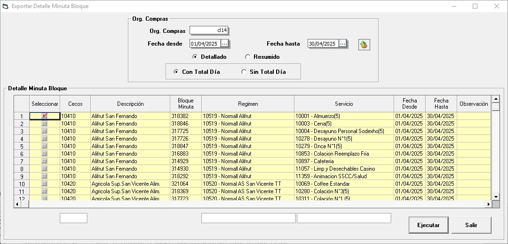
<u>**Descripción:**</u>
Esta opción permite exportar a Excel una minuta, para posterior hacer cambio de receta y posterior subir como un Bach input para modificar receta en la minuta.
Para obtener esta información se debe ingresar la organización compras, fecha desde hasta de la minuta y las opciones en pantalla. Mostrar en la grilla todos los centros de costo que estén asociado a la organización de compras.

| **Campo** | **Descripción** | **Obligatorio** |
| --- | --- | --- |
| Org. Compras | Código de la organización de compras (máximo 10 caracteres). Permite filtrar los casinos asociados a esa organización. Debe ingresarse antes de hacer clic en "Cargar Información". | Sí |
| Fecha desde | Fecha de inicio del período de vigencia del bloque. El sistema inicializa este campo con la fecha actual al abrir el formulario. | Sí |
| Fecha hasta | Fecha de fin del período de vigencia del bloque. El sistema inicializa este campo con la fecha actual al abrir el formulario. | Sí |
| Tipo de informe (Detallado / Resumido) | Controla el nivel de detalle del archivo generado. "Detallado" entrega una fila por receta; "Resumido" entrega una fila por día con el costo total de la minuta. El valor por defecto es "Detallado". | Sí |
| Con Total Día / Sin Total Día | Solo disponible cuando el tipo de informe es "Detallado". Controla si el archivo incluye una fila de costo total al cierre de cada día. El valor por defecto es "Con Total Día". | Solo en modo Detallado |
| Selección de bloques en la grilla | Una vez cargada la grilla, el usuario debe marcar la casilla de selección de al menos un bloque. Es posible seleccionar varios bloques de distintos casinos de la misma organización. | Sí |
| Ruta y nombre del archivo Excel | El cuadro de diálogo de guardado que el sistema presenta antes de exportar. El archivo debe tener extensión .xls o .xlsx. | Sí |

<u>**Regla de Negocio:**</u>

| **#** | **Cuándo aparece** | **Qué verifica el sistema** | **Qué ve o experimenta el usuario** |
| --- | --- | --- | --- |
| 1 | Al hacer clic en "Cargar Información" | Que el campo de organización de compras no esté vacío | Mensaje: Debe ingresar Org. Compras... |
| 2 | Al hacer clic en "Cargar Información" | Que ambas fechas estén completas | Mensaje: Unas de las fecha esta nula... |
| 3 | Al hacer clic en "Cargar Información" | Que la fecha hasta no sea anterior a la fecha desde | Mensaje: La fecha de hasta no puede ser menor que la fecha desde... |
| 4 | Al hacer clic en "Cargar Información" y no hay resultados | Que la consulta devuelva al menos un bloque | Mensaje: No existe información requerida. La grilla queda vacía. |
| 5 | Al hacer clic en "Ejecutar" sin datos en la grilla | Que la grilla contenga al menos una fila | Mensaje: Debe seleccionar datos del encabezado... |
| 6 | Al hacer clic en "Ejecutar" sin selección marcada | Que al menos una fila tenga la casilla de selección marcada | Mensaje: Se debe seleccionar un Bloque por lo menos |
| 7 | Al hacer clic en "Ejecutar" después de marcar bloques | Que el volumen total de filas no supere el límite de Excel (1.020.000 filas) | Mensaje: El resultado sobrepasa maximo de fila en excel, Debera seleccionar menos Ceco. El proceso se detiene; el usuario debe desmarcar casinos. |
| 8 | En el cuadro de diálogo de guardado al cancelar | Que el usuario no haya cancelado el diálogo | Mensaje: Proceso cancelado. El proceso se interrumpe sin generar archivo. |
| 9 | En el cuadro de diálogo de guardado al confirmar | Que se haya ingresado un nombre de archivo | Mensaje: Debe seleccionar la ruta y nombre de archivo |
| 10 | En el cuadro de diálogo de guardado al confirmar | Que la extensión del archivo sea .xls o .xlsx | Mensaje: La extensión del archivo debe ser (*.xls,*.xlsx) |

<u>**Tablas Relacionadas:**</u>

| **Tabla** | **Para qué se usa en este reporte** | **Campos clave** |
| --- | --- | --- |
| CAS_b_MinutaBloque | Fuente principal. Contiene la definición de cada bloque de minuta: el casino al que pertenece, el régimen, el servicio y el rango de fechas de vigencia del bloque. | ID_Bloque, Ceco, Regimen, Servicio, FechaDesde, FechaHasta |
| cas_b_minuta | Cabecera de cada minuta diaria dentro del bloque. Aporta la fecha, el régimen, el servicio y el número de comensales teóricos del día. | min_codigo, min_cecori, min_codreg, min_codser, min_fecmin, min_racteo, ID_Bloque |
| cas_b_minutadet | Detalle de recetas por minuta. Aporta el número de raciones planificadas, el porcentaje de ponderación y la estructura de servicio para cada receta de cada día. | mid_cecori, mid_codigo, mid_codrec, mid_numrac, mid_porrac, mid_estser, mid_numlin |
| b_receta | Catálogo de recetas. Aporta el nombre, la unidad de receta y otros atributos de cada receta. | rec_codigo, rec_nombre, cod_uniReceta, rec_indppr, rec_fecvig |
| b_recetadet | Detalle de ingredientes de cada receta con sus gramajes base. | red_codigo, red_codpro, red_canpro, red_numlin |
| b_ingrediente | Catálogo de ingredientes. Relaciona el ingrediente con sus productos de compra. | ing_codigo, ing_indppr |
| b_productosing | Tabla de relación entre ingredientes y productos de compra. | pri_coding, pri_codpro |
| b_productos | Catálogo de productos de compra. Aporta el nombre, el factor de conversión de formato y la fecha de vencimiento del producto. | pro_codigo, pro_nombre, pro_facing, pro_indppr, pro_fecven |
| b_clientes | Catálogo de casinos (clientes). Aporta el nombre del casino y su tipo para identificar si es un sitio real o propuesta. | cli_codigo, cli_nombre, cli_tipo, cli_tipoceco, cli_tipoformatocompras |
| a_regimen | Catálogo de regímenes alimenticios. Aporta el nombre del régimen. | reg_codigo, reg_nombre |
| a_servicio | Catálogo de servicios (desayuno, almuerzo, cena, etc.). Aporta el nombre del servicio. | ser_codigo, ser_nombre, ser_activo |
| a_estservicio | Catálogo de estructuras de servicio (posición dentro del menú). Aporta el código y nombre de cada posición y su grupo de agrupación. | ess_codigo, ess_nombre, ess_agrupacionestructura |
| cas_b_minutagrupoestructura | Tabla de ponderaciones por grupo de estructura para cada bloque y casino. Aporta el porcentaje de ponderación total del grupo. | mge_cencos, mge_id_bloque, mge_grupoestructura, mge_ponderaciontotal |
| b_tablagramajececo | Tabla de ajustes de gramaje específicos por casino y régimen. Permite reemplazar el gramaje base de la receta por uno personalizado para un casino determinado. | tgc_ceco, tgc_codreg, tgc_codrec, tgc_coding, tgc_codins, tgc_cantgr |
| b_UnidadReceta | Catálogo de unidades de receta. Aporta la descripción corta que se agrega entre corchetes al nombre de la receta en el informe detallado. | Codigo_unidad, DescripcionCorta |
| I_ORG_CECO | Tabla de relación entre organizaciones de compras y casinos. Permite filtrar los casinos que pertenecen a una organización de compras específica. | ID_ORGCOMPRA, ID_CECO, borrado |

### 8.10.1. Modo Detallado

> Comentario - Paz Jorge (2026-04-01): No considerar
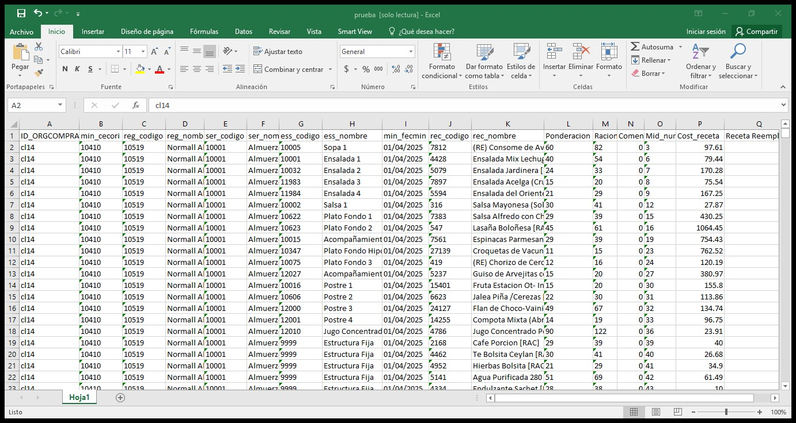
<u>**Descripción:**</u>
El documento presenta una tabla que permite gestionar la minuta realizando ajustes como **modificación de raciones**, **cambios en las ponderaciones** y **reemplazo de recetas asignadas**. Cada registro muestra la preparación utilizada, su ponderación, la cantidad de comensales y el costo asociado. El usuario puede actualizar estos valores según necesidad, lo que impacta automáticamente en la estructura final de la minuta y en el cálculo de costos correspondiente.
**Estructura de datos del informe:**

| **Campo / Columna** | **Descripción** | **Calculado** |
| --- | --- | --- |
| Org. Compras | Código de la organización de compras. En las filas de total día muestra el texto Costo Total Día : DD/MM/AAAA. | No |
| Ceco | Código del casino. En las filas de total día aparece en blanco. | No |
| Cód. Régimen | Código numérico del régimen alimenticio. En las filas de total día aparece en blanco. | No |
| Nom. Régimen | Nombre del régimen alimenticio. | No |
| Cód. Servicio | Código numérico del servicio (desayuno, almuerzo, cena, etc.). En las filas de total día aparece en blanco. | No |
| Nom. Servicio | Nombre del servicio. | No |
| Cód. Estructura | Código de la estructura de servicio (posición dentro del menú: entrada, fondo, postre, etc.). En las filas de total día aparece en blanco. | No |
| Nom. Estructura | Nombre de la estructura de servicio. | No |
| Fecha Minuta | Fecha del día de la minuta en formato DD/MM/AAAA. En las filas de total día aparece en blanco (o con formato numérico cuando la opción "Sin Total Día" está activa). | No |
| Cód. Receta | Código de la receta planificada. En las filas de total día aparece en blanco. | No |
| Nom. Receta | Nombre de la receta. Si la receta tiene unidad de receta definida, incluye entre corchetes la descripción corta de esa unidad. En las filas de total día aparece en blanco. | No |
| Ponderación | Porcentaje de ponderación de la estructura de servicio dentro del total del día. En las filas de total día aparece en blanco. | No |
| Raciones | Cantidad de raciones planificadas para esa receta en ese día. En las filas de total día aparece en blanco. | No |
| Comensales | Número de comensales teóricos del día según la minuta. En las filas de total día se muestra el valor real. | No |
| Núm. Línea | Número de línea de la receta dentro de la minuta. En las filas de total día aparece en blanco. | No |
| Costo Receta | Costo calculado de la receta por ración, o costo total del día por comensal en las filas de subtotal. | Sí |
| Receta Reemplaza | Columna reservada, se entrega vacía. | No |

<u>**Regla de Negocio:**</u>
**Cálculo — Costo Receta**
El costo de cada receta representa el gasto estimado por ración, calculado multiplicando el gramaje de cada ingrediente por el precio unitario del producto correspondiente (convertido a la misma unidad de medida mediante el factor de conversión del formato de compra), y sumando el resultado para todos los ingredientes.
**Fórmula o lógica:**
Para cada ingrediente de la receta:
*Costo_ingrediente = (Precio_por_formato / Factor_conversión_formato) × Gramaje_ingrediente*
*Costo_receta = SUM(Costo_ingrediente) para todos los ingredientes de la receta en ese día.*
El precio utilizado se selecciona según la siguiente prioridad (con @OpPrecio = 1, modo convenio):
Precio de convenio SAP vigente para la organización de compras y el período del bloque (condición preferente).
Si no hay convenio, el proceso devuelve costo cero para ese ingrediente.

| **Componente** | **Qué representa** | **De dónde viene** |
| --- | --- | --- |
| Precio_por_formato | Precio del producto en la unidad de compra según el convenio SAP activo para la organización | Tablas de convenios vía SP PA_sgpadm_CostoMinutaProducto |
| Factor_conversión_formato | Cuántas unidades base contiene el formato de compra (ej. kg por caja) | Campo pro_facing en b_productos |
| Gramaje_ingrediente | Cantidad bruta del ingrediente en la receta, en gramos o la unidad de la receta, ajustada por la tabla de gramajes por casino si existe | Campos red_canpro / tgc_cantgr en b_recetadet / b_tablagramajececo |

**Cálculo — Costo Total Día (filas de subtotal)**
Las filas de total día muestran el costo total diario dividido por el número de comensales teóricos de ese día.
**Fórmula o lógica:**
Costo_total_día = SUM(Raciones_receta × Costo_receta) para todas las recetas del día
Costo_por_comensal = Costo_total_día / Comensales_teóricos_del_día

| **Componente** | **Qué representa** | **De dónde viene** |
| --- | --- | --- |
| Raciones_receta | Cantidad de raciones planificadas para la receta en ese día | Campo mid_numrac en cas_b_minutadet |
| Costo_receta | Costo calculado por ración (descrito arriba) | Calculado por SP |
| Comensales_teóricos_del_día | Número de comensales teóricos registrados en la cabecera de la minuta | Campo min_racteo en cas_b_minuta |

<u>**Formato de Salida:**</u>
Excel. Una única hoja de cálculo (Hoja1). El usuario elige la ruta y nombre del archivo mediante cuadro de diálogo de guardado. La primera fila contiene los encabezados de columna tomados directamente de los nombres de campo del resultado de la consulta. Los datos comienzan en la fila 2. El archivo se abre automáticamente en modo de solo lectura al finalizar el proceso. Las columnas se ajustan automáticamente al contenido.

### 8.10.2. Modo Resumido

> Comentario - Paz Jorge (2026-04-01): No Considerar

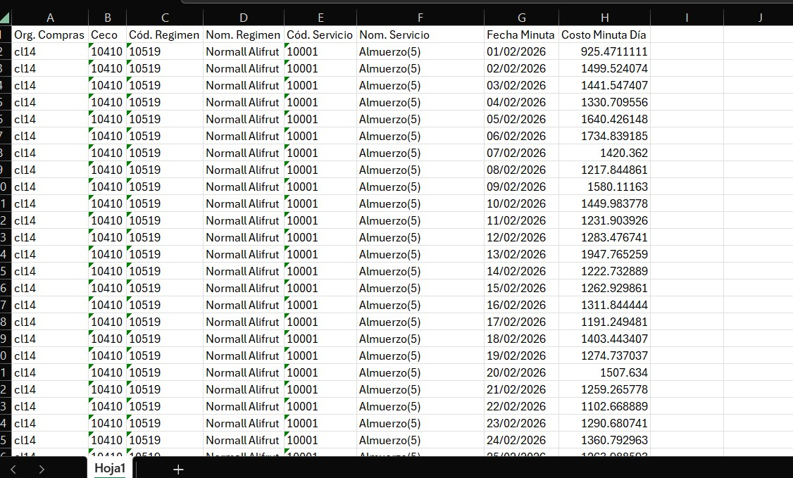

<u>**Descripción:**</u>
**Estructura de datos del informe:**

| **Campo / Columna** | **Descripción** | **Calculado** |
| --- | --- | --- |
| Org. Compras | Código de la organización de compras. | No |
| Ceco | Código del casino. | No |
| Cód. Régimen | Código numérico del régimen. | No |
| Nom. Régimen | Nombre del régimen. | No |
| Cód. Servicio | Código numérico del servicio. | No |
| Nom. Servicio | Nombre del servicio. | No |
| Fecha Minuta | Fecha del día en formato DD/MM/AAAA. | No |
| Costo Minuta Día | Costo total de la minuta para ese día, calculado como la suma del producto raciones × costo_receta para todas las recetas del día dividido por los comensales teóricos. | Sí |

<u>**Regla de Negocio:**</u>
**Cálculo — Costo Minuta Día**
Equivalente al cálculo de las filas de subtotal del modo Detallado (ver cálculo "Costo Total Día" en la sección anterior). El sistema filtra y solo entrega filas donde el número de comensales teóricos del día sea distinto de cero.
<u>**Formato de Salida:**</u>
Excel. Una única hoja de cálculo (Hoja1). El usuario elige la ruta y nombre del archivo mediante cuadro de diálogo de guardado. La primera fila contiene los encabezados de columna. Los datos comienzan en la fila 2. El archivo se abre automáticamente en modo de solo lectura al finalizar el proceso. Las columnas se ajustan automáticamente al contenido.

## 8.11. Exportar Excel Minuta Bloque

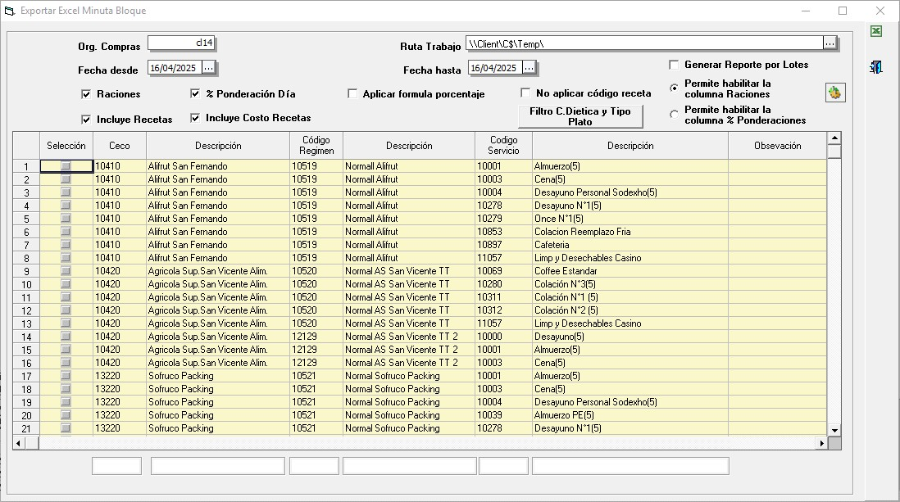
<u>**Descripción:**</u>
Esta opción permite bajar a Excel la minuta bloque, para que sea enviada al sitio y puede realizar los cambios de receta, como también cambio % ponderación y comensales x día.
Esta opción de puede generar por dos vías, una es bajar el archivo directamente en pc del usuario o bien genéralo como un proceso por lote.
Para seleccionar información del detalle debe hacer un clic sobre el ítem deseado o bien hacer un clic sobre la primera columna seleccionando todos los datos de la lista.
Tiene filtro por categoría dietética y tipo de plato.
Al seleccionar se puede elegir raciones, incluir recetas, % ponderación día, incluye costo recetas, aplicar fórmula porcentaje, no aplicar código receta (esta última es la opción formato cliente)
El archivo se puede bajar con la opción de editar ponderaciones o raciones.

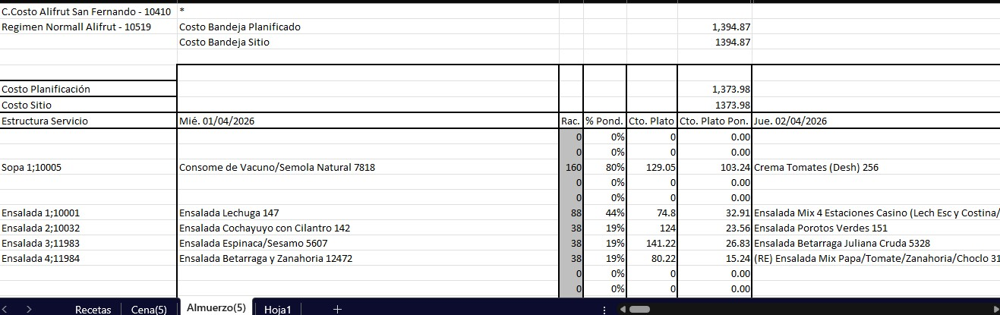
<u>**Descripción:**</u>
El documento muestra una hoja que genera la minuta correspondiente a cada servicio, permitiendo seleccionar preparaciones directamente desde un *pool de recetas* disponible en la misma planilla. Para cada ítem es posible ingresar **raciones**, **ponderaciones** o **comensales diarios**, valores que el usuario puede modificar según la necesidad del día. Además, se incluyen espacios en blanco destinados a incorporar **nuevas recetas**, las cuales se integran al cálculo sin requerir ajustes adicionales. El costo asociado a cada preparación se calcula mediante **fórmulas automáticas**, lo que facilita obtener el costo total del servicio de manera inmediata.
Para más detalle costo y gramaje, consulte la sección Cálculo de Precio y Tabla de Gramaje.
Para considerar el costo se saca el costo que del día que está generando el reporte.
<u>**Reglas de Negocio:**</u>

| **#** | **Cuándo aparece** | **Qué verifica el sistema** | **Qué ve o experimenta el usuario** |
| --- | --- | --- | --- |
| 1 | Al cargar la grilla o al exportar | Que el código de Org. Compras ingresado exista en la base de datos | Mensaje: No existe Org. Compras... El proceso se detiene. |
| 2 | Al cargar la grilla o al exportar | Que la fecha desde no sea posterior a la fecha hasta | Mensaje: Fecha Desde No Puede Ser Mayor a Fecha Hasta La fecha desde se restablece a la fecha actual. |
| 3 | Al cargar la grilla o al exportar | Que la fecha hasta no sea anterior a la fecha desde | Mensaje: Fecha Hasta No Puede Ser Mayor a Fecha Desde La fecha hasta se restablece a la fecha actual. |
| 4 | Al cargar la grilla o al exportar | Que el rango entre fecha desde y fecha hasta no supere meses | Mensaje: Rango De Fecha No Puede Ser Mayor que un mes La grilla se vacía. |
| 5 | Al hacer clic en "Exportar Excel" | Que al menos una fila de la grilla esté marcada (seleccionada) | Mensaje: Régimen y servicios asociado debe ser informado El proceso se detiene. |
| 6 | Al hacer clic en "Exportar Excel" con el modo "Incluye Costo Recetas" + "Raciones" activos | Que la fecha desde y la fecha hasta correspondan al mismo mes calendario | Mensaje: Solo debe ser informado mes... El proceso se detiene. El usuario debe ajustar el rango para que quede dentro de un único mes. |
| 7 | Al cambiar la ruta de trabajo | Que la carpeta seleccionada exista y tenga permisos de escritura | Mensaje: La carpeta <ruta> no está disponible o bien no tiene permiso de escritura. La ruta vuelve al valor anterior. |
| 8 | El botón "Exportar Excel" solo está habilitado | Si el usuario tiene permiso de exportación en el sistema | El botón aparece deshabilitado para usuarios sin permiso. No se muestra mensaje; simplemente no se puede hacer clic. |

<u>**Tablas Relacionadas:**</u>

| **Tabla** | **Para qué se usa en este reporte** | **Campos clave** |
| --- | --- | --- |
| cas_b_minuta | Cabecera de la minuta: asocia un día con un casino, régimen y servicio, y almacena el total de comensales del día | min_cecori, min_codreg, min_codser, min_fecmin, min_racteo, ID_Bloque |
| cas_b_minutadet | Detalle de la minuta: una fila por cada receta planificada, con su posición dentro del menú, número de raciones y porcentaje de ponderación | mid_cecori, mid_codigo, mid_codrec, mid_numlin, mid_numrac, mid_porrac, mid_tipmin, mid_estser, mid_desest |
| CAS_b_MinutaBloque | Registra la asignación de minutas a bloques y permite vincular la cabecera con el bloque de planificación | Ceco, ID_Bloque, Regimen, Servicio, FechaDesde, FechaHasta |
| b_receta | Catálogo de recetas: provee el nombre de cada receta a partir de su código | rec_codigo, rec_nombre, rec_catdie, rec_tippla, rec_indppr, rec_fecvig |
| a_estservicio | Catálogo de estructuras de servicio: agrupa las posiciones del menú bajo un nombre (ej. "Entrada", "Fondo", "Postre") | ess_codigo, ess_nombre, ess_codser |
| b_clientes | Catálogo de clientes / casinos: provee el nombre del casino a partir del código CECO | cli_codigo, cli_nombre, cli_activo, cli_tipo |
| a_regimen | Catálogo de regímenes: provee el nombre del régimen a partir de su código | reg_codigo, reg_nombre |
| a_servicio | Catálogo de servicios: provee el nombre del servicio y el indicador L&D (lunch and dinner) | ser_codigo, ser_nombre, ser_activo, ser_LYD |
| I_ORG_CECO | Tabla de relación entre organizaciones de compras y centros de costo: permite filtrar los casinos que pertenecen a una organización | ID_ORGCOMPRA, ID_CECO, ID_PAIS, BORRADO |
| b_paramcostopatron | Tabla de parámetros de costo patrón / comercial por casino, régimen y servicio | pcp_cencos, pcp_codreg, pcp_codser, pcp_anomes, pcp_descripcion, pcp_valor |
| b_paramcecoregimen | Parámetro que asocia un casino a un régimen alternativo para el cálculo de costos | par_cencos, par_codreg |
| b_recetadet | Detalle de ingredientes de cada receta, usado en el cálculo de costo a través del SP de valorización | red_codigo, red_codpro |
| b_receta_Oferta / b_Ofertas / b_Cliente_Oferta | Tablas de ofertas que determinan qué recetas están disponibles para un casino específico (usadas en la hoja opcional de recetas) | rec_codigo, codigo_oferta, cli_codigo, Activo |

<u>**Mejoras:**</u>
Si va a estar en línea y no se enviará la minuta a las operaciones, se debería generar opción para que sitio revise y ajuste minuta teórica en un periodo de tiempo determinado (recetas, ponderación y comensales).
Para el equipo de Plataforma es importante poder mantener la descarga de minuta en formato ajuste (para uso interno), formato ponderación/ración y formato cliente
Que saque un periodo de tres meses.
Que no considere receta que serán descontinuada en el periodo de planificación.
Que considere el precio del primer día de la minuta, si no existe precio que considere el ultimo precio vigente, si encuentra un ingrediente con costo cero que indique una alerta.

## 8.12. Exportar Ingrediente sin Precio Vigente (E_PrecioIngredienteNoVigente.frm)

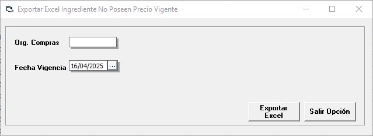
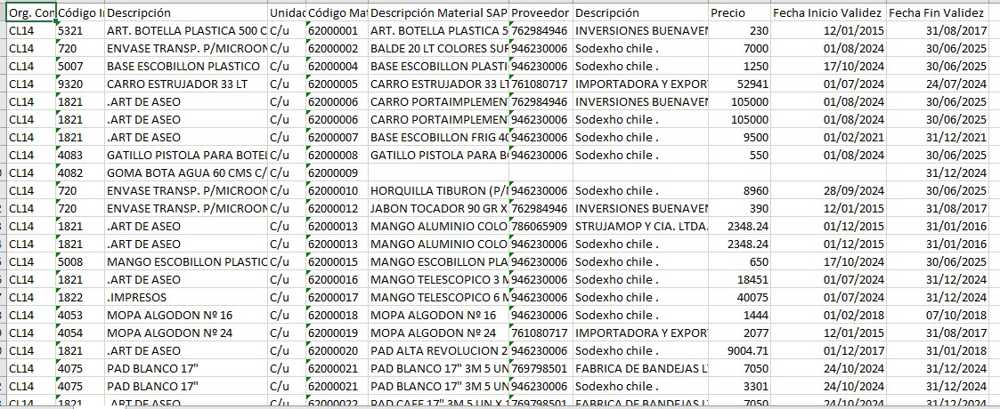
<u>**Descripción:**</u>
El informe presenta un listado de materiales asociados a convenios SAP cuya vigencia ha expirado o se encuentra fuera del período válido. Cada fila identifica la organización de compras, el código y descripción del artículo, la unidad, el material SAP, el proveedor, el precio y las fechas de inicio y fin de validez del convenio.
La información permite detectar ingredientes o materiales que ya no están vigentes dentro del convenio comercial, facilitando su revisión y actualización en el sistema SAP. Esta vista es útil para controlar inconsistencias, gestionar renovaciones de convenios y asegurar que los insumos utilizados en los procesos internos cuenten con condiciones comerciales actualizadas.
**Estructura de columnas del archivo Excel:**

| **#** | **Nombre de columna** | **Descripción** |
| --- | --- | --- |
| 1 | Org. Compras | Código de la organización de compras SAP (parámetro ingresado por el usuario). |
| 2 | Código Ingrediente | Código del ingrediente en el catálogo SGP. |
| 3 | Descripción | Nombre del ingrediente según el maestro SGP. |
| 4 | Unidad Medida | Nombre corto de la unidad de medida del ingrediente (por ejemplo, KG, LT). |
| 5 | Código Material Sap | Código con el que el ingrediente/producto está registrado en SAP. |
| 6 | Descripción Material SAP | Nombre del material según el maestro SAP. |
| 7 | Proveedor | Código del proveedor asociado al último convenio vencido. |
| 8 | Descripción (proveedor) | Nombre o razón social del proveedor. |
| 9 | Precio | Importe del precio registrado en el último convenio vencido. |
| 10 | Fecha Inicio Validez | Fecha en que comenzó a regir el convenio vencido. |
| 11 | Fecha Fin Validez | Fecha en que venció el convenio (última fecha de fin disponible para ese material e ingrediente). |

<u>**Reglas de Negocio:**</u>

| **#** | **Cuándo aparece** | **Qué verifica el sistema** | **Qué ve o experimenta el usuario** |
| --- | --- | --- | --- |
| 1 | Al hacer clic en **Exportar Excel** | Que el campo de fecha no esté vacío | Mensaje: "fecha esta nula..." con botón OK. La exportación no continúa. |
| 2 | Al hacer clic en **Exportar Excel** | Que el campo de organización de compras no esté vacío | Mensaje: "Organización compras esta nula..." con botón OK. La exportación no continúa. |
| 3 | Después de ejecutar la consulta, antes de elegir el archivo | Que el número de filas del resultado no supere 1.020.000 | Mensaje: "El resultado sobrepasa maximo de fila en excel, Debera seleccionar menos Ceco". La exportación se cancela y el formulario vuelve a estar disponible. |
| 4 | En el diálogo de guardar archivo | Que el usuario confirme un nombre de archivo (no cancele) | Si el usuario presiona Cancelar en el diálogo, aparece el mensaje "Proceso cancelado" y la exportación se detiene. |
| 5 | En el diálogo de guardar archivo | Que el usuario haya ingresado un nombre de archivo | Si el campo queda vacío, aparece el mensaje "Debe seleccionar la ruta y nombre de archivo" y el diálogo se vuelve a mostrar. |
| 6 | Después de elegir el nombre del archivo | Que la extensión del archivo sea .xls o .xlsx | Mensaje: "La extensión del archivo debe ser (*.xls,*.xlsx)". El usuario debe elegir un nombre válido. |

<u>**Tablas Relacionadas:**</u>

| **Tabla** | **Para qué se usa en este reporte** | **Campos clave** |
| --- | --- | --- |
| I_CONVENIO_SAP | Fuente principal. Contiene los convenios de precios de materiales SAP por organización de compras, proveedor y fechas de validez. | ID_ORGCOMPRA, ID_MATERIAL, ID_PROVEEDOR, FECHA_INICIO_VALIDEZ, FECHA_FIN_VALIDEZ, BORRADO, IMPORTE, NOMBRE_MATERIAL |
| b_formatocompras_sap | Tabla puente que relaciona el código de material SAP con el catálogo de formatos de compra SGP. | fcs_codmaterial, fcs_CodMaterial |
| b_formatocompras_sap_sgp | Segunda tabla puente que vincula el formato de compra SAP con el producto SGP correspondiente. | fss_CodMaterial, fss_codsgp |
| b_productos | Catálogo de productos SGP. Permite llegar al ingrediente a través de la relación producto-ingrediente. | pro_codigo |
| b_productosing | Relación entre productos e ingredientes en SGP. | pri_codpro, pri_coding |
| b_ingrediente | Maestro de ingredientes SGP. Filtra solo los ingredientes con precio por preparación habilitado (ing_indppr = 1) y provee nombre y unidad de medida. | ing_codigo, ing_nombre, ing_unimed, ing_indppr |
| a_unidadmed | Catálogo de unidades de medida. Traduce el código de unidad a su nombre corto. | unm_codigo, unm_nomcor |
| b_proveedor | Maestro de proveedores. Agrega el nombre del proveedor al convenio vencido. | prv_codigo, prv_nombre |

Mejoras:
Filtro que permita visualizar todos los ingredientes o solo los ingredientes activos.

## 8.13. Exportar SO Health (C_SoHealth.frm)

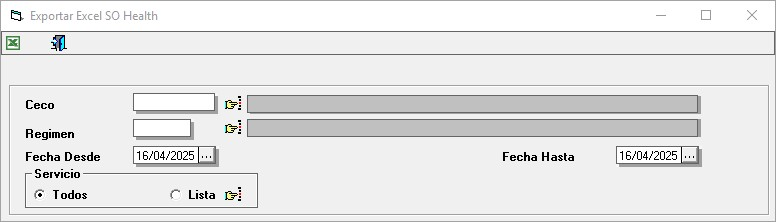
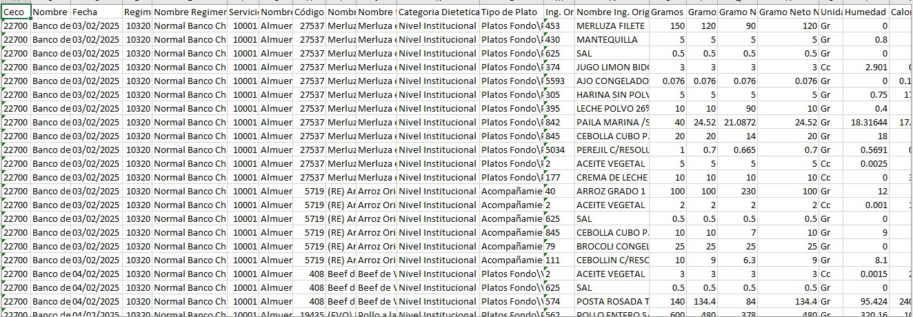
<u>**Descripción:**</u>
El informe muestra la composición detallada de los ingredientes que forman parte de una minuta planificada, incorporando los atributos nutricionales para el So Health. Cada fila identifica el centro de costo, fecha, régimen, servicio, receta y el ingrediente utilizado, junto con su categoría dietética y tipo de plato.
Para cada ingrediente se presentan los gramos programados, los gramos netos, la unidad, el porcentaje de humedad, y los principales valores nutricionales asociados, como calorías, proteínas, lípidos, carbohidratos y otros atributos técnicos que permiten evaluar su aporte nutricional dentro de la preparación.
Este formato permite analizar de manera detallada cómo se compone cada receta desde la planificación, entregando información clave para validar calidad nutricional, cumplimiento de estándares y coherencia con los lineamientos dietéticos establecidos.
Para más detalle tabla gramaje y cálculos aportes, consulte la sección Tabla de Gramaje y Calculo aportes nutricionales.
<u>**Reglas de Negocio:**</u>

| **#** | **Cuándo aparece** | **Qué verifica el sistema** | **Qué ve o experimenta el usuario** |
| --- | --- | --- | --- |
| 1 | Al hacer clic en Exportar Excel | Que el nombre del casino esté cargado (Ceco ingresado y reconocido) | Mensaje: Debe registrar ceco... |
| 2 | Al hacer clic en Exportar Excel | Que el nombre del régimen esté cargado (Régimen ingresado y reconocido) | Mensaje: Debe registrar regimen... |
| 3 | Al hacer clic en Exportar Excel | Que los campos Fecha Desde y Fecha Hasta no estén vacíos | Mensaje: Unas de las fecha esta nula... |
| 4 | Al hacer clic en Exportar Excel | Que la Fecha Desde no sea posterior a la Fecha Hasta | Mensaje: Fecha Origen No Puede Ser Mayor Que Fecha Destino |
| 5 | Al hacer clic en Exportar Excel (opción Lista activa) | Que al menos un servicio esté marcado en la grilla | Mensaje: Seleccione Opción Dentro Grilla |
| 6 | Después de consultar la base de datos | Que el número de filas del resultado no supere 1.020.000 | Mensaje: El resultado sobrepasa maximo de fila en excel... y el proceso se cancela |
| 7 | Al elegir nombre del archivo | Que el usuario no cancele el diálogo de guardado | Mensaje: Proceso cancelado |
| 8 | Al elegir nombre del archivo | Que el usuario haya escrito un nombre de archivo | Mensaje: Debe seleccionar la ruta y nombre de archivo |
| 9 | Al elegir nombre del archivo | Que la extensión sea .xls o .xlsx | Mensaje: La extensión del archivo debe ser (*.xls,*.xlsx) |
| 10 | Al ingresar un código de Ceco | Que el casino exista en el maestro de clientes, sea de tipo servicio de alimentación (tis_codigo = 1), esté activo y tenga un tipo de minuta válido (3 o 4) | El nombre del casino no se carga; los campos quedan en blanco |
| 11 | Al ingresar o seleccionar servicios (botón del panel Servicio, opción Lista) | Que Ceco, Régimen, Fecha Desde y Fecha Hasta estén completos y sean válidos | Mensaje: Debe seleccionar datos como Ceco, regimen o bien fecha... |

<u>**Tablas Relacionadas:**</u>

| **Tabla** | **Para qué se usa en este reporte** | **Campos clave** |
| --- | --- | --- |
| b_clientes | Maestro de casinos. Se usa para validar el Ceco ingresado y obtener el nombre del casino en el resultado. | cli_codigo, cli_nombre, cli_tipo, cli_activo, cli_codtis, cli_tipominuta |
| a_regimen | Catálogo de regímenes. Se usa para validar el régimen ingresado y obtener su nombre en el resultado. | reg_codigo, reg_nombre, reg_indppr |
| a_servicio | Catálogo de servicios. Proporciona el nombre del servicio (desayuno, almuerzo, etc.) en el resultado. | ser_codigo, ser_nombre |
| cas_b_minuta | Cabecera de minutas planificadas. Es la tabla principal desde la que se parte para obtener las minutas del casino, régimen y período indicados. | min_cecori, min_codigo, min_codreg, min_codser, min_fecmin |
| cas_b_minutadet | Detalle de líneas de minuta (recetas por servicio y día). Relaciona cada día y servicio con las recetas planificadas. | mid_cecori, mid_codigo, mid_codrec, mid_tipmin, mid_numlin |
| b_receta | Maestro de recetas. Proporciona el nombre, nombre de fantasía, categoría dietética y tipo de plato de cada receta. | rec_codigo, rec_nombre, rec_nomfan, rec_catdie, rec_tippla, rec_indppr |
| b_recetadet | Detalle de ingredientes por receta. Contiene los gramajes y porcentajes de rendimiento de cada ingrediente. | red_codigo, red_codpro, red_canpro, red_pctapr, red_pctcoc, red_pctnut, red_nroite |
| b_ingrediente | Maestro de ingredientes (insumos en su presentación de compra). Proporciona el nombre, factor nutricional y unidad de medida del ingrediente. | ing_codigo, ing_nombre, ing_facnut, ing_pctnut, ing_pctapr, ing_pctcoc, ing_unimed, ing_activo, ing_indppr |
| b_productosing | Tabla de relación entre ingredientes (presentaciones de compra) y productos base. | pri_coding, pri_codpro |
| b_productos | Maestro de productos base. | pro_codigo, pro_activo, pro_indppr |
| b_productonut | Tabla nutricional de ingredientes. Contiene el aporte de cada nutriente por unidad de ingrediente. | pnu_codpro, pnu_codapo, pnu_canapo |
| a_nutriente | Catálogo de nutrientes. Define los 36 nutrientes y su estado de actividad. | nut_codigo, nut_activo |
| a_recetacatdie | Catálogo de categorías dietéticas. Permite construir la ruta jerárquica de la categoría dietética de cada receta. | car_codigo |
| a_recetatippla | Catálogo de tipos de plato. Permite construir la ruta jerárquica del tipo de plato de cada receta. | tip_codigo |
| b_receta_Oferta | Tabla que vincula recetas con ofertas gastronómicas. | rec_codigo, codigo_oferta |
| b_Cliente_Oferta | Tabla que vincula casinos con ofertas. | cli_codigo, codigo_oferta |
| b_Ofertas | Maestro de ofertas gastronómicas. | Codigo_oferta |
| a_tiposervicio | Catálogo de tipos de servicio. Se usa para filtrar que el casino sea de tipo alimentación (tis_codigo = 1). | tis_codigo, tis_activo |
| b_tipominuta | Catálogo de tipos de minuta. Se usa para validar que el casino tenga un tipo de minuta activo. | tip_codigo, Activo |

## 8.14. Frecuencia de Recetas Gramos Productos Mensual (I_FreGrP.frm)

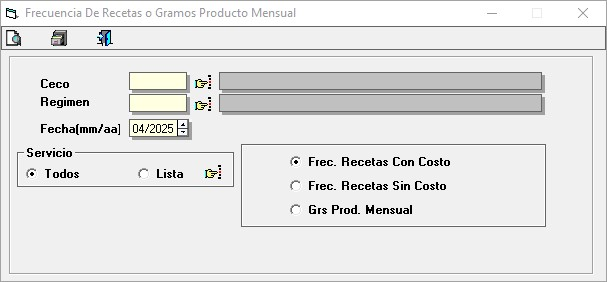

<u>**Descripción:**</u>

Esta pantalla genera dos tipos de informes sobre la minuta mensual planificada de un casino: uno que muestra la **frecuencia de aparición de cada receta** a lo largo del mes (con o sin el costo asociado), y otro que muestra los **gramos totales de cada producto** (ingrediente) utilizados en la minuta, distribuidos día a día durante el mes. Ambos informes se basan en la minuta real planificada y aprobada para el período seleccionado.
La pantalla se organiza en un panel de filtros donde el usuario ingresa el casino (CECO), el régimen y el mes/año de consulta. Una vez ingresados estos datos, el sistema carga automáticamente los servicios disponibles para ese casino y período en una grilla de selección. Si el usuario elige la opción "Lista" en el selector de servicio, puede marcar manualmente qué servicios incluir; si elige "Todos", el sistema los marca todos al generar el informe. Un segundo panel permite elegir entre los tres tipos de informe disponibles: Frecuencia de Recetas Con Costo, Frecuencia de Recetas Sin Costo, y Gramos Producto Mensual.
Adicionalmente, la barra de herramientas incluye un acceso al historial de planificación teórica, que permite seleccionar un régimen y período directamente desde minutas históricas, facilitando la consulta de períodos anteriores sin ingresar los filtros manualmente.

| Campo | Descripción | Obligatorio |
| --- | --- | --- |
| CECO | Código del casino a consultar. Se puede ingresar directamente o buscar abriendo el selector de clientes con la tecla F9 o el ícono de búsqueda junto al campo. El sistema muestra el nombre del casino al costado para confirmar la selección. | Sí |
| Régimen | Código del régimen alimenticio a consultar. Se puede ingresar directamente o buscar con la tecla F9 o el ícono de búsqueda junto al campo. El sistema muestra el nombre del régimen al costado. | Sí |
| Fecha (mm/aa) | Mes y año del informe, en formato mes/año (por ejemplo, 03/2026). El sistema inicializa este campo con el mes y año actuales al abrir la pantalla. | Sí |
| Servicio | Selector de cobertura de servicios: "Todos" incluye automáticamente todos los servicios disponibles al generar el informe; "Lista" habilita la grilla de servicios para que el usuario marque manualmente cuáles incluir. | Sí (debe haber al menos uno marcado) |
| Tipo de informe | Selección entre "Frec. Recetas Con Costo", "Frec. Recetas Sin Costo" y "Grs Prod. Mensual". El tipo "Frec. Recetas Con Costo" está seleccionado por defecto al abrir la pantalla. | Sí |

Cuando se ingresan o modifican el CECO, el régimen o la fecha, el sistema consulta automáticamente los servicios con minuta planificada en ese período y los carga en la grilla de selección. Si no existe planificación para la combinación ingresada, la grilla quedará vacía y no será posible generar el informe.
**Controles y acciones disponibles**

| Control / Acción | Descripción |
| --- | --- |
| Campo CECO | Permite ingresar el código del casino. Al confirmar con Enter o Tab, el sistema busca el nombre y lo muestra junto al campo. |
| Ícono de búsqueda de CECO / F9 | Abre el selector de casinos donde el usuario puede buscar y seleccionar por nombre o código. Al confirmar, el campo CECO y su nombre se actualizan automáticamente. |
| Campo Régimen | Permite ingresar el código de régimen. Al confirmar, el sistema muestra el nombre del régimen y recarga la grilla de servicios. |
| Ícono de búsqueda de Régimen / F9 | Abre el selector de regímenes. Al confirmar, el campo régimen y su nombre se actualizan y el sistema recarga los servicios disponibles. |
| Campo Fecha (mm/aa) | Mes y año del informe. Al modificarlo, el sistema recarga automáticamente la grilla de servicios. Soporta navegación con los botones de incremento del campo. |
| Opción "Todos" (Servicio) | Cuando está seleccionada (valor por defecto), al generar el informe el sistema marca automáticamente todos los servicios de la grilla, sin que el usuario deba hacerlo manualmente. |
| Opción "Lista" (Servicio) | Habilita la grilla de servicios para selección manual. El usuario puede marcar o desmarcar cada servicio con una casilla de verificación. |
| Ícono de búsqueda de Servicios / F9 (desde Lista) | Solo disponible cuando "Lista" está seleccionado. Abre el selector de servicios (B_MTaEst) donde se puede elegir los servicios a incluir. |
| Grilla de servicios | Muestra los servicios con minuta planificada para el CECO, régimen y mes indicados. Cada fila tiene una casilla de verificación para seleccionar el servicio. Solo es visible e interactiva cuando la opción "Lista" está activa. |
| Opción "Frec. Recetas Con Costo" | Selecciona el tipo de informe de frecuencia de recetas incluyendo el costo calculado por receta y el costo promedio del servicio. Activa por defecto. |
| Opción "Frec. Recetas Sin Costo" | Selecciona el tipo de informe de frecuencia de recetas sin información de costos. |
| Opción "Grs Prod. Mensual" | Selecciona el informe de gramos de producto mensual, agrupado por categoría de producto. |
| Botón "Vista Previa" | Ejecuta las validaciones de datos, consulta la base de datos y genera el documento RTF en una ventana de Vista Previa del sistema, desde donde el usuario puede revisar, imprimir o guardar el informe. Solo está habilitado si el usuario tiene permiso de Vista Previa en el módulo. |
| Botón "Histórico Planificación Teórica" | Abre el formulario de histórico de minutas donde el usuario puede buscar y seleccionar un período planificado previo. Al confirmar, el sistema carga automáticamente el régimen y la fecha seleccionados en los campos de filtro. |
| Botón "Salir" | Cierra el formulario y lo descarga de memoria. |

<u>**Reglas de Negocio:**</u>
**Validaciones del sistema**

| # | Cuando aparece | Qué verifica el sistema | Qué ve o experimenta el usuario |
| --- | --- | --- | --- |
| 1 | Al hacer clic en Vista Previa | Que el campo CECO tenga un nombre de casino resuelto (es decir, que el código ingresado corresponda a un casino válido) | Mensaje: Debe registrar ceco... — el informe no se genera |
| 2 | Al hacer clic en Vista Previa | Que el campo Régimen tenga un nombre resuelto (es decir, que el código de régimen sea válido) | Mensaje: Debe registrar regimen... — el informe no se genera |
| 3 | Al hacer clic en Vista Previa | Que el campo de fecha no esté vacío | Mensaje: Fecha esta nula... — el informe no se genera |
| 4 | Al hacer clic en Vista Previa | Que al menos un servicio esté marcado en la grilla (si la opción es "Todos", el sistema los marca todos automáticamente antes de esta validación) | Mensaje: Servicio debe ser selecionado — el informe no se genera |
| 5 | Al hacer clic en "Histórico Planificación Teórica" | Que el CECO ingresado tenga al menos una minuta planificada registrada en el sistema | Mensaje: No existe ceco planificado — el formulario de histórico no se abre |
| 6 | Al ingresar el CECO | Que el código corresponda a un casino registrado en el sistema (tipo 0 o tipo 2 en el catálogo de clientes) | Si el código no existe, el campo de nombre queda vacío, el campo de régimen se limpia y el campo de fecha queda habilitado sin datos de servicios |
| 7 | Al ingresar el Régimen con filtro de tipo de régimen activo | Que el régimen corresponda al tipo de régimen configurado en la sesión (vg_Indppr), cuando aplique | Si el código de régimen no coincide con el tipo esperado, el nombre queda vacío y no se cargan servicios |

<u>**Tablas Relacionadas:**</u>

| Tabla | Para qué se usa en este reporte | Campos clave |
| --- | --- | --- |
| cas_b_minuta | Cabecera de la minuta planificada: vincula el casino, régimen, servicio y fecha de cada día planificado | min_cecori, min_codreg, min_codser, min_fecmin, Id_Bloque |
| cas_b_minutadet | Detalle de la minuta: contiene qué receta fue planificada en cada día y para cuántas raciones | mid_cecori, mid_codigo, mid_codrec, mid_numrac, mid_tipmin, mid_estser |
| b_receta | Maestro de recetas: proporciona el nombre, la base de raciones y el tipo de receta | rec_codigo, rec_nombre, rec_basrac, rec_tippla |
| b_recetadet | Detalle/ingredientes de cada receta: gramaje de cada ingrediente en la receta base | red_codigo, red_codpro, red_canpro, red_nroite |
| b_ingrediente | Catálogo de ingredientes: vincula ingredientes con productos | ing_codigo, ing_activo |
| b_productos | Catálogo de productos materializados: nombre, categoría y código de producto | pro_codigo, pro_nombre, pro_codtip, pro_activo, pro_indppr |
| b_productosing | Tabla de relación ingrediente–producto: indica el producto preferente para cada ingrediente | pri_coding, pri_codpro, pri_propre |
| a_servicio | Catálogo de servicios: proporciona el nombre del servicio y su posición de ordenamiento | ser_codigo, ser_nombre, ser_posicion |
| a_tipopro | Catálogo de categorías de producto (tipos analíticos): proporciona el nombre de cada categoría | tip_codigo, tip_nombre |
| b_clientes | Catálogo de casinos: proporciona el nombre del casino y filtra por tipo de cliente | cli_codigo, cli_nombre, cli_tipo |
| a_regimen | Catálogo de regímenes: proporciona el nombre del régimen, con filtro opcional por tipo de régimen | reg_codigo, reg_nombre, reg_indppr |
| fn_ObtenerIngredienteReemplazoJerarquia | Función que resuelve los reemplazos de ingredientes por jerarquía (tabla de gramaje por nivel configurada para el casino y régimen) | Parámetros: cli_codigo, CodRegimen, Rcpe_No, Rcpe_Item_Ref_No, rec_tippla |

### 8.14.1. Frecuencia Recetas Con Costo (I_FrecuenciaRecetas)

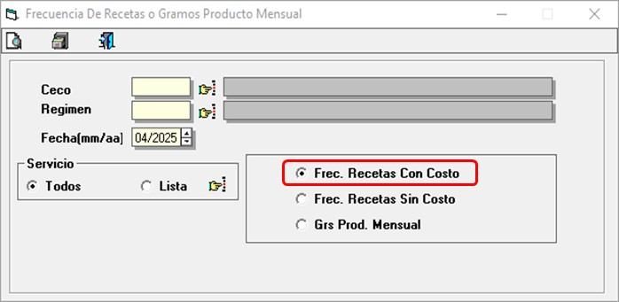
Frecuencia recetas con costo:
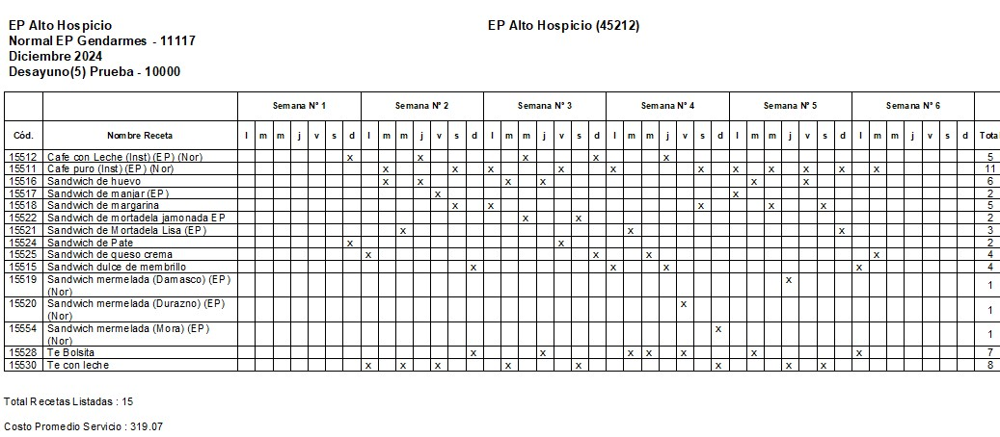
El informe muestra una matriz que indica, mediante marcas “x”, la frecuencia con que cada receta aparece en la minuta, organizada por semanas y días del período. Cada fila corresponde a una receta con su código y nombre, mientras que la última columna muestra el total de veces que fue programada.
Este formato permite ver rápidamente la utilización mensual de cada preparación y analizar su participación dentro del servicio. Al final se incluyen indicadores como el total de recetas listadas y el costo promedio del servicio.

<u>**Descripción:**</u>
**Qué muestra:** Lista todas las recetas que aparecen en la minuta del mes para el casino, régimen y servicio seleccionados. Por cada receta indica en qué días del mes fue planificada (marcada con "x" en la columna del día correspondiente), cuántas veces en total apareció en el mes, y el costo promedio de esa receta calculado en función de los ingredientes y precios de convenio. Al final del informe se muestra el total de recetas listadas y el costo promedio del servicio para el mes.
**Cómo se seleccionan los servicios:** el usuario utiliza la grilla de servicios (casillas de verificación por servicio). Si la opción "Todos" está activa, el sistema marca todos los servicios automáticamente al generar el informe. El informe genera una página separada por cada servicio marcado.
**Estructura de datos del informe:**

| Campo / Columna | Descripción | Calculado |
| --- | --- | --- |
| Cód. | Código interno de la receta | No |
| Nombre Receta | Nombre descriptivo de la receta tal como está registrado en el maestro | No |
| Semana N° 1 … Semana N° 6 (columnas l, m, m, j, v, s, d) | Columnas de los 7 días de cada semana. La celda del día en que la receta aparece en la minuta se marca con "x" | No (lectura directa de fechas de minuta) |
| Total | Cantidad de días distintos en que la receta fue planificada durante el mes | Sí |
| Valor Recetas | Costo promedio de la receta (suma de costos de ingredientes dividida por el número de apariciones en el mes) | Sí |

<u>**Regla de Negocio:**</u>
**Cálculo — Total (veces que aparece la receta)**
Cuenta cuántas fechas distintas de minuta corresponden a la misma receta dentro del mes consultado. Se incrementa por cada fecha nueva del campo min_fecmin que corresponde a la misma receta.
**Fórmula o lógica:** Total = cantidad de fechas distintas de minuta en las que aparece la receta en el mes

| Componente | Qué representa | De dónde viene |
| --- | --- | --- |
| Fecha distinta de minuta | Cada día del mes en que la receta fue planificada | cas_b_minuta.min_fecmin, campo Fecha_Minutas devuelto por el SP |

Ejemplo: si la receta "Pollo al jugo" aparece los días 3, 10 y 17 del mes, el Total es 3.
**Cálculo — Valor Recetas (costo promedio de la receta)**
El costo de cada receta se calcula sumando el costo de cada aparición (suma de costos de ingredientes a precio de convenio) y dividiéndolo por el número de apariciones en el mes. La lógica de costos se delega al procedimiento auxiliar PA_sgpadm_CostoMinutaProducto_V03, que resuelve los precios de convenio vigentes para cada ingrediente en el período de la minuta.
**Fórmula o lógica:** Valor Recetas = Σ(costo por aparición) ÷ número de apariciones en el mes

| Componente | Qué representa | De dónde viene |
| --- | --- | --- |
| Costo por aparición | Suma del costo de cada ingrediente de la receta, valorizado a precio de convenio | SP PA_sgpadm_CostoMinutaProducto_V03, campo Ing_Cost |
| Número de apariciones | Cantidad de fechas distintas en que aparece la receta | Calculado durante la iteración del informe |

Ejemplo: si la receta apareció 3 veces con costos de $1.200, $1.200 y $1.200, el Valor Recetas sería $1.200.
**Cálculo — Costo Promedio Servicio**
Al final de cada servicio, cuando el tipo de informe incluye costos, el sistema calcula el costo promedio del servicio dividiendo el costo total de todas las recetas del mes por el número de días planificados con minuta real en ese servicio. Para obtener el número de días planificados utiliza el procedimiento sgpadm_Sel_CantDiaPlanificado.
**Fórmula o lógica:** Costo Promedio Servicio = Σ(costos de todas las recetas del mes) ÷ número de días con minuta real planificada

| Componente | Qué representa | De dónde viene |
| --- | --- | --- |
| Suma de costos de todas las recetas | Costo acumulado de todas las recetas que aparecieron en el servicio durante el mes | Acumulado en costotreceta durante la iteración |
| Días planificados | Cantidad de fechas distintas con minuta de tipo real (tipo '1') | SP sgpadm_Sel_CantDiaPlanificado, columna nreg |

Ejemplo: si el costo total acumulado del mes es $36.000 y hubo 20 días planificados, el costo promedio del servicio es $1.800.

<u>**Formato Salida:**</u>
Documento RTF en orientación horizontal (paisaje). Una página de encabezado por servicio, seguida de las filas de recetas. Si el número de recetas supera 35 filas por página, el sistema genera una nueva página de continuación con el mismo encabezado de columnas. Cada sección de servicio comienza en página nueva cuando hay más de un servicio en el informe. El encabezado de cada sección contiene: nombre del casino con código CECO, nombre del régimen con código, mes y año en texto, y nombre del servicio con código. Las columnas de días se agrupan visualmente por semanas (hasta 6 semanas por mes). Al pie de cada servicio aparece el total de recetas listadas y, para el tipo con costo, el costo promedio del servicio.

### 8.14.2. Frecuencia Recetas Sin Costo (I_FrecuenciaRecetas)

> Comentario - Paz Jorge (2026-04-01): No Considerar

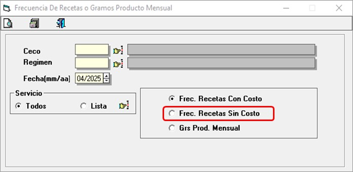
Frecuencia de Receta Sin Costo:
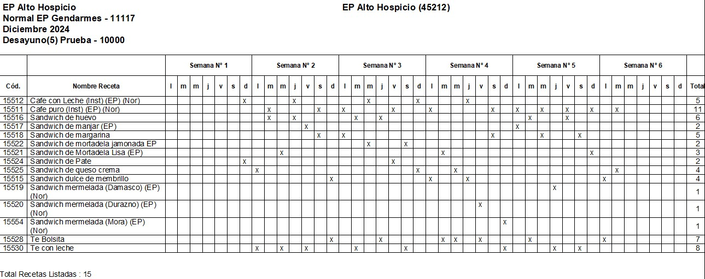
Este informe muestra cuántas veces se utiliza cada receta dentro de la minuta del mes. Cada fila corresponde a una receta y las columnas representan los días distribuidos en semanas. Una marca “x” indica que la receta fue programada ese día.
La última columna muestra el total de apariciones por receta, y al final se indica el total de recetas listadas. El objetivo es visualizar rápidamente la frecuencia y distribución de las preparaciones, sin incluir información de costos.

<u>**Descripción:**</u>
Lista todas las recetas de la minuta del mes para el casino, régimen y servicio seleccionados. Por cada receta indica en qué días del mes fue planificada (marcada con "x"), cuántas veces en total apareció en el mes, y al pie el total de recetas listadas. No incluye información de costos.
**Cómo se seleccionan los servicios:** igual al tipo con costo, se usa la grilla de servicios con casillas de verificación.
**Estructura de datos del informe:**

| Campo / Columna | Descripción | Calculado |
| --- | --- | --- |
| Cód. | Código interno de la receta | No |
| Nombre Receta | Nombre descriptivo de la receta | No |
| Semana N° 1 … Semana N° 6 (columnas l, m, m, j, v, s, d) | Días de cada semana donde la receta aparece marcada con "x" | No |
| Total | Cantidad de días distintos en que la receta fue planificada durante el mes | Sí |

<u>**Regla de Negocio:**</u>
El cálculo del campo Total es idéntico al descrito en el tipo "Con Costo"
<u>**Formato Salida:**</u>
Idéntico al tipo con costo en cuanto a orientación, estructura de páginas y encabezados, salvo que la columna de costo por receta y el resumen de costo promedio del servicio no se incluyen

### 8.14.3. Grs Prod. Mensual (I_GramosProductos)

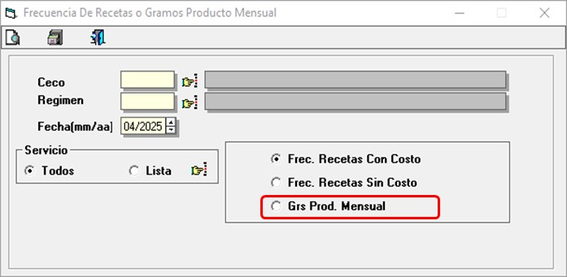
Gramos productos mensual:
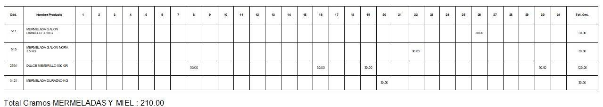
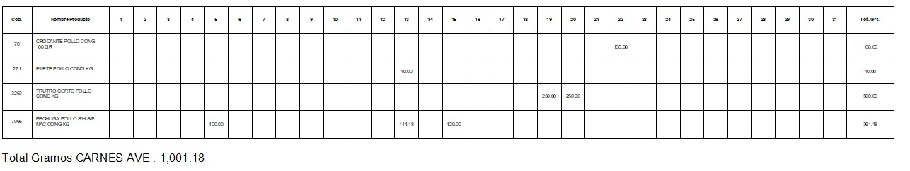
El informe muestra, para cada producto, los gramos utilizados por día durante el mes, organizados en una matriz con los días como columnas. Cada fila corresponde a un producto identificado por su código y nombre, y los valores numéricos indican la cantidad utilizada en cada fecha. La última columna muestra el total mensual por producto.
Al final del reporte se presenta el total general de gramos consumidos para la categoría analizada.

<u>**Descripción:**</u>
Lista todos los productos (ingredientes materializados) utilizados en las recetas de la minuta del mes, agrupados por categoría de producto. Para cada producto indica cuántos gramos fueron utilizados cada día del mes (distribuidos en columnas del día 1 al 31) y el total de gramos del mes. Al pie de cada categoría se muestra el total de gramos de esa categoría, y al final del servicio se muestran el total de productos listados y el total general de gramos.
**Cómo se seleccionan los servicios:** igual a los tipos anteriores, se usa la grilla de servicios con casillas de verificación.
**Estructura de datos del informe:**

| Campo / Columna | Descripción | Calculado |
| --- | --- | --- |
| Cód. | Código interno del producto (ingrediente materializado) | No |
| Nombre Producto | Nombre del producto tal como está registrado en el catálogo de productos | No |
| Día 1 … Día 31 (columnas numéricas) | Gramos del producto utilizados en ese día del mes, calculados a partir del gramaje por ración de la receta | Sí |
| Tot. Grs. | Total de gramos del producto durante todo el mes | Sí |

<u>**Regla de Negocio:**</u>
**Cálculo — Gramos por día**
La cantidad de gramos de cada producto por día se obtiene de la relación entre el gramaje del ingrediente en la receta y la base de raciones de la receta. El sistema aplica además las tablas de gramaje por nivel (jerarquía de reemplazos de ingredientes configurada para el casino y régimen), si existen, antes de calcular el gramaje final.
**Fórmula o lógica:** Gramos por día = (gramaje del ingrediente en la receta ÷ base de raciones de la receta) × raciones planificadas para ese día

| Componente | Qué representa | De dónde viene |
| --- | --- | --- |
| Gramaje del ingrediente | Cantidad del ingrediente por la base de raciones de la receta, con posible ajuste por tabla de gramaje por nivel | b_recetadet.red_canpro ajustado por fn_ObtenerIngredienteReemplazoJerarquia |
| Base de raciones | Número de raciones base para las que está formulada la receta | b_receta.rec_basrac |
| Raciones planificadas | Número de raciones planificadas para ese día en la minuta | cas_b_minutadet.mid_numrac |

Ejemplo: si una receta tiene 500 g de harina para una base de 100 raciones, y el día 5 se planificaron 120 raciones, los gramos de harina para ese día son (500 ÷ 100) × 120 = 600 g.
**Cálculo — Tot. Grs. (total mensual por producto)**
Suma de los gramos calculados para todos los días del mes en que el producto aparece en la minuta. Se acumula internamente en una matriz de 31 posiciones (una por día) y la posición 32 acumula el total.
**Fórmula o lógica:** Tot. Grs. = Σ(gramos del día 1 + gramos del día 2 + … + gramos del día 31)

| Componente | Qué representa | De dónde viene |
| --- | --- | --- |
| Gramos por día | Calculado según fórmula anterior | Calculado durante la iteración del informe |

<u>**Formato Salida:**</u>
Documento RTF en orientación horizontal (paisaje). Una sección por servicio, con página nueva para cada categoría de producto. El encabezado de cada sección contiene: nombre del casino con código CECO, nombre del régimen con código, mes y año en texto, y nombre del servicio con código. La fila de encabezado de la tabla muestra el código, el nombre del producto, los números de día del 1 al 31, y la columna de total de gramos. Al pie de cada grupo de categoría se muestra el total de gramos de esa categoría. Al pie de cada servicio se muestran el total de productos listados y el total general de gramos del mes.

## 8.15. Informe Planificación (I_PlanifBloque.frm)

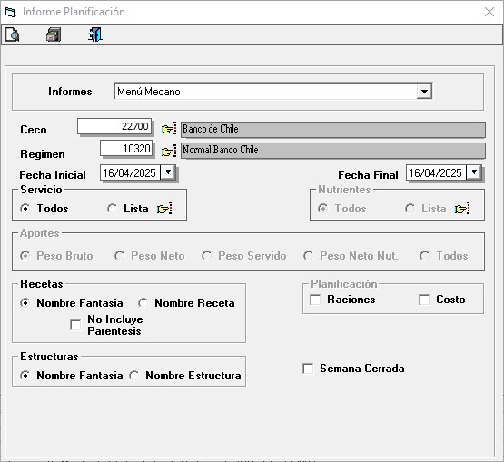
<u>**Descripción:**</u>
Esta pantalla permite generar informes sobre la planificación de minutas en régimen bloque. A partir de un casino (ceco), un régimen y un rango de fechas, el usuario puede obtener 16 variantes de informe que cubren cuatro grandes áreas: presentación del menú, aportes nutricionales, tabla de gramajes y huella de carbono.
Los tipos del (00) al (05) producen un documento en la ventana de Vista Previa del sistema (formato RTF), desde donde se puede imprimir o exportar. Los tipos del (06) al (15) abren un libro de Microsoft Excel directamente con los datos organizados por hojas, una por servicio seleccionado.
La selección de servicios funciona de dos maneras según el tipo elegido: para los tipos (00)–(05) el usuario marca filas en una grilla de servicios disponibles; para los tipos (06)–(15) el usuario expande un árbol de servicios y estructuras de servicio, marcando las casillas de las estructuras que desea incluir.

| Campo | Obligatorio | Condición |
| --- | --- | --- |
| Ceco | Sí | Debe existir en el maestro de clientes |
| Régimen | Sí | Debe existir en el maestro de regímenes |
| Fecha Inicial | Sí | Formato dd/mm/yyyy |
| Fecha Final | Sí | Formato dd/mm/yyyy; debe ser igual o mayor a la fecha inicial |
| Tipo de informe | Sí | Seleccionar uno de los 16 tipos en el selector |
| Servicio(s) | Sí | Al menos un servicio marcado (tipos 00–05) o al menos una estructura de servicio marcada en el árbol (tipos 06–15) |
| Nutriente(s) | Condicional | Al menos un nutriente marcado cuando el tipo es (02), (03), (04), (07), (08), (09) o (12) |
| Opción de nombre de receta | No | Elegir entre nombre fantasia o nombre de receta |
| Opción de nombre de estructura | No | Disponible para tipos que muestran estructura de servicio |
| Semana cerrada | No | Aplica a tipos (01), (05) y (06); cambia encabezados de columna de fecha real a "DIA 01", "DIA 02"… |
| Mostrar raciones | No | Disponible para tipos (01), (05) y (06) |
| Mostrar costo | No | Disponible para tipos (01), (05) y (06) |
| Incluir paréntesis en nombre | No | Incluye o excluye el texto entre paréntesis del nombre de la receta |
| Tipo de gramaje | Condicional | "Bruto" o "Cant. Servida"; solo activo para tipos (10) y (11) |

<u>**Reglas de Negocio:**</u>
NA
<u>**Tablas Relacionadas:**</u>

| Tabla | Rol |
| --- | --- |
| cas_b_minuta | Cabecera de la minuta (ceco, régimen, servicio, fecha) |
| cas_b_minutadet | Detalle de la minuta: recetas por día, estructura de servicio, raciones, costos |
| b_receta | Maestro de recetas: nombre, nombre fantasia, base de raciones, costo, indicadores |
| b_recetadet | Detalle de la receta: ingredientes con cantidades y porcentajes |
| b_ingrediente | Maestro de ingredientes: nombre, factor nutricional, porcentajes de aprovechamiento y cocción, huella de carbono |
| b_productonut | Tabla de aportes nutricionales por ingrediente (código de aporte, cantidad de aporte por unidad) |
| a_estservicio | Maestro de estructuras de servicio (nombre, código de servicio al que pertenece) |
| a_servicio | Maestro de servicios (nombre, orden) |
| a_regimen | Maestro de regímenes (nombre) |
| b_clientes | Maestro de clientes/cecos (nombre, tipo de ceco) |
| a_grupoestructura | Agrupación de estructuras de servicio (para huella de carbono) |
| b_tablagramajececo | Tabla de gramajes personalizados por ceco/régimen/ingrediente (sobrescribe red_canpro) |
| paso_servicio | Tabla de paso de servicios seleccionados por sesión (se limpia antes y después del informe) |

### 8.15.1. Menú Mecano (Función Impresión I_MenuPlanMecanoBloque)

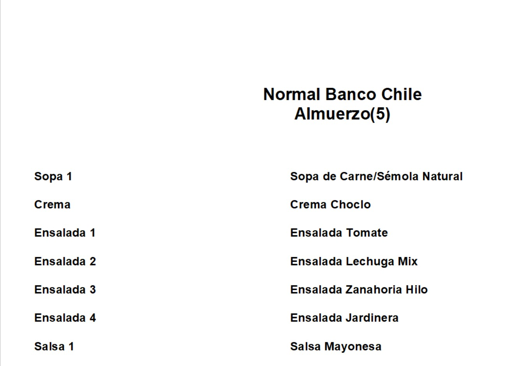
Este informe permite mostrar menú del día para un régimen y servicio en particular, con su estructura y descripción de la receta.
<u>**Descripción:**</u>
**Qué muestra.** Genera un informe de "menú mecano" en la ventana de Vista Previa. Cada página corresponde a un servicio y un día de la minuta. El contenido se organiza en una tabla de tres columnas: nombre de la estructura de servicio, columna separadora en blanco, y nombre de la receta planificada para esa estructura en ese día.
**Restricciones propias.** No hay restricciones adicionales más allá de las generales del formulario. Si no existen registros para el servicio y el rango de fechas, el informe no genera ninguna página para ese servicio.
**Cómo se seleccionan los servicios.** El usuario marca filas en la grilla de servicios (panel "Servicio" con opciones "Todos" / "Lista"). El informe genera una sección por cada servicio marcado.
**Opciones de configuración disponibles.**
Nombre de receta: nombre fantasia (rec_nomfan) o nombre estándar (rec_nombre)
Nombre de estructura de servicio: nombre del campo ess_nombre o descripción de la planificación (mid_desest) según la opción "opnomest"
Semana cerrada: los encabezados de página muestran "DIA 01", "DIA 02"… en vez de la fecha real
Incluir o excluir texto entre paréntesis del nombre de receta
**Estructura de datos del informe.**
El informe se construye a partir del SP sgpadm_Sel_InfMecanoMinutaBloque_V02. Cada fila del resultado corresponde a una combinación de día, estructura de servicio y receta.

| Campo / Columna | Descripción | Calculado |
| --- | --- | --- |
| Nombre de régimen | Nombre del régimen, leído desde a_regimen.reg_nombre | No |
| Nombre de servicio | Nombre del servicio, leído desde la grilla del formulario (origen: a_servicio.ser_nombre) | No |
| Fecha / Día | Fecha de la minuta (min_fecmin) o número de día si "semana cerrada" está activa | No / Sí |
| Nombre de estructura | ess_nombre de a_estservicio, o mid_desest de cas_b_minutadet si "opnomest" está activo y mid_desest no es nulo | Sí (condicional) |
| Nombre de receta | rec_nomfan de b_receta (nombre fantasia) o rec_nombre (nombre estándar), según la opción seleccionada; opcionalmente se elimina el contenido entre paréntesis | Sí (condicional) |

<u>**Regla de Negocio:**</u>
El SP genera un contador automático con IDENTITY(1,1) que asigna un número de orden a cada fila del resultado. Este número no tiene relación con la fecha sino con el orden de aparición en el resultado.

| Componente | Valor |
| --- | --- |
| Tipo | Contador IDENTITY(INT,1,1) en tabla temporal #PASO |
| Inicio | 1 para el primer registro del resultado |
| Incremento | 1 por cada fila |

<u>**Formato Salida:**</u>
Documento en la ventana de Vista Previa, orientación vertical. Una tabla sin bordes por servicio/día. El usuario puede imprimir o exportar desde esa ventana.
Mejoras:
Incluir calorías,  alergeno y estilo alimentación, para cada receta impresa.

### 8.15.2. Menú Mensual (Función Impresión I_MenuPlanMensualSemanaCerradaokBloque, I_MenuPlanMensualBloque)

> Comentario - Paz Jorge (2026-04-01): No considerar

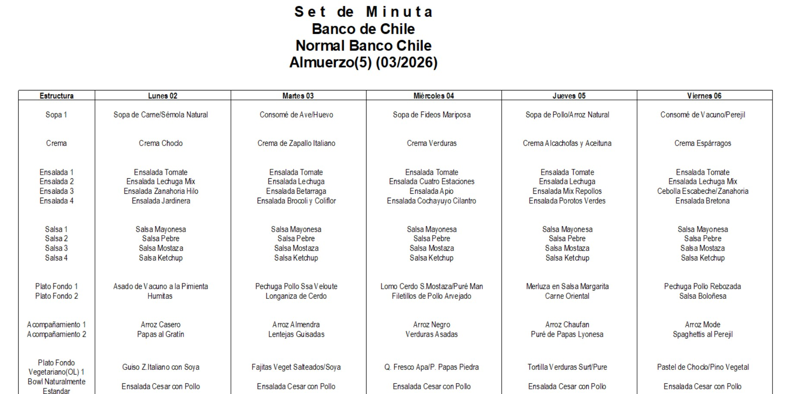
Este informe es un calendario semanal que va mostrando en su primera columna la estructura del servicio y posterior muestra los días de la semana con su descripción de receta.
<u>**Descripción:**</u>
**Qué muestra.** Genera un informe mensual en la ventana de Vista Previa con las recetas planificadas organizadas en una grilla donde las filas son estructuras de servicio y las columnas son los días de la semana (Lunes a Domingo). Cada hoja de la grilla representa una semana del mes. El encabezado muestra el nombre del casino, régimen y servicio con el mes/año.
**Restricciones propias.** Las fechas inicial y final deben pertenecer al mismo mes calendario. Si se viola esta condición, el sistema emite el mensaje "El mes debe ser el mismo en ambas fechas" y no genera el informe. Cuando la casilla "Semana Cerrada" está activa, los encabezados de columna muestran "DIA 01" … "DIA 07" en lugar del día de la semana con fecha.
**Cómo se seleccionan los servicios.** El usuario marca filas en la grilla de servicios. Se genera una hoja por servicio marcado.
**Opciones de configuración disponibles.**
Nombre de receta: fantasia o estándar
Nombre de estructura: nombre propio o descripción de la planificación
Semana cerrada: columnas por número de día en vez de día de semana con fecha
Mostrar raciones: agrega el número de raciones planificadas al nombre de la receta
Mostrar costo: agrega el costo unitario formateado al nombre de la receta
Incluir paréntesis en nombre de receta
**Estructura de datos del informe.**
Utiliza sgpadm_Sel_MinutaBloqueMenuMensualxEstservicio (cuando "semana cerrada" está inactiva) o sgpadm_Sel_DetalleMinutaBloqueSemanaCerrada_V02 (cuando "semana cerrada" está activa). El informe recibe el XML de estructuras seleccionadas.

| Campo / Columna | Descripción | Calculado |
| --- | --- | --- |
| Encabezado "Estructura" | Columna fija con el nombre de la estructura de servicio (ess_nombre) | No |
| Columnas de día (Lunes … Domingo o DIA 01 … DIA 07) | Cabeceras generadas por el formulario según la posición de la fecha en la semana | Sí |
| Celda día × estructura | Nombre de la receta planificada, opcionalmente con raciones y costo | Sí (condicional) |

<u>**Regla de Negocio:**</u>
El formulario construye el texto de la celda combinando varios campos:
Si "nombre fantasia" → usa rec_nomfan; si no → usa rec_nombre
Si "no incluir paréntesis" → aplica función ExtraeParentesis() que elimina el contenido entre paréntesis
Si "mostrar raciones" → agrega "( " & mid_numrac & " raciones)"
Si "mostrar costo" → agrega "- Costo uni. $ " & Format(mid_cosrec, ...)
**Cálculo — Columna del día en la grilla**
El formulario calcula la posición de columna para cada fila del resultado según la función fg_Dia(min_fecmin) que devuelve el número de día de la semana (Domingo=1, Lunes=2 … Sábado=7). Luego mapea ese valor al índice de columna correspondiente (1=Domingo→columna 1, 2=Lunes→columna 2, etc.).

<u>**Formato Salida:**</u>
Documento en la ventana de Vista Previa, orientación horizontal. Tabla con bordes que agrupa la semana. El encabezado de la tabla se repite cada semana.

### 8.15.3. Aporte Nutricional Detallado (Función Impresión I_MenuPlanMensualSemanaCerradaokBloque – I_MenuPlanMensualBloque.frm)

> Comentario - Paz Jorge (2026-04-01): No Considerar

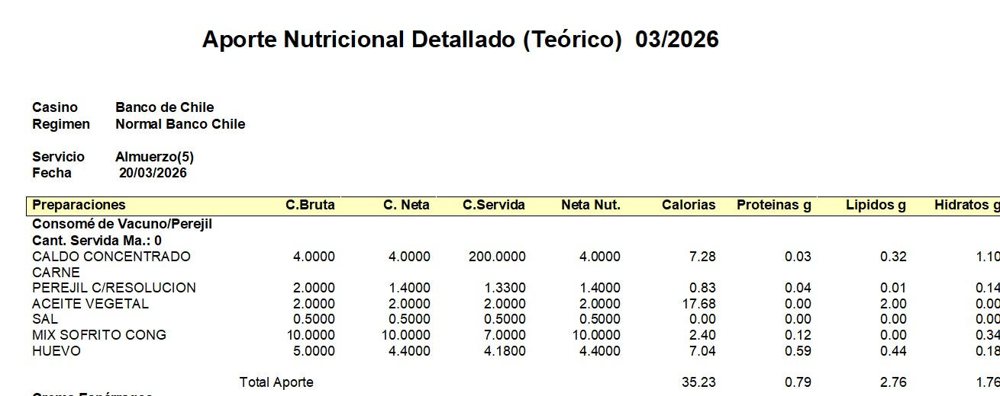

<u>**Descripción:**</u>
**Qué muestra.** Genera en la ventana de Vista Previa el detalle de aportes nutricionales por ingrediente de cada receta de la minuta. Para cada día del período, lista las recetas y, dentro de cada receta, los ingredientes con sus cantidades de aporte nutricional para los nutrientes seleccionados. Al final de cada receta imprime un subtotal ("Total Aporte") y al final del día un total del día.
**Restricciones propias.** Requiere que al menos un nutriente esté marcado en el panel de nutrientes. Si la opción "Todos" está activa en el panel de Nutrientes, usa todos los nutrientes con nut_indpri = 1 (los que se cargan por defecto al abrir el formulario).
**Cómo se seleccionan los servicios.** El usuario marca filas en la grilla de servicios.
**Opciones de configuración disponibles.**
Tipo de peso para columna de cantidad: Peso Bruto (canpro), Peso Servido (canpro × red_pctcoc/100 × red_pctapr/100), Neta Nut. (canpro × red_pctnut/100), Peso Neto (canpro × red_pctapr/100), o Todos (las cuatro columnas simultáneamente)
Nombre de receta: fantasia o estándar
Semana cerrada: número de día en vez de fecha real
Incluir paréntesis en nombre de receta
Nutrientes: selección libre de los nutrientes que aparecerán como columnas del informe
**Estructura de datos del informe.**
Usa sgpadm_Sel_AporteMinutasDetBloque_V02 para el detalle de ingredientes y sgpadm_Sel_AportePlanifMinutaBloque_V02 para los aportes nutricionales (tabla de producto-nutriente-cantidad).

| Campo / Columna | Descripción | Calculado |
| --- | --- | --- |
| Encabezado de día o fecha | Fecha real (min_fecmin) o número de día según "semana cerrada" | Condicional |
| Casino | Cli_nombre de b_clientes | No |
| Régimen | reg_nombre de a_regimen | No |
| Servicio | ser_nombre del servicio seleccionado | No |
| Preparaciones | Nombre de la receta (rec_nomfan o rec_nombre) | Sí (condicional) |
| Cant. Servida Ma. | Cantidad servida máxima (rec_canser) de b_receta | No |
| Ingrediente | ing_nombre de b_ingrediente | No |
| C.Bruta | Cantidad bruta por ración (canpro = red_canpro / rec_basrac) | Sí |
| C.Neta | Cantidad neta por ración = canpro × (red_pctapr / 100) | Sí |
| C.Servida | Cantidad servida = canpro × (red_pctcoc/100) × (pctapr/100) | Sí |
| Neta Nut. | Cantidad neta nutricional = canpro × (red_pctnut / 100) | Sí |
| [Nutriente N] | Aporte del nutriente N para el ingrediente | Sí |
| Total Aporte | Suma de aportes por nutriente acumulada durante la receta | Sí |
| Total Día | Suma de aportes por nutriente acumulada durante el día | Sí |

<u>**Regla de Negocio:**</u>
** Cantidad bruta por ración (canpro)**

| Componente | Valor |
| --- | --- |
| Fórmula | red_canpro / rec_basrac |
| red_canpro | Cantidad del ingrediente en la receta (gramos), campo directo de b_recetadet |
| rec_basrac | Base de raciones de la receta, campo directo de b_receta |
| Resultado | Gramos del ingrediente por ración de la receta |

**Cálculo — Cantidad neta (C.Neta)**

| Componente | Valor |
| --- | --- |
| Fórmula | canpro × (red_pctapr / 100) |
| red_pctapr | Porcentaje de aprovechamiento del ingrediente en la receta |
| Resultado | Peso neto por ración, en gramos |

**Cálculo — Cantidad servida (C.Servida)**

| Componente | Valor |
| --- | --- |
| Fórmula | canpro × (red_pctcoc / 100) × (pctapr / 100) |
| red_pctcoc | Porcentaje de cocción del ingrediente en la receta |
| pctapr | Si el ingrediente fue reemplazado (red_codpro ≠ ori_codpro) usa ing_pctapr de b_ingrediente; si no, usa red_pctapr de la receta |
| Resultado | Peso servido por ración, en gramos |

**Cálculo — Cantidad neta nutricional (Neta Nut.)**

| Componente | Valor |
| --- | --- |
| Fórmula | canpro × (red_pctnut / 100) |
| red_pctnut | Porcentaje nutricional del ingrediente |
| Resultado | Peso neto para cálculo de nutrientes, en gramos |

**Cálculo — Aporte de nutriente N**

| Componente | Valor |
| --- | --- |
| Fórmula | (red_pctnut / 100) × pnu_canapo × canpro / ing_facnut |
| pnu_canapo | Cantidad de aporte del nutriente por unidad de ingrediente, de b_productonut |
| ing_facnut | Factor nutricional del ingrediente, de b_ingrediente |
| Resultado | Gramos (o unidad del nutriente) por ración |

El aporte por nutriente se acumula en vecrec(j) (total de la receta) y en VecDia(j) (total del día) durante el recorrido del cursor.
**Ejemplo:** Ingrediente con canpro = 100 g, red_pctnut = 90%, pnu_canapo = 2.5, ing_facnut = 100: Aporte = (90/100) × 2.5 × 100 / 100 = 2.25 unidades del nutriente.

<u>**Formato Salida:**</u>
Documento en la ventana de Vista Previa, orientación vertical. Se genera una nueva página por cada día del período.

### 8.15.4. Aporte Nutricional Resumido (Función Impresión I_AportePlanDetalladoBloque)

> Comentario - Paz Jorge (2026-04-01): No Considerar

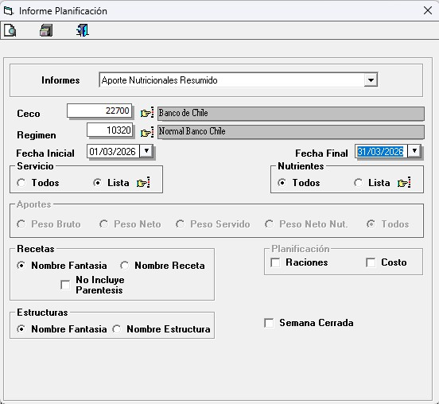
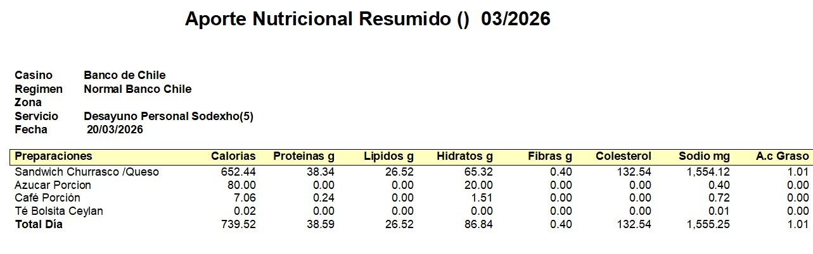
Este informe presenta un resumen nutricional correspondiente a un conjunto de preparaciones. Se muestran los aportes estimados según la selección del usuario, para cada ítem, junto con un total general que consolida el valor nutricional del día.

<u>**Descripción:**</u>
**Qué muestra.** Similar al tipo (02) pero sin el detalle por ingrediente. Para cada receta de la minuta muestra directamente el total de aporte nutricional por nutriente seleccionado, sin listar los ingredientes uno a uno. Al final del día incluye el total del día por nutriente.
**Restricciones propias.** Requiere al menos un nutriente marcado.
**Cómo se seleccionan los servicios.** Grilla de servicios (tipos 00–05).
**Opciones de configuración disponibles.**
Nombre de receta: fantasia o estándar
Semana cerrada
Nutrientes: selección de columnas
Incluir paréntesis en nombre de receta
**Estructura de datos del informe.**
Usa el mismo par de SPs que el tipo (02): sgpadm_Sel_AportePlanifMinutaBloque_V02 (tabla de aportes) y sgpadm_Sel_AporteMinutasDetBloque_V02 (detalle de ingredientes).

| Campo / Columna | Descripción | Calculado |
| --- | --- | --- |
| Casino | Cli_nombre de b_clientes | No |
| Régimen | reg_nombre de a_regimen | No |
| Servicio | Nombre del servicio seleccionado | No |
| Fecha / Día | Fecha real o número de día | No / Sí |
| Preparaciones | Nombre de la receta (rec_nomfan o rec_nombre) | Sí (condicional) |
| [Nutriente N] (columna por receta) | Total de aporte del nutriente N acumulado para toda la receta | Sí |
| Total Día | Suma total de aportes por nutriente durante el día | Sí |

<u>**Regla de Negocio:**</u>
**Total de aporte por receta y por nutriente**
El formulario recorre el cursor de sgpadm_Sel_AporteMinutasDetBloque_V02 (ingredientes) y acumula en vecrec(j):
vecrec(j) += (red_pctnut / 100) × pnu_canapo × canpro / ing_facnut
Donde pnu_canapo viene de b_productonut cruzado previamente vía sgpadm_Sel_AportePlanifMinutaBloque_V02. Al cambiar de receta se imprime el acumulado y se reinicia vecrec. Al cambiar de día se imprime el total del día desde VecDia(j) y se reinicia.
<u>**Formato Salida:**</u>
Documento en la ventana de Vista Previa, orientación vertical. Una página por día del período.

### 8.15.5. Aporte Nutricional por Estructura Resumido (Función Impresión I_AportePlanResBloque)

> Comentario - Paz Jorge (2026-04-01): No Considerar

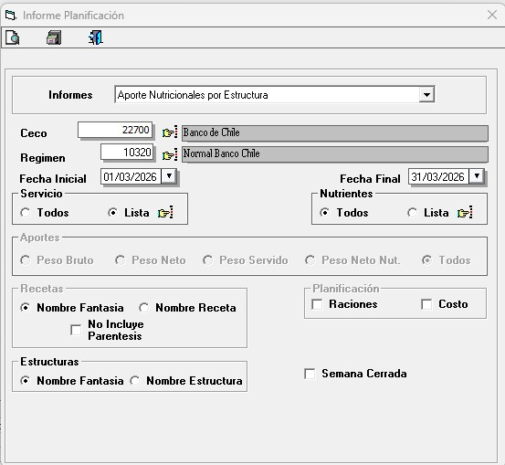
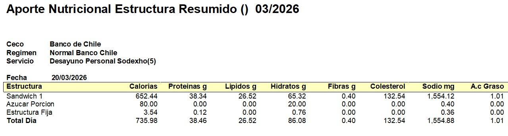
Este informe presenta un resumen nutricional basado en distintas preparaciones incluidas en una estructura alimentaria específica.
<u>**Descripción:**</u>
**Qué muestra.** Similar al tipo (03) pero agrupado por estructura de servicio. Para cada estructura de servicio en la minuta muestra el total de aporte nutricional por nutriente seleccionado, acumulando todos los días del período.
**Restricciones propias.** Requiere al menos un nutriente marcado. Las fechas no están restringidas al mismo mes.
**Cómo se seleccionan los servicios.** Grilla de servicios.
**Opciones de configuración disponibles.**
Nombre de receta: fantasia o estándar
Nombre de estructura de servicio
Nutrientes: selección de columnas
Semana cerrada: no aplica para este tipo (el parámetro opSemCerrada no se pasa en el formulario)
**Estructura de datos del informe.**
Usa sgpadm_Sel_MinutaBloqueAporteDetxEstServicio_V02 (recibe XML de estructuras seleccionadas).

| Campo / Columna | Descripción | Calculado |
| --- | --- | --- |
| Ceco | Cli_nombre | No |
| Régimen | reg_nombre | No |
| Servicio | ser_nombre | No |
| Estructura | ess_nombre de a_estservicio | No |
| Preparaciones | Nombre de receta | Sí (condicional) |
| [Nutriente N] | Aporte acumulado del nutriente para la estructura durante el período | Sí |

<u>**Regla de Negocio:**</u>
**Aportes acumulados por estructura**
El formulario usa sgpadm_Sel_TotalRegMinutaBloque y vectores de resumen para acumular el aporte total por estructura. La fórmula base es la misma que en el tipo (02), pero el corte de control es por estructura (mid_estser) en vez de por receta.
**canpro (cantidad bruta por ración)**

| Componente | Valor |
| --- | --- |
| Fórmula | red_canpro / rec_basrac |
| Calculado en | SP, columna canpro |

<u>**Formato Salida:**</u>
Documento en la ventana de Vista Previa, orientación vertical.

### 8.15.6. Aporte Nutricional por Estructura (I_AportePlanEstrResBloque)

> Comentario - Paz Jorge (2026-04-01): No Considerar

Este informe presenta un resumen nutricional basado en distintas preparaciones incluidas en una estructura alimentaria específica. Se detallan los aportes estimados seleccionado por el usuario de la lista, para cada componente, junto con un total general correspondiente al día.

<u>**Descripción:**</u>
**Qué muestra.** Similar al tipo (03) pero agrupado por estructura de servicio. Para cada estructura de servicio en la minuta muestra el total de aporte nutricional por nutriente seleccionado, acumulando todos los días del período.
**Restricciones propias.** Requiere al menos un nutriente marcado. Las fechas no están restringidas al mismo mes.
**Cómo se seleccionan los servicios.** Grilla de servicios.
**Opciones de configuración disponibles.**
Nombre de receta: fantasia o estándar
Nombre de estructura de servicio
Nutrientes: selección de columnas
Semana cerrada: no aplica para este tipo (el parámetro opSemCerrada no se pasa en el formulario)
**Estructura de datos del informe.**
Usa sgpadm_Sel_MinutaBloqueAporteDetxEstServicio_V02 (recibe XML de estructuras seleccionadas).

| **Campo / Columna** | **Descripción** | **Calculado** |
| --- | --- | --- |
| Ceco | Cli_nombre | No |
| Régimen | reg_nombre | No |
| Servicio | ser_nombre | No |
| Estructura | ess_nombre de a_estservicio | No |
| Preparaciones | Nombre de receta | Sí (condicional) |
| [Nutriente N] | Aporte acumulado del nutriente para la estructura durante el período | Sí |

**Qué muestra.** Similar al tipo (03) pero agrupado por estructura de servicio. Para cada estructura de servicio en la minuta muestra el total de aporte nutricional por nutriente seleccionado, acumulando todos los días del período.
**Restricciones propias.** Requiere al menos un nutriente marcado. Las fechas no están restringidas al mismo mes.
**Cómo se seleccionan los servicios.** Grilla de servicios.
**Opciones de configuración disponibles.**
Nombre de receta: fantasía o estándar
Nombre de estructura de servicio
Nutrientes: selección de columnas
Semana cerrada: no aplica para este tipo (el parámetro opSemCerrada no se pasa en el formulario)
**Estructura de datos del informe.**
Usa sgpadm_Sel_MinutaBloqueAporteDetxEstServicio_V02 (recibe XML de estructuras seleccionadas).

| Campo / Columna | Descripción | Calculado |
| --- | --- | --- |
| Ceco | Cli_nombre | No |
| Régimen | reg_nombre | No |
| Servicio | ser_nombre | No |
| Estructura | ess_nombre de a_estservicio | No |
| Preparaciones | Nombre de receta | Sí (condicional) |
| [Nutriente N] | Aporte acumulado del nutriente para la estructura durante el período | Sí |

<u>**Regla de Salida:**</u>
**Cálculo — Aportes acumulados por estructura**
El formulario usa sgpadm_Sel_TotalRegMinutaBloque y vectores de resumen para acumular el aporte total por estructura. La fórmula base es la misma que en el tipo (02), pero el corte de control es por estructura (mid_estser) en vez de por receta.

| Campo | Tabla de origen | Calculado |
| --- | --- | --- |
| mid_tipmin | cas_b_minutadet | No |
| mid_numlin | cas_b_minutadet | No |
| mid_codrec | cas_b_minutadet | No |
| mid_cosrec | cas_b_minutadet | No |
| min_fecmin | cas_b_minuta | No |
| min_indblo | cas_b_minuta | No |
| rec_nombre | b_receta | No |
| rec_nomfan | b_receta | No |
| mid_numrac | cas_b_minutadet | No |
| red_codpro | b_recetadet, actualizado por fn_ObtenerIngredienteReemplazoJerarquia | Sí |
| red_pctapr | b_recetadet | No |
| red_pctcoc | b_recetadet | No |
| red_pctnut | b_recetadet | No |
| canpro | red_canpro / rec_basrac (calculado en SP) | Sí |
| ing_nombre | b_ingrediente | No |
| ing_facnut | b_ingrediente | No |
| ing_pctapr | b_ingrediente | No |
| ori_codpro | Código original antes del reemplazo | Sí |
| nreg | Conteo total de filas del resultado (@nreg) | Sí |
| rec_indppr | b_receta (indicador propuesta/real) | No |
| rec_canser | b_receta (cantidad servida máxima) | No |

**Cálculo — canpro (cantidad bruta por ración)**

| Componente | Valor |
| --- | --- |
| Fórmula | red_canpro / rec_basrac |
| Calculado en | SP, columna canpro |

<u>**Formato de Salida:**</u>
Documento en la ventana de Vista Previa, orientación vertical.

### 8.15.7. Menú Mensual Servicios

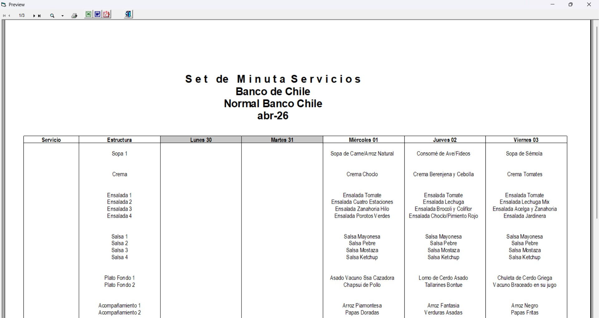

Variante del tipo (01) que combina múltiples servicios en una misma tabla semanal. Las filas tienen dos columnas identificadoras: "Servicio" y "Estructura", seguidas de las columnas de días de la semana. Permite ver en una sola grilla todos los servicios seleccionados comparativamente.
**Restricciones propias.** Las fechas deben pertenecer al mismo mes. El sistema llama a la función escalar sgpadm_p_DiasSemanaCorridaServicioBloque para determinar cuántas columnas de día incluir (hasta 8 columnas, contemplando posibilidad de sábado y domingo). El procesamiento es semana a semana: por cada semana del mes llama a sgpadm_Sel_InformeMensualServicioBloque_V02 con el rango de esa semana.
**Cómo se seleccionan los servicios.** Todos los servicios o algunos servicios.
**Opciones de configuración disponibles.**
Nombre de receta: fantasia o estándar
Nombre de estructura
Semana cerrada
Mostrar raciones y costo
Incluir paréntesis en nombre de receta
**Estructura de datos del informe.**
El SP sgpadm_Sel_InformeMensualServicioBloque_V02 retorna los mismos campos que sgpadm_Sel_MinutaBloqueMenuMensualxEstservicio pero para todos los servicios de una semana simultáneamente, más el campo min_codser que identifica el servicio.

| **Campo / Columna** | **Descripción** | **Calculado** |
| --- | --- | --- |
| Servicio | min_codser — código del servicio de la minuta | No |
| Estructura | ess_nombre de a_estservicio | No |
| Columnas de día (Lunes … Domingo o DIA N) | Nombre de receta por día | Sí |

Los mismos campos del SP que el tipo (01). El formulario usa mid_numlin para posicionar la receta en la fila correcta de la grilla y usa fg_Dia(min_fecmin) para posicionarla en la columna correcta.
**Formato de salida.** Documento en la ventana de Vista Previa, orientación horizontal.

### 8.15.8. Menú Mensual Formato Comercial (Función Exportar Excel ExportarExcelMenuMensualMKT)

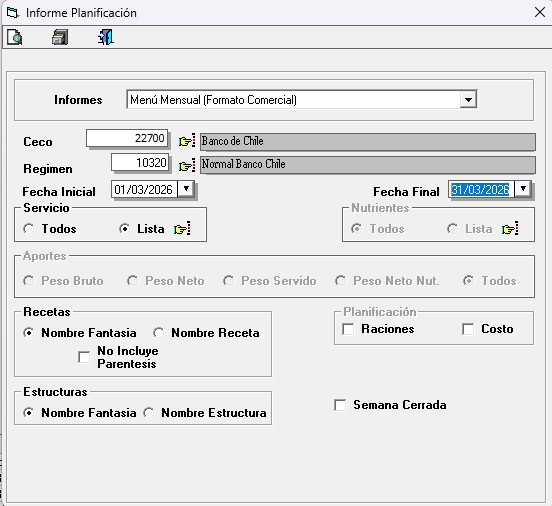
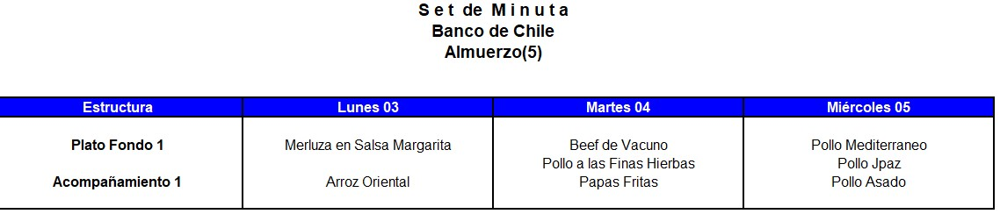
Este archivo Excel muestra una tabla que presenta distintas preparaciones asignadas a varias columnas dentro de un periodo específico. Cada columna incluye opciones gastronómicas correspondientes, organizadas visualmente según la estructura del menú.
<u>**Descripción:**</u>
**Qué muestra.** Variante del tipo (01) que combina múltiples servicios en un mismo libro y distintas hojas. Las filas tienen dos columnas identificadoras: "Servicio" y "Estructura", seguidas de las columnas de días de la semana.
**Restricciones propias.** Las fechas deben pertenecer al mismo mes. El sistema llama a la función escalar sgpadm_p_DiasSemanaCorridaServicioBloque para determinar cuántas columnas de día incluir (hasta 8 columnas, contemplando posibilidad de sábado y domingo). El procesamiento es semana a semana: por cada semana del mes llama a sgpadm_Sel_InformeMensualServicioBloque_V02 con el rango de esa semana.
**Cómo se seleccionan los servicios.** Puedes seleccionar todos los servicios o algunos.
**Opciones de configuración disponibles.**
Nombre de receta: fantasia o estándar
Nombre de estructura
Semana cerrada
Mostrar raciones y costo
Incluir paréntesis en nombre de receta
**Estructura de datos del informe.**
El SP sgpadm_Sel_InformeMensualServicioBloque_V02 retorna los mismos campos que sgpadm_Sel_MinutaBloqueMenuMensualxEstservicio pero para todos los servicios de una semana simultáneamente, más el campo min_codser que identifica el servicio.

| Campo / Columna | Descripción | Calculado |
| --- | --- | --- |
| Servicio | min_codser — código del servicio de la minuta | No |
| Estructura | ess_nombre de a_estservicio | No |
| Columnas de día (Lunes … Domingo o DIA N) | Nombre de receta por día | Sí |

Los mismos campos del SP que el tipo (01). El formulario usa mid_numlin para posicionar la receta en la fila correcta de la grilla y usa fg_Dia(min_fecmin) para posicionarla en la columna correcta.
<u>**Formato Salida:**</u>
Libro de Microsoft Excel abierto al terminar. Ancho de columna 40, texto con ajuste automático, sin líneas de cuadrícula.

### 8.15.9. Aporte Nutricional Detallado Formato Comercial (Función Exportar Excel ExportarExcelPlanDetalladoResumidoMKT opción 1 detallado)

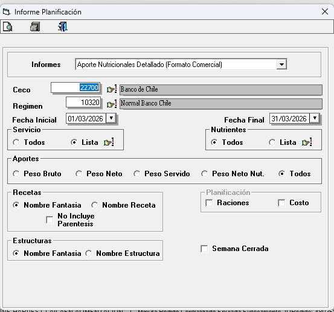
Para obtener este informe debe realizar un clic sobre el botón de la lupa.
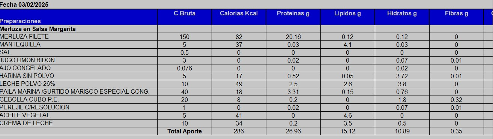
Este archivo Excel muestra una tabla con el detalle nutricional de una preparación, indicando los ingredientes utilizados junto a sus cantidades y el aporte que el usuario haya seleccionado de la lista. Al final se presenta un total que resume el aporte nutricional de la elaboración completa.

<u>**Descripción:**</u>
**Qué muestra.**  Genera un libro con una hoja por servicio. Cada hoja contiene el detalle de aportes nutricionales por ingrediente de cada receta, con las columnas de cantidad de peso y los nutrientes seleccionados.
**Restricciones propias.** Requiere al menos un nutriente marcado.
**Cómo se seleccionan los servicios.** Árbol de servicios y estructuras.
**Opciones de configuración disponibles.**
Nombre de receta: fantasia o estándar
Tipo de peso: Peso Bruto, Peso Neto, Peso Servido, Neta Nut., o Todos
Semana cerrada
Nutrientes: selección de columnas
Incluir paréntesis en nombre de receta
**Estructura de datos del informe.**
Usa sgpadm_Sel_MinutaBloqueAporteDetxEstServicio_V02 con XML de estructuras. El formulario usa la subrutina ExportaExcelPlanDetalladoResumidoMKT con EstadoPresentacion = 1 (modo detallado).

| Campo / Columna Excel | Origen | Calculado |
| --- | --- | --- |
| Fila de casino | Cli_nombre | No |
| Fila de régimen | reg_nombre | No |
| Fila de servicio | Nombre del servicio | No |
| Fila fecha / día | min_fecmin o número de día | No / Sí |
| Columna "Preparaciones" | Nombre de receta + raciones + costo opcionales | Sí |
| Columna "C.Bruta" (si opción activa) | canpro = red_canpro / rec_basrac | Sí |
| Columna "C.Neta" (si opción activa) | canpro × (red_pctapr / 100) | Sí |
| Columna "C.Servida" (si opción activa) | canpro × (red_pctcoc/100) × (pctapr/100) | Sí |
| Columna "Neta Nut." (si opción activa) | canpro × (red_pctnut / 100) | Sí |
| Columna ingrediente | ing_nombre | No |
| Columna [Nutriente N] | (red_pctnut/100) × pnu_canapo × canpro / ing_facnut | Sí |
| Fila "Total Aporte" (por receta) | Acumulado vecrec(j) | Sí |
| Fila "Total Día" | Acumulado VecDia(j) | Sí |

<u>**Formato Salida:**</u>
Libro Excel abierto al terminar.
Mejoras:
El item aportes que tenga la posibilidad de seleccionar más de uno.

### 8.15.10. Aporte Nutricional Resumido (Formato Comercial) (Función Exportar Excel ExportarExcelAportePlanEstrResMKT)

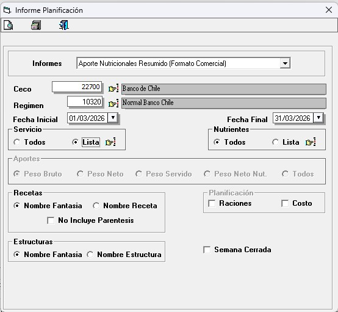
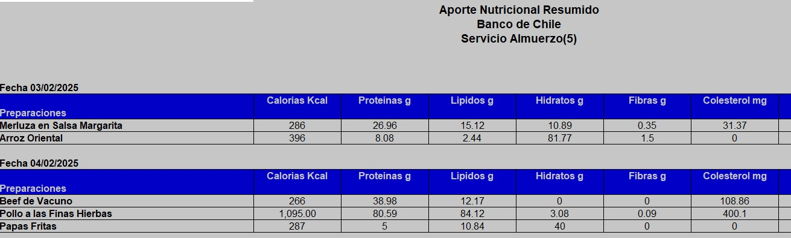
Este formato Excel presenta un resumen nutricional donde se detallan distintas preparaciones junto con su aporte estimado por el usuario que haya seleccionado de la lista aporte. La información se organiza en secciones separadas, cada una con los valores correspondientes a las preparaciones incluidas.
<u>**Descripción:**</u>
**Qué muestra.** Aportes nutricionales a nivel de receta (sin detalle por ingrediente), con totales por día.
**Restricciones propias.** Requiere al menos un nutriente marcado.
**Cómo se seleccionan los servicios.** Árbol de servicios y estructuras.
**Opciones de configuración disponibles.** excepto que no hay opción de "Todos" los pesos simultáneamente.
**Estructura de datos del informe.**
Usa sgpadm_Sel_MinutaBloqueAporteDetxEstServicio_V02.
El formulario usa ExportaExcelPlanDetalladoResumidoMKT con EstadoPresentacion = 2 (modo resumido). Los campos del SP y los cálculos son idénticos a los del tipo (07), pero el formulario omite las filas de ingredientes y solo imprime las filas de receta y totales.

| Campo / Columna Excel | Origen | Calculado |
| --- | --- | --- |
| Fila de encabezado (casino, régimen, servicio, fecha) | Mismo que tipo (07) | Igual |
| Columna "Preparaciones" | Nombre de receta | Sí (condicional) |
| Columna [Nutriente N] (por receta) | Acumulado vecrec(j) | Sí |
| Fila "Total Día" | Acumulado VecDia(j) | Sí |

<u>**Formato Salida:**</u>
Libro Excel abierto al terminar.

### 8.15.11. Aporte Nutricional por Estructura Formato Comercial (Función Exportar Excel ExportarExcelAportePlanEstrResMKT)

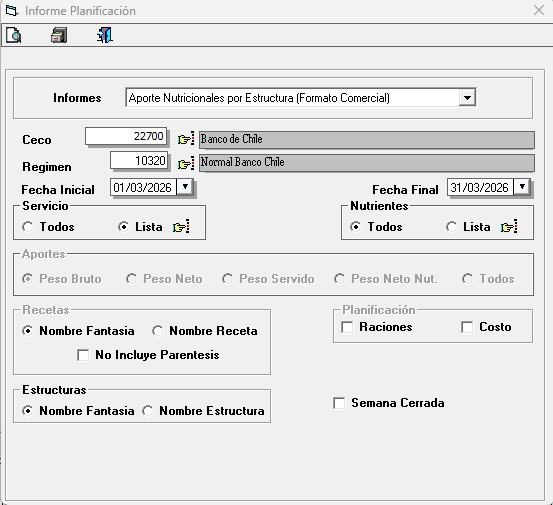
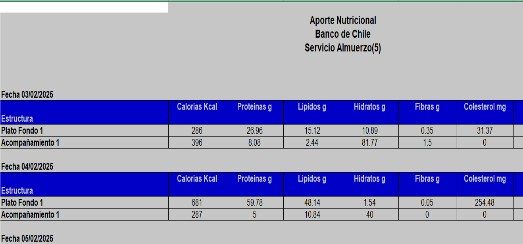
Este formato Excel presenta un resumen nutricional basado en distintas preparaciones incluidas en una estructura alimentaria específica. Se detallan los aportes estimados seleccionado por el usuario de la lista, para cada componente, junto con un total general correspondiente al día.

<u>**Descripción:**</u>
**Qué muestra.** Equivalente al tipo (04) en formato Excel. Aportes nutricionales agrupados por estructura de servicio para el período completo.
**Restricciones propias.** Requiere al menos un nutriente marcado.
**Cómo se seleccionan los servicios.** Árbol de servicios y estructuras.
**Opciones de configuración disponibles.**
Nombre de receta y nombre de estructura
Tipo de peso (Peso Bruto, etc.)
Nutrientes
**Estructura de datos del informe.**
El item aporte queda desactivado, ya que no se utiliza en esta opción.
Usa sgpadm_Sel_MinutaBloqueAporteDetxEstServicio_V02 con XML de estructuras. El formulario usa ExportarExcelAportePlanEstrResMKT. Los campos son los mismos que el tipo (07) pero el corte de control es por estructura (mid_estser).

| Campo / Columna Excel | Origen | Calculado |
| --- | --- | --- |
| Casino / Régimen / Servicio | Mismos que tipo (07) | Igual |
| Columna "Estructura" | ess_nombre o mid_desest | Sí (condicional) |
| Columna [Nutriente N] (por estructura) | Acumulado por estructura | Sí |

<u>**Formato Salida:**</u>
Libro Excel abierto al terminar.

### 8.15.12. Solo Tabla Gramaje Formato Comercial (ExportarExcelSoloTablaGramajeMKT)

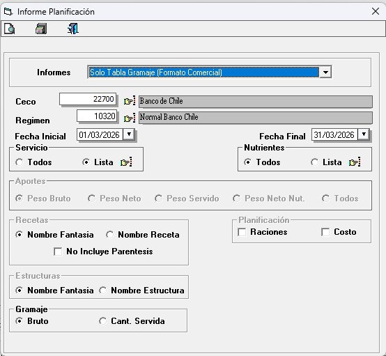
Para obtener este informe debe realizar un clic sobre el botón de la lupa.
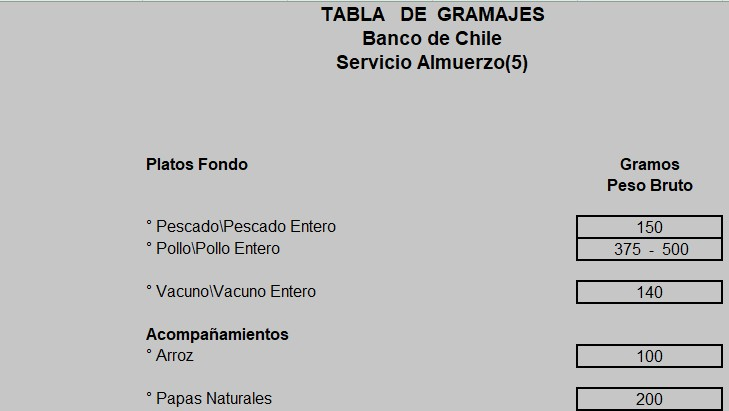
Este informe presenta una tabla que detalla distintos tipos de preparaciones junto con los gramajes asignados a cada una. Se incluyen valores de peso bruto expresados en gramos, organizados de manera ordenada para facilitar la estandarización de porciones dentro de un menú.
<u>**Descripción:**</u>
**Qué muestra.** Genera en Excel una tabla de gramajes organizada por categorías de tipo de plato. Para cada categoría (primera y segunda) muestra los valores de gramaje acumulados de las recetas planificadas. No incluye la columna de frecuencia.
**Restricciones propias.** No están habilitados los paneles de nutrientes ni de servicio RTF. El usuario elige en el panel "Gramaje" si el valor corresponde al peso bruto o a la cantidad servida.
**Cómo se seleccionan los servicios.** Árbol de servicios y estructuras.
**Opciones de configuración disponibles.**
Tipo de gramaje: "Bruto" (columna red_canpro) o "Cant. Servida" (red_canser)
**Estructura de datos del informe.**
Usa sgpadm_Sel_MinutaBloqueTablaGramajeFrecuencia_V02. Solo se presentan las columnas de categoría y gramaje.

| Campo / Columna Excel | Campo del SP | Calculado |
| --- | --- | --- |
| Primera categoría | PrimeraCategoria = fn_sgpadm_Pro_TraerRaizTipoPlato(rec_tippla) | Sí |
| Segunda categoría | SegundaCategoria = subcadena de fn_sgpadm_Pro_TraerDesdeSegundoTipoPlato(rec_tippla) | Sí |
| Encabezado columna E: "Gramos" / "Peso Bruto" o "Servido" | Texto fijo según opción | Sí |
| Valor de gramaje | valor = CEILING(ISNULL(tippla.valor, 0)) donde valor es red_canpro (bruto) o red_canser (servido) | Sí |

<u>**Regla de Negocio:**</u>
**c****álculo — PrimeraCategoria**
Función escalar fn_sgpadm_Pro_TraerRaizTipoPlato(rec_tippla) que extrae la primera parte del código de tipo de plato. Texto directo.
**Cálculo — SegundaCategoria**
Función escalar fn_sgpadm_Pro_TraerDesdeSegundoTipoPlato(rec_tippla) que extrae la jerarquía desde el segundo nivel. Si está vacía devuelve 'Nivel sin datos'.
**Cálculo — valor (gramaje)**
El SP calcula el gramaje total agrupado por tipo de plato en la tabla temporal #TempRecetaDetFinal:
Si @TipoGramaje = '1' → SUM(red_canpro) (peso bruto total de los ingredientes marcados con red_IndentificadorIngSumaTablaGramaje = '1')
Si @TipoGramaje = '2' → ROUND(red_canser, 0) donde red_canser = SUM((red_pctapr/100 × red_canpro) × red_pctcoc/100)
Luego aplica CEILING() para redondear hacia arriba al entero más cercano.

| Componente | Valor |
| --- | --- |
| red_canpro (bruto) | SUM(red_canpro) de ingredientes marcados como "suma tabla gramaje" |
| red_canser (servido) | SUM((red_pctapr/100 × red_canpro) × red_pctcoc/100) |
| @TipoGramaje = '1' → bruto | seleccionado con Option2(0) = True |
| @TipoGramaje = '2' → servido | seleccionado con Option2(1) = True |

La tabla gramaje (b_tablagramajececo) puede sobrescribir los valores de red_canpro y los porcentajes si el ceco/régimen tiene gramajes personalizados.
**Cálculo — CodTipPla**
Función escalar fn_sgpadm_Pro_TraerCodRaizTipoPlato(rec_tippla) que extrae el código raíz del tipo de plato; se usa solo para el orden del resultado, no se muestra al usuario.
<u>**Formato Salida:**</u>
Libro Excel con una hoja por servicio. Ancho de columna E = 20. Los valores de gramaje de una misma segunda categoría se concatenan separados por " — " en la columna E.
Mejoras:
Incluir en item “Gramaje” el peso Neto.

### 8.15.13. Tabla Gramaje y Frecuencia Formato Comercial (ExportarExcelTablaGramajeFrecuenciaMKT)

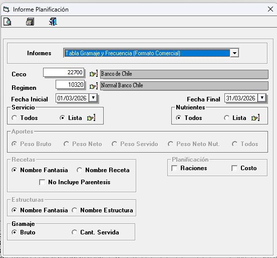
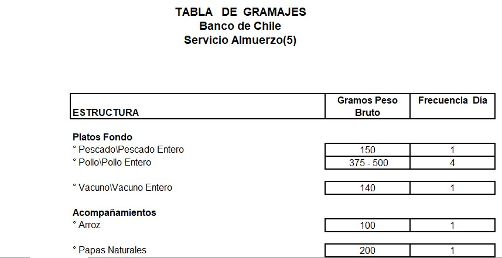
Este informe muestra una tabla que establece distintos gramajes asignados a diversas preparaciones, indicando para cada una el peso bruto correspondiente y la frecuencia con que se considera dentro del periodo evaluado. La información está organizada de forma estructurada para estandarizar porciones y su recurrencia.

<u>**Descripción:**</u>
**Qué muestra.** Idéntico al tipo (10) pero agrega una columna adicional con la frecuencia de aparición de cada tipo de plato en la minuta del período (cantidad de veces que aparece una receta del tipo de plato).
**Restricciones propias.** Mismas que el tipo (10).
**Cómo se seleccionan los servicios.** Árbol de servicios y estructuras.
**Opciones de configuración disponibles.** Mismas que el tipo (10).
**Estructura de datos del informe.**
Usa sgpadm_Sel_MinutaBloqueTablaGramajeFrecuencia_V02 con el mismo XML. El formulario usa ExportarExcelTabkaGramajeFrecuenciaMKT. Agrega la lectura del campo frecuencia.

| Campo / Columna Excel | Campo del SP | Calculado |
| --- | --- | --- |
| Primera categoría | PrimeraCategoria | Sí (función escalar) |
| Segunda categoría | SegundaCategoria | Sí (función escalar) |
| Valor gramaje | valor = CEILING(ISNULL(tippla.valor, 0)) | Sí |
| Frecuencia | frecuencia = ISNULL(FrecuenciaTipoPlato, 0) | Sí |

<u>**Regla de Negocio:**</u>
**Cálculo — frecuencia**

| Componente | Valor |
| --- | --- |
| Fórmula | COUNT(rec_codigo) agrupado por rec_tippla en tabla temporal #TempFrecuenciaTipoPlato |
| Filtro | Solo recetas activas (rec_activo = '1') en el período y estructuras seleccionadas |
| Resultado | Número de veces que aparece alguna receta del tipo de plato en la minuta del período |

<u>**Formato Salida:**</u>
Libro Excel con una hoja por servicio. Se agrega columna de frecuencia a la derecha del gramaje.
Mejoras:
Incluir en item “Gramaje” el peso Neto.

### 8.15.14. Molécula Calórica Diario Detallado (ExportaExcelDetalleMoleculaCalorica)

Este reporte presenta una tabla con el desglose nutricional de una preparación, mostrando los ingredientes utilizados junto con sus cantidades y el aporte resultante que el usuario selecciona de la lista. Al final se incluye un total que consolida el aporte nutricional de toda la elaboración.
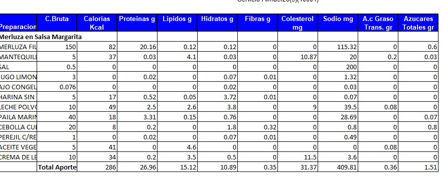
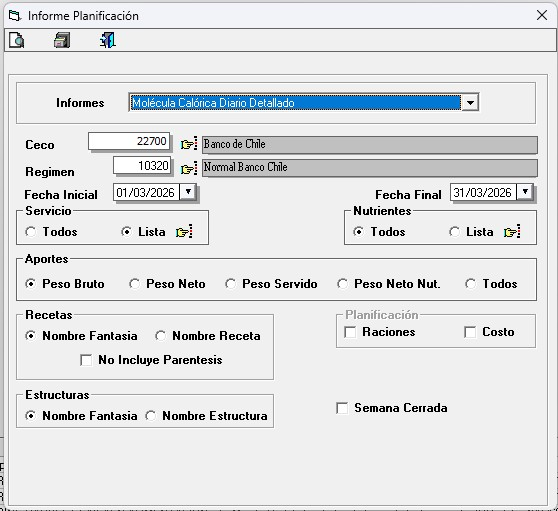

<u>**Descripción:**</u>
**Qué muestra.** Informe de aportes nutricionales diario en formato Excel, con la variante de que incluye un cálculo previo de "número de días" (Ndias) del período, obtenido de sgpadm_Sel_MinutaBloqueMoleculaCaloricaNDia. (ingredientes con aportes), pero organizado para el concepto de molécula calórica.
**Restricciones propias.** Requiere al menos un nutriente marcado.
**Cómo se seleccionan los servicios.** Árbol de servicios y estructuras.
**Opciones de configuración disponibles.**
Nombre de receta: fantasia o estándar
Tipo de peso (opciones de peso bruto, neto, servido, etc.)
Semana cerrada
Nutrientes
Incluir paréntesis
**Estructura de datos del informe.**
Primero llama a sgpadm_Sel_MinutaBloqueMoleculaCaloricaNDia para obtener el recuento de días distintos con minuta en el período (campo Ndias = COUNT(DISTINCT min_fecmin)). Luego usa sgpadm_Sel_MinutaBloqueAporteDetxEstServicio_V02 para el detalle de ingredientes.

| Campo / Columna Excel | Origen | Calculado |
| --- | --- | --- |
| Número de días (Ndias) | COUNT(DISTINCT min_fecmin) de cas_b_minuta en el período | Sí |
|  |  |  |

<u>**Regla de Negocio:**</u>
**Cálculo — N****° ****dias**

| Componente | Valor |
| --- | --- |
| Fórmula | COUNT(DISTINCT c.min_fecmin) en sgpadm_Sel_MinutaBloqueMoleculaCaloricaNDia |
| Filtro | Mismos parámetros que el detalle (ceco, régimen, fechas, tipo de minuta, XML de estructuras) |
| Resultado | Entero: cantidad de días distintos en que existe al menos una minuta en el período |

<u>**Formato Salida:**</u>
Libro Excel con una hoja por servicio.
Mejoras:
El ítem “Aporte Solicitado” que permita digitar macro micro nutriente antes de sacar el informe y aplicarlo en la planilla Excel. X dia

### 8.15.15. Huella Carbono x Estructura Servicio (ExportarExcelHuellaCarbonoxEstructuraSer)

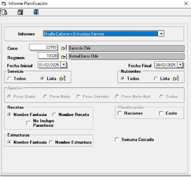

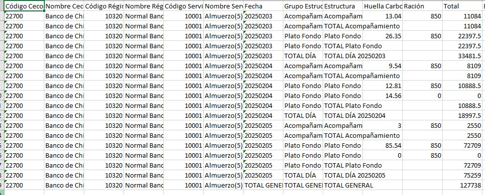
Este informe muestra una tabla con distintos registros que incluyen códigos, fechas, estructuras y valores asociados a cada preparación. Entre los datos incorporados se encuentra la *huella de carbono* correspondiente a cada ítem, junto con los totales parciales y el total general, permitiendo visualizar de manera consolidada el impacto y los valores obtenidos en el periodo evaluado.

<u>**Descripción:**</u>
**Qué muestra.** Genera en Excel el cálculo de huella de carbono de las recetas planificadas, organizado por estructura de servicio y día. El resultado incluye filas normales (una por receta), subtotales por grupo de estructura, totales por día, y un total general al final.
**Restricciones propias.** Si el resultado supera 1.020.000 registros, el sistema no lo procesa. El SP aplica el reemplazo de ingredientes por jerarquía (fn_ObtenerIngredienteReemplazoJerarquia).
**Cómo se seleccionan los servicios.** Árbol de servicios y estructuras (XML con pares Servicio-Estructura).
**Opciones de configuración disponibles.**
Nombre de estructura
Semana cerrada (no aplica directamente, el SP ya calcula la fecha)
**Estructura de datos del informe.**
Usa sgpadm_Sel_HuellaCarbonoxEstructuraServicio_V01. El SP retorna un conjunto UNION ALL de cuatro tipos de filas: detalle, subtotal por grupo de estructura, total por día y total general. La columna EsTotal distingue el tipo: 0=normal, 1=subtotal grupo, 2=total día, 3=total general.

| Campo del SP | Tabla de origen | Calculado |
| --- | --- | --- |
| [Código Ceco] | cas_b_minuta.min_cecori | No |
| [Nombre Ceco] | b_clientes.cli_nombre | No |
| [Código Régimen] | cas_b_minuta.min_codreg | No |
| [Nombre Régimen] | a_regimen.reg_nombre | No |
| [Código Servicio] | cas_b_minuta.min_codser | No |
| [Nombre Servicio] | a_servicio.ser_nombre | No |
| Fecha | CONVERT(VARCHAR(10), min_fecmin, 103) | Sí |
| [Grupo Estructura] | a_grupoestructura.Nombre | No |
| [Estructura] | a_estservicio.ess_nombre (o texto de total) | No / Sí |
| [Huella Carbono] | e.TotalHuellaCarbono (calculado en tabla temporal #Receta) | Sí |
| [Ración] | cas_b_minutadet.mid_numrac | No |
| [Total] | TotalHuellaCarbono × mid_numrac (o SUM en filas de total) | Sí |
| EsTotal | 0/1/2/3 según tipo de fila | Sí |

<u>**Regla de Negocio:**</u>
**Cálculo — TotalHuellaCarbono (por receta)**

| Componente | Valor |
| --- | --- |
| Fórmula | SUM(huella_carbono × CantIngredienteCambio) agrupado por rec_codigo en tabla temporal #Receta |
| huella_carbono | Campo de b_ingrediente |
| CantIngredienteCambio | Cantidad del ingrediente tras aplicar reemplazo jerárquico (fn_ObtenerIngredienteReemplazoJerarquia); si no hay reemplazo, usa red_canpro |
| Resultado | Total de huella de carbono para todos los ingredientes de la receta |

**Cálculo — [Total] (fila normal)**

| Componente | Valor |
| --- | --- |
| Fórmula | ISNULL(TotalHuellaCarbono, 0) × mid_numrac |
| Resultado | Huella de carbono total para la receta considerando las raciones planificadas |

**Ejemplo:** Si una receta tiene TotalHuellaCarbono = 0.45 y se planificaron mid_numrac = 100 raciones, el total es (0.45 × 100 )/1000= 0.045 unidades de huella de carbono.
<u>**Formato Salida:**</u>
El SP retorna los datos ordenados por [Código Servicio], Fecha, [Grupo Estructura], EsTotal, [Estructura]. El formulario vuelca el resultado directamente al archivo Excel usando la API de automatización.

### 8.15.16. Huella Carbono x Minuta Detallado (ExportarExcelHuellaCarbonoxMinutaEstructuraSer)

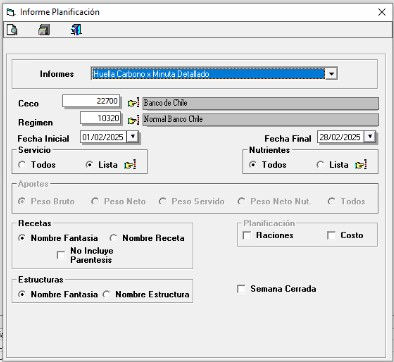

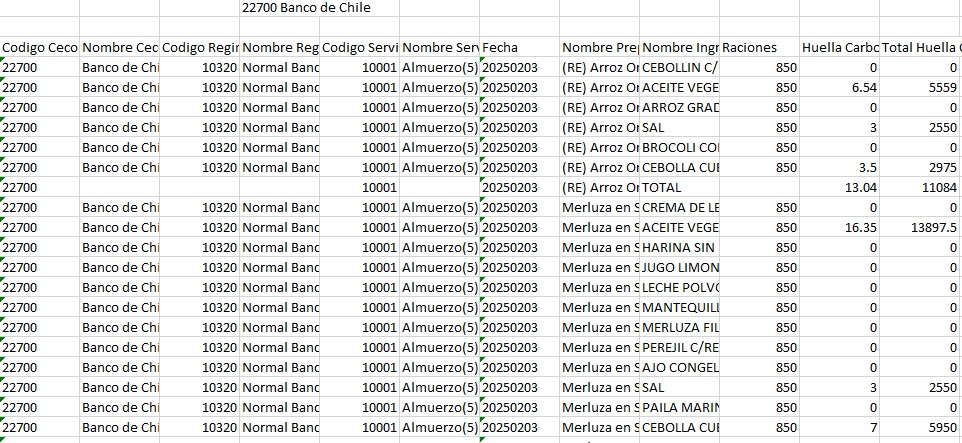
Este informe presenta una tabla con el detalle de preparaciones y sus ingredientes, incorporando para cada registro el valor correspondiente a la *huella de carbono*. La información permite visualizar el aporte individual y el total asociado a cada preparación dentro de la minuta, consolidando los datos para facilitar el análisis del impacto ambiental.
<u>**Descripción:**</u>
**Qué muestra.** Variante del tipo (13) con presentación detallada por minuta. Usa el mismo SP (sgpadm_Sel_HuellaCarbonoxEstructuraServicio_V01) y los mismos campos. La diferencia reside en cómo el formulario organiza las filas en el Excel (subrutina ExportarExcelHuellaCarboboxMinutaEstructuraSer).
**Restricciones propias.** Mismas que el tipo (13).
**Cómo se seleccionan los servicios.** Árbol de servicios y estructuras.
**Opciones de configuración disponibles.** Mismas que el tipo (13).
**Estructura de datos del informe.** Idéntica al tipo (13). Todos los campos y cálculos son los mismos; solo cambia el formato de presentación en el Excel.
<u>**Formato Salida:**</u>
Libro Excel con detalle por receta y por día.

### 8.15.17. Huella Carbono x Minuta Resumido (Excel)

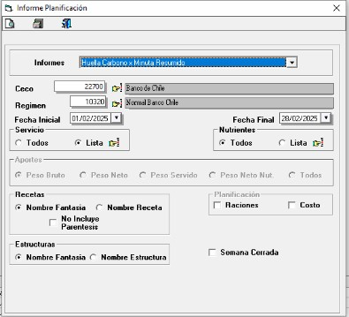

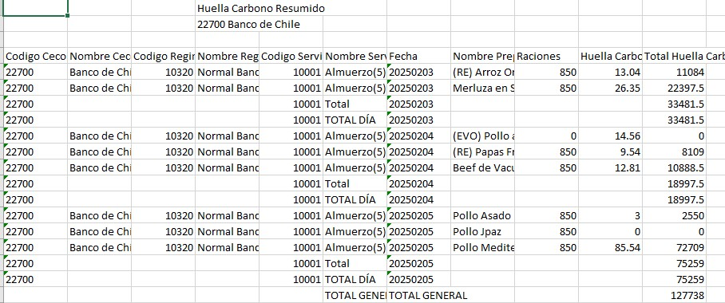
El informe presenta un resumen consolidado que muestra diferentes preparaciones junto con la *huella de carbono* asociada a cada una. La tabla incluye valores por preparación y totales diarios, finalizando con un total general que permite visualizar de manera compacta el impacto global del periodo evaluado.

<u>**Descripción:**</u>
**Qué muestra.** Variante resumida del tipo (13). Usa el mismo SP y campos que los tipos (13) y (14). La subrutina ExportarExcelHuellaCarboboxMinutaEstructuraSerResumido consolida los datos de manera resumida.
**Restricciones propias.** Mismas que el tipo (13).
**Cómo se seleccionan los servicios.** Árbol de servicios y estructuras.
**Opciones de configuración disponibles.** Mismas que el tipo (13).
**Estructura de datos del informe.** Idéntica al tipo (13). Todos los campos y cálculos son los mismos que en los tipos (13) y (14).
<u>**Formato Salida:**</u>
Libro Excel con datos consolidados/resumidos por período.

## 8.16. Planificación Minuta Sansis

(I_SetPlaSansis.frm)
(REEMPLAZAR PALABRA SANSIS POR JUSTICIA)

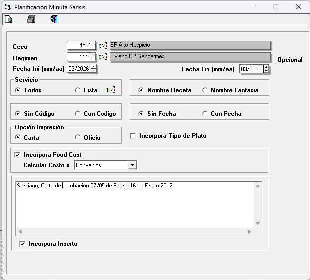
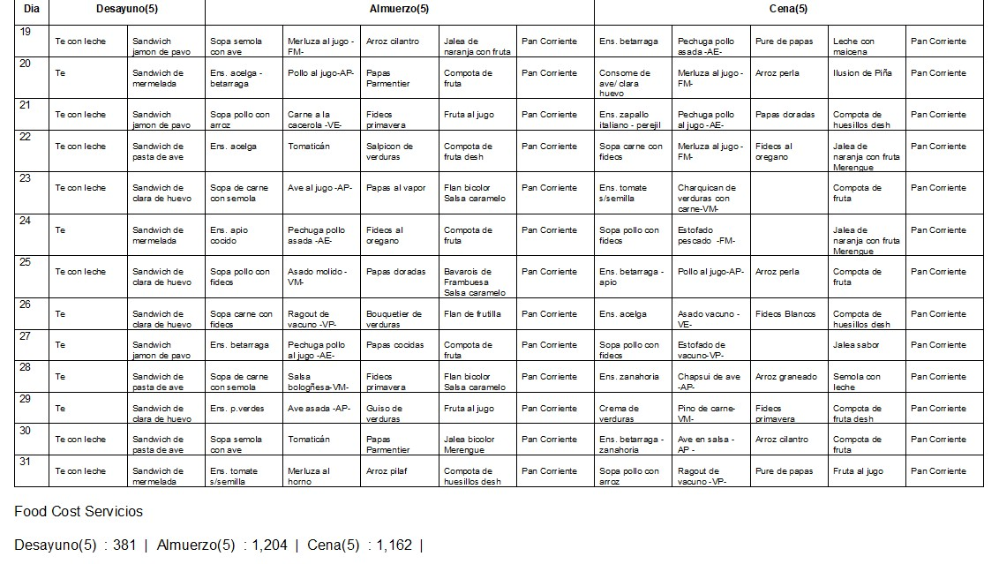
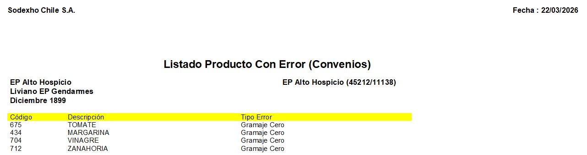
El informe presenta una minuta estructurada en un formato tabular que organiza, por día del mes, las preparaciones correspondientes a cada uno de los servicios ofrecidos. Cada fila representa un día específico e incluye el detalle completo de las preparaciones que componen cada servicio, permitiendo visualizar de forma clara y ordenada el menú programado.
Cada preparación se presenta de manera descriptiva dentro de su celda, manteniendo un formato uniforme que facilita su lectura y revisión.
Al final del documento se incluye un resumen denominado “Food Cost Servicios”, donde se presentan las cantidades totales asociadas a cada servicio del período. Estos valores permiten realizar un análisis general del volumen de servicios proyectados o ejecutados en la minuta.
En conjunto, este formato permite gestionar, validar y comunicar la minuta de manera clara, asegurando que cada servicio esté debidamente documentado y disponible para revisión operativa, nutricional o administrativa

<u>**Descripción:**</u>
<u>**1 — ¿Para qué sirve esta pantalla?**</u>
Esta pantalla genera un informe de la planificación de minutas registradas en el sistema para un casino específico. El documento resultante muestra, en formato de grilla mensual, las recetas asignadas a cada día del mes por servicio y estructura de servicio (por ejemplo: desayuno-opción 1, almuerzo-menú A), permitiendo visualizar de un vistazo el programa alimentario planificado para el período seleccionado.
La pantalla está organizada en un panel de filtros en la parte superior, donde el usuario indica el casino, el régimen y el rango de meses a consultar. Debajo del panel de filtros se encuentran las opciones de formato del informe: nombre a mostrar para las recetas, si se incluye o no el código de la receta, si se muestran o no las fechas en la cabecera, el tamaño de papel, si se incorpora el tipo de plato de cada receta y si se agrega un cálculo de Food Cost por servicio. En la zona inferior hay un área de texto para redactar un texto adicional de inserto opcional que puede adjuntarse al final del documento.
El informe admite dos modalidades de selección de servicios: cuando el usuario ingresa un régimen específico, la pantalla carga automáticamente los servicios disponibles en una grilla con casillas de verificación para que el usuario elija cuáles incluir. Cuando no se ingresa régimen, la pantalla muestra un árbol jerárquico con todos los regímenes y sus servicios asociados al casino en el período indicado, también con casillas de verificación. Ambas modalidades pueden abarcar hasta 3 meses consecutivos en un mismo reporte.
**2 — ¿Qué necesito para usarla?**

| Campo | Descripción | Obligatorio |
| --- | --- | --- |
| Ceco | Código del casino (centro de costo) a consultar. Se puede ingresar directamente o buscarlo a través del selector de clientes que se abre con el ícono adyacente. Al ingresar el código el sistema valida que exista y muestra el nombre del casino en el campo de descripción contiguo. | Sí |
| Régimen | Código numérico del régimen alimentario (por ejemplo: régimen de almuerzo, régimen de once). Se puede ingresar directamente o buscarlo con el ícono de búsqueda. Al ingresar el código el sistema muestra el nombre del régimen. Si no se ingresa, el informe incluye todos los regímenes con planificación para el ceco y período indicados. | No |
| Fecha Ini (mm/aa) | Mes y año de inicio del período a reportar (formato mm/aaaa). El sistema inicializa este campo con el mes y año actuales al abrir la pantalla. | Sí |
| Fecha Fin (mm/aa) | Mes y año de término del período a reportar (formato mm/aaaa). El sistema inicializa este campo con el mes y año actuales al abrir la pantalla. | Sí |

Una vez que el ceco, el régimen y las fechas están completos, el sistema carga automáticamente la lista de servicios disponibles en la grilla inferior (cuando hay régimen) o en el árbol jerárquico (cuando no hay régimen), lo que permite al usuario seleccionar qué servicios incluir antes de generar el informe.

<u>**Reglas de Negocio:**</u>

| # | Cuándo aparece | Qué verifica el sistema | Qué ve el usuario |
| --- | --- | --- | --- |
| 1 | Al hacer clic en Vista Previa | Que el nombre del casino no esté vacío, es decir, que el código de ceco haya sido reconocido y tenga descripción | Mensaje: Debe registrar ceco... |
| 2 | Al hacer clic en Vista Previa | Que si se ingresó un número de régimen mayor que cero, su nombre también esté cargado (es decir, que sea un código válido) | Mensaje: Debe registrar regimen... |
| 3 | Al hacer clic en Vista Previa | Que el campo Fecha Ini no esté vacío | Mensaje: Fecha esta nula... |
| 4 | Al hacer clic en Vista Previa | Que el campo Fecha Fin no esté vacío | Mensaje: Fecha esta nula... |
| 5 | Al hacer clic en Vista Previa | Que la Fecha Fin no sea anterior a la Fecha Ini | Mensaje: Fecha Hasta No Puede Ser Mayor a Fecha Desde |
| 6 | Al hacer clic en Vista Previa | Que el rango entre el primer día del mes inicial y el último día del mes final no supere los 98 días (equivalente a 14 semanas) | Mensaje: Sobre pasa los 98 días corresponde a 14 semana |
| 7 | Al hacer clic en Vista Previa | Que el rango no sea mayor a 3 meses | Mensaje: Rango De Fecha No Puede Ser Mayor a 3 Meses |
| 8 | Al hacer clic en Vista Previa, con Food Cost activo | Que se haya seleccionado un tipo de precio en la lista desplegable de costo | Mensaje: Seleccione Calcular Costo x |
| 9 | Al hacer clic en Vista Previa, con régimen ingresado | Que al menos un servicio esté marcado en la grilla de casillas | Mensaje: Servicio debe ser selecionado |
| 10 | Al hacer clic en Vista Previa, sin régimen ingresado | Que en el árbol jerárquico al menos un nodo de tipo servicio (no nodo régimen) esté marcado | Mensaje: No ha seleccionado regimen con su asociado servicio... |
| 11 | Al abrir el histórico de planificaciones | Que el casino ingresado tenga minutas registradas en el sistema | Mensaje: No existe ceco planificado |

<u>**Tablas Relacionadas:**</u>

| Tabla | Para qué se usa en este reporte | Campos clave |
| --- | --- | --- |
| cas_b_minuta | Cabecera de la minuta planificada: relaciona el casino, el régimen, el servicio y la fecha de la minuta | min_cecori, min_codreg, min_codser, min_fecmin, min_codigo |
| cas_b_minutadet | Detalle de la minuta: cada línea con la receta, la estructura de servicio y el número de raciones teóricas planificadas | mid_cecori, mid_codigo, mid_codrec, mid_estser, mid_numlin, mid_numrac, mid_tipmin |
| b_receta | Catálogo de recetas: fuente del nombre oficial y nombre de fantasía de cada receta, y su tipo de plato | rec_codigo, rec_nombre, rec_nomfan, rec_tippla |
| b_recetadet | Detalle de ingredientes de cada receta: se usa para el cálculo de Food Cost (ingredientes y cantidades brutas) | red_codigo, red_codpro, red_canpro |
| a_regimen | Catálogo de regímenes: proporciona el nombre del régimen para encabezados y validación del código ingresado | reg_codigo, reg_nombre, reg_indppr |
| a_servicio | Catálogo de servicios: proporciona nombre y orden de posición de cada servicio | ser_codigo, ser_nombre, ser_posicion |
| a_estservicio | Estructura de servicio: define las subcolumnas dentro de cada servicio (opciones del menú del día) | ess_codigo, ess_nombre, ess_codser |
| b_clientes | Catálogo de casinos: valida el código de ceco ingresado y provee el nombre del casino | cli_codigo, cli_nombre, cli_tipo, cli_activo, cli_TipoMinuta |
| b_ingrediente | Catálogo de ingredientes: proporciona el nombre de cada ingrediente para el listado de errores de Food Cost | ing_codigo, ing_nombre |
| b_tablagramajececo | Tabla de gramaje por ceco: permite aplicar gramajes específicos del casino sobreponiendo los gramajes estándar de la receta al calcular el Food Cost | tgc_ceco, tgc_codreg, tgc_codrec, tgc_coding, tgc_codins, tgc_cantgr |
| Sdx_Parametro_Sansis | Tabla de parámetros del sistema Sansis: almacena el texto del inserto (número de parámetro 9999) para que persista entre sesiones | Parametro_Num, Parametro_Glosa, Parametro_Desc, Parametro_Val |

## 8.17. Template Minuta Bloque (E_TemplateMinI.frm)

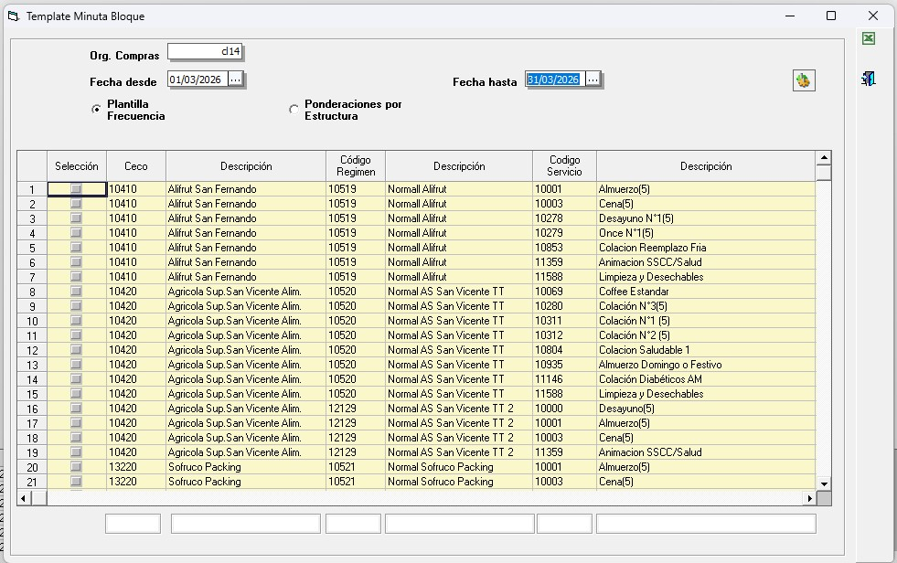
Esta pantalla no tiene un selector de tipo en lista desplegable. El tipo de plantilla se elige con los botones de opción visibles en el formulario. Cada tipo genera un archivo Excel diferente con columnas distintas.
<u>**Descripción:**</u>
**1 — ¿Para qué sirve esta pantalla?**
Esta pantalla permite generar dos tipos de plantillas Excel sobre las minutas en bloque de los casinos asociados a una organización de compras: una plantilla de **frecuencia de ingredientes principales** y otra de **ponderaciones por estructura de servicio**. Ambas se extraen del mismo rango de fechas y de los mismos casinos seleccionados, pero entregan información analítica distinta: la primera permite conocer con qué frecuencia aparece cada tipo de ingrediente principal en la planificación, y la segunda permite revisar el balance de ponderaciones por estructura de servicio a lo largo de la semana.
La pantalla se organiza en un encabezado con tres campos de filtro (organización de compras, fecha desde y fecha hasta) y dos opciones de tipo de plantilla. Debajo del encabezado hay una grilla que muestra todos los casinos, regímenes y servicios disponibles para el período indicado; el usuario marca las filas de interés antes de exportar. La barra de búsqueda sobre la grilla permite filtrar por cualquier columna de texto para localizar rápidamente un casino, régimen o servicio específico.
No existe un selector de tipo de informe en lista desplegable: el tipo se elige mediante dos botones de opción visibles directamente en el formulario. La pantalla opera exclusivamente sobre casinos activos con minuta en bloque planificada en el período consultado, dentro de la organización de compras indicada.

**2 — ¿Qué necesito para usarla?**

| Campo | Descripción | Obligatorio |
| --- | --- | --- |
| Org. Compras | Código de la organización de compras (por ejemplo, CL14). Determina el conjunto de casinos disponibles. Debe corresponder a un código existente y activo en el sistema. | Sí |
| Fecha desde | Fecha de inicio del período a consultar, en formato dd/mm/yyyy. Al abrir la pantalla se carga la fecha del día. | Sí |
| Fecha hasta | Fecha de fin del período a consultar, en formato dd/mm/yyyy. Al abrir la pantalla se carga la fecha del día. | Sí |
| Tipo de plantilla | Selección entre "Plantilla Frecuencia" y "Ponderaciones por Estructura". Determina qué información se incluirá en el archivo Excel generado. | Sí |
| Selección de filas en la grilla | Después de cargar la grilla, el usuario debe marcar al menos un casino/régimen/servicio para poder exportar. | Sí |

<u>**Reglas de Negocio:**</u>

| # | Cuándo aparece | Qué verifica el sistema | Qué ve o experimenta el usuario |
| --- | --- | --- | --- |
| 1 | Al hacer clic en "Cargar Información" o en "Exportar Excel" sin ingresar código de organización de compras | Que el campo Org. Compras no esté vacío | Mensaje: Debe seleccionar Org. Compras... |
| 2 | Al hacer clic en "Cargar Información" o en "Exportar Excel" con un código de organización de compras que no existe | Que el código ingresado corresponda a un registro activo en el catálogo de organizaciones de compras | Mensaje: No existe Org. Compras... |
| 3 | Al hacer clic en "Cargar Información" o en "Exportar Excel" con fechas inconsistentes | Que la Fecha Desde no sea posterior a la Fecha Hasta | Mensaje: Fecha Desde No Puede Ser Mayor a Fecha Hasta. El sistema restablece automáticamente la Fecha Desde a la fecha del día. |
| 4 | Al hacer clic en "Cargar Información" o en "Exportar Excel" con un rango superior a un año | Que la diferencia entre Fecha Hasta y Fecha Desde no supere 365 días | Mensaje: Rango De Fecha No Puede Ser Mayor a 12 Meses. La grilla queda en cero filas. |
| 5 | Al hacer clic en "Exportar Excel" con la grilla sin datos | Que la grilla tenga al menos una fila cargada | Mensaje: No existe datos selecionado en la grilla... |
| 6 | Al hacer clic en "Exportar Excel" sin marcar ninguna fila | Que al menos una fila de la grilla esté marcada como seleccionada y sea visible | Mensaje: Debe haber a lo menos un dato seleccionado en la grilla... |
| 7 | Después de ejecutar la consulta de exportación | Que el resultado no supere 1.020.000 filas (límite de Excel) | Mensaje: El resultado sobrepasa maximo de fila en excel, Debera seleccionar menos Ceco. El proceso se cancela y el usuario debe reducir la selección de casinos. |
| 8 | En el cuadro de diálogo de guardado, si el usuario cancela | Que el usuario haya completado el paso de guardar | Mensaje: Proceso cancelado. El proceso se cancela sin generar archivo. |
| 9 | En el cuadro de diálogo de guardado, si el usuario no ingresa nombre | Que se haya ingresado un nombre de archivo | Mensaje: Debe seleccionar la ruta y nombre de archivo. |
| 10 | En el cuadro de diálogo de guardado, si la extensión no es válida | Que la extensión del archivo sea .xls o .xlsx | Mensaje: La extensión del archivo debe ser (*.xls,*.xlsx). |

<u>**Tablas Relacionadas:**</u>

| Tabla | Para qué se usa en este reporte | Campos clave |
| --- | --- | --- |
| cas_b_minuta | Cabecera de la minuta planificada: relaciona el casino, el régimen, el servicio y la fecha de la minuta | min_cecori, min_codreg, min_codser, min_fecmin, min_codigo |
| cas_b_minutadet | Detalle de la minuta: cada línea con la receta, la estructura de servicio y el número de raciones teóricas planificadas | mid_cecori, mid_codigo, mid_codrec, mid_estser, mid_numlin, mid_numrac, mid_tipmin |
| b_receta | Catálogo de recetas: fuente del nombre oficial y nombre de fantasía de cada receta, y su tipo de plato | rec_codigo, rec_nombre, rec_nomfan, rec_tippla |
| b_recetadet | Detalle de ingredientes de cada receta: se usa para el cálculo de Food Cost (ingredientes y cantidades brutas) | red_codigo, red_codpro, red_canpro |
| a_regimen | Catálogo de regímenes: proporciona el nombre del régimen para encabezados y validación del código ingresado | reg_codigo, reg_nombre, reg_indppr |
| a_servicio | Catálogo de servicios: proporciona nombre y orden de posición de cada servicio | ser_codigo, ser_nombre, ser_posicion |
| a_estservicio | Estructura de servicio: define las subcolumnas dentro de cada servicio (opciones del menú del día) | ess_codigo, ess_nombre, ess_codser |
| b_clientes | Catálogo de casinos: valida el código de ceco ingresado y provee el nombre del casino | cli_codigo, cli_nombre, cli_tipo, cli_activo, cli_TipoMinuta |
| b_ingrediente | Catálogo de ingredientes: proporciona el nombre de cada ingrediente para el listado de errores de Food Cost | ing_codigo, ing_nombre |
| b_tablagramajececo | Tabla de gramaje por ceco: permite aplicar gramajes específicos del casino sobreponiendo los gramajes estándar de la receta al calcular el Food Cost | tgc_ceco, tgc_codreg, tgc_codrec, tgc_coding, tgc_codins, tgc_cantgr |
| Sdx_Parametro_Sansis | Tabla de parámetros del sistema Sansis: almacena el texto del inserto (número de parámetro 9999) para que persista entre sesiones | Parametro_Num, Parametro_Glosa, Parametro_Desc, Parametro_Val |

### 8.17.1. Plantilla Frecuencia

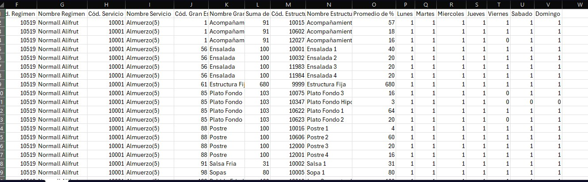
El informe Excel corresponde a un template que se genera a partir de una minuta y está diseñado para ser cargado en AMD. Su estructura permite **modificar recetas**, así como **ajustar raciones o ponderaciones** según las necesidades operativas del servicio. Cada fila muestra la preparación asociada, su código, su clasificación y los valores asignados por día de la semana, facilitando actualizar la composición del menú antes de su carga al sistema.
<u>**Descripción:**</u>
**Qué muestra:** Una fila por cada combinación de casino, régimen, servicio, estructura, categoría dietética, tipo de plato y tipo de ingrediente principal que aparece en las minutas del período. El dato central es la cantidad de veces que cada tipo de ingrediente principal se utilizó en la planificación (frecuencia de uso), lo que permite analizar la variedad y repetición en la composición de las minutas.
**Cómo se seleccionan los casinos:** el usuario marca filas en la grilla de casinos/regímenes/servicios. Los casinos marcados se empaquetan en un mensaje XML y se envían al procedimiento almacenado. Solo se procesan las filas visibles y seleccionadas.
**Opciones de configuración disponibles:**
**Tipo de plantilla:** seleccionado mediante el botón de opción "Plantilla Frecuencia".
**Estructura de datos del informe:**

| Campo / Columna | Descripción | Calculado |
| --- | --- | --- |
| Sitios (Ceco) | Código del casino | No |
| Nombre del sitio | Nombre descriptivo del casino | No |
| CL | Código de la organización de compras consultada | No |
| Fecha Inicial | Fecha de inicio del período consultado | No |
| Fecha Final | Fecha de fin del período consultado | No |
| Cód. Regimen | Código numérico del régimen alimentario | No |
| Nombre Regimen | Nombre del régimen alimentario | No |
| Cód. Servicio | Código numérico del servicio (desayuno, almuerzo, cena, etc.) | No |
| Nombre Servicio | Nombre del servicio | No |
| Cód. Gran Est. | Código del grupo de estructura de servicio (gran estructura) | No |
| Nombre Gran Est. | Nombre del grupo de estructura de servicio | No |
| Cód. Estructura | Código de la estructura de servicio (posición dentro de un servicio, por ejemplo, primer plato) | No |
| Nombre Estructura | Nombre de la estructura de servicio. Puede ser sobreescrito con la descripción personalizada registrada en el detalle de la minuta, si existe. | No |
| Cód. Categoria Dietetica | Código de la categoría dietética de la receta planificada | No |
| Nombre Categoria Dietetica | Nombre completo de la categoría dietética, construido recorriendo el árbol de categorías. | Sí |
| Cód. Tipo Plato | Código del tipo de plato de la receta planificada | No |
| Nombre Tipo Plato | Nombre completo del tipo de plato, construido recorriendo el árbol de tipos de plato. | Sí |
| Cód. Tipo de plato Generico | Código del grupo de ingrediente principal asociado al tipo de ingrediente principal de la receta | No |
| Nombre Tipo de plato Generico | Nombre del grupo de ingrediente principal | No |
| Cód. Tipo Ingrediente Principal | Código del tipo de ingrediente principal de la receta | No |
| Nombre. Tipo Ingrediente Principal | Nombre del tipo de ingrediente principal | No |
| N° de Frecuencia de Ingrediente Principal SGP | Cantidad de veces que el tipo de ingrediente principal aparece en la planificación para esa combinación de casino/régimen/servicio/estructura/categoría dietética/tipo de plato | Sí |

<u>**Regla de Negocio:**</u>
**Cálculo — Nombre ****Categoría**** ****Dietética**
El nombre de la categoría dietética no se almacena como texto plano: el sistema guarda solo el código y el nombre completo se construye navegando la jerarquía del árbol de categorías dietéticas.
**Fórmula o lógica:** El sistema llama a la función sgpadm_p_buscararbolcatdietetica(código), que recorre la jerarquía de categorías y devuelve una cadena con la ruta completa. El resultado final se recorta eliminando el último carácter (separador).

| Componente | Qué representa | De dónde viene |
| --- | --- | --- |
| Código categoría dietética | Identificador de la categoría dietética de la receta o del detalle de minuta (el del detalle tiene prioridad si es mayor que cero) | cas_b_minutadet.IdCategoriadietetica o b_receta.rec_catdie |
| Función de árbol | Devuelve la ruta completa de la categoría en la jerarquía | Función sgpadm_p_buscararbolcatdietetica en SGP_Admin.sql |

Ejemplo: si el código es 45 y la jerarquía es "Sin Gluten > Celíaco", la función devuelve "Sin Gluten > Celíaco/" y el sistema muestra "Sin Gluten > Celíaco".
**Cálculo — Nombre Tipo Plato**
De forma análoga, el nombre del tipo de plato se construye recorriendo el árbol de tipos de plato.
**Fórmula o lógica:** El sistema llama a la función sgpadm_p_buscararboltipplato1(código) y recorta el separador final.

| Componente | Qué representa | De dónde viene |
| --- | --- | --- |
| Código tipo de plato | Identificador del tipo de plato de la receta o del detalle de minuta (el del detalle tiene prioridad si es mayor que cero) | cas_b_minutadet.IdTipoPlato o b_receta.rec_tippla |
| Función de árbol | Devuelve la ruta completa del tipo de plato en la jerarquía | Función sgpadm_p_buscararboltipplato1 en SGP_Admin.sql |

**Cálculo — N° de Frecuencia de Ingrediente Principal SGP**
Este valor no está almacenado: se calcula contando cuántas líneas de detalle de minuta comparten la misma combinación de clasificaciones.
**Fórmula o lógica:** N° de Frecuencia = COUNT(tipo de ingrediente principal) agrupado por casino, régimen, servicio, estructura, gran estructura, categoría dietética, tipo de plato, tipo de ingrediente principal, dentro del período y para los casinos seleccionados. Solo se cuentan las líneas con raciones planificadas mayores a cero.

| Componente | Qué representa | De dónde viene |
| --- | --- | --- |
| Líneas de detalle de minuta | Cada preparación planificada en una estructura del servicio | cas_b_minutadet |
| Filtro de raciones | Solo líneas con raciones planificadas > 0 | cas_b_minutadet.mid_numrac |
| Agrupación | Combinación de todas las clasificaciones del informe | Agrupación del SELECT final del SP |

Ejemplo: si el tipo de ingrediente principal "Cerdo" aparece en 3 líneas de detalle dentro del período para el mismo servicio y estructura, el valor será 3.

<u>**Formato Salida:**</u>
Excel (.xls o .xlsx). Una única hoja (Hoja1). El usuario elige la ruta y el nombre del archivo en un cuadro de diálogo de guardado. La fila 1 contiene los nombres de columna tomados directamente de los nombres devueltos por el procedimiento almacenado. Los datos comienzan en la fila 2. Las columnas y filas se ajustan automáticamente al contenido. El archivo se abre en modo solo lectura al finalizar el proceso.
<u>**Mejoras:**</u>
Que el formato que sea igual Bach de AMD.

### 8.17.2. Ponderaciones por Estructura

<u>**Descripción:**</u>
**Qué muestra:** Una fila por cada combinación de casino, régimen, servicio y estructura de servicio, con el promedio de ponderación de esa estructura en el período y su distribución por día de la semana. Permite revisar si el balance de ponderaciones se mantiene a lo largo de los días (lunes a domingo) y si la suma total de ponderaciones por gran estructura es coherente.
**Cómo se seleccionan los casinos:** igual que en la Plantilla Frecuencia, el usuario marca filas en la grilla antes de exportar.
**Opciones de configuración disponibles:**
**Tipo de plantilla:** seleccionado mediante el botón de opción "Ponderaciones por Estructura".
**Estructura de datos del informe:**

| Campo / Columna | Descripción | Calculado |
| --- | --- | --- |
| Sitios (Ceco) | Código del casino | No |
| Nombre del sitio | Nombre descriptivo del casino | No |
| CL | Código de la organización de compras consultada | No |
| Fecha Inicial | Fecha de inicio del período consultado | No |
| Fecha Final | Fecha de fin del período consultado | No |
| Cód. Regimen | Código numérico del régimen alimentario | No |
| Nombre Regimen | Nombre del régimen alimentario | No |
| Cód. Servicio | Código numérico del servicio | No |
| Nombre Servicio | Nombre del servicio | No |
| Cód. Gran Est. | Código del grupo de estructura de servicio | No |
| Nombre Gran Est. | Nombre del grupo de estructura de servicio | No |
| Suma de ponderaciones por gran estructura | Suma de los promedios de ponderación ajustados de todas las estructuras que pertenecen a la misma gran estructura, para el mismo casino/régimen/servicio | Sí |
| Cód. Estructura | Código de la estructura de servicio | No |
| Nombre Estructura | Nombre de la estructura de servicio. Puede ser sobreescrito con la descripción personalizada del detalle de minuta si existe. | No |
| Lunes | Indicador (1 / 0): la estructura tuvo raciones planificadas al menos un lunes en el período | Sí |
| Martes | Indicador (1 / 0): la estructura tuvo raciones planificadas al menos un martes en el período | Sí |
| Miercoles | Indicador (1 / 0): la estructura tuvo raciones planificadas al menos un miércoles en el período | Sí |
| Jueves | Indicador (1 / 0): la estructura tuvo raciones planificadas al menos un jueves en el período | Sí |
| Viernes | Indicador (1 / 0): la estructura tuvo raciones planificadas al menos un viernes en el período | Sí |
| Sabado | Indicador (1 / 0): la estructura tuvo raciones planificadas al menos un sábado en el período | Sí |
| Domingo | Indicador (1 / 0): la estructura tuvo raciones planificadas al menos un domingo en el período | Sí |
| Promedio de % Ponderación | Ponderación promedio ajustada de la estructura, normalizada según la cantidad de días de la minuta en el período | Sí |

<u>**Regla de Negocio:**</u>
**Cálculo — Promedio de % Ponderación**
La ponderación que figura en cada línea del detalle de minuta (mid_porrac) puede variar día a día. Para obtener un valor representativo del período, el sistema calcula el promedio de ponderación y lo normaliza respecto al número de días con minuta activa.
**Fórmula o lógica:**
Paso 1 — Promedio base por estructura: Promedio base = SUM(mid_porrac) / COUNT(líneas de detalle) agrupado por casino, régimen, servicio y estructura, dentro del período.
Paso 2 — Normalización por días de servicio: Ponderación ajustada = Promedio base × (número de veces que aparece la estructura / número de días con minuta en el servicio)
Paso 3 — Redondeo con regla de ajuste: Si la parte decimal de la ponderación ajustada (redondeada a 1 decimal) es mayor que 0.0, se redondea hacia arriba (se suma 1 antes de redondear a entero). En caso contrario, se redondea normalmente.

| Componente | Qué representa | De dónde viene |
| --- | --- | --- |
| mid_porrac | Porcentaje de ponderación de la línea de detalle de minuta | cas_b_minutadet.mid_porrac |
| Número de veces | Cuántas veces aparece esa estructura en el período | Conteo en la tabla temporal del SP |
| Número de días con minuta | Cantidad de fechas distintas con minuta activa para ese casino/régimen/servicio, contando solo días con raciones > 0 y raciones teóricas > 0 | Tabla temporal calculada en el SP |

Ejemplo: si una estructura tiene ponderación promedio de 33.33% y aparece 10 veces en un período de 22 días con minuta, la ponderación ajustada es 33.33 × (10/22) = 15.15. Como la parte decimal redondeada a 1 decimal es 0.2 (mayor que 0.0), el resultado final es round(15.15 + 1, 0) = 16.
**Cálculo — Suma de ponderaciones por gran estructura**
Representa la suma de las ponderaciones ajustadas de todas las estructuras pertenecientes a la misma gran estructura, para un casino/régimen/servicio dado.
**Fórmula o lógica:** Suma gran estructura = SUM(Ponderación ajustada) de todas las estructuras con el mismo código de gran estructura, dentro del mismo casino/régimen/servicio.

| Componente | Qué representa | De dónde viene |
| --- | --- | --- |
| Ponderación ajustada por estructura | Calculada según la fórmula anterior | Tabla temporal interna del SP |
| Agrupación por gran estructura | Código de grupo que agrupa varias estructuras de servicio | a_grupoestructura.IdGrupoEstructura |

**Cálculo — Indicadores de día de la semana (Lunes a Domingo)**
Cada indicador de día señala si esa estructura de servicio tuvo raciones planificadas en algún día de esa semana dentro del período.
**Fórmula o lógica:** Para cada fila de la tabla de resultados, el sistema busca en el detalle de minuta si existe alguna línea para esa estructura cuya fecha corresponda al día de la semana indicado y tenga raciones mayores a cero. Si existe, el indicador toma el valor 1; si no existe (o si el campo quedó vacío), se muestra 0.

| Componente | Qué representa | De dónde viene |
| --- | --- | --- |
| Fecha de minuta | Fecha en que está planificada la minuta | cas_b_minuta.min_fecmin |
| Día de la semana | Nombre del día extraído de la fecha (Monday, Tuesday, etc.) | Función DATENAME(dw, fecha) |
| Raciones > 0 | Condición para que el día se marque como activo | cas_b_minutadet.mid_numrac > 0 |

Ejemplo: si en el período hay minutas los días lunes 3, miércoles 5 y viernes 7, los indicadores para esa estructura serán: Lunes=1, Martes=0, Miercoles=1, Jueves=0, Viernes=1, Sabado=0, Domingo=0.

<u>**Formato Salida:**</u>
Excel (.xls o .xlsx). Una única hoja (Hoja1). El usuario elige la ruta y el nombre del archivo en un cuadro de diálogo de guardado. La fila 1 contiene los nombres de columna tomados de los nombres devueltos por el procedimiento almacenado. Los datos comienzan en la fila 2. Las columnas y filas se ajustan automáticamente al contenido. El archivo se abre en modo solo lectura al finalizar el proceso.

## 8.18. Trabajo Lotes (E_TrabajosPorLotes.frm)

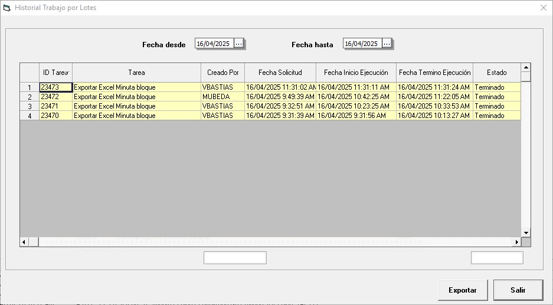

<u>**Descripción:**</u>
**1 — ¿Para qué sirve esta pantalla?**
Esta pantalla permite consultar el historial de ejecuciones de los trabajos programados por lotes que el sistema SGP Admin ha procesado o tiene pendientes de procesar. Para cada entrada registrada, muestra el nombre del trabajo, el usuario que lo programó, las fechas de programación, inicio y fin del procesamiento, y el estado actual de la ejecución (Pendiente, En Proceso, Terminado o Error).
La pantalla se organiza en dos áreas principales: una barra de filtros en la parte superior donde el usuario define el rango de fechas a consultar, y una grilla de resultados que muestra todos los trabajos registrados en ese período. La grilla se actualiza automáticamente cada vez que el usuario modifica cualquiera de las dos fechas de filtro. Adicionalmente, la pantalla dispone de dos campos de búsqueda rápida sobre el texto de la grilla, que permiten filtrar filas por coincidencia parcial sin necesidad de volver a consultar la base de datos.
El resultado obtenido en la grilla puede exportarse a un archivo Excel. Para iniciar la exportación el usuario debe seleccionar al menos una fila en la grilla, lo que hace que el sistema envíe una segunda consulta a la base de datos con los mismos parámetros de fecha y construya el archivo. La pantalla no genera documentos RTF ni imprime directamente: el único formato de salida disponible es Excel.

**2 — ¿Qué necesito para usarla?**

| Campo | Descripción | Obligatorio |
| --- | --- | --- |
| Fecha desde | Fecha inicial del período de consulta, en formato dd/mm/aaaa. Al abrir la pantalla se inicializa con la fecha del día. Cualquier cambio en este campo actualiza la grilla de forma inmediata. | Sí |
| Fecha hasta | Fecha final del período de consulta, en formato dd/mm/aaaa. Al abrir la pantalla se inicializa con la fecha del día. Cualquier cambio en este campo actualiza la grilla de forma inmediata. | Sí |
| Selección de fila en la grilla | Para poder exportar, el usuario debe marcar al menos una fila en la grilla haciendo clic sobre ella. El sistema no permite iniciar la exportación si no hay ninguna fila seleccionada. | Sí (solo para exportar) |

Al abrir la pantalla el sistema ejecuta automáticamente la consulta con la fecha del día como rango inicial, por lo que la grilla se carga sin que el usuario deba hacer ninguna acción adicional.

| # | Cuando aparece | Qué verifica el sistema | Qué ve o experimenta el usuario |
| --- | --- | --- | --- |
| 1 | Al hacer clic en Exportar | Que los campos de fecha desde y fecha hasta estén completos | Mensaje: "Unas de las fecha esta nula..." — el proceso se detiene y el usuario debe completar las fechas. |
| 2 | Al hacer clic en Exportar | Que la fecha hasta no sea anterior a la fecha desde | Mensaje: "La fecha de hasta no puede ser menor que la fecha desde..." — el proceso se detiene y el usuario debe corregir el rango. |
| 3 | Al hacer clic en Exportar | Que al menos una fila de la grilla esté seleccionada | Mensaje: "Se debe seleccionar un ceco por lo menos" — el proceso se detiene y el usuario debe marcar al menos una fila. |
| 4 | Después de consultar la base de datos | Que el resultado no supere 1.020.000 filas | Mensaje: "El resultado sobrepasa el máximo de filas en excel, deberá seleccionar menos Cecos" — el proceso se cancela. El usuario debe acotar el período o la selección. |
| 5 | Al mostrar el cuadro de diálogo de guardado | Que el usuario no haya cancelado el diálogo | Mensaje: "Proceso cancelado" — el proceso se detiene y el usuario regresa a la pantalla con la grilla visible. |
| 6 | Al mostrar el cuadro de diálogo de guardado | Que el usuario haya ingresado un nombre de archivo | Mensaje: "Debe seleccionar la ruta y nombre de archivo" — el cuadro de diálogo se cierra pero el proceso no continúa. |
| 7 | Antes de crear el archivo Excel | Que la extensión del nombre de archivo elegido sea .xls o .xlsx | Mensaje: "La extensión del archivo debe ser (*.xls,*.xlsx)" — el proceso se cancela y el usuario debe reiniciar la exportación con el nombre correcto. |

<u>**Reglas de Negocio:**</u>
**Cálculo — Estado**
El estado del trabajo no se almacena como texto en la base de datos sino como un código numérico. Al consultar los datos, el sistema lo convierte al texto que ve el usuario según la siguiente correspondencia:
**Fórmula o lógica:**

| Código almacenado | Texto mostrado al usuario |
| --- | --- |
| 0 | Pendiente |
| 1 | En Proceso |
| 2 | Terminado |
| 3 | Error |

| Componente | Qué representa | De dónde viene |
| --- | --- | --- |
| Código numérico de estado | Valor interno que indica la fase de procesamiento del trabajo | Tabla b_coladetrabajo, campo cdt_estado |
| Texto descriptivo | Etiqueta legible que el sistema asigna al código | Calculado por el procedimiento almacenado SGP_S_CargaGrillaHisorial mediante una expresión condicional sobre cdt_estado |

**Ejemplo**: Si un trabajo quedó con código 3, la columna Estado mostrará "Error" en lugar del número.

<u>**Formato de salida: **</u>
Excel (.xls o .xlsx). Una única hoja llamada "Hoja1". El usuario elige el nombre del archivo y la carpeta de destino mediante un cuadro de diálogo de guardado. El archivo se abre automáticamente en modo solo lectura al finalizar el proceso. Las columnas se ajustan automáticamente al ancho del contenido.
<u>**Tablas Relacionadas:**</u>

| Tabla | Para qué se usa en este reporte | Campos clave |
| --- | --- | --- |
| b_coladetrabajo | Registro de cada ejecución de trabajo programado: usuario, fechas y estado. Es la tabla principal de datos del historial. | cdt_idcola, cdt_idtrab, cdt_fecpro, cdt_fecini, cdt_fecfin, cdt_user, cdt_estado |
| b_trabajosporlotes | Catálogo de los tipos de trabajo disponibles en el sistema. Provee el nombre descriptivo de cada trabajo. | tpl_idtrab, tpl_nombre, tpl_estado |
| b_paramcolatrabcab | Cabecera de los parámetros con que fue configurada cada entrada en la cola: organización, tipo de reporte, rango de fechas de datos y opciones de columnas. | pcc_idpaco, pcc_idcola, pcc_orgcom, pcc_tiprep, pcc_fecini, pcc_fecfin |
| b_paramcolatrabdet | Detalle de los casinos (centros de costo) y servicios incluidos en cada trabajo programado. Vincula la cabecera de parámetros con el nivel de servicio. | pcd_idpaco, pcd_numlin, pcd_cecori, pcd_codreg, pcd_codser |

Mejoras:
Poner un botón de cancelar lote.
Que muestre una nueva pantalla para revisar detalle de un lote.

**
**

# 9. SGP Local

## 9.1. Informe Consulta Salida o Devolución a Bodega

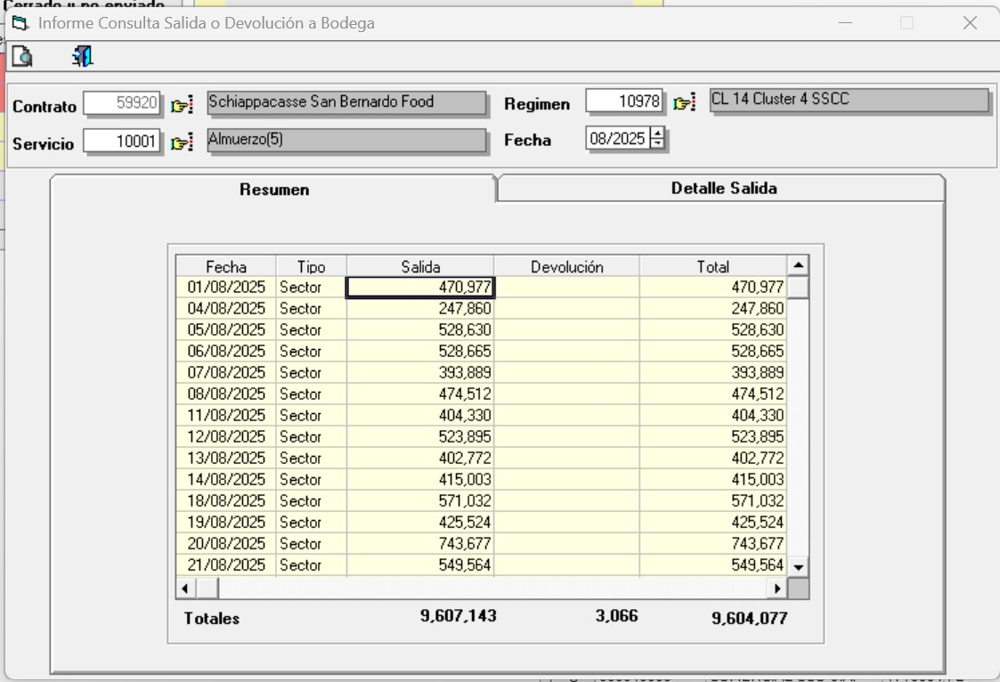
*Vista Resumen*

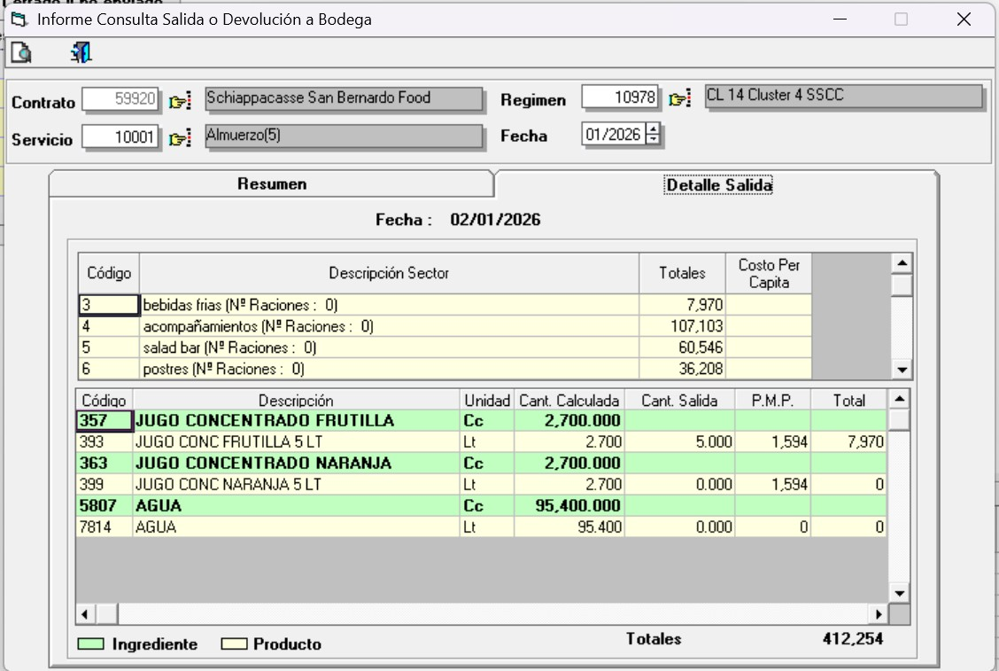
*Vista Detalle Salida/Devolución*
<u>**Descripción:**</u>
Esta pantalla permite **consultar el historial mensual de salidas e ingresos de productos desde y hacia la bodega**, asociados a un contrato específico. Cubre dos tipos de movimiento: las **salidas a producción** (productos que salen de bodega para ser usados en la cocina) y las **devoluciones a bodega** (productos que retornan porque no se utilizaron o hubo excedente). Ambos movimientos quedan agrupados por fecha y número de documento.
La pantalla se organiza en **dos pestañas**. La primera, llamada "Resumen", presenta una vista consolidada por día del mes: cuánto salió, cuánto se devolvió y el total neto de cada fecha. La segunda pestaña, "Detalle Salida" o "Detalle Devolución" (según lo que el usuario seleccione), muestra el desglose exacto de los productos involucrados en un documento específico, con cantidades, precio medio ponderado (PMP) y costo total.
Esta pantalla es de **solo consulta**: no permite agregar ni modificar movimientos.

| **Campo** | **Descripción** | **Obligatorio** |
| --- | --- | --- |
| Contrato | Código del contrato o centro de costo del casino. Se puede escribir directamente o buscar con el ícono de lupa. | Sí |
| Régimen | Número del régimen alimentario asociado al contrato (por ejemplo: régimen normal, dieta, etc.). Solo aplica cuando el modo de operación no es de servicio simple. | Condicional |
| Servicio | Código del servicio dentro del régimen (desayuno, almuerzo, cena, etc.). Solo aplica cuando el modo de operación no es de servicio simple. | Condicional |
| Mes/Año | Período mensual a consultar, en formato MM/AAAA. Determina el rango de fechas que se consulta (desde el primer día hasta el último día del mes indicado). | Sí |

La pantalla entrega dos tipos de visualización e informes impresos:
**Grilla de Resumen (pestaña "Resumen")**
Muestra una fila por cada documento del mes, con las siguientes columnas:

| **Columna** | **Contenido** |
| --- | --- |
| Fecha | Fecha de proceso del documento (día del movimiento). |
| Tipo | Indica si el documento es de tipo "Resumen" (sin desglose por sector) o "Sector" (detallado por sector de producción). |
| Realizada | Monto total del documento de salida a bodega (en pesos). Solo se muestra si existe una salida ese día. |
| Devolución | Monto total del documento de devolución (en pesos). Solo se muestra si existe una devolución ese día. |
| Total | Resultado neto del día: Realizada menos Devolución. |

Al pie de la grilla el sistema muestra totales acumulados del mes para cada columna.
**Grilla de Detalle (pestaña "Detalle Salida" / "Detalle Devolución")**
Muestra el desglose línea a línea del documento seleccionado. Cada fila corresponde a un ingrediente (encabezado en fondo verde) o a un producto de bodega (detalle en fondo gris). Las columnas son:

| **Columna** | **Contenido** |
| --- | --- |
| Código | Código del ingrediente o producto de bodega. |
| Descripción | Nombre del ingrediente o producto. |
| Unidad | Unidad de medida abreviada. |
| Cant. Calculada (en Salida) / Cant. Salida (en Devolución) | Cantidad teórica calculada según receta y raciones, expresada en la unidad del producto. Solo aplica a líneas con ingrediente de receta. |
| Cant. Salida (en Salida) / Cant. Devolver (en Devolución) | Cantidad real que salió o que se devuelve a bodega. |
| P.M.P. | Precio Medio Ponderado unitario del producto al momento del movimiento. |
| Total | Monto total de la línea (cantidad real × PMP). |
| Costo Per Cápita | Costo de esa línea dividido por el número de raciones producidas del día. Solo aparece en el informe impreso cuando el documento tiene desglose por sectores. |

Cuando el documento está organizado por sectores, aparece adicionalmente una lista de sectores a la izquierda. Al hacer clic en un sector, la grilla de detalle filtra las filas mostrando solo los productos de ese sector.

<u>**Reglas de Negocio:**</u>

| **#** | **Cuándo aparece** | **Qué verifica el sistema** | **Qué ve o experimenta el usuario** |
| --- | --- | --- | --- |
| 1 | Al intentar generar Vista Previa desde la pestaña Resumen | Que la grilla de resumen tenga al menos una fila | Si está vacía, aparece un mensaje: "No Existe Resumen a Visualizar" y no se genera el informe. |
| 2 | Al intentar generar Vista Previa desde la pestaña Detalle | Que la grilla de detalle tenga al menos una fila | Si está vacía, aparece un mensaje: "No Existe Detalle a Visualizar" y no se genera el informe. |
| 3 | Al hacer clic en una celda de monto en la columna "Realizada" del resumen | Que el monto sea mayor a cero (que exista un número de documento válido) | Si el valor es 0 o la celda está vacía, la pestaña de detalle permanece deshabilitada y no muestra nada. |
| 4 | Al hacer clic en una celda de monto en la columna "Devolución" del resumen | Que el monto sea mayor a cero | Igual que el caso anterior: si no hay devolución en esa fecha, la pestaña no se habilita. |
| 5 | Al ingresar un código de contrato | Que el código exista en la tabla de contratos/clientes | Si no existe, el campo de nombre del contrato queda en blanco y los campos de régimen y servicio se limpian. La grilla queda vacía. |
| 6 | Al ingresar un número de régimen | Que el régimen exista en el maestro de regímenes | Si no existe, el campo de nombre del régimen queda en blanco. El sistema no bloquea, pero la consulta devolverá sin resultados. |
| 7 | Durante toda la consulta | Que los documentos consultados no tengan estado "Anulado" (A) ni "Pendiente" (P) | Los documentos anulados o pendientes de confirmación no aparecen en ninguna grilla ni en los informes. Solo se muestran documentos vigentes. |
| 8 | Durante la consulta de detalle con sectores | Que el período consultado tenga raciones producidas registradas | Si no hay raciones, la columna "Costo Per Cápita" aparece sin valor calculado. El sistema no genera error; simplemente omite ese cálculo. |

<u>**Cálculo — Total de línea**</u>
Total = Cantidad real de salida o devolución × Precio Medio Ponderado (PMP) unitario
Componentes:
dev_canmer: cantidad real en la unidad del producto
dev_predoc: PMP unitario al momento del documento

<u>**Cálculo — Costo Per Cápita por sector**</u>
Costo Per Cápita = Total del sector ÷ Número de raciones producidas del día.
El número de raciones se obtiene de la tabla b_minutaraciones, filtrando por el registro de tipo PRODUCIDAS para el contrato, régimen, servicio y fecha del documento. Si no hay raciones registradas, este campo no se calcula.

<u>**Informes impresos**</u>
Al hacer clic en "Vista Previa" desde cada pestaña, el sistema genera un informe en formato RTF con:
**Informe Resumen Salida o Devolución a Bodega:** encabezado con contrato, régimen, servicio y mes; tabla con las mismas columnas de la grilla de resumen más los totales del mes.
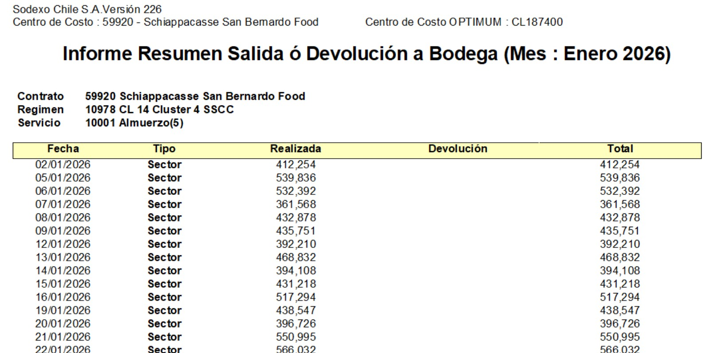
**Informe Detalle Salida/Devolución a Bodega (Resumen o Sector): **encabezado con contrato, régimen, servicio y fecha del documento; tabla con columnas Código, Descripción, Unidad, Cant. Calculada, Cant. Salida/Devolver, PMP, Total, Costo Per Cápita.
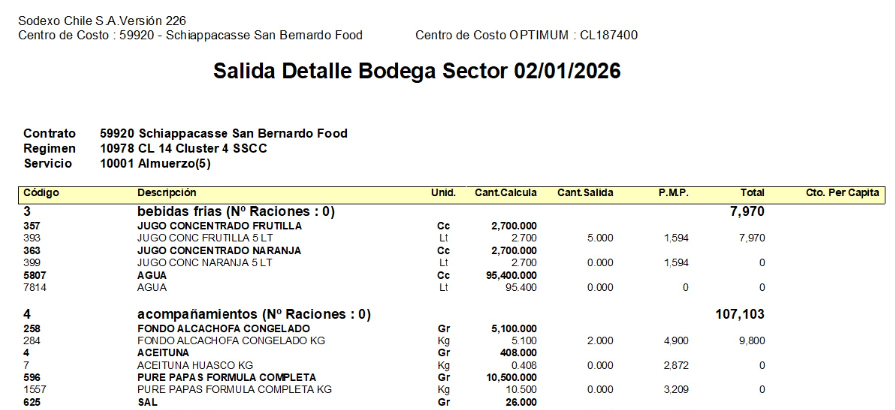

<u>**Tablas Relacionadas:**</u>

| **Tabla** | **Para qué se usa** | **Campos clave** |
| --- | --- | --- |
| b_totventas | Cabecera de cada documento de bodega. Contiene el tipo de documento, la fecha, el contrato, el régimen, el servicio y la bodega. | tov_rutcli (contrato) tov_tipdoc (SP/DP) tov_numdoc (número de documento) tov_fecpro (fecha) tov_codreg (régimen) tov_codser (servicio) tov_codbod (bodega) tov_estdoc (estado: A=anulado, P=pendiente) |
| b_detventas | Líneas de cada documento: qué productos se movieron y en qué cantidades. | dev_rutcli dev_tipdoc dev_numdoc dev_coding (código ingrediente) dev_codmer (código producto) dev_canmin (cantidad calculada) dev_canmer (cantidad real) dev_predoc (PMP) dev_ptotal (total línea) dev_codsec (sector) dev_numlin (número de línea) |
| b_ingrediente | Maestro de ingredientes (recetas). Provee el nombre y la unidad de medida del ingrediente. | ing_codigo ing_nombre ing_unimed |
| b_productos | Maestro de productos de bodega. Provee el nombre, unidad de despacho y el factor de conversión (pro_facing). | pro_codigo pro_nombre pro_coduni pro_facing |
| a_unidadmed | Unidades de medida de ingredientes (kg, litro, etc.). | unm_codigo unm_nomcor |
| a_unidad | Unidades de despacho de productos de bodega. | uni_codigo uni_nomcor |
| a_sector | Maestro de sectores de producción. Usado cuando el documento es de tipo "Sector". | sec_codigo sec_nombre sec_orden |
| b_minutaraciones | Registro de raciones producidas por día, contrato, régimen y servicio. Se usa para calcular el costo per cápita en documentos con sectores. | mir_cencos mir_codreg mir_codser mir_fecmin mir_nrorac mir_rutcli (valor 'PRODUCIDAS') |
| b_clientes | Maestro de contratos/centros de costo. Usado para validar y mostrar el nombre del contrato. | cli_codigo cli_nombre |
| a_regimen | Maestro de regímenes. Usado para validar y mostrar el nombre del régimen. | reg_codigo reg_nombre |
| a_servicio | Maestro de servicios. Usado para validar y mostrar el nombre del servicio. | ser_codigo ser_nombre |

## 9.2. Detalle de Compras por Producto

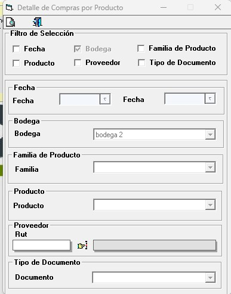
<u>**Descripción:**</u>
Esta pantalla genera un informe imprimible que lista el detalle de las compras registradas en el casino, agrupadas por proveedor. Para cada proveedor muestra los productos adquiridos indicando código, nombre, unidad de medida, cantidad comprada y monto total. Al final de cada proveedor aparece un subtotal y al cierre del informe se presenta el total general de todas las compras.
La pantalla se organiza en dos áreas principales. La primera es el panel de filtros de selección, donde el usuario activa mediante casillas de verificación los criterios con los que desea acotar la consulta: rango de fechas, bodega, familia de producto, producto específico, proveedor y tipo de documento. Cada criterio es independiente y puede activarse o combinarse con otros. La segunda área es el detalle de cada criterio activado, donde el usuario especifica los valores concretos del filtro en campos y listas desplegables que se habilitan dinámicamente al marcar la casilla correspondiente.
El informe no está restringido a una única bodega ni a un único proveedor: si el usuario no activa el filtro de bodega o el de proveedor, la consulta abarca todos los documentos disponibles que cumplan los demás criterios seleccionados. La salida del reporte se presenta en una ventana de vista previa antes de imprimir.

| **Campo** | **Descripción** | **Obligatorio** |
| --- | --- | --- |
| Casilla Fecha | Activa el filtro por rango de fechas de recepción del documento. Al marcarla se habilitan los campos de fecha y se cargan con la fecha del día. | No (pero al menos un filtro debe estar activo) |
| Fecha Desde | Límite inferior del rango de fechas a consultar. Se ingresa en formato dd/mm/aaaa. | Solo si la casilla Fecha está marcada |
| Fecha Hasta | Límite superior del rango de fechas a consultar. Debe ser igual o posterior a Fecha Desde. | Solo si la casilla Fecha está marcada |
| Casilla Bodega | Marcada por defecto y no modificable por el usuario. La lista desplegable de bodega está cargada con todas las bodegas del casino (tabla de clientes / bodegas). | Sí (siempre activa, pero la lista desplegable de bodega permanece bloqueada) |
| Casilla Familia de Producto | Activa el filtro por familia o tipo de producto. Al marcarla habilita la lista desplegable de familias. | No |
| Familia | Lista desplegable con las familias de productos disponibles en el sistema. | Solo si la casilla Familia de Producto está marcada |
| Casilla Producto | Activa el filtro por producto específico. Al marcarla habilita la lista desplegable de productos. | No |
| Producto | Lista desplegable con todos los productos activos del catálogo. | Solo si la casilla Producto está marcada |
| Casilla Proveedor | Activa el filtro por proveedor. Al marcarla habilita el campo de RUT y el botón de búsqueda. | No |
| Rut (Proveedor) | Campo de texto donde se ingresa el RUT del proveedor. El sistema valida el dígito verificador y muestra el nombre del proveedor al salir del campo. Existe un botón de búsqueda que abre un selector de proveedores para elegir sin tipear el RUT manualmente. | Solo si la casilla Proveedor está marcada |
| Casilla Tipo de Documento | Activa el filtro por tipo de documento de compra. Al marcarla habilita la lista desplegable de tipos de documento. | No |
| Documento | Lista desplegable con los tipos de documento disponibles (facturas, notas de crédito, etc.). | Solo si la casilla Tipo de Documento está marcada |

Este formulario genera un único tipo de informe. No tiene selector de tipos.
**Formato de salida:** Documento RTF con vista previa. Orientación vertical (retrato). Una única sección continua con todos los resultados. El usuario visualiza el informe en pantalla antes de imprimir.
**Qué muestra el informe:**
El documento está estructurado en tres bloques:
**Encabezado del informe:** título "Detalle de Compras por Periodo", seguido de una tabla con los criterios de filtro activos (por ejemplo: "Compras entre 01/01/2025 y 31/01/2025", "Bodega: Central", "Producto: Arroz", etc.). Solo se listan los filtros que el usuario activó.
**Cuerpo por proveedor:** Para cada proveedor que aparece en los resultados se muestra su RUT con formato (ej. 12.345.678-9) como encabezado de sección, seguido del detalle de sus compras fila por fila, y al final una línea de "Total Proveedor" con el monto acumulado de ese proveedor.
**Total,**** General:** al cierre del documento, una línea con la suma de todos los totales de proveedores.
**Estructura de datos del informe:**

| **Campo****/Columna** | **Descripción** | **Calculado** |
| --- | --- | --- |
| Código | Código interno del producto comprado | No |
| Descripción | Nombre del producto | No |
| Unidad | Nombre de la unidad de medida del producto (ej. Kg, Lt, Un) | No |
| Cantidad | Cantidad adquirida en el documento de compra | No |
| Total | Monto total de la línea incluyendo flete, con tratamiento especial para notas de crédito y créditos especiales | Sí |
| Total Proveedor | Suma de los totales de todas las líneas del proveedor dentro del resultado | Sí |
| Total General | Suma de todos los totales de proveedor | Sí |

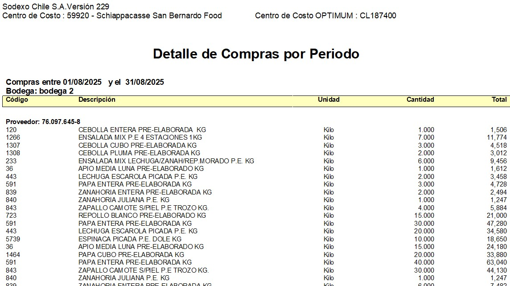
<u>**Reglas de Negocio:**</u>

| **#** | **Cuándo aparece** | **Qué verifica el sistema** | **Qué ve o experimenta el usuario** |
| --- | --- | --- | --- |
| 1 | Al hacer clic en Vista Previa sin ningún filtro activo | Que al menos uno de los seis filtros esté marcado | Mensaje: “Seleccione método de búsqueda...” El informe no se ejecuta. |
| 2 | Al hacer clic en Vista Previa con el filtro de Fecha activo | Que ambas fechas tengan un valor válido (formato correcto y reconocible como fecha) | Mensaje: “Rango de fechas no valido...” si alguna fecha está vacía o tiene formato incorrecto. |
| 3 | Al hacer clic en Vista Previa con el filtro de Fecha activo | Que Fecha Desde sea menor o igual a Fecha Hasta | Mensaje: 2Rango de fechas no valido...” si Fecha Desde es posterior a Fecha Hasta. |
| 4 | Al hacer clic en Vista Previa con el filtro de Bodega activo | Que haya una bodega seleccionada en la lista | Mensaje: “Bodega no valida...” |
| 5 | Al hacer clic en Vista Previa con el filtro de Familia de Producto activo | Que haya una familia seleccionada en la lista | Mensaje: “Tipo de producto no valido...” |
| 6 | Al hacer clic en Vista Previa con el filtro de Producto activo | Que haya un producto seleccionado en la lista | Mensaje: “Producto no valido...” |
| 7 | Al hacer clic en Vista Previa con el filtro de Proveedor activo | Que el campo de RUT no esté vacío | Mensaje: “Proveedor no valido...” |
| 8 | Al salir del campo RUT con un valor ingresado | Que el RUT exista en el catálogo de proveedores | Si no existe, el campo se limpia y el foco vuelve al campo de RUT. |
| 9 | Al hacer clic en Vista Previa con el filtro de Tipo de Documento activo | Que haya un tipo de documento seleccionado en la lista | Mensaje: “Tipo de documento no valido...” |
| 10 | Tras ejecutar la consulta con todos los filtros válidos | Que la consulta devuelva al menos un registro | Mensaje: “No existen datos para la consulta...” El informe no se genera. |
| 11 | En todos los resultados | Los documentos de tipo SN quedan excluidos siempre de la consulta, independientemente del filtro de tipo de documento | El usuario no los verá en el informe aunque existan en el sistema. |

<u>**Cálculo — Total (por línea)**</u>
El monto total de cada línea de compra combina el precio neto del ítem con el valor de flete asociado al documento. Cuando el documento es una nota de crédito (NC) o un crédito electrónico (CE), el monto se muestra entre paréntesis para indicar que es un valor negativo (una devolución o descuento).
**Fórmula o lógica:**
Para facturas y otros documentos: Total = dec_ptotal + dec_prefle
Para notas de crédito y créditos especiales: Total = (dec_ptotal + dec_prefle) mostrado entre paréntesis

| **Componente** | **Qué representa** | **De donde viene** |
| --- | --- | --- |
| dec_ptotal | Precio total neto de la línea del documento de compra | b_detcompras.dec_ptotal |
| dec_prefle | Valor del flete proporcional asignado a esa línea | b_detcompras.dec_prefle |
| Tipo de documento (toc_tipdoc) | Determina si la línea es un cargo positivo o un abono negativo | b_totcompras.toc_tipdoc |

<u>**Cálculo — Total Proveedor**</u>
Total, Proveedor = Σ (Total de cada línea, con NC y CE restando)
Suma acumulada de los totales netos de cada línea del proveedor. Para las notas de crédito y créditos electrónica, el valor se resta (se aplica como negativo) al acumulado del proveedor, de modo que el Total Proveedor refleja el gasto neto real después de devoluciones.
<u>**Cálculo — Total General**</u>
Total, General = Σ Total Proveedor (por cada proveedor en el resultado)
Suma de los totales de proveedor de todos los proveedores que aparecen en el informe.

<u>**Tablas Relacionadas:**</u>

| **Tabla** | **Para qué se usa** | **Campos clave** |
| --- | --- | --- |
| b_totcompras | Cabecera de cada documento de compra. Provee la fecha de recepción, el tipo de documento, el número de documento, la bodega y el RUT del proveedor. Es la tabla de filtrado principal. | toc_rutpro toc_tipdoc toc_numdoc toc_codbod toc_fecrem |
| b_detcompras | Líneas de detalle de cada documento de compra. Provee el código del producto, la cantidad comprada, el precio total y el flete por línea. | dec_rutpro dec_tipdoc dec_numdoc dec_codmer dec_canmer dec_ptotal dec_prefle |
| b_proveedor | Catálogo de proveedores. Se usa para validar el RUT ingresado y obtener el nombre del proveedor que se muestra en el informe. | prv_codigo prv_nombre |
| b_productos | Catálogo de productos. Provee el nombre del producto y su relación con la familia y la unidad de medida. | pro_codigo pro_nombre pro_codtip pro_coduni |
| a_tipopro | Catálogo de familias o tipos de producto. Se usa para filtrar por familia y poblar la lista desplegable correspondiente. | tip_codigo tip_nombre |
| a_unidad | Catálogo de unidades de medida. Provee el nombre de la unidad que aparece en la columna Unidad del informe. | uni_codigo uni_nombre |
| b_clientes | Catálogo de bodegas del casino. Se usa para poblar la lista desplegable de bodegas al abrir la pantalla. | cli_(código y descripción de bodega) |
| a_tipodocumento | Catálogo de tipos de documento de compra (factura, nota de crédito, crédito especial, etc.). Se usa para poblar la lista desplegable de tipos de documento. | tdo_codigo tdo_nombre |

## 9.3. Documentos Pendientes Proveedores

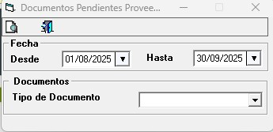
<u>**Descripción:**</u>
Esta pantalla genera un informe de documentos de compra que han sido registrados en el sistema pero que aún no tienen un documento asociado que los cierre o liquide. Dependiendo del tipo de documento seleccionado, permite identificar las guías de despacho recibidas de proveedores que todavía no tienen factura de compra vinculada, o las solicitudes de nota de crédito que no tienen aún una nota de crédito emitida que las respalde.
La pantalla se compone de dos paneles: uno de fecha (rango Desde–Hasta) y uno de documentos (selector del tipo a consultar). Una vez completados ambos filtros, el usuario ejecuta el informe desde la barra de herramientas y el sistema genera un documento en vista previa que puede revisar en pantalla antes de exportar o imprimir.
El informe muestra los documentos pendientes de la bodega activa en la sesión del usuario y consolida los montos por rubro contable (alimentación, desechos, otros), calculando el total por cada documento y el gran total al final del listado.

| **Campo** | **Descripción** | **Obligatorio** |
| --- | --- | --- |
| Desde | Fecha de inicio del período a consultar. El sistema la inicializa con la fecha del día al abrir el formulario. | Sí |
| Hasta | Fecha de término del período a consultar. El sistema la inicializa con la fecha del día al abrir el formulario. | Sí |
| Tipo de Documento | Lista desplegable con las dos opciones de documento a consultar: Guías de Despacho o Solicitud Nota de Crédito. Se debe seleccionar una antes de ejecutar. | Sí |

No se requiere ninguna acción previa adicional: al abrir el formulario, las fechas ya están cargadas con la fecha actual y la bodega consultada es la que tiene activa el usuario en su sesión.

<u>**Reglas de Negocio:**</u>

| **#** | **Cuando aparece** | **Qué verifica el sistema** | **Qué ve o experimenta el usuario** |
| --- | --- | --- | --- |
| 1 | Al hacer clic en Vista Previa | Que la fecha Desde no sea posterior a la fecha Hasta | Mensaje: Rango de fechas no valido... El usuario debe corregir el rango antes de continuar. |
| 2 | Al hacer clic en Vista Previa (después de validar las fechas) | Que se haya seleccionado un tipo de documento en la lista | Mensaje: Seleccione método de búsqueda... El usuario debe elegir entre Guías de Despacho o Solicitud Nota de Crédito. |
| 3 | Después de ejecutar la consulta al servidor | Que existan documentos pendientes para los filtros ingresados | Mensaje: No existen datos... El informe no se genera y el usuario puede ajustar los filtros. |
| 4 | Al abrir el formulario | Que el usuario tenga permisos de visualización | El botón Vista Previa aparece deshabilitado si el usuario no tiene el permiso correspondiente. |

<u>**Tablas Relacionadas:**</u>

| **Tabla** | **Para qué se usa en este reporte** | **Campos clave** |
| --- | --- | --- |
| b_totcompras | Fuente principal: cabecera de cada documento de compra (guía o solicitud de NC). Filtra por bodega, tipo de documento, rango de fechas y condición de pendiente (sin documento asociado) | toc_rutpro, toc_tipdoc, toc_numdoc, toc_fecrem, toc_docaso, toc_docsnc, toc_codbod |
| b_detcompras | Líneas de detalle de cada documento: productos, cantidades, precios y descuentos | dec_rutpro, dec_tipdoc, dec_numdoc, dec_numlin, dec_codmer, dec_canmer, dec_precom, dec_pctdes, dec_canrec, dec_prerec, dec_ptotal, dec_ptotrec |
| b_productos | Catálogo de productos: proporciona la cuenta contable de cada producto para clasificarlo en el rubro correspondiente (alimentación, desechos, otros) | pro_codigo, pro_ctacon |
| b_proveedor | Catálogo de proveedores: proporciona el RUT y el nombre del proveedor para mostrar en el informe | prv_codigo, prv_nombre |
| b_detcomprasimp | Detalle de impuestos por línea de compra: proporciona el monto de impuestos incluidos en costo cuando aplica | imd_rutdoc, imd_tipdoc, imd_numdoc, imd_numlin, imd_codpro, imd_monimp, imd_codimp |
| a_impuesto | Catálogo de impuestos: filtra los que tienen el indicador de inclusión en costo activo | imp_codigo, imp_inccos |
| a_tipodocumento | Catálogo de tipos de documento: permite traducir el código genérico GD a los códigos internos reales de guías de despacho registrados en el sistema | tdo_Codigo, tdo_IdCodigo |
| a_param | Parámetros del casino: proporciona los códigos de cuenta contable ctainsumo y ctalimdes para clasificar los rubros del informe | par_codigo, par_valor, par_cencos |
| b_clientes | Catálogo de clientes/contratos: proporciona el nombre y código del contrato para mostrar en el encabezado del informe | cli_nombre, cli_codigo |
| b_bodegas | Catálogo de bodegas: proporciona el nombre y código de la bodega activa para mostrar en el encabezado del informe | bod_nombre, bod_codigo |

<u>**Formato de Salida:**</u>
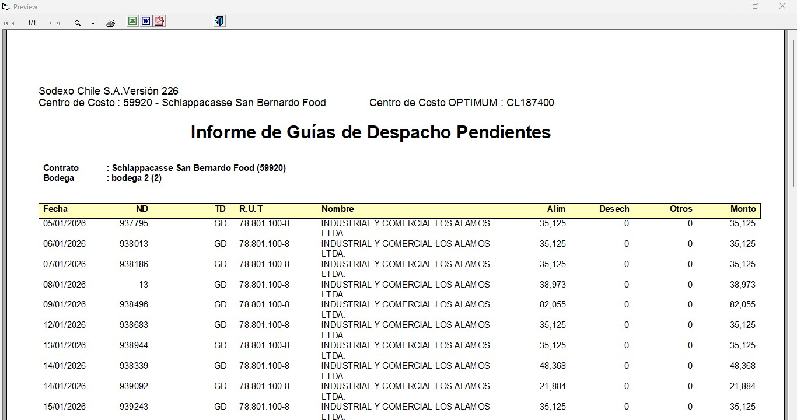
<u>**Descripción:**</u>
Esta pantalla genera un único informe cuyo contenido varía según el tipo de documento seleccionado. No hay un selector de múltiples tipos de informe con estructuras radicalmente distintas: ambas opciones utilizan el mismo formato de salida y la misma estructura de columnas, diferenciándose únicamente en qué campo se muestra en la columna central y en la lógica de filtro de pendientes.
**Formato de salida:** Documento RTF generado en orientación retrato. El sistema abre automáticamente una ventana de vista previa donde el usuario puede revisar el documento antes de exportarlo o imprimirlo. El encabezado del documento incluye el nombre del contrato (casino) y la bodega activa en la sesión del usuario.
**Título del documento generado:**
Si se seleccionó Guías de Despacho: *Informe de Guías de Despacho Pendientes*
Si se seleccionó Solicitud Nota de Crédito: *Informe de Solicitudes de Nota de Crédito Pendientes*
**Estructura de datos del informe:**

| **Campo / Columna** | **Descripción** | **Calculado** |
| --- | --- | --- |
| Fecha Emisión | Fecha en que fue emitido el documento por el proveedor | No |
| ND | Número del documento (número de la guía de despacho o de la solicitud de nota de crédito) | No |
| Nº Factura | Número de la factura asociada. Solo aparece para el tipo Solicitud Nota de Crédito; en Guías de Despacho esta columna queda vacía | No |
| TD | Tipo de documento (código interno del tipo de documento registrado en el sistema) | No |
| R.U.T | RUT del proveedor, formateado con puntos y guión | No |
| Nombre | Nombre o razón social del proveedor | No |
| Alim | Monto del documento correspondiente a productos clasificados como insumos de alimentación | Sí |
| Desech | Monto del documento correspondiente a productos clasificados como desechos o limpieza | Sí |
| Otros | Monto del documento correspondiente a productos de otras categorías contables | Sí |
| Monto | Suma de los tres rubros anteriores para el documento | Sí |
| **Total** (fila de cierre) | Suma de cada columna de monto para todos los documentos listados |  |

<u>**Regla de Negocio:**</u>
**Cálculo — Alim (monto alimentación por documento)**
El sistema no almacena los montos por rubro directamente en el documento. Los calcula en tiempo de generación del informe clasificando cada línea del detalle según la cuenta contable del producto, y acumulando el monto neto de cada línea según a qué rubro pertenece.
**Fórmula o lógica — tipo Guías de Despacho:**
Monto Alim = Σ (((cantidad recibida × precio de compra) – (((cantidad del documento × precio de compra) × (descuento / 100)))
para todas las líneas cuyo producto tenga cuenta contable igual al parámetro ctainsumo (cuenta de insumos de alimentación).
**Fórmula o lógica — tipo Solicitud Nota de Crédito:**
Monto Alim = Σ (((total línea − total ya recibido) − ((total línea − total ya recibido) × (descuento / 100) + monto impuesto incluido en costo
para todas las líneas cuyo producto tenga cuenta contable igual al parámetro ctainsumo.

| **Componente** | **Qué representa** | **De dónde viene** |
| --- | --- | --- |
| Cantidad recibida (dec_canrec) | Cantidad de unidades que efectivamente ingresaron a bodega | b_detcompras.dec_canrec |
| Precio de compra (dec_precom) | Precio unitario pactado con el proveedor | b_detcompras.dec_precom |
| % descuento (dec_pctdes) | Porcentaje de descuento aplicado en la línea del documento | b_detcompras.dec_pctdes |
| Total línea (dec_ptotal) | Monto total registrado en la línea del documento | b_detcompras.dec_ptotal |
| Total ya recibido (dec_ptotrec) | Monto del total que ya fue procesado en recepciones anteriores | b_detcompras.dec_ptotrec |
| Impuesto incluido en costo (imd_monimp) | Monto de impuestos adicionales cuya cuenta tiene el indicador de inclusión en costo activo | b_detcomprasimp cruzada con a_impuesto donde imp_inccos = 1 |
| Cuenta contable del producto (pro_ctacon) | Código de cuenta contable asignado al producto, que determina si va a Alim, Desech u Otros | b_productos.pro_ctacon |
| Parámetro ctainsumo | Código de cuenta contable que identifica los insumos de alimentación del casino | Tabla a_param, parámetro ctainsumo para el centro de costo activo |
| Parámetro ctalimdes | Código de cuenta contable que identifica los productos de desechos o limpieza | Tabla a_param, parámetro ctalimdes para el centro de costo activo |

Ejemplo (Guías de Despacho): Una línea con 10 unidades recibidas a $500 cada una y 5% de descuento, cuyo producto es de alimentación, contribuye: (10 × $500) − (10 × $500 × 5/100) = $5.000 − $250 = $4.750 al rubro Alim.
**Cálculo — Desech (monto desechos por documento)**
Mismo cálculo que Alimemtación pero para las líneas cuyo producto tiene cuenta contable igual al parámetro ctalimdes.
**Cálculo — Otros (monto otros rubros por documento)**
Mismo cálculo pero para las líneas cuyo producto tiene una cuenta contable distinta a ctainsumo y a ctalimdes.
**Cálculo — Monto (total por documento)**
Monto = Alim + Desech + Otros
Representa el monto total pendiente del documento, sumando los tres rubros calculados.
**Cálculo — Fila Total**
El sistema acumula los tres totales parciales (total alimentación, total desechos, total otros) a lo largo de todos los documentos listados, y los muestra en una fila de cierre al final del informe con la leyenda Total.

## 9.4. Impresión de Etiqueta de Receta

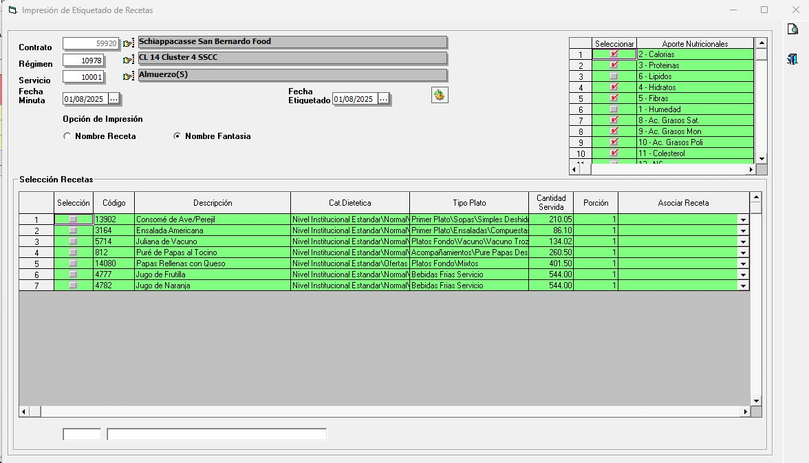
<u>**Descripción:**</u>
Esta pantalla genera etiquetas nutricionales impresas para las recetas que figuran en la minuta real de un día, régimen y servicio determinados. El resultado es un documento en vista previa (formato RTF, orientación vertical) que puede imprimirse directamente; cada receta seleccionada produce una etiqueta con el formato reglamentario exigido en producción de alimentos: encabezado del establecimiento, tabla nutricional por cada 100 gramos y por porción, listado de ingredientes ordenado por gramaje, alérgenos declarados y advertencia de elaboración en líneas compartidas.
La pantalla se organiza en tres zonas: una cabecera de filtros donde el usuario ingresa el contrato, régimen, servicio y fecha de la minuta; una grilla de selección de recetas que se carga con las recetas de esa minuta que tengan sello nutricional configurado; y una grilla secundaria donde se visualizan y seleccionan los nutrientes que aparecerán en la tabla nutricional de la etiqueta.
El sistema verifica al abrirse, antes de que el usuario haga nada, que estén configurados los datos mínimos para operar: que existan nutrientes con sello principal, que el contrato tenga dirección y resolución registradas, y que la tabla de parámetros tenga los nombres de los archivos gráficos (sellos de calorías, azúcares, grasas y sodio, más el logotipo). Si cualquiera de estas condiciones no se cumple, el botón de impresión queda deshabilitado y el sistema muestra un aviso explicando el motivo.
<u>**Funcionalidades:**</u>

| **Control / Acción** | **Descripción** |
| --- | --- |
| Contrato | Campo de texto para ingresar el código del casino. Al escribir el código el sistema muestra el nombre correspondiente junto al campo. |
| Ícono de búsqueda — Contrato | Abre el selector de contratos activos. Al seleccionar un contrato se llenan automáticamente el código y el nombre del contrato, y se limpian los campos de régimen y servicio. |
| Régimen | Campo numérico para ingresar el código de régimen. Al escribir un código válido el sistema muestra el nombre del régimen. |
| Ícono de búsqueda — Régimen | Abre el selector de regímenes. Al seleccionar uno se rellena el código y nombre del régimen. |
| Servicio | Campo numérico para ingresar el código de servicio. Al escribir un código válido el sistema muestra el nombre del servicio. |
| Ícono de búsqueda — Servicio | Abre el selector de servicios. Al seleccionar uno se rellena el código y nombre del servicio, y se activa el campo de fecha de minuta. |
| Fecha Minuta | Campo de fecha (formato dd/mm/yyyy) con selector de calendario. Determina qué día de la minuta real se consultará. Cambiar esta fecha borra el listado de recetas cargado. |
| Nombre Receta / Nombre Fantasía | Opciones excluyentes que definen el nombre que aparecerá en la etiqueta impresa. "Nombre Fantasía" es el valor predeterminado. |
| Botón Buscar (barra inferior) | Consulta la minuta real con los filtros ingresados y carga la grilla de recetas. Solo se activa si los campos de filtro están completos. |
| Filtro por código de receta | Campo de texto ubicado bajo la grilla de recetas. Al presionar Enter filtra las filas mostrando solo las que coinciden exactamente con el código ingresado. Escribir un código distinto limpia el filtro anterior. |
| Filtro por nombre de receta | Campo de texto ubicado bajo la grilla de recetas. Al presionar Enter filtra las filas cuyo nombre contiene el texto ingresado (búsqueda parcial). Puede usarse con múltiples términos separados por coma. Escribir un nombre distinto limpia el filtro anterior. |
| Grilla de recetas (Selección Recetas) | Lista las recetas encontradas en la minuta real. El usuario puede marcar o desmarcar cada receta haciendo clic sobre la fila. Hacer clic en el encabezado de la primera columna invierte la selección de todas las filas visibles. Incluye una columna desplegable para asignar la receta de origen asociada cuando una receta se imprime junto a otra. También permite editar el número de porciones por receta. |
| Grilla de nutrientes | Lista los nutrientes disponibles con indicador de sello principal. Los nutrientes marcados como índice principal aparecen bloqueados (siempre incluidos). El usuario puede activar o desactivar los demás nutrientes para controlar cuáles aparecen en la tabla nutricional de la etiqueta. |
| Vista Previa (barra lateral) | Ejecuta todas las validaciones, arma el documento con una etiqueta por cada receta seleccionada y abre la ventana de vista previa del sistema. Desde ahí puede imprimirse directamente. |
| Salir (barra lateral) | Cierra la pantalla sin generar ningún documento. |

**Nota sobre prerrequisitos de configuración:** Al abrir la pantalla, el sistema verifica automáticamente que existan en la base de datos: nutrientes con indicador de sello principal activo, dirección y resolución registradas en el contrato, y los nombres de los archivos gráficos de sellos (configurados en la tabla de parámetros del sistema con el código NomEtiRec). Si falta cualquiera de estos datos, el botón de vista previa/impresión quedará deshabilitado.
<u>**Reglas de Negocio:**</u>

| **#** | **Cuando aparece** | **Qué verifica el sistema** | **Qué ve o experimenta el usuario** |
| --- | --- | --- | --- |
| 1 | Al abrir la pantalla | Que existan nutrientes con indicador de sello principal activo en el catálogo de nutrientes | Si no existen, el botón de vista previa queda deshabilitado y aparece: *"No existe informaciones nutrientes, se desactivará el botón impresión..."* |
| 2 | Al abrir la pantalla | Que el contrato del casino tenga registrados los campos Dirección y Resolución en el maestro de contratos | Si faltan, el botón queda deshabilitado y aparece: *"No existe información [Dirección] o bien [Resolución] en el maestro de **contratos. Es importante registrar esos datos, para etiquetado recetas, se desactivará el botón impresión..."* |
| 3 | Al abrir la pantalla | Que existan en la tabla de parámetros del sistema los nombres de los archivos gráficos de sellos (código de parámetro NomEtiRec) | Si no existen, el botón queda deshabilitado y aparece: *"No existe información nombre sello etiquetado en la tabla a_param, se desactivará el botón impresión..."* |
| 4 | Al presionar Buscar o Vista Previa | Que la fecha de minuta no esté en blanco | *"Fecha esta nula o en blanco..."* |
| 5 | Al presionar Buscar o Vista Previa | Que el contrato esté definido | *"Contrato no definido..."* |
| 6 | Al presionar Buscar o Vista Previa | Que el régimen esté definido | *"Régimen no definido..."* |
| 7 | Al presionar Buscar o Vista Previa | Que el servicio esté definido | *"Servicio no definido..."* |
| 8 | Al presionar Buscar | Que la minuta real del día seleccionado contenga recetas con sello nutricional configurado | *"No existe Información en la minuta real o bien no está definido los sellos en las recetas..."* |
| 9 | Al presionar Vista Previa | Que haya al menos una receta marcada en la grilla | *"Debe seleccionar a lo menos una receta"* |
| 10 | Al presionar Vista Previa | Si una receta marcada tiene asignada una receta de origen, que esa receta de origen también esté marcada | *"Debe seleccionar la receta origen asociada, proceso cancelado..."* |
| 11 | Al presionar Vista Previa | Que el parámetro de código de receta sólida (ParSoliRec) esté configurado | *"No existe código parametro solido receta, en tabla a_param intentelo dentro de una hora..."* |
| 12 | Al presionar Vista Previa | Que el parámetro de código de receta líquida (ParLiquRec) esté configurado | *"No existe código parametro liquido receta, en tabla **a_param intentelo dentro de una hora..."* |
| 13 | Al presionar Vista Previa | Que existan los códigos de nutrientes de gramos totales (ParNutTGra) | *"No existe códigos parámetro nutriente gramos totales receta, en tabla a_param Inténtelo dentro de una hora..."* |
| 14 | Al presionar Vista Previa | Que exista el código del nutriente colesterol (ParColeste) | *"No existe códigos parámetro nutriente colesterol, en tabla a_param intentelo dentro de una hora..."* |
| 15 | Al presionar Vista Previa | Que exista el parámetro de porcentaje de colesterol (ParColPor) | *"No existe parámetro % colesterol, en tabla a_param Inténtelo dentro de una hora..."* |
| 16 | Al presionar Vista Previa | Que exista el parámetro de máximo de recetas por etiqueta (ParMaxEtRe) | *"No existe código parámetro máximo receta, en tabla a_param Inténtelo dentro de una hora..."* |
| 17 | Al presionar Vista Previa | Que no se supere el máximo de recetas asociadas permitido por etiqueta | *"Debe seleccionar un máximo N receta asociada, proceso cancelado..."* |
| 18 | Al presionar Vista Previa | Que exista el parámetro de máximo de porciones (ParMaxPorR) | *"No existe código parámetro máximo porción receta, en tabla a_param Inténtelo dentro de una hora..."* |
| 19 | Al presionar Vista Previa | Que la cantidad servida de cada receta seleccionada sea mayor que cero | *"Existe cantidad servida con valor cero en la grilla, proceso cancelado..."* |
| 20 | Al presionar Vista Previa | Que el número de porciones de cada receta sea al menos 1 | *"Existe porción con valor cero en la grilla, proceso cancelado..."* |
| 21 | Al presionar Vista Previa | Que el número de porciones no supere el máximo configurado | *"Debe seleccionar un máximo N porción de receta, proceso cancelado..."* |
| 22 | Al presionar Vista Previa | Que el código de receta de unión sea mayor que cero | *"Existe código de receta unión con valor cero en la grilla, proceso cancelado..."* |
| 23 | Al presionar Vista Previa | Que el total de recetas marcadas no supere 1000 | *"Debe seleccionar un máximo mil recetas, proceso cancelado..."* |
| 24 | Al presionar Vista Previa | Que exista el parámetro de máximo de nutrientes (ParMaxNutr) | *"No existe código parámetro máximo nutriente, en tabla a_param Inténtelo dentro de una hora..."* |
| 25 | Al presionar Vista Previa | Que no se supere el máximo de nutrientes seleccionados | *"Debe seleccionar un máximo N nutrientes, proceso cancelado..."* |
| 26 | Al presionar Vista Previa | Que exista la carpeta Etiquetado en el directorio de trabajo de informes | *"No existe la carpeta Etiquetado..."* |
| 27 | Al presionar Vista Previa | Que existan en la carpeta los archivos gráficos de Calorías, Azúcares, Grasas, Sodio y Logotipo | *"No existe archivo [nombre] o bien fue borrado..."* |
| 28 | Al generar el informe | Que existan los parámetros de calorías, grasas totales, azúcares y sodio en la tabla de parámetros del sistema (ParCaloria, ParGrasas, ParAzucar, ParSodio) | Mensajes individuales por cada parámetro faltante |
| 29 | Al generar el informe | Que las recetas seleccionadas tengan el etiquetado de sello definido con tipo Líquido o Sólido | *"No está definido el etiquetado en las recetas con el concepto (Liquido o Solido) ..."* |

Cantidad servida por receta: El sistema calcula automáticamente la cantidad servida en gramos por ración al cargar la grilla de recetas. Este valor se obtiene sumando, para cada ingrediente de la receta, el gramaje bruto multiplicado por el porcentaje de aprovechamiento y luego por el porcentaje de cocción:
canservida = SUM( (red_pctapr / 100 × red_canpro) × (red_pctcoc / 100) )
Donde red_pctapr es el porcentaje de aprovechamiento del ingrediente, red_canpro es la cantidad en gramos del ingrediente en la receta, y red_pctcoc es el porcentaje de cocción.
Valor nutricional por porción: El sistema calcula el aporte de cada nutriente por porción dividiendo el aporte nutricional del ingrediente por el factor nutricional del ingrediente y ponderando por el gramaje relativo al rendimiento base de la receta:
candiet = SUM( (red_pctnut/100 × pnu_canapo × (red_canpro / rec_basrac)) / ing_facnut )
Donde red_pctnut es el porcentaje neto del ingrediente, pnu_canapo es el aporte del nutriente en el ingrediente (por cada 100 g de alimento), red_canpro es la cantidad del ingrediente en la receta, rec_basrac es el rendimiento base de la receta en gramos, e ing_facnut es el factor de conversión nutricional del ingrediente.
Grasa Total: Se calcula de manera especial incluyendo el colesterol ajustado por el porcentaje configurado en ParColPor, sumándose junto a los demás tipos de grasa:
<u>**Tablas Relacionadas:**</u>

| **Tabla** | **Para qué se usa en este reporte** | **Campos clave** |
| --- | --- | --- |
| b_minuta | Encabezado de la minuta real: filtra por contrato, régimen, servicio y fecha | min_cencos, min_codreg, min_codser, min_fecmin |
| b_minutadet | Detalle de la minuta real: identifica las recetas del día y el tipo de minuta (solo se usan registros de minuta real, mid_tipmin = '2') | mid_codigo, mid_codrec, mid_tiprec, mid_numlin |
| b_receta | Maestro de recetas: nombre, nombre fantasía, categoría dietética, tipo de plato, rendimiento base, sello nutricional configurado | rec_codigo, rec_nombre, rec_nomfan, rec_catdie, rec_tippla, rec_basrac, rec_fecvig, IdSellos, IdEtiquetadoSello |
| b_recetadet | Detalle de ingredientes de cada receta: gramajes, porcentajes de aprovechamiento y cocción, porcentaje neto nutricional | red_codigo, red_codpro, red_canpro, red_pctapr, red_pctcoc, red_pctnut, red_tiprec, red_cencos |
| b_ingrediente | Catálogo de ingredientes: nombre, factor nutricional | ing_codigo, ing_nombre, ing_facnut |
| b_productonut | Tabla de aportes nutricionales por ingrediente: cuánto aporta cada nutriente por cada 100 g del ingrediente | pnu_codpro, pnu_codapo, pnu_canapo |
| a_nutriente | Catálogo de nutrientes: nombre, unidad de medida, indicador de sello principal, orden de presentación | nut_codigo, nut_nombre, nut_nomuni, nut_IndicePrincipalSello, nut_secnro, nut_OrdenPrincipalSello |
| a_sellosreceta | Configuración de sellos nutricionales disponibles; determina qué sello está activo para cada receta | IdSellos, Activo |
| a_etiquetadoselloreceta | Configuración del tipo de etiquetado (Sólido/Líquido) por receta | IdEtiquetadoSello, activo |
| b_recetaalergeno | Alérgenos declarados para cada receta | IdReceta, Idalergeno, Activo |
| a_alergeno | Catálogo de alérgenos | IdAlergeno, NombreAlergeno, Activo |
| b_clientes | Maestro de contratos/casinos: dirección y resolución necesarias para el encabezado de la etiqueta. Solo se usan registros de tipo casino activo (cli_activo='1', cli_tipo=0, cli_codbod>0) | cli_codigo, cli_direccion, cli_resolucion, cli_activo, cli_tipo, cli_codbod |
| a_regimen | Catálogo de regímenes: para mostrar el nombre al ingresar el código | reg_codigo, reg_nombre |
| a_servicio | Catálogo de servicios: para mostrar el nombre al ingresar el código | ser_codigo, ser_nombre |
| a_param | Tabla de parámetros del sistema: almacena códigos y nombres de archivos gráficos de sellos, umbrales nutricionales por tipo de receta, y códigos internos de nutrientes críticos | par_codigo, par_valor, par_cencos |
| b_productosing | Tabla de vinculación entre productos e ingredientes; usada para validar que el ingrediente esté asociado a un producto activo | pri_coding, pri_codpro |
| b_productos | Maestro de productos; confirmación de que el ingrediente tiene producto asociado | pro_codigo |
| a_recetacatdie | Catálogo de categorías dietéticas | car_codigo |
| a_recetatippla | Catálogo de tipos de plato | tip_codigo |

<u>**Formato de Salida:**</u>
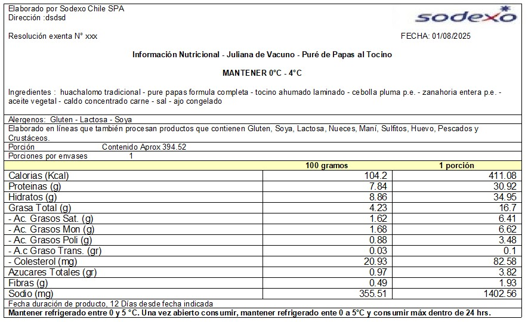
> Comentario - ZEBALLOS BELMAR Francisco (2026-03-27): El numero de día (12) debe ser un parámetro general y con excepciones por sitio.
> Comentario - ZEBALLOS BELMAR Francisco (2026-03-27): Considerar que los alergenos se arrastren desde el Ingrediente
> Comentario - ZEBALLOS BELMAR Francisco (2026-03-27): Donde dice “FECHA” debe decir “FECHA ELABORACIÓN” y también donde dice “Fecha indicada” es “Fecha de Elaboración”
<u>**Descripción:**</u>
Esta pantalla genera un único tipo de documento: una etiqueta nutricional por cada receta marcada en la grilla, agrupadas en un mismo documento de vista previa. El documento se genera en orientación vertical y puede imprimirse o exportarse como RTF desde la ventana de vista previa.
**Formato de salida:** Vista previa RTF — orientación vertical (Portrait).
Función que genera el documento: I_Etiquetado_Receta, definida en Informes.bas.
<u>**Reglas de Negocio**</u><u>**:**</u>

| **Bloque** | **Contenido** |
| --- | --- |
| Logotipo | Imagen gráfica del logotipo del establecimiento (archivo configurado en parámetros del sistema) |
| Encabezado del establecimiento | Texto fijo "Elaborado por Sodexo Chile SPA", dirección del casino, línea en blanco |
| Resolución y fecha | "Resolución exenta N° [número]" seguido de la Fecha de Emisión indicada por el usuario |
| Título nutricional | "Información Nutricional [nombre de la receta o recetas agrupadas]" |
| Indicación de conservación | "MANTENER 0°C - 4°C" |
| Listado de ingredientes | "Ingredientes: [lista de ingredientes ordenada de mayor a menor gramaje, separada por guiones]" |
| Alérgenos declarados | "Alergenos: [lista de alérgenos registrados en la receta]" |
| Advertencia de elaboración compartida | Texto fijo sobre líneas que procesan gluten, soya, lactosa, nueces, maní, sulfitos, huevo, pescados y crustáceos |
| Porción — Contenido aproximado | Cantidad servida en gramos por porción (calculada automáticamente) |
| Porciones por envase | Número de porciones indicado en la grilla por el usuario |
| Tabla nutricional | Encabezado con columnas "100 gramos" / "1 porción"; fila por cada nutriente seleccionado con nombre, unidad y valores calculados; filas de sellos (calorías, azúcares, grasas totales, sodio) con íconos gráficos y marcas de exceso según umbrales configurados |

**Sellos de advertencia en la tabla nutricional:** Para los cuatro nutrientes críticos (Calorías, Azúcares, Grasas Totales y Sodio) el sistema compara el valor calculado por porción contra los umbrales parametrizados según el tipo de receta (sólida o líquida). Si el valor supera el umbral configurado, se muestra el ícono de advertencia correspondiente (sello negro de exceso). Los umbrales de sólidos y líquidos se leen de los parámetros Solido y Liquido respectivamente.
**Recetas agrupadas:** Si el usuario asigna a una receta una "receta de origen" (columna desplegable en la grilla), ambas recetas se consolidan en una misma etiqueta. Los ingredientes y valores nutricionales se suman. El nombre en el título nutricional muestra ambos nombres concatenados con separador.

## 9.5. Resultado Operacional Mensual (A13)

> Comentario - ZEBALLOS BELMAR Francisco (2026-03-27): El nombre “A13” eliminar del reporte

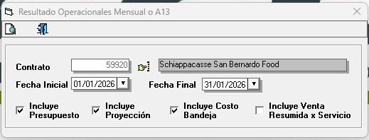
<u>**Descripción:**</u>
Esta pantalla genera el Estado de Resultado Operacional Mensual, conocido internamente como "A13". Es el informe financiero-operativo más completo del casino: consolida en un solo documento las ventas del período, todos los costos de insumos (alimentos y desechables/limpieza), los gastos generales, el costo de personal, la depreciación y la utilidad operacional. Permite conocer de un vistazo si el casino operó con ganancia o pérdida durante el rango de fechas consultado, y en qué proporción se incurrieron los distintos costos respecto a las ventas totales.
El informe se estructura en dos grandes zonas. La parte izquierda presenta un bloque de ventas detallado por tipo (ventas al contado, ventas facturas, ventas cafetería, ventas servicios especiales, raciones por régimen y servicio con precio unitario). Junto a ello, la parte derecha desglosa los insumos con sus líneas de inventario inicial, compras centralizadas, compras FOFI, compras no estoqueable, traspasos recibidos y emitidos, mermas, salidas y devoluciones de producción, ajustes y toma de inventario; cada línea separada por columna de alimentos y columna de desechables/limpieza, con su porcentaje sobre las ventas. Debajo aparecen las ratios de food cost, el resumen de gastos generales, costo de personal, depreciación y la utilidad operacional final.
El informe aplica al casino actualmente conectado (el contrato del campo "Contrato" determina el alcance) y puede opcionalmente incluir una comparativa con presupuesto y/o proyección si esos datos han sido cargados previamente en el sistema.

| **Campo** | **Descripción** | **Obligatorio** |
| --- | --- | --- |
| Contrato | Código del contrato (casino) para el cual se genera el A13. Al abrir el formulario, el sistema carga automáticamente el contrato del casino activo. El campo puede editarse si el usuario tiene perfil de administrador multi-casino, y también es posible buscar mediante el ícono lupa. | Sí |
| Fecha Inicial | Primer día del rango a analizar. Formato dd/mm/aaaa. Por defecto se carga la fecha actual. | Sí |
| Fecha Final | Último día del rango a analizar. Debe ser mayor o igual a la fecha inicial. | Sí |
| Incluye Presupuesto | Casilla de verificación. Si está marcada, el informe agrega columnas de presupuesto y porcentaje de cumplimiento para cada línea del estado de resultado. Solo aplica si existe un período de cierre que contenga el rango de fechas. | No |
| Incluye Proyección | Casilla de verificación. Si está marcada, el informe agrega columnas de proyección. Se puede marcar junto con "Incluye Presupuesto" para ver ambas comparativas simultáneamente. Solo aplica si existe un período de cierre vigente. | No |
| Incluye Costo Bandeja | Casilla de verificación. Si está marcada, el sistema calcula y despliega un detalle adicional del costo por bandeja (planificado versus realizado), usando los datos de minuta y precio de venta. | No |
| Incluye Venta Resumida x Servicio | Casilla de verificación. Si está marcada, las raciones se presentan agrupadas por servicio (sin mostrar el cliente ni el precio unitario individual), mostrando únicamente la cantidad total de raciones por servicio. Si está desmarcada, el detalle se muestra cliente por cliente con cantidad y precio de venta. | No |

Nota sobre días stock: El sistema también requiere que el parámetro días stock esté configurado en la tabla de parámetros del casino. Si no existe, el proceso se cancela con un mensaje de error antes de generar el informe.
<u>**Reglas de Negocio:**</u>

| **#** | **Cuando**** aparece** | **Qué verifica el sistema** | **Qué ve o experimenta el usuario** |
| --- | --- | --- | --- |
| 1 | Al hacer clic en Vista Previa | El código de contrato ingresado debe existir en la tabla de contratos (b_clientes) | Mensaje: "No existe contrato" — el proceso se cancela y debe corregir el código. |
| 2 | Al hacer clic en Vista Previa | La fecha inicial debe ser menor o igual a la fecha final | Mensaje: "Fecha inicial no puede ser mayor final" — el proceso se cancela. |
| 3 | Durante la generación del informe | El parámetro diasstock debe estar configurado para el casino | Mensaje: "No existe días stock, proceso cancelado" — el informe no se genera. El parámetro debe ser configurado por un administrador. |
| 4 | Al ingresar manualmente el contrato (salir del campo) | Si escribe un código inexistente, el campo de nombre queda en blanco; al intentar generar, se dispara la validación 1. | El campo de descripción del contrato aparece vacío como indicador visual. |

**4.2 Reglas de cálculo**
Las siguientes reglas aplican a nivel del formulario principal, independientemente de las opciones marcadas:
**Período de cierre:** El sistema busca en b_cierreperiodo un registro cuya fecha de inicio sea menor o igual a la fecha inicial ingresada y cuya fecha de término sea mayor o igual a la fecha final. Este "período" determina el mes al que corresponde el informe y afecta el cálculo del corte de ventas (raciones facturadas según el día de cierre de cada cliente).
**Corte de ventas por raciones:** Cuando existe un período de cierre, el sistema ajusta automáticamente el rango de fechas de las raciones para respetar el día de cierre contractual de cada cliente (cli_ciedia). Las raciones se toman desde el día siguiente al cierre del mes anterior hasta el día de cierre del mes en curso (o la fecha final si es menor).
**Clasificación de insumos:** Cada producto se clasifica como "alimento" o "desechable/limpieza" según su cuenta contable (pro_ctacon), comparándola con los parámetros ctainsumo (alimentos) y ctalimdes (desechables) configurados en la tabla a_param. Esta clasificación determina en qué columna aparece cada cifra en el informe.
**Tipo de documento de compras:** El sistema normaliza los tipos de documento para el cálculo de costos: FA/FE = Factura, ND/DE = Nota de débito, NC/CE = Nota de crédito (resta), GD = Guía. Las notas de crédito invierten el signo del costo.
**Impuesto recuperable:** Para productos con impuesto recuperable, el sistema calcula adicionalmente el monto del impuesto según el porcentaje registrado en la tabla a_impuesto y lo suma al costo de compra. Esto está manejado por los SPs sgp_Sel_DocumentoProveedorImpuestoA13 y sgp_Sel_DocumentoProveedorImpuestoGastosGeneralA13.

<u>**Tablas Relacionadas:**</u>

| **Tabla** | **Para qué se usa en este reporte** | **Campos clave** |
| --- | --- | --- |
| b_clientes | Validar existencia del contrato; obtener el nombre del casino, día de cierre de ventas (cli_ciedia) y tipo de cierre (cli_cievta). | cli_codigo, cli_nombre, cli_ciedia, cli_cievta, cli_tipo, cli_activo |
| b_cierreperiodo | Determinar el período contable (mes de cierre) que contiene el rango de fechas ingresado. | cie_cencos, cie_periodo, cie_fecini, cie_fecter |
| b_minutaraciones | Obtener las raciones vendidas por cliente, régimen y servicio para el período. | mir_cencos, mir_rutcli, mir_codreg, mir_codser, mir_fecmin, mir_nrorac, mir_nroguia |
| b_preciovta | Precio de venta vigente por cliente, régimen y servicio, para calcular el valor de las raciones. | prv_rutcli, prv_codser, prv_codreg, prv_cencos, prv_fecvig, prv_preven |
| b_totventas / b_detventas | Movimientos de inventario: facturas, mermas (ME), salidas (SP), devoluciones (DP), traspasos (TR), ajustes (AI). | tov_tipdoc, tov_codbod, tov_fecemi, tov_fecpro, tov_estdoc, dev_codmer, dev_canmer, dev_precos, dev_ptotal |
| b_totcompras / b_detcompras | Compras a proveedores por período: costo, tipo de documento, cuenta contable, tipo de informe (C/F/P). | toc_tipinf, toc_tipdoc, toc_codbod, toc_fecrem, dec_codmer, dec_precom, dec_canrec, dec_pctdes, dec_prefle |
| b_totventascaf / b_detventascaf | Ventas de cafetería cerradas en el período. | tvc_cencos, tvc_fecing, tvc_estado, tvc_codbod, dvc_precio, dvc_canart |
| b_detventascafpro | Costo de insumos de cafetería (para sumar a salidas de producción). | dvp_cencos, dvp_fecing, dvp_codmer, dvp_precos, dvp_candig |
| b_ventacontado | Ventas al contado por servicio. | vtc_cencos, vtc_codser, vtc_fecvta, vtc_totmon |
| b_totventaserviciosespeciales / b_detventaserviciosespeciales | Ventas, salidas y devoluciones de servicios especiales. | tos_IdCeco, tos_tipo_documento, tos_fecha_produccion, tos_Comensales, tos_Precio_servicio, des_Total_Documento |
| b_tomainv | Toma de inventario físico para obtener inventario inicial y final del período. | tin_codbod, tin_fectom, tin_codpro, tin_stofis, tin_propon, tin_ciemes |
| b_productos | Clasificar cada producto por su cuenta contable (alimento o desechable) y control de stock. | pro_codigo, pro_ctacon, pro_ctrsto |
| b_gastosa13 | Gastos ingresados manualmente: depreciación (código 1), personal (códigos 2-5), otros (6-8), gastos generales (>8). | gas_cencos, gas_anomes, gas_codigo, gas_descri, gas_valor, gas_ctacon, gas_orden |
| b_presupuestoproyeccion | Cifras de presupuesto (tipo '1') y proyección (tipo '2') para el período. | ppr_cencos, ppr_anomes, ppr_tipo, ppr_codigo, ppr_descripcion, ppr_valor |
| a_param | Parámetros del casino: cuentas contables de alimentos (ctainsumo), desechables (ctalimdes), fletes (ctafleins), gastos (ctagastos, ctagastos2), días de stock (diasstock). | par_cencos, par_codigo, par_valor |
| a_regimen | Nombre del régimen para presentar en el detalle de raciones. | reg_codigo, reg_nombre |
| a_servicio | Nombre del servicio para presentar en el detalle de raciones y ventas contado. | ser_codigo, ser_nombre |
| a_ctacontable | Nombre de la cuenta contable para presentar gastos generales por cuenta. | cta_codigo, cta_nombre |
| a_tipoajuste | Tipo de ajuste de inventario (A = aumento, D = disminución). | aju_codigo, aju_tipo |
| r<usuario>_tmpfactA13 | Tabla temporal creada durante la ejecución para consolidar las raciones con su precio de venta antes de calcular el total. Se elimina al finalizar cada ejecución. | mir_cencos, mir_rutcli, mir_codreg, mir_codser, mir_fecmin, mir_nrorac, prv_fecvig |

<u>**Formato de Salida:**</u>
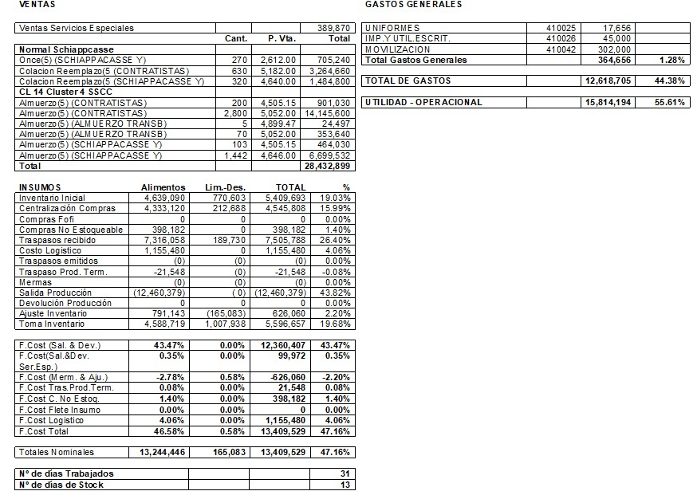
> Comentario - ZEBALLOS BELMAR Francisco (2026-03-27): 1. El ítem Venta Directa debe indicarse como una línea explicita y Costo Directo es una linea más del “Costo de insumo” 2. El ítem Venta Cafetería y Costo Cafetería debe indicarse como una línea explicita donde corresponde. 3. “Compras FOFI” debe decir “Compras Rendidas”
> Comentario - ZEBALLOS BELMAR Francisco (2026-03-27): N° Dias de Stock, se calcula en base 90 dias.La formula nueva preguntar con Contabilidad par definir si mantenemos la regla o actualizamos.
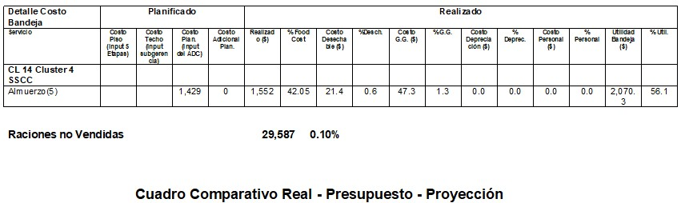
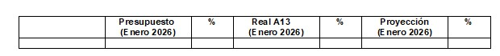
<u>**Descripcion:**</u>
El resultado es un único informe en formato RTF (archivo de texto enriquecido) que se abre con vista previa en pantalla. El archivo se guarda automáticamente en la carpeta de trabajo con el nombre A13<contrato><yyyymm>.rtf. El documento tiene orientación **vertical (portrait)** y utiliza fuente Arial tamaño 7.5 puntos para maximizar la cantidad de información visible en cada página.
> Comentario - ZEBALLOS BELMAR Francisco (2026-03-27): Eliminar nombre A13, es Resultado Operacional Mensual
El informe se divide en las siguientes secciones, presentadas de arriba hacia abajo:

**Encabezado del informe**
Incluye el título "Resultados Operacionales Mensual o A13", el nombre y código del contrato, y el rango de fechas del período consultado. Si se encontró un período de cierre, también indica el mes en texto (ej: "Mes: Enero 2025").

**Sección VENTAS**
Lista todas las fuentes de ingreso del período:

| **Línea** | **Descripción** |
| --- | --- |
| Ventas Servicios Especiales | Total facturado por servicios especiales (eventos, externos). Solo aparece si el monto es mayor que cero. |
| Ventas al contado | Total de guías de despacho (tipo GD) y facturas/boletas del período. |
| Ventas por servicio (contado) | Monto por cada servicio de venta al contado registrado en b_ventacontado. |
| Ventas cafetería | Total de ventas de cafetería cerradas en el período. |
| Raciones por régimen y servicio | Detalle de raciones vendidas: se agrupa por régimen (ej: "Casino", "Dieta") y dentro de cada uno, por servicio (ej: "Almuerzo"). Si "Incluye Venta Resumida x Servicio" está desmarcada, muestra el cliente, la cantidad de raciones y el precio de venta; si está marcada, solo muestra el nombre del servicio y la cantidad total. |
| **Total** | Suma de todas las ventas. Es la base sobre la que se calculan todos los porcentajes del informe. |

<u>**Regla de Negocio:**</u>

| **Campo / Columna** | **Descripción** | **Calculado** |
| --- | --- | --- |
| Inventario Inicial | Costo del stock físico registrado en la toma de inventario más reciente anterior al período, separado por alimentos y desechables. | No (tomado de b_tomainv) |
| Centralización Compras | Costo de productos comprados de forma centralizada (tipo "C" o "P" en b_totcompras.toc_tipinf) con existencia en bodega (pro_ctrsto=1). | No |
| Compras Fofi | Costo de productos comprados con financiamiento FOFI (tipo "F" en toc_tipinf). | No |
| Compras No Estoqueable | Costo de insumos adquiridos directamente para uso sin pasar por stock (tipo "C/P/F" con pro_ctrsto<>1 y documentos distintos de FA/GD/ND/NC). | No |
| Traspasos recibidos | Costo de productos recibidos desde otra bodega (tipo de documento TR, servicio destino = 1). | No |
| Costo Logístico | Costo de flete/logística asociado a los traspasos de entrada (campo tov_costologistico). | No |
| Traspasos emitidos | Costo de productos enviados a otro centro de costo. Se muestra entre paréntesis (resta). | No |
| Traspaso Prod. Term. | Traspasos de productos terminados (mueve_inventario = 'N'). Puede ser positivo o negativo según dirección. | No |
| Mermas | Costo de mermas registradas (documentos tipo ME). Entre paréntesis, porque son egresos. | No |
| Las Salida Producción | Costo de salidas de producción (SP) más costo de salidas de servicios especiales (SE). Entre paréntesis. | No |
| Devolución Producción | Costo de devoluciones de producción (DP) más devoluciones de servicios especiales (DE). Reduce el egreso. | No |
| Ajuste Inventario | Ajustes positivos o negativos al inventario (documentos tipo AI) ocurridos entre tomas de inventario. | No |
| Toma Inventario | Costo del stock físico final registrado en la toma de inventario del último día del período (si existe). | No |
| % (columna) | Porcentaje de cada línea respecto al total de ventas (tgrval). | Sí |

**Cálculo — % sobre ventas**
Cada valor en la columna % representa la participación de ese componente sobre el total de ventas del período.
**Fórmula o lógica:** % = (valor_linea / total_ventas) × 100

| **Componente** | **Qué representa** | **De dónde viene** |
| --- | --- | --- |
| valor_linea | Monto de alimentos + desechables de esa fila | Calculado según sección |
| total_ventas | Suma de todas las ventas del período (ventas especiales + contado + facturas + cafetería + raciones) | Variable tgrval |

Ejemplo: Si las mermas totales son $1.500.000 y las ventas totales son $25.000.000, el porcentaje de mermas es 6,00%.

**Subsección Factores de Costo (F.Cost)**
Aparece inmediatamente debajo de la tabla de insumos. Muestra ratios individuales expresados en porcentaje sobre ventas para los componentes más relevantes:

| **Ratio** | **Qué mide** |
| --- | --- |
| F.Cost (Sal. & Dev.) | Porcentaje neto de salidas de producción sobre ventas, después de restar devoluciones. |
| F.Cost (Sal.&Dev. Ser.Esp.) | Igual que el anterior pero solo para servicios especiales. |
| F.Cost (Merm. & Aju.) | Porcentaje de mermas y ajustes de inventario sobre ventas. |
| F.Cost Tras.Prod.Term. | Porcentaje de traspasos de productos terminados sobre ventas. |
| F.Cost C. No Estoq. | Porcentaje de compras no estoqueable sobre ventas. |
| F.Cost Flete Insumo | Porcentaje del costo de flete de insumos sobre ventas. |
| F.Cost Logístico | Porcentaje del costo logístico de traspasos sobre ventas. |
| F.Cost Total | Food Cost total: suma de salidas netas + mermas + ajustes + no estoqueable + flete + logístico, expresado en monto y porcentaje. |
| Totales Nominales | Misma composición que F.Cost Total pero expresada en pesos nominales además del porcentaje. |

**Subsección Días Stock**

| **Dato** | **Descripción** |
| --- | --- |
| N° de días Trabajados | Cantidad de días del mes del período (calculado automáticamente). |
| N° de días de Stock | Indica cuántos días de operación cubre el inventario actual. **Fórmula:** (Toma Inventario) / ((Salidas + Mermas - Ajustes) / 90), donde el denominador considera los últimos tres meses de movimientos. |

**Sección GASTOS GENERALES**
> Comentario - Paz Jorge (2026-03-27): Agregar tabla gasto generales x sitio
Solo aparece si existen gastos generales en el período. Muestra las cuentas contables distintas de alimentos y desechables que tuvieron compras, traspasos o gastos manuales ingresados en b_gastosa13 (códigos > 8). Columnas: Nombre de cuenta | Código cuenta | Monto | % sobre ventas.

**Sección DEPRECIACIÓN**
Muestra el valor de depreciación ingresado manualmente para el período en b_gastosa13 (código de gasto = 1). Incluye monto y porcentaje sobre ventas.

**Sección COSTO PERSONAL**
Muestra los ítems de personal ingresados en b_gastosa13 con códigos del 2 al 5 (ej: remuneraciones, cargas, otros costos de personal). Incluye subtotal de costo personal y su porcentaje sobre ventas. Adicionalmente muestra los códigos 6 a 8 (otros ítems de personal) en una tabla separada.

**Sección TOTAL DE GASTOS**
Suma todos los egresos: mermas + gastos generales + salidas de producción + salidas servicios especiales - ajustes positivos + costo personal + depreciación + compras no estoqueable - devoluciones.
**Cálculo — Total de Gastos**
> Comentario - Paz Jorge (2026-03-27): Incluir todos los gatos lo incluidos que estan separados
**Fórmula:** Total Gastos = (cmeali + cmedes + ctogas + tosali + TotSalidaAlimentoVtaEspecial + tosdes + TotSalidaDesechableVtaEspecial + (ajuali × −1) + (ajudes × −1) + tocope + totdep + cosans + cosdns) − (todali + TotDevolucionAlimentoVtaEspecial + toddes + TotDevoluciondesechableVtaEspecial + (crenal × −1) + (cennde × −1))

| **Componente** | **Qué representa** |
| --- | --- |
| cmeali / cmedes | Mermas de alimentos / desechables |
| ctogas | Total gastos generales |
| tosali / tosdes | Salidas de producción alimentos / desechables |
| TotSalida/DevVtaEspecial | Salidas y devoluciones de servicios especiales |
| ajuali × −1 / ajudes × −1 | Ajustes de inventario (invertidos, pues restan costo) |
| tocope | Total costo personal |
| totdep | Depreciación |
| cosans / cosdns | Compras no estoqueable alimentos / desechables |
| todali / toddes | Devoluciones de producción alimentos / desechables |
| crenal × −1 / cennde × −1 | Traspasos de productos terminados invertidos |

**Sección UTILIDAD OPERACIONAL**

| **Dato** | **Descripción** |
| --- | --- |
| UTILIDAD - OPERACIONAL | Resultado neto del período. **Fórmula:** Utilidad = Total Ventas − Total Gastos. Se muestra el monto y el porcentaje sobre ventas. |

**Sección de Presupuesto / Proyección (opcional)**
> Comentario - ZEBALLOS BELMAR Francisco (2026-03-27): La “Proyección” es la suma lo “Realizado a la fecha” más “Teórico” pendiente por realizar (hasta el fin de mes)
Aparece solo si se marcó "Incluye Presupuesto" y/o "Incluye Proyección" y existe un período de cierre vigente. Muestra una tabla comparativa entre el valor real de cada línea del estado de resultado, el valor presupuestado y/o proyectado, y el porcentaje de cumplimiento (valor_real / valor_presupuesto × 100). Los datos provienen de b_presupuestoproyeccion (tipo '1' = presupuesto, tipo '2' = proyección). El sistema también exporta esta comparativa a un archivo de texto en la subcarpeta Presupuesto-Proyeccion de la carpeta de trabajo.

**Sección Costo Bandeja (opcional)**
Aparece solo si se marcó "Incluye Costo Bandeja". Detalla el costo planificado versus el costo realizado por bandeja de producción, usando los datos de minuta y precio promedio ponderado de los insumos utilizados.

## 9.6. Informe de Compras por Período

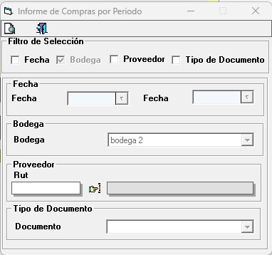
<u>**Descripción:**</u>
Esta pantalla genera un informe resumido de los documentos de compra registrados en el sistema durante un período determinado. El resultado es un documento con vista previa que lista cada documento agrupado por proveedor, mostrando los montos parciales (exento, neto, flete, IVA, otros impuestos) y el total de cada documento, junto con subtotales por proveedor y un total general al final.
La pantalla se organiza en dos áreas principales: un panel de filtros de selección en la parte superior, donde el usuario activa los criterios que desea aplicar marcando las casillas disponibles (fecha, bodega, proveedor y tipo de documento), y un área de paneles subordinados que se habilitan o deshabilitan según las casillas marcadas. Solo los criterios marcados participan en la consulta; si ninguno está activo, el sistema no genera el informe.
El informe no está acotado a un casino específico: consulta los documentos de compra almacenados en la base de datos del casino activo en sesión, filtrando únicamente los tipos de documento configurados como visibles. Los valores negativos, propios de notas de crédito manual y notas de crédito electrónicas, se muestran entre paréntesis tanto en las columnas de montos como en los subtotales.
Al abrir la pantalla, todos los filtros aparecen desactivados. El usuario debe marcar al menos uno antes de poder generar el informe. La lista desplegable de bodegas se carga automáticamente al abrir la pantalla con las bodegas asociadas al contrato activo en sesión.

| **Campo** | **Descripción** | **Obligatorio** |
| --- | --- | --- |
| Casilla **Fecha** | Activa el filtro por rango de fechas de remisión del documento. Al marcarla, habilita los campos "Fecha Desde" y "Fecha Hasta", que se precargan con la fecha del día. | Al menos uno de los cuatro filtros debe estar marcado |
| **Fecha Desde** | Fecha de inicio del rango de búsqueda (formato dd/mm/yyyy). Solo disponible si la casilla Fecha está marcada. | Sí, si la casilla Fecha está marcada |
| **Fecha Hasta** | Fecha de término del rango de búsqueda (formato dd/mm/yyyy). Solo disponible si la casilla Fecha está marcada. | Sí, si la casilla Fecha está marcada |
| Casilla **Bodega** | Activa el filtro por bodega. La lista desplegable correspondiente ya está cargada; al marcar esta casilla el sistema la habilita para selección. Nota: la casilla Bodega aparece siempre marcada y no editable al abrir la pantalla — el sistema la fuerza activa por defecto. | Sí (forzado por defecto) |
| Lista desplegable **Bodega** | Selección de la bodega sobre la que se quiere consultar. Muestra las bodegas asociadas al contrato activo en sesión. | Sí, si la casilla Bodega está marcada |
| Casilla **Proveedor** | Activa el filtro por proveedor. Al marcarla, habilita el campo de RUT y el botón de búsqueda. | Al menos uno de los cuatro filtros debe estar marcado |
| Campo **Rut** del proveedor | RUT del proveedor a filtrar. Puede ingresarse directamente con dígito verificador o buscarse usando el ícono de lupa, que abre un selector de proveedores. Al perder el foco, el sistema valida el RUT y muestra el nombre del proveedor junto al campo. | Sí, si la casilla Proveedor está marcada |
| Casilla **Tipo de Documento** | Activa el filtro por tipo de documento de compra. Al marcarla, habilita la lista desplegable correspondiente. | Al menos uno de los cuatro filtros debe estar marcado |
| Lista desplegable **Documento** | Selección del tipo de documento (por ejemplo: Factura, Nota de Crédito, Nota de Débito, etc.). Solo muestra los tipos configurados como visibles en el catálogo. | Sí, si la casilla Tipo de Documento está marcada |

<u>**Reglas de Negocio:**</u>

| **#** | **Cuando**** aparece** | **Qué verifica el sistema** | **Qué ve o experimenta el usuario** |
| --- | --- | --- | --- |
| 1 | Al hacer clic en Vista Previa sin ninguna casilla marcada | Que al menos un criterio de filtro esté activo | Mensaje: Seleccione método de búsqueda... |
| 2 | Al hacer clic en Vista Previa con la casilla Fecha marcada | Que Fecha Desde sea una fecha válida | Mensaje: Rango de fechas no valido... |
| 3 | Al hacer clic en Vista Previa con la casilla Fecha marcada | Que Fecha Hasta sea una fecha válida | Mensaje: Rango de fechas no valido... |
| 4 | Al hacer clic en Vista Previa con la casilla Fecha marcada | Que Fecha Desde no sea posterior a Fecha Hasta | Mensaje: Rango de fechas no valido... |
| 5 | Al hacer clic en Vista Previa con la casilla Bodega marcada | Que haya una bodega seleccionada en la lista | Mensaje: Bodega no valida... |
| 6 | Al hacer clic en Vista Previa con la casilla Proveedor marcada | Que el campo RUT tenga contenido | Mensaje: Proveedor no valido... |
| 7 | Al hacer clic en Vista Previa con la casilla Tipo de Documento marcada | Que haya un tipo de documento seleccionado | Mensaje: Tipo de documento no valido... |
| 8 | Tras ejecutar la consulta | Que la combinación de filtros devuelva al menos un documento | Mensaje: No existen datos para la consulta... El sistema no genera el documento RTF. |
| 9 | Al ingresar un RUT en el campo de proveedor y abandonar el campo | Que el RUT exista en el catálogo de proveedores | Si no existe: borra el campo y devuelve el foco al mismo campo, sin mensaje adicional. |
| 10 | Al abrir el formulario | Que el usuario tenga permiso de impresión para esta pantalla | Si no tiene permiso: el botón Vista Previa aparece deshabilitado. |

<u>**Tablas Relacionadas:**</u>

| **Tabla** | **Para qué se usa en este reporte** | **Campos clave** |
| --- | --- | --- |
| b_totcompras | Fuente principal. Contiene un registro por cada documento de compra ingresado en el sistema (cabecera). | toc_rutpro, toc_tipdoc, toc_numdoc, toc_codbod, toc_fecrem, toc_exedoc, toc_netdoc, toc_fledoc, toc_ivadoc, toc_otrimp, toc_totdoc |
| b_proveedor | Catálogo de proveedores. Se cruza con b_totcompras para obtener el nombre del proveedor a partir de su RUT. | prv_codigo, prv_nombre |
| a_tipodocumento | Catálogo de tipos de documento. Se usa para filtrar solo los tipos visibles (excluye los marcados como "sin nota") y para poblar la lista desplegable de tipo de documento. | tdo_codigo, tdo_nombre, tdo_orden, tdo_IdCodigo, tdo_VisualizaDoc |
| a_bodega | Catálogo de bodegas. Se usa junto con b_clientes para cargar la lista desplegable de bodegas disponibles para el contrato activo. | bod_codigo, bod_nombre |
| b_clientes | Tabla de contratos (casinos). Se usa para filtrar las bodegas que pertenecen al contrato activo en sesión. | cli_codigo, cli_codbod |

<u>**Formato de Salida:**</u>
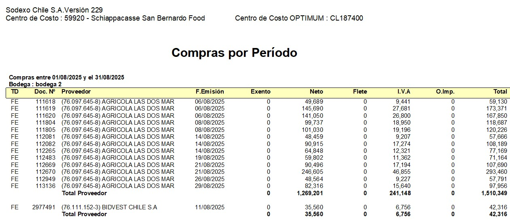
<u>**Descripción:**</u>
Este formulario genera un único tipo de informe: un documento con vista previa que muestra el resumen de compras agrupado por proveedor según los filtros aplicados. No existe selector de tipo de informe.
**Qué muestra:** el informe lista todos los documentos de compra que cumplan los criterios seleccionados, ordenados por proveedor, fecha de emisión, tipo de documento y número de documento. Por cada proveedor aparece un bloque de documentos seguido de una línea de subtotal ("Total Proveedor"). Al final del informe se incluye una línea de total general que consolida todos los proveedores.
Los montos correspondientes a notas de crédito (NC) y notas de crédito electrónica (CE) se muestran entre paréntesis en cada columna de monto y se restan en los subtotales, de modo que el "Total Proveedor" y el "Total General" reflejan el neto real de compras considerando las devoluciones.
**Estructura de datos del informe:**

| **Campo / Columna** | **Descripción** | **Calculado** |
| --- | --- | --- |
| TD | Código de tipo de documento (ej. FA, NC, ND) | No |
| Doc. Nº | Número del documento de compra | No |
| Proveedor | RUT formateado y nombre (primeros 20 caracteres) del proveedor | No |
| F.Emisión | Fecha de remisión del documento (formato dd/mm/yyyy) | No |
| Exento | Monto exento del documento. Para NC y CE se muestra entre paréntesis | No |
| Neto | Monto neto del documento. Para NC y CE se muestra entre paréntesis | No |
| Flete | Monto de flete del documento. Para NC y CE se muestra entre paréntesis | No |
| I.V.A | Monto de IVA del documento. Para NC y CE se muestra entre paréntesis | No |
| O.Imp. | Otros impuestos del documento | No |
| Total | Monto total del documento. Para NC y CE se muestra entre paréntesis | No |
| **Total Proveedor** (fila de subtotal) | Suma acumulada por proveedor de cada columna de monto, descontando NC y CE | Sí |
| **Total General** (fila final) | Suma de todos los "Total Proveedor" del informe | Sí |

**Cálculo — Total Proveedor**
Fila resumen que aparece al final del bloque de cada proveedor. El sistema acumula los montos de cada documento del proveedor, restando los que corresponden a notas de crédito (NC) o notas de crédito electrónica (CE), para reflejar el neto real de compras de ese proveedor en el período.
<u>**Regla de Negocio:**</u>
**Fórmula o lógica:**
Para cada columna de monto (Exento, Neto, Flete, IVA, Otros Imp., Total):
Acumulado = Suma de valores de documentos normales − Suma de valores de NC y CE
Los documentos NC y CE se identifican por el campo tipo de documento; sus montos se multiplican por −1 antes de sumarlos al acumulado.

| **Componente** | **Qué representa** | **De dónde viene** |
| --- | --- | --- |
| Valor del documento normal | Monto de cada columna para facturas, notas de débito y similares | b_totcompras.toc_exedoc, toc_netdoc, toc_fledoc, toc_ivadoc, toc_otrimp, toc_totdoc |
| Valor del documento NC / CE | Monto de la nota de crédito o crédito especial, que se descuenta | Mismos campos, identificados cuando toc_tipdoc = 'NC' o 'CE' |

Ejemplo: si un proveedor tiene una factura por $1.000.000 neto y una nota de crédito por $200.000 neto, la fila "Total Proveedor" en la columna Neto muestra $800.000.
**Cálculo — Total General**
Fila final del informe que suma los subtotales de todos los proveedores para cada columna de monto. Se calcula acumulando los "Total Proveedor" a medida que el sistema recorre el resultado de la consulta.

| **Componente** | **Qué representa** | **De dónde viene** |
| --- | --- | --- |
| Total Proveedor (cada uno) | Subtotal neto de compras por proveedor ya descontadas NC y CE | Calculado en el recorrido del resultado, tal como se describe arriba |

**Formato de salida:** Documento RTF con vista previa. Una sola sección (no hay hojas separadas por servicio). Orientación retrato. Encabezado con logotipo del casino y paginación. El título del informe es "Compras por Período". Debajo del título aparecen las líneas descriptivas de los filtros activos (período consultado, bodega seleccionada, tipo de documento seleccionado). Los datos comienzan con una fila de encabezado de columnas en fondo amarillo y negrita, seguida de los bloques de documentos por proveedor. Una copia del contenido también se graba en un archivo de texto plano separado por barras verticales, en la ruta de reportes configurada en la sesión.

## 9.7. Informe Planificación Teórica / Planificación Real

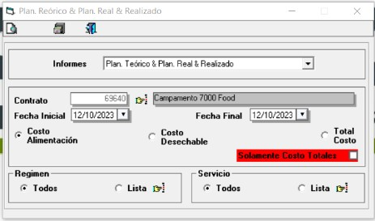
<u>**Descripción:**</u>
> Comentario - Paz Jorge (2026-03-27): Mejora Incluir una nueva columna producida real se va incluir en mantenedor del sitio.
Esta pantalla genera informes de comparación de costos de alimentación para un contrato (casino) en un rango de fechas dentro del mismo mes. Permite contrastar, día a día o de forma acumulada, cuánto costó lo que se planificó servir versus lo que efectivamente se sirvió o salió de bodega. Según el tipo de informe elegido, la comparación se establece entre la planificación teórica (minuta teórica aprobada), la planificación real (minuta ajustada con raciones reales confirmadas) y el costo realizado (valor de las salidas de bodega registradas).
La pantalla se abre en dos variantes según cómo se la invoca desde el menú: en la variante "CoTeRe" el usuario puede elegir entre seis tipos de informe que comparan planificación y realizado; en la variante alternativa la pantalla queda restringida al tipo único "Comparativo Plan. Teórico & Negociado", que contrasta el costo planificado con el precio negociado en lista de precios SAC para el período. En ambas variantes, la estructura visual es la misma: una barra de herramientas en la parte superior, un panel de configuración con los campos de cabecera (contrato, fechas, tipo de informe, dimensión de costo y opción de totales), y dos selectores ocultos de régimen y servicio que se cargan al abrir el formulario.
> Comentario - Paz Jorge (2026-03-27): No va este informe
El resultado se entrega siempre como un documento en ventana de vista previa del sistema —que puede exportarse a RTF— con las comparaciones detalladas día a día por cada combinación de régimen y servicio seleccionada, incluyendo costo por bandeja, número de raciones, costo total y desviación entre los escenarios comparados. La pantalla también dispone de un botón "Histórico Planificación Teórica" para consultar períodos anteriores y establecer el rango de fechas automáticamente.

| **Campo** | **Descripción** | **Obligatorio** |
| --- | --- | --- |
| **Contrato** | Código del contrato (casino) que se desea analizar. Al abrir el formulario se carga automáticamente el contrato asociado al usuario en sesión. Si el usuario tiene permiso de operar en múltiples casinos, puede cambiar el código manualmente o usar el buscador de contratos (icono de lupa junto al campo). | Sí |
| **Fecha Inicial** | Fecha de inicio del período a analizar, en formato dd/mm/yyyy. Se inicializa con la fecha del día. La fecha debe pertenecer al mismo mes y año que la Fecha Final. | Sí |
| **Fecha Final** | Fecha de término del período, en formato dd/mm/yyyy. Se inicializa con la fecha del día. | Sí |
| **Informes** (lista desplegable) | Selector del tipo de informe a generar. Define qué escenarios de costo se comparan y si el período se reporta día a día o en forma acumulada mensual. Ver sección 5 para el detalle de cada opción. | Sí |
| **Tipo de costo** (opciones) | Define si el informe considera **Costo Alimentación** (ingredientes de receta), **Costo Desechable** (materiales descartables), o **Total Costo** (ambos combinados). Por defecto se selecciona "Costo Alimentación". | Sí |
| **Solamente Costo Totales** (casilla) | Cuando se activa, el informe omite las columnas de número de raciones y costo por bandeja, mostrando únicamente los montos totales por día. Esta casilla se deshabilita automáticamente para el tipo (6) Comparativo con Negociado. | No |
| **Régimen** (selección interna) | Lista de regímenes disponibles para el contrato. Al abrir el formulario todos quedan seleccionados ("Todos"). El usuario puede cambiar a "Lista" para filtrar por los regímenes marcados en el selector auxiliar. | Sí |
| **Servicio** (selección interna) | Lista de servicios disponibles para el contrato. Igual comportamiento que Régimen. Al abrir, todos quedan seleccionados ("Todos"). | Sí |

**Nota:** Los selectores de régimen y servicio se cargan automáticamente al abrir el formulario con todos los regímenes y servicios activos en el sistema. Si se cambia el contrato, se recarga la lista. El usuario debe confirmar que al menos un régimen y un servicio queden incluidos antes de generar el informe.

<u>**Reglas de Negocio:**</u>
**4.1 Validaciones del sistema**

| **#** | **Cuando**** aparece** | **Qué verifica el sistema** | **Qué ve o experimenta el usuario** |
| --- | --- | --- | --- |
| 1 | Al presionar "Vista Previa" o al escribir en el campo de contrato | Que el código de contrato exista en la tabla de clientes del sistema | Mensaje: **"No existe contrato"**. El campo queda en blanco y el nombre del contrato desaparece. |
| 2 | Al presionar "Vista Previa" | Que la Fecha Inicial no sea posterior a la Fecha Final | Mensaje: **"Fecha origen Mayor destino"**. El informe no se genera. |
| 3 | Al presionar "Vista Previa" | Que ambas fechas pertenezcan al mismo mes calendario | Mensaje: **"Mes origen mayor destino"**. El informe no se genera. |
| 4 | Al presionar "Vista Previa" | Que ambas fechas pertenezcan al mismo año | Mensaje: **"Año origen mayor destino"**. El informe no se genera. |
| 5 | Al presionar "Vista Previa" | Que haya al menos un régimen seleccionado en el selector | Mensaje: **"Regimen debe ser informado"**. El informe no se genera. |
| 6 | Al presionar "Vista Previa" | Que haya al menos un servicio seleccionado en el selector | Mensaje: **"Servicio debe ser informado"**. El informe no se genera. |
| 7 | Al presionar "Vista Previa" con datos válidos | Que existan registros de planificación para el período, contrato, régimen y servicio indicados | Si no hay datos, el informe finaliza sin mostrar nada. No se emite mensaje de error al usuario. |
| 8 | Al usar "Régimen — Lista" o "Servicio — Lista" | Que el contrato esté cargado antes de abrir el selector auxiliar | Si el contrato está vacío, el buscador auxiliar no se abre. |

**4.2 Reglas de cálculo**
El rango de fechas está limitado a un único mes calendario. No es posible generar un informe que cruce dos meses distintos.
La categorización de productos como "alimentación" o "desechable" se determina por el parámetro de sistema ctainsumo (cuenta contable de insumos alimenticios) y ctalimdes (cuenta contable de desechables), configurados en la tabla de parámetros del sistema. El informe solo incluye productos que pertenecen a alguna de esas dos cuentas.
El costo del día para cada régimen/servicio se obtiene de dos fuentes complementarias: (a) el costo de las recetas de la planificación diaria (mid_cosrec × mid_numrac o mid_cosdes × mid_numrac desde b_minutadet) y (b) el costo de la estructura fija del servicio (tablas b_minutafijadia o b_minutafija), que se suma al costo de recetas cuando corresponde. Si existe una estructura fija registrada día a día, tiene precedencia sobre la estructura fija general.
> Comentario - Paz Jorge (2026-03-27): Mejora esto se va eliminar
El "costo realizado" corresponde al neto de salidas de bodega (tipo documento "SP") menos devoluciones (tipo documento "DP"), filtrando solo documentos no anulados y no pendientes para el casino en sesión.
El número de raciones "realizado" se toma de la fila especial "PRODUCIDAS" en la tabla de raciones (b_minutaraciones). Cuando la opción "Solamente Costo Totales" está activa, la columna de raciones realizado se omite en el informe.
Los valores de costo piso y costo techo se leen desde b_costopatron para cada combinación de régimen, servicio y año-mes, y se muestran en el encabezado de cada sección del informe como referencia.
Para el tipo (6) "Comparativo Plan. Teórico & Negociado", el costo negociado se calcula cruzando los ingredientes de las recetas planificadas con los precios de la lista de precios SAC (b_sac_listaprecio) vigente para el período (año-mes de la fecha inicial), considerando el formato de compra configurado para el contrato en b_contlistpreing.
> Comentario - Paz Jorge (2026-03-27): No aplica porque usa el precio SAC

<u>**Tablas Relacionadas:**</u>

| **Tabla** | **Para qué se usa en este reporte** | **Campos clave** |
| --- | --- | --- |
| b_minuta | Encabezado de la planificación de minutas (teórica y real) | min_cencos, min_codreg, min_codser, min_fecmin, min_racteo, min_racrea, min_indblo |
| b_minutadet | Detalle de recetas planificadas con costo y número de raciones | mid_codigo, mid_tipmin, mid_cosrec, mid_cosdes, mid_numrac, mid_codrec, mid_tiprec |
| b_minutafijadia | Estructura de costo fijo del servicio registrada por día (complementa el costo de recetas) | mfd_cencos, mfd_codreg, mfd_codser, mfd_fecha, mfd_tipmin, mfd_codpro, mfd_canpro, mfd_cospro |
| b_minutafija | Estructura de costo fijo del servicio general (usada si no hay registro por día) | mif_cencos, mif_codreg, mif_codser, mif_fecval, mif_dianro, mif_codpro, mif_canpro |
| b_totventas | Encabezado de documentos de salida y devolución de bodega (realizado) | tov_cencos, tov_fecpro, tov_codreg, tov_codser, tov_tipdoc, tov_estdoc, tov_codbod, tov_numdoc, tov_rutcli |
| b_detventas | Detalle de productos de cada documento de salida o devolución | dev_rutcli, dev_tipdoc, dev_numdoc, dev_codmer, dev_canmer, dev_ptotal |
| b_minutaraciones | Raciones producidas por día/régimen/servicio (fila "PRODUCIDAS") | mir_cencos, mir_fecmin, mir_codreg, mir_codser, mir_rutcli, mir_nrorac |
| b_costopatron | Costo piso y techo negociado por contrato, régimen, servicio y mes | cpa_cencos, cpa_codreg, cpa_codser, cpa_anomes, cpa_descripcion, cpa_valor |
| b_productospmpdia | Precio medio ponderado diario de productos (PMP) | ppd_cencos, ppd_codpro, ppd_fecdia, ppd_propon |
| b_productos | Maestro de productos: cuenta contable para clasificar entre alimentación y desechable | pro_codigo, pro_ctacon, pro_facing, pro_ctrsto |
| a_regimen | Maestro de regímenes: nombre del régimen para encabezados del informe | reg_codigo, reg_nombre |
| a_servicio | Maestro de servicios: nombre del servicio para encabezados del informe | ser_codigo, ser_nombre |
| b_clientes | Maestro de contratos: nombre del casino para encabezados del informe | cli_codigo, cli_nombre |
| b_recetadet | Detalle de ingredientes de cada receta (solo tipo 6) | red_codigo, red_tiprec, red_codpro, red_canpro, red_cencos |
| b_ingrediente | Maestro de ingredientes: relaciona ingrediente con producto (solo tipo 6) | ing_codigo |
| b_contlistpreing | Ingredientes habilitados por contrato para lista de precios negociada (solo tipo 6) | cpi_cencos, cpi_coding, cpi_codcom, cpi_precos |
| b_sac_listaprecio | Lista de precios negociados por período SAC (solo tipo 6) | lps_cencos, lps_codsac, lps_periodo, lps_precio |
| b_formatocompras / b_formatocomprassgp | Relación entre formato de compra SAC y producto SGP (solo tipo 6) | foc_codsac, fcs_codsac, fcs_codsgp |
| p_costrr | Tabla de trabajo temporal de sesión usada solo por la función de envío ("Enviar SGP Inf.") para acumular resultados antes de transmitir. No persiste entre sesiones. | trr_cencos, trr_usuario |
| a_param | Parámetros del sistema: cuentas contables ctainsumo y ctalimdes que clasifican alimentación vs. desechable | par_codigo, par_valor |

<u>Formato de Salida:</u>
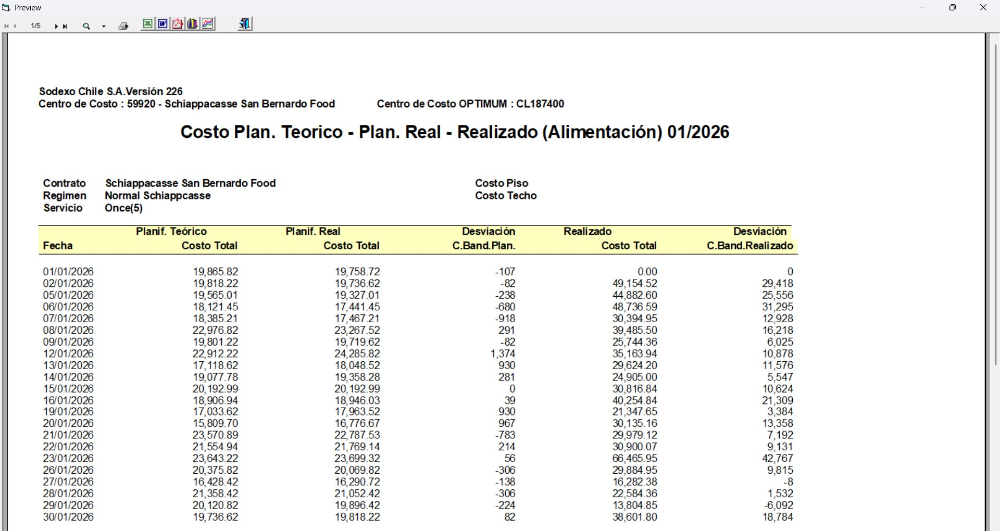

Descripción:
Presenta los tres escenarios en simultáneo: planificación teórica, planificación real y realizado (salidas de bodega). Permite ver en una sola vista si la planificación real se ajustó respecto a la teórica y cuánto difirió el realizado de ambas planificaciones. Consulta tanto la minuta teórica (tipmin='1') como la minuta real (tipmin='2').
**Orientación del documento:** Horizontal (landscape), porque requiere más columnas.
Regla de Negocio:
**Estructura de datos del informe:**

| **Campo en el informe** | **Qué representa** | **Calculado** |
| --- | --- | --- |
| Fecha | Día del período | No |
| Costo Bandeja — Plan. Teórico | Costo unitario teórico del día | Sí |
| Nro. Rac. — Plan. Teórico | Raciones planificadas teóricas | No |
| Costo Total — Plan. Teórico | Monto total teórico del día | No |
| Desviación Plan. Real vs Teórico | Diferencia de costo bandeja entre planificación real y teórica | Sí |
| Costo Bandeja — Plan. Real | Costo unitario de la planificación real | Sí |
| Nro. Rac. — Plan. Real | Raciones reales confirmadas | No |
| Costo Total — Plan. Real | Monto total planificación real | No |
| Costo Bandeja — Realizado | Costo unitario según salidas de bodega | Sí |
| Nro. Rac. — Realizado | Raciones producidas registradas | No |
| Costo Total — Realizado | Monto neto de salidas de bodega | No |
| Desviación Realizado vs Plan. Real | Diferencia de costo bandeja entre realizado y planificación real | Sí |

| Módulo | Relación |
| --- | --- |
| Planificación (Minuta Teórica) | Provee los registros de b_minuta y b_minutadet con mid_tipmin='1' que forman la base del costo teórico. El costo de receta (mid_cosrec, mid_cosdes) se congela. |
| Planificación (Minuta Real) | Provee los registros de b_minuta y b_minutadet con mid_tipmin='2', con las raciones reales confirmadas (min_racrea). |
| Raciones Producidas | Provee la fila "PRODUCIDAS" en b_minutaraciones, que representa las raciones efectivamente servidas y que se usa como denominador del costo bandeja realizado. |
| Salidas de Bodega / Inventario | Los documentos tipo "SP" (salida) y "DP" (devolución) de b_totventas / b_detventas conforman el costo realizado. Solo se consideran documentos no anulados y no pendientes. |
| Estructura Fija de Servicio | Las tablas b_minutafijadia y b_minutafija aportan costos adicionales fijos por servicio (por ejemplo, artículos de limpieza o consumibles de cocina no asociados a receta), que se suman al costo de recetas en la planificación teórica y real. |
| Precio Medio Ponderado (PMP) | b_productospmpdia provee el PMP por producto., utilizado en el cálculo de la estructura fija cuando no existe un costo fijo registrado día a día (b_minutafijadia). |
| Lista de Precios Negociada (SAC) | Para el tipo (6), b_sac_listaprecio, b_formatocompras, b_formatocomprassgp y b_contlistpreing proveen los precios negociados con proveedores, utilizados para calcular el costo negociado alternativo. |
| Costo Patrón | b_costopatron registra el costo piso y techo acordado para cada servicio-régimen-mes, que se muestra en el encabezado de cada sección del informe como referencia de rangos aceptables. |
| Contrato / Régimen / Servicio | b_clientes, a_regimen y a_servicio son mantenidos desde el módulo de Contrato/Régimen/Servicio. Este formulario solo los lee para mostrar nombres en el informe. |

### 9.7.1. Costo Detallado (I_CostoPlanDetallado)

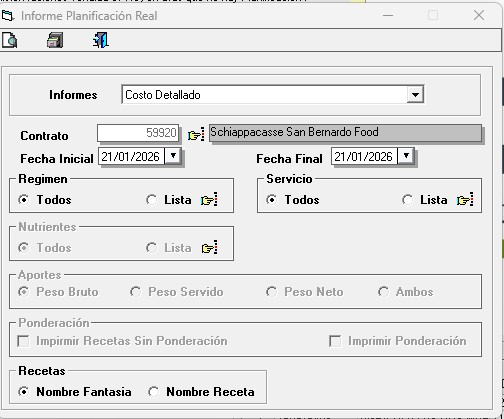
<u>**Descripción:**</u>
Esta pantalla permite consultar e imprimir informes sobre la planificación de minutas de un casino. Según el contexto desde el que se accede, opera como ****Informe de Planificación Teórica**** (la minuta que se programó antes de que se sirvan los platos) o como ****Informe de Planificación Real**** (la minuta con los datos definitivos registrados al cierre). Ambos modos comparten exactamente la misma estructura de pantalla y el mismo conjunto de tipos de informe; la diferencia está en el tipo de minuta que se consulta en la base de datos.
La pantalla se organiza en un panel de filtros que ocupa la parte central. En la parte superior el usuario elige el tipo de informe desde una lista desplegable. Debajo aparecen el campo de contrato con su descripción, el rango de fechas (inicial y final), y cuatro paneles de opciones agrupados: ****Servicio**** (todos o una lista específica), ****Régimen**** (todos o una lista específica), ****Nutrientes**** (todos o una lista; solo se activa para tipos de informe que incluyen aportes), ****Aportes**** (tipo de peso a reportar; también solo activo en los tipos de aporte nutricional) y ****Ponderación**** (dos opciones que controlan qué recetas incluir y si se muestran las raciones planificadas). Un panel adicional llamado ****Recetas**** permite elegir si los nombres de recetas se presentan como "Nombre Fantasía" o "Nombre Receta". En la barra superior hay tres botones: Vista Previa (genera el documento), Histórico de Planificación y Salir.
El formulario puede generar nueve tipos distintos de documento RTF, cada uno con estructura y datos diferentes. Todos se abren primero en una ventana de vista previa antes de que el usuario decida imprimir o guardar.

| **Campo** | **Descripción** | **Obligatorio** |
| --- | --- | --- |
| **Tipo de informe** | Lista desplegable con los nueve tipos disponibles. La selección determina qué paneles de opciones se habilitan automáticamente. | Sí |
| **Contrato** | Código del contrato (casino) sobre el cual se consulta la planificación. Puede escribirse directamente o buscarse haciendo clic en el ícono de búsqueda, que abre el selector de contratos. La descripción del contrato aparece al costado como referencia. | Sí |
| **Fecha Inicial** | Fecha de inicio del período a consultar, en formato dd/mm/aaaa. El campo incluye un calendario desplegable. | Sí |
| **Fecha Final** | Fecha de término del período a consultar, en formato dd/mm/aaaa. El campo incluye un calendario desplegable. | Sí |
| **Servicio** | Opción "Todos" (incluye todos los servicios del contrato) o "Lista" (permite seleccionar servicios específicos abriendo el selector de servicios). El selector solo está disponible si el contrato está ingresado. | Sí |
| **Régimen** | Opción "Todos" (incluye todos los regímenes del contrato) o "Lista" (permite seleccionar regímenes específicos abriendo el selector de regímenes). El selector solo está disponible si el contrato está ingresado. | Sí |
| **Nutrientes** | Solo activo para el tipo (2), (3) y (8). Permite incluir todos los nutrientes o seleccionar una lista específica. | Solo en tipos 2, 3 y 8 |
| **Aportes** | Solo activo para el tipo (2). Define qué tipo de peso se incluye en el cálculo: Peso Bruto, Peso Servido, Peso Neto o Ambos (bruto y servido). | Solo en tipo 2 |
| **Ponderación — Imprimir Recetas Sin Ponderación** | Casilla que, cuando está marcada, incluye en el informe las recetas que tienen cero raciones planificadas. Cuando no está marcada, el informe omite esas recetas. Solo activa para los tipos (0) y (1). | No |
| **Ponderación — Imprimir Ponderación** | Casilla que, cuando está marcada, muestra entre paréntesis la cantidad de raciones planificadas junto al nombre de la receta. Solo activa para los tipos (0) y (1). | No |
| **Recetas — Nombre Fantasía** | Muestra el nombre comercial de la receta (el que se presenta al comensal). Seleccionado por defecto. | No (uno de los dos es obligatorio) |
| **Recetas — Nombre Receta** | Muestra el nombre técnico de la receta registrado en el sistema. | No (uno de los dos es obligatorio) |

Al abrir el formulario, las fechas inicial y final se precargan con la fecha del día. La grilla interna de servicios y regímenes se carga automáticamente con todos los servicios y regímenes vigentes del sistema. La grilla de nutrientes también se carga al abrir y marca con check los nutrientes configurados como prioritarios.

<u>**Regla de Negocio:**</u>

| **Items** | **Cuando aparece** | **Qué verifica el sistema** | **Qué ve o experimenta el usuario** |
| --- | --- | --- | --- |
| 1 | Al hacer clic en Vista Previa | Que exista al menos un servicio cargado en la grilla interna | Mensaje: **"No existe Información"**. El proceso se detiene. |
| 2 | Al hacer clic en Vista Previa | Que el código de contrato ingresado exista en la base de datos | Mensaje: **"No existe contrato"**. El campo de contrato se borra y el proceso se detiene. |
| 3 | Al hacer clic en Vista Previa | Que la Fecha Inicial no sea posterior a la Fecha Final | Mensaje: **"Fecha origen Mayor destino"**. El proceso se detiene. |
| 4 | Al hacer clic en Vista Previa | Que ambas fechas pertenezcan al mismo mes | Mensaje: **"Mes origen mayor destino"**. El proceso se detiene. El período consultado no puede cruzar meses. |
| 5 | Al hacer clic en Vista Previa | Que ambas fechas pertenezcan al mismo año | Mensaje: **"Año origen mayor destino"**. El proceso se detiene. |
| 6 | Al hacer clic en Vista Previa | Que haya al menos un régimen marcado en la selección | Mensaje: **"Regimen debe ser informado"**. El proceso se detiene. |
| 7 | Al hacer clic en Vista Previa | Que haya al menos un servicio marcado en la selección | Mensaje: **"Servicio debe ser informado"**. El proceso se detiene. |
| 8 | Al abrir el formulario | Que exista al menos un nutriente en el maestro de nutrientes | Mensaje: **"No existe maestro nutrientes"**. El formulario se cierra automáticamente. |
| 9 | Al hacer clic en Vista Previa (tipos 4 y 5) | Que existan datos de costo en el período y combinación seleccionada | Mensaje: **"No existen datos para imprimir..."**. El proceso se detiene. |
| 10 | Al hacer clic en Vista Previa | Que el usuario tenga el permiso de Vista Previa asignado en el sistema | El botón Vista Previa aparece deshabilitado si el usuario no tiene el permiso correspondiente. |
| 11 | Al ingresar el contrato y salir del campo | Que el código de contrato exista | El campo de descripción queda en blanco si el contrato no existe. No se muestra mensaje; el error aparece solo al intentar generar el informe. |

<u>**Tablas Relacionadas:**</u>

| **Tabla** | **Para qué se usa en este reporte** | **Campos clave** |
| --- | --- | --- |
| b_minuta | Cabecera de cada minuta planificada: identifica el contrato, el régimen, el servicio, la fecha y el estado del día | min_codigo, min_cencos, min_codreg, min_codser, min_fecmin, min_indblo, min_tipmin |
| b_minutadet | Líneas de detalle de la minuta: cada receta planificada para un día, con su costo congelado, número de raciones y tipo de minuta | mid_codigo, mid_numlin, mid_codrec, mid_tiprec, mid_tipmin, mid_numrac, mid_cosrec, mid_cosdes, mid_estser, mid_descri |
| b_receta | Maestro de recetas: nombre técnico, nombre fantasía, base de raciones, código de grupo vulnerable | rec_codigo, rec_nombre, rec_nomfan, rec_basrac, rec_gruvul |
| b_recetadet | Ingredientes de cada receta con cantidades y porcentajes de aprovechamiento, cocción y nutriente | red_codigo, red_tiprec, red_cencos, red_codpro, red_canpro, red_pctapr, red_pctcoc, red_pctnut, red_nroite |
| a_servicio | Catálogo de servicios de alimentación del casino | ser_codigo, ser_nombre |
| a_estservicio | Estructuras de servicio (Entrada, Fondo, Postre, etc.) por casino | ess_codigo, ess_nombre, ess_cencos |
| a_regimen | Catálogo de regímenes de alimentación | reg_codigo, reg_nombre |
| b_clientes | Catálogo de contratos (casinos) | cli_codigo, cli_nombre |
| a_nutriente | Maestro de nutrientes disponibles para cálculo de aportes | nut_codigo, nut_nombre, nut_secnro, nut_indpri |
| b_productonut | Valores nutricionales de cada ingrediente/producto por nutriente | pnu_codpro, pnu_codapo, pnu_canapo |
| b_ingrediente | Maestro de ingredientes con factor de conversión nutricional | ing_codigo, ing_nombre, ing_facnut |
| b_productos | Maestro de productos del casino, usado en el informe de ingredientes con valor cero | pro_codigo, pro_nombre |
| b_productosing | Relación entre productos y sus ingredientes | pri_codpro, pri_coding |
| b_contlistpreing | Lista de precios de ingredientes por contrato; identifica los ingredientes con precio cero | cpi_coding, cpi_cencos, cpi_precos |
| a_param | Parámetros del sistema por casino; contiene la opción opgruvul que activa la impresión de información de grupo vulnerable | par_codigo, par_cencos, par_valor |

<u>**Formato Salida:**</u>
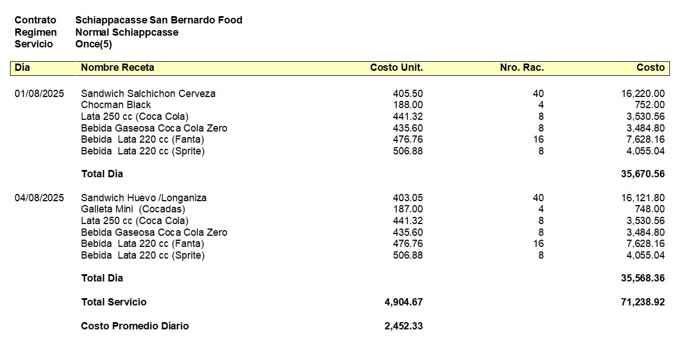
<u>**Descripción:**</u>
Para cada régimen y servicio, muestra el costo individual de cada receta planificada por día, junto al número de raciones y el costo total del día. Al final incluye el costo total del servicio y el costo promedio diario del mes. Es el informe de análisis de costos más granular disponible.
**Cómo se seleccionan los servicios:** Utiliza los servicios marcados en el panel Servicio del formulario principal.
**Opciones de configuración disponibles:**
**Nombre de receta:** Fantasía o Nombre técnico.
**Funcionalidades:**

| **Campo / Columna** | **Descripción** | **Calculado** |
| --- | --- | --- |
| Día | Fecha de cada día en formato dd/mm/aaaa | No |
| Nombre Receta | Nombre de la preparación planificada | No |
| Costo Unit. | Costo unitario de la receta por ración | Sí |
| Nro. Rac. | Número de raciones planificadas | No |
| Costo | Costo total de esa receta ese día (costo unitario × raciones) | Sí |
| Total Día (fila resumen) | Suma de costos de todas las recetas del día | Sí |
| Total Servicio (fila resumen) | Suma de costos unitarios de todas las recetas del período | Sí |
| Costo Promedio Diario (fila resumen) | Costo total del servicio dividido entre el número de días con datos | Sí |

<u>**Regla Negocio:**</u>
El costo unitario por ración incluye el costo de receta más el costo de descripción, ambos congelados al momento de grabar la planificación (regla de negocio 15 del sistema).
Fórmula: Costo Unit. = b_minutadet.mid_cosrec + b_minutadet.mid_cosdes

| **Componente** | **Qué representa** | **De dónde viene** |
| --- | --- | --- |
| mid_cosrec | Costo de la receta congelado al grabar la minuta | b_minutadet.mid_cosrec |
| mid_cosdes | Costo de desechable adicional congelado al grabar | b_minutadet.mid_cosdes |

Cálculo — Costo total de la receta en el día
Costo = (mid_cosrec + mid_cosdes) × mid_numrac

| **Componente** | **Qué representa** | **De dónde viene** |
| --- | --- | --- |
| mid_numrac | Número de raciones planificadas | b_minutadet.mid_numrac |

**Cálculo — Costo Promedio Diario**
Costo Promedio Diario = Total Servicio ÷ número de días con raciones con datos en el período
Ejemplo: si el Total Servicio es $150.000 y el período tiene 20 días con datos, el Costo Promedio Diario es $7.500.
Formato de salida: Documento RTF. Orientación retrato. Una página por combinación de régimen y servicio. Encabezado con contrato, régimen y servicio. Tabla con cinco columnas (día, receta, costo unitario, raciones, costo). Filas de resumen al final: "Total Día", "Total Servicio" y "Costo Promedio Diario". Salto de página entre servicios.

### 9.7.2. Costo Resumido (I_CostoPlanResumido)

<u>**Formato Salida:**</u>

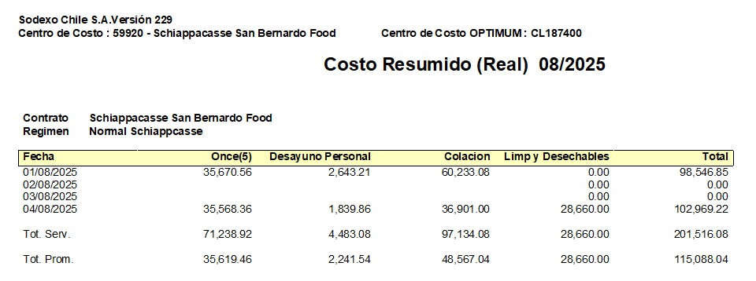
<u>**Descripción:**</u>
Para cada régimen, presenta una grilla con los días del mes en las filas y los servicios en las columnas, mostrando el costo total planificado de cada día por servicio. Incluye filas de totales y promedios. Es el informe que permite comparar costos entre servicios en un mismo período.
**Cómo se seleccionan los servicios:** Utiliza los servicios marcados en el panel Servicio del formulario principal.
**Opciones de configuración disponibles:**
**Nombre de receta:** No aplica (el informe trabaja con datos agregados, sin mostrar nombres de recetas).

| **Campo / Columna** | **Descripción** | **Calculado** |
| --- | --- | --- |
| Fecha (columna) | Fecha de cada día del período | No |
| Columna por cada servicio seleccionado | Costo total de todas las recetas del día para ese servicio | Sí |
| Total (columna) | Suma de todos los servicios para ese día | Sí |
| Tot. Serv. (fila) | Total acumulado del servicio en todo el período | Sí |
| Tot. Prom. (fila) | Promedio diario del costo de cada servicio | Sí |

<u>**Regla de Negocio:**</u>
<u>Cálculo — Costo total por día y servicio</u>
<u>Costo = SUM((mid_cosdes + mid_cosrec) × mid_numrac) agrupado por régimen, servicio y fecha</u>

| **Componente** | **Qué representa** | **De dónde viene** |
| --- | --- | --- |
| mid_cosrec + mid_cosdes | Costo congelado de la receta al grabar la minuta | b_minutadet |
| mid_numrac | Raciones planificadas | b_minutadet.mid_numrac |

Formato de salida: Documento RTF. Orientación paisaje. Una página por régimen. Encabezado con contrato y régimen. Tabla con filas por día, columnas por servicio más columna de total. Filas de totales y promedios al final. Salto de página entre regímenes.

### 9.7.3. Ingredientes Valor Cero en Planificación (I_IngValCeroPlan)

<u>**Formato Salida:**</u>

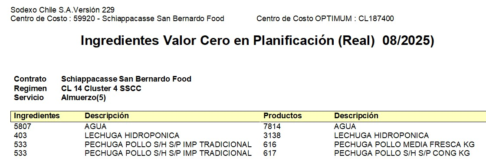
<u>**Descripción:**</u>
Lista los ingredientes que tienen precio cero en el maestro de ingredientes del contrato, pero que forman parte de recetas planificadas en el período consultado. Permite identificar ingredientes sin costear que pueden distorsionar los cálculos de costo de la planificación.
**Cómo se seleccionan los servicios:** Utiliza los servicios marcados en el panel Servicio del formulario principal.
**Opciones de configuración disponibles:**
**Nombre de receta:** Fantasía o Nombre técnico (afecta solo la identificación de las recetas en los filtros internos, no en las columnas del informe).
<u>**Funcionalidades:**</u>
**Estructura de datos del informe:**

| **Campo / Columna** | **Descripción** | **Calculado** |
| --- | --- | --- |
| Ingredientes (código) | Código del ingrediente con precio cero | No |
| Descripción (ingrediente) | Nombre del ingrediente con precio cero | No |
| Productos (código) | Código del producto asociado al ingrediente | No |
| Descripción (producto) | Nombre del producto asociado | No |

<u>**Regla de Negocio:**</u>
**Formato de salida:** Documento RTF. Orientación retrato. Una página por combinación de régimen y servicio. Encabezado con contrato, régimen y servicio. Tabla de cuatro columnas en formato par: código de ingrediente, descripción de ingrediente, código de producto, descripción de producto. Salto de página al cambiar de servicio.

## 9.8. Informe de Stock

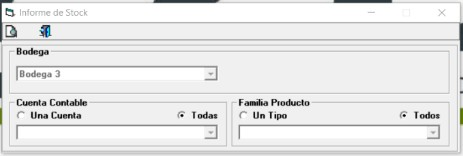

<u>**Descripción:**</u>
Esta pantalla genera el Informe de Stock, un documento que muestra el inventario actual de productos en una bodega seleccionada, valorizado al precio medio ponderado (PMP) más reciente disponible. Para cada producto en stock se entrega el código, descripción, unidad de medida, cantidad en existencia, precio unitario vigente y el valor total (cantidad × precio).
El informe organiza los productos en dos niveles jerárquicos: primero por cuenta contable y luego por familia de producto dentro de cada cuenta. Al final de cada familia se presenta un subtotal, y al final de cada cuenta contable se presenta el total acumulado de esa cuenta. Esto permite obtener una valorización del inventario alineada con la estructura contable del casino.
La pantalla está diseñada para un único tipo de informe sin selector de variantes. El usuario configura tres filtros —bodega, cuenta contable y familia de producto— y presiona el botón de vista previa. El sistema genera el documento de forma automática y lo presenta en pantalla para revisión antes de imprimir.

| **Campo** | **Descripción** | **Obligatorio** |
| --- | --- | --- |
| Bodega | Lista desplegable con las bodegas asociadas al contrato activo en sesión. El sistema la carga automáticamente al abrir el formulario y selecciona la primera opción disponible. | Sí |
| Cuenta Contable | Permite filtrar el informe por una cuenta contable específica. Se activa solo cuando se selecciona la opción "Una Cuenta"; las cuentas disponibles se cargan dinámicamente según la bodega elegida. Si se elige "Todas", se muestran todos los productos sin importar su cuenta. | No (por defecto: Todas) |
| Familia Producto | Permite filtrar por una familia (tipo) de producto específica. Se activa solo cuando se selecciona la opción "Un Tipo". Si se elige "Todos", se incluyen todas las familias. | No (por defecto: Todos) |

Nota: La lista de cuentas contables disponibles en el filtro de cuenta se actualiza automáticamente cada vez que el usuario cambia la bodega seleccionada. Refleja únicamente las cuentas que tienen productos con stock en esa bodega.
<u>**Reglas de Negocio:**</u>

| **Control / Acción** | **Descripción** |
| --- | --- |
| **Lista desplegable Bodega** | Cargada automáticamente al abrir el formulario con las bodegas del contrato activo en sesión. El usuario puede cambiar la selección; al hacerlo, el sistema actualiza de inmediato la lista de cuentas contables disponibles. |
| **Opción "Una Cuenta" / "Todas" (Cuenta Contable)** | Controla si el informe se filtra por una cuenta contable específica. Al elegir "Una Cuenta", se habilita la lista desplegable de cuentas; al elegir "Todas", dicha lista se desactiva y el informe incluye todos los productos. Por defecto el formulario activa "Todas". |
| **Lista desplegable Cuenta Contable** | Solo disponible cuando se ha seleccionado "Una Cuenta". Muestra las cuentas contables que tienen productos con stock en la bodega seleccionada. Se deshabilita y limpia si se elige "Todas". |
| **Opción "Un Tipo" / "Todos" (Familia Producto)** | Controla si el informe se filtra por una familia de producto específica. Al elegir "Un Tipo", se habilita la lista desplegable de familias; al elegir "Todos", se incluyen todas. Por defecto el formulario activa "Todos". |
| **Lista desplegable Familia Producto** | Solo disponible cuando se ha seleccionado "Un Tipo". Muestra todas las familias de producto registradas en el sistema. Se deshabilita y limpia si se elige "Todos". |
| **Botón Vista Previa** | Ejecuta la consulta según los filtros configurados y presenta el documento del informe en la ventana de Vista Previa del sistema. Desde esa ventana el usuario puede revisar el contenido e imprimir. |
| **Botón Salir** | Cierra y descarga el formulario. |

| **#** | **Cuando aparece** | **Qué verifica el sistema** | **Qué ve o experimenta el usuario** |
| --- | --- | --- | --- |
| 1 | Al hacer clic en Vista Previa, si ocurre algún error de acceso a la base de datos o un error interno durante la generación del informe | El sistema captura cualquier excepción durante la construcción del documento | Aparece un cuadro de mensaje con el número y descripción del error producido. El formulario regresa a su estado anterior. |
| 2 | En modo SQL Server (el modo habitual de producción) | El sistema aplica un filtro adicional sobre cuentas contables: solo incluye productos cuya cuenta pertenezca a los parámetros del sistema ctainsumo (cuenta de insumos) o ctalimdes (cuenta de alimentos/deslinde). | El usuario no ve este filtro; si un producto está asociado a otra cuenta contable fuera de esos dos grupos, no aparecerá en el informe aunque tenga stock. |
| 3 | En cualquier momento | El informe solo muestra productos con stock mayor a cero (después del redondeo configurado en el sistema). | Los productos agotados no aparecen en el listado, aunque existan en el catálogo. |

<u>**Tablas Relacionadas:**</u>

| **Tabla** | **Para qué se usa en este reporte** | **Campos clave** |
| --- | --- | --- |
| b_bodegas | Fuente principal del stock. Cada fila representa la cantidad en existencia de un producto en una bodega. Solo se incluyen filas con stock mayor a cero. | bod_codbod, bod_codpro, bod_canmer |
| b_productos | Catálogo de productos. Proporciona el nombre, la unidad de medida y la cuenta contable de cada producto. | pro_codigo, pro_nombre, pro_coduni, pro_ctacon, pro_codtip |
| b_productospmpdia | Historial de precios medios ponderados diarios por casino y producto. El sistema toma el valor más reciente disponible a la fecha del informe. | ppd_cencos, ppd_codpro, ppd_fecdia, ppd_propon |
| a_ctacontable | Catálogo de cuentas contables. Proporciona el nombre de la cuenta para los encabezados de agrupación. | cta_codigo, cta_nombre |
| a_tipopro | Catálogo de familias (tipos) de producto. Proporciona el nombre de la familia para los encabezados de agrupación. | tip_codigo, tip_nombre |
| a_unidad | Catálogo de unidades de medida. Proporciona la abreviatura de la unidad del producto. | uni_codigo, uni_nomcor |
| b_clientes | Catálogo de contratos/bodegas del sistema. Se usa para cargar la lista de bodegas disponibles asociadas al contrato activo en sesión. | cli_codigo, cli_codbod |
| a_bodega | Catálogo de bodegas físicas. Se usa para obtener el nombre de cada bodega en la lista desplegable. | bod_codigo, bod_nombre |
| a_param | Tabla de parámetros del sistema. En modo SQL Server, se consultan los parámetros ctainsumo y ctalimdes para delimitar qué cuentas contables incluye el informe. | par_codigo, par_valor |

<u>**Formato de Salida:**</u>

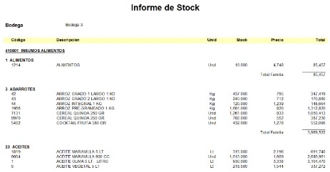
<u>**Descripción:**</u>
El formulario genera un único informe sin variantes. El resultado es un documento en la ventana de Vista Previa del sistema, en formato retrato, que muestra el inventario valorizado de la bodega seleccionada.
**Opciones de configuración disponibles:**
**Filtro de bodega:** el usuario puede seleccionar cualquier bodega asociada al contrato activo.
**Filtro de cuenta contable:** se puede restringir el informe a una única cuenta o mostrar todas.
**Filtro de familia de producto:** se puede restringir a una familia específica o mostrar todas.
**Estructura de datos del informe:**

| **Campo / Columna** | **Descripción** | **Calculado** |
| --- | --- | --- |
| Código de cuenta contable + nombre | Encabezado de agrupación de primer nivel. Identifica la cuenta contable a la que pertenecen los productos del bloque. | No |
| Código de familia + nombre | Encabezado de agrupación de segundo nivel dentro de cada cuenta. Identifica la familia (tipo) de producto. | No |
| Código | Código identificador del producto. | No |
| Descripción | Nombre del producto. | No |
| Unidad | Abreviatura de la unidad de medida del producto (por ejemplo: KG, LT, UN). | No |
| Stock | Cantidad actual del producto en la bodega, expresada en la unidad de medida del producto. | No |
| Precio | Precio medio ponderado (PMP) unitario vigente del producto para el casino activo en sesión. | Sí |
| Total | Valor total del stock del producto (Stock × Precio). | Sí |
| Total Familia | Subtotal del valor del stock por cada familia de producto dentro de su cuenta contable. | Sí |
| TOTAL CUENTA | Suma total del valor del stock de todas las familias dentro de la cuenta contable. | Sí |

<u>**Regla de Negocios:**</u>
**Cálculo — Precio (PMP vigente)**
El precio unitario que aparece en el informe no se lee de un precio fijo del catálogo de productos, sino que es el precio medio ponderado más reciente disponible para ese producto en el casino activo en sesión.
**Fórmula o lógica:**
En modo SQL Server (habitual en producción): se busca en el historial de precios medios ponderados diarios el registro más reciente, con fecha igual o anterior al día actual, para ese producto y ese casino. Se toma el valor de precio de ese registro.
En modo Access (legacy): se genera una tabla temporal con el último registro de precio por producto y se obtiene el valor desde esa tabla.

| **Componente** | **Qué representa** | **De dónde viene** |
| --- | --- | --- |
| Casino activo en sesión | Código del contrato del casino en el que se ejecuta el sistema | Variable de sesión del sistema |
| Fecha de consulta | Fecha del día en que se genera el informe | Fecha del sistema al momento de ejecutar |
| Precio medio ponderado del día | Precio unitario resultante del cálculo de PMP acumulado hasta esa fecha | b_productospmpdia.ppd_propon |

Ejemplo: si el producto "Aceite vegetal" tiene su último registro de PMP el 20 de marzo con un precio de $1.250 por litro, y el informe se genera el 25 de marzo, el precio que aparece en el informe será $1.250.

**Cálculo — Total (valor del stock del producto)**
El total por producto es el resultado de multiplicar la cantidad en existencia por el precio medio ponderado vigente.
**Fórmula o lógica:**
Total = Stock × Precio PMP vigente
Si el precio PMP no está disponible para el producto (valor nulo), el sistema lo trata como cero, de modo que el total resultante es cero para ese producto.

| **Componente** | **Qué representa** | **De dónde viene** |
| --- | --- | --- |
| Stock | Cantidad actual en bodega | b_bodegas.bod_canmer |
| Precio PMP vigente | Precio medio ponderado más reciente | b_productospmpdia.ppd_propon |

Ejemplo: si hay 50 LT de "Aceite vegetal" en stock con un PMP de $1.250, el total del producto es $62.500.

**Cálculo — Total Familia**
Suma acumulada del Total de cada producto dentro de una familia de producto, presentada al finalizar el bloque de esa familia.
**Fórmula o lógica:**
Total Familia = Σ (Stock × Precio PMP) de todos los productos de la familia en esa cuenta contable

**Cálculo — TOTAL CUENTA**
Suma acumulada de todos los subtotales por familia dentro de una misma cuenta contable.
**Fórmula o lógica:**
TOTAL CUENTA = Σ (Total Familia) de todas las familias de la cuenta contable

**Formato de salida:** Documento en la ventana de Vista Previa del sistema (formato RTF interno). Orientación retrato. El encabezado del documento incluye el nombre de la empresa y el texto "Informe de Stock", seguido del nombre de la bodega seleccionada. Los datos se presentan en tablas agrupadas, con la cuenta contable y la familia como encabezados de sección en negrita. Los totales por familia y por cuenta aparecen al pie de cada grupo. El usuario puede imprimir directamente desde la ventana de Vista Previa.

## 9.9. Informe Traspasos

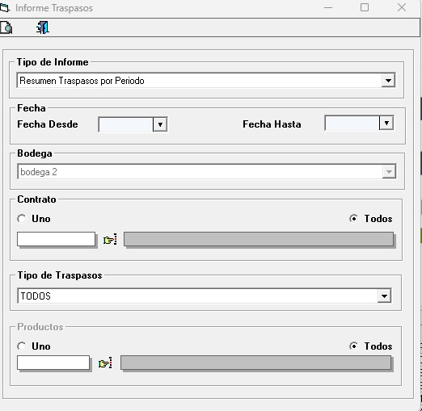

<u>**Descripción:**</u>
Esta pantalla permite consultar y obtener informes sobre los movimientos de traspaso de mercadería entre bodegas y contratos dentro del sistema. A través de ella se puede revisar, para un período de fechas definido, qué productos fueron traspasados, desde y hacia qué bodega y contrato, cuánto se recibió, cuánto se valoró y si existieron diferencias entre la cantidad indicada en la guía de traspaso y la cantidad efectivamente recibida.
La pantalla se organiza en un panel de filtros que el usuario completa antes de generar el informe. Los filtros incluyen: el tipo de informe deseado (selector en la parte superior), el rango de fechas (desde/hasta), la bodega de referencia, el contrato o casino (con opción de seleccionar uno específico o todos), el tipo de movimiento (entradas, salidas o ambos), y opcionalmente un producto específico. El panel de productos se habilita o deshabilita automáticamente según el tipo de informe elegido.
Los tres tipos de informe disponibles cubren niveles distintos de análisis: la primera entrega un resumen por documento de traspaso agrupado por contrato; el segundo desglosa cada traspaso hasta el nivel de producto con sus cantidades y precios; y el tercero se focaliza exclusivamente en los registros donde la cantidad indicada en la guía difiere de la cantidad efectivamente recibida, permitiendo detectar inconsistencias en la recepción de mercadería.

| **Campo** | **Descripción** | **Obligatorio** |
| --- | --- | --- |
| Tipo de Informe | Lista desplegable con las tres modalidades de informe disponibles. Determina qué información se muestra y habilita o deshabilita el filtro de productos. | Sí |
| Fecha Desde | Fecha de inicio del período a consultar. Formato dd/mm/yyyy. | Sí |
| Fecha Hasta | Fecha de término del período a consultar. Formato dd/mm/yyyy. Debe ser igual o posterior a la fecha de inicio. | Sí |
| Bodega | Lista desplegable con las bodegas asociadas al contrato en sesión. Se carga automáticamente al abrir el formulario. | Sí |
| Contrato — Uno / Todos | Permite filtrar por un contrato específico o incluir todos los contratos. Si se elige "Uno", se debe ingresar el código de contrato manualmente o buscarlo con el ícono de búsqueda. | Sí |
| Código de contrato | Campo de texto para ingresar el código del contrato cuando se selecciona la opción "Uno". El sistema muestra automáticamente el nombre del contrato al salir del campo. Incluye un buscador que abre un selector de contratos. | Solo si se elige "Uno" |
| Tipo de Traspasos | Lista desplegable con las opciones: TODOS, ENTRADAS o SALIDAS. Filtra el sentido del movimiento de traspaso. | Sí |
| Productos — Uno / Todos | Permite filtrar por un producto específico o incluir todos. Solo disponible en los tipos de informe (02) y (03). El panel completo se deshabilita para el tipo (01). | No (solo para tipos 02 y 03) |
| Código de producto | Campo de texto para ingresar el código del producto cuando se selecciona "Uno" en el filtro de productos. El sistema muestra automáticamente el nombre del producto. Incluye un buscador que abre un selector de productos. | Solo si se elige "Uno" en productos |

<u>**Reglas de Negocio:**</u>

| **#** | **Cuándo aparece** | **Qué verifica el sistema** | **Qué ve o experimenta el usuario** |
| --- | --- | --- | --- |
| 1 | Al presionar Vista Previa | Que la Fecha Desde sea una fecha válida | Mensaje: Rango de fechas no valido... y el proceso se detiene. |
| 2 | Al presionar Vista Previa | Que la Fecha Hasta sea una fecha válida | Mensaje: Rango de fechas no valido... y el proceso se detiene. |
| 3 | Al presionar Vista Previa | Que la Fecha Desde no sea posterior a la Fecha Hasta | Mensaje: Rango de fechas no valido... y el proceso se detiene. |
| 4 | Al presionar Vista Previa | Que el nombre del contrato esté cargado cuando se eligió filtrar por uno específico | Mensaje: Contrato no valido... y el proceso se detiene. |
| 5 | Al presionar Vista Previa | Que el nombre del producto esté cargado cuando se eligió filtrar por uno específico | Mensaje: Producto no valido... y el proceso se detiene. |
| 6 | Al presionar Vista Previa | Que haya una bodega seleccionada en la lista desplegable | Mensaje: Bodega no valida... y el proceso se detiene. |
| 7 | Al ejecutar la consulta (cualquier tipo) | Que existan registros de traspaso que cumplan los criterios ingresados | Mensaje: No existen datos para la consulta... y no se genera el documento. |
| 8 | Al abrir el formulario | Que el usuario tenga permiso para usar la opción Vista Previa | Si no tiene permiso, el botón Vista Previa aparece deshabilitado y no puede generarse ningún informe. |

<u>**Tablas Relacionadas:**</u>

| **Tabla** | **Para qué se usa en este reporte** | **Campos clave** |
| --- | --- | --- |
| b_totventas | Fuente principal: cabecera de cada documento de traspaso. Se filtra por tipo de documento 'TR', bodega, contrato, sentido del movimiento y rango de fechas. | tov_rutcli, tov_tipdoc, tov_numdoc, tov_numinf, tov_codbod, tov_codcas, tov_codser, tov_fecemi |
| b_detventas | Detalle de líneas por producto dentro de cada documento de traspaso. Contiene las cantidades y precios. | dev_rutcli, dev_tipdoc, dev_numdoc, dev_codmer, dev_canmin, dev_canmer, dev_precos |
| b_clientes | Catálogo de contratos/casinos. Se usa para obtener el nombre del contrato asociado al código de cliente del documento. | cli_codigo, cli_nombre, cli_codbod |
| b_productos | Catálogo de productos. Se usa en los tipos (02) y (03) para obtener el nombre del producto a partir de su código. | pro_codigo, pro_nombre, pro_coduni |
| a_unidad | Catálogo de unidades de medida. Se usa en los tipos (02) y (03) para mostrar el nombre de la unidad de cada producto. | uni_codigo, uni_nombre |
| a_bodega | Catálogo de bodegas. Se usa para cargar la lista desplegable de bodegas y para mostrar el nombre de la bodega en el encabezado del informe. | bod_codigo, bod_nombre |

### 9.9.1. Resumen Traspasos Por Periodo

<u>**Formato de Salida:**</u>
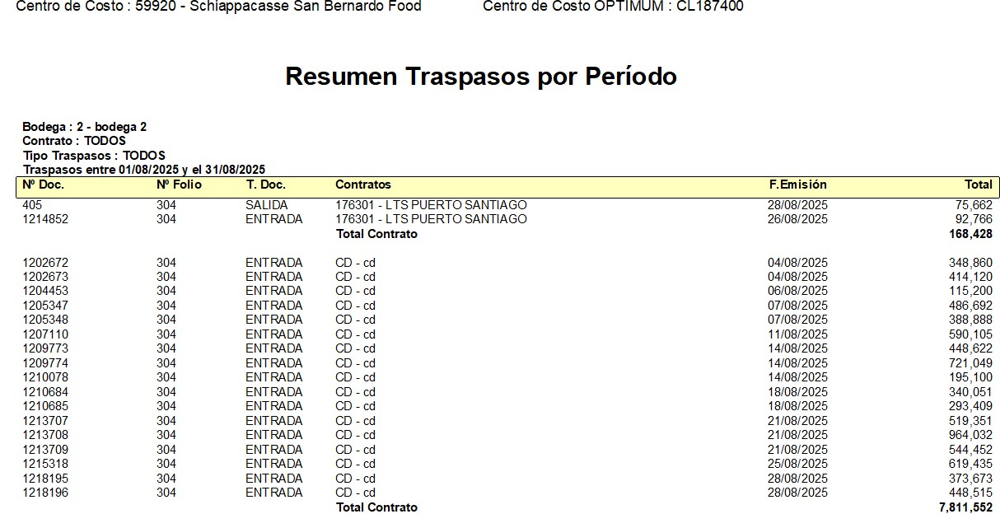
<u>**Descripción:**</u>
Un resumen de los documentos de traspaso emitidos en el período indicado, agrupados por contrato. Cada fila corresponde a un documento de traspaso e indica si fue una entrada o salida, junto con el monto total valorizado. Al final de cada contrato se muestra un subtotal y al final del informe un total general.
**Cómo se seleccionan los servicios:** No aplica selección de servicios. El filtro principal es la bodega y, opcionalmente, el contrato.
**Opciones de configuración disponibles:**
**Tipo de Traspasos:** controla si se incluyen TODOS los movimientos, solo ENTRADAS (código interno 1) o solo SALIDAS (código interno 0). Al elegir TODOS, se incluyen ambos tipos.
**Contrato:** permite acotar el informe a un contrato específico o incluir todos los contratos asociados a la bodega seleccionada.
**Estructura de datos del informe:**

| **Campo / Columna** | **Descripción** | **Calculado** |
| --- | --- | --- |
| N° Doc. | Número interno del documento de traspaso | No |
| N° Folio | Número de folio informativo del documento | No |
| T. Doc. | Tipo de movimiento: ENTRADA o SALIDA | Sí |
| Contratos | Código y nombre del contrato receptor o emisor | No |
| F.Emisión | Fecha en que se emitió el documento de traspaso | No |
| Total | Monto total valorizado del documento de traspaso | Sí |
| Total Contrato | Suma de los totales de todos los documentos del mismo contrato | Sí |
| Total General | Suma de todos los totales del informe | Sí |

<u>**Regla de Negocio:**</u>
Cálculo — T. Doc.
Indica si el movimiento corresponde a una entrada o una salida de mercadería en la bodega.
Fórmula o lógica: El campo tov_codser de la cabecera del documento determina el tipo: si es igual a 1, se muestra "ENTRADA"; en caso contrario, se muestra "SALIDA".

| Componente | Qué representa | De dónde viene |
| --- | --- | --- |
| tov_codser | Código de sentido del movimiento | b_totventas.tov_codser |

Ejemplo: un documento con tov_codser = 1 aparece como "ENTRADA"; uno con tov_codser = 0 aparece como "SALIDA".
Cálculo — Total
Representa el valor monetario total del documento de traspaso, calculado como la suma de (cantidad recibida × precio de costo) para todas las líneas del documento.
Fórmula o lógica: Total = SUM(dev_canmer × dev_precos) agrupado por documento (tov_numdoc)

| Componente | Qué representa | De dónde viene |
| --- | --- | --- |
| dev_canmer | Cantidad efectivamente recibida o despachada en la línea | b_detventas.dev_canmer |
| dev_precos | Precio de costo unitario del producto en el momento del traspaso | b_detventas.dev_precos |

Ejemplo: si una línea tiene 10 unidades recibidas a $500 cada una, aporta $5.000 al total del documento.
Cálculo — Total Contrato
Suma acumulada de los totales de todos los documentos de traspaso asociados al mismo contrato dentro del período consultado.
Fórmula o lógica: Total Contrato = Σ Total de cada documento con el mismo tov_codcas
Cálculo — Total General
Suma de todos los totales del informe, sin distinción de contrato.
Fórmula o lógica: Total General = Σ Total Contrato de todos los contratos incluidos en el informe.
Formato de salida: Documento RTF con vista previa en pantalla. Orientación retrato. Encabezado de página con nombre de la empresa y pie con número de página. El cuerpo del informe incluye un bloque de parámetros (bodega, contrato, tipo de traspaso y rango de fechas) seguido de la tabla de datos con encabezados en fondo amarillo. Los datos se agrupan por contrato con subtotales en negrita al final de cada grupo, y un total general en negrita al final del informe.

### 9.9.2. Detalle Traspasos por Periodo

<u>**Formato Salida:**</u>
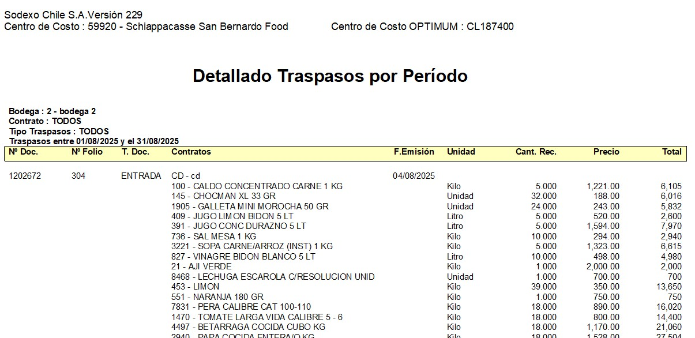
<u>**Descripción:**</u>
El detalle completo de los traspasos del período, desglosado hasta el nivel de producto dentro de cada documento. Cada documento ocupa un bloque de filas: primero aparece una fila de encabezado con los datos del documento (número, folio, tipo, contrato y fecha), y debajo, una fila por cada producto incluido en ese documento con su unidad de medida, cantidad, precio unitario y total de la línea.
**Cómo se seleccionan los servicios:** No aplica selección de servicios. Los filtros son bodega, contrato y opcionalmente un producto específico.
**Opciones de configuración disponibles:**
**Tipo de Traspasos:** controla si se incluyen TODOS los movimientos, solo ENTRADAS o solo SALIDAS.
**Contrato:** permite filtrar por un contrato específico o incluir todos.
**Productos:** permite filtrar por un producto específico o incluir todos los productos.
**Estructura de datos del informe:**

| **Campo / Columna** | **Descripción** | **Calculado** |
| --- | --- | --- |
| N° Doc. | Número interno del documento de traspaso | No |
| N° Folio | Número de folio del documento | No |
| T. Doc. | Tipo de movimiento: ENTRADA o SALIDA | Sí |
| Contratos | Código y nombre del contrato | No |
| F.Emisión | Fecha de emisión del documento | No |
| (Código y nombre del producto) | Código y descripción del producto en la línea de detalle | No |
| Unidad | Nombre de la unidad de medida del producto | No |
| Cant. Rec. | Cantidad recibida o despachada en la línea | No |
| Precio | Precio de costo unitario del producto | No |
| Total | Valor total de la línea (cantidad × precio) | Sí |
| Total Traspaso | Suma de los totales de todas las líneas del mismo documento | Sí |
| Total General | Suma de todos los totales de documentos del informe | Sí |

<u>**Regla de Negocio:**</u>
**Cálculo — T. Doc.**
Mismo criterio que en el tipo (01): si tov_codser = 1 se muestra "ENTRADA"; en caso contrario "SALIDA".
**Cálculo — Total (línea de producto)**
Valor monetario de la línea de detalle.
**Fórmula o lógica:** Total línea = dev_canmer × dev_precos

| **Componente** | **Qué representa** | **De dónde viene** |
| --- | --- | --- |
| dev_canmer | Cantidad recibida o despachada en la línea | b_detventas.dev_canmer |
| dev_precos | Precio de costo unitario | b_detventas.dev_precos |

Ejemplo: 5 kg de harina a $800/kg = $4.000 en la columna Total de esa línea.
**Cálculo — Total Traspaso**
Suma de los totales de todas las líneas de producto dentro del mismo documento de traspaso.
**Fórmula o lógica:** Total Traspaso = Σ (dev_canmer × dev_precos) para todas las líneas de este tov_numdoc
**Cálculo — Total General**
Suma acumulada de todos los totales de traspaso incluidos en el informe.
**Formato de salida:** Documento RTF con vista previa en pantalla. Orientación retrato. Encabezado de página con nombre de la empresa y pie con número de página. El cuerpo incluye un bloque de parámetros (bodega, contrato, tipo de traspaso y rango de fechas) seguido de la tabla de datos. Cada documento ocupa un bloque de dos o más filas: una fila de encabezado del documento y una o más filas de productos. Al final de cada documento se muestra el subtotal en negrita. Al final del informe aparece el Total General en negrita.

### 9.9.3. Diferencia Entre Contrato

<u>**Formato Salida:**</u>
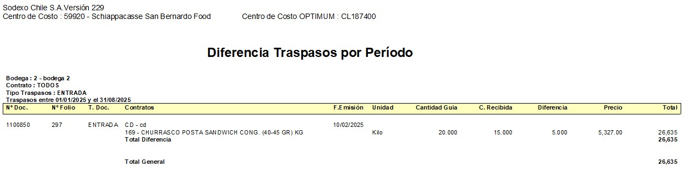
<u>**Descripción:**</u>
Un informe de control que lista exclusivamente las líneas de traspaso donde la cantidad indicada en la guía de origen difiere de la cantidad efectivamente recibida o registrada en el sistema. Permite detectar discrepancias en la recepción de mercadería. Solo se incluyen registros con diferencia distinta de cero.
**Restricciones propias del tipo:** Al seleccionar este tipo de informe, el selector de Tipo de Traspasos se fija automáticamente en ENTRADAS (código interno 1) y se deshabilita, por lo que no es posible consultar salidas en este tipo de informe.
**Cómo se seleccionan los servicios:** No aplica selección de servicios. Los filtros son bodega, contrato y opcionalmente un producto específico.
**Opciones de configuración disponibles:**
**Contrato:** permite filtrar por un contrato específico o incluir todos.
**Productos:** permite filtrar por un producto específico o incluir todos los productos.
**Estructura de datos del informe:**

| **Campo / Columna** | **Descripción** | **Calculado** |
| --- | --- | --- |
| N° Doc. | Número interno del documento de traspaso | No |
| N° Folio | Número de folio del documento | No |
| T. Doc. | Tipo de movimiento: ENTRADA o SALIDA | Sí |
| Contratos | Código y nombre del contrato | No |
| F.Emisión | Fecha de emisión del documento | No |
| (Código y nombre del producto) | Código y descripción del producto | No |
| Unidad | Unidad de medida del producto | No |
| Cantidad Guia | Cantidad indicada en el documento de origen del traspaso | No |
| C. Recibida | Cantidad efectivamente recibida y registrada en el sistema | No |
| Diferencia | Diferencia entre la cantidad de la guía y la recibida | Sí |
| Precio | Precio de costo unitario del producto | No |
| Total | Valor monetario de la diferencia (diferencia × precio) | Sí |
| Total Diferencia | Suma de los totales de diferencia por documento | Sí |
| Total General | Suma de todos los totales de diferencia del informe | Sí |

<u>**Regla de Negocio:**</u>
**Cálculo — T. Doc.**
Mismo criterio que los tipos anteriores: tov_codser = 1 se muestra "ENTRADA", de lo contrario "SALIDA".
**Cálculo — Diferencia**
Cuantifica la discrepancia entre lo documentado en origen y lo efectivamente recibido.
**Fórmula o lógica:** Diferencia = dev_canmin − dev_canmer

| **Componente** | **Qué representa** | **De dónde viene** |
| --- | --- | --- |
| dev_canmin | Cantidad indicada en la guía de traspaso de origen | b_detventas.dev_canmin |
| dev_canmer | Cantidad efectivamente recibida o registrada | b_detventas.dev_canmer |

Ejemplo: la guía indica 20 kg (dev_canmin = 20) pero se reciben 18 kg (dev_canmer = 18). La diferencia es 2 kg.
Nota: solo aparecen en este informe las líneas donde dev_canmin ≠ dev_canmer. Las líneas sin diferencia quedan excluidas de la consulta.
**Cálculo — Total (valor de la diferencia)**
Monetiza la diferencia detectada, permitiendo estimar el impacto económico de la discrepancia.
**Fórmula o lógica:** Total = (dev_canmin − dev_canmer) × dev_precos

| **Componente** | **Qué representa** | **De dónde viene** |
| --- | --- | --- |
| dev_canmin − dev_canmer | Diferencia de cantidad | b_detventas |
| dev_precos | Precio de costo unitario | b_detventas.dev_precos |

Ejemplo: 2 kg de diferencia a $1.500/kg = $3.000 en la columna Total.
**Cálculo — Total Diferencia**
Suma de los valores de diferencia de todas las líneas del mismo documento.
**Fórmula o lógica:** Total Diferencia = Σ ((dev_canmin − dev_canmer) × dev_precos) para todas las líneas del mismo tov_numdoc
**Cálculo — Total General**
Suma acumulada de todos los totales de diferencia incluidos en el informe.
**Formato de salida:** Documento RTF con vista previa en pantalla. Orientación paisaje (horizontal). Encabezado de página con nombre de la empresa y pie con número de página. El cuerpo incluye un bloque de parámetros (bodega, contrato, tipo de traspaso y rango de fechas) seguido de la tabla de datos con 11 columnas. Cada documento ocupa un bloque de filas: una fila de encabezado del documento y una o más filas de productos con diferencia. Al final de cada documento se muestra el subtotal de diferencia en negrita, y al final del informe el Total General en negrita.

## 9.10. Costos Totales del Período

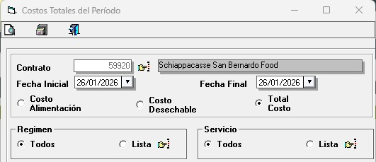
<u>**Descripción:**</u>
Este informe entrega un resumen consolidado de los costos de alimentación de un contrato durante un período dentro del mismo mes. Para cada régimen y servicio seleccionado muestra dos columnas económicas: el **costo de planificación real** (lo que costó la minuta planificada, incluyendo la estructura fija de recetas) y el **costo realizado** (lo que efectivamente salió de bodega y fue registrado mediante salidas de producción y devoluciones).
> Comentario - Paz Jorge (2026-03-27): No considerar
El informe se organiza jerárquicamente: primero por régimen y dentro de cada régimen por servicio, con subtotales por régimen y un total general al final. Esto permite a los responsables de casino comparar en una sola vista cuánto se planificó gastar versus cuánto se gastó realmente en el período, detectando desviaciones por servicio o por régimen.
El usuario puede elegir si los costos corresponden solo a alimentación (insumos), solo a desechables, o al total combinado de ambos. La restricción de que el período debe estar dentro del mismo mes y año responde a que los parámetros de costo unitario (PMP) corresponden a un período de cierre mensual y combinar meses distintos arrojaría valores inconsistentes.

| **Campo** | **Descripción** | **Obligatorio** |
| --- | --- | --- |
| Contrato | Código del contrato (casino) sobre el que se quiere analizar los costos. El sistema muestra el nombre automáticamente al ingresar el código. | Sí |
| Fecha inicial | Primer día del período a consultar (formato dd/mm/yyyy). Se inicializa con la fecha del día. | Sí |
| Fecha final | Último día del período a consultar (formato dd/mm/yyyy). Se inicializa con la fecha del día. | Sí |
| Tipo de costo | Define qué componente de costo se incluye: Costo Alimentación (solo insumos), Costo Desechable (solo desechables) o Total Costo (ambos combinados). Por defecto se selecciona Total Costo. | Sí |
| Régimen | Permite filtrar por uno o varios regímenes. La opción Todos incluye todos los regímenes del contrato; la opción Lista habilita la búsqueda y selección individual de regímenes. | Sí |
| Servicio | Permite filtrar por uno o varios servicios. La opción Todos incluye todos los servicios; la opción Lista habilita la búsqueda y selección individual de servicios. | Sí |

El sistema genera un **informe en formato RTF** con orientación vertical (portrait), listo para imprimir o guardar como archivo. El encabezado del informe incluye el logo de la empresa, el nombre del contrato y el rango de fechas consultado.
**Opciones de configuración disponibles en el informe**

| **Opción** | **Efecto en el informe** |
| --- | --- |
| Costo Alimentación | Muestra solo los costos de insumos de alimentación |
| Costo Desechable | Muestra solo los costos de materiales desechables |
| Total Costo | Muestra la suma de ambos tipos de costo |
| Régimen/Servicio filtrados | El informe incluye solo los regímenes y servicios seleccionados |

**Estructura de datos del informe**

| **Campo** | **Descripción** | **Calculado** |
| --- | --- | --- |
| Régimen | Nombre del régimen (agrupador de primer nivel, en negrita) | No |
| Código y nombre del servicio | Identificador y descripción del servicio dentro del régimen | No |
| Costos Planificación Real | Total monetario del costo planificado para el servicio en el período | Sí |
| Costos Realizados | Total monetario del costo efectivamente salido de bodega para el servicio | Sí |
| Total Régimen | Suma de los valores de todos los servicios dentro del régimen (en negrita) | Sí |
| Total | Gran total del período sumando todos los regímenes (en negrita) | Sí |

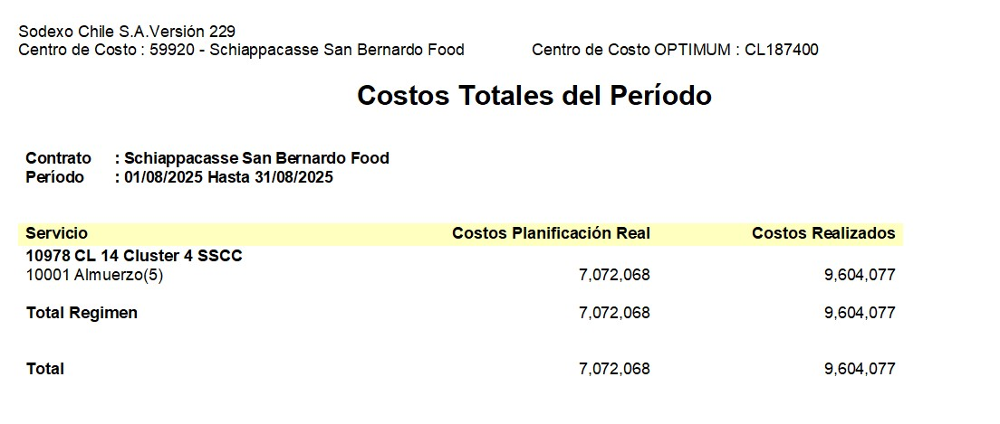

<u>**Reglas de Negocio:**</u>
**Validaciones del sistema****:**

| **#** | **Cuándo aparece** | **Qué verifica el sistema** | **Qué ve o experimenta el usuario** |
| --- | --- | --- | --- |
| 1 | Al presionar Vista Previa | Que el contrato ingresado exista en la base de datos | "No existe contrato" |
| 2 | Al presionar Vista Previa | Que la fecha inicial no sea posterior a la fecha final | "Fecha origen Mayor destino" |
| 3 | Al presionar Vista Previa | Que ambas fechas pertenezcan al mismo mes | "Mes origen mayor destino" |
| 4 | Al presionar Vista Previa | Que ambas fechas pertenezcan al mismo año | "Año origen mayor destino" |
| 5 | Al presionar Vista Previa | Que haya al menos un régimen seleccionado (en modo Lista, que la grilla no esté vacía) | "Regimen debe ser informado" |
| 6 | Al presionar Vista Previa | Que haya al menos un servicio seleccionado (en modo Lista, que la grilla no esté vacía) | "Servicio debe ser informado" |

**Reglas de cálculo****:**
**Filtro de cuenta contable según tipo de costo seleccionado:**** **El sistema filtra los productos incluidos en el cálculo según la cuenta contable del producto (pro_ctacon) y el tipo de costo elegido:
**Costo Alimentación:** solo productos cuya cuenta contable esté en la lista del parámetro ctainsumo (definido en la tabla a_param).
**Costo Desechable:** solo productos cuya cuenta contable esté en la lista del parámetro ctalimdes.
**Total Costo:** productos de ambas listas combinadas.
**Resolución del precio unitario (PMP) para estructura fija****: **Cuando el costo de un servicio proviene de la estructura fija de minuta (tabla b_minutafija, que almacena recetas permanentes sin detalle diario), el sistema necesita el precio unitario de cada ingrediente. Lo obtiene desde la tabla b_productospmpdia (PMP diario de productos), tomando el registro del día anterior al cierre vigente. En la versión SQL Server el sistema busca directamente en b_productospmpdia con la fecha del día anterior al cierre; en la versión Access legada genera una tabla temporal con los últimos PMP registrados.
> Comentario - Paz Jorge (2026-03-27): No considerar
> Comentario - Paz Jorge (2026-03-27): No considerar
**Fuente del costo de planificación real****:**** **Existen dos fuentes para el costo planificado, que el sistema selecciona automáticamente según los datos disponibles:
**Estructura diaria (b_minutafijadia):** si existe un registro específico para el día consultado, el costo se calcula como SUM(cantidad × precio_unitario) de esa tabla. Este precio ya está grabado en la estructura fija del día.
**Estructura fija periódica (b_minutafija):** si no existe estructura diaria, se usa la estructura fija más reciente (MAX(mif_fecval)), multiplicando la cantidad de la receta por el PMP del día anterior al cierre.
Adicionalmente, para cada minuta (detalle en b_minutadet con mid_tipmin='2'), el sistema suma el costo congelado en la minuta (mid_cosrec para alimentación, mid_cosdes para desechables) multiplicado por las raciones planificadas (mid_numrac).
**Fuente del costo realizado****: **El costo realizado se obtiene de los documentos de salida de producción (tipo SP) y de las devoluciones de producción (tipo DP) registrados en b_totventas y b_detventas. Los documentos anulados (tov_estdoc = 'A' o 'P') quedan excluidos. Las devoluciones se descuentan (se suman con signo negativo) del total de salidas.

<u>**Tablas Relacionadas:**</u>

| **Tabla** | **Para qué se usa** | **Campos clave** |
| --- | --- | --- |
| b_minuta | Encabezado de la minuta planificada; provee la asociación contrato-régimen-servicio-fecha y las raciones reales | min_codigo min_cencos min_codreg min_codser min_fecmin min_racrea |
| b_minutadet | Detalle de recetas por minuta; contiene el costo congelado por receta y las raciones planificadas | mid_codigo mid_tipmin mid_cosrec mid_cosdes mid_numrac |
| b_minutafija | Estructura fija periódica de recetas (válida a partir de una fecha); usada cuando no existe estructura diaria | mif_cencos mif_codreg mif_codser mif_fecval mif_codpro mif_dianro mif_canpro |
| b_minutafijadia | Estructura fija del día; si existe para la fecha consultada, tiene prioridad sobre la estructura periódica | mfd_cencos mfd_codreg mfd_codser mfd_fecha mfd_codpro mfd_tipmin mfd_canpro mfd_cospro |
| b_productospmpdia | Precio Medio Ponderado diario de productos; provee el precio unitario para calcular el costo de la estructura fija periódica | ppd_cencos ppd_codpro ppd_fecdia ppd_propon |
| b_productos | Maestro de productos; permite filtrar por cuenta contable para separar alimentación de desechables | pro_codigo pro_ctacon |
| b_totventas | Encabezado de documentos de movimiento de bodega; provee los documentos de salida (SP) y devolución (DP) | tov_rutcli tov_tipdoc tov_numdoc tov_codreg tov_codser tov_fecpro tov_estdoc tov_codbod |
| b_detventas | Líneas de productos de cada documento de movimiento; contiene el valor monetario por línea | dev_rutcli dev_tipdoc dev_numdoc dev_codmer dev_ptotal dev_canmer |
| a_servicio | Maestro de servicios; provee el nombre del servicio para mostrarlo en el informe | ser_codigo ser_nombre |
| a_regimen | Maestro de regímenes; provee el nombre del régimen para el agrupador de primer nivel | reg_codigo reg_nombre |
| b_clientes | Maestro de contratos/clientes; valida que el contrato exista y obtiene su nombre para el encabezado del informe | cli_codigo cli_nombre |
| a_param | Tabla de parámetros del sistema; provee las cuentas contables de insumos (ctainsumo) y desechables (ctalimdes) | par_codigo par_valor par_cencos |

## 9.11. Food Cost

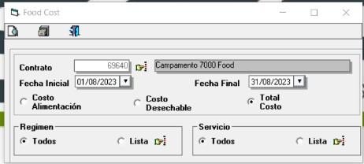
<u>**Descripción:**</u>
El informe **Food Cost** permite conocer, día a día y dentro de un mes calendario, la relación entre el costo de los insumos consumidos y los ingresos por venta de raciones en un contrato (casino). Para cada régimen y servicio seleccionado se muestran cuántas raciones se vendieron, el total de ingresos de ese día, el valor promedio de la bandeja vendida, las raciones producidas según la minuta real, el costo total del día y el costo por bandeja producida. La columna final —denominada **Food Cost**— expresa ese costo como porcentaje del ingreso diario, que es el indicador de gestión central del informe.
El informe se organiza jerárquicamente: primero agrupa por régimen y, dentro de cada régimen, por servicio. Al final de cada servicio aparece una fila de **Total Servicio** y, tras recorrer todos los regímenes, una fila de **Total General** que consolida el período completo. Si el contrato opera servicios especiales con precio por comensal, éstos se presentan en una sección separada con su propio total.
El resultado se entrega como documento RTF (visualizable en pantalla antes de imprimir) y simultáneamente se exporta un archivo de texto delimitado por barras que puede abrirse en Excel. Dado que el informe consolida un único mes, es adecuado tanto para el cierre mensual del casino como para el seguimiento quincenal o semanal dentro del mismo mes.

| **Campo** | **Descripción** | **Obligatorio** |
| --- | --- | --- |
| Contrato | Código del casino (centro de costo) sobre el que se genera el informe. El sistema muestra automáticamente el nombre del contrato al escribir el código. | Sí |
| Fecha Inicial | Primer día del período a consultar (formato dd/mm/aaaa). Se inicializa con la fecha actual. | Sí |
| Fecha Final | Último día del período a consultar (formato dd/mm/aaaa). Se inicializa con la fecha actual. Debe pertenecer al mismo mes y año que la Fecha Inicial. | Sí |
| Tipo de costo | En este modo solo está disponible la opción Total Costo, que incluye tanto insumos alimentarios como desechables. | Fijo (Total Costo) |
| Régimen | Permite filtrar por uno o varios regímenes. Por defecto incluye todos los regímenes del contrato. Si se elige "Lista", se activa el ícono de búsqueda para seleccionarlos manualmente. | Sí (al menos uno) |
| Servicio | Permite filtrar por uno o varios servicios. Por defecto incluye todos los servicios del contrato. Si se elige "Lista", se activa el ícono de búsqueda para seleccionarlos manualmente. | Sí (al menos uno) |

El informe genera un documento **RTF** con cabecera y pie de página de la empresa. Simultáneamente se exporta un archivo de texto delimitado por barras (|) que puede abrirse en Excel.
**Estructura del documento**
El documento se divide en dos grandes bloques:
**Bloque 1 — Ventas de producción regular (por régimen y servicio)**
Organizado como:
Encabezado general: nombre del contrato y rango de fechas.
Por cada régimen → por cada servicio → filas diarias de detalle → fila "Tot. Serv." → fila "Tot. Gral." al final del bloque.
**Bloque 2 — Ventas de servicios especiales**
Si el contrato tiene operaciones de servicios especiales en el período, se presenta una sección adicional:
Por cada servicio especial → filas diarias de detalle → fila "Tot. Serv. Vta. Especial" → fila "Tot. Gral. Vta. Especial" al final.
**Estructura de datos del informe**

| **Campo** | **Descripción** | **Calculado** |
| --- | --- | --- |
| Fecha | Día al que corresponde la fila (dd/mm/aaaa) | No |
| Servicio | Código y nombre del servicio o del servicio especial | No |
| Rac. Vendidas | Suma de raciones vendidas (clientes distintos de PERSONAL, PRODUCIDAS y muestra referencia) en ese día, servicio y régimen | No |
| Venta Día | Total, de ingresos del día: precio de venta por ración × raciones vendidas, más ventas a contado | Sí |
| Valor Bandeja | Ingreso promedio por ración vendida | Sí |
| Rac. Producidas | Total, de raciones reales producidas según minuta real | No |
| Costo Día | Suma del costo neto de insumos (salidas menos devoluciones) del día | No |
| Costo Bandeja | Costo promedio por ración producida | Sí |
| Costo Bandeja Vendido | Costo promedio distribuido sobre las raciones vendidas | Sí |
| Food Cost | Porcentaje que representa el costo sobre el ingreso del día | Sí |
| Tot. Serv. | Subtotal del servicio para el período | Sí |
| Tot. Gral. | Total, general de todos los servicios y regímenes para el período | Sí |

<u>**Regla de Negocio:**</u>
**Validaciones del sistema**

| **#** | **Cuándo aparece** | **Qué verifica el sistema** | **Qué ve o experimenta el usuario** |
| --- | --- | --- | --- |
| 1 | Al hacer clic en "Vista Previa" | Que el código de contrato exista en la base de datos | "No existe contrato" |
| 2 | Al hacer clic en "Vista Previa" | Que la Fecha Inicial no sea posterior a la Fecha Final | "Fecha origen Mayor destino" |
| 3 | Al hacer clic en "Vista Previa" | Que ambas fechas pertenezcan al mismo mes | "Mes origen mayor destino" |
| 4 | Al hacer clic en "Vista Previa" | Que ambas fechas pertenezcan al mismo año | "Año origen mayor destino" |
| 5 | Al hacer clic en "Vista Previa" | Que haya al menos un régimen seleccionado | "Regimen debe ser informado" |
| 6 | Al hacer clic en "Vista Previa" | Que haya al menos un servicio seleccionado | "Servicio debe ser informado" |

<u>**Reglas de cálculo**</u>
El informe solo puede abarcar días dentro de un mismo mes y año. No es posible cruzar meses.
El tipo de costo Total Costo combina las cuentas contables configuradas en los parámetros del sistema como "insumos alimentarios" (ctainsumo) y "desechables" (ctalimdes). El filtro se aplica sobre el campo de cuenta contable de cada producto.
Solo se consideran documentos de venta con tipo SP (salida de producción) y DP (devolución de producción), que no estén anulados ni pendientes. Las devoluciones se restan al costo total.
Para las raciones producidas, el sistema consulta la minuta real (mid_tipmin = '2'); las minutas teóricas o planificadas no se incluyen en este informe.
Las ventas a clientes internos PERSONAL, PRODUCIDAS y Muestra Referencia quedan excluidas del conteo de raciones vendidas.
Las ventas a contado registradas en b_ventacontado se suman al ingreso del día.
Los Servicios Especiales (contratos con precio por comensal o precio total) se procesan de forma separada mediante el procedimiento almacenado sgp_Sel_InfFoodCostSalidaDevolucionVentaServicioEspeciales. Solo se incluyen servicios especiales con costo neto positivo (las devoluciones que resultan en costo negativo son excluidas).

<u>**Cálculo — Valor Bandeja**</u>
Ingreso promedio por ración vendida en un día determinado.

| **Componente** | **Descripción** |
| --- | --- |
| Venta Día | Suma de ingresos del día (raciones × precio vigente + ventas contado) |
| Rac. Vendidas | Cantidad de raciones vendidas en ese día |
| Fórmula | Valor Bandeja = Venta Día / Rac. Vendidas |

Solo se calcula si ambos valores son mayores que cero.

<u>**Cálculo — Costo Bandeja**</u>
Costo promedio por ración efectivamente producida.

| **Componente** | **Descripción** |
| --- | --- |
| Costo Día | Costo neto de insumos consumidos (salidas menos devoluciones) |
| Rac. Producidas | Raciones reales según minuta real |
| Fórmula | Costo Bandeja = Costo Día / Rac. Producidas |

Solo se calcula si ambos valores son mayores que cero.

<u>**Cálculo — Costo Bandeja Vendido**</u>
Costo promedio distribuido sobre las raciones vendidas (indicador alternativo al Costo Bandeja).

| **Componente** | **Descripción** |
| --- | --- |
| Costo Día | Costo neto de insumos consumidos |
| Rac. Vendidas | Cantidad de raciones vendidas |
| Fórmula | Costo Bandeja Vendido = Costo Día / Rac. Vendidas |

Solo se calcula si ambos valores son mayores que cero.

<u>**Cálculo — Food Cost**</u>
Indicador principal: porcentaje del costo sobre el ingreso diario.

| **Componente** | **Descripción** |
| --- | --- |
| Costo Día | Costo neto de insumos consumidos |
| Venta Día | Total de ingresos del día |
| Fórmula | Food Cost (%) = (Costo Día / Venta Día) × 100 |

Solo se calcula si el Costo Día y la Venta Día son mayores que cero. Se muestra con dos decimales y el símbolo %.

<u>**Tablas Relacionadas:**</u>

| **Tabla** | **Para qué se usa** | **Campos clave** |
| --- | --- | --- |
| b_clientes | Validar que el contrato existe y obtener su nombre | cli_codigo cli_nombre cli_activo cli_codbod cli_tipo |
| b_totventas | Encabezados de documentos de venta (salidas y devoluciones de producción) | tov_rutcli tov_tipdoc (SP/DP) tov_fecpro tov_codreg tov_codser tov_codbod tov_estdoc |
| b_detventas | Líneas de producto de cada documento de venta; aporta el valor monetario | dev_rutcli dev_tipdoc dev_numdoc dev_codmer dev_ptotal dev_canmer |
| b_productos | Catálogo de productos/insumos; filtra por cuenta contable | pro_codigo pro_ctacon |
| a_servicio | Maestro de servicios; aporta el nombre del servicio | ser_codigo ser_nombre |
| a_regimen | Maestro de regímenes; aporta el nombre del régimen | reg_codigo reg_nombre |
| b_minutaraciones | Raciones planificadas por cliente, servicio y fecha; se usa para obtener el precio de venta vigente | mir_cencos mir_codreg mir_codser mir_fecmin mir_rutcli mir_nrorac |
| b_preciovta | Precios de venta por cliente, servicio, régimen y fecha de vigencia | prv_rutcli prv_codser prv_codreg prv_cencos prv_fecvig prv_preven |
| b_ventacontado | Ventas en efectivo o contado registradas por día y servicio | vtc_codreg vtc_cencos vtc_codser vtc_fecvta vtc_totmon |
| b_minuta | Encabezado de la minuta de producción | min_codigo min_cencos min_codreg min_codser min_fecmin min_racrea |
| b_minutadet | Detalle de la minuta; solo se lee la minuta real (mid_tipmin='2') | mid_codigo mid_tipmin mid_cosrec mid_cosdes mid_numrac |
| b_totventaserviciosespeciales | Encabezados de documentos de servicios especiales (tipo SE/DE) | tos_IdCeco tos_Tipo_Documento tos_Numero_Documento tos_Venta_servicio_Especiales tos_Fecha_Produccion tos_Comensales tos_Precio_Servicio tos_IdBodega tos_Estado_Documento |
| b_detventaserviciosespeciales | Líneas de producto de servicios especiales; aporta el costo | des_IdCeco des_Tipo_Documento des_Numero_Documento des_IdProducto des_Total_Documento des_Cantidad_Mercaderia des_Cantidad_Devolver |
| a_param (parámetros del sistema) | Obtiene las cuentas contables de insumos (ctainsumo) y desechables (ctalimdes) para filtrar los productos | par_codigo par_valor |

## 9.12. Costo x Sector

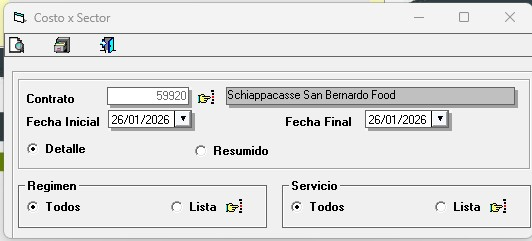
<u>**Descripción:**</u>
El informe **Costo x Sector** permite conocer cuánto costó alimentar a los comensales de un contrato durante un período determinado, desglosado por el sector al que pertenece cada servicio (por ejemplo: cocina caliente, ensaladas, postres, etc.). Para cada sector se muestran simultáneamente tres perspectivas de costo: el costo que se estimó al planificar teóricamente la minuta, el costo ajustado según la planificación real, y el costo efectivo basado en lo que realmente se despachó (food cost).
El informe trabaja con un único mes calendario a la vez (fechas de inicio y fin deben pertenecer al mismo mes y año). Esto responde a que los precios de los insumos (PMP — Precio Medio Ponderado) se calculan por período mensual. Dentro de ese mes se puede acotar el análisis a días específicos, a uno o varios regímenes y a uno o varios servicios del contrato.
La visualización está disponible en dos modalidades: **Detallada**, donde cada día del período aparece como un bloque separado con sus costos por sector; y **Resumida**, donde los costos de todos los días del período se consolidan en un único bloque de totales por sector, ideal para una vista de cierre mensual.

| **Campo** | **Descripción** | **Obligatorio** |
| --- | --- | --- |
| Contrato | Código del contrato (casino) a analizar. Se puede digitar directamente o buscar con el ícono de lupa. Al ingresar un código válido, el sistema completa automáticamente el nombre del contrato. | Sí |
| Fecha Inicial | Primer día del período a analizar. Se inicializa con la fecha actual. | Sí |
| Fecha Final | Último día del período a analizar. Se inicializa con la fecha actual. Debe estar en el mismo mes y año que la Fecha Inicial. | Sí |
| Tipo de vista | Detalle: muestra cada día del período por separado. Resumido: consolida todos los días en un único resumen. Por defecto se selecciona la opción "Detalle". | Sí |
| Régimen | Define si se consideran todos los regímenes del contrato o solo algunos seleccionados de una lista. Por defecto: "Todos". | Sí |
| Servicio | Define si se consideran todos los servicios del contrato o solo algunos seleccionados de una lista. Por defecto: "Todos". | Sí |

El informe se genera en formato **RTF** (visualización e impresión desde vista previa) con orientación de página **vertical (Portrait)**. Simultáneamente se exporta un archivo de texto plano separado por | para uso en planillas de cálculo.
**Resumen de tipos disponibles**

| **Opción** | **Agrupación** | **Uso Recomendado** |
| --- | --- | --- |
| Detalle | Un bloque por cada día del período | Análisis diario de desviaciones de costo |
| Resumido | Un único bloque para todo el período | Cierre mensual y comparación de totales |

**(Detalle) Vista Detallada**
Muestra el costo de cada sector desagregado día por día dentro del período seleccionado. Para cada combinación de Fecha + Régimen + Servicio se genera un bloque independiente con encabezado y tabla de sectores.
**Estructura por bloque (Detalle)**
Cada bloque contiene:
**Encabezado de Régimen** (fondo amarillo): código y nombre del régimen.
**Encabezado de Servicio** (fondo amarillo): nombre del servicio + fecha del día + cantidad de raciones para cada perspectiva.
**Cabecera de columnas** (fondo amarillo): Código | Descripción | Total | Cto. Per Capita | Total | Cto. Per Capita | Total | Cto. Per Capita
**Filas de sectores**: una fila por sector, con datos en las columnas correspondientes a cada perspectiva (Teórico, Real, Realizado).
**Fila TOTAL**: suma de todos los sectores para el día con sus costos per cápita.
**Campos por fila de sector (Detalle)**

| **Campo** | **Descripción** | **Calculado** |
| --- | --- | --- |
| Código | Código del sector (vacío si es Estructura Fija) | No |
| Descripción | Nombre del sector o "Estructura Fija" | No |
| Total (Teórico) | Costo total de planificación teórica para el sector en el día | Sí |
| Cto. Per Capita (Teórico) | Costo teórico dividido entre las raciones teóricas del día | Sí |
| Total (Real) | Costo total de planificación real para el sector en el día | Sí |
| Cto. Per Capita (Real) | Costo real dividido entre las raciones reales del día | Sí |
| Total (Realizado) | Costo efectivo food cost para el sector en el día | Sí |
| Cto. Per Capita (Realizado) | Costo realizado dividido entre las raciones producidas del día | Sí |

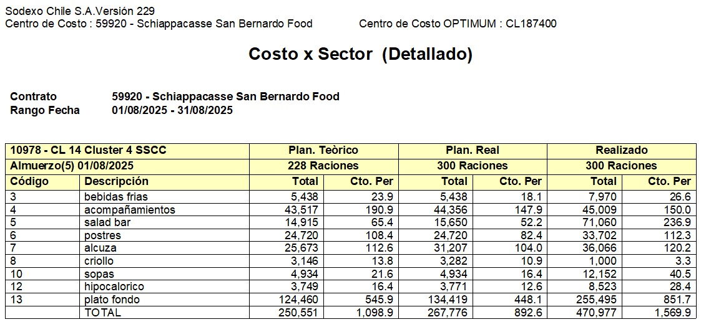

**(Resumido) Vista Resumida**
Consolida todos los días del período en un único bloque por cada combinación de Régimen + Servicio, sin desglose por fecha. Es equivalente al modo Detalle pero los costos de cada sector se suman para todos los días seleccionados.
**Estructura por bloque (Resumido)**
Idéntica a la del modo Detalle, con las siguientes diferencias:
El encabezado de Servicio **no muestra la fecha** (solo nombre del servicio y raciones totales del período).
La consulta de raciones utiliza el **rango completo** del período (de fecini a fecfin) en lugar de un único día.
La agrupación en la consulta final omite el campo de fecha, acumulando todos los días.
**Campos por fila de sector (Resumido)**
Los mismos 8 campos que en el modo Detalle. La diferencia es que los valores Total ya representan la suma acumulada de todo el período y el costo per cápita se divide entre las raciones totales del período.
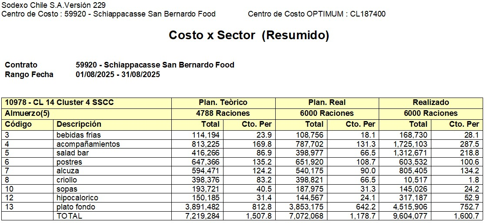
<u>**Regla de Negocio:**</u>
**Validaciones del sistema**

| **#** | **Cuándo aparece** | **Qué verifica el sistema** | **Qué ve o experimenta el usuario** |
| --- | --- | --- | --- |
| 1 | Al hacer clic en Vista Previa | El código de contrato ingresado existe en la base de datos | “No existe contrato” |
| 2 | Al hacer clic en Vista Previa | La Fecha Inicial no es posterior a la Fecha Final | “Fecha origen Mayor destino” |
| 3 | Al hacer clic en Vista Previa | Las dos fechas pertenecen al mismo mes calendario | “Mes origen mayor destino” |
| 4 | Al hacer clic en Vista Previa | Las dos fechas pertenecen al mismo año | “Año origen mayor destino” |
| 5 | Al hacer clic en Vista Previa | Al usar "Lista" en Régimen, hay al menos un régimen seleccionado | “Regimen debe ser informado” |
| 6 | Al hacer clic en Vista Previa | Al usar "Lista" en Servicio, hay al menos un servicio seleccionado | “Servicio debe ser informado” |

**Reglas de cálculo**
**Clasificación de las tres perspectivas de costo**
El informe construye internamente una tabla temporal que reúne datos de tres orígenes distintos, identificados con un campo tipo:
tipo = 1 → **Planificación Teórica**: costo calculado multiplicando las raciones teóricas planificadas (mid_numrac) por el costo de la receta congelado al momento de planificar (mid_cosrec), usando la minuta de tipo teórico (mid_tipmin = '1').
tipo = 2 → **Planificación Real**: mismo cálculo anterior pero utilizando la minuta real (mid_tipmin = '2'), que refleja los ajustes hechos antes de producir.
tipo = 3 → **Realizado (Food Cost)**: costo proveniente de los documentos de salida reales (b_totventas + b_detventas), considerando salidas de producción (tov_tipdoc = 'SP') y descontando devoluciones (tov_tipdoc = 'DP'). Solo se incluyen productos cuya cuenta contable coincide con el parámetro del sistema ctainsumo.
**Estructura Fija**
> Comentario - Paz Jorge (2026-03-31): No considerar
Además de los sectores de la minuta, el informe incorpora un sector especial denominado **"Estructura Fija"**, que agrupa los costos de insumos que no están asociados a un sector de servicio específico sino que son costos fijos del régimen. Su código de sector es -1 y aparece al final del listado (orden 999999999). Estos costos se obtienen de las tablas b_minutafija (estructura fija mensual) y b_minutafijadia (estructura fija por día), usando el PMP del día anterior al cierre como precio de valorización cuando no existe una estructura fija por día específica.
**Costo per cápita**
Para cada sector y cada perspectiva de costo se calcula el **costo per cápita** dividiendo el costo total del sector por el número de raciones correspondiente:
Para tipo 1 (Teórico): Costo per cápita = Costo Total / Raciones Teóricas (min_racteo)
Para tipo 2 (Real): Costo per cápita = Costo Total / Raciones Reales (min_racrea)
Para tipo 3 (Realizado): Costo per cápita = Costo Total / Raciones Producidas (b_minutaraciones donde mir_rutcli = 'PRODUCIDAS')
> Comentario - Paz Jorge (2026-03-31): Considerar en nuevo campo de la minuta producidas reales
Si el denominador de raciones es cero, el sistema muestra cero sin dividir.
**Filtro de insumos**
Solo se incluyen productos cuya cuenta contable (pro_ctacon) esté en la lista definida por el parámetro del sistema ctainsumo. Esto evita incluir costos de artículos que no son materias primas alimentarias.
**Exclusión de documentos anulados o pendientes**
Los documentos con estado 'A' (Anulado) o 'P' (Pendiente) en tov_estdoc son excluidos del cálculo del food cost. Tampoco se consideran líneas de detalle con cantidad cero (dev_canmer <> 0) ni con costo total cero (dev_ptotal > 0).
**Cálculo — Raciones en modo Resumido**
Raciones Teóricas (Comensales Totales del día): SUM(min_racteo) desde b_minuta para todo el rango de fechas.
Raciones Reales Comensales Totales del día: SUM(min_racrea) desde b_minuta para todo el rango de fechas.
Raciones Producidas Comensales Totales del día: SUM(mir_nrorac) desde b_minutaraciones donde mir_rutcli = 'PRODUCIDAS' para todo el rango de fechas.
<u>**Tablas**</u><u>**:**</u>

| **Tabla** | **Para qué se usa** | **Campos clave** |
| --- | --- | --- |
| b_totventas | Encabezados de documentos de venta/salida de producción | Fuente de food cost; filtra por contrato, régimen, servicio, fechas, bodega y estado del documento |
| b_detventas | Líneas de detalle de cada documento de venta/salida | Aporta el costo total por producto (dev_ptotal), sector (dev_codsec) y código de insumo |
| b_productos | Maestro de productos/insumos | Filtra por cuenta contable (pro_ctacon) para incluir solo insumos alimentarios |
| a_sector | Maestro de sectores de servicio | Aporta código, nombre y orden de presentación de cada sector |
| b_minuta | Encabezado de minutas planificadas | Base para tipos 1 (teórico) y 2 (real); aporta raciones teóricas y reales |
| b_minutadet | Detalle de recetas en la minuta | Aporta raciones planificadas y costo de receta congelado (mid_cosrec) por tipo de minuta |
| a_servicio | Maestro de servicios | Aporta nombre del servicio para el encabezado del informe |
| a_regimen | Maestro de regímenes | Aporta nombre del régimen para el encabezado del informe |
| a_estservicio | Estructura de sectores por servicio y régimen | Relaciona servicios con sus sectores dentro de un contrato |
| b_minutaraciones | Raciones registradas por tipo de comensal | Aporta las raciones producidas (mir_rutcli = 'PRODUCIDAS') para el cálculo del per cápita realizado |
| b_minutafija | Estructura de costos fijos mensual por régimen/servicio | Base para calcular la "Estructura Fija" cuando no existe registro por día |
| b_minutafijadia | Estructura de costos fijos diaria por régimen/servicio | Versión diaria de la estructura fija; tiene prioridad sobre b_minutafija cuando existe |
| b_productospmpdia | PMP diario de productos por contrato | Precio de valorización para la estructura fija cuando no hay registro diario (SQL Server: PMP del día anterior al cierre) |
| a_param / b_parametros | Parámetros del sistema | Aporta ctainsumo (cuentas contables de insumos) y ciediario (fecha de cierre vigente) |

## 9.13. Insumos no Planificados en Salida Bodega

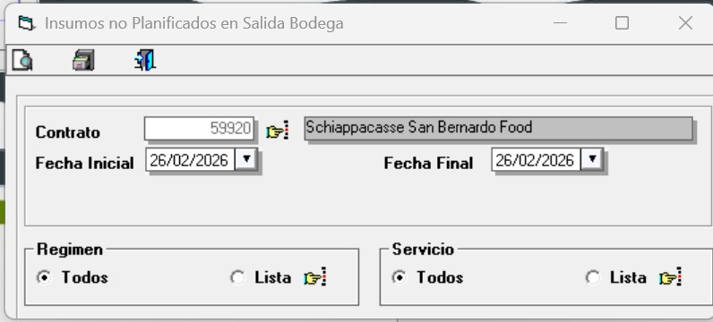
<u>**Descripción:**</u>
Este informe permite identificar, dentro de las salidas de bodega de producción, aquellos insumos que **no estaban contemplados en la planificación de la minuta**, así como los insumos planificados que **no fueron efectivamente utilizados**. Dicho de otro modo, responde a la pregunta: "¿qué se despachó desde bodega sin estar planificado, y qué estaba planificado pero nunca salió?"
El informe se organiza por régimen y servicio dentro del contrato seleccionado, y dentro de cada combinación régimen/servicio muestra dos bloques diferenciados: **"INSUMOS NO PLANIFICADOS UTILIZADOS"** (insumos que salieron de bodega sin figurar en la minuta planificada) e **"INSUMOS PLANIFICADOS NO UTILIZADOS"** (insumos que estaban en la minuta pero cuya cantidad planificada no se despachó). Para cada insumo se detalla código, nombre, unidad de medida, cantidad, precio medio ponderado (P.M.P.) y costo total, además de su proporción sobre el costo total de salida del día.
El resultado se genera en formato RTF (visualización en pantalla con opción de impresión) y simultáneamente en un archivo de texto delimitado por pipes (|) para exportación, lo que permite revisión fuera del sistema sin necesidad de impresión física.

| **Campo** | **Descripción** | **Obligatorio** |
| --- | --- | --- |
| Contrato | Identificador del centro de costo (casino) a consultar. Se puede ingresar directamente o buscar con el ícono de lupa | Sí |
| Nombre del contrato | Se completa automáticamente al ingresar el código de contrato | — |
| Fecha Inicial | Primer día del rango a consultar. Se inicializa con la fecha actual | Sí |
| Fecha Final | Último día del rango a consultar. Se inicializa con la fecha actual | Sí |
| Régimen | Permite filtrar por uno o varios regímenes (ej. Normal, Liviano). Por defecto incluye todos | Sí |
| Servicio | Permite filtrar por uno o varios servicios (ej. Almuerzo, Cena). Por defecto incluye todos | Sí |

El informe genera un documento **RTF en orientación vertical (portrait)**, visualizable en pantalla, con el siguiente contenido:
Encabezado corporativo con logo de la empresa y datos de página
Título: "Insumos no Planificados en Salida Bodega"
Datos del contrato (código y nombre)
Por cada combinación de régimen / servicio / fecha dentro del período:
Encabezado de grupo (fecha, régimen, servicio, raciones producidas, costo de salida)
Bloque "INSUMOS NO PLANIFICADOS UTILIZADOS" con detalle de cada insumo
Bloque "INSUMOS PLANIFICADOS NO UTILIZADOS" con detalle de cada insumo
Fila de totales al cierre de cada bloque
Pie de página con número de página
Además, se genera un **archivo de texto plano delimitado por pipes** (|) en la carpeta de trabajo del sistema, con la misma información para exportación o procesamiento externo.
**Estructura de columnas del informe**

| **#** | **Campo** | **Descripción** | **Calculado** |
| --- | --- | --- | --- |
| 1 | Código | Código del insumo/producto (pro_codigo) | No |
| 2 | Producto | Nombre del insumo (pro_nombre) | No |
| 3 | Unidad Medida | Unidad de medida del insumo (uni_nombre) | No |
| 4 | Cantidad | Cantidad despachada (no planificados: dev_canmer) o planificada sin despachar (dev_canmin) | No (leído de BD) |
| 5 | P.M.P. | Precio Medio Ponderado al momento de la salida (dev_precos) | No (congelado en salida) |
| 6 | Total | Costo del insumo = Cantidad × P.M.P. | Sí |
| 7 | % Sobre Costo | Proporción del costo del insumo sobre el costo total de salida del día | Sí |

**Filas de resumen**
Al pie de cada bloque (INSUMOS NO PLANIFICADOS / PLANIFICADOS NO UTILIZADOS) se agrega una fila **"Total $"** con:
Suma acumulada de la columna Total del bloque
Suma acumulada del % Sobre Costo del bloque

<u>**Regla de Negocio:**</u>
**Validaciones del sistema**

| **#** | **Cuándo aparece** | **Qué verifica el sistema** | **Qué ve o experimenta el usuario** |
| --- | --- | --- | --- |
| 1 | Al hacer clic en Vista Previa | El código de contrato ingresado existe en la tabla de clientes (b_clientes, cli_tipo=0) | “No existe contrato” |
| 2 | Al hacer clic en Vista Previa | La Fecha Inicial no es posterior a la Fecha Final | “Fecha origen Mayor destino” |
| 3 | Al hacer clic en Vista Previa | Ambas fechas pertenecen al mismo mes | “Mes origen mayor destino” |
| 4 | Al hacer clic en Vista Previa | Ambas fechas pertenecen al mismo año | “Año origen mayor destino” |
| 5 | Al hacer clic en Vista Previa | Se ha seleccionado al menos un régimen | “Regimen debe ser informado” |
| 6 | Al hacer clic en Vista Previa | Se ha seleccionado al menos un servicio | “Servicio debe ser informado” |

**Reglas de cálculo**
**Criterio de clasificación de insumos**
El sistema distingue los insumos según los campos dev_canmin (cantidad planificada en minuta) y dev_canmer (cantidad real despachada/devuelta) en la tabla b_detventas:

| **Condición** | **Clasificación** |
| --- | --- |
| dev_canmer > 0 y dev_canmin = 0 | INSUMO NO PLANIFICADO UTILIZADO (salió de bodega sin estar en minuta) |
| dev_canmer = 0 y dev_canmin > 0 | INSUMO PLANIFICADO NO UTILIZADO (estaba en minuta pero no se despachó) |

**Cálculo del costo por insumo**
Para insumos no planificados: Cantidad × P.M.P. = dev_canmer × dev_precos
Para insumos planificados no utilizados: Cantidad × P.M.P. = dev_canmin × dev_precos
El campo dev_precos corresponde al **Precio Medio Ponderado (P.M.P.)** del insumo vigente al momento de la salida de bodega.
**Cálculo del porcentaje sobre costo de salida**
Para cada insumo se calcula su proporción respecto al costo total de salida del día para ese régimen/servicio:
% Sobre Costo = (Costo del insumo / Costo total de salida del día) × 100
El costo total de salida del día se obtiene sumando dev_canmer × dev_precos para **todas** las líneas del documento de salida (tov_tipdoc = 'SP') de ese régimen, servicio y fecha, independientemente de si son planificados o no.
Si el costo total de salida del día es cero, la columna "% Sobre Costo" queda vacía.
**Cálculo — Total (columna 6)**
Total = Cantidad × dev_precos
Donde Cantidad es:
- dev_canmer  si el insumo es NO PLANIFICADO UTILIZADO
- dev_canmin  si el insumo es PLANIFICADO NO UTILIZADO
**Cálculo — % Sobre Costo (columna 7)**
% Sobre Costo = (Total del insumo / Costo total salida del día para ese régimen/servicio/fecha) × 100
Costo total salida del día = SUM(dev_canmer × dev_precos) sobre TODAS las líneas  de b_detventas donde:
tov_tipdoc='SP'
tov_codbod=<bodega actual>
tov_rutcli=<contrato>
tov_codreg=<régimen>
tov_codser=<servicio>
tov_fecpro=<fecha>
Si el costo total de salida del día es 0 (sin movimientos valorados), la columna queda en blanco.
<u>**Tablas**</u><u>**:**</u>

| **Tabla** | **Para qué se usa** | **Campos clave** |
| --- | --- | --- |
| b_totventas | Cabeceras de documentos de salida/ingreso de bodega. Cada fila es un documento completo (una salida de producción, una devolución, etc.) | tov_rutcli (contrato) tov_tipdoc (tipo: SP=salida producción) tov_numdoc tov_fecpro (fecha de producción) tov_codreg (régimen) tov_codser (servicio) tov_codbod (bodega) |
| b_detventas | Líneas de detalle de cada documento de bodega. Cada fila es un insumo dentro de una salida | dev_numdoc dev_tipdoc dev_rutcli dev_codmer (código insumo) dev_canmin (cantidad planificada) dev_canmer (cantidad real despachada) dev_precos (P.M.P. al momento de salida) dev_numlin |
| b_minutaraciones | Registro de raciones por tipo de comensal para cada minuta (fecha/régimen/servicio/contrato). Se usa para obtener las raciones "PRODUCIDAS" | mir_cencos mir_codreg mir_codser mir_fecmin mir_rutcli (='PRODUCIDAS') mir_nrorac |
| b_productos | Maestro de insumos y productos del sistema | pro_codigo pro_nombre pro_coduni |
| a_unidad | Catálogo de unidades de medida | uni_codigo uni_nombre |
| a_regimen | Catálogo de regímenes alimentarios (Normal, Liviano, etc.) | reg_codigo reg_nombre |
| a_servicio | Catálogo de servicios (Almuerzo, Once, Cena, etc.) | ser_codigo ser_nombre |
| b_clientes | Maestro de contratos/casinos. Se usa solo para validar existencia y obtener el nombre del contrato | cli_codigo cli_nombre cli_tipo (=0 para contratos) |

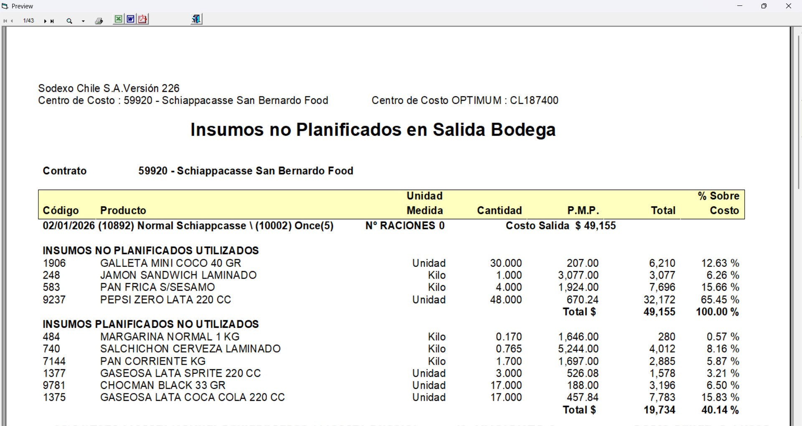
<u>**Mejoras:**</u>
Incluir un nuevo bloque calculo “diferencial insumos planificados VS salida bodega”.
Calculo Para insumos planificados sobre utilizados : Cantidad × P.M.P. = si dev_canmer > dev_canmin entonces ((dev_canmer - dev_canmin) × dev_precos), si no cero

## 9.14. Costo Detalle Periodo Realizado

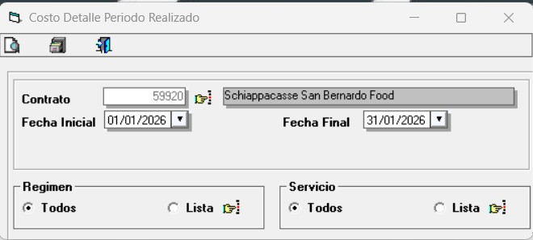
<u>**Descripción:**</u>
El informe **Costo Detalle Periodo Realizado** muestra el costo real de producción de un casino durante un período de tiempo, desglosado día a día y por sector de servicio (por ejemplo, almuerzo de régimen normal, cena de régimen vegetariano).
Para cada día y combinación de régimen y servicio, el informe lista todos los ingredientes y productos que efectivamente salieron de bodega para producción, con su costo unitario, la cantidad consumida y el costo total. Al final de cada sector calcula el **costo por sector** dividiendo el total entre las raciones producidas, y al final del día entrega el **costo total del día** y el **costo por ración del día**.
El informe refleja lo que realmente ocurrió (salidas tipo SP ya procesadas), no una estimación planificada. Sirve para que el responsable del casino compare el gasto real de materia prima contra las raciones servidas y detecte desviaciones de costo.

| **Campo** | **Descripción** | **Obligatorio** |
| --- | --- | --- |
| Contrato | El contrato (centro de costo) debe existir en la base de datos y tener salidas de producción (SP) registradas en el período. | Sí |
| Período | Fecha inicial y fecha final deben estar dentro del mismo mes y año. El sistema no permite períodos que crucen meses ni años. | Sí |
| Salidas procesadas | Deben existir salidas de bodega de tipo SP (Salida Producción) para el contrato, en el período y bodega activa. Las salidas no deben estar en estado A (Anulado) ni P (Pendiente). | Sí |
| Raciones producidas | Para que el cálculo de costo por ración sea significativo, deben existir raciones registradas con tipo PRODUCIDAS en la tabla de raciones de minuta. Si no existen, el sistema mostrará el costo total pero no calculará el costo unitario por ración. | Sí |
| Régimen y servicio | Se debe seleccionar al menos un régimen y un servicio, ya sea "Todos" o una lista específica. | Sí |

El informe genera un **documento RTF** (orientación vertical, tamaño carta) con una página por cada combinación de régimen, servicio y fecha de producción. Cada página tiene la siguiente estructura:
**Encabezado de página:**
Título: "Costos Detalle Período Realizado"
Folio del documento de salida, contrato y nombre del casino
Fecha de emisión y fecha de producción
Bodega
Régimen y servicio
Raciones producidas del día
**Encabezado de columnas:**

| **Campo** | **Descripción** | **Calculado** |
| --- | --- | --- |
| Código | Código del producto consumido (pro_codigo) | No |
| Descripción | Nombre del producto (pro_nombre) | No |
| UN | Unidad de medida abreviada (uni_nomcor) | No |
| Costo Unit. | Precio unitario del producto en el documento de salida (dev_predoc) | No |
| Cantidad | Cantidad total consumida (dev_canmer, suma de líneas agrupadas) | Sí (SUM) |
| Costo Total | Importe total de la línea (dev_ptotal, suma de líneas agrupadas) | Sí (SUM) |

**Subtotales por sector:**

| **Fila de Subtotal** | **Valor** |
| --- | --- |
| Nombre del sector (ej. "Almuerzo") | Σ Costo Total de las líneas del sector |
| Costo x Sector | Σ Costo sector ÷ Raciones producidas |

**Totales del día:**

| **Fila de Total** | **Valor** |
| --- | --- |
| Total Día | Σ todos los costos del día |
| Costo Día | Total Día ÷ Raciones producidas |

**Contexto de recetas:** Para cada sector se imprimen los nombres de las recetas planificadas en la minuta real, permitiendo saber qué preparaciones correspondían a los insumos listados.
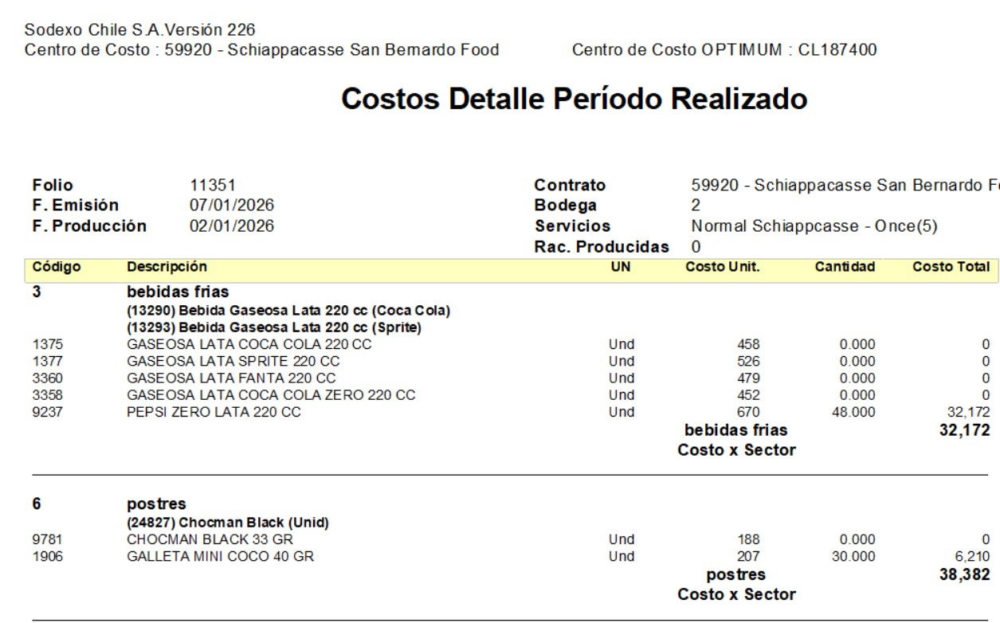

<u>**Regla de Negocio:**</u>
**Validaciones del sistema**
Las siguientes validaciones se ejecutan al presionar **Vista Previa**, en el orden indicado:

| **N°** | **Mensaje del Sistema** | **Condición que lo genera** | **Como resolverlo** |
| --- | --- | --- | --- |
| 1 | No existe contrato | El código de contrato ingresado no existe en la base de datos. | Verificar el código o buscarlo con el ícono. |
| 2 | Fecha origen Mayor destino | La Fecha Inicial es posterior a la Fecha Final. | Corregir las fechas para que el período sea válido. |
| 3 | Mes origen mayor destino | La Fecha Inicial y la Fecha Final pertenecen a meses distintos. | El informe solo cubre un mes completo o parcial; ajustar ambas fechas al mismo mes. |
| 4 | Año origen mayor destino | La Fecha Inicial y la Fecha Final pertenecen a años distintos. | Ajustar ambas fechas al mismo año. |
| 5 | Regimen debe ser informado | Se seleccionó la opción "Lista" para régimen pero no se eligió ninguno. | Seleccionar al menos un régimen o cambiar a "Todos". |
| 6 | Servicio debe ser informado | Se seleccionó la opción "Lista" para servicio pero no se eligió ninguno. | Seleccionar al menos un servicio o cambiar a "Todos". |
| 7 | No existe información ó bien las salidas no tiene indicada la opción x sector | No hay salidas de producción (SP) para los filtros seleccionados, o existen pero sin sector asignado en las líneas de detalle (dev_codsec = 0). | Verificar que el período tenga salidas procesadas y que cada línea tenga sector indicado. |

**Reglas de cálculo**

| **Regla** | **Descripción** |
| --- | --- |
| Selección de salidas | Solo se consideran documentos de tipo SP (Salida Producción) que no estén en estado A (Anulado) ni P (Pendiente), y que pertenezcan a la bodega activa (vg_codbod). |
| Raciones producidas | Se obtienen de b_minutaraciones filtrando por mir_rutcli = 'PRODUCIDAS'. Si el valor es nulo o cero, los cálculos de costo por ración no se muestran (denominador en cero se evita con IIf(NumRac > 0, ...)). |
| Costo total por sector | Suma de dev_ptotal (importe total de cada línea) para todas las líneas del sector, considerando solo las que tienen dev_canmer <> 0 (cantidad de merma distinta de cero). |
| Costo por sector / ración | Σ dev_ptotal del sector ÷ NumRac (raciones producidas del día). Se muestra solo si NumRac > 0. |
| Total día | Suma acumulada de dev_ptotal de todos los sectores del día. |
| Costo día / ración | Total día ÷ NumRac. Se muestra solo si NumRac > 0. |
| Estructura Fija | Los ingredientes sin código (dev_coding vacío o nulo) se agrupan bajo el concepto "Estructura Fija" y se muestran al final, con sec_orden = 999999999 para que queden siempre últimos. |
| Recetas del sector | Para cada sector se listan las recetas planificadas asociadas (de b_minuta, b_minutadet, b_receta), obtenidas de la minuta real (mid_tipmin = '2') con raciones planificadas mayores a cero. Esto permite comparar lo planificado con lo consumido. |
| Orden de presentación | Las líneas se ordenan por sec_orden (orden del sector) y dev_numlin (número de línea del documento), garantizando consistencia entre salidas. |

<u>**Tablas**</u><u>**:**</u>

| **Tabla** | **Para qué se usa** | **Campos clave** |
| --- | --- | --- |
| b_totventas | Cabecera de los documentos de salida de producción. Cada fila representa un documento SP (Salida Producción) por contrato, bodega, régimen, servicio y fecha. | tov_rutcli tov_tipdoc='SP' tov_numdoc tov_codbod tov_fecemi tov_fecpro tov_codreg tov_codser tov_estdoc |
| b_detventas | Líneas de detalle del documento de salida. Cada fila es un producto/ingrediente entregado. | dev_rutcli dev_tipdoc dev_numdoc dev_numlin dev_coding (ingrediente) dev_codmer (producto) dev_canmin dev_canmer dev_predoc dev_ptotal dev_codsec |
| b_minutaraciones | Registro de raciones por día, régimen, servicio y tipo de comensal. La fila con mir_rutcli = 'PRODUCIDAS' contiene las raciones efectivamente producidas. | mir_cencos mir_codreg mir_codser mir_fecmin mir_rutcli mir_nrorac |
| b_minuta | Cabecera de la minuta de planificación. Vincula un período con un contrato, régimen y servicio. | min_codigo min_cencos min_codreg min_codser min_fecmin |
| b_minutadet | Detalle de la minuta: recetas planificadas para cada día y servicio. | mid_codigo mid_codrec mid_tiprec mid_tipmin='2' (minuta real) mid_numrac mid_estser |
| b_receta | Maestro de recetas del casino. | rec_codigo rec_nombre |
| b_recetadet | Detalle de la receta: relación receta–ingrediente y tipo. | red_codigo red_tiprec red_cencos red_canpro |
| a_regimen | Maestro de regímenes alimenticios (ej. Normal, Vegetariano, Hiposódico). | reg_codigo reg_nombre |
| a_servicio | Maestro de servicios de comida (ej. Desayuno, Almuerzo, Cena). | ser_codigo ser_nombre |
| a_estservicio | Relación entre servicio, contrato y sector. Vincula un servicio con el sector del casino al que corresponde. | ess_cencos ess_codigo ess_codsec |
| a_sector | Maestro de sectores del casino (agrupaciones físicas o funcionales de los servicios). | sec_codigo sec_nombre sec_orden |
| b_ingrediente | Maestro de ingredientes. Cada ingrediente es la especificación técnica (ej. "Pollo entero"). | ing_codigo ing_nombre ing_unimed |
| b_productos | Maestro de productos de bodega. Cada producto es el artículo físico almacenado (ej. "Pollo entero congelado 1kg"). | pro_codigo pro_nombre pro_coduni pro_facing |
| a_unidadmed | Unidades de medida del ingrediente (ej. kg, lt, unidad). | unm_codigo unm_nomcor |
| a_unidad | Unidades de compra/bodega del producto (ej. caja, saco, bolsa). | uni_codigo uni_nomcor |
| [usuario]_tmp_CostoxPeriodo | Tabla temporal creada en tiempo de ejecución con los documentos SP del período. Se utiliza para obtener la lista de folios únicos a procesar, luego se itera sobre ellos. Se elimina al inicio si ya existe. | reg_codigo reg_nombre ser_codigo ser_nombre tov_fecemi tov_fecpro tov_numdoc dev_codsec |

<u>**Mejoras:**</u>
Mejorar título del informe de la pantalla y formato de salida x “Detalle costo realizado x sector”.

## 9.15. Curva ABC

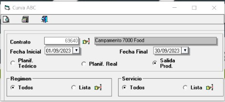
<u>**Descripción:**</u>
La pantalla **Curva ABC** permite identificar qué productos concentran el mayor gasto dentro de un contrato, para un período de tiempo acotado a un mes. Aplica la metodología ABC de análisis de inventarios: ordena todos los productos de mayor a menor costo total y los agrupa en tres categorías (A, B y C) según los umbrales de porcentaje configurados en el sistema.
El análisis puede realizarse sobre tres fuentes de datos distintas, elegidas por el usuario:
**Planificación Teórica**: considera las recetas y raciones planificadas en la minuta teórica.
**Planificación Real**: considera las recetas y raciones confirmadas en la minuta real.
**Salida de Producción (Realizado)**: considera los movimientos de salida efectiva de bodega registrados como despachos (tipo SP) con sus devoluciones (tipo DP).
El resultado se presenta como un informe imprimible en formato RTF, separado por régimen y servicio, que permite al jefe de producción o al nutricionista tomar decisiones sobre compras, sustitución de ingredientes o control de costos.

| **Requisito** | **Detalle** |
| --- | --- |
| Contrato activo | Debe existir en la tabla de clientes (a_clientes) y estar asociado a una bodega válida. |
| Régimen y servicio seleccionados | Al menos un régimen y un servicio deben estar informados (no es posible generar el informe con la selección vacía). |
| Rango de fechas dentro del mismo mes y año | El sistema solo permite analizar períodos dentro de un mismo mes calendario. El rango puede ser de un día o del mes completo. |
| Datos en la fuente elegida | Deben existir minutas (teóricas o reales) o salidas de producción registradas para el período y el contrato seleccionados. Si no hay datos, el informe no genera ninguna página. |
| Parámetros ABC configurados | La tabla a_curvaabc debe tener los tres registros ('A', 'B', 'C') con sus porcentajes de corte. Estos son configurados por administración del sistema. |

El informe es un documento **RTF** que se muestra en la Vista Previa y puede imprimirse. Se genera en orientación **vertical (Portrait)**. El documento incluye encabezado y pie de página con logo e información de la empresa.
Por cada combinación de régimen y servicio con datos, el informe muestra:
**Encabezado de sección:**

| **Campo** | **Descripción** |
| --- | --- |
| Título | "Curva ABC Teórico", "Curva ABC Real" o "Curva ABC Realizado" según la fuente elegida. |
| Contrato | Código y nombre del contrato. |
| Rango Fecha | Fecha inicial y final del período analizado. |
| Régimen | Código y nombre del régimen. |
| Servicio | Código y nombre del servicio. |

**Detalle de productos (tabla de 8 columnas):**

| **Columna** | **Descripción** | **Calculado** |
| --- | --- | --- |
| (Indicador de curva) | Encabezado de sección: "Curva A", "Curva B" o "Curva C" | No |
| Código | Código del producto (pro_codigo) | No |
| Descripción | Nombre del producto (pro_nombre) | No |
| UN | Unidad de medida abreviada (uni_nomcor) | No |
| Consumo | Cantidad total consumida en el período (ajustada por pro_facing) | Sí |
| Costo Unit. | Costo unitario del producto (ajustado por pro_facing) | Sí |
| Costo Total | Costo total del producto en el período (Consumo × Costo Unit.) | Sí |
| % Sobre Total | Porcentaje que representa este producto sobre el costo total del servicio | Sí |

**Subtotales por curva:**
Al finalizar cada grupo (A, B o C), el sistema imprime una fila con:
"Total General Curva A/B/C": suma del costo total de todos los productos del grupo.
Porcentaje que representa esa curva sobre el total general del servicio.
**Total general del servicio:**
Al final de cada sección de régimen/servicio se imprime el costo total sumando todas las curvas.
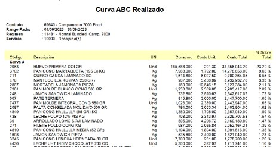
<u>**Regla de Negocio:**</u>
**Validaciones del sistema**
Las siguientes validaciones se ejecutan al presionar **Vista Previa**, en el orden indicado:

| **#** | **Condición que genera error** | **Mensaje del sistema** | **Acción requerida** |
| --- | --- | --- | --- |
| 1 | El código de contrato no existe en la base de datos | No existe contrato | Verificar el código ingresado o usar la búsqueda. |
| 2 | Fecha Inicial es mayor que Fecha Final | Fecha origen Mayor destino | Corregir el rango de fechas. |
| 3 | Las fechas pertenecen a meses distintos | Mes origen mayor destino | El análisis solo abarca un mes calendario. Ajustar fechas. |
| 4 | Las fechas pertenecen a años distintos | Año origen mayor destino | El análisis solo abarca un año. Ajustar fechas. |
| 5 | No se seleccionó ningún régimen en "Lista" | Regimen debe ser informado | Seleccionar al menos un régimen o marcar "Todos". |
| 6 | No se seleccionó ningún servicio en "Lista" | Servicio debe ser informado | Seleccionar al menos un servicio o marcar "Todos". |

Si todas las validaciones pasan, pero no existen datos en la fuente seleccionada para el período y filtros indicados, el informe se genera en blanco (sin páginas).
**Reglas de cálculo**
**1. Restricción de un mes calendario**
El informe solo puede abarcar fechas dentro del mismo mes y año. No es posible generar un análisis que cruce meses.
**2. Cálculo de cantidad y costo total (Planif. Teórico o Real)**
Para cada línea de receta planificada, la cantidad de producto se calcula como:
Cantidad = (cantidad en receta / raciones base de la receta) × raciones planificadas × factor de stock del producto
El costo total de cada línea se calcula como:
Costo total = (cantidad en receta / raciones base de la receta) × raciones planificadas × costo unitario del ingrediente (mic_cospro)
Luego se ajusta por el factor de conversión (pro_facing) del producto:
Costo unitario final = costo unitario × pro_facing
Cantidad final       = cantidad calculada / pro_facing
La fuente de costos unitarios es la tabla b_minutacosto, que contiene el costo validado por contrato, fecha y tipo de minuta. A los costos de la planificación se agrega la **estructura fija diaria** (b_minutafijadia), que contiene los productos con cantidades y costos fijos pre-asignados por día.
**3. Cálculo de cantidad y costo total (Salida de Producción)**
Para cada movimiento de bodega, la cantidad se calcula considerando el signo según el tipo de documento:
Documento tipo SP (Salida de Producción): la cantidad suma positivamente.
Documento tipo DP (Devolución de Producción): la cantidad resta (se descuenta).
Se excluyen documentos con estado A (Anulado) o P (Pendiente).
**4. Porcentajes de corte ABC**
Los umbrales para clasificar los productos en categorías A, B y C se leen de la tabla a_curvaabc:

| **Costo** | **Significado** | **Campo** |
| --- | --- | --- |
| A | Porcentaje acumulado hasta el corte de Curva A 70% | abc_porce |
| B | Porcentaje acumulado hasta el corte de Curva B 20% | abc_porce |
| C | Porcentaje acumulado hasta el corte de Curva C 10% | abc_porce |

El sistema acumula el porcentaje que representa cada producto sobre el total general. Cuando el acumulado supera el umbral de la Curva A, se inicia la Curva B; al superar el umbral de la Curva B, se inicia la Curva C.
**5. Ordenamiento**
Los productos se ordenan de **mayor a menor costo total** antes de aplicar la clasificación. Si dos productos tienen el mismo costo total, se ordenan alfabéticamente por nombre.
**6. Generación por régimen y servicio**
El informe se genera en páginas separadas para cada combinación de régimen y servicio que tenga datos en el período. El resumen de cada sección incluye subtotales por curva y el total general del servicio.
**7. Productos excluidos (Planif. Teórico/Real)**
Para la estructura fija diaria, solo se consideran productos cuya fecha de vencimiento (pro_fecven) sea futura, no tenga fecha, o que tengan stock en bodega (b_bodegas.bod_canmer > 0).
<u>**Tablas**</u><u>**:**</u>

| **Tabla** | **Descripción** | **Rol en este informe** |
| --- | --- | --- |
| a_curvaabc | Parámetros de clasificación ABC: código ('A'/'B'/'C'), nombre y porcentaje de corte. | Define los umbrales de clasificación. Solo lectura. |
| a_servicio | Catálogo de servicios (desayuno, almuerzo, cena, etc.). | Obtiene nombre del servicio para el encabezado. |
| a_regimen | Catálogo de regímenes dietéticos. | Obtiene nombre del régimen para el encabezado. |
| a_unidad | Catálogo de unidades de medida (kg, lt, un, etc.). | Obtiene la unidad abreviada (uni_nomcor) para cada producto. |
| b_minuta | Encabezado de la planificación (cabecera de minuta): contrato, régimen, servicio, fecha. | Filtra minutas por contrato, régimen, servicio y rango de fechas (modos Teórico y Real). |
| b_minutadet | Detalle de la planificación: receta asignada, número de raciones, tipo de minuta, costo de receta. | Aporta el número de raciones (mid_numrac) y el tipo de minuta (mid_tipmin). |
| b_minutacosto | Costo unitario de cada producto por contrato, fecha de vigencia y tipo de minuta. | Fuente del costo unitario de los ingredientes en los modos de planificación. |
| b_minutafijadia | Estructura fija diaria: productos con cantidad y costo fijo asignados directamente por día, sin depender de recetas. | Complementa la planificación (tanto teórica como real) con los productos de estructura fija. |
| b_receta | Maestro de recetas: código, nombre, raciones base (rec_basrac). | Relaciona el código de receta con sus ingredientes y la base de raciones para el cálculo proporcional. |
| b_recetadet | Detalle de ingredientes por receta: producto, cantidad, tipo de receta, centro de costo. | Aporta la cantidad por receta (red_canpro) para el cálculo de consumo. |
| b_ingrediente | Maestro de ingredientes: código, nombre, unidad de medida. | Obtiene el nombre y unidad del ingrediente. |
| b_contlistpreing | Lista de precios de contrato por ingrediente: mapea el código de ingrediente al código de producto pedible (cpi_codped). | Vincula ingrediente con el producto de compra para obtener el código y nombre de producto final. |
| b_productos | Maestro de productos: código, nombre, unidad, factor de stock (pro_facsto), factor de conversión (pro_facing), fecha de vencimiento. | Aporta datos del producto final y los factores de ajuste de cantidad y costo. |
| b_totventas | Encabezado de documentos de movimiento de inventario: tipo (SP/DP), número, cliente, fecha, régimen, servicio, estado. | Fuente del modo Salida de Producción; filtra por tipo SP/DP y excluye anulados y pendientes. |
| b_detventas | Detalle de líneas de cada documento de movimiento: producto, cantidad, precio de costo. | Aporta la cantidad (dev_canmer) y el costo unitario (dev_precos) de cada producto en el modo Salida Prod. |

<u>**Tablas temporales creadas en tiempo de ejecución:**</u>

| **Tabla**** Temporal** | **Descripción** |
| --- | --- |
| <usuario>_tmp_EncCurvaABC | Contiene las combinaciones distintas de régimen, servicio y mes encontradas para los filtros seleccionados. Se elimina al finalizar el informe. |
| <usuario>_tmp_DetCurvaABC | Contiene el detalle de productos, cantidades y costos acumulados para cada combinación régimen/servicio. Se elimina al finalizar el informe. |

<u>**Mejoras:**</u>
Sacar del informe la restricción de meses que saque mas de un mes.

## 9.16. Comparativo Curva ABC

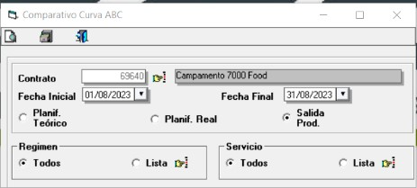
<u>**Descripción:**</u>
Este informe permite comparar el **costo real de cada ingrediente o producto** utilizado durante un período mensual contra el **precio negociado con el proveedor** (lista de precios SAC), clasificando los productos según la metodología de análisis **Curva ABC**.
La Curva ABC organiza los productos en tres grupos según su peso en el costo total del período:
**Curva A** 70%— productos que acumulan el porcentaje más alto del gasto (los más críticos)
**Curva B** 20%— productos de impacto intermedio
**Curva C** 10%— productos de menor impacto en el costo total
Los porcentajes de corte de cada curva (p. ej., A = 70 %, B = 20 %, C = 10 %) se mantienen en el maestro del sistema y son configurables.
El informe admite tres fuentes de datos para la columna de costo comparado:

| **Opción de Pantalla** | **Significado** |
| --- | --- |
| Planif. Teórico | Ingredientes calculados a partir de la planificación teórica de la minuta |
| Planif. Real | Ingredientes calculados a partir de la planificación real de la minuta |
| Salida Prod. | Productos efectivamente despachados según los documentos de salida de bodega (tipo SP/DP) |

En todos los casos, el comparativo se realiza **contra el precio negociado SAC** del mismo período, permitiendo identificar desviaciones entre lo que costó producir y lo que se comprometió en el contrato de abastecimiento.
El resultado es un **informe en formato RTF**, orientación horizontal (landscape), con una página por cada combinación régimen-servicio que tenga datos en el período seleccionado.
**Encabezado de cada página del informe:**

| **Campo** | **Contenido** |
| --- | --- |
| Contrato | Código y nombre del centro de costo |
| Rango Fecha | Fecha inicial y fecha final del período analizado |
| Régimen | Código y nombre del régimen |
| Servicio | Código y nombre del servicio |

**Título del informe según fuente de datos:**

| **Opción seleccionada** | **Título que aparece** |
| --- | --- |
| Planif. Teórico | Comparativo Curva ABC — Planificación Teórico Vs Negociado |
| Planif. Real | Comparativo Curva ABC — Planificación Real Vs Negociado |
| Salida Prod. | Comparativo Curva ABC — Realizado Vs Negociado |

**Estructura de columnas del cuerpo del informe:**

| **Columna** | **Descripción** | **Calculado** |
| --- | --- | --- |
| — | Etiqueta de curva ("Curva A", "Curva B", "Curva C") | No (agrupador visual) |
| Código | Código del producto/ingrediente | No |
| Descripción | Nombre del producto/ingrediente | No |
| UN | Unidad de medida abreviada | No |
| Consumo | Cantidad total consumida/planificada en el período | Sí |
| Costo Unit. | Costo unitario del ingrediente en el período | No (tomado de mic_cospro o dev_precos) |
| Costo Total | Costo total del producto (cantidad × costo unitario) | Sí |
| % Sobre Total | Porcentaje que representa el costo total de este producto sobre el costo total del servicio | Sí |
| Costo Neg. | Precio negociado SAC para este producto en el período | No (tomado de lps_precio) |
| Costo Total (Neg.) | Costo total valorizado al precio negociado (cantidad × precio negociado) | Sí |
| % Difer. Cost. Tot. | Diferencia porcentual entre costo negociado y costo real | Sí |
| Difer. Cost. Tot. | Diferencia absoluta en pesos entre costo real y costo negociado | Sí |

**Filas de subtotales:**
Al finalizar cada grupo de curva (A, B o C) aparece una fila de **Total General Curva X** con:
Costo Total acumulado de la curva
Porcentaje del costo de la curva sobre el total del servicio
Costo Total negociado acumulado
% Diferencia y Diferencia absoluta del grupo
Al final de cada servicio aparece una fila de **Total General Servicio** con los mismos campos, pero sumando las tres curvas.
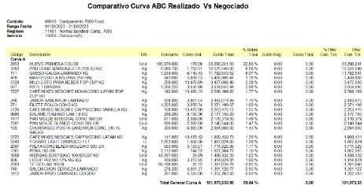
<u>**Regla de Negocio:**</u>
**Validaciones del sistema**
Las siguientes validaciones se ejecutan al presionar **Vista Previa**, en el orden indicado:

| **N°** | **Mensaje del sistema** | **Condición que lo genera** |
| --- | --- | --- |
| 1 | No existe contrato | El código ingresado en el campo de contrato no existe en la tabla de clientes/contratos. |
| 2 | Fecha origen Mayor destino | La Fecha Inicial es posterior a la Fecha Final. |
| 3 | Mes origen mayor destino | El mes de la Fecha Inicial es distinto al mes de la Fecha Final (el informe exige que ambas fechas pertenezcan al mismo mes). |
| 4 | Año origen mayor destino | El año de la Fecha Inicial es distinto al año de la Fecha Final (el informe exige que ambas fechas pertenezcan al mismo año). |
| 5 | Regimen debe ser informado | No hay ningún régimen seleccionado en el marco Régimen. |
| 6 | Servicio debe ser informado | No hay ningún servicio seleccionado en el marco Servicio. |

Si las validaciones pasan pero no existen datos para el rango y filtros indicados, el informe simplemente no genera ninguna página (la función termina sin imprimir nada).
**Reglas de cálculo**
**Cálculo de cantidad e importe según fuente de datos**
Para **Planif. Teórico** o **Planif. Real** (tipmin = '1' ó '2'):
Se recorren todas las recetas planificadas en la minuta para el período, régimen y servicio indicados.
Por cada ingrediente de receta se calcula:
cantidad = (red_canpro / rec_basrac) × mid_numrac × pro_facsto
costo_total = (red_canpro / rec_basrac) × mid_numrac × mic_cospro
donde red_canpro es la cantidad de ingrediente por base de raciones, rec_basrac es la base de raciones de la receta, mid_numrac es el número de raciones planificadas y mic_cospro es el costo unitario vigente del ingrediente en el período.
Adicionalmente, se incorporan los productos de **estructura fija del día** (b_minutafijadia) con su cantidad y costo registrados directamente.
Tras construir la tabla temporal, se ajustan cantidad y costo unitario aplicando el factor de conversión del producto (pro_facing):
mic_cospro_ajustado = mic_cospro × pro_facing
cantidad_ajustada   = cantidad / pro_facing
Para **Salida Prod.** (tipmin = '0'):
Se toman los documentos de salida de bodega de tipo SP (salida de producción) y DP (devolución de producción), excluyendo documentos anulados (tov_estdoc <> 'A') y pendientes (tov_estdoc <> 'P').
La cantidad neta se calcula sumando las salidas y restando las devoluciones:
cantidad = SUM(dev_canmer) si tipdoc = 'SP'  −  SUM(dev_canmer) si tipdoc = 'DP'
costo_total = cantidad_neta × dev_precos
**Cálculo del precio negociado**
Una vez construida la tabla temporal de productos, el sistema actualiza el campo preneg con el precio de la lista SAC correspondiente al período:
Se vincula el producto SGP con su código SAC a través de las tablas b_formatocomprassgp y b_formatocompras.
Se busca el precio en b_sac_listaprecio filtrando por contrato (lps_cencos) y período en formato YYYYMM (lps_periodo).
Si el producto no tiene equivalencia SAC o no existe precio para el período, preneg queda en 0.
**Clasificación Curva ABC**
Se calcula el **costo total general** del servicio sumando todos los costot.
Los productos se ordenan de **mayor a menor** por costo total.
Se recorre la lista acumulando el porcentaje que cada producto representa sobre el total:
porcentaje_acumulado += (costot_producto / costo_total_general) × 100
Cuando el porcentaje acumulado supera el umbral de la Curva A (campo abc_porce donde abc_codigo = 'A'), el siguiente producto inicia la Curva B; al superar el umbral de la Curva B, inicia la Curva C.
Los umbrales se leen de la tabla a_curvaabc al inicio de la función.
**Cálculo de diferencias**
Para cada producto se calculan dos métricas comparativas:

| **Métrica** | **Formula** |
| --- | --- |
| % Diferencia sobre Costo Total | ([cantidad × preneg] / costot − 1) × 100 |
| Diferencia de Costo Total | costot − (cantidad × preneg) |

Un valor positivo en "Diferencia Costo Total" indica que el costo real/planificado **superó** al precio negociado; un valor negativo indica que estuvo **por debajo**.
El informe también acumula totales por Curva (A, B, C) y un **Total General del Servicio**, incluyendo los mismos indicadores de diferencia a nivel agregado.
<u>**Tablas**</u><u>**:**</u>

| **Tabla** | **Descripción** | **Rol en este informe** |
| --- | --- | --- |
| a_curvaabc | Maestro de clasificación ABC. Contiene los tres registros (A, B, C) con su porcentaje de corte (abc_porce). | Define los umbrales de clasificación A/B/C. |
| a_clientes / b_clientes | Tabla de contratos/centros de costo. | Valida que el contrato exista y recupera el nombre. |
| a_servicio | Maestro de servicios de alimentación. | Proporciona código y nombre del servicio. |
| a_regimen | Maestro de regímenes alimenticios. | Proporciona código y nombre del régimen. |
| a_unidad | Maestro de unidades de medida. | Proporciona el nombre abreviado de la unidad (uni_nomcor). |
| b_minuta | Cabecera de la minuta (planificación por fecha, régimen y servicio). | Filtra las minutas del período, contrato, régimen y servicio indicados. |
| b_minutadet | Detalle de recetas por minuta, con número de raciones planificadas (mid_numrac) y tipo de minuta (mid_tipmin). | Aporta las raciones para el cálculo de cantidades. |
| b_receta | Cabecera de receta con base de raciones (rec_basrac). | Permite calcular proporciones de ingredientes. |
| b_recetadet | Detalle de ingredientes por receta, con cantidad por base (red_canpro). | Fuente de los ingredientes y cantidades. |
| b_ingrediente | Maestro de ingredientes con nombre y unidad de medida. | Descripción e identificación del ingrediente. |
| b_minutacosto | Costo vigente de cada ingrediente para un período y tipo de minuta. Clave: contrato, fecha de validez, tipo de minuta, código de producto. | Aporta el costo unitario (mic_cospro) para el cálculo del costo planificado. |
| b_productos | Maestro de productos con factor de conversión almacenamiento (pro_facsto) y factor compras (pro_facing). | Conversión de unidades; también filtra productos vigentes. |
| b_contlistpreing | Lista de ingredientes por contrato con su equivalencia de producto (cpi_codped). | Vincula ingrediente de receta con código de producto en bodega. |
| b_minutafijadia | Estructura fija diaria de productos por régimen, servicio, fecha y tipo de minuta. | Complementa los ingredientes de receta con productos de costo fijo. |
| b_totventas | Cabecera de documentos de salida de bodega (SP: salida producción, DP: devolución producción). | Fuente cuando se elige "Salida Prod."; filtra por tipo de documento, estado y período. |
| b_detventas | Detalle de productos por documento de salida, con cantidad (dev_canmer) y precio de costo (dev_precos). | Aporta cantidades y costos reales de despacho. |
| b_formatocompras | Maestro de artículos SAC (códigos del sistema de abastecimiento centralizado). | Punto de enlace entre SGP y SAC para obtener el precio negociado. |
| b_formatocomprassgp | Tabla de equivalencia entre código SAC (fcs_codsac) y código SGP (fcs_codsgp). | Permite cruzar productos SGP con su precio en la lista SAC. |
| b_sac_listaprecio | Lista de precios negociados SAC por contrato, período (YYYYMM) y artículo SAC (lps_precio). | Provee el precio negociado contra el que se compara el costo planificado o realizado. |

<u>**Mejoras:**</u>
Sacar lista de precio de SAC y considerar los convenios de SAP considerando los impuestos adicionales no recuperable.

## 9.17. Comparativo de Raciones

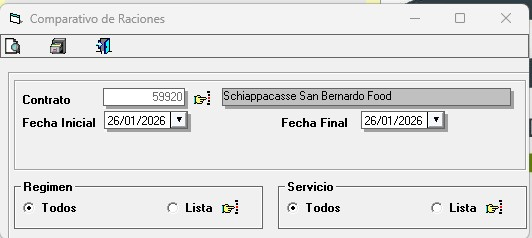
<u>**Descripción:**</u>
El **Comparativo de Raciones** permite revisar, día a día y por combinación de régimen/servicio, cuántas raciones se planificaron, cuántas se produjeron realmente y cómo se distribuyeron entre los distintos destinos (venta, personal Sodexo, muestra de referencia y mermas).
El informe es especialmente útil para:
Detectar diferencias entre lo planificado en teoría y lo realmente producido.
Comparar la planificación real con las raciones efectivamente vendidas (control de venta).
Identificar el peso relativo de las raciones no vendidas (mermas expresadas en raciones equivalentes).
Analizar el consumo de personal y las muestras de referencia dentro del período.
Este informe **no impone restricción de mismo mes ni mismo año** entre la fecha inicial y la fecha final. Es posible solicitar rangos que abarquen varios meses o incluso años distintos, lo que permite análisis de tendencia de largo plazo sin limitaciones de período.

| **Requisito** | **Detalle** |
| --- | --- |
| Contrato | Código de contrato válido y activo en el sistema. Se puede ingresar directamente o buscar con el ícono de búsqueda. |
| Fecha Inicial | Primer día del período a analizar (formato dd/mm/yyyy). El sistema la inicializa con la fecha del día. |
| Fecha Final | Último día del período a analizar (formato dd/mm/yyyy). El sistema la inicializa con la fecha del día. |
| Régimen | Uno o más regímenes del contrato, o la opción "Todos". |
| Servicio | Uno o más servicios del contrato, o la opción "Todos" (marcado por defecto al abrir). |
| Datos en el sistema | Debe existir al menos una minuta planificada o raciones registradas en el período solicitado para que el informe genere contenido. |

No se requieren permisos especiales ni contraseña adicional para ejecutar este informe.
El resultado es un **informe RTF en orientación horizontal (landscape)**, visualizable en la ventana de vista previa del sistema y exportable como archivo .rtf.
**Estructura del informe:**
Cada combinación de régimen + servicio ocupa una página independiente. El encabezado de cada página muestra:

| **Dato** | **Descripción** |
| --- | --- |
| Contrato | Código y nombre del contrato |
| Régimen | Código y nombre del régimen |
| Servicio | Código y nombre del servicio |
| Período | Fecha inicial — Fecha final consultada |

**Tabla de datos (una columna por día del período):**

| **Fila** | **Descripción** | **Fuente** |
| --- | --- | --- |
| Plan. Teó. | Raciones planificadas teóricamente | b_minuta.min_racteo |
| Plan. Rea. | Raciones planificadas en la minuta real | b_minuta.min_racrea |
| Producidas | Raciones efectivamente producidas (requiere registro manual con contraseña) | b_minutaraciones donde mir_rutcli = 'PRODUCIDAS' |
| Ctrl. Venta | Raciones vendidas a comensales (control de venta) | b_minutaraciones para clientes que no son PRODUCIDAS / PERSONAL / MUESTRA R |
| Rac. no Ven. | Raciones equivalentes a la merma de preparación | Calculado: CostoMerma / (CostoReal / RacionesReal) desde b_minutadet |
| Personal Sodexo | Raciones consumidas por personal interno Sodexo | b_minutaraciones donde mir_rutcli = 'PERSONAL' |
| Muestra Referencia | Raciones destinadas a muestra de referencia | b_minutaraciones donde mir_rutcli = 'MUESTRA R' |

**Botón "Histórico Planificación Teórica":** Este botón se activa solo cuando la consulta corresponde exactamente a **un único régimen y un único servicio** y existen datos en el período. Permite navegar al informe histórico de planificación teórica para esa combinación específica, manteniendo el período consultado.
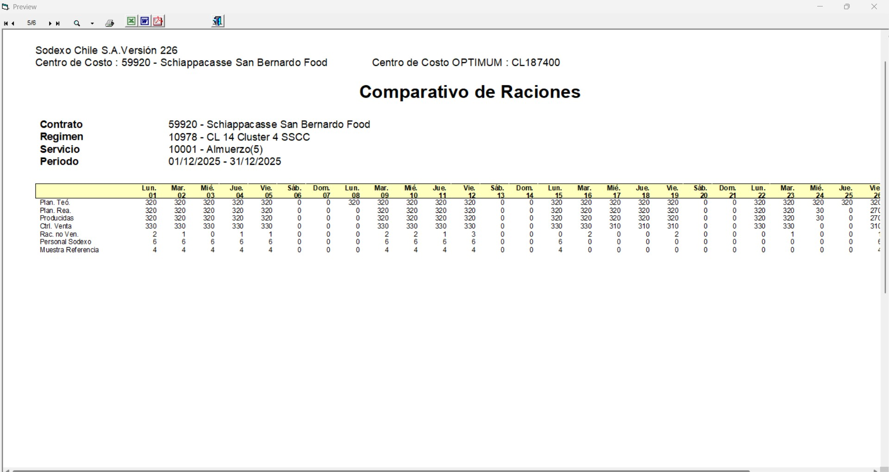
<u>**Regla de Negocio:**</u>
**Validaciones del sistema**

| **N°** | **Mensaje del sistema** | **Causa** |
| --- | --- | --- |
| 1 | No existe contrato | El código de contrato ingresado no existe en la base de datos. |
| 2 | Fecha origen Mayor destino | La Fecha Inicial es posterior a la Fecha Final. |
| 3 | Régimen debe ser informado | Se eligió la opción "Lista" para régimen pero no se seleccionó ninguno. |
| 4 | Servicio debe ser informado | Se eligió la opción "Lista" para servicio pero no se seleccionó ninguno. |

**Reglas de cálculo**
**Cálculo de raciones de merma (Rac. no Ven.):**
Las mermas no se almacenan como un conteo directo de raciones, sino como un costo de merma en la tabla de detalle de minuta. El sistema las convierte a raciones equivalentes aplicando la siguiente fórmula:
Raciones merma = ROUND( CostoMerma / (CostoReal / RacionesReal) , 0 )
Donde:
CostoMerma = suma de (mid_cosrec + mid_cosdes) × mid_nummer (costo por recetas con merma real, mid_tipmin = '2')
CostoReal = suma de (mid_cosrec + mid_cosdes) × mid_numrac (costo total de la planificación real)
RacionesReal = min_racrea (raciones de la planificación real registrada en cabecera)
Esta fórmula solo se aplica cuando RacionesReal > 0 y CostoReal > 0; en caso contrario, las raciones de merma se reportan como 0.
**Clasificación de raciones desde b_minutaraciones:**
Las raciones registradas en la tabla de raciones se distribuyen en las columnas del informe según el campo mir_rutcli:

| **Valor de mir_rutcli** | **Columna en el informe** |
| --- | --- |
| PRODUCIDAS | Producidas |
| PERSONAL | Personal Sodexo |
| MUESTRA R | Muestra Referencia |
| Cualquier otro valor | Ctrl. Venta |

**Segmentación del informe:**
El informe genera una página separada por cada combinación única de régimen + servicio encontrada en los datos. Dentro de cada página, las columnas representan los días del período y las filas representan los tipos de raciones.
<u>**Tablas**</u><u>**:**</u>

| **Tabla** | **Descripción** | **Rol en este informe** |
| --- | --- | --- |
| b_minuta | Cabecera de la planificación diaria (minuta). Contiene las raciones teóricas y reales planificadas por régimen, servicio y fecha. | min_cencos min_codreg min_codser min_fecmin min_racteo min_racrea min_codigo |
| b_minutadet | Detalle de recetas dentro de cada minuta. Almacena los costos de receta y los conteos de mermas por preparación. | mid_codigo (FK a b_minuta) mid_tipmin mid_nummer (cantidad merma) mid_numrac (raciones planificadas) mid_cosrec mid_cosdes |
| b_minutaraciones | Registro de raciones por destino: vendidas, producidas, personal, muestra. Cada fila es una combinación de fecha/régimen/servicio/tipo de comensal. | mir_cencos mir_codreg mir_codser mir_fecmin mir_rutcli mir_nrorac |
| a_regimen | Maestro de regímenes. Solo se consulta para obtener el nombre del régimen a mostrar en el encabezado del informe. | reg_codigo reg_nombre |
| a_servicio | Maestro de servicios. Solo se consulta para obtener el nombre del servicio a mostrar en el encabezado del informe. | ser_codigo ser_nombre |

## 9.18. Raciones no Vendidas (modo por defecto)

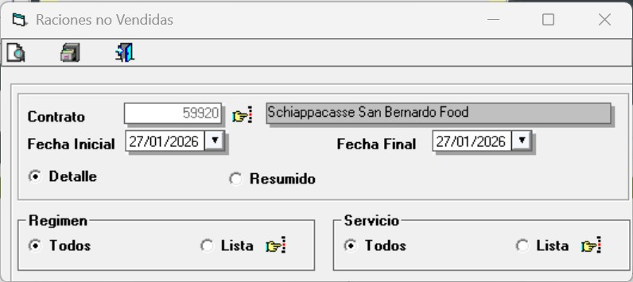
<u>**Descripción:**</u>
Este informe identifica las **recetas que fueron planificadas pero cuyas raciones no se vendieron en su totalidad**, permitiendo además cuantificar el costo económico de esas mermas. En términos operativos, responde a la pregunta: *"¿Cuánto me costó lo que preparé pero no vendí?"*
Para cada combinación de régimen y servicio dentro del período consultado, el informe cruza:
Las **raciones programadas** (mid_numrac) — lo que se planificó producir.
El **número de mermas** (mid_nummer) — lo que efectivamente no se vendió.
El **costo unitario de la receta** (mid_cosrec + mid_cosdes) — congelado al momento del cierre.
Con esa información calcula el costo total de lo programado y el costo total de lo que se perdió, mostrando los resultados agrupados por fecha, régimen y servicio.
El informe solo considera minutas de tipo real (mid_tipmin = '2') y excluye recetas sin raciones programadas ni mermas registradas.

| **Requisito** | **Detalle** |
| --- | --- |
| Contrato | Debe existir en el sistema. Se puede ingresar el código directamente o buscarlo con el ícono de búsqueda. |
| Fecha Inicial | Día desde el cual se consultará (formato dd/mm/yyyy). Se inicializa con la fecha del día. |
| Fecha Final | Día hasta el cual se consultará (formato dd/mm/yyyy). Se inicializa con la fecha del día. |
| Período | La fecha inicial y la final deben pertenecer al mismo mes y año. No se permiten rangos que crucen meses. |
| Régimen | Al menos un régimen debe quedar seleccionado (opción "Todos" o selección manual desde "Lista"). |
| Servicio | Al menos un servicio debe quedar seleccionado (opción "Todos" o selección manual desde "Lista"). |
| Tipo de vista | Elegir entre "Detalle" (por receta y fecha) o "Resumido" (totales por fecha). |
| Datos en BD | Deben existir minutas reales (mid_tipmin='2') con raciones (mid_numrac > 0) y mermas (mid_nummer > 0) en el período indicado para que el informe muestre contenido. |

El informe se genera como un documento **RTF** en orientación **vertical (Portrait)**, con encabezado y pie de página corporativos, y se visualiza directamente en el visor integrado de la aplicación.
**Resumen de tipos disponibles**

| **Vista** | **Nivel de Desglose** | **Columnas Principales** | **Subtotales** |
| --- | --- | --- | --- |
| Detalle | Por receta, dentro de cada fecha, régimen y servicio | Código Recetas Programado Costo Total Costo Merma Merma×Kilo Total Merma | Por fecha Por servicio Total General |
| Resumido | Por fecha, dentro de cada régimen y servicio | Fecha Total Costo Total Merma | Por servicio Total General |

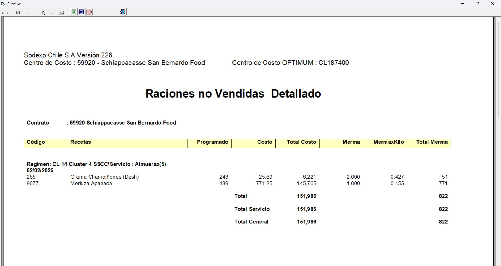
Nota: considerar las columnas merma y mermasxkilo.

**(Detalle) Vista Detallada**
Muestra cada receta que tuvo merma, con todos sus valores económicos desglosados.
**Agrupación del informe:**
Encabezado de grupo: Regimen: [nombre] \ Servicio: [nombre]
Encabezado de fecha: dd/mm/yyyy en negrita
Filas de detalle por receta
Fila de subtotal por fecha: **Total** (columnas Total Costo y Total Merma en negrita)
Fila de subtotal por servicio: **Total Servicio** (al cambiar de régimen/servicio)
Fila final: **Total General** al terminar todos los registros
**Columnas del cuerpo de datos:**

| **#** | **Encabezado** | **Origen** | **Formato** |
| --- | --- | --- | --- |
| 1 | Código | b_receta.rec_codigo | Texto |
| 2 | Recetas | b_receta.rec_nombre | Texto |
| 3 | Programado | b_minutadet.mid_numrac | Número entero |
| 4 | Costo | mid_cosrec + mid_cosdes | Número con 2 decimales |
| 5 | Total Costo | ROUND(mid_numrac × (mid_cosrec + mid_cosdes), 0) | Número entero |
| 6 | Merma | b_minutadet.mid_nummer | Número con 3 decimales (en blanco si es 0) |
| 7 | MermaxKilo | b_minutadet.mid_mermaxcantservida | Número con 3 decimales (en blanco si es 0) |
| 8 | Total Merma | ROUND(mid_nummer × (mid_cosrec + mid_cosdes), 0) | Número entero (en blanco si merma es 0) |

**Orden de los datos:** por régimen (min_codreg), servicio (min_codser), fecha (min_fecmin), línea de detalle (mid_numlin).
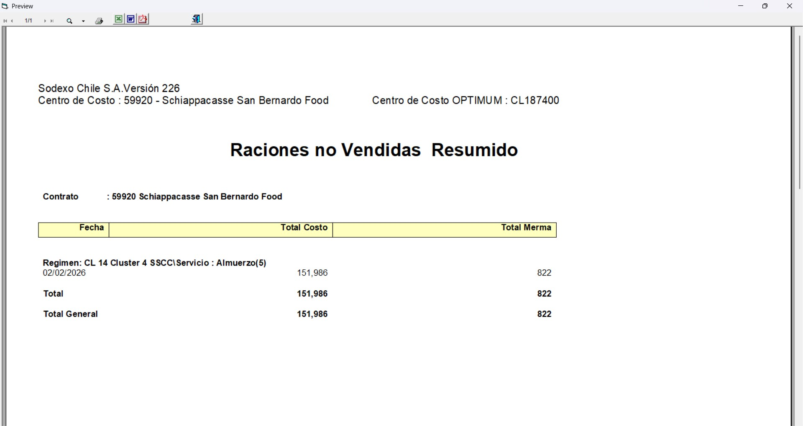
**(Resumido) Vista Resumida**
Muestra el costo total del período agregado por fecha, sin desglosar las recetas individuales.
**Agrupación del informe:**
Encabezado de grupo: Regimen: [nombre] \ Servicio: [nombre]
Filas de detalle por fecha
Fila de subtotal por servicio: **Total** (al cambiar de régimen/servicio)
Fila final: **Total General** al terminar todos los registros
**Columnas del cuerpo de datos:**

| **#** | **Encabezado** | **Origen** | **Formato** |
| --- | --- | --- | --- |
| 1 | Fecha | b_minuta.min_fecmin convertida a dd/mm/yyyy | Fecha |
| 2 | Total Costo | SUM(ROUND(mid_numrac × (mid_cosrec + mid_cosdes), 0)) | Número entero |
| 3 | Total Merma | SUM(ROUND(mid_nummer × (mid_cosrec + mid_cosdes), 0)) | Número entero |

**Orden de los datos:** por fecha (min_fecmin), régimen (min_codreg), servicio (min_codser).
<u>**Regla de Negocio:**</u>
**Validaciones del sistema**
Las siguientes validaciones se ejecutan al pulsar **Vista Previa**, en el orden indicado. Si alguna falla, se muestra el mensaje correspondiente y el informe no se genera.

| **#** | **Mensaje exacto del sistema** | **Condición que lo provoca** |
| --- | --- | --- |
| 1 | No existe contrato | El código de contrato ingresado no existe en la base de datos. |
| 2 | Fecha origen Mayor destino | La Fecha Inicial es posterior a la Fecha Final. |
| 3 | Mes origen mayor destino | La Fecha Inicial y la Fecha Final pertenecen a meses distintos. |
| 4 | Año origen mayor destino | La Fecha Inicial y la Fecha Final pertenecen a años distintos. |
| 5 | Regimen debe ser informado | No hay ningún régimen seleccionado (ni "Todos" ni ninguno de la lista). |
| 6 | Servicio debe ser informado | No hay ningún servicio seleccionado (ni "Todos" ni ninguno de la lista). |

**Nota importante:** Las validaciones 3 y 4 implican que el rango de fechas no puede cruzar meses ni años. El período consultado debe estar completamente dentro de un único mes de un único año.
**Reglas de cálculo**

| **Concepto** | **Fórmula aplicada** |
| --- | --- |
| Costo unitario de receta | mid_cosrec + mid_cosdes (costo de receta + costo de descarte, ambos congelados al momento del cierre) |
| Total Costo (por receta) | ROUND(mid_numrac × (mid_cosrec + mid_cosdes), 0) — costo de las raciones programadas |
| Total Merma (por receta) | ROUND(mid_nummer × (mid_cosrec + mid_cosdes), 0) — costo de las raciones no vendidas |
| Merma×Kilo | mid_mermaxcantservida — cantidad de merma expresada por cantidad servida, según lo registrado en el detalle de minuta |
| Subtotales | Se acumulan por fecha (solo en Detalle), por régimen/servicio, y finalmente un Total General |
| Filtro de datos | Solo se consideran registros con mid_tipmin='2' (minuta real), mid_numrac > 0 y mid_nummer > 0 |

El costo de receta (mid_cosrec) y el costo de descarte (mid_cosdes) se registran en el detalle de minuta en el momento en que se realiza el cierre del período. Una vez cerrado, estos valores no cambian, por lo que el informe siempre refleja el costo vigente al cierre de cada día.
<u>**Tabla**</u><u>**:**</u>

| **Tabla** | **Rol en este informe** | **Campos utilizados** |
| --- | --- | --- |
| b_minuta | Cabecera de la minuta planificada. Define el contrato, régimen, servicio y fecha de cada día. | min_codigo (PK) min_cencos (contrato/centro de costo) min_codreg (código régimen) min_codser (código servicio) min_fecmin (fecha en formato YYYYMMDD) |
| b_minutadet | Detalle de recetas dentro de cada minuta. Contiene las raciones, mermas y costos congelados al cierre. | mid_codigo (FK a b_minuta) mid_codrec (FK a b_receta) mid_tipmin (tipo: '2'=real) mid_numrac (raciones programadas) mid_nummer (merma registrada) mid_cosrec (costo receta congelado) mid_cosdes (costo descarte congelado) mid_mermaxcantservida (merma por cantidad servida) mid_numlin (número de línea para orden) |
| b_receta | Catálogo maestro de recetas. Provee el código y nombre descriptivo de cada preparación. | rec_codigo rec_nombre |
| a_servicio | Catálogo de servicios (casino, cafetería, etc.). Provee el nombre del servicio para encabezados de grupo. | ser_codigo ser_nombre |
| a_regimen | Catálogo de regímenes alimentarios (régimen normal, diabético, hiposódico, etc.). Provee el nombre del régimen para encabezados de grupo. | reg_codigo reg_nombre |

<u>**Mejoras:**</u>
En sistema aparece merma x preparación debe llamar merma línea.

## 9.19. Comparativo de Costos: Planificación Teórica, Real y Realizado

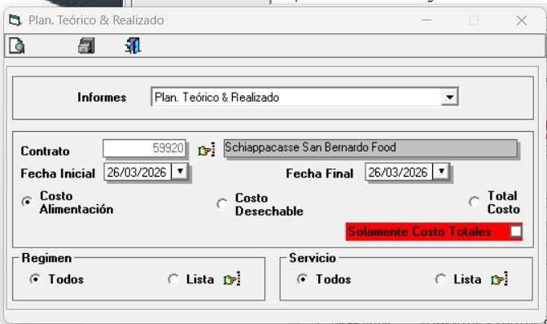
<u>**Descripción:**</u>
Esta pantalla genera informes de comparación de costos de alimentación para un contrato (casino) en un rango de fechas dentro del mismo mes. Permite contrastar, día a día o de forma acumulada, cuánto costó lo que se planificó servir versus lo que efectivamente se sirvió o salió de bodega. Según el tipo de informe elegido, la comparación se establece entre la planificación teórica (minuta teórica aprobada), la planificación real (minuta ajustada con raciones reales confirmadas) y el costo realizado (valor de las salidas de bodega registradas).
La pantalla se abre en dos variantes según cómo se la invoca desde el menú: en la variante "CoTeRe" el usuario puede elegir entre seis tipos de informe que comparan planificación y realizado; en la variante alternativa la pantalla queda restringida al tipo único "Comparativo Plan. Teórico & Negociado", que contrasta el costo planificado con el precio negociado en lista de precios SAC para el período. En ambas variantes, la estructura visual es la misma: una barra de herramientas en la parte superior, un panel de configuración con los campos de cabecera (contrato, fechas, tipo de informe, dimensión de costo y opción de totales), y dos selectores ocultos de régimen y servicio que se cargan al abrir el formulario.
El resultado se entrega siempre como un documento en ventana de vista previa del sistema —que puede exportarse a RTF— con las comparaciones detalladas día a día por cada combinación de régimen y servicio seleccionada, incluyendo costo por bandeja, número de raciones, costo total y desviación entre los escenarios comparados. La pantalla también dispone de un botón "Histórico Planificación Teórica" para consultar períodos anteriores y establecer el rango de fechas automáticamente.

| <u>**Campo**</u> | <u>**Descripción**</u> | <u>**Obligatorio**</u> |
| --- | --- | --- |
| <u>**Contrato**</u> | <u>**Código del contrato (casino) que se desea analizar. Al abrir el formulario se carga automáticamente el contrato asociado al usuario en sesión. Si el usuario tiene permiso de operar en múltiples casinos, puede cambiar el código manualmente o usar el buscador de contratos (icono de lupa junto al campo).**</u> | <u>**Sí**</u> |
| <u>**Fecha Inicial**</u> | <u>**Fecha de inicio del período a analizar, en formato dd/mm/yyyy. Se inicializa con la fecha del día. La fecha debe pertenecer al mismo mes y año que la Fecha Final.**</u> | <u>**Sí**</u> |
| <u>**Fecha Final**</u> | <u>**Fecha de término del período, en formato dd/mm/yyyy. Se inicializa con la fecha del día.**</u> | <u>**Sí**</u> |
| <u>**Informes (lista desplegable)**</u> | <u>**Selector del tipo de informe a generar. Define qué escenarios de costo se comparan y si el período se reporta día a día o en forma acumulada mensual. Ver sección 5 para el detalle de cada opción.**</u> | <u>**Sí**</u> |
| <u>**Tipo de costo (opciones)**</u> | <u>**Define si el informe considera Costo Alimentación (ingredientes de receta), Costo Desechable (materiales descartables), o Total Costo (ambos combinados). Por defecto se selecciona "Costo Alimentación".**</u> | <u>**Sí**</u> |
| <u>**Solamente Costo Totales (casilla)**</u> | <u>**Cuando se activa, el informe omite las columnas de número de raciones y costo por bandeja, mostrando únicamente los montos totales por día. Esta casilla se deshabilita automáticamente para el tipo (6) Comparativo con Negociado.**</u> | <u>**No**</u> |
| <u>**Régimen (selección interna)**</u> | <u>**Lista de regímenes disponibles para el contrato. Al abrir el formulario todos quedan seleccionados ("Todos"). El usuario puede cambiar a "Lista" para filtrar por los regímenes marcados en el selector auxiliar.**</u> | <u>**Sí**</u> |
| <u>**Servicio (selección interna)**</u> | <u>**Lista de servicios disponibles para el contrato. Igual comportamiento que Régimen. Al abrir, todos quedan seleccionados ("Todos").**</u> | <u>**Sí**</u> |

Nota: Los selectores de régimen y servicio se cargan automáticamente al abrir el formulario con todos los regímenes y servicios activos en el sistema. Si se cambia el contrato, se recarga la lista. El usuario debe confirmar que al menos un régimen y un servicio queden incluidos antes de generar el informe.

<u>**Reglas de Negocio:**</u>

| **#** | **Cuando**** aparece** | **Qué verifica el sistema** | **Qué ve o experimenta el usuario** |
| --- | --- | --- | --- |
| 1 | Al presionar "Vista Previa" o al escribir en el campo de contrato | Que el código de contrato exista en la tabla de clientes del sistema | Mensaje: **"No existe contrato"**. El campo queda en blanco y el nombre del contrato desaparece. |
| 2 | Al presionar "Vista Previa" | Que la Fecha Inicial no sea posterior a la Fecha Final | Mensaje: **"Fecha origen Mayor destino"**. El informe no se genera. |
| 3 | Al presionar "Vista Previa" | Que ambas fechas pertenezcan al mismo mes calendario | Mensaje: **"Mes origen mayor destino"**. El informe no se genera. |
| 4 | Al presionar "Vista Previa" | Que ambas fechas pertenezcan al mismo año | Mensaje: **"Año origen mayor destino"**. El informe no se genera. |
| 5 | Al presionar "Vista Previa" | Que haya al menos un régimen seleccionado en el selector | Mensaje: **"Regimen debe ser informado"**. El informe no se genera. |
| 6 | Al presionar "Vista Previa" | Que haya al menos un servicio seleccionado en el selector | Mensaje: **"Servicio debe ser informado"**. El informe no se genera. |
| 7 | Al presionar "Vista Previa" con datos válidos | Que existan registros de planificación para el período, contrato, régimen y servicio indicados | Si no hay datos, el informe finaliza sin mostrar nada. No se emite mensaje de error al usuario. |
| 8 | Al usar "Régimen — Lista" o "Servicio — Lista" | Que el contrato esté cargado antes de abrir el selector auxiliar | Si el contrato está vacío, el buscador auxiliar no se abre. |

**Reglas de cálculo**
El rango de fechas está limitado a un único mes calendario. No es posible generar un informe que cruce dos meses distintos.
La categorización de productos como "alimentación" o "desechable" se determina por el parámetro de sistema ctainsumo (cuenta contable de insumos alimenticios) y ctalimdes (cuenta contable de desechables), configurados en la tabla de parámetros del sistema. El informe solo incluye productos que pertenecen a alguna de esas dos cuentas.
El costo del día para cada régimen/servicio se obtiene de dos fuentes complementarias: (a) el costo de las recetas de la planificación diaria (mid_cosrec × mid_numrac o mid_cosdes × mid_numrac desde b_minutadet), que se suma al costo de recetas cuando corresponde.
El "costo realizado" corresponde al neto de salidas de bodega (tipo documento "SP") menos devoluciones (tipo documento "DP"), filtrando solo documentos no anulados y no pendientes para el casino en sesión.
El número de raciones "realizado" se toma de la fila especial "PRODUCIDAS" en la tabla de raciones (b_minutaraciones). Cuando la opción "Solamente Costo Totales" está activa, la columna de raciones realizado se omite en el informe.
> Comentario - Paz Jorge (2026-03-31): Debe considerar el nuevo campo producida efectiva por receta.
Los valores de costo piso y costo techo se leen desde b_costopatron para cada combinación de régimen, servicio y año-mes, y se muestran en el encabezado de cada sección del informe como referencia.
Para el tipo (6) "Comparativo Plan. Teórico & Negociado", el costo negociado se calcula cruzando los ingredientes de las recetas planificadas con los precios de la lista de convenios SAP vigente para el período (año-mes de la fecha inicial), considerando el formato de compra configurado para el contrato en b_contlistpreing.

<u>**Tablas Relacionadas:**</u>

| <u>**Tabla**</u> | <u>**Para qué se usa en este reporte**</u> | <u>**Campos clave**</u> |
| --- | --- | --- |
| <u>**b_minuta**</u> | <u>**Encabezado de la planificación de minutas (teórica y real)**</u> | <u>**min_cencos, min_codreg, min_codser, min_fecmin, min_racteo, min_racrea, min_indblo**</u> |
| <u>**b_minutadet**</u> | <u>**Detalle de recetas planificadas con costo y número de raciones**</u> | <u>**mid_codigo, mid_tipmin, mid_cosrec, mid_cosdes, mid_numrac, mid_codrec, mid_tiprec**</u> |
| <u>**b_minutafijadia**</u> | <u>**Estructura de costo fijo del servicio registrada por día (complementa el costo de recetas)**</u> | <u>**mfd_cencos, mfd_codreg, mfd_codser, mfd_fecha, mfd_tipmin, mfd_codpro, mfd_canpro, mfd_cospro**</u> |
| <u>**b_minutafija**</u> | <u>**Estructura de costo fijo del servicio general (usada si no hay registro por día)**</u> | <u>**mif_cencos, mif_codreg, mif_codser, mif_fecval, mif_dianro, mif_codpro, mif_canpro**</u> |
| <u>**b_totventas**</u> | <u>**Encabezado de documentos de salida y devolución de bodega (realizado)**</u> | <u>**tov_cencos, tov_fecpro, tov_codreg, tov_codser, tov_tipdoc, tov_estdoc, tov_codbod, tov_numdoc, tov_rutcli**</u> |
| <u>**b_detventas**</u> | <u>**Detalle de productos de cada documento de salida o devolución**</u> | <u>**dev_rutcli, dev_tipdoc, dev_numdoc, dev_codmer, dev_canmer, dev_ptotal**</u> |
| <u>**b_minutaraciones**</u> | <u>**Raciones producidas por día/régimen/servicio (fila "PRODUCIDAS")**</u> | <u>**mir_cencos, mir_fecmin, mir_codreg, mir_codser, mir_rutcli, mir_nrorac**</u> |
| <u>**b_costopatron**</u> | <u>**Costo piso y techo negociado por contrato, **</u><u>**régimen, servicio y mes**</u> | <u>**cpa_cencos, cpa_codreg, cpa_codser, cpa_anomes, cpa_descripcion, cpa_valor**</u> |
| <u>**b_productospmpdia**</u> | <u>**Precio medio ponderado diario de productos (PMP)**</u> | <u>**ppd_cencos, ppd_codpro, ppd_fecdia, ppd_propon**</u> |
| <u>**b_productos**</u> | <u>**Maestro de productos: cuenta contable para clasificar entre alimentación y desechable**</u> | <u>**pro_codigo, pro_ctacon, pro_facing, pro_ctrsto**</u> |
| <u>**a_regimen**</u> | <u>**Maestro de regímenes: nombre del régimen para encabezados del informe**</u> | <u>**reg_codigo, reg_nombre**</u> |
| <u>**a_servicio**</u> | <u>**Maestro de servicios: nombre del servicio para encabezados del informe**</u> | <u>**ser_codigo, ser_nombre**</u> |
| <u>**b_clientes**</u> | <u>**Maestro de contratos: nombre del casino para encabezados del informe**</u> | <u>**cli_codigo, cli_nombre**</u> |
| <u>**b_recetadet**</u> | <u>**Detalle de ingredientes de cada receta (solo tipo 6)**</u> | <u>**red_codigo, red_tiprec, red_codpro, red_canpro, red_cencos**</u> |
| <u>**b_ingrediente**</u> | <u>**Maestro de ingredientes: relaciona ingrediente con producto (solo tipo 6)**</u> | <u>**ing_codigo**</u> |
| <u>**b_contlistpreing**</u> | <u>**Ingredientes habilitados por contrato para lista de precios negociada (solo tipo 6)**</u> | <u>**cpi_cencos, cpi_coding, cpi_codcom, cpi_precos**</u> |
| <u>**b_sac_listaprecio**</u> | <u>**Lista de precios negociados por período SAC (solo tipo 6)**</u> | <u>**lps_cencos, lps_codsac, lps_periodo, lps_precio**</u> |
| <u>**b_formatocompras / b_formatocomprassgp**</u> | <u>**Relación entre formato de compra SAC y producto SGP (solo tipo 6)**</u> | <u>**foc_codsac, fcs_codsac, fcs_codsgp**</u> |
| <u>**p_costrr**</u> | <u>**Tabla de trabajo temporal de sesión usada solo por la función de envío ("Enviar SGP Inf.") para acumular **</u><u>**resultados antes de transmitir. No persiste entre sesiones.**</u> | <u>**trr_cencos, trr_usuario**</u> |
| <u>**a_param**</u> | <u>**Parámetros del sistema: cuentas contables ctainsumo y ctalimdes que clasifican alimentación vs. desechable**</u> | <u>**par_codigo, par_valor**</u> |

### 9.19.1. Plan. Teórico & Realizado

<u>**Formato Salida:**</u>

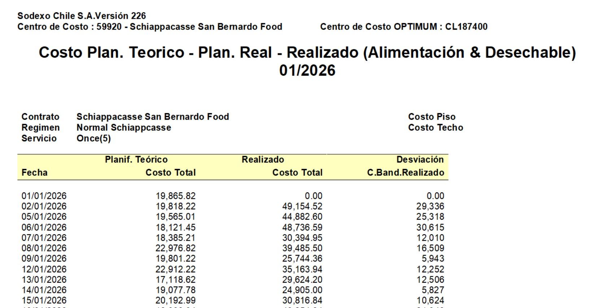
<u>**Descripción:**</u>
Compara día a día el costo de la planificación teórica (minuta teórica aprobada, tipmin='1') con el costo realizado (salidas netas de bodega). Por cada combinación de régimen y servicio se genera una sección con una fila por día del período.
**Orientación del documento:** Vertical (portrait) para los tipos (0) y (1); horizontal (landscape) para el tipo (2).
**Opciones de configuración disponibles:**
Tipo de costo: Alimentación, Desechable o Total.
"Solamente Costo Totales": muestra solo montos totales, sin costo por bandeja ni raciones.
Estructura de datos del informe:
Cada sección del informe tiene un encabezado con contrato, régimen, servicio y los valores de costo piso y techo del mes. La tabla de detalle por día contiene las columnas:

| **Campo en el informe** | **Qué representa** | **Calculado** |
| --- | --- | --- |
| Fecha | Día del período (dd/mm/yyyy) | No |
| Costo Bandeja — Plan. Teórico | Costo unitario por ración de la planificación teórica ese día | Sí |
| Nro. Rac. — Plan. Teórico | Número de raciones planificadas teóricamente (min_racteo) | No |
| Costo Total — Plan. Teórico | Monto total planificado teórico del día | No |
| Costo Bandeja — Realizado | Costo unitario por ración según salidas de bodega ese día | Sí |
| Nro. Rac. — Realizado | Número de raciones producidas registradas ("PRODUCIDAS EFECTIVAS") | No |
| Costo Total — Realizado | Monto neto de salidas de bodega del día (SP menos DP) | No |
| Desviación | Diferencia entre costo bandeja realizado y teórico | Sí |

<u>**Regla de Negocio:**</u>

Al final de cada sección aparece una fila "Total" con la acumulación del período y una fila "T. General" con el total de todos los regímenes/servicios incluidos.
Cálculo — Costo Bandeja — Plan. Teórico
Cuando la opción "Solamente Costo Totales" está inactiva:
Costo Bandeja Teórico = Costo Total Teórico del día ÷ Nro. Rac. Teóricas del día
Cuando la opción está activa, se muestra el Costo Total directamente.
Cálculo — Desviación
Desviación = Costo Bandeja Realizado − Costo Bandeja Teórico
Si la opción "Solamente Costo Totales" está activa:
Desviación = Costo Total Realizado − Costo Total Teórico
Estructura del archivo generado: Documento RTF exportado con vista previa, en orientación vertical. Organizado por sección (una por cada combinación régimen/servicio), con encabezado de página del sistema y número de página al pie.

### 9.19.2. Plan. Real & Realizado

<u>**Formato Salida:**</u>
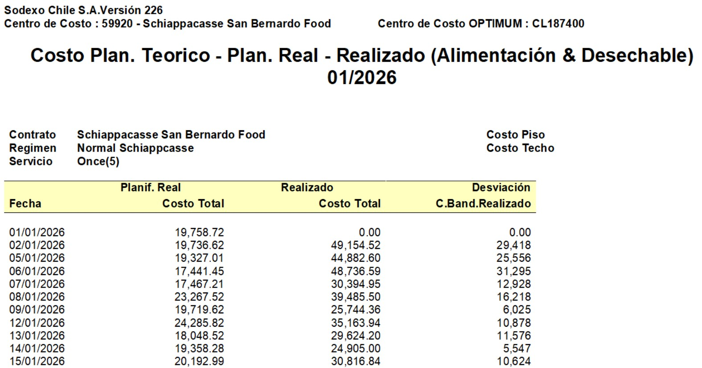
<u>**Descripción:**</u>
Compara día a día el costo de la planificación real (minuta con raciones reales confirmadas, tipmin='2') con el costo realizado (salidas netas de bodega). La estructura de columnas es idéntica a la del tipo (0), reemplazando "Plan. Teórico" por "Plan. Real" en los encabezados.
**Orientación del documento:** Vertical (portrait).
**Opciones de configuración:** Igual que el tipo (0).
**Estructura de datos del informe:**

| **Campo en el informe** | **Qué representa** | **Calculado** |
| --- | --- | --- |
| Fecha | Día del período (dd/mm/yyyy) | No |
| Costo Bandeja — Plan. Real | Costo unitario por ración de la planificación real ese día | Sí |
| Nro. Rac. — Plan. Real | Número de raciones reales confirmadas (min_racrea) | No |
| Costo Total — Plan. Real | Monto total de la planificación real del día | No |
| Costo Bandeja — Realizado | Costo unitario según salidas de bodega ese día | Sí |
| Nro. Rac. — Realizado | Número de raciones producidas registradas ("PRODUCIDAS REALES") | No |
| Costo Total — Realizado | Monto neto de salidas de bodega del día | No |
| Desviación | Diferencia entre costo bandeja realizado y plan real | Sí |

<u>**Regla de Negocio:**</u>
**Cálculo — Desviación**
Desviación = Costo Bandeja Realizado − Costo Bandeja Plan. Real

**Plan. Teórico & Plan. Real & Realizado**
<u>**Formato Salida:**</u>
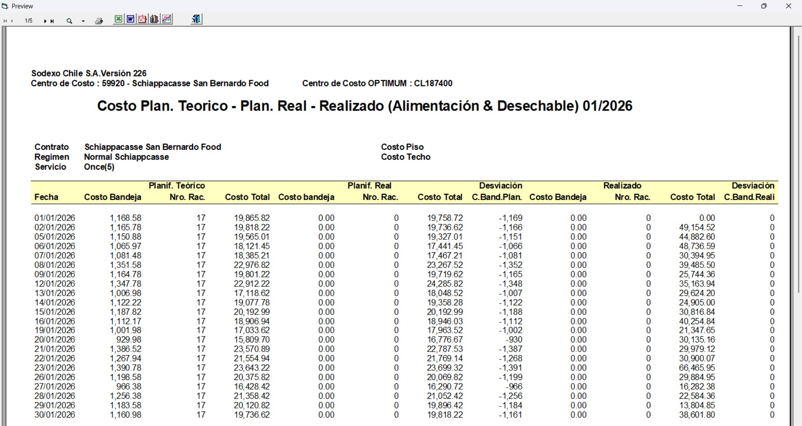
<u>**Descripción:**</u>
Presenta los tres escenarios en simultáneo: planificación teórica, planificación real y realizado (salidas de bodega). Permite ver en una sola vista si la planificación real se ajustó respecto a la teórica y cuánto difirió el realizado de ambas planificaciones. Consulta tanto la minuta teórica (tipmin='1') como la minuta real (tipmin='2').
**Orientación del documento:** Horizontal (landscape), porque requiere más columnas.
**Estructura de datos del informe:**

| **Campo en el informe** | **Qué representa** | **Calculado** |
| --- | --- | --- |
| **Fecha** | **Día del período** | **No** |
| **Costo Bandeja — Plan. Teórico** | **Costo unitario teórico del día** | **Sí** |
| **Nro. Rac. — Plan. Teórico** | **Raciones planificadas teóricas** | **No** |
| **Costo Total — Plan. Teórico** | **Monto total teórico del día** | **No** |
| **Desviación Plan. Real vs Teórico** | **Diferencia de costo bandeja entre planificación real y teórica** | **Sí** |
| **Costo Bandeja — Plan. Real** | **Costo unitario de la planificación real** | **Sí** |
| **Nro. Rac. — Plan. Real** | **Raciones reales confirmadas** | **No** |
| **Costo Total — Plan. Real** | **Monto total planificación real** | **No** |
| **Costo Bandeja — Realizado** | **Costo unitario según salidas de bodega** | **Sí** |
| **Nro. Rac. — Realizado** | **Raciones producidas**** real****es**** registradas** | **No** |
| **Costo Total — Realizado** | **Monto neto de salidas de bodega** | **No** |
| **Desviación Realizado vs Plan. Real** | **Diferencia de costo bandeja entre realizado y planificación real** | **Sí** |

<u>**Regla de Negocio:**</u>

### 9.19.3. Plan. Teórico & Realizado Acumulado

<u>**Formato Salida:**</u>
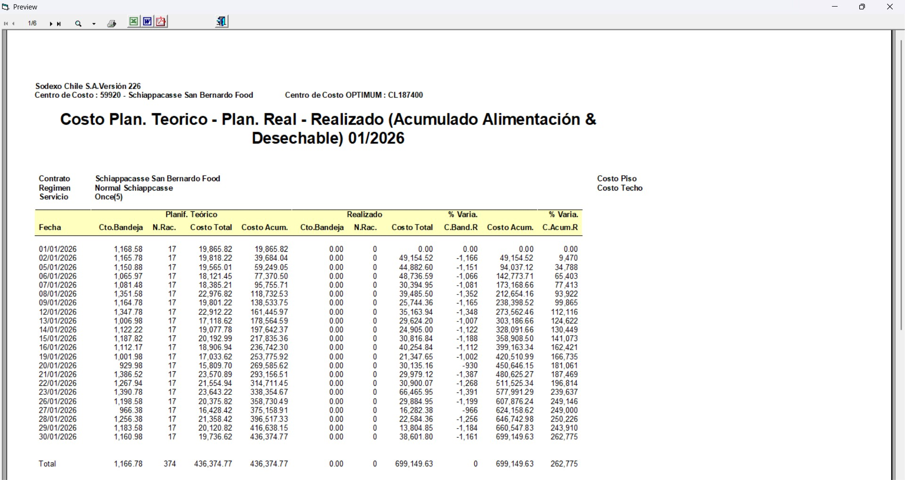
<u>**Descripción:**</u>
Es igual que el informe plan. Teórico & Realizado en cuanto a escenarios comparados (teórico vs. realizado), pero en lugar de mostrar un detalle día por día presenta el acumulado del período como un único total para cada régimen/servicio. Útil para una visión de resumen mensual sin el detalle diario.
**Opciones de configuración:** Igual que el informe plan. Teórico & Realizado.
**Estructura de datos del informe:** Igual que el informe plan. Teórico & Realizado, pero sin la columna Fecha —una sola fila de total por combinación de régimen y servicio, más el total general al final.
<u>**Regla de Negocio:**</u>

### 9.19.4. Plan. Real & Realizado Acumulado

<u>**Formato Salida:**</u>
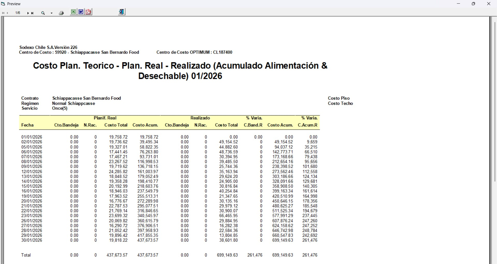
<u>**Descripción:**</u>
Este informe planificación real vs. realizado, pero en modo acumulado mensual, sin detalle diario.
**Estructura de datos del informe:** Este informe planificación real vs. Realizado, pero presentado como totales acumulados del período por régimen/servicio.

<u>**Regla de Negocios:**</u>

**Plan. ****Teórico**** & Plan. Real Realizad****o**** Acumulado**
<u>**Formarto Salida:**</u>
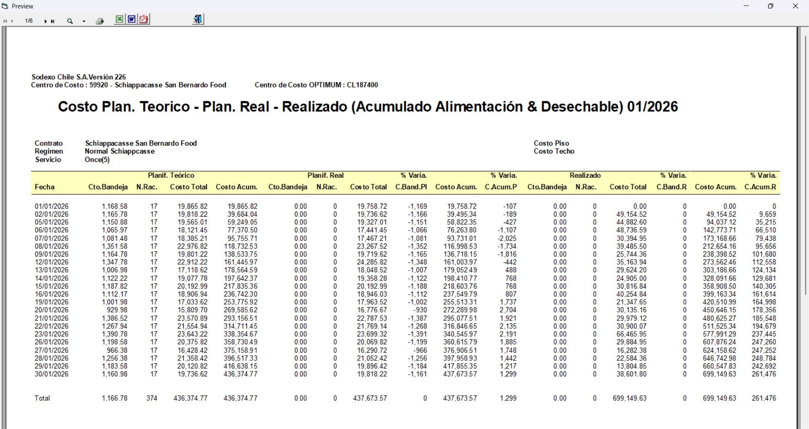
<u>**Descripción:**</u>
Equivalente al mismo informe plan. Teórico vs. Real vs. Realizado, pero en modo acumulado mensual. Muestra los tres escenarios (teórico, real y realizado) como totales del período para cada combinación de régimen/servicio.

<u>**Regla de Negocio:**</u>

### 9.19.5. Comparativo Plan. Teórico & Negociado

<u>**Formato Salida:**</u>
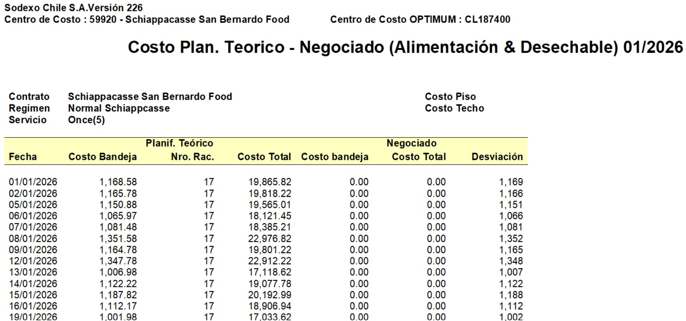

<u>**Descripción:**</u>
Compara el costo de la planificación teórica con el costo que habría tenido esa planificación si los ingredientes se hubieran valorizado al precio negociado en la lista de precios SAP vigente para el mes del período. Permite detectar cuánto difiere el costo según receta (PMP histórico) del costo según precios comprometidos con el proveedor. Solo disponible desde la variante de formulario "PlaTei" o cuando lc_Aux ≠ "CoTeRe".
**Restricciones propias del tipo:**
La casilla "Solamente Costo Totales" está deshabilitada para este tipo.
Solo usa la minuta teórica (tipmin='1'); la minuta real no se incluye.
El precio negociado se obtiene del período año-mes de la Fecha Inicial (b_sac_listaprecio.lps_periodo). Si no hay precios negociados registrados para el período, los montos negociados aparecen en cero.
**Orientación del documento:** Vertical (portrait).

<u>**Regla de Negocio:**</u>
**Cómo se calcula el costo negociado:**
El sistema reconstruye el costo de cada receta planificada cruzando:
Los ingredientes de la receta (b_recetadet).
Los ingredientes habilitados para el contrato en la lista de precios negociada (b_contlistpreing).
El precio negociado del período desde la lista de precios SAC (b_sac_listaprecio), dividido por el factor de rendimiento del producto (pro_facing).
El resultado es el costo negociado por ración para cada receta de la planificación.
**Estructura de datos del informe:**

| **Campo en el informe** | **Qué representa** | **Calculado** |
| --- | --- | --- |
| Fecha | Día del período | No |
| Costo Bandeja — Plan. Teórico | Costo por ración según receta valorizada a PMP | Sí |
| Nro. Rac. — Plan. Teórico | Raciones planificadas teóricas del día | No |
| Costo Total — Plan. Teórico | Monto total teórico del día | No |
| Costo Bandeja — Negociado | Costo por ración valorizado a precio negociado SAC | Sí |
| Nro. Rac. — Negociado | Igual que Nro. Rac. Teórico (misma planificación) | No |
| Costo Total — Negociado | Monto total al precio negociado del día | Sí |
| Desviación | Diferencia entre costo bandeja negociado y teórico | Sí |

**Cálculo — Desviación**
Desviación = Costo Bandeja Negociado − Costo Bandeja Teórico
Una desviación negativa indica que los precios negociados son más convenientes que el PMP valorizado en la planificación.
<u>**Mejoras:**</u>
El informe Comparativo Plan. Teórico & Negociado, debe considerar los convenios de SAP y además que aplique los impuestos adicionales.

## 9.20. Ficha Stock

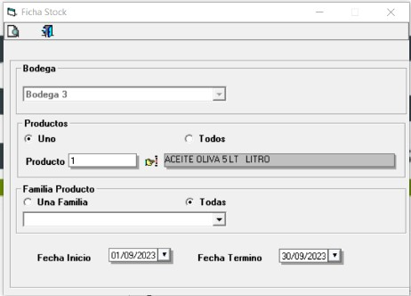
<u>**Descripción:**</u>
La pantalla Ficha Stock entrega el historial completo de movimientos de inventario para uno o más productos dentro de un período de fechas definido. Para cada producto seleccionado, el informe muestra cronológicamente todas las transacciones que afectaron su stock: el inventario inicial con el que se parte, las entradas (compras a proveedores, traspasos recibidos, devoluciones de clientes, ajustes de entrada), y las salidas (consumo en producción, traspasos enviados, mermas, ventas directas, ventas de cafetería, ajustes de salida). Junto a cada movimiento se indica la cantidad involucrada, el costo unitario y el total del movimiento.
Lo que distingue a este informe de un simple listado de transacciones es que, además de mostrar cada movimiento individualmente, el sistema calcula y actualiza de forma acumulada la cantidad disponible en bodega y el Precio Medio Ponderado (PMP) tras cada operación. Esto permite ver, línea a línea, cómo evolucionó el stock y su valorización a lo largo del período.
El informe permite filtrar por un único producto o por todos los que tengan movimientos de PMP registrados en el período. Adicionalmente, es posible acotar la consulta a una familia de productos específica, lo que facilita el análisis por categoría (carnes, lácteos, verduras, etc.). El resultado se presenta como un documento RTF con vista previa en pantalla, generándose una sección por cada producto que tenga datos en el período.

| **Campo** | **Descripción** | **Obligatorio** |
| --- | --- | --- |
| Bodega | Bodega del casino activo. Se carga automáticamente al abrir la pantalla y no puede ser modificada por el usuario. | Automático |
| Fecha Inicio | Fecha desde la cual se buscan movimientos de stock (formato dd/mm/yyyy). Se inicializa con la fecha del día. | Sí |
| Fecha Término | Fecha hasta la cual se buscan movimientos de stock (formato dd/mm/yyyy). Se inicializa con la fecha del día. | Sí |
| Productos — Todos | Opción predeterminada. Incluye en el informe todos los productos con control de stock que registren PMP en el período. | No (es el valor por defecto) |
| Productos — Uno | Restringe el informe a un único producto. Al seleccionarlo, se habilita el campo de código y el ícono de búsqueda. | No (opcional) |
| Código de producto | Código del producto a consultar. Solo activo cuando se selecciona la opción "Uno". Se puede ingresar directamente o buscar mediante el ícono lupa. | Solo si se eligió "Uno" |
| Familia Producto — Todas | Opción predeterminada. No aplica filtro por familia. | No (es el valor por defecto) |
| Familia Producto — Una Familia | Restringe el informe a los productos pertenecientes a la familia seleccionada en el combo. | No (opcional) |

**Nota:** La bodega queda determinada por el casino con el que el usuario inició sesión. No es un parámetro editable; el sistema la utiliza internamente para filtrar todos los documentos de movimiento.
El informe genera un documento **RTF** en orientación **vertical (Portrait)**, con vista previa en pantalla y opción de impresión. El documento contiene:
**Encabezado de página:** membrete del casino (logo + datos de la empresa), con pie de página numerado.
**Título general:** "Informe Ficha Stock" centrado en la parte superior.
**Sección por familia de producto:** título de la familia (nombre obtenido desde a_tipopro) como encabezado de grupo, en negrita.
**Sección por producto:** código y nombre del producto como encabezado, seguido de una tabla de movimientos cronológicos para ese producto.
**Tabla de movimientos:** una fila por transacción, con las columnas descritas a continuación. La tabla se ordena por nombre de producto, fecha, tipo de documento y número de documento.
Si un producto no tiene movimientos en el período y la cantidad del inventario inicial es cero, no se genera ninguna sección para ese producto.
**Estructura de datos del informe:**

| **Campo** | **Descripción** | **Calculado** |
| --- | --- | --- |
| Fecha | Fecha del movimiento (dd/mm/yyyy) | No |
| Tipo Movimiento | Descripción textual del tipo: "Inventario Inicial", "Entrada", "Salida", "Ajuste Inventario (+)", "Ajuste Inventario (-)" | No |
| Tipo Doc. | Sigla del tipo de documento de origen (ej: FA, SP, DP, TR, ME, AI, SE, DE, VC) | No |
| Número Doc. | Número del documento que originó el movimiento | No |
| Cantidad Movimiento | Unidades involucradas en la transacción | No |
| Costo Movimiento | Costo unitario del movimiento en pesos | Sí (ver cálculo proveedores) |
| Total Movimiento | Monto total del movimiento = Cantidad × Costo | Sí |
| Cantidad Stock | Saldo acumulado en bodega después del movimiento | Sí |
| Precio Medio Ponderado | PMP vigente después del movimiento, o PMP registrado en b_productospmpdia para esa fecha | Sí |
| Total Costo | Valorización del stock = Cantidad Stock × PMP | Sí |

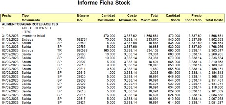
<u>**Reglas de Negocio:**</u>
**Validaciones del sistema**

| **#** | **Cuando Aparece** | **Que verifica el sistema** | **Que ve el usuario** |
| --- | --- | --- | --- |
| 1 | Al abandonar el campo de código de producto (opción "Uno" activa) | Que el código ingresado exista en el maestro de productos (b_productos) para el casino activo | Mensaje: "Producto no existe..." y el campo queda vacío para reingresar |

**Nota:** No existen validaciones de rango de fechas en este modo. El usuario debe asegurarse de ingresar un período coherente (Fecha Inicio ≤ Fecha Término).
**Reglas de cálculo**
El informe aplica dos cálculos acumulativos que se actualizan línea a línea al recorrer los movimientos de cada producto:
**Saldo de bodega acumulado:**
Se inicializa con la cantidad del inventario inicial (tin_stofis).
Cada movimiento de tipo "Entrada" o "Ajuste Inventario (+)" suma su cantidad al saldo.
Cada movimiento de tipo "Salida" o "Ajuste Inventario (-)" resta su cantidad al saldo.
**Precio Medio Ponderado (PMP) acumulado:**
El inventario inicial establece el PMP de arranque (tin_propon).
Para cada movimiento posterior:
Si el denominador (cantidad_mov + saldo_bode) es cero, el PMP pasa a ser el costo del movimiento actual.
Si no: PMP_nuevo = (cantidad_mov × costo_mov + saldo_bodega × PMP_anterior) / (cantidad_mov + saldo_bodega)
Los valores negativos de saldo o cantidad se tratan como cero para este cálculo (se usa Max(valor, 0)).
Para cada fila del informe, si no existe un PMP diario registrado en b_productospmpdia para ese producto y esa fecha, se usa el costo del movimiento actual como PMP de referencia para la columna "Precio Medio Ponderado".
**Costo unitario en entradas de proveedor:**
Se toma el precio de recepción (dec_prerec) descontado el porcentaje de descuento (dec_pctdes) y se suma el impuesto por unidad (imd_monimp / dec_canrec, cuando el impuesto aplica al costo) y el flete por unidad (dec_prefle / dec_canrec, cuando exista).
Fórmula: Costo_unitario = dec_prerec × (1 - pctdes/100) + (impuesto / cantidad) + (flete / cantidad)
**Cálculo — Total Movimiento**

| **Componente** | **Descripción** |
| --- | --- |
| Cantidad Movimiento | Cantidad de unidades del movimiento (dev_canmer, dec_canrec, dvp_candig, etc.) |
| Costo Movimiento | Costo unitario calculado o registrado según el tipo de documento |
| Fórmula | Total Movimiento = Cantidad Movimiento × Costo Movimiento |

**Cálculo — Cantidad Stock**

| **Componente** | **Descripción** |
| --- | --- |
| Saldo inicial | tin_stofis del último inventario físico anterior a Fecha Inicio |
| Entradas acumuladas | Suma de cantidades de todos los movimientos de tipo "Entrada" y "Ajuste Inventario (+)" hasta la fila actual |
| Salidas acumuladas | Suma de cantidades de todos los movimientos de tipo "Salida" y "Ajuste Inventario (-)" hasta la fila actual |
| Fórmula | Cantidad Stock = Saldo inicial + Entradas acumuladas − Salidas acumuladas |

**Cálculo — Precio Medio Ponderado (PMP acumulado)**

| **Componente** | **Descripción** |
| --- | --- |
| PMP_anterior | PMP calculado en la fila inmediatamente anterior (o tin_propon para la primera fila) |
| Saldo_bodega | Cantidad Stock antes de incorporar el movimiento actual (mínimo 0) |
| Cantidad_mov | Cantidad del movimiento actual (mínimo 0) |
| Costo_mov | Costo unitario del movimiento actual |
| Fórmula | Si (Cantidad_mov + Saldo_bodega) = 0 → PMP = Costo_mov; si no: PMP = (Cantidad_mov × Costo_mov + Saldo_bodega × PMP_anterior) / (Cantidad_mov + Saldo_bodega) |

**Cálculo — ****Total Costo**

| **Componente** | **Descripción** |
| --- | --- |
| Cantidad Stock | Saldo acumulado después del movimiento actual |
| PMP | PMP registrado en b_productospmpdia para esa fecha/producto, o el PMP acumulado calculado si no existe registro diario |
| Fórmula | Total Costo = Cantidad Stock × PMP |

**Tipos de movimiento incluidos en el informe:**

| **Código Interno** | **Descripción visible** | **Dirección** |
| --- | --- | --- |
| 00 | Inventario Inicial | Punto de partida (sin efecto entrada/salida) |
| 10 | Entrada — Proveedores (FA, FE, GD, etc.) | Entrada |
| 20 | Entrada — Traspaso recibido (TR) | Entrada |
| 25 / 90 | Ajuste Inventario (+) (AI tipo "A") | Entrada |
| 90 | Ajuste Inventario (-) (AI tipo distinto de "A") | Salida |
| 40 | Salida — Producción / Servicio Especial (SP, SE, VC) | Salida |
| 50 | Entrada — Devolución de producción / Servicio Especial (DP, DE) | Entrada |
| 60 | Salida — Traspaso enviado (TR) | Salida |
| 70 | Salida — Mermas (ME) | Salida |
| 80 | Salida — Venta directa (FA, FE, GD con mueve inventario) | Salida |

<u>**Tablas:**</u>

| **Tabla** | **Rol en el informe** |
| --- | --- |
| b_productos | Maestro de productos. Provee nombre, código de familia (pro_codtip), unidad de medida y flag de control de stock (pro_ctrsto). Solo se incluyen productos con pro_ctrsto = 1. |
| b_productospmpdia | Registro diario del Precio Medio Ponderado y saldo por producto y casino. Se usa para: (1) determinar qué productos tienen PMP en el período (lista base del informe) y (2) obtener el PMP oficial del día para la columna "Precio Medio Ponderado". |
| b_tomainv | Toma de inventario físico. Proporciona el saldo y PMP del inventario inicial más reciente anterior a la Fecha Inicio (tin_stofis, tin_propon, tin_fectom). |
| b_totventas | Cabecera de documentos de movimiento interno: ajustes de inventario (AI), traspasos (TR), mermas (ME), salidas a producción (SP), devoluciones de producción (DP). |
| b_detventas | Detalle de los documentos anteriores. Provee cantidades (dev_canmer, dev_canmin) y costo unitario (dev_precos) por producto. |
| b_totcompras | Cabecera de documentos de compra a proveedores. Provee fecha de remisión (toc_fecrem) y tipo/número de documento. |
| b_detcompras | Detalle de las compras. Provee cantidad recibida (dec_canrec), precio de recepción (dec_prerec), descuento (dec_pctdes) y flete (dec_prefle). |
| b_detcomprasimp | Detalle de impuestos de compra. Permite calcular el monto de impuesto que se incorpora al costo unitario cuando el impuesto está marcado como incluido en costo (imp_inccos = 1). |
| a_impuesto | Maestro de impuestos. Indica si el impuesto se suma al costo (imp_inccos). |
| b_totventaserviciosespeciales | Cabecera de documentos de servicios especiales (SE = salida, DE = devolución). |
| b_detventaserviciosespeciales | Detalle de servicios especiales. Provee cantidades y precio por producto. Consultado a través del SP sgp_Sel_ListarDevVentaServiciosEspecialesStock. |
| b_totventascaf | Cabecera de ventas de cafetería. |
| b_detventascafpro | Detalle de ventas de cafetería por producto. Provee cantidad digitada (dvp_candig) y costo (dvp_precos). Solo se incluyen cierres confirmados (tvc_estado = 'C'). |
| a_tipopro | Maestro de familias de producto. Se usa para mostrar el nombre de la familia como encabezado de grupo en el informe y para filtrar por familia cuando el usuario lo solicita. |
| a_tipoajuste | Maestro de tipos de ajuste de inventario. Indica si un ajuste es positivo ("A") o negativo. |
| a_tiposervicio | Maestro de tipos de servicio. Se usa para filtrar productos compatibles con el tipo de servicio del casino. |
| b_clientes | Maestro de clientes/casinos. Se usa para obtener el tipo de servicio del casino activo y así filtrar los productos aplicables. |
| a_tipodocumento | Maestro de tipos de documento. Se excluyen de las compras los documentos marcados como "SN" (sin nota), "NC" (nota de crédito) y "CE". |

## 9.21. Detalle Cartola de Inventario

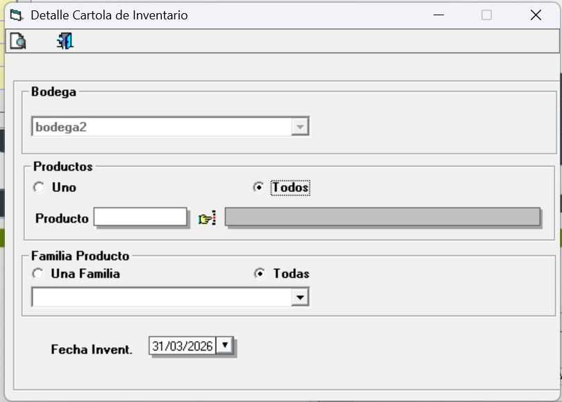

<u>**Descripción:**</u>
Este informe muestra el estado valorizado del inventario de bodega en una fecha específica. Para cada producto que tenía saldo en esa fecha, se indica cuántas unidades había en stock, el precio promedio ponderado (PMP) vigente a ese día y el valor total resultante.
A diferencia de otros informes del módulo que trabajan con rangos de fechas, este informe trabaja con **una sola fecha** (la "Fecha Inventario"), mostrando una fotografía del inventario en ese momento. Los productos se agrupan por familia de producto y, al final de cada familia y del informe completo, se calculan subtotales y un total general valorizado.
El resultado se genera en formato RTF (vista previa imprimible) y simultáneamente se exporta a un archivo de texto delimitado por | (compatible con Excel).
**Encabezado del informe**

| **Campo** | **Valor** |
| --- | --- |
| Título | "Informe Detalle Cartola de Inventario" |
| Fecha Inventario | Fecha seleccionada en formato dd/mm/yyyy |

**Estructura del cuerpo (por producto)**
Los productos se presentan agrupados por familia. Antes de cada grupo se imprime el nombre de la familia en negrita (obtenido desde a_tipopro). Las columnas del detalle son:

| **Columna** | **Origen** | **Descripción** |
| --- | --- | --- |
| Código Producto | b_productos.pro_codigo | Identificador único del producto |
| Descripción | b_productos.pro_nombre | Nombre del producto |
| Unidad | a_unidad.uni_nomcor | Abreviatura de la unidad de medida (ej.: KG, LT, UN) |
| Saldo | b_productospmpdia.ppd_saldo | Cantidad en stock a la fecha indicada |
| Precio PMP | b_productospmpdia.ppd_propon | Precio promedio ponderado vigente a esa fecha |
| Total | ppd_saldo × ppd_propon | Valorización del saldo (calculado en la consulta) |

**Totales al final de cada familia y del informe**

| **Nivel** | **Descripción** |
| --- | --- |
| Total (por familia) | Suma de la columna "Total" de todos los productos de esa familia |
| Total General | Suma de todos los subtotales de familia; aparece al final del informe separado por una fila en blanco |

**Ordenamiento**
Los productos se presentan ordenados por familia (pro_codtip) y luego por nombre del producto (pro_nombre) dentro de cada familia.
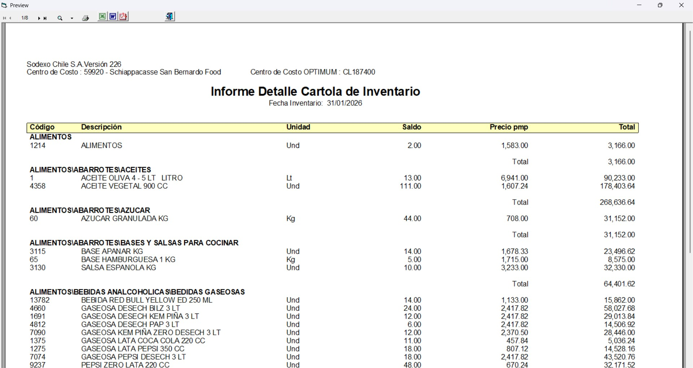
<u>**Regla de Negocio:**</u>
**Validaciones del sistema**
**Producto inexistente:** Si el usuario elige filtrar por un producto específico y escribe un código que no existe en b_productos, al salir del campo aparece el mensaje "Producto no existe..." y el código queda en blanco.
**Sin datos para la fecha:** Si la consulta no retorna filas (porque no hubo cierre para esa fecha, o no hay productos con saldo distinto de cero y PMP distinto de cero), el sistema muestra el mensaje "No existe información" y cancela la generación del informe.
**Exclusión de saldo cero y PMP cero:** El informe filtra automáticamente los productos cuyo saldo (ppd_saldo) o precio PMP (ppd_propon) sea igual a cero; estos no aparecen en el resultado.
**Bodega fija:** No es posible consultar otra bodega distinta a la del casino activo en sesión; el control de bodega está deshabilitado.
**Fecha fin no visible:** Aunque el control de fecha fin existe en el formulario, no se muestra al usuario en este modo. El valor que toma es el valor por defecto del control (sin significado funcional para este informe).
**Reglas de cálculo**
**Total por producto:** ppd_saldo × ppd_propon (calculado en la consulta SQL como columna total).
**Subtotal por familia:** Suma acumulada del campo total de todos los productos que pertenecen a la misma familia (pro_codtip). Se imprime al cambiar de familia.
**Total General:** Suma de los subtotales de todas las familias. Se imprime al final del informe.
**PMP utilizado:** El precio promedio ponderado almacenado en b_productospmpdia.ppd_propon para la fecha exacta indicada. Este valor fue calculado y congelado durante el cierre diario de esa fecha.
**Formato numérico:** Saldo, precio PMP y totales se presentan con 2 decimales usando la función fg_Pict(9, 2) del sistema.
<u>**Tablas**</u><u>**:**</u>

| **Tabla** | **Rol en el informe** |
| --- | --- |
| b_productospmpdia | Tabla principal. Contiene el saldo (ppd_saldo) y el precio PMP (ppd_propon) de cada producto (ppd_codpro) por casino (ppd_cencos) y fecha (ppd_fecdia). Clave primaria compuesta: (ppd_cencos, ppd_codpro, ppd_fecdia). |
| b_productos | Maestro de productos. Aporta el nombre (pro_nombre), el código de familia (pro_codtip) y el código de unidad de medida (pro_coduni). Se filtra opcionalmente por pro_codigo y/o pro_codtip. |
| a_unidad | Catálogo de unidades de medida. Aporta la abreviatura (uni_nomcor) para mostrar en el informe. |
| a_tipopro | Catálogo de familias de producto (tip_codigo, tip_nombre). Se usa para obtener el nombre de la familia (vía fg_BuscaenArbol) y para cargar el combo de filtro en el formulario. |

## 9.22. Producto Sin Movimiento

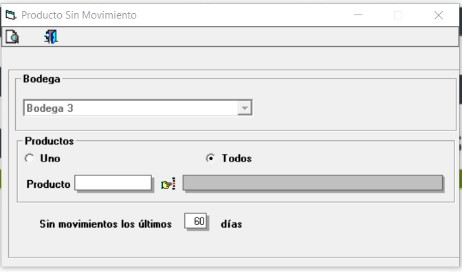
<u>**Descripción:**</u>
Este informe identifica todos los productos que tienen stock disponible en la bodega del casino pero que **no han registrado ningún movimiento durante los últimos N días**. Es una herramienta de control de inventario que permite detectar productos inmovilizados o con bajo nivel de rotación, lo cual puede representar un riesgo de vencimiento, merma no registrada o sobre-stock.
Para cada producto inmovilizado, el informe muestra cuál fue el último movimiento registrado (compra, traspaso, salida, devolución o venta de cafetería), su fecha, tipo de documento, número de documento, cantidad actual en bodega y su valorización al precio PMP vigente en esa fecha.

| **Requisito** | **Detalle** |
| --- | --- |
| Casino activo | El sistema usa la bodega del casino con el que se inició sesión. No se puede cambiar la bodega. |
| Días sin movimiento | Número entero entre 1 y 60. Valor por defecto: 30 días. No se usan fechas de inicio ni de fin; el criterio es enteramente relativo a la fecha de procesamiento del sistema. |
| Producto (opcional) | Se puede filtrar por un producto específico o dejar en blanco para analizar todos los productos de la bodega. |

El sistema genera un **informe RTF en orientación vertical (Portrait)**, con vista previa en pantalla, que puede imprimirse o exportarse.
**Encabezado del informe:**

| **Campo** | **Contenido** |
| --- | --- |
| Contrato | Nombre del casino activo |
| Período | "N Últimos días (Fecha de Procesamiento: DD/MM/AAAA)" |
| Producto | Nombre del producto si se filtró por uno, o "TODOS" |

**Detalle por producto (una fila por producto inmovilizado):**

| **Columna** | **Descripción** |
| --- | --- |
| Código | Código del producto (dec_codmer / dvp_codmer) |
| Descripción | Nombre del producto (pro_nombre) |
| UN. | Unidad de medida abreviada (uni_nomcor) |
| Cantidad | Stock actual en bodega (bod_canmer), con formato de decimales configurado por casino |
| Precio PMP | Precio Medio Ponderado a la fecha del último movimiento (ppd_propon), 2 decimales |
| Total | Stock × Precio PMP, 2 decimales |
| T.Doc. | Tipo de documento del último movimiento (ej.: GU, SP, DP, VC para cafetería) |
| Fecha | Fecha del último movimiento registrado |
| N°. Doc. | Número de documento del último movimiento (vacío para ventas de cafetería) |

**Pie del informe:**
**Total General:** suma de la columna "Total" de todos los productos listados, expresada en pesos.
Si no hay ningún producto que cumpla el criterio, el informe no se genera y se muestra un aviso en pantalla.
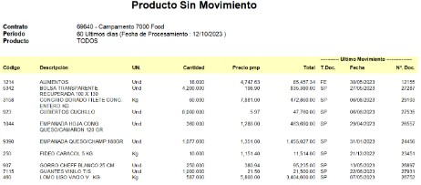
<u>**Regla de Negocio:**</u>
**Validaciones del sistema**
**Producto inexistente:** Si se elige la opción "Uno" y se escribe un código que no existe en b_productos, el sistema muestra un aviso de error al perder el foco del campo. No se puede continuar con un código inválido.
**Sin resultados:** Si ningún producto cumple el criterio de inmovilidad (stock > 0 y último movimiento anterior al corte), el sistema muestra el mensaje "No existe información a visualizar..." y no genera el informe.
**Bodega fija:** No es posible cambiar la bodega desde este formulario. El informe siempre corresponde a la bodega del casino activo en la sesión.
**Rango de días:** El campo numérico acepta solo valores entre 1 y 60. Valores fuera de este rango no son admitidos por el control.
**Reglas de cálculo**
**Fecha de corte: **La fecha de corte se calcula restando los días ingresados a la fecha actual del sistema:
Fecha_corte = Fecha_actual - N_días
Un producto aparece en el informe si y solo si:
Su stock actual en b_bodegas (bod_canmer) es mayor que 0 (redondeado a 3 decimales).
La fecha de su último movimiento registrado es anterior a la fecha de corte.
**Detección del último movimiento (orden de prioridad):**
El sistema analiza tres fuentes de movimientos. Para cada producto candidato, busca el detalle del último movimiento en este orden:
**Compras: **Cruza b_totcompras + b_detcompras + b_productospmpdia. Busca la recepción más reciente asociada a ese producto en esa bodega.
**Traspasos y salidas de bodega (documentos tipo SP y DP):**** **Cruza b_totventas + b_detventas + b_productospmpdia. Solo se consideran documentos no anulados ni pendientes (tov_estdoc <> 'A' y <> 'P'), con cantidad mayor que 0. Se excluyen los documentos tipo AI.
**Ventas de cafetería: **Cruza b_totventascaf + b_detventascafpro + b_productospmpdia. Solo se consideran ventas cerradas (tvc_estado = 'C').
Si ninguna de las tres fuentes tiene detalle disponible para ese producto en la fecha del último movimiento, la fila no se agrega al informe (el flag estexi queda en falso).
**Valorización:**
Total = bod_canmer (stock actual) × ppd_propon (precio PMP de la fecha del último movimiento)
El precio PMP se obtiene de b_productospmpdia usando el campo ppd_propon, filtrado por el centro de costos del casino activo (ppd_cencos). El total acumulado de todos los productos aparece como "Total General" al final del informe.
<u>**Tablas**</u><u>**:**</u>

| **Tabla** | **Rol en el informe** |
| --- | --- |
| b_bodegas | Fuente del stock actual (bod_canmer) y vínculo producto-bodega (bod_codpro, bod_codbod) |
| b_productos | Nombre del producto (pro_nombre), unidad de medida (pro_coduni), validación de existencia |
| a_unidad | Nombre corto de la unidad de medida (uni_nomcor) |
| b_productospmpdia | Precio PMP histórico por día y por casino (ppd_propon, ppd_fecdia, ppd_cencos). Fuente de la valorización |
| b_totcompras | Cabecera de recepciones de compra (toc_rutpro, toc_tipdoc, toc_numdoc, toc_fecrem, toc_codbod) |
| b_detcompras | Detalle de líneas de compra (dec_codmer, dec_rutpro, dec_tipdoc, dec_numdoc) |
| b_totventas | Cabecera de traspasos y salidas (tov_tipdoc, tov_numdoc, tov_fecpro, tov_fecemi, tov_estdoc, tov_codbod) |
| b_detventas | Detalle de líneas de traspaso/salida (dev_codmer, dev_canmer, dev_tipdoc, dev_numdoc) |
| b_totventascaf | Cabecera de ventas de cafetería (tvc_cencos, tvc_fecing, tvc_codbod, tvc_estado) |
| b_detventascafpro | Detalle de productos vendidos en cafetería (dvp_codmer, dvp_cencos, dvp_fecing) |
| Tabla temporal <usuario>_tmp_ProductoSinMov | Tabla de trabajo creada en sesión. Consolida el último movimiento por producto desde las tres fuentes. Se elimina al inicio de cada ejecución mediante fg_CheckTmp. |

**Mejoras:**
Si el producto no tiene movimiento ya sea por entrada y ni salida dentro del periodo consultado, debe consultar su último ajuste de inventario.

## 9.23. Inflación Interna (I_InflacionInterna)

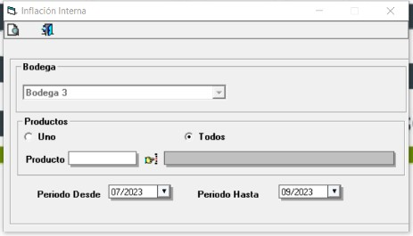
<u>**Descripción:**</u>
Este informe compara el costo de los insumos entre dos períodos distintos (expresados en mes/año) para medir cuánto variaron los precios dentro del casino. La variación se denomina **"inflación ****interna"** porque refleja el cambio en el precio promedio ponderado (PMP) de los productos comprados o recibidos por traspaso Entrada, sin depender de índices externos.
En términos prácticos, el informe responde preguntas como:
¿Cuánto más (o menos) estoy pagando por los mismos insumos respecto al período anterior?
¿Qué productos concentran el mayor incremento de costo?
¿Cuál es el impacto total en pesos de esa variación sobre el volumen comprado?
El informe toma como precio de referencia del **período anterior** el PMP registrado en la toma de inventario de cierre de ese mes. El precio del **período actual** se calcula como el promedio de los precios unitarios reales de todas las facturas/guías y traspasos recibidos dentro del período, ajustado por impuestos recuperables cuando corresponde.
Para ejecutar el informe se deben considerar lo siguiente:
Tener al menos **dos períodos distintos** con movimientos registrados en el casino activo. No es posible comparar un período consigo mismo.
Que el período anterior tenga un **cierre de inventario consolidado** (b_cierreperiodo) con sus fechas de inicio y término, ya que esas fechas delimitan exactamente qué compras y traspasos se incluyen.
Los períodos se ingresan en formato **mes/año** (mm/yyyy). No se ingresa una fecha exacta.
No se requiere ningún permiso especial adicional al acceso normal al módulo de informes.
La bodega se precarga automáticamente con la bodega del casino activo y no puede modificarse.
El informe se genera como un archivo RTF con orientación vertical (Portrait) que se muestra en pantalla con vista previa antes de imprimir.
**Encabezado del informe**
El informe muestra en su parte superior:

| **Campo** | **Contenido** |
| --- | --- |
| Contrato | Código y nombre del casino activo |
| Periodo | Fecha de término del período anterior seguida de "A" y la fecha de término del período actual (ej.: 31/01/2025 A 28/02/2025) |
| Producto | Código y nombre del producto filtrado, o "TODOS" si no se filtró |

**Detalle por producto (una fila por producto)**

| **Columna** | **Descripción** |
| --- | --- |
| Código | Código del producto |
| Descripción | Nombre del producto |
| Compras | Cantidad total comprada/recibida en el período actual |
| Unidad | Unidad de medida abreviada (ej.: KG, LT, UN) |
| Costo (período anterior) | PMP del producto al cierre del período anterior |
| Valor Total (período anterior) | PMP anterior × cantidad |
| Costo (período actual) | Promedio de precios de recepción del período actual |
| Valor Total (período actual) | Costo actual × cantidad |
| Inflación | Variación porcentual entre ambos valores totales |

**Totales generales (pie del informe)**

| **Campo** | **Contenido** |
| --- | --- |
| Total General — Valor Total anterior | Suma de todos los valores totales del período anterior |
| Total General — Valor Total actual | Suma de todos los valores totales del período actual |
| Total General — Inflación | Variación porcentual total entre ambos períodos |

Los productos que no tienen precio anterior registrado (PMP = 0 en la toma de inventario) no contribuyen al denominador del porcentaje de inflación y su variación individual se muestra como 0%.
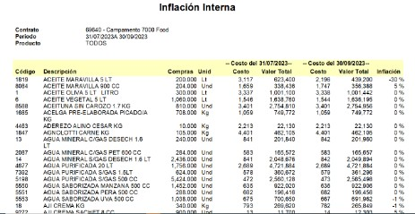
<u>**Regla de Negocio:**</u>
**Validaciones del sistema**

| **#** | **Condición que genera el error** | **Mensaje** | **Acción Requerida** |
| --- | --- | --- | --- |
| 1 | El período desde es mayor o igual al período hasta (comparación en formato yyyymm) | "Periodo Desde debe ser menor al periodo hasta..." | Ingresar un período desde que sea cronológicamente anterior al período hasta. |
| 2 | El código de producto ingresado no existe en la tabla b_productos | "Producto no existe..." | Corregir el código o usar el ícono de búsqueda para seleccionar un producto válido. |

**Importante:** Aunque los campos de período se inicializan con el mes actual, al hacer clic en Vista Previa ambos períodos tendrán el mismo valor. Eso activa la validación 1 (son iguales en yyyymm). Se deben ingresar dos períodos distintos antes de generar el informe.
**Reglas de cálculo**
**Delimitación temporal real:** Los períodos ingresados se convierten a fechas exactas consultando b_cierreperiodo. Si existe un registro de cierre para el período, se usan las fechas cie_fecini y cie_fecter registradas. Si no existe registro de cierre, el sistema usa por defecto el primer y último día del mes calendario.
**Precio del período actual (preact):** Se calcula como el promedio de los precios unitarios de recepción (dec_prerec) de todas las facturas y guías de proveedor recibidas en la bodega durante el período actual (fecha hasta), excluyendo documentos de tipo "Sin Número" (tdo_IdCodigo = 'SN'). Solo se consideran líneas con dec_mueinv = 'S' (que mueven inventario) y cantidad recibida mayor a cero.
**Ajuste por impuestos recuperables:** Si un impuesto está marcado como imp_inccos = 1 en a_impuesto, su monto proporcional se suma al precio unitario del producto (preact = preact + imd_monimp / cantidad). Esto asegura que el costo refleje el costo real de adquisición neto para el casino.
**Inclusión de traspasos:** Además de las compras a proveedor, se incluyen como fuente de precio del período actual los traspasos de entrada (tov_tipdoc = 'TR') en estado diferente a "Anulado" (A) o "Pendiente" (P), usando el precio del documento (dev_predoc).
**Precio del período anterior (preant):** Se obtiene desde b_tomainv usando el PMP de la toma de inventario cuya fecha de toma (tin_fectom) coincide con el último día del período anterior (cie_fecter). Solo se considera si tin_ciemes <> 0 (es decir, si la toma corresponde a un cierre de mes).
**Fórmula de inflación por producto:**
Inflación (%) = ((preact × cantidad) - (preant × cantidad)) / (preant × cantidad) × 100
Si el valor total del período anterior es cero, la inflación se muestra como 0 %.
**Fórmula de inflación total (pie del informe):**
Inflación Total (%) = ((Σ preact×cantidad) - (Σ preant×cantidad)) / (Σ preant×cantidad) × 100
<u>**Tablas:**</u>

| **Tabla** | **Rol en el informe** | **Columnas clave** |
| --- | --- | --- |
| b_cierreperiodo | Determina las fechas exactas de inicio (cie_fecini) y término (cie_fecter) de cada período mensual. PK: cie_cencos + cie_periodo. | cie_cencos cie_periodo cie_fecini cie_fecter cie_estado |
| b_totcompras | Encabezado de facturas/guías de proveedor. Se filtra por bodega (toc_codbod) y por fecha de recepción (toc_fecrem) dentro del período actual. Se excluyen documentos tipo "SN". | toc_rutpro toc_tipdoc toc_numdoc toc_codbod toc_fecrem |
| b_detcompras | Líneas de detalle de las facturas. Aporta el precio de recepción (dec_prerec) y la cantidad (dec_canrec). Solo líneas con dec_mueinv = 'S' y dec_canrec > 0. | dec_rutpro dec_tipdoc dec_numdoc dec_codmer dec_canrec dec_prerec dec_mueinv |
| b_detcomprasimp | Detalle de impuestos por línea de compra. Los impuestos con imp_inccos = 1 se suman al precio de costo. | imd_rutdoc imd_tipdoc imd_numdoc imd_numlin imd_codpro imd_codimp imd_monimp |
| a_impuesto | Maestro de impuestos. La columna imp_inccos = 1 identifica impuestos que deben incluirse en el costo del producto. | imp_codigo imp_inccos |
| a_tipodocumento | Maestro de tipos de documento. Se usa para excluir los documentos cuyo tdo_IdCodigo = 'SN' (Sin Número, es decir, documentos no facturados). | tdo_codigo tdo_IdCodigo |
| b_totventas | Encabezado de documentos de salida/traspaso. Se filtra por tipo TR (traspaso) y bodega destino (tov_codbod), excluyendo estados A (anulado) y P (pendiente). | tov_rutcli tov_tipdoc tov_numdoc tov_codbod tov_fecemi tov_estdoc |
| b_detventas | Líneas de detalle de traspasos. Aporta el precio del documento (dev_predoc) y la cantidad trasladada (dev_canmer). Solo líneas con dev_mueinv = 'S'. | dev_rutcli dev_tipdoc dev_numdoc dev_codmer dev_canmer dev_predoc dev_mueinv |
| b_tomainv | Toma de inventario. Aporta el PMP de cierre del período anterior (tin_propon), buscado por bodega (tin_codbod) y fecha de toma exacta (tin_fectom = último día del período anterior). Solo registros con tin_ciemes <> 0. | tin_fectom tin_codbod tin_codpro tin_propon tin_ciemes |
| b_productos | Maestro de productos. Aporta nombre (pro_nombre) y unidad de medida (pro_coduni). Se usa para validar que el producto ingresado existe, y para poblar la tabla temporal. | pro_codigo pro_nombre pro_coduni |
| a_unidad | Maestro de unidades de medida. Aporta el nombre corto (uni_nomcor) para mostrarlo en la columna "Unidad" del informe. | uni_codigo uni_nomcor |

## 9.24. Análisis de Consumo Precio Fijo (I_AnalisisConsumoPrecioFijo)

> Comentario - Paz Jorge (2026-04-02): No Considerar

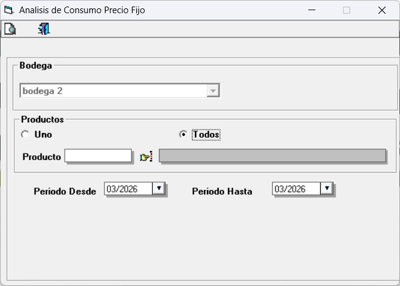
<u>**Descripción:**</u>
Este informe compara el consumo de ingredientes y materiales entre dos meses cerrados consecutivos, eliminando el efecto del cambio de precio. La técnica consiste en valorizar las cantidades consumidas de ambos períodos al mismo precio fijo (el precio de inventario del mes más reciente), de modo que la variación de valor que aparece en el informe refleja exclusivamente diferencias en cantidad consumida, no en precio de compra.
El análisis agrupa los movimientos de compra y traspasos de entrada de cada mes, los pondera con el precio de inventario del período más reciente y calcula la variación porcentual resultante. Esto permite al responsable de costos determinar si el gasto subió o bajó porque se compró o transfirió más cantidad, con independencia de si los precios de mercado fluctuaron.
Dos restricciones clave delimitan el uso del informe:
Ambos períodos deben estar cerrados en el sistema; no es posible comparar meses aún abiertos.
Los meses comparados deben ser consecutivos: la diferencia entre el período hasta y el período desde debe ser exactamente un mes (por ejemplo, enero y febrero de un mismo año).
Antes de generar el informe se deben cumplir las siguientes condiciones:

| **Requisito** | **Detalle** |
| --- | --- |
| Período desde cerrado | El mes inicial seleccionado debe tener estado cerrado (cie_estado = 0) en la tabla de períodos de cierre. |
| Período hasta cerrado | El mes final seleccionado debe tener igualmente estado cerrado. |
| Períodos consecutivos | La diferencia entre ambos períodos, expresada en formato yyyymm, debe ser exactamente 1. Por ejemplo: 202501 y 202502. |
| Período desde < Período hasta | El mes inicial debe ser anterior al mes final (no pueden ser iguales ni estar invertidos). |
| Bodega activa | El sistema precarga automáticamente la bodega del casino en sesión. No es necesario seleccionar bodega manualmente. |
| Toma de inventario registrada | Para que el precio fijo esté disponible, la bodega debe tener una toma de inventario cerrada (tin_ciemes <> 0) en la fecha de término del período hasta. |

El informe se genera en **formato RTF** con orientación **vertical (Portrait)** y se abre en una ventana de vista previa. Puede imprimirse o exportarse desde esa vista.
**Cabecera del informe:**

| **Campo** | **Contenido** |
| --- | --- |
| Contrato | Código y nombre del casino activo |
| Período | Fecha de inicio y término de cada mes comparado |
| Producto | "TODOS" o el código y nombre del producto seleccionado |

**Detalle del informe (una fila por producto):**

| **Campo** | **Contenido** |
| --- | --- |
| Código | Código del producto en el maestro (pro_codigo) |
| Descripción | Nombre del producto (pro_nombre) |
| Unidad | Abreviación de la unidad de medida (uni_nomcor) |
| Costo | Precio fijo utilizado para la valorización (precio de inventario del período hasta) |
| Compras (período desde) | Cantidad total consumida en el mes anterior (compras + traspasos de entrada) |
| Valor Total (período desde) | Precio fijo × cantidad del período desde |
| Compras (período hasta) | Cantidad total consumida en el mes más reciente |
| Valor Total (período hasta) | Precio fijo × cantidad del período hasta |
| Inflación | Variación porcentual del valor total entre ambos períodos, expresada en % |

**Fila de Total General:**
Muestra la suma de todos los valores totales de ambos períodos y la variación porcentual global. Las columnas de cantidad no tienen total (solo se totalizan los valores monetarios).
**Qué significa "precio fijo" en este contexto:**
El precio utilizado para valorizar ambas columnas es el **precio de inventario al cierre del mes más reciente** (tin_propon en b_tomainv). Al usar el mismo precio para los dos períodos, si el porcentaje de variación es positivo, significa que se consumió **más cantidad** ese mes; si es negativo, se consumió menos. El efecto del precio de mercado queda neutralizado.
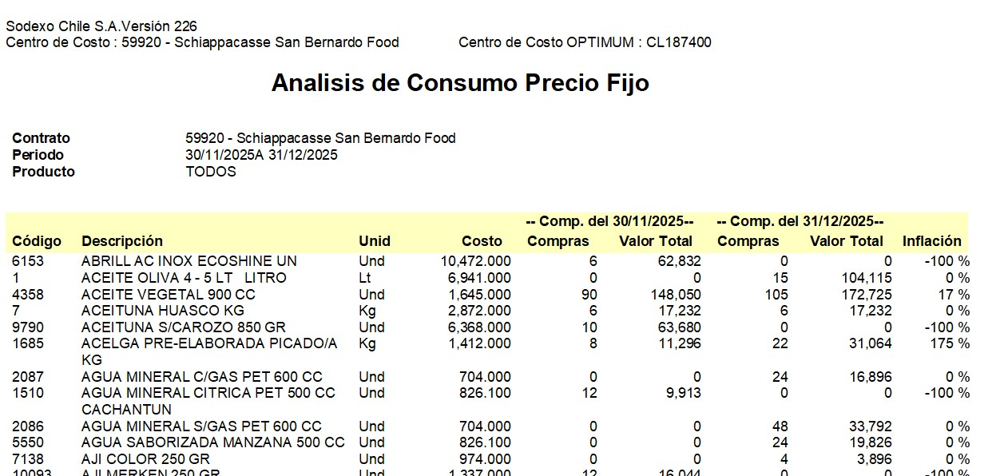
<u>**Regla de Negocio:**</u>
**Validaciones del sistema**
Las siguientes validaciones se ejecutan en orden al pulsar "Vista Previa". Si alguna falla, el informe no se genera y se muestra el mensaje correspondiente.

| **#** | **Mensaje exacto del sistema** | **Condición que la dispara** |
| --- | --- | --- |
| 1 | Periodo Desde debe ser menor al periodo hasta... | El período desde es mayor o igual al período hasta, o ambos son el mismo mes. |
| 2 | Periodo inicial debe estar cerrado... | El período desde no tiene cie_estado = 0 en b_cierreperiodo para el casino activo. |
| 3 | Periodo final debe estar cerrado... | El período hasta no tiene cie_estado = 0 en b_cierreperiodo para el casino activo. |
| 4 | Mes inicial debe ser menor mes destino... | Validación adicional de orden cronológico de los períodos expresados como yyyymm. |
| 5 | Debe ser una diferencia de un mes... | La diferencia entre yyyymm_hasta y yyyymm_desde no es exactamente 1 (los períodos no son consecutivos). |

**Reglas de cálculo**
El informe aplica las siguientes reglas durante la construcción del resultado:
**Precio fijo:** Se toma el precio de inventario (tin_propon) de la tabla de toma de inventario (b_tomainv) correspondiente a la **fecha de término del período hasta** (cie_fecter) y a la bodega activa, siempre que la toma de inventario esté cerrada (tin_ciemes <> 0). Este precio único es el que se usa para valorizar las cantidades de **ambos** períodos, eliminando así el efecto de variaciones de precio.
**Fuentes de movimiento incluidas:** El análisis considera dos tipos de movimiento de entrada a bodega:
**Compras de proveedores** (b_totcompras / b_detcompras): guías de despacho u otros tipos de documento que mueven inventario (dec_mueinv = 'S'), excluyendo documentos sin movimiento de inventario según la tabla a_tipodocumento (campo tdo_IdCodigo <> 'SN'), y con cantidad recibida mayor a cero (dec_canrec > 0).
**Traspasos de entrada** (b_totventas / b_detventas): documentos de tipo 'TR' (traspaso), no anulados ni pendientes (tov_estdoc <> 'A' y tov_estdoc <> 'P'), que muevan inventario (dev_mueinv = 'S') con cantidad mayor a cero.
**Cálculo del Valor Total:** Para cada producto y período:
Valor Total = Precio Fijo × Cantidad consumida en ese período
**Cálculo de la Variación (Inflación):** Por producto:
Variación % = ((Precio Fijo × Cant. Período Hasta) - (Precio Fijo × Cant. Período Desde)) / (Precio Fijo × Cant. Período Desde) × 100
Si el valor del período anterior es 0, la variación se muestra como 0%.
**Total General:** Se calcula la suma de todos los valores totales del período desde y del período hasta, y se aplica la misma fórmula de variación sobre los totales acumulados.
**Tabla temporal:** El sistema crea una tabla temporal en la base de datos con el nombre <usuario>_tmp_AnalisisConsumoPrecioFijo (donde <usuario> es el nombre de usuario de sesión). Si ya existe de una ejecución anterior, la elimina antes de crearla. Esta tabla acumula los movimientos de ambos períodos antes de la consulta final.
<u>**Tablas:**</u>

| **Tabla** | **Rol en el Informe** |
| --- | --- |
| b_totcompras | Cabeceras de documentos de compra a proveedores. Se filtra por bodega (toc_codbod) y fecha de recepción (toc_fecrem) dentro del rango de cada período. |
| b_detcompras | Líneas de los documentos de compra. Aporta la cantidad recibida (dec_canrec), el precio de recepción (dec_prerec) y el flag de movimiento de inventario (dec_mueinv). |
| b_totventas | Cabeceras de documentos de salida/traspaso. Se filtra por tipo de documento 'TR' (traspasos de entrada) y estado activo (tov_estdoc). |
| b_detventas | Líneas de los documentos de traspaso. Aporta la cantidad (dev_canmer), el precio del documento (dev_predoc) y el flag de movimiento de inventario (dev_mueinv). |
| b_tomainv | Toma de inventario mensual por bodega y producto. Se usa para obtener el precio de inventario del período hasta (tin_propon) que actúa como precio fijo. Solo se considera cuando la toma está cerrada (tin_ciemes <> 0). |
| b_cierreperiodo | Registro del estado de cada período mensual por casino. Se usa para validar que ambos períodos estén cerrados (cie_estado = 0) y para obtener las fechas exactas de inicio (cie_fecini) y término (cie_fecter) de cada mes. |
| b_productos | Maestro de productos. Aporta nombre (pro_nombre) y código de unidad de medida (pro_coduni). |
| a_unidad | Maestro de unidades de medida. Aporta la abreviación de la unidad (uni_nomcor) para la columna "Unidad" del informe. |
| a_tipodocumento | Catálogo de tipos de documento. Se usa para excluir documentos sin movimiento de inventario real (aquellos con tdo_IdCodigo = 'SN'). |

## 9.25. Salida y Devolución de Producción

> Comentario - Paz Jorge (2026-04-02): Los cuatro primeros Informes son complementado por la solución digital imprimible modulo producción

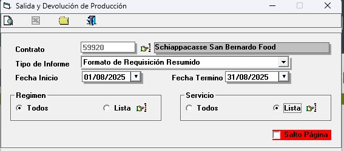
<u>**Descripción:**</u>
Esta pantalla centraliza en un solo formulario siete tipos distintos de informes relacionados con el movimiento de mercadería entre bodega y producción. Los cuatro primeros tipos (opciones 0 a 3) son formatos de **requisición**: calculan qué cantidad de cada producto debe solicitarse a bodega para preparar las minutas planificadas del período, considerando las recetas, los gramajes y el número de raciones. Los tres tipos restantes (opciones 4, 5 y 6) son informes de **movimientos reales**: muestran lo que efectivamente salió de bodega hacia producción, lo que fue devuelto, o la diferencia entre ambos.
La pantalla se organiza en un encabezado superior donde el usuario indica el contrato (casino), el rango de fechas y el tipo de informe que desea generar. Debajo del encabezado hay dos paneles de selección múltiple: uno para regímenes y otro para servicios. Cada panel ofrece las opciones "Todos" (incluye todo lo disponible en el sistema) o "Lista" (permite elegir una selección específica mediante un buscador auxiliar). La barra de herramientas superior contiene los botones de ejecución, exportación a Excel, acceso a la carpeta de archivos generados y cierre del formulario.
Los cuatro informes de requisición (opciones 0 a 3) aplican una validación previa que detecta servicios sin comensales registrados; si la hay, genera automáticamente un archivo Excel con la información faltante antes de continuar. El tipo 2 tiene además la capacidad de **grabar y exportar** el formato de requisición detallado a una tabla intermedia en la base de datos y luego exportarlo a Excel, lo que lo diferencia del resto como el único tipo que escribe datos.

| **Campo** | **Descripción** | **Obligatorio** |
| --- | --- | --- |
| Contrato | Código del contrato (casino) al que corresponden los informes. Se puede escribir directamente o buscar mediante el ícono de lupa que abre el formulario B_TabEst con la tabla b_clientes. El nombre del contrato se muestra automáticamente al lado del campo. | Sí |
| Tipo de Informe | Lista desplegable con 7 opciones. Determina qué clase de informe se genera y habilita o deshabilita controles adicionales como el botón "Exportar Excel" y el checkbox "Salto Página". | Sí |
| Fecha Inicio | Fecha de inicio del período a consultar. Formato dd/mm/yyyy. Al ingresar esta fecha se habilita la Fecha Término. | Sí |
| Fecha Término | Fecha de cierre del período. Debe estar en el mismo mes y año que la Fecha Inicio. | Sí |
| Régimen — "Todos" / "Lista" | Selector dentro del panel Regimen. "Todos" incluye todos los regímenes disponibles en el sistema. "Lista" habilita el ícono de búsqueda para seleccionar regímenes específicos desde B_MTaEst. Por defecto viene seleccionado "Todos". | Sí (al menos uno debe quedar seleccionado) |
| Servicio — "Todos" / "Lista" | Selector dentro del panel Servicio. "Todos" incluye todos los servicios del contrato. "Lista" habilita el ícono de búsqueda para seleccionar servicios específicos desde B_MTaEst. Por defecto viene seleccionado "Todos". | Sí (al menos uno debe quedar seleccionado) |
| Salto Página | Checkbox visible únicamente para los tipos 0, 1, 2 y 3. Controla si el informe RTF insertará un salto de página entre secciones. No aplica a los tipos 4, 5 y 6. | No |

Al abrirse el formulario, el sistema carga automáticamente la fecha del día del equipo en ambos campos de fecha, y carga en las grillas internas todos los regímenes y servicios disponibles marcados como seleccionados.

<u>**Reglas de Negocio:**</u>

| **#** | **Cuándo aparece** | **Qué verifica el sistema** | **Qué ve o experimenta el usuario** |
| --- | --- | --- | --- |
| 1 | Al presionar "Vista Previa" o "Exportar Excel" | Que el código de contrato ingresado exista en la tabla de clientes (b_clientes) | Mensaje: No existe contrato. El campo Contrato se limpia. |
| 2 | Al presionar "Vista Previa" o "Exportar Excel" (tipos 0–3) | Que la Fecha Inicio no sea posterior a la Fecha Término | Mensaje: Fecha origen Mayor destino |
| 3 | Al presionar "Vista Previa" (tipos 0–3) | Que el mes de la Fecha Inicio coincida con el mes de la Fecha Término | Mensaje: Mes origen mayor destino |
| 4 | Al presionar "Vista Previa" (tipos 0–3) | Que el año de la Fecha Inicio coincida con el año de la Fecha Término | Mensaje: Año origen mayor destino |
| 5 | Al presionar "Vista Previa" (todos los tipos) | Que haya al menos un régimen seleccionado en la grilla interna | Mensaje: Regimen debe ser informado |
| 6 | Al presionar "Vista Previa" (todos los tipos) | Que haya al menos un servicio seleccionado en la grilla interna | Mensaje: Servicio debe ser informado |
| 7 | Solo para tipos 0, 1, 2 y 3 — antes de generar el informe | Que todos los servicios seleccionados tengan comensales registrados en el período (sgp_Sel_ValidarServicioComensalesCeroSalProduccion) | Mensaje: Falta ingreso comensales totales, se generará archivo Excel con información faltante.... El sistema crea o usa la carpeta ExcelSGP y abre automáticamente el archivo con los servicios afectados. El proceso del informe continúa de todas formas. |
| 8 | Al presionar "Exportar Excel" (tipo 2) | Que existan datos de minuta real (mid_tipmin = '2') para el contrato, regímenes, servicios y período indicados (sgp_Sel_formatorequesicionestdetallado) | Mensaje: No existe información, con los parametros indicados.. |
| 9 | Al presionar "Exportar Excel" (tipo 2) — después de verificar datos | Que los productos vigentes en la lista de compras puedan ser actualizados sin conflictos (sgp_Upd_ValidarProductoVigente) | Si hay errores, el sistema muestra: [número de errores] [descripción] Proceso Cancelado y no graba ni exporta nada. |
| 10 | Al presionar "Exportar Excel" (tipo 2) — después de validar productos | Que la grabación en la tabla intermedia se complete sin errores (sgp_DelIns_formatorequesicionestdetallado) | Si falla la transacción en la base de datos, el sistema muestra: [número de errores] [descripción] Proceso Cancelado. |
| 11 | Para los tipos 0, 1, 2 y 3 al generar el informe RTF | Que existan minutas planificadas con el tipo minuta real (mid_tipmin = '2') para el período, contrato, regímenes y servicios indicados | Mensaje: No existe información con los datos seleccionados. El informe no se genera. |
| 12 | Para los tipos 4, 5 y 6 al generar el informe RTF | Que existan documentos de salida o devolución en b_totventas / b_detventas para los parámetros indicados | Mensaje: No existen datos para consulta.... El informe no se genera. |

**4.2 Reglas de cálculo**
La pantalla aplica una regla de cálculo central para los tipos de requisición (0, 1, 2 y 3), que determina la cantidad de producto a solicitar a bodega:
**Cantidad a solicitar = (Raciones planificadas × Gramaje del producto en la receta) / Factor de envasado del producto (pro_facing)**
Esta fórmula aparece expresada en los procedimientos de base de datos como:
((mid_numrac * red_canpro) / pro.pro_facing) AS Cantidad
Donde:
mid_numrac es el número de raciones planificadas en la minuta para esa preparación.
red_canpro es el gramaje del ingrediente en la receta (gramos por ración base).
pro_facing es el factor de empaque del producto (unidades por envase, para convertir gramos a unidades de pedido).
El sistema excluye automáticamente del cálculo cualquier preparación con raciones cero, gramaje cero o pro_facing igual a cero, para evitar divisiones inválidas.
Adicionalmente, para el tipo 2, antes de grabar la requisición el sistema ejecuta la rutina sgp_Upd_ValidarProductoVigente, que actualiza los códigos de producto en la tabla de lista de compras (b_contlistpreing) reemplazando productos vencidos sin stock por sustitutos vigentes, cuando existen. Esto garantiza que la cantidad calculada se asocie a un producto actualmente disponible en bodega.

<u>**Tablas Relacionadas:**</u>

| <u>**Tabla**</u> | <u>**Operación**</u> | <u>**Descripción en el contexto de este formulario**</u> |
| --- | --- | --- |
| <u>**b_clientes**</u> | <u>**SELECT**</u> | <u>**Valida que el contrato exista y obtiene el nombre del casino**</u> |
| <u>**b_minuta**</u> | <u>**SELECT**</u> | <u>**Cabeceras de minutas de planificación del período**</u> |
| <u>**b_minutadet**</u> | <u>**SELECT**</u> | <u>**Detalle de la minuta: recetas planificadas, raciones, tipo de minuta**</u> |
| <u>**b_receta**</u> | <u>**SELECT**</u> | <u>**Datos de la receta: código, nombre, base de raciones**</u> |
| <u>**b_recetadet**</u> | <u>**SELECT**</u> | <u>**Ingredientes de la receta: gramaje por producto**</u> |
| <u>**b_ingrediente**</u> | <u>**SELECT**</u> | <u>**Tabla de ingredientes de recetas**</u> |
| <u>**b_contlistpreing**</u> | <u>**SELECT / UPDATE**</u> | <u>**Lista de compras del contrato: relación ingrediente → producto de bodega**</u> |
| <u>**b_productos**</u> | <u>**SELECT / UPDATE (vía sgp_Upd_ValidarProductoVigente)**</u> | <u>**Maestro de productos: código, nombre, unidad, fecha de vencimiento, pro_facing**</u> |
| <u>**b_productosing**</u> | <u>**SELECT**</u> | <u>**Relaciones entre ingredientes y productos sustitutos**</u> |
| <u>**b_bodegas**</u> | <u>**SELECT**</u> | <u>**Stock actual de productos en bodega (para validar vigencia)**</u> |
| <u>**a_servicio**</u> | <u>**SELECT**</u> | <u>**Maestro de servicios del casino**</u> |
| <u>**a_regimen**</u> | <u>**SELECT**</u> | <u>**Maestro de regímenes**</u> |
| <u>**a_estservicio**</u> | <u>**SELECT**</u> | <u>**Estaciones de servicio (estructura del servicio)**</u> |
| <u>**a_sector**</u> | <u>**SELECT**</u> | <u>**Sectores físicos de despacho**</u> |
| <u>**a_unidad**</u> | <u>**SELECT**</u> | <u>**Unidades de medida**</u> |
| <u>**a_param**</u> | <u>**SELECT**</u> | <u>**Parámetros del casino: ciediario (último cierre), opgruvul (grupo vulnerable), ctainsumo, ctalimdes, ctagastos, ctagastos2**</u> |
| <u>**b_totventas**</u> | <u>**SELECT**</u> | <u>**Documentos de salida/devolución: cabecera con tipo de documento (SP/DP), fecha, estado**</u> |
| <u>**b_detventas**</u> | <u>**SELECT**</u> | <u>**Detalle de los documentos de salida/devolución: producto, cantidad, valor**</u> |
| <u>**b_formatorequesicionestdetallado**</u> | <u>**DELETE / INSERT (solo tipo 2 con Exportar Excel)**</u> | <u>**Tabla intermedia que almacena la requisición detallada calculada. Se borra y recalcula cada vez que se usa el botón Exportar Excel.**</u> |

### 9.25.1. Formato de Requisición Resumido (I_SalBodega)

> Comentario - Paz Jorge (2026-04-02): Estos Informe son complementado por la solución digital imprimible modulo producción
<u>**Formato Salida:**</u>
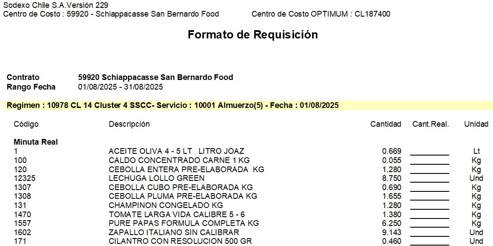
<u>**Descripción:**</u>
Genera un listado de los productos que deben pedirse a bodega para cumplir las minutas planificadas del período, en formato de tabla con totales por día y por receta. El informe se organiza primero por régimen y servicio, luego por fecha, y dentro de cada fecha por número de línea de minuta, estación de servicio y número de ítem de receta.
**Fuente de datos:** Invoca internamente el procedimiento sgp_Sel_FormatoRequisicion (no presente en el archivo SQL analizado — posiblemente es un procedimiento del esquema anterior o una vista). Usa solo minutas de tipo real (mid_tipmin = '2'), con raciones mayores a cero, gramaje mayor a cero y pro_facing mayor a cero.
**Estructura del informe:**

| **Columna** | **Calculado** | **Descripción** |
| --- | --- | --- |
| Contrato | No | Código y nombre del casino |
| Rango Fecha | No | Período seleccionado |
| Régimen / Servicio | No | Agrupador de cabecera por cada combinación |
| Día de la semana | No | Nombre del día calculado a partir de la fecha de minuta |
| Preparación | No | Código y nombre de la receta |
| Ingrediente / Producto | No | Nombre del ingrediente de receta y código del producto de compra |
| Unidad de medida | No | Unidad de medición del producto |
| Raciones planificadas | No | Cantidad de raciones registradas en la minuta |
| Gramaje | No | Gramaje definido en la receta (gramos por ración base) |
| Cantidad a solicitar | Sí | (Raciones × Gramaje) / pro_facing |

<u>**Regla de Negocio:**</u>
Formato de salida: RTF orientación vertical (orPortrait), con vista previa interactiva. También genera un archivo de texto plano paralelo con los mismos datos separados por |, utilizado para exportaciones adicionales.
Restricción específica: Si no hay minutas planificadas para los parámetros indicados, el sistema muestra No existe información con los datos seleccionados y no genera el informe.

### 9.25.2. Formato de Requisición x Sector (I_SalBodegaSector)

> Comentario - Paz Jorge (2026-04-02): Estos Informe son complementado por la solución digital imprimible modulo producción

<u>**Formato de Salida:**</u>
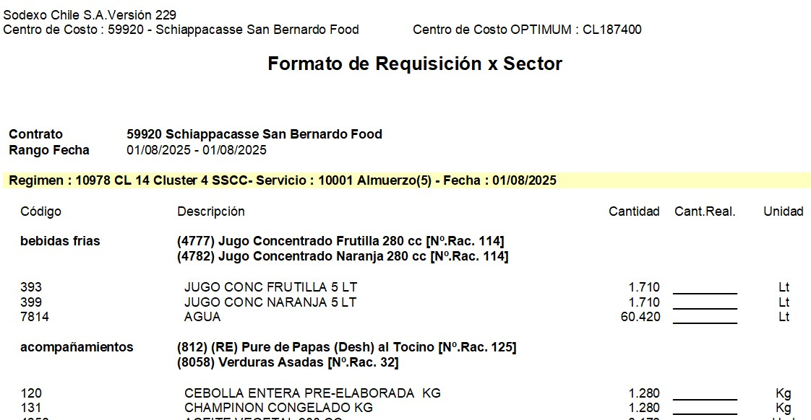
<u>**Descripción:**</u>
Variante del tipo 0 que agrupa los productos necesarios por **sector de despacho** (a_sector), en lugar de por receta. Útil para distribuir la requisición entre las distintas áreas físicas de cocina o despacho del casino. El parámetro opgruvul (leído desde a_param con código opgruvul) controla si el informe incluye una sección de "Grupo Vulnerable".
**Fuente de datos:** Usa el mismo procedimiento sgp_Sel_FormatoRequisicion para el nivel de régimen/servicio/fecha, y luego ejecuta una consulta directa sobre b_minuta, b_minutadet, b_receta, b_recetadet, a_estservicio, b_contlistpreing, b_productos, a_unidad y a_sector, agrupando por sector.
**Estructura del informe:** Similar al tipo 0 pero con una columna adicional:

| **Columna** | **Calculado** | **Descripción** |
| --- | --- | --- |
| Sector | No | Nombre del sector de despacho (a_sector) al que se destina el producto |
| Código producto | No | Código del producto en bodega |
| Nombre producto | No | Nombre del producto |
| Unidad | No | Unidad de medida |
| Cantidad a solicitar | Sí | SUM((gramaje / raciones_base × raciones) / pro_facing) agrupado por producto y sector |

<u>**Regla de Negocio:**</u>
Formato de salida: RTF orientación vertical, con vista previa interactiva.

### 9.25.3. Formato de Requisición x Estructura Servicio Detallado (I_SalBodegaDet)

> Comentario - Paz Jorge (2026-04-02): Estos Informe son complementado por la Estos Informe son reemplazado por la solución digital imprimible modulo producción
<u>**Formato de Salida:**</u>
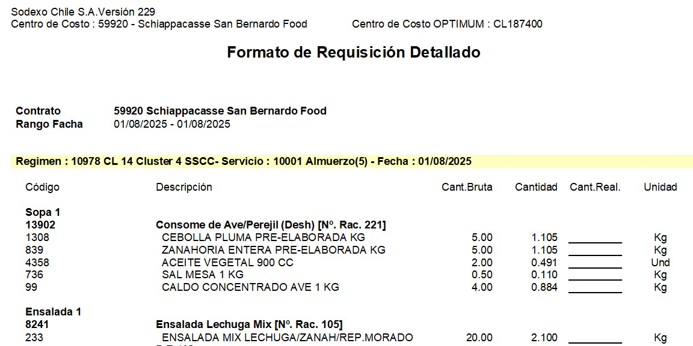
<u>**Descripción:**</u>
Es el tipo más completo. Muestra los productos requeridos organizados por la **estructura del servicio** (estaciones de despacho, a_estservicio), desagregando cada preparación con su detalle completo de receta. Es el único tipo que, al presionarse el botón "Exportar Excel", además de generar el informe RTF, **graba los datos en la tabla intermedia** b_formatorequesicionestdetallado y exporta directamente a un archivo Excel que se abre en pantalla.
El parámetro opgruvul (leído desde a_param) controla si el informe incluye una sección de "Grupo Vulnerable", igual que el tipo 1.
**Fuente de datos para Vista Previa:** sgp_Sel_FormatoRequisicion para el listado de fechas/regímenes/servicios, y luego consulta directa a las tablas de minuta, receta, estructura de servicio, lista de compras, productos y unidades.
**Fuente de datos para Exportar Excel:** sgp_Sel_formatorequesicionestdetallado — lee desde la tabla intermedia después de grabarla.
**Estructura del informe:**

| **Columna** | **Calculado** | **Descripción** |
| --- | --- | --- |
| Fecha | No | Fecha de la minuta (formato dd/mm/yyyy) |
| Ceco SAP / Sitio | No | Código del contrato (casino) |
| Régimen | No | Código del régimen |
| Servicio | No | Código del servicio |
| Código SGP Preparación | No | Código de la receta en SGP |
| Código SGP Producto | No | Código del producto de compra en SGP |
| Unidad de Medición | No | Unidad de medida del producto |
| Raciones Preparación | No | Raciones planificadas en la minuta |
| Gramaje de Producto | No | Gramaje del producto en la receta |
| Cantidad | Sí | (Raciones × Gramaje) / pro_facing |

<u>**Regla de Negocio:**</u>
**Restricción específica:** El sistema excluye automáticamente los días cuya fecha sea anterior al último cierre diario registrado en a_param (parámetro ciediario, leído con la función desencriptadora sgp_p_desencripta). Esto significa que no se pueden generar requisiciones para períodos ya cerrados.
**Formato de salida:** RTF orientación vertical con vista previa, y adicionalmente un archivo Excel guardado en la carpeta FormatoRequisicion con nombre FormatoRequisicion_[contrato]_[fecha]_[hora].xls.

### 9.25.4. Formato de Requisición x Estructura Servicio Resumido (I_SalBodegaxEst)

> Comentario - Paz Jorge (2026-04-02): Estos Informe son complementado por la solución digital imprimible modulo producción.

<u>**Formato de Salida:**</u>
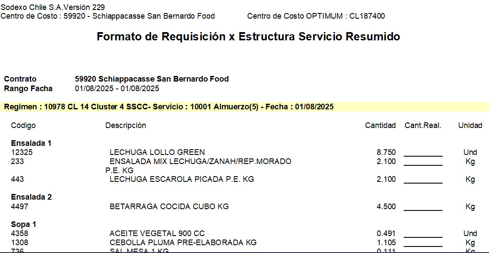
<u>**Descripción:**</u>
Versión resumida del tipo 2. Muestra los totales de producto por estación de servicio (a_estservicio) sin el detalle línea a línea de cada receta, consolidando las cantidades de un mismo producto en todos los días del período. Comparte la misma función generadora que el tipo 2 (I_SalBodegaxEst) pero con el parámetro de tipo de informe en modo resumido.
**Fuente de datos:** sgp_Sel_FormatoRequisicion para cabeceras, y luego consulta directa con GROUP BY por producto y estación de servicio.
**Estructura del informe:**

| **Columna** | **Calculado** | **Descripción** |
| --- | --- | --- |
| Estación de Servicio | No | Nombre de la estación (a_estservicio) |
| Código producto | No | Código del producto de bodega |
| Nombre producto | No | Nombre del producto |
| Unidad | No | Unidad de medida |
| Cantidad total a solicitar | Sí | Suma de (gramaje/raciones_base × raciones) / pro_facing agrupada por producto y estación para todo el período |

<u>**Regla de Negocio:**</u>
**Formato de salida:** RTF orientación vertical con vista previa.

### 9.25.5. Resumen de Salida a Bodega (I_SalidasDevolBod)

<u>**Formato de Salida:**</u>
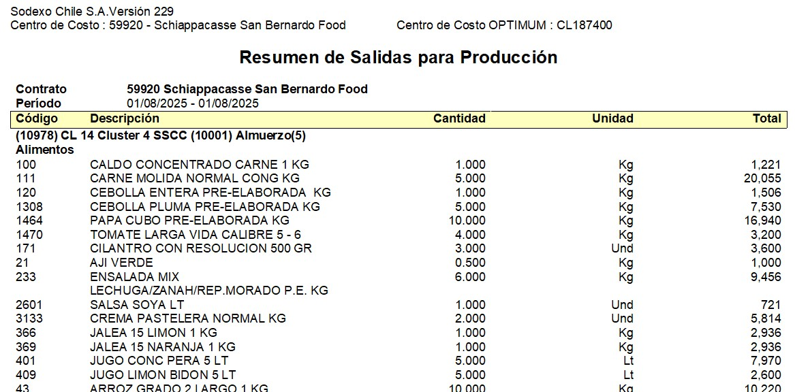
<u>**Descripción:**</u>
Muestra los productos que **efectivamente salieron** de bodega hacia producción en el período indicado, con su cantidad y valor total. Los datos provienen de los documentos de salida (tov_tipdoc = 'SP') registrados en b_totventas y b_detventas. El informe agrupa los productos por servicio, régimen y categoría contable (Alimentos, Desechables, Otros), con subtotales por categoría, por servicio y un total general.
**Nota: ****Este informe muestra lo que sacaron originalmente de bodega sin considerar devolución. **

**Fuente de datos:** Consulta directa sobre b_totventas, b_detventas, b_productos y a_unidad. La categoría contable (Alimentos / Desechables / Otros) se asigna comparando el campo pro_ctacon del producto con los parámetros del sistema ctainsumo, ctalimdes, ctagastos y ctagastos2.
**Estructura del informe:**

| **Columna** | **Calculado** | **Descripción** |
| --- | --- | --- |
| Código | No | Código del producto |
| Descripción | No | Nombre del producto |
| Cantidad | No | Total de unidades despachadas desde bodega |
| Unidad | No | Unidad de medida |
| Total | No | Valor total de la salida (precio × cantidad) |
| Subtotal por categoría | Sí | Suma de "Total" por Alimentos / Desechables / Otros |
| Total Servicio | Sí | Suma de "Total" para el servicio |
| Total General | Sí | Suma de todos los servicios |

<u>**Regla de Negocio:**</u>
**Formato de salida:** RTF orientación vertical con vista previa. Título del informe: Resumen de Salidas para Producción.

### 9.25.6. Devolución de Salida a Bodega (I_SalidasDevolBod)

<u>**Formato de Salida:**</u>
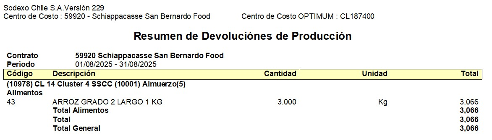
<u>**Descripción:**</u>
Muestra los productos que fueron **devueltos** desde producción a bodega en el período indicado. Utiliza la misma función que el tipo anterior, pero filtrando por documentos de devolución (tov_tipdoc = 'DP'). La estructura del informe es idéntica al tipo anterior.
<u>**Regla de Negocio:**</u>
**Formato de salida:** RTF orientación vertical con vista previa. Título del informe: Resumen de Devoluciones de Producción.

### 9.25.7. Salida Menos Devoluciones a Bodega (I_SalidasDevolBod)

<u>**Formato de Salida:**</u>
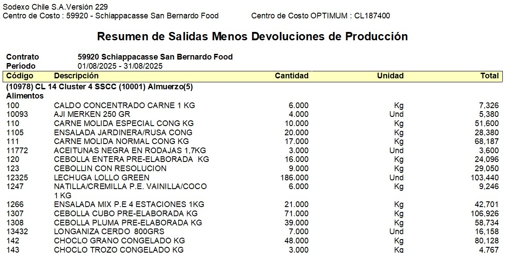
<u>**Descripción:**</u>
Muestra el resultado neto: la diferencia entre las salidas de bodega y las devoluciones recibidas. El sistema calcula este neto restando las cantidades y montos de los documentos de devolución (DP) de los correspondientes documentos de salida (SP), producto a producto, por servicio y régimen. Si la diferencia en algún producto resulta cero o negativa, igual aparece en el informe con el valor calculado.
<u>**Regla de Negocio:**</u>
Formato de salida: RTF orientación vertical con vista previa. Título del informe: Resumen de Salidas Menos Devoluciones de Producción.

## 9.26. Venta Directa (I_VenDir.frm)

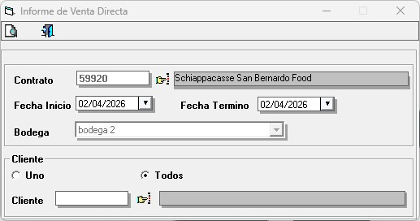

<u>**Descripción:**</u>
Esta pantalla genera un informe de ventas directas realizadas a clientes en un período determinado. El informe consolida los documentos de tipo factura (FA), factura electrónica (FE) o guía de despacho (GD) emitidos para una bodega específica, mostrando el detalle de los productos vendidos (cantidad, unidad de medida y monto total) agrupados por cliente.
La pantalla permite dos modalidades de consulta: consultar las ventas de un único cliente específico, o bien consultar las ventas de todos los clientes que tengan documentos emitidos en la bodega y período seleccionados. El modo de consulta se elige mediante los botones de opción del panel "Cliente". Los documentos anulados (estado A) y los marcados como pendientes (estado P) quedan excluidos de la consulta en ambas modalidades.
Visualmente, la pantalla se organiza en dos paneles: el panel superior contiene los campos de filtro (contrato, rango de fechas y selector de bodega), y el panel inferior contiene las opciones de cliente. Una barra de herramientas en la parte superior ofrece los botones de acción: "Vista Previa" para generar el informe y "Salir" para cerrar la pantalla. El resultado se genera como un documento RTF que se presenta en un visor de vista previa antes de imprimir.

| **Campo** | **Descripción** | **Obligatorio** |
| --- | --- | --- |
| Contrato | Código del contrato (casino) sobre el que se consultan las ventas. Se puede escribir directamente el código o usar el botón de búsqueda (lupa) para abrir un formulario auxiliar de selección de contratos. Al salir del campo, el sistema valida que el contrato exista y muestra su nombre a la derecha. Si el sistema está en modo de un solo casino, el contrato se carga automáticamente al abrir la pantalla. | Sí |
| Fecha Inicio | Fecha de inicio del período a consultar, en formato dd/mm/aaaa. Por defecto se carga la fecha del día actual al abrir el formulario. | Sí |
| Fecha Termino | Fecha de término del período a consultar, en formato dd/mm/aaaa. Por defecto se carga la fecha del día actual al abrir el formulario. | Sí |
| Bodega | Lista desplegable con las bodegas asociadas al contrato activo. Se carga automáticamente al abrir el formulario a partir de la relación entre a_bodega y b_clientes. Siempre se preselecciona la primera bodega de la lista. | Sí |
| Cliente — Uno / Todos | Botones de opción que determinan si el informe abarca un cliente específico o todos los clientes. Por defecto se selecciona "Todos". Si se elige "Uno", se habilita el campo de cliente. | Sí |
| Cliente (código RUT) | Visible y obligatorio solo cuando se selecciona la opción "Uno". Permite ingresar el RUT del cliente o buscarlo mediante la lupa. Al salir del campo, el sistema valida que el RUT exista en la tabla de clientes y muestra el nombre. |  |

<u>**Regla de negocio:**</u>

| **#** | **Cuándo aparece** | **Qué verifica el sistema** | **Qué ve o experimenta el usuario** |
| --- | --- | --- | --- |
| 1 | Al salir del campo Contrato | Que el código ingresado corresponda a un registro en b_clientes con cli_tipo = 0 (tipo contrato). | Mensaje: Contrato no existe... El campo queda vacío y el foco regresa al campo de contrato. |
| 2 | Al salir del campo Cliente (modo "Uno") | Que el RUT ingresado corresponda a un cliente activo en b_clientes con cli_tipo = 1 y cli_activo = '1'. | Mensaje: Cliente no existe... El campo queda vacío. |
| 3 | Al presionar Vista Previa | Que haya una bodega seleccionada en la lista desplegable. | Mensaje: Seleccione Bodega... El sistema no ejecuta la consulta. |
| 4 | Al presionar Vista Previa (modo "Uno") | Que el campo de RUT de cliente no esté vacío. | Mensaje: Seleccione Cliente... El sistema no ejecuta la consulta. |
| 5 | Al generar el informe | Que la consulta devuelva al menos un registro (documentos FA, FE o GD no anulados ni pendientes, en la bodega y período indicados). | Mensaje: No existen datos para la consulta... No se genera el documento. |
| 6 | Acceso al botón Vista Previa | Que el usuario tenga permiso de impresión configurado en el sistema. | Si no tiene permiso, el botón "Vista Previa" no aparece en la barra de herramientas. |

Tablas Relacionadas:

| **Tabla** | **Descripción funcional** | **Rol en este informe** |
| --- | --- | --- |
| b_totventas | Encabezados de documentos de venta (facturas, guías, etc.) | Fuente principal: filtra por bodega, período, tipo de documento y estado |
| b_detventas | Líneas de detalle de cada documento de venta | Provee código de producto, cantidad vendida y monto total por línea |
| b_productos | Maestro de productos del inventario | Aporta el nombre del producto |
| a_unidad | Tabla de unidades de medida | Aporta la abreviatura de la unidad (uni_nomcor) |
| b_clientes | Registro de contratos y clientes del sistema | Aporta el nombre del cliente; también se usa para validar el contrato ingresado y para cargar la lista de bodegas disponibles |
| a_bodega | Bodegas registradas en el sistema | Se usa al cargar el combo de bodegas: se une con b_clientes para mostrar solo las bodegas asociadas al contrato activo (a_bodega.bod_codigo = b_clientes.cli_codbod) |

<u>**Formato Salida:**</u>
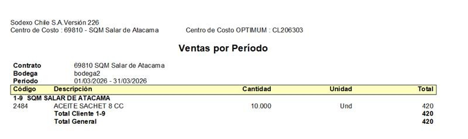

<u>**Descripción:**</u>
El formulario genera un único tipo de informe: **Ventas por Período**. No existe selector de tipo; el resultado es siempre el mismo documento con el alcance definido por los filtros (un cliente o todos).
**Función que genera el informe:** I_VenDirect en InforEG.bas
**Formato de salida:** documento RTF con vista previa en pantalla, orientación vertical (portrait), margen izquierdo de 500 twips. El documento también se exporta simultáneamente a un archivo de texto delimitado por | en la ruta temporal configurada en vg_Archxls.
**Encabezado del documento:** el informe incluye un bloque de encabezado con:

| **Campo en el encabezado** | **Contenido** |
| --- | --- |
| Contrato | Código y nombre del contrato consultado |
| Bodega | Nombre de la bodega seleccionada |
| Período | Fecha inicio — Fecha término |

**Detalle del informe:** los registros se presentan agrupados por cliente. Para cada cliente aparece primero una fila de encabezado con su RUT y nombre en negrita, luego las líneas de productos, y finalmente una fila de subtotal para ese cliente. Al final del documento se muestra el Total General de todas las ventas.
**Columnas del detalle por producto:**

| **Columna** | **Origen** | **Calculado** | **Descripción** |
| --- | --- | --- | --- |
| Código | b_detventas.dev_codmer | No | Código interno del producto vendido |
| Descripción | b_productos.pro_nombre | No | Nombre del producto |
| Cantidad | SUM(b_detventas.dev_canmer) | Sí | Suma de cantidades vendidas del producto para ese cliente en el período |
| Unidad | a_unidad.uni_nomcor | No | Abreviatura de la unidad de medida del producto |
| Total | SUM(b_detventas.dev_ptotal) | Sí | Suma del monto total vendido del producto para ese cliente en el período |

**Filas de subtotal:**

| **Fila** | **Contenido** |
| --- | --- |
| Total Cliente <RUT> | Suma de la columna Total de todos los productos del cliente |
| Total General | Suma de la columna Total de todos los clientes del informe |

**Documentos incluidos:** solo se consideran documentos con tov_tipdoc igual a FA (factura), FE (factura electrónica) o GD (guía de despacho), y cuyo estado (tov_estdoc) no sea A (anulado) ni P (pendiente).

## 9.27. Cartola Inventario (I_CarInv.frm)

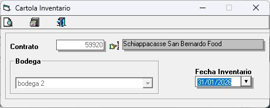
<u>**Descripción:**</u>
Esta pantalla genera la **Cartola Inventario**: un documento que consolida el resultado de la última toma de inventario físico realizada en el casino para una fecha y bodega determinadas. El documento agrupa los productos inventariados por cuenta contable y familia de producto, mostrando los montos valorizados del stock físico contado, los ajustes de inventario que se hayan registrado posteriormente, y el porcentaje que cada ajuste representa sobre el total general.
La pantalla es de tamaño fijo y pequeño: contiene únicamente los filtros necesarios para identificar el inventario a consultar (código de contrato, bodega y fecha), más una barra de herramientas con tres acciones. No dispone de grilla de resultados integrada; el documento se genera y se presenta en una ventana de vista previa, desde donde también puede exportarse como archivo RTF.
El formulario admite tanto una bodega específica como todas las bodegas del casino, controlado por la lista desplegable del panel Bodega. Adicionalmente, ofrece un asistente de histórico que permite seleccionar fechas de inventarios anteriores directamente desde la base de datos, sin necesidad de recordar o digitar la fecha manualmente.

| **Campo** | **Descripción** | **Obligatorio** |
| --- | --- | --- |
| Contrato (código) | Código del contrato (centro de costo) del casino. Se puede digitar directamente o seleccionar usando el ícono de búsqueda, que abre un formulario auxiliar con el listado de contratos disponibles. Al perder el foco, el sistema muestra automáticamente el nombre del contrato junto al campo. | Sí |
| Bodega | Lista desplegable que muestra las bodegas configuradas en el sistema (tabla a_bodega). Se carga automáticamente al abrir la pantalla. Dejar sin selección equivale a consultar todas las bodegas (el sistema interpreta código 0 como "todas"). | No |
| Fecha Inventario | Fecha de la toma de inventario a consultar, en formato dd/mm/aaaa. Se inicializa automáticamente con la fecha del día en que se abre la pantalla. Puede modificarse manualmente o cargarse desde el histórico. | Sí |

**Nota:** Si el usuario del sistema opera en un casino preconfigurado (variable ModCasino desactivada), el campo de código de contrato y el ícono de búsqueda aparecen deshabilitados, y el contrato se carga automáticamente desde los parámetros de sesión. En ese caso no se requiere ninguna acción adicional del usuario para identificar el casino.
<u>**Regla de Negocio:**</u>

| **#** | **Cuándo aparece** | **Qué verifica el sistema** | **Qué ve o experimenta el usuario** |
| --- | --- | --- | --- |
| 1 | Al presionar Vista Previa | El sistema busca en la tabla b_cierreperiodo si existe un período contable abierto que corresponda al año-mes de la fecha de inventario indicada para el contrato seleccionado. | Si no existe el período, aparece el mensaje **"No existe información..."** y el proceso se detiene. El usuario debe verificar que la fecha ingresada corresponde a un período que haya sido creado en el sistema. |
| 2 | Al presionar Vista Previa | El sistema verifica que existan registros en la tabla b_tomainv con stock físico (tin_stofis > 0) y precio ponderado (tin_propon > 0) para la fecha y bodega indicadas. | Si la consulta no devuelve filas, el informe se cierra sin mostrar datos. El usuario no recibe un mensaje de texto explícito, pero la ventana de vista previa no se abre. |
| 3 | Al ingresar el código de contrato | El sistema consulta la tabla b_clientes para verificar si el código ingresado existe (con cli_tipo = 0, que corresponde a un contrato activo). | Si el código no existe, el campo de nombre del contrato queda en blanco. El usuario puede continuar, pero el informe se generará sin identificar correctamente el contrato en el encabezado. |

**4.2 Reglas de cálculo**
Los cálculos del informe ocurren íntegramente dentro de la función de generación del documento. No existen valores calculados visibles en los controles de la pantalla principal antes de ejecutar el informe. Los detalles de cálculo se describen en la Sección 5.
<u>**Tablas Relacionadas:**</u>

| **Tabla** | **Para qué se usa en este reporte** | **Campos clave** |
| --- | --- | --- |
| b_tomainv | Fuente principal: contiene el registro de cada producto inventariado con su stock físico y precio ponderado al momento del inventario | tin_fectom, tin_codbod, tin_codpro, tin_stofis, tin_propon, tin_envsap |
| b_productos | Catálogo de productos: permite obtener el tipo de producto y la cuenta contable de cada artículo inventariado | pro_codigo, pro_codtip, pro_ctacon |
| a_tipopro | Catálogo de familias/tipos de producto: provee el nombre de la familia y el código de agrupación (tip_previo) para ordenar el informe | tip_codigo, tip_previo, tip_nombre |
| a_ctacontable | Catálogo de cuentas contables: provee el nombre descriptivo de cada cuenta para el encabezado de grupo | cta_codigo, cta_nombre |
| b_cierreperiodo | Tabla de períodos contables: el sistema obtiene la fecha de inicio del período para determinar el rango de ajustes a incluir | cie_cencos, cie_periodo, cie_fecini |
| b_totventas | Cabecera de documentos de movimiento de bodega: filtra los documentos de ajuste de inventario (tipo 'AI') dentro del período | tov_rutcli, tov_tipdoc, tov_numdoc, tov_fecemi, tov_codbod, tov_codser, tov_estdoc |
| b_detventas | Detalle de líneas de los documentos de ajuste: aporta la cantidad y precio de costo de cada ítem ajustado | dev_rutcli, dev_tipdoc, dev_numdoc, dev_codmer, dev_canmer, dev_precos |
| a_tipoajuste | Catálogo de tipos de ajuste: determina si cada ajuste es de aumento ('A') o disminución para calcular el signo del monto | aju_codigo, aju_tipo |
| a_bodega | Catálogo de bodegas: permite cargar la lista de bodegas en el selector y obtener el nombre para el encabezado del informe | bod_codigo, bod_nombre, bod_ubicac |
| b_clientes | Catálogo de contratos/casinos: permite validar y mostrar el nombre del contrato en el encabezado del informe | cli_codigo, cli_nombre, cli_tipo |
| log_procesos | Registro de procesos de integración: permite mostrar el número de documento SAP asociado al inventario cuando corresponde | cencos, tipo_proceso, estado, num_documento, mensaje |

<u>**Formato de Salida:**</u>
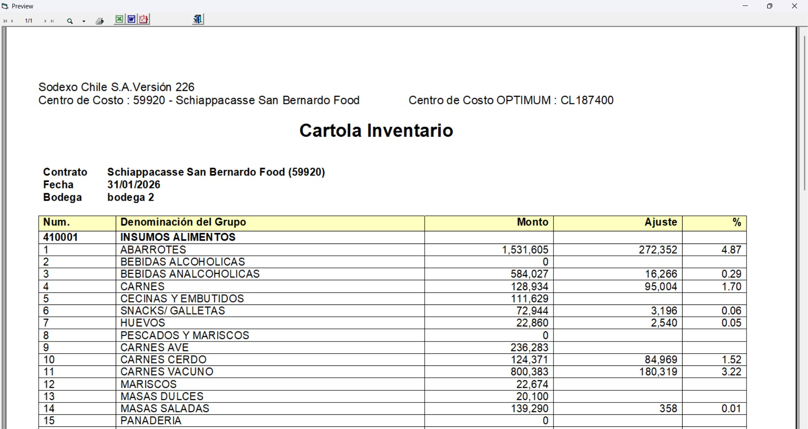
<u>**Descripción:**</u>
Esta pantalla genera un único tipo de informe. No dispone de selector de tipo.
**Formato de salida:** Documento RTF con vista previa en pantalla. Orientación retrato. El archivo se guarda automáticamente en la carpeta de trabajo configurada en el sistema, con nombre CARTOLA INVENTARIO<cencos><yyyymm>.rtf. El usuario puede imprimirlo o guardarlo desde la ventana de vista previa.
El documento incluye:
**Encabezado de página:** generado automáticamente con el encabezado de página estándar del sistema (función fg_poneencpagina).
**Pie de página:** contiene tres secciones de firma: "Vº Jefe Contrato", "VºBº Gerencia Operaciones", "VºBº Contabilidad".
> Comentario - Paz Jorge (2026-04-07): No Considerar
**Encabezado del informe:** bloque con los datos de identificación: nombre del contrato con su código, fecha de inventario y nombre de la bodega consultada.
**Cuerpo del informe:** tabla con el detalle por cuenta contable y familia de producto.
**Fila de totales por cuenta:** al cambiar de cuenta contable, el sistema inserta una fila de total acumulado para esa cuenta.
**Fila de total general:** al final del cuerpo, muestra el total general del inventario (suma de cuenta de insumos y cuenta de alimentos desechables).
**Estructura de datos del informe:**

| **Campo / Columna** | **Descripción** | **Calculado** |
| --- | --- | --- |
| Num. | Número de línea correlativo dentro del grupo de cada cuenta contable | No |
| Denominación del Grupo | Nombre de la familia de producto (tipo de producto) a la que pertenecen los artículos inventariados | No |
| Monto | Valor total del stock físico inventariado para esa familia, expresado en pesos | Sí |
| Ajuste | Monto neto de los ajustes de inventario (tipo documento 'AI') registrados para cada familia en toma de inventario especifica, expresado en pesos | Sí |
| % | Porcentaje que representa el ajuste para cada familia sobre el total general del inventario | Sí |
| Total Cuenta | Fila de subtotal: suma de Monto y Ajuste para todos los grupos de la misma cuenta contable | Sí |
| Total General Inventario | Fila de cierre: suma de los montos de la cuenta de insumos y la cuenta de alimentos desechables | Sí |

<u>**Regla de Negocio:**</u>
**Cálculo — Monto**
Representa el valor monetario del stock físico contado durante la toma de inventario para cada familia de producto.
**Fórmula o lógica:**
Monto (por familia) = SUMA( tin_propon × tin_stofis ) para todos los productos de esa familia

| **Componente** | **Qué representa** | **De dónde viene** |
| --- | --- | --- |
| tin_propon | Precio ponderado (PMP) del producto al momento de la toma de inventario | b_tomainv.tin_propon |
| tin_stofis | Cantidad física contada en el inventario (en unidades del producto) | b_tomainv.tin_stofis |
| Familia de producto | Agrupación definida por el tipo de producto (tip_previo) al que pertenece cada artículo | a_tipopro.tip_previo, enlazada a través de b_productos.pro_codtip |

Ejemplo: si se contaron 50 kg de harina con PMP de $400/kg y 30 unidades de aceite con PMP de $1.200/unidad, ambos pertenecientes a la familia "Abarrotes", el Monto de esa familia sería $50 × $400 + $30 × $1.200 = $20.000 + $36.000 = $56.000.

**Cálculo — Ajuste**
Representa el impacto monetario neto de los ajustes de inventario (documentos de tipo 'AI') que se registraron para cada familia de producto entre el inicio del período y la fecha del inventario.
**Fórmula o lógica:**
Para cada producto y tipo de ajuste se calcula:
Si el tipo de ajuste es 'A' (aumento): cantidad × precio costo → suma positiva
Si el tipo de ajuste es cualquier otro (disminución): cantidad × precio costo → suma negativa
El resultado se acumula por familia (tip_previo) y cuenta contable (pro_ctacon).

| **Componente** | **Qué representa** | **De dónde viene** |
| --- | --- | --- |
| dev_canmer | Cantidad de mercadería ajustada en la línea del documento | b_detventas.dev_canmer |
| dev_precos | Precio de costo unitario aplicado en la línea de ajuste | b_detventas.dev_precos |
| aju_tipo | Indica si el ajuste aumenta ('A') o disminuye el inventario | a_tipoajuste.aju_tipo, enlazado por b_totventas.tov_codser = a_tipoajuste.aju_codigo |
| Rango de fechas | Desde el inicio del período (cie_fecini en b_cierreperiodo) hasta la fecha del inventario | b_cierreperiodo.cie_fecini y parámetro FecInv |

Ejemplo: si se registró un ajuste de aumento de 10 kg de azúcar a $500/kg (ajuste positivo = $5.000) y una disminución de 5 kg de sal a $200/kg (ajuste negativo = −$1.000), el Ajuste neto para la familia de esos productos sería $5.000 − $1.000 = $4.000.

**Cálculo — % (Porcentaje del ajuste)**
Mide qué fracción del total general inventariado representan los ajustes de cada familia.
**Fórmula o lógica:**
% = (Ajuste de la familia / Total general del inventario) × 100

| **Componente** | **Qué representa** | **De dónde viene** |
| --- | --- | --- |
| Ajuste de la familia | Monto neto de ajustes para la familia, calculado como se describe arriba | Calculado en tiempo de ejecución |
| Total general | Suma de stock valorizado de todas las familias y cuentas contables del inventario (variable totgrl) | Calculado en tiempo de ejecución a partir de b_tomainv |

Ejemplo: si el total general del inventario es $1.000.000 y el ajuste de la familia "Lácteos" es $25.000, el porcentaje mostrado sería (25.000 / 1.000.000) × 100 = 2,50%.

**Nota sobre cuentas contables filtradas:** el informe incluye únicamente los productos cuya cuenta contable (pro_ctacon) corresponde a la cuenta de insumos (parámetro ctainsumo) o a la cuenta de alimentos desechables (parámetro ctalimdes), ambos configurados en la tabla de parámetros del sistema (a_param). Los productos asignados a otras cuentas no aparecen en el informe.
**Nota sobre productos mal clasificados:** si un producto tiene un tipo de producto (pro_codtip) que no existe en la tabla de familias (a_tipopro), la columna "Denominación del Grupo" mostrará el texto **"Existe producto mal asignado familia de producto"**.
**Nota sobre documento SAP:** en el encabezado del informe puede aparecer el número de documento SAP asociado al inventario, si el inventario fue marcado como enviado a SAP (tin_envsap = '1') y existe el registro correspondiente en la tabla log_procesos con tipo de proceso '2' y estado '1'.
> Comentario - Paz Jorge (2026-04-07): No considerar

## 9.28. Control Facturas Compras – Control Traspasos Entre Casino – Fofi (I_CtrFCo.frm)

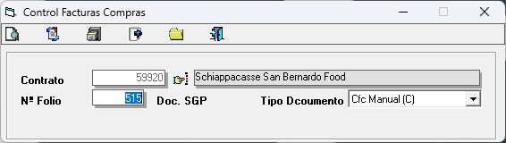

<u>**Descripción:**</u>
Esta pantalla es el punto de control y despacho de los documentos de compra e interfaz hacia sistemas externos. Dependiendo del modo en que se abra (determinado por el sistema al invocarla), opera como **Control de Facturas de Compra (CFC)**, como **Control de Traspasos Entre Contratos (CTC)** o como **Control de Fondo Fijo (FOFI)**. En los tres casos, el usuario puede visualizar el informe en pantalla, enviar los documentos al sistema SAP mediante un Web Service, generar archivos de intercambio para la plataforma OPTIMUM/AX, y cerrar el folio activo para habilitar el siguiente.
La pantalla se organiza en una barra de herramientas superior con los botones de acción y un área de filtros con el código de contrato, el número de folio a procesar y, según la configuración del contrato, una lista desplegable para seleccionar el tipo de documento o el tipo de traspaso. En los contratos habilitados para integración con SAP vía Web Service, se despliega adicionalmente un cuadro de texto con el log del proceso de envío.
El formulario opera siempre en el contexto de un único contrato (casino): no consolida datos de múltiples contratos. El contrato activo se muestra automáticamente al abrir la pantalla y solo puede modificarse si el usuario tiene habilitada la opción de cambio de casino.

| **Campo** | **Descripción** | **Obligatorio** |
| --- | --- | --- |
| Contrato | Código del casino/contrato activo. Se carga automáticamente; modificable según permisos del usuario. | Sí |
| N° Folio | Número correlativo del folio a procesar. El sistema lo carga automáticamente con el folio vigente según el tipo de documento activo. Se puede modificar manualmente para consultar o reenviar un folio anterior. | Sí |
| Tipo de Documento / Tipo de Traspaso | Lista desplegable visible solo en modo CFC o CTC. En CFC para contratos sin integración AX: selecciona entre "Cfc Manual (C)" y "Cfc Portal Electrónico (P)". En CTC: selecciona entre "Entrada (1)" y "Salida (0)". En CFC con integración AX estándar: las opciones son "Entrada (1)" y "Salida (0)" equivalentes al tipo de movimiento. | Condicional |
| Lugar Físico | Lista desplegable para seleccionar la bodega o lugar físico de destino, utilizada en la generación de archivos para OPTIMUM/AX. Se precarga con el último valor guardado para el contrato. Solo visible cuando el contrato tiene integración AX activa. |  |

<u>**Regla de Negocio:**</u>

| **#** | **Cuándo aparece** | **Qué verifica el sistema** | **Qué ve o experimenta el usuario** |
| --- | --- | --- | --- |
| 1 | Al hacer clic en Vista Previa | Que el contrato ingresado exista en la tabla de clientes con tipo = 0 (contrato activo). | Si no existe, se limpia el nombre del contrato y el proceso se cancela sin mensaje. |
| 2 | Al hacer clic en Vista Previa en modo CTC | Que se haya seleccionado un tipo de traspaso en la lista desplegable. | Mensaje: "Debe selecionar tipo traspaso". |
| 3 | Al hacer clic en Vista Previa | Que exista al menos un documento con fecha asociada al folio indicado en b_totcompras o b_totventas. | Mensaje: "No existe información". |
| 4 | Al hacer clic en Enviar Documento | Que no existan folios anteriores del mismo contrato y tipo sin enviar (validación de correlativo). | Mensaje: "Existe Numero CFC anterior a este folio que no ha sido enviado (N°: XXX)". |
| 5 | Al hacer clic en Enviar Documento | Que el folio no haya sido enviado previamente en su totalidad. | Mensaje: "Folio fue enviado en su totalidad". |
| 6 | Al hacer clic en Enviar Documento | Que existan documentos con clase de documento SAP asignada para el folio. | Mensaje: "No existe información, para enviar". En algunos casos el folio se cierra automáticamente con fecha actual y se avanza al siguiente. |
| 7 | Al hacer clic en Enviar Documento con integración AX activa | Que se haya seleccionado un Lugar Físico. | Mensaje: "Debe selecionar lugar fisico". |
| 8 | Al hacer clic en Enviar Documento con integración SAP Web Service | Que exista conexión a internet. | Mensaje: "No hay conexión a internet, proceso cancelado". |
| 9 | Al hacer clic en Enviar Documento con integración SAP Web Service | Que el contrato tenga creado un usuario SAP (parámetro sapusu) con valor no vacío. | El log muestra: "No tiene creado usuario, para Web Service" y el proceso se cancela. |
| 10 | Al hacer clic en Enviar Documento con integración SAP Web Service | Que el contrato tenga creada una contraseña SAP (parámetro sappas) con valor no vacío. | El log muestra: "No tiene creado password, para Web Service" y el proceso se cancela. |
| 11 | Al hacer clic en Enviar Documento con integración SAP Web Service | Que el contrato tenga asignada la sociedad SAP (cli_socsap) en la tabla de clientes. | El log muestra: "No tiene asignado la sociedad de SAP, en contrato." y el proceso se cancela. |
| 12 | Al hacer clic en Enviar Documento con integración SAP Web Service | Que exista configurado el código SAP del impuesto IVA en la tabla a_impuesto (imp_adicional = 0). | El log muestra: "No existe código SAP asignado impuesto iva, Comuniquesen con departamento de informatica." |
| 13 | Al hacer clic en Enviar Documento con integración SAP Web Service | Que existan configurados los códigos SAP de impuestos adicionales (Harina, Carne, etc.) en a_impuesto (imp_adicional = 1). | El log muestra: "No existe código SAP asignado impuesto Harina, Carne, Etc. Comuniquesen con departamento de informatica." |
| 14 | Al hacer clic en Enviar Documento con integración SAP Web Service | Que exista clave de documento exento configurada globalmente (vg_docexento). | El log muestra: "No existe clave exento sap, comuniquese con departamento de informatica." |
| 15 | Al hacer clic en Enviar Documento con integración SAP Web Service | Que exista clave de documento afecto configurada globalmente (vg_docafecto). | El log muestra: "No existe clave afecto sap, comuniquese con departamento de informatica." |
| 16 | Al hacer clic en Enviar Documento cuando el folio ya tiene registro en a_infcfcfofi con fecha de cierre mayor a 0 | Que el folio no haya sido ya generado. | Mensaje: "N° Documento ya fue generado". |
| 17 | Al confirmar el envío cuando el folio tiene registro abierto en a_infcfcfofi | Confirmación antes de cerrar el folio actual y crear el siguiente. | Mensaje: "El Folio N°XXX sera cerrado y se generara un nuevo folio, para los sgtes documentos ¿Desea continuar...?" con opción Sí/No. |
| 18 | Al usar el botón Histórico en modo CTC | Que se haya seleccionado un tipo de traspaso en la lista desplegable. | Mensaje: "Debe selecionar tipo traspaso". |
| 19 | Al usar el botón Generar Traspaso de Salida en modo CTC con tipo "Entrada" seleccionado | Que el tipo de traspaso sea Salida para acceder a la generación. | Mensaje: "Para acceder a esta opción, solo tiene que seleccionar tipo traspaso de salida". |
| 20 | Al enviar documentos del Portal Electrónico (tipinf = "P") | Verifica si ya existen registros previos en sap_cfc para el folio indicado. | Si ya existen, el sistema retorna éxito inmediatamente sin reprocesar. |

**4.2 Reglas de cálculo**
Al generar el archivo SAP (función GenerarArcSap), el sistema calcula el valor total de cada documento de la siguiente manera:
**Valor base del documento:** suma de (cantidad × precio de compra + precio flete) sobre las líneas de detalle en b_detcompras.
**IVA:** se toma directamente del campo toc_ivadoc de b_totcompras. Si la suma (valfac + toc_ivadoc + toc_otrimp) difiere del total del documento toc_totdoc, el sistema usa toc_totdoc como valor de referencia.
**Ajuste de redondeo:** cuando la suma acumulada de impuestos difiere del total del documento en 1 o 2 unidades, el sistema ajusta automáticamente el último tramo para cuadrar el total.
> Comentario - Paz Jorge (2026-04-07): El sistema ajusta automáticamente el último impuesto para que la suma total cuadre exactamente con el total del documento. Por ejemplo, si un documento vale $1.000 pero al sumar todos los tramos de impuestos el sistema llega a $999 o $998, en lugar de dejar esa diferencia, la corrige sumándola al último valor calculado, asegurando que el total enviado a SAP sea siempre exacto. En simple: evita que queden diferencias de 1 o 2 pesos por efecto del redondeo de decimales.
**Documentos exentos:** cuando la línea de detalle no tiene impuesto asociado en b_detcomprasimp, el sistema toma el campo toc_exedoc de b_totcompras como valor del tramo exento.
**Tipo de asiento SAP:** el código de posición (bseg_newbs) se determina por el tipo de documento: FA/ND → "31" (deudor), NC → "21", CE → "23", FE → "33", resto → "30". Para líneas de haber: FA/FE/ND/DE → "40", NC/CE → "50".

### 9.28.1. Control Facturas Compras

> Comentario - Paz Jorge (2026-04-09): Queda pendiente por Contabilidad

Formato de Salida:
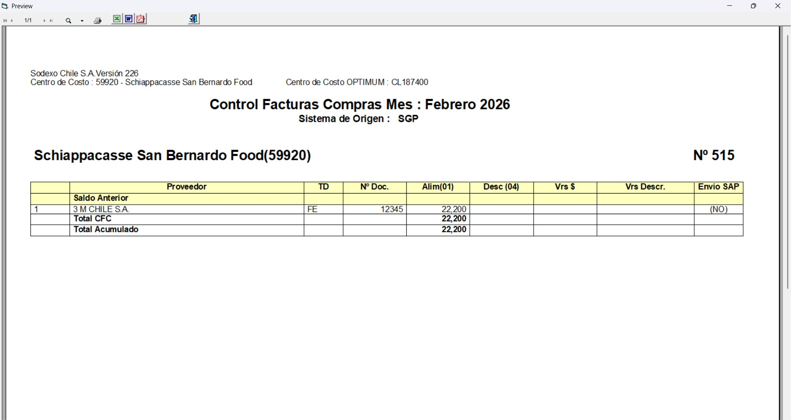
<u>**Descripción:**</u>
Genera un informe RTF en orientación horizontal (Landscape) que se muestra en una ventana de Vista Previa. El archivo se guarda en la carpeta de informes con el nombre CFC<cencos><yyyymm>.rtf.
El encabezado del informe muestra: título "Control Facturas Compras", el mes correspondiente al folio, la indicación del sistema de origen ("SGP" o "Plataforma Electrónica"), el nombre y código del contrato, y el número de folio. El pie de página incluye la firma "VºBº ADC" y el número de página.
**Datos que muestra el informe:**

| **Campo** | **Descripción** | **Calculado** |
| --- | --- | --- |
| Tipo de documento | Código y nombre del tipo de documento (FA = Factura, NC = Nota Crédito, CE = Crédito Electrónico, FE = Factura Electrónica, ND = Nota Débito, DE = Débito Electrónico) | No |
| RUT proveedor | RUT del proveedor emisor del documento | No |
| N° documento | Número del documento de compra | No |
| Fecha de emisión | Fecha de emisión del documento (toc_fecemi) | No |
| Fecha de remesa | Fecha de recepción/remesa del documento (toc_fecrem) | No |
| Neto alimentación | Monto neto correspondiente a productos de tipo alimentación | Sí |
| Neto desechables | Monto neto correspondiente a productos desechables | Sí |
| Neto general | Monto neto total del documento | Sí |
| IVA | Monto del IVA del documento (toc_ivadoc) | No |
| Total documento | Total del documento incluyendo impuestos (toc_totdoc) | No |
| Estado de envío SAP | Indica si el documento fue enviado a SAP (toc_envsap) | No |

La fuente de datos es la consulta que cruza b_totcompras, b_detcompras y a_tipodocumento, filtrando por bodega (vg_codbod), tipo de informe (C o P) y número de folio.
**Estructura del archivo generado:**
Formato: RTF
Nombre: CFC<código_contrato><año><mes>.rtf
Ubicación: carpeta de informes configurada en la variable dir_trabajo_Inf

### 9.28.2. Control Traspasos Entre Contratos

> Comentario - Paz Jorge (2026-04-09): Queda pendiente por Contabilidad
<u>**Formato Salida:**</u>
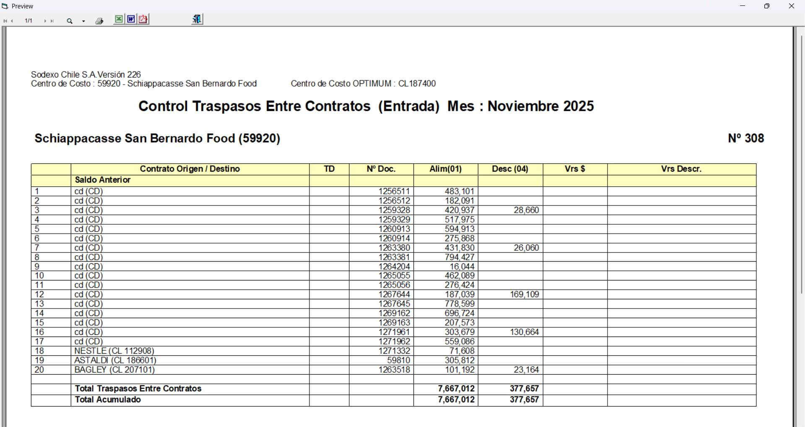
<u>**Descripción:**</u>
Genera un **informe RTF en orientación horizontal (Landscape)** que se muestra en una ventana de Vista Previa. El archivo se guarda con el nombre CTC<cencos><yyyymm>.rtf.
El encabezado indica: "Control Traspasos Entre Contratos (Entrada)" o "(Salida)" según el tipo seleccionado, el mes, el nombre del contrato y el número de folio.
**Datos que muestra el informe:**

| **Campo** | **Descripción** | **Calculado** |
| --- | --- | --- |
| Servicio | Código de servicio asociado al traspaso (tov_codser) | No |
| Cuenta contable | Código de cuenta contable del producto (pro_ctacon) | No |
| Costo saldo anterior | Costo acumulado de traspasos del tipo seleccionado en el período actual, anteriores al folio consultado | Sí |
| Costo del folio | Costo de los traspasos incluidos en el folio actual | Sí |
| Costo total | Suma de saldo anterior más folio actual | Sí |

La fuente de datos son b_totventas, b_detventas y b_productos, filtrando por tipo de documento 'TR', bodega (vg_codbod), tipo de traspaso (1=Entrada, 0=Salida) y período activo según b_cierreperiodo.
**Estructura del archivo generado:**
Formato: RTF
Nombre: CTC<código_contrato><año><mes>.rtf
Ubicación: carpeta de informes configurada en dir_trabajo_Inf

### 9.28.3. Control Fondo Fijo (Fofi)

> Comentario - Paz Jorge (2026-04-09): Queda pendiente por Contabilidad
<u>**Formato Salida:**</u>
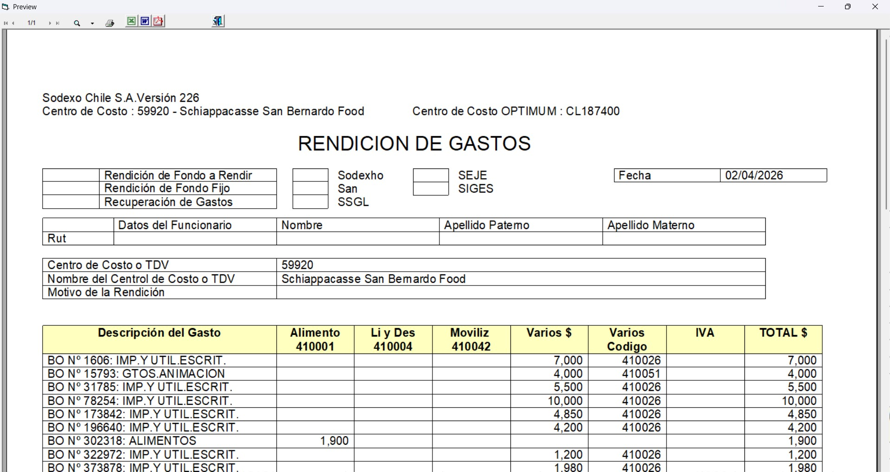

<u>**Descripción:**</u>
Genera un **informe RTF en orientación vertical (Portrait)** con el título "RENDICION DE GASTOS", que se muestra en una ventana de Vista Previa. El archivo se guarda con el nombre FOFI<codcas><yyyymm>.rtf.
Los datos se cargan desde b_totcompras, b_detcompras, b_productos y b_proveedor, filtrando por bodega y tipo de informe 'F', excluyendo documentos de tipo 'SN'. Luego se clasifican los productos en categorías según los parámetros del contrato:

| **Categoría** | **Parámetro que define las cuentas contables** |
| --- | --- |
| Alimentos | ctainsumo |
| Desechables | ctalimdes |
| Movilización | ctamovil |
| Varios | Todo lo que no encaja en las categorías anteriores |

**Datos que muestra el informe:**

| **Campo** | **Descripción** | **Calculado** |
| --- | --- | --- |
| RUT proveedor | RUT del proveedor | No |
| Tipo de documento | Código del tipo de documento | No |
| N° documento | Número del documento | No |
| Fecha de emisión | Fecha de emisión del documento | No |
| IVA | Monto del IVA | No |
| Flete | Monto del flete asociado | No |
| Categoría | Alimentos / Desechables / Movilización / Varios | Sí |
| Total neto por categoría | Suma de dec_ptotal + dec_prefle agrupado por categoría | Sí |
| Total con IVA | Total del documento | No |

**Estructura del archivo generado:**
Formato: RTF
Nombre: FOFI<código_contrato><año><mes>.rtf
Ubicación: carpeta de informes configurada en dir_trabajo_Inf

### 9.28.4. Envió de documentos al sistema SAP o plataforma OPTIMUM

<u>**Formato Salida:**</u>

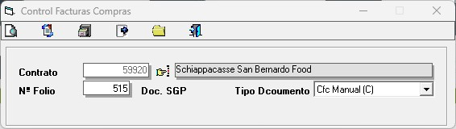
<u>**Descripción:**</u>
Al presionar el botón de envío, el sistema ejecuta los siguientes pasos según la configuración del contrato:
**Para contratos con integración SAP Web Service (cai_codtii = 1):**
El sistema abre el panel de log en pantalla.
Verifica credenciales SAP, sociedad, configuración de impuestos y claves contables.
Para cada documento del folio, construye los registros de asiento contable con las posiciones de encabezado y detalle (con sus cuentas, importes, impuestos y centros de costo).
Inserta los registros en la tabla de staging sap_cfc.
Envía los datos vía Web Service a SAP.
Marca los documentos enviados en b_totcompras (toc_envsap).
Registra el cierre del folio en a_infcfcfofi con la fecha actual e inserta el siguiente folio como abierto.
**Para contratos con integración OPTIMUM/AX (cai_codtii = 5 o 6):**
Si el contrato opera con documentos manuales (no AX): llama a la función GeneraCfcDigitado para generar el archivo Excel de facturación MANUAL.
Si el contrato opera con AX estándar: llama a GeneraCfcAX que genera el archivo para OPTIMUM usando el lugar físico seleccionado y el período del cierre activo.
**Para traspasos de salida:** llama a GenerarTraspasoSalidaAX para generar el archivo correspondiente.
En todos los casos, al finalizar el envío se registra la fecha de cierre del folio en a_infcfcfofi y se crea el registro del siguiente folio con fecha de cierre = 0 (abierto).

### 9.28.5. Generación Manual de archivos de facturación

<u>**Formato Salida:**</u>

<u>**Descripción:**</u>
El botón "Generar Facturación MANUAL" / "Generar Traspaso de Salida" abre la ventana P_GenCfcAx con uno de tres modos:

| **Modo** | **Cuándo se activa** | **Descripción** |
| --- | --- | --- |
| 1 — CFC Digitado Manual | Contrato CFC o Portal Electrónico sin AX | Genera archivos de facturación para procesamiento manual |
| 2 — CFC AX OPTIMUM | Contrato CFC o Portal Electrónico con AX estándar | Genera archivos para integración con plataforma OPTIMUM |
| 3 — Traspaso Salida AX | Contrato de Traspaso con tipo Salida sin AX | Genera archivos de traspaso de salida para OPTIMUM |

## 9.29. Control Facturas Compras (Cierres de Mes) (I_CfcCie.frm)

> Comentario - Paz Jorge (2026-04-07): No Considerar

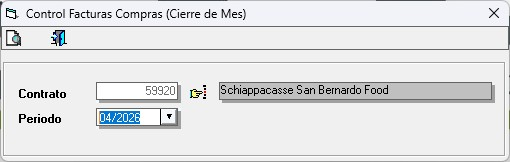
<u>**Descripción:**</u>
Esta pantalla genera un informe de cierre mensual de facturas de compras para un contrato específico. El informe consolida los montos comprados durante el período de cierre, junto con las provisiones pendientes (guías sin factura asociada y solicitudes de nota de crédito sin resolver), permitiendo al jefe de casino o coordinador conocer el gasto real del mes incluyendo los documentos que aún están en tránsito.
El informe organiza la información en tres grupos de gastos definidos por la cuenta contable del producto: **Alimentos & Bebidas**, **Gastos Generales** y **Limpieza & Desechable**. Para cada grupo presenta el total de facturas recibidas, las provisiones del mes anterior que se revierten, las provisiones pendientes del mes actual y de meses anteriores, y el gasto total resultante. Al final del informe se presentan los totales consolidados de los tres grupos.
La pantalla no muestra datos directamente en pantalla: toda la información se presenta en una ventana de Vista Previa con formato de impresión (RTF orientación vertical), desde la cual el usuario puede revisar e imprimir el informe. El sistema también genera un archivo de texto complementario en la carpeta de trabajo de informes. El informe es por contrato único: el usuario selecciona un solo contrato y un solo período mensual.

| **Campo** | **Descripción** | **Obligatorio** |
| --- | --- | --- |
| Contrato | Código del contrato (casino) para el cual se generará el informe. Se ingresa directamente o se selecciona desde el buscador de contratos. | Sí |
| Período | Mes y año del cierre a consultar, en formato MM/AAAA. El sistema lo inicializa automáticamente con el mes y año actuales. | Sí |

**Nota sobre permisos:** El botón "Vista Previa" solo se habilita si el usuario tiene el permiso correspondiente configurado en el sistema (posición 4 del perfil de validación del formulario). Si no aparece habilitado, el usuario no tiene acceso para generar este informe.
<u>**Regla de Negocio:**</u>

| **#** | **Cuándo aparece** | **Qué verifica el sistema** | **Qué ve o experimenta el usuario** |
| --- | --- | --- | --- |
| 1 | Al hacer clic en Vista Previa | El sistema verifica que el código de contrato ingresado exista en la tabla de contratos/clientes. | Si el contrato no existe, aparece el mensaje **"No existe contrato"** y no se genera el informe. El campo de contrato se limpia. |
| 2 | Al abrir el formulario | El sistema verifica el perfil de permisos del usuario para este formulario (posición 4 del perfil). | Si el usuario no tiene permiso, el botón "Vista Previa" aparece deshabilitado desde el inicio y no puede usarse. |
| 3 | Al generar el informe | El sistema verifica si existe un período de cierre registrado en la tabla de cierres para el contrato y mes indicados. | Si no existe el período de cierre, el informe no puede determinar las fechas de inicio y término del mes, y los campos de período en el encabezado del informe quedarán en blanco. |

**Reglas de cálculo**
El sistema clasifica cada línea de compra en uno de tres grupos según la cuenta contable del producto (pro_ctacon), determinada por los parámetros configurados en el sistema:
**Alimentos & Bebidas:** productos cuya cuenta contable coincide con el parámetro ctainsumo.
**Limpieza & Desechable:** productos cuya cuenta contable coincide con el parámetro ctalimdes.
**Gastos Generales:** todos los productos que no corresponden a ninguno de los dos grupos anteriores.
Los tipos de documento considerados para el cálculo son:

| **Tipo de documento** | **Código interno** | **Efecto en los totales** |
| --- | --- | --- |
| Factura | FA | Suma al total de facturas |
| Factura Electrónica | FE | Suma al total de facturas |
| Nota de Débito | ND | Suma al total de facturas |
| Nota de Débito Electrónica | DE | Suma al total de facturas |
| Nota de Crédito | NC | Resta del total de facturas |
| Nota de Crédito Electrónica | CE | Resta del total de facturas |
| Guía de Despacho pendiente | GD | Se incluye en las provisiones pendientes |
| Solicitud de Nota de Crédito pendiente | SN | Se incluye en las solicitudes de nota de crédito pendientes |

**Cálculo del monto de cada línea:**
El monto de cada línea se calcula aplicando el descuento y sumando los impuestos adicionales que inciden en el costo (aquellos con imp_inccos = 1):
Monto línea = Flete + (Total línea − (Total línea × % descuento / 100)) + Impuestos adicionales al costo
**Comportamiento según estado del período de cierre:**
Si el período ya tiene un cierre registrado con estado 0 (cerrado), el sistema lee directamente los totales de provisiones precalculados desde la tabla b_cierreperiodo (campos cie_gdpenmes*, cie_sncpenmes*, cie_gdpenmesant*, cie_sncpenmesant*).
Si el período no tiene cierre con estado 0, el sistema calcula las provisiones en tiempo real consultando las guías de despacho y solicitudes de nota de crédito directamente desde b_totcompras.
**Fórmula TOTAL GASTOS por grupo:**
TOTAL GASTOS = TOTAL FACTURAS + REVERSO DE LA PROVISION + TOTAL PROVISION
donde:
REVERSO DE LA PROVISION = montos de provisión del cierre del mes anterior
TOTAL PROVISION = (Provisión pendiente meses anteriores) + (Guías pendientes mes actual) − (Notas de crédito pendientes mes actual)
<u>**Tablas Relacionadas:**</u>

| **Tabla** | **Para qué se usa** | **Campos clave** |
| --- | --- | --- |
| b_cierreperiodo | Obtener las fechas exactas de inicio y término del período de cierre, y leer los totales precalculados de provisiones cuando el período ya fue cerrado. | cie_cencos, cie_periodo, cie_fecini, cie_fecter, cie_estado, cie_gdpenmesali, cie_gdpenmesdes, cie_gdpenmesgrl, cie_gdpenmesantali, cie_gdpenmesantdes, cie_gdpenmesantgrl, cie_sncpenmesali, cie_sncpenmesdes, cie_sncpenmesgrl, cie_sncpenmesantali, cie_sncpenmesantdes, cie_sncpenmesantgrl, cie_proantali, cie_proantdes, cie_proantgrl |
| b_totcompras | Encabezados de todos los documentos de compra (facturas, guías, notas de crédito/débito). Filtra por bodega (toc_codbod), tipo de documento (toc_tipdoc), tipo de información (toc_tipinf IN 'C','P'), fecha de recepción y documento asociado. | toc_rutpro, toc_tipdoc, toc_numdoc, toc_fecrem, toc_codbod, toc_tipinf, toc_docaso, toc_docsnc |
| b_detcompras | Líneas de detalle de cada documento de compra. Aporta cantidades, precios, descuentos y totales por línea. | dec_rutpro, dec_tipdoc, dec_numdoc, dec_numlin, dec_codmer, dec_canmer, dec_precom, dec_ptotal, dec_pctdes, dec_canrec, dec_prerec, dec_ptotrec, dec_prefle, dec_mueinv |
| b_detcomprasimp | Impuestos adicionales por línea de compra. Se consulta para cada línea de detalle para sumar los impuestos que inciden en el costo. | imd_rutdoc, imd_tipdoc, imd_numdoc, imd_numlin, imd_codpro, imd_codimp, imd_monimp |
| b_productos | Maestro de productos. Se usa para obtener la cuenta contable (pro_ctacon) que determina a qué grupo de gasto pertenece el producto. | pro_codigo, pro_ctacon, pro_ctrsto |
| b_proveedor | Maestro de proveedores. Se usa para obtener el nombre del proveedor asociado a cada documento. | prv_codigo, prv_nombre |
| b_clientes | Maestro de contratos/clientes. Se usa para validar que el contrato ingresado existe y para mostrar el nombre del contrato en el informe. | cli_codigo, cli_nombre |
| a_tipodocumento | Tabla de tipos de documento. Se usa para filtrar los documentos por su código estandarizado (FA, FE, NC, CE, ND, DE, GD, SN). | tdo_Codigo, tdo_idCodigo |
| a_impuesto | Maestro de impuestos. Se une con b_detcomprasimp para determinar si un impuesto incide en el costo (imp_inccos = 1). | imp_codigo, imp_inccos |

Formato Salida:
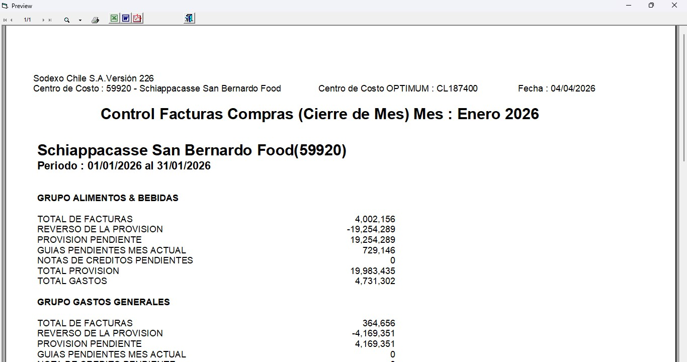

Descripción:
El resultado es un único informe en ventana de Vista Previa con orientación vertical (retrato). El archivo generado se almacena temporalmente en la carpeta de trabajo de informes del sistema con el nombre CFCCIERREMES<código_contrato><yyyymm>.rtf.
**Estructura del informe generado**
El informe tiene el siguiente encabezado:

| **Elemento** | **Contenido** |
| --- | --- |
| Título | "Control Facturas Compras (Cierre de Mes) Mes : <nombre mes> <año>" |
| Contrato | Nombre y código del contrato seleccionado |
| Período | Fecha de inicio y fecha de término del cierre (obtenidas de b_cierreperiodo) |
| Encabezado de página | Logo de la empresa y fecha de emisión del informe |
| Pie de página | Nombre del contrato, código y número de página |

<u>**Regla de Negocio:**</u>
**Detalle de secciones del informe**
El informe contiene cuatro secciones de filas descriptivas. Las tres primeras corresponden a los grupos de gasto y la cuarta consolida los totales generales.
**Campos por sección de grupo (Alimentos & Bebidas / Gastos Generales / Limpieza & Desechable):**

| **Campo en el informe** | **Descripción** | **Calculado** |
| --- | --- | --- |
| TOTAL DE FACTURAS | Suma de facturas, notas de débito, menos notas de crédito del período, con descuentos e impuestos adicionales aplicados. | Sí — calculado en tiempo real desde b_totcompras / b_detcompras |
| REVERSO DE LA PROVISION | Monto de provisión registrado en el cierre del mes anterior para este grupo (campo cie_proant* de b_cierreperiodo del período anterior). | Sí — leído del cierre anterior |
| PROVISION PENDIENTE | Suma de guías pendientes de meses anteriores más solicitudes de nota de crédito pendientes de meses anteriores. | Sí — calculado o leído según estado del cierre |
| GUIAS PENDIENTES MES ACTUAL | Valor de guías de despacho del mes actual que aún no tienen factura asociada (toc_docaso vacío o nulo). | Sí — calculado desde b_totcompras tipo GD |
| NOTAS DE CREDITOS PENDIENTES | Valor de solicitudes de nota de crédito del mes actual donde el documento asociado (toc_docaso o toc_docsnc) aún está pendiente, con signo negativo. | Sí — calculado desde b_totcompras tipo SN |
| TOTAL PROVISION | PROVISION PENDIENTE + GUIAS PENDIENTES MES ACTUAL − NOTAS DE CREDITOS PENDIENTES | Sí — calculado |
| TOTAL GASTOS | TOTAL DE FACTURAS + REVERSO DE LA PROVISION + TOTAL PROVISION | Sí — calculado |

**Sección de totales generales (última sección del informe):**

| **Campo en el informe** | **Descripción** |
| --- | --- |
| TOTAL DE FACTURAS | Suma de los totales de facturas de los tres grupos |
| TOTAL REVERSO DE LA PROVISION | Suma de los reversos de provisión de los tres grupos |
| TOTAL PROVISION PENDIENTE | Suma de las provisiones pendientes de los tres grupos |
| TOTAL GUIAS PENDIENTE MES ACTUAL | Suma de guías pendientes del mes actual de los tres grupos |
| TOTAL NOTA DE CREDITO PENDIENTE | Suma de notas de crédito pendientes de los tres grupos |
| TOTAL PROVISION | Suma de las provisiones totales de los tres grupos |
| TOTAL GASTOS | Total consolidado de gastos de los tres grupos |

## 9.30. Facturación Clientes (I_FacCli.frm)

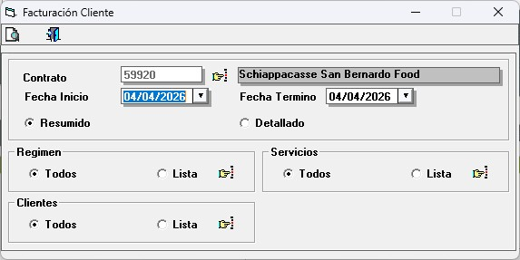
<u>**Descripción:**</u>
Esta pantalla genera el informe de **Facturación Clientes**, que consolida las raciones planificadas y los montos a cobrar a cada cliente del casino para un período determinado. El informe toma en cuenta el precio de venta vigente registrado para cada cliente, régimen y servicio, y multiplica ese precio por la cantidad de raciones consumidas, calculando así el total a facturar por cliente.
El informe integra dos fuentes de datos de forma simultánea: las **raciones de minuta** (consumos registrados en la planificación diaria) y las **ventas al contado** (transacciones cobradas directamente en el punto de venta). Ambas aparecen consolidadas en un mismo documento, agrupadas por cliente.
La pantalla opera sobre un único casino (el contrato activo del usuario), y permite filtrar el alcance del informe seleccionando uno o más clientes, regímenes y servicios. El resultado se presenta en una **ventana de Vista Previa** orientada en formato vertical (retrato), desde la cual el usuario puede imprimirlo o exportarlo. Adicionalmente, el sistema genera de forma automática un archivo de texto plano con los mismos datos, útil para procesamiento posterior.

| **Campo** | **Descripción** | **Obligatorio** |
| --- | --- | --- |
| Contrato | Código del contrato/casino. Se carga automáticamente desde la sesión activa del usuario. Es posible ingresar el código manualmente o usar el buscador. | Sí |
| Fecha Inicio | Fecha desde la cual se incluyen los datos. Formato dd/mm/aaaa. | Sí |
| Fecha Término | Fecha hasta la cual se incluyen los datos. Formato dd/mm/aaaa. Se habilita solo cuando Fecha Inicio tiene un valor válido. | Sí |
| Clientes | Permite seleccionar todos los clientes del contrato o una lista específica de ellos. Por defecto se incluyen todos. | Sí (debe existir al menos uno seleccionado) |
| Regimen | Permite seleccionar todos los regímenes o una lista específica. Por defecto se incluyen todos. | Sí (debe existir al menos uno seleccionado) |
| Servicios | Permite seleccionar todos los servicios o una lista específica. Por defecto se incluyen todos. | Sí (debe existir al menos uno seleccionado) |
| Tipo de informe | Resumido o Detallado. Por defecto: Resumido. | Sí |

<u>**Regla de Negocio:**</u>

| **#** | **Cuándo aparece** | **Qué verifica el sistema** | **Qué ve o experimenta el usuario** |
| --- | --- | --- | --- |
| 1 | Al hacer clic en Vista Previa | Que exista al menos un cliente seleccionado en la lista interna | Si no hay ninguno, aparece el mensaje: "Cliente debe ser informado" y el proceso se cancela. |
| 2 | Al hacer clic en Vista Previa | Que exista al menos un régimen seleccionado en la lista interna | Si no hay ninguno, aparece el mensaje: "Regimen debe ser informado" y el proceso se cancela. |
| 3 | Al hacer clic en Vista Previa | Que exista al menos un servicio seleccionado en la lista interna | Si no hay ninguno, aparece el mensaje: "Servicio debe ser informado" y el proceso se cancela. |
| 4 | Tras ejecutar las consultas a la base de datos | Que el período y los filtros seleccionados retornen al menos un registro en cualquiera de las dos fuentes de datos (raciones de minuta o ventas al contado) | Si no hay datos, aparece el mensaje: "No existe información..." y no se genera informe. |
| 5 | Al cambiar la Fecha Inicio | Que la fecha de inicio no sea posterior a la fecha de término | Si lo es, el sistema actualiza automáticamente la Fecha Término para igualarla a la Fecha Inicio. |
| 6 | Al cambiar la Fecha Inicio a vacío | Control de campos dependientes | El sistema desactiva el campo Fecha Término y lo deja en blanco. |
| 7 | Si ocurre cualquier error técnico durante la generación | Manejo de errores generales de ejecución | Aparece el mensaje: "Error: <número> <descripción>" con el detalle del error. |

**
**
**Reglas de cálculo**
El sistema utiliza una tabla temporal de trabajo (nombrada con el formato <usuario>_tmp_fact1) para procesar las raciones. El cálculo del precio vigente se obtiene localizando, para cada combinación de cliente/régimen/servicio/fecha, la **última fecha de vigencia del precio de venta** que sea anterior o igual a la fecha de la ración (prv_fecvig <= mir_fecmin). Esta lógica garantiza que se aplique el precio que estaba activo en el momento en que se registraron las raciones, no el precio actual.
La fórmula aplicada a cada fila de raciones es:
Total por fila = prv_preven (precio de venta vigente) × Cantidad (número de raciones)
El total por cliente se acumula sumando las filas correspondientes. El **Total General** del informe es la suma de todos los totales por cliente (tanto de raciones de minuta como de ventas al contado), redondeado a entero.
Para el **modo Resumido**, las raciones de todos los días del período se suman en una sola fila por servicio (SUM(mir_nrorac)). Para el **modo Detallado**, se presenta una fila por cada fecha con su cantidad individual.
<u>**Tabla Relacionada:**</u>

| **Tabla** | **Para qué se usa** | **Campos clave** |
| --- | --- | --- |
| b_minutaraciones | Registro de raciones planificadas por cliente, contrato, régimen, servicio y fecha | mir_cencos, mir_codreg, mir_codser, mir_fecmin, mir_rutcli, mir_nrorac |
| b_preciovta | Precios de venta por cliente, contrato, régimen, servicio y fecha de vigencia | prv_cencos, prv_codreg, prv_codser, prv_rutcli, prv_fecvig, prv_preven |
| b_ventacontado | Cabecera de ventas al contado registradas en el punto de venta | vtc_codigo, vtc_cencos, vtc_codreg, vtc_codser, vtc_fecvta |
| b_ventacontadodet | Detalle de cada venta al contado: cliente, centro de costo, descripción y monto | vtd_codigo, vtd_numlin, vtd_codcli, vtd_codcco, vtd_descripcion, vtd_detmon |
| b_clientes | Nombre del cliente a mostrar en el informe; también usada para la búsqueda de contrato | cli_codigo, cli_nombre |
| b_clientecencos | Centro de costo del cliente (solo en modo Detallado, sección ventas al contado) | clc_codigo, clc_codcli, clc_nombre |
| a_servicio | Nombre del servicio a mostrar en el informe | ser_codigo, ser_nombre |
| a_regimen | Validación de regímenes seleccionados en la consulta | reg_codigo, reg_nombre |
| <usuario>_tmp_fact1 | Tabla temporal de trabajo creada durante la ejecución para calcular la vigencia de precio aplicable a cada ración | Campos equivalentes a b_minutaraciones más prv_fecvig calculada |

<u>**Formato Salida:**</u>
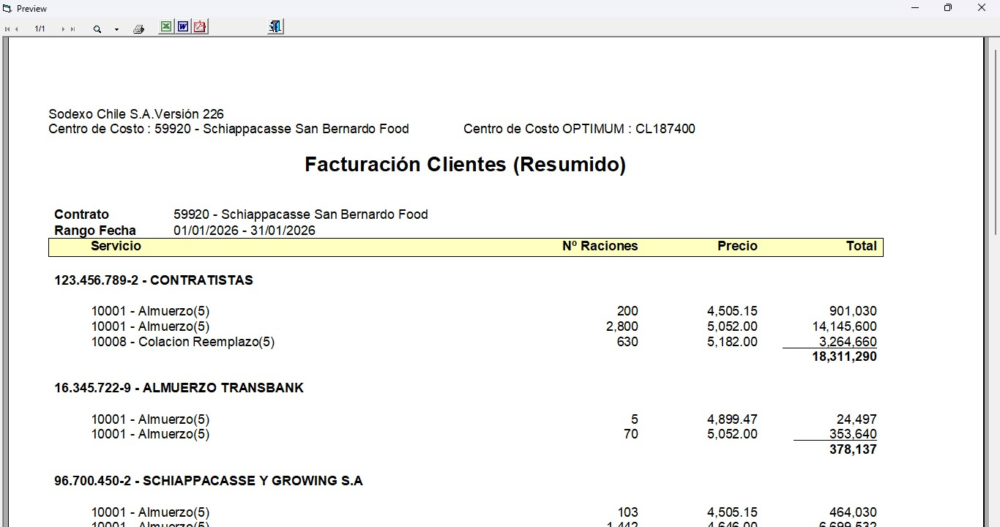
<u>**Descripción:**</u>
El informe se presenta en una **ventana de Vista Previa** orientada en formato vertical (retrato). El sistema genera simultáneamente un **archivo de texto** con los mismos datos (separados por |), disponible para procesamiento externo. Ambos documentos tienen la misma estructura.
El informe incluye:
Encabezado con logotipo de la empresa.
Cabecera con Contrato y Rango de Fechas seleccionados.
Cuerpo con las raciones (fuente: minuta) agrupadas por cliente.
Cuerpo con las ventas al contado agrupadas por cliente (a continuación de las raciones).
Total por cliente al cierre de cada grupo.
**Total General** al final del documento.
<u>**Regla de Negocio:**</u>
**Modo Resumido**
En modo Resumido, el informe presenta **una fila por servicio** dentro de cada cliente, consolidando todas las fechas del período en una sola cantidad total. No aparece el desglose por fecha.
**Estructura de datos — Sección Raciones (Modo Resumido):**

| **Columna** | **Descripción** | **Calculado** |
| --- | --- | --- |
| Servicio | Código y nombre del servicio | No |
| N° Raciones | Suma total de raciones del período para ese cliente y servicio | Sí — SUM(mir_nrorac) |
| Precio | Precio de venta vigente (prv_preven) para la última vigencia aplicable | No |
| Total | Precio × N° Raciones | Sí — prv_preven × SUM(mir_nrorac) |

**Estructura de datos — Sección Ventas al Contado (Modo Resumido):**

| **Columna** | **Descripción** | **Calculado** |
| --- | --- | --- |
| Servicio | Código y nombre del servicio | No |
| Monto | Suma del monto de detalle de venta (vtd_detmon) | Sí — SUM(vtd_detmon) |

**Modo Detallado**
En modo Detallado, el informe presenta **una fila por cada fecha** dentro del período para cada cliente y servicio. Adicionalmente, en la sección de ventas al contado se muestra el centro de costo del cliente (clc_codigo) y la descripción del concepto cobrado (vtd_descripcion).
**Estructura de datos — Sección Raciones (Modo Detallado):**

| **Columna** | **Descripción** | **Calculado** |
| --- | --- | --- |
| Fecha | Fecha de la ración en formato dd/mm/aaaa | No — formateada desde mir_fecmin (YYYYMMDD) |
| N° Raciones | Cantidad de raciones del día (mir_nrorac) | No |
| Precio | Precio de venta vigente (prv_preven) para esa fecha | No |
| Total | Precio × N° Raciones de ese día | Sí — prv_preven × mir_nrorac |

**Cálculo — Total por cliente (Detallado):**
Total cliente = SUM(prv_preven × mir_nrorac) para todas las fechas del período del cliente
Se imprime un subtotal al cambio de cliente, y si el modo es Detallado también al cambio de servicio dentro del mismo cliente.
**Estructura de datos — Sección Ventas al Contado (Modo Detallado):**

| **Columna** | **Descripción** | **Calculado** |
| --- | --- | --- |
| Fecha / Descripción | Fecha de la venta (vtc_fecvta) y descripción del concepto (vtd_descripcion) | No |
| Monto | Monto del detalle de venta (vtd_detmon) | No |

## 9.31. Informe Mermas por Periodo e Ajuste Inventario (I_MerPed.frm)

<u>**Mermas por Periodo:**</u>
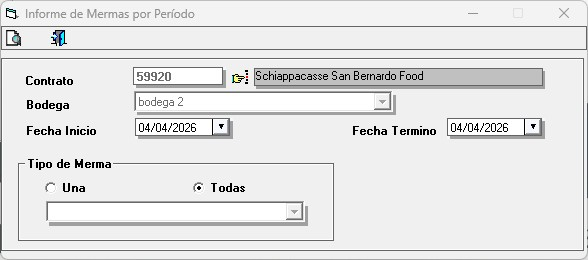

<u>**Ajuste de Inventario:**</u>

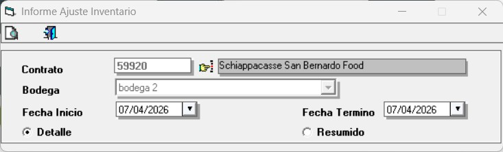
<u>**Descripción:**</u>
Esta pantalla reutiliza el mismo formulario para dos informes distintos que el sistema activa según el punto de menú desde el que se accede: **Informe de Mermas por Período** e **Informe Ajuste Inventario**. Ambos modos comparten los filtros de contrato, bodega y rango de fechas, pero difieren en el tipo de documento que consultan y en la forma en que presentan sus resultados.
El **Informe de Mermas por Período** consolida todos los registros de merma de una bodega en un tramo de fechas seleccionado. Muestra los productos dados de baja como merma, agrupados por tipo de merma (por ejemplo: merma de producción, desconche, vencimiento), con la cantidad total descartada y el costo asociado a cada grupo. Es el instrumento principal para que el jefe de casino o el coordinador de zona analicen el comportamiento de las pérdidas de inventario en el tiempo.
El **Informe Ajuste Inventario** documenta los movimientos de ajuste de inventario realizados en una bodega durante el período indicado. Muestra los productos ajustados agrupados por familia contable y tipo de producto, con la diferencia de cantidad resultante (positiva si fue aumento, negativa si fue disminución) y el valor total del ajuste. Sirve para trazabilidad contable y para auditar las correcciones de stock efectuadas entre tomas de inventario.

| **Campo** | **Descripción** | **Obligatorio** |
| --- | --- | --- |
| Contrato | Código del contrato (casino) sobre el que se desea generar el informe. Se puede escribir directamente o seleccionar con el botón de búsqueda. | Sí |
| Bodega | Lista desplegable con las bodegas asociadas al contrato activo. Se debe seleccionar una bodega específica; no existe opción "todas las bodegas". | Sí |
| Fecha Inicio | Primera fecha del período a consultar, en formato dd/mm/aaaa. Por defecto el sistema precarga la fecha del día. | Sí |
| Fecha Término | Última fecha del período a consultar, en formato dd/mm/aaaa. Por defecto el sistema precarga la fecha del día. | Sí |
| Tipo de Merma | Disponible solo en el modo Mermas por Período. Permite elegir entre consultar una merma específica (seleccionada de la lista) o incluir todos los tipos. | Solo en modo Mermas |
| Formato (Detalle / Resumido) | Disponible solo en el modo Ajuste Inventario. Determina si el informe muestra cada producto individualmente (Detalle) o solo los subtotales por familia (Resumido). | Solo en modo Ajuste de inventario |

**Nota sobre el campo Contrato:** en entornos donde el usuario opera un único casino, el campo se precarga automáticamente y no requiere acción manual.
<u>**Regla de Negocio:**</u>
**Validaciones del sistema**

| **#** | **Cuándo aparece** | **Qué verifica el sistema** | **Qué ve o experimenta el usuario** |
| --- | --- | --- | --- |
| 1 | Al abandonar el campo Contrato con un código ingresado manualmente | Que el contrato exista en el sistema | Si no existe, muestra el mensaje "Contrato no existe..." y borra el campo para que el usuario lo corrija |
| 2 | Al hacer clic en Vista Previa sin seleccionar bodega | Que se haya elegido una bodega en la lista desplegable | El sistema muestra "Seleccione bodega..." y no avanza a la generación del informe |
| 3 | Al hacer clic en Vista Previa en modo Mermas, con "Una" seleccionado y sin elegir tipo de merma | Que se haya seleccionado un tipo de merma cuando se eligió filtrar por uno específico | El sistema muestra "Seleccione Tipo de Merma..." y no avanza |
| 4 | Al generar el informe con parámetros válidos pero sin registros en el período | Que la consulta devuelva al menos un registro | El sistema muestra "No existen datos para la consulta..." y no abre la vista previa |
| 5 | Al abrir la pantalla | Permisos del usuario para impresión | Si el usuario no tiene permiso de impresión, el botón Vista Previa no aparece en la barra de herramientas |

**Reglas de cálculo**
**Mermas por Período — cálculo de totales:**
Para cada tipo de merma, el sistema acumula un subtotal de costo (Total <nombre del tipo>), sumando el valor total (dev_ptotal) de todas las líneas de ese tipo.
Al final del informe se muestra el **Total General**, que es la suma de todos los subtotales por tipo de merma.
Las cantidades se agrupan sumando todas las líneas del mismo producto (dev_codmer) dentro del mismo tipo de merma, para el rango de fechas y bodega seleccionados. Los documentos anulados (estado A) y los documentos pendientes (estado P) se excluyen del cálculo.
**Ajuste Inventario — cálculo de diferencias:**
Para cada producto ajustado, la **Diferencia** (cantidad neta) se calcula considerando el tipo del ajuste: si el ajuste es de tipo "Aumento" (aju_tipo = 'A') la cantidad suma positivo; si es "Disminución" suma en negativo. De este modo un producto con varios ajustes en el período puede mostrar una diferencia positiva, negativa según el balance de movimientos.
El **Total** por producto es el resultado de multiplicar esa diferencia por el costo unitario del producto al momento del ajuste.
El informe agrupa y subtotaliza por familia de producto y por cuenta contable, mostrando Total Familia y Total Cuenta antes del Total General.
<u>**Tabla Relacionada:**</u>

| **Tabla** | **Para qué se usa** | **Campos clave** |
| --- | --- | --- |
| b_totventas | Cabecera de cada documento de movimiento (merma o ajuste). Registra el contrato, bodega, fecha, tipo de documento y estado | tov_rutcli (contrato), tov_tipdoc (ME = merma, AI = ajuste), tov_codbod (bodega), tov_fecemi (fecha), tov_estdoc (estado), tov_codser (tipo de merma/ajuste) |
| b_detventas | Líneas de detalle de cada documento: qué producto, en qué cantidad y a qué costo | dev_codmer (código producto), dev_canmer (cantidad), dev_ptotal (costo total línea, solo mermas), dev_precos (costo unitario, solo ajustes) |
| a_tipoajuste | Catálogo de tipos de merma y ajuste. Permite filtrar por tipo en el informe de mermas y agrupa los ajustes por su naturaleza | aju_codigo (código), aju_nombre (nombre que aparece en el informe), aju_tipaju (0 = merma/ajuste visible en informe), aju_tipo (A = aumento, otro = disminución, solo ajustes), aju_activo |
| b_productos | Maestro de productos. Aporta el nombre, unidad de medida, familia y cuenta contable de cada producto | pro_codigo, pro_nombre, pro_coduni, pro_codtip (familia), pro_ctacon (cuenta contable) |
| a_unidad | Catálogo de unidades de medida | uni_codigo, uni_nomcor (abreviatura usada en el informe de mermas), uni_nombre (nombre completo usado en ajuste) |
| b_clientes | Catálogo de contratos (casinos). Se usa para validar el contrato ingresado y para cargar las bodegas disponibles | cli_codigo, cli_nombre, cli_codbod |
| a_bodega | Catálogo de bodegas. Se usa para cargar la lista desplegable de bodegas filtrada por el contrato activo | bod_codigo, bod_nombre |
| a_ctacontable | Catálogo de cuentas contables. Solo en informe de ajuste, para mostrar el nombre de la cuenta en los subtotales | cta_codigo, cta_nombre |
| a_tipopro | Catálogo de familias de producto. Solo en informe de ajuste, para mostrar el nombre de la familia en los encabezados de grupo | tip_codigo, tip_nombre |

### 9.31.1. Mermas por Periodo

<u>**Formato Salida:**</u>
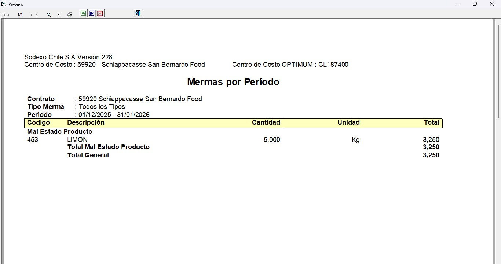
<u>**Descripción:**</u>
Informe generado en vista previa con orientación **vertical (Portrait)**. Puede guardarse en formato RTF.
**Encabezado del documento:**
Nombre del informe: *Mermas por Período*
Contrato: código y nombre del casino
Tipo Merma: nombre del tipo seleccionado, o "Todos los Tipos"
Período: fecha inicio — fecha término
<u>**Regla Negocio:**</u>
**Estructura de datos del cuerpo:**

| **Columna** | **Descripción** | **Calculado** |
| --- | --- | --- |
| Código | Código interno del producto mermado | No |
| Descripción | Nombre del producto | No |
| Cantidad | Suma de unidades mermadas en el período para ese producto y tipo | Sí — suma agrupada |
| Unidad | Unidad de medida del producto (abreviada) | No |
| Total | Costo total de la merma para ese producto y tipo | Sí — suma agrupada |

**Subtotales:**
Fila en negrita Total <nombre tipo de merma> al cerrar cada grupo, con el costo acumulado del tipo.
Fila final Total General con la suma de todos los tipos.
**Los documentos excluidos** son los que tienen estado Anulado (A) o Pendiente (P). Solo se consideran documentos de tipo ME (merma de inventario).

### 9.31.2. Ajuste Inventario Detallado o Resumido

<u>**Formato Salida Detallado:**</u>
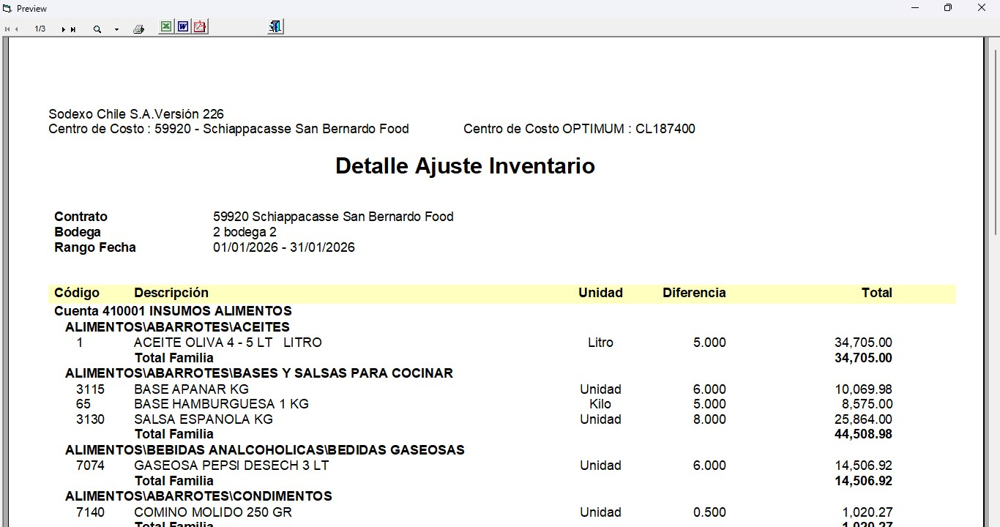
<u>**Formato Salida Resumido:**</u>
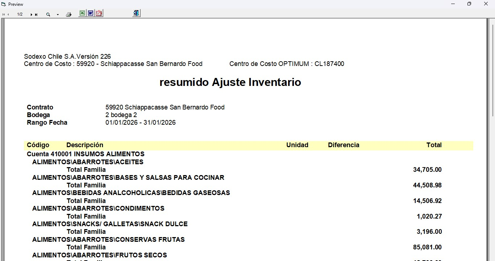
<u>**Descripción:**</u>
Informe generado en vista previa con orientación **vertical (Portrait)**. Puede guardarse en formato RTF. Disponible en dos formatos seleccionables antes de generar:
**Detalle:** muestra cada producto individualmente con su código, descripción, unidad, diferencia y total.
**Resumido:** muestra únicamente los subtotales por familia y cuenta contable, sin el desglose por producto.
**Encabezado del documento:**
Nombre del informe: *Detalle Ajuste Inventario* o *Resumido Ajuste Inventario* según la opción elegida
Contrato: código y nombre del casino
Bodega: código y nombre, o "TODOS" si no se filtró por bodega
Rango Fecha: fecha inicio — fecha término
<u>**Regla de Negocio:**</u>
**Estructura de datos del cuerpo (modo Detalle):**

| **Columna** | **Descripción** | **Calculado** |
| --- | --- | --- |
| Código | Código interno del producto ajustado | No |
| Descripción | Nombre del producto | No |
| Unidad | Unidad de medida del producto | No |
| Diferencia | Cantidad neta del ajuste (positiva = aumento, negativa = disminución) | Sí — suma ponderada por tipo de ajuste |
| Total | Valor monetario de la diferencia al costo unitario del ajuste | Sí — diferencia × costo |

**Subtotales:**
Total Familia al cerrar cada grupo de productos de la misma familia (tipo de producto).
Total Cuenta <código> <nombre> al cerrar cada grupo de cuenta contable.
Total General al final del documento.
Cálculo — Diferencia: para cada ajuste en el período, si aju_tipo = 'A' (Aumento) la cantidad suma positiva; en cualquier otro caso suma negativa. El sistema acumula el balance neto por producto.
**Solo se consideran** documentos de tipo AI (ajuste de inventario) con estado distinto de Anulado (A) y Pendiente (P), y únicamente líneas con cantidad mayor a cero antes de aplicar el signo.

## 9.32. Venta Cafetería (I_VenCaf.frm)

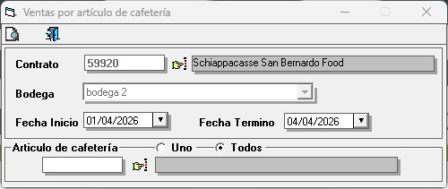

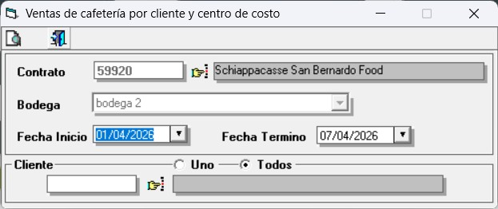
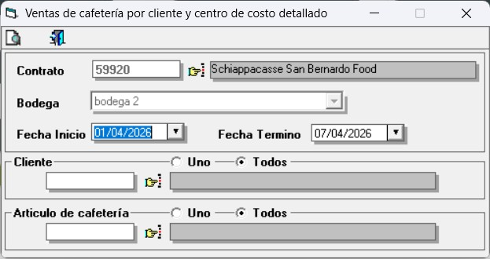
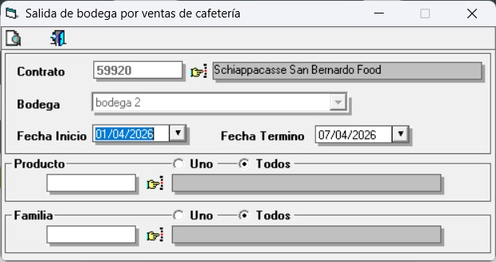

<u>**Descripción:**</u>
esta pantalla agrupa cuatro informes relacionados con las ventas registradas en la cafetería del casino. Dependiendo del tipo de informe que se abra, permite ver las ventas resumidas por artículo vendido, por cliente pagador y su centro de costo, o bien el desglose de los insumos de bodega que respaldaron esas ventas en un período determinado.
Los informes operan siempre sobre un único contrato (casino) y una bodega específica, dentro de un rango de fechas. Solo se incluyen ventas cuyo estado de cierre está marcado como "Cerrado" (tvc_estado = 'C'), lo que garantiza que los datos corresponden a transacciones completamente procesadas.
El resultado se presenta en vista previa en pantalla, con encabezado corporativo y pie de página con número de página, y puede ser impreso directamente desde esa vista.

| **Campo** | **Descripción** | **Obligatorio** |
| --- | --- | --- |
| Contrato | Código del casino (centro de costo) sobre el cual se generará el informe. Se puede escribir directamente o buscar mediante el ícono de lupa. | Sí |
| Bodega | Lista desplegable con las bodegas disponibles para el contrato seleccionado. | Sí |
| Fecha Inicio | Primera fecha del período a consultar. Por defecto se carga el primer día del mes en curso. Formato dd/mm/yyyy. | Sí |
| Fecha Término | Última fecha del período a consultar. Por defecto se carga la fecha del día. Formato dd/mm/yyyy. | Sí |
| Cliente / Producto | Filtro opcional de segundo nivel. Su etiqueta y disponibilidad cambian según el tipo de informe: en VenCaf2 y VenCaf3 corresponde al RUT del cliente; en VenCaf4 corresponde al código del producto (insumo de bodega). No aparece en VenCaf1. | No (opción "Todos") |
| Artículo de cafetería / Familia | Filtro opcional de tercer nivel. En VenCaf1 y VenCaf3 corresponde al código del artículo de cafetería; en VenCaf4 corresponde al código de familia de producto. No aparece en VenCaf2. | No (opción "Todos") |

El usuario debe tener permiso de impresión en el sistema para que el botón "Vista Previa" esté habilitado. Si no tiene ese permiso, el botón aparece desactivado al abrir la pantalla.
<u>**Regla de Negocio:**</u>
**Validaciones del sistema**

| **#** | **Cuándo aparece** | **Qué verifica el sistema** | **Qué ve o experimenta el usuario** |
| --- | --- | --- | --- |
| 1 | Al salir del campo Contrato con un valor ingresado | Que el contrato exista en la tabla de clientes | Mensaje: "Contrato no existe...". El campo se vacía y el cursor vuelve al campo. |
| 2 | Al salir del campo Cliente con un valor ingresado (VenCaf2 y VenCaf3) | Que el RUT del cliente exista en la tabla de clientes | Mensaje: "Cliente no existe...". El campo se vacía. |
| 3 | Al salir del campo Producto con un valor ingresado (VenCaf4) | Que el código de producto exista y esté disponible para el contrato actual | Mensaje: "Producto no existe...". El campo se vacía. |
| 4 | Al salir del campo Artículo de cafetería con un valor ingresado (VenCaf1 y VenCaf3) | Que el código de artículo exista en la tabla de artículos de cafetería para el contrato actual | Mensaje: "Articulo no existe...". El campo se vacía. |
| 5 | Al salir del campo Familia con un valor ingresado (VenCaf4) | Que el código de familia exista en el árbol de tipos de producto | Mensaje: "No existe codigo en la tabla...". El campo se vacía. |
| 6 | Al hacer clic en Vista Previa sin seleccionar bodega | Que haya una bodega seleccionada en la lista | Mensaje: "Seleccione Bodega...". El informe no se genera. |
| 7 | Al hacer clic en Vista Previa con opción "Uno" activa y campo vacío | Que si se eligió filtrar por uno específico, el campo correspondiente no esté vacío | Mensaje: "Seleccione <nombre del bloque>..." (por ejemplo, "Seleccione Cliente..." o "Seleccione Articulo de cafetería..."). El informe no se genera. |
| 8 | Al generar el informe sin resultados | Que existan ventas cerradas para los filtros indicados | El informe se cierra silenciosamente sin mostrar vista previa. No aparece un mensaje, simplemente no se abre la ventana de resultados. |

**Reglas de cálculo**
Solo se incluyen en el informe las ventas cuyo registro de totales tiene estado 'C' (Cerrado). Las ventas en estado abierto o pendiente no aparecen.
El **total por línea** se calcula como cantidad × precio unitario.
En el informe VenCaf3 (detallado), el sistema agrupa los artículos bajo el encabezado del cliente y centro de costo al que pertenecen, mostrando un **subtotal** por cada par cliente/centro de costo y un **total general** al final.
En el informe VenCaf4 (insumos), el **precio costo unitario** se calcula como total acumulado ÷ cantidad total, lo que corresponde al precio promedio ponderado del período.

| **#** | **Cuándo aparece** | **Qué verifica el sistema** | **Qué ve o experimenta el usuario** |
| --- | --- | --- | --- |
| 1 | Al salir del campo Contrato con un valor ingresado | Que el contrato exista en la tabla de clientes | Mensaje: "Contrato no existe...". El campo se vacía y el cursor vuelve al campo. |
| 2 | Al salir del campo Cliente con un valor ingresado (VenCaf2 y VenCaf3) | Que el RUT del cliente exista en la tabla de clientes | Mensaje: "Cliente no existe...". El campo se vacía. |
| 3 | Al salir del campo Producto con un valor ingresado (VenCaf4) | Que el código de producto exista y esté disponible para el contrato actual | Mensaje: "Producto no existe...". El campo se vacía. |
| 4 | Al salir del campo Artículo de cafetería con un valor ingresado (VenCaf1 y VenCaf3) | Que el código de artículo exista en la tabla de artículos de cafetería para el contrato actual | Mensaje: "Articulo no existe...". El campo se vacía. |
| 5 | Al salir del campo Familia con un valor ingresado (VenCaf4) | Que el código de familia exista en el árbol de tipos de producto | Mensaje: "No existe codigo en la tabla...". El campo se vacía. |
| 6 | Al hacer clic en Vista Previa sin seleccionar bodega | Que haya una bodega seleccionada en la lista | Mensaje: "Seleccione Bodega...". El informe no se genera. |
| 7 | Al hacer clic en Vista Previa con opción "Uno" activa y campo vacío | Que si se eligió filtrar por uno específico, el campo correspondiente no esté vacío | Mensaje: "Seleccione <nombre del bloque>..." (por ejemplo, "Seleccione Cliente..." o "Seleccione Articulo de cafetería..."). El informe no se genera. |
| 8 | Al generar el informe sin resultados | Que existan ventas cerradas para los filtros indicados | El informe se cierra silenciosamente sin mostrar vista previa. No aparece un mensaje, simplemente no se abre la ventana de resultados. |

**Reglas de cálculo**
Solo se incluyen en el informe las ventas cuyo registro de totales tiene estado 'C' (Cerrado). Las ventas en estado abierto o pendiente no aparecen.
El **total por línea** se calcula como cantidad × precio unitario.
En el informe VenCaf3 (detallado), el sistema agrupa los artículos bajo el encabezado del cliente y centro de costo al que pertenecen, mostrando un **subtotal** por cada par cliente/centro de costo y un **total general** al final.
En el informe VenCaf4 (insumos), el **precio costo unitario** se calcula como total acumulado ÷ cantidad total, lo que corresponde al precio promedio ponderado del período.
<u>**Tabla Relacionada:**</u>

| **Tabla** | **Para qué se usa** | **Campos clave** |
| --- | --- | --- |
| b_totventascaf | Registro de cabecera de cada sesión de ventas de cafetería. Actúa como filtro principal de estado y bodega. | tvc_cencos (contrato), tvc_fecing (fecha), tvc_estado ('C' = cerrado), tvc_codbod (bodega) |
| b_detventascaf | Detalle de cada artículo vendido dentro de una sesión. Contiene cantidad, precio, RUT del cliente y centro de costo del cliente. | dvc_cencos, dvc_fecing, dvc_articulo, dvc_canart, dvc_precio, dvc_rutcli, dvc_cencli |
| b_totpreciocaf | Maestro de artículos de cafetería del contrato, con sus nombres y códigos. | tpc_codigo, tpc_nombre, tpc_cencos |
| b_detventascafpro | Detalle de los insumos de bodega consumidos en las ventas de cafetería. Usado exclusivamente en VenCaf4. | dvp_cencos, dvp_fecing, dvp_codmer (código de producto), dvp_candig (cantidad), dvp_precos (precio de costo) |
| b_clientes | Maestro de contratos y clientes. Se usa para validar el contrato, obtener el nombre del casino y obtener el nombre del cliente a partir del RUT. | cli_codigo, cli_nombre |
| b_productos | Maestro de productos (insumos). Usado en VenCaf4 para validar el producto filtrado y obtener su nombre. | pro_codigo, pro_nombre, pro_coduni, pro_codtip, pro_maepro |
| a_unidad | Maestro de unidades de medida. Usado en VenCaf4 para mostrar la unidad del insumo. | uni_codigo, uni_nomcor |
| a_tipopro | Árbol de familias de producto. Usado en VenCaf4 para filtrar por familia. | tip_codigo |
| a_tiposervicio | Tipo de servicio asociado al producto. Usado en VenCaf4 durante la validación del producto. | tis_codigo |

### 9.32.1. Ventas por Articulo de Cafetería

<u>**Formato Salida:**</u>
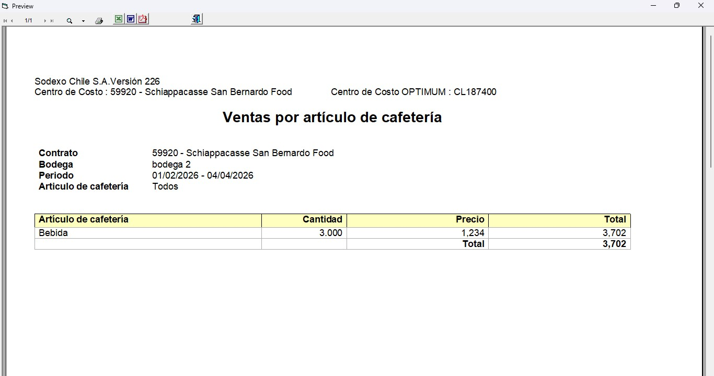
<u>**Descripción:**</u>
Muestra cuántas unidades se vendieron de cada artículo de cafetería en el período, junto con el precio y el monto total recaudado. El resultado se agrupa por artículo y ordena por código de artículo.
**Filtros disponibles:** Contrato (obligatorio), Bodega (obligatorio), rango de fechas (obligatorio), Artículo de cafetería (opcional — "Uno" o "Todos").
**Bloque de parámetros impreso en el encabezado del reporte:**

| **Etiqueta** | **Contenido** |
| --- | --- |
| Contrato | Código y nombre del casino |
| Bodega | Nombre de la bodega seleccionada |
| Periodo | Fecha inicio — Fecha término |
| Articulo de cafetería | "Todos" o código y nombre del artículo específico |

**Estructura de la tabla de datos:**

| **Campo** | **Descripción** | **Calculado** |
| --- | --- | --- |
| Artículo de cafetería | Nombre del artículo vendido | No |
| Cantidad | Suma de unidades vendidas del artículo en el período | Sí — SUM(dvc_canart) |
| Precio | Precio unitario del artículo | No |
| Total | Monto total recaudado por ese artículo | Sí — cantidad × precio |

Al final de la tabla aparece una fila de **Total** que suma todos los montos.

### 9.32.2. Ventas de Cafetería por Cliente y Centro de Costo

Formato Salida:
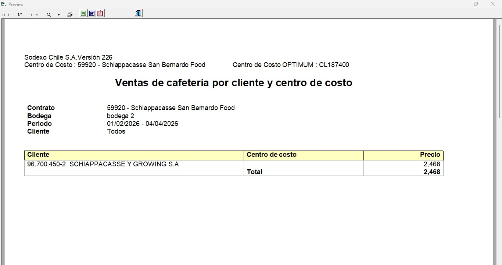
<u>**Descripción:**</u>
Muestra el monto total consumido por cada cliente en cafetería, indicando también el centro de costo al que cargaron su consumo. El resultado se ordena por RUT de cliente.
**Filtros disponibles:** Contrato (obligatorio), Bodega (obligatorio), rango de fechas (obligatorio), Cliente (opcional — "Uno" o "Todos"). No tiene filtro de artículo.
**Bloque de parámetros impreso en el encabezado del reporte:**

| **Etiqueta** | **Contenido** |
| --- | --- |
| Contrato | Código y nombre del casino |
| Bodega | Nombre de la bodega seleccionada |
| Periodo | Fecha inicio — Fecha término |
| Cliente | "Todos" o RUT formateado y nombre del cliente específico |

**Estructura de la tabla de datos:**

| **Campo** | **Descripción** | **Calculado** |
| --- | --- | --- |
| Cliente | RUT formateado y nombre del cliente | No |
| Centro de costo | Centro de costo al que el cliente cargó su consumo | No |
| Precio | Monto total consumido por ese cliente en ese centro de costo en el período | Sí — SUM(cantidad × precio unitario) |

Al final de la tabla aparece una fila de **Total** que suma todos los montos.

### 9.32.3. Ventas de Cafetería por Cliente y Centro de Costo Detallado

<u>**Formato Salida:**</u>
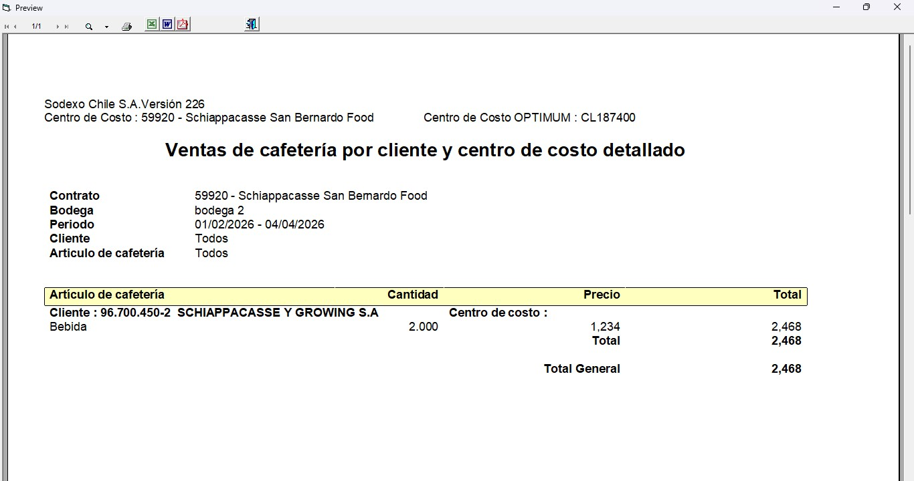
<u>**Descripción:**</u>
Expande el informe VenCaf2 mostrando, dentro de cada cliente y centro de costo, el detalle artículo por artículo de lo que consumió. Es el informe más completo de ventas de cafetería.
**Filtros disponibles:** Contrato (obligatorio), Bodega (obligatorio), rango de fechas (obligatorio), Cliente (opcional), Artículo de cafetería (opcional).
**Bloque de parámetros impreso en el encabezado del reporte:**

| **Etiqueta** | **Contenido** |
| --- | --- |
| Contrato | Código y nombre del casino |
| Bodega | Nombre de la bodega seleccionada |
| Periodo | Fecha inicio — Fecha término |
| Cliente | "Todos" o RUT formateado y nombre del cliente específico |
| Articulo de cafetería | "Todos" o código y nombre del artículo específico |

**Estructura de la tabla de datos:**
Los datos se presentan agrupados. Para cada par cliente/centro de costo se imprime un encabezado de grupo con el nombre del cliente y su centro de costo. Luego, dentro del grupo, se listan los artículos consumidos.

| **Campo** | **Descripción** | **Calculado** |
| --- | --- | --- |
| Artículo de cafetería | Nombre del artículo consumido por ese cliente | No |
| Cantidad | Suma de unidades consumidas del artículo | Sí — SUM(dvc_canart) |
| Precio | Precio unitario del artículo | No |
| Total | Monto de ese artículo para ese cliente | Sí — cantidad × precio |

Al final de cada grupo aparece un **subtotal** del cliente/centro de costo. Al final del informe aparece un **Total General** que suma todos los grupos.

### 9.32.4. Salida de Bodega por Ventas de Cafetería

<u>**Formato Salida:**</u>
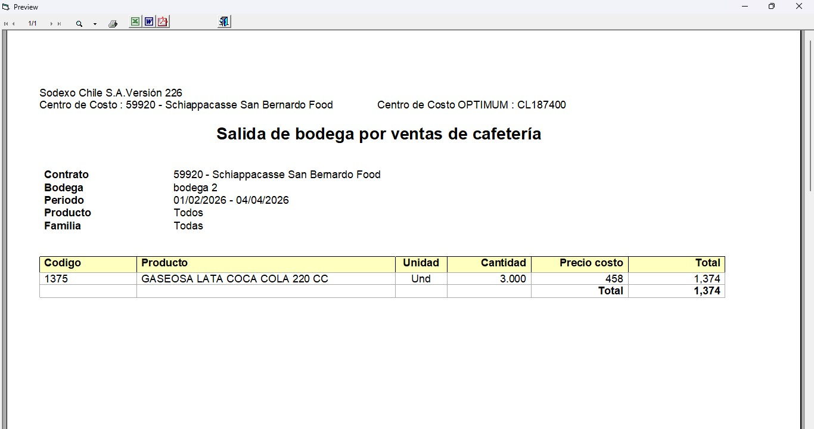
Descripción:
Muestra los insumos de bodega que fueron consumidos para soportar las ventas de cafetería registradas en el período. Permite entender el costo de los insumos detrás de las ventas. El resultado se ordena por código de producto.
**Filtros disponibles:** Contrato (obligatorio), Bodega (obligatorio), rango de fechas (obligatorio), Producto específico (opcional), Familia de producto (opcional).
**Bloque de parámetros impreso en el encabezado del reporte:**

| **Etiqueta** | **Contenido** |
| --- | --- |
| Contrato | Código y nombre del casino |
| Bodega | Nombre de la bodega seleccionada |
| Periodo | Fecha inicio — Fecha término |
| Producto | "Todos" o código y nombre del producto específico |
| Familia | "Todas" o código y nombre de la familia de producto |

**Estructura de la tabla de datos:**

| **Campo** | **Descripción** | **Calculado** |
| --- | --- | --- |
| Codigo | Código del producto (insumo de bodega) | No |
| Producto | Nombre del producto | No |
| Unidad | Unidad de medida abreviada | No |
| Cantidad | Total de unidades consumidas del producto en el período | Sí — SUM(dvp_candig) |
| Precio costo | Precio promedio ponderado del insumo en el período | Sí — total acumulado ÷ cantidad total |
| Total | Costo total del insumo consumido en el período | Sí — SUM(dvp_candig × dvp_precos) |

Al final de la tabla aparece una fila de **Total** que suma todos los costos.

## 9.33. Calculo Precio Minuta

Nota: Para los informes del SGP Administrador relacionados con costos, se debe aplicar el precio con impuestos adicionales, en caso de que corresponda.

### 9.33.1. Centro de Costo Normal (tipoceco = 0)

**Objetivo**:
Calcular el precio del ingrediente usando convenios SAP para sitios reales.
**Flujo**:
Se identifican los ingredientes (originales o reemplazados según jerarquía definida en la tabla de gramaje).
Se consultan precios en:
b_precio_ingrediente (precios base).
I_CONVENIO_SAP (condiciones del convenio).
b_formatocompras_sap (tipo de formato de compra).
b_Pedido_ExcepcionFormatoCompra (excepciones).
Se asigna un orden de prioridad:
Excepción activa → prioridad alta.
Formato de compra igual al del cliente → prioridad alta.
Condiciones del convenio → prioridad media.
Otros casos → prioridad baja.
Se selecciona el precio más conveniente (ORDER BY orden, Precio).
Se actualiza la tabla temporal #tabla con:
Convenio = precio seleccionado.
Producto asociado (pro_codigo, pro_nombre, pro_facing).

**Resultado:****
**
Precio por convenio para cada ingrediente, considerando reglas comerciales y vigencia.

### 9.33.2. Centro de Costo Propuesta (tipoceco = 1)

**Objetivo:****
**Calcular el precio del ingrediente para sitios propuestos, aplicando convenios y precios comerciales.
**Flujo:**
Se identifican los ingredientes (originales o reemplazados según jerarquía definida en la tabla de gramaje).
Se consultan precios en:
b_precio_ingrediente (precios base).
I_CONVENIO_SAP (condiciones del convenio).
b_formatocompras_sap (tipo de formato de compra).
b_Pedido_ExcepcionFormatoCompra (excepciones).
Se asigna el mismo orden de prioridad que en centro de costo normal.
Si no hay precio por convenio:
Se busca en b_precio_ingrediente_comercial (precio comercial activo).
Se actualiza la tabla temporal #tabla con:
Convenio = precio seleccionado (convenio o comercial).
Producto asociado.
**Resultado:**
Precio por convenio o comercial para cada ingrediente, asegurando cobertura en sitios propuestos.

# 10. Tabla de Gramaje

La función busca un ingrediente de reemplazo para otro ingrediente dentro de una receta, siguiendo una serie de reglas jerárquicas. Esto se usa cuando, por ejemplo, un ingrediente no está disponible y se necesita saber cuál es el sustituto correcto según las políticas del centro de costo.
Las reglas de búsqueda son:
Nivel 1: Si hay una regla exacta para ese centro de costo, régimen, receta e ingrediente en la tabla de gramaje estándar.
Nivel 2: Si no hay en nivel 1, busca una regla para centro de costo + régimen + ingrediente + tipo de plato en la tabla por nivel.
Nivel 3: Si tampoco hay, busca para centro de costo + régimen + ingrediente (sin tipo de plato).
Nivel 4: Última opción: centro de costo + ingrediente (sin régimen ni tipo de plato).
Si no hay información en los cuatro niveles anteriores, se considera el ingrediente y gramaje de la receta patrón.

# 11. Cálculos Nutricionales Aportes Nutricionales

## 11.1. Calculo Aporte Nutricionales

((((% nutricional / 100) * (cantidad aporte * (cantidad bruta o bien tabla de gramaje/ base receta))) / factor nutricional del ingrediente))

## 11.2. Calculo Proteína de Alto Valor Biológico

Cálculo de PAVB (Proteína de Alto Valor Biológico): PAVB = Σ ((% Nutricional/100) × (aportes proteína × Cantidad Bruta) / factor nutricional). PAVB% = (Total PAVB / raciones / Σ proteínas) × 100.

## 11.3. Calculo de Huela de Carbono

Cálculo de huella de carbono por receta: Σ (Cantidad Bruta × Huella Carbono del ingrediente)/1000.

# 12. Nuevo Reporte

**Rotación de ****S****tock**, el objetivo del reporte es mostrar a que ellos productos rotación baja y riesgo de merma.
**Informe de salida servicios especiales**, su formato debería ser igual como este mantenedor.
**Informe de devolución servicios especiales**, su formato debería ser igual como este mantenedor.
**Informe comparativo minuta Teórico Vs Real**** Vs Realizado****.**** **Es un comparativo entre las recetas ponderaciones, comensales de los tres tipos de minutas**.**

# 13. Mejoras Generales

Que todos los formatos que se exportan Excel la fecha sea formato fecha “dd/mm/yyyy”.
que aparezcan en columnas separadas código y descripción. En cualquier parámetro.
Dentro de todos los informes que tenga el concepto de bodega, que tenga la posibilidad de seleccionar más de una bodega.
Todos los campos de seleccion y filtro en los informes operen como un buscador donde el usuario pueda escribir letras o palabras completas y ese texto muestre todas las coincidencias en cualquier parte del texto (inicio, medio y final).
Formatos de salida son los generales al sistema (Excel, CSV, PDF).

# 14. Glosario

**Módulo de Informes** y redactado en un tono técnico–funcional.

**Glosario – Módulo de Informes SGP**

| **Término** | **Descripción** |
| --- | --- |
| **SGP (Sistema de Gestión de Producción)** | Plataforma corporativa que gestiona la planificación de minutas, producción, nutrición, costos, inventario y generación de informes operativos y de gestión. |
| **SGP Administrador** | Instancia central del sistema SGP utilizada para configuración, planificación, parametrización y consolidación de información a nivel corporativo. |
| **SGP Local (GestionCasino)** | Instancia operativa del sistema utilizada en cada casino para registrar producción, ventas, consumos, inventarios y cierres diarios. |
| **CECO (Centro de Costo)** | Código que identifica a un casino o sitio operativo. Es el principal filtro y eje de análisis de los informes. |
| **Casino / Sitio** | Unidad operativa donde se presta el servicio de alimentación y sobre la cual se generan planificaciones, costos y reportes. |
| **Régimen** | Tipo de alimentación definido para un casino (por ejemplo normal, especial, terapéutico), utilizado para clasificar minutas y raciones. |
| **Servicio** | Tipo de comida o tiempo de consumo asociado a una minuta (desayuno, almuerzo, cena, colación, etc.). |
| **Estructura de Servicio** | Subdivisión interna de un servicio (por ejemplo línea caliente, ensaladas, postres), utilizada en la planificación y análisis detallado. |
| **Minuta** | Planificación diaria de recetas asociadas a un casino, régimen y servicio, base para el cálculo de costos, raciones y aportes nutricionales. |
| **Minuta Bloque** | Tipo de planificación que agrupa varios días consecutivos bajo una misma estructura de recetas y servicios. |
| **Bloque de Planificación** | Identificador que define el período de vigencia de una planificación de minuta bloque. |
| **Receta** | Preparación culinaria definida en el sistema, compuesta por ingredientes, gramajes y parámetros nutricionales. |
| **Ingrediente** | Insumo base que compone una receta, con propiedades de unidad de medida, conversiones, mermas y valores nutricionales. |
| **Producto SGP** | Producto comercial asociado a un ingrediente, usado para compras, stock y precios, con formato y facing definidos. |
| **Facing** | Cantidad de ingrediente contenida en una unidad de compra del producto; se usa para convertir consumo a unidades comerciales. |
| **Ración** | Porción individual servida a un comensal. Puede ser planificada (teórica), producida o vendida. |
| **Comensales** | Cantidad total de personas consideradas en la planificación de una minuta para un servicio y día determinado. |
| **Ponderación (%)** | Porcentaje que representa una receta dentro del total de raciones de un servicio en la planificación. |
| **Gramaje** | Cantidad de un ingrediente expresada en gramos. Puede ser bruto, servida, neta o neta nutricional. |
| **Gramaje Bruto** | Cantidad original del ingrediente definida en la receta antes de aplicar mermas o factores de cocción. |
| **Aprovechamiento (%)** | Porcentaje del ingrediente utilizable luego de procesos de limpieza o preparación. |
| **Cocción (%)** | Porcentaje que representa la merma del ingrediente producto del proceso de cocción. |
| **Neto / Neto Nutricional** | Cantidad resultante luego de aplicar aprovechamiento, y posteriormente el porcentaje nutricional para cálculos de aporte. |
| **Aporte Nutricional** | Cálculo de nutrientes aportados por recetas, minutas o ingredientes (calorías, proteínas, lípidos, etc.). |
| **Aporte Nutricional Sansis** | Informe nutricional generado en formato Excel, compatible con el modelo del sistema Sansis. |
| **PAVB** | Proteína de Alto Valor Biológico, indicador nutricional calculado a partir de ingredientes definidos como tales. |
| **Costo Teórico** | Costo estimado en base a la planificación de recetas y raciones definidas en la minuta. |
| **Costo Real** | Costo calculado según raciones vendidas y precios efectivos de ingredientes. |
| **Costo Realizado** | Costo basado en el consumo real de ingredientes registrado durante el cierre operacional. |
| **Costo Bandeja** | Costo unitario por ración, calculado como el costo total dividido por el número de raciones. |
| **Food Cost** | Indicador porcentual que relaciona el costo de alimentación con la venta del período. |
| **Merma** | Pérdida de alimentos registrada durante procesos de producción, desconche o panadería. |
| **Huella de Carbono** | Indicador ambiental asociado a un ingrediente o minuta, utilizado para análisis de impacto ambiental. |
| **Curva ABC** | Clasificación de productos o ingredientes según su impacto relativo en el costo total (A, B o C). |
| **Grilla** | Tabla interactiva en las pantallas del sistema que permite seleccionar filtros o registros para generar informes. |
| **Informe Detallado** | Formato de informe que presenta el desglose completo por día, servicio, receta o ingrediente. |
| **Informe Resumido** | Formato de informe que consolida la información agregada sin detalle de recetas o ingredientes. |
| **Exportación Excel** | Generación de archivos XLS o XLSX como formato principal de salida para análisis externo. |
| **VSPrinter** | Componente utilizado en la arquitectura actual para renderizar informes en vista previa e impresión. |
| **SAP** | Sistema corporativo externo desde el cual se integran convenios de compra, materiales y precios. |
| **Sansis** | Sistema externo de nutrición con el cual el SGP intercambia información de planificación y aportes nutricionales. |

# 15. Requerimientos General

**Filtro**
Filtro actual, en cada listado busca por la primera que se ingresa (ejemplo si escribo “c”  el listado se mueve/muestra al ítem que empieza con esa letra).
Filtro deseado, debe mejorarse a uno que a medida que uno va escribiendo una segunda o siguiente letra, se mueve/muestra al ítem que empieza por la palabra escrita (ejemplo si escribo “car” el filtro se mueve/muestra al ítem que empieza con esas letras/palabra escrita).
**Calculo Aportes Nutricionales**
Considere los porcentajes incluidos en el maestro de ingrediente.
En el detalle maestro receta actualmente los valores se guardan los valores en la receta y deben estar en el ingrediente, se deben arrastrarse del ingrediente a la receta.
**Filtro Bodega**
La opción de selección de bodega debe estar activado para seleccionar una bodega o todas las bodegas (multi bodega).

Fin del Documento
