# DRF - Inventario

---

## Índice

- [**Historial de Versiones**](#historial-de-versiones)
- [1. Confidencialidad](#1-confidencialidad)
- [2. Información del Proyecto](#2-información-del-proyecto)
- [3. Responsables](#3-responsables)
- [4. Aprobaciones](#4-aprobaciones)
- [5. Situación Actual](#5-situación-actual)
- [6. Propósito del proyecto](#6-propósito-del-proyecto)
- [7. Alcance del proyecto](#7-alcance-del-proyecto)
  - [7.1. Visión General del Módulo de Inventario](#71-visión-general-del-módulo-de-inventario)
- [8. Requerimientos Funcionales](#8-requerimientos-funcionales)
  - [8.1. Visión General del Módulo de Inventario](#81-visión-general-del-módulo-de-inventario)
  - [8.2. Flujo completo de interacción entre módulos](#82-flujo-completo-de-interacción-entre-módulos)
  - [8.3. Ingreso Documento Proveedor (M_DocPro.frm)](#83-ingreso-documento-proveedor-m_docprofrm)
  - [8.4. Ingreso Documento Guías CD (M_Traspa.frm)](#84-ingreso-documento-guías-cd-m_traspafrm)
  - [8.5. Ingreso Traspaso entre Casinos (M_Traspa.frm)](#85-ingreso-traspaso-entre-casinos-m_traspafrm)
  - [8.6. Merma de Bodega (M_Mermas.frm)](#86-merma-de-bodega-m_mermasfrm)
  - [8.7. Salida de Producción (M_SalBod.frm)](#87-salida-de-producción-m_salbodfrm)
  - [8.8. Venta Directa (M_VenDir.frm)](#88-venta-directa-m_vendirfrm)
  - [8.9. Venta Cafetería (M_VenCaf.frm)](#89-venta-cafetería-m_vencaffrm)
  - [8.10. Salida Ventas de Servicios Especiales (M_SalidaServicioEspeciales.frm)](#810-salida-ventas-de-servicios-especiales-m_salidaservicioespecialesfrm)
  - [8.11. Devolución Producción (M_DevBod.frm)](#811-devolución-producción-m_devbodfrm)
  - [8.12. Devolución Ventas Especiales (M_DevolucionSalidaEspeciales.frm)](#812-devolución-ventas-especiales-m_devolucionsalidaespecialesfrm)
  - [8.13. Toma de Inventario (M_TomInv.frm)](#813-toma-de-inventario-m_tominvfrm)
  - [8.14. Ajuste de Inventario (M_AjuInv.frm)](#814-ajuste-de-inventario-m_ajuinvfrm)
  - [8.15. Formato Excel para Módulo Toma de Inventario (P_EIInve.frm)](#815-formato-excel-para-módulo-toma-de-inventario-p_eiinvefrm)

---

# **Historial de Versiones**

| Versión | Fecha | Autor | Descripción |
| --- | --- | --- | --- |
| 1 | 20-Feb-2026 | Cecilia Sandoval Claudia Muñoz Jorge Paz Francisco Zeballos Marcelo González | Primera Versión |
| 1.3 | 27-Mar-2026 | Cecilia Sandoval Claudia Muñoz Jorge Paz Francisco Zeballos Marcelo González | Tercera Versión |
|  |  |  |  |
|  |  |  |  |
|  |  |  |  |
|  |  |  |  |

# 1. Confidencialidad

La información de este documento y documentos anexos es propiedad de **SODEXO CHILE** y de carácter confidencial, por lo cual el proveedor debe mantener la información en reserva y usarla sólo para el propósito de prestar los servicios solicitados.

El proveedor se obliga además a tomar las medidas para que quienes tengan acceso a la Información, guarden bajo estricta reserva, protejan y no revelen a terceros dicha Información, siendo responsabilidad del proveedor velar por el cumplimiento de esta obligación.

En caso de avanzar con el proyecto, el proveedor deberá firmar un documento de Confidencialidad de la Información (NDA Sodexo), donde se describe con mayor detalle estas obligaciones.

Toda la información entregada por el proveedor para la evaluación de un servicio, sistema y/o solución informática será propiedad de **SODEXO CHILE**, sin que esto signifique un costo o genere algún tipo de cargo para la empresa.

# 2. Información del Proyecto

| Estructura | Descripción |
| --- | --- |
| Segmento | Servicios de alimentación / operación de Casinos |
| Área | Operaciones / Bodega / producción |
| Sección | SGP Local - Modulo Inventario |
| Proyecto | SGP Upgrade - Modulo de Inventario |

# 3. Responsables

| ROL | Nombre | Correo Electrónico |
| --- | --- | --- |
| Sponsor | Francisco González | francisco.gonzalez@sodexo.com |
| Líder Proyecto | Claudia Muñoz | Claudia.munoz@sodexo.com |
| Key User | Cecilia Sandoval | María.sandoval@sodexo.com |
| Líder TI | Marcelo Gonzalez | marcelo.gonzalez@sodexo.com |
| Finanzas (Contabilidad) | Jorge Meneses | Jorge.Meneses@sodexo.com |
|  |  |  |

# 4. Aprobaciones

Comité de Tecnología.

# 5. Situación Actual

El módulo de Inventario del SGP Local administra los movimientos de stock de bodega para cada casino o centro de costo. Controla entradas, salidas, traspasos, mermas, devoluciones y ajustes de inventario.

La base de este documento se construye desde el comportamiento del sistema actual (formularios del SGP Local) y se presenta en formato funcional para revisión del KEY USER.

El módulo impacta directamente el stock y el costo valorizado (PMP).

Se relaciona con compras, producción, cafetería, servicios especiales y reportes de costo.

Incluye validaciones de periodo, fechas, stock y correlativos de documentos.

El UPGRADE debe conservar la lógica valida y mejorar la experiencia de uso y la trazabilidad.

# 6. Propósito del proyecto

Documentar y validar funcionalmente el módulo de Inventario para el proyecto SGP UPGRADE, dejando claro como operan los submódulos, cuáles son sus reglas de negocio y que mejoras se proponen para una operación más controlada y entendible.

Facilitar la revisión del KEY USER con lenguaje simple y diagramas.

Definir una base común para desarrollo, pruebas y aprobación.

Disminuir riesgos de interpretación durante el UPGRADE.

# 7. Alcance del proyecto

Este DRF considera la descripción general del módulo, el flujo de interacción con otros módulos y el detalle funcional de los submódulos de inventario.

Incluye funcionalidades, reglas de negocio, tablas asociadas y mejoras sugeridas. No incluye diseño técnico detallado ni especificaciones de integración a nivel de API.

## 7.1. Visión General del Módulo de Inventario

Entrada de Productos (sin cambios)

- Ingreso Documento Proveedor
- Ingreso Documento Guías CD
- Ingreso Traspaso entre Casinos
- Devolución Producción
- Devolución Ventas Especiales

Salida de Productos (se eliminan los 5 ítems de toma/ajuste)

- Salida de Producción
- Merma de Bodega
- Ingreso Venta Directa
- Registro Venta Cafetería

> 💬 **Comentario — Sandoval Nocchi, Maria Cecilia (2026-03-05):** Confirmar si sacaremos este módulo

> 💬 **Comentario — Gonzalez Segovia Marcelo (2026-03-24):** Se agrego comentario en la sección correspondiente.

- Salida Ventas Especiales

Control y Ajuste de Inventario (nueva categoría con los 5 ítems reubicados)

- Toma de Inventario
  - Informes
- Ajuste de Inventario
- Formato Excel para Toma de Inventario

# 8. Requerimientos Funcionales

## 8.1. Visión General del Módulo de Inventario

El módulo de Inventario asegura la continuidad de la operación, manteniendo stock confiable y valorizado para cada bodega. Cada movimiento debe dejar trazabilidad documental y reflejar su impacto en costo y control.

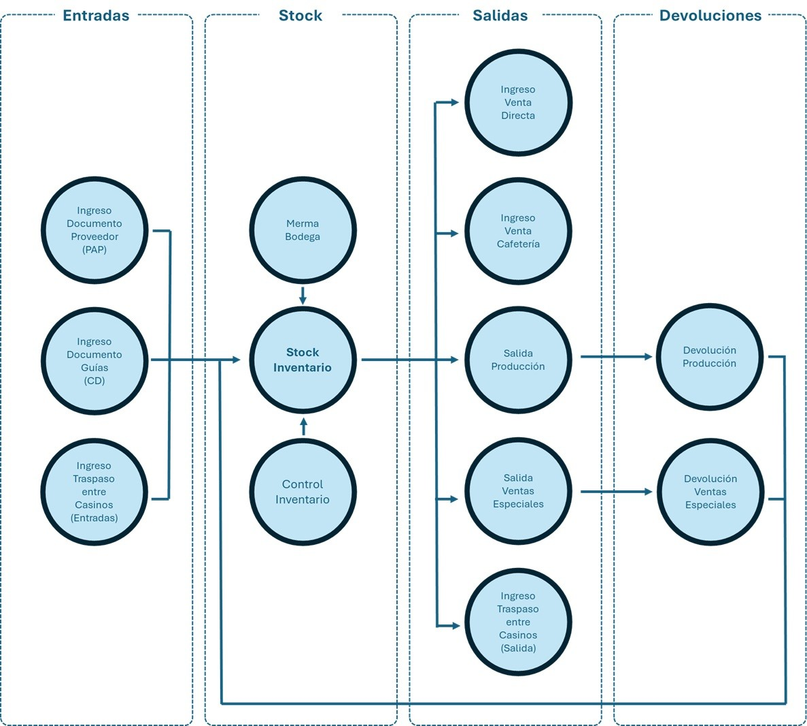

*Figura 1. Diagrama general del módulo de Inventario**.*

## 8.2. Flujo completo de interacción entre módulos

El siguiente diagrama resume como interactúan Ingresos, producción, cafetería, venta directa, servicios especiales, devoluciones, inventario y control de costos:

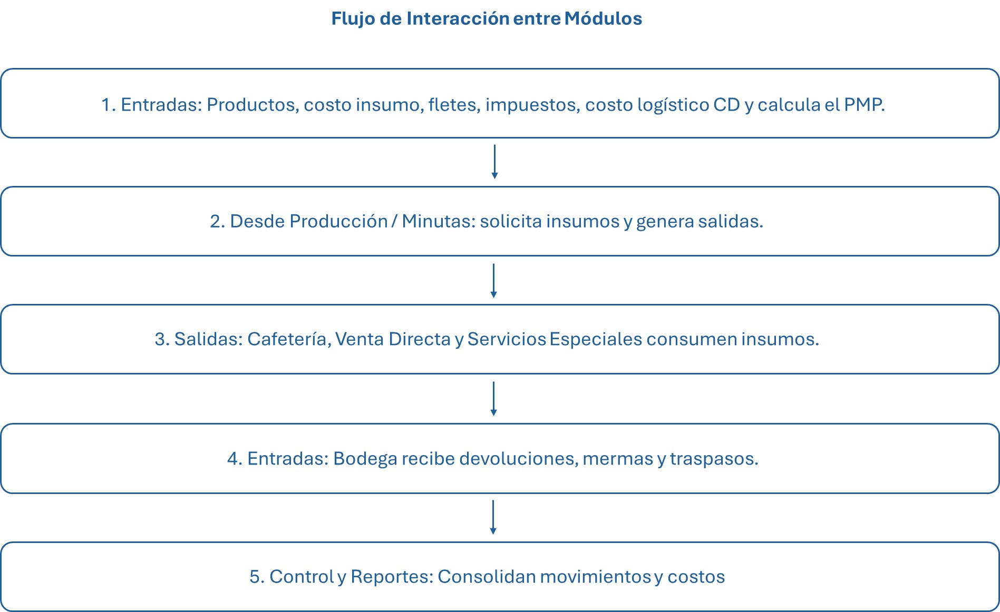

*Figura 2. Flujo de interacción entre módulos**.*

**¿Cómo interactúan los movimientos con el stock?**

| Tipo de Movimiento | Efecto en Stock | Cuando se aplica |
| --- | --- | --- |
| Ingreso de Factura / Guía de Proveedor, Guias CD | + Aumenta | Al grabar el documento |
| Traspaso Entrada (recibir de otro casino) | + Aumenta | Al grabar la entrada |
| Devolución desde Producción | + Aumenta | Al grabar la devolución |
| Devolución desde Ventas Especiales | + Aumenta | Al grabar la devolución |
| Ajuste de Inventario (positivo) | + Aumenta | Al grabar el ajuste |
| Salida de Producción | - Disminuye | Al grabar la salida |
| Traspaso Salida (enviar a otro casino) | - Disminuye | Al grabar la salida |
| Merma de Bodega | - Disminuye | Al grabar la merma |
| Venta Directa | - Disminuye | Al grabar el documento |
| Venta Cafetería | - Disminuye | Solo al cerrar la venta del día |
| Salida Ventas Especiales | - Disminuye | Procesado por el sistema automáticamente |
| Ajuste de Inventario (negativo) | + Aumenta / - Disminuye | Al grabar el ajuste |

**Actores del módulo**

| Actor | Acciones principales |
| --- | --- |
| Operador de bodega | Registra todos los movimientos de entrada y salida de bodega, gestiona el inventario de acuerdo a los procedimientos actuales, registra mermas toma y registra inventarios y sus ajustes |
| Jefe de cocina | Solicita insumos a bodega para la producción, realiza devolución de los remanentes y, supervisa stock |
| Administrador casino | Debe validar que toda la información este ingresada para realizar los cierres diarios, y revisar reportes para cumplimiento. |
| SGP Administrador | Gestiona parámetros del sistema, mantenedores de productos y proveedores. Configuración de bodegas, ejecución de cierres de período mensual y diario. Habilitas funcionalidades por. |
| Equipo de Finanzas (Contabilidad) | Descarga reporte A13 desde Web Reporting (post-cierre mensual). Usa Power BI de Inventario para consolidar todos los sitios. Usa Reporte de Traspasos para contabilizar movimientos entre casinos. Cuadra ajustes de inventario contra SAP. |

**NOTA: **El equipo de Finanzas (Contabilidad) no opera directamente el sistema SGP, pero es usuario final de los datos generados por el módulo. Accede al reporte A13 y al Reporte de Traspasos a través del portal Web Reporting una vez que los sitios cierran su período mensual. Utiliza además el Power BI de Inventario (SharePoint Export_SGP_PBI) para consolidar información de todos los centros de costo.

## 8.3. Ingreso Documento Proveedor (M_DocPro.frm)

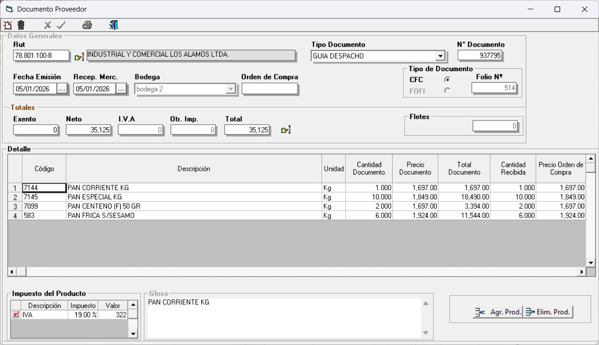

*Figura 3. Formulario Ingreso Documento Proveedor** (**M_DocPro.frm**).*

Formulario central del módulo de inventario. Permite registrar todos los documentos recibidos de proveedores: **facturas normales** (FA) (Obsoletos), **facturas electrónicas** (FE), **guías de despacho electrónicas** (GE) y **solicitudes de nota de crédito/débito** (SN). Existen dos modalidades de ingreso:

> 💬 **Comentario — Sandoval Nocchi, Maria Cecilia (2026-03-05):** No existen los documentos FA, Solo electrónicos.

> 💬 **Comentario — Gonzalez Segovia Marcelo (2026-03-26):** Se ingresa comentario: Obsoleto

> 💬 **Comentario — Sandoval Nocchi, Maria Cecilia (2026-03-05):** El sistema genera un registro para saber si es existen diferencias, para con esto solicitar notas de créditos y o débito por diferencias de cantidad y en el caso de diferencias de precio solo la genera si se realiza cambio en la celda “precio orden de compra”. En ningún caso genera alguna solicitud directa a proveedores.

> 💬 **Comentario — Gonzalez Segovia Marcelo (2026-03-26):** Se ingresa observación

> 💬 **Comentario — Sandoval Nocchi, Maria Cecilia (2026-03-05):** A lo mejor en esta parte se debería agregar una nota sobre que los documentos ingresan por integración de PEL y en este módulo son ingreso de excepciones e ingreso de guías de pan.                                                                 Además consideran en el caso de FOFI  que el proveedor no emite directo al casino sino que emite una factura a Sodexo Chile y estas solamente se reciben en SGP para aumentar el stock y son ingresadas en Rydoo para rendición.Compras contado, sin OC, con Factura, se rinden a través de Rydoo, no vienen por PEL, se ingresan directamente en SGP

> 💬 **Comentario — Gonzalez Segovia Marcelo (2026-03-26):** Se ingresa Observación

**FOFI**** – FONDO FIJO**

> 💬 **Comentario — MUNOZ MARTINEZ Claudia (2026-03-10):** El fondo fijo corresponde a las rendiciones de compras al contado (p.e. supermercado) y actualmente se rinden por Rydoo. Acá el tema es que no mueven inventario. Revisar si se mantiene con otro nombre y tipo de documento para que solo mueva inventario y lo valorice

El proveedor emite directamente al casino. Se ingresa con número de folio del proveedor. Estos ingresos corresponden a las rendiciones de compras al contado (ej. supermercado) y actualmente se rinden por **Rydoo**.

> 💬 **Comentario — Sandoval Nocchi, Maria Cecilia (2026-03-05):** No debería tener OC ya que es una compra por fuera

**CFC – ****C****ontrol ****F****acturas ****C****ompras**

La factura viene procesada por la central de abastecimiento. Puede agrupar varias guías de despacho previas.

> 💬 **Comentario — Sandoval Nocchi, Maria Cecilia (2026-03-05):** Esto ya no se utiliza como concepto. Revisar nombres, hay 2 tipos de facturas las facturas crédito (por pagar) y contado. Los productos pueden llegar directo desde el proveedor (PAP) o a través de una central de distribución (cross docking). La descripción en el documento puede confundir.Esto se refiere a Crossdocking? La central de abastecimiento no procesa facturas, solo recibe un proveedor PAP para transporte de los productos, el sitio debe aprobar la factura en PEL

> 💬 **Comentario — Gonzalez Segovia Marcelo (2026-03-26):** Se ingresa observación

**Observación:**

- Con respecto a las **“****solicitudes de nota de crédito/débito****”** El sistema genera un registro para saber si es existen diferencias, para con esto solicitar notas de créditos y o débito por diferencias de cantidad y en el caso de diferencias de precio solo la genera si se realiza cambio en la celda “precio orden de compra”. En ningún caso genera alguna solicitud directa a proveedores.

> 💬 **Comentario — Sandoval Nocchi, Maria Cecilia (2026-03-05):** El sistema genera un registro para saber si es existen diferencias, para con esto solicitar notas de créditos y o débito por diferencias de cantidad y en el caso de diferencias de precio solo la genera si se realiza cambio en la celda “precio orden de compra”. En ningún caso genera alguna solicitud directa a proveedores.

- Con respecto a las **“Modalidades de Ingreso”** Los documentos principalmente se ingresan por integración de **PEL** y en este módulo son ingreso de excepciones e ingreso de guías de pan.  Además, consideran en el caso de **FOFI** que el proveedor no emite directo al Casino, sino que emite una factura a Sodexo Chile y estas solamente se reciben en SGP para aumentar el stock y son ingresadas en Rydoo para rendición.
- Compras contado, sin OC, con Factura, se rinden a través de Rydoo, no vienen por PEL, se ingresan directamente en SGP
- Con respecto a “**CFC – Control Facturas Compras****” **Esto ya no se utiliza como concepto.

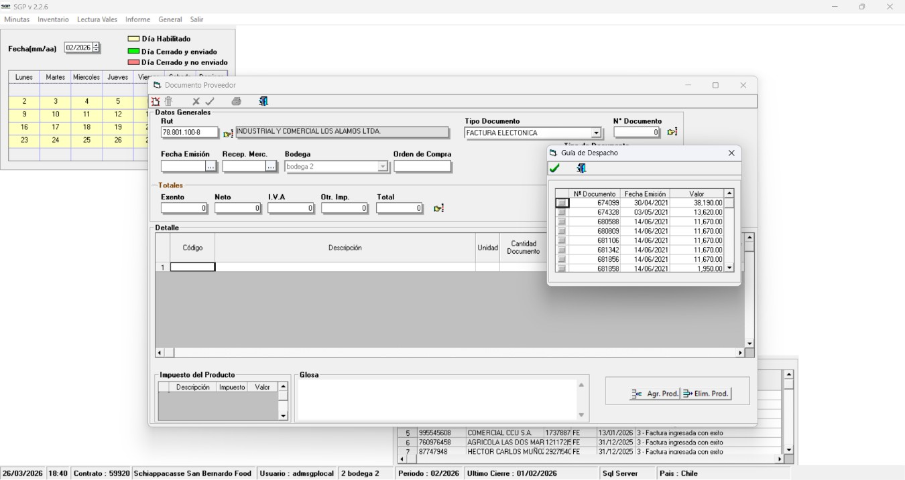

*Figura **4**. Formulario **Asociación Guías de Despacho (B_Guias**.frm**).*

Cuando se ingresa una Factura o Factura Electrónica, el sistema verifica automáticamente si el proveedor tiene Guías de Despacho pendientes de facturar en la bodega activa, invocando el procedimiento sgp_Sel_ValidaCfCGuia. Si existen guías sin asociar, se muestra un ícono de alerta que permite al usuario abrir una ventana de selección de guías (B_Guias). Al seleccionar una o más guías, el sistema pre-carga el detalle de productos en la grilla de la factura y bloquea la edición de montos para preservar la consistencia con los documentos origen. Al confirmar la grabación, el número de la factura se escribe en el campo toc_docaso de cada guía seleccionada en la tabla b_totcompras, estableciendo el vínculo formal entre ambos documentos. Si posteriormente la factura es eliminada, el sistema libera las guías asociadas limpiando ese mismo campo, permitiendo que vuelvan a quedar disponibles para ser facturadas.

**Flujo de Ingreso Documento ****Proveedor (Procedimiento Manual)****:**

> 💬 **Comentario — Sandoval Nocchi, Maria Cecilia (2026-03-05):** Falta seleccionar tipo de documentos e ingresar número de factura.Folio no se ingresa lo genera el sistema. Los CFC ya no se utilizan para envío de información, se utiliza Rydoo y Agilice.

> 💬 **Comentario — Gonzalez Segovia Marcelo (2026-03-26):** Flujo Modificado

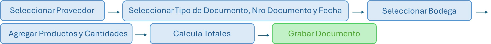

**Nota:** Este flujo corresponde al ingreso manual (menos usado). Las facturas se integran desde PEL (Integración).

| Campo | Descripción | Obligatorio |
| --- | --- | --- |
| RUT Proveedor | RUT del proveedor emisor del documento, con o sin dígito verificador. Se valida contra el maestro de proveedores. | Sí |
| Tipo de Documento | Tipo tributario del documento: Factura, Factura Electrónica, Guía de Despacho, Nota de Crédito, Nota de Crédito Electrónica, Nota de Débito, Nota de Débito Electrónica, Boleta de Honorarios, Boleta, Comprobante de Gasto. | Sí |
| N° de Documento | Número correlativo del documento emitido por el proveedor. | Sí |
| Bodega | Bodega que recepciona la mercadería o a la que se imputa el documento. | Sí (seleccionable) |
| Fecha Emisión | Fecha en que el proveedor emitió el documento (formato dd/mm/aaaa). | Sí |
| Fecha Recepción de Mercadería | Fecha en que se recibió físicamente la mercadería en bodega. Determina el período contable del documento. | Sí |
| Tipo de registro (FOFI / CFC) | Indica si el documento se incorpora bajo metodología FIFO (primeras entradas, primeras salidas) o CFC (costo de factura de compra). | Sí |
| Folio N° | Número de folio interno del período de registro (CFC o FOFI). | Sí (cuando aplica) |
| Orden de Compra | Número de la orden de compra asociada, cuando el documento respalda una OC. | No |
| Productos (grilla de detalle) | Una o más líneas con código de producto, cantidad facturada, precio unitario, porcentaje de descuento, cantidad y precio recibido. | Sí (al menos una línea) |
| Glosa | Texto libre descriptivo para la línea de detalle seleccionada (informativo). | No |
| Fletes | Monto de fletes incluido en el documento (se distribuye en el costo de los productos). | No |
| Exento | Monto exento de impuesto. Se calcula automáticamente desde el detalle. | Condicional |
| Neto | Monto neto gravado. Se calcula automáticamente desde el detalle. | Condicional |
| IVA | Monto de IVA calculado sobre el neto. | Condicional |
| Otros Impuestos | Monto de impuestos adicionales (distinto de IVA). | Condicional |
| Total | Suma de Exento + Neto + IVA + Otros Impuestos + Fletes. Debe coincidir con el total calculado en el detalle. | Sí |

**Observaciones:**

- Registro de facturas (FA) (no se utiliza ya que está obsoleta en SII)
- Ingreso de Impuesto, **solo si**, se requiere una modificación.
- Ingreso de flete del documento, prorrateado automáticamente por producto.
- Validación de precios contra el último precio registrado (alerta si excede el desvío configurado). Este porcentaje está en la tabla a_param y se administra por ceco, ej, 20%)

> 💬 **Comentario — Sandoval Nocchi, Maria Cecilia (2026-03-05):** Está validación se configura por cualquier cambio de precio? Hay un rango de aceptación? Actualmente el sistema solo genera una mensaje, y siempre indica que excede, incluso cuando el precio es más bajo.

> 💬 **Comentario — Sandoval Nocchi, Maria Cecilia (2026-03-06):** Detallar, falta fecha, tipo documento, número de documento, etc.

- Anulación de documentos (no se borran, quedan marcados como anulados).
- Actualización de stock en bodega y recalculo de costo PMP.

> 💬 **Comentario — Sandoval Nocchi, Maria Cecilia (2026-03-05):** El recalculo se realiza solo con el cierre diario? Esto salió en el otro documento y tenemos la duda.

**Reglas de negocio:**

| # | Cuando aparece | Qué verifica el sistema | Qué ve o experimenta el usuario |
| --- | --- | --- | --- |
| 1 | Al salir del campo RUT | Que el RUT exista en el maestro de proveedores (b_proveedor). | "Proveedor no existe..." |
| 2 | Al intentar grabar | Que el proveedor no esté bloqueado para ingreso de documentos (prv_permiteingdoc = 0). | "Proveedor esta bloqueado para el ingreso documento..." |
| 3 | Al intentar grabar | Que el proveedor no esté inactivo o eliminado (prv_activo = 1 o 2) cuando no hay guía de despacho asociada. | "Proveedor esta en estado: (Inactivo ó bien Eliminado), No puede ingresar documento..." |
| 4 | Al intentar grabar | Que el proveedor local (origen = 0) solo ingrese documentos con tipo FOFI. | "Proveedor es local, solamente puede ingresar documento fofi..." |
| 5 | Al intentar grabar | Si el proveedor tiene configurado documento electrónico y se intenta ingresar uno manual (o viceversa). | "El tipo de documento predeterminado para este proveedor es tipo ELECTRONICO ¿Está seguro de que el documento ingresado es tipo MANUAL?" (requiere confirmación) |
| 6 | Al intentar grabar | Que la fecha de recepción de mercadería no corresponda a un período cerrado. | "Documento no corresponde al periodo: [fecha]" |
| 7 | Al intentar grabar | Que la fecha de recepción no sea anterior al cierre diario del día. | "Día se encuentra cerrado, no es posible ingresar..." |
| 8 | Al intentar grabar | Que no exista una toma de inventario en curso. | "Se esta realizando la toma de inventario en estos momento..." |
| 9 | Al intentar grabar | Que no haya un inventario calendarizado próximo que bloquee el ingreso. | "No puede ingresar documento, antes de un inventario calendarizado..." |
| 10 | Al intentar grabar | Que el ajuste de la última toma de inventario haya sido realizado. | "No ha realizado el ajuste correspondiente a la última toma de inventario..." |
| 11 | Al intentar grabar | Que el documento (RUT + Tipo + Número) no exista ya registrado en otra bodega. | "Documento ya existe en la bodega: [nombre bodega]" |
| 12 | Al intentar grabar | Que el folio interno no corresponda a un período distinto al del documento actual. | "N° folio corresponde al periodo: [mm/aaaa] Tiene que generar un nuevo folio" |
| 13 | Al intentar grabar | Que el folio no supere los 20 documentos. | "Folio excede los 20 documento, genero un nuevo folio..." |
| 14 | Al intentar grabar | Que exista un contrato/bodega válido asignado. | "Contrato no existe..." |
| 15 | Al intentar grabar | Que haya datos de proveedor y tipo de documento completos. | "No hay datos proveedor..." |
| 16 | Al intentar grabar | Que se haya ingresado el N° de documento. | "Debe ingresar N° de documento..." |
| 17 | Al intentar grabar | Que el total del documento sea mayor a cero (excepto Guías de Despacho). | "Total documento no puede ser cero..." |
| 18 | Al intentar grabar | Que las fechas de emisión y recepción estén completadas. | "Debe seleccionar fechas..." / "Fecha esta en blanco..." |
| 19 | Al intentar grabar | Que se haya seleccionado FOFI o CFC. | "Tipo de documento no valido..." |
| 20 | Al intentar grabar | Que el RUT del proveedor sea matemáticamente válido (módulo 11). | "El rut no es valido..." |
| 21 | Al intentar grabar | Que la grilla de detalle tenga al menos una línea. | "Documento sin detalle..." |
| 22 | Al intentar grabar | Que ninguna línea de la grilla tenga cantidad o precio en cero (excepto Órdenes de Compra). | "La cantidad o el precio de un producto es cero..." |
| 23 | Al intentar grabar | Que los montos de Exento, Neto, IVA, Otros Impuestos y Total ingresados manualmente coincidan con los calculados desde el detalle. | "Los totales del documento no conciden con el detalle ingresado..." |
| 24 | Al intentar grabar con precios fuera de rango | Que el precio ingresado no exceda el porcentaje de variación permitido respecto al último precio registrado (porprepro). | "Existen precios ingresados, que excede al ultimo precio registrado. Graba documento..." (requiere confirmación) |
| 25 | Al confirmar grabar | Solicita confirmación antes de ejecutar la grabación. | "Graba documento..." (Sí / No) |
| 26 | Al intentar eliminar | Que el período del documento no esté cerrado. | "Periodo esta cerrado..." |
| 27 | Al intentar eliminar | Que el documento no haya sido enviado a SAP (campo CFC). | "Documento no puede ser borrado, fue enviado CFC a SAP..." |
| 28 | Al intentar eliminar | Que el stock en bodega no quede negativo al revertir las cantidades. | "Documento no puede ser eliminado. Existen diferencia..." |
| 29 | Al intentar eliminar | Que la solicitud de nota de crédito asociada no tenga ya una nota de crédito aplicada. | "Documento esta asociado Solicitud de Nota Credito..." |
| 30 | Al agregar un producto en la grilla | Que el producto no esté ya incluido en la grilla (en modo normal). | "El producto ya existe en la grilla..." |
| 31 | Al agregar un producto en la grilla | Que el producto tenga movimiento de inventario asignado. | "Producto no tiene asignado, el Movimiento..." |
| 32 | Al agregar un producto en la grilla | Que los factores de conversión del producto sean distintos de cero. | "Factor del producto en cero..." |
| 33 | Al agregar un producto en la grilla | Que el producto tenga cuenta contable asignada. | "El producto no tiene asosiada una cuenta contable..." |
| 34 | Al cancelar con datos en pantalla | Solicita confirmación antes de limpiar el formulario. | "Cancela..." (Sí / No) |
| 35 | Al intentar imprimir sin datos | Que haya un documento válido cargado en pantalla. | "No existe documento..." |
| 36 | Al grabar con diferencias | Cuando la cantidad o precio facturado supera la cantidad o precio recibido en alguna línea. | "Documento con diferencias. Se emitira solicitud de nota de crédito..." |

**Observaciones:**

- Debe existir un período contable activo para poder grabar.
- Los impuestos no recuperables (sobre el producto) se incluye en el costo unitario del producto para el cálculo del precio promedio (PMP).
- El flete se distribuye entre líneas y afecta el costo PMP.
- Si la factura agrupa guías, la factura asociada no vuelve a mover el stock.

> 💬 **Comentario — Sandoval Nocchi, Maria Cecilia (2026-03-05):** No sé porque se indica CFC, y a lo mejor indicar que la factura asociada a las guías ingresadas no mueven el stock.

- Un folio interno no puede contener más de 20 documentos.  Esta regla no se usará en la nueva versión.

> 💬 **Comentario — MUNOZ MARTINEZ Claudia (2026-03-10):** Hoy no se envía CFC validar si lo mantenemos o no con contabilidad

- El parámetro porprepro en a_param configura el porcentaje máximo de desvío de precio aceptable. Si el precio recibido supera ese desvío respecto al precio anterior, el sistema alerta, pero **no bloquea** el ingreso (requiere confirmación del usuario).
- No se pueden anular documentos de períodos ya cerrados o del día cerrado.  El usuario puede reabrir el día y anular el documento y volverlo a ingresar. Si ya tiene una toma de inventario, debe abrir el día y anular la toma de inventario para poder anular el documento y volverlo a ingresar. Sin embargo, si tiene movimientos posteriores a la toma de inventario, esta no puede ser anulada y por lo tanto no puede anular y volver a ingresar el documento. Si el periodo contable está cerrado (mes) tampoco puede anular el documento. Todo lo anterior si el producto tiene Stock.  Esto se considera solo para documentos ingresados manualmente en SGP (Guías, Facturas) todo lo ingresado por PEL no permite eliminación.

> 💬 **Comentario — Sandoval Nocchi, Maria Cecilia (2026-03-06):** El usuario puede reabrir el día y anular el documento y volverlo a ingresar. Si ya tiene una toma de inventario, debe abrir el día y anular la toma de inventario para poder anular el documento y volverlo a ingresar. Sin embargo, si tiene movimientos posteriores a la toma de inventario, esta no puede ser anulada y por lo tanto no puede anular y volver a ingresar el documento. Si el periodo contable esta cerrado (mes) tampoco puede anular el documento. Esto se considera solo para documentos ingresados manualmente en SGP (Guías, Facturas) todo lo ingresado por PEL no permite eliminación.

**Importante:**

- Observación; Esta pantalla corresponde al ingreso manual de documentos la mayoría de las facturas provienen de la integración con PEL (PEL -> SAP -> SGP).

**<u>Cálculo del total de línea:</u>**

Para cada línea de la grilla:

Total = Cantidad × Precio − Descuento en valor. El descuento en valor se calcula como Cantidad × Precio × (% Descuento / 100).

**<u>Cálculo de impuestos por línea:</u>**

El sistema recorre los impuestos definidos en **a_impuesto** y los asociados al producto en **b_productosimp**.  Para cada impuesto con tasa mayor a cero que sea IVA o impuesto de régimen normal, acumula al monto Neto. Para impuestos adicionales (distinto del IVA del régimen general) acumula al monto de Otros Impuestos. Los productos sin impuesto asignado se clasifican como Exentos.

**<u>Cálculo de totales del documento:</u>**

Total = Exento + Neto + Round(IVA, 0) + Round(Otros Impuestos, 0) + Fletes

Para Guías de Despacho: Total = Exento + Neto (IVA y Otros Impuestos no aplican).

Para Boletas de Honorarios: IVA siempre es cero.

**<u>Distribución de fletes:</u>**

Si el campo Fletes tiene valor, el sistema lo distribuye proporcionalmente entre las líneas de detalle en función del total de cada línea sobre el total neto del documento. Este valor se suma al precio de costo que queda registrado.

**<u>Cálculo del Precio Medio Ponderado (PMP):</u>**

Al grabar un documento que rebaja stock, el sistema invoca la función **Cal_PMP** para recalcular el PMP del producto en la bodega y fecha de recepción. El resultado se actualiza en b_productospmpdia.

**<u>Diferencias factura vs. recepción:</u>**

Si en alguna línea la cantidad facturada supera la recibida, o el precio facturado supera el recibido, el sistema genera automáticamente una solicitud de nota de crédito (tipo SN) con las líneas y montos de la diferencia. Los montos de la SN se calculan sobre la base de (Cantidad_Facturada - Cantidad_Recibida) × Precio_Recibido.

**<u>Formato de salida:</u>**

**Comprobante impreso:** Al finalizar la grabación (o al usar el botón Imprimir), el sistema genera el comprobante del documento a través del módulo de impresión **I_DocProvee** o **I_ComprobanteGasto**, según el tipo de documento. El comprobante puede enviarse a impresora o visualizarse en pantalla.

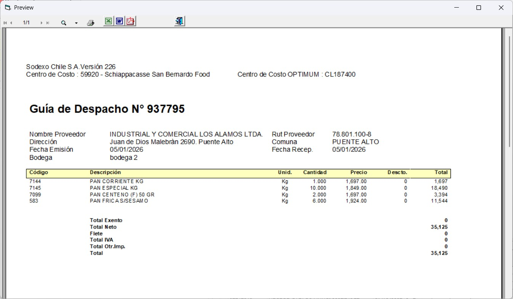

*Figura 5. **Comprobante de Ingreso*

**Tablas asociadas:**

| Tabla | Para qué se usa | Campos clave |
| --- | --- | --- |
| b_totcompras | Encabezado del documento de compra. Se inserta al grabar y se elimina al borrar. | toc_rutpro, toc_tipdoc, toc_numdoc, toc_codbod, toc_fecemi, toc_fecrem, toc_exedoc, toc_netdoc, toc_ivadoc, toc_otrimp, toc_totdoc, toc_tipinf, toc_numinf, toc_docaso, toc_docsnc, toc_fledoc, toc_fecper, EnvioDocSGPADM, toc_docasotipo |
| b_detcompras | Líneas de detalle del documento (un registro por producto). | dec_rutpro, dec_tipdoc, dec_numdoc, dec_numlin, dec_codmer, dec_canmer, dec_precom, dec_pctdes, dec_valdes, dec_ptotal, dec_canrec, dec_prerec, dec_mueinv, dec_prefle, dec_ptotrec, dec_acepre |
| b_detcomprasimp | Impuestos por línea de detalle. | imd_rutdoc, imd_tipdoc, imd_numdoc, imd_numlin, imd_codpro, imd_codimp, imd_pctimp, imd_monimp |
| b_bodegas | Stock por producto y bodega. Se actualiza al ingresar o eliminar un documento. | bod_codbod, bod_codpro, bod_canmer |
| b_productospmpdia | Precio medio ponderado diario por producto y centro de costo. Se actualiza al ingresar un documento con rebaja de stock. | ppd_cencos, ppd_codpro, ppd_fecdia, ppd_propon, ppd_upreco |
| b_proveedor | Maestro de proveedores. Se consulta para validar RUT, estado, origen y tipo de documento. | prv_codigo, prv_nombre, prv_activo, prv_origen, prv_docele, prv_permiteingdoc |
| a_tipodocumento | Catálogo de tipos de documento. Se usa para cargar el combo y para resolver el código interno a la clase del documento (FA, FE, GD, NC, etc.). | tdo_codigo, tdo_IdCodigo, tdo_cladoc |
| b_clientes | Catálogo de contratos/bodegas. Se usa para cargar el combo de bodega. | cli_codigo, cli_nombre, cli_tipo |
| a_impuesto | Catálogo de impuestos. Se carga en la grilla auxiliar de impuestos del producto. | imp_codigo, imp_nombre, imp_pctimp, imp_inccos, imp_indmod |
| b_productosimp | Relación entre productos e impuestos. Determina qué impuestos aplican a cada producto. | ipr_codpro, ipr_codimp |
| b_productos | Maestro de productos. Se consulta al agregar productos a la grilla. | pro_codigo, pro_nombre, pro_ctacon, pro_ctrsto, pro_coduni, pro_facing, pro_facsto |
| a_unidad | Catálogo de unidades de medida. | uni_codigo, uni_nomcor |
| b_cierreperiodo | Estado de períodos contables. Se consulta para verificar si el período está abierto. | cie_cencos, cie_estado, cie_periodo |
| a_param | Parámetros del sistema por centro de costo (ej.: porcentaje de variación de precio). | par_cencos, par_codigo, par_valor |
| b_ocsac | Órdenes de compra SAC. Se consulta para mostrar el ícono de OC pendientes. | cadfor_nrcgc, cadfil_cdfil, solite_dtent, pedite_flafo |
| b_ocsacrecibido | Detalle de recepciones vinculadas a órdenes de compra. Se inserta al grabar y se elimina al borrar. | ocr_rutpro, ocr_tipdoc, ocr_numdoc, ocr_numlin, ocr_codprodsgp, ocr_codprodsac, ocr_cancom, ocr_precom, ocr_canrec, ocr_canoc, ocr_preoc |
| b_formatocompras / b_formatocomprassgp | Formato de compras SAC y su relación con productos SGP (usado en país Colombia). | foc_codsac, foc_nomsac, foc_unisac, foc_faccon, fcs_codsac, fcs_codsgp |
| b_contlistpreing / b_productosing | Relación de productos para actualizar el código de última compra. | cpi_coding, cpi_codcom, pri_codpro, pri_coding |

**Exclusiones:**

- No se debe considerar lo relacionado con SAC
- No se debe considerar lo relacionado con CFC
  - Excluir del proceso de traspaso el generar Folio.

## 8.4. Ingreso Documento Guías CD (M_Traspa.frm)

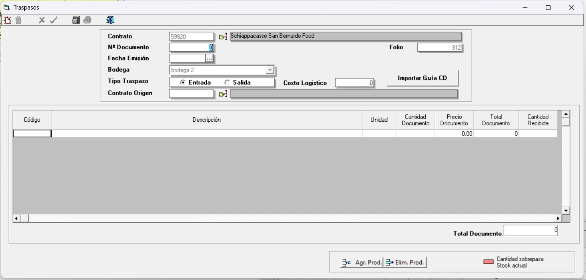

*Figura **6**. Formulario Ingreso Documento **Guías CD (**M_Traspa.frm)**.*

Registra las guías de despacho emitidas por las centrales de distribución propias o externas.

La pantalla admite dos sentidos de movimiento: **Salida** (el contrato activo entrega mercadería a otro) y **Entrada** (el contrato activo recibe mercadería de otro). Según el sentido elegido, cambia la lógica de precio aplicada: en salida se usa el Precio Medio Ponderado (PMP) del producto en bodega, mientras que en entrada el usuario ingresa el precio del documento recibido.

También tiene la opción vía Excel de importar las guías CD (formato descargable desde un aplicativo externo ASIMOV) y con ello no ser digitadas por el usuario. Utiliza el formulario de Traspaso en modalidad especial (vg_GuiaCD="1"), que cambia el comportamiento del documento para registrar el origen logístico y mantener trazabilidad con SAP.

**Flujo de Ingreso**** Documento Guías CD****:**

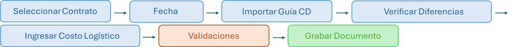

| Campo | Descripción | Obligatorio |
| --- | --- | --- |
| Contrato (origen) | Código del contrato del casino que recibe la mercadería desde el centro de distribución. Se carga automáticamente con el casino activo en sesión. | Sí |
| Contrato CD (origen despacho) | Código del contrato del centro de distribución que envía la mercadería. Se selecciona con el ícono de lupa. | Sí |
| N° Documento | Número del documento de ingreso. Puede ser uno existente (para consultar) o uno nuevo asignado por el usuario. | Sí |
| Fecha Emisión | Fecha del documento en formato dd/mm/aaaa. Debe corresponder al periodo abierto y al día no cerrado. | Sí |
| Bodega | Bodega del contrato destino donde se recibirá el stock. Se elige de la lista desplegable. | Sí |
| Archivo Excel | Archivo de guía CD que contiene los productos, cantidades y precios del despacho. Se importa mediante el botón "Importar Guía CD". | Sí |
| Costo Logístico | Monto adicional de costo logístico asociado al documento. Debe ser mayor o igual a cero. | Sí |
| Cantidad Recibida (por línea) | Cantidad efectivamente recibida de cada producto. Se compara con la cantidad del documento importado. | Sí |
| Descripción Motivo (por línea) | Justificación cuando la cantidad recibida difiere de la cantidad del documento. Se selecciona de una lista de motivos predefinidos. | Condicional (si hay diferencia) |

**Observaciones****:**

El sistema marca el documento con tov_origen = "KeyLogistic" para identificar su origen logístico.

> 💬 **Comentario — MUNOZ MARTINEZ Claudia (2026-03-10):** Hay varias centrales de distribución (propias) y operadores logísticos. Keylogistic es 1 de ellos. Revisar por que en el documento solo se hace referencia a 1 solo

> 💬 **Comentario — Gonzalez Segovia Marcelo (2026-03-26):** Corresponde a Centro de distribución

**Reglas de negocio:**

| # | Cuando aparece | Qué verifica el sistema | Qué ve o experimenta el usuario |
| --- | --- | --- | --- |
| 1 | Al salir del campo Contrato origen | Que el código exista en la tabla de clientes con tipo contrato válido | "Contrato no existe..." |
| 2 | Al salir del campo Contrato CD | Que el contrato CD exista y sea distinto al contrato origen | "Contrato traspaso no existe..." |
| 3 | Al ingresar Contrato CD igual al Contrato origen | Que no se registre un ingreso desde el mismo contrato | "No se puede realizar transferencia en el mismo contrato..." |
| 4 | Al hacer clic en Grabar | Que el Costo Logístico sea mayor o igual a cero | "Debe ingresar costo logístico, con valor mayor o igual cero..." |
| 5 | Al hacer clic en Grabar | Que todos los campos del encabezado estén completos | "Debe ingresar dato importante..." |
| 6 | Al hacer clic en Grabar | Que el contrato no tenga pendiente un cierre diario de inventario rotativo | "Tiene que realizar cierre diario..." |
| 7 | Al hacer clic en Grabar | Que la fecha del documento corresponda al periodo abierto | "Documento no corresponde al periodo : [periodo] — Tiene que generar un nuevo folio" |
| 8 | Al hacer clic en Grabar | Que la fecha no sea anterior a la última toma de inventario | "No puede ingresar documentos anteriores a la última toma de inventario." |
| 9 | Al hacer clic en Grabar | Que no haya una toma de inventario calendarizada en curso | "Se esta realizando la toma de inventario en estos momento..." |
| 10 | Al hacer clic en Grabar | Que la fecha del documento no sea anterior al día cerrado del casino | "Día se encuentra cerrado, no es posible ingresar..." |
| 11 | Al hacer clic en Grabar | Que el número de folio no pertenezca a un periodo distinto al de la fecha del documento | "N° folio corresponde al periodo : [periodo] — Tiene que generar un nuevo folio" |
| 12 | Al hacer clic en Grabar | Que el total del documento sea mayor a cero | "El total del documento debe ser mayor a 0..." |
| 13 | Al hacer clic en Grabar | Que ningún precio de línea sea cero | "Existen precio en cero..." |
| 14 | Al hacer clic en Grabar | Que ninguna cantidad recibida sea cero | "Existen cantidades recibidas en cero..." |
| 15 | Al hacer clic en Grabar | Que exista descripción de motivo cuando la cantidad recibida difiere de la cantidad del documento | "Debe ingresar la descripción del motivo..." |
| 16 | Al hacer clic en Grabar con precio fuera del rango parametrizado | Que el precio no exceda el porcentaje de variación permitido respecto al último precio registrado | "Existen precios ingresados, que excede al ultimo precio registrado — ¿Desea grabar?" (con opción de continuar) |
| 17 | Al cambiar cantidad recibida y supera la cantidad documento sin motivo | Que exista un motivo seleccionado | "La cantidad recibida excede de la cantidad es menor..." |
| 18 | Al cambiar cantidad recibida y difiere de la cantidad documento sin motivo | Que la columna Descripción Motivo esté completada | "La cantidad recibida es distinta a cantidad documento, debera seleccionar la columna Descripción Motivo..." |
| 19 | Al intentar eliminar una fila de la grilla | Que la fila no provenga de la guía CD importada (no se pueden eliminar) | "No permite eliminar producto exportado desde guía CD. Si no desea utilizar el producto puede dejar la columna Cantidad Recibida con valor cero..." |
| 20 | Al intentar eliminar el documento | Que el periodo esté abierto | "Periodo esta cerrado..." |
| 21 | Al intentar eliminar el documento | Que haya stock suficiente para revertir la entrada | "Documento no puede ser eliminado. No hay stock suficiente..." |
| 22 | Al hacer clic en Buscar sin contrato seleccionado | Que haya un contrato origen seleccionado | "Debe seleccionar contrato..." |

**Observaciones:**

Solo los casinos habilitados pueden recibir guías CD.

> 💬 **Comentario — MUNOZ MARTINEZ Claudia (2026-03-10):** Validar con Cecilia si el costo logístico viene en la guía o se digita o ambos según sea el caso

> 💬 **Comentario — Sandoval Nocchi, Maria Cecilia (2026-03-12):** EL costo logístico dependiendo del operador o la zona viene detallado en la guía física (puede indicar solo el porcentaje o el calculo de este sobre el cobro total, pero no se carga al importar el archivo, hay un campo en SGP donde se debe registrar manualmente la información. El costo logístico se ve como una línea de gastos aparte en el reporte A13. Revisar con Claudia.

EL costo logístico dependiendo del operador o la zona, viene detallado en la guía física (puede indicar solo el porcentaje o el cálculo de este sobre el cobro total, pero no se carga al importar el archivo, hay un campo en SGP (ver formulario) donde se debe registrar manualmente la información. El costo logístico se ve como una línea de gastos aparte en el reporte A13.

El campo tov_origen = "KeyLogistic" permite distinguir estas entradas de traspasos internos en reportes y auditoría.

> 💬 **Comentario — MUNOZ MARTINEZ Claudia (2026-03-10):** Favor explicar este punto

- **Activaci****ó****n condicional:** El formulario M_Traspa.frm solo despliega la modalidad Guía CD cuando vg_GuiaCD = "1".
- No pueden registrarse 2 líneas con el mismo código de producto.
- Validar que el código exista
- Validar que el código mueva stock
- Validar precios v/s PMP (% tolerancia) Solo Warning. Actualmente es muy bajo y hace que el usuario no tome en cuenta la alerta de precios.
- Puedo recibir cantidades en decimales (ejemplo: 3, 50 KG)
- Precios unitarios pueden tener decimales (precio unitario de 1 sachet de azúcar $2,5 pesos)

**<u>Subtotal de línea:</u>**

Se calcula automáticamente multiplicando la cantidad recibida por el precio del documento importado desde la guía CD.

Subtotal = Cantidad Recibida × Precio Documento

El precio viene precargado desde el archivo Excel. El usuario no lo modifica.

**<u>Total del documento:</u>**

Suma de todos los subtotales de líneas con cantidad recibida mayor a cero.

Total Documento = Σ (Cantidad Recibida × Precio Documento) por cada línea

**<u>Costo logístico:</u>**

Se registra manualmente en un campo separado del encabezado. El valor proviene de la guía física (puede venir expresado como porcentaje o como monto calculado sobre el cobro total). No se importa desde el archivo Excel. Se refleja como una línea de gastos aparte en el reporte A13.

**<u>Actualización del Precio Medio Ponderado (PMP):</u>**

Al grabar, el sistema calcula el nuevo PMP para cada producto recibido según la fórmula estándar de precio medio ponderado, y lo registra o actualiza en la tabla de precios diarios por bodega (b_productospmpdia).

**<u>Cantidades y precios con decimales:</u>**

El sistema permite registrar cantidades recibidas con decimales (ejemplo: 3,50 KG) y precios unitarios con decimales (ejemplo: $2,5 por unidad).

**<u>Control de stock en la grilla:</u>**

Las filas importadas desde la guía CD no pueden eliminarse. Si el usuario no desea considerar un producto, debe dejar la cantidad recibida en cero (lo cual excluye esa línea del total del documento, pero genera un motivo obligatorio por la diferencia con la cantidad del documento).

**Formato de Ingreso (Excel):**

La importación del archivo Excel se realiza a través del formulario P_ExportarArchivos.frm, al hacer clic en el botón “**Importar Guía CD**”

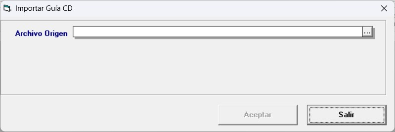

*Figura **7**. **Formulario de Importación Guía CD**.*

| # | Cabecera esperada (exacta) | Tipo | Obligatorio | Descripción |
| --- | --- | --- | --- | --- |
| A | Codigo Ceco | Alfanumérico | Sí | Código del centro de costos (casino) que recibe la mercadería |
| B | Descripcion CeCo | Alfanumérico | No (*) | Nombre descriptivo del centro de costos. Se lee pero no se carga en la grilla |
| C | N° GDD | Numérico | Sí | Número de la Guía de Despacho desde el CD. Se asigna como N° Documento del traspaso (fpLongInteger1(0)) |
| D | Fecha GDD | Fecha | Sí | Fecha de la Guía de Despacho. Se almacena como fecha de emisión de la guía original (vg_FechaEmision_GGD) |
| E | Codigo Producto | Alfanumérico | Sí | Código del material en el sistema SAP/SAC. El SP sgp_Sel_XmlValidarExportarArchivosGuiaCD lo traduce al código SGP |
| F | Descripcion Producto | Alfanumérico | Sí | Descripción del material en SAP/SAC |
| G | Cantidad | Numérico (decimales) | Sí | Cantidad despachada desde el CD |
| H | Precio | Numérico (decimales) | Sí | Precio unitario del producto |

El archivo debe tener 8 columnas con formato específico: código y descripción del centro de costos, número y fecha de la guía de despacho, código y descripción del producto, cantidad y precio.

El sistema valida el formato y el contenido del archivo. Si detecta errores (por ejemplo, un producto que no existe en el sistema), genera un reporte Excel con el detalle de los problemas y no permite continuar.

Si todo es correcto, los productos se cargan automáticamente en la grilla con sus cantidades y precios. El número de guía se asigna como número de documento y el contrato origen queda fijado como CD. Los datos importados no se pueden modificar ni eliminar, excepto la **cantidad recibida**: si difiere de la cantidad despachada, el usuario debe indicar un **motivo**.

**<u>Formato de salida:</u>**

Incluir Imagen del Reporte Impreso

*Figura **8**. **Reporte de Ingreso**.*

**Tablas asociadas:**

| Tabla | Para qué se usa | Campos clave |
| --- | --- | --- |
| b_totventas | Encabezado del documento. Se inserta al grabar con tov_origen = "KeyLogistic". | tov_rutcli, tov_tipdoc (TR), tov_numdoc, tov_codbod, tov_fecemi, tov_codser (1=Entrada), tov_codcas, tov_totdoc, tov_numinf, tov_costologistico, tov_origen, tov_FechaEmision_GGD |
| b_detventas | Líneas de detalle del documento. Una fila por cada producto de la guía CD. | dev_rutcli, dev_tipdoc, dev_numdoc, dev_numlin, dev_codmer, dev_canmin, dev_canmer, dev_predoc, dev_ptotal, dev_descri, dev_mueinv, dev_acepre, dev_IdMotivo |
| b_bodegas | Stock por producto y bodega. Se incrementa al grabar. | bod_codpro, bod_codbod, bod_canmer |
| b_productos | Catálogo de productos. Se consulta para validar existencia y control de stock. | pro_codigo, pro_nombre, pro_coduni, pro_ctrsto |
| a_unidad | Unidades de medida. Se consulta para mostrar la unidad del producto en la grilla. | uni_codigo, uni_nombre, uni_nomcor |
| b_clientes | Contratos (casinos). Se valida el contrato origen y el contrato CD. | cli_codigo, cli_nombre, cli_tipo, cli_codbod |
| b_productospmpdia | PMP diario por producto. Se consulta para validación de precios y se actualiza al grabar. | ppd_cencos, ppd_codpro, ppd_fecdia, ppd_propon |
| b_ocsacrecibido | Detalle de recepción vinculado a la guía CD. Registra la trazabilidad entre producto SGP y material SAC. | ocr_rutpro, ocr_tipdoc, ocr_numdoc, ocr_numlin, ocr_codprodsgp, ocr_codprodsac, ocr_cancom, ocr_precom, ocr_canrec, ocr_fecoc, ocr_canoc, ocr_preoc |
| b_formatocompras_sap | Materiales SAP. Se usa para relacionar el código de material SAC con el producto SGP. | fcs_CodMaterial, fcs_DenMaterial, fcs_CodUniMed, fcs_faccon |
| b_formatocompras_sap_sgp | Relación entre materiales SAP y productos SGP. | fss_CodMaterial, fss_CodSgp, fss_SgpPre |
| a_motivo | Motivos para justificar diferencias entre cantidad despachada y recibida. | IdMotivo, Descripcion Motivo |
| a_infcfcfofi | Folios internos. Se consulta para asignar el folio al documento. | inf_cencos, inf_tipo (T), inf_numero, inf_feccie, inf_usuario |
| a_param | Parámetros del casino. Se consulta para días bloqueados y porcentaje de tolerancia de precio. | par_cencos, par_codigo, par_valor |
| b_contlistpreing | Lista de precios de ingreso. Se actualiza con el último producto de compra al grabar. | cpi_coding, cpi_codcom, cpi_cencos |
| b_productosing | Productos de ingreso. Se consulta para obtener el código de ingreso al actualizar la lista de precios. | pri_codpro, pri_coding |

## 8.5. Ingreso Traspaso entre Casinos (M_Traspa.frm)

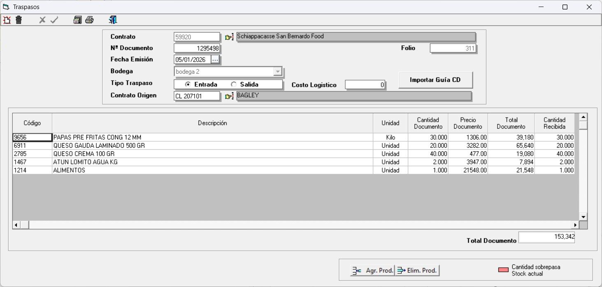

*Figura **9**. Formulario **Traspaso entre Casino ****ENTRADA**** (**M_Traspa.frm**).*

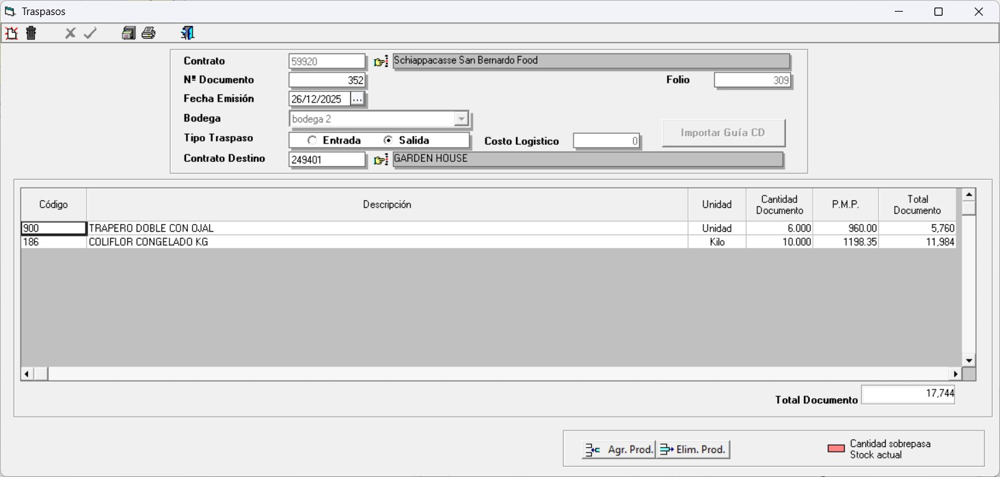

*Figura **10**. Formulario **Traspaso entre Casino ****SALIDA**** (**M_Traspa.frm**).*

Permite transferir productos entre bodegas de distintos casinos. El sistema opera desde la perspectiva del casino activo: si registra una Salida, descuenta el stock de su bodega; si registra una Entrada, incrementa el stock de su bodega. Sin embargo, el movimiento no es simultáneo — el sistema no actualiza automáticamente la bodega del otro casino en la misma operación. Para que el traspaso quede completo, el casino contraparte debe registrar su propio documento (entrada o salida según corresponda).

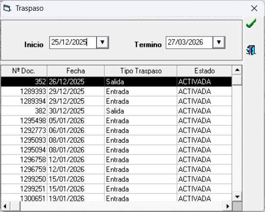

*Figura **11**. Formulario **Traspaso** (**B_SalBod.frm**).*

Consulta de traspasos anteriores "Histórico". Permite buscar y visualizar documentos ya grabados, pero una vez cargados quedan en modo solo lectura (la grilla se bloquea y el encabezado se deshabilita).

**Flujo de ****Traspaso****:**

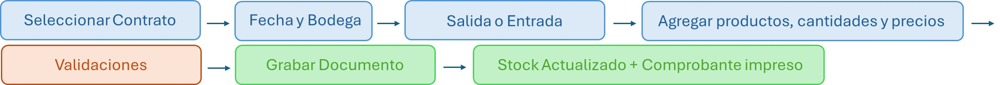

| Campo | Descripción | Obligatorio |
| --- | --- | --- |
| Contrato (origen) | Código del contrato del casino activo que registra el traspaso. Se carga automáticamente con el casino en sesión. | Sí |
| Contrato destino | Código del casino que recibe (en tipo Salida) o envía (en tipo Entrada) la mercadería. Se selecciona con el ícono de lupa. Debe ser distinto al contrato origen. | Sí |
| N° Documento | Número del documento de traspaso. Puede ser uno existente (para consultar) o uno nuevo asignado por el usuario. | Sí |
| Fecha Emisión | Fecha del documento en formato dd/mm/aaaa. Debe corresponder al periodo abierto y al día no cerrado. | Sí |
| Bodega | Bodega del contrato origen donde se descuenta o incrementa el stock. Se elige de la lista desplegable. | Sí |
| Tipo de traspaso | Indica el sentido del movimiento: Salida (el casino activo entrega mercadería) o Entrada (el casino activo recibe mercadería). | Sí |
| Productos en la grilla | Código, descripción, unidad, cantidad y precio de cada producto a traspasar. Se agregan manualmente desde el botón "Agr. Prod." o ingresando el código en la grilla. Al menos una línea. | Sí (al menos 1) |
| Precio | En tipo Salida se asigna automáticamente con el PMP vigente del producto. En tipo Entrada el usuario lo ingresa manualmente. | Sí |
| Cantidad recibida | Cantidad efectivamente recibida de cada producto. Solo visible y editable en tipo Entrada. | Condicional (solo Entrada) |

**Observaciones****:**

- Ingreso de costo logístico asociado al traspaso de entrada y salida.

> 💬 **Comentario — Sandoval Nocchi, Maria Cecilia (2026-03-06):** Validar con contabilidad si se puede traspasar el costo logístico entre sitios y como debería hacerse por sistema para contabilizar.

- Visualización del stock disponible en bodega antes de confirmar.
- Anulación con reversa, se puede anular validando el stock disponible.

**Reglas de negocio:**

| # | Cuando aparece | Qué verifica el sistema | Qué ve o experimenta el usuario |
| --- | --- | --- | --- |
| 1 | Al salir del campo Contrato origen | Que el código exista en la tabla de clientes con tipo contrato válido | "Contrato no existe..." |
| 2 | Al salir del campo Contrato destino | Que el contrato destino exista y sea distinto al contrato origen | "Contrato traspaso no existe..." |
| 3 | Al ingresar Contrato destino igual al Contrato origen | Que no se haga una transferencia al mismo contrato | "No se puede realizar transferencia en el mismo contrato..." |
| 4 | Al hacer clic en Grabar | Que todos los campos del encabezado estén completos | "Debe ingresar dato importante..." |
| 5 | Al hacer clic en Grabar | Que el contrato no tenga pendiente un cierre diario de inventario rotativo | "Tiene que realizar cierre diario..." |
| 6 | Al hacer clic en Grabar | Que la fecha del documento corresponda al periodo abierto | "Documento no corresponde al periodo : [periodo] — Tiene que generar un nuevo folio" |
| 7 | Al hacer clic en Grabar | Que la fecha no sea anterior a la última toma de inventario | "No puede ingresar documentos anteriores a la última toma de inventario." |
| 8 | Al hacer clic en Grabar | Que no haya una toma de inventario calendarizada en curso | "Se esta realizando la toma de inventario en estos momento..." |
| 9 | Al hacer clic en Grabar | Que no haya un inventario calendarizado próximo que bloquee el ingreso | "No puede ingresar documento, antes de un inventario calendarizado..." |
| 10 | Al hacer clic en Grabar | Que el ajuste de la última toma de inventario haya sido realizado | "No ha realizado el ajuste correspondiente a la última toma de inventario." |
| 11 | Al hacer clic en Grabar | Que la fecha del documento no sea anterior al día cerrado del casino | "Día se encuentra cerrado, no es posible ingresar..." |
| 12 | Al hacer clic en Grabar | Que el número de folio no pertenezca a un periodo distinto al de la fecha del documento | "N° folio corresponde al periodo : [periodo] — Tiene que generar un nuevo folio" |
| 13 | Al hacer clic en Grabar | Que el total del documento sea mayor a cero | "El total del documento debe ser mayor a 0..." |
| 14 | Al hacer clic en Grabar (tipo Salida) | Que no existan productos con stock insuficiente en la bodega | "Existe una cantidad que excende el Stock..." |
| 15 | Al hacer clic en Grabar | Que ningún precio de línea sea cero | "Existen precio en cero..." |
| 16 | Al hacer clic en Grabar | Que ninguna cantidad documento sea cero | "Existen cantidades documento en cero..." |
| 17 | Al hacer clic en Grabar (tipo Entrada) | Que ninguna cantidad recibida sea cero | "Existen cantidades recibidas en cero..." |
| 18 | Al hacer clic en Grabar con precio fuera del rango parametrizado (tipo Entrada) | Que el precio no exceda el porcentaje de variación permitido respecto al último precio registrado | "Existen precios ingresados, que excede al ultimo precio registrado — ¿Desea grabar?" (con opción de continuar) |
| 19 | Al agregar un producto a la grilla | Que el producto no esté duplicado en la grilla | "El producto ya existe en la grilla..." |
| 20 | Al ingresar un código de producto en la grilla | Que el código exista en el catálogo | "producto no existe..." |
| 21 | Al intentar eliminar el documento | Que el periodo esté abierto | "Periodo esta cerrado..." |
| 22 | Al intentar eliminar el documento | Que la fecha no sea anterior a la última toma de inventario | "No puede eliminar documentos anteriores a la última toma de inventario." |
| 23 | Al intentar eliminar el documento | Que el día no esté cerrado | "No puede elimnar documento, día esta cerrado..." |
| 24 | Al intentar eliminar el documento (tipo Entrada) | Que haya stock suficiente para revertir la entrada | "Documento no puede ser eliminado. No hay stock suficiente..." |
| 25 | Al hacer clic en Buscar sin contrato seleccionado | Que haya un contrato origen seleccionado | "Debe seleccionar contrato..." |

**Observaciones:**

- El costo logístico solo se ingresa en el documento de entrada, no en la salida.
- El traspaso esta valorizado al PMP solo en entrada (para recualcular), no en salida.
- No puedo hacer un traspaso de un periodo contable cerrado (pasado o futuro).
- Descuenta stock origen en salida.
- Aumenta stock destino en entrada.
- Verifica stock disponible en salida.

**Importante:**

No existe un mecanismo de confirmación o aprobación por parte del casino receptor. Cada usuario registra su propio documento de forma independiente

Si el casino origen registra la salida, pero el destino no registra la entrada, el stock queda descuadrado entre ambos casinos

> 💬 **Comentario — Sandoval Nocchi, Maria Cecilia (2026-03-06):** MEJORA: considerar que los movimientos entre sitios puedan ser por sistema con aprobación del que recibe para mover el stock de los dos sitios. Que de alguna manera exista un bloqueo en le sitio que recibe para que realice la aceptación o rechazo cuando corresponda.

**<u>Precio de la línea en tipo Salida:</u>**

Se asigna automáticamente con el Precio Medio Ponderado (PMP) vigente del producto en la bodega del casino activo. El usuario no puede modificarlo. Si el usuario cambia la fecha de emisión, el sistema recalcula el PMP de todos los productos de la grilla con la nueva fecha.

**<u>Precio de la línea en tipo Entrada:</u>**

El usuario ingresa manualmente el precio del documento recibido.

**<u>Subtotal de línea:</u>**

Subtotal = Cantidad × Precio

**<u>Total del documento:</u>**

Suma de todos los subtotales de líneas con cantidad mayor a cero.

Total Documento = Σ (Cantidad × Precio) por cada línea

**<u>Costo logístico (solo tipo Entrada):</u>**

Se registra manualmente en un campo separado del encabezado. Se almacena en tov_costologistico y no se suma al total del documento.

**<u>Actualización del PMP (solo tipo Entrada):</u>**

Al grabar, el sistema calcula el nuevo PMP para cada producto recibido según la fórmula estándar de precio medio ponderado y lo registra en la tabla de precios diarios por bodega (b_productospmpdia). En tipo Salida no se recalcula el PMP.

**<u>Control de stock en la grilla (solo tipo Salida):</u>**

Si la cantidad ingresada supera el stock disponible en bodega, la fila se resalta visualmente en azul y se marca como bloqueada. El sistema no permite grabar si alguna fila está en ese estado.

**<u>Actualización de stock al grabar:</u>**

En tipo Salida se descuenta la cantidad del stock de la bodega del casino activo. En tipo Entrada se incrementa. El sistema no modifica el stock del casino contraparte.

**<u>Formato de salida:</u>**

Al grabar o al hacer clic en el botón Imprimir, el sistema genera un comprobante impreso del traspaso a través del módulo I_Traspaso. El comprobante contiene los datos del encabezado (contrato origen, contrato destino, número de documento, fecha, bodega, tipo de traspaso) y el detalle de todos los productos con sus cantidades, precios y totales.

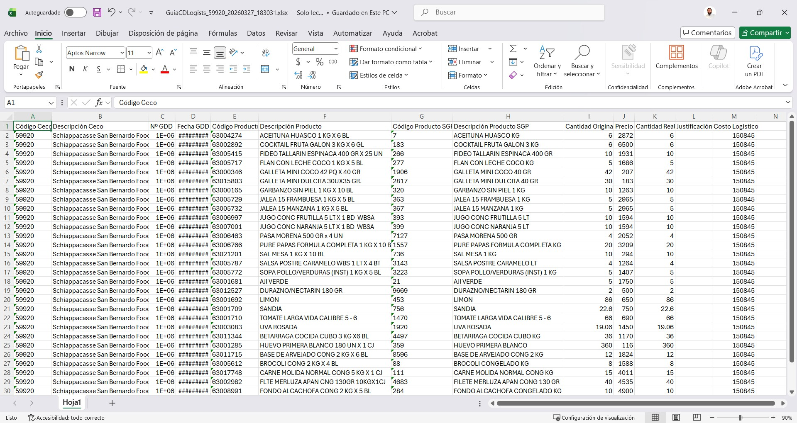

*Figura **12**. **Excel de Traspaso (**I_Traspaso**).*

**Tablas asociadas:**

| Tabla | Para qué se usa | Campos clave |
| --- | --- | --- |
| b_totventas | Encabezado del documento de traspaso. Se inserta al grabar y se elimina al anular. | tov_rutcli, tov_tipdoc (TR), tov_numdoc, tov_codbod, tov_fecemi, tov_codser (0=Salida, 1=Entrada), tov_codcas, tov_totdoc, tov_numinf, tov_costologistico, tov_origen |
| b_detventas | Líneas de detalle del documento. Una fila por cada producto del traspaso. | dev_rutcli, dev_tipdoc, dev_numdoc, dev_numlin, dev_codmer, dev_canmin, dev_canmer, dev_predoc, dev_ptotal, dev_descri, dev_mueinv, dev_acepre |
| b_bodegas | Stock por producto y bodega. Se descuenta en tipo Salida y se incrementa en tipo Entrada. | bod_codpro, bod_codbod, bod_canmer |
| b_productos | Catálogo de productos. Se consulta para validar existencia y control de stock. | pro_codigo, pro_nombre, pro_coduni, pro_ctrsto |
| a_unidad | Unidades de medida. Se consulta para mostrar la unidad del producto en la grilla. | uni_codigo, uni_nombre |
| b_clientes | Contratos (casinos). Se valida el contrato origen y el contrato destino. | cli_codigo, cli_nombre, cli_tipo |
| b_productospmpdia | PMP diario por producto. Se consulta para asignar el precio en tipo Salida y se actualiza al grabar en tipo Entrada. | ppd_cencos, ppd_codpro, ppd_fecdia, ppd_propon |
| a_infcfcfofi | Folios internos. Se consulta para asignar el folio al documento. | inf_cencos, inf_tipo (T), inf_numero, inf_feccie, inf_usuario |
| a_param | Parámetros del casino. Se consulta para días bloqueados y porcentaje de tolerancia de precio. | par_cencos, par_codigo, par_valor |
| b_contlistpreing | Lista de precios de ingreso. Se actualiza con el último producto de compra al grabar tipo Entrada. | cpi_coding, cpi_codcom, cpi_cencos |
| b_productosing | Productos de ingreso. Se consulta para obtener el código de ingreso al actualizar la lista de precios. | pri_codpro, pri_coding |

## 8.6. Merma de Bodega (M_Mermas.frm)

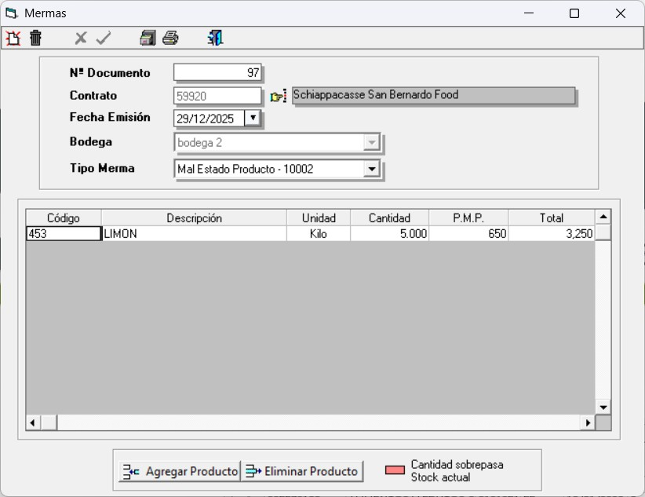

*Figura **13**. Formulario **Merma de Bodega (**M_Mermas.frm**).*

Registra según clasificación de mermas el deterioros o destrucción de productos en bodega. Disminuye el stock. Tipo de documento: **ME**. El número correlativo se gestiona con la función TraerCorrelativo(codbod, "ME") que lee y actualiza b_parametros.

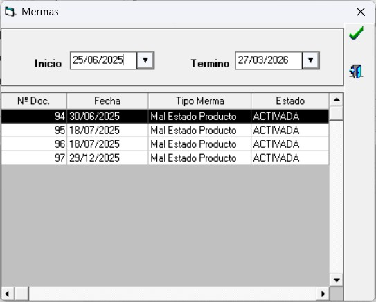

*Figura **14**. Formulario **Traspaso** (**B_SalBod.frm**).*

El botón **Históricos** permite consultar un documento de merma ya registrado. Primero exige que haya un contrato seleccionado, luego abre un buscador de folios donde el usuario elige el documento que quiere revisar. Una vez seleccionado, el sistema carga en pantalla todos los datos del encabezado (número, fecha, bodega, tipo de merma y estado) y las líneas de detalle con sus productos, cantidades, precios y el stock actual de bodega. El formulario queda en modo solo lectura, permitiendo únicamente anular o imprimir el documento si este no ha sido anulado previamente.

**Flujo de ****Merma****:**

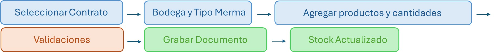

| Campo | Descripción | Obligatorio |
| --- | --- | --- |
| Contrato | Código del contrato (casino) al que pertenece la merma. Se puede escribir directamente o seleccionar mediante el botón de búsqueda. | Sí |
| Fecha de Emisión | Fecha en que se emite el documento de merma. Se inicializa con la fecha actual al abrir el formulario. | Sí |
| Bodega | Lista desplegable con las bodegas disponibles para el contrato. Se carga automáticamente al iniciar el formulario. | Sí |
| Tipo Merma | Lista desplegable con los tipos de ajuste clasificados como merma. Se carga automáticamente al iniciar el formulario. | Sí |
| Productos (grilla) | Al menos un producto con cantidad mayor a cero. Los productos se agregan uno a uno usando el botón "Agregar Producto". | Sí |

**Observaciones****:**

- Descuento de stock con validación de disponibilidad.
- Visualización del stock disponible por producto antes y después del ingreso.
- Alerta visual (color rojo) cuando la cantidad a mermar supera el stock disponible.
- Valorización automática de la merma al precio de costo (PMP).
- Anulación de mermas del período activo.

**Reglas de negocio:**

| # | Cuando aparece | Qué verifica el sistema | Qué ve o experimenta el usuario |
| --- | --- | --- | --- |
| 1 | Al salir del campo Contrato | Que el código ingresado exista en la tabla de contratos | Contrato no existe... |
| 2 | Al intentar agregar un producto a la grilla | Que la bodega esté seleccionada | Debe seleccionar bodega... |
| 3 | Al intentar agregar un producto a la grilla | Que el producto no esté ya registrado en la grilla | El producto ya existe en la grilla... |
| 4 | Al intentar grabar | Que los campos Contrato, Nº Documento, Tipo Merma, Bodega y Fecha de Emisión estén completos | Debe ingresar dato importante... |
| 5 | Al intentar grabar | Que el casino no tenga inventario rotativo pendiente de cierre diario | Tiene que realizar cierre diario... |
| 6 | Al intentar grabar | Que la fecha del documento corresponda al período contable activo | Documento no corresponde al periodo : <fecha de cierre> |
| 7 | Al intentar grabar | Que la fecha no sea anterior a la última toma de inventario | No puede ingresar documentos anteriores a la última toma de inventario. |
| 8 | Al intentar grabar | Que no se esté realizando una toma de inventario en ese momento | Se esta realizando la toma de inventario en estos momento... |
| 9 | Al intentar grabar | Que no haya un inventario calendarizado próximo que bloquee el ingreso | No puede ingresar documento, antes de un inventario calendarizado... |
| 10 | Al intentar grabar | Que el ajuste de la última toma de inventario esté realizado | No ha realizado el ajuste correspondiente a la última toma de inventario. |
| 11 | Al intentar grabar | Que la fecha del documento no sea un día ya cerrado | Día se encuentra cerrado, no es posible ingresar... |
| 12 | Al intentar grabar | Que ninguna fila tenga cantidad que supere el stock disponible | Existe una cantidad que exede el Stock... |
| 13 | Al intentar grabar | Que el total del documento sea mayor a cero | El total del documento debe ser mayor a 0... |
| 14 | Durante el proceso de grabación | Que el stock no haya cambiado entre la carga de la grilla y el momento de grabar (control en tiempo real) | Existen productos con diferencia en la bodega, proceso cancelado |
| 15 | Al intentar anular | Que el período contable esté abierto | Periodo cerrado... |
| 16 | Al intentar anular | Que la fecha no sea anterior a la última toma de inventario | No puede ingresar documentos anteriores a la última toma de inventario. |
| 17 | Al intentar anular | Que el día del documento no esté cerrado | No puede anular documento, día esta cerrado... |
| 18 | Al intentar anular | Confirmación del usuario | Anula documento... (Sí / No) |
| 19 | Al intentar eliminar un producto de la grilla | Confirmación del usuario | Elimina Producto... (Sí / No) |
| 20 | Al cancelar con datos en la grilla usando el botón Nuevo | Confirmación del usuario | Cancela... (Sí / No) |
| 21 | Al intentar buscar un documento | Que el campo Contrato esté seleccionado | Debe seleccionar contrato... |

**Observaciones:**

- El precio unitario usado para la merma es el PMP vigente al momento del ingreso (leído de b_productospmpdia).
- El número correlativo se gestiona en b_parametros (no en a_param), por bodega y tipo de documento.

> 💬 **Comentario — MUNOZ MARTINEZ Claudia (2026-03-10):** ¿La merma va acompañada de una guía? Y además, ¿tiene un correlativo de transacción en el sistema?

> 💬 **Comentario — Sandoval Nocchi, Maria Cecilia (2026-03-12):** Tiene un número correlativo en campo número de documento

- El precio usado corresponde al costo vigente (PMP).
- Las cantidades pueden estar en decimales (ej. Peso la fruta y verdura que será mermada)

**Importante:**

- Atención: la grilla muestra una alerta visual cuando se supera el stock, pero el bloqueo real ocurre recién al intentar grabar.

> 💬 **Comentario — Sandoval Nocchi, Maria Cecilia (2026-03-12):** Podríamos revisar esto pensando en el concepto alerta visual?

**<u>Total por línea de producto</u>****<u>:</u>**

El sistema calcula automáticamente el valor total de cada línea de producto en la grilla a medida que el usuario ingresa la cantidad. El cálculo se actualiza en tiempo real con cada pulsación de tecla.

Total línea = Cantidad ingresada × P.M.P. (Precio Medio Ponderado)

Componentes:

- Cantidad ingresada: Unidades del producto que se dan de baja por merma
- P.M.P.: Precio medio ponderado del producto a la fecha del documento
- Total línea: Valor monetario de la merma para ese producto

**<u>Indicador de stock insuficiente</u>****<u>:</u>**

El sistema compara la cantidad ingresada con el stock disponible en bodega para cada producto. Si la cantidad supera el stock, la fila se resalta con un color de alerta y queda marcada internamente, impidiendo la grabación del documento hasta que se corrija.

Si Stock bodega − Cantidad ingresada < 0 → fila bloqueada (marcada en rojo)

Componentes:

- Stock bodega: Cantidad disponible del producto en la bodega seleccionada
- Cantidad ingresada: Unidades a dar de baja por merma

**<u>Formato de salida:</u>**

Vista previa en pantalla con opción de imprimir. El documento se genera internamente en formato RTF y se almacena en la ruta de reportes configurada en el sistema.

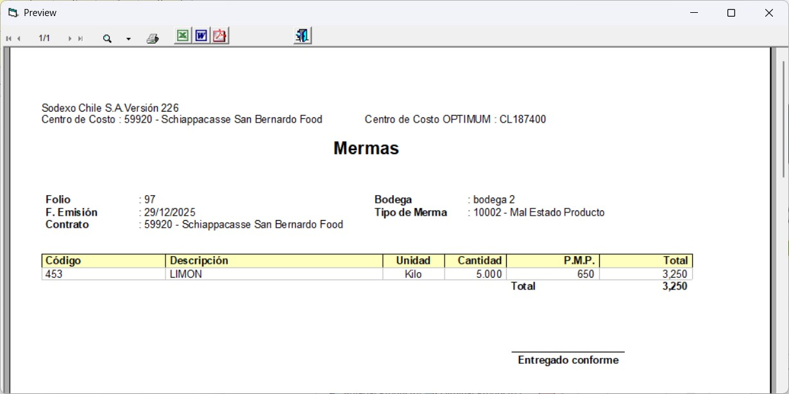

*Figura 1**5**.** **Comprobante de Ingreso*

**Tablas asociadas:**

| Tabla | Para qué se usa | Campos clave |
| --- | --- | --- |
| b_totventas | Encabezado de documentos de movimiento. Almacena un registro por documento de merma con contrato, folio, bodega, fecha, tipo y estado. | tov_rutcli, tov_tipdoc (= 'ME'), tov_numdoc, tov_codbod, tov_fecemi, tov_codser, tov_estdoc, tov_totdoc |
| b_detventas | Detalle de líneas del documento. Almacena una fila por cada producto de la merma. | dev_rutcli, dev_tipdoc, dev_numdoc, dev_numlin, dev_codmer, dev_canmer, dev_predoc, dev_ptotal, dev_descri |
| b_bodegas | Stock de productos por bodega. Se descuenta al grabar y se restituye al anular. | bod_codpro, bod_codbod, bod_canmer |
| b_productos | Catálogo de productos. Proporciona código, nombre, unidad de medida y si tiene control de stock activo. | pro_codigo, pro_nombre, pro_coduni, pro_ctrsto |
| b_productospmpdia | Precio medio ponderado diario por producto y casino. Se consulta para obtener el PMP vigente al momento del ingreso. | ppd_cencos, ppd_codpro, ppd_propon, ppd_fecdia |
| a_unidad | Tabla maestra de unidades de medida. | uni_codigo, uni_nombre |
| a_tipoajuste | Catálogo de tipos de ajuste. Filtra los tipos aplicables a mermas (NM). Se usa para cargar la lista desplegable Tipo Merma y para el encabezado del impreso. | aju_codigo, aju_nombre |
| b_clientes | Tabla de contratos (casinos). Se usa para cargar la lista desplegable de bodegas y para validar el contrato ingresado. | cli_codigo, cli_nombre |
| b_parametros | Parámetros del sistema por bodega. Se actualiza el correlativo de folios de tipo ME al grabar. | par_codbod, par_tipdoc, par_correlativo |

## 8.7. Salida de Producción (M_SalBod.frm)

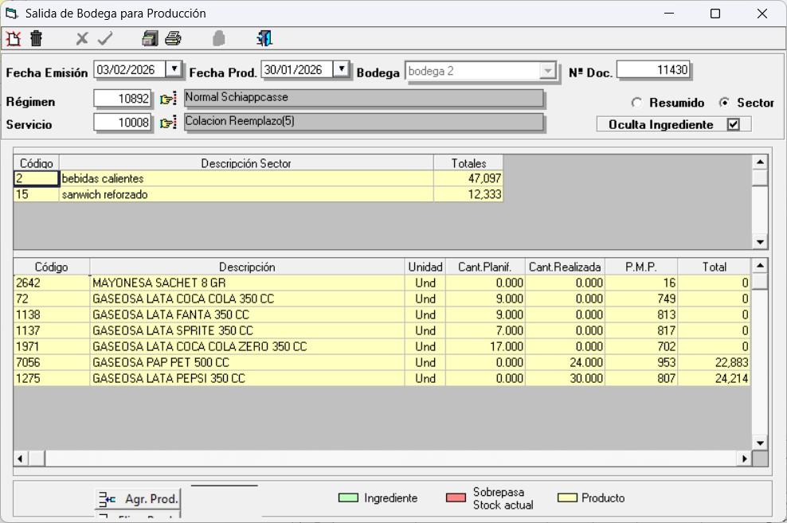

*Figura **16**. Formulario **Salida de Producción (**M_SalBod.frm**).*

Registra el egreso de insumos desde bodega hacia producción para la elaboración de los servicios del día. Se basa en la **minuta planificada** (b_minuta/b_minutadet con mid_tipmin='2') o en la **minuta fija** (b_minutafijadia). Tipo de documento: **SP**. Usa tov_fecpro (no tov_fecemi) como fecha determinante del período contable.

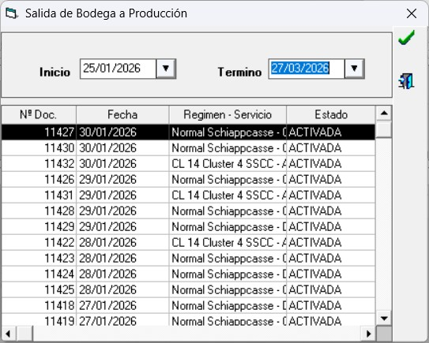

*Figura **17**. Formulario **Traspaso** (**B_SalBod.frm**).*

El botón **Histótico** abre un formulario de búsqueda (B_SalBod) donde el usuario puede seleccionar un documento de salida de producción previamente grabado para el contrato activo. Requiere que el contrato esté seleccionado antes de usarlo.

Una vez elegido el documento, el sistema carga todos sus datos en pantalla: encabezado (fechas, bodega, régimen, servicio), estado ("PENDIENTE", "ANULADA" o cerrado) y el detalle completo de ingredientes y productos con sus cantidades y valores.

Si el documento está **pendiente**, se carga en modo editable para que el usuario pueda modificar cantidades, agregar productos y luego grabarlo o cerrarlo. Si está **cerrado o anulado**, se muestra en modo solo lectura, habilitando únicamente las acciones de anular (si aplica) o imprimir.

**Flujo de Salida de Producción****:**

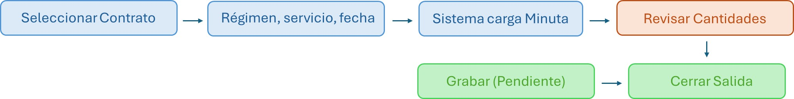

| Campo | Descripción | Obligatorio |
| --- | --- | --- |
| Fecha Emisión | Fecha en que se emite el documento de salida. Se inicializa automáticamente con la fecha actual. | Sí |
| Fecha Prod. | Fecha de producción para la que se prepara la salida. Determina qué minuta se consulta. | Sí |
| Bodega | Lista desplegable con las bodegas disponibles para el contrato. Se carga automáticamente al abrir la pantalla. | Sí |
| Contrato | Código del contrato (centro de costo del casino). Se completa automáticamente con el casino activo; puede modificarse si el usuario tiene permiso de cambio de casino. | Sí |
| Régimen | Código numérico del régimen alimenticio. Solo visible en contratos con modalidad de servicio estándar (no aplica a contratos FM). | Sí (contratos no-FM) |
| Servicio | Código numérico del servicio dentro del régimen. Solo visible en contratos con modalidad de servicio estándar. | Sí (contratos no-FM) |
| N° Doc. | Número correlativo del documento. El sistema lo asigna automáticamente; no requiere ingreso manual. | Automático |

**Observaciones****:**

Carga automática de ingredientes desde la minuta planificada o minuta fija del día.

Vista "Resumida" (todos los ingredientes) o "Por Sector" (agrupados por estructura de servicio).

> 💬 **Comentario — Sandoval Nocchi, Maria Cecilia (2026-03-06):** El sector no está definido por áreas de cocina, generalmente está asociada a la estructura del servicio.

Si ya existe una salida para ese día/servicio, permite agregar más productos sin duplicar.

> 💬 **Comentario — Sandoval Nocchi, Maria Cecilia (2026-03-06):** Los adicionales en algún reporte deben poder visualizarse por separado de la planificación real

El período contable se determina por la **fecha de producción**, no por la fecha de ingreso.

> 💬 **Comentario — Sandoval Nocchi, Maria Cecilia (2026-03-06):** Considerar el cambio de nombre del campo ya que el costo se debe mover para el día de consumo.

> 💬 **Comentario — Gonzalez Segovia Marcelo (2026-03-26):** OK, fecha de minuta

Se propone un redondeo de los productos según su factor de conversión.

**Reglas de negocio:**

| # | Cuando aparece | Qué verifica el sistema | Qué ve o experimenta el usuario |
| --- | --- | --- | --- |
| 1 | Al intentar cargar o grabar con fecha de producción posterior al cierre diario pendiente | Que el contrato con inventario rotativo haya realizado el cierre diario | "Tiene que realizar cierre diario..." |
| 2 | Al intentar grabar o cerrar | Que la fecha de producción no sea anterior a la última toma de inventario | "No puede ingresar documentos anteriores a la última toma de inventario." |
| 3 | Al intentar grabar o cerrar | Que el documento corresponda al período contable abierto | "Documento no corresponde al periodo : [fecha]" |
| 4 | Al intentar grabar o cerrar | Que no se esté realizando una toma de inventario en ese momento | "Se esta realizando la toma de inventario en estos momento..." |
| 5 | Al intentar grabar o cerrar | Que no haya un inventario calendarizado pendiente anterior al documento | "No puede ingresar documento, antes de un inventario calendarizado..." |
| 6 | Al intentar grabar o cerrar | Que se haya realizado el ajuste posterior a la última toma de inventario | "No ha realizado el ajuste correspondiente a la última toma de inventario." |
| 7 | Al intentar grabar o cerrar | Que la fecha de producción no corresponda a un día ya cerrado | "Día se encuentra cerrado, no es posible ingresar..." |
| 8 | Al intentar grabar o cerrar | Que todos los campos obligatorios estén completos (contrato, N° doc, fecha emisión, bodega, fecha producción, régimen y servicio) | "Debe ingresar dato importante..." |
| 9 | Al intentar cerrar el documento (Cerrar Salida) | Que no exista ninguna fila con cantidad que supere el stock disponible | "Existe una cantidad que exede el Stock..." |
| 10 | Al intentar grabar o cerrar | Que el total valorizado del documento sea mayor a cero | "El total del documento debe ser mayor a 0..." |
| 11 | Al cerrar el documento cuando otro usuario ya lo cerró | Que el documento siga abierto en la base de datos | "Documento fue cerrado por otro usuario, proceso cancelado" |
| 12 | Al cerrar, si el stock cambió entre la carga y el cierre | Que cada producto aún tenga stock suficiente en el momento exacto del cierre | "Existen productos con diferencia en la bodega, proceso cancelado" |
| 13 | Al intentar anular | Que el período no esté cerrado | "Periodo esta cerrado..." |
| 14 | Al intentar anular | Que la fecha de producción no sea anterior a la última toma de inventario | "No puede anular documentos anteriores a la última toma de inventario." |
| 15 | Al intentar anular | Que la fecha de producción no corresponda a un día cerrado | "No puede anular documento, día esta cerrado..." |
| 16 | Al intentar anular | Que no exista una devolución de producción registrada sobre este documento | "No puede anular documento, ya que existen devolución producción. debe anular la devolución producción..." |
| 17 | Al buscar un documento | Que se haya seleccionado un contrato antes | "Debe seleccionar contrato..." |
| 18 | Al intentar buscar un documento sin resultado | Que el documento buscado exista | "No existe salida producción..." |
| 19 | Al cambiar de bodega (Combo Actualizar Stock) | Verifica el estado de cada producto en la bodega seleccionada | (No muestra mensaje; actualiza colores de la grilla) |
| 20 | Al agregar producto manualmente sin bodega | Que se haya seleccionado una bodega | "Debe seleccionar bodega..." |
| 21 | Al agregar un producto ya existente en la grilla | Que el producto no esté duplicado en el mismo sector | "El producto ya existe en la grilla..." / "El producto ya existe sector..." |
| 22 | Al agregar un producto sin ingrediente asignado | Que el producto tenga al menos un ingrediente definido | "No hay ingrediente asignado al producto..." |
| 23 | Al intentar cargar la minuta con estructura de servicio sin sector asignado | Que todas las estructuras de servicio tengan sector definido | "Una de las estructuras de servicio no tiene asignado sector: [lista]. Asigne la sector ..." |
| 24 | Al ingresar un contrato inexistente | Que el contrato exista en la tabla de clientes | "Contrato no existe..." |
| 25 | Al cancelar con datos en la grilla | Confirmación del usuario | "Cancela..." |
| 26 | Al presionar Anular | Confirmación del usuario | "Anula documento..." |
| 27 | Al presionar Cerrar Salida | Confirmación del usuario | "Esta Seguro Cerrar Salida..." |

**Observaciones:**

- La fecha de producción (tov_fecpro) es la que determina el período contable, no la fecha de emisión.
- Si existe una salida pendiente (Borrador, el concepto en SGP en Guardada) para el mismo día/servicio, el sistema la carga para completarla en lugar de crear un documento nuevo.
- Si ya existe un SP para la misma fecha/servicio en estado Cerrado, el sistema entra en **modo AGREGAR** y permite añadir más productos al mismo servicio del día con un documento nuevo.

La preferencia de vista (con/sin ingredientes vacíos) se guarda por casino y persiste entre sesiones.

**Importante:**

- La Estructura Fija de Servicios (Minutas), ya no se administra desde el sitio si no que va incluido desde la minuta centralizada.

**<u>Cantidad planificada del ingrediente</u>**

La cantidad teórica de cada ingrediente se calcula a partir de la minuta planificada: por cada preparación, se multiplican las raciones planificadas por la cantidad de ingrediente por ración (extraída de la receta), dividiéndola por la base de raciones de la receta.

Cantidad ingrediente = Suma de (Raciones planificadas × Cantidad del ingrediente en receta / Base de raciones de la receta)

Componentes:

- Raciones planificadas: Número de raciones previstas en la minuta para cada estructura de servicio
- Cantidad del ingrediente en receta: Gramos u otras unidades del ingrediente por porción de receta
- Base de raciones de la receta: Número de raciones para el que está calibrada la receta

**<u>Cantidad planificada del producto (unidades a retirar de bodega)</u>**

La cantidad planificada del producto (en unidades de compra) se obtiene dividiendo la cantidad de ingrediente calculada por el factor de conversión del producto (facing).

Cantidad producto = Cantidad ingrediente / Factor de conversión (facing)

Componentes:

- Cantidad ingrediente: Total del ingrediente calculado según minuta
- Factor de conversión (facing): Cuántas unidades del ingrediente contiene una unidad del producto comercial

**<u>Total valorizado de la línea</u>**

Cada línea del detalle se valoriza multiplicando la cantidad realizada por el precio medio ponderado (P.M.P.) vigente del producto.

Total línea = Cantidad realizada × P.M.P.

Componentes:

- Cantidad realizada: Unidades del producto efectivamente despachadas (editada por el usuario)
- P.M.P.: Precio medio ponderado vigente del producto para el casino

**<u>Formato de salida:</u>**

Al presionar Imprimir (o automáticamente al Cerrar Salida), el sistema genera un comprobante en ventana de Vista Previa.  El comprobante se genera en formato RTF, orientación vertical, en la ruta de reportes configurada para el sistema.

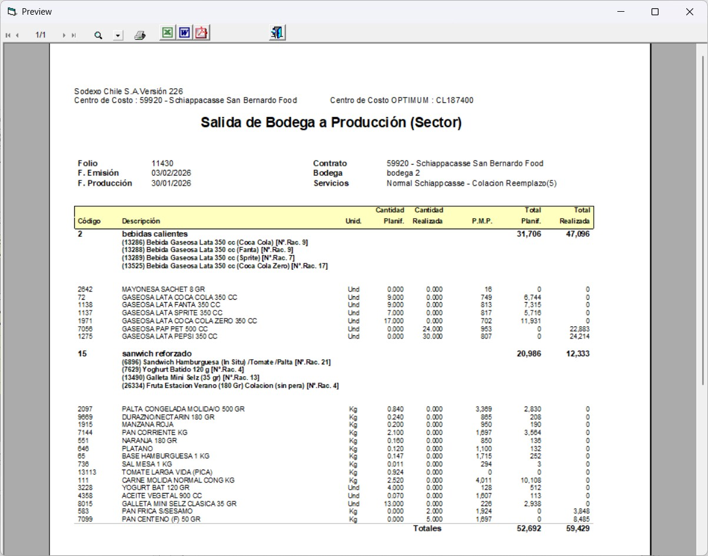

*Figura 18. Salida de Bodega a Producción.*

**Tablas asociadas:**

| Tabla | Para qué se usa | Campos clave |
| --- | --- | --- |
| b_totventas | Encabezado del documento de salida. Guarda folio, contrato, bodega, fechas, régimen, servicio, estado y total del documento. | tov_rutcli, tov_tipdoc (='SP'), tov_numdoc, tov_codbod, tov_estdoc, tov_fecpro, tov_codreg, tov_codser |
| b_detventas | Detalle del documento. Una fila por producto despachado con cantidades y valorización. | dev_rutcli, dev_tipdoc, dev_numdoc, dev_numlin, dev_codmer, dev_canmin, dev_canmer, dev_predoc, dev_ptotal, dev_coding, dev_codsec |
| b_detventasimp | Tabla auxiliar que se limpia junto con el detalle al re-grabar un documento pendiente. | imd_rutdoc, imd_tipdoc, imd_numdoc |
| b_bodegas | Stock actual de cada producto en cada bodega. Se consulta para mostrar disponibilidad y se actualiza al cerrar el documento. | bod_codpro, bod_codbod, bod_canmer |
| b_productos | Catálogo de productos comerciales con su factor de conversión y unidad de compra. | pro_codigo, pro_nombre, pro_coduni, pro_facing, pro_ctrsto, pro_fecven |
| b_ingrediente | Catálogo de ingredientes (materia prima medida en unidades de receta). | ing_codigo, ing_nombre, ing_unimed |
| b_productosing | Relación entre producto comercial e ingrediente. | pri_codpro, pri_coding |
| b_minuta | Encabezado de la minuta de planificación para la fecha consultada. | min_codigo, min_cencos, min_fecmin, min_codreg, min_codser, min_racrea |
| b_minutadet | Detalle de la minuta: qué recetas se sirven con cuántas raciones. | mid_codigo, mid_codrec, mid_tipmin, mid_numrac, mid_estser, mid_tiprec |
| b_minutafijadia | Estructura fija de productos para días sin minuta planificada. | mfd_cencos, mfd_codpro, mfd_codreg, mfd_codser, mfd_fecha, mfd_canpro |
| b_receta | Cabecera de receta con la base de raciones para la que está calibrada. | rec_codigo, rec_nombre, rec_basrac |
| b_recetadet | Ingredientes y cantidades por receta. | red_codigo, red_codpro, red_canpro, red_tiprec, red_cencos |
| b_productospmpdia | Precio medio ponderado diario de cada producto para el casino. Se usa para valorizar las cantidades. | ppd_cencos, ppd_codpro, ppd_propon, ppd_fecdia |
| b_contlistpreing | Lista de compra que relaciona ingrediente con producto comercial equivalente para el casino. | cpi_cencos, cpi_coding, cpi_codped |
| b_parametros | Parámetros del sistema para el número correlativo del documento. | par_codbod, par_tipdoc, par_correlativo |
| a_param | Parámetros de configuración del casino. Almacena la preferencia de vista (resumido/sector) y la visibilidad de ingredientes. | par_cencos, par_codigo ('salressec', 'ingsalpro'), par_valor |
| a_regimen | Catálogo de regímenes alimenticios. | reg_codigo, reg_nombre |
| a_servicio | Catálogo de servicios. | ser_codigo, ser_nombre, ser_activo |
| a_estservicio | Estructura de servicios que asocia servicio, casino y sector. | ess_codigo, ess_nombre, ess_codser, ess_cencos, ess_codsec |
| a_sector | Catálogo de sectores de comedor. | sec_codigo, sec_nombre, sec_orden |
| b_clientes | Contratos (centros de costo de casinos). Se valida al ingresar el código de contrato. | cli_codigo, cli_nombre, cli_tipo |

## 8.8. Venta Directa (M_VenDir.frm)

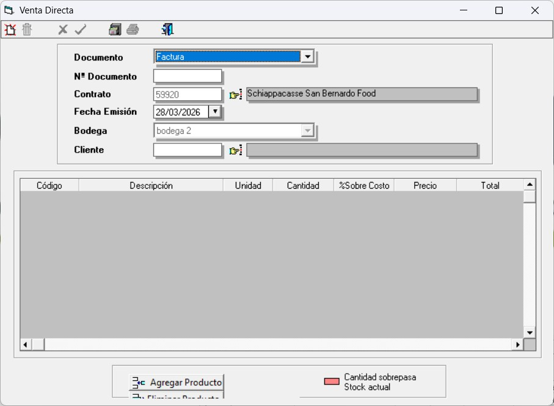

*Figura **19**. Formulario **Venta Directa (**M_VenDir.frm**).*

Registra ventas de productos directamente desde bodega a un cliente, sin pasar por producción. Disminuye el stock de bodega **en tiempo real** (al grabar). Genera comprobante impreso en pantalla.

> 💬 **Comentario — Sandoval Nocchi, Maria Cecilia (2026-03-06):** A que se refiere el cliente interno?

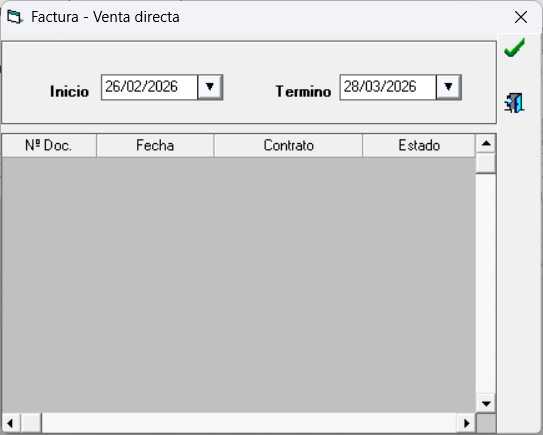

*Figura **20**. Formulario **Traspaso** (**B_SalBod.frm**).*

[DESCRIPCIÓN]

**Flujo de Venta Directa:**

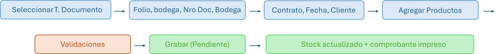

| Campo | Descripción | Obligatorio |
| --- | --- | --- |
| Tipo de Documento | Selección entre Factura (FA) o Guía de Despacho (GD) | Sí |
| N° Documento | Folio numérico del documento (Factura o Guía de Despacho) | Sí |
| Bodega | Bodega desde donde se entrega la mercadería | Sí |
| Fecha Emisión | Fecha del documento en formato dd/mm/aaaa | Sí |
| Contrato | Código del contrato (casino) que emite el documento | Sí |
| Cliente | RUT del cliente receptor del documento | Sí |
| Al menos un producto en la grilla | El documento debe tener líneas con cantidad mayor a cero | Sí |

**Observaciones****:**

Registro de ventas por producto con precio y cantidad. Puedes insertar o eliminar productos, al ingresar la cantidad te da la opción de ingresar el precio de venta dependiendo de cómo este definido con el cliente se puede ingresar uno o el otro y el sistema calcula el no ingresado, estas opciones son:

% sobre el costo (Sobre el PMP).

Precio definido (Manual)

Visualización del stock disponible por producto en tiempo real.

Generación automática de comprobante impreso en pantalla.

El stock se descuenta inmediatamente al grabar.

- Cliente obligatorio.
- Anulación venta directa.

**Reglas de negocio:**

| # | Cuando aparece | Qué verifica el sistema | Qué ve o experimenta el usuario |
| --- | --- | --- | --- |
| 1 | Al intentar grabar | Todos los campos del encabezado completos: contrato, folio, cliente, tipo de documento, bodega y fecha | Debe ingresar dato importante... |
| 2 | Al intentar grabar | El casino tiene inventario rotativo activo y hay actividades diarias pendientes, y la fecha es posterior al día de cierre | Tiene que realizar cierre diario... |
| 3 | Al intentar grabar | La fecha del documento pertenece a un período mensual cerrado | Documento no corresponde al periodo : [fecha] |
| 4 | Al intentar grabar | La fecha del documento es anterior a la última toma de inventario registrada | No puede ingresar documentos anteriores a la última toma de inventario. |
| 5 | Al intentar grabar | Hay una toma de inventario calendarizada en curso | Se esta realizando la toma de inventario en estos momento... |
| 6 | Al intentar grabar | La fecha del documento cae antes de un inventario calendarizado pendiente | No puede ingresar documento, antes de un inventario calendarizado... |
| 7 | Al intentar grabar | No se ha realizado el ajuste de la última toma de inventario | No ha realizado el ajuste correspondiente a la última toma de inventario. |
| 8 | Al intentar grabar | La fecha del documento es anterior al día de cierre diario actual | Día se encuentra cerrado, no es posible ingresar... |
| 9 | Al intentar grabar | Al menos una línea de la grilla tiene cantidad que supera el stock disponible en bodega (indicada con fila resaltada) | Existe una cantidad que exede el Stock... |
| 10 | Al intentar grabar | La suma de todos los totales de línea es igual a cero | El total del documento debe ser mayor a 0... |
| 11 | Al confirmar grabado | El sistema solicita confirmación antes de guardar | Desea grabar... (Sí / No) |
| 12 | Al intentar eliminar | La fecha del documento pertenece a un período cerrado | Periodo cerrado... |
| 13 | Al intentar eliminar | La fecha del documento es anterior a la última toma de inventario | No puede ingresar documentos anteriores a la última toma de inventario. |
| 14 | Al intentar eliminar | La fecha del documento es anterior al día de cierre diario | No puede eliminar documento, día esta cerrado... |
| 15 | Al confirmar eliminación | El sistema solicita confirmación antes de eliminar el documento | Elimina documento... (Sí / No) |
| 16 | Al ingresar código de contrato | El código no existe en la tabla de clientes con tipo contrato | Contrato no existe... |
| 17 | Al ingresar RUT de cliente | El RUT no existe en la tabla de clientes como cliente activo (tipo 1) | Cliente no existe... |
| 18 | Al agregar un producto | El producto seleccionado ya existe como línea en la grilla | El producto ya existe en la grilla... |
| 19 | Al eliminar una línea de la grilla | El sistema solicita confirmación antes de quitar el producto | Elimina Producto... (Sí / No) |
| 20 | Al hacer clic en Nuevo con productos en grilla | El sistema solicita confirmación antes de limpiar el formulario | Cancela... (Sí / No) |

**Observaciones:**

Si el documento se elimina, el stock se restaura automáticamente.

No se puede ingresar venta con un valor menor al PMP o un porcentaje negativo.

**<u>Precio de venta por unidad (Precio)</u>**

El precio unitario de venta se calcula a partir del precio de movimiento ponderado (PMP) del producto vigente a la fecha de emisión del documento, más un porcentaje de sobre costo que el usuario puede ajustar. El sistema toma el PMP más reciente registrado para ese producto en el casino activo entre el día de cierre y la fecha ingresada.

Precio de venta = Precio PMP + (Precio PMP × % Sobre Costo / 100), redondeado al entero más cercano

Componentes:

- Precio PMP: Precio de movimiento ponderado diario del producto
- % Sobre Costo: Porcentaje de margen sobre el costo que el usuario puede editar en la grilla
- Precio de venta: Precio unitario que queda registrado en el documento

**Total de línea**

El importe total de cada línea del documento se calcula multiplicando la cantidad por el precio de venta unitario.

Total línea = Cantidad × Precio de venta

Componentes:

- Cantidad: Unidades del producto entregadas
- Precio de venta: Precio unitario calculado según regla anterior
- Total línea: Importe por línea guardado en el documento

**Total del documento**

La suma de todos los totales de línea con cantidad mayor a cero constituye el total del documento.

Total documento = Suma de (Total línea) para todas las líneas con Cantidad > 0

**<u>Formato de salida:</u>**

Después de grabar (y también con el botón Imprimir sobre un documento consultado), el sistema genera automáticamente una vista previa del documento en pantalla.  El documento se genera en orientación vertical (retrato) y se guarda como archivo RTF en la carpeta de reportes del sistema.

[IMAGEN]

*Figura 21. **Comprobante de Ingreso**.*

**Tablas asociadas:**

| Tabla | Para qué se usa | Campos clave |
| --- | --- | --- |
| b_totventas | Encabezados de documentos de venta directa. Almacena un registro por documento emitido. | tov_rutcli, tov_tipdoc, tov_numdoc, tov_codbod, tov_fecemi, tov_codcas, tov_totdoc, tov_estdoc |
| b_detventas | Líneas de detalle de documentos de venta. Un registro por producto por documento. | dev_rutcli, dev_tipdoc, dev_numdoc, dev_numlin, dev_codmer, dev_canmer, dev_predoc, dev_ptotal, dev_porcen, dev_precos, dev_descri |
| b_detventasimp | Tabla auxiliar de imputaciones de venta. Se elimina junto al documento cuando se anula. | imd_rutdoc, imd_tipdoc, imd_numdoc |
| b_bodegas | Stock actual de productos por bodega. Se descuenta al grabar y se repone al eliminar. | bod_codbod, bod_codpro, bod_canmer |
| b_productos | Catálogo de productos. Se usa para obtener descripción, unidad de medida y código. | pro_codigo, pro_nombre, pro_coduni, pro_ctrsto |
| b_productospmpdia | Precios de movimiento ponderado diario por producto y casino. Se usa para pre-cargar el precio al agregar un producto y al cambiar la fecha de emisión. | ppd_codpro, ppd_cencos, ppd_fecdia, ppd_propon |
| b_clientes | Registro de contratos (tipo 0) y clientes (tipo 1). Se usa para validar y obtener el nombre del contrato y el cliente. | cli_codigo, cli_nombre, cli_tipo, cli_activo |
| a_unidad | Tabla de unidades de medida. Se usa para mostrar la unidad de cada producto en la grilla y en el documento. | uni_codigo, uni_nombre |

## 8.9. Venta Cafetería (M_VenCaf.frm)

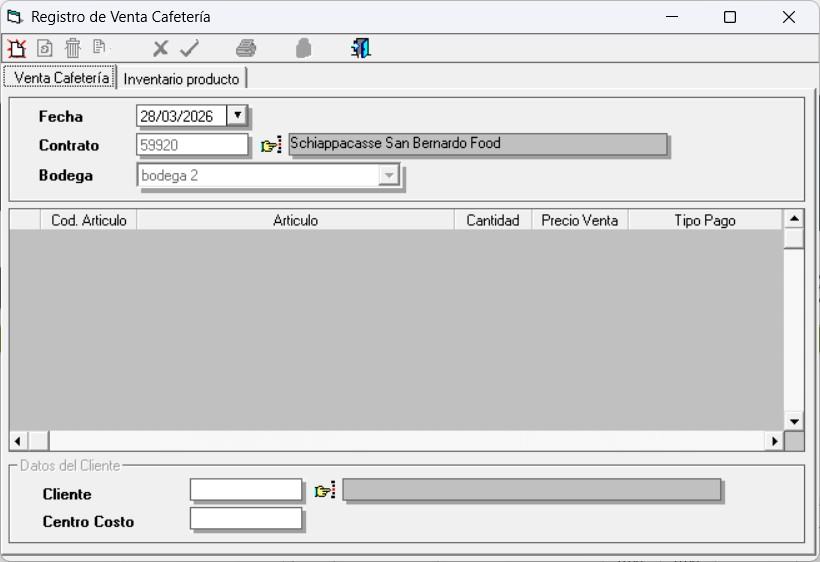

*Figura **22**. Formulario **Venta Cafetería (**M_VenCaf.frm**).*

Registra diariamente las ventas de la cafetería del casino. Utiliza **tablas propias** (b_totventascaf / b_detventascafpro), separadas de la estructura de b_totventas. El stock se descuenta **solo cuando el estado es 'C' (Cerrado)** se refiere a cuando selecciono el icono candado y la cantidad digitada (dvp_candig) es distinta de cero.

**Flujo de Venta Cafetería****:**

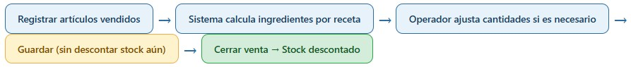

| Campo | Descripción | Obligatorio |
| --- | --- | --- |
| Fecha | Dia al que corresponde la venta. Se ingresa manualmente en formato dd/mm/aaaa. | Si |
| Contrato | Codigo del casino (centro de costo). Si el usuario opera sobre un unico casino, el sistema lo carga automaticamente. | Si |
| Bodega | Lista desplegable con las bodegas asociadas al contrato. Si solo hay una bodega disponible, el sistema la selecciona sola. | Si |
| Articulo de cafeteria | Codigo del articulo a vender (cafe, sandwich, etc.), seleccionado desde un buscador. Debe existir en la tabla de precios de cafeteria del casino y tener composicion de productos definida. | Si (al menos uno) |
| Cantidad | Unidades vendidas del articulo. Debe ser mayor a cero. | Si |
| Precio de venta | Precio unitario del articulo. Se carga automaticamente desde la tabla de precios pero puede modificarse. Debe ser mayor a cero. | Si |
| Tipo de pago | CONTADO, CREDITO o CUENTA ABONO CLIENTE. Se selecciona por articulo en la grilla. | Si |
| Cliente (RUT) | Requerido solo cuando el tipo de pago es CREDITO o CUENTA ABONO CLIENTE. Se puede buscar con el icono de lupa. | Condicional |
| Centro de costo del cliente | Codigo del centro de costo asociado al cliente. Se completa junto con el cliente. | Condicional |

**Observaciones****:**

Registro de artículos vendidos con precio y tipo de pago (efectivo, crédito, cliente).

Cálculo automático de ingredientes según la receta de cada artículo.

Posibilidad de ajustar la cantidad real entregada respecto a la calculada.

Permite reabrir una venta cerrada (restaura el stock descontado).

**Reglas de negocio:**

| # | Cuando aparece | Qué verifica el sistema | Qué ve o experimenta el usuario |
| --- | --- | --- | --- |
| 1 | Al intentar agregar o grabar / cerrar | Si el casino tiene inventario rotativo activo y hay actividades diarias pendientes y la fecha es posterior al ultimo cierre diario | "Tiene que realizar cierre diario..." |
| 2 | Al intentar agregar, grabar, cerrar, reabrir o eliminar | Si el periodo contable esta cerrado para la bodega y fecha indicadas | "Periodo cerrado..." o "Documento no corresponde al periodo : [fecha de cierre]" |
| 3 | Al intentar agregar, grabar, cerrar, reabrir o eliminar | Si la fecha del documento es anterior a la ultima toma de inventario | "No puede ingresar documentos anteriores a la ultima toma de inventario." |
| 4 | Al intentar agregar o grabar | Si se esta realizando una toma de inventario calendarizada en este momento | "Se esta realizando la toma de inventario en estos momento..." |
| 5 | Al intentar agregar | Si existe un inventario calendarizado proximo que bloquea el ingreso | "No puede ingresar documento, antes de un inventario calendarizado..." |
| 6 | Al intentar agregar, grabar, cerrar o reabrir | Si no se ha realizado el ajuste posterior a la ultima toma de inventario | "No ha realizado el ajuste correspondiente a la ultima toma de inventario." |
| 7 | Al intentar agregar o eliminar | Si la fecha del documento corresponde a un dia ya cerrado (anterior al cierre diario) | "Dia se encuentra cerrado, no es posible ingresar..." o "No puede eliminar documento, dia esta cerrado..." |
| 8 | Al seleccionar un articulo | Si el articulo no tiene composicion de productos definida para este casino | "El articulo no tiene composicion..." |
| 9 | Al seleccionar un articulo | Si el articulo ya fue ingresado en la misma venta | "Articulo de cafeteria ya fue ingresado" |
| 10 | Al seleccionar un articulo manualmente en la grilla | Si el codigo ingresado no existe en la tabla de precios de cafeteria | "Articulo de cafeteria no existe" |
| 11 | Al validar el encabezado antes de grabar | Si no se ingreso contrato, bodega o fecha | "Debe ingresar dato en el encabezado..." |
| 12 | Al validar la grilla antes de grabar | Si no hay ningun articulo ingresado | "Debe ingresar por lo menos un articulo..." |
| 13 | Al validar antes de grabar | Si la grilla de productos esta vacia (sin composicion) | "No hay productos en la composicion..." |
| 14 | Al validar el articulo antes de grabar | Si el codigo del articulo es cero o vacio | "Debe ingresar articulo..." |
| 15 | Al validar la cantidad del articulo antes de grabar | Si la cantidad es cero | "La cantidad debe ser mayor a cero..." |
| 16 | Al validar el precio del articulo antes de grabar | Si el precio de venta es cero | "El precio debe ser mayor a cero..." |
| 17 | Al validar el tipo de pago antes de grabar | Si no se selecciono tipo de pago | "Debe seleccionar tipo pago..." |
| 18 | Al validar el cliente antes de grabar | Si el tipo de pago es CREDITO o CUENTA ABONO CLIENTE y no se ingreso cliente | "Debe Ingresar cliente..." |
| 19 | Al validar productos antes de grabar | Si algun producto de la composicion tiene cantidad cero | "La cantidad debe ser mayor a cero..." |
| 20 | Al validar productos antes de grabar | Si algun producto de la composicion tiene precio cero | "El precio debe ser mayor a cero..." |
| 21 | Al intentar cerrar la venta | Si alguna cantidad digitada en la pestana Inventario producto es cero | "La cantidad debe ser mayor a cero..." |
| 22 | Al intentar cerrar la venta | Si alguna fila de inventario muestra que la cantidad supera el stock disponible | "Cantidad exede el Stock......" |
| 23 | Al ingresar un contrato invalido en el campo Contrato | Si el codigo no existe como cliente de tipo contrato | "Contrato no existe..." |
| 24 | Al ingresar un RUT de cliente invalido | Si el RUT no existe como cliente activo de tipo persona | "Cliente no existe..." |
| 25 | Al intentar imprimir | Si la grilla de articulos esta vacia | "No Existe Datos Imprimir" |
| 26 | Al eliminar un articulo | Solicita confirmacion antes de proceder | "Elimina articulo[... junto con el ultimo articulo eliminara tambien el documento]..." |
| 27 | Al cancelar cambios en curso | Solicita confirmacion antes de descartar | "Cancela..." |

**Observaciones:**

- tvc_estado = 'C' → activa el impacto en stock en el recálculo masivo (sgp_Upd_actualizar_Stock_Bodega).
- dvp_candig ≠ 0 → condición adicional para que la línea afecte el stock.
- El campo relevante para stock es dvp_candig (cantidad digitada), no otro campo de cantidad.
- Solo ventas cerradas afectan stock.
- Reabrir la venta revierte el descuento de stock.
- Stock se actualiza en Cierre Diario.

**Importante:**

- **Evaluar si se construirá esté módulo en la nueva versión.**

**<u>Cantidad calculada de producto (composicion)</u>**

Cuando el usuario ingresa o modifica la cantidad de un artículo de cafetería, el sistema recalcula automáticamente cuantas unidades de cada materia prima se necesitan. La fórmula usa la proporción definida en la composición del artículo.

Cantidad producto = Proporción del producto en el artículo × Cantidad de artículos vendidos

Componentes:

- Proporción del producto en el artículo: Cuantas unidades de materia prima usa una unidad del artículo de cafetería
- Cantidad de artículos vendidos: Unidades ingresadas por el usuario en la grilla

**<u>Precio de costo del producto</u>**

El sistema busca el precio de costo más reciente del producto a partir de la tabla de precios promedio diario (b_productospmpdia), tomando el registro más cercano anterior o igual a la fecha de venta. Si no existe registro de precio promedio, el precio queda en cero y el usuario debe ingresarlo manualmente.

**<u>Verificacion de sobrestock</u>**

El sistema compara la cantidad calculada del producto con el stock actual en bodega. Si la diferencia es negativa (cantidad a descontar mayor que el stock), la fila se marca en rojo y se etiqueta internamente como excedida. El cierre de la venta queda bloqueado mientras exista alguna fila en esta condición.

**<u>Formato de salida:</u>**

El comprobante se genera en orientación **vertical (Portrait)**, en formato RTF, y se presenta en la ventana de Vista Previa donde puede revisarse antes de imprimir.

[IMAGEN]

*Figura 2**3**. **Comprobante de Ingreso**.*

**Tablas asociadas:**

| Tabla | Para qué se usa | Campos clave |
| --- | --- | --- |
| b_totventascaf | Encabezado de la venta de cafeteria. Un registro por contrato, fecha y bodega. Guarda el estado (abierta o cerrada). | tvc_cencos, tvc_fecing, tvc_codbod, tvc_estado |
| b_detventascaf | Lineas de articulos vendidos. Un registro por articulo dentro de la venta. | dvc_cencos, dvc_fecing, dvc_numlin, dvc_articulo, dvc_canart, dvc_precio, dvc_tippag, dvc_rutcli, dvc_cencli |
| b_detventascafpro | Composicion de productos (materias primas) resultante de los articulos vendidos. Se recalcula cada vez que se modifica la venta y se congela al cerrar. | dvp_cencos, dvp_fecing, dvp_codmer, dvp_cancal, dvp_candig, dvp_precos |
| b_totpreciocaf | Catalogo de articulos de cafeteria disponibles para el casino, con su precio de venta unitario. | tpc_codigo, tpc_nombre, tpc_precio, tpc_cencos |
| b_detpreciocaf | Composicion de productos definida para cada articulo de cafeteria (cuantas unidades de cada materia prima usa). | dpc_codigo, dpc_codmer, dpc_cantidad, dpc_cencos |
| b_bodegas | Inventario de productos en bodega. Se lee para verificar el stock y se actualiza (resta o suma) al cerrar o reabrir la venta. | bod_codpro, bod_codbod, bod_canmer |
| b_clientes | Tabla de clientes, contratos y bodegas del sistema. Se consulta para validar el contrato ingresado y el RUT del cliente. | cli_codigo, cli_nombre, cli_tipo, cli_activo |
| b_productos | Catalogo general de productos (materias primas). Se usa para obtener el nombre del producto en la grilla de inventario. | pro_codigo, pro_nombre |
| b_productospmpdia | Precios promedio diario de productos por casino. Se consulta para obtener el precio de costo de cada producto al momento de la venta. | ppd_cencos, ppd_codpro, ppd_propon, ppd_fecdia |

## 8.10. Salida Ventas de Servicios Especiales (M_SalidaServicioEspeciales.frm)

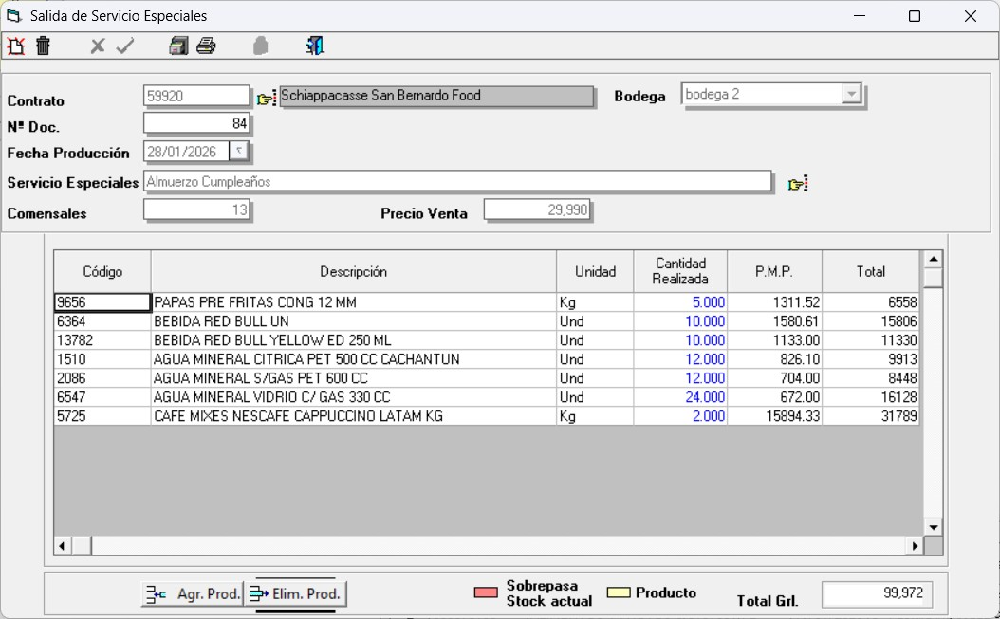

*Figura **24**. Formulario **Ventas de Servicios Especiales (**M_SalidaServicioEspeciales.frm**).*

Registra la salida de insumos para servicios especiales (eventos, catering puntual, servicios fuera de la planificación regular). Tipo de documento: **SE**.

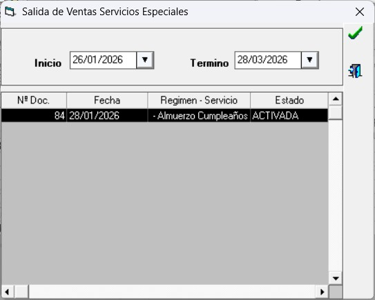

*Figura **25**. Formulario **Traspaso** (**B_SalBod.frm**).*

El botón **Histórico** valida que haya un contrato seleccionado, abre un buscador de documentos de salida existentes (B_SalBod), y al elegir uno ejecuta el SP sgp_Sel_DetalleSalVentaServiciosEspeciales para cargar en pantalla todos los datos del encabezado (folio, fecha, bodega, servicio, comensales, precio) y el detalle de productos en la grilla, marcando en violeta las filas con stock insuficiente, recalculando el total general y ajustando los controles según el estado del documento (pendiente, cerrado o anulado).

**Flujo de Salida Especial:**

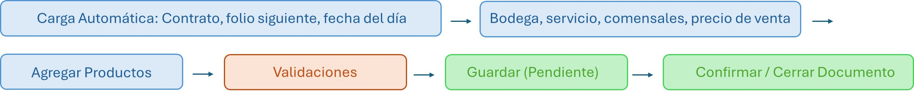

| Campo | Descripción | Obligatorio |
| --- | --- | --- |
| Contrato | Código del contrato del cliente (centro de costo). Se puede escribir directamente o seleccionar desde un buscador. | Sí |
| N° Doc. | Número correlativo del documento. El sistema lo propone automáticamente al cargar el contrato; se puede editar. | Sí |
| Fecha Producción | Fecha en que se realiza el servicio especial (formato dd/mm/yyyy). Por defecto se carga la fecha del día. | Sí |
| Bodega | Lista desplegable con las bodegas disponibles para el contrato. | Sí |
| Servicio Especiales | Descripción textual del servicio (por ejemplo: "Desayuno Especial", "Cena de Gala"). Se puede escribir o seleccionar desde un buscador. | Sí |
| Comensales | Cantidad de personas que participan del servicio especial. | Sí (mayor a 0) |
| Precio Venta | Precio por comensal o precio total del servicio, según corresponda. | Sí (mayor a 0) |
| Productos (grilla) | Cada fila indica el producto, su cantidad y precio unitario. Al agregar un producto el sistema propone el precio de la última compra vigente y consulta el stock disponible en la bodega seleccionada. | Al menos una fila con cantidad mayor a 0 para poder cerrar |

**Observaciones:**

Registro de salidas para eventos o servicios fuera de la planificación regular.

Estado provisional (PENDIENTE) que permite guardar sin afectar el stock definitivamente.

Confirmación final que descuenta el stock.

**Reglas de negocio:**

| # | Cuando aparece | Qué verifica el sistema | Qué ve o experimenta el usuario |
| --- | --- | --- | --- |
| 1 | Al intentar grabar o cerrar | Que se haya ingresado un contrato válido | Debe ingresar contrato... |
| 2 | Al intentar grabar o cerrar | Que el número de documento no esté vacío | Debe ingresar numero documento... |
| 3 | Al intentar grabar o cerrar | Que la fecha de producción no esté vacía | Debe ingresar fecha producción... |
| 4 | Al intentar grabar o cerrar | Que se haya seleccionado una bodega | Debe ingresar bodega... |
| 5 | Al intentar grabar o cerrar | Que la cantidad de comensales sea mayor a cero | Debe ingresar comensales... |
| 6 | Al intentar grabar o cerrar | Que el precio de venta sea mayor a cero | Debe ingresar precio venta... |
| 7 | Al intentar grabar o cerrar | Que se haya ingresado la descripción del servicio especial | Debe ingresar descripción venta especial... |
| 8 | Al intentar grabar o cerrar | Que el total de todas las líneas sea mayor a cero | El total del documento debe ser mayor a cero... |
| 9 | Al intentar grabar o cerrar | Que el documento no tenga ya una devolución registrada y no anulada | Documento tiene una devolución realizada, proceso cancelado |
| 10 | Al intentar grabar o cerrar | Que la fecha no caiga dentro de un período contable cerrado | Documento no corresponde al periodo : [fecha] |
| 11 | Al intentar grabar o cerrar | Que no exista una toma de inventario cerrada posterior a la fecha del documento | No puede ingresar documentos anteriores a la última toma de inventario. |
| 12 | Al intentar grabar o cerrar | Que no haya un inventario calendarizado en curso | Se esta realizando la toma de inventario en estos momento... |
| 13 | Al intentar grabar o cerrar | Que la fecha no sea anterior a un inventario calendarizado programado | No puede ingresar documento, antes de un inventario calendarizado... |
| 14 | Al intentar grabar o cerrar | Que la fecha no corresponda a un ajuste de inventario pendiente | No ha realizado el ajuste correspondiente a la última toma de inventario. |
| 15 | Al intentar grabar o cerrar | Que el día no esté cerrado en el cierre diario | Día se encuentra cerrado, no es posible ingresar... |
| 16 | Al intentar cerrar | Que el contrato tenga inventario rotativo y cierre diario al día | Tiene que realizar cierre diario... |
| 17 | Al intentar cerrar | Que el documento no haya sido cerrado por otro usuario mientras tanto | Documento fue cerrado por otro usuario, proceso cancelado |
| 18 | Al intentar cerrar | Que ninguna fila tenga cantidad que exceda el stock disponible | Existe una cantidad que exceden el Stock... |
| 19 | Al intentar cerrar | Que ninguna fila tenga cantidad igual a cero | Existe una cantidad con valor cero... |
| 20 | Al buscar un contrato inexistente | Que el código de contrato exista en el sistema | Contrato no existe... |
| 21 | Al intentar buscar documentos | Que se haya seleccionado previamente un contrato | Debe seleccionar contrato... |
| 22 | Al intentar agregar un producto | Que se haya seleccionado una bodega | Debe seleccionar bodega... |
| 23 | Al intentar agregar un producto ya existente | Que el producto no esté repetido en la grilla | El producto ya existe en la grilla... |
| 24 | Al intentar anular | Que el período no esté cerrado | Periodo esta cerrado... |
| 25 | Al intentar anular | Que el día no esté cerrado | No puede anular documento, día esta cerrado... |
| 26 | Al intentar anular | Que no exista toma de inventario posterior | No puede anular documentos anteriores a la última toma de inventario. |
| 27 | Al intentar anular | Que no haya inventario calendarizado en curso | Se esta realizando la toma de inventario en estos momento... |
| 28 | Al intentar anular | Que el documento no tenga devolución asociada vigente | Documento tiene una devolución realizada, proceso cancelado |
| 29 | Al intentar anular | Confirmación explícita del usuario | Anula documento... (requiere responder Sí) |
| 30 | Al intentar cancelar con datos en grilla | Confirmación explícita del usuario | Cancela... (requiere responder Sí) |
| 31 | Al grabar cuando el SP detecta stock insuficiente (modo solo guardado, no cierre) | Que ningún producto exceda el stock al momento de guardar | Abre archivo Excel con detalle de productos que exceden el stock: columnas Cód. Producto, Descripción, Cantidad Stock, Cantidad Salida, Glosa error |

**Observaciones:**

- Debe diferenciarse funcionalmente en reportes de costo respecto a Producción.
- Puede quedar pendiente para revisión y cierre posterior.
- Anulación de Venta Especial
- Permite devolución

**<u>Total por línea de producto</u>**

Por cada fila de la grilla, el sistema calcula el importe correspondiente multiplicando la cantidad por el precio unitario. Este valor se actualiza automáticamente al modificar cualquiera de los dos campos.

Total Línea = Cantidad × Precio Unitario

Componentes:

- Cantidad: Unidades del producto entregadas en el servicio
- Precio Unitario: Precio de compra vigente (precio promedio ponderado diario)
- Total Línea: Importe de esa línea del documento

**<u>Total General</u>**

La pantalla muestra un totalizador que suma todos los totales de línea de la grilla. Se recalcula en tiempo real al editar cantidades.

Total General = Suma de (Cantidad × Precio Unitario) por cada fila de la grilla

**<u>Indicador de stock insuficiente</u>**

Al editar la cantidad de cualquier producto, el sistema compara la suma total de ese producto en la grilla contra el stock disponible en la bodega seleccionada. Si la cantidad supera el stock, la fila se marca visualmente en color violeta y se registra internamente como bloqueada (indicador "S"). Si el stock es suficiente, la fila se muestra en color celeste (indicador limpio). El sistema impide cerrar el documento mientras existan filas bloqueadas.

**<u>Formato de salida:</u>**

**Comprobante imprimible (Vista Previa)** Se genera automáticamente una vista previa del comprobante en formato RTF, orientación vertical.  El usuario puede generar el comprobante manualmente en cualquier momento usando el botón Imprimir, siempre que haya un documento cargado en pantalla.

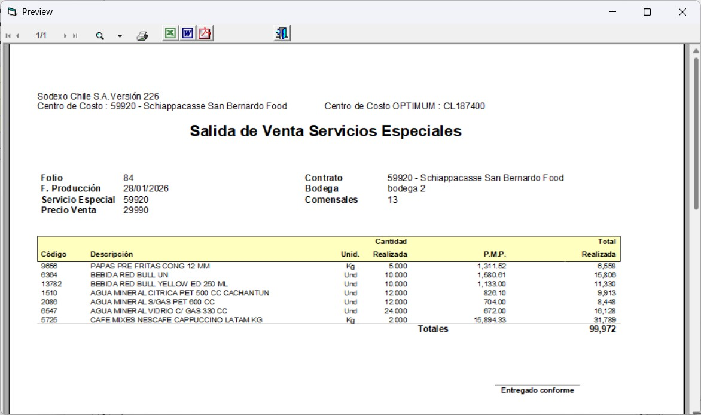

*Figura **26**.** Reporte Salida de Venta Servicios Especiales.*

**Tablas asociadas:**

| Tabla | Para qué se usa | Campos clave |
| --- | --- | --- |
| b_totventaserviciosespeciales | Encabezado de cada documento de venta de servicios especiales: un registro por folio | tos_IdCeco, tos_Tipo_Documento, tos_Numero_Documento, tos_IdBodega, tos_Fecha_Produccion, tos_Venta_Servicio_Especiales, tos_Comensales, tos_Precio_Servicio, tos_Total_Documento, tos_Estado_Documento, tos_Periodo, tos_Usuario |
| b_detventaserviciosespeciales | Líneas de productos de cada documento: un registro por producto por folio | des_IdCeco, des_Tipo_Documento, des_Numero_Documento, des_Numero_Linea, des_IdProducto, des_Cantidad_Mercaderia, des_Precio_Documento, des_Total_Documento, des_Mueve_Inventario |
| b_clientes | Tabla de contratos (centros de costo) del casino | cli_codigo, cli_nombre, cli_activo, cli_tipo, cli_codbod |
| b_bodegas | Saldos de stock por producto y bodega | bod_codbod, bod_codpro, bod_canmer |
| b_productos | Maestro de productos | pro_codigo, pro_nombre, pro_coduni, pro_ctrsto, pro_ctacon |
| a_unidad | Unidades de medida de los productos | uni_codigo, uni_nomcor |
| b_productospmpdía | Precios promedio ponderado diario por producto y centro de costo | ppd_cencos, ppd_codpro, ppd_propon, ppd_fecdia |
| b_parametros | Parámetros por bodega, incluye el correlativo de folios | par_codbod, par_tipdoc, par_correlativo |
| a_param | Parámetros generales del casino (cierre diario, días de bloqueo, etc.) | par_codigo, par_cencos, par_valor |
| a_servicio | Tabla de servicios especiales configurados para el buscador | ser_codigo, ser_nombre |

## 8.11. Devolución Producción (M_DevBod.frm)

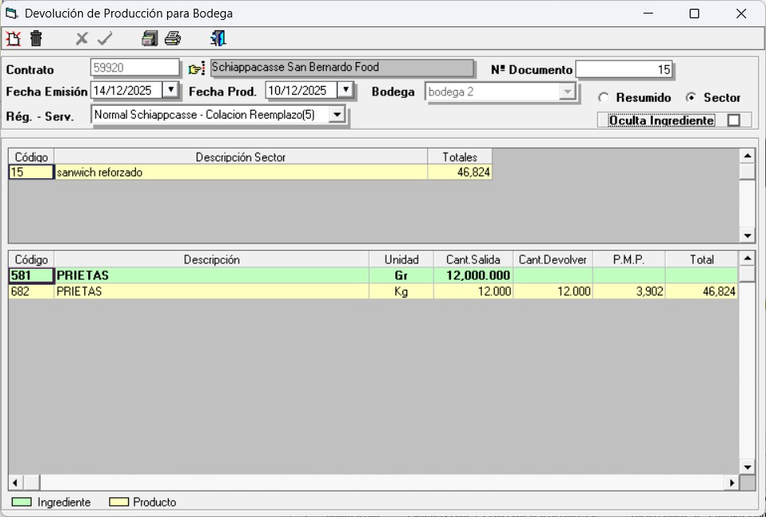

*Figura **27**. Formulario **Devolución Producción (**M_DevBod.frm**).*

Registra el retorno de insumos no utilizados desde producción hacia bodega. **Incrementa** el stock. Tipo de documento: **DP**. Usa fecha producción como fecha determinante del período contable (igual que SP).

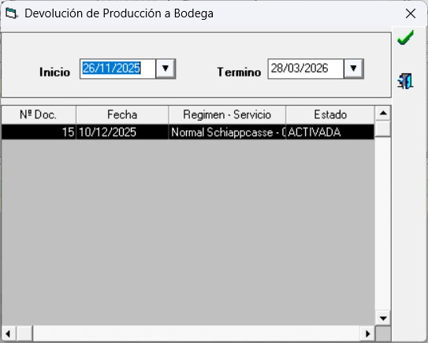

*Figura **28**. Formulario **Traspaso** (**B_SalBod.frm**).*

El botón **Histórico** permite localizar una devolución de producción ya registrada. Al presionarlo, el sistema abre una ventana donde se listan las devoluciones existentes del contrato activo. El usuario selecciona la que desea consultar y la pantalla se carga automáticamente con todos los datos de ese documento: fechas, servicio, productos devueltos, cantidades y totales. El documento se muestra en modo solo lectura y, si no está anulado, se habilitan las opciones para anularlo o imprimirlo.

**Flujo de ****Traspaso****:**

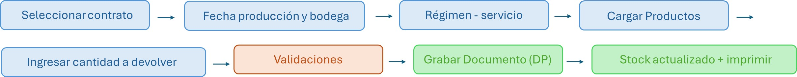

| Campo | Descripción | Obligatorio |
| --- | --- | --- |
| Contrato | Código del contrato (casino) que devuelve los productos. En la mayoría de los casos se carga automáticamente con el casino del operador al abrir la pantalla. | Sí |
| Fecha Emisión | Fecha en que se emite el documento de devolución. Se carga automáticamente con la fecha del día. | Sí |
| Bodega | Lista desplegable con las bodegas disponibles del contrato. Si solo existe una, se selecciona automáticamente. | Sí |
| Fecha Producción | Fecha del día de producción al que corresponde la devolución. Al salir del campo, el sistema consulta los servicios con salida a producción para esa fecha. | Sí |
| Régimen - Servicio | Lista desplegable que muestra los regímenes y servicios con salida a producción registrada para la fecha y contrato indicados. | Sí |
| Cantidad a Devolver | Para cada producto en la grilla, se debe ingresar la cantidad que efectivamente se devuelve. El valor no puede superar la cantidad despachada. | Sí (al menos uno > 0) |

**Observaciones:**

- Aumento de stock en bodega.
- Trazabilidad por servicio y fecha de producción.

Vista resumida o por sector del servicio.

El período contable se determina por la fecha de producción, no la fecha de devolución.

Anulación con reversa

**Reglas de negocio:**

| # | Cuando aparece | Qué verifica el sistema | Qué ve o experimenta el usuario |
| --- | --- | --- | --- |
| 1 | Al salir del campo Contrato | Que el código de contrato exista en la tabla de contratos (b_clientes) con tipo 0 | "Contrato no existe..." |
| 2 | Al seleccionar Régimen - Servicio | Que no exista ya un documento de devolución DP activo para el mismo contrato, fecha de producción y servicio | "Devolución ya realizada..." |
| 3 | Al seleccionar Régimen - Servicio | Que el contrato con inventario rotativo no tenga actividades pendientes de cierre diario posteriores a la fecha de producción | "Tiene que realizar cierre diario..." |
| 4 | Al salir del campo Fecha Producción | Que exista al menos una salida a producción (tipo SP) para el contrato y fecha indicados | "No existe salida a producción..." |
| 5 | Al intentar grabar | Que todos los campos obligatorios estén completos (contrato, folio, servicio, fecha emisión, bodega, fecha producción) | "Debe ingresar dato importante..." |
| 6 | Al intentar grabar | Que la fecha de producción no corresponda a un período cerrado | "Documento no corresponde al periodo: ..." |
| 7 | Al intentar grabar | Que la fecha de producción no sea anterior a la última toma de inventario | "No puede ingresar documentos anteriores a la última toma de inventario." |
| 8 | Al intentar grabar | Que no esté en curso una toma de inventario calendarizada | "Se está realizando la toma de inventario en estos momentos..." |
| 9 | Al intentar grabar | Que no exista un inventario calendarizado previo sin procesar | "No puede ingresar documento, antes de un inventario calendarizado..." |
| 10 | Al intentar grabar | Que el ajuste correspondiente al último inventario esté realizado | "No ha realizado el ajuste correspondiente a la última toma de inventario." |
| 11 | Al intentar grabar | Que la fecha de producción no sea anterior al cierre diario | "Día se encuentra cerrado, no es posible ingresar..." |
| 12 | Al intentar grabar | Que la suma de los totales de las líneas sea mayor a cero | "El total del documento debe ser mayor a 0..." |
| 13 | Al intentar anular | Que el período no esté cerrado | "Periodo está cerrado..." |
| 14 | Al intentar anular | Que la fecha de producción no sea anterior a la última toma de inventario | "No puede anular documentos anteriores a la última toma de inventario." |
| 15 | Al intentar anular | Que la fecha de producción no sea anterior al cierre diario | "No puede anular documento, día está cerrado..." |
| 16 | Al intentar anular | El sistema solicita confirmación antes de ejecutar la anulación | "Anula documento..." (Sí / No) |
| 17 | Al hacer clic en Nuevo con datos cargados | El sistema solicita confirmación antes de limpiar el formulario | "Cancela..." (Sí / No) |
| 18 | Al buscar una devolución | Que existan devoluciones registradas para el contrato activo | "No existe devolución producción..." |
| 19 | Al intentar imprimir | Que exista el documento con detalle grabado | "No existe salida producción..." |

**Observaciones:**

- La devolución de producción **suma** al stock de bodega.
- El período contable se determina por fecha de producción.

> 💬 **Comentario — Sandoval Nocchi, Maria Cecilia (2026-03-12):** Revisar

- Afecta el costo realizado del servicio asociado
- Ingreso de cantidades puede tener decimales (Ej: KG, Litros)
- Cantidad devuelta ≤ salida original

**Total por línea de producto**

Cada vez que el operador ingresa o modifica la cantidad a devolver en una fila de producto, el sistema recalcula automáticamente el importe de esa línea multiplicando la cantidad ingresada por el precio de costo del documento original.

Total línea = Cantidad a devolver × P.M.P. (Precio Medio Ponderado del documento original)

Componentes:

- Cantidad a devolver: Unidades físicas que se reintegran a bodega
- P.M.P.: Precio medio ponderado del producto al momento de la salida original
- Total línea: Valor monetario de la devolución para esa línea

El sistema también verifica que la cantidad a devolver no supere la cantidad que fue despachada en la salida original. Si el operador ingresa un valor mayor, el sistema lo reemplaza automáticamente por cero.

**Total costo por sector (solo vista Sector)**

Cuando se trabaja con la agrupación por sector, la grilla de sectores muestra el acumulado del costo de todos los productos devueltos en cada sector. Este total se recalcula cada vez que se modifica una cantidad en la grilla de productos.

**<u>Formato de salida:</u>**

Al hacer clic en **Imprimir**, el sistema genera un comprobante en una ventana de Vista.  **Formato:** RTF, orientación vertical (Portrait), margen izquierdo de 500 unidades. El archivo se genera en la ruta de reportes configurada del sistema.

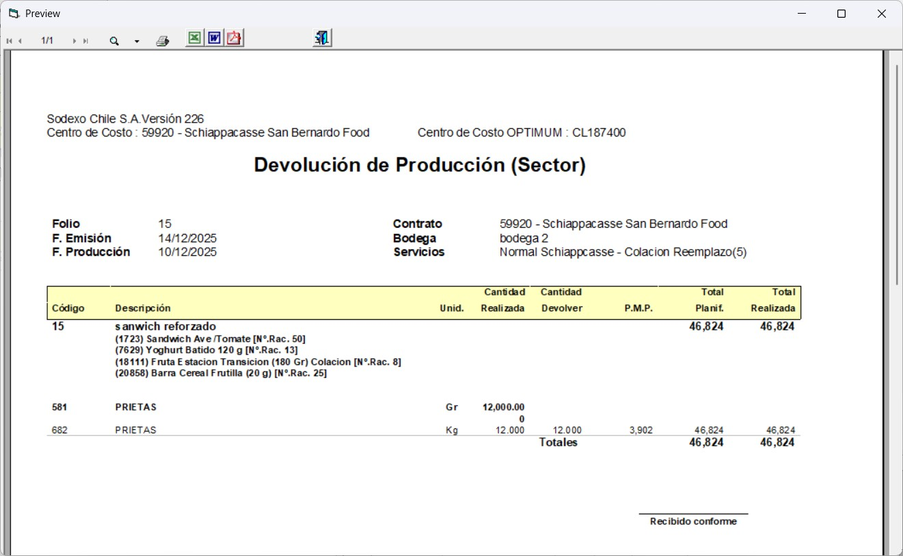

*Figura 2**9**. **Comprobante de Venta**.*

**Tablas asociadas:**

| Tabla | Para qué se usa | Campos clave |
| --- | --- | --- |
| b_totventas | Encabezados de documentos de movimiento de bodega (salidas, devoluciones, etc.) | tov_rutcli, tov_tipdoc ('SP'=salida, 'DP'=devolución), tov_numdoc, tov_codbod, tov_fecemi, tov_fecpro, tov_codreg, tov_codser, tov_estdoc ('A'=anulado), tov_totdoc |
| b_detventas | Líneas de detalle de cada documento de movimiento | dev_rutcli, dev_tipdoc, dev_numdoc, dev_numlin, dev_codmer, dev_canmin, dev_canmer, dev_predoc, dev_ptotal, dev_coding, dev_codsec |
| b_bodegas | Stock actual de cada producto en cada bodega | bod_codbod, bod_codpro, bod_canmer |
| b_clientes | Contratos registrados en el sistema | cli_codigo, cli_nombre, cli_tipo |
| b_ingrediente | Ingredientes o preparaciones que agrupan productos | ing_codigo, ing_nombre, ing_unimed |
| b_productos | Productos de bodega (insumos físicos) | pro_codigo, pro_nombre, pro_coduni, pro_facing |
| b_parametros | Correlativos de documentos por bodega y tipo | par_codbod, par_tipdoc, par_correlativo |
| a_servicio | Catálogo de servicios (desayuno, almuerzo, cena, etc.) | ser_codigo, ser_nombre |
| a_regimen | Catálogo de regímenes alimenticios | reg_codigo, reg_nombre |
| a_unidadmed | Unidades de medida para ingredientes | unm_codigo, unm_nomcor |
| a_unidad | Unidades de medida para productos | uni_codigo, uni_nomcor |
| a_sector | Sectores o áreas de servicio del casino | sec_codigo, sec_nombre, sec_orden |
| a_param | Parámetros de configuración por contrato/casino | par_cencos, par_codigo ('ingdevpro', 'salressec'), par_valor |

## 8.12. Devolución Ventas Especiales (M_DevolucionSalidaEspeciales.frm)

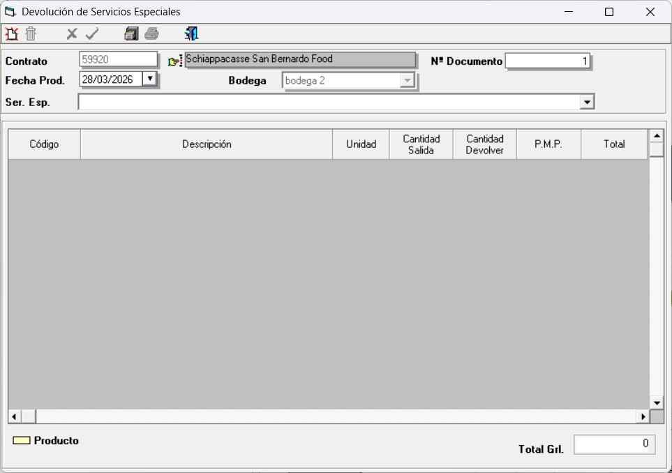

*Figura **30**. Formulario **Devolución Venta Servicios Especiales (**M_DevolucionSalidaEspeciales.frm**).*

Registra el retorno de insumos desde servicios especiales hacia bodega. Tipo de documento: **DE**. Usa las mismas tablas que la salida especial.

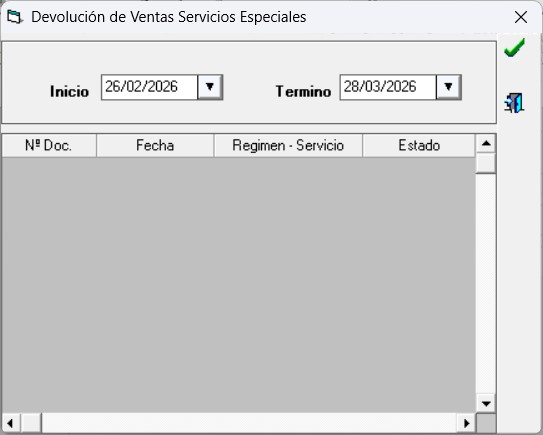

*Figura **31**. Formulario **Traspaso** (**B_SalBod.frm**).*

El botón **Histórico **te permite localizar una devolución de servicios especiales que ya fue grabada anteriormente. Para usarlo, primero debes tener un contrato seleccionado en pantalla (si no lo hay, el sistema te pedirá que ingreses uno). Al hacer clic, se abre una ventana de búsqueda donde puedes ubicar el documento de devolución por su número de folio. Una vez seleccionado, el sistema carga automáticamente todos los datos del documento —fecha, bodega, productos, cantidades devueltas y totales— en modo solo lectura, permitiéndote consultarlo, imprimirlo o anularlo si es necesario.

**Flujo de ****Traspaso****:**

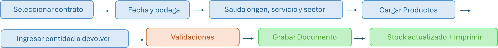

| Campo | Descripción | Obligatorio |
| --- | --- | --- |
| Contrato | Código del casino o centro de costos al que pertenece la devolución. Se puede escribir directamente o buscarlo con el ícono de búsqueda. | Sí |
| Fecha de producción | Fecha del día al que corresponde la devolución (formato dd/mm/yyyy). Debe estar dentro del período abierto y no en un día cerrado. | Sí |
| Ser. Esp. (documento de salida) | Lista desplegable que muestra las salidas de servicios especiales cerradas del contrato y fecha seleccionados. Se debe elegir el documento de salida que se desea devolver. | Sí |
| Bodega | Lista desplegable con las bodegas disponibles para el contrato. Se carga automáticamente al iniciar el formulario. | Sí |
| N° Documento | Número de folio de la devolución, generado automáticamente por el sistema al ingresar el contrato. | Automático |
| Cantidad a devolver (columna de la grilla) | Para cada producto listado, el usuario ingresa la cantidad que efectivamente se devuelve a bodega. No puede superar la cantidad original de la salida. | Sí (al menos un producto con cantidad > 0) |

**Observaciones:**

- Devolución de insumos asociados a servicios especiales.
- Anulación con reversa de la salida especial.
- Control de relación con documento especial.

**Reglas de negocio:**

| # | Cuando aparece | Qué verifica el sistema | Qué ve o experimenta el usuario |
| --- | --- | --- | --- |
| 1 | Al ingresar el contrato | Que el código exista en la tabla de clientes con tipo = 0 (casino). | "Contrato no existe..." |
| 2 | Al cambiar la fecha, si no hay salidas disponibles | Que existan documentos de salida de servicios especiales cerrados para el contrato y fecha indicados. | "No existe salida ventas servicios especiales..." |
| 3 | Al seleccionar un documento de salida | Que no exista ya una devolución vigente (no anulada, no pendiente) asociada a ese documento de salida. | "Devolución ya fue realizada..." |
| 4 | Al seleccionar un documento de salida | Que existan líneas de detalle válidas en el documento de salida original. | "No existe salida ventas servicios especiales..." |
| 5 | Al grabar | Que todos los campos obligatorios estén completos: contrato, número de documento, documento de salida asociado y fecha. | "Debe ingresar dato importante..." |
| 6 | Al grabar | Que la fecha de producción corresponda al período contable abierto. | "Documento no corresponde al periodo : [fecha cierre]" |
| 7 | Al grabar | Que la fecha no sea anterior a la última toma de inventario. | "No puede ingresar documentos anteriores a la última toma de inventario." |
| 8 | Al grabar | Que no se esté realizando una toma de inventario calendarizada en ese momento. | "Se esta realizando la toma de inventario en estos momento..." |
| 9 | Al grabar | Que la fecha no sea anterior a un inventario calendarizado pendiente. | "No puede ingresar documento, antes de un inventario calendarizado..." |
| 10 | Al grabar | Que se haya realizado el ajuste correspondiente a la última toma de inventario. | "No ha realizado el ajuste correspondiente a la última toma de inventario." |
| 11 | Al grabar | Que el día seleccionado no esté cerrado (cierre diario). | "Día se encuentra cerrado, no es posible ingresar..." |
| 12 | Al grabar | Que la cantidad a devolver de cada producto no supere la cantidad original de la salida. | "Cantidad devolver es mayor cantidad salida..." |
| 13 | Al grabar | Que el total calculado del documento sea mayor a cero (al menos un producto con cantidad devuelta > 0). | "El total del documento debe ser mayor a cero..." |
| 14 | Al grabar | Que el documento no haya sido cerrado por otro usuario mientras se estaba editando (control de concurrencia). | "Documento fue cerrado por otro usuario, proceso cancelado" |
| 15 | Al grabar, si hay inventario rotativo activo | Que no haya cierre diario pendiente antes de registrar el documento. | "Tiene que realizar cierre diario..." |
| 16 | Al anular | Que el período esté abierto. | "Periodo esta cerrado..." |
| 17 | Al anular | Que la fecha no sea anterior a la última toma de inventario. | "No puede anular documentos anteriores a la última toma de inventario." |
| 18 | Al anular | Que el día no esté cerrado. | "No puede anular documento, día esta cerrado..." |
| 19 | Al anular | Que no se esté realizando una toma de inventario calendarizada. | "Se esta realizando la toma de inventario en estos momento..." |
| 20 | Al anular | Que la fecha no sea anterior a un inventario calendarizado. | "No puede ingresar documento, antes de un inventario calendarizado..." |
| 21 | Al anular | Solicita confirmación antes de proceder. | "Anula documento..." (Sí / No) |
| 22 | Al buscar | Que se haya seleccionado un contrato antes de abrir la búsqueda. | "Debe seleccionar contrato..." |
| 23 | Al grabar, si el SP retorna error | El SP devuelve un código y mensaje de error de base de datos. | "[código] - [mensaje de error] Proceso termino con problemas..." |
| 24 | Al anular, si el SP retorna error | El SP devuelve un código y mensaje de error de base de datos. | "[código] [mensaje de error]" |

**Observaciones:**

- El tipo de documento es tos_Tipo_Documento = 'DE'.
- La fecha de producción determina el período.

> 💬 **Comentario — Sandoval Nocchi, Maria Cecilia (2026-03-12):** Fecha de consumo

- Debe mantener referencia al documento especial original.

**<u>Total por línea:</u>**

Se calcula automáticamente cada vez que el usuario modifica la cantidad a devolver en una fila de la grilla.

Cantidad devuelta × Precio unitario del documento de salida.

**<u>Total general:</u>**

Suma de todos los totales por línea de la grilla. Se actualiza en tiempo real mientras el usuario navega por la grilla. El sistema exige que sea mayor a cero para permitir grabar.

**<u>Control de máximo a devolver:</u>**

Si el usuario ingresa una cantidad a devolver mayor que la cantidad original de la salida en la misma fila, el sistema reemplaza automáticamente el valor ingresado por cero y no permite continuar hasta corregirlo.

**<u>Número de folio:</u>**

Se obtiene del correlativo almacenado en la tabla b_parametros para el tipo de documento "DE" y la bodega seleccionada. El SP de grabación actualiza el correlativo de forma atómica para evitar duplicados en entornos multiusuario.

**<u>Formato de salida:</u>**

[DESCRIPCIÓN]

[IMAGEN]

*Figura **32**. **Comprobante de Venta.*

**Tablas asociadas:**

| Tabla | Para qué se usa | Campos clave |
| --- | --- | --- |
| b_totventaserviciosespeciales | Encabezado de documentos de venta y devolución de servicios especiales. Se inserta el encabezado de la devolución al grabar y se actualiza el estado al anular. | tos_IdCeco, tos_Tipo_Documento, tos_Numero_Documento, tos_Fecha_Produccion, tos_IdBodega, tos_Venta_servicio_Especiales, tos_Total_Documento, tos_Estado_Documento, tos_Documento_Asociado |
| b_detventaserviciosespeciales | Detalle (líneas de producto) de cada documento de venta o devolución. Se insertan las filas de la devolución al grabar. | des_IdCeco, des_Tipo_Documento, des_Numero_Documento, des_Numero_Linea, des_IdProducto, des_Cantidad_Mercaderia, des_Cantidad_Devolver, des_Precio_Documento, des_Total_Documento |
| b_bodegas | Inventario actual de productos por bodega. Se actualiza (suma) al grabar la devolución y se revierte (resta) al anularla. | bod_codbod, bod_codpro, bod_canmer |
| b_clientes | Maestro de contratos (casinos). Se consulta para validar el contrato ingresado y obtener su nombre. | cli_codigo, cli_nombre, cli_tipo |
| b_productos | Maestro de productos. Se consulta para mostrar nombre y unidad en la grilla. | pro_codigo, pro_nombre, pro_coduni |
| a_unidad | Maestro de unidades de medida. Se consulta para mostrar la abreviatura de unidad en la grilla. | uni_codigo, uni_nomcor |
| b_parametros | Parámetros del sistema por bodega y tipo de documento. Se usa para obtener y actualizar el correlativo del número de folio "DE". | par_codbod, par_tipdoc, par_correlativo |

## 8.13. Toma de Inventario (M_TomInv.frm)

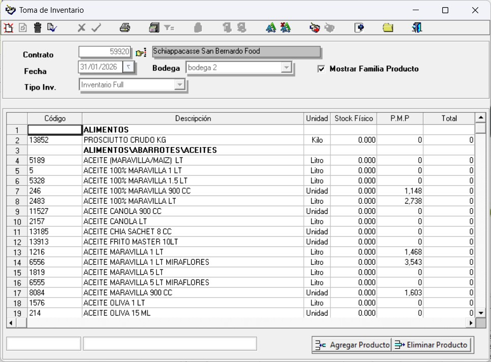

*Figura **33**. Formulario Toma de Inventario **(**M_TomInv.frm)*

Permite registrar el conteo físico de los productos almacenados en una bodega, compararlo con el stock teórico que el sistema tiene registrado y, a partir de esa comparación, generar el ajuste de inventario correspondiente. Es la pantalla central del ciclo de inventario en SGP Local.

El formulario soporta dos modalidades: **Inventario Rotativo** (conteo parcial de ciertos productos cada día, según curva ABC o porcentaje configurado) e **Inventario Full** (conteo total de todos los productos de la bodega). En ambos casos, el operador ingresa la cantidad física contada por producto y el sistema muestra el stock teórico calculado a partir de los movimientos registrados (compras, ventas, producción).

Una vez confirmado el conteo, el sistema evalúa si existen diferencias entre el stock físico y el stock de sistema. Si no hay diferencias, la autorización del ajuste se activa automáticamente. Si hay diferencias, queda pendiente de autorización manual por parte de un supervisor. Posteriormente se genera el ajuste de inventario y, opcionalmente, se envía la información a sistemas externos (SAP u OPTIMUM).

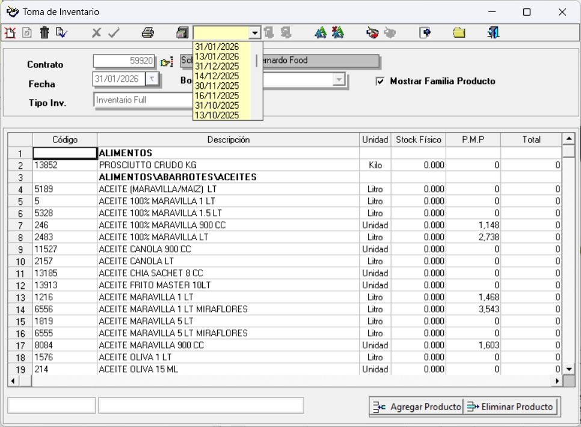

*Figura **34**. Lista desplegable del Histórico de tomas de inventario (M_TomInv.frm).*

Consulta de tomas anteriores **"Histórico"**. Permite navegar entre las tomas de inventario registradas previamente para una bodega, seleccionando la fecha desde la lista desplegable del histórico. Las tomas anteriores se cargan en modo solo lectura (la grilla se bloquea).

**Relación con otros módulos/funcionalidades****:**

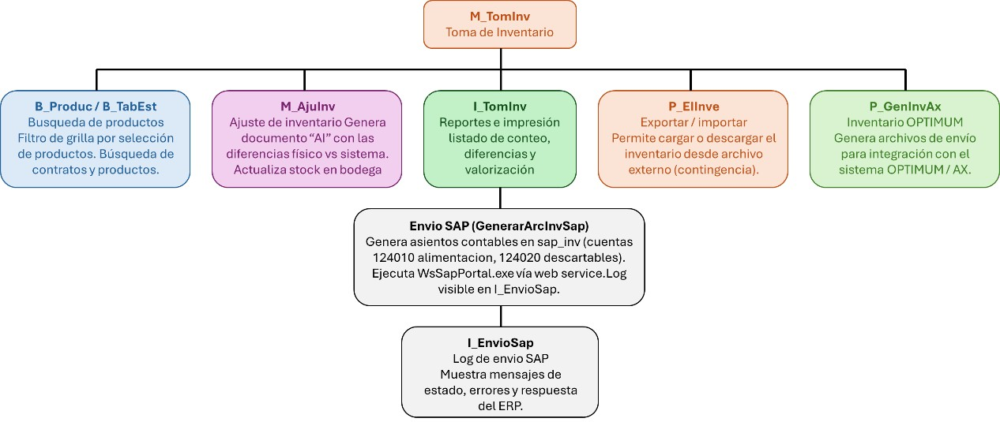

El diagrama muestra **M_TomInv** como módulo central con flechas hacia los 7 módulos relacionados:

- **M_AjuInv** — Ajuste de Inventario. Se abre desde el botón **“Ajustar Inventario”** y también automáticamente al confirmar en modo Colombia (vg_pais = "CO").
- **I_TomInv** — Reportes e impresión. Se abre **“Imprimir”**.
- **B_TabEst** — Búsqueda genérica. Se usa para “**buscar contratos****”** y para buscar productos al agregar uno manualmente.
- **B_Produc** — Búsqueda de productos para filtrado de la grilla, “**Filtrar****”**.
- **P_EIInve** — Exportar/Importar inventario desde archivo.
- **P_GenInvAx** — Generación de archivos para OPTIMUM/AX.
- **I_EnvioSap** — Log de envío SAP. Se invoca como función pasándole el modo "3" (log de inventario).

**Flujo de Toma de Inventario:**

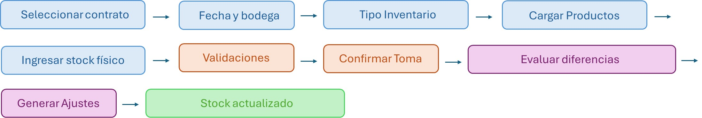

| Campo | Descripción | Obligatorio |
| --- | --- | --- |
| Contrato | Código del contrato/casino activo. Se carga automáticamente con el casino en sesión. Permite búsqueda mediante el botón lupa si el usuario tiene permisos para cambiar de casino. | Sí |
| Bodega | Bodega a inventariar. Se cargan automáticamente las bodegas asociadas al contrato activo. Se selecciona de la lista desplegable. | Sí |
| Fecha | Fecha de la toma de inventario en formato dd/mm/aaaa. En modo Agregar se establece automáticamente como el día anterior al cierre del sistema. En modo consulta se puede navegar por el histórico. El rango válido está limitado al período contable activo. | Sí |
| Tipo Inventario | Selección entre "Inventario Rotativo" e "Inventario Full". Solo se habilita cuando el contrato tiene configurado el inventario rotativo en los parámetros del sistema. Si el contrato no usa rotativo, este campo permanece deshabilitado. | Condicional (solo si el contrato tiene inventario rotativo) |
| Mostrar Familia Producto | Casilla de verificación. Cuando está marcada, agrupa los productos por familia/tipo en la grilla e inserta filas de encabezado de categoría (en negrita, sin código). La preferencia se guarda en los parámetros del casino. | No |
| Cierre de Mes / Precierre | Indicador automático (no editable). Muestra "Cierre de Mes" si la fecha de la toma coincide con la fecha de término del período contable activo, o "Precierre de Mes" en caso contrario. | Automático |
| Productos en la grilla | Lista de productos con las columnas: Código, Nombre, Unidad, Stock Sistema, Stock Físico, Precio PMP y Costo Inventario. El operador ingresa el stock físico en la columna correspondiente. Los demás campos son de solo lectura. Se pueden agregar productos manualmente con el botón "Agregar Producto". | Sí (al menos 1 producto) |
| Buscar por código | Campo de búsqueda rápida. Filtra las filas de la grilla en tiempo real mostrando solo los productos cuyo código contenga el texto ingresado. | No |
| Buscar por nombre | Campo de búsqueda rápida. Filtra las filas de la grilla en tiempo real mostrando solo los productos cuyo nombre contenga el texto ingresado. | No |

**Observaciones:**

En la configuración para Colombia (CO), las columnas de Stock Sistema, Precio PMP y Costo Inventario se ocultan automáticamente, y la agrupación por familia de producto no está disponible.

En la configuración para Chile (CL), la columna de Stock Sistema se oculta durante los modos Agregar y Modificar para evitar que el operador copie el valor del sistema como stock físico; se muestra solo en modo consulta si la fecha no corresponde al día de cierre.

El stock físico no puede ser negativo. Si el operador ingresa un valor menor a cero, el sistema lo reemplaza automáticamente por cero.

Al cambiar de bodega, la fecha se limpia y la grilla se recarga con los productos de la nueva bodega.

**Importante:**

- Excluir lo relacionado con Colombia
- Excluir lo relacionado con OPTIMUM / AX

**Reglas de negocio:**

| # | Cuando aparece | Qué verifica el sistema | Qué ve o experimenta el usuario |
| --- | --- | --- | --- |
| 1 | Al hacer clic en Agregar (nueva toma) | Que no existan salidas de producción pendientes (documentos sin cerrar) para la bodega y fecha | "Existen documentos pendientes, en la salida producción. Debe cerrar las salidas" |
| 2 | Al hacer clic en Agregar (nueva toma) | Que no existan ventas de servicios especiales pendientes para la bodega y fecha | "Existen documentos pendientes, en las ventas servicios especiales. Debe cerrar las ventas servicios especiales" |
| 3 | Al hacer clic en Agregar (nueva toma) | Que se haya realizado el ajuste de la última toma de inventario previa | "No ha realizado el ajuste correspondiente a la última toma de inventario." |
| 4 | Al hacer clic en Agregar (nueva toma) | Que no exista una carátula de inventario generada (documento "AI" con estado enviado) para la misma bodega y fecha | "Existen generación de caratula inventario, debe anular la generación de caratula inventario. Proceso cancelado." |
| 5 | Al hacer clic en Agregar (nueva toma) | Que no exista un ajuste de inventario previo activo para esa fecha | Se ejecuta validación interna CierreAjuste |
| 6 | Al hacer clic en Modificar | Que el período contable esté abierto (no bloqueado) para la fecha seleccionada | "Mes Bloqueado..." |
| 7 | Al hacer clic en Modificar | Que no existan documentos posteriores a la toma que se quiere modificar | "Existen documentos posteriores a esta toma inventario..." |
| 8 | Al hacer clic en Modificar | Que no existan ventas de servicios especiales pendientes | "Existen documentos pendientes, en las ventas servicios especiales. Debe cerrar las ventas servicios especiales" |
| 9 | Al hacer clic en Modificar | Que no existan salidas de producción pendientes | "Existen documentos pendientes, en la salida producción. Debe cerrar las salidas" |
| 10 | Al hacer clic en Modificar | Que la fecha corresponda al día anterior al cierre activo del sistema | "Día esta bloqueado" |
| 11 | Al hacer clic en Modificar | Que la toma seleccionada sea la más reciente registrada en la bodega | "Solo puede modificar el último inventario si no se ha generado el ajuste..." |
| 12 | Al hacer clic en Eliminar | Que el contrato con inventario rotativo y día reabierto no bloquee la eliminación | "No es posible borrar documento, debe reabrir día..." |
| 13 | Al hacer clic en Eliminar | Que el período contable esté abierto | "Mes Bloqueado..." |
| 14 | Al hacer clic en Eliminar | Que no existan documentos posteriores a la fecha de la toma | "Existen documentos posteriores a la fecha de esta toma de inventario..." |
| 15 | Al hacer clic en Eliminar | Que no existan salidas de producción pendientes | "Existen documentos pendientes, en la salida producción. Debe cerrar las salidas" |
| 16 | Al hacer clic en Eliminar | Que no existan ventas de servicios especiales pendientes | "Existen documentos pendientes, en las ventas servicios especiales. Debe cerrar las ventas servicios especiales" |
| 17 | Al hacer clic en Eliminar | Que la fecha corresponda al día anterior al cierre (o que el día no esté bloqueado) | "Día esta bloqueado" |
| 18 | Al hacer clic en Eliminar | Que la toma sea la más reciente (no se pueden eliminar tomas anteriores si hay posteriores) | "Solo puede eliminar la ultima toma de inventario..." |
| 19 | Al hacer clic en Confirmar | Que no exista un ajuste de inventario previo activo para esa fecha y bodega | "Existe ajuste de inventario. proceso cancelado." |
| 20 | Al hacer clic en Confirmar | Que no existan documentos posteriores a la toma | "Existen documentos posteriores a esta toma inventario..." |
| 21 | Al hacer clic en Confirmar | Que el período contable esté abierto | "Mes Bloqueado..." |
| 22 | Al hacer clic en Confirmar | Que no existan salidas de producción pendientes | "Existen documentos pendientes, en la salida producción. Debe cerrar las salidas" |
| 23 | Al hacer clic en Confirmar | Que no existan ventas de servicios especiales pendientes | "Existen documentos pendientes, en las ventas servicios especiales. Debe cerrar las ventas servicios especiales" |
| 24 | Al hacer clic en Confirmar | Que la fecha y el contrato estén completos | "Falta dato importante..." |
| 25 | Al hacer clic en Confirmar (modo Agregar, inventario rotativo) | Que se haya seleccionado un tipo de inventario | "Debe seleccionar tipo inventario..." |
| 26 | Al hacer clic en Confirmar (modo Agregar, rotativo por curva ABC) | Que la tabla de curva ABC tenga datos | "No existen datos en tabla curva ABC. Proceso cancelado..." |
| 27 | Al hacer clic en Confirmar (modo Agregar, rotativo por porcentaje) | Que el porcentaje de inventario configurado no sea cero | "El valor del porcentaje inventario esta con valor cero. Proceso cancelado..." |
| 28 | Al hacer clic en Filtrar | Que se haya ingresado una fecha | "Debe ingresar fecha..." |
| 29 | Al hacer clic en Filtrar | Que no exista un ajuste de inventario previo activo | "Existe ajuste de inventario. proceso cancelado." |
| 30 | Al hacer clic en Filtrar | Que no existan documentos posteriores a la toma | "Existen documentos posteriores, a esta toma inventario..." |
| 31 | Al hacer clic en Filtrar | Que no existan salidas de producción pendientes | "Existen documentos pendientes, en la salida producción. Debe cerrar las salidas" |
| 32 | Al hacer clic en Filtrar | Que no existan ventas de servicios especiales pendientes | "Existen documentos pendientes, en las ventas servicios especiales. Debe cerrar las ventas servicios especiales" |
| 33 | Al hacer clic en Generar Envío SAP | Que no existan salidas de producción pendientes | "Existen documentos pendientes, en la salida producción. Debe cerrar las salidas" |
| 34 | Al hacer clic en Generar Envío SAP | Que no existan ventas de servicios especiales pendientes | "Existen documentos pendientes, en las ventas servicios especiales. Debe cerrar las ventas servicios especiales" |
| 35 | Al hacer clic en Generar Envío SAP | Que se haya realizado el ajuste de la última toma | "No ha realizado el ajuste correspondiente a la última toma de inventario." |
| 36 | Al hacer clic en Generar Envío SAP | Que exista conexión a internet (si la integración SAP está activa) | "No hay conexión a internet, proceso cancelado" |
| 37 | Al hacer clic en Generar Envío SAP | Que exista usuario SAP configurado en parámetros | "No tiene creado usuario, para Web Service" |
| 38 | Al hacer clic en Generar Envío SAP | Que exista contraseña SAP configurada en parámetros | "No tiene creado password, para Web Service" |
| 39 | Al hacer clic en Generar Envío SAP | Que el contrato tenga asignada una sociedad SAP | "No tiene asignado la sociedad de SAP." |
| 40 | Al hacer clic en Generar Envío SAP | Que existan datos de inventario para enviar (stock físico y precio distintos de cero) | "No existe datos registrado, en inventario..." |
| 41 | Al hacer clic en Anular Envío SAP | Que el período contable esté abierto | "Mes Bloqueado..." |
| 42 | Al hacer clic en Anular Envío SAP | Que no existan salidas de producción pendientes | "Existen documentos pendientes, en la salida producción. Debe cerrar las salidas" |
| 43 | Al hacer clic en Anular Envío SAP | Que no existan ventas de servicios especiales pendientes | "Existen documentos pendientes, en las ventas servicios especiales. Debe cerrar las ventas servicios especiales" |
| 44 | Al hacer clic en Anular Envío SAP | Que se haya realizado el ajuste de la última toma | "No ha realizado el ajuste correspondiente a la última toma de inventario." |
| 45 | Al hacer clic en Anular Envío SAP | Que exista conexión a internet (si la integración SAP está activa) | "No hay conexión a internet, proceso cancelado" |
| 46 | Al hacer clic en Ajustar Inventario | Que exista un casino en operación | "No existe casino en operación..." |
| 47 | Al hacer clic en Ajustar Inventario | Que no existan documentos posteriores a la toma (si no hay ajuste previo) | "Existen documentos posteriores, a esta toma inventario..." |
| 48 | Al hacer clic en Anular Ajuste | Que el contrato con inventario rotativo y día reabierto no bloquee la anulación | "No es posible anular ajuste, debe reabrir día..." |
| 49 | Al hacer clic en Anular Ajuste | Que el período contable esté abierto | "Mes Bloqueado..." |
| 50 | Al hacer clic en Anular Ajuste | Que no existan documentos posteriores | "No puede anular ajuste inventario, existen documentos posteriores..." |
| 51 | Al hacer clic en Anular Ajuste | Que no existan salidas de producción pendientes | "Existen documentos pendientes, en la salida producción. Debe cerrar las salidas" |
| 52 | Al hacer clic en Anular Ajuste | Que no existan ventas de servicios especiales pendientes | "Existen documentos pendientes, en las ventas servicios especiales. Debe cerrar las ventas servicios especiales" |
| 53 | Al hacer clic en Anular Ajuste | Que no exista un envío de carátula activo | "Existen un envio documento, debe anular envio documento. Proceso cancelado." |
| 54 | Al hacer clic en Importar Inventario | Que el período contable esté abierto | "Mes Bloqueado..." |
| 55 | Al hacer clic en Importar Inventario | Que no exista una carátula de inventario generada | "Existen generación de caratula inventario, debe anular la generación de caratula inventario. Proceso cancelado." |
| 56 | Al agregar un producto manualmente | Que el producto no esté duplicado en la grilla | "El producto ya existe en la grilla..." |
| 57 | Al intentar eliminar una fila de familia | Que no se elimine una fila de encabezado de familia (fila sin código de producto) | "No puede eliminar familia producto..." |
| 58 | Al cerrar el formulario (fecha = día anterior al cierre, sin diferencia de ajuste) | Que el usuario confirme que desea cerrar sin haber generado el ajuste | "Esta seguro cerrar inventario, ya que no hay diferencia de ajuste... ??" |

**Observaciones:**

Las validaciones de salidas de producción pendientes y ventas de servicios especiales se repiten en prácticamente todas las operaciones (Agregar, Modificar, Eliminar, Confirmar, Filtrar, Envío SAP, Anular Envío, Anular Ajuste). Esto garantiza que no se modifique el inventario mientras haya movimientos abiertos que podrían afectar el stock.

La restricción de "solo se puede operar sobre el último inventario" aplica tanto para Modificar como para Eliminar. El sistema verifica que la fecha seleccionada corresponda a la toma más reciente registrada en la bodega.

La validación de inventario calendarizado (sgp_Upd_ValidarInventarioCalendarizado) se ejecuta internamente al Agregar, Confirmar, Eliminar, Enviar SAP y Anular Ajuste. Si existe un error al grabar el inventario calendarizado, se muestra: "Existe error grabar inventario calendarizado."

Al cerrar el formulario, si la toma corresponde al día de precierre y no hay diferencias pendientes de ajuste, el sistema pregunta al usuario si desea cerrar. Si acepta, se marca el parámetro de toma de inventario como completado y se actualiza el inventario calendarizado.

**Importante:**

El parámetro partominv en la tabla a_param actúa como semáforo del proceso: se pone en "1" (activo) cuando hay una toma abierta en curso y se libera a "0" cuando se completa el envío o se anula. Otros módulos del sistema pueden consultar este parámetro para saber si hay una toma en proceso.

En modo Agregar, el sistema inserta automáticamente todos los productos de la bodega que tengan control de stock activo y fecha de vencimiento vigente (o con stock positivo aunque estén vencidos). El stock físico se inicializa en cero para todos los productos.

La columna de Stock Sistema se oculta en Chile durante el ingreso (modos Agregar y Modificar) para evitar que el operador copie el valor teórico como conteo físico. Solo se muestra en modo consulta.

**<u>Costo de inventario por producto:</u>**

Se calcula automáticamente en la columna "Costo Inventario" de la grilla como el producto del stock físico por el precio promedio ponderado (PMP) del día.

Costo Inventario = Stock Físico × Precio PMP

**<u>Precio PMP actualizado al crear toma:</u>**

Al iniciar una nueva toma, el sistema actualiza el precio promedio ponderado de cada producto tomándolo de la tabla b_productospmpdia para la fecha del día anterior al cierre. Este precio no es editable por el operador.

**<u>Diferencia de inventario:</u>**

Se evalúa comparando el stock físico ingresado contra el stock de sistema para todos los productos de la toma. Si no hay ninguna diferencia, la autorización del ajuste se activa automáticamente (campo tin_autaju = 1). Si existe al menos una diferencia, queda pendiente de autorización manual (campo tin_autaju = 0).

**<u>Tipo de cierre:</u>**

Si la fecha de la toma coincide con la fecha de término del período contable activo, se marca como "Cierre de Mes" (tin_ciemes = AAAAMM). En caso contrario, se registra como "Precierre de Mes" (tin_ciemes = 0).

**<u>Costo total para envío SAP:</u>**

Se calcula agrupando la suma de (Stock Físico × Precio PMP) por cuenta contable del producto, clasificando en dos categorías:

Inventario de alimentación: productos cuya cuenta contable corresponde al parámetro ctainsumo → cuenta SAP 124010.

Inventario de descartables: productos cuya cuenta contable corresponde al parámetro ctalimdes → cuenta SAP 124020. Costo SAP por categoría = Σ (tin_stofis × tin_propon) agrupado por cuenta contable

**Formato de salida:**

Al hacer clic en el botón Imprimir, el sistema abre el formulario de reportes **I_TomInv** que genera los listados de la toma de inventario: listado de conteo, diferencias y valorización.

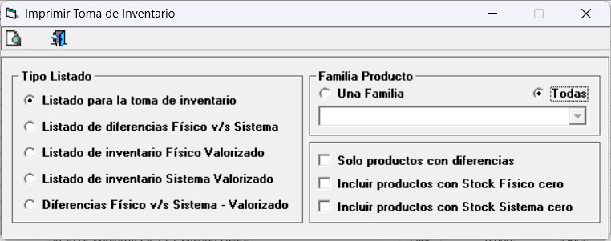

*Figura **35**. Reportes de Toma de Inventario (I_TomInv).*

Todos los reportes comparten tres filtros opcionales: filtrar por familia de producto (todas o una específica), incluir/excluir productos con stock físico cero, e incluir/excluir productos con stock sistema cero. También hay un checkbox para mostrar solo productos con diferencias. El formato de salida en todos los casos es vista previa RTF con opción de impresión.

**Listado para la toma de inventario:**

Es un formulario en blanco para imprimir y llevar a terreno. Muestra código, descripción y unidad de cada producto, con una columna vacía para que el operador anote la cantidad contada a mano. Es el paso previo al ingreso en sistema.

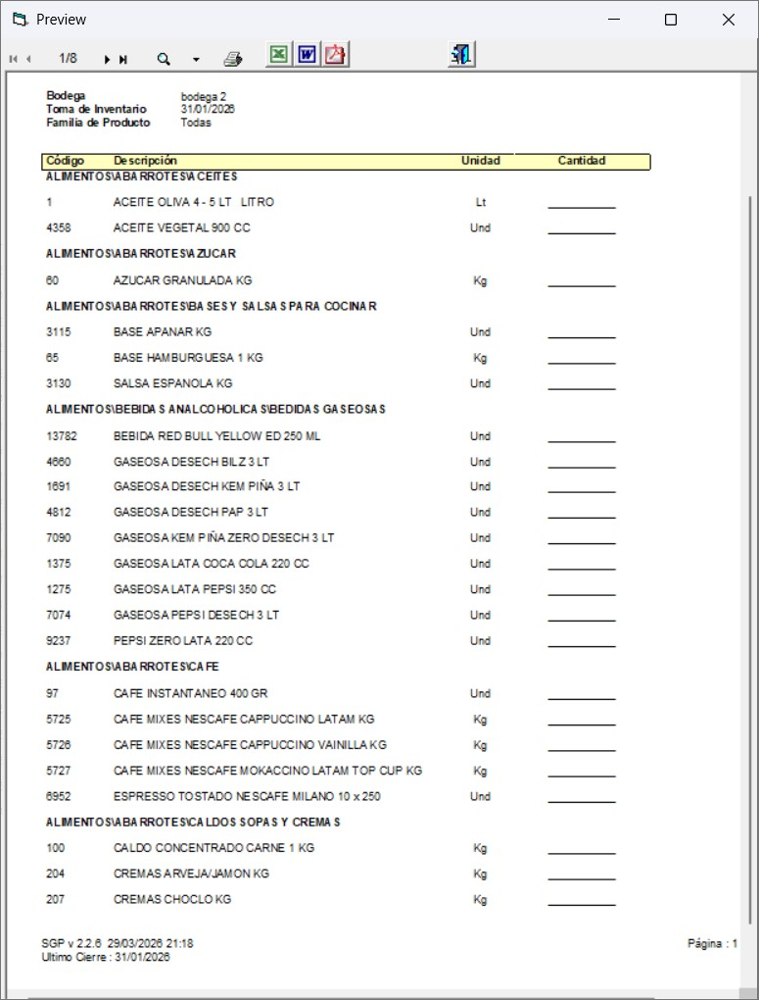

*Figura **36**: Listado para la toma de inventario*

**Listado de diferencias físico vs. sistema:**

Muestra por cada producto el stock físico contado, el stock que tiene el sistema y la diferencia en unidades (tin_stofis − tin_stosis). No incluye valorización monetaria — es solo para identificar rápidamente qué productos tienen discrepancias.

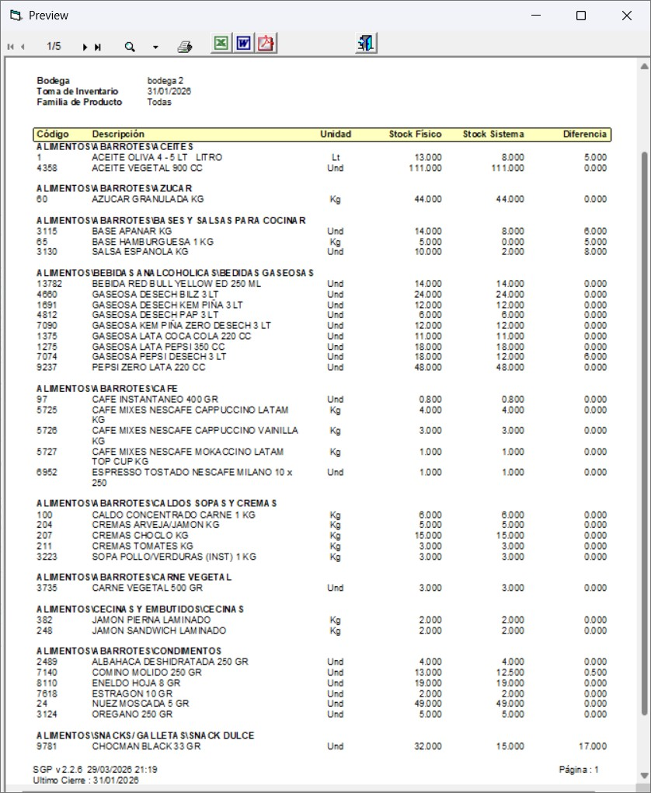

*Figura **37**: **Listado de diferencias físico vs. sistema*

**Listado de inventario físico valorizado:**

Toma la cantidad contada físicamente y la multiplica por el PMP (tin_stofis × tin_propon). Los productos se agrupan por cuenta contable y opcionalmente por familia. Al final muestra totales separados para "Alimentos y Bebidas" y "Limpieza y Desechables", más un total general.

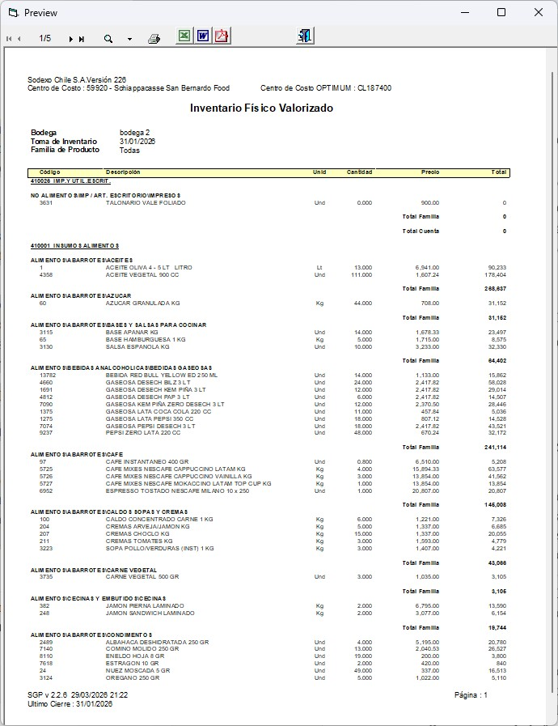

*Figura **38**: **Listado de inventario físico valorizado*

**Listado de inventario sistema valorizado:**

Es el espejo del tipo 2 pero usando el stock del sistema en vez del conteo físico (tin_stosis × tin_propon). Misma estructura de agrupación y totales. Sirve para conocer el valor contable del inventario según el sistema antes de aplicar ajustes.

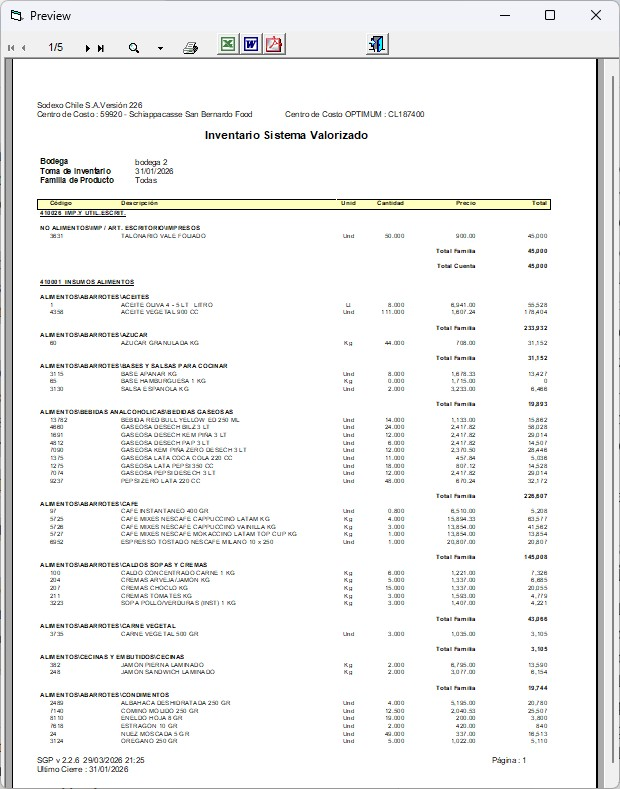

*Figura **39**: **Listado de inventario sistema valorizado*

**Diferencias físico vs. sistema valorizado:**

Es el reporte más completo. Para cada producto muestra el stock físico, el stock sistema, sus respectivas valorizaciones, la diferencia en unidades y la diferencia monetaria ((tin_stofis − tin_stosis) × tin_propon). Se agrupa por cuenta contable con subtotales y un total general al final. Es el informe con más columnas (10 columnas de datos).

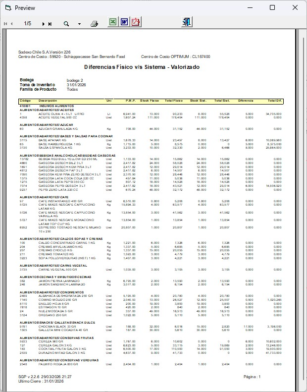

*Figura **40**: **Diferencias físico vs. sistema valorizado*

**Tablas asociadas:**

| Tabla | Para qué se usa | Campos clave |
| --- | --- | --- |
| b_tomainv | Tabla principal de la toma de inventario. Almacena por cada producto, bodega y fecha: el stock físico contado, el stock de sistema calculado, el precio PMP, el tipo de inventario, el flag de cierre de mes y el flag de autorización de ajuste. Se inserta al crear la toma, se actualiza al confirmar y se elimina al borrar. | tin_fectom, tin_codbod, tin_codpro, tin_stofis, tin_stosis, tin_propon, tin_tipinv, tin_ciemes, tin_autaju, tin_envsap |
| b_bodegas | Stock actual de cada producto por bodega. Se actualiza al borrar tomas (revierte stock del ajuste) o al anular ajustes. | bod_codpro, bod_codbod, bod_canmer |
| b_productos | Catálogo de productos. Se consulta para cargar los productos con control de stock activo, validar existencia y obtener nombre, unidad, tipo y cuenta contable. | pro_codigo, pro_nombre, pro_coduni, pro_codtip, pro_ctacon, pro_ctrsto, pro_fecven, pro_maepro |
| a_unidad | Unidades de medida. Se consulta para mostrar la unidad del producto en la grilla. | uni_codigo, uni_nombre |
| b_cierreperiodo | Período contable activo. Se consulta para obtener las fechas de inicio y término del período vigente y determinar si la toma es Cierre de Mes o Precierre. | cie_cencos, cie_fecini, cie_fecter, cie_estado |
| b_clientes | Contratos/casinos. Se consulta para validar el contrato, obtener la bodega asociada y la sociedad SAP. | cli_codigo, cli_nombre, cli_codbod, cli_socsap, cli_tipo |
| a_bodega | Catálogo de bodegas. Se consulta para cargar la lista de bodegas del contrato. | bod_codigo, bod_nombre |
| b_totventas | Encabezado de documentos de venta y ajuste. Se consulta para detectar ajustes "AI" existentes y se actualiza al anular ajustes (marcando estado = 'A'). | tov_rutcli, tov_tipdoc (AI), tov_numdoc, tov_fecemi, tov_codbod, tov_estdoc, tov_codser |
| b_detventas | Detalle de líneas de documentos de ajuste. Se consulta al borrar tomas o anular ajustes para revertir el stock de cada producto. | dev_rutcli, dev_tipdoc, dev_numdoc, dev_numlin, dev_codmer, dev_canmer |
| a_tipoajuste | Tipos de ajuste (alta/baja). Se consulta para determinar si el movimiento del ajuste suma o resta stock al revertir. | aju_codigo, aju_tipo (A=Alta, B=Baja) |
| b_productospmpdia | Precio promedio ponderado diario por producto y casino. Se consulta para asignar el precio PMP al crear la toma y se actualiza con el stock físico confirmado. | ppd_cencos, ppd_codpro, ppd_fecdia, ppd_propon, ppd_saldo |
| a_param | Parámetros del sistema. Se consulta y actualiza para: estado de la toma (partominv), opción familia producto (opfampro), usuarios autorizados (usulimbas), credenciales SAP (sapusu, sappas), cuentas contables (ctainsumo, ctalimdes). | par_cencos, par_codigo, par_valor |
| sap_inv | Tabla de envío a SAP. Recibe el resumen contable del inventario con asientos de encabezado y líneas (cuentas deudoras y acreedoras) para transmitir al ERP. | inv_codigo, inv_numlin, bkpf_bukrs, bkpf_budat, bseg_newbs, bseg_newko, bseg_wrbtr |
| a_tipopro | Árbol de tipos/familias de productos. Se consulta para obtener el nombre de la familia al agrupar la grilla por tipo de producto. | tip_codigo |
| b_casinoinventario calendarizado | Inventarios calendarizados configurados por casino. Se valida vía stored procedure para verificar si la fecha corresponde a un inventario programado. | (accedida via SP sgp_Upd_Validar InventarioCalendarizado) |
| log_procesos | Log de procesos de envío. Se inserta al iniciar el envío SAP y se consulta para verificar el estado de la transmisión. | cencos, numero, fecha, tipo_proceso, estado, mensaje, envio |

**Mejoras sugeridas:**

- Incorporar en la captura de inventario, dispositivos que puedan leer código de barra o QR para optimizar el proceso de inventario.

## 8.14. Ajuste de Inventario (M_AjuInv.frm)

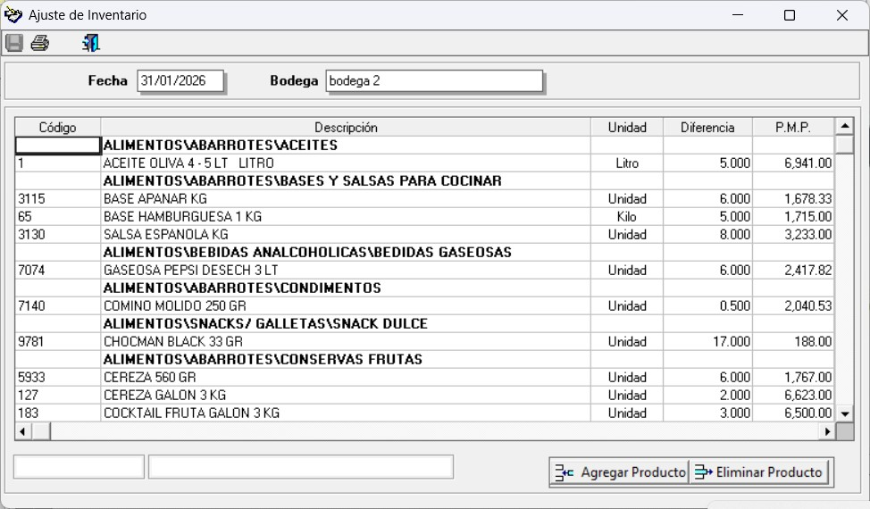

*Figura **41**. Formulario Ajuste de Inventario (M_AjuInv.frm).*

Permite registrar el ajuste de inventario como paso final del proceso de toma de inventario físico. Al abrirse desde la pantalla de Toma de Inventario, carga automáticamente las diferencias detectadas entre el stock del sistema y el conteo físico realizado para la bodega y fecha seleccionada. Los productos cuyo stock real difiere del stock registrado se presentan en una grilla con su diferencia de cantidad, precio promedio y concepto de ajuste sugerido.

El formulario admite dos situaciones: que el ajuste ya haya sido grabado anteriormente (en cuyo caso muestra el documento existente en modo solo lectura) o que las diferencias aún estén pendientes de procesar (en cuyo caso permite modificar el precio y el concepto antes de grabar). Cuando se detecta un cambio de precio respecto al precio promedio original, el sistema solicita autorización mediante un panel de **login** antes de continuar con la grabación.

**Flujo de Ajuste de Inventario:**

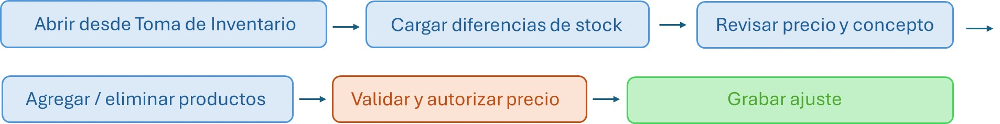

| Campo | Descripción | Obligatorio |
| --- | --- | --- |
| Fecha (solo lectura) | Fecha del inventario, heredada automáticamente desde la pantalla de Toma de Inventario. No se modifica en esta pantalla. | Sí |
| Bodega (solo lectura) | Bodega del inventario, heredada automáticamente desde la pantalla de Toma de Inventario. No se modifica en esta pantalla. | Sí |
| Búsqueda por código | Filtra en tiempo real las filas de la grilla por código de producto. Al limpiar el texto se muestran todas las filas nuevamente. | No |
| Búsqueda por descripción | Filtra en tiempo real las filas de la grilla por nombre o descripción del producto. | No |
| Grilla de productos | Muestra los productos con diferencia entre stock físico y stock del sistema. Columnas: Código, Descripción, Unidad, Diferencia (en rojo si negativa), Precio, Concepto. | Sí (al menos 1) |
| Precio (por producto) | Precio promedio del producto al momento del ajuste. Editable únicamente cuando el precio promedio registrado es cero. | Sí (cuando PMP = 0) |
| Concepto (por producto) | Tipo de ajuste a aplicar (aumento o disminución). Se presenta como lista desplegable con los conceptos habilitados según el sentido de la diferencia. | Sí |
| Login (autorización de precio) | Usuario habilitado para autorizar cambios de precio, requerido solo cuando se modifica el precio promedio de algún producto. | Condicional |
| Password (autorización de precio) | Contraseña del usuario autorizante, requerida solo cuando se modifica el precio promedio. | Condicional |

**Observaciones:**

El ajuste se abre exclusivamente desde la pantalla de Toma de Inventario; no es accesible de forma independiente.

Si el ajuste ya fue grabado, la pantalla se presenta en modo solo lectura: el botón Grabar se oculta y solo queda disponible Imprimir.

Los productos con diferencia negativa (stock físico menor que sistema) se muestran en color rojo en la grilla.

**Reglas de negocio:**

| # | Cuando aparece | Qué verifica el sistema | Qué ve o experimenta el usuario |
| --- | --- | --- | --- |
| 1 | Al hacer clic en Grabar | Que no existan documentos de salida a producción pendientes de cerrar para esa fecha y bodega. | "Existen documentos pendientes, en la salida producción. Debe cerrar las salidas" |
| 2 | Al hacer clic en Grabar | Que no existan documentos de ventas de servicios especiales pendientes de cerrar para esa fecha. | "Existen documentos pendientes, en la ventas servicios especiales. Debe cerrar las ventas servicios especiales" |
| 3 | Al hacer clic en Grabar | Que no exista ya un ajuste de inventario grabado para esa fecha y bodega. | "Existe ajuste Inventario, proceso cancelado" |
| 4 | Al hacer clic en Grabar (recorre cada fila) | Que todas las filas tengan un concepto de ajuste seleccionado. | "Falta seleccionar concepto..." |
| 5 | Al hacer clic en Grabar (recorre cada fila) | Que todas las filas tengan un precio mayor a cero. | "Falta ingresar precio..." |
| 6 | Al intentar grabar con cambio de precio | Que el precio ingresado difiera del precio promedio original del producto y que el stock sistema sea mayor a cero. El sistema requiere autorización de un usuario habilitado. | Aparece un panel de autorización con los campos Login y Password. Si el login no existe: "Login no existe...". Si la clave no coincide: "La clave no corresponde al login..." |
| 7 | Al hacer clic en Eliminar Producto | Que el producto seleccionado no sea una fila de encabezado de familia. | "No puede eliminar familia producto..." |
| 8 | Al hacer clic en Eliminar Producto | Que el producto tenga diferencia igual a cero (no se pueden eliminar productos con diferencia pendiente). | "No puede eliminar producto con diferencia..." |
| 9 | Al hacer clic en Eliminar Producto (confirmación) | Solicita confirmación antes de eliminar. | "Elimina Producto..." con botones Sí / No |
| 10 | Al hacer clic en Agregar Producto | Que el producto buscado no exista ya en la grilla. | "El producto ya existe en la grilla..." |
| 11 | Al finalizar la grabación | Que el proceso de actualización del inventario calendarizado no genere error. | "Existe error grabar inventario calendarizado.." |

**Observaciones:**

Solo se incluyen productos con pro_ctrsto = 1 (control de stock activo)

El operador debe ingresar el conteo real.

La planilla se genera para una bodega y período específicos; no mezcla bodegas distintas

**Importante:**

No existe posibilidad de anulación manual del ajuste desde esta pantalla. Una vez grabado, el ajuste queda registrado definitivamente.

Si el proceso de actualización del inventario calendarizado falla, la grabación del ajuste ya fue realizada pero el estado calendarizado no se actualiza; se requiere intervención manual.

**<u>Diferencia por producto:</u>**

Se calcula como stock físico menos stock del sistema (tin_stofis - tin_stosis), redondeada según la configuración de decimales del sistema. Los valores negativos (disminuciones) se muestran en color rojo.

**<u>Sentido del ajuste:</u>**

Si la diferencia es negativa el concepto corresponde a una disminución (tipo "D"); si es positiva, a un aumento (tipo "A"). Los conceptos disponibles en la lista desplegable se filtran automáticamente según este sentido.

**<u>Precio promedio (PMP):</u>**

Se toma del precio del día anterior al cierre del periodo. Si el precio promedio del producto es cero, el campo Precio queda habilitado para que el usuario lo ingrese manualmente.

**<u>Total del documento:</u>**

Para cada documento de ajuste generado se calcula como la suma de cantidad × precio de todas sus líneas.

Total Documento = Σ (|Diferencia| × Precio) por cada línea del concepto.

**<u>Actualización del PMP al cambiar precio:</u>**

Si el precio ingresado difiere del precio promedio original y el cambio es autorizado, el sistema actualiza el precio promedio en el registro histórico de PMP diario. Si el producto tiene ingredientes asociados, recalcula el costo promedio de las recetas que lo contienen.

**<u>Actualización de stock al grabar:</u>**

El stock de cada producto en la tabla de bodegas se incrementa o decrementa según la cantidad de diferencia del ajuste.

**Formato de salida:**

Al grabar exitosamente, el sistema abre automáticamente la Vista Previa del Informe de Ajuste de Inventario a través del módulo Informes.bas -> I_Ajuste. El informe muestra, por bodega y fecha, el listado de productos ajustados con su código, descripción, unidad, diferencia de cantidad, precio y total. Si se configuró el agrupamiento por familia de productos, el informe presenta los productos organizados por tipo. También puede invocarse manualmente con el botón Imprimir.

[Imagen]

*Figura **42**. Informe de Ajuste de Inventario (**Informes.bas -> **I_Ajuste).*

| Tabla | Para qué se usa | Campos clave |
| --- | --- | --- |
| b_tomainv | Fuente principal de las diferencias de inventario: se leen los productos donde el stock físico difiere del stock del sistema. También se actualiza el precio promedio al grabar. | tin_fectom, tin_codbod, tin_codpro, tin_stosis, tin_stofis, tin_propon |
| b_totventas | Encabezado de cada documento de ajuste generado. Si ya existe un ajuste previo, se anula antes de crear el nuevo. | tov_rutcli, tov_tipdoc (="AI"), tov_numdoc, tov_codbod, tov_fecemi, tov_estdoc, tov_codser |
| b_detventas | Detalle de líneas del documento de ajuste: una línea por producto ajustado. | dev_rutcli, dev_tipdoc, dev_numdoc, dev_numlin, dev_codmer, dev_canmer, dev_precos, dev_ptotal, dev_acepre |
| b_productos | Proporciona nombre, tipo, unidad de medida y datos de receta de cada producto. | pro_codigo, pro_nombre, pro_codtip, pro_coduni, pro_ctacon, pro_facing |
| a_unidad | Descripción de la unidad de medida de cada producto. | uni_codigo, uni_nombre |
| a_tipoajuste | Lista de conceptos de ajuste disponibles, filtrados por tipo (aumento "A" o disminución "D") y nivel de inventario. | aju_codigo, aju_nombre, aju_tipo, aju_tipaju |
| b_bodegas | Stock actual de cada producto por bodega. Se actualiza al grabar el ajuste. | bod_codpro, bod_codbod, bod_canmer |
| b_productospmpdia | Precio promedio diario de cada producto por centro de costo. Se lee al cargar y se actualiza si se modificó el precio. | ppd_codpro, ppd_cencos, ppd_fecdia, ppd_propon, ppd_saldo |
| b_parametros | Proporciona el correlativo del documento de ajuste y lo incrementa al generar cada nuevo documento. | par_codbod, par_tipdoc, par_correlativo |
| a_param | Se consulta para validar el login de autorización de precio, y se actualiza el parámetro de estado de toma de inventario al grabar. | par_codigo, par_valor, par_cencos |
| b_contlistpreing | Lista de precios de ingredientes en recetas. Se actualiza el precio de costo cuando cambia el PMP de un producto usado como ingrediente. | cpi_coding, cpi_codpro, cpi_codped, cpi_codcom, cpi_feccos, cpi_precos |
| b_productosing | Relaciona productos con las recetas en las que intervienen como ingredientes. Se usa para propagar el cambio de PMP a las recetas afectadas. | pri_codpro, pri_coding |
| b_casinos inventariocalendarizado | Registro de inventarios calendarizados activos. Se marca como procesado al finalizar el ajuste (vía SP sgp_Upd_ValidarInventarioCalendarizado). | IdCeco, FechaInventario, Procesado, Activo |

## 8.15. Formato Excel para Módulo Toma de Inventario (P_EIInve.frm)

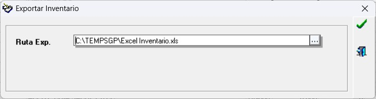

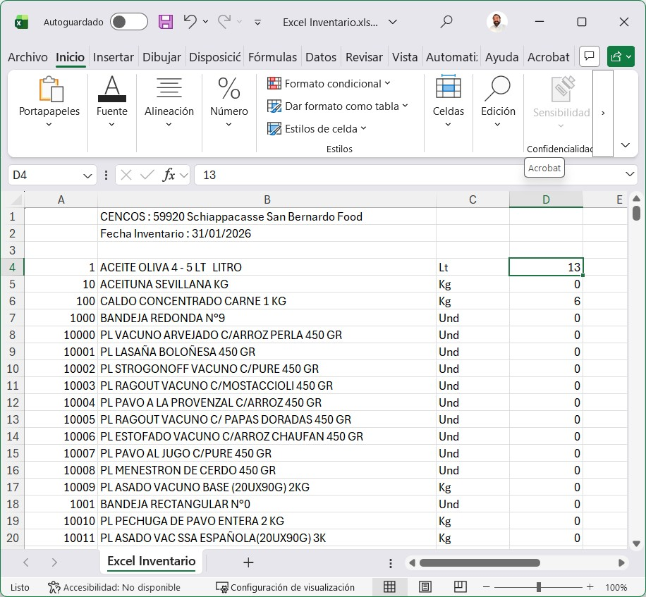

*Figura **43**. Formulario Exportar / Importar Inventario (P_EIInve.frm).*

Permite exportar el inventario físico a un archivo Excel o importar cantidades físicas desde un archivo Excel hacia el sistema. El formulario es auxiliar: se abre automáticamente desde otras pantallas (Toma de Inventario o Estimación de Necesidades de Compra) y hereda el modo de operación, la fecha de inventario y la bodega activa sin que el usuario los seleccione manualmente.

El sistema opera en tres modos, determinados por la pantalla que lo invoca:

**Exportar Inventario**: genera un archivo Excel con código, nombre, unidad de medida y stock físico de cada producto del conteo.

**Importar Inventario**: lee un archivo Excel y actualiza el stock físico de cada producto en el inventario abierto.

**Exportar Pedido Mensual Ruta**: vuelca a Excel el contenido de la grilla de estimación de necesidades de compra.

Una barra de progreso indica el avance del proceso mientras se recorren los registros.

**Flujo de Exportar / Importar Inventario:**

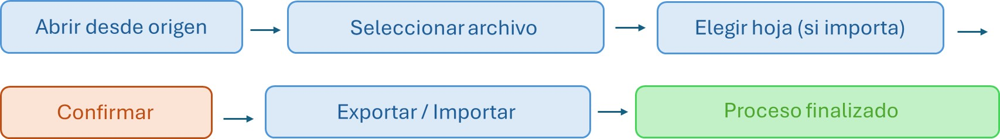

| Campo | Descripción | Obligatorio |
| --- | --- | --- |
| Ruta del archivo (Ruta Exp. / Ruta Imp.) | Ruta completa del archivo Excel de destino (exportación) o de origen (importación). Se selecciona mediante el explorador de archivos integrado (ícono de carpeta). En modo exportación muestra un diálogo "Guardar como"; en modo importación muestra un diálogo "Abrir". | Sí |
| Nombre Hoja (solo modo importación) | Lista desplegable que se carga automáticamente con los nombres de todas las hojas del archivo Excel seleccionado. El usuario debe elegir la hoja que contiene los datos de inventario antes de confirmar. | Sí (modo importación) |
| Fecha de inventario | Fecha del conteo físico. Se recibe automáticamente desde la pantalla que invoca este formulario; el usuario no la ingresa aquí. | — |
| Bodega | Bodega activa del contrato. Se hereda del contexto de trabajo; el usuario no la selecciona aquí. | — |

**Observaciones:**

El modo de operación no es seleccionable por el usuario; se hereda automáticamente al abrir el formulario desde la pantalla de origen.

En modo importación, solo se actualizan productos cuyo stock físico en el archivo sea un valor numérico mayor que cero. Filas con código vacío o valores no numéricos son ignoradas silenciosamente.

El proceso de importación se detiene si encuentra una fila cuya primera columna contenga el carácter *.

**Reglas de negocio:**

| # | Cuando aparece | Qué verifica el sistema | Qué ve o experimenta el usuario |
| --- | --- | --- | --- |
| 1 | Al hacer clic en Confirmar sin haber seleccionado un archivo | Que el campo de ruta no esté vacío | "Carpeta no existe" |
| 2 | Al intentar exportar/importar cuando el archivo Excel está abierto en otro programa | Que el archivo no esté bloqueado por otra aplicación | "La Planilla excel esta abierta, debe cerrar la pantilla y la esta opción" con el detalle del error |
| 3 | Al finalizar un proceso exitoso | Confirmación de resultado | "Proceso de Exportar Finalizado" o "Proceso de Importar Finalizado" según corresponda |
| 4 | Al finalizar un proceso con error (por ejemplo, sin registros en exportación) | Que el proceso haya completado correctamente | "Proceso de Exportar Falló" o "Proceso de Importar Falló" según corresponda |

**Observaciones:**

En modo exportación, si no existen registros para la fecha y bodega activas, no se genera archivo y el proceso se reporta como fallido.

En modo importación, el sistema identifica el código de producto en la primera columna y el stock físico en la cuarta columna del Excel.

Solo se incluyen productos con pro_ctrsto = 1 (control de stock activo)

El operador debe ingresar el conteo real.

La planilla se genera para una bodega y período específicos; no mezcla bodegas distintas

**Importante:**

El formulario no valida la estructura del archivo Excel importado; si las columnas no coinciden con el formato esperado, los datos se ignoran o se actualizan incorrectamente sin aviso.

**<u>Formato del archivo Excel exportado (modo Exportar Inventario):</u>**

El archivo incluye una línea de encabezado con el nombre del casino y la fecha del inventario, seguida de una fila por cada producto con las columnas: código de producto, nombre del producto, unidad de medida abreviada y stock físico redondeado según la configuración de decimales del sistema.

**<u>Formato del archivo Excel exportado (modo Exportar Pedido Mensual Ruta):</u>**

El archivo contiene una fila de encabezados con los títulos de cada columna (9 columnas), seguida de una fila por producto. La octava columna se formatea como fecha mm/dd/yyyy.

**<u>Lectura del archivo Excel importado (modo Importar Inventario):</u>**

El sistema recorre fila por fila la hoja seleccionada. Columna 1 = código de producto, columna 4 = stock físico. Se ejecuta un UPDATE directo sobre b_tomainv para cada producto con stock > 0. Códigos vacíos y valores no numéricos se saltan. El carácter * en la primera columna detiene el proceso.

**Formato de salida:**

No genera comprobante impreso. El resultado es un archivo Excel (.xls) en la ruta seleccionada por el usuario (modos de exportación) o la actualización directa de los registros de inventario en la base de datos (modo importación).

**Tablas asociadas:**

| Tabla | Para qué se usa | Campos clave |
| --- | --- | --- |
| b_tomainv | Fuente de datos en la exportación; destino de actualización en la importación. Contiene el detalle de cada producto en un conteo de inventario. | tin_fectom (fecha del conteo), tin_codbod (bodega), tin_codpro (código de producto), tin_stofis (stock físico) |
| b_productos | Se consulta en la exportación para obtener el nombre del producto y el código de unidad de medida. | pro_codigo, pro_nombre, pro_coduni |
| a_unidad | Se consulta en la exportación para mostrar el nombre corto de la unidad de medida de cada producto. | uni_codigo, uni_nomcor |
| b_tomainv | Fuente de datos en la exportación; destino de actualización en la importación. Contiene el detalle de cada producto en un conteo de inventario. | tin_fectom (fecha del conteo), tin_codbod (bodega), tin_codpro (código de producto), tin_stofis (stock físico) |
| b_productos | Se consulta en la exportación para obtener el nombre del producto y el código de unidad de medida. | pro_codigo, pro_nombre, pro_coduni |
| a_unidad | Se consulta en la exportación para mostrar el nombre corto de la unidad de medida de cada producto. | uni_codigo, uni_nomcor |
