# DRF - Minutas y Recetas

---

## Índice

- [1. Confidencialidad](#1-confidencialidad)
- [2. Información del Proyecto](#2-información-del-proyecto)
- [3. Responsables](#3-responsables)
- [4. Aprobaciones](#4-aprobaciones)
- [5. Situación Actual](#5-situación-actual)
- [6. Propósito del proyecto](#6-propósito-del-proyecto)
- [7. Alcance del proyecto](#7-alcance-del-proyecto)
- [8. Requerimientos Funcionales](#8-requerimientos-funcionales)
  - [8.1. Vision General del Módulo de Minutas/Recetas](#81-vision-general-del-módulo-de-minutasrecetas)
  - [8.2. Productos/Ingrediente](#82-productosingrediente)
    - [8.2.1. Detalle Producto (M_Produc.frm)](#821-detalle-producto-m_producfrm)
    - [8.2.2. Creación de Producto (M_Produc.frm)](#822-creación-de-producto-m_producfrm)
    - [8.2.3. Ingrediente (M_Produc.frm)](#823-ingrediente-m_producfrm)
    - [8.2.4. Asociar ingrediente (B_TabEst.frm)](#824-asociar-ingrediente-b_tabestfrm)
    - [8.2.5. Copiar Aportes Nutricionales (B_TabEst.frm):](#825-copiar-aportes-nutricionales-b_tabestfrm)
    - [8.2.6. Impresión de Productos en Formatos 1 y 2 (I_Produc.frm - I_Productos1 - I_Productos2):](#826-impresión-de-productos-en-formatos-1-y-2-i_producfrm---i_productos1---i_productos2)
    - [8.2.7. Imprimir Ingredientes (I_Produc.frm - i_ingrediente_excel - I_AporteProductos)](#827-imprimir-ingredientes-i_producfrm---i_ingrediente_excel---i_aporteproductos)
    - [8.2.8. Impresión maestro impuesto productos (I_produc.frm - I_ImpuestoProductos):](#828-impresión-maestro-impuesto-productos-i_producfrm---i_impuestoproductos)
    - [8.2.9. Informe Salida ingredientes & productos: (I_produc.frm - I_IngredientesProductos):](#829-informe-salida-ingredientes-productos-i_producfrm---i_ingredientesproductos)
    - [8.2.10. Formato Compras SAP (I_ForCom.frm - I_FormatoCompras):](#8210-formato-compras-sap-i_forcomfrm---i_formatocompras)
    - [8.2.11. Asociar Material SAP y SGP (M_SacSgp.frm)](#8211-asociar-material-sap-y-sgp-m_sacsgpfrm)
    - [8.2.12. Vincular Formato Compra (M_SacSgp.frm)](#8212-vincular-formato-compra-m_sacsgpfrm)
    - [8.2.13. Subir Formato Compras SAP (P_ImpTxt.frm)](#8213-subir-formato-compras-sap-p_imptxtfrm)
    - [8.2.14. Informe Productos no Homologados SAP (I_ProSAPNoHol.frm)](#8214-informe-productos-no-homologados-sap-i_prosapnoholfrm)
  - [8.3. ABM Proveedores (M_provee.frm)](#83-abm-proveedores-m_proveefrm)
  - [8.4. Costo Precio Ingrediente Comercial (P_CostoIngrediente.frm)](#84-costo-precio-ingrediente-comercial-p_costoingredientefrm)
  - [8.5. Receta](#85-receta)
    - [8.5.1. Mantenedor Receta (M_Receta.frm)](#851-mantenedor-receta-m_recetafrm)
    - [8.5.2. Copiar receta (M_CpoRec.frm)](#852-copiar-receta-m_cporecfrm)
    - [8.5.3. Mover recetas (M_MovRec.frm)](#853-mover-recetas-m_movrecfrm)
    - [8.5.4. Bach – Input receta (M_receta.frm):](#854-bach-input-receta-m_recetafrm)
    - [8.5.5. Bach – Input Método Preparación Receta (M_receta.frm)](#855-bach-input-método-preparación-receta-m_recetafrm)
    - [8.5.6. Filtro recetas (B_DieTip.frm)](#856-filtro-recetas-b_dietipfrm)
    - [8.5.7. Reemplazo ingrediente receta (M_ReePro)](#857-reemplazo-ingrediente-receta-m_reepro)
    - [8.5.8. Ver vinculo ingrediente & productos (M_VinPro.frm)](#858-ver-vinculo-ingrediente-productos-m_vinprofrm)
    - [8.5.9. Impresión de nombre recetas (I_Receta.frm)](#859-impresión-de-nombre-recetas-i_recetafrm)
    - [8.5.10. Informe Nombre Recetas (I_NombreRecetas)](#8510-informe-nombre-recetas-i_nombrerecetas)
    - [8.5.11. Informe Tarjeta Receta (I_TarjetaRecetas)](#8511-informe-tarjeta-receta-i_tarjetarecetas)
    - [8.5.12. Informe Excel recetas con aportes nutricionales (ExportarExcelRecetaAporte)](#8512-informe-excel-recetas-con-aportes-nutricionales-exportarexcelrecetaaporte)
    - [8.5.13. Informe Recetas Con Productos Costo Cero (I_RecetasConProdCostoCero)](#8513-informe-recetas-con-productos-costo-cero-i_recetasconprodcostocero)
    - [8.5.14. Informe Productos Costo Cero (I_ProductosCostoCero)](#8514-informe-productos-costo-cero-i_productoscostocero)
    - [8.5.15. Recetas Con Ingredientes Sin Productos Asociados (I_IngredienteSinProductos)](#8515-recetas-con-ingredientes-sin-productos-asociados-i_ingredientesinproductos)
    - [8.5.16. Informe Exportar Excel Encabezado Receta (ExportarExcelEncabezadoReceta)](#8516-informe-exportar-excel-encabezado-receta-exportarexcelencabezadoreceta)
  - [8.6. Tabla de Gramaje x Ceco y por Nivel (M_TabGra.frm)](#86-tabla-de-gramaje-x-ceco-y-por-nivel-m_tabgrafrm)
  - [8.7. Borrado Masivo de Minutas (M_BorrarCecoMasivo.frm)](#87-borrado-masivo-de-minutas-m_borrarcecomasivofrm)
  - [8.8. Copiar Minuta Líder a Seguidores (M_Copia_Minuta_Lideres.frm)](#88-copiar-minuta-líder-a-seguidores-m_copia_minuta_lideresfrm)
  - [8.9. Copiar Minuta Bloque Estándar (M_Copia_MinutaBloqueEstandar.frm)](#89-copiar-minuta-bloque-estándar-m_copia_minutabloqueestandarfrm)
  - [8.10. Copiar Minuta Bloque x CECO (M_Copia_MinutaBloqueCeco.frm)](#810-copiar-minuta-bloque-x-ceco-m_copia_minutabloquececofrm)
  - [8.11. Minuta Bloque Costo Bandeja x Servicio (M_MBloqueCostoBandejaxServicios.frm)](#811-minuta-bloque-costo-bandeja-x-servicio-m_mbloquecostobandejaxserviciosfrm)
  - [8.12. Minuta Bloque (M_MinSR1.frm)](#812-minuta-bloque-m_minsr1frm)
    - [8.12.1. Detalle minuta bloque (M_MinSR2.frm)](#8121-detalle-minuta-bloque-m_minsr2frm)
    - [8.12.2. Ingreso Receta (B_RecMbi.frm):](#8122-ingreso-receta-b_recmbifrm)
    - [8.12.3. Ingresar % Ponderación (M_MinSR2.frm)](#8123-ingresar-ponderación-m_minsr2frm)
    - [8.12.4. Ingreso Número raciones (Solo minuta Limpieza Desechable) (M_MinSR2.frm)](#8124-ingreso-número-raciones-solo-minuta-limpieza-desechable-m_minsr2frm)
    - [8.12.5. Ingreso Comensales x día (M_MinSR2.frm)](#8125-ingreso-comensales-x-día-m_minsr2frm)
    - [8.12.6. Visualizar Detalle Receta (M_Receta.frm)](#8126-visualizar-detalle-receta-m_recetafrm)
    - [8.12.7. Visualizar Aporte Sin % P-G-Cho-AGRS (C_ApoPla.frm)](#8127-visualizar-aporte-sin-p-g-cho-agrs-c_apoplafrm)
    - [8.12.8. Visualizar Aporte Con % P-G-Cho-AGRS (C_AporteSansis.frm)](#8128-visualizar-aporte-con-p-g-cho-agrs-c_aportesansisfrm)
    - [8.12.9. Menú contextual – Opciones de Edición de Menú (M_MinSR2.frm)](#8129-menú-contextual-opciones-de-edición-de-menú-m_minsr2frm)
    - [8.12.10. Copiar Minuta (M_CPlaTe.frm)](#81210-copiar-minuta-m_cplatefrm)
    - [8.12.11. Visualizar Costo (M_MinSR2.frm)](#81211-visualizar-costo-m_minsr2frm)
    - [8.12.12. Frecuencia Recetas (C_FreMinBlo.frm)](#81212-frecuencia-recetas-c_freminblofrm)
    - [8.12.13. Actualizar Costo Recetas (M_MinSR2.frm)](#81213-actualizar-costo-recetas-m_minsr2frm)
    - [8.12.14. Exportar Excel Receta (C_ExpRecMBloque.frm)](#81214-exportar-excel-receta-c_exprecmbloquefrm)
    - [8.12.15. Frecuencia de Ingrediente (C_FreIngMinBlo.frm)](#81215-frecuencia-de-ingrediente-c_freingminblofrm)
    - [8.12.16. Buscar Receta o Ingrediente (B_BusVas.frm)](#81216-buscar-receta-o-ingrediente-b_busvasfrm)
    - [8.12.17. Menú Formato I – II](#81217-menú-formato-i-ii)
  - [8.13. Actualizaciones Varias - Cambio x Raciones Ponderaciones Excel (P_CambioRecetaMinBloque.frm)](#813-actualizaciones-varias---cambio-x-raciones-ponderaciones-excel-p_cambiorecetaminbloquefrm)
  - [8.14. Actualizaciones Varias - Carga Masiva de Minuta via Excel   – Batch Input (P_ActComExcel.frm)](#814-actualizaciones-varias---carga-masiva-de-minuta-via-excel-batch-input-p_actcomexcelfrm)
  - [8.15. Actualizaciones Varias - Estado Minuta Bloque (P_CamEstMin.frm)](#815-actualizaciones-varias---estado-minuta-bloque-p_camestminfrm)
  - [8.16. Actualizaciones Varias – Porcentaje Ponderación (P_CamEstMin.frm)](#816-actualizaciones-varias-porcentaje-ponderación-p_camestminfrm)
  - [8.17. Actualizaciones Varias – Cambiar pedido Proyectado a CD o PAP y Eliminar Carro de Compra (P_CambioCarro.frm / P_EliminarCarroCompras.frm)](#817-actualizaciones-varias-cambiar-pedido-proyectado-a-cd-o-pap-y-eliminar-carro-de-compra-p_cambiocarrofrm-p_eliminarcarrocomprasfrm)
  - [8.18. Actualizaciones Varias – Cambiar Estado Pedido (P_CambioCarro.frm)](#818-actualizaciones-varias-cambiar-estado-pedido-p_cambiocarrofrm)
  - [8.19. Actualizaciones Varias – Exportar Tabla Gramaje – Bach Input   (P_ExpTGranejeBachInput.frm)](#819-actualizaciones-varias-exportar-tabla-gramaje-bach-input-p_exptgranejebachinputfrm)
  - [8.20. Actualizaciones Varias - Actualizar Ajuste Estacionales Recetas (P_ActualizarAjusteEstacionales.frm)](#820-actualizaciones-varias---actualizar-ajuste-estacionales-recetas-p_actualizarajusteestacionalesfrm)
  - [8.21. Asignar Lista de Precio a Propuesta (P_AsigListaPrecioPro.frm)](#821-asignar-lista-de-precio-a-propuesta-p_asiglistaprecioprofrm)
  - [8.22. Pantalla LED – Parametrización (M_EstructuraServicioPanLed.frm)](#822-pantalla-led-parametrización-m_estructuraserviciopanledfrm)
- [9. Glosario](#9-glosario)
- [10. Calculo Precio Minuta](#10-calculo-precio-minuta)
  - [10.1. Centro de Costo Normal (tipoCeco = 0)](#101-centro-de-costo-normal-tipoceco-0)
  - [10.2. Centro de Costo Propuesta (tipoCeco = 1)](#102-centro-de-costo-propuesta-tipoceco-1)
- [11. Tabla de Gramaje](#11-tabla-de-gramaje)
- [12. Cálculos Nutricionales Aportes Nutricionales](#12-cálculos-nutricionales-aportes-nutricionales)
  - [12.1. Calculo Aporte Nutricional](#121-calculo-aporte-nutricional)
  - [12.2. Calculo Proteína de Alto Valor Biológico](#122-calculo-proteína-de-alto-valor-biológico)
  - [12.3. Cálculo de Huella de Carbono](#123-cálculo-de-huella-de-carbono)
- [13. Mejoras transversales.](#13-mejoras-transversales)

---

# 1. Confidencialidad

La información de este documento y documentos anexos es propiedad de **SODEXO CHILE** y de carácter confidencial, por lo cual el proveedor debe mantener la información en reserva y usarla sólo para el propósito de prestar los servicios solicitados.

El proveedor se obliga además a tomar las medidas para que quienes tengan acceso a la Información, guarden bajo estricta reserva, protejan y no revelen a terceros dicha Información, siendo responsabilidad del proveedor velar por el cumplimiento de esta obligación.

En caso de avanzar con el proyecto, el proveedor deberá firmar un documento de Confidencialidad de la Información (NDA Sodexo), donde se describe con mayor detalle estas obligaciones.

Toda la información entregada por el proveedor para la evaluación de un servicio, sistema y/o solución informática será propiedad de **SODEXO CHILE**, sin que esto signifique un costo o genere algún tipo de cargo para la empresa.

# 2. Información del Proyecto

| Estructura | Descripción |
| --- | --- |
| Segmento | Sodexo Chile |
| Área | Tecnología  /  Planificación  / Costos /  Compras |
| Sección | Módulo de Minutas & Recetas |
| Proyecto | SGP  Upgrade  – Módulo de Minutas & Recetas |

# 3. Responsables

| ROL | Nombre | Correo Electrónico |
| --- | --- | --- |
| Sponsor | Francisco González | Francisco.gonzalez@sodexo.com |
| Líder Proyecto | Claudia Muñoz | Claudia.muñoz@sodexo.com |
| Key  User | Jaime Orrego Griselda Galeno Evelyn Ponce | Jaime.orrego@sodexo.com Griselda.galeno@sodexo.com Evelyn.ponce@sodexo.com |
| Líder TI | Francisco Zeballos | f rancisco .zeballos@sodexo.com |

# 4. Aprobaciones

Comité de Tecnología.

# 5. Situación Actual

El módulo de Recetas y Minutas del SGP Administrador gestiona la creación, mantenimiento y planificación de la oferta alimentaria de los sitios. Se estructura en cuatro áreas principales: Recetas, que administra catálogo con ingredientes, gramajes, (bruto, neto, servido, nutricional) aportes nutricionales y todos los parámetros, algunos utilizados en el diseño de la minuta, así como también los que las ordenan por categoría dietética y tipo de plato; Minutas, que gestiona la planificación por sitio, período y servicio incluyendo costos y comensales; Distribución, que controla la aprobación y envío de minutas a los casinos junto con la generación automática de carros de compras; y Consultas e Informes, que entrega análisis de frecuencias, aportes nutricionales y costos exportables a Excel. Todo el módulo se apoya en datos maestros centralizados que regulan categorías dietéticas, regímenes para minutas y tabla de gramaje, tipos de plato, métodos de cocción y estacionalidad, asegurando consistencia operativa en todos los sitios planificados.

**Ciclo de vida del módulo:**

Producto  Ingrediente  Receta  Oferta  Tabla Gramaje  Minuta  Pedido Centralizado  Proveedor / PEL  Guía de Despacho  Producción

**Cuatro pilares del módulo (flujo secuencial):**

| Pilar | Descripción | Responsable |
| --- | --- | --- |
| Recetas | Creación y mantenimiento del catálogo de recetas: ingredientes,  gramaje, atributos  AMD, estacionalidad , Oferta, Zona  y  todos los parámetros de la receta . | Food   Intelligence |
| Minutas | Diseño y gestión de minutas bloque por sitio, período y servicio. Incluye copia, cambio de recetas, ajuste de comensales  y control  de  costos . | Planificación |
| Distribución | Aprobación y envío de minutas a casinos. Generación  automática  de carro de compras y  pedidos  de ingredientes según días de holgura logística. | Planificación / Compras |
| Consultas e Informes | Análisis de frecuencias de platos,  ingredientes, productos,   aportes nutricionales, costos de recetas y minutas, y exportación a Excel para propuestas comerciales. | Planificación / Costos  /  Menu   Design  /  Food   Intelligence |

# 6. Propósito del proyecto

Documentar en profundidad el comportamiento funcional actual del módulo de Recetas y Minutas del SGP Administrador, con el objetivo de:

Constituir una base de referencia para el diseño del nuevo sistema.

Identificar funcionalidades críticas a preservar, mejorar o eliminar.

Levantar reglas de negocio explícitas que hoy son conocimiento tácito de los operadores.

Definir el alcance funcional del módulo para la etapa de modernización.

# 7. Alcance del proyecto

El alcance de este documento cubre el módulo de Recetas y Minutas del SGP Administrador.

# 8. Requerimientos Funcionales

## 8.1. Vision General del Módulo de Minutas/Recetas

El módulo de Recetas y Minutas del SGP Administrador gestiona la creación, mantenimiento y planificación de la oferta alimentaria de los sitios planificados de Sodexo Chile. El sistema se estructura alrededor de cuatro pilares fundamentales basados en un modelo de ciclo de planificación: la gestión del catálogo de recetas, la planificación de minutas, la distribución a casinos y la generación de pedidos, y las consultas e informes de costos y nutrición.

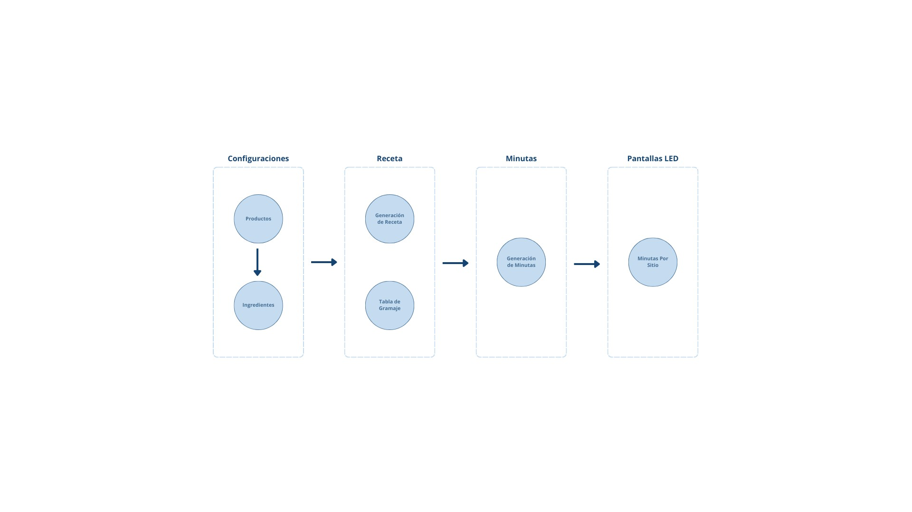

## 8.2. Productos/Ingrediente

### 8.2.1. Detalle Producto (M_Produc.frm)

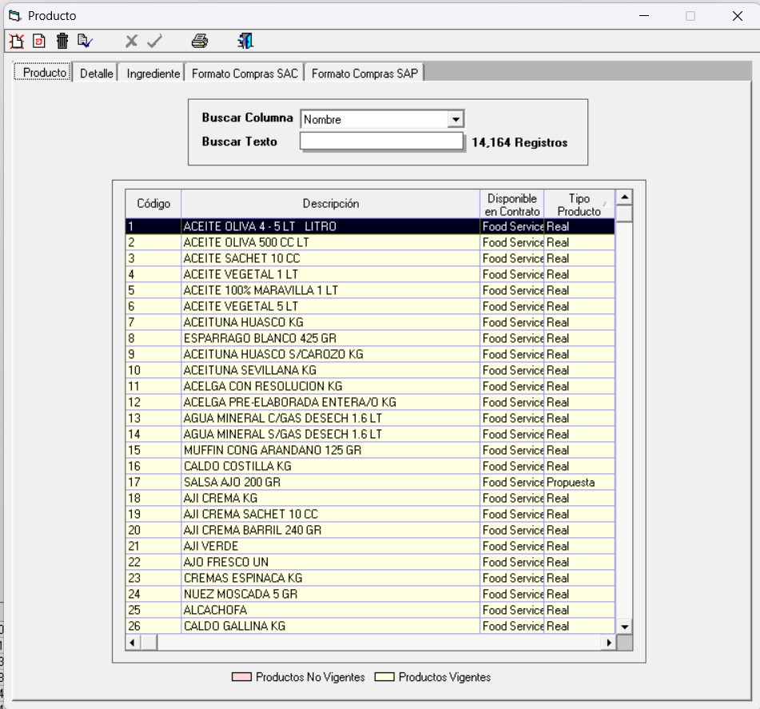

Figura 1: Buscador de Productos SGP

**Descripción:**

En la pantalla se encuentra la totalidad de productos creados tanto vigente como no vigente. 

**Funcionalidad:**

Búsqueda de productos por nombre de producto, por código SGP y familia de producto.

Para editar un producto debo seleccionar el producto e ir a la pestaña “Producto” 

Al hacer click en “Nuevo Producto” se limpia el formulario para ingresar un nuevo producto.

Al hacer click “Deshabilitar producto” se deshabilita el producto seleccionado.

**Reglas de Negocio:**

Los productos vigentes y no vigentes se diferencian visualmente por color de fila (leyenda con Shape).

**Tablas Relacionadas:**

B_productos

**Mejoras****:**

Eliminar pestaña formato compras sac.

### 8.2.2. Creación de Producto (M_Produc.frm)

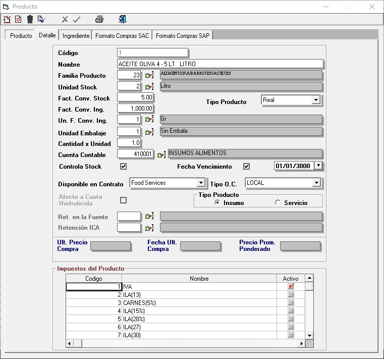

Figura 2: Creación de Productos

**Descripción:**

La pantalla permite administrar de manera integral la información asociada al maestro de productos. En la pestaña de producto es posible crear, modificar, desactivar e imprimir registros, además de visualizar y editar los atributos principales como el nombre del producto, la familia, la unidad de stock y otros datos relevantes. Esta sección también contempla el concepto de tipo de producto, que puede clasificarse como real o como propuesta, y dispone de una grilla de detalle donde se muestran los impuestos asociados.

**Funcionalidad:**

Creación, modificar y deshabilitar de productos.

Ingresar familia de producto, unidad de medida, factor de conversión, factor de conversión ingrediente, unidad de embalaje, cantidad x unidad, cuenta contable, tipo producto, si controla stock o no, fecha de vencimiento, disponibilidad en contrato, tipo O.CO, Tipo producto.

Ingresar impuesto al producto.

**Reglas de Negocio:**

Cuando se están ingresando o modificando el producto el resto de las pestañas se deshabilita hasta que el producto se cree correctamente. Además, se habilita los botones de confirmar y rechazar.

EL producto puede deshabilitar o habilitarse por la fecha de vencimiento.

EL tipo de producto (Insumo/Servicio) determina el tipo de clasificación del producto.

Se muestra la pantalla de impuestos asociados al producto seleccionado. Es una pestaña en donde se puede Insertar, modifica o elimina la relación producto-impuesto.

El nombre, familia de producto, unidad stock, fact. Conv. Stock, fact. Conv. Ing., Un F. Conv. Ing, Unidad embalaje, cantidad x unidad, cuenta contable, tipo de producto (Real y propuesto), disponible en contrato, tipo O.C, tipo de producto (insumo o servicio) son obligatorios

Controla stock, fecha de vencimiento y el asignar impuesto son opcional.

El código del producto se crear incrementalmente.

**Tablas Relacionadas:**

Tabla Producto Ingrediente (b_productosimp)

Tabla Producto (b_productos)

Tabla Unidad (a_unidad)

Tabla Familia Producto (a_tipopro)

Tabla unidad embalaje (a_embalaje)

Tabla Cuenta Contable (a_ctacontable)

Tabla Impuesto (a_impuesto)

Tabla Tipo Servicio (a_tiposervicio)

**Mejora:**

Eliminar campos “Ult. Precio Compras”, “Fecha Ult. Compra” y “Precio Prom.”, tipo producto, tipo OC, Unidad Embalaje, cantidad x unidad, cuando falta un campo haga referencia al campo que no se haya ingresado.

Validar que no se repita nombre similar de producto.

### 8.2.3. Ingrediente (M_Produc.frm)

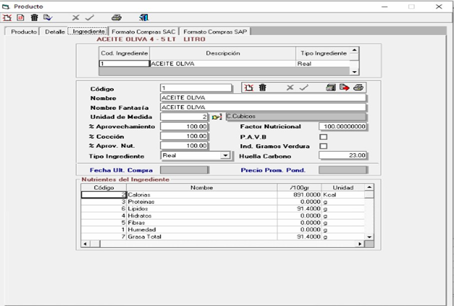

Figura 3: Creación de Ingrediente

**Descripción:**

La pestaña de ingredientes presenta la información correspondiente a los ingredientes vinculados a cada producto, incluyendo sus atributos específicos, considerando que un producto puede tener uno o varios ingredientes asociados; estos ingredientes también cuentan con un tipo que puede ser real o propuesta.

**Funcionalidad:**

Crear, modificar y deshabilitar ingrediente.

Ingresa Nombre, Nombre Fantasía, Unidad de Medida,

Incluir nuevos ingredientes a la lista.

Asignar al ingrediente Nombre, Nombre Fantasía, % de aprovechamiento (parte utilizable del ingrediente bruto, descontando merma física: cáscaras, huesos, semillas, hojas externas, etc.), % de cocción (proporción que queda del ingrediente luego de cocinarlo, por pérdida de agua, reducción, evaporación) y % aprovechamiento nutricional (Porción del ingrediente bruto se usa como base para calcular los aportes nutricionales (proteínas, calorías)), Factor Nutricional (valor numérico almacenado por ingrediente que representa la cantidad de ingrediente en bruto necesaria para obtener 100g del alimento en su forma evaluada nutricionalmente), P.A.V.B (Porcentaje de alto valor biológico), Tipo Ingrediente (Real o Propuesta), Huella de Carbono.

**Reglas de Negocio:**

Cuando se realiza click en “Nuevo Ingrediente” se limpia el formulario para ingresar la información de un nuevo ingrediente. Además, se habilita los botones de confirmar y rechazar.

EL ingrediente se puede deshabilitar.

Al ingresar la información de un nuevo ingrediente, se deshabilita el resto de las pestañas.

Se muestra la pantalla de impuestos asociados al producto seleccionado. Es una pestaña en donde se puede Insertar, modifica o elimina la relación producto-impuesto.

El código de ingrediente se crear incrementalmente.

Al crear el ingrediente el % Aprovechamiento, % Cocción, el % Aprov. Nut y el Factor Nutricional quedan en 100. 

El ingreso de aportes nutricionales en la tabla “Nutrientes del Ingrediente” es manual. 

Nombre, Nombre Fantasía, Unidad de Medida, Tipo de Ingrediente, Huella de Carbono es obligatorio, cero es permitido.

El % de aprovechamiento nutricionales una fracción comestible; no todos los ingredientes lo tienen (solo los que tienen hueso, carozo, etc.)

El factor nutricional en “unidad: Ingredientes con UM "unidad", se debe dividir 100 entre los gramos del producto unitario.

El asignar nutrientes al ingrediente es opcional.

Tablas Relacionadas:

Tabla Ingrediente (b_ingrediente)

Tabla Productos Ingredientes (b_productosing)

Tabla Productos (b_productos)

Tabla de Aportes Nutricionales (b_productonut)

Tabla Unidad Medida (a_unidadmed)

Tabla nutrientes (a_nutriente)

Mejoras

El concepto "Propuesta" en producto no se migrará al nuevo sistema, fecha ultima compra y precio promedio ponderado.

Agregar los alérgenos a nivel de ingrediente.

Separación de %aprovechamiento en descongelamiento y % aprovechamiento limpieza.

Validar que no se repita nombre similar de ingrediente.

Nombre fantasía que replique nombre del ingrediente con la posibilidad que se pueda modificar.

Deshabilitar un ingrediente.

### 8.2.4. Asociar ingrediente (B_TabEst.frm)

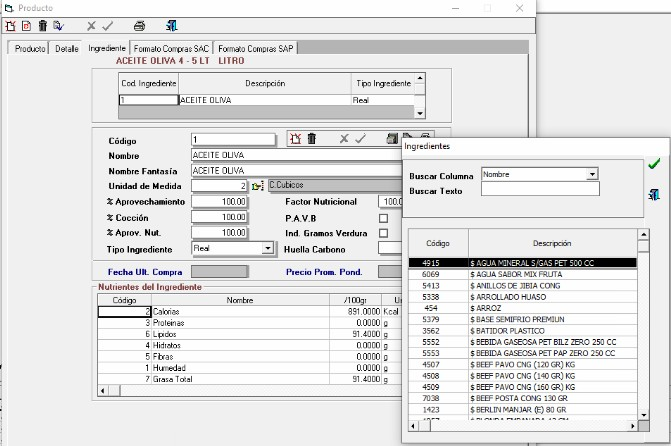

Figura 4: Asociación Producto SGP a Ingrediente

**Descripción:**

Formulario modal de búsqueda y selección que permite asociar un ingrediente a un producto. Se apertura desde el “Asociar el producto SGP a N Ingredientes” formularios del sistema como ventana auxiliar de búsqueda por código o nombre. 

**Funcionalidad:**

Un producto puede asociarse a uno o más ingredientes. La proporción indica la fracción del ingrediente dentro del producto. También se puede asociar un ingrediente a más de un producto.

**Reglas de Negocio:**

Un Producto puede asociarse a uno o más Ingredientes. 

Solo se puede asociar productos y ingredientes activos.

**Tablas Relacionadas:**

Tabla Ingrediente (b_ingrediente)

Tabla Productos (b_productos)

Tablas Productos Ingredientes (b_productosing)

Tabla de Aportes Nutricionales (b_productonut)

**Mejoras**

El concepto "Propuesta" en ingrediente no se migrará al nuevo sistema.

Que muestre de la lista ingrediente todos ingredientes y los ingredientes que estén desactivado lo muestre de un color destacado.

### 8.2.5. Copiar Aportes Nutricionales (B_TabEst.frm):

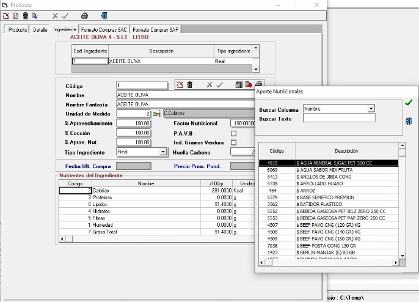

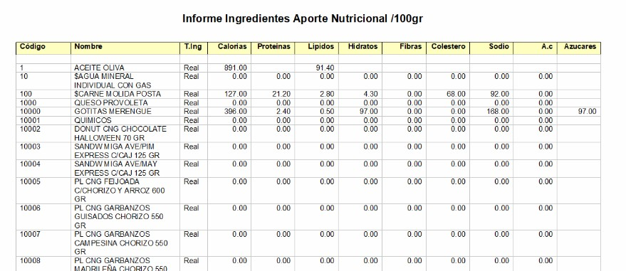

**Descripción:**

Permite al usuario buscar y seleccionar un ingrediente origen cuya tabla de aportes nutricionales será copiada sobre el ingrediente destino actual. Evita la carga manual de los valores nutricionales para ingredientes con composición similar.

**Funcionalidades**

Búsqueda de ingrediente origen por código o nombre.

Previsualización del ingrediente encontrado en la grilla de 2 columnas.

Confirmación de la selección: retorna el código del ingrediente origen a la ventana llamante para copiar sus valores nutricionales.

Tecla ESC cierra el formulario sin seleccionar.

Exportación del documento.

**Reglas de Negocio**

La copia de aportes sobrescribe los valores nutricionales existentes del ingrediente destino con los del ingrediente origen.

La operación no modifica ninguna otra propiedad del ingrediente destino (nombre, código, unidad).

Copia en su totalidad los aportes y factor nutricionales del ingrediente. 

Exportación del documento en formato Excel.

**Tablas Relacion****adas**

Tabla de Aportes Nutricionales (b_productonut)

Mejoras:

Que muestre de la lista ingrediente todos ingredientes y los ingredientes que estén desactivado lo muestre de un color destacado

### 8.2.6. Impresión de Productos en Formatos 1 y 2 (I_Produc.frm - I_Productos1 - I_Productos2):

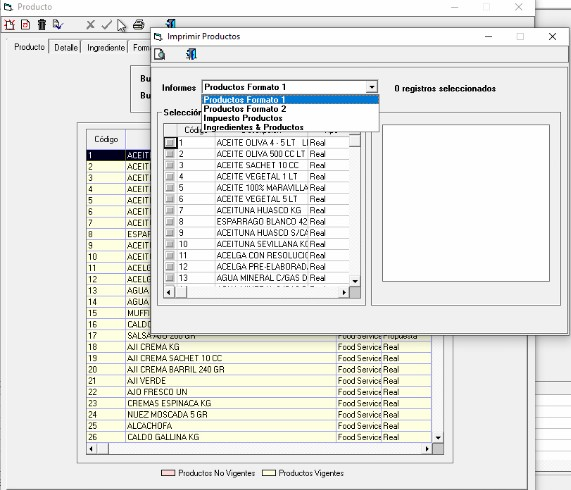

Figura 5: Impresión de Productos

**Informe Salida maestro producto formato ****1****:**

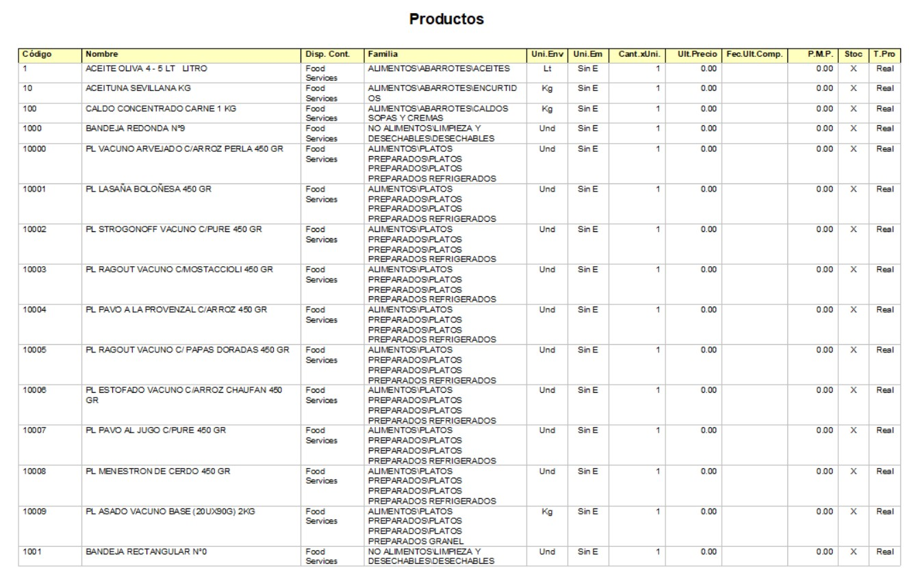

Figura 6: Informe Salida maestro producto formato 1

**Descripción:**

Esta imagen corresponde al informe de impresión del Maestro de Productos, que presenta un listado detallado de los productos registrados en el sistema. Para cada producto se muestra la siguiente información:

Código y Nombre del producto

Disponibilidad y Contrato (Disp. Cont.)

Familia de clasificación del producto

Unidad de Envío y Emisión (Uni.Env / Uni.Em)

Cantidad por Unidad (Cant.xUni)

Último Precio (Ult.Precio)

Fecha Última Compra (Fec.Ult.Comp.)

P.M.P., Stock y Tipo de Producto (T.Pro)

Los productos listados pertenecen principalmente a las familias de Alimentos y No Alimentos, clasificados en subfamilias definidas según el tipo de producto, todos asociados a food service y tipificados como real.

**Funcionalidad:**

Generación del informe de salida del maestro de productos en formato 1 (listado completo con datos generales: código, nombre, unidad de medida, tipo, estado activo, precio de referencia).

El informe muestra productos activos y no activos.

Vista previa e impresión del informe.

Exportación del listado de productos.

**Reglas de Negocio****:**

El informe formato 1 muestra los datos generales del producto sin incluir aportes nutricionales ni vínculos SAP.

Permite exportar a Word, Excel o a PDF.

**Tablas Relacionadas:**

Tabla Productos (b_productos)

Tabla Unidad de Medida (a_unidaddemedida)

Tabla Unidad de Medida Ingrediente (a_unidadmed)

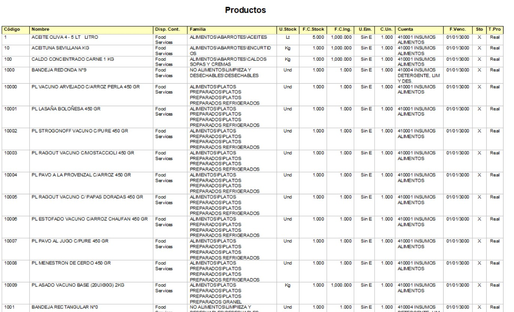

Figura 7: Informe Salida maestro producto formato 2

**Informe Salida maestro producto formato 2:**

**Descripción:**

Esta imagen corresponde a un segundo formato de impresión del Maestro de Productos, que complementa al anterior mostrando información adicional de carácter contable y de stock. Para cada producto se presenta:

Código y Nombre del producto

Disponibilidad y Contrato (Disp. Cont.)

Familia de clasificación

Unidad de Stock (U.Stock)

Factor de Conversión Stock y Factor de Conversión Ingrediente (F.C.Stock / F.C.Ing)

Unidad de Emisión (U.Em)

Cantidad por Unidad (C.Un)

Cuenta contable asociada

Fecha de Vencimiento (F.Venc.)

Stock y Tipo de Producto (Sto / T.Pro)

Los productos listados son los mismos que en el formato anterior, todos asociados a Food Services y clasificados como Real, con cuenta contable 410001 Insumos Alimentos, a excepción de la Bandeja Redonda que se asocia a 410004 Insumos Detergente, Lim y Des.

**Funcionalidades****:**

Generación del informe de salida del maestro de productos en formato 2.

Vista previa e impresión del informe.

Exportación del listado extendido.

**Reglas de Negocio****:**

Permite exportar a Word, Excel o a PDF.

**Tablas Relacion****adas****:**

Tabla Productos (b_productos)

Tabla de Cuenta Contable (a_ctacontable)

Tabla Unidad de Medida Ingrediente (a_unidadmed)

Tabla Unidad de MedidaProducto (a_unidad)

Mejora:

Fusionar los informes 1 y dos productos.

Sacar los campos que se eliminaron en los maestros de productos.

### 8.2.7. Imprimir Ingredientes (I_Produc.frm - i_ingrediente_excel - I_AporteProductos)

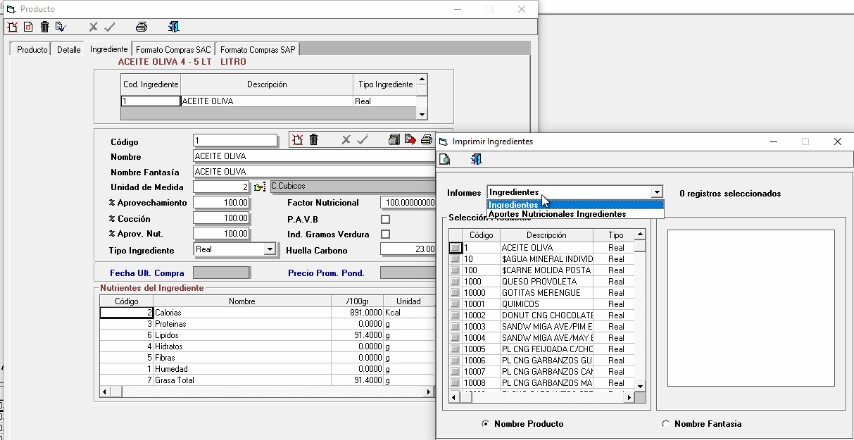

Figura 8: Imprimir Ingrediente

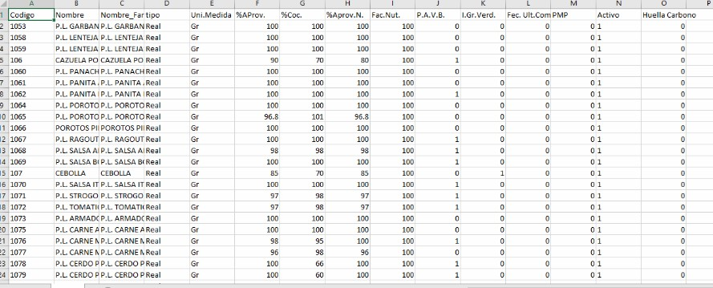

Figura 9: Exportación Excel Ingredientes

Figura 10: Exportación Excel Aporte Nutricional /100gr

**Descripción General:**

La imagen corresponde al Informe de Ingredientes – Aporte Nutricional por 100 g, el cual presenta el detalle de los valores nutricionales de cada ingrediente registrado en el sistema. Para cada ingrediente se muestra el Código, Nombre y Tipo de Ingrediente (T.Ing), junto con sus respectivos aportes nutricionales por cada 100 gramos.

El informe puede exportarse a Excel desde el Maestro de Ingredientes y contiene el detalle de los atributos nutricionales y técnicos asociados a cada ingrediente registrado en el sistema.

La pantalla mostrada corresponde al filtro de selección previo a la generación del informe de aportes nutricionales, el cual cuenta con dos secciones principales: **Selección de ingredientes**** y ****Parámetros nutricionales****.**

Estos permiten visualizar los distintos indicadores nutricionales asociados a cada ingrediente, tales como calorías, proteínas, lípidos, hidratos de carbono, fibras, colesterol, sodio, ácidos grasos, azúcares y todos los nutrientes disponibles en el sistema. También muestra la Huella de Carbono del ingrediente.

Este informe permite analizar la composición nutricional de cada ingrediente, constituyendo una herramienta clave para el cálculo de aportes nutricionales en la planificación de minutas y recetas.

**Funcionalidades**

El Excel exportado de Ingredientes muestra la siguiente información: Código y Nombre del ingrediente, Unidad de Medida, y los porcentajes de Aprovechamiento (%Aprov.), Cocción (%Coc.) y Aporte Nutricional (%Aprov.N.), junto con el Factor Nutricional (Fac.Nut.) y el valor P.A.V.B.. Además, incluye indicadores como Ingrediente Verde (I.Gr.Verd.), Fecha Última Compra (Fec.Ult.Com), PMP, estado Activo y valor de Huella de Carbono.

El Excel exportado de Ingredientes muestra la siguiente información: Código y Nombre del ingrediente, Tipo de Ingrediente, Calorías, Proteinas, Lipidos, Hidratos, Fibras, Colesterol, Sodio, A.c y Azucares.

Existe una lista de nutrientes en la que algunos vienen seleccionados por defecto. El usuario puede desmarcarlos o seleccionar otros nutrientes disponibles en la lista según lo requiera.

**Reglas de Negocio****:**

El informe detallado incluye el desglose de cada nutriente por ingrediente.

Si se selecciona "Con PAVB", el informe incluye la columna PAVB (Proteína de Alto Valor Biológico) en el resultado. Muestra un 1 indicando que está seleccionado.

Debe seleccionarse al menos un tipo de reporte antes de generar.

Exportación del documento en formato Excel, Word o PDF.

**Tablas Relacionadas:**

Tabla Ingrediente (b_ingrediente)

Tabla Productos (b_productos)

Tabla Unidad de Medida Ingrediente (a_unidadmed)

**Mejoras**

Incorporar alergeno al informe de aporte nutricionales.

Eliminar de la lista tipo de ingrediente, PMP y Fecha de ultima compras.

### 8.2.8. Impresión maestro impuesto productos (I_produc.frm - I_ImpuestoProductos):

Figura 11: Impresión de Productos - Impuesto Productos

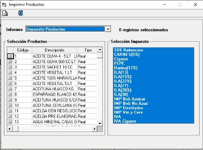

Figura 12: Impresión Maestro Impuesto Producto

**Informe Salida productos impuesto:**

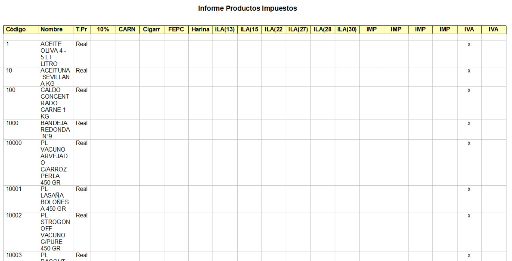

Figura 13: Informe Salida Maestro Impuestos

**Descripción:**

Esta pantalla corresponde al filtro de selección previo a la generación del Informe de Impuesto Productos. Cuenta con dos secciones principales:

Selección de Productos, donde se despliega un listado de productos con su código y descripción, permitiendo seleccionar uno o varios de ellos para incluir en el informe.

Informe de Productos Impuestos, que muestra la clasificación tributaria asociada a cada producto registrado en el sistema. Para cada producto se presenta su Código y Nombre, junto con una matriz de columnas que representa los distintos tipos de impuestos disponibles, tales como 10%, CARNE, Cigarro, FEPC, Harina, ILA (en sus distintas variantes: 13, 15, 22, 27, 28, 30), IMP e IVA.

En esta imagen se puede observar que todos los productos listados tienen marcado únicamente el impuesto IVA, sin ningún otro impuesto adicional asignado, lo que indica que todos están afectos exclusivamente a este tributo.

**Funcionalidades****:**

Generación del informe de productos con el desglose de impuestos asociados.

Vista previa e exportación del informe.

**Reglas de Negocio****:**

El impuesto de cada producto se determina por su clasificación en el maestro.

El informe incluye solo productos activos e inactivos.

Exportación del documento en formato Excel, Word o PDF.

**Tablas Relacionadas****:**

Tabla Productos (b_productos)

Tabla de Impuesto (b_productosimp)

Mejora:

En la lista sacar la columna tipo.

Incluir en informe columna de activo o inactivo.

Aparezcan el nombre completo de cada impuesto.

### 8.2.9. Informe Salida ingredientes & productos: (I_produc.frm - I_IngredientesProductos):

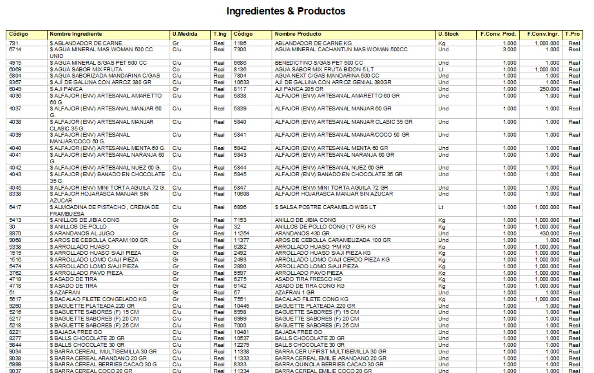

Figura 14:  Informe Salida Ingredientes & Productos

**Descripción:**

Este informe exportado a Excel del Maestro de Ingredientes, que presenta el detalle de los atributos nutricionales y técnicos de cada ingrediente registrado en el sistema, muestra la relación entre ingredientes y sus productos asociados. Permite verificar la homologación completa del catálogo: qué ingredientes tienen productos vinculados, cuántos productos tiene cada ingrediente y qué ingredientes no tienen producto asociado. Es un reporte de diagnóstico y auditoría del catálogo maestro.

Este informe exportado a Excel del Maestro de Ingredientes, que presenta el detalle de los atributos nutricionales y técnicos de cada ingrediente registrado en el sistema. 

**Funcionalidades****:**

Listado combinado ingrediente–producto con la relación de vínculo.

Columnas: código ingrediente, nombre ingrediente, unidad de medida, tipo de ingrediente, código producto, nombre producto, unidad de stock, Factor Conversión Producto, Factor Conversión Ingrediente, Tipo de Producto.

Muestra productos activos o inactivos.

Vista previa e impresión del informe.

Exportación del listado.

**Reglas de Negocio****:**

Un ingrediente sin producto asociado no puede generar ítem de pedido centralizado. Este informe es el mecanismo de detección de esa inconsistencia.

Un ingrediente puede tener más de un producto asociado. El informe muestra una fila por cada relación ingrediente–producto.

Exportación en Excel, Word y PDF.

**Tablas Relacionadas****:**

Tabla Ingrediente (b_ingrediente)

Tabla Productos (b_productos)

Tabla Productos ing (b_productosing)

Tabla Unidad de Medida Ingrediente (a_unidadmed)

Tabla Unidad de MedidaProducto (a_unidad)

Mejoras:

Sacar del informe Tipo producto e ingrediente.

Incorporar columna de activo, ya sea del producto e ingrediente.

### 8.2.10. Formato Compras SAP (I_ForCom.frm - I_FormatoCompras):

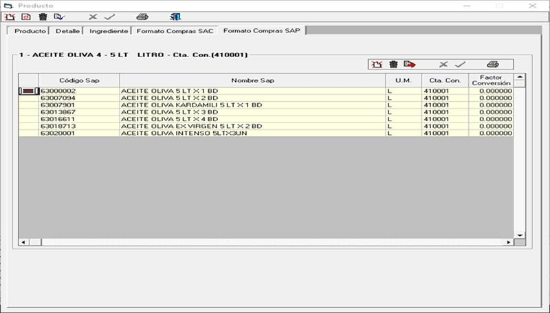

Figura 15: Formato Compras SAP

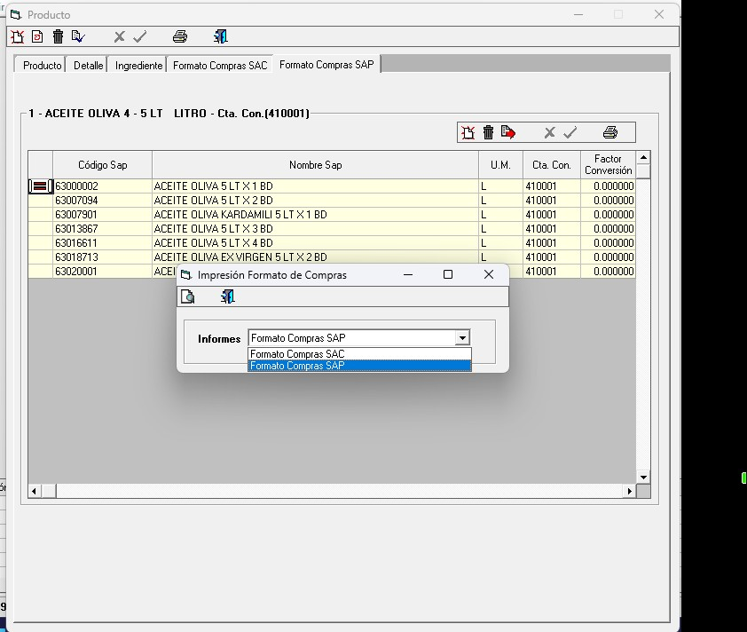

Figura 16: Impresión Formato de Compras

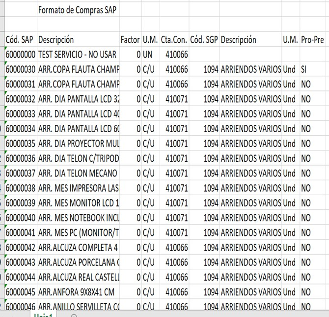

**Descripción General:**

Esta pantalla corresponde a la pestaña Formato Compras SAP dentro del Maestro de Producto, que muestra la relación entre el producto SGP y sus materiales equivalentes en SAP. Presentando para cada uno el Código SAP, Nombre SAP, Unidad de Medida (U.M.), Cuenta Contable (Cta. Con.) y Factor de Conversión. Esta asociación permite vincular correctamente los productos del sistema SGP con los materiales utilizados en los procesos de compra de SAP, asegurando coherencia entre ambos sistemas.

**Funcionalidades:**

Permite informe exportado a Excel del Formato de Compras SAP, que muestra la relación entre los materiales SAP y los productos SGP. Para cada registro se presenta el Código SAP, Descripción, Factor de Conversión, Unidad de Medida (U.M.), Cuenta Contable (Cta.Con.), Código SGP, Descripción SGP, Unidad de Medida y el indicador que señala si el material es propuesta o no. Este informe permite visualizar de manera consolidada la asociación entre ambos sistemas, facilitando la revisión y control de la integración entre SAP y SGP para los procesos de compra.

Exportación del listado.

**Reglas de Negocio****:**

Si no se selecciona un tipo de informe antes de presionar Vista Previa, el sistema muestra mensaje "Debe seleccionar Informe" y no continúa.

El parámetro "sap" genera el formato para la integración con SAP.

Exportación en Excel, Word y PDF.

**Tablas Relacionadas****:**

Tabla Formato Compras SGP (b_formatocomprassgp)

Tabla Formato Compras SAP (b_formatocompras_sap)

Tabla Productos (b_productos)

**Mejora****:**

Revisar si es necesario el factor de conversión porque siempre está en cero. Eliminar. 

En la informe columna “Indicador Pro-Pre” revisar si es necesario, ya que no se utiliza.

Eliminar de la lista el ítem “formato compras SAC”.

### 8.2.11. Asociar Material SAP y SGP (M_SacSgp.frm)

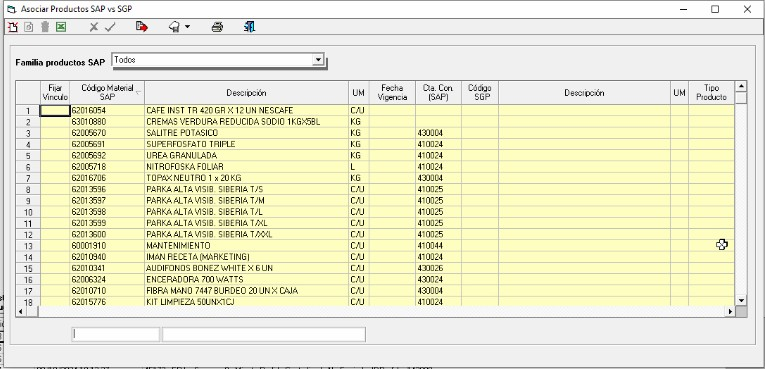

Figura 18: Asociar Material SP y SGP

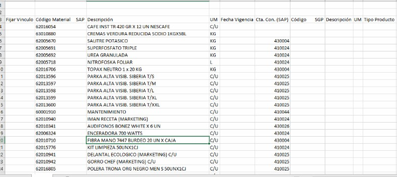

Figura 19: Exportación de Excel

**Descripción:**

Este módulo permite asociar Producto SAP con Producto SGP, estableciendo una relación directa entre ambos sistemas. Gracias a esta asociación es posible generar los carros de compras y calcular el costo de las minutas utilizando los convenios definidos en SAP, lo que asegura coherencia en la información de abastecimiento y facilita la integración entre los procesos internos y los datos provenientes del sistema SAP.

**Funcionalidad:**

Consulta y realizar las equivalencias existentes Producto SAP ↔ Producto SGP.

Visualización del catálogo de productos SAP en la grilla.

Permite exportar un Excel con la siguiente información: 

Código Material SAP.

Descripción.

UM

Fecha de Vigencia

Cta. Contable SAP

Código SGP

Descripción SGP

UM SGP

Tipo Producto

**Reglas de Negocio:**

El formulario es el punto de mapeo entre el mundo SAP (producto) y el mundo SGP (producto). Sin este mapeo, el sistema no puede calcular el precio de convenio SAP para un ingrediente SGP.

**Tablas Relacionadas:**

Tabla Formato de Compras SAP SGP (b_formatocompras_sap_sgp)

Tabla Formato Compras SAP (b_formatocompras_sap)

Tabla Productos (b_productos)

**Mejoras****:**

Validación de coherencia entre la unidad del producto SAP y la unidad del producto SGP. El sistema debe alertar cuando las unidades no sean coherentes.

No mostrar la columna cuenta contable de la grilla y exportación Excel. 

### 8.2.12. Vincular Formato Compra (M_SacSgp.frm)

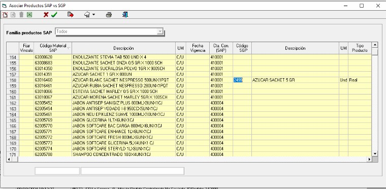

**Descripción:**

Para vincular formato compras a un producto SGP, se debe ingresar el código de producto SGP y luego seleccionar vincular y grabar. Esto permite que el formato compra quede como preferido.

**Funcionalidad:**

Marcar preferido, esto quiere decir que marca un formato preferido de un listado de productos SAP para un producto SGP.

**Reglas de Negocio:**

Marca de preferido.

**Tablas Relacionadas:**

Tabla Formato Compras SAP (b_formatocompras_sap)

Tabla Formato Compras SGP (b_formatocomprassgp)

Tabla Productos (b_productos)

Mejora:

Eliminar el botón de marca preferido.

### 8.2.13. Subir Formato Compras SAP (P_ImpTxt.frm)

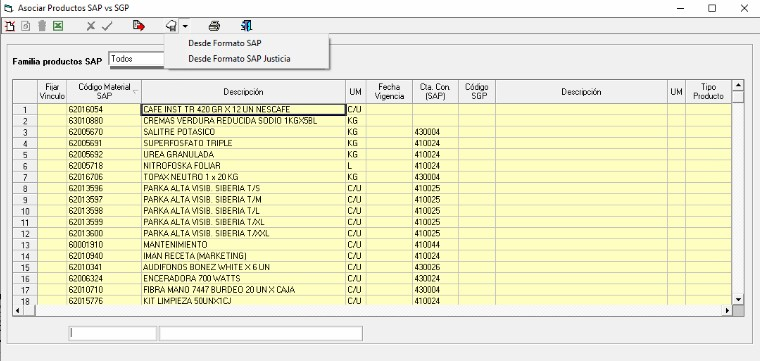

**Descripción:**

Formulario de importación de archivos externos al sistema. Permite importar dos tipos de archivos: (1) Desde Formato SAP, y (2) Desde Formato SAP Justicia (archivo TXT con estructura tabulada de convenios SAP). 

**Funcionalidad:**

Selector de tipo de archivo: "Desde Formato SAP" o "Desde Formato SAP Justicia" e importar.

**Reglas de Negocio:**

El archivo de convenios debe ser un TXT separado por tabulaciones (\t) con mínimo 25 columnas por línea a partir de la fila 5.

Las primeras 5 líneas del archivo (filas 0–4) se consideran encabezado y se omiten del procesamiento.

**Tablas Relacionadas:**

Tabla Formato de Compras SAP SGP (b_formatocompras_sap_sgp)

Tabla Formato Compras SAP (b_formatocompras_sap)

Tabla Productos (b_productos)

Mejoras:

Eliminar la primera opción “Desde Formato SAP” y Justicia.

### 8.2.14. Informe Productos no Homologados SAP (I_ProSAPNoHol.frm)

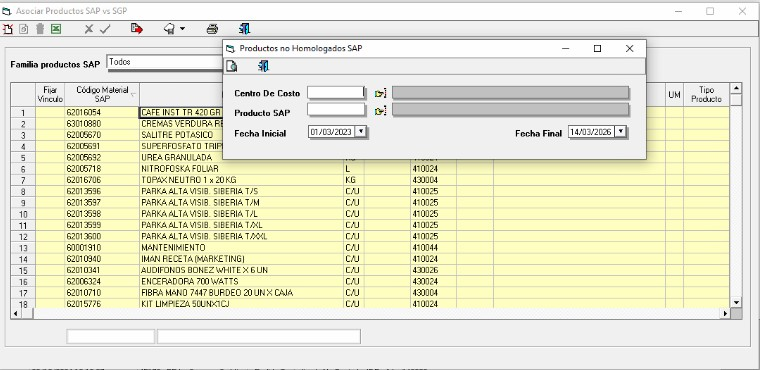

**Descripción:**

Formulario de parámetros para generar el informe de productos que no tienen homologación en SAP. Permite filtrar por Centro de Costo, producto SAP y por rango de fechas (dos campos fpDateTime1 para fecha desde y hasta). El informe identifica los productos del catálogo SGP que aún no cuentan con un código SAP asociado.

**Funcionalidad:**

Campo de Centro de Costo, producto SAP y por rango de fechas (dos campos fpDateTime1 para fecha desde y hasta) para filtrar (obligatorio).

Rango de fechas para filtrar por fecha de creación o modificación del producto.

Generación del informe con los productos sin homologación.

Botón Vista Previa / Imprimir.

Exportación de listado.

**Reglas de Negocio:**

Un ingrediente se considera "no homologado SAP" cuando no existe ningún registro activo para ese código de producto SGP.

La fecha "hasta" debe ser mayor o igual a la fecha "desde".

Exportación en Excel, Word o PDG.

**Tablas Relacionadas:**

Tabla Formato Compras SAP (b_formatocompras_sap)

Tabla Productos (b_productos)

Mejoras:

Eliminar esta opción.

## 8.3. ABM Proveedores (M_provee.frm)

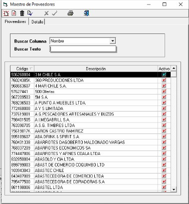

Figura 20: Maestro Proveedores

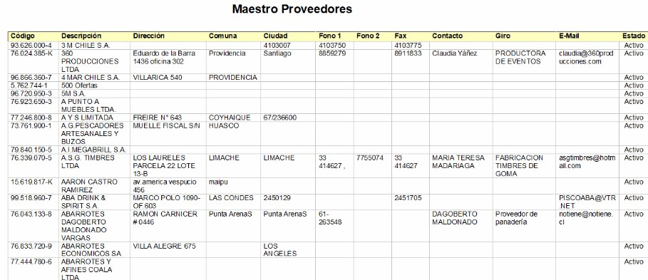

Figura 21: Exportación Excel Proveedores

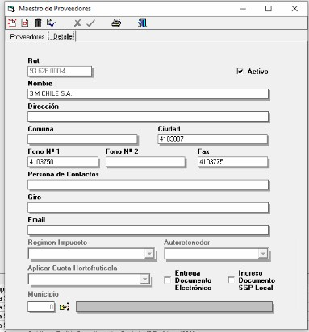

Figura 22: Creación Maestro Proveedores

**Descripción:**

Formulario para gestionar el maestro de proveedores. Los proveedores son referenciados en los convenios SAP y en las líneas del Pedido Centralizado. Solo los proveedores activos pueden usarse en pedidos.

**Funcionalidad:**

Alta, modificación y consulta de proveedores.

Campos del proveedor: código, nombre, dirección, ciudad, persona de contacto, giro comercial, estado activo y flag (habilito uso en documentos de productos).

Filtro de proveedores activos para uso en pedidos centralizados.

Descarga de Excel con: Código, Descripción, Dirección, Comuna, Ciudad, Fono 1, Fono 2, Fax, Contacto, Giro, E-mail y Estado.

ítem “Entrega Documento Electrónico”, Indica si el proveedor emite documentos electrónicos (S) o manuales (N) en SGP LOCAL.

**Reglas de Negocio:**

Solo los proveedores con activos pueden asignarse a líneas de pedido centralizado.

El ítem “Ingreso Documento SGP Local”, Habilita/bloquea el ingreso de cualquier documento en SGP LOCAL.

Mejoras:

Eliminar los campos que esta desactiva del formulario que son: Régimen Impuesto, Autorretenedor, Aplicar Cuota Hortofrutícola y Municipio.

## 8.4. Costo Precio Ingrediente Comercial (P_CostoIngrediente.frm)

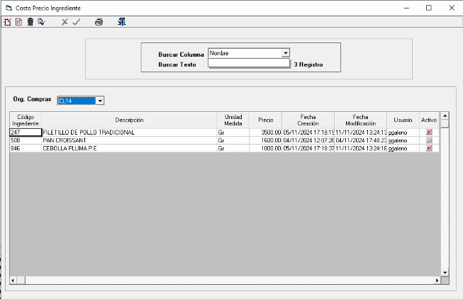

Figura 23: Costo Precio Ingrediente

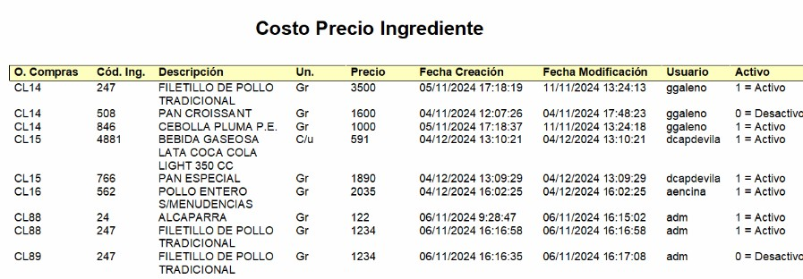

Figura 24: Informe Precio Ingrediente

**Descripción:**

Este módulo permite crear, modificar, eliminar e imprimir el costo y precio de ingredientes utilizados en las minutas comerciales, información que se encuentra asociada a una organización de compras. Su función principal es incorporar un costo específico para cada ingrediente, el cual será aplicado en los cálculos de costo de la minuta comercial. Para estos cálculos, cuando exista un registro activo, dicho dato tendrá prioridad por sobre cualquier otra fuente de información. Además, el valor del ingrediente debe ser registrado en litro, kilo y unidad, asegurando consistencia y flexibilidad en la conversión y aplicación de costos dentro del sistema.

**Funcionalidad:**

Alta y modificación de precios comerciales por ingrediente.

Campos: código de ingrediente, precio (pir_precio), estado activo (pir_activo), vigencia desde (pir_fecvigdesde) y vigencia hasta (pir_fecvighasta).

Activación/desactivación del precio comercial por ingrediente (pir_activo = '1' / '0').

Consulta de precios activos e históricos.

Descarga informe de Excel indicando Org. Compra, Cód. Ingrediente, Descripción, Unidad, Precio, Fecha de Creación, Fecha de Modificación, Estado.

**Reglas de Negocio:**

El precio registrado y activo tiene prioridad absoluta sobre cualquier otro precio para el cálculo del costo de minutas comerciales, incluyendo el precio de convenio SAP.

Solo el precio de ingrediente comercial activo tiene prioridad en el cálculo de costo.

La vigencia temporal del precio comercial se respeta al calcular el costo para una fecha específica.

El precio comercial se digita manualmente.

Solo existe un precio comercial por ingrediente.

**Tablas Relacionadas:**

Tabla Precio Ingrediente Comercial (b_precio_ingrediente_comercial)

## 8.5. Receta

### 8.5.1. Mantenedor Receta (M_Receta.frm)

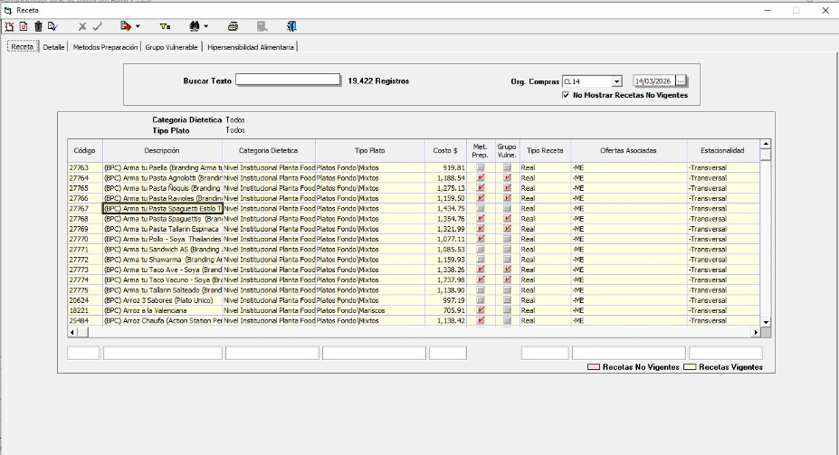

Figura 25: Vista Recetas

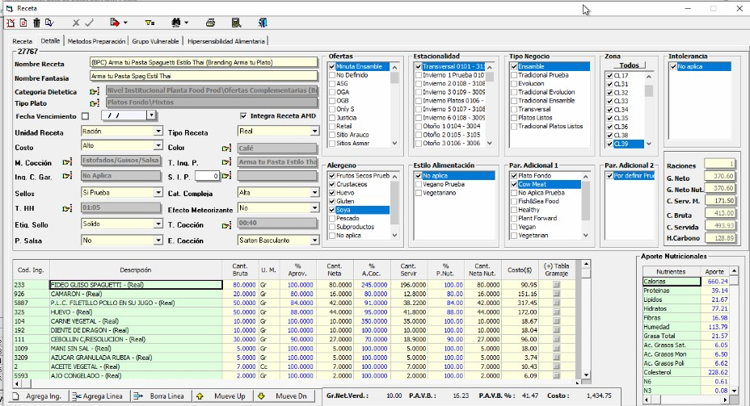

Figura 26: Detalle de la Receta

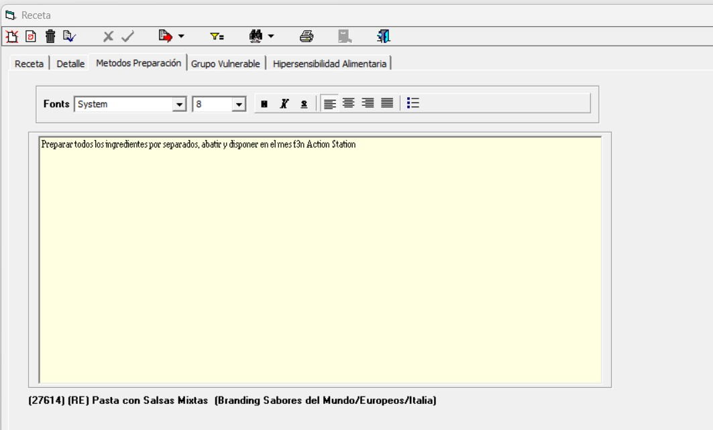

Figura 27: Metodo de Preparación

**Descripción:**

Este módulo permite crear, modificar, desactivar e imprimir recetas, gestionando todos los atributos asociados a su encabezado. Además, ofrece la posibilidad de copiar una receta existente para agilizar la creación de nuevas recetas, así como mover recetas entre distintas categorías dietéticas según la clasificación requerida. También permite incorporar recetas nuevas mediante la carga masiva utilizando la opción de Batch–Input, y del mismo modo es posible subir el método de preparación de las recetas a través de este mismo mecanismo, facilitando la actualización y administración eficiente de grandes volúmenes de información dentro del sistema.

Además, el método de preparación tiene la posibilidad. se puede digitar manualmente.

**Funcionalidad:**

Alta de receta: asignación automática de código receta, completar datos generales obligatorios y agregar al menos un ingrediente en detalle.

Modificación de receta: actualización de datos generales, parámetros AMD, método de preparación o ingredientes por separado.

**Desactivación de receta:** se realiza mediante una baja lógica.Esto actualiza rec_activo = '0' y rec_fecvig con la fecha actual, tanto en la receta como en sus tablas relacionadas (oferta, estacionalidad, tipo de negocio, zona, intolerancia, alérgeno, estilo de alimentación y parámetros adicionales).

Búsqueda de recetas por código, nombre, categoría dietética o tipo de plato, con resolución jerárquica del árbol de categorías y tipos de plato.

**La pestaña**** Receta (datos generales):** nombre, nombre fantasía, categoría dietética (árbol jerárquico), tipo de plato (árbol jerárquico), base de ración en gramos, fecha de vigencia, oferta, zona, estacionalidad, parámetros AMD (Integra AMD), Tipo Ingrediente Principal, Color, Costo Descriptivo, Método de Cocción, Categorización Compleja, Ingrediente Cruce Garnitura, Efecto Meteorizante, Sello, Tiempo HH, Tiempo Cocción, Parámetro Salsa, Equipamiento, Segundo Ingrediente Principal).

**Detalle (ingredientes):** grilla con código de ingrediente, nombre, cantidad bruta, % aprovechamiento, % cocción, % nutricional, cantidad neta calculada, cantidad servida calculada, costo y flag "indica gramaje principal". Permite agregar, modificar y eliminar ingredientes. Al incorporar un ingrediente nuevo, precarga automáticamente los porcentajes desde el maestro de ingrediente.

**Métodos de Preparación:** campos de texto libre de gran extensión para método de preparación, consejos del chef y sugerencias de presentación.

**Grupo Vulnerable:** campo rec_gruvul. **NO MIGRAR** al nuevo sistema (ver sección 12).

**Hipersensibilidad Alimentaria:** campo rec_hipali. **NO MIGRAR** al nuevo sistema (ver sección 12).

Cuando se ingresa la cantidad bruta, se calcula en tiempo real la cantidad neta, cantidad servida, neta nutricional, costo total de receta, huella de carbono y PAVB a medida que se agregan o modifican ingredientes.

Exportación de la receta a Excel.

Permite filtrar las recetas listadas ingresando parte del nombre, código u otro texto. La lista se actualiza automáticamente mostrando únicamente las recetas que coinciden con el criterio ingresado.

**Reglas de Negocio:**

Cada receta tiene un código único asignado automáticamente.

Una receta debe tener al menos un ingrediente en su detalle para poder guardarse y su gramaje.

El porcentaje de aprovechamiento de cada ingrediente proviene del maestro de ingrediente y afecta el cálculo: Cantidad Servida = ((% Aprovechamiento / 100) × Cantidad Bruta) × (% Cocción / 100).

Al crear una receta nueva, los valores de % aprovechamiento, % cocción y % nutricional se precargan desde el maestro de ingrediente. Si la receta ya existe, se extraen desde el detalle de la receta.

La eliminación es siempre lógica, nunca física. 

El código de receta se asigna automáticamente.

La búsqueda de recetas por categoría dietética o tipo de plato resuelve el árbol jerárquico completo (nodo seleccionado más todos sus hijos recursivos).

Las recetas tienen nombre de receta (detallado) y nombre de fantasía (corto). 

El nombre fantasía es visible solo en los informes y es utilizado en los informes de minuta.

Cantidad servida manual, coexiste con la cantidad servida calculada automáticamente. Aplica para casos especiales con líquidos (caldos, cazuelas) donde el agua no está registrada como ingrediente. Es obligatorio principalmente para contratos de justicia.

Los parámetros adicionales 1 y 2 funcionan como comodines reutilizables. El parámetro adicional 1 se usa para un reporte trimestral global que clasifica el tipo de recetas planificadas. Actualmente el parámetro 1 se está utilizando como “Atributos”.

La restricción del parámetro "sellos" en el diseño de la minuta aplica únicamente para sitios de tipo educación (colegios). 

Etiquetado sello hace referencia a la impresión, Los rangos para definir sellos "alto en" varían según si el producto es líquido o sólido.

Las recetas en estado propuesta aprobada deben poder transferirse al proceso de producción real sin contaminar datos productivos. Actualmente propuesta y real comparten la misma base de datos.

La desactivación de una receta debe seguir la secuencia: (1) quitar flag Integra AMD, (2) marcar con "$" en el nombre (indicador visual), (3) asignar fecha de vencimiento solo cuando la receta ya no esté planificada en ninguna minuta activa. No se puede desactivar una receta planificada con hasta 3 meses de anticipación.

Una receta inactiva en ADM no debe ser visible ni panificable en ningún sitio.

Nombre de receta es obligatorio.

Debe seleccionarse una categoría dietética.

Debe seleccionarse un tipo de plato.

La base de ración debe ser mayor a 0.

La receta debe tener al menos un ingrediente antes de guardar y su cantidad gruta debe ser mayor cero.

El porcentaje de aprovechamiento no puede ser 0 ni negativo.

La receta siempre es una sola porción. (Un comensal)

La eliminación es siempre lógica, nunca física.

Cada receta tiene una sola categoría dietética.

Las recetas vencidas dejan de ser visible e utilizable en planificación minuta.

El método de preparación lo ingresa manualmente.

La oferta, zona y tipo negocio Restringe visibilidad de la receta a sitios específicos.

Estacionalidad filtra recetas por temporada; AMD lo usa para no proponer recetas fuera de temporada.

El tipo de negocio clasifica recetas según modelo de producción (tradicional, evolución, ensamble).

La receta debe tener un ingrediente principal.

El efecto meteorizante es ocupado por AMD para no concentrar recetas meteorizantes en un mismo día.

El costo de ingredientes siempre se calcula sobre el peso bruto.

El costo de la receta debe calcularse utilizando la **organización de compras seleccionada**, considerando la **zona** asociada a dicha organización y aplicando los **precios vigentes según la fecha** indicada.

**Tablas Relacionada****s****:**

Tabla Encabezado Receta (b_receta)

Tabla Detalle Receta (b_recetadet)

Tabla Categoría Dietética(a_recetacatdie)

Tabla Tipo Plato (a_recetatippla)

Tabla Unidad Medida (b_UnidadReceta)

Tabla Costo Receta (a_costoreceta)

Tabla Método Cocción (a_metodococcionreceta)

Tabla Ing. Cruce Garnitura (a_ingredientecrucegarniturareceta)

Tabla Sello (a_sellosreceta)

Tabla Tiempo HH (a_tiempohhreceta)

Tabla Etiquetado Sello (a_etiquetadoselloreceta)

Tabla Parámetro Salsa (a_parametrosalsa)

Tabla Color (a_color)

Tabla Tipo Ing. Principal (a_tipoingredienteprincipalreceta)

Tabla Tipo Ing. Secundario (a_tipoingredienteprincipalreceta)

Tabla Categorización Compleja Receta (a_categorizacioncomplejareceta)

Tabla Efecto Meteorizante (a_efectometeorizantereceta)

Tabla Tiempo Cocción Receta (a_tiempococcionreceta)

Tabla Equipamiento Cocción (a_equipamientococcion)

Tabla Ingrediente (b_ingrediente)

Tabla Unidad Medida (a_unidadme)

Tabla Nutrientes (a_nutriente)

Tabla Aportes Nutricionales (b_productonut)

Tabla Organización de Compras (I_org_ceco)

Tabla Estacionalidad (a_estacionalidadreceta)

Tabla Ofertas (b_ofertas)

Tabla Tipo Negocio (a_tiponegocioreceta)

Tabla Intolerancia (a_intoleranciareceta)

Tabla Alergeno (a_alergeno)

Tabla Estilo Alimentacion (a_estiloalimentacion)

Tabla Parametro Adicional1 (a_Parametroadicional1)

Tabla Parametro Adicional2 (a_Parametroadicional2)

Tabla Oferta Receta (b_receta_Oferta)

Tabla Estacionalidad Receta (b_recetaestacionalidad)

Tabla Tipo Negocio Receta (b_recetatiponegocio)

Tabla Zona Receta (b_recetazona)

Tabla Intolerancia receta (b_recetaintolerancia)

Tabla alergeno receta (b_recetaalergeno)

Tabla Estilo alimentación receta (b_recetaestiloalimentacion)

Tabla parámetro adicional 1 receta (b_recetaparametroadicional1)

Tabla parámetro adicional 1 receta (b_recetaparametroadicional2)

Tabla Precio Receta (b_precio_ingrediente_receta)

**Mejora****:**

Dejar no obligatoria fecha de vencimiento, integra AMD, S.I.P (segundo ingrediente principal). Todos los otros campos deben se obligatorios.

Eliminar pestaña “Grupo Vulnerable” e “Hipersensibilidad Alimentaria”, no se utiliza.

No debe existir el concepto de "receta local". Los cambios locales deben resolverse mediante la tabla de gramaje central.

La recete puede tener más una categoría dietética y tipo de plato.

Agregar los alérgenos a nivel de ingrediente y en la receta asigne a los alergenos de la receta.

Agregar sello a nivel de ingrediente y en la receta asigne a los sellos de la receta.

Los % aprovechamiento, % cocción, % nutricional y % nutricional, siempre tiene que ser sacado desde el ingrediente.

Solución segmento salud para tema del agua.

El nombre de fantasía (nombre corto) debe contener máximo 29 caracteres para guardar la receta.

No se puede guardar si ya existe una receta con el mismo nombre (duplicidad). Actualmente en el Batch Input si valida duplicidad.

Cuando se realizar un cambio de ingrediente en la receta, también debe modificar el % de aprovechamiento, cocción y nutricional en la receta.

Actualmente, los convenios de materiales en SAP no consideran los impuestos adicionales dentro del precio. Es necesario aplicar dichos impuestos para obtener un cálculo de receta preciso. Para ello, los impuestos adicionales deben obtenerse desde el maestro de producto.

### 8.5.2. Copiar receta (M_CpoRec.frm)

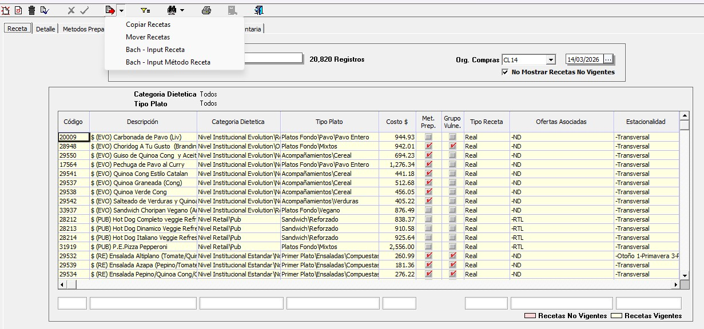

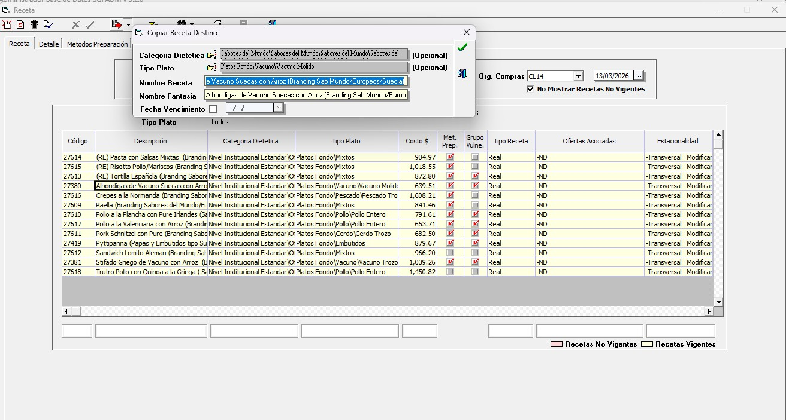

Figura 28: Copiar Receta

**Descripción:**

Esta pantalla corresponde al formulario **Copiar Receta Destino**, que permite duplicar una receta existente hacia una nueva. Para ello se deben definir los siguientes campos: **Categoría Dietética** y **Tipo de Plato**, ambos opcionales, junto con el **Nombre Receta**, el **Nombre Fantasía** y opcionalmente una **Fecha de Vencimiento**. Esta funcionalidad agiliza la creación de nuevas recetas tomando como base una ya existente, evitando el ingreso manual de toda la información desde cero.

**Funcionalidad:**

Selección de la receta origen a copiar.

Opciones de copia: con o sin fecha de vencimiento.

Selección parámetro y edición nombre receta.

La receta copiada mantiene todos sus ingredientes, porcentajes y atributos. Se asigna un nuevo código automáticamente.

Los parámetros AMD se copian junto con la receta.

**Reglas de Negocio:**

La receta copiada recibe un nuevo código auto-incremental (MAX + 1). No hereda el código de la receta origen.

La copia con los parámetros AMD se copian y luego se debe configurarse manualmente los cambios destino. Como también detalle de la receta.

**Tablas Relacionadas:**

Tabla Encabezado Receta (b_receta)

Tabla Detalle Receta (b_recetadet)

Tabla Oferta Receta (b_receta_Oferta)

Tabla Estacionalidad Receta (b_recetaestacionalidad)

Tabla Tipo Negocio Receta (b_recetatiponegocio)

Tabla Zona Receta (b_recetazona)

Tabla Intolerancia receta (b_recetaintolerancia)

Tabla alergeno receta (b_recetaalergeno)

Tabla Estilo alimentación receta (b_recetaestiloalimentacion)

Tabla parámetro adicional 1 receta (b_recetaparametroadicional1)

Tabla parámetro adicional 1 receta (b_recetaparametroadicional2)

**Mejoras:**

Los porcentajes aprovechamientos, cocción, nutricional considere desde maestro ingrediente.

### 8.5.3. Mover recetas (M_MovRec.frm)

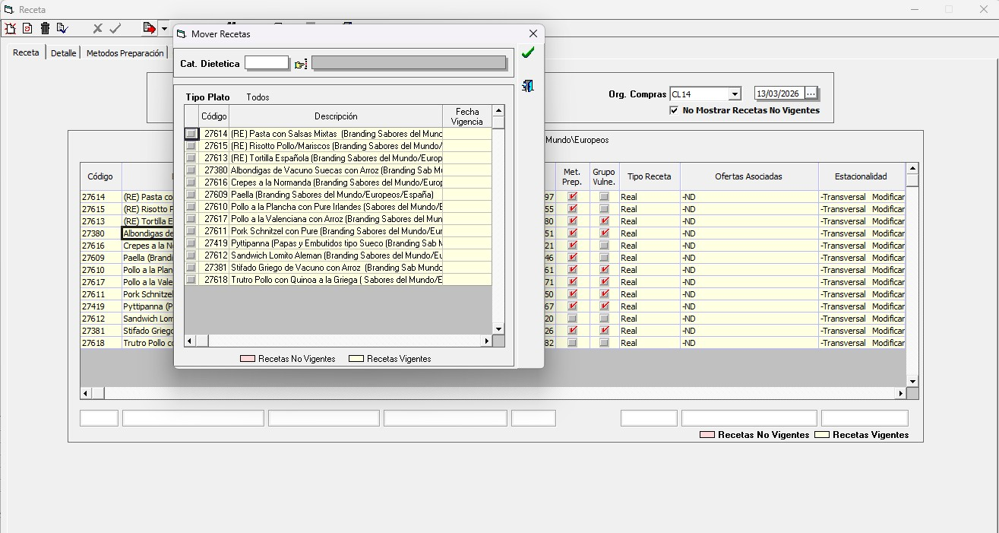

Figura 29: Mover Receta

**Descripción:**

Esta pantalla corresponde al formulario **Mover Recetas**, que permite reclasificar una o varias recetas hacia una nueva categoría dietética. Para ello se debe seleccionar la **Categoría Dietética** destino y filtrar por Categoría Dietética y Tipo de Plato se realiza anteriormente, mostrando en la grilla el listado de recetas disponibles con su **Código**, **Descripción** y **Fecha de Vigencia**. En la parte inferior se indica mediante colores el estado de las recetas, diferenciando entre **Recetas No Vigentes** y **Recetas Vigentes**, lo que facilita identificar rápidamente su condición antes de realizar el movimiento.

**Funcionalidad:**

Selección de la lista las recetas a mover.

Debe seleccionar categoría dietética.

**Reglas de Negocio:**

El sistema muestra la lista de recetas que serán afectadas antes de ejecutar el cambio masivo, para validación del usuario.

El cambio masivo solo aplica a recetas activas.

Esta sección muestra la información relacionada con la receta seleccionada desde el menú principal.

**Tablas Relacionadas:**

Tabla Encabezado Receta (b_receta)

Tabla Categoría Dietética(a_recetacatdie)

**Mejoras:**

### 8.5.4. Bach – Input receta (M_receta.frm):

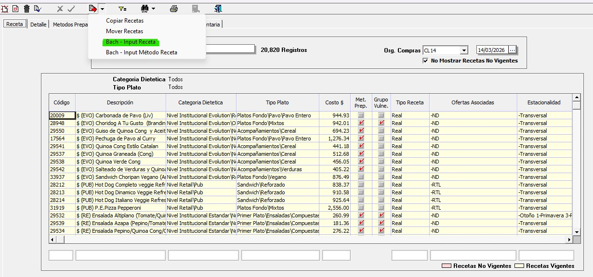

Figura 30: Batch - Input Receta

**Descripción:**

Proceso de carga masiva de recetas desde un archivo Excel estructurado. Permite crear o actualizar múltiples recetas en una sola operación, incluyendo encabezado y detalle de ingredientes. Utilizado para migraciones iniciales y actualizaciones periódicas del catálogo de recetas.

**Funcionalidad:**

Carga del archivo Excel con estructura de recetas (encabezado + ingredientes).

Validación de formato y estructura del archivo antes de procesar.

Inserción/actualización del encabezado de receta.

Inserción del detalle de ingredientes.

Reporte de errores por registro: muestra qué filas del Excel no pudieron procesarse y el motivo.

**Reglas de Negocio:**

Los mismos criterios de obligatoriedad del manual aplican a la carga masiva: nombre, categoría dietética, tipo de plato, base de ración y al menos un ingrediente por receta.

Inserta uno nuevo con código auto-incremental.

**Tablas Relacionadas:**

Tabla Encabezado Receta (b_receta)

Tabla Detalle Receta (b_recetadet)

Tabla Categoría Dietética(a_recetacatdie)

Tabla Tipo Plato (a_recetatippla)

Tabla Unidad Medida (b_UnidadReceta)

Tabla Costo Receta (a_costoreceta)

Tabla Método Cocción (a_metodococcionreceta)

Tabla Ing. Cruce Garnitura (a_ingredientecrucegarniturareceta)

Tabla Sello (a_sellosreceta)

Tabla Tiempo HH (a_tiempohhreceta)

Tabla Etiquetado Sello (a_etiquetadoselloreceta)

Tabla Parámetro Salsa (a_parametrosalsa)

Tabla Color (a_color)

Tabla Tipo Ing. Principal (a_tipoingredienteprincipalreceta)

Tabla Tipo Ing. Secundario (a_tipoingredienteprincipalreceta)

Tabla Categorización Compleja Receta (a_categorizacioncomplejareceta)

Tabla Efecto Meteorizante (a_efectometeorizantereceta)

Tabla Tiempo Cocción Receta (a_tiempococcionreceta)

Tabla Equipamiento Cocción (a_equipamientococcion)

Tabla Ingrediente (b_ingrediente)

Tabla Unidad Medida (a_unidadme)

Tabla Nutrientes (a_nutriente)

Tabla Aportes Nutricionales (b_productonut)

Tabla Estacionalidad (a_estacionalidadreceta)

Tabla Ofertas (b_ofertas)

Tabla Tipo Negocio (a_tiponegocioreceta)

Tabla Intolerancia (a_intoleranciareceta)

Tabla Alergeno (a_alergeno)

Tabla Estilo Alimentacion (a_estiloalimentacion)

Tabla Parametro Adicional1 (a_Parametroadicional1)

Tabla Parametro Adicional2 (a_Parametroadicional2)

Tabla Oferta Receta (b_receta_Oferta)

Tabla Estacionalidad Receta (b_recetaestacionalidad)

Tabla Tipo Negocio Receta (b_recetatiponegocio)

Tabla Zona Receta (b_recetazona)

Tabla Intolerancia receta (b_recetaintolerancia)

Tabla alergeno receta (b_recetaalergeno)

Tabla Estilo alimentación receta (b_recetaestiloalimentacion)

Tabla parámetro adicional 1 receta (b_recetaparametroadicional1)

Tabla parámetro adicional 1 receta (b_recetaparametroadicional2)

**Hoja ****Encabezado de receta****:**

Código receta = obligatorio

Categoría dietética = obligatorio

Tipo de plato = obligatorio

Nombre receta = obligatorio

Nombre fantasía = obligatorio

Método preparación = no obligatorio

Consejo del chef = no obligatorio

Sugerencia del chef = no obligatorio

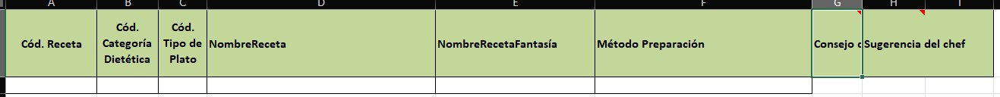

**Ho****j****a**** ****Detalle de Receta:**

Codigo Receta = obligatorio

Nombre Receta = no obligatorio

Numero Línea = obligatorio

Cod. Ingrediente = obligatorio

Cantidad Ingrediente = obligatorio

Costo Ingrediente = va valor cero

% Aprovechamiento = no obligatorio

% Cocción = no obligatorio

%Nutricional = no obligatorio

Factor Nutricional = no obligatorio

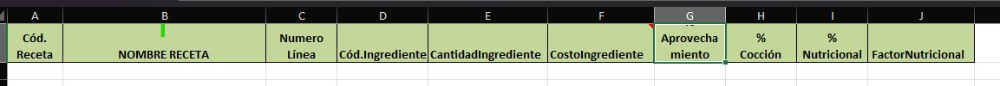

**Hoja ****O****fert****a**** de ****R****eceta****:**

Cod. Oferta = obligatorio

Cod. Receta = obligatorio

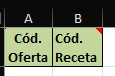

**Hoja ****E****stacionalidad de ****R****ec****e****ta****:**

Cod. Estacionalidad = obligatorio

Cod. Receta = obligatorio

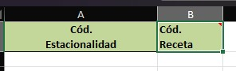

**Hoja ****C****olor:**

Cod. color = obligatorio

Cod. Receta = obligatorio

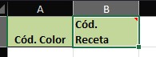

**Hoja ****C****osto:**

Cod. Costo = obligatorio

Cod. Receta = obligatorio

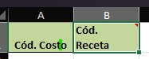

**Hoja ****Parámetro**** Salsa:**

Cod. Parámetro salsa = obligatorio

Cod. Receta = obligatorio

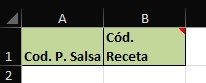

**Hoja Ingrediente**** Principal**** ****R****eceta****:**

Cod. Ingrediente principal receta = obligatorio

Cod. Receta = obligatorio

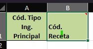

**Hoja ****Secundario**** Ingrediente Principal:**

Cod. Secundario ingrediente principal = obligatorio

Cod. Receta = obligatorio

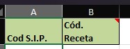

**Hoja M****é****todo Cocción:**

Cod. Método cocción = obligatorio

Cod. Receta = obligatorio

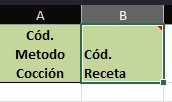

**H****oja**** ****Categorización Compleja****:**

Cod. Categorización compleja = obligatorio

Cod. Receta = obligatorio

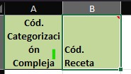

**Hoja Cruce Garnitura:**

Cod. Cruce Garnitura = obligatorio

Cod. Receta = obligatorio

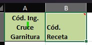

**Hoja Efecto ****Meteorizante****:**

Cod. Efecto metrorizante** = **obligatorio

Cod. Receta = obligatorio

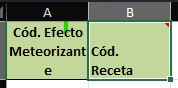

**Hoja Sellos:**

Cod. Sello = obligatorio

Cod. Receta = obligatorio

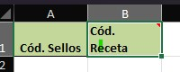

**Hoja ****T****iempo**** ****HH****:**

Cod. Tiempo HH = obligatorio

Cod. Receta = obligatorio

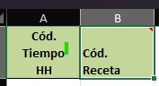

**Hoja ****Tiempo ****Cocción:**

Cod. Tiempo cocción = obligatorio

Cod. Receta = obligatorio

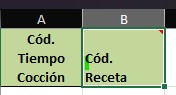

**Hoja Parámetro Adicional 1:**

Cod. Parámetro adicional 1 =** **obligatorio

Cod. Receta = obligatorio

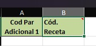

**Hoja ****Parametro**** Adicional 2:**

Cod. Parámetro adicional 2 = obligatorio

Cod. Receta = obligatorio

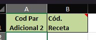

### 8.5.5. Bach – Input Método Preparación Receta (M_receta.frm)

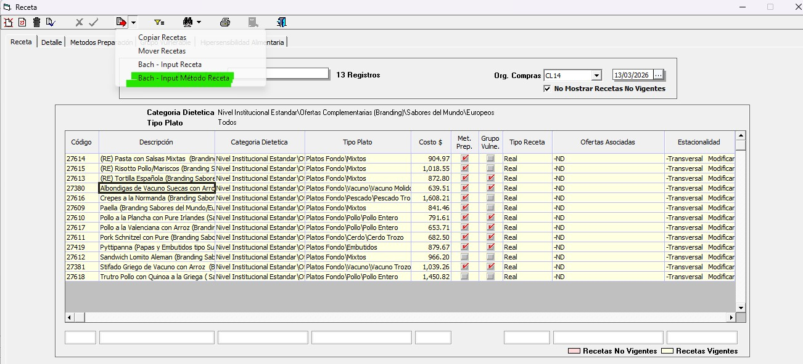

Figura 31: Batch - Input Método Receta

**Descripción General:**

Esta opción permite subir método preparación de recetas a través de un Bach – Input desde una planilla Excel.

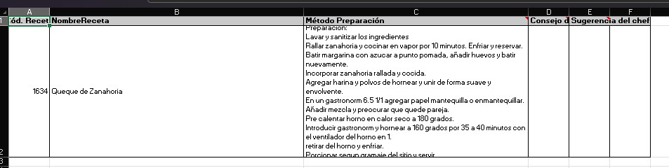

**Funcionalidades****:**

Proceso de carga masiva (batch input) de métodos de preparación para múltiples recetas desde un archivo Excel estructurado.

El archivo Excel contiene: código de receta, texto de método de preparación, consejos del chef y sugerencias de presentación.

Validación de que el código de receta exista en antes de actualizar.

Actualización campos relacionados en la receta.

Reporte de errores por registro: filas que no pudieron procesarse y motivo.

**Reglas de Negocio****:**

La carga batch solo actualiza el método de preparación. No modifica ningún otro campo de la receta (ingredientes, categoría, parámetros AMD).

Si el código de receta del Excel no existe, la fila se omite y se registra como error.

El método de preparación es texto libre sin límite de caracteres visible en la interfaz.

**Tablas Relacion****adas****:**

Tabla Receta (b_receta)

Mejoras:

Que cargue los datos que estén correcto y devolver error las líneas de receta.

### 8.5.6. Filtro recetas (B_DieTip.frm)

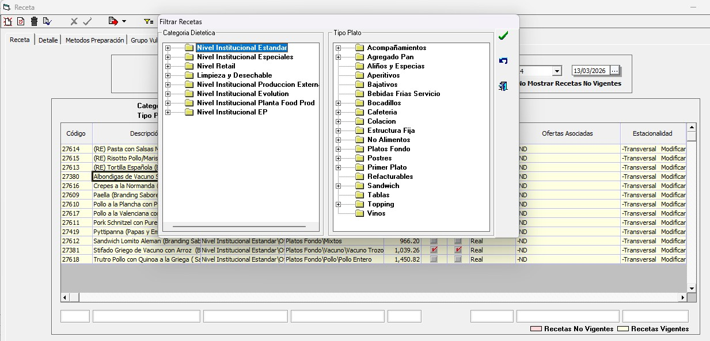

Figura 32: Filtrar Recetas

**Descripción General:**

Esta opción es permite filtrar recetas al usuario mediante la selección combinada de una **Categoría Dietética** y/o un **Tipo de Plato**, presentando ambas clasificaciones en estructuras jerárquicas de tipo árbol. Esto facilita la navegación por grandes volúmenes de información y asegura que solo se despliegue el contenido necesario en el momento en que el usuario lo requiere.

El botón  permite aplicar los filtros seleccionados a la lista de recetas.

El botón  permite limpiar la búsqueda, mostrando nuevamente todas las categorías dietéticas y tipos de plato. Una vez restablecido a la vista, se debe volver a seleccionar el botón confirmar para actualizar los resultados.

**Funcionalidades****:**

La lista con estilo jerárquico (líneas, iconos): navegación por el árbol de tipos de plato.

En la carga inicial solo se muestran los **nodos raíz activos** (los niveles principales del árbol).Cada uno aparece con un **signo “+”**, que indica que ese nodo tiene niveles inferiores, pero que aún **no se han cargado**.Los nodos hijos —también **solo los registros activos**— se cargarán cuando el usuario haga clic para desplegar ese nodo.

Cuando el usuario haga clic para desplegar el nodo, recién ahí se cargarán sus hijos reales.

Botón Confirmar: retorna código y nombre de la ventana llamante.

Botón Salir: cierra sin seleccionar.

Tecla ESC: cierra sin seleccionar.

Permite filtrar las recetas listadas ingresando parte del nombre, código u otro texto. La lista se actualiza automáticamente mostrando únicamente las recetas que coinciden con el criterio ingresado.

**Reglas de Negocio****:**

La jerarquía de tipos de plato puede tener múltiples niveles. El sistema resuelve todos los nodos bajo el nodo seleccionado recursivamente al filtrar recetas.

La selección retorna el código y nombre, que incluye todos los niveles.

Si no hay ningún tipo de plato seleccionado (árbol vacío), el botón Confirmar no hace nada.

**Tablas Relacion****adas****:**

Tabla tipo plato (a_recetatippla)

Tabla Categoria dietética (a_recetacatdie)

**Mejoras:**

Que todos los filtros sean todos complementario.

### 8.5.7. Reemplazo ingrediente receta (M_ReePro)

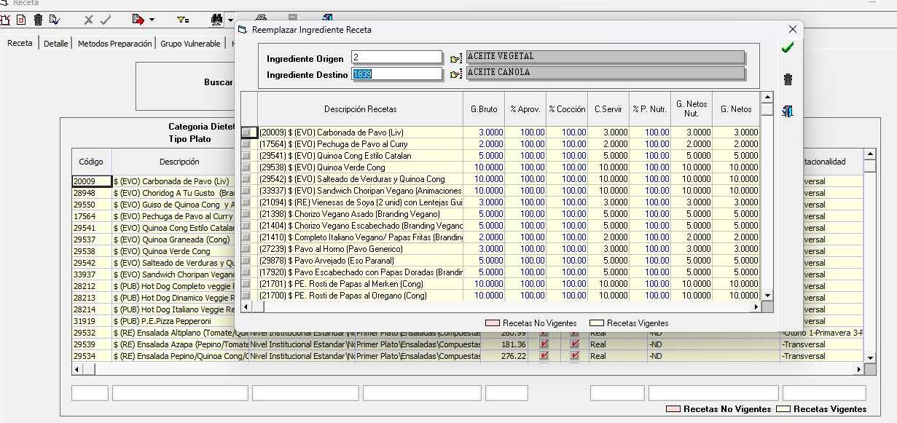

Figura 33: Reemplazar Ingrediente Receta

**Descripción General:**

Su propósito es permitir al usuario buscar un ingrediente en el recetario y realizar una de dos operaciones sobre las recetas que lo contienen:

**Reemplazar Ingrediente:** permite sustituir un ingrediente origen por uno destino en las recetas seleccionadas, conservando o modificando los porcentajes de aprovechamiento, cocción y nutrición por receta. Además, permite realizar cambios en la tabla de gramaje si el ingrediente destino ya existe en la receta.

Reemplazar % de Ingrediente: actualiza los porcentajes de aprovechamiento, cocción y nutrición de un ingrediente en todas las recetas seleccionadas, sin cambiar el ingrediente mismo.

Para realizar una operación, se debe seleccionar una o más recetas desde la grilla. Para ello, haz clic en la primera columna de cada fila que desees incluir. Es indispensable realizar esta selección antes de ejecutar cualquier operación.

El botón  permite realizar cambio seleccionado.

El botón  permite borrar ingrediente que este seleccionado en la receta, así como también eliminarlo de la tabla de gramaje.

**Funcionalidades****:**

Selector de grupo de cambio de ingrediente: lista los grupos definidos en el catálogo de cambios.

La Grilla despliega las columnas de detalle del cambio (Receta, G. Bruto, % Aprov., %Coccion, C.Servir,% P. Nutriente y G. Neto).

Barra de herramientas superior con opciones de gestión.

Permite revisar qué recetas están incluidas en cada grupo de cambio antes de ejecutar.

**Reglas de Negocio****:**

Los cambios de ingrediente se agrupan en "grupos de cambio" que pueden afectar múltiples recetas a la vez.

El cambio de ingrediente en receta es una operación de alto impacto que puede afectar costos, aportes nutricionales y tabla de gramaje activos.

Debe seleccionarse un grupo de cambio antes de visualizar o ejecutar cualquier operación.

Esta sección muestra la información relacionada con la receta seleccionada desde el menú principal.

**Tablas Relacion****adas****:**

Tabla Ingredientes (b_ingrediente)

Tabla Receta Det (b_recetadet)

Tabla Receta (b_receta)

Mejoras:

En la pantalla de reemplazo de ingrediente solo dejar la columna cantidad bruta.

### 8.5.8. Ver vinculo ingrediente & productos (M_VinPro.frm)

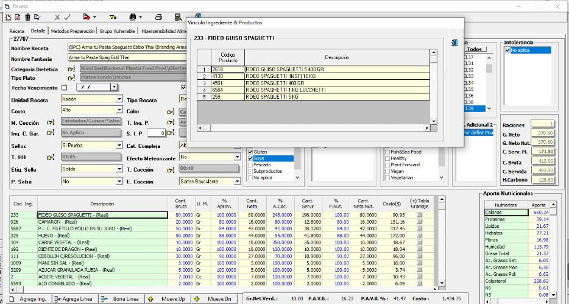

Figura 34: Ver Vinculo Ingrediente & Productos

**Descripción General:**

Esta opción permite visualizar los productos que están asociados a un ingrediente. Para que tenga efecto, primero se debe seleccionar la pestaña **Detalle de la Receta**, luego posicionarse sobre el ingrediente correspondiente y finalmente seleccionar el botón **Vínculo**.

**Funcionalidades****:**

Muestra el código y nombre del ingrediente consultado.

Muestra código de producto y nombre de producto.

Solo botón Salir: pantalla de solo lectura, sin capacidad de modificación.

**Reglas de Negocio****:**

La pantalla es de solo lectura. No permite modificar los vínculos directamente. 

Se muestran todos los productos vinculados al ingrediente, sin filtro de activo/inactivo.

**Tablas Relacion****adas**

Tabla Ingredientes (b_ingrediente)

Tabla Productos (b_productos)

Tabla Productos Ingredientes (b_productosing)

Mejoras:

Cuando un producto este desactivado que lo muestre de un color.

### 8.5.9. Impresión de nombre recetas (I_Receta.frm)

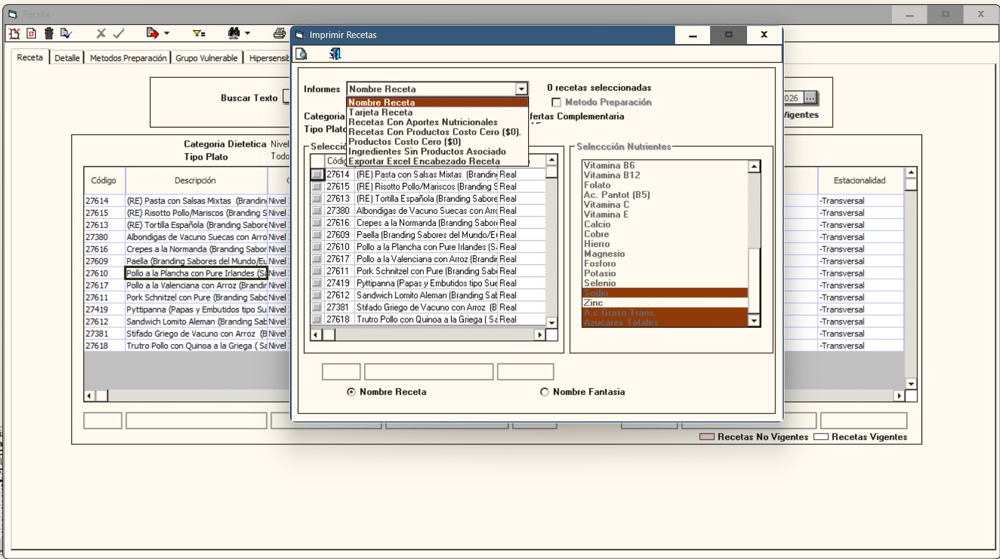

 

Figura 35: Impresión Informe Recetas

**Descripción General:**

Esta opción permite imprimir o exportar a Excel la información relacionada con las recetas. Para ello, se muestra una lista de recetas que deben ser seleccionadas haciendo clic en la primera columna, ya sea para marcar todas o elegirlas de forma individual. Además, la pantalla ofrece la posibilidad de definir si la salida del informe utilizará el Nombre de la Receta o el Nombre Fantasía.

Para el informe Tarjeta de Receta, se habilita la opción Método de Preparación; si desea que este dato aparezca en el reporte, debe activar el ítem haciendo clic sobre él.

Para el informe Receta con Aportes, se despliega la lista de nutrientes, mostrando preseleccionados los principales. Si requiere incorporar más aportes, solo debe hacer clic sobre los nutrientes adicionales para incluirlos en la impresión o exportación.

**Funcionalidades****:**

Impresión del listado de nombres de recetas: genera un reporte con código y nombre de cada receta, ordenado por categoría dietética y tipo de plato.

Filtros disponibles: categoría dietética, tipo de plato y rango de códigos de receta.

Vista previa e impresión directa del informe.

**Reglas de Negocio****:**

El informe incluye solo recetas activas por defecto.

Al realizar click en “Método Preparación” bajo cada detalle de receta se imprimirá este método.

Esta sección muestra la información relacionada con la receta seleccionada desde el menú principal.

**Tablas Relacion****adas****:**

Tabla Recetas (b_receta)

Tabla categoría dietética (a_recetacatdie)

Tabla Tipo Plato (a_recetatippla)

### 8.5.10. Informe Nombre Recetas (I_NombreRecetas)

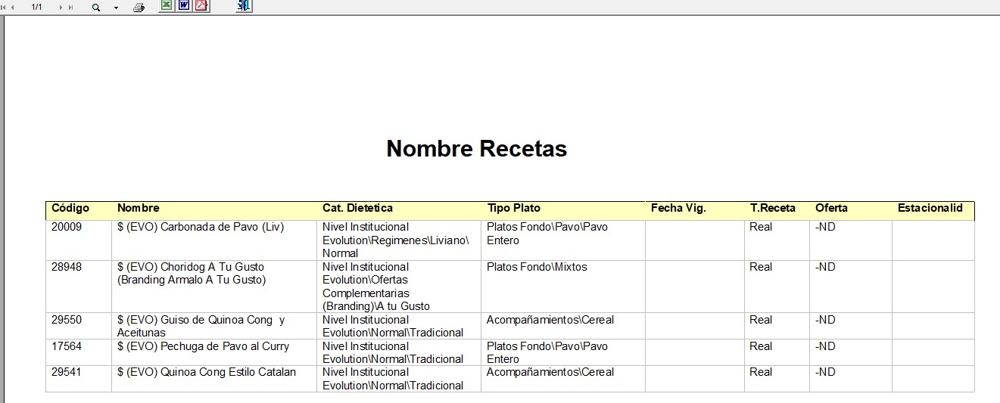

Figura 36: Informe Nombre Recetas

**Descripción:**

Esta imagen corresponde al **Informe de Nombre Recetas**, que presenta un listado detallado de las recetas registradas en el sistema. Para cada una se muestra el **Código**, **Nombre**, **Categoría Dietética**, **Tipo de Plato**, **Fecha de Vigencia**, **Tipo de Receta (****T.Receta****)**, **Oferta** y **Estacionalidad**. Este informe permite revisar y validar la clasificación y atributos principales de cada receta, siendo útil para la gestión y control del catálogo dentro del proceso de planificación de minutas.

**Funcionalidades****:**

Impresión del listado de nombres de recetas.

Impresión de la tarjeta de receta completa con ingredientes y método de preparación.

Exportación a Excel del encabezado de receta.

Exportación a Excel con aportes nutricionales.

Filtros por categoría dietética, tipo de plato y rango de códigos de receta.

**Reglas de negocio****:**

Confirmar los filtros exactos disponibles en cada reporte.

Exportación del documento en formato Excel, Word, PDF.

**Tablas relacionadas****:**

Tabla Receta (b_receta)

Tabla Receta Det (b_recetadet)

Tabla Ingrediente (b_ingrediente)

**Mejoras****:**

Eliminar columna “Estacionalidad” no se está ocupando ahora y “Tipo de Receta”, ya que siempre es real.

### 8.5.11. Informe Tarjeta Receta (I_TarjetaRecetas)

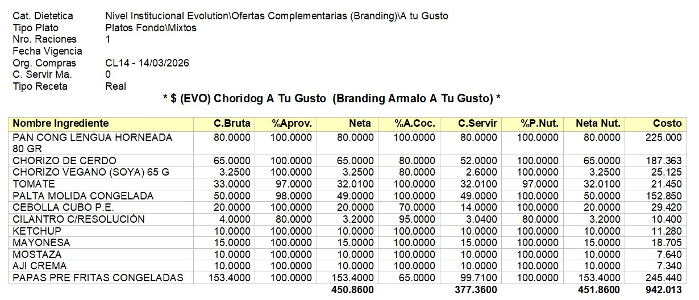

Figura 37: Informe Tarjeta Receta

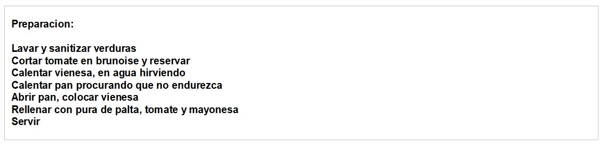

**Descripción General:**

Esta imagen corresponde a la Tarjeta de Receta, que muestra el detalle completo de una receta específica. En el encabezado se presenta la información general como Categoría Dietética, Tipo de Plato, Número de Raciones, Fecha de Vigencia, Organización de Compras, Cantidad a Servir y Tipo de Receta. En el detalle se despliega el listado de ingredientes con sus valores de Cantidad Bruta (C.Bruta), % Aprovechamiento (%Aprov.), Neta, % Cocción (%A.Coc.), Cantidad a Servir (C.Servir), % Nutricional (%P.Nut.), Neta Nutricional y Costo, finalizando con los totales consolidados de cada columna.

**Funcionalidades****:**

Impresión de la tarjeta de receta completa con ingredientes y método de preparación.

Exportación a Excel del encabezado de receta.

Exportación a Excel con aportes nutricionales.

Filtros por categoría dietética, tipo de plato y rango de códigos de receta.

**Reglas de negocio****:**

Confirmar los filtros exactos disponibles en cada reporte.

Exportación del documento en formato Excel, Word, PDF.

**Tablas relacionadas****:**

Tabla Receta (b_receta)

Tabla Receta Det (b_recetadet)

Tabla Ingrediente (b_ingrediente)

Tabla Ingrediente (b_ingrediente)

Tabla Organización de Compras (I_org_ceco)

Tabla Precio Receta (b_precio_ingrediente_receta)

**Mejoras:**

Eliminar tipo de receta, siempre es real.

### 8.5.12. Informe Excel recetas con aportes nutricionales (ExportarExcelRecetaAporte)

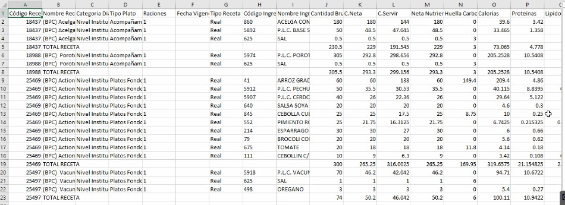

Figura 38: Informe Excel Recetas con Aportes Nutricionales

**Descripción:**

Esta pantalla corresponde al filtro de selección previo a la generación del Informe de recetas. Cuenta con dos secciones principales:

Selección de receta, donde se despliega un listado de receta con su código y descripción, permitiendo seleccionar uno o varios de ellos para incluir en el informe.

Esta imagen corresponde al **informe exportado a Excel de Recetas con Aportes Nutricionales**, que presenta el detalle completo de cada receta junto con su composición nutricional por ingrediente. Para cada registro se muestra el **Código y Nombre de la Receta**, **Categoría Dietética**, **Tipo de Plato**, **Raciones**, **Fecha**, **Tipo de Receta**, y a nivel de ingrediente el **Código**, **Nombre**, **Cantidad**, **C.Neta**, **C.Servir**, **Neta Nutricional** y **Huella de Carbono**, junto con los aportes de **Calorías**, **Proteínas**, **Lípidos**, **Hidratos**, **Fibras****, Colesterol, Sodio, Azucares, AC. Grasas Trans**. Cada receta incluye una fila de **Total Receta** que consolida los valores nutricionales de todos sus ingredientes.

Para la selección de aportes presenta los aportes nutricionales principales y con la posibilidad de poder más aportes, realizando un clic sobre cada ítem.

**Funcionalidades****:**

Exportación a Excel con aportes nutricionales.

Filtros por categoría dietética, tipo de plato y rango de códigos de receta.

**Reglas de negocio****:**

El nombre fantasía es visible solo en los informes y es utilizado en los informes de minuta.

Exportación del documento directo a formato Excel.

**Tablas relacionadas****:**

Tabla Receta (b_receta)

Tabla Receta Det (b_recetadet)

Tabla Ingrediente (b_ingrediente)

Tabla Nutriente (a_nutriente)

Tabla Aporte Nutricionales (b_productonut) 

Mejoras:

Eliminar la columna tipo de receta.

### 8.5.13. Informe Recetas Con Productos Costo Cero (I_RecetasConProdCostoCero)

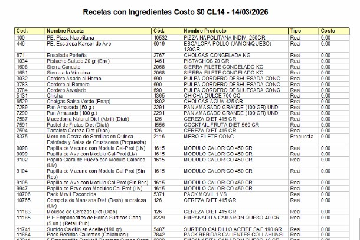

Figura 39: Informe Recetas Con Ingredientes Costo Cero

**Descripción General:**

Este informe denominado **"Recetas con ****Precio**** Costo $0"** muestra el listado de recetas cuyos productos tienen un **costo igual a cero**, lo que indica que dichos productos no tienen un precio asignado en la organización de compras a la fecha indicada.

Sus columnas principales son:

**Cód. / Nombre Receta:** identificador y nombre de la receta.

**Cód. / Nombre Producto:** código e identificador del producto.

**Tipo:** indica si el costo es de tipo **Real** o **Propuesta**.

**Costo:** valor en cero para todos los registros listados.

Este reporte es útil para **identificar y gestionar** aquellos productos que requieren actualización de precios en el sistema de compras, ya que al no tener costo asignado afectan el cálculo correcto del costo total de las recetas.

**Funcionalidades****:**

Lista las recetas que contienen al menos un precio con precio vigente igual a cero.

Para cada receta afectada muestra: código receta, nombre receta, código producto, nombre producto y precio vigente (= 0).

Permite al equipo de costos identificar y corregir productos sin precio.

**Reglas de Negocio****:**

Un producto con precio cero genera un costo de receta subestimado.

Exportación del documento en formato Excel, Word, PDF.

**Tablas Relacion****adas**

Tabla Receta (b_receta)

Tabla Receta Det (b_recetadet)

Tabla Ingrediente (b_ingrediente)

### 8.5.14. Informe Productos Costo Cero (I_ProductosCostoCero)

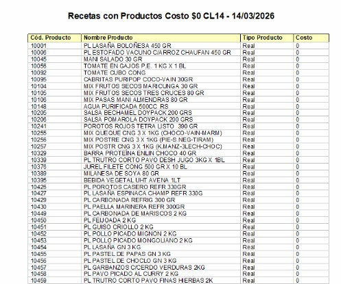

Figura 40: Informe Productos Costo Cero

**Descrip****ción General:**

Este reporte permite visualizar los productos que tienen costo cero dentro de las recetas, mostrando en pantalla el **código del producto**, el **nombre del producto**, el **tipo de producto** y su **costo**.

**Funcionalidades****:**

Lista los productos cuyo precio vigente es cero en la jerarquía de precios activa.

Columnas: código producto, nombre producto, tipo producto, costo.

**Reglas de Negocio****:**

Un producto aparece en este informe si y solo si su precio vigente evaluado mediante la jerarquía completa resulta en cero.

Exportación del documento en formato Excel, Word, PDF.

**Tablas Relacion****adas****:**

Tabla Producto (b_productos)

Tabla Ingrediente (b_ingrediente)

Tabla Producto Ingrediente (b_productosing)

Tabla Receta (b_receta)

Tabla Detalle Receta (B_recetadet)

Tabla Org. Compras (I_ORG_CECO)

Tabla Precio Ingrediente Receta (b_precio_ingrediente_receta)

Tabla Formato Compras SAP (b_formatocompras_sap)

Mejora:

Sacar la columna tipo receta.

### 8.5.15. Recetas Con Ingredientes Sin Productos Asociados (I_IngredienteSinProductos)

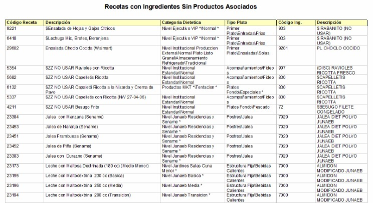

Figura 41: Informe Recetas Con Ingrediente Sin Productos Asociados

**Descripción General:**

Esta imagen corresponde al informe **Recetas con Ingredientes Sin Productos Asociados**, que identifica aquellas recetas que contienen ingredientes que no tienen un producto vinculado en el sistema. Para cada registro se muestra el **Código y Descripción de la Receta**, **Categoría Dietética**, **Tipo de Plato**, **Código de Ingrediente** y **Descripción del Ingrediente** sin asociación.

Este informe es una herramienta de control que permite detectar y corregir inconsistencias en la asociación entre ingredientes SGP y productos.

**Funcionalidades****:**

Lista las recetas que tienen uno o más ingredientes sin ningún producto asociado.

Para cada receta afectada muestra: código receta, nombre receta, código ingrediente sin asociación, nombre ingrediente.

Permite al equipo de compras identificar los ingredientes que deben vincularse a un producto antes de la generación del pedido.

**Reglas de Negocio****:**

El informe incluye solo recetas activas según el filtro o todas las recetas del catálogo, según filtro.

Un ingrediente sin producto asociado no puede generar ítem en el pedido centralizado. Este informe es el mecanismo de detección de esa inconsistencia.

Exportación del documento en formato Excel, Word, PDF.

**Tablas Relacion****adas**

Tabla Receta (b_receta)

Tabla Receta Det (b_recetadet)

Tabla Ingrediente (b_ingrediente)

Tabla Productos ing (b_productosing)

Tabla Producto (b_productos)

### 8.5.16. Informe Exportar Excel Encabezado Receta (ExportarExcelEncabezadoReceta)

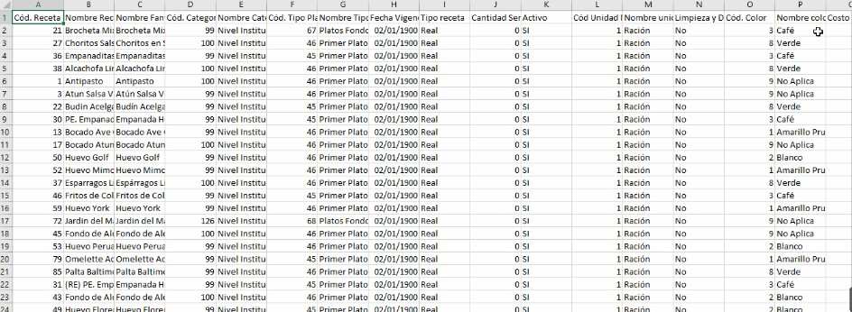

Figura 42: Informe Exportar Excel Encabezado Recetas

**Descri****pción General:**

Esta imagen corresponde al **informe exportado a Excel del encabezado de Recetas**, que presenta un listado completo de las recetas registradas en el sistema con sus atributos principales. Para cada receta se muestra el **Código**, **Nombre**, **Nombre Fantasía**, **Código y Nombre de Categoría Dietética**, **Código y Nombre de Tipo de Plato**, **Fecha de Vigencia**, **Tipo de Receta**, **Cantidad a Servir**, **Activo**, **Código Unidad**, **Nombre Unidad**, indicador de **Limpieza y Desechables**, **Color** asociado y otros campos del encabezado receta (Todos los parámetros asignados a las recetas). Este informe permite realizar un análisis completo del catálogo de recetas y sus clasificaciones, siendo útil para revisiones masivas y control de la información maestra del sistema.

**Funcionalidades****:**

Exportación a Excel del encabezado de receta: código, nombre, nombre fantasía, categoría dietética, tipo de plato, base de ración, fecha de vigencia y parámetros AMD principales.

No incluye el detalle de ingredientes (ese es el alcance de ExportarExcelRecetaAporte).

Utilizado para validación masiva del catálogo de recetas.

Filtros por categoría dietética, tipo de plato, estado activo y rango de códigos.

Incluye todos los parámetros AMD.

**Reglas de Negocio****:**

Exportación del documento directo a formato Excel.

**Tablas Relacion****adas:**

Tabla Receta (b_receta)

Tabla Categoría Dietética(a_recetacatdie)

Tabla Tipo Plato (a_recetatippla)

Tabla Unidad Medida (b_UnidadReceta)

Tabla Costo Receta (a_costoreceta)

Tabla Método Cocción (a_metodococcionreceta)

Tabla Ing. Cruce Garnitura (a_ingredientecrucegarniturareceta)

Tabla Sello (a_sellosreceta)

Tabla Tiempo HH (a_tiempohhreceta)

Tabla Etiquetado Sello (a_etiquetadoselloreceta)

Tabla Parámetro Salsa (a_parametrosalsa)

Tabla Color (a_color)

Tabla Tipo Ing. Principal (a_tipoingredienteprincipalreceta)

Tabla Tipo Ing. Secundario (a_tipoingredienteprincipalreceta)

Tabla Categorización Compleja Receta (a_categorizacioncomplejareceta)

Tabla Efecto Meteorizante (a_efectometeorizantereceta)

Tabla Tiempo Cocción Receta (a_tiempococcionreceta)

Tabla Equipamiento Cocción (a_equipamientococcion)

Tabla Ingrediente (b_ingrediente)

Tabla Unidad Medida (a_unidadme)

Tabla Nutrientes (a_nutriente)

Tabla Aportes Nutricionales (b_productonut)

Tabla Estacionalidad (a_estacionalidadreceta)

Tabla Ofertas (b_ofertas)

Tabla Tipo Negocio (a_tiponegocioreceta)

Tabla Intolerancia (a_intoleranciareceta)

Tabla Alergeno (a_alergeno)

Tabla Estilo Alimentacion (a_estiloalimentacion)

Tabla Parametro Adicional1 (a_Parametroadicional1)

Tabla Parametro Adicional2 (a_Parametroadicional2)

Tabla Oferta Receta (b_receta_Oferta)

Tabla Estacionalidad Receta (b_recetaestacionalidad)

Tabla Tipo Negocio Receta (b_recetatiponegocio)

Tabla Zona Receta (b_recetazona)

Tabla Intolerancia receta (b_recetaintolerancia)

Tabla alergeno receta (b_recetaalergeno)

Tabla Estilo alimentación receta (b_recetaestiloalimentacion)

Tabla parámetro adicional 1 receta (b_recetaparametroadicional1)

Tabla parámetro adicional 1 receta (b_recetaparametroadicional2)

**Mejoras:**

Recetas con varias asignaciones se deben presentar en el informe separadas por columnas y no por un “-“.

## 8.6. Tabla de Gramaje x Ceco y por Nivel (M_TabGra.frm)

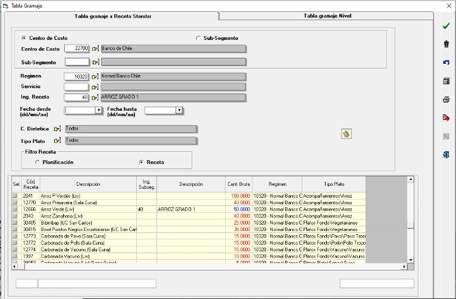

Figura 43: Tabla Gramaje x Receta Estándar

**Descripción General:**

Este mantenedor de la tabla de gramaje permite agregar, modificar, eliminar e imprimir registros asociados. Además, ofrece la opción de copiar el gramaje desde un sitio de origen hacia un sitio destino, y en caso de que existan datos previos en el sitio de destino, estos son eliminados y reemplazados por la información del origen. A través de este módulo se registra un ingrediente como gramaje bruto asociado a una receta, incluso cuando dicha receta es distinta de la receta patrón definida en el mantenedor de recetas, permitiendo así gestionar variaciones específicas según cada sitio o preparación.

**Funcionalidades****:**

Existen gramajes estándar y gramajes negociados por cliente

Consulta de la jerarquía de 4 niveles para una combinación ceco + receta + ingrediente.

Alta de nivel 1 (ceco + ingrediente): genera registro en b_tablagramaje_nivel con nivel = 1.

Alta de nivel 2 (ceco + ingrediente + régimen): genera registro en b_tablagramaje_nivel con nivel = 2.

Alta de nivel 3 (ceco + ingrediente + régimen + tipo de plato): genera registro en b_tablagramaje_nivel con nivel = 3.

Modificación de cualquier nivel: actualiza tabla gramaje nivel para la combinación de claves correspondiente.

Eliminación de registro de nivel: borra el registro de tabla gramaje nivel del nivel seleccionado.

Log de cambios exportable Excel desde la tabla gramaje nivel.

Copiar tabla de gramaje de un centro costo a otro.

Permite filtrar información ingresando parte del nombre, código u otro texto. La lista se actualiza automáticamente mostrando únicamente la información que coinciden con el criterio ingresado.

**Reglas de Negocio****:**

El nivel de gramaje de mayor prioridad aplicado es el más específico disponible para la combinación solicitada. La jerarquía se resuelve: nivel 3 > nivel 2 > nivel 1 > receta estándar.

Las modificaciones a la tabla de gramaje se registran en log para trazabilidad.

Los gramajes estándar puedes modificarse según contrato con el cliente.

**Tablas Relacion****adas:**

Tabla Gramaje Ceco (b_tablagramajececo)

Tabla Gramaje Ceco Nivel (b_tablagramajececo_nivel)

Tabla Receta (b_receta)

Tabla Receta Det (b_recetadet)

Tabla Tipo Plato (a_recetatippla)

Tabla Categoría Dietética (a_recetacatdie)

Tabla Clientes (b_clientes)

Tabla Regimen (a_regimen)

Tabla Ingrediente (b_ingrediente)

Mejoras:

No considerar el concepto se sub-segmento.

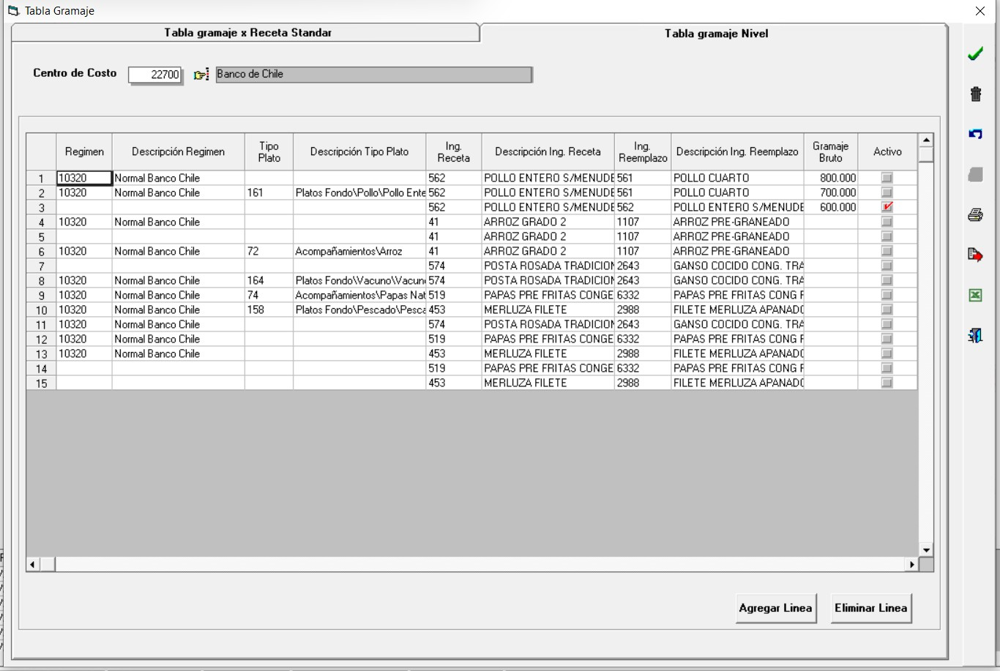

**Descripción:**

Pantalla para definir y mantener las cantidades ajustadas de ingredientes por régimen alimentario, sitio (Centro Costo) y tipo de plato. La tabla de gramaje permite que el mismo ingrediente tenga cantidades diferentes y ingrediente según el contexto operativo del casino, sin modificar la receta original. El sistema resuelve la jerarquía de 4 niveles en tiempo real al calcular los pedidos y aportes nutricionales.

Este mantenedor de la tabla de gramaje permite agregar, modificar, eliminar e imprimir registros asociados. Además, ofrece la opción de copiar el gramaje desde un sitio de origen hacia un sitio destino, y en caso de que existan datos previos en el sitio de destino, estos son eliminados y reemplazados por la información del origen. A través de este módulo se registra un ingrediente como gramaje bruto asociado a una receta, incluso cuando dicha receta es distinta de la receta patrón definida en el mantenedor de recetas, permitiendo así gestionar variaciones específicas según cada sitio o preparación.

**Funcionalidad:**

Consulta de la tabla de gramaje aplicable para una combinación de centro costo y receta, respetando la jerarquía de 4 niveles.

Visualización del nivel de jerarquía aplicado para cada ingrediente (estándar, centro costo, centro costo+régimen o centro costo+régimen+tipo de plato).

Exportación de la tabla de gramaje en formato bach input, permite descargar la configuración en Excel para editarla y luego cargarla masivamente.

**Jerarquía de 4 niveles (de mayor a menor prioridad):**

| Nivel | Combinación de claves | Tabla |
| --- | --- | --- |
| Nivel 4 (máxima prioridad) | ceco  + ingrediente + régimen + tipo de plato | b_tablagramaje_nivel  (nivel 3) |
| Nivel 3 | ceco  + ingrediente + régimen | b_tablagramaje_nivel  (nivel 2) |
| Nivel 2 | ceco  + ingrediente | b_tablagramaje_nivel  (nivel 1) |
| Nivel 1 (mínima prioridad) | gramaje estándar de la receta | b_tablagramaje Ceco |

**Reglas de Negocio:**

El sistema aplica la jerarquía de 4 niveles de arriba hacia abajo: usa el primer nivel (de mayor prioridad) en el que encuentra una configuración para la combinación solicitada. Si no existe en ningún nivel, usa la cantidad bruta original del ingrediente en la receta.

**Tabla Relacionada:**

Tabla gramaje x Ceco (b_tablagramajececo)

Tabla gramaje x nivel (b_tablagramajececo_nivel)

Tabla Ingrediente (b_ingrediente)

Tabla Regimen (a_regimen)

Tabla Clientes (b_clientes)

Tabla Tipo Plato (a_recetatippla)

**Mejoras:**

Se desea implementar un workflow de autorización para modificaciones de tabla de gramaje: el sitio solicita el cambio → un nivel jerárquico superior (n+1) lo autoriza → planificación ejecuta. La primera configuración de gramaje no requiere autorización; solo las modificaciones posteriores. El sistema debe registrar solicitante, autorizador y fecha.

**Imprimir T****abla Gramaje**** (****I_TabGra.frm****)**

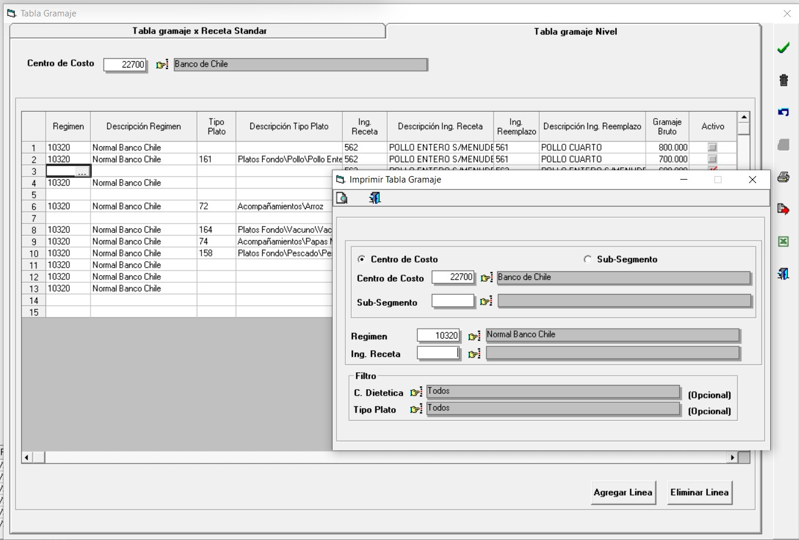

**Descripción General:**

Este módulo permite imprimir datos de la tabla de gramaje estándar y x nivel si el sitio tienes datos en ambos. Para ello, se debe seleccionar el **Centro de Costo** y el **Régimen** correspondiente. Cabe mencionar que la opción **Sub-Segmento** no se considera, ya que actualmente no se encuentra en uso. Además, cuenta con filtros opcionales de **Categoría Dietética** y **Tipo de Plato**.

**Funcionalidades****:**

Generación del informe impreso de la tabla de gramaje por centro costo y receta.

Muestra para cada receta y centro costo los valores de gramaje por ingrediente en cada nivel (estándar, nivel 1, nivel 2, nivel 3).

Filtros: centro costo, régimen, categoría dietética y tipo de plato.

Vista previa e impresión directa.

**Reglas de Negocio****:**

El informe muestra el valor de gramaje aplicado (el nivel de mayor prioridad) y el nivel del que proviene, para cada ingrediente de cada receta.

No considerar tema sub-segmento.

**Tablas Relacion****adas****:**

Tabla Tipo Plato (a_recetatippla)

Tabla Categoria Dietetica (a_recetacatdie)

Tabla Centro Costo (b_clientes)

Tabla Regimen (a_regimen)

Tabla Ingrediente (b_ingrediente)

**Informe ****tabla de gramaje**** receta ****estándar**** (****ImprimirTablaGrameCecoExcel****)**

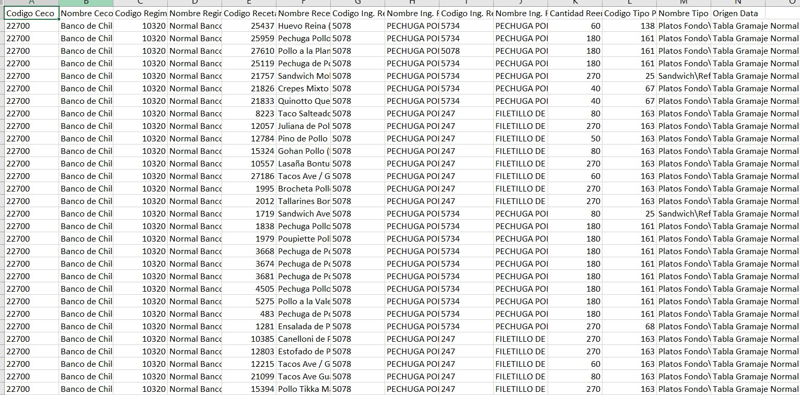

**Descripción General:**

Este archivo Excel muestra el formato de la tabla de gramaje de la receta estándar. Incluye las siguientes columnas:

Centro de costo

Descripción del centro de costo

Régimen

Descripción del régimen

Receta

Descripción de la receta

Ingrediente

Descripción del ingrediente

Ingrediente para reemplazar

Descripción del ingrediente a reemplazar

Cantidad para reemplazar

Tipo de plato

Descripción del tipo de plato

Origen de los datos

**Funcionalidades****:**

Exportación a Excel de la tabla de gramaje estándar, para todas las recetas del centro costo y regimen seleccionado.

Una fila por ingrediente por receta, con columnas: código receta, nombre receta, código ingrediente, nombre ingrediente, cantidad bruta estándar, % aprovechamiento, cantidad neta.

Filtros por centro costo y categoría dietética.

**Reglas de negocio****:**

El Excel exportado muestra el gramaje estándar (nivel base de la receta). No incluye las personalizaciones por centro costo de los niveles 1-3.

Este informe sirve como plantilla de referencia para configurar manualmente las personalizaciones de gramaje de un sitio nuevo.

Exportación del documento directo a formato Excel.

**Tablas relacionadas****:**

Tabla Gramaje Centro Costo (b_tablagramajececo)

Tabla receta (b_receta)

Tabla Ingrediente (b_ingrediente)

Tabla Centro Costo (b_clientes)

Tabla Regimen (a_regimen)

Tabla Encabezado Receta (b_receta)

Tabla Detalle Receta (b_recetadet)

Tabla Ingrediente (b_ingrediente)

Tabla Tipo Plato (a_recetatippla)

**Exportaci****ón ****E****xcel ****tabla gramaje x nivel**** (****ImprimirTablaGrameCecoExcel****)**

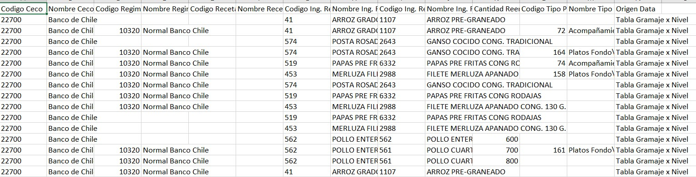

Figura 44: Exportación Excel Tabla Gramaje x Nivel

**Descripción General:**

Este archivo Excel muestra el formato de la tabla de gramaje x nivel. Incluye las siguientes columnas:

Centro de costo

Descripción del centro de costo

Régimen

Descripción del régimen

Ingrediente

Descripción del ingrediente

Ingrediente para reemplazar

Descripción del ingrediente a reemplazar

Cantidad para reemplazar

Tipo de plato

Descripción del tipo de plato

Origen de los datos

**Funcionalidades****:**

Exportación a Excel de los gramajes personalizados de tabla gramaje nivel con su jerarquía de nivel (1, 2 o 3) para análisis completo del centro costo.

Incluye columnas adicionales respecto al formato estándar: nivel aplicado, régimen (nivel 2 y 3) y tipo de plato (nivel 3).

Permite al equipo verificar qué personalizaciones existen en cada centro costo y en qué nivel están configuradas.

**Reglas de negocio****:**

El Excel x nivel muestra solo los ingredientes cuyo gramaje difiere del gramaje estándar de la receta.

Exportación del documento directo a formato Excel.

**Tablas relacionadas****:**

Tabla Receta Det (b_recetadet)

Tabla Gramaje Nivel (b_tablagramaje_nivel)

Tabla receta (b_receta)

Tabla Ingrediente (b_ingrediente)

Tabla Regimen (a_regimen)

Tabla Tipo Plato (a_recetatippla)

**Copiar ****tabla de gramaje**** ****receta ****estándar y por nivel ****(****M_CpTabGra.frm****)****:**

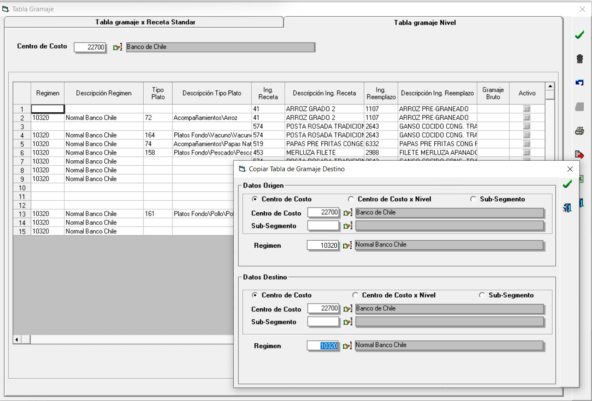

Figura 45: Copia Tabla de Gramaje

**Descripción General:**

Esta opción permite copiar información desde un sitio de origen hacia un sitio destino; en caso de existir datos previamente registrados en el sitio destino, estos son eliminados y reemplazados por los del origen. Adicionalmente, el módulo incorpora la funcionalidad de registrar un log de eventos, lo que permite llevar un seguimiento de las acciones realizadas y facilita la trazabilidad dentro del sistema.

A diferencia de la modalidad estándar, **no considera el concepto de receta**; al realizar una búsqueda, asocia el gramaje de acuerdo con lo parametrizado para cualquier receta vinculada al centro de costo, permitiendo registrar tres niveles de búsqueda:

**Primer nivel:** Centro de costo, ingrediente, régimen y tipo de plato.

**Segundo nivel:** Centro de costo, ingrediente y régimen.

**Tercer nivel:** Centro de costo e ingrediente.

Cuando existe información registrada en este mantenedor, el sistema aplica las siguientes condiciones de prioridad para el cálculo de la receta, tanto para costos, aportes nutricionales, carro de compras.

**Funcionalidades****:**

Opciones de tipo de destino:

"Centro de Costo": copia solo el nivel 1 de la tabla gramaje nivel.

"Centro de Costo x Nivel": copia todos los niveles disponibles (1, 2 y 3).

Campo de texto para ingresar el código del centro costo, régimen destino como origen.

Confirmación al usuario antes de ejecutar la operación.

**Reglas de negocio****:**

La copia puede hacerse a nivel "Centro de Costo", "Centro de Costo x Nivel".

Si el centro costo destino ya tiene configuración de gramaje, se debe confirmar si se sobrescribe o se mantiene la existente.

El código de destino es obligatorio. Si no se ingresa, el sistema no procede a realizar la copia.

**Tablas relacionadas****:**

Tabla Gramaje Nivel (b_tablagramaje_nivel)

Tabla Gramaje Centro Costo (b_tablagramajececo)

Tabla Regimen (a_regimen)

Tabla Centro Costo (b_clientes)

Mejoras:

No considerar el tema sub-segmento.

## 8.7. Borrado Masivo de Minutas (M_BorrarCecoMasivo.frm)

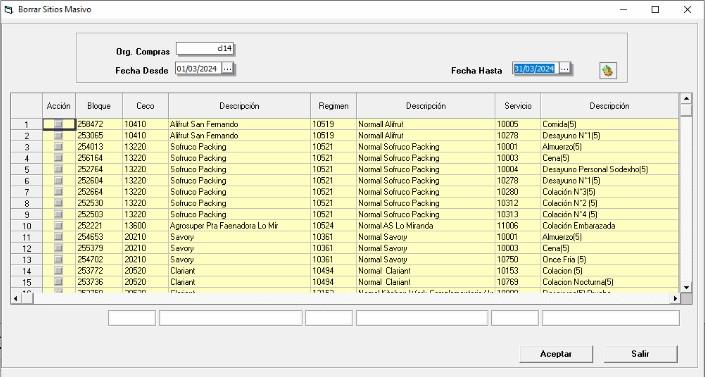

Figura 46: Borrar Sitios Masivos

**Descripción:**

Esta opción permite borrar sitios o servicios de manera masiva según una organización y un rango de fechas definido, seleccionando específicamente los elementos que se desean eliminar. Antes de realizar el borrado físico de la minuta, el sistema guarda toda la información en una tabla de respaldo, de modo que, en caso de cometer algún error o necesitar recuperar los datos, sea posible restaurarlos sin pérdida de información. 

**Funcionalidad:**

Selección de uno o varios centros costo y período a eliminar.

Mensaje de confirmación antes de ejecutar el borrado.

Permite filtrar información ingresando parte del nombre, código u otro texto. La lista se actualiza automáticamente mostrando únicamente la información que coinciden con el criterio ingresado.

**Reglas de Negocio:**

El sistema solicita confirmación explícita antes de ejecutar el borrado masivo.

Las minutas son borradas físicamente, dejando una copia de seguridad en tablas de paso de las minutas.

**Tablas Relacionadas:**

Tabla Minuta Encabezado (cas_b_minuta)

Tabla Minuta Detalle (cas_b_minutadet)

Tabla Minuta Bloque (cas_b_minutabloque)

Tabla Minuta Grupo Estructura (cas_b_minutagrupoestructura)

Tabla Minuta Encabezado Backup (cas_b_minuta_eliminada)

Tabla Minuta Detalle Backup (cas_b_minutadet_eliminada)

Tabla Minuta Bloque Backup (cas_b_minutabloque_elimianda)

Tabla Minuta Grupo Estructura Backup (cas_b_minutagrupoestructura_eliminada)

Tabla Centro Costo (b_clientes)

Tabla Regimen (a_regimen)

Tabla Servicio (a_servicio)

Tabla Organización Compras (i_org_ceco)

Mejora:

**A**gregar opción de restaurar/recuperar una minuta borrada (papelera de reciclaje o tabla de respaldo).

Permita borrar minutas tramos de fechas.

## 8.8. Copiar Minuta Líder a Seguidores (M_Copia_Minuta_Lideres.frm)

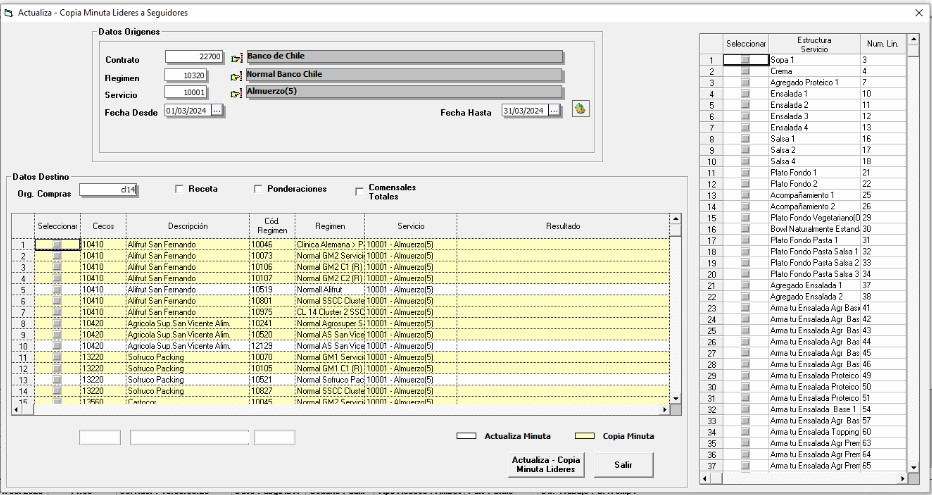

Figura 47: Actualiza Copia Minuta Lideres a Seguidores

**Descripción:**

Este módulo permite copiar una minuta y actualizarla desde un líder hacia varios sitios seguidores siempre que todos compartan la misma estructura de plantilla. Para ello, el sistema permite seleccionar la estructura correspondiente del sitio de origen y definir qué elementos se copiarán, incluyendo recetas, ponderaciones y la cantidad total de comensales. Con esta funcionalidad se facilita la replicación y estandarización de minutas en múltiples sitios de manera eficiente y coherente.

**Funcionalidad:**

Selección del casino líder, período y lista de seguidores; propagación masiva de la minuta del líder a todos sus seguidores.

Permite filtrar información ingresando parte del nombre, código u otro texto. La lista se actualiza automáticamente mostrando únicamente la información que coinciden con el criterio ingresado.

**Reglas de Negocio:**

La relación líder-seguidor se configura en una tabla de relación (a identificar). La copia solo puede ejecutarse desde un casino líder hacia sus seguidores designados.

Los seguidores pueden modificar localmente su minuta (cambio de receta, raciones).

Si los **centros de costo aparecen en color blanco**, el sistema **actualizará la minuta** existente en el seguidor.

Si el **sitio aparece en color amarillo** en la grilla, significa que **no existe en el seguidor**, por lo que el sistema **copiará la información desde el líder hacia los seguidores**.

La minuta origen debe estar en estado "En elaboración" o "Aprobada" para poder copiarse.

**Tablas Relacionadas:**

Tabla Minuta Encabezado (cas_b_minuta)

Tabla Minuta Detalle (cas_b_minutadet)

Tabla Minuta Bloque (cas_b_minutabloque)

Tabla Minuta Grupo Estructura (cas_b_minutagrupoestructura)

Tabla Regimen (a_regimen)

Tabla Servicio (a_servicio)

Tabla Centro Costo (b_clientes)

Tabla Estructura Servicio (a_estservicio)

**Mejora:**

Esta opción debe permitir copiar recetas y/o ponderaciones y/o comensales totales, es decir, 1 de las 3 opciones, 2 de 3 o todas. Debe existir un input del periodo a seleccionar.

Permita copiar de un servicio a otros por estructura independiente del orden de la estructura.

## 8.9. Copiar Minuta Bloque Estándar (M_Copia_MinutaBloqueEstandar.frm)

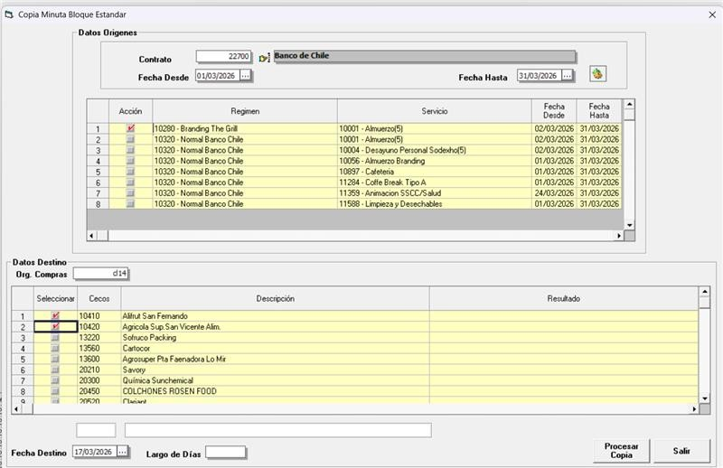

Figura 48: Copia Minuta Bloque Estándar

**Descripción:**

Este mantenedor permite copiar una minuta bloque desde un sitio de origen hacia varios sitios destino, definiendo como parámetros de origen el sitio, el servicio origen y el periodo comprendido entre una fecha desde y una fecha hasta. Para el destino se debe seleccionar la organización de compras, la fecha destino, el largo de días que se desea copiar y los servicios que serán incluidos en la copia. Si en alguno de los sitios destino ya existe una minuta correspondiente al periodo que se pretende copiar, el sistema bloquea la operación y registra en la columna de Resultado la observación “minuta existe”. Los días por copiar se calculan tomando como referencia la fecha destino más el largo de días seleccionado, y este rango debe coincidir con las fechas definidas en el periodo de origen para que la copia pueda ejecutarse correctamente.

**Funcionalidades:**

Selección de la minuta bloque estándar origen.

Selección de período y servicio de destino.

Selección de centro costos destino donde se copiará la minuta.

Opciones de copia: con o sin recetas ya asignadas en los destinos.

Ejecución de la copia con confirmación previa.

Permite filtrar información ingresando parte del nombre, código u otro texto. La lista se actualiza automáticamente mostrando únicamente la información que coinciden con el criterio ingresado.

**Reglas de Negocio:**

La minuta bloque estándar es el template central de planificación. Su copia a centros de costo específicos inicia la personalización para cada sitio.

La copia respeta los parámetros de régimen y servicio del centro costo destino.

No permite copiar una minuta cuyo periodo ya existe en el origen. El sistema mostrará en cada fila de la grilla el resultado de la copia mediante un mensaje.

**Tabla Relacionada:**

Tabla Minuta Encabezado (cas_b_minuta)

Tabla Minuta Detalle (cas_b_minutadet)

Tabla Regimen (a_regimen)

Tabla Servicio (a_servicio)

Tabla Centro Costo (b_clientes)

Tabla Minuta Bloque (cas_b_minutabloque)

Tabla Minuta Grupo Estructura (cas_b_minutagrupoestructura)

## 8.10. Copiar Minuta Bloque x CECO (M_Copia_MinutaBloqueCeco.frm)

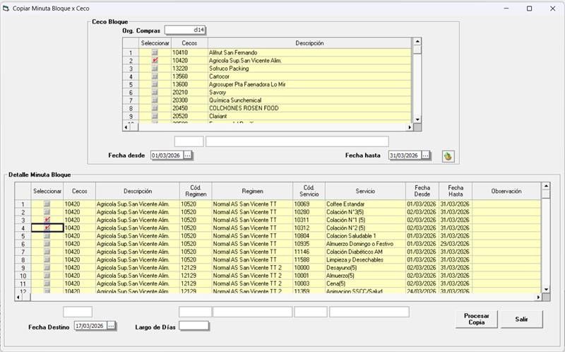

Figura 49: Copiar Minuta Bloque x Ceco

**Descripción General:**

Para realizar la copia por centro de costo, se debe seleccionar la organización de compras y definir el periodo mediante las fechas desde y hasta; para visualizar la minuta real es necesario seleccionar el contrato, el régimen, el servicio y el periodo correspondiente. En el detalle se mostrarán los sitios disponibles para copiar, y en esta etapa se debe indicar la fecha destino junto con el largo de días que se desea copiar. Si en alguno de los sitios destino ya existe una minuta para el periodo seleccionado, el sistema no permite efectuar la copia y registra en la columna Observación la leyenda “minuta existe”, evitando así duplicidades y asegurando la integridad de la información.

**Funcionalidades:**

Selección del centro costo origen de la minuta a copiar.

Selección del período y régimen del origen.

Confirmación antes de ejecutar.

Permite filtrar información ingresando parte del nombre, código u otro texto. La lista se actualiza automáticamente mostrando únicamente la información que coinciden con el criterio ingresado.

**Reglas de Negocio:**

La copia de minuta bloque x centro costo la minuta integra.

No permite copiar una minuta cuyo periodo ya existe en el origen. El sistema mostrará en cada fila de la grilla el resultado de la copia mediante un mensaje.

**Tablas relacionadas:**

Tabla Minuta Encabezado (cas_b_minuta)

Tabla Minuta Detalle (cas_b_minutadet)

Tabla Regimen (a_regimen)

Tabla Servicio (a_servicio)

Tabla Centro Costo (b_clientes)

Tabla Minuta Bloque (cas_b_minutabloque)

## 8.11. Minuta Bloque Costo Bandeja x Servicio (M_MBloqueCostoBandejaxServicios.frm)

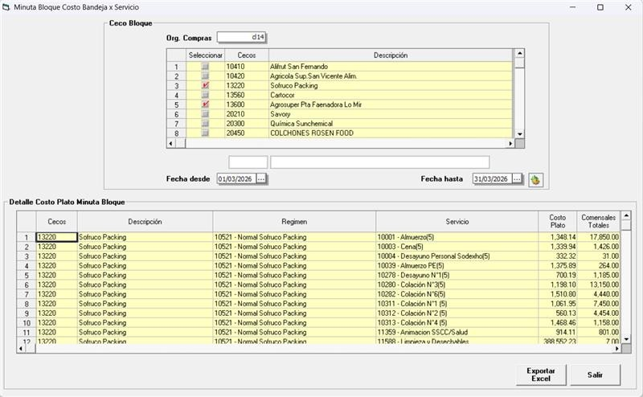

Figura 50: Minuta Bloque Costo Bandeja x Servicio

**Descripción:**

Esta opción permite visualizar el costo de la minuta bloque por servicio, para lo cual es necesario seleccionar la organización de compras y definir un periodo mediante las fechas desde y hasta. Una vez realizado este filtro, el sistema despliega los contratos disponibles y permite seleccionar aquellos que se desean consultar. Como resultado, se presenta el detalle de los costos correspondiente a cada sitio, incluyendo información sobre régimen, servicio, costo por plato y el total de comensales, además de ofrecer la opción de exportar esta información a Excel. Para obtener un análisis más específico relacionado con costos y gramajes, se recomienda revisar la sección de Cálculo de Costo y la Tabla de Gramaje, donde se profundiza en estos elementos.

**Funcionalidades****:**

Selección de centro costo y período de trabajo.

Visualización costo de bandeja por servicio.

Visualización del costo actual en la grilla x centro costo.

Permite filtrar información ingresando parte del nombre, código u otro texto. La lista se actualiza automáticamente mostrando únicamente la información que coinciden con el criterio ingresado.

**Reglas de Negocio****:**

El costo de bandeja objetivo es el parámetro presupuestario por servicio que la minuta debe respetar.

La comparación costo real vs. objetivo es un indicador clave en el proceso de aprobación de la minuta.

El costo se calcula aplicando la tabla de gramaje definida para cada sitio.

**Tabla Relacionadas:**

Tabla Minuta Encabezado (cas_b_minuta)

Tabla Minuta Detalle (cas_b_minutadet)

Tabla Receta Encabezado (b_receta)

Tabla Receta Detalle (b_recetadet)

Tabla Regimen (a_regimen)

Tabla Servicio (a_servicio)

Tabla Organización Compras (i_org_ceco)

Tabla Precio Ingrediente (b_precio_ingrediente)

Tabla Ingrediente (b_ingrediente)

Tabla Producto (b_productos)

Tabla Productos & Ingrediente (b_productoing)

Tabla Gramaje Ceco (b_tablaGramajeCeco)

Tabla Gramaje x Nivel (b_tablaGramajeCeco_Nivel)

Tabla Pedido Excepción Formato Comprsa (b_pedido_excepcionformatocompra)

Tabla Formato compras SAP & Producto (b_formatocompras_sap_sgp)

Tabla Formato compras SAP (b_formatocompras_sap)

## 8.12. Minuta Bloque (M_MinSR1.frm)

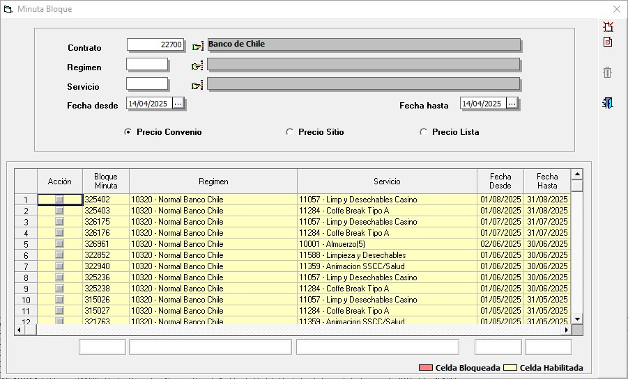

Figura 51: Minuta Bloque

### 8.12.1. Detalle minuta bloque (M_MinSR2.frm)

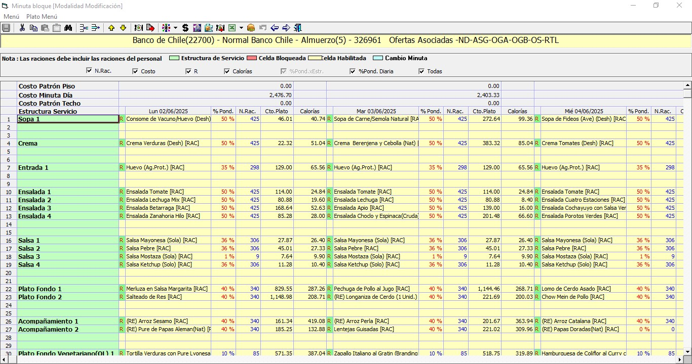

Figura 52: Minuta Bloque (Modalidad Modificación)

**Descripción:**

Por esta vía se puede seleccionar una minuta bloque y realizar acciones de agregado, modificación o deshabilitar. Para ello es necesario definir el sitio, el régimen, el servicio, el periodo desde y hasta, además de seleccionar la opción de precio convenios. En el detalle, la pantalla muestra en la primera columna la estructura de servicios fija, en las siguientes columnas muestra la receta, seguida del porcentaje de ponderación para los servicios que cuentan con opción de alimentación, mientras que para los servicios asociados a limpieza y desechables se permite digitar directamente el número de raciones, ya que no aplica porcentaje. En cuanto a las minutas de limpieza y desechable solo hay columna de raciones. También se despliega el costo del plato y la cantidad de calorías, y por cada día se presenta el costo patrón piso, el costo de la minuta del día y el costo patrón techo. Dentro del detalle de la minuta es posible realizar diversas tareas, tales como ingresar recetas, ingresar porcentajes de ponderación, registrar el número de raciones, ingresar los comensales por día, visualizar recetas, visualizar aportes nutricionales, copiar y pegar recetas, copiar una minuta completa, visualizar costos, consultar la frecuencia de recetas, actualizar los costos de recetas, exportar recetas a Excel, revisar la frecuencia de ingredientes, buscar recetas o ingredientes y exportar la minuta bloque a Excel tanto en el Formato I como en el Formato II resumido.

**Funcionalidad:**

Apertura de la minuta en modo edición para un centro costo, régimen, servicio y período seleccionados.

Asignación de recetas por día, estructura de servicio y régimen.

Cálculo automático de raciones y ponderaciones al asignar o modificar recetas.

Cambio de receta dentro de una minuta ya planificada.

Cambio de comensales.

Recálculo automático de raciones al cambiar el número total de comensales.

Cálculo del costo de bandeja por servicio.

Envío de la minuta al casino, que marca la minuta como enviada.

La minuta queda bloqueada en el momento en que es recibida por el sitio.

Permite filtrar información ingresando parte del nombre, código u otro texto. La lista se actualiza automáticamente mostrando únicamente la información que coinciden con el criterio ingresado.

**Reglas de Negocio:**

Una minuta bloque solo puede enviarse al casino si tiene estado no está bloqueado.

El cálculo de costo de la minuta usa los precios de convenios SAP. Si existe un precio activo, ese precio tiene prioridad absoluta.

La minuta se bloquea una vez que el sitio recibe la minuta.

Para sitios integrados con AMD, la minuta es entregada por ese sistema y las modificaciones en SGP son solo puntuales. Para sitios SGP sin AMD, la minuta se construye completamente en SGPADM.

La receta asignada en la minuta debe estar vigente en la fecha de la minuta.

Al cambiar el número de comensales x día, el sistema debe recalcular automáticamente las raciones de cada preparación según su ponderación.

Las minutas con estado "Enviada" no pueden modificarse sin generar una nueva versión.

La minuta es planificada según periodo del sitio.

La ponderación = % de comensales por plato, la cual indica cuantos comensales optarán por cada preparación.

**Tablas Relacionadas:**

Tabla Encabezado Minuta (cas_b_minuta)

Tabla Detalle Minuta (cas_b_minutadet)

Tabla Minuta Bloque (cas_b_minutabloque)

Tabla Minuta Grupo Estructura (cas_b_minutagrupoestructura)

Tabla Precio Ingrediente (b_precio_ingrediente)

Tabla Descarga de Integración SAP (I_convenio_sap)

Tabla Formato compras SAP (b_formatocompras_sap)

Tabla Formato compras SAP (b_formatocompras_sap_sgp)

Tabla Pedido Excepción Formato Comprsa (b_pedido_excepcionformatocompra)

Tabla Receta Encabezado (b_receta)

Tabla Receta Detalle (b_recetadet)

Tabla Ingrediente (b_ingrediente)

Tabla Producto (b_productos)

Tabla Producto & Ingrediente (b_productosing)

Tabla Centro Costo (b_clientes)

Tabla Gramaje Ceco (b_tablagramajececo)

Tabla Gramaje Ceco x Nivel (b_tablagramajeCeco_nivel)

### 8.12.2. Ingreso Receta (B_RecMbi.frm):

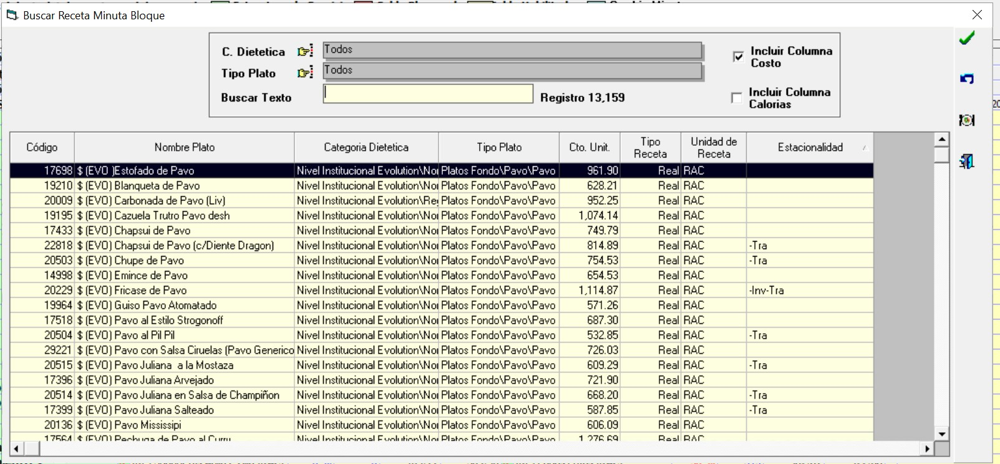

Figura 53: Buscar Minuta Receta Bloque

**Descripción General: **

Por esta opción se despliega una nueva pantalla que muestra un listado de recetas junto con su información principal, incluyendo el código de la receta, el nombre, la categoría dietética, el tipo de plato, el costo unitario, el tipo de receta, la cantidad de calorías, la unidad de medida y la estacionalidad. Esta vista permite consultar rápidamente las características esenciales de cada receta y facilita su análisis dentro del proceso de elaboración de minutas. Para obtener más detalle relacionado con costos y gramajes, se recomienda revisar la sección Cálculo de Costo y la Tabla de Gramaje, donde se profundiza en estos datos. 

**Funcionalidades****:**

Filtro por Categoría Dietética.

Filtro por Tipo Plato.

Búsqueda por texto libre en campo.

Barra de herramientas lateral con botones Confirmar y Salir.

Al confirmar, retorna el código y nombre de la receta seleccionada a la celda de la grilla de minuta.

**Reglas de Negocio****:**

Solo se muestran recetas activas disponibles para el centro costo/régimen/servicio en contexto.

Los filtros por categoría dietética y tipo de plato son opcionales. Si no se aplican, se muestran todas las recetas activas.

La grilla muestra el código, nombre de la receta, costo, categoría dietética, tipo plato, calorías, unidad receta y estacionalidad.

Si no hay ninguna receta seleccionada en la grilla al presionar Confirmar, no se asigna receta y el formulario cierra sin cambios.

**Tabla Relacionadas:**

Tabla Receta (b_receta)

Tabla Categoria Dietetica (a_recetacatdie)

Tabla Tipo Plato (a_recetatippla)

Tabla Precio Ingrediente (b_precio_ingrediente)

Tabla Descarga de Integración SAP (I_convenio_sap)

Tabla Formato compras SAP (b_formatocompras_sap)

Tabla Formato compras SAP (b_formatocompras_sap_sgp)

Tabla Pedido Excepción Formato Comprsa (b_pedido_excepcionformatocompra)

Tabla Receta Encabezado (b_receta)

Tabla Receta Detalle (b_recetadet)

Tabla Ingrediente (b_ingrediente)

Tabla Producto (b_productos)

Tabla Producto & Ingrediente (b_productosing)

Tabla Centro Costo (b_clientes)

Tabla Gramaje Ceco (b_tablagramajececo)

Tabla Gramaje Ceco x Nivel (b_tablagramajeCeco_nivel)

Mejora:

El filtro de receta solo debe mostrar recetas según servicio y recetas habilitadas. (Replicar lo de AMD).

### 8.12.3. Ingresar % Ponderación (M_MinSR2.frm)

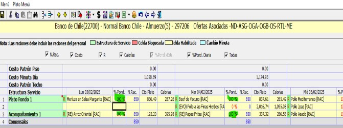

Figura 54: Ingresar % Ponderación

**Descripció****n****:**

Si el servicio corresponde a alimentación, el sistema permite digitar el porcentaje de ponderación asociado, lo que facilita ajustar la participación de cada receta dentro de la estructura del servicio y asegurar que los cálculos reflejen correctamente la distribución definida para ese tipo de servicios.

**Funcionalidades****:**

Permite editar la ponderación de la receta.

**Reglas de negocio****:**

El número % es siempre un valor entero positivo mayor a 0.

El número % no puede ser negativo.

**Tablas Relacionadas****:**

Tabla Minuta Enc (cas_b_minuta)

Tabla Minuta Det (cs_b_minutadet)

### 8.12.4. Ingreso Número raciones (Solo minuta Limpieza Desechable) (M_MinSR2.frm)

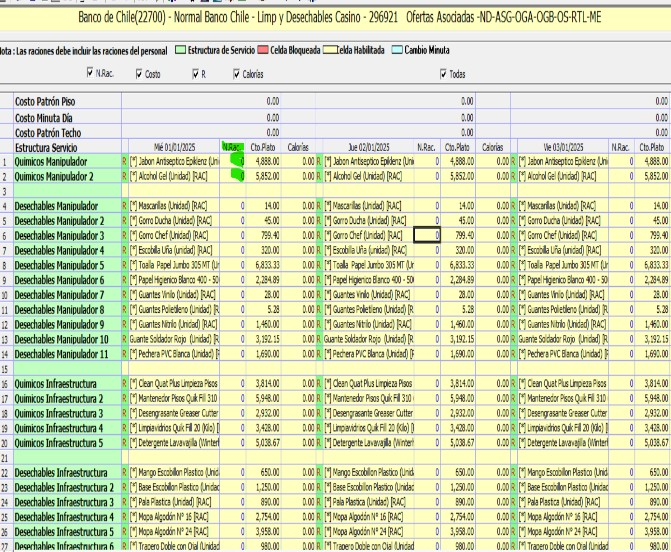

Figura 55: Ingreso Número de Raciones

**Descripción:**

Si el servicio corresponde a limpieza y desechables, el sistema permite digitar directamente el número de raciones asociadas, ya que en este tipo de servicio no aplica un porcentaje de ponderación. Esto facilita registrar de manera precisa la cantidad necesaria de insumos y asegurar que los cálculos reflejen correctamente las necesidades operativas del servicio.

**Funcionalidades****:**

Permite ingresar el número de raciones por receta.

Las raciones son la base para el cálculo de la cantidad de ingredientes en el pedido.

**Reglas de Negocio****:**

El número de raciones es siempre un valor entero positivo mayor a 0.

El número de raciones no puede ser negativo.

**Tabla Relacionadas:**

Tabla Minuta (cas_b_minuta)

Tabla Minuta Det (cas_b_minutadet)

### 8.12.5. Ingreso Comensales x día (M_MinSR2.frm)

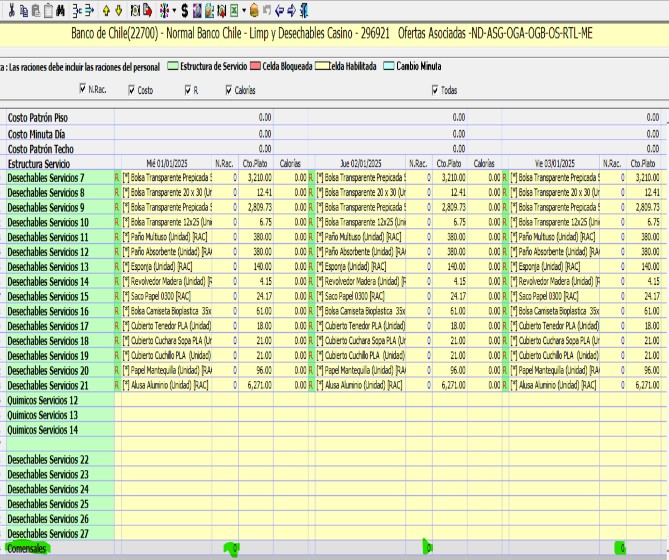

Figura 56: Ingreso Comensales

**Descripción General:**

Este formulario permite ingresar y controlar diariamente la cantidad de comensales por servicio, visualizando simultáneamente el costo y las calorías asociadas a cada uno, facilitando la gestión y control del casino. Ya sea para los servicios de limpieza y desechable o servicio alimentación.

**Funcionalidades****:**

Permite registrar el número de comensales por día en la minuta.

Los comensales pueden variar por día de la semana según el contrato del sitio.

**Reglas de Negocio****:**

Los comensales x día son el referente contractual. Las raciones pueden diferir de los comensales por factor de desvío.

**Tabla Relacionadas:**

Tabla Minuta (cas_b_minuta)

Tabla Minuta Det (cas_b_minutadet)

Mejora:

Los comensales diarios permitan registrar con valor cero o uno.

### 8.12.6. Visualizar Detalle Receta (M_Receta.frm)

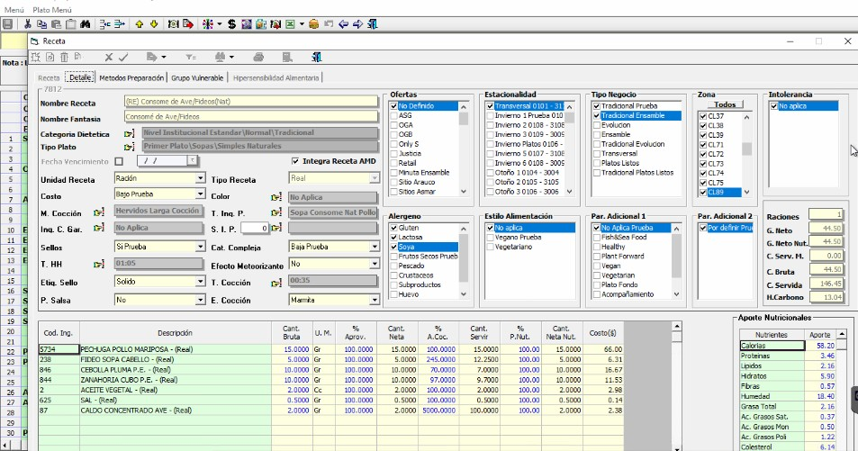

Figura 57: Visualizar Detalle Receta

**Descripción:**

Este ítem permite visualizar el detalle de la receta asociada al sitio, aplicando tanto el costo como el gramaje correspondiente, lo que facilita revisar cómo estos valores impactan en la composición y cálculo de la receta dentro de la minuta. Para obtener información más detallada sobre el tratamiento de costos y gramajes, se recomienda consultar la sección Cálculo de Costo y la Tabla de Gramaje, donde se profundiza en estos aspectos. La información de las recetas se muestra asociada al centro costo y régimen (Parametrizado en Tabla de Gramaje del Sitio) y excepción formato de compras.

**Funcionalidades****:**

Vista de solo lectura del detalle de la receta seleccionada en la celda de la minuta.

Muestra: datos generales de la receta (nombre, categoría, tipo de plato, base de ración), tabla de ingredientes con cantidades y porcentajes, resumen de aportes nutricionales y método de preparación.

Se abre desde el menú contextual de la grilla de la minuta con la opción "Ver Detalle Receta".

No permite modificar ningún dato de la receta desde esta vista.

**Reglas de Negocio****:**

La vista de detalle de receta está siempre disponible independientemente del estado de la minuta (en elaboración, aprobada, enviada).

Los datos mostrados son los de la receta vigente al momento de la consulta, no los del momento en que fue planificada.

La vista muestra la receta tal como fue planificada con los gramajes de la tabla de gramaje aplicada o la receta maestra estándar.

**Tabla Relacionadas:**

Tabla Receta (b_receta)

Tabla Receta Det (b_recetadet)

Tabla Ingrediente (b_ingrediente)

Tabla Encabezado Receta (b_receta)

Tabla Detalle Receta (b_recetadet)

Tabla Categoría Dietética(a_recetacatdie)

Tabla Tipo Plato (a_recetatippla)

Tabla Unidad Medida (b_UnidadReceta)

Tabla Costo Receta (a_costoreceta)

Tabla Método Cocción (a_metodococcionreceta)

Tabla Ing. Cruce Garnitura (a_ingredientecrucegarniturareceta)

Tabla Sello (a_sellosreceta)

Tabla Tiempo HH (a_tiempohhreceta)

Tabla Etiquetado Sello (a_etiquetadoselloreceta)

Tabla Parámetro Salsa (a_parametrosalsa)

Tabla Color (a_color)

Tabla Tipo Ing. Principal (a_tipoingredienteprincipalreceta)

Tabla Tipo Ing. Secundario (a_tipoingredienteprincipalreceta)

Tabla Categorización Compleja Receta (a_categorizacioncomplejareceta)

Tabla Efecto Meteorizante (a_efectometeorizantereceta)

Tabla Tiempo Cocción Receta (a_tiempococcionreceta)

Tabla Equipamiento Cocción (a_equipamientococcion)

Tabla Ingrediente (b_ingrediente)

Tabla Unidad Medida (a_unidadme)

Tabla Nutrientes (a_nutriente)

Tabla Aportes Nutricionales (b_productonut)

Tabla Estacionalidad (a_estacionalidadreceta)

Tabla Ofertas (b_ofertas)

Tabla Tipo Negocio (a_tiponegocioreceta)

Tabla Intolerancia (a_intoleranciareceta)

Tabla Alergeno (a_alergeno)

Tabla Estilo Alimentacion (a_estiloalimentacion)

Tabla Parametro Adicional1 (a_Parametroadicional1)

Tabla Parametro Adicional2 (a_Parametroadicional2)

Tabla Oferta Receta (b_receta_Oferta)

Tabla Estacionalidad Receta (b_recetaestacionalidad)

Tabla Tipo Negocio Receta (b_recetatiponegocio)

Tabla Zona Receta (b_recetazona)

Tabla Intolerancia receta (b_recetaintolerancia)

Tabla alergeno receta (b_recetaalergeno)

Tabla Estilo alimentación receta (b_recetaestiloalimentacion)

Tabla parámetro adicional 1 receta (b_recetaparametroadicional1)

Tabla parámetro adicional 1 receta (b_recetaparametroadicional2)

Tabla precio Ingrediente (b_precio_ingrediente)

Tabla Gramaje Receta Estandar (b_tablagramajeCeco)

Tabla Gramaje Ceco x Nivel (b_tablagramajececo_nivel)

Tabla Organización Compras (i_org_ceco)

Tabla Convenios (I_convenios_sap)

Tabla Formato Compras Sap (b_formatocomprassap)

Tabla Formato Compras Sap & Sgp (b_formatocomprassap_sgp)

Tabla Exclusión Formato (b_Pedido_ExcepcionFormatoCompra)

Mejora:

Visualizar texto completo al momento poner el mouse en un texto (esto es transversal).

### 8.12.7. Visualizar Aporte Sin % P-G-Cho-AGRS (C_ApoPla.frm)

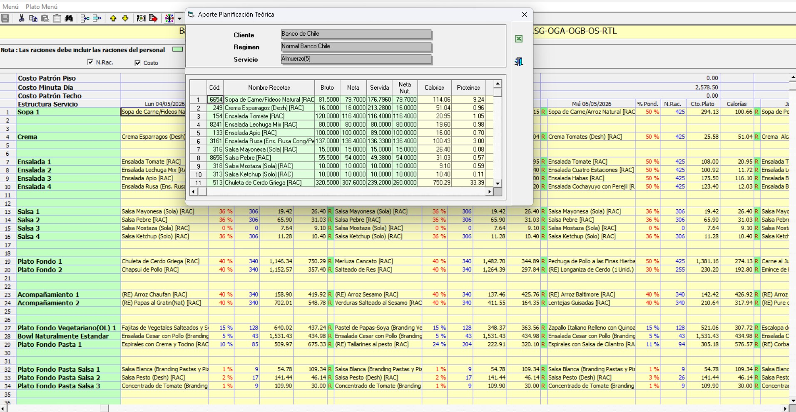

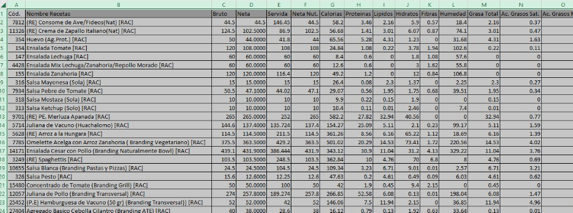

**Descripción:**

Este módulo muestra el **aporte nutricional teórico** de las recetas asociadas a un servicio planificado. Identifica el **Cliente**, **Régimen** y **Servicio** correspondiente, y despliega el detalle de cada receta con sus valores de **Peso Bruto**, **Neto**, **Servida** y **Neta Nutricional**, junto con los aportes nutricionales. Finalmente, presenta un **Total General** que consolida los valores nutricionales de todas las recetas del servicio.Además, aplica la **tabla de gramaje del sitio** en caso de que exista.

**Funcionalidades**

Selector de rango de fechas: Fecha Desde y Fecha Hasta (ambos campos con selector de calendario).

Los campos de fecha permiten valores nulos.

Generación del informe de composición macro nutricional de las minutas del período seleccionado.

Compatibilidad con el formato de datos requerido por el sistema.

**Reglas de Negocio****:**

Si se ingresa fecha desde y fecha hasta, la fecha hasta debe ser mayor o igual a la fecha desde.

Si ambos campos de fecha están vacíos, el sistema usa el período activo por defecto.

**Tabla Relacionadas:**

Tabla Minuta (b_minuta)

Tabla Minuta Det (b_minutadet)

Tabla Receta Det (b_recetadet)

Tabla Ingrediente (b_ingrediente)

Tabla Precio Ingrediente Receta (b_precio_ingrediente_receta)

### 8.12.8. Visualizar Aporte Con % P-G-Cho-AGRS (C_AporteSansis.frm)

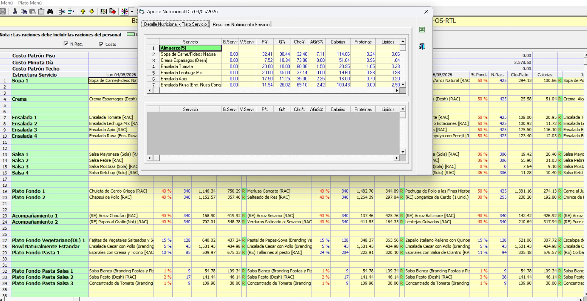

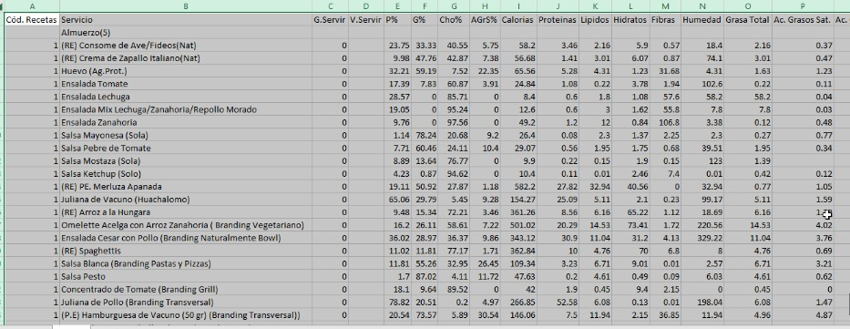

**Descripción:**

Este ítem permite visualizar el aporte nutricional de la receta aplicando los gramajes definidos en la tabla de gramaje, en caso de que existan registros asociados. Esta vista facilita comprender cómo los gramajes influyen en los valores nutricionales calculados para la minuta. Para conocer en profundidad el manejo del gramaje y el proceso de cálculo de aportes, se recomienda revisar la sección Tabla de Gramaje y Cálculo de Aportes Nutricionales. Cuando el cálculo se realiza utilizando porcentajes, el sistema muestra los aportes correspondientes al servicio programados para el día que se está visualizando, proporcionando una visión completa del aporte total. Además, esta información puede ser exportada a Excel para facilitar su análisis o documentación.

**Funcionalidades****:**

Selector de rango de fechas: Fecha Desde y Fecha Hasta (ambos campos con selector de calendario).

Los campos de fecha permiten valores nulos.

Generación del informe de composición macro nutricional de las minutas del período seleccionado.

Compatibilidad con el formato de datos requerido por el sistema.

**Reglas de Negocio****:**

El porcentaje P-G-Cho-AGRS se calcula sobre las calorías totales planificadas en el período: % Proteínas = (g Proteínas × 4 kcal/g / kcal totales) × 100. Ídem para grasas (9 kcal/g) y carbohidratos (4 kcal/g).

Si se ingresa fecha desde y fecha hasta, la fecha hasta debe ser mayor o igual a la fecha desde.

Si ambos campos de fecha están vacíos, el sistema usa el período activo por defecto.

**Tabla Relacionadas:**

Tabla Minuta (cas_b_minuta)

Tabla Minuta Det (cas_b_minutadet)

Tabla Receta Enc (b_receta)

Tabla Receta Det (b_recetadet)

Tabla Ingrediente (b_ingrediente)

Tabla Nutrientes (a_nutrientes)

Tabla Aporte Nutricionales (B_Productonut)

Tabla Centro Costo (b_clientes)

Tabla Regimen (a_regimen)

Tabla Servicio (a_servicio)

Tabla Gramaje Receta Estandar (b_tablagramajececo)

Tabla Gramaje x Nivel (b_tablagramajececo_nivel)

### 8.12.9. Menú contextual – Opciones de Edición de Menú (M_MinSR2.frm)

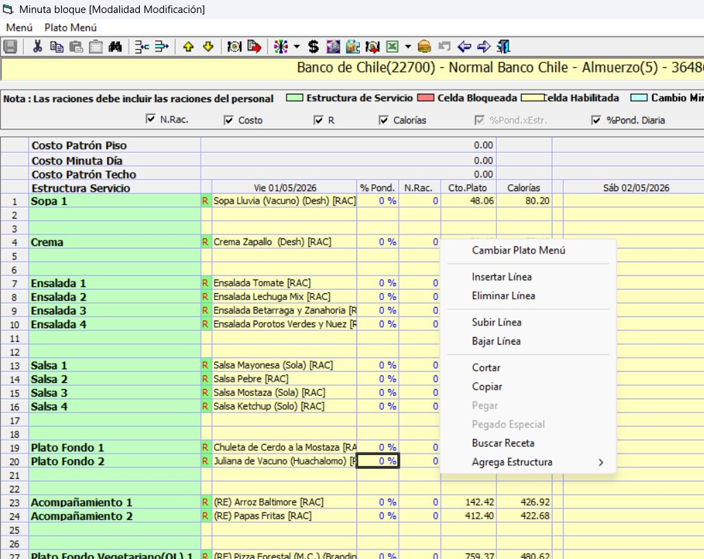

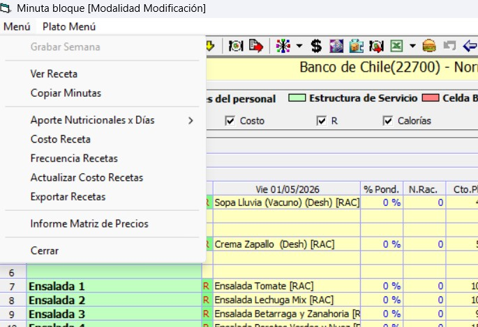

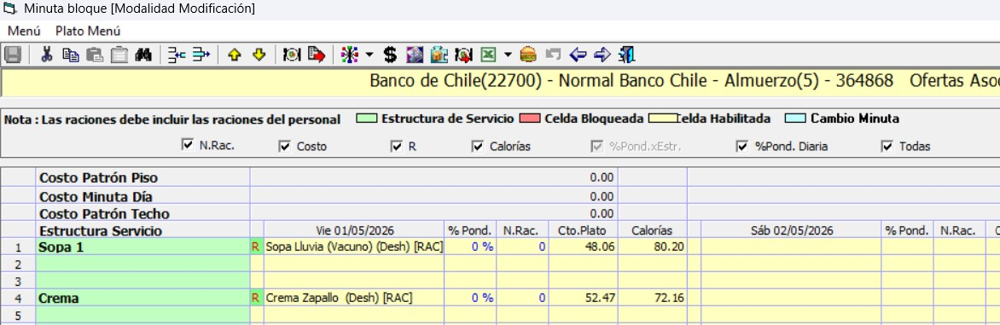

**Descripción General:**

Este menú contextual se despliega al hacer clic derecho y permite realizar diversas acciones de edición sobre el menú planificado, tales como cambiar un plato, insertar o eliminar líneas, reordenar su posición, copiar y pegar contenido, buscar una receta específica y agregar una nueva estructura al menú.

**Funcionalidades****:**

**Ingresar Receta**: abre para asignar una receta a la celda.

**Eliminar Receta**: elimina la receta asignada a la celda seleccionada.

**Guardar**: permite guardar los ajustes realizados en el bloque.

**Cortar, Copiar, Pegar, Pegado Especial****: **Se utiliza para ajustar las minutas a nivel de recetas, ponderaciones y raciones.

**Subir o Bajar** columnas.

**Deshacer:** Para volver atrás algún ajuste.

**Retroceder – Avanzar Minuta**: Desde dentro de la minuta permite mover al servicio anterior o posterior.

**Ver Detalle Receta**: abre en modo solo lectura con la receta de la celda.

**Visualizar Aporte Sin %**: abre con el aporte nutricional de la receta de la celda.

**Visualizar Aporte Con % P-G-Cho-AGRS**: abre vista con porcentajes macro nutricionales.

**Ingresar % Ponderación**: habilita edición del % ponderación del servicio.

**Ingreso Número Raciones**: habilita edición del número de raciones.

**Ingreso Comensales x Día**: habilita edición de comensales.

**Visualizar Costo**: muestra el costo calculado de la receta/minuta en contexto.

**Actualizar Costo Recetas**: recalcula el costo de todas las recetas de la minuta con los precios vigentes.

**Frecuencia Recetas**.

**Buscar Receta o Ingrediente**.

**Exportar Excel Receta****.**

**Copiar Minuta**: accede a las opciones de copia de minuta.

**Reglas de Negocio****:**

Las opciones de edición (Ingresar, Eliminar) se deshabilitan si la minuta está en estado Aprobado o Enviado.

"Ver Detalle Receta" siempre está disponible independientemente del estado de la minuta.

"Actualizar Costo Recetas" solo está disponible para usuarios con perfil de Planificación o Costos.

**Tabla Relacionadas:**

Tabla Minuta (cas_b_minuta)

Tabla Minuta Det (cas_b_minutadet)

Mejoras:

Permita buscar nombre de estructura de servicio por su nombre completo, en la lista desplegada.

### 8.12.10. Copiar Minuta (M_CPlaTe.frm)

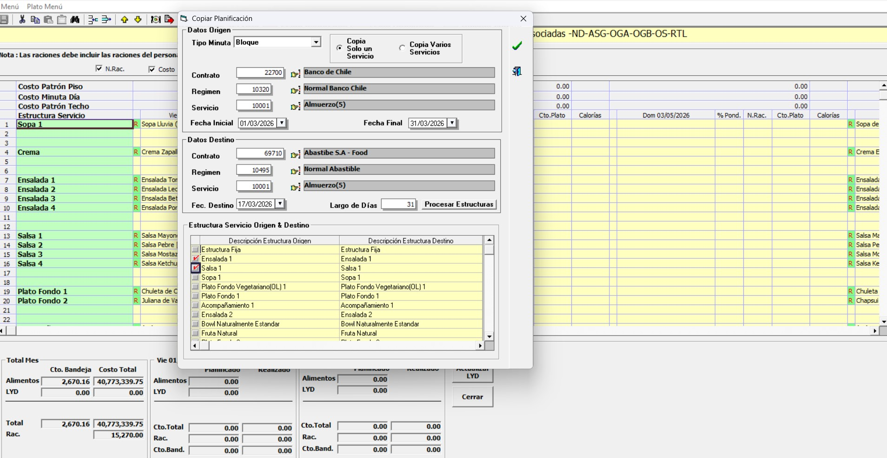

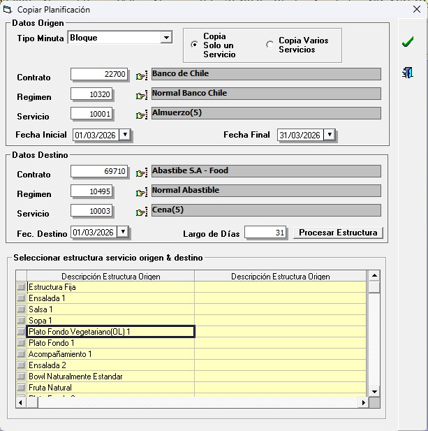

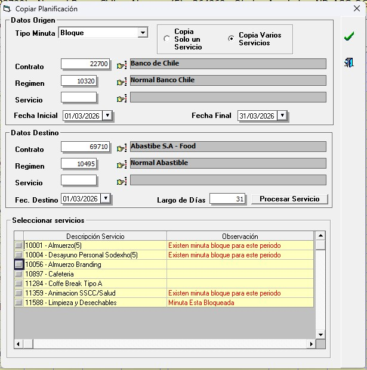

Figura 58: Copiar Minuta

**Descripción General:**

Esta sección permite copiar información ya definida en una minuta, ya sea para un régimen y servicio específico o para múltiples servicios asociados a un mismo centro de costo, bloqueando los ítems de servicio de origen y destino. Esto facilita replicar configuraciones completas de manera rápida y consistente, evitando el reingreso manual de la información.

Además, esta opción permite copiar hacia un destino cuyo régimen y servicio sean distintos al del origen. Para ello, en la grilla se debe seleccionar manualmente la estructura destino, fila por fila.

Dentro de la grilla, se deben seleccionar las filas a copiar, ya sea haciendo clic en cada ítem individualmente o utilizando la primera columna para seleccionar todos los ítems de manera simultánea.

**Funcionalidades****:**

Sección Datos Origen: selección de centro costo, régimen, servicio y período.

Sección Datos Destino: selección de centro costo, régimen, servicio y período destino.

Opciones de copia (por determinar según controles restantes del formulario).

Confirmación antes de ejecutar la copia.

Permite copiar una minuta no existente.

Pisar la información de una minuta existente y/o insertar información en líneas inferiores.

Modificar el texto cuando se usa esta opción, texto: Esta minuta ya posee datos, si elije la opción SI, se reemplazarán los datos, si elije opción NO, se anexarán las estructuras al final.

**Reglas de Negocio****:**

La planificación teórica es una copia de trabajo de la minuta que no afecta la producción real.

La copia teórica puede usarse como base para propuestas comerciales a nuevos clientes.

Si el dato del centro de costo ya existe dentro del periodo, el sistema muestra un aviso para que el usuario elija si desea borrar la información existente o anexarla al final de cada día.

Si la minuta destino ya existe y se selecciona la opción de copiar varios servicios, no se permite seleccionar la opción *Entregado* en la columna *Observación*, ya que la minuta para ese período ya existe.

Si el servicio de origen es distinto al servicio de destino, debe asociar la estructura de servicio correspondiente para cada fila de manera individual.

**Tabla Relacionadas:**

Tabla Minuta (cas_b_minuta)

Tabla Minuta Det (cas_b_minutadet)

Tabla Minuta Bloque (cas_b_minutabloque)

Tabla Minuta Grupo Estructura (cas_b_minutagrupoestructura)

Tabla Centro Costo (b_clientes)

Tabla Regimen (a_regimen)

Tabla Servicio (a_servicio)

Mejoras:

Cuando se copia un servicio desde un origen hacia un destino distinto, la grilla de la estructura debe permitir buscar la estructura del servicio por su nombre completo.

El ítem segmento no debe ir.

### 8.12.11. Visualizar Costo (M_MinSR2.frm)

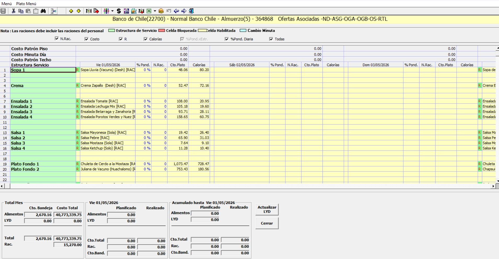

Figura 59: Visualizar Costo

**Descripción:**

Esta opción permite visualizar un resumen que incluye el costo de la bandeja y el costo total, junto con el costo del día para alimento, los valores correspondientes a limpieza y desechables (LYD) y el costo acumulado hasta la fecha en la que se encuentre posicionada la minuta. Esta vista ofrece un panorama consolidado que facilita el análisis diario y el seguimiento del comportamiento económico de la minuta a lo largo del periodo.

**Funcionalidades****:**

Muestra el costo unitario de la receta (por ración) y el costo total del servicio/día, calculados con la jerarquía de precios activa.

**Reglas de Negocio****:**

El costo de la receta se calcula como la suma de (Cantidad Neta × Precio Vigente) de cada ingrediente, respetando la siguiente jerarquía de precios: precio de lista → precio de convenio SAP → precio de referencia. Además, se aplican los valores de la tabla de gramaje del sitio, si corresponde.

El costo de bandeja final considera el costo de receta.

Considera el costo vigente al día de la planificación y en caso no tener precio considera el ultimo precio vigente.

Para escoger el precio considera el siguiente orden tabla formato excepciones, prioritario o bien el más barato.

**Tabla Relacionadas:**

Tabla Minuta Det (cas_b_minutadet)

Tabla Receta Det (cas_b_recetadet)

Tabla Precio ingrediente (b_precio_ingrediente)

Tabla Convenio SAP (I_convenio_SAP)

Tabla Centro Costo (b_clientes)

Tabla Regimen (a_regimen)

Tabla Servicio (a_servicio)

Tabla Ingrediente (b_ingrediente)

Tabla Organización Compras (i_org_ceco)

Tabla productos (b_productos)

Tabla Productos & Ingrediente (b_productosing)

Tabla Formato Compras SAP (b_formatocomprassap)

Tabla Formato Compras SAP & SGP (b_formatocomprassap_sgp)

### 8.12.12. Frecuencia Recetas (C_FreMinBlo.frm)

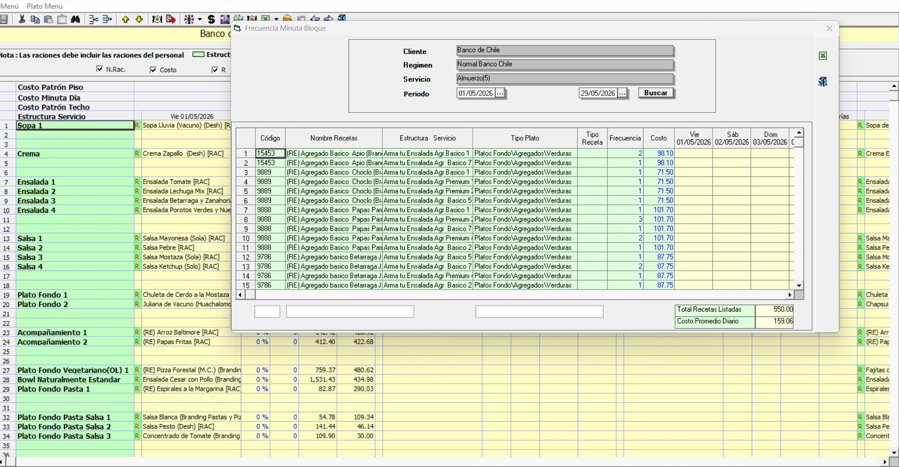

Figura 60: Frecuencia Receta

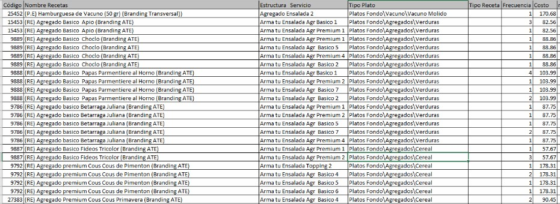

Figura 61: Exportación Frecuencia Receta

**Descripción General:**

Esta sección permite visualizar la frecuencia con la que una receta aparece dentro de un mes determinado, entregando una visión clara de su recurrencia en la planificación de la minuta. Además, la información puede ser exportada a Excel para facilitar su análisis o utilización en reportes. Para obtener un mayor nivel de detalle relacionado con costos y gramajes, se recomienda consultar la sección Cálculo de Precio y la Tabla de Gramaje, donde se profundiza en estos aspectos fundamentales para la gestión de las recetas.

**Funcionalidades****:**

La grilla muestra la frecuencia de aparición de cada receta en las minutas del período consultado.

Totales en pie de grilla: "Total Recetas Listadas" y "Costo Promedio Diario".

Filtros de contexto para delimitar el período y centro costo/régimen consultado.

Vista analítica de la distribución semanal/mensual de cada receta en la minuta.

**Reglas de Negocio****:**

El costo promedio diario considera el costo unitario de la receta y la cantidad de veces que aparece en el período.

Debe existir al menos una minuta activa para el período/centro costo consultado.

**Tabla Relacionadas:**

Tabla Minuta Det (cas_b_minutadet)

Tabla Receta Det (cas_b_recetadet)

Tabla Precio ingrediente (b_precio_ingrediente)

Tabla Convenio SAP (I_convenio_SAP)

Tabla Centro Costo (b_clientes)

Tabla Regimen (a_regimen)

Tabla Servicio (a_servicio)

Tabla Ingrediente (b_ingrediente)

Tabla Organización Compras (i_org_ceco)

Tabla productos (b_productos)

Tabla Productos & Ingrediente (b_productosing)

Tabla Formato Compras SAP (b_formatocomprassap)

Tabla Formato Compras SAP & SGP (b_formatocomprassap_sgp)

Mejoras:

Ordenar de la misma forma en que aparece la estructura de servicio en la minuta.

### 8.12.13. Actualizar Costo Recetas (M_MinSR2.frm)

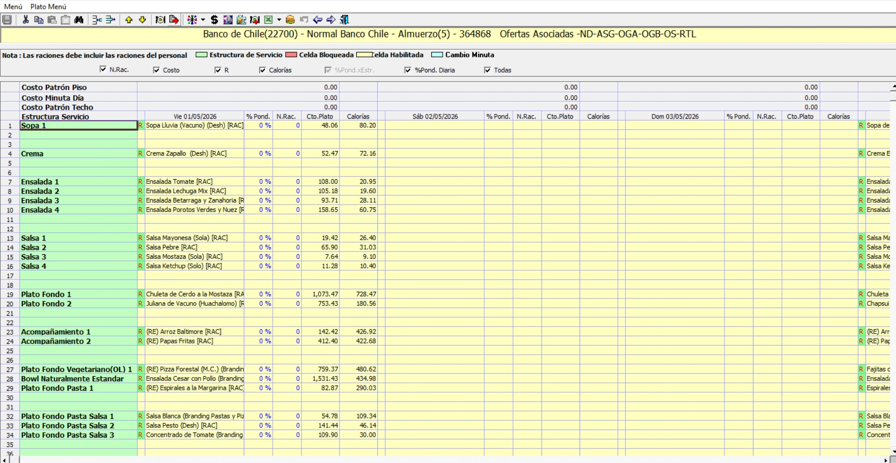

Figura 62: Actualizar Costo Receta

**Descripción General:**

Esta sección permite actualizar los costos de las recetas dentro de la aplicación, asegurando que los valores utilizados en los cálculos de las minutas reflejen los precios vigentes y se mantengan alineados con la información operativa. Esta funcionalidad facilita mantener la consistencia y exactitud en los costos asociados a cada receta, impactando directamente en la elaboración y análisis de las minutas. Para obtener información más detallada sobre la gestión de costos y el uso de gramajes, se recomienda revisar la sección Cálculo de Precio y la Tabla de Gramaje, donde se explican en profundidad estos procesos.

**Funcionalidades****:**

Ejecuta un proceso de recalculo masivo de costos para todas las recetas de la minuta activa, actualizando los valores en la tabla relacionada.

**Reglas de Negocio****:**

El proceso "Actualizar Costo" no modifica la planificación de recetas, solo actualiza los campos de costo almacenados.

**Tabla Relacionadas:**

Tabla Minuta Det (cas_b_minutadet)

Tabla Receta Det (cas_b_recetadet)

Tabla Precio ingrediente (b_precio_ingrediente)

Tabla Convenio SAP (I_convenio_SAP)

Tabla Centro Costo (b_clientes)

Tabla Regimen (a_regimen)

Tabla Servicio (a_servicio)

Tabla Ingrediente (b_ingrediente)

Tabla Organización Compras (i_org_ceco)

Tabla productos (b_productos)

Tabla Productos & Ingrediente (b_productosing)

Tabla Formato Compras SAP (b_formatocomprassap)

Tabla Formato Compras SAP & SGP (b_formatocomprassap_sgp)

Mejoras:

Eliminar el botón *Actualizar*, ya que dejará de utilizarse. El costo de la receta del día debería mantenerse siempre actualizado automáticamente.El sistema debe actualizar el costo utilizando el precio definido en el convenio.

### 8.12.14. Exportar Excel Receta (C_ExpRecMBloque.frm)

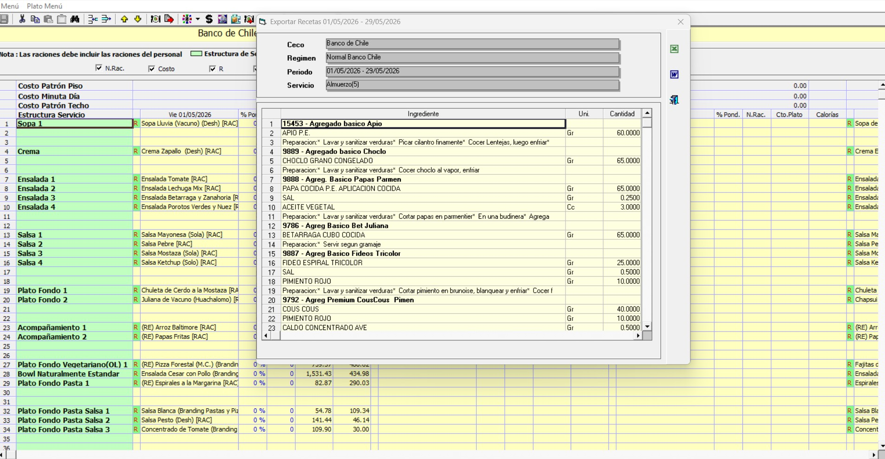

Figura 63: Exportar Excel Receta

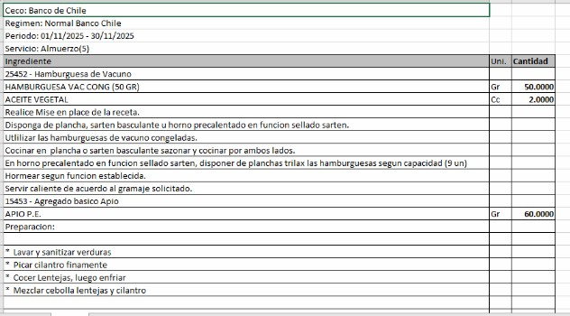

Figura 64: Exportación Excel Receta

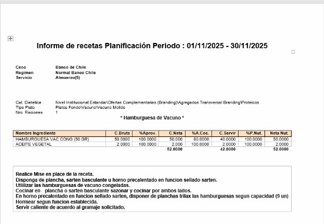

Figura 65: Informe de Receta Planificadas

**Descripción General:**

Esta sección permite exportar a Excel o a Word las recetas que forman parte de una planificación, incluyendo el detalle completo de cada una de ellas, lo que facilita su revisión, documentación o distribución fuera de la aplicación. Esta funcionalidad resulta especialmente útil para generar reportes operativos o respaldos formales de la información utilizada en la programación de minutas. Para obtener más detalles relacionados con el uso de gramajes, se recomienda consultar la sección Tabla, donde se profundiza en este aspecto.

**Funcionalidades****:**

Filtros de exportación: Centro Costo, Régimen, Período y Servicio.

Exporta el detalle de la receta activa en al momento de invocar este formulario.

Permite genera archivo Excel o bien Word.

**Reglas de Negocio****:**

La exportación incluye el detalle de ingredientes con cantidades, porcentajes y costos, más el método de preparación.

Debe estar activa una receta en el formulario principal antes de invocar la exportación.

Exportación archivo en Excel o Word.

**Tabla Relacionadas:**

Tabla Ingredientes (b_ingrediente)

Tabla Receta (b_receta)

Tabla Receta Det (b_recetadet)

Tabla Servicio (a_servicio)

Tabla Régimen (a_regimen)

Tabla Minuta (cas_b_minuta)

Tabla Minuta Det (cas_b_minutadet)

Mejoras:

Aplicar el mismo formato utilizado en Word al momento de generar el archivo en Excel.

### 8.12.15. Frecuencia de Ingrediente (C_FreIngMinBlo.frm)

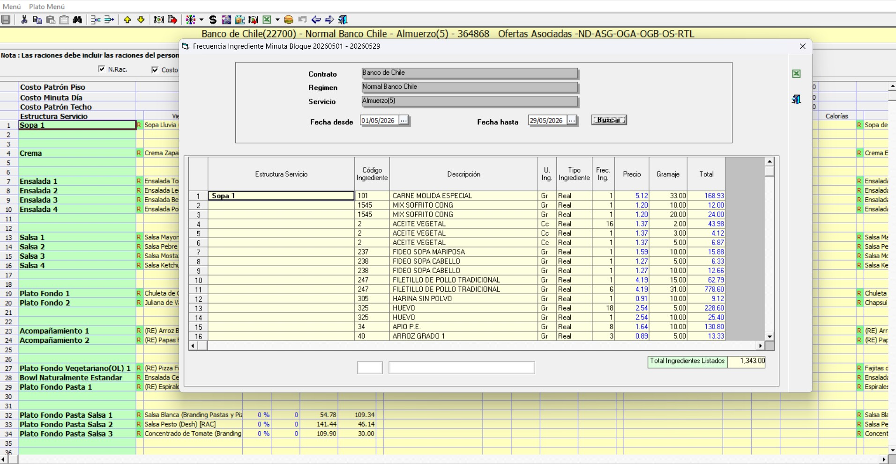

Figura 66: Frecuencia de Ingrediente

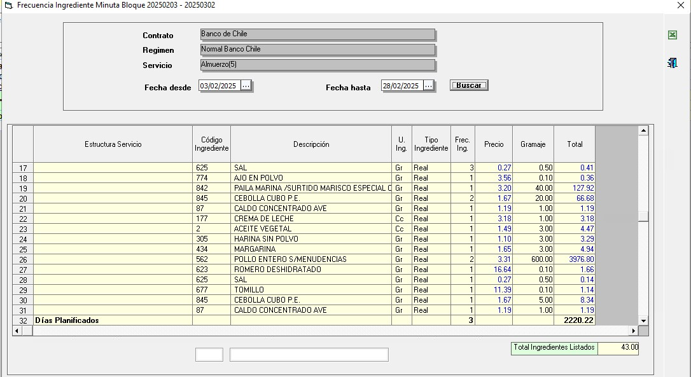

Figura 67: Frecuencia Ingrediente

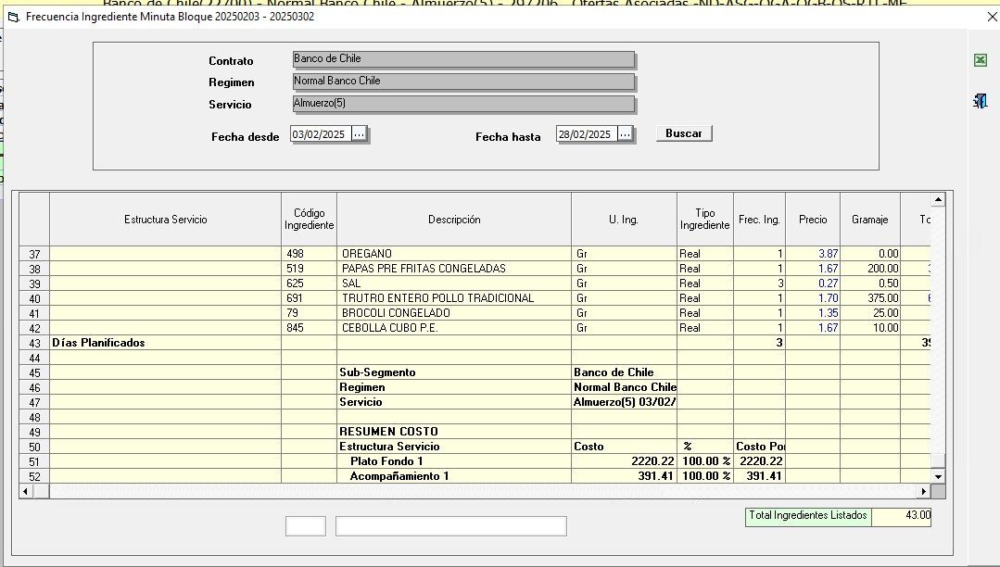

Figura 68: Frecuencia Ingrediente Minuta Bloque

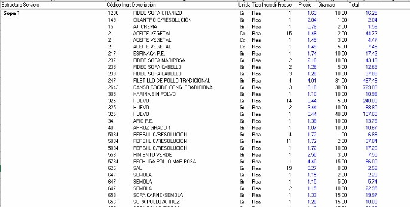

Figura 69: Estructura de Servicio

**Descripción General:**

Esta sección muestra el detalle de la minuta por ingrediente según la estructura de servicio, presentando para cada uno de ellos el precio, el gramaje y el total correspondiente, lo que permite analizar de manera precisa cómo se compone el costo por servicio. Al final de la vista se incluye un resumen consolidado del costo por estructura de servicio, facilitando la revisión global del comportamiento económico de la minuta. Además, esta información puede ser exportada a Excel para su análisis externo o para generar reportes. Para obtener más información relacionada con costos y gramajes, se recomienda consultar la sección Cálculo de Precio y la Tabla de Gramaje, donde se profundiza en estos aspectos.

**Funcionalidades****:**

Filtros: Fecha Desde y Fecha Hasta (campo adicional de fecha), más otros filtros de contexto.

Botón "Buscar" para ejecutar la consulta.

Grilla de resultados con frecuencia de cada ingrediente por período.

Posibilidad de filtrar por centro costo, régimen y servicio.

**Reglas de Negocio****:**

El análisis de frecuencia de ingredientes permite verificar el cumplimiento de las restricciones de oferta de ingredientes (por ejemplo, no usar el mismo ingrediente principal más de N veces por semana).

La consulta incluye solo los ingredientes de recetas efectivamente planificadas (con estado activo en la minuta).

El rango de fechas es obligatorio. No puede ejecutarse la búsqueda sin fecha desde.

**Tabla Relacionadas:**

Tabla Minuta Det (cas_b_minutadet)

Tabla Receta Det (cas_b_recetadet)

Tabla Precio ingrediente (b_precio_ingrediente)

Tabla Convenio SAP (I_convenio_SAP)

Tabla Centro Costo (b_clientes)

Tabla Regimen (a_regimen)

Tabla Servicio (a_servicio)

Tabla Ingrediente (b_ingrediente)

Tabla Organización Compras (i_org_ceco)

Tabla productos (b_productos)

Tabla Productos & Ingrediente (b_productosing)

Tabla Formato Compras SAP (b_formatocomprassap)

Tabla Formato Compras SAP & SGP (b_formatocomprassap_sgp)

Mejoras:

Eliminar columnas oculta E,H,I,J,Y,l. de la planilla Excel.

Eliminar línea oculta.

### 8.12.16. Buscar Receta o Ingrediente (B_BusVas.frm)

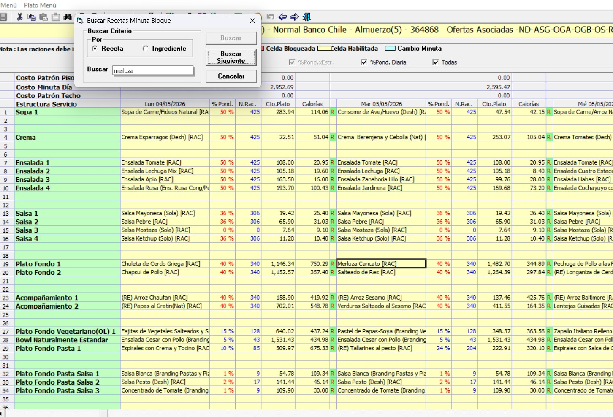

Figura 70: Buscar Receta Minuta Bloque

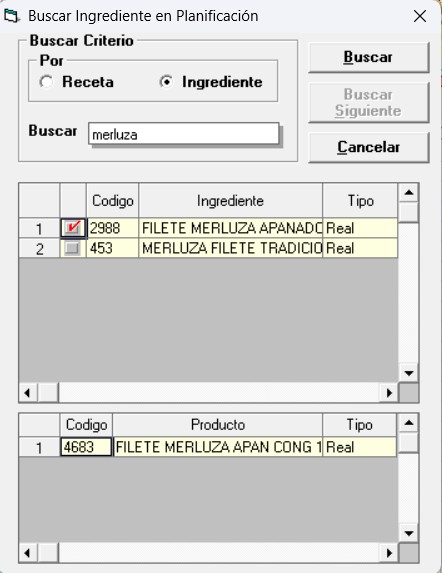

Figura 71: Buscar Ingrediente en Planficiación

**Descripción General:**

Esta sección permite buscar una receta o un ingrediente que se encuentre planificado dentro de la minuta, facilitando la identificación rápida de los elementos utilizados en la programación. En el caso de la búsqueda de ingredientes, el sistema localiza aquellos que estén registrados en la tabla de gramaje, siempre que el sitio cuente con dicha información, lo que permite visualizar de manera precisa los ingredientes aplicados y su relación con los gramajes definidos.

**Funcionalidades****:**

Alternancia de modo de búsqueda: "Receta" (Option1, seleccionado por defecto) o "Ingrediente" (Option2).

Campo de búsqueda tiene un máximo de 50 caracteres.

Botón "Buscar Siguiente": busca el siguiente registro que coincida con el criterio.

Resultados presentados dentro de la grilla de la minuta bloque (el formulario resalta la celda encontrada en la grilla de la ventana llamante).

El criterio "Buscar Criterio" delimita el ámbito de búsqueda.

**Reglas de Negocio****:**

La búsqueda es iterativa: cada click en "Buscar Siguiente" avanza al siguiente resultado coincidente. Al llegar al final vuelve al principio.

La búsqueda por Ingrediente ubica las celdas de la minuta donde la receta contiene el ingrediente buscado.

El campo de búsqueda no puede estar vacío al presionar "Buscar Siguiente".

**Tabla Relacionadas:**

Tabla Ingredientes (b_ingrediente)

Tabla Receta (b_receta)

Tabla Receta Det (b_recetadet)

Tabla Gramaje Receta Estandar (b_tablagramajececo)

Tabla Gramaje x Nivel (b_tablagramajececo_nivel)

### 8.12.17. Menú Formato I – II

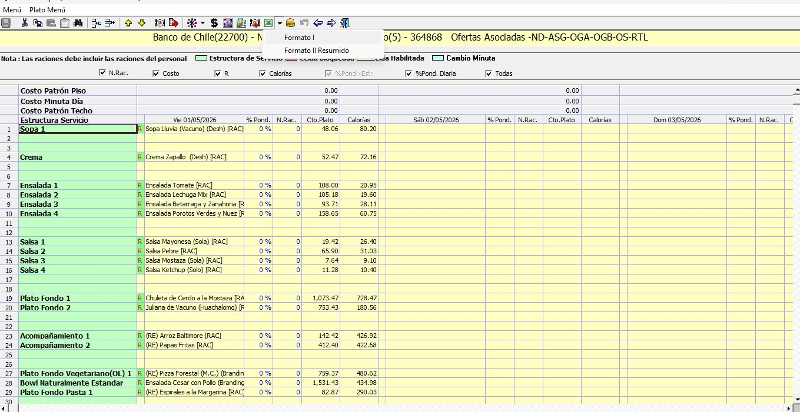

**Descripción General:**

Esta sección permite exportar la minuta en dos formatos Excel:

**Formato I** presenta el detalle completo de la minuta, mostrando por cada día y estructura de servicio las recetas asignadas por tipo de plato (Sopa, Crema, Ensaladas, Salsas, Plato Fondo, Acompañamiento, entre otros), junto con sus indicadores de costo, calorías, número de raciones y ponderación diaria.

**Formato II Resumido** presenta una versión condensada de la misma información, agrupando los datos de manera simplificada para facilitar su revisión y distribución.

Formato I:

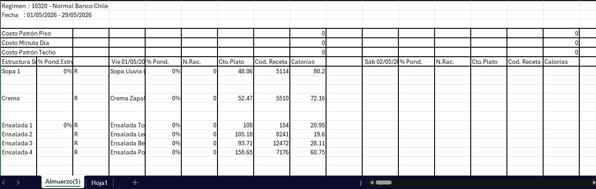

**Descripción:**

Exportación detallada de la minuta en Excel que muestra por cada día y estructura de servicio las recetas asignadas, incluyendo información nutricional, de costos y raciones.

**Funcionalidad:**

Presenta para cada día de la minuta y por estructura de servicio, los siguientes datos: porcentaje de ponderación por estructura, número de raciones, costo por plato, código de receta y calorías. Además, incluye en el encabezado los costos patrón piso, minuta día y patrón techo.

**Reglas de Negocio:**

Muestra el régimen y rango de fechas seleccionado.

Incluye indicadores de costo (Piso, Día, Techo) para control presupuestario.

Despliega el % de ponderación por estructura de servicio y diaria.

Muestra el código de receta para trazabilidad.

Incluye el aporte calórico por plato.

**Tablas Relacionadas:**

Tabla Minuta (cas_b_minuta)

Tabla Minuta Detalle (cas_b_minutadet)

Formato II:

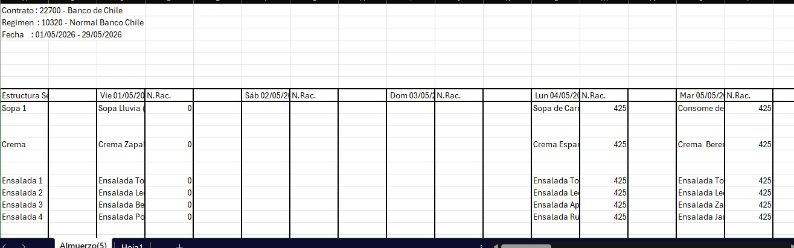

**Descripción:**

Exportación simplificada de la minuta en Excel que presenta únicamente las recetas asignadas por día y estructura de servicio con su número de raciones, sin incluir información de costos ni nutricional.

**Funcionalidad:**

Presenta de forma condensada el contrato, régimen y rango de fechas, mostrando por cada día y tipo de plato el nombre de la receta y el número de raciones asociadas.

**Reglas de Negocio:**

Muestra el contrato, régimen y rango de fechas en el encabezado.

No incluye información de costos ni calorías.

Permite visualizar la planificación de la minuta de forma simplificada.

Facilita la distribución del menú a usuarios que no requieren detalle económico ni nutricional.

Los días sin recetas asignadas se muestran en blanco.

**Tablas Relacionadas:**

Tabla Minuta (cas_b_minuta)

Tabla Minuta Detalle (cas_b_minutadet)

## 8.13. Actualizaciones Varias - Cambio x Raciones Ponderaciones Excel (P_CambioRecetaMinBloque.frm)

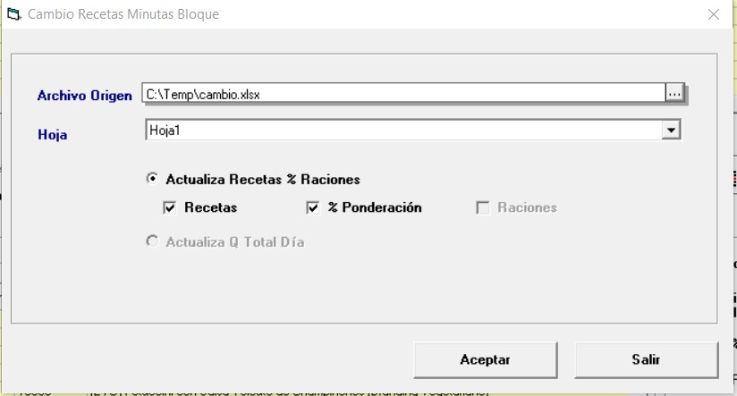

Figura 72: Cambio Recetas Minutas Bloque

**Descripción:**

Esta opción permite actualizar una minuta bloque utilizando una planilla Excel generada desde el informe “Exportar Excel Detalle Minuta II”. Para realizar esta operación, se debe seleccionar el botón de los tres puntos para buscar y cargar la planilla Excel correspondiente. Una vez cargado el archivo, si la actualización se realizará en función de recetas por raciones, es posible seleccionar las opciones de receta, porcentaje de ponderación y/o raciones, según el tipo de información que se requiera actualizar en la minuta. Esta funcionalidad agiliza el proceso de modificación masiva y permite mantener la minuta alineada con los datos ajustados externamente.

**Funcionalidad:**

Selección de la minuta, servicio, régimen, día y receta a reemplazar.

Búsqueda y selección de la receta de reemplazo.

La opción Actualiza Q Total Día, se selecciona cuando se necesita actualizar masivo los comensales de uno o varios contratos/servicios.

Registro automático del cambio.

**Reglas de Negocio:**

Las minutas con estado "Enviada" no pueden modificarse. Validar estado antes de permitir el cambio de receta.

La receta de reemplazo debe estar vigente en la fecha de la minuta.

Al cambiar el número de raciones totales, el sistema recalcula automáticamente las raciones de cada preparación según su ponderación.

El cambio de comensales impacta el cálculo del carro de compras si este aún no ha sido generado para el período.

Cuando se genera un error en el proceso de carga, retorna un archivo Excel con los errores.

Debe permitir seleccionar sólo recetas, sólo ponderaciones, sólo raciones o recetas-ponderaciones o recetas-raciones.

**Tablas Relacionadas:**

Tabla Minuta (cas_b_minuta)

Tabla Minuta Detalle (cas_b_minutadet)

## 8.14. Actualizaciones Varias - Carga Masiva de Minuta via Excel   – Batch Input (P_ActComExcel.frm)

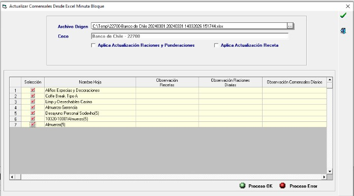

Figura 73: Actualizar Comensales desde Excel Minuta Bloque

**Descripción:**

Esta opción permite actualizar las minutas que han sido enviadas al sitio en una planilla Excel, considerando que el sitio puede realizar modificaciones en la plantilla, ya sea en las recetas, en las ponderaciones (ponderaciones propiamente tal o raciones) o en la cantidad total de comensales. A través de esta funcionalidad se actualiza la minuta del sitio incorporando los cambios realizados localmente. Para efectuar la actualización, se debe seleccionar la ruta del archivo Excel mediante el botón de los tres puntos y, una vez cargado en la grilla, se desplegarán los servicios que deben seleccionarse para procesar la información. Además, es necesario marcar las opciones correspondientes a Actualización de raciones y ponderaciones y/o Recetas según el tipo de modificación que se desee aplicar.

**Funcionalidad:**

Descarga de la minuta en formato Excel.

Edición offline: el planificador modifica raciones, comensales y ponderaciones.

Carga del Excel al sistema valida de formato y estructura.

Si la validación es exitosa, actualización masiva en la base de datos.

Si hay errores, muestra listada de registros con error y motivo.

**Reglas de Negocio:**

La validación de formato del archivo Excel es obligatoria antes de procesar. Registros con errores de formato no se procesan.

La minuta no debe estar en estado "Enviada" para poder actualizar vía batch input.

**Tablas Relacionadas:**

Tabla Minuta (cas_b_minuta)

Tabla Minuta Det (cas_b_minutadet)

Tabla receta (b_receta)

**Mejora:**

Mantener esta funcionalidad de descarga/carga Excel, aunque la minuta sea en línea en el nuevo sistema. Es necesaria para uso interno.

Para el flujo de envió y aprobación de minuta al casino, desde Food debe tener la misma lógica que tiene AMD, que reemplaza él envió de minuta Excel.

## 8.15. Actualizaciones Varias - Estado Minuta Bloque (P_CamEstMin.frm)

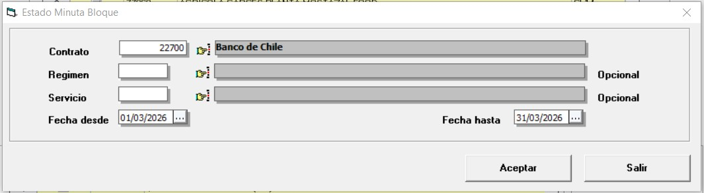

Figura 74: % Ponderación

**Descripción General:**

Esta opción permite cambiar el estado de una minuta que se encuentra bloqueada, de modo que pueda ser editada nuevamente y reenviada al sitio correspondiente. Para realizar este proceso, es necesario ingresar el centro de costo, mientras que el régimen, el servicio y el rango de fechas desde y hasta son parámetros opcionales que pueden utilizarse para acotar la búsqueda o aplicar el desbloqueo de manera más específica. Esta funcionalidad facilita la corrección y actualización de minutas que requieren ajustes posteriores a su envío.

**Funcionalidad:**

Ingreso de identificador(es) de minuta(s) a modificar (campos numéricos enteros).

Selección del rango de fecha desde/hasta.

Selección del estado destino para las minutas.

Ejecución masiva del cambio de estado con confirmación.

**Reglas de Negocio:**

El cambio de estado de minuta es irreversible una vez que pasa a estado "Aprobado" o "Enviado". Solo usuarios con perfil de administrador pueden hacer cambios en esos estados.

Debe ingresarse al menos un identificador de minuta válido.

La fecha "desde" es obligatoria.

**Tablas Relacionadas:**

Tabla Minuta (Cas_b_minuta)

**Mejoras:**

Si desarrollamos la mejora que publica la minuta completa (mes o ciclo) y el sitio la edita parcialmente en la medida que se generan los carros, la opción de cambiar estado, será requerida solo para habilitar los cambios centrales y reenviar la minuta a la operación. Ejemplo, planificación de una nueva estructura, eliminación de una estructura, etc. aplica desde la fecha del cambio sin alterar los días previos, ni los datos que la operación pueda haber modificado en estos días previos.

## 8.16. Actualizaciones Varias – Porcentaje Ponderación (P_CamEstMin.frm)

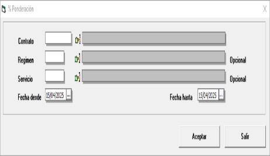

Figura 75: Actualización % Ponderación

**Descripción:**

Esta opción permite actualizar los porcentajes de ponderación y las raciones de la minuta asociada a un centro de costo, asegurando que la información utilizada en los cálculos refleje los valores correctos y recién ajustados. Esta funcionalidad facilita mantener la minuta alineada con los requerimientos operativos del sitio y garantiza que los datos aplicados en la planificación y en los costos sean los más recientes y precisos.

**Funcionalidad:**

Actualización masiva del % ponderación para un conjunto de minutas identificadas por los parámetros ingresados.

Permite normalizar el porcentaje de ponderación para un centro de costo entre distintos regímenes y servicios dentro de un periodo.

**Reglas de Negocio:**

El cambio masivo de % ponderación actualiza el valor para todas las minutas en el rango de fechas especificado que coincidan con los identificadores ingresados.

**Tablas Relacionadas:**

Tabla Minuta (cas_b_minuta)

Tabla Minuta Det (cas_b_minutadet)

**Mejoras:**

Sacar esta opción.

## 8.17. Actualizaciones Varias – Cambiar pedido Proyectado a CD o PAP y Eliminar Carro de Compra (P_CambioCarro.frm / P_EliminarCarroCompras.frm)

**Cambiar pedido Proyectado a CD o PAP**

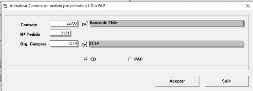

Figura 76: Actualizar Cambio de Pedido Proyectado a CD o PAP

**Descripción:**

Esta opción permite realizar el cambio de carros proyectados, transformando su condición para que operen como CD o bien como PAP según las necesidades del proceso. Para efectuar esta modificación, es necesario ingresar el centro de costo, el número de pedido y la organización de compras, además de seleccionar la opción a la que se desea transformar el pedido, ya sea CD o PAP. Esta funcionalidad facilita ajustar la modalidad del carro proyectado de acuerdo con los requerimientos operativos y logísticos del centro de costo.

**Funcionalidad:**

cambio del tipo de carro de compras asociado a una minuta (entre rutas CD o PAP). Permite reasignar ingredientes entre canales logísticos.

**Reglas de Negocio:**

El carro de compra se genera desde la minuta teórica. Las modificaciones posteriores del sitio no afectan el carro de compra ya generado.

**Tablas Relacionados:**

Tabla Encabezado Pedido (b_pedidocentralizado)

Tabla Detalle Pedido (b_pedidocentralizadodet)

Tabla Pedido Parametro (b_pedidocentralizadopar)

**Eliminar carro de compras**

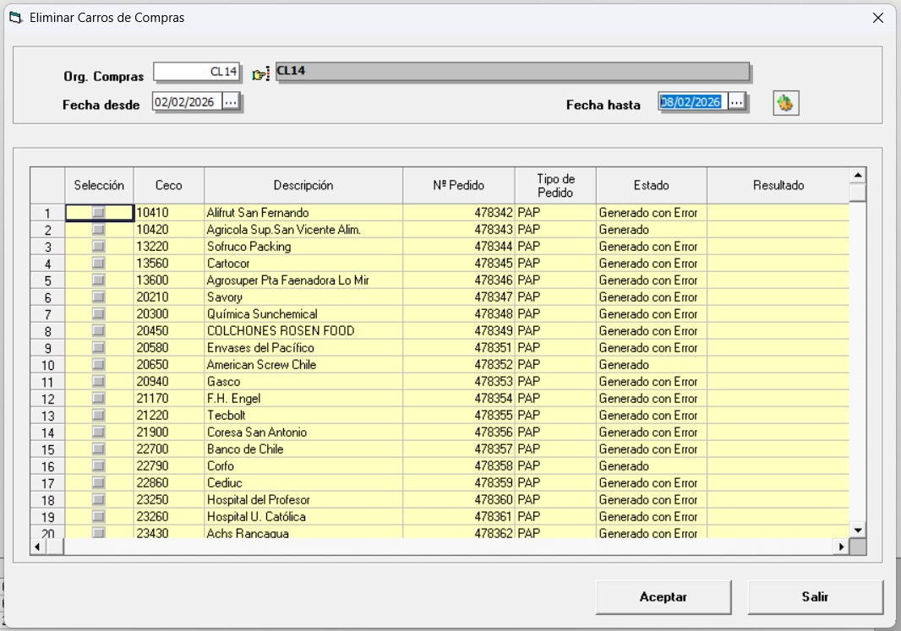

Figura 77: Eliminar Carros de Compras

**Descripción:**

Esta opción permite eliminar los carros de compras que hayan sido generados en una semana determinada, facilitando la depuración o corrección de información dentro del proceso operativo. Para realizar esta operación, es necesario ingresar la organización de compras y seleccionar el periodo correspondiente al carro, el cual se gestiona de manera semanal. Luego, el sistema mostrará en una grilla el detalle por centro de costo, donde el usuario deberá seleccionar específicamente los carros que desea eliminar, asegurando así un control preciso y manual del proceso de eliminación.

**Funcionalidades****:**

Filtros de búsqueda: Fecha Desde y Fecha Hasta (campos con selector de calendario).

Muestra los carros de compra existentes en el período con 7 columnas de información (centro costo, período, fecha, estado, etc.).

Selección de carros a eliminar.

Botón de ejecución de eliminación con confirmación previa.

**Reglas de Negocio****:**

Solo pueden eliminarse carros en estado "Pendiente" o "Rechazado". Los carros en estado "Enviado" o "Procesado" no pueden eliminarse.

La eliminación de un carro es irreversible y elimina también el detalle de pedido asociado.

El rango de fechas es obligatorio para la búsqueda.

Debe seleccionarse al menos un carro antes de ejecutar la eliminación.

El borrado del carro es físico.

**Tablas Relacionadas:**

Tabla Pedido Centralizado (b_pedidocentralizado)

Tabla Detalle Pedido (b_pedidocentralizadodet )

Tabla Pedido Parametro (b_pedidocentralizadodet)

## 8.18. Actualizaciones Varias – Cambiar Estado Pedido (P_CambioCarro.frm)

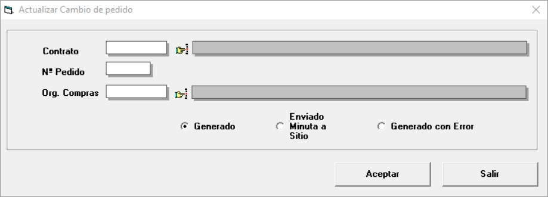

Figura 78: Actualizar Cambio de Pedido

**Descripción General:**

Esta opción permite realizar el cambio de estado de un carro, pudiendo modificarlo entre las condiciones Generado, Enviando Minuta Sitio o Generado con Error, según corresponda a la situación operativa. Para efectuar este cambio es necesario ingresar el centro de costo, el número de pedido y la organización de compras, además de seleccionar el nuevo estado al que se desea actualizar el carro, eligiendo entre Generado, Enviando Minuta Sitio o Generado con Error. Esta funcionalidad facilita la gestión y regularización del estado de los carros dentro del flujo operativo, permitiendo corregir incidencias y mantener la trazabilidad adecuada del proceso.

**Funcionalidades****:**

Contrato / N° Pedido / Org. Compras: Permite ingresar o buscar los datos asociados al pedido que se desea actualizar. El ícono de búsqueda permite seleccionar los valores desde una lista disponible en el sistema.

**Estado del Cambio de Pedido:**** **El usuario puede consultar o actualizar el estado del cambio del pedido seleccionando una de las siguientes opciones:

**Generado:** Indica que el pedido fue creado correctamente.

**Enviado Minuta a Sitio:** Indica que la información del pedido ya fue enviada al sitio correspondiente.

**Generado con Error:** Indica que ocurrió un problema durante la generación del cambio de pedido.

Aceptar: Procesa la actualización según los datos ingresados y el estado seleccionado.

Salir: Cierra la ventana sin realizar cambios.

**Tipo ****de Negocio****:**

Para realizar el cambio de estado, el pedido no puede encontrarse en estado “Enviado Minuta a Sitio”.

**Tablas Relacionadas:**

Tabla Pedido Centralizado (b_pedidocentralizado)

Tabla Centro Costo (b_clientes)

Tabla Organización Compras (i_org_ceco)

## 8.19. Actualizaciones Varias – Exportar Tabla Gramaje – Bach Input   (P_ExpTGranejeBachInput.frm)

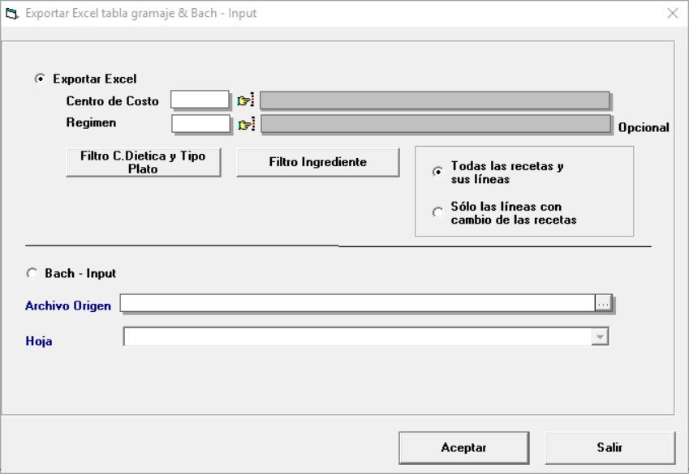

Figura 79: Exportar Excel Tabla Gramaje & Back - Input

**Descripción General:**

Esta opción ofrece dos funcionalidades: la primera permite descargar en formato Excel la tabla de gramaje correspondiente a un centro de costo, utilizando para ello las distintas opciones disponibles en la pantalla; la segunda permite subir una planilla Excel que contenga datos modificados de la tabla de gramaje y actualizar dicha información en el sistema. Para ejecutar la primera operación, es necesario ingresar el centro de costo y, de manera opcional, el régimen, junto con sus filtros de categoría dietética y tipo de plato, además del filtro de ingredientes. También se puede elegir entre descargar todas las recetas con sus líneas asociadas o solo aquellas líneas que hayan tenido cambios en la receta. Para la segunda operación, correspondiente al modo batch o input, se puede cargar un archivo Excel con las modificaciones realizadas en la tabla de gramaje, permitiendo actualizar los datos de manera masiva y eficiente.

**Funcionalidades****:**

Selector de modalidad: "Exportar Excel", por defecto) o "Bach - Input".

Filtro de Categoría Dietética y Tipo de Plato: botón "Filtro C.Dietica y Tipo Plato".

Filtro de Ingrediente: botón "Filtro Ingrediente".

Selector de alcance de exportación:

"Todas las recetas y sus líneas", por defecto)

"Sólo las líneas con cambio de las recetas".

Selección de centro costo.

Campo de texto para rutas o filtros adicionales.

Botones Aceptar y Salir.

**Reglas de Negocio****:**

El modo "Bach-Input" genera un archivo con el formato específico requerido, para la carga masiva de gramajes, incluyendo los códigos de ingredientes y centros de costo.

El modo "Solo líneas con cambio" exporta únicamente los productos cuyo gramaje difiere del gramaje estándar de la receta (niveles 1-3).

El modo "Exportar Excel" genera un archivo editable que puede reimportarse al sistema mediante el mismo formulario o por proceso batch.

Debe seleccionarse al menos un centro costo antes de ejecutar la exportación.

Un proceso de carga masiva de gramaje no debe eliminar registros automáticamente. Si un valor alternativo de gramaje es igual al valor de la receta maestra, el sistema debe advertir al usuario. La eliminación de registros de gramaje siempre debe ser un acto humano explícito.

**Tablas Relacionadas:**

Tabla Gramaje (b_tablagramajececo)

Tabla Gramaje Nivel (b_tablagramajececo_nivel)

Tabla Receta (b_receta)

Tabla Receta Det (b_recetadet)

Tabla Ingrediente (b_ingrediente)

Tabla Centro Costo (b_clientes)

Tabla Regimen (a_regimen)

**Mejoras:**

**En la planilla Excel, aplica una ****fórmula**** para las columnas de bruto y neto, aplicar una formula en ambos campos. Si digito en campo bruto calcula el neto, si digito el neto se calcula bruto(opción).**

**Opción**** para volver dato origen en la tabla de gramaje.**

## 8.20. Actualizaciones Varias - Actualizar Ajuste Estacionales Recetas (P_ActualizarAjusteEstacionales.frm)

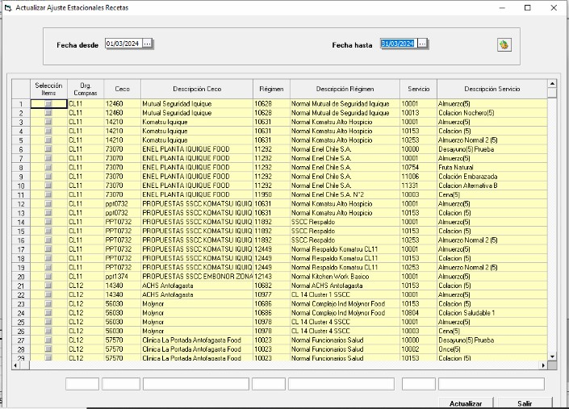

Figura 80: Actualizar Ajuste Estacionales Recetas

**Descripción:**

Esta opción permite actualizar los cambios de receta dentro de la planificación de minutas en función de una tabla de ajustes estacionales de recetas, asegurando que la minuta refleje las variaciones definidas para cada periodo. Para realizar esta operación, se debe seleccionar la fecha desde y la fecha hasta que delimitarán el rango sobre el cual se aplicarán los ajustes. Como detalle, el sistema mostrará en la grilla la información correspondiente a la organización de compras, el centro de costo, el régimen y el servicio involucrado. En la primera columna se podrá seleccionar los ítems que se desean actualizar, permitiendo aplicar los cambios de manera controlada y precisa según los ajustes estacionales establecidos.

**Funcionalidad:**

Alta, modificación y eliminación de ajustes estacionales.

Campos: receta origen, receta destino, fecha inicial (MMDD), fecha final (MMDD).

La misma receta origen puede tener múltiples recetas destino para distintos períodos del año.

Actualización masiva de la minuta con el ajuste estacional.

**Reglas de Negocio:**

Los ajustes estacionales definen la sustitución de la receta origen por la receta destino durante el período Fecha Inicial/Fecha Final (formato MMDD, sin año). Esta sustitución aplica a nivel de minuta y es diferente de la estacionalidad de la receta.

La fecha del ajuste estacional se expresa en formato MMDD sin año, por lo que aplica año a año en forma recurrente.

**E**l usuario debe aplicarla manualmente.

Los períodos de ajuste pueden superponerse para la misma receta origen.

**Tablas Relacionadas:**

Tabla Estacionalidad (b_ajusteestacionales)

Encabezado Minuta (cas_b_minuta)

Detalle Minuta (cas_b_minutadet)

Tabla Clientes (b_clientes)

## 8.21. Asignar Lista de Precio a Propuesta (P_AsigListaPrecioPro.frm)

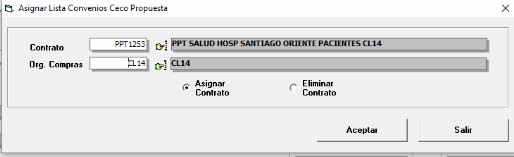

Figura 82: Asignar Lista Convenios Ceco Propuesta

**Descripción:**

Esta opción permite crear o eliminar una lista de precios asociada a los convenios vigentes. Para realizar la asignación de una lista, es necesario ingresar un centro de costo de tipo propuesta que haya sido previamente definido en el mantenedor de casino, junto con la organización de compras correspondiente. A partir de esta información, el sistema crea o elimina los convenios asociados al sitio en modalidad propuesta, permitiendo administrar de forma flexible la configuración de precios y asegurar que estos se mantengan correctamente actualizados dentro del proceso. Esta sección debe mantenerse al día para garantizar la correcta operatividad del sistema y la coherencia en los costos aplicados.

**Funcionalidad:**

Selección del centro de costo tipo Propuesta (Tipo Centro costo = 1).

Asignación de la lista de precio a utilizar para el cálculo de costo de esa propuesta.

La lista de precio asignada reemplaza el convenio SAP estándar en todos los cálculos de costo para ese centro costo durante la vigencia de la propuesta.

**Reglas de Negocio:**

Tipo Centro costo 1 (Propuesta) usa la lista de precio asignada manualmente por esta pantalla. 

Solo los centros de costo de tipo "Propuesta" (Tipo Centro costo = 1) pueden recibir asignación de lista de precio desde esta pantalla.

Se actualizan la minuta de este mes y futuras (Food y propuesta Activas).

**Tablas Relacionadas:**

Tabla Centro Costo (b_clientes)

Tabla Organización Compras (i_org_ceco)

Tabla Precio Ingrediente (b_precio_ingrediente)

## 8.22. Pantalla LED – Parametrización (M_EstructuraServicioPanLed.frm)

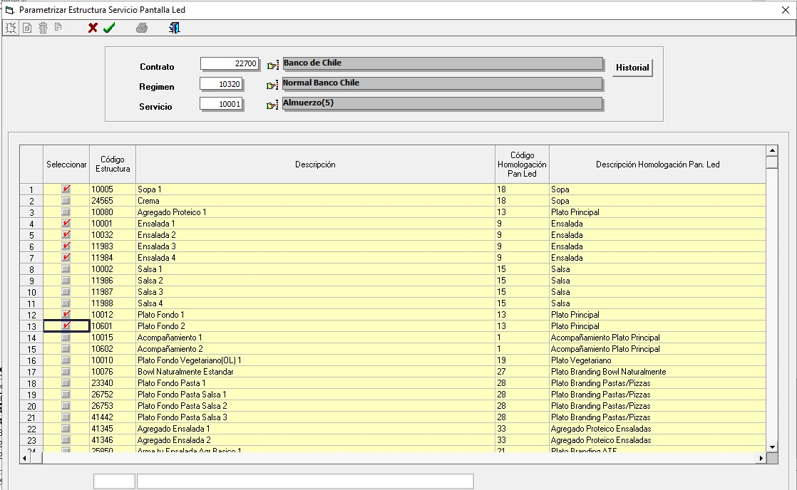

Figura 83: Parametrizar Estructura Servicio Pantalla LED

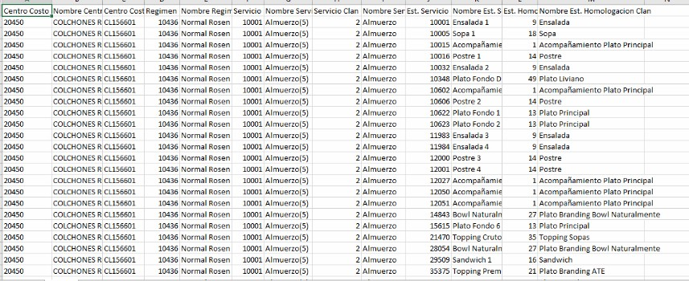

Figura 84: Informe Parametrizar Estructura Servicio Pantalla LED

**Descripción:**

Esta opción permite parametrizar los sitios, regímenes y servicios que serán desplegados en la pantalla LED, definiendo qué información será visible para cada centro de costo. Para realizar esta operación, se debe seleccionar el centro de costo junto con el régimen y el servicio correspondiente. Luego, en el detalle, es necesario elegir la estructura que se mostrará en la pantalla LED, asegurando que la visualización responda a los requerimientos operativos y comunicacionales del sitio.

**Funcionalidad:**

Alta, modificación y eliminación de registros de homologación.

Campos: centro costo, régimen, servicio, estructura de servicio, número de línea en pantalla y estado activo.

Solo las homologaciones con Activo = '1' se procesan al publicar en pantalla.

Registro automático de fecha de creación y modificación para auditoría.

**Reglas de Negocio:**

La pantalla LED muestra el menú del día según la combinación centro costo + régimen + servicio + estructura de servicio definida en homologación Pantalla Led. Si no existe homologación, no se muestra contenido en esa línea.

Validar existencia de homologación antes de publicar contenido en pantalla LED. Si no existe, no mostrar contenido (sin error visible para el usuario).

**Tablas Relacionadas:**

Tabla Regimen (a_regimen)

Tabla Servicio (a_servicio)

Tabla Clientes (b_clientes)

Tabla Estructura Servicio (a_estservicio)

Tabla Pantalla Led (homologacionpantalla_led)

# 9. Glosario

| Término | Definición | Contexto de uso |
| --- | --- | --- |
| Receta | Preparación culinaria definida por sus ingredientes, cantidades, método de elaboración y atributos AMD. Unidad fundamental del módulo. | Submódulo  Recetas |
| Ingrediente | Insumo/producto utilizado en la composición de una receta. Tiene aportes nutricionales, %  aprovechamiento, % cocción, % nutricional, huella de carbono, PAVB y precio de costo. | b_ingrediente |
| Producto | Nivel comercial sobre el ingrediente. Representa el artículo tal como se compra: tiene código de barras, presentación, precio unitario y factor de conversión a ingrediente ( pro_UniFactorIng ). Maestro en  b_productos . | b_productos , pedidos |
| Minuta | Planificación de menú para un período determinado. Define qué recetas se sirven en cada servicio, régimen y día. En el nuevo sistema, la "Minuta Bloque" pasa a llamarse simplemente "Minuta". | Submódulo  Minutas |
| Minuta Bloque | Formato de minuta que organiza las recetas en bloques por servicio/día/estructura. Es el formato principal del sistema. | M_MinBloqueADM2.frm |
| Minuta Estándar (SR1/SR2) | Formato alternativo de minuta en función de  sub-segmento , régimen y servicio. Formularios M_MinSR1.frm, M_MinSR2.frm. | Formatos especiales |
| Categoría Dietética | Clasificación nutricional de la receta. Árbol jerárquico definido en  a_recetacatdie  (estructura padre-hijo). | M_Receta.frm |
| Tipo de Plato | Clasificación del plato dentro del menú (entrada, fondo, postre, colación, etc.). Árbol jerárquico en  a_recetatippla . | M_Receta.frm |
| Régimen | Tipo de alimentación del comensal (Normal, Hiposódico, Diabético, Bajo en Calorías, etc.). La tabla de gramaje se aplica por régimen. | a_regimen |
| Servicio | Instancia de alimentación del día (Desayuno, Almuerzo, Once, Cena, Colación). La minuta se organiza por servicio. | a_servicio |
| Estructura de Servicio | Subclasificación dentro de un servicio (ej.: "Almuerzo Estándar", "Almuerzo Vegetariano"). Define qué tipos de plato tiene disponibles. | a_estservicio |
| Tabla de Gramaje | Ajuste de cantidades de ingredientes de una receta según régimen, sitio o tipo de plato. Opera en jerarquía de 4 niveles. Gestiona el gramaje por  ceco  en  b_tablagramaje_nivel . | M_TabGra.frm ,  b_tablagramaje |
| Tabla de Gramaje  Ceco  ( b_tablagramajececo ) | Posible nivel adicional de gramaje específico por  ceco  + régimen + receta + ingrediente. Confirmar si es un nivel 0 (máxima prioridad) de la jerarquía estándar. | b_tablagramajececo |
| Tabla de Gramaje  Ceco  Nivel  ( b_tablagramajececo_nivel ) | Define sustituciones de ingredientes por  ceco , régimen y tipo de plato. Ejemplo: el sitio X usa azúcar morena en vez de azúcar blanca para el régimen diabético. | b_tablagramajececo_nivel |
| Líder / Seguidor | Relación entre minutas: el casino líder diseña la minuta y la propaga a sus casinos seguidores. Los seguidores pueden modificar localmente. | M_Copia_Minuta_Lideres.frm |
| Aporte Nutricional | Valor nutritivo (calorías, proteínas, carbohidratos, lípidos, sodio, etc.) aportado por una receta o minuta. Calculado sobre el peso neto del ingrediente. | Informes nutricionales |
| Base de Ración | Cantidad base en gramos de la preparación para un comensal estándar. Definida en el encabezado de la receta ( rec_basrac ). | b_receta |
| % Aprovechamiento | Factor de merma en preparación ( red_pctapr ). Cuánto del ingrediente bruto es aprovechable. Fórmula: Cantidad Servida = ((%  Aprov  / 100) × Cant. Bruta) × (% Cocción / 100). | b_recetadet |
| % Cocción | Factor de merma por cocción del ingrediente ( red_pctcoc ). Aplica después del aprovechamiento. | b_recetadet |
| % Nutricional | Fracción del ingrediente que aporta al cálculo nutricional ( red_pctnut ). Cantidad Neta = (%  Nut  / 100) × Cant. Bruta. | b_recetadet |
| G. Neto | Peso neto total de la receta = Σ cantidad neta de todos los ingredientes. | Cálculos de receta |
| P.A.V.B. | Proteína de Alto Valor Biológico. Indicador de calidad proteica calculado sobre los ingredientes de la receta. SP:  sgpadm_s_calpavb . | Informes nutricionales |
| Molécula Calórica | Distribución de calorías entre Proteínas / Carbohidratos /  Lípidos. Principalmente en contratos de salud donde el contrato define el objetivo calórico diario. | Contratos de salud |
| Huella de Carbono | Atributo ambiental del ingrediente. La receta calcula: Σ (Cantidad Bruta × Huella Carbono del ingrediente). | b_ingrediente ,  b_receta |
| Oferta | Disponibilidad de una receta para ser utilizada en minutas de una zona/período específico. Se almacena en  b_receta_Oferta . Parámetro AMD. | b_receta_Oferta |
| Estacionalidad | Atributo de receta que indica en qué estaciones del año está disponible. En  b_recetaEstacionalidad . Parámetro descriptivo para AMD (no genera sustituciones). | b_recetaEstacionalidad |
| Ajuste Estacional  ( b_ajusteestacionales ) | Mecanismo de sustitución activa de recetas en la minuta según período del año ( FechaInicial / FechaFinal  MMDD). Diferente de la estacionalidad: es una acción concreta de reemplazo. | M_AjusteEstacionales.frm |
| AMD | Herramienta de Diseño Automatizado de Minutas. Sistema externo que consume parámetros de recetas SGP para proponer minutas automáticas. | Parámetros AMD,  b_receta |
| Tipo de Ingrediente Principal | Parámetro más crítico para AMD. Define la frecuencia de aparición de la receta en el diseño de la minuta. Tabla:  a_tipoingredienteprincipalreceta . | b_receta , AMD |
| Batch Input | Proceso de carga masiva de la minuta vía Excel (descarga, edición offline, carga al sistema). Formulario  P_ActComExcel.frm . | P_ActComExcel.frm |
| Pantalla LED | Pantalla digital en el casino que muestra el menú del día. Se parametriza desde  M_EstructuraServicioPanLed.frm  mediante la tabla  homologacionPantalla_Led . | homologacionPantalla_L e d |
| Homologación Pantalla LED | Tabla que define qué combinación  ceco  + régimen + servicio + estructura de servicio corresponde a cada línea en la pantalla digital del casino. Sin homologación, la línea aparece vacía. | homologacionPantalla_L e d |
| Convenio SAP  ( I_convenio_sap ) | Precios y condiciones negociadas con proveedores, sincronizadas desde SAP. Fuente principal de precios para el cálculo de costos de pedidos y minutas. Incluye vigencia temporal, precio neto, precio SAP, precio unitario y factor de redondeo. | I_convenio_sap |
| Formato de Compras SAP  ( b_formatocompras_sap ) | Catálogo de materiales del sistema SAP sincronizados con SGP. Define código, denominación, unidad de medida base y factor de conversión de cada material. | b_formatocompras_sap |
| Mapeo SAP-SGP  ( b_formatocompras_sap_sgp ) | Tabla de equivalencias entre código de material SAP y código de ingrediente/producto SGP. Crítica para el cálculo de precios  mediante convenios SAP. Sin este mapeo, el precio SAP no puede calcularse. | b_formatocompras_sap_sgp |
| Excepción Formato Compra  ( b_Pedido_ExcepcionFormatoCompra ) | Configuración por ce ntro  co sto  e ingrediente que indica que debe usarse un formato de compra (material SAP) diferente al estándar al generar el pedido centralizado. Tiene vigencia temporal y precedencia sobre el convenio estándar. | b_Pedido_ExcepcionFormatoCompra |
| Ce ntro  co sto  Normal (Tipo 0) | Centro de costo de operación regular. Usa precio de convenio SAP estándar para el cálculo de costos. | Cálculo de costos |
| Ce ntro  co sto  Propuesta (Tipo 1) | Centro de costo para propuestas comerciales. Usa lista de precio asignada manualmente desde  P_AsigListaPrecioPro.frm . | P_AsigListaPrecioPro.frm |
| Días de Holgura | Parámetro logístico por familia de producto que define el adelanto del pedido respecto a la fecha de necesidad. Corta vida útil: 2 días; larga vida útil: 3 días; sitios mineros: 7-9 días. | Generación de pedidos |
| Sansys  / Justicia | Nombre histórico de un tipo de contrato. Los informes " Sansys " deben renombrarse a "Aporte Nutricional Justicia" o "Composición Minuta" en el nuevo sistema. | C_AporteSansis.frm |
| Sub-segmento | División del cliente/contrato (ej.: ejecutivos, obreros). Determina qué estructura de servicio y qué régimen aplica. | Estructuras de minuta |

# 10. Calculo Precio Minuta

## 10.1. Centro de Costo Normal (tipoCeco = 0)

**Objetivo**:

Calcular el precio del ingrediente usando convenios SAP para sitios reales.

**Flujo**:

Se identifican los ingredientes (originales o reemplazados según jerarquía definida en la tabla de gramaje).

Se consultan precios en: 

b_precio_ingrediente (precios base).

I_CONVENIO_SAP (condiciones del convenio).

b_formatocompras_sap (tipo de formato de compra).

b_Pedido_ExcepcionFormatoCompra (excepciones).

Se asigna un orden de prioridad: 

Excepción activa → prioridad alta.

Formato de compra igual al del cliente → prioridad alta.

Condiciones del convenio → prioridad media.

Otros casos → prioridad baja.

Se selecciona el precio más conveniente (ORDER BY orden, Precio).

Se actualiza la tabla temporal #tabla con: 

Convenio = precio seleccionado.

Producto asociado (pro_codigo, pro_nombre, pro_facing).

**Resultado:**

Precio por convenio para cada ingrediente, considerando reglas comerciales y vigencia.

## 10.2. Centro de Costo Propuesta (tipoCeco = 1)

**Objetivo:**Calcular el precio del ingrediente para sitios propuestos, aplicando convenios y precios comerciales.

**Flujo:**

Se identifican los ingredientes (originales o reemplazados según jerarquía definida en la tabla de gramaje).

Se consultan precios en: 

b_precio_ingrediente (precios base).

I_CONVENIO_SAP (condiciones del convenio).

b_formatocompras_sap (tipo de formato de compra).

b_Pedido_ExcepcionFormatoCompra (excepciones).

Se asigna el mismo orden de prioridad que en centro de costo normal.

Si no hay precio por convenio: 

Se busca en b_precio_ingrediente_comercial (precio comercial activo).

Se actualiza la tabla temporal #tabla con: 

Convenio = precio seleccionado (convenio o comercial).

Producto asociado.

**Resultado:**

Precio por convenio o comercial para cada ingrediente, asegurando cobertura en sitios propuestos.

# 11. Tabla de Gramaje

La función busca un ingrediente de reemplazo para otro ingrediente dentro de una receta, siguiendo una serie de reglas jerárquicas. Esto se usa cuando, por ejemplo, un ingrediente no está disponible y se necesita saber cuál es el sustituto correcto según las políticas del centro de costo.

Las reglas de búsqueda son:

Nivel 1: Si hay una regla exacta para ese centro de costo, régimen, receta e ingrediente en la tabla de gramaje estándar.

Nivel 2: Si no hay en nivel 1, busca una regla para centro de costo + régimen + ingrediente + tipo de plato en la tabla por nivel.

Nivel 3: Si tampoco hay, busca para centro de costo + régimen + ingrediente (sin tipo de plato).

Nivel 4: Última opción: centro de costo + ingrediente (sin régimen ni tipo de plato).

Si no hay información en los cuatro niveles anteriores, se considera el ingrediente y gramaje de la receta patrón.

# 12. Cálculos Nutricionales Aportes Nutricionales

## 12.1. Calculo Aporte Nutricional

((((% nutricional / 100) * (cantidad aporte * (cantidad bruta o bien tabla de gramaje/ base receta))) / factor nutricional del ingrediente))

## 12.2. Calculo Proteína de Alto Valor Biológico

Cálculo de PAVB (Proteína de Alto Valor Biológico): PAVB = Σ ((% Nutricional/100) × (aportes proteína × Cantidad Bruta) / factor nutricional). PAVB% = (Total PAVB / raciones / Σ proteínas) × 100.

## 12.3. Cálculo de Huella de Carbono

Cálculo de huella de carbono por receta: Σ (Cantidad Bruta × Huella Carbono del ingrediente).

# 13. Mejoras transversales.

Eliminar palabra “Bloque” de todos los nombres de pantalla.

Mejorar formato de descarga de Excel. Debe contener mismas columnas ordenadas que la visualización previa. 

Quitar que los filtros se mantengan con la última opción hecha por el usuario (al cambiar de pantalla deben venir en blanco)

Actualmente, los convenios de materiales en SAP no consideran los impuestos adicionales dentro del precio. Es necesario aplicar dichos impuestos para obtener un cálculo correcto tanto de la receta como del costo de la minuta del sitio.Para ello, los impuestos adicionales deben obtenerse desde el maestro de producto.
