# LEVANTAMIENTO DE FUNCIONALIDADES

## MÓDULO DE PRODUCCIÓN - SGP LOCAL

*Análisis AS IS - Situación Actual*

Febrero 2026

---

## Índice

- [1. Resumen Ejecutivo](#1-resumen-ejecutivo)
- [2. Situación Actual](#2-situación-actual)
  - [2.1 Descripción General](#21-descripción-general)
  - [2.2 Arquitectura de Componentes](#22-arquitectura-de-componentes)
  - [2.3 Problemas Identificados](#23-problemas-identificados)
    - [Ajustes manuales de información](#ajustes-manuales-de-información)
    - [Actividades manejadas en papel](#actividades-manejadas-en-papel)
    - [Perdida de trazabilidad de la información](#perdida-de-trazabilidad-de-la-información)
- [3. Funcionalidades por Componente](#3-funcionalidades-por-componente)
  - [3.1 Componente PLANIFICACIÓN REAL](#31-componente-planificación-real)
  - [3.1.1 Planificación Real](#311-planificación-real)
  - [3.2 Componente SALIDA A PRODUCCIÓN](#32-componente-salida-a-producción)
  - [3.2.1 Requisición](#321-requisición)
  - [3.2.2 Adicionales de Servicio](#322-adicionales-de-servicio)
  - [3.2.3 Salida a Producción](#323-salida-a-producción)
  - [3.2.4 Devolución Salida a Producción](#324-devolución-salida-a-producción)
  - [3.3 Componente VENTAS](#33-componente-ventas)
  - [3.3.1 Venta Directa](#331-venta-directa)
  - [3.3.2 Venta Cafetería](#332-venta-cafetería)
  - [3.3.3 Venta Servicios Especiales](#333-venta-servicios-especiales)
  - [3.3.4 Control de Raciones](#334-control-de-raciones)
  - [3.3.5 Ventas Servicio Contado](#335-ventas-servicio-contado)
  - [3.3.6 Precio Venta Cliente](#336-precio-venta-cliente)
  - [3.3.7 Lista de Precio Cafetería](#337-lista-de-precio-cafetería)
  - [3.4 Componente MERMA](#34-componente-merma)
  - [3.4.1 Raciones no Vendidas](#341-raciones-no-vendidas)
  - [3.5 Componente CIERRE DIARIO](#35-componente-cierre-diario)
  - [3.5.1 Cierre diario](#351-cierre-diario)
- [4. Mejoras adicionales](#4-mejoras-adicionales)
- [5. Glosario](#5-glosario)

---

# 1. Resumen Ejecutivo

El Módulo de Producción de SGP Local administra de principio a fin el proceso operativo de alimentación en los sitios de Sodexo, permitiendo ajustar la minuta planificada por AMD, gestionar requisiciones y salidas de bodega, controlar la preparación y servicio de recetas, registrar mermas y ventas efectivas, además de manejar flujos paralelos como ventas especiales y productos sin preparación, información clave para el control de inventario, el cálculo de food cost y la eficiencia operativa del sitio.

# 2. Situación Actual

## 2.1 Descripción General

El **Módulo de Producción** de SGP Local gestiona el ciclo operativo completo de alimentación en los sitios de Sodexo, desde la recepción de la minuta planificada por el área de Automatic Menu Design (AMD) hasta el registro final de las raciones efectivamente vendidas a los comensales.

El proceso se inicia cuando AMD libera la minuta con las recetas y raciones teóricas para un período determinado. Cada sitio recibe esta planificación y la ajusta a su realidad operativa, modificando ponderaciones, cantidades de comensales y, si es necesario, reemplazando recetas. Esta minuta se libera a SGP Administrador y en la medida en que se generan los carros, se visualiza en SGP local la respectiva semana de planificación para que la operación ajuste la planificación real.

A partir de esta planificación real, el Encargado de Producción genera la requisición de insumos que será entregada al bodeguero para el despacho de productos desde bodega, momento en el cual el sistema registra la salida de producción y rebaja el inventario.

Una vez despachados los insumos, el equipo de cocina ejecuta la preparación de las recetas, el porcionamiento y el armado de la línea de servicio. Durante y después del servicio pueden ocurrir solicitudes adicionales de productos, devoluciones de insumos no utilizados y el registro de mermas (producción, desconche y pan). Finalmente, se registran las raciones vendidas, dato clave para el cálculo de Food Cost y la medición de eficiencia operativa del sitio.

El módulo también contempla flujos paralelos como las **ventas especiales** (eventos no planificados) y la **venta directa** de productos sin preparación, ambos con su propio esquema de costeo independiente del servicio regular.

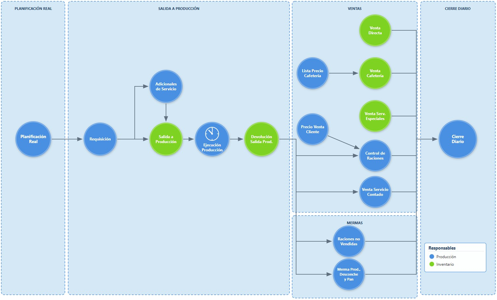

## 2.2 Arquitectura de Componentes

| Componente | Descripción | Responsable |
| --- | --- | --- |
| PLANIFICACIÓN REAL | Ajuste de minuta para los servicios futuros, confirmando o cambiando los comensales, ya sea a nivel de total o por receta y/o agregar preparaciones | Encargado de Producción |
| SALIDA A PRODUCCIÓN | Proceso de solicitud de productos asociados a las recetas por servicio, junto con su salida de bodega. Incluye la solicitud de productos adicionales y sus respectivas salidas, además del proceso de devolución desde producción. | Encargado de Producción/Bodeguero |
| VENTAS | Existen listado de ventas relacionadas a servicios especiales, cafetería y venta directa, los cuales generan solicitudes a bodega y rebaja de inventario. Adicionalmente se consideran el control de raciones vendidas y ventas servicio contado. | Encargado de Producción/Bodeguero |
| MERMAS | Registro de raciones no vendidas, mermas de producción, mermas de desconche y de pan. | Encargado de Producción |
| CIERRE DIARIO | Una vez ingresada toda la información, se realiza el cierre diario del sitio, previa validación de las reglas configuradas. | ADC |

## 2.3 Problemas Identificados

### Ajustes manuales de información

- En algunas pantallas no existe un recalculo de datos si existe alguna modificación. Por ejemplo, en la pantalla de planificación real.

### Actividades manejadas en papel

- Gran cantidad de actividades se llevan por medio de papeles impresos o escritos a mano y no dentro del sistema.

### Perdida de trazabilidad de la información

- En algunos casos la información ingresada, reemplaza lo existente anteriormente, causando perdida de trazabilidad sobre los cambios realizados, causando que algunos reportes no muestren la realidad.

# 3. Funcionalidades por Componente

## 3.1 Componente PLANIFICACIÓN REAL

Gestiona las raciones ponderadas y comensales totales de cada día para las minutas planificadas reales.

| ID | Funcionalidad | Estado | Tipo |
| --- | --- | --- | --- |
| 1 | Planificación Real | Activo | Planificación Real |

## 3.1.1 Planificación Real

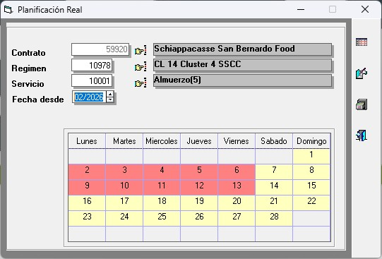

*Imagen 1: Pantalla filtrado inicial*

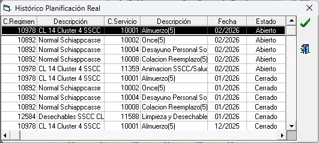

*Imagen 2: Histórico de Planificaciones*

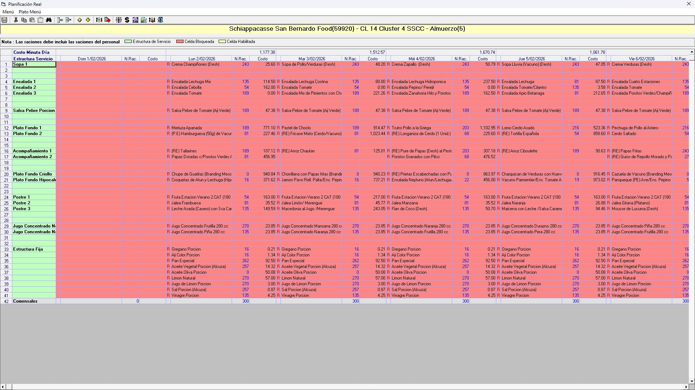

*Imagen 3: Planificación Real de Minuta.*

<u>**Descripción General:**</u>

- Para realizar el filtro se debe indicar obligatoriamente los datos de Régimen, Servicio y Fecha desde. (Imagen 1)

- La búsqueda se puede realizar de 2 formas:

  - Eligiendo el régimen y servicio directamente desde sus respectivos listados, y además la fecha que corresponde al mes.

  - Presionando el tercer botón de la derecha, el cual mostrará un listado con el histórico de planificaciones desde donde se podrá seleccionar una para rellenar los filtros de la pantalla (Imagen 2)

- Esto hará que el calendario de la pantalla de filtro muestre los días planificados del mes seleccionado, diferenciando por colores aquellos días que estén bloqueados de los que no, según la regla especificada en la sección reglas de negocio.

- Al presionar el botón Planificación Real (primer botón de la derecha), desplegará una pantalla con una matriz con las recetas por día y estructura de servicio. (Imagen 3)

- En esta pantalla se podrán editar los comensales totales, comensales por receta (raciones ponderadas), agregar recetas, consultar recetas y ver los costos asociados.

- Esta pantalla mostrará lo siguiente:

  - El costo techo ingresado para el contrato/régimen/servicio/período obtenido del mantenedor correspondiente.

  - El costo diario de la minuta en la parte superior de cada día.

  - Las Estructuras Servicios asociadas a las preparaciones a la izquierda de todo.

  - Por cada día del período elegido, se mostrarán 4 columnas:

    - Tipo receta: Esta columna irá sin título, pero mostrará los siguientes valores:

      - R: para recetas que vienen en la minuta original

      - A: para recetas adicionales que se incluyan en la planificación.

    - Receta: El título de esta columna será la fecha completa y contendrá las recetas para ese día en el servicio elegido. Estas recetas deben estar distribuidas dentro de sus respectivas estructuras de servicio.

    - N.Rac.: Raciones asociadas a cada receta (raciones ponderadas)

    - Costo: será el costo que tiene esa receta.

  - Al final de cada día mostrará la cantidad de comensales considerados para ese día.

  - En la parte superior de la pantalla contará con diferentes botones para ejecutar diferentes acciones:

    - Los primeros cinco botones corresponden a funciones tradicionales de cualquier editor de texto —cortar, copiar, pegar, pegado especial y buscar—, pero orientado a las recetas, y los siguientes cuatro son funcionalidades propias de esta pantalla para el manejo de las recetas: agregar o quitar líneas en blanco, subir o bajar una receta dentro del listado.

- .

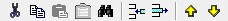

- *Imagen 4: botonera de funciones básicas.*

    - Ver Receta: abre pantalla con detalle de la receta seleccionada en la matriz. Solo para visualizar y no editar. Abre en la pestaña de Detalle Receta x Régimen, pero permite navegar entre las otras pestañas.

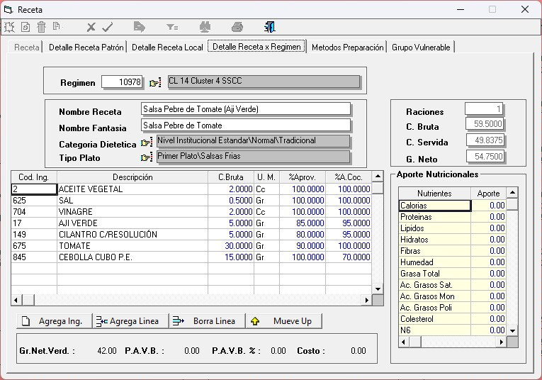

- *Imagen 5: Visor de recetas.*

    - Copiar Planificación Teórica : permite copiar una planificación de desde un régimen, servicio y período a otro. En la actualidad solo copia la cabecera (Contrato, Régimen, Servicio) y no las recetas y raciones ponderadas y totales. 

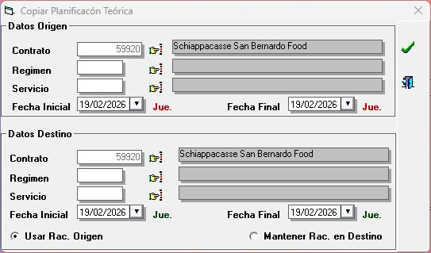

- *Imagen 6: Copiador de planificación teórica.*

    - Ver aporte nutricional diario : muestra los aportes nutricionales por receta del día que tengo seleccionado en la grilla. Podrá ser exportado a Excel. Tanto en pantalla como en el Excel se visualizarán los siguientes campos:

      - Columnas:

        - Cod: código de la receta.

        - Nombre Recetas

        - Bruto: será el gramaje bruto para 1 ración.

        - Servida: gramaje servido para 1 ración.

        - Neta: gramaje neto para 1 ración.

        - Las siguientes columnas serán todos los nutrientes existentes en el maestro de nutrientes y su aporte por receta.

      - Filas:

        - Se mostrará una fila por receta del día que se tiene seleccionado en la pantalla.

        - Al final de la tabla se incluirá una fila de totales que mostrará la suma por columna de la tabla.

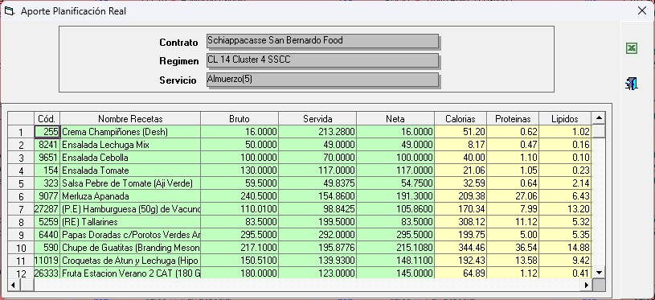

- *Imagen 7: Aporte Planificación Real*

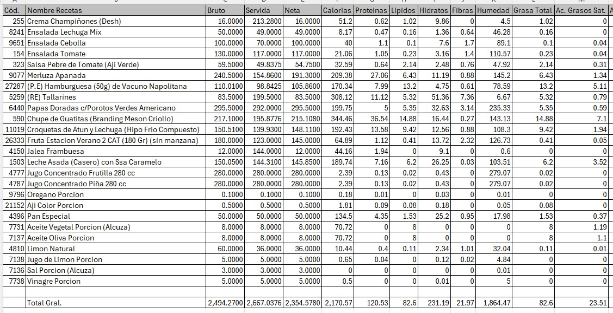

- *Imagen 8: Excel de exportación*

    - Visualizar costo : desplegará en la parte inferior de la pantalla resumen de costos en 3 grupos: 

      - Total mes: muestra el costo bandeja teórico (valorizado con el inventario del sitio) y costo total en materia prima, estructuras fijas, totales y raciones, que a la fecha esté cargado a la minuta del sitio.

        - Formula Cto. Bandeja: *Σ** **(Costo bandeja diario * total raciones **diarias) /** raciones totales mes*

        - Formula Costo Total: *Cto**. Bandeja * Raciones totales mes*

      - Día seleccionado: para el día seleccionado muestra en una columna lo planificado para costo materias primas, costo estructuras fijas, costo total, raciones, costo bandeja; en otra columna muestra el realizado de costo total, raciones y costo bandeja.

        - Formula Cto. Bandeja (Realizado): *Σ **[**(Costo **Salida a Producción del día**)** – (Costo Devolución a Producción del día)]** / raciones totales** del** **día*

        - Formula Cto. Total (Realizado): *Σ **[**(Costo **Salida a Producción del día**)** – (Costo Devolución a Producción del día)]*

      - Acumulado hasta: muestra la misma información de la estructura anterior; sin embargo, todos los valores se calculan ahora en base a lo acumulado desde el día 1 hasta la fecha seleccionada en la planificación.

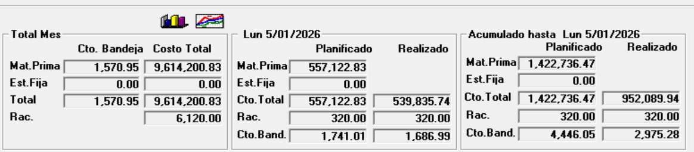

- *Imagen **9**: **Resumen de costos.*

    - Frecuencia Recetas : desplegará una pantalla con una matriz con todas las recetas de la minuta, indicando su frecuencia, costo y luego las raciones planificadas por día. Podrá ser exportado a Excel. Al final de la pantalla y del archivo Excel, mostrará 2 datos de totales:

      - Total Recetas Listadas: cantidad de recetas distintas en la minuta liberada.

      - Costo Promedio Diario: *Σ (Costo **receta** * **Frecuencia Receta**) / **día liberados de la planificación*

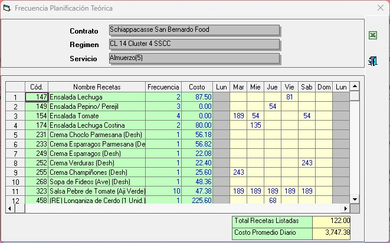

- *Imagen **10**: Frecuencia Planificación*

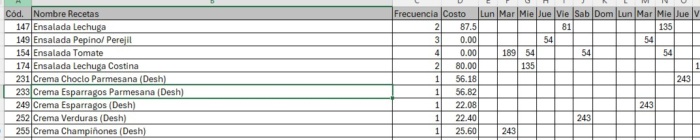

- *Imagen 11: Excel de exportación Frecuencias*

    - Actualizar costo receta : esta pantalla traerá todos aquellos productos que no tienen costo asociado en la maestra del sitio.

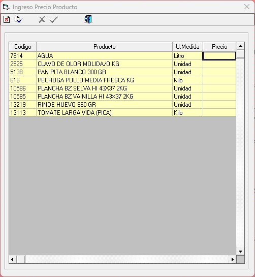

- *Imagen 1**2**: Ingreso costo** productos en 0.*

    - Exportar recetas : mostrará una pantalla con las recetas y sus ingredientes. Tendrá la opción de poder exportarlo como Word con el detalle completo de la receta o en formato de Excel. Los datos que se mostrarán tanto en pantalla como en las exportaciones son los siguientes:

      - Word:

        - Empresa

        - Versión sistema

        - Centro de Costo

        - Centro de Costo OPTIMUM

        - Título del documento con el mes de la planificación

        - Nombre del contrato

        - Régimen

        - Servicio

        - Por cada receta:

          - Cat. Dietética

          - Tipo Plato

          - Nro. Raciones

          - Nombre Receta

          - Tabla de ingredientes (información del maestro de recetas):

            - Nombre Ingrediente

            - C.Bruta

            - %Aprov.

            - %A.Coc.

            - C.Servir (incluir total de columna)

            - %P.Nut.

            - C.Neta (incluir total de columna)

            - Costo (incluir total de columna): calculado al costo actual del ingrediente

          - Cuadro Preparación: obtenido del maestro de recetas del sitio.

      - Excel y Pantalla:

        - Nombre del contrato

        - Régimen

        - Período

        - Servicio

        - Tabla de ingredientes, donde la primera línea tendrá el nombre de la receta y luego las siguientes tendrán las columnas: 

          - Ingrediente

          - Uni.: unidad de medida del ingrediente

          - Cantidad: para una ración.

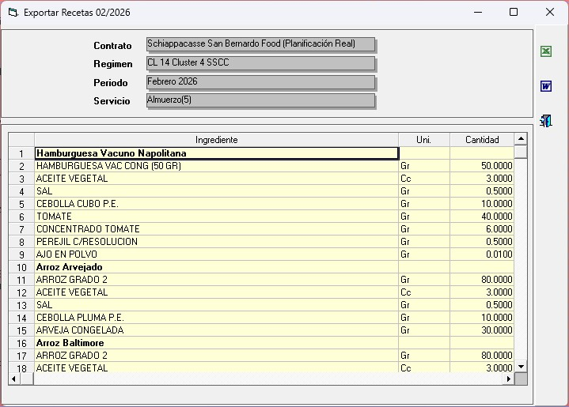

- *Imagen **1**3**: Listado de recetas en planificación.*

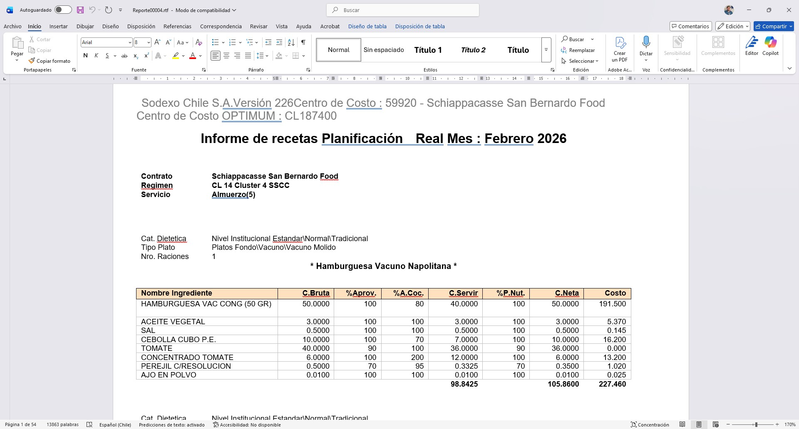

- *Imagen **1**4**: Formato Word** exportado*

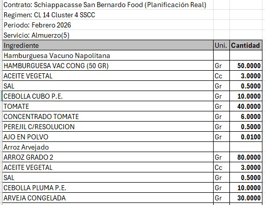

- *Imagen 15: Formato Excel Exportado*

<u>**Reglas de Negocio:**</u>

Esta pantalla tiene las siguientes reglas:

- El costo bandeja se calcula: Costo Total del día / Comensales totales del día.

- Solo se podrán agregar una cantidad determinada de recetas por día. Esta cantidad es configurable por sitio. 

- No se debe permitir eliminar recetas de la planificación. Si se desea reemplazar una receta, se deberá dejar las raciones ponderadas en 0 y agregar la nueva receta a la planificación dentro de las celdas en blanco que tendrá la tabla, de forma que la receta que se agregue quede vinculada a la estructura de servicio de la receta que le antecede.

- En las estructuras de costo diario y acumulado, lo realizado se calcula en base a las salidas de producción ya ejecutadas.

- Si un día se encuentra cerrado y/o han pasado 3 días desde la planificación a la fecha (hoy), las celdas correspondientes a ese día deberán quedar marcadas en rojo y no editables.

- Si un día se encuentra abierto y no han pasado 3 días desde la planificación a la fecha actual (hoy), las celdas correspondientes a ese día deberán quedar marcadas en amarillo y editables.

- No puedo eliminar una minuta localmente

- No puedo crear una minuta localmente

- No puedo editar una minuta en días cerrados, y (dependiendo de la mejora propuesta para visualización de minuta) no puedo editar un día de minuta cuando aún no se ha generado el carro de compras asociado

- No puedo editar una receta a nivel local

- No puedo editar una estructura del servicio (incorporar, renombrar o eliminar) a nivel local

- Para la valorización de la receta, se debe considerar el último precio vigente para los productos vinculados a la receta. (PMP)

- Las raciones totales diarias deben venir en 0 para que cada sitio complete con el dato real.

- El Costo Techo se mostrará solo si está ingresado para el contrato/régimen/servicio/período consultado.

- El sistema debe recorrer todos los días que tienen planificación, marcar y mostrar en una alerta informativa, todos aquellos días que cumplan con las siguientes 3 condiciones: 

  - Costo Minuta Dia > 0

  - Costo Techo > 0

  - Costo Minuta Dia > (Costo Techo * 1,05)

<u>**Tablas Asociadas:**</u>

Minuta

Estructura Servicio

Receta

Nutriente

Alergeno

Producto

Ingrediente

Contrato

Régimen

Servicio

Inventario (valorización de la minuta en el casino)

Costo Techo

<u>**Mejoras:**</u>

- Deshacer cambios realizados y no guardados, de forma restaurar la minuta a la última versión guardada o deshacer el ultimo cambio hecho (misma funcionalidad que en AMD).

- Incluir columna de % de ponderación.

- Al modificar la cantidad de comensales totales de un día, se debe preguntar si se quiere actualizar las raciones ponderas. En caso de poner que sí, estas se actualizarán en base al % de ponderación. En caso contrario, se actualizará el % de ponderación (por tanto no sumará 100%), darle la opción al usuario de deshacer este cambio.

- Se debe permitir la edición de las raciones ponderadas y el % de ponderación, bajo el siguiente funcionamiento:

  - Si se modifica la ración asociada a una receta, el % de ponderación respectivo se debe actualizar automáticamente, considerando los comensales totales de ese día.

  - Si se modifica el % de ponderación de una receta, las raciones   se deberán actualizar automáticamente, considerando los comensales totales de ese día.

- Las funcionalidades de subir o bajar receta, insertar o eliminar filas, no deberán considerarse en el nuevo SGP para esta pantalla.

- La funcionalidad Copiar Planificación Teórica se debe quitar, porque esto existía cuando las minutas la hacia el sitio directamente. Ahora esto se maneja de forma centralizada.

- En la pantalla Frecuencia Receta solo se muestra el día de la semana actualmente y se quiere que muestre el día de la semana y la fecha que corresponde a cada día.

- En la pantalla Frecuencia Receta, se quieren agregar 4 columnas adicionales:

  - Ingrediente principal

  - Gran Ingrediente

  - Código Estructura Servicio

  - Estructura Servicio

- La pantalla actualizar costo receta solo debería mostrar aquellos productos que no tengan costo, dando la opción de revisar por servicio o todos los servicios para el mes en curso, que sean parte de la planificación y no de la maestra completa.

- El costo de la receta debe considerar el costo en inventario de los productos asociados. Para aquellos productos que no hayan tenido ingresos al inventario del sitio, la valorización deberá realizarse utilizando el costo del convenio asociado a dicho producto.

- Eliminar el ítem de Estructura Fija de los cuadros de costos.

- Si se desea agregar una receta a la planificación de un día, las recetas que se muestren, deben ser las asociadas transversalmente o solo al sitio (misma funcionalidad de AMD).

- La configuración de cantidad de recetas adicionales por día deberá ser hecho de forma transversal y con excepciones por sitio.

- Mostrar la minuta completa del mes, pero solo podrá editarse aquellos días que tengan el carro de compras liberado, y cumplan con la regla de negocio 6.

- En la pantalla Frecuencia Receta, se debe quitar el campo Costo Promedio Diario y calcular el Total de Recetas listadas sobre la planificación completa del mes (esto siempre que se realice la mejora 14).

- Nueva regla de bloqueo edición: si una minuta diaria tiene asociada una requisición, ya no se podrá editar la información de la minuta para ese día (raciones ponderadas, ponderaciones, comensales).

## 3.2 Componente SALIDA A PRODUCCIÓN

Gestiona el proceso de solicitud de productos a bodega para la producción de un período determinado.

| ID | Funcionalidad | Estado | Tipo |
| --- | --- | --- | --- |
| 1 | Requisición | Activo | Solicitud |
| 2 | Adicionales de Servicio | Activo | Solicitud |
| 3 | Salida a Producción | Activo | Baja stock |
| 4 | Devolución Salida a Producción | Activo | Ingreso stock |

## 3.2.1 Requisición

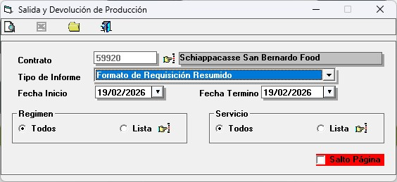

*Imagen **1**6**: Generador de informe*

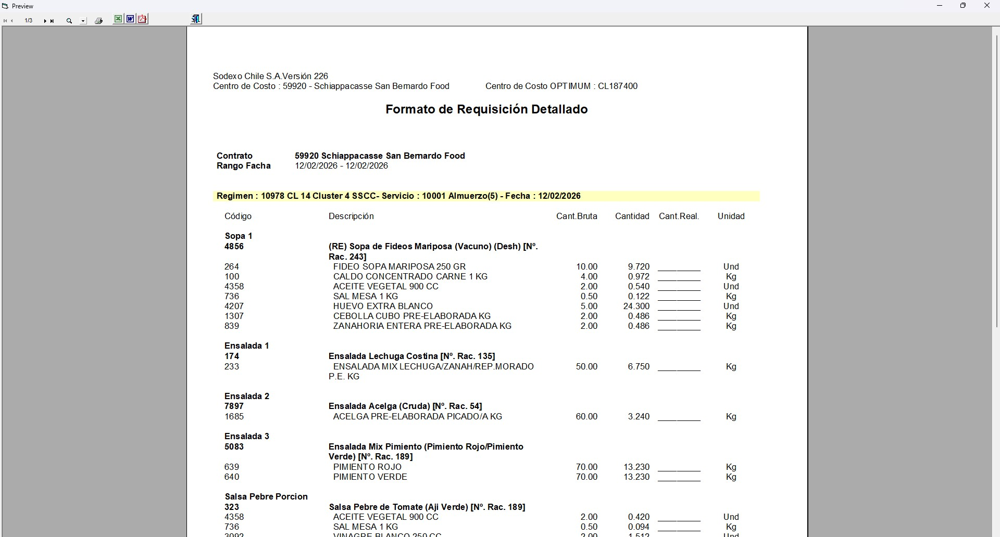

*Imagen **1**7**: Previsua**liza**ción** de requisición** detallada**.*

<u>**Descripción General:**</u>

- Se contará con un formulario para filtrar inicialmente. (Imagen 16)

- Se elegirá el informe del listado disponible:

  - Formato de Requisición Resumido

  - Formato de Requisición x Sector

  - Formato de Requisición x Estructura Servicio Detallado

  - Formato de Requisición x Estructura Servicio Resumido

  - *Resumen de Salida a Bodega** (usado por bodega)*

  - *Devolución de Salida a Bodega** (usado por bodega)*

  - *Salida Menos Devoluciones a Bodega** (usado por bodega)*

- Se elegirá la fecha inicio y fecha fin.

- Se tienen las siguientes opciones:

  - Régimen:

    - Todo: trae todos los Regímenes en el rango de fechas indicado.

    - Lista: permitirá elegir uno o varios regímenes existentes en el sitio.

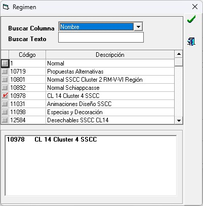

- *Imagen **1**8**: **Lista Régimen*

  - Servicio:

    - Todo: trae todos los Servicios en el rango de fechas indicado.

    - Lista: permitirá elegir uno o varios Servicios existentes en el sitio.

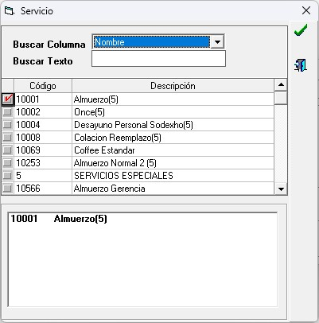

- *Imagen **1**9**: Lista Servicio*

- Una vez elegido el filtro se podrá:

  - Acceder a la previsualización de la Requisición dependiendo del formato elegido. (Imagen 17)

  - Generar Excel con detalle de planificación por producto, solo para el reporte de Formato de Requisición x Estructura Servicio Detallado

- En la previsualización, se permitirá:

  - Navegar entre las páginas, si el documento cuenta con más de una.

  - Cambiar el zoom de la página.

  - Imprimir el documento.

  - Exportar a Excel, Word o PDF.

<u>**Reglas de Negocio:**</u>

Esta funcionalidad considera las siguientes reglas de negocio:

- En las listas tanto de Régimen como Servicio, solo deben mostrarse aquellas que sean pertenecientes al contrato en el que se está trabajando.

- Si se trata de exportar un Excel con el detalle y no hay datos, arrojará el error correspondiente.

- Solo se permitirá la generación de requisición si se ingresó los comensales totales diarios en la planificación real.

- El documento que se genera para el Formato de Requisición x Estructura Servicio Detallado, que es el más usado por los sitios, deberá contener la siguiente información: 

  - Una cabecera con:

    - Empresa Sodexo

    - Versión del SGP

    - Centro de Costo SAP (número y nombre)

    - Centro de Costo OPTIMUM (código)

  - Título: Nombre del informe elegido

  - Contrato: código y nombre.

  - Rango Fecha: basado en filtro

  - Por cada Régimen (código y nombre), Servicio (código y nombre) y Fecha del servicio se debe mostrar la siguiente Estructura de datos:

    - Estructura de Servicio (nombre)

    - Receta: 

      - Código

      - Nombre

      - Raciones planificadas.

      - Productos de la Receta:

        - Código

        - Nombre

        - Cantidad bruta (1 ración)

        - Cantidad planificada (cantidad bruta x raciones planificadas)

        - Cantidad real (espacio en blanco para el Encargado de Producción)

        - Unidad (unidad de medida del producto)

<u>**Tablas Asociadas:**</u>

Contrato

Régimen

Estructura Servicio

Servicio

Producto

Ingrediente

Receta

Minuta

Unidad de Medida

Sector

<u>**Mejoras:**</u>

- La mantención de los sectores debe ser administrada de forma central, con manejo de reglas transversal y excepciones por sitio.

- Cambiar el flujo de requisición para generarlo como un proceso dentro del sistema y no por medio del papel. Para esto se requiere:

  - Generar una pantalla inicial con los mismos filtros iniciales.

  - Generar un formulario donde el Encargado de Producción podrá ver la misma información del Formato de Requisición x Estructura Servicio Detallado.

  - Por otro lado, el encargado de bodega puede visualizar la información enviada por el encargado de producción en el formato que desee (Encargado de Producción la envía detallado y bodeguero la transforma a resumido)

  - En este formulario, se incluirá una columna de cantidad solicitada la cual vendrá vacía por defecto.

  - Se debe incluir el stock del insumo como informativo para el Encargado de Producción.

  - Puede sustituir un insumo por otro (ejemplo, pechuga de pollo por filetillo de pollo, sabor naranja por sabor piña, etc.) cuando en el punto anterior valide que el stock es insuficiente, en el sistema deja en “0” el producto que no se entregará y agrega a la misma receta el producto que incorporara (cuando la modalidad es detallada), las cantidades se agregan manualmente

  - Puede incorporar productos que no estaban planificados

  - Puede dejar en “0” productos que estaban planificados (no eliminar)

  - El Encargado de Producción podrá indicar una nueva cantidad diferente a la planificada (Cantidad) en aquellos que sean necesario.

  - Al final de completar la requisición y guardar, se deberá dejar registro de lo solicitado, asociándolo a un número de solicitud y un estado, sin perder lo planificado, y lo solicitado será lo que deberá ver el bodeguero al momento de ejecutar la salida de producción.

  - En aquellos casos donde el Encargado de Producción no indique cantidad solicitada, se replicará el valor de la cantidad planificada a la solicitada.

  - Se podrá exportar la solicitud en formato Word, Excel y PDF si se quisiera.

  - Si durante el servicio debe hacer nuevas salidas de un producto, estás cantidades deben quedar reflejadas como un adicional, actualmente (error) está cantidad se suma a la original y TODO queda reflejado como un adicional en la reportería, lo que se debe corregir en el Upgrade.

## 3.2.2 Adicionales de Servicio

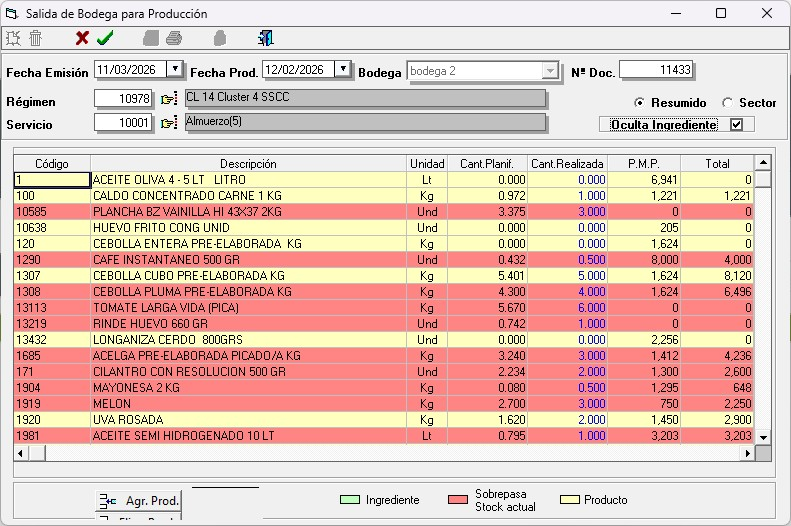

*Imagen 20: Salida a Producción*

<u>**Descripción General:**</u>

- Los adicionales para un servicio son aquellos productos solicitados que no fueron solicitados en la requisición original.

- Actualmente lo adicionales para los servicios se registran dentro de la misma salida a producción de la requisición y se distinguen en que en la columna de Planificada viene en 0.

- Esta funcionalidad será detallada en el documento del módulo de inventario.

<u>**Mejoras:**</u>

- Se requiere que los adicionales queden registrados como salidas de producción por separado de la requisición y asociados a un régimen y servicio.

- Esta salida a producción debe quedar marcada como de productos adicionales.

## 3.2.3 Salida a Producción

*Imagen 2**1**: Salida a Producción*

<u>**Descripción General:**</u>

- Esta es la funcionalidad en donde se ejecuta la salida a producción en base a la requisición, los adicionales y el stock existente. Con esto se realiza la rebaja de inventario en el sistema.

- Esta funcionalidad será detallada en el documento del módulo de inventario.

## 3.2.4 Devolución Salida a Producción

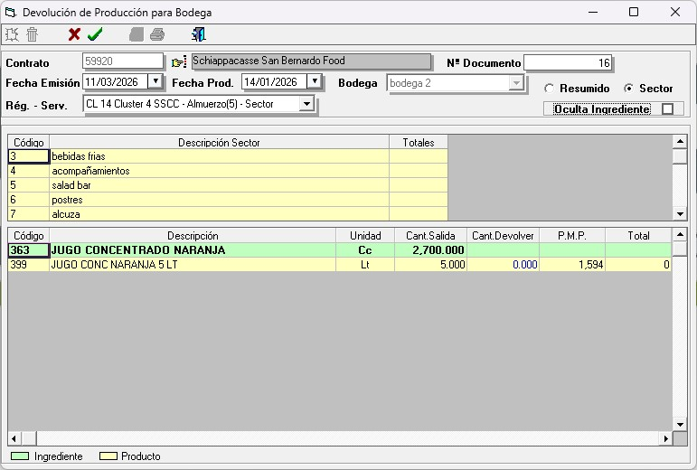

*Imagen 2**2**: **Devolución Salida a Producción*

<u>**Descripción General:**</u>

- Esta es la funcionalidad en donde se ejecuta los ingresos al stock de productos devueltos por producción, asociándola a su salida correspondiente.

- Esta funcionalidad será detallada en el documento del módulo de inventario.

## 3.3 Componente VENTAS

Esto corresponde a servicios vinculas con ingreso de ventas, ya sea por servicios planificados o servicios extras a la planificación.

| ID | Funcionalidad | Estado | Tipo |
| --- | --- | --- | --- |
| 1 | Venta Directa | Activo | Venta |
| 2 | Venta Cafetería | Activo | Venta |
| 3 | Venta Servicios Especiales | Activo | Venta |
| 4 | Control de Raciones | Activo | Venta |
| 5 | Venta Servicio Contado | Activo | Venta |
| 6 | Precio Venta Cliente | Activo | Venta |
| 7 | Lista de Precio Cafetería | Activo | Venta |

## 3.3.1 Venta Directa

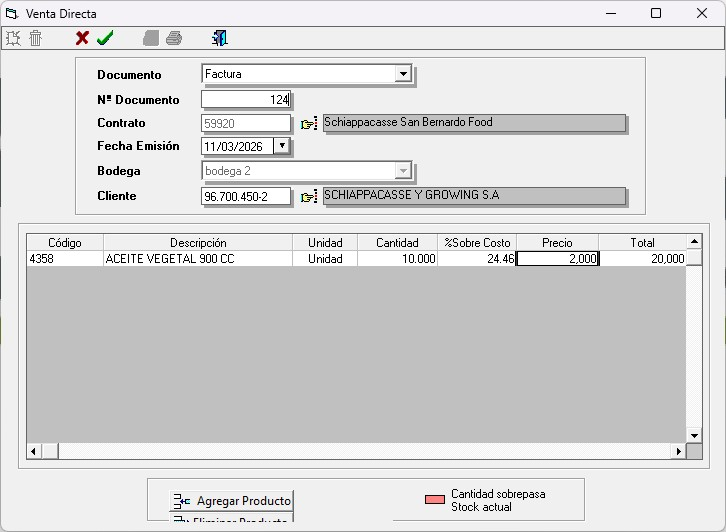

*Imagen 23: Venta Directa*

<u>**Descripción General:**</u>

- Funcionalidad en donde se registra la venta de productos de entrega inmediata que no requieren preparación alguna como por ejemplo: botellas de bebidas, tarro de café, etc.

- Esta funcionalidad será detallada en el documento del módulo de inventario.

## 3.3.2 Venta Cafetería

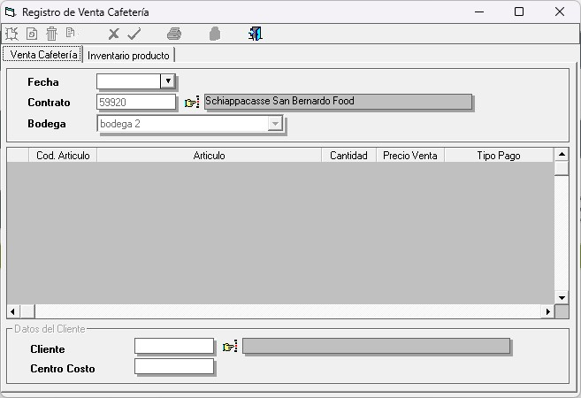

*Imagen 2**4**: Venta **Cafetería*

<u>**Descripción General:**</u>

- Funcionalidad en donde se registra la venta de servicios relacionados con cafetería, usado para la baja de stock en la bodega.

- Esta funcionalidad será detallada en el documento del módulo de inventario

## 3.3.3 Venta Servicios Especiales

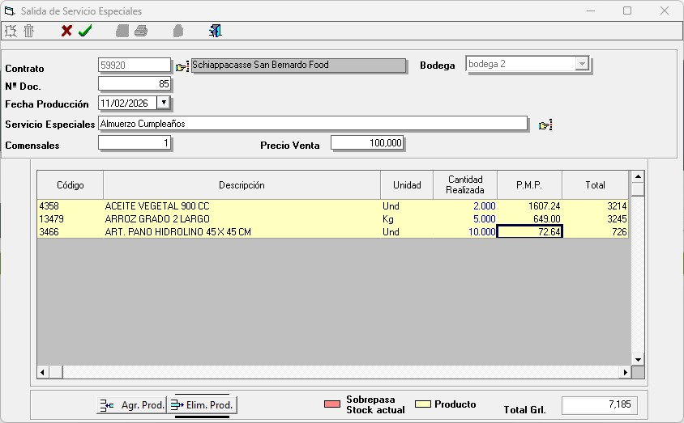

*Imagen 2**5**: Venta **Servicios Especiales*

<u>**Descripción General:**</u>

- Funcionalidad en donde se registra la venta de servicios no planificados en las minutas y que no son recurrentes.

- Esta funcionalidad será detallada en el documento del módulo de inventario

## 3.3.4 Control de Raciones

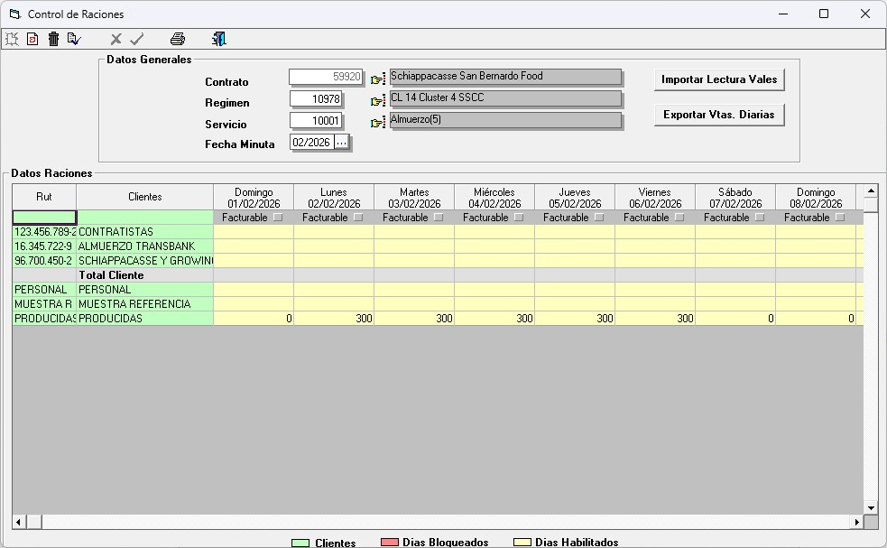

*Imagen **26**: Control de Raciones*

<u>**Descripción General:**</u>

Formulario central de gestión de raciones mensuales del módulo de producción. Permite al casino registrar, visualizar y controlar cuántas raciones corresponden a cada cliente (empresa contratante) por cada día hábil del período de minuta, incluyendo tres categorías especiales: PERSONAL, MUESTRA REFERENCIA y PRODUCIDAS.

Sus responsabilidades principales son:

- Construir una grilla mensual (una fila por cliente, una columna por día del período) a partir de la planificación real.

- Registrar las raciones por cliente y día.

- Controlar qué días son facturables o no facturables (checkbox por columna en fila de encabezado).

- Permitir la actualización de las raciones PRODUCIDAS solo con un usuario y clave que tenga permisos para realizar esto (preferentemente de la administración central de SGP) y además, el valor de ese campo es 0 o vacío.

- Importar archivo con la lectura de vales desde otro sistema. (funcionalidad obsoleta)

- Exportar ventas diarias.

- Imprimir el resumen de raciones.

- El contrato debe venir elegido por defecto dependiendo del sitio en el que estoy trabajando.

- Debe indicar Régimen, Servicio y Fecha Minuta (MM/YYYY) de forma obligatoria para que traiga la grilla con la información a completar de la cantidad de raciones:

  - Columnas no editables:

    - Rut: Rut clientes

    - Clientes: Nombre clientes.

  - Columnas editables:

    - Días del mes elegido: en estos campos se indicará cuantas raciones fueron entregadas.

- Existirán 2 grupos:

  - Raciones cliente: este grupo tiene los clientes relacionados al contrato, ya sea el cliente directo o contratistas del cliente. Bajo el listado mostrará las raciones totales por día.

  - Otras raciones: aquí van las raciones del personal Sodexo, Muestras Referencias y las raciones producidas (dato viene por defecto de la planificación real y no es editable sin una autorización)

- Contará con 2 funciones adicionales:

  - Importar Lectura Vales: funcionalidad obsoleta que ya no está siendo usada.

  - Exportar Vtas. Diarias: abre una ventana adicional para realizar un filtro y generar Excel con formato para carga en SPRS.

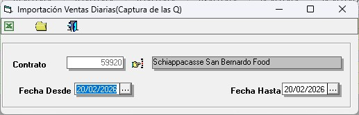

- *Imagen **2**7**: Filtro exportación.*

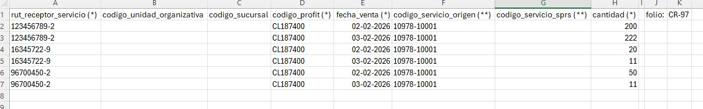

- *Imagen **2**8**: Excel para SPRS*

- El Excel que se genera de la exportación contará con las siguiente columnas:

  - rut_receptor_servicio: este es el Rut del cliente. Entregado por el sistema directamente.

  - codigo_unidad_organizativa: código de la unidad organizativa. Viene en blanco.

  - codigo_sucursal: codigo de la sucursal. Viene en blanco.

  - codigo_profit: es el Centro de Costo OPTIMUM. Entregado por el sistema directamente.

  - fecha_venta: fecha a la que corresponde las raciones. Entregado por el sistema directamente.

  - codigo_servicio_origen: es una concatenación del [código régimen]-[código servicio]. Entregado por el sistema directamente.

  - codigo_servicio_sprs: código que tendrá en SPRS el servicio. Viene en blanco.

  - cantidad: cantidad de raciones para el día asociado al cliente.

<u>**Reglas de Negocio:**</u>

- Solo se podrá ingresar datos en las celdas que no estén bloqueadas (cierre mensual).

- Cada vez que el usuario termina de editar una celda de cliente, se recalcula automáticamente el total de la columna sumando todas las filas de clientes y lo escribe en la fila "Total Cliente".

- La fila 1 de la grilla actúa como control de facturación por día. El checkbox "No Facturable" bloquea toda la columna: ningún cliente puede registrar raciones en un día marcado como no facturable. El cambio de estado del checkbox requiere confirmación del usuario.

- Para cargar la grilla: 

  - Los campos contrato, régimen, servicio y fecha minuta deben estar completos

  - Debe existir planificación real.

- Agregar una línea adicional después del MUESTREO que sea el RACIONES CONTADO, y no sea facturable.

<u>**Tablas Asociadas:**</u>

Contrato

Servicio

Régimen

Minuta realizada

Cliente

Precio de venta

<u>**Mejoras:**</u>

- Se debe mantener integración con SPRS como prioritario y mantener el Excel como opción en caso fallo en la integración.

## 3.3.5 Ventas Servicio Contado

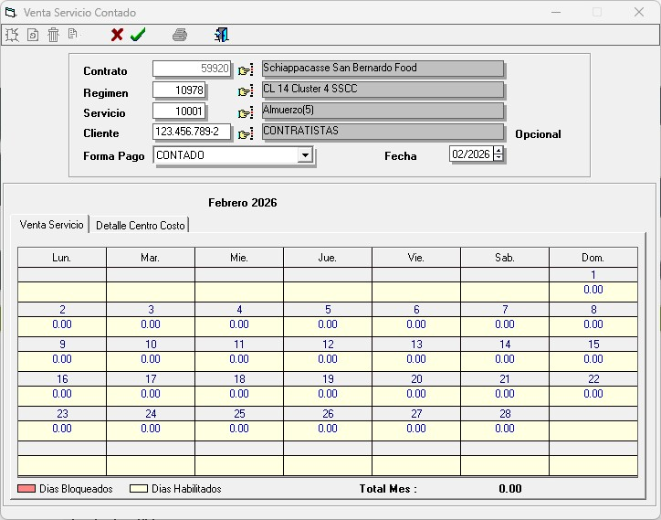

*Imagen **29**: Venta Servicio Contado*

<u>**Descripción General:**</u>

El formulario de **registro de ventas de servicio al contado** permite registrar el monto total de venta diaria para una combinación de casino / régimen / servicio / forma de pago (todos datos obligatorios para realizar el registro), presentando el mes en formato de **calendario visual** (grilla 7 columnas × semanas).

Soporta dos modalidades de registro:

**Sin cliente específico**: monto único por día.

**Con cliente asociado**: el monto se distribuye entre los centros de costo del cliente (tab "Detalle Centro Costo") si es que tiene un centro de costo asociado, en caso contrario se registra monto total en calendario.

La vista de “Detalle Centro Costo”, mostrará los centros de costos configurados a cada cliente en el sitio, para ingresar el valor por día seleccionado en el calendario.

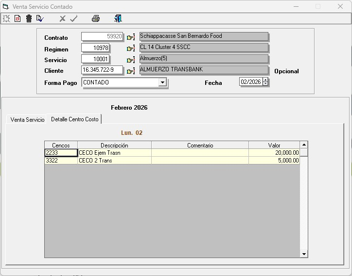

*Imagen **30**: Vista Detalle Centro Costo*

<u>**Reglas de Negocio:**</u>

**Campos requeridos encabezado**: Para Incluir, Alterar y Confirmar, se valida que casino, régimen, servicio, fecha y forma pago estén completos.

**Validación de cliente por RUT**: Solo se debe digitar el RUT sin digito verificador, el sistema calculará este dato automáticamente y se busca en la tabla de clientes que se encuentren activos para el sitio. Si no existe, envía mensaje de error y limpia el campo.

**Bloqueo de días cerrados**: Los días que estén cerrados, no podrán editarse el dato y visualmente se verá este bloqueo.

**Bloqueo de mes completo**: Si todos los días del mes están cerrados, los botones de edición quedan deshabilitados. Lo mismo ocurre si el mes está cerrado

**Monto mínimo**: Solo se graban registros con monto > 0. Los días con monto = 0 no se guardan.

**Confirmación de borrado**: Antes de eliminar el mes completo, se muestra un mensaje para confirmar.

**Modo modificación activado automáticamente**: Si el usuario edita directamente en una de las celdas, el calendario pasa a modo edición directamente sin necesidad de presionar el botón para habilitar este modo. (siempre manteniendo las reglas bloqueo)

**Detalle Centro Costo**: esta pestaña solo se muestra si tiene un cliente puesto en el filtro, el cliente tiene centro de costo asignado, se selecciona un día y el modo de edición activo.

**Contrato vs cliente**: El contrato es el campo principal y obligatorio. El cliente es opcional y activa la distribución por Centro de Costo cliente si es que tiene, en caso contrario se registra a nivel total diario.

**Venta Servicio deshabilitado**: Si el usuario está editando datos en Detalle Centro Costo, la pestaña de Venta Servicio permanecerá deshabilitada hasta que se guarde o cancelen los cambios realizados.

<u>**Tablas Asociadas:**</u>

Contrato (sdxo)

Forma de pago

Venta Contado

Cliente

CECO Cliente

Régimen

Servicio

<u>**Mejoras:**</u>

- Se requiere que el sistema permita registrar la venta contado por cliente y que luego en el estado resultado del sitio sume todos los montos.

## 3.3.6 Precio Venta Cliente

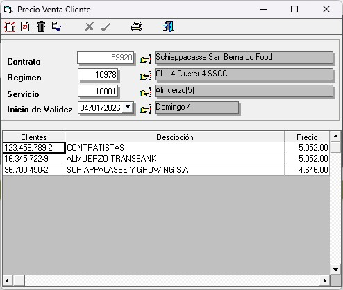

*Imagen **31**: **Precio Venta Cliente*

<u>**Descripción General:**</u>

- Este formulario permite registrar y mantener el precio de venta por servicio por cliente para una combinación de Contrato + Régimen + Servicio + Fecha de vigencia.

- Los parámetros para filtrar e ingresar o modificar datos, serán el contrato (debe venir elegido dependiendo de donde se está trabajando), Régimen, Servicio, Inicio de validez (fecha desde donde comienza a regir el precio de venta.

- Esto mostrará una grilla con los siguientes datos:

  - RUT Cliente: campo editable, donde se puede ingresar el RUT manualmente o hace doble clic para elegir uno del listado de clientes del sitio.

  - Nombre Cliente: no editable, se completa en base al RUT ingresado.

  - Precio de Venta: valor del serviciopara ese cliente.

- Adicionalmente, en la pantalla se mostrará un conjunto de botones en la parte superior para ejecutar diferentes acciones:

  - Agregar: habilita una fila para ingresar los datos anteriormente mencionados. Los parámetros de filtro (encabezado) deben estar completos.

  - Modificar: habilita la edición del precio en la fila seleccionada. Los parámetros de filtro (encabezado) deben estar completos.

  - Eliminar: borra la fila seleccionada. Valida si tiene raciones asociadas y solicita confirmación.

  - Grabar: ingresa el precio de venta en la tabla correspondiente.

  - Cancelar: deshace todos los cambios hechos sin guardar.

  - Refrescar: actualiza la grilla con los últimos datos guardados.

  - Imprimir: genera una vista previa con los datos de la grilla, permitiendo exportarlo posteriormente a Excel, Word o PDF. El formato es el siguiente:

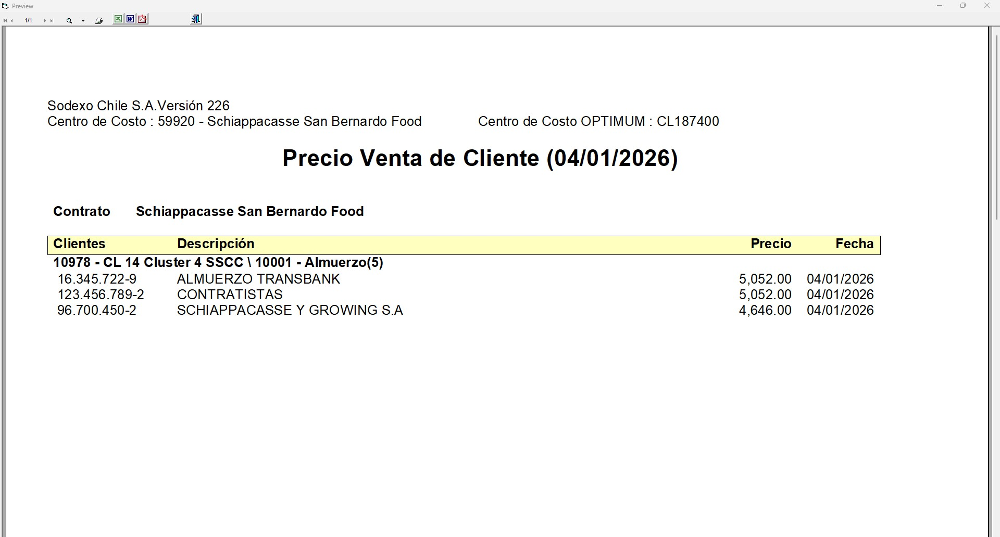

- *Imagen **32**: Vista previa formato exportación o impresión.*

- Al lado de la fecha en la cabecera, existe un botón que permite visualizar el historial de precios de venta para la combinación de Contrato/Régimen/Servicio.

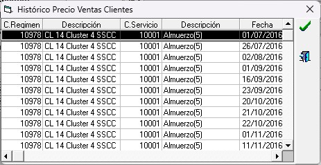

- *Imagen **33**: Histórico Precio Venta Cliente*

<u>**Reglas de Negocio:**</u>

- Se deben ingresar todos los datos de cabecera para poder realizar acciones sobre la grilla (ver, modificar, insertar, eliminar).

- El cliente es válido cuando se cumplen estas condiciones:

  - El cliente debe existir en la tabla de clientes.

  - El cliente de ser de tipo externo.

  - El cliente debe estar activo.

- El RUT ingresado debe ser un RUT valido en Chile. (aplicar formula de validación de RUT chilenos)

- Para la combinación de Contrato/Régimen/Servicio/Fecha validez no puede haber clientes duplicados en la grilla. 

- Para la combinación de Contrato/Régimen/Servicio/Fecha validez no puede haber clientes duplicados en la tabla de precio ventas cliente.

- Antes de eliminar un precio de la grilla, el sistema verifica que si ese cliente tiene raciones registradas en el control de raciones con fecha igual o posterior a la fecha de vigencia del precio. Existen 2 escenarios:

  - Tiene raciones asociadas: el sistema solicita confirmación para eliminar el registro que está asociado a control raciones.

  - Sin raciones asociadas: el sistema solicita confirmación para eliminar el registro.

<u>**Tablas Asociadas:**</u>

Contrato

Régimen

Servicio

Control de Raciones

Precio Venta Cliente

<u>**Mejoras:**</u>

- Solo se podrá modificar los precios de venta del mes en curso en adelante.

## 3.3.7 Lista de Precio Cafetería

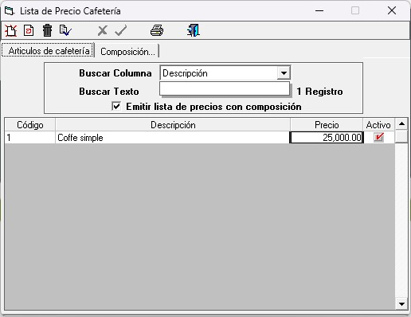

*Imagen **3**4**: **Lista de Precio Cafetería – Artículos de Cafeterías*

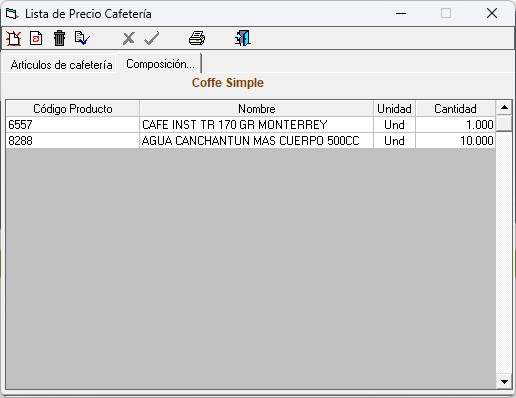

*Imagen **3**5**: **Lista de Precio Cafetería – Composición*

<u>**Descripción General:**</u>

- Este formulario permite administrar el catálogo de artículos que se ofrecen en la cafetería del casino. Para cada artículo se registra su nombre, precio de venta y si se encuentra activo para la venta. Adicionalmente se puede detallar qué productos componen ese artículo y en qué cantidad, lo que permite generar listas de precios con desglose de composición.

- El formulario pertenece a la etapa de configuración del servicio de cafetería. No depende de fechas ni períodos de cierre. Opera siempre sobre el casino activo en sesión y puede utilizarse en cualquier momento, independientemente del estado de la producción diaria.

- La pantalla se organiza en dos pestañas: la primera ("Artículos de cafetería") muestra todos los artículos con su precio, permite agregarlos, modificarlos o eliminarlos, e incluye un panel de búsqueda por código o por nombre. La segunda pestaña ("Composición") muestra los productos asociados al artículo seleccionado en la primera pestaña, y permite agregar, modificar o eliminar esos componentes.

- Este formulario no requiere que el usuario complete ningún campo previo al abrir. Al cargarse, la grilla de artículos se llena automáticamente con todos los artículos del casino activo, ordenados por código y nombre.

- El único parámetro de contexto que el usuario puede utilizar activamente es la búsqueda, que se realiza con los controles del panel superior de la primera pestaña:

  - Buscar Columna: Selector que indica si la búsqueda se realiza por código o por nombre del artículo. No es requerido.

  - Buscar Texto: Texto libre que filtra la grilla en tiempo real según la columna seleccionada. No es requerido

- La pestaña “Artículos de cafetería” tendrá los siguientes componentes: 

  - Una grilla con los siguientes campos:

    - Código: campo no editable. Permite identificar el artículo. Al agregar, el sistema calcula el máximo código existente para el casino y suma 1. El usuario no puede editarlo directamente.

    - Nombre del artículo: campo editable. Descripción libre del artículo de cafetería. Campo obligatorio al grabar.

    - Precio: campo editable. Precio de venta del artículo. Muestra separador de miles y 2 decimales. Campo obligatorio (no puede ser cero).

    - Activo: campo editable. Indica si el artículo está disponible para la venta. Se ingresa mediante una casilla de verificación embebida en la grilla.

  - Grupo de botones para distintas funciones:

    - Agregar: Habilita el modo de ingreso: agrega una fila al final de la grilla de artículos, posiciona el cursor en el campo Nombre, y deshabilita la pestaña de Composición hasta grabar.

    - Modificar: Habilita la edición de la fila activa. Deshabilita la pestaña de Composición hasta grabar. La búsqueda queda inhabilitada durante la edición.

    - Eliminar: Pide confirmación. Si se acepta, elimina el artículo seleccionado de la base de datos y lo remueve de la grilla. Si el artículo tiene composición registrada en otra tabla, el sistema informa que el dato está asociado y no permite la eliminación.

    - Grabar: graba el artículo nuevo o modificado. En modo Agregar, asigna automáticamente el siguiente código disponible.

    - Cancelar: Descarta los cambios no grabados. Restaura los valores originales desde la base de datos. Vuelve al modo de solo lectura y rehabilita ambas pestañas.

    - Refrescar: Limpia el campo de búsqueda y recarga todos los artículos del casino desde la base de datos.

    - Imprimir: Genera el informe "Lista de precios cafetería". Si la opción "Emitir lista de precios con composición" está marcada, genera en cambio el informe "Lista de precios cafetería con composición", que muestra artículo por artículo con sus productos. Ambas vistas podrán ser exportadas a Excel, Word y PDF.

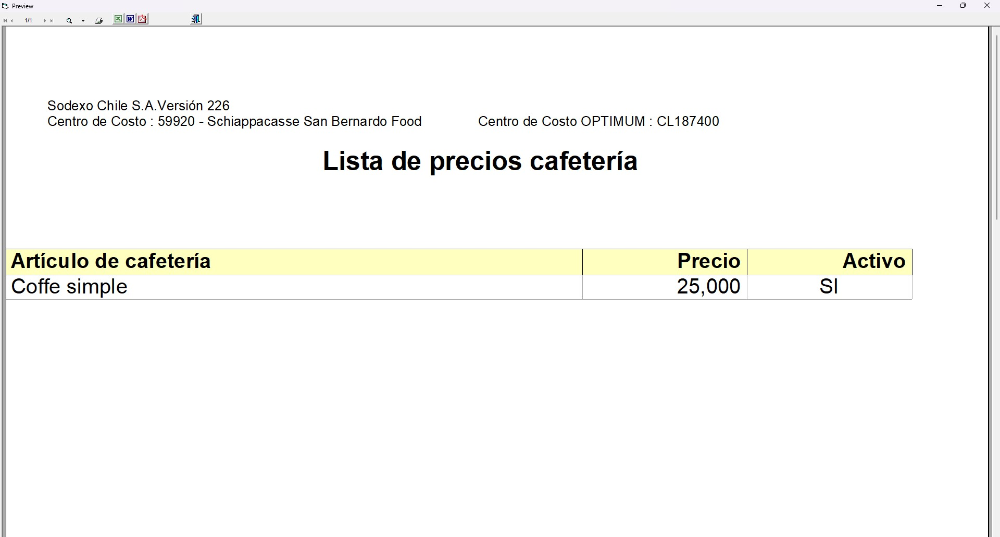

- *Imagen 36: Lista de Precios Cafetería*

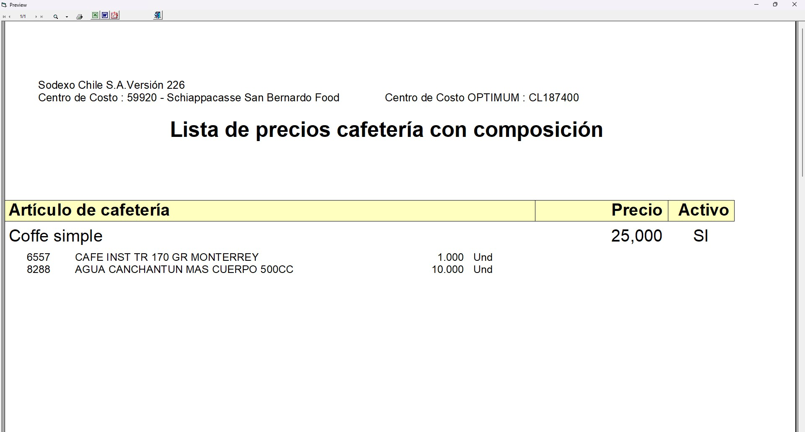

- *Imagen 37: Lista de Precios Cafetería con Composición*

- La pestaña “Composición” tendrá los siguientes componentes:

  - Una grilla con los siguientes campos:

    - Código producto: campo editable. Código del producto del maestro de bodega. Al agregar, se selecciona mediante un buscador de productos. No puede repetirse dentro del mismo artículo.

    - Nombre del producto: campo no editable. Se carga automáticamente al seleccionar el código del producto.

    - Unidad: campo no editable. Unidad de medida abreviada del producto, leída desde el maestro de unidades.

    - Cantidad: campo editable. Cantidad del producto requerida para el artículo. Muestra 3 decimales. Campo obligatorio (no puede ser cero).

  - Grupo de botones para distintas funciones:

    - Agregar: Abre el buscador de productos del maestro de bodega (filtrado a productos que controlan stock y están vigentes). Seleccionado el producto, agrega una fila en la grilla de composición con código, nombre y unidad precargados. El cursor se posiciona en el campo Cantidad.

    - Modificar: Habilita la edición de la fila activa de la grilla de composición. Deshabilita la pestaña de Artículos hasta grabar.

    - Eliminar: Pide confirmación. Si se acepta, elimina el producto seleccionado de la composición del artículo activo.

    - Grabar: graba el producto nuevo o la cantidad modificada del producto activo.

    - Cancelar: Descarta los cambios no grabados. Restaura los valores originales desde la base de datos. Vuelve al modo de solo lectura y rehabilita ambas pestañas.

    - Refrescar: Recarga la composición del artículo activo desde la base de datos.

    - Imprimir: Genera el informe "Composición artículo de cafetería" para el artículo activo, mostrando código, nombre, unidad y cantidad de cada producto. La vista podrá ser exportada a Excel, Word y PDF.

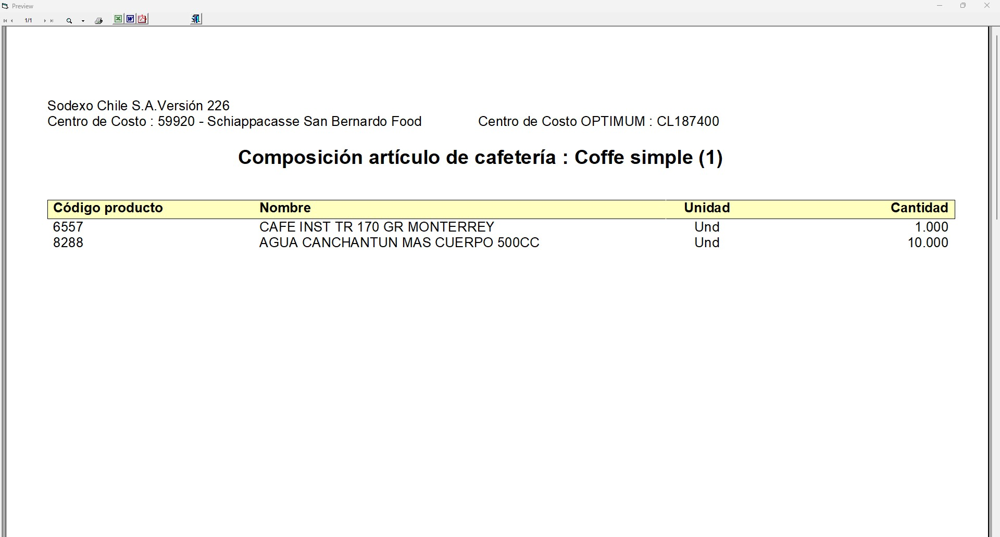

- *Imagen 38: Composición artículo de Cafetería*

<u>**Reglas de Negocio:**</u>

- Al grabar un artículo el sistema realiza las siguientes validaciones:

  - El campo Nombre no debe estar vacío.

  - El precio debe ser mayor a 0.

- Al grabar composición el sistema realiza las siguientes validaciones:

  - El código de producto no puede estar vacío.

  - La cantidad del producto debe ser mayor a 0.

- Al agregar un producto a la composición desde el buscador, el sistema valida que ese producto no esté ingresado al artículo de cafetería.

- Al agregar un producto a la composición digitando directamente el código el sistema valida lo siguiente:

  - El código digitado debe existir en el maestro de productos.

  - El código digitado no debe existir en la composición del artículo.

- Al eliminar un artículo, el sistema debe validar lo siguiente:

  - Debe tener una línea seleccionada para eliminar.

  - El artículo no debe estar asociado a ninguna tabla, por ejemplo la composición, o alguna venta.

<u>**Tablas Asociadas:**</u>

Producto

Articulo Cafetería

Venta Cafetería

<u>**Mejoras:**</u>

- El precio de venta indicado para cada artículo de cafetería que se ingrese, no puede ser menor que la sumatoria del costo total de la composición de ese artículo.

  - El cálculo del costo total de la composición será: *Σ (**PMP Producto * Cantidad**)**, considerando todos los productos ingresados en el listado de composición del artículo**.*

## 3.4 Componente MERMA

En este subproceso se ingresan toda la información relacionada con las Mermas de Producción y del Servicio.

| ID | Funcionalidad | Estado | Tipo |
| --- | --- | --- | --- |
| 1 | Raciones no Vendidas, Mermas en KG | Activo | Merma |

## 3.4.1 Raciones no Vendidas

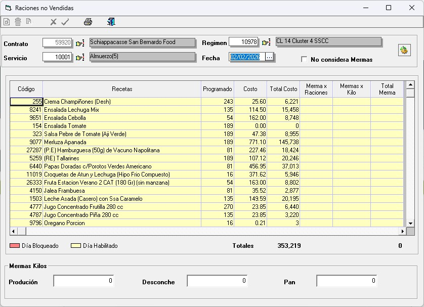

*Imagen **39**: Raciones no Vendida**s*

<u>**Descripción General:**</u>

- El contrato debe venir elegido por defecto dependiendo del sitio en el que estoy trabajando.

- Se debe indicar Régimen, Servicio y fecha como datos requeridos, para ingresar los siguiente datos:

  - Raciones no Vendidas: aquí se mostrará una grilla de recetas del servicio con la siguiente información:

    - Código: es el código de la receta.

    - Receta: es el nombre de la receta.

    - Programado: corresponde a la cantidad de raciones producidas. Este es el dato ingresado en la planificación real (Raciones Ponderadas)

    - Costo: corresponde al valor unitario de la receta.

    - Total Costo: es el costo total planificado en base a las raciones.

    - Merma x Raciones: cantidad de raciones no vendidas.

    - Merma x Kilo: peso en KG de las raciones no vendidas.

    - Total Merma: es el costo total de las raciones no vendidas indicadas.

- Adicionalmente, muestra en Totales, la suma total de Total Costo y de Total Merma.

- Merma Kilos: en esta sección se deben ingresar por KG 3 tipos de mermas:

    - Merma de Producción: merma relacionada la producción de las recetas.

    - Merma de Desconche: merma relacionada a la comida que queda como sobrante en las bandejas o platos de los comensales (de ahora en adelante “desconche”).

    - Merma de desconche Pan: merma relacionada con el desconche pero solo de pan.

- Existe un check para indicar que a ese servicio no se le debe considerar merma, y es usado cuando en algún momento indican que no se ejecutará un servicio específico.

<u>**Reglas de Negocio:**</u>

- La grilla mostrará la información del servicio en 2 posibles colores:

  - Rojo: día bloqueado, es decir, no se podrá editar la información de ese día.

  - Amarillo: día habilitado, es decir, se podrá ingresar la merma.

- Solo las columnas de Merma x Raciones y Merma x Kilo serán editables en la grilla.

- La grilla calculará los valores automáticamente dependiendo del dato que ingrese:

  - Si la persona ingresa dato en Merma x Raciones, el sistema deberá calcular el dato de Merma x Kilo:

    - *Merma x Kilo = ([Merma x Ración] x [C. Servida Receta] / 1000)*

    - *T**otal Merma** =** ([Costo] x [Merma x Ración])*

  - Si la persona ingresa dato en Merma x Kilo, el sistema deberá calcular el dato de Merma x Ración:

    - *Merma x Ración = ([Merma x Kilo] x 1000 / [C. Servida Receta])*

    - *Total Merma** =** ([Costo] x [Merma x Ración])*

- El cálculo de [C. Servida Receta] es el siguiente: 

  - *Σ [Cantidad **Efectiva** × (% Aprovechamiento / 100) × (% Cocción / 100)]*

- La Cantidad Efectiva se obtiene dependiendo de los siguientes factores:

  - Para los ingredientes que sean en cc o gr:

    - *Cantidad Efectiva = Cantidad Receta*

  - Para los ingredientes que tengan las siguientes condiciones: 

    - UM ingrediente = C/u

    - UM producto = Und

    - Factor nutricional ingrediente > 0

- Considerar la siguiente fórmula: 

- *Cantidad Efectiva = **ROUND( (**100 / Factor Nutricional Ingrediente) × Factor Conversión Ingrediente en Producto, **0 )** × Cantidad Receta*

- La Merma x Ración ingresada o calculada de ser <= el valor del Programado.

- Si se marca la opción No considerar Mermas, el sistema avisará que todas las mermas quedarán en 0 y no permitirá ingresar datos en ningún campo de la grilla o de la Merma Kilos.

- Al ingresar los datos de filtro y ejecutar la búsqueda, si para ese servicio en la fecha indicada aún no se ha realizado una salida de producción, el sistema arrojará una alerta indicando esto, pero igualmente permitirá el ingreso de mermas.

- Debe tener ingresadas las raciones producidas para efectos del ingreso de mermas.

- Se debe considerar para los cálculos, la información de las recetas ya sea transversal o considerando la tabla de gramaje para el sitio.

<u>**Tablas Asociadas:**</u>

Contrato

Régimen

Servicio

Receta transversal o por sitio.

Mermas

Salida Producción

<u>**Mejoras:**</u>

- Al completar los filtros correspondientes, el sistema debe mostrar automáticamente los datos en la grilla, sin necesidad de presionar botones.

- Separar en 2 pantallas distintas las mermas:

  - Pantalla para Raciones no Vendidas: ahora debería llamarse Merma Línea.

  - Pantalla mermas producción y desconche: permita el ingreso de la merma de producción, desconche y pan.

## 3.5 Componente CIERRE DIARIO

En este componente se ejecuta la tarea relacionada al cierre de los servicios.

| ID | Funcionalidad | Estado | Tipo |
| --- | --- | --- | --- |
| 1 | Cierre diario | Activo | Cierre |

## 3.5.1 Cierre diario

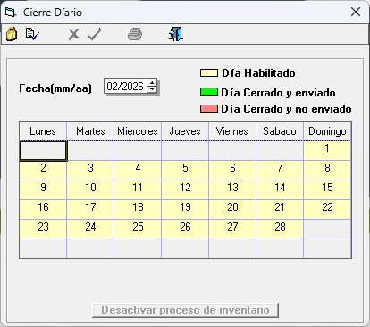

*Imagen **40**: Cierre diario*

<u>**Descripción General:**</u>

El formulario de Cierre Diario del sistema SGP Local es la operación más crítica del ciclo operacional: avanza la fecha de operación del casino al día siguiente, recalculando el PMP (Precio Medio Ponderado) del día y disparando el proceso externo de envío de datos (sincronización con SGP Administrador).

Sus funciones son:

- Visualizar el estado de cierres diarios: calendario mensual con colores indicando si cada día está habilitado, cerrado sin enviar o cerrado y enviado.

- Ejecutar el Cierre Diario: validar todos los prerrequisitos transversales e individuales parametrizables por administrador (documentos pendientes, actividades obligatorias, inventarios) y luego recalcular PMP + ejecutar Cierre Dia.

- Reabrir un día cerrado: retroceder un día, revertir inventarios si corresponde.

- Desactivar proceso de inventario usando el botón en la parte inferior.

Para reabrir o cerrar un día se debe situar el cursor sobre el día que se desea y luego se presiona el candado que está en la pantalla, el cual se mostrará abierto si el día se quiere reabrir, y cerrado si se quiere cerrar. 

Se mostrar día con 3 posibles colores:

- Amarillo: día abierto en el cual aún se pueden realizar acciones.

- Verde: día cerrado y sincronizado con el SGP Administrador.

- Rojo: día cerrado y pendiente de sincronizar con el SGP Administrador.

<u>**Reglas de Negocio:**</u>

Para los cierres de los días, se deben considerar las siguientes validaciones:

- Documentos pendientes de ingreso, como son (obligatorio):

  - Salida de Producción en estado de guardado.

  - Ventas Servicios Especiales en estado de guardado

  - Ventas Cafetería en estado de guardado

  - Ajuste toma de inventario en estado de guardado

  - Inventario en Proceso

  - Períodos anteriores no cerrados

- Validación de Raciones en sistema (configurable):

  - Raciones vendidas no registrados de servicios planificados por minuta.

  - Raciones no registradas de raciones no vendidas y mermas de producción, desconche y pan.

  - Raciones producidas no ingresadas en la planificación real.

- Validaciones actividades obligatorias, que se configuran por sitio (configurable):

  - Salidas a producción no ingresadas (solo si existe una planificación para ese día)

- Validaciones de inventario:

  - Realización de inventario calendarizado (esto bloquea el cierre, pero puede ser desbloqueado centralmente)

  - Ajuste de precios de venta pendiente. (esto se valida pero no bloquea si da un aviso)

  - Deshabilitar proceso de inventario con el botón en pantalla, cuando exista un inventario en proceso en el día que está intentando cerrar.

Para las reaperturas de los días, se deben considerar las siguientes validaciones:

- Inventario en proceso.

- Toma de inventario existente: arrojará advertencia de toma en proceso, indicando que deberá ser borrada antes de poder reabrir al día. confirmación.

Reglas generales para cierre o apertura:

- Solo puede ejecutarse el proceso de cierre o reapertura desde el PC registrado como servidor.

- Las validaciones se realizarán en base a los tipos de movimientos configurados como obligatorios de ejecutar en el sitio antes del cierre.

- Al reabrir un día en el que se tomó inventario, se alertará de la existencia de una toma de inventario y se solicitará que debe ser eliminada antes de poder reabrir el día.

<u>**Tablas Asociadas:**</u>

Cierre diario

Tareas obligatorias cierre, transversales y por sitio. 

Stock

Toma de Inventario

Minuta

<u>**Mejoras:**</u>

- Se requiere un log de auditoria completo indicando, aperturas y cierres diarios, quien lo realizó, fecha y hora de la ejecución, etc.

# 4. Mejoras adicionales

- Se requiere implementar un nuevo módulo para el ingreso de raciones producidas reales, es decir, aquellas que fueron preparadas por la operación para el servicio.

  - Esta mejora debe considerar una pantalla similar a la de Planificación Real, en donde se ingresarán los datos de las raciones producidas efectivas por receta y además lo comensales reales del día.

  - Se debe ingresar como datos obligatorios de filtro:

    - Contrato (debe venir elegido por defecto del que se está trabajando)

    - Régimen: solo los asociados al contrato.

    - Servicio: solo los asociados al contrato.

    - Fecha Minuta: en formato DD-MM-YYYY

  - En la parte inferior, debe incluir una matriz en donde se mostrarán las estructuras de servicio, las recetas y un campo donde se deberá ingresar las raciones efectivamente producidas para ese servicio.

  - En la fila final, se debe indicar la cantidad total de comensales considerados en lo producido.

  - Existirá un check para marcar que ese servicio no fue producido y dejará todos los valores en 0 y no editables.

  - Al guardar, el sistema debe validar si existe una salida producción realizada para ese servicio en ese día. En caso de no estar realizada mostrará una alerta informativa indicando esto, pero que no bloqueará el proceso.

  - El valor ingresado tendrá impacto en algunos cálculos, tanto en informes como en pantallas:

    - En la pantalla de planificación real, en los cuadros de costos de un día o acumulado, el realizado actualmente considera los comensales del día o acumulados que aparecen en la planificación, pero ahora debe considerar el valor de comensales ingresado en esta nueva pantalla. Si no ha sido ingresado el dato de lo producido real, el costo realizado mostrará en 0.

    - En la pantalla de Raciones no Vendidas, en la grilla de recetas, se debe cambiar la columna de Programado por Realizado y será el valor ingresado en este nuevo módulo por receta.

# 5. Glosario

| CONCEPTO | DEFINICIÓN |
| --- | --- |
| Actividad Diaria Obligatoria | Tipo de operación que un casino puede tener configurada como requisito para poder ejecutar el cierre diario. Puede corresponder a registro de mermas, ventas de cafetería, venta directa, toma de inventario, entre otras. Si la actividad no se completó antes del cierre, el sistema bloquea el proceso y notifica al operador con el detalle de lo pendiente. |
| Adicional (receta adicional) | Receta que se incorpora a la planificación de un día más allá de las preparaciones base definidas en la minuta original. Existe un límite máximo de recetas adicionales por día y por servicio, configurado en el parámetro del sistema. Las celdas de recetas adicionales se visualizan en la grilla de planificación real. |
| Aporte Nutricional | Indicador que resume la composición nutritiva (proteínas, calorías, carbohidratos, grasas, etc.) de las preparaciones planificadas en la minuta real de un día. Puede consultarse desde el formulario de planificación real mediante el botón "Aportes Nutricionales" para el día seleccionado. |
| Artículo de Cafetería | Producto o preparación que se ofrece para la venta en la cafetería del casino, con un precio de venta propio. Cada artículo tiene un nombre, un precio y un estado activo o inactivo. Opcionalmente puede tener definida una composición de ingredientes que detalla qué productos de bodega lo conforman y en qué cantidad. |
| Costo Bandeja | Representa cuánto cuesta producir una ración completa para un comensal en un día determinado, incluyendo el costo de todas las preparaciones del servicio dividido por el total de comensales. Se compara con los valores de costo patrón techo y piso como control de gasto. |
| Cafetería | Servicio de venta de artículos de consumo directo (bebidas, colaciones, preparaciones sencillas) que opera dentro del casino como canal de ingreso complementario al servicio de alimentación contratado. |
| Centro de Costo del Cliente | Subdivisión interna de un cliente empresa que permite distribuir el monto de una venta entre distintas unidades o departamentos de esa empresa. En el módulo de Venta Servicio Contado, cuando el contrato tiene clientes con centros de costo configurados, se activa una segunda pestaña que permite asignar una porción del monto diario a cada centro. La suma de todos los montos del detalle debe igualar el monto total del encabezado del día. |
| Casino | Sitio físico de alimentación colectiva operado por Sodexo donde se preparan y distribuyen raciones de comida a los comensales de un cliente contratante. En el sistema SGP, cada casino es identificado por su código de contrato (centro de costo) y tiene su propia configuración de parámetros, bodega, regímenes, servicios y calendario de cierre. |
| Centro de Costo (también: CeCo, contrato, código SAP) | Código único que identifica a un casino dentro del sistema. Se usa como clave principal en casi todas las operaciones del sistema para asociar registros (minutas, raciones, mermas, requisiciones, ventas) con el sitio al que pertenecen. En contextos contables o de integración SAP se denomina "Ceco SAP". |
| Encargado de Producción | Persona de Sodexo responsable de la producción culinaria del casino. Utiliza el módulo de Planificación Real para organizar qué recetas se prepararán cada día del mes y en qué cantidad. También es el responsable de completar el servicio del día. |
| Cierre de Período Mensual | Operación contable que cierra el mes fiscal y congela todos los registros de ese período. Es distinto del cierre diario: el cierre de período mensual agrupa varios cierres diarios ya ejecutados. El cierre diario solo opera dentro de un período mensual abierto, y el cierre del último día del mes habilita el proceso de cierre de período mensual. |
| Cierre Diario | Operación que formaliza el fin de un día operativo en el casino. Una vez ejecutado, el sistema avanza su fecha activa al día siguiente y deja el día procesado como histórico inamovible. Bloquea todos los módulos de producción para esa fecha. Requiere verificar una serie de condiciones previas (raciones, mermas, salidas, cafetería, inventario) antes de ejecutarse y solo podrá ser ejecutado por un usuario autorizado para el sitio. |
| Cliente (también: empresa contratante) | Empresa u organización que tiene un contrato vigente con Sodexo para recibir el servicio de alimentación en el casino. |
| Comensal | Persona que consume el servicio de alimentación en el casino. Los comensales pueden ser clientes externos (empleados de la empresa contratante), personal del casino (trabajadores de Sodexo) o estar registrados como producidas o muestra referencia. El total de comensales del día determina el denominador para el cálculo del costo por bandeja. |
| Costo de Receta (Costo Minuta Día) | Costo de los ingredientes que componen una preparación, valorizado al precio medio ponderado vigente en el momento de grabar la minuta real. |
| Costo Merma | Impacto económico de las raciones no vendidas para una receta específica. Se calcula multiplicando el costo unitario de la receta por la cantidad de raciones no vendidas. Representa el gasto incurrido en producir alimento que no llegó a ser consumido. |
| Costo Patrón (techo y piso) | Valores de referencia para el costo por bandeja, definidos externamente por el área de administración y configurados en el sistema como máximo (techo) y mínimo (piso) permitido. |
| Desconche | Corresponde a los restos de comida que no fueron consumidos por las personas que sí recibieron su ración. Se registra como un valor global del día en el formulario de Merma por Preparación, junto con la merma de producción y la merma de pan. |
| Estructura de Servicio | Subdivisión interna de un servicio de alimentación que agrupa las preparaciones por tipo de plato: entrada, plato fondo, postre, ensalada, bebida, etc. En la grilla de planificación real, las filas de recetas se organizan y agrupan bajo el nombre de su estructura de servicio. |
| Factor de Conversión | Valor numérico que convierte la unidad de medida usada en la receta (por ejemplo, gramos) a la unidad de pedido a bodega (por ejemplo, kilogramos). Se aplica en la fórmula de cálculo de la requisición para obtener la cantidad física del producto que debe salir de bodega. |
| Food Cost | Indicador financiero porcentual que relaciona el costo de los insumos utilizados en la producción con los ingresos generados por las ventas del período. |
| Gramaje | Cantidad en gramos de un ingrediente específico requerida para elaborar una ración de una preparación, según está definido en la receta. Es un dato clave para calcular la cantidad total de producto a solicitar a bodega en la requisición: se multiplica por las raciones planificadas y se divide por el factor de conversión del producto. |
| Histórico de Planificación | Registro de planificaciones pasadas (teóricas o reales) para un contrato. Se consulta desde el formulario de filtro de planificación para revisar cómo estuvo organizado el menú en períodos anteriores y puede usarse como punto de partida para el período actual. |
| Ingrediente | Materia prima que forma parte de la composición de una receta. Cada ingrediente está registrado en el maestro de ingredientes asociado al maestro de productos con su código, nombre, unidad de medida y factor de conversión. En las recetas se especifica la cantidad de cada ingrediente por ración. |
| Maestro de Productos | Tabla central del sistema que registra todos los insumos y materias primas disponibles para usar en recetas y en la cafetería. Incluye código, nombre, unidad de medida, factor de conversión, fecha de validez del producto y estado de vigencia. |
| Merma de Pan | Kilogramos de pan no consumido durante el servicio del día. Se registra como un valor global junto con la merma de producción y el desconche en el formulario de Merma por Preparación. |
| Raciones no Vendidas | Preparaciones que fueron producidas conforme a la minuta real pero que no llegaron a ser consumidas por ningún comensal. Se cuantifican en raciones y también en kilogramos (servidos y brutos). |
| Merma de Producción | Kilogramos de alimento producido que no llegaron a ser servidos por causas generales de producción (derrames, exceso de cocción, descartes en cocina). Se registra como valor global del día en el formulario de Merma por Preparación, independientemente de las recetas específicas. |
| Minuta | Plan diario de preparaciones que se servirán en el casino para un régimen y servicio determinados. Define qué recetas se elaborarán, en qué cantidad (raciones) y bajo qué estructura de servicio (entrada, fondo, postre, etc.). Existen dos tipos: la minuta teórica (borrador inicial) y la minuta real (versión definitiva comprometida). |
| Minuta Real | Versión definitiva de la planificación diaria que se compromete ante el contrato y sobre la que se calculan los costos reales. Es la fuente de datos para generar la requisición de bodega, registrar las mermas y ejecutar el cierre diario. Solo puede crearse a partir de una planificación teórica aprobada y su carro de compras asociado. |
| Muestra de Referencia | Ración reservada para control de calidad interno o para auditorías. En la grilla de Control de Raciones aparece como una fila especial con identificador fijo "MUESTRA R" y permite registrar cuántas raciones se destinaron a este fin por día. Incluye degustaciones. |
| Período | Rango de fechas, generalmente un mes calendario, dentro del cual se agrupan las operaciones del casino (planificación, raciones, salidas, ventas). El período está abierto mientras el cierre de período mensual no se haya ejecutado. Dentro de un período abierto, cada día puede estar a su vez abierto o cerrado por el cierre diario. |
| Precio de Venta al Cliente | Valor monetario acordado entre Sodexo y un cliente contratante por cada ración servida en un régimen y servicio específicos. Se registra con una fecha de vigencia que indica desde cuándo rige. |
| Preparación (también: receta, plato) | Alimento elaborado en cocina según una receta específica, que forma parte de la minuta real del día. Cada preparación tiene un código, un nombre, un conjunto de ingredientes con sus gramajes y un costo. En el sistema, el término "preparación" se usa indistintamente con "receta" cuando se habla de lo que se cocina y sirve. |
| Ración | Unidad básica de conteo del servicio de alimentación asociado a una receta. |
| Receta (también: preparación) | Ficha técnica de una preparación que especifica los ingredientes, sus cantidades por ración, los porcentajes de aprovechamiento y cocción, y el costo resultante. Las recetas se clasifican en tres tipos: patrón (compartida entre casinos), local (propia del casino) y por régimen (específica para un régimen dietético). Las recetas centralizadas AMD de código mayor o igual a 10.000 son de solo lectura en regímenes de 5 etapas. |
| Régimen | Agrupación de servicios vinculados a una tabla de gramaje que permite diferenciar recetas y planificar minutas para los sitios. |
| Porcentaje Aprovechamiento Cocción | Factor que expresa qué proporción del peso bruto de un ingrediente permanece después del proceso de cocción. Se aplica en el cálculo del gramaje servido por ración para convertir la cantidad de materia prima cruda al equivalente en alimento ya preparado que recibe el comensal. |
| Requisición | Solicitud formal que la cocina dirige a la bodega especificando qué productos y en qué cantidades deben salir para cubrir la producción planificada en la minuta real. Se calcula automáticamente a partir de las recetas y sus gramajes multiplicados por las raciones planificadas. |
| Salida a Producción | Documento que registra la salida de productos desde la bodega hacia la cocina para ser usados en la preparación de las recetas del día. Es el movimiento que descuenta stock en bodega. Se identifica en el sistema con el tipo de documento "SP". |
| Devolución de Producción | Documento que registra el retorno de productos desde la cocina hacia la bodega, es decir, la reposición de insumos que no fueron utilizados en la producción del día. Es el movimiento inverso a la salida a producción. Se identifica en el sistema con el tipo de documento "DP". |
| Sector del Casino | Agrupación física o funcional dentro del casino que se usa como criterio de ordenamiento en ciertos informes de requisición. |
| Servicio | División del día en la que se sirve una comida completa a los comensales (desayuno, almuerzo, cena, colación, etc.). Cada servicio tiene su propio código, nombre y estado de actividad. Junto con el contrato y el régimen, el servicio es uno de los tres ejes que organizan toda la información de producción en el sistema SGP. |
| Servicio Especial | Modalidad de venta de alimentación que opera fuera del esquema de raciones planificadas, generalmente a precio por comensal o por total, para eventos o grupos específicos. |
| SGP Local | Sistema de Gestión de Producción que opera instalado en el servidor de cada casino. Administra la planificación de minutas, el control de raciones, las salidas de bodega, las mermas, las ventas y el cierre diario. |
| Tipo de Receta | Clasificación que determina el origen y los permisos de edición de una receta |
| Venta Servicio Contado | Venta que puede realizarse en efectivo, cheque, cheque restaurante, tarjeta de crédito o vale. Se registra por día dentro del período activo y alimenta el cálculo de food cost en el cierre diario. |
| Vigencia del Precio | Período durante el cual un precio de venta acordado con un cliente es válido. |