<!-- Pie: CONFIDENCIALPágina 1 de 2 -->
# DRF - Pedidos

---

## Índice

- [1. **Confidencialidad**](#1-confidencialidad)
- [2. **Información del Proyecto**](#2-información-del-proyecto)
- [3. **Responsables**](#3-responsables)
- [4. **Aprobaciones**](#4-aprobaciones)
- [5. **Situación Actual**](#5-situación-actual)
- [6. **Propósito del proyecto**](#6-propósito-del-proyecto)
- [7. **Alcance del proyecto**](#7-alcance-del-proyecto)
- [8. **Requerimientos Funcionales**](#8-requerimientos-funcionales)
  - [8.1. Vision General del Módulo de Generación de Pedidos](#81-vision-general-del-módulo-de-generación-de-pedidos)
  - [8.2. Vista principal de pedidos (M_Lista_Pedido.frm)](#82-vista-principal-de-pedidos-m_lista_pedidofrm)
  - [8.3. Generación de pedido (M_generacion_pedido.frm)](#83-generación-de-pedido-m_generacion_pedidofrm)
  - [8.4. Modificar ingrediente al pedido (M_Agregar_Ingrediente_al_Pedido.frm)](#84-modificar-ingrediente-al-pedido-m_agregar_ingrediente_al_pedidofrm)
  - [8.5. Envío de convenios SAP a PEL (C_ConsultarActualizarConveniosPel.frm/ C_DetalleRutasConErrorPel.frm)](#85-envío-de-convenios-sap-a-pel-c_consultaractualizarconveniospelfrm-c_detallerutasconerrorpelfrm)
  - [8.6. Consulta de convenios SAP (C_Convenio.frm)](#86-consulta-de-convenios-sap-c_conveniofrm)
  - [8.7. Configuración de fechas de despacho por casino (M_fechadespachoCecos.frm)](#87-configuración-de-fechas-de-despacho-por-casino-m_fechadespachocecosfrm)
  - [8.8. Configuración de fechas de despacho por proveedor (M_fecha_despachos.frm)](#88-configuración-de-fechas-de-despacho-por-proveedor-m_fecha_despachosfrm)
  - [8.9. Calendarios de fechas de despacho (M_Calendario_fechas_despachos.frm / M_Calendario_Fechas_GrupoDespacho.frm)](#89-calendarios-de-fechas-de-despacho-m_calendario_fechas_despachosfrm-m_calendario_fechas_grupodespachofrm)
  - [8.10. Generación del archivo de rutas (M_Generar_Archivo_Rutas.frm)](#810-generación-del-archivo-de-rutas-m_generar_archivo_rutasfrm)
  - [8.11. Exportar Rutas Normales y Rutas PEL](#811-exportar-rutas-normales-y-rutas-pel)
  - [8.12. Eliminar, Agregar Rutas Normales y Rutas por Grupo Despacho](#812-eliminar-agregar-rutas-normales-y-rutas-por-grupo-despacho)
  - [8.13. Asociación familia SGP ↔ Grupo de Despacho CD (M_AsoFamSGPGrupoDespacho.frm)](#813-asociación-familia-sgp-grupo-de-despacho-cd-m_asofamsgpgrupodespachofrm)
  - [8.14. Excepciones de formato de compra por CECO (M_ForComPrexCeCo.frm)](#814-excepciones-de-formato-de-compra-por-ceco-m_forcomprexcecofrm)
  - [8.15. Copia de excepciones entre contratos (M_CopiarExcepcionFormato.frm)](#815-copia-de-excepciones-entre-contratos-m_copiarexcepcionformatofrm)
  - [8.16. Bach – Input Excepción de Formato](#816-bach-input-excepción-de-formato)
  - [8.17. Ingredientes excluidos del pedido (M_IngExe.frm)](#817-ingredientes-excluidos-del-pedido-m_ingexefrm)
  - [8.18. Productos sin arrastre de saldo (M_ProNOArrrastreSaldo.frm)](#818-productos-sin-arrastre-de-saldo-m_pronoarrrastresaldofrm)
  - [8.19. Consulta y gestión del arrastre de saldo (P_ArrastreDeSaldo.frm)](#819-consulta-y-gestión-del-arrastre-de-saldo-p_arrastredesaldofrm)
- [9. **Glosario**](#9-glosario)

---

# 1. **Confidencialidad**

La información de este documento y documentos anexos es propiedad de **SODEXO CHILE** y de carácter confidencial, por lo cual el proveedor debe mantener la información en reserva y usarla sólo para el propósito de prestar los servicios solicitados.

El proveedor se obliga además a tomar las medidas para que quienes tengan acceso a la Información, guarden bajo estricta reserva, protejan y no revelen a terceros dicha Información, siendo responsabilidad del proveedor velar por el cumplimiento de esta obligación.

En caso de avanzar con el proyecto, el proveedor deberá firmar un documento de Confidencialidad de la Información (NDA Sodexo), donde se describe con mayor detalle estas obligaciones.

Toda la información entregada por el proveedor para la evaluación de un servicio, sistema y/o solución informática será propiedad de **SODEXO CHILE**, sin que esto signifique un costo o genere algún tipo de cargo para la empresa.

# 2. **Información del Proyecto**

| Estructura | Descripción |
| --- | --- |
| Segmento | Sodexo Chile |
| Área | Tecnología / Compras /Logística / Planificación |
| Sección | Módulo de Pedidos |
| Proyecto | SGP Upgrade – Módulo de Pedidos |

# 3. **Responsables**

| ROL | Nombre | Correo Electrónico |
| --- | --- | --- |
| Sponsor | Francisco González | [Francisco.gonzalez@sodexo.com](mailto:Francisco.gonzalez@sodexo.com) |
| Líder Proyecto | Claudia Muñoz | [Claudia.munoz@sodexo.com](mailto:Claudia.munoz@sodexo.com) |
| Key User | Jaime Orrego | Jaime.orrego@sodexo.com |
| Líder TI | Jorge Paz | [jorge.paz@sodexo.com](mailto:jorge.paz@sodexo.com) |

# 4. **Aprobaciones**

Comité de Tecnología.

# 5. **Situación Actual**

El módulo de **Pedidos** del **SGP Administrador** gestiona el aprovisionamiento de los sitios planificados de Sodexo Chile. Opera sobre contratos con menú planificado, transformando la planificación alimentaria (minutas) en órdenes de compra concretas hacia proveedores, además cuenta con un proyectado el cuál es un estimativo para análisis de Compras, con el objetivo de gestionar volúmenes con el proveedor y determinar si existen insumos planificados que están presentando problemas de abastecimiento.

**Ciclo de vida del pedido:**

Minuta Planificada à Rutas Generadas à Generación de Pedido à Envío a PEL/SAP

**Cuatro Pilares del Módulo (deben ejecutarse en secuencia):**

| **Pilar** | **Descripción** | **Responsable** |
| --- | --- | --- |
| **Convenios SAP** | Precios y condiciones de compra por material/proveedor/zona. Integración automática desde SAP y sincronización con PEL. | Compras |
| **Rutas y Despacho** | Configuración de frecuencias de despacho, días hábiles, ambientes (Seco, Refrigerado, Congelado, Desechable, F&V) y grupos de despacho CD. Prerrequisito obligatorio para generar pedidos. | Logística / Compras |
| **Generación de Pedido** | Cálculo automático de cantidades a pedir por ingrediente basado en minutas, gramajes, comensales, días de holgura, arrastre de saldo y lead time. Tipos: PAP, CD y Proyectado. | Compras / Logística / Food |
| **Excepciones y Exclusiones** | Ingredientes excluidos del pedido, productos sin arrastre de saldo, excepciones de formato de compra por CECO. Configuración transversal para todos los sitios. | Food |

**Sistemas relacionados:**

| **Sistema** | **Relación** |
| --- | --- |
| AMD | Origen de minutas planificadas |
| SAP | Fuente de convenios (precios, vigencias) |
| PEL | Destino del pedido – publica como órdenes de compra |

# 6. **Propósito del proyecto**

Documentar en profundidad el comportamiento funcional actual del módulo de Pedidos del SGP Administrador, con el objetivo de:

1. Constituir una base de referencia para el diseño del nuevo sistema.
2. Identificar funcionalidades críticas a preservar, mejorar o eliminar.
3. Levantar reglas de negocio explícitas que hoy son conocimiento tácito de los operadores.
4. Definir el alcance funcional del módulo para la etapa de modernización

# 7. **Alcance del proyecto**

El alcance de este documento cubre el módulo de Pedidos del SGP Administrador, incluyendo los siguientes submódulos:

**Submódulo Generación de**** ****Pedido**** **(pantallas: M_Lista_Pedido, M_GenPed, M_Agregar_Ingrediente_al_Pedido)
**Submódulo Convenios SAP / PEL** (pantallas: C_Convenios, C_ConsultarActualizarConveniosPel)
**Submódulo Rutas y Despacho** (pantallas: M_fechadespachoCecos, M_fecha_despachos, M_Calendario_fechas_despachos, M_Generar_Archivo_Rutas, M_AsoFamSGPGrupoDespacho)
**Submódulo Excepciones de Formato de Compra** (pantallas: M_ForComPrexCeCo, M_CopiarExcepcionFormato)
**Submódulo Exclusiones de Pedido** (pantallas: M_IngExe, M_ProNOArrrastreSaldo)
**Submódulo Arrastre de Saldo** (pantallas: P_ArrastreDeSaldo, I_ExcelArrastreSaldo)

# 8. **Requerimientos Funcionales**

## 8.1. Vision General del Módulo de Generación de Pedidos

El módulo de Generación de Pedidos centraliza y automatiza el proceso de compra de ingredientes para todos los CECOs, articulando tres áreas funcionales que operan de forma coordinada: Configuraciones, Generación de Pedidos e Integraciones SAP.

- **Configuraciones**: parametriza qué se compra, cunado, a quien y si el insumo arrastra saldo. Esto a través de convenios, rutas (CD, PAP y XD), excepciones de compra, arrastre de saldo y días de holgura.
- **Integraciones SAP**: provee los datos comerciales (proveedor, producto, precio, vigencia, lead time, formato de compra, preferente, sucursales, tipo de despacho (directo o crossdocking), cobertura o zona (organización de compra), entre otros sincronizados desde SAP.
- **Generación de Pedidos**: calcula y consolida la necesidad de compra en un carro de compra y genera la exportación a PEL. Para su procesamiento como orden de compra.

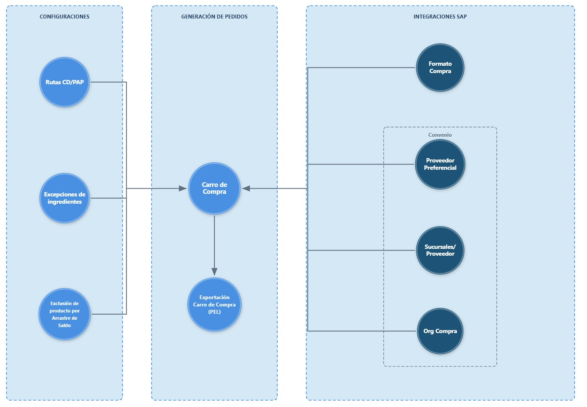

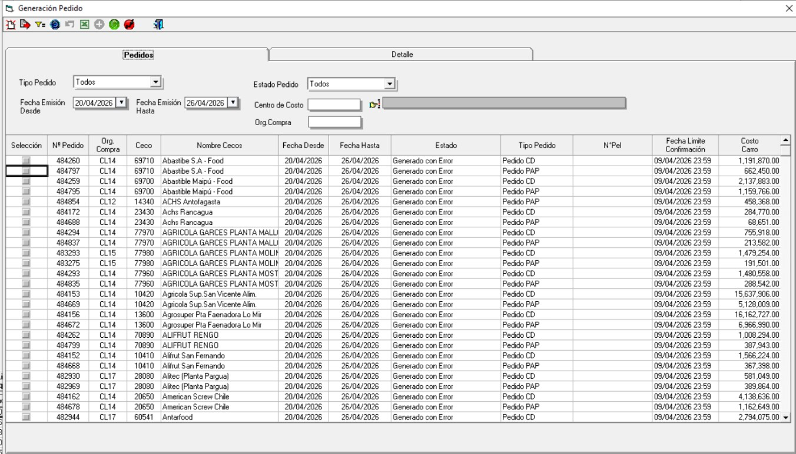
*Figura 1: Vista Generación Pedido*

## 8.2. Vista principal de pedidos (M_Lista_Pedido.frm)

<u>**Descripción:**</u>
Formulario principal de gestión del módulo de Pedidos. Es el punto de entrada del operador al módulo: permite visualizar, filtrar, revisar y operar sobre los pedidos centralizados generados para todos los CECOs. Actúa como panel de control del estado del pedido en cada etapa de su ciclo de vida.
<u>**Funcionalidad:**</u>
Describir una a una las funcionalidades: 
- **Crear:**
Esta opción permite crear carros de compras con las siguientes alternativas: CD, PAP o Proyectado. Se debe seleccionar el sitio y el rango de fechas (desde y hasta).
**Reprocesar:**
Esta opción permite reprocesar carros de compras que ya fueron creados previamente.
**Filtrar:**Para filtrar la información en la grilla, puede utilizar los siguientes criterios: tipo de pedido, fecha desde, fecha hasta, estado del pedido, centro de costo y organización de compras (Zona).
**Exportar a Excel:**
Desde la pestaña Pedidos, puede exportar a Excel los carros de compras PEL.
Desde la pestaña Detalle, puede exportar a Excel un carro de compras específico.
**Envío de minuta al sitio (Cambio de Estado):**Desde la pestaña Pedidos, seleccione los sitios a los que desea enviar la minuta.
Pestaña Pedido: Visualización del listado de pedidos centralizados con correlativo, zona, centro de costo, descripción del centro de costos, fecha desde – hasta, estado, tipo (CD/PAP/Proyectado), fecha y hora límite de confirmación (eliminar esta columna) y monto total. En esta pantalla no se visualiza el detalle, es un resumen. Se puede marcar uno o más checkbox para exportar Excel en formato de carga para PEL. 
Pestaña Detalle: Visualización del detalle del pedido seleccionado: ingredientes, cantidades, proveedor y precio por línea. El detalle se visualiza solo un pedido, sea CD o PAP, para un centro de costos en específico (solo se puede marcar 1 checkbox)
Búsqueda de pedidos previamente generados a través de los filtros: tipo de pedido, fecha desde – hasta, estado de pedido, organización de compra (zona) o centro de costos.
- Modificar el estado del pedido dentro del flujo (Generado, Enviado, Parcial, Rechazado, Eliminado).
- Acceso al formulario de generación de un nuevo pedido.

<u>**Reglas de Negocio:**</u>
- Los estados del pedido centralizado son: 1=Generado (calculado, no enviado), 2=Enviado (enviado a PEL/SAP), 3=Parcial (líneas con Activo=0), 6=Rechazado (rechazado por PEL sin convenio vigente), 97=Eliminado (anulado).
- Los pedidos en estado 2 (Enviado), 6 (Rechazado) o 97 (Eliminado) no se pueden reprocesar.
- El pedido proyectado (TipoPedido=2) es un estimativo para análisis de Compras. No genera órdenes de compra reales hacia proveedores.
- No se puede liberar minuta a la operación si no se ha generado el respectivo carro de compras.
- Genera valores nulos, cuando no existe convenios o bien unas rutas despachos.
- Genera archivos Excel con la información, tanto para la creación de los carros de compra PEL desde el módulo principal, como para revisiones internas donde los datos deben estar dentro de la grilla de detalle de cada pedido.

<u>**Tablas Relacionadas:**</u>
- Tabla Pedido Centralizado (B_PedidoCentralizado), Tabla encabezado Pedido
- Tabla Pedido Centralizado Detalle (B_PEDIDOCENTRALIZADODET), Detalle Pedido
- Tabla Pedido Centralizado Parámetro (B_PEDIDOCENTRALIZADOPAR), Pedido Parámetro
- Tabla Convenio SAP (I_CONVENIO_SAP), esta tabla descarga de integración SAP
- Tabla Org CECO (I_ORG_CECO), esta tabla descarga de integración SAP
- Tabla CECO SUC Proveedor (I_CECO_SUC_PROVEEDOR), esta tabla descarga de integración SAP
- Tabla Proveedor Conv (I_PROVEEDOR_CONV), esta tabla descarga de integración SAP
- Tabla RUT que opera central de distribución (B_RUT_CD)
- Tabla Formato SAP (B_FORMARTOCOMPRAS_SAP), esta tabla descarga de integración SAP
- Tabla Formato Compras SAP SGP (B_FORMATOCOMPRAS_SAP_SGP) , tabla asociar producto SGP & Material SAP
- MINUTA (cas_b_minuta)
- MINUTADETALLE (cas_b_minutadet)
- CLIENTES (b_cliente)
- RECETA (b_receta)
- RECETADET (b_recetadet)
- INGREDIENTE (b_ingrediente)
- PRODUCTOSING (b_productosing)
- PRODUCTOS (b_productos)
- SERVICIO (a_servicio)
- TABLA DE GRAMAJE X CECO (b_tablagramajececo)
- TABLA DE GRAMAJE X NIVEL (b_tablagramajececo_nivel)
- Tabla Ingrediente Pedido Excepción (B_INGREDIENTE_PEDIDO_EXCEPCION)
- Tabla Parámetro Despacho (B_PARAMETRODESPACHOS)
- Tabla Parámetro Despacho Proveedor (A_PARAM_DESPACHO_PROVEEDOR)
- Tabla Ruta Grupo Despacho (B_RUTAGRUPODESPACHO)
- Tabla Ruta Despacho (B_RUTADESPACHO)
- Tabla No Arrastre Saldo (B_NO_ARRASTRE_SALDO)
Mejora:
- Evaluar los estados del pedido.
- Eliminar la columna con la fecha límite del formulario pestaña (Pedido).

## 8.3. Generación de pedido (M_generacion_pedido.frm)

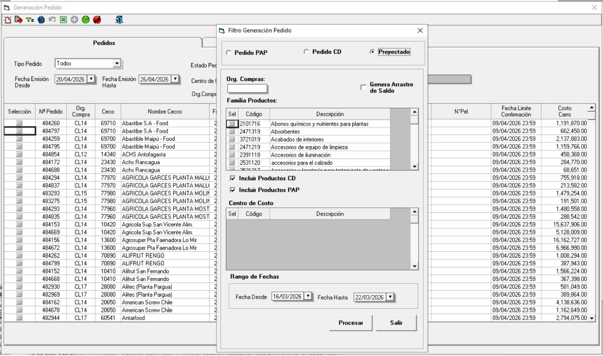

> Figura : Generación de Pedido por Tipo de Pedido

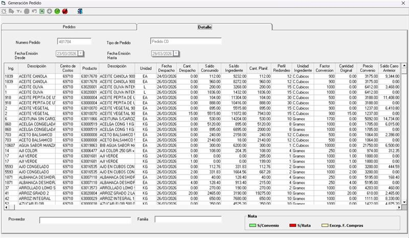

> Figura : Pedido Procesado

<u>**Descripción:**</u>
Al realizar click en un nuevo pedido (1) se abre la pantalla de configuración de parámetros para el proceso masivo de generación de pedidos centralizados. Es el formulario central del módulo: a partir de la selección de CECO, período, tipo de pedido y parámetros opcionales, el sistema calcula automáticamente las cantidades de ingredientes a pedir. Prerrequisito obligatorio: que la minuta del CECO esté aprobada/enviada.
<u>**Funcionalidad:**</u>
- Selección del CECO, período y tipo de pedido: PAP (entrega directa al casino), CD (vía centro de distribución) o Proyectado (estimativo sin orden real).
- Validación de prerrequisitos antes de iniciar: existencia minuta del CECO en estado aprobado o enviado.
- Cálculo automático de la cantidad a pedir por ingrediente: receta gramaje ingrediente  raciones de la receta
- Fecha de consumo
- Aplicación de Tabla Gramaje
- Aplicación homologación de ingredientes – producto SGP- Producto SAP
- Aplicación de la tabla de Exclusiones (Excluye un ingrediente del pedido). Exclusión automática de ingredientes configurados en la funcionalidad de exclusión de ingredientes. (Ingredientes excluidos del pedido (M_IngExe.frm))
- Aplicación días de holgura logística de cada familia de producto
- Aplicación Tabla de Excepciones: reemplaza proveedor y material SAP estándar cuando existe una excepción activa para el par CECO/ingrediente
- Aplicación lógica de selección de convenio, que consiste en el menor precio unitario por CC, GR o C/U, siempre que no exista tabla de excepciones para el ingrediente analizado.
- Aplicación Lead time
- Aplicación rutas de despacho
- Aplicación arrastre de saldo (SI o NO). Dato para usar en mejora (MRP).
- Aplicación de factor de redondeo de la cantidad al múltiplo de embalaje definido en el convenio SAP (factor de redondeo)
- Aplicación cantidad mínima de compra definida en convenio SAP.
- Aplicación de tipo de despacho CD, PAP y dentro de PAP la variante XD.
- Determinación de cantidad a despachar (Formula Actual y Formula MRP)
- Aplicación de precio de compra a la fecha de despacho
- Generación de carro de compras
- Generación de Nulls (insumos que no tienen homologación, convenio, ruta)
- Reprocesamiento de pedidos a petición del usuario.
- Reprocesamiento automática de pedidos futuros del mismo CECO afectados por el cambio en el arrastre.
- El pedido queda disponible en estado Generado en la vista principal, listo para revisión y envío a PEL/SAP.
- Visualizar mes móvil para efectos del cálculo necesidades de consumo, luego estás necesidades considerando todos los puntos anteriores, se trasladan a su respectiva semana de despacho.
<u>**Reglas de Negocio:**</u>
- Un pedido solo puede generarse para casinos cuya minuta esté en estado aprobado/enviado. Minutas en borrador o sin planificación no generan pedido.
- El sistema genera pedidos solo para ingredientes que no están en la tabla de “Excluir Ingrediente del Pedido”.
- El arrastre de saldo solo de activa para un pedido proyectado (opcional).
- El arrastre de saldo puede activarse/desactivarse globalmente con el checkbox. Sin embargo, los productos de la tabla “Productos que NO Arrastres” (B_NO_ARRASTRE_SALDO) nunca generan arrastre, independientemente del checkbox.
- El factor de redondeo del convenio se aplica al calcular la cantidad del pedido para respetar las condiciones de compra (múltiplos de unidad de embalaje).
- Las rutas de despacho deben existir para el período antes de generar el pedido. Sin rutas, el cálculo no puede determinar las fechas de despacho.
- Si existe una excepción de formato de compra vigente para el para el CECO-Ingrediente, se usa el proveedor/material preferido del convenio (PR), si es que no existe un preferido, usa el proveedor/material con menor costo del convenio.  
- El arrastre de saldo es teórico: SGP ADM no accede al inventario real del casino. El cálculo se basa en pedido anterior menos consumo planificado, sin considerar stock físico real ni mermas.
- Validaciones de pantalla obligatorias: CECO/Contrato, rango de fechas (inicio y fin), y tipo de pedido deben estar informados antes de procesar.
- **Si el Centro Costo no tiene seleccionado Arrastre de Saldo MRP considerar ****arrastre**** normal:**
Este procedimiento se encarga de revisar los ingredientes usados en un pedido y ver si existe saldo disponible de pedidos anteriores. Es decir, si quedó “resto” de un ingrediente en un pedido previo, el sistema lo usa antes de pedir más.
**En términos simples:**
- Revisa cada línea del pedido (cada ingrediente).
- Busca si quedó saldo del mismo ingrediente en pedidos anteriores.
**Si hay saldo:**
- Lo utiliza para cubrir parte o todo el consumo.
- Reduce lo que se necesita pedir.

**Si el saldo no alcanza:**
- Calcula lo que falta pedir realmente.
- Ajusta cantidades y totales.
- Guarda el saldo que queda para que se use en el próximo pedido.

- **Si el Centro Costo tiene seleccionado ****“****Arrastre de Saldo MRP****”**** considerar ****arrastre**** ****de Saldo MRP:**
  - El saldo MRP (Stock disponible que reemplaza el arrastre de saldo) se calcula de la siguiente forma. Stock MRP = Inventario inicial + Compras por Recibir + Traspasos Recibidos − Traspasos Emitidos – Consumos.
  - Si el saldo teórico cubre el 100% de la necesidad no se sugiere compra.
  - Si el saldo teórico no cubre el 100% de la necesidad, se calcula el diferencial de acuerdo con el perfil de redondeo del producto.
  - No se consideran químicos ni desechables
  - No se consideran insumos que no arrastran saldo. Estos se sugieren siempre al 100% (En los casos en que el resultado del análisis nos sugiere insumos que no están en el carro, sólo se informan, pero no se incorporan. No considerar inventarios disponibles negativos
  - redondeado por el formato de compras)
  - El arrastre de saldo se puede activar en pedidos PAP, CD y Proyectado.

- **Calculo Generación Pedido:**
- **Paso 1:**
  - Por cada día del período, se recorre la minuta planificada del CECO y se calcula la cantidad necesaria de cada ingrediente: Cantidad_Ingrediente = SUM( Raciones) × (Cantidad_en_Receta / Base_Raciones) )
    - **Raciones** = mid_numrac (número de raciones planificadas por servicio)
    - **Cantidad_en_Receta** = red_canpro (cantidad del ingrediente en la receta)
    - **Base_Raciones **= rec_basrac (raciones base para las que está formulada la receta)
  - Si el CECO tiene configurada una tabla de **gramaje por nivel** (fn_ObtenerIngredienteReemplazoJerarquia), se reemplaza el ingrediente y/o su cantidad antes del cálculo.
  - Los ingredientes marcados en la tabla de excepciones (b_ingrediente_pedido_Excepcion) son excluidos del pedido.
- **Paso 2:**
  - Cada ingrediente tiene un día de seguridad según su familia de producto y el CECO (fn_sgpadm_Pro_TraerDiaSeguridad):
  - Fecha_en_Sitio = Fecha_Consumo – DiasHolgura
  - Si Fecha_en_Sitio cae en domingo o sábado y el cliente no trabaja fin de semana (cli_blockmintrabajafinsemana = '0'), la fecha se retrocede 1 día adicional por cada día no hábil, de modo que el despacho quede en viernes como máximo, no considera feriados.
- **Paso 3:**
- El sistema cruza las necesidades de ingredientes con:
  - Rutas de despacho (b_rutadespacho / b_rutagrupodespacho): fechas en que el proveedor entrega en el CECO.
  - Considera mayor valor del día holgura y lead time lo que implica tres semanas hacia delante de consumo.
  - Convenios SAP (I_CONVENIO_SAP): acuerdos comerciales vigentes que vinculan ingrediente ↔ material SAP ↔ proveedor ↔ precio.
- La selección del convenio sigue un **orden de prioridad**:
  - Prioridad 0: Convenio marcado como Excepción de Formato
  - Prioridad 1: Tipo de formato del CECO = tipo del convenio y preferido (Evaluar)
  - Prioridad 2: Tipo de formato del CECO = tipo del convenio, no preferido (Evaluar)
- > 💬 **Comentario — Paz Jorge (2026-03-30):** No corre esta parametrización. Esta en obsoleta
  - Prioridad 3: Convenio con producto preferido (PR)
  - Prioridad 4: Convenio de tipo genérico, no preferido con menor precio
  - Prioridad 5: Cualquier otro
- Se selecciona el convenio de menor prioridad (más específico) y, en caso de empate, el de menor precio.
- Los convenios que vencen a mitad de semana se alargan automáticamente al domingo para evitar cortes de suministro y se permite generar el pedido solo si la vigencia es hasta esa semana.
- Para productos en Cross-Docking, la fecha de despacho se recalcula usando la próxima fecha del Centro de Distribución como intermedio o fecha de PAP según la configuración en rutas.
**Paso ****4****: **
- El saldo es el excedente del carro anterior (diferencia entre el factor de redondeo y la cantidad mínima de compras lo consumido). El sistema descuenta el saldo acumulado antes de generar el nuevo **el arrastre normal o bien stock disponible del MRP**.
**Detalle de Grilla****:**

| **Etiqueta** | **Campo BD** | **Visible** | **Origen** | **Descripción** | **Fórmula** | **Ejemplo** |
| --- | --- | --- | --- | --- | --- | --- |
| **Cód. Ingrediente** | ing_codigo | Visible | BD | Código interno del ingrediente | — | — |
| **Nombre Ingrediente** | ing_nombre | Visible | BD | Nombre del ingrediente | — | — |
| **Proveedor** | Proveedor | Visible | BD | Código + nombre del proveedor SAP. Se muestra en panel inferior al hacer clic | — | — |
| **Familia Producto** | FamiliaProductoSAP | Visible | BD | Grupo de artículos SAP (fcs_CodGrpArt). Se muestra en panel inferior al hacer clic | — | — |
| **CECO** | ID_centro_de_costo | Oculto | BD | Centro de costo; usado internamente para consultas | — | — |
| **Producto SAP** | fcs_CodMaterial | Visible | BD | Código de material SAP (ID_MATERIAL) | — | — |
| **Des. Producto SAP** | fcs_DenMaterial | Visible | BD | Descripción del material SAP | — | — |
| **Unidad** | fcs_DenUniMed | Visible | BD | Unidad de medida del formato de compra del convenio | — | — |
| **Fecha de Despacho** | FechaRuta | Visible | BD | Fecha en que el proveedor entrega en el CECO | — | — |
| **Cantidad**** Despacho** | Cant_Des | Visible | Calculado / Editable | Cantidad a despachar redondeada al múltiplo comercial. Único campo editable: el usuario puede reducirla, debe ser múltiplo de Ctd. Formato (col 15) y no superar Cantidad Original (col 22) | RedondeoMultiplo(Cant – Saldo Carro de Arrastre– Ajuste MRP, Ctd. Formato, Mínimo Pedido) | RedondeoMultiplo(0,4; 1; 1) = 1 saco |
| **Saldo Consumido** | Saldo_Consumido | Visible | Calculado | Porción de la Cant. Planificada cubierta con saldo del carro anterior. Se descuenta antes de calcular el pedido | MIN(Saldo_Anterior, Cant. Planificada) | MIN(5, 15) = 5 kg usados del saldo |
| **Saldo Ing.** | Saldo_Ing | Visible | Calculado | Excedente del redondeo de este carro. Se guarda en b_PedidoCentralizadoDet.Saldo_Ing y se convierte en el Saldo Carro Anterior del próximo pedido | (Cantidad − Cant. Ingresada) × Facing | (1 − 0,4) × 25 = 15 kg → serán el Saldo Carro Anterior la próxima semana |
| **Cant. Planificada** | Cant_Ing | Visible | Calculado | Cantidad total de ingrediente derivada de la minuta, en unidad de ingrediente | SUM(Raciones × Cant_Receta / Base_Raciones) | 300 rac × (5 kg / 100 rac) = 15 kg |
| **Cantidad Ingresada** | Cant_Pro | Oculto | Calculado | Cant. Neta convertida a unidades de producto SAP, antes de redondear | (Cant. Planificada − Saldo Consumido) / Facing | (15 − 5) / 25 = 0,4 sacos |
| **Perfil Redondeo** | Perfil_Redondeo | Oculto | BD | Perfil SAP que define el múltiplo de redondeo | — | — |
| **Unidad Ingrediente** | ing_unimed → unm_nomcor | Visible | BD | Unidad de medida del ingrediente (tabla a_unidadmed). Es la unidad en que se expresan Cant. Planificada, Saldo Consumido, Saldo Carro Anterior y Saldo Ing. | — | — |
| **Ctd. Formato** | Ctd_Fmto | Oculto | BD | Tamaño del pack de compra. Divisor de validación al editar la Cantidad | — | — |
| **Factor de Conversión** | pro_facing | Visible | BD | Unidades de ingrediente que contiene 1 unidad de producto SAP. Usado para convertir Cant. Neta a unidades de compra y para calcular el Saldo Ing. | — | — |
| **Cantidad Original** | Cant_Ingresada | Oculto | Calculado | Cantidad generada inicialmente (antes de cualquier edición). Sirve como tope máximo al editar Cant_Des | Igual que Cant_Des al momento de la generación | 1 saco (no cambia aunque el usuario edite) |
| **Precio Convenio** | precio_convenio | Visible | BD | Precio unitario del convenio SAP vigente | — | — |
| **N° Línea** | NumLinea | Oculto | BD | Número de línea interno; usado para grabar cambios | — | — |
| **Tipo Pedo** | TipoPedido | Oculto | BD | Tipo de pedido (1=PAP, 2=Proyectado, 3=CD) | — | — |
| **Marca** | — | Oculto | BD | Indicador interno siempre = 1 | — | — |
| **IdPedido** | IdPedido | Oculto | BD | ID del encabezado del pedido; usado para grabar cambios | — | — |
| **Saldo Carro Anterior** | despacho_exceso | Visible | Calculado | Saldo proveniente del carro anterior. Es el valor que se descuenta de la Cant. Planificada para obtener la Cant. Neta. Fue generado en el pedido previo como (Cantidad − Cant. Ingresada) × Facing | Saldo_Ing del pedido anterior del mismo CECO + ingrediente + tipo | Semana pasada sobró 5 kg → esta semana Saldo Carro Anterior = 5 kg |
| **Inventario** |  | Visible | BD | Stock físico declarado por el sitio en el último inventario de fin de mes, expresado en unidad de ingrediente. | Datos de la toma de inventario del último mes (Módulo de Inventario) |  |
| **Compras por Recibir** |  | Visible | Integración por PEL | Unidades de producto SAP ya compradas, pero aún no recibidas en el sitio, convertidas a unidad de ingrediente multiplicando por el factor del ingrediente. | Dias antes del 1er consumo por ingrediente del periodo evaluado. |  |
| **Traspasos Recibidos** |  | Visible | BD | Cantidad en unidad de ingrediente recibida desde otro sitio en el período | Dias antes del 1er consumo por ingrediente del periodo evaluado. |  |
| **Traspasos Emitidos** |  | Visible | BD | Cantidad en unidad de ingrediente enviada a otro sitio en el período | Dias antes del 1er consumo por ingrediente del periodo evaluado. |  |
| **Saldo ****MRP** |  | Visible | Calculado | Stock disponible real estimado. Si es negativo no se descuenta nada. La fórmula debe incorporar los consumos (-) al día antes del 1er consumo por ingrediente del periodo evaluado | MAX(0, Inventario + Compras_x_Recibir + Traspasos_Rec − Traspasos_Emi) - consumos |  |
| **Ajuste MRP** |  | Visible | Calculado | Cantidad en kg que se descuenta de Cantidad Planificada gracias al Saldo MRP. Si el saldo MRP cubre toda la necesidad. La cantidad a pedir es “0”, caso contrario se pide l diferencial y aplica factor de redondeo y mínimo de compra. | MIN(Saldo_MRP, Cantidad Planifica) |  |

<u>**Mejorar:**</u>
- El proyectado de compras se procesa de a un CL (Centro Logístico) a la vez. El nuevo sistema debe permitir procesar todos los CLs en una sola operación.
- En la generación de pedido y proyectado no muestran la cantidad planificada cuando un ingrediente no tiene ruta, ni convenio vigente, por lo que se requiere que con estos errores se muestre la cantidad planificada.
- Si el precio no está vigente a la fecha de despacho rebota en PEL.

## 8.4. Modificar ingrediente al pedido (M_Agregar_Ingrediente_al_Pedido.frm)

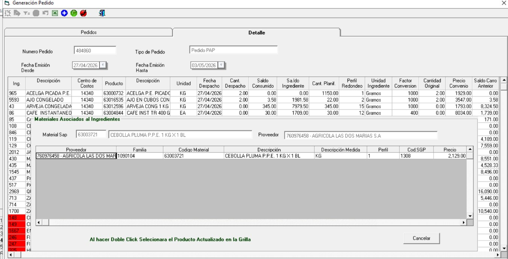
*Figura 4: Modifica Ingrediente de Pedido*

<u>**Descripción:**</u>
Cuando se realiza un click en un ingrediente, se abre un formulario complementario que permite modificar manualmente un material a un pedido ya generado. Se usa cuando el planificador desea modificar el material o proveedor del pedido.
<u>**Funcionalidad:**</u>
- Seleccionar el código de ingrediente a cambiar.
- Búsqueda en el convenio SAP.
- Validación de convenio SAP vigente para la fecha del pedido.
- Validación del factor de redondeo.
- Modificación de la línea el pedido.
<u>**Reglas de Negocio:**</u>
- El código del producto es obligatorio.
- El producto debe existir en el convenio.
- Debe existir un convenio SAP vigente para la fecha del pedido.
- El producto debe tener factor de redondeo definido en el convenio.
- Si es que se modifica el producto, también se modifica el en la tabla de excepciones formato compras. 
Mejoras:
- Considerar detalle del pedido el día holgura y monto mínimo de compras.

## 8.5. Envío de convenios SAP a PEL (C_ConsultarActualizarConveniosPel.frm/ C_DetalleRutasConErrorPel.frm)

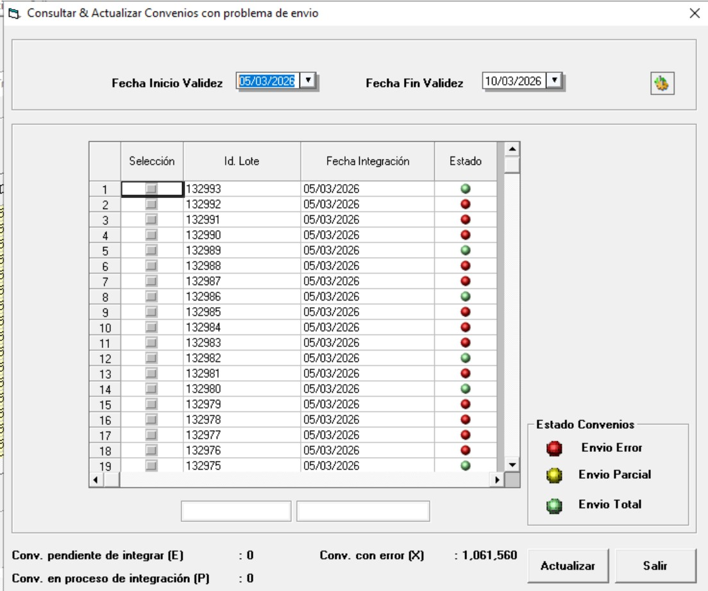

> Figura : Consultar y Actualizar Convenio a PEL

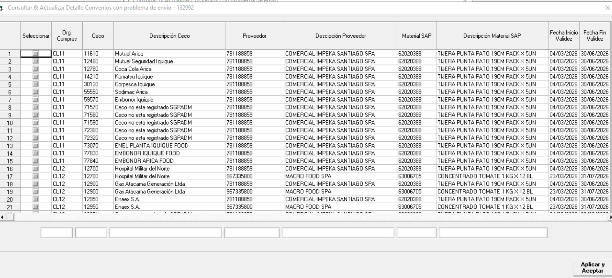

> Figura : Detalle Convenio con Error
<u>**Descripción:**</u>
En Consultar & Actualizar muestra la pantalla de gestión de convenios que fallaron en la sincronización automática con el sistema PEL. Permite al operador identificar convenios en estado de error (Respuesta_PEL='X') y reenviarlos para que PEL los procese nuevamente. Es una herramienta de recuperación ante fallos de integración. Solo se puede ver el detalle en los convenios con círculo rojo. 
Los filtros mostrados al final de la pantalla aparecen como **campos de búsqueda vacíos**, destinados a filtrar la información de los convenios. No tienen valores ingresados y funcionan como filtros generales para refinar la consulta según distintos criterios, tales como organización, centro de costo, proveedor, material SAP u otros atributos del detalle del convenio.

<u>**Funcionalidad:**</u>
- Filtros: rango de fechas de validez, estado de respuesta PEL.
- Lista de convenios con error.
- Selección de convenios para reenvío.
- Botón para ejecutar el reenvío.
- Muestra el detalle del error PEL y datos del convenio fallido. Incluye botón "Aplicar y Aceptar" para confirmar la corrección.
<u>**Reglas de Negocio:**</u>
- Si la sincronización con PEL falla, el convenio queda con Respuesta_PEL='X'. El único mecanismo de reintento disponible es esta pantalla.
- Se muestra todos los convenios cargados según fecha filtrada.
- Los tres estados posibles de Respuesta PEL son: P = pendiente (en cola para PEL), X = error (falló la integración), E = enviado y aceptado por PEL.
- El reenvío no modifica los datos del convenio (precio, vigencia, proveedor). Solo resetea el estado de integración para que PEL vuelva a intentar procesarlo.
- Un convenio reintentado puede volver a fallar (Respuesta_PEL='X') si el problema de origen persiste en PEL.
- En la pantalla de “Detalle Convenio con Error” la confirmación de la corrección mediante el botón "Aplicar y Aceptar", que cierra el subformulario y dispara el reenvío del convenio desde la pantalla padre.
<u>**Tablas Relacionadas:**</u>
- Tabla Consultar Actualizar Convenios PEL (C_ConsultarActualizarConveniosPel.frm)
- Tabla Detalle Rutas Con Error PEL (C_DetalleRutasConErrorPel.frm)
- Tabla Convenios PEL (I_PEL_CONVENIO)
- Tabla Convenios PEL  Det (I_PEL_CONVENIO_DET)

## 8.6. Consulta de convenios SAP (C_Convenio.frm)

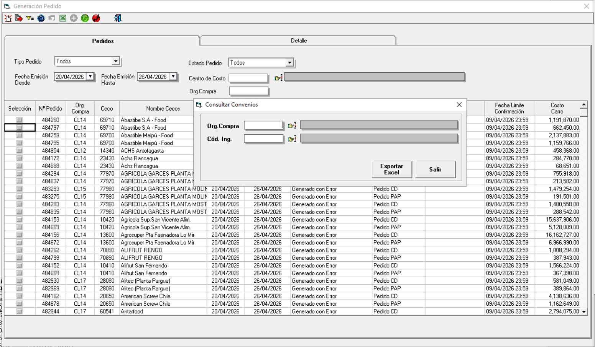

> Figura : Consulta Convenio

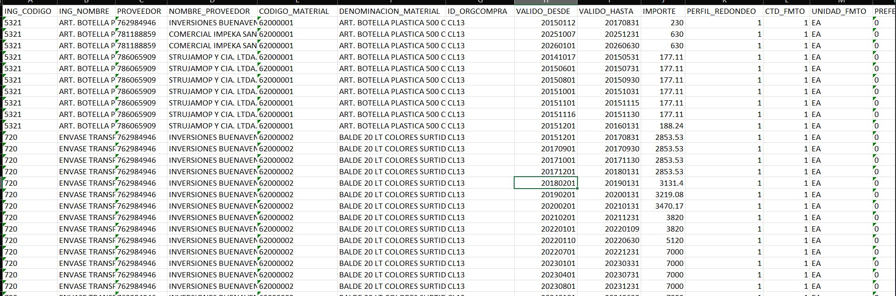

> Figura : Detalle Excel

<u>**Descripción:**</u>
Al hacer click en el botón verde (1) se abre la pantalla para ingresar organización de compra y código de ingrediente. Una vez ingresada la información se exporta a Excel. En la pantalla de solo permite exportar Excel para consulta de los convenios SAP vigentes importados desde el sistema SAP. No permite crear, modificar ni eliminar convenios (esa acción ocurre en SAP y se replica automáticamente al SGP).
<u>**Funcionalidad:**</u>
- Filtros disponibles: organización de compra, código de ingrediente.
- Información mostrada por convenio: código material SAP, descripción, proveedor, organización de compra, precio neto, precio unitario, unidad de medida, fecha inicio validez, fecha fin validez, factor de redondeo, mínima de pedido, flag BORRADO.
- Exportación a Excel.
<u>**Reglas de Negocio:**</u>
- Si existe un convenio vigente (fechas activas) para un producto y organización de compra, este se muestra.
- Esta pantalla es solo de consulta. La creación/modificación de convenios ocurre en SAP.
<u>**Tablas Relacionadas:**</u>
- Tabla Convenios PEL (I_PEL_CONVENIO)
- Tabla Convenios PEL  Det (I_PEL_CONVENIO_DET)

Mejoraras:
- No considerar el botón rojo.

## 8.7. Configuración de fechas de despacho por casino (M_fechadespachoCecos.frm)

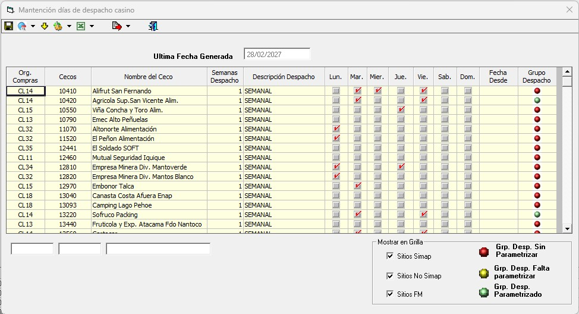

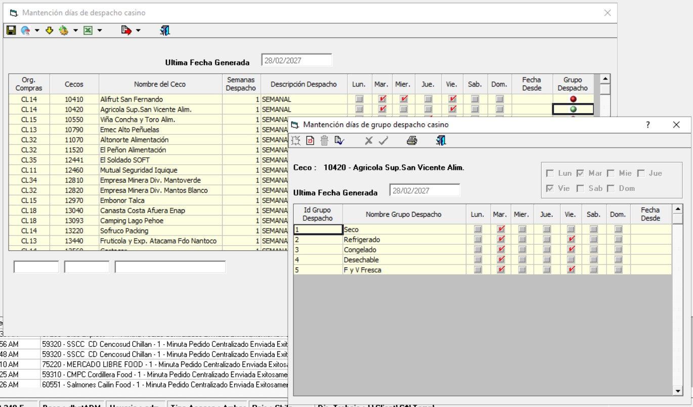
*Figura 9: Configuración Fecha de Despacho CD por Grupo de DespachoFigura 9: Configuración Fecha de Despacho CD por Grupo de DespachoFigura 10: Configuración Fecha de Despacho CD*

<u>**Descripción:**</u>
Pantalla para configurar los días de la semana habilitados para recibir despachos en cada casino/CECO desde la CD. Es el maestro base que determina qué fechas son válidas para el despacho y, por ende, para la generación de pedidos. No considerar Simap, No-Simap.
<u>**Funcionalidad:**</u>
- Filtro por CL, CECO o Nombre del Ceco.
- Genera ruta para CD.
- Configuración de días habilitados por día de semana: lunes, martes, miércoles, jueves, viernes, sábado, domingo.
- Soporta tres tipos de sitio: SIMAP, No-SIMAP y FM, cada uno con su propio calendario.
- Exportar Rutas a Excel.
<u>**Reglas de Negocio:**</u>
- Si un casino/CECO no tiene parámetros de despacho configurados en esta pantalla, la generación de rutas y pedidos falla para ese sitio.
- El sistema permite modificar la fecha despacho de un sitio y actualizar ruta hasta la misma fecha de termino.
<u>**Tablas Relacionadas:**</u>
- Tabla Parámetro CD (A_PARAM_DESPACHO_CASINO)
- Tabla Ruta despacho CD (B_RUTADESPACHO)
- Tabla Parámetro Grupo Despacho (B_PARAM_GRUPODESPACHO_CASINO)
- Tabla Ruta despacho x Grupo Despacho CD (B_RUTAGRUPODESPACHO)
Mejoras:
- Incorporar el concepto de rutas quincenales, cada tres semanas y/o mensuales.

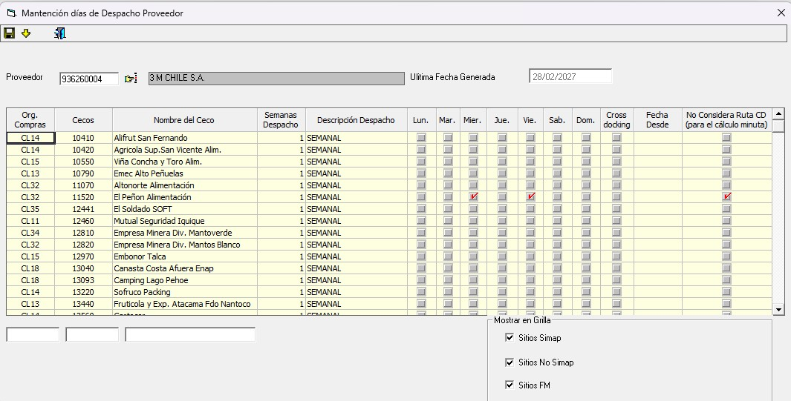
*Figura 11: Configuración Fecha de Despacho PAP*

## 8.8. Configuración de fechas de despacho por proveedor (M_fecha_despachos.frm)

<u>**Descripción:**</u>
Pantalla para configurar los días de despacho habilitados por proveedor y CECO para rutas PAP y XD(Crossdoking). Complementa la configuración del casino (M_fechadespachoCecos.frm) agregando la dimensión del proveedor: un proveedor puede no despachar todos los días que el casino está habilitado para recibir. No considerar Sitio SIMAP y NO SIMAP.
<u>**Funcionalidad:**</u>
- Selección del proveedor.
- Filtro por organización de compra, Cecos y Nombre del Ceco.
- Configuración de días habilitados por día de semana: lunes, martes, miércoles, jueves, viernes, sábado, domingo.
- Parámetro cross-docking: indica que la entrega pasa por el Centro de Distribución antes de llegar al casino.
- Flag exclusión CD: indica que el proveedor no participa en pedidos CD.
<u>**Reglas de Negocio:**</u>
- Los días de despacho configurados aquí afectan el cálculo de fechas PAP/XD(Crossdoking). Un proveedor sin días configurados para un CECO no participa en el cálculo de rutas PAP de ese CECO.
- El flag CROSS (cross-docking) indica que la entrega pasa por el CD antes de llegar al casino, sin almacenamiento. Afecta cómo se genera la orden de compra y la ruta.
- Si el flag de crossdocking y "No Considera Ruta CD" están seleccionado indica que el proveedor debe tomar la ruta de PAP.
- Si el flag de crossdocking esta seleccionado y "No Considera Ruta CD" no está seleccionado indica que el proveedor debe tomar la ruta de CD.
- El sistema permite modificar la fecha despacho de un sitio y actualizar ruta hasta la misma fecha de termino.

<u>**Tablas Relacionadas:**</u>
- Tabla Ruta Despacho (B_RUTADESPACHO)
- Tabla Parámetro Despacho Proveedor (A_PARAM_DESPACHO_PROVEEDOR)

## 8.9. Calendarios de fechas de despacho (M_Calendario_fechas_despachos.frm / M_Calendario_Fechas_GrupoDespacho.frm)

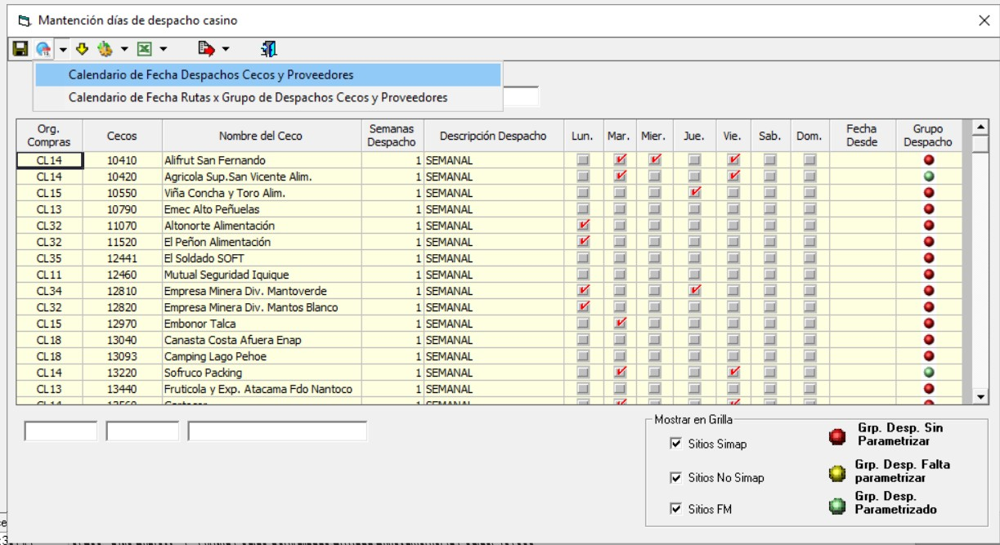

> Figura : Mantención Días de Despacho Casino Calendario

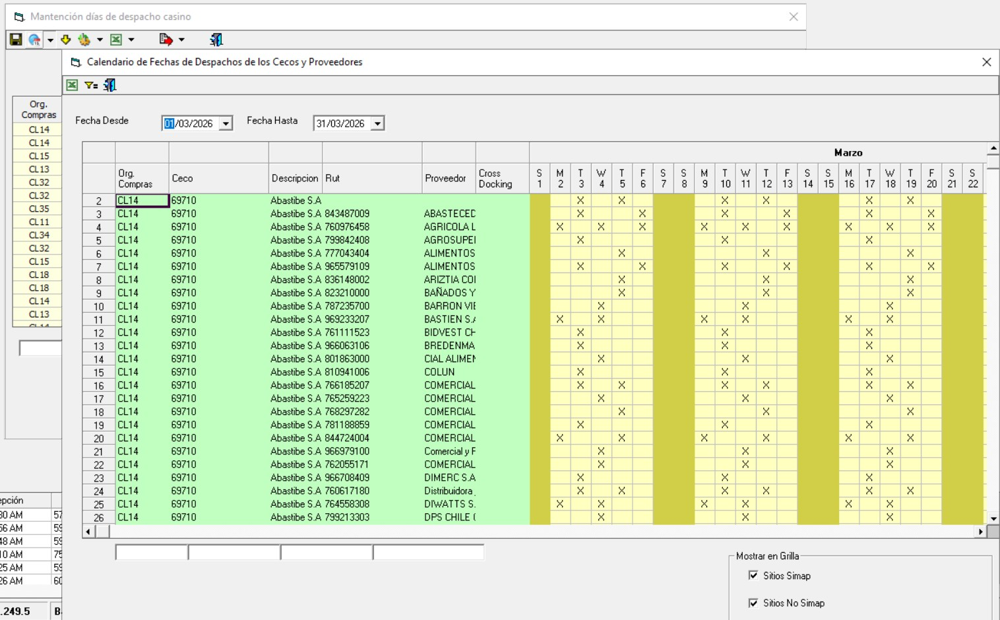

> Figura : Detalle Ruta por Proveedor

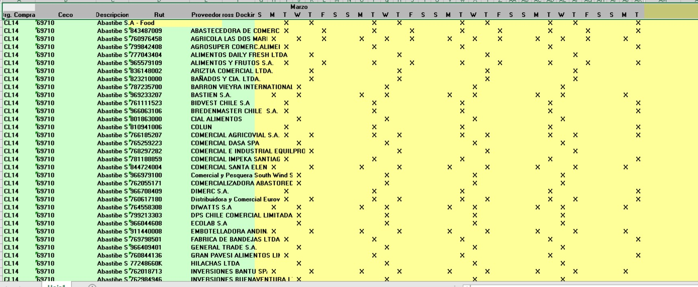

> Figura : Exportación de Excel

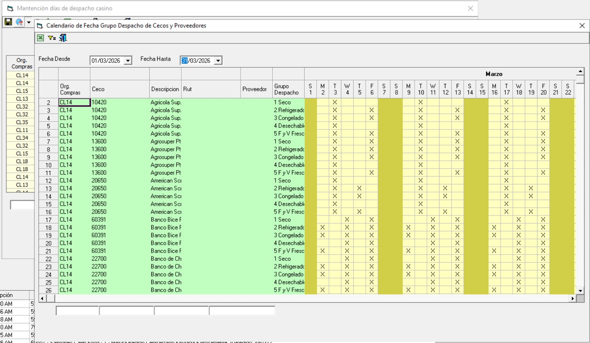

> Figura : Detalle Ruta por Grupo de Despacho

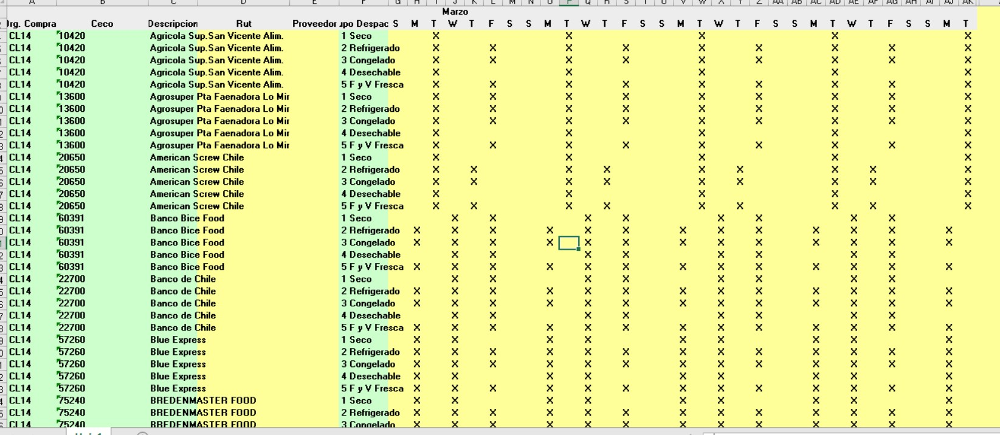

> Figura : Exportación de Excel por Grupo de Despacho
<u>**Descripción:**</u>
Pantallas de visualización del calendario mensual de fechas de despacho. Existen dos variantes:
- **M_Calendario_fechas_despachos.frm**: vista mensual por casino/CECO con fechas habilitadas marcadas como "X" y feriados en rojo (informativo).
- **M_Calendario_Fechas_GrupoDespacho.frm**: vista mensual por Grupo de Despacho CD.
Son pantallas de **solo consulta** con capacidad de exportación a Excel.
<u>**Funcionalidad:**</u>
- **M_Calendario_fechas_despachos.frm**: Filtros: Mes/año, CECO, organización de compra, descripción de Ceco, Proveedor.
- **M_Calendario_Fechas_GrupoDespacho.frm**: Filtros: Grupo de despacho CD, mes/año. Muestra el calendario de despacho consolidado del grupo.
- Las fechas con despacho habilitadas están marcadas con "X".
- Los feriados se muestran en rojo como referencia visual
- Exportación a Excel.
- Cuando la columna Proveedor esta vacio corresponde al Proveedor CD.
<u>**Reglas de Negocio:**</u>
- Los feriados se muestran en rojo como referencia visual, pero el sistema no los excluye automáticamente del cálculo de pedidos. La corrección de feriados es manual.
- Las fechas mostradas en el calendario corresponden a las rutas ya generadas.
<u>**Tablas Relacionadas:**</u>
- Tabla Ruta Despacho (B_RUTADESPACHO)
- Tabla Parámetro Despacho Proveedor (A_PARAM_DESPACHO_PROVEEDOR)

<u>**Mejoras:**</u>
- El sistema actual **no reconoce feriados**, obligando a un proceso manual propenso a errores para la corrección de rutas y pedidos. El nuevo sistema debe:
Precarga automática del calendario de feriados irrenunciables.
Permitir excepciones por sitio o contrato (para casinos que operan en feriados).
Automatizar el proceso de limpieza de rutas en fechas de feriado.

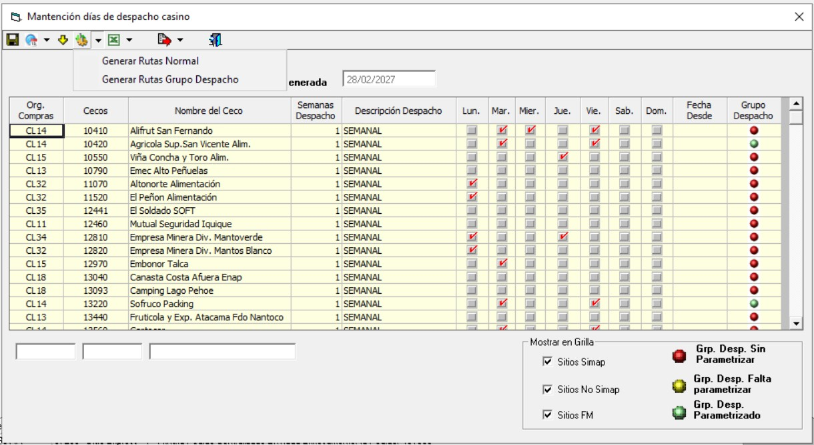
*Figura 17: Mantención Días de Despacho Generar Rutas*

## 8.10. Generación del archivo de rutas (M_Generar_Archivo_Rutas.frm)

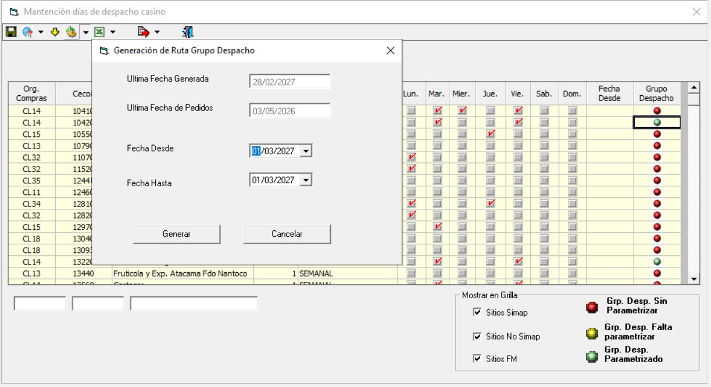
*Figura 18: Generar Rutas Grupo Despacho*

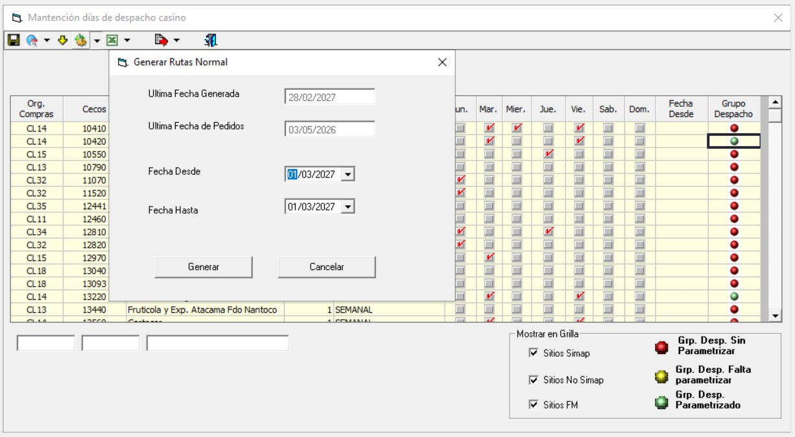
*Figura 19: Generar Rutas Normal*

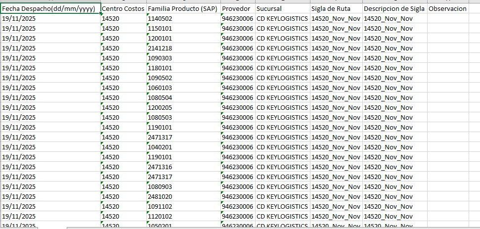

<u>**Descripción:**</u> 
Pantalla para generar las rutas de despacho concretas para un rango de fechas. Es el **prerrequisito obligatorio** para poder generar pedidos: sin rutas generadas, la generación de pedido no puede calcular las fechas de despacho. Las rutas se generan normalmente una vez al año y se amplían manualmente cuando vence el período.

<u>**Funcionalidad**</u>
- Definición del rango de fechas para las rutas (inicio / fin).
- El sistema muestra la última fecha generada como referencia.
- Validación de que el rango no se solape con rutas ya generadas.
- La fecha de pedido se calcula como: fecha despacho − días de holgura por familia.
<u>**Reglas de Negocio:**</u>
- La generación de rutas debe ejecutarse antes de la generación de pedidos para el mismo período.
- Las rutas de despacho se generan una vez al año y se amplían manualmente cuando se vence el período. Si se genera un pedido para un período sin rutas, el sistema no puede calcular las fechas de despacho y genera error.
- El rango de fechas del nuevo lote de rutas no puede solaparse con un período ya generado. El sistema valida este punto antes de procesar.
- Los grupos de despacho CD (ambiente: Seco, Refrigerado, Congelado, Desechable, F&V) son independientes de la lógica de días de holgura PAP. Ambos parámetros coexisten.
<u>**Tablas Relacionadas:**</u>
- Tabla Ruta Despacho (B_RUTADESPACHO)
- Tabla Parámetro Despacho Proveedor (A_PARAM_DESPACHO_PROVEEDOR)
<u>**Mejoras:**</u>
- Las rutas de despacho se amplían manualmente cada año. El nuevo sistema debe generar el calendario de rutas automáticamente al inicio de cada período o al vencer el período vigente.

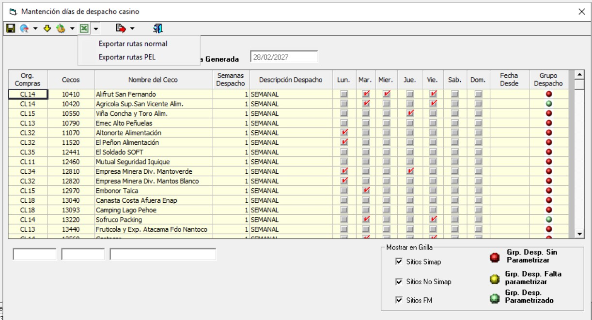

## 8.11. Exportar Rutas Normales y Rutas PEL

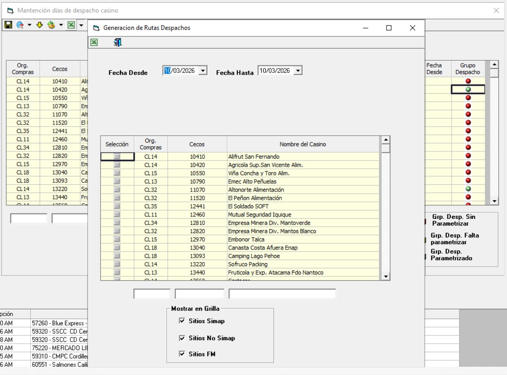

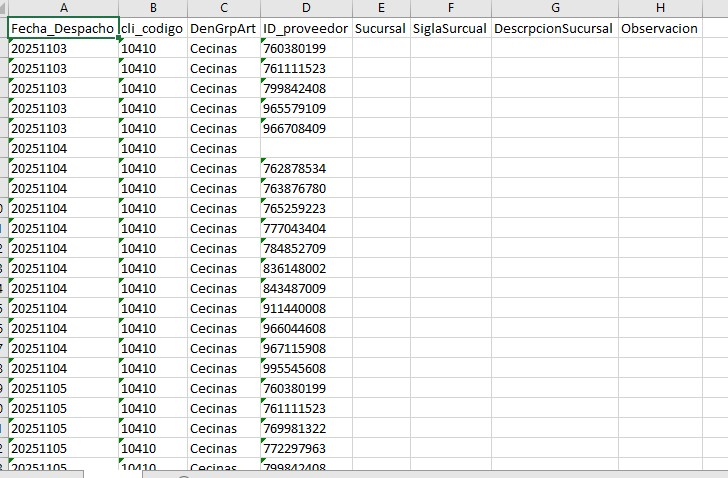
*Figura 20: Excel Exportar Rutas NormalesFigura 20: Excel Exportar Rutas NormalesFigura 21: Consulta y Descarga Rutas*

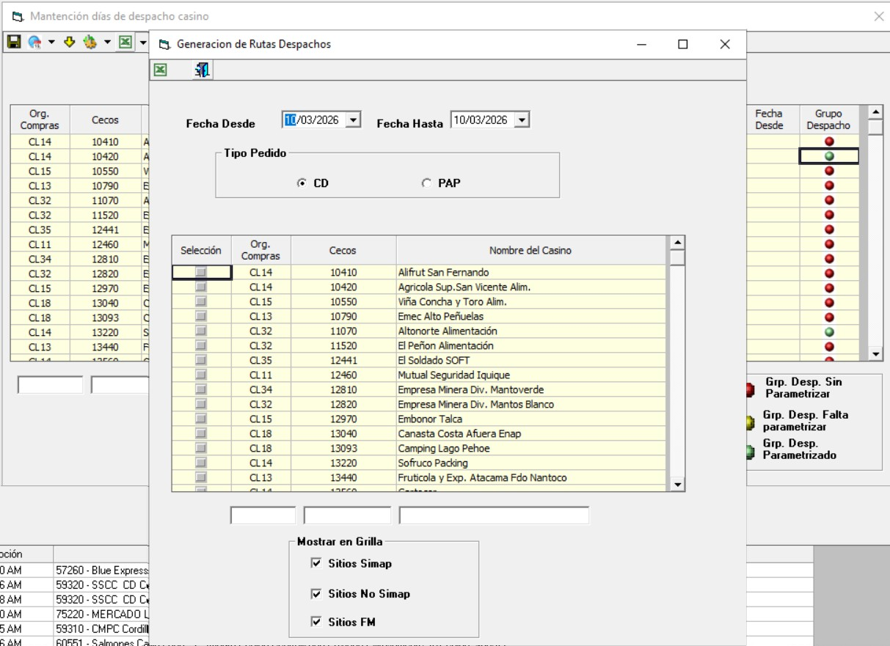

*Figura 22: Excel Descarga Ruta por Sucursal*

<u>**Descripción:**</u>
Permite exportar a Excel las rutas de despacho ya generadas. Tiene dos modalidades de exportación: rutas normales y rutas formato PEL. Ambas modalidades se filtran por rango de fechas, tipo de sitio y tipo de pedido.
<u>**Funcionalidad:**</u>
- Seleccionar rutas normales o pel a exportar.
<u>**Reglas de Negocio:**</u>
- El formato que descargar es xlsx y xls.
<u>**Tablas Relacionadas:**</u>
- Tabla Ruta Despacho (B_RUTADESPACHO)
- Tabla Parámetro Despacho Proveedor (A_PARAM_DESPACHO_PROVEEDOR)

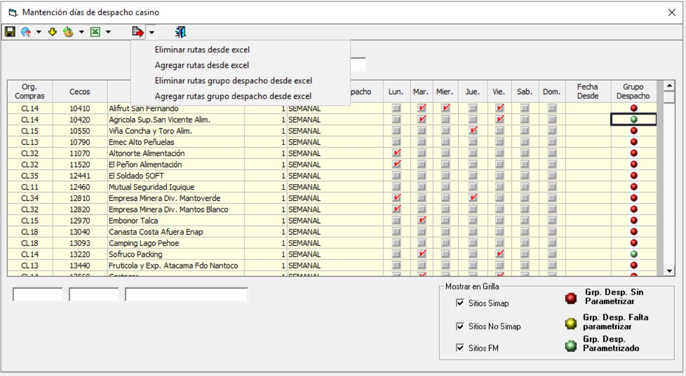
*Figura 23: Eliminar o Agregar Rutas*

## 8.12. Eliminar, Agregar Rutas Normales y Rutas por Grupo Despacho

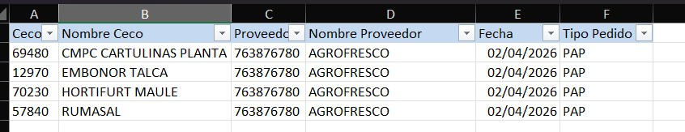

> Figura : Planilla para Eliminar o Agregar Rutas Normales.

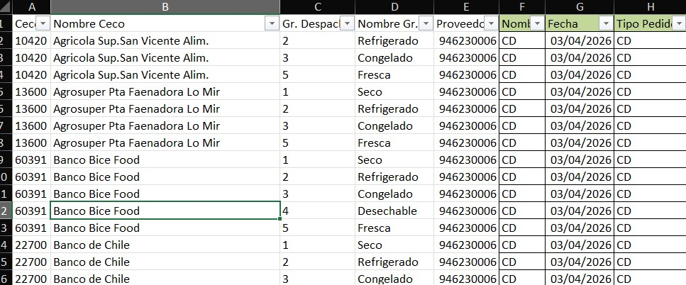

> Figura : Planilla para Eliminar o Agregar Rutas por Grupo de Despacho
<u>**Descripción:**</u>
Funcionalidad complementaria al proceso masivo de generación de rutas. Permite agregar o eliminar rutas individuales sin necesidad de regenerar el calendario completo del período. Aplica tanto a rutas normales (PAP) como a rutas con grupo de despacho (CD). Al hacer click se abre directamente las carpetas de escritorio para seleccionar el archivo correspondiente.
<u>**Funcionalidad:**</u>
- Seleccionar ingresa o eliminar rutas normales o por grupo de despacho para adjuntar la planilla Excel.
<u>**Reglas de Negocio:**</u>
- El formato para cargar debe ser xlsx o xls.
- Si la ruta ya está agregada, no debe permitir agregarla nuevamente para evitar duplicados.
- Las rutas deben existir para el período antes de generar pedidos. Agregar o eliminar rutas después de generar un pedido puede requerir reprocesar los pedidos afectados
Mejoras:
- Incluir generar rutas para sitios retail, misma lógica.

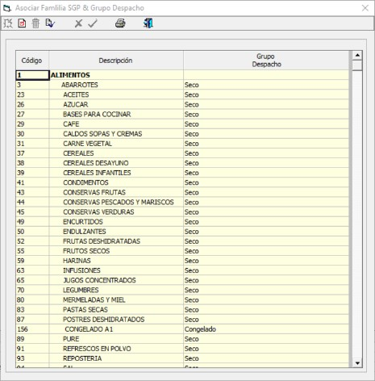
*Figura 26: Asociar Familia SGP y Grupo Despacho*

## 8.13. Asociación familia SGP ↔ Grupo de Despacho CD (M_AsoFamSGPGrupoDespacho.frm)

<u>**Descripción:**</u>
Pantalla para asignar cada familia de producto SGP a un ambiente de despacho CD (Seco, Refrigerado, Congelado, Desechable, Frutas y Verduras). Es la configuración que determina en qué "camión" viaja cada familia de producto cuando el pedido es tipo CD.
<u>**Funcionalidad:**</u>
- Visualización y edición de la relación familia SGP ↔ grupo de despacho (ambiente CD).
<u>**Reglas de Negocio:**</u>
- Los grupos de despacho CD definen en qué ambiente (Seco, Refrigerado, Congelado, Desechable, F&V) viaja cada familia de producto.
- Es obligatorio que cada familia de producto tenga su grupo de despacho.

## 8.14. Excepciones de formato de compra por CECO (M_ForComPrexCeCo.frm)

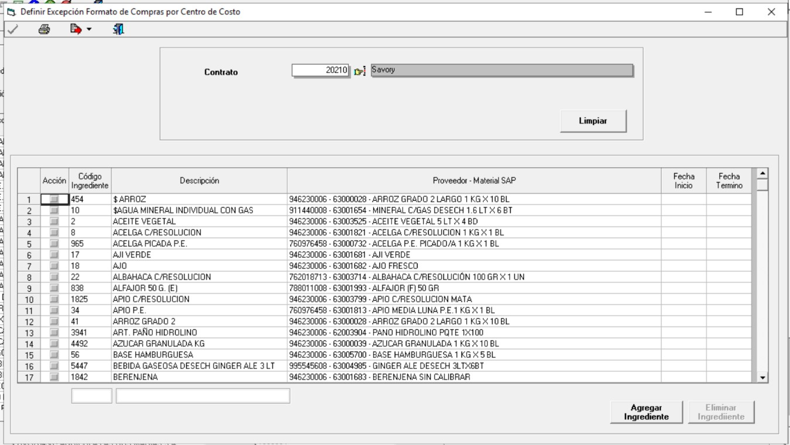

<u>**Descripción:**</u>
Pantalla para gestionar excepciones al formato estándar SAP para CECOs específicos. Permite configurar que, para un ingrediente en un casino determinado, se use un proveedor o material SAP diferente al que establece el convenio estándar. Las excepciones tienen vigencia por rango de fechas y tienen **precedencia** sobre el convenio SAP durante la generación del pedido.
**Casos de uso documentados:** sitios Luchetti (que bloquean determinados proveedores), Collahuasi (productos referenciados o prohibidos), sitios con restricciones contractuales de marca.
<u>**Funcionalidad:**</u>
- Consulta de excepciones de formato de compra vigentes, filtrables por CECO e ingrediente.
- Creación de una excepción para un par CECO/ingrediente, indicando material SAP alternativo, proveedor alternativo y rango de fechas de vigencia.
- Validación de unicidad: no permite crear una excepción si ya existe una activa para el mismo par CECO/ingrediente.
- Modificación de una excepción existente (proveedor, material o fechas de vigencia).
- Eliminación de una excepción, devolviendo la generación de pedidos al convenio SAP estándar para ese CECO e ingrediente.
- Las excepciones vigentes tienen precedencia sobre el convenio SAP en la próxima generación de pedidos.
- Exportación de las excepciones configuradas a Excel para auditoría o revisión.
<u>**Reglas de Negocio:**</u>
- Las excepciones de formato de compra tienen precedencia sobre el convenio estándar SAP para el CECO especificado. Si existe una excepción vigente para el par CECO+ingrediente, se usa el proveedor/material de la excepción, ignorando el convenio SAP.
- La vigencia de la excepción se verifica durante la generación del pedido: FechaInicio ≤ fecha pedida ≤ Fecha Término. Una excepción fuera de rango de fechas es ignorada.
- El sistema valida que no exista ya una excepción activa para el mismo par CECO/ingrediente antes de insertar una nueva (evitar duplicados).

## 8.15. Copia de excepciones entre contratos (M_CopiarExcepcionFormato.frm)

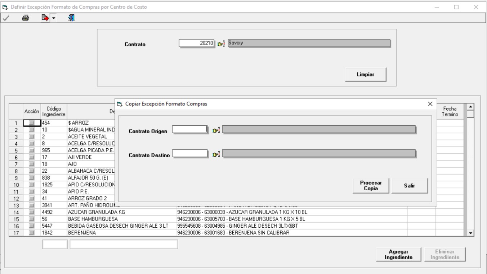
*Figura 27: Copia de Excepciones*

<u>**Descripción:**</u>
Pantalla de utilidad para copiar la configuración de excepciones de formato de compra de un CECO origen a uno destino. Se usa cuando se crea un nuevo contrato similar a uno existente y se desea replicar sus excepciones para evitar configurarlas manualmente una a una.
<u>**Funcionalidad:**</u>
- Selección del contrato/CECO origen.
- Selección del contrato/CECO destino.
- Mensaje de confirmación antes de procesar la copia.
<u>**Reglas de Negocio:**</u>
- Tanto el contrato origen como el destino son campos obligatorios.
- El sistema muestra un mensaje de confirmación antes de ejecutar la copia.
- Si ya existen excepciones en el CECO destino, sobrescribe la información.

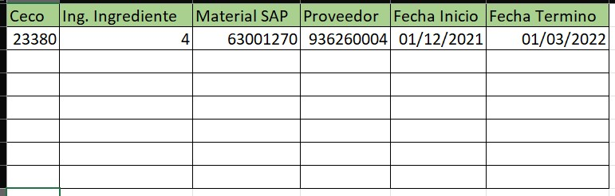
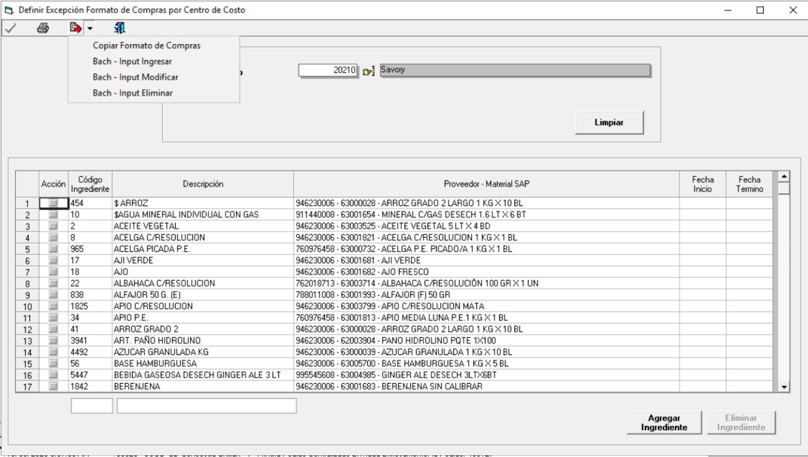
*Figura 28: Excel Back - Input*

## 8.16. Bach – Input Excepción de Formato

<u>**Descripción:**</u>
Funcionalidad de carga masiva para el sub-módulo de Excepciones de Formato de Compra. Permite ingresar, modificar y eliminar excepciones en volumen a través de una planilla Excel, en lugar de hacerlo registro a registro por pantalla. Al hacer click se abre directamente las carpetas de escritorio para seleccionar el archivo correspondiente.
<u>**Funcionalidad:**</u>
- Seleccionar ingresa, modificar y eliminar para adjuntar la planilla Excel.
<u>**Reglas de Negocio:**</u>
- El formato para cargar debe ser xlsx o xls.
- Debe tener las mismas reglas de negocio que cuando si ingresa manualmente.
- La fecha de inicio y fin no son obligatorias.

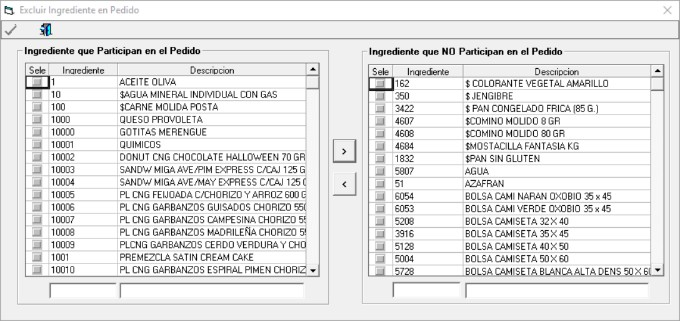
*Figura 30: Exclusión de Ingrediente*

## 8.17. Ingredientes excluidos del pedido (M_IngExe.frm)

<u>**Descripción:**</u>
Pantalla para administrar la lista de ingredientes que están explícitamente excluidos de la generación de pedidos de compra, aunque aparezcan en las recetas de la minuta planificada. Los ingredientes en esta lista siguen participando en los cálculos de costo y nutrición, pero no generan línea en el pedido.
<u>**Funcionalidad:**</u>
- Interfaz de doble panel con botones de transferencia (>, <, >>, <<).
- Panel izquierdo: ingredientes disponibles (no excluidos).
- Panel derecho: ingredientes actualmente excluidos.
- Los botones permiten mover ingredientes entre la lista excluida y la lista activa.
<u>**Reglas de Negocio:**</u>
- Lo ingredientes que no participan en el pedido nunca genera pedido de compra, independientemente de la minuta o del CECO.
- Un ingrediente excluido del pedido sigue apareciendo en los cálculos de costo y nutrición de la minuta. Solo se excluye de la generación de la orden de compra.
- La exclusión aplica globalmente a todos los CECOs.
Mejoras:
- Exporta la información Excel de los ingredientes excluidos.

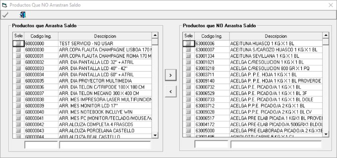
*Figura 31: Productos que NO Arrastran Saldos*

## 8.18. Productos sin arrastre de saldo (M_ProNOArrrastreSaldo.frm)

<u>**Descripción:**</u>
Pantalla para administrar la lista de productos cuyo saldo pendiente de pedidos anteriores no se arrastra al pedido siguiente. Aplica a productos desechables o cuyo stock no es transferible entre períodos. Complementa el control del checkbox global de arrastre de saldo en la generación de pedidos en tipo de pedido proyectado.
<u>**Funcionalidad:**</u>
- Interfaz de doble panel con botones de transferencia (>, <, >>, <<).
- Panel izquierdo: productos con arrastre de saldo habilitado.
- Panel derecho: productos sin arrastre de saldo.
<u>**Reglas de Negocio:**</u>
- Los productos que se encuentran en “Productos que NO Arrastran Saldos” nunca generan arrastre de saldo, aunque el checkbox global "Genera Arrastre de Saldo" del proyectado esté activo. Este control tiene precedencia sobre el parámetro global.
<u>**Tablas Relacionadas:**</u>
- Tabla Producto que no Arrastra saldo (B_NO_ARRASTRE_SALDO)

Mejoras:
- Exportar formato Excel.
- El proceso de asociación de productos SGP & material SAP, debería tener la opción de marcar si el material arrastra saldo.

## 8.19. Consulta y gestión del arrastre de saldo (P_ArrastreDeSaldo.frm)

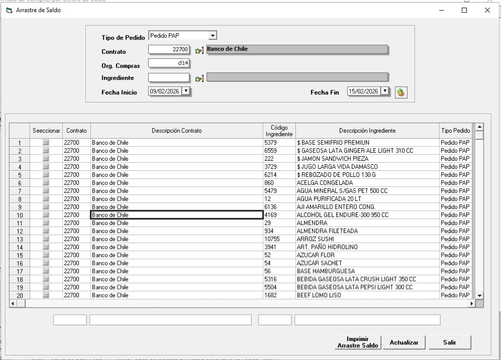
*Figura 32: Consulta y Gestión del Arrastre de Saldo*

<u>**Descripción:**</u>
Pantalla principal del sub-módulo de arrastre de saldo. Permite consultar el estado del arrastre de saldo vigente para un pedido y, cuando sea necesario, a la selección un ingrediente con el flag y el botón “Actualizar” este deja el arrastre en cero para recalcular los pedidos siguientes.
<u>**Funcionalidad:**</u>
- Consulta del arrastre de saldo vigente filtrable por CECO, tipo de pedido, ingrediente y rango de fechas.
- Identificación de líneas donde el arrastre teórico sobreestima el stock real (el sistema propone despacho 0).
- Cierre manual del arrastre a cero para las líneas seleccionadas, corrigiendo la base de cálculo del pedido.
- Reprocesamiento automática de todos los pedidos posteriores del mismo CECO en estado Generado o Parcial, recalculando cantidades sin el arrastre anulado.
- Los pedidos proyectados y los ya enviados a PEL no se ven afectados por la reprocesamiento.
- Exportación del arrastre a Excel con o sin desglose por CECO.
- Impresión del reporte de arrastre de saldo.
<u>**Reglas de Negocio:**</u>
- Al cerrar el arrastre a cero, reprocesa automáticamente los pedidos posteriores al modificado, para el mismo CECO. Solo reprocesa pedidos en estado Generado o Parcial. No afecta pedidos proyectados ni pedidos en estado Enviado, Rechazado o Eliminado.
<u>**Tablas Relacionadas:**</u>
- Tabla Pedido Centralizado (B_PedidoCentralizado), Tabla encabezado Pedido
- Tabla Pedido Centralizado Detalle (B_PEDIDOCENTRALIZADODET), Detalle Pedido

# 9. **Glosario**

| **Término** | **Definición** |
| --- | --- |
| **CL (Centro Logístico)** | Agrupación de CECOs en donde indica la zona. Por ejemplo CL14: Región Metropolitana. |
| **Pedido ****CD (Centro de Distribución)** | Canal logístico donde el proveedor entrega al CD y este distribuye a los casinos. |
| **Pedido ****PAP (Proveedor al Punto)** | Canal logístico donde el proveedor entrega directamente en el casino/sitio. |
| **Pedido Centralizado** | Pedido de compra generado desde el ADM central de SGP para todos los ingredientes de la minuta planificada de un período. |
| **Pedido Proyectado** | Estimativo mensual de compras que no genera órdenes reales hacia proveedores. |
| **Ruta de Despacho** | Calendario de fechas habilitadas para despacho por casino, familia de producto y proveedor |
| **Grupo de Despacho** | Agrupación de casinos que reciben su pedido CD de forma consolidada bajo un mismo ambiente de temperatura. |
| **Convenio SAP** | Precio y condiciones de compra vigentes para un material y proveedor. Incluye precio neto, precio unitario, factor de redondeo, mínima de pedido y fechas de vigencia. |

Fin del Documento