# Documentación Técnica y Funcional — Módulo de Producción SGP LOCAL
**Sistema:** SGP LOCAL (Sistema de Gestión de Producción)
**Cliente:** Casinos Sodexo Chile
**Tecnología:** Visual Basic 6 + SQL Server
**Versión del manual referenciado:** v.226
**Fecha de elaboración:** Febrero 2026
**Estado:** Borrador para revisión

---

## Tabla de Contenidos

1. [Introducción al Módulo](#1-introducción-al-módulo)
2. [Entidades y Modelo de Datos](#2-entidades-y-modelo-de-datos)
3. [Funcionalidades por Submódulo](#3-funcionalidades-por-submódulo)
   - 3.1 [Selector de Planificación (M_Plami1)](#31-selector-de-planificación-m_plami1)
   - 3.2 [Editor Planificación Real (M_MinRea)](#32-editor-planificación-real-m_minrea)
   - 3.3 [Control de Raciones (M_ConRac)](#33-control-de-raciones-m_conrac)
   - 3.4 [Mermas por Preparación (M_MerPre)](#34-mermas-por-preparación-m_merpre)
   - 3.5 [Informe Requisición Salida Bodega (I_SalBod)](#35-informe-requisición-salida-bodega-i_salbod)
   - 3.6 [Salida Bodega a Producción (M_SalBod)](#36-salida-bodega-a-producción-m_salbod)
   - 3.7 [Cierre Diario (M_RCDiar)](#37-cierre-diario-m_rcdiar)
   - 3.8 [Venta Servicio Contado (M_VtaCon)](#38-venta-servicio-contado-m_vtacon)
   - 3.9 [Venta Cafetería (M_VenCaf)](#39-venta-cafetería-m_vencaf)
   - 3.10 [Venta Directa (M_VenDir)](#310-venta-directa-m_vendir)
   - 3.11 [Árbol Ingrediente (M_Produ1)](#311-árbol-ingrediente-m_produ1)
   - 3.12 [Tabla Gramaje (M_TabGra)](#312-tabla-gramaje-m_tabgra)
   - 3.13 [Lista Precio Cafetería (T_LiPrCa)](#313-lista-precio-cafetería-t_lipca)
   - 3.14 [Precio Venta Cliente (M_PVtaCl)](#314-precio-venta-cliente-m_pvtacl)
4. [Reglas de Negocio Consolidadas](#4-reglas-de-negocio-consolidadas)
5. [Validaciones del Sistema](#5-validaciones-del-sistema)
6. [Objetos de Base de Datos](#6-objetos-de-base-de-datos)
   - 6.1 [Stored Procedures](#61-stored-procedures)
   - 6.2 [Funciones (UDFs)](#62-funciones-udfs)
   - 6.3 [Vistas](#63-vistas)
7. [Integraciones y Dependencias](#7-integraciones-y-dependencias)
8. [Trazabilidad y Auditoría](#8-trazabilidad-y-auditoría)
9. [Valorización y Costos](#9-valorización-y-costos)
10. [Reportes y Consultas](#10-reportes-y-consultas)
11. [Casos Especiales y Excepciones](#11-casos-especiales-y-excepciones)
12. [Preguntas Abiertas](#12-preguntas-abiertas)
13. [Glosario](#13-glosario)

---

## 1. Introducción al Módulo

### 1.1 Descripción General

El **Módulo de Producción** de SGP LOCAL gestiona el ciclo completo de producción de alimentos en los casinos operados por Sodexo Chile. Abarca desde la planificación de minutas hasta el cierre diario contable, pasando por el control de raciones, mermas, salidas de bodega y ventas.

El sistema opera bajo un modelo **por centro de costo (casino/contrato)**, donde cada casino tiene su propio régimen alimentario, servicios, bodega y períodos de operación. La información se estructura por período mensual (YYYYMM) y por día (YYYYMMDD almacenado como INT).

### 1.2 Contexto Operacional

| Aspecto | Descripción |
|---|---|
| Usuarios principales | Chef de cocina, bodeguero, administrador de casino, supervisor |
| Frecuencia de uso | Diaria (planificación, mermas, raciones) y mensual (cierre) |
| Volumen típico | 1 a N regímenes por casino, múltiples servicios por régimen |
| Integración externa | SAP (FLMS) para movimientos de bodega |
| Restricción hardware | Cierre diario solo desde PC autorizado (SvrAppCont) |

### 1.3 Flujo General del Proceso

El proceso de producción sigue una secuencia lógica mensual:

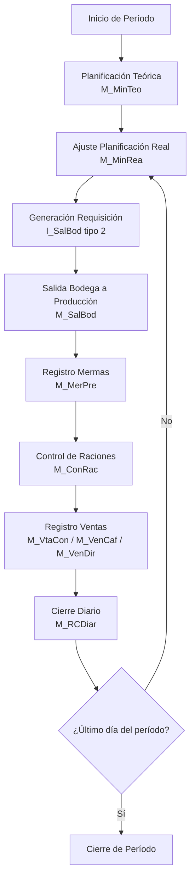

### 1.4 Niveles de Raciones

Un concepto central del módulo es la distinción entre tres niveles de raciones:

| Nivel | Descripción | Tabla/Campo |
|---|---|---|
| **Planificadas (Teóricas)** | Estimación inicial del menú | `b_minuta.min_racteo` |
| **Producidas (Reales)** | Ajuste del chef antes de cocinar | `b_minuta.min_racrea` + `b_minutaraciones` mir_rutcli='PRODUCIDAS' |
| **Vendidas (Facturadas)** | Raciones efectivamente consumidas y facturadas | `b_minutaraciones` con RUT cliente + `b_minutaracionfacturable` |

> ⚠️ **Nota crítica:** Los datos históricos del sistema no capturan con claridad la distinción entre raciones "producidas" y "vendidas". Esto fue identificado como una brecha en las sesiones de levantamiento (diciembre 2025 - enero 2026).

### 1.5 Arquitectura del Sistema

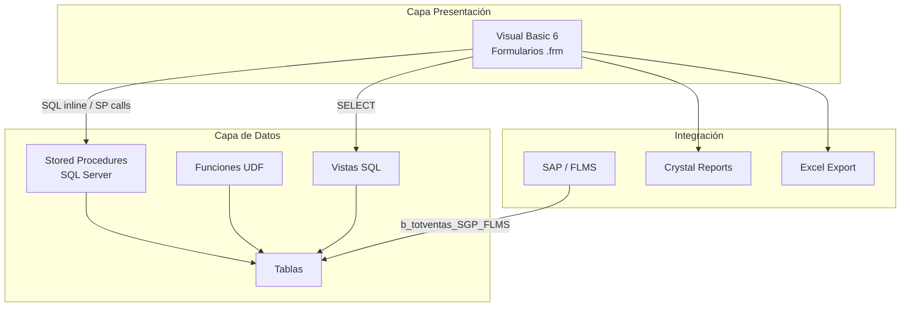

---

## 2. Entidades y Modelo de Datos

### 2.1 Diagrama Entidad-Relación Principal

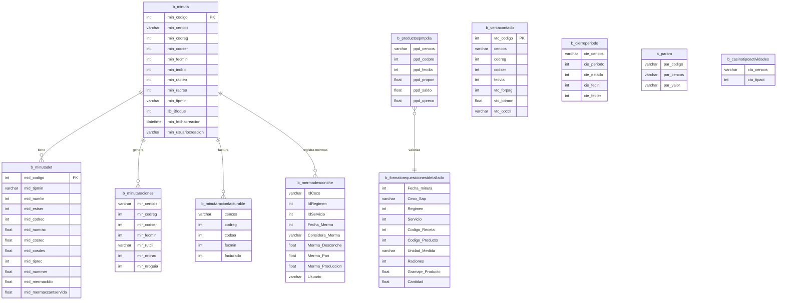

### 2.2 Tablas de Referencia Maestras

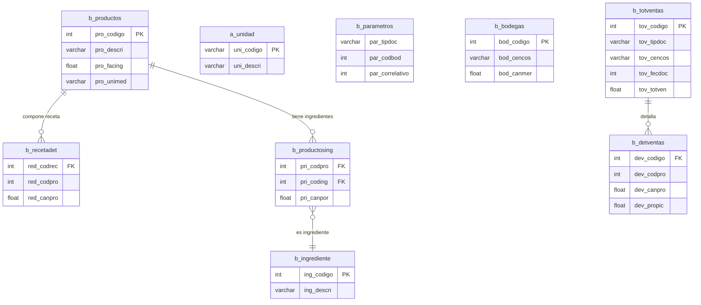

### 2.3 Descripción Detallada de Tablas Principales

#### b_minuta — Encabezado de Minuta

| Campo | Tipo | Descripción |
|---|---|---|
| `min_codigo` | INT PK | Identificador único de minuta |
| `min_cencos` | VARCHAR(10) | Centro de costo (casino) |
| `min_codreg` | INT | Código de régimen alimentario |
| `min_codser` | INT | Código de servicio (desayuno, almuerzo, etc.) |
| `min_fecmin` | INT | Fecha en formato YYYYMMDD |
| `min_indblo` | INT | Estado: 0=abierto, 2=cerrado bloqueado, 11=cerrado no bloqueado |
| `min_racteo` | INT | Raciones planificadas (teóricas) |
| `min_racrea` | INT | Raciones producidas (reales) |
| `min_tipmin` | VARCHAR(1) | '1'=teórica, '2'=real |
| `ID_Bloque` | INT | Identificador de bloque de bloqueo |
| `min_fechacreacion` | DATETIME | Fecha y hora de creación |
| `min_usuariocreacion` | VARCHAR(20) | Usuario que creó el registro |

#### b_minutadet — Detalle de Minuta (Recetas por Día)

| Campo | Tipo | Descripción |
|---|---|---|
| `mid_codigo` | INT FK | FK → b_minuta.min_codigo |
| `mid_tipmin` | VARCHAR(1) | '1'=teórica, '2'=real (clave compuesta) |
| `mid_numlin` | INT | Número de línea (clave compuesta) |
| `mid_estser` | INT | Estado del servicio |
| `mid_codrec` | INT | Código de receta |
| `mid_numrac` | FLOAT | Número de raciones planificadas |
| `mid_cosrec` | FLOAT | Costo alimento de la receta |
| `mid_cosdes` | FLOAT | Costo desechable de la receta |
| `mid_tiprec` | INT | Tipo receta: 0=patrón, >0=régimen específico |
| `mid_nummer` | FLOAT | Merma por raciones (cantidad) |
| `mid_mermaxkilo` | FLOAT | Merma en kilogramos bruto |
| `mid_mermaxcantservida` | FLOAT | Merma en cantidad servida |

#### b_minutaraciones — Raciones por Cliente por Día

| Campo | Tipo | Descripción |
|---|---|---|
| `mir_cencos` | VARCHAR(10) | Centro de costo (PK compuesta) |
| `mir_codreg` | INT | Régimen (PK compuesta) |
| `mir_codser` | INT | Servicio (PK compuesta) |
| `mir_fecmin` | INT | Fecha YYYYMMDD (PK compuesta) |
| `mir_rutcli` | VARCHAR(10) | RUT cliente, 'PRODUCIDAS', 'PERSONAL', o 'MERMAS' (PK compuesta) |
| `mir_nrorac` | INT | Número de raciones |
| `mir_nroguia` | INT | Número de guía asociada |

> ⚠️ El campo `mir_rutcli` tiene un uso especial: los valores 'PRODUCIDAS', 'PERSONAL' y 'MERMAS' son registros de control del sistema, no RUTs reales de clientes. Son preservados en operaciones de borrado de raciones facturables.

#### b_mermadesconche — Mermas Globales por Día

| Campo | Tipo | Descripción |
|---|---|---|
| `IdCeco` | VARCHAR(10) | Centro de costo (PK compuesta) |
| `IdRegimen` | INT | Régimen (PK compuesta) |
| `IdServicio` | INT | Servicio (PK compuesta) |
| `Fecha_Merma` | INT | Fecha YYYYMMDD (PK compuesta) |
| `Considera_Merma` | VARCHAR(1) | 'S'=considera merma, 'N'=no considera |
| `Merma_Desconche` | FLOAT | Kg de desconche |
| `Merma_Pan` | FLOAT | Kg de merma de pan |
| `Merma_Produccion` | FLOAT | Kg de merma de producción general |
| `Fecha_Modificacion` | DATETIME | Última modificación |
| `Fecha_Creacion` | DATETIME | Creación del registro |
| `Usuario` | VARCHAR(20) | Usuario responsable |

#### b_productospmpdia — Precio Promedio Ponderado por Día

| Campo | Tipo | Descripción |
|---|---|---|
| `ppd_cencos` | VARCHAR(10) | Centro de costo (PK compuesta) |
| `ppd_codpro` | INT | Código de producto (PK compuesta) |
| `ppd_fecdia` | INT | Fecha YYYYMMDD (PK compuesta) |
| `ppd_propon` | FLOAT | Precio Medio Ponderado del día |
| `ppd_saldo` | FLOAT | Saldo en stock al cierre |
| `ppd_upreco` | FLOAT | Último precio de reposición |

#### a_param — Parámetros de Configuración por Casino

| `par_codigo` | Descripción | Encriptado |
|---|---|---|
| `ciediario` | Fecha del último cierre diario | Sí (sgp_p_desencripta) |
| `parcomdia` | Password para celda PRODUCIDAS en Control de Raciones | Sí |
| `ctainsumo` | Cuenta contable para insumos alimentarios | No |
| `ctalimdes` | Cuenta contable para desechables | No |
| `addreceta` | Máximo de recetas adicionales por día en planificación | No |
| `5etapas` | Indicador de casino con régimen centralizado | No |
| `pargrarnve` | Gramos por ración no vendida (para cálculo merma RNV) | No |
| `SvrAppCont` | Nombre del PC autorizado para ejecutar cierre diario | No |

#### b_casinotipoactividades — Control de Actividades para Cierre

| `cta_tipact` | Actividad | Descripción |
|---|---|---|
| 1 | Proveedores | Registro de compras/proveedores |
| 2 | SalidaProd | Salidas de bodega a producción |
| 3 | Devoluciones | Devoluciones a bodega |
| 4 | Mermas | Registro de mermas |
| 5 | RNV | Raciones No Vendidas |
| 6 | CtrlRaciones | Control de raciones |
| 7 | Cafetería | Ventas de cafetería |
| 8 | VentaServ | Venta servicio contado |
| 9 | VentaDir | Venta directa |
| 10 | Inventario | Inventario físico |

---

## 3. Funcionalidades por Submódulo

### 3.1 Selector de Planificación (M_Plami1)


> 📸 *Pendiente: insertar captura del formulario Selector de Planificación*

#### 3.1.1 Descripción

Formulario modal que actúa como punto de entrada al proceso de planificación. Permite al usuario seleccionar el contrato, régimen, servicio y período antes de abrir el editor de planificación real o teórica.

**Archivo:** `codigo_fuente/M_Plami1.frm` (1.246 líneas)

#### 3.1.2 Controles Principales

| Control | Tipo | Función |
|---|---|---|
| `fpText` | TextBox | RUT del contrato |
| `fpLongInteger1(1)` | NumericField | Código de régimen |
| `fpLongInteger1(2)` | NumericField | Código de servicio |
| `fpDateTime1` | DateTimePicker | Mes y año de planificación |
| `vaSpread1` | Grid (FarPoint Spread) | Calendario 7×6 días del mes |

#### 3.1.3 Variables Globales Asignadas

Estas variables son consumidas por todos los formularios hijos:

| Variable Global | Descripción |
|---|---|
| `vg_codcasino` | Centro de costo seleccionado |
| `vg_codregimen` | Régimen seleccionado |
| `vg_codservicio` | Servicio seleccionado |
| `vg_fecha` | Fecha de trabajo (día actual o seleccionado) |
| `Vg_FechaDesde` | Inicio del período mensual |
| `Vg_FechaHasta` | Fin del período mensual |

#### 3.1.4 Flujo de Usuario

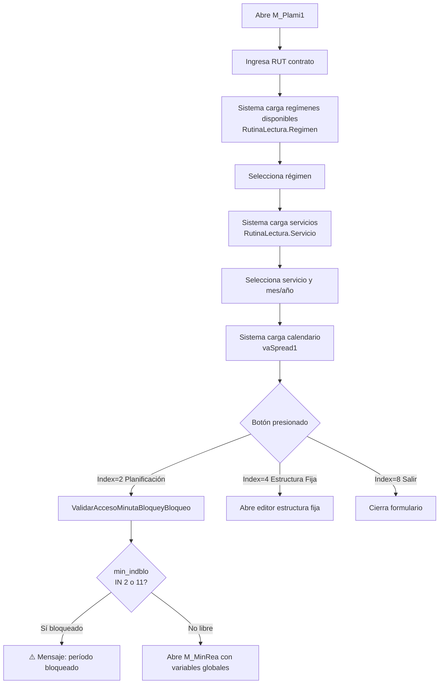

#### 3.1.5 Módulos de Lectura Utilizados

El formulario NO ejecuta SPs directamente. Utiliza rutinas de lectura centralizadas:

- `RutinaLectura.Cliente` — Datos del contrato por RUT
- `RutinaLectura.Regimen` — Regímenes del casino
- `RutinaLectura.Servicio` — Servicios del régimen
- `RutinaLectura.EstServicio` — Estado del servicio
- `RutinaLectura.Minutas` — Calendario del mes

#### 3.1.6 Validaciones

- **ValidarAccesoMinutaBloqueyBloqueo():** Ejecuta `sgp_Sel_ValidarMinBloque(Ceco, FechaMinuta)`. Si retorna registros con `min_indblo IN (2, 11)`, bloquea el acceso y muestra mensaje.
- No usa transacciones VB6 (`BeginTrans`/`CommitTrans`).

---

### 3.2 Editor Planificación Real (M_MinRea)


> 📸 *Pendiente: insertar captura del formulario Editor Planificación Real*

#### 3.2.1 Descripción

Editor principal donde el chef define o ajusta las recetas del día para cada servicio. Permite agregar, modificar y eliminar recetas de la planificación real. Es el formulario de mayor complejidad del módulo (5.111 líneas de código).

**Archivo:** `codigo_fuente/M_MinRea.frm` (5.111 líneas)

#### 3.2.2 Estructura de la Grilla vaSpread1

La grilla muestra **5 columnas por día** del mes:

| Columna | Nombre | Editable | Descripción |
|---|---|---|---|
| 0 | CodEstructura | No | Código de estructura de la receta |
| 1 | NomReceta | No | Nombre descriptivo de la receta |
| 2 | NºRaciones | Sí | Número de raciones planificadas |
| 3 | Costo | No | Costo calculado de la receta |
| 4 | CodReceta | No (oculto) | Código interno de receta |

#### 3.2.3 Código de Colores

| Color | Significado |
|---|---|
| Verde | Receta local o de patrón (régimen ≤ 9999) |
| Amarillo | Receta centralizada 5-etapas (régimen > 9999) — **Solo lectura** |

#### 3.2.4 Parámetros de Configuración (a_param)

| Parámetro | Descripción | Impacto |
|---|---|---|
| `addreceta` | Máximo de recetas adicionales por día | Limita filas disponibles en la grilla |
| `5etapas` | Indica casino centralizado | Si activo, deshabilita edición para regímenes > 9999 |

#### 3.2.5 Flujo de Usuario

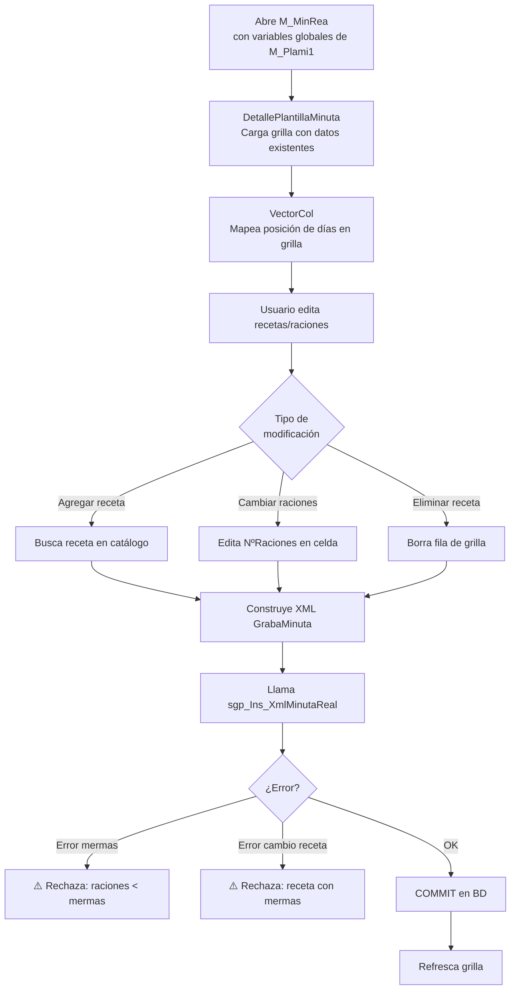

#### 3.2.6 Stored Procedure Principal: sgp_Ins_XmlMinutaReal

**Firma:**
```sql
sgp_Ins_XmlMinutaReal(
    @XmlMinuta TEXT,
    @Ceco VARCHAR(10),
    @CodRegimen INT,
    @CodServicio INT,
    @FechaDia INT,
    @Raciones INT,
    @Color VARCHAR(1),
    @Usuario VARCHAR(20)
)
```

**Estructura XML de entrada:**
```xml
<GrabaMinuta>
  <Minuta Op="0"
          NumRacion="150"
          DescReceta="CAZUELA DE VACUNO"
          CodReceta="1234"
          TipoReceta="0"
          CosAli="850.50"
          CosDes="45.00"/>
  <Minuta Op="0" .../>
</GrabaMinuta>
```

**Lógica interna:**
1. `sp_xml_preparedocument` — Parsea XML
2. Validaciones de mermas:
   - Si `mid_nummer > mid_numrac` → rechaza con error
   - Si receta cambia y tiene `mid_nummer > 0` → rechaza con error
3. `DELETE b_minutadet WHERE mid_tipmin='2'` para el día
4. `INSERT b_minutadet` con nuevos registros `mid_tipmin='2'`
5. Si `@Color='1'`: actualiza `b_minutaraciones` (raciones PRODUCIDAS)
6. `BEGIN TRAN / COMMIT / ROLLBACK` internos (SET XACT_ABORT ON, BEGIN TRY/CATCH)

**Retorno:**

| Variable | Tipo | Descripción |
|---|---|---|
| `@Num_error` | INT | 0=sin error, >0=error |
| `@error` | VARCHAR | Mensaje de error descriptivo |
| `@cRows` | INT | Filas afectadas |

**Parámetro Color:**

| Valor | Efecto |
|---|---|
| `'0'` | Preserva costos existentes. No actualiza b_minutaraciones |
| `'1'` | Actualiza raciones PRODUCIDAS en b_minutaraciones |

#### 3.2.7 Funciones Auxiliares VB6

- **`VectorCol()`** — Mapea la posición de cada día en la grilla horizontal. Permite ubicar el día correcto cuando la grilla tiene múltiples semanas.
- **`DetallePlantillaMinuta()`** — Carga la grilla inicial con los datos existentes en `b_minutadet` para el período seleccionado.
- **`fn_sgp_p_CalculaCosaliCosdes(Op, CenCos, CodRec, TipRec, TipMin, Fecha)`** — Calcula costo de alimento (Op=1) o desechable (Op=2) por receta.

---

### 3.3 Control de Raciones (M_ConRac)


> 📸 *Pendiente: insertar captura del formulario Control de Raciones*

#### 3.3.1 Descripción

Formulario para registrar y controlar el número de raciones consumidas por cada cliente (RUT) para cada día del período. Permite distinguir entre raciones de clientes, raciones producidas, personal y mermas.

**Archivo:** `codigo_fuente/M_ConRac.frm` (2.930 líneas)

#### 3.3.2 Estructura de la Grilla

La grilla tiene estructura de matriz **clientes × días**:
- **Filas:** Cada cliente (RUT) + filas especiales: PRODUCIDAS, PERSONAL, MERMAS
- **Columnas:** Cada día del mes

#### 3.3.3 Fila PRODUCIDAS — Celda Protegida

La fila `PRODUCIDAS` requiere password para ser editada. El password se obtiene desencriptando el parámetro `parcomdia` de `a_param` usando `sgp_p_desencripta`.

> ⚠️ Esta protección evita modificaciones accidentales a las raciones producidas, que son la base para el cálculo de costos e inventario.

#### 3.3.4 Flujo de Usuario

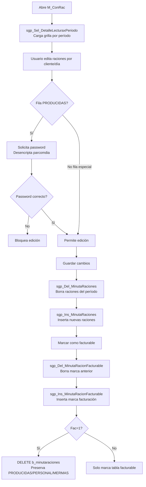

#### 3.3.5 Stored Procedures Utilizados

| SP | Operación | Descripción |
|---|---|---|
| `sgp_Sel_DetalleLecturaxPeriodo(Ceco, YYYYMM)` | SELECT | Carga lecturas agrupadas por período |
| `sgp_Del_MinutaRaciones` | DELETE | Borra raciones del período (simple) |
| `sgp_Ins_MinutaRaciones` | INSERT | Inserta raciones (simple) |
| `sgp_Del_MinutaRacionFacturable` | DELETE | Borra rango de registros facturables |
| `sgp_Ins_MinutaRacionFacturable(Ceco,Reg,Ser,Fecha,Fac)` | INSERT/DELETE | Si Fac=1: borra raciones de clientes (preserva especiales) |
| `sgp_Sel_MinutaRacionesFacturable` | SELECT | Historial de facturación |
| `sgp_Sel_MinutaconcomensalesCeroConRac` | SELECT | Detecta minutas con racrea=0 pero con raciones cargadas |

#### 3.3.6 Lógica de Facturación (sgp_Ins_MinutaRacionFacturable con Fac=1)

Cuando se marca un período como facturable con `Fac=1`:
1. `DELETE b_minutaraciones` donde `mir_rutcli NOT IN ('PRODUCIDAS', 'PERSONAL', 'MERMAS')`
2. Esto elimina las raciones de clientes reales del sistema
3. Las filas especiales (PRODUCIDAS, PERSONAL, MERMAS) se preservan para control de costos

#### 3.3.7 Uso de Transacciones VB6

A diferencia de otros formularios, M_ConRac usa transacciones en el nivel VB6:
- `BeginTrans` / `CommitTrans` en líneas: 1908, 1981, 2059, 2068

---

### 3.4 Mermas por Preparación (M_MerPre)


> 📸 *Pendiente: insertar captura del formulario Mermas por Preparación*

#### 3.4.1 Descripción

Permite al chef registrar las mermas ocurridas durante la preparación de cada receta. Captura mermas por raciones, por kilos servidos y merma bruta, más valores globales de desconche, pan y producción.

**Archivo:** `codigo_fuente/M_MerPre.frm` (~80KB, 2.564 líneas)

#### 3.4.2 Estructura de la Grilla (10 columnas)

| Col | Nombre | Editable | Descripción |
|---|---|---|---|
| 0 | CodRec | No | Código de receta |
| 1 | NomRec | No | Nombre de receta |
| 2 | RacionesPlan | No | Raciones planificadas (mid_numrac) |
| 3 | CostoUnit | No | Costo unitario |
| 4 | CostoTotal | No | Costo total (RacionesPlan × CostoUnit) |
| 5 | MermaxRaciones | Sí | Merma por raciones (mid_nummer) |
| 6 | MermaxKilosServida | Sí | Merma en kg servidos (mid_mermaxcantservida) |
| 7 | CostoMerma | No (calculado) | Costo de la merma |
| 8 | NumLin | No (oculto) | Número de línea |
| 9 | MermaBrutaxKilos | Sí | Merma bruta en kg (mid_mermaxkilo) |

#### 3.4.3 Controles Adicionales

| Control | Tipo | Campo BD |
|---|---|---|
| `Desconche` | fpDoubleSingle | b_mermadesconche.Merma_Desconche |
| `Pan` | fpDoubleSingle | b_mermadesconche.Merma_Pan |
| `Produccion` | fpDoubleSingle | b_mermadesconche.Merma_Produccion |
| `ChcMerma` | CheckBox | "No considera Mermas" → Considera_Merma='N' |

#### 3.4.4 Flujo de Usuario

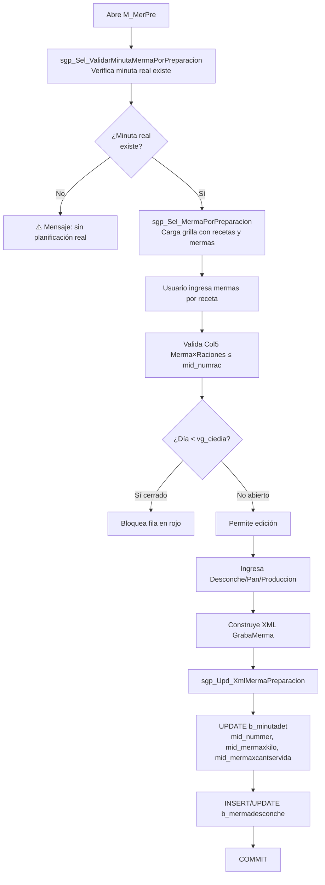

#### 3.4.5 Stored Procedure: sgp_Upd_XmlMermaPreparacion

**Firma:**
```sql
sgp_Upd_XmlMermaPreparacion(
    @XmlMerma TEXT,
    @Ceco VARCHAR(10),
    @Regimen INT,
    @Servicio INT,
    @Fecha INT,
    @Considera_Merma VARCHAR(1),
    @Merma_Desconche FLOAT,
    @Merma_Pan FLOAT,
    @Merma_Produccion FLOAT,
    @Usuario VARCHAR(20)
)
```

**Estructura XML:**
```xml
<GrabaMerma>
  <Merma CR="1234"
         NM="5"
         MO="2.500"
         MS="1.200"
         NL="1"/>
</GrabaMerma>
```

| Atributo XML | Campo BD | Descripción |
|---|---|---|
| `CR` | mid_codrec | Código de receta |
| `NM` | mid_nummer | Merma por raciones |
| `MO` | mid_mermaxkilo | Merma bruta en kg |
| `MS` | mid_mermaxcantservida | Merma servida en kg |
| `NL` | mid_numlin | Número de línea |

**Operaciones BD:**
1. `UPDATE b_minutadet SET mid_nummer=@NM, mid_mermaxkilo=@MO, mid_mermaxcantservida=@MS WHERE mid_tipmin='2'`
2. Si existe registro en `b_mermadesconche`: `UPDATE Considera_Merma, Merma_Desconche, Merma_Pan, Merma_Produccion`
3. Si no existe: `INSERT INTO b_mermadesconche`
4. `BEGIN TRAN / COMMIT / ROLLBACK`

#### 3.4.6 Cálculo de Cantidad Bruta (sgp_Sel_MermaPorPreparacion)

```sql
CantBruta = CASE
    WHEN mid_nummer > 0 AND mid_mermaxkilo = 0
    THEN SGP_FN_RNVCantidadesReceta() * mid_nummer
    ELSE mid_mermaxkilo
END
```

Usa el parámetro `pargrarnve` de `a_param` para calcular la cantidad de la función `SGP_FN_RNVCantidadesReceta`.

#### 3.4.7 Reglas de Validación

- Col5 (Merma×Raciones) debe ser ≤ `mid_numrac` (raciones planificadas)
- Días anteriores al cierre diario (`vg_ciedia`) aparecen bloqueados en **rojo**
- No usa `BeginTrans` VB6 (transacciones manejadas en el SP)

---

### 3.5 Informe Requisición Salida Bodega (I_SalBod)


> 📸 *Pendiente: insertar captura del formulario Informe Requisición*

#### 3.5.1 Descripción

Genera los informes de requisición de materias primas necesarias para la producción del período. El tipo 2 (xEstructura Detallado) genera la requisición oficial que se guarda en BD y sirve como input para SAP.

**Archivo:** `codigo_fuente/I_SalBod.frm` (~41KB, 1.228 líneas)

#### 3.5.2 Tipos de Informe

| Índice | Nombre | Generación | Destino |
|---|---|---|---|
| 0 | Resumido | Crystal Reports | Pantalla/Impresora |
| 1 | xSector | Crystal Reports | Pantalla/Impresora |
| 2 | xEstructura Detallado | **Guarda en BD** | SAP + Excel automático |
| 3 | xEstructura Resumido | Crystal Reports | Pantalla/Impresora |
| 4 | Resumen | Crystal Reports | Pantalla/Impresora |
| 5 | Devolución | Crystal Reports | Pantalla/Impresora |
| 6 | MenosDev | Crystal Reports | Pantalla/Impresora |

#### 3.5.3 Flujo para Tipo 2 (Requisición para SAP)

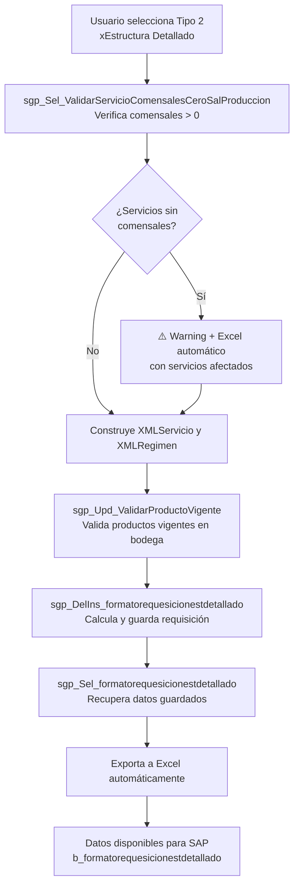

#### 3.5.4 Stored Procedure: sgp_DelIns_formatorequesicionestdetallado

**Firma:**
```sql
sgp_DelIns_formatorequesicionestdetallado(
    @XmlServicio TEXT,
    @XmlRegimen TEXT,
    @Ceco VARCHAR(10),
    @CodBod INT,
    @FecIni INT,
    @FecFin INT,
    @Usuario VARCHAR(20)
)
```

**Fórmula de cálculo:**
```
Cantidad = (mid_numrac × red_canpro) / pro_facing
```

| Variable | Descripción |
|---|---|
| `mid_numrac` | Raciones planificadas por receta |
| `red_canpro` | Cantidad de producto por ración (de b_recetadet) |
| `pro_facing` | Factor de conversión/empaque del producto |

**Restricciones:**
- Solo procesa `mid_tipmin='2'` (planificación real)
- Excluye días cerrados (compara con `ciediario` desencriptado)
- `DELETE` previo + `INSERT` de los nuevos registros

**Estructura XML de entrada:**
```xml
<!-- XMLServicio -->
<Servicio>
  <Ser Ser="1001"/>
  <Ser Ser="1002"/>
</Servicio>

<!-- XMLRegimen -->
<Regimen>
  <Reg Reg="5001"/>
  <Reg Reg="5002"/>
</Regimen>
```

---

### 3.6 Salida Bodega a Producción (M_SalBod)


> 📸 *Pendiente: insertar captura del formulario Salida Bodega*

#### 3.6.1 Descripción

Registra el movimiento físico de mercaderías desde la bodega hacia cocina (producción). Genera el documento tipo **SP (Salida Producción)** que actualiza el inventario.

**Archivo:** `codigo_fuente/M_SalBod.frm` (3.564 líneas)

#### 3.6.2 Tipo de Documento

| Campo | Valor |
|---|---|
| Tipo documento | SP (Salida Producción) |
| Correlativo | `b_parametros` donde `par_tipdoc='SP'` |
| Tabla encabezado | `b_totventas` con `tov_tipdoc='SP'` |
| Tabla detalle | `b_detventas` |
| Efecto inventario | `UPDATE b_bodegas SET bod_canmer = bod_canmer - cantidad` |

#### 3.6.3 Fuente de Datos para Cálculo

El formulario puede obtener las cantidades necesarias desde dos fuentes:

| Fuente | Condición | Tabla |
|---|---|---|
| Minuta Real | Cuando existe planificación real | `b_minutadet` donde `mid_tipmin='2'` |
| Estructura Fija | Cuando no hay minuta o se prefiere estructura fija | `b_minutafijadia` |

#### 3.6.4 Fórmula de Cálculo de Cantidades

```
Cantidad_producto = raciones × red_canpro / rec_basrac
```

| Variable | Descripción |
|---|---|
| `raciones` | Raciones de la minuta real |
| `red_canpro` | Cantidad del producto en la receta |
| `rec_basrac` | Raciones base de la receta |

#### 3.6.5 Valorización

Busca el PMP en `b_productospmpdia`:
```sql
SELECT ppd_propon
FROM b_productospmpdia
WHERE ppd_cencos = @Ceco
  AND ppd_codpro = @CodPro
  AND ppd_fecdia = @Fecha
```

#### 3.6.6 Modos de Operación

| Modo | Descripción |
|---|---|
| **A (Alta/INSERT)** | Crea nuevo documento SP |
| **M (Modificar/DELETE+INSERT)** | Elimina documento existente y recrea |

> ⚠️ En modo M, si al recalcular el stock queda negativo, se ejecuta `ROLLBACK` automático y se informa al usuario.

#### 3.6.7 Vistas del Formulario

| Vista | Descripción |
|---|---|
| Resumido | Muestra totales sin desglose por sector |
| Sector | Agrupa los productos por `a_sector` |

#### 3.6.8 Validación Previa

`sgp_Sel_ValidarDevolucionProduccion(Ceco, codreg, codser, codbod, Fecha, numdoc)`:
- Verifica si ya existe un documento de **Devolución de Producción (DP)** para el mismo SP
- Si existe DP, bloquea la modificación del SP original

#### 3.6.9 Flujo de Usuario

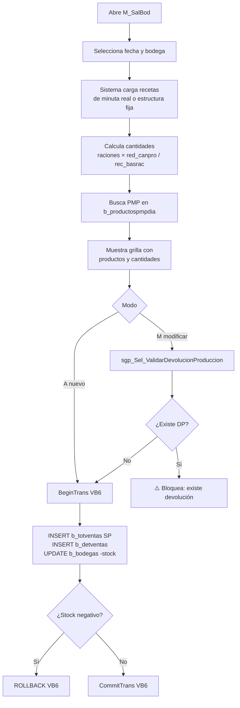

---

### 3.7 Cierre Diario (M_RCDiar)


> 📸 *Pendiente: insertar captura del formulario Cierre Diario*

#### 3.7.1 Descripción

Proceso crítico que "cierra" el día operacional: calcula el PMP (Precio Medio Ponderado) de todos los productos, valida que todas las actividades del día estén completas, y actualiza el estado para permitir el avance al siguiente día.

**Archivo:** `codigo_fuente/M_RCDiar.frm` (1.477 líneas)

#### 3.7.2 Restricción de Acceso

> ⚠️ **Solo el PC autorizado puede ejecutar el cierre.** El sistema valida `GetComputerName()` contra el parámetro `SvrAppCont` de `a_param`. Si el PC no coincide, deshabilita el botón de cierre.

#### 3.7.3 Código de Colores del Calendario

| Color | Significado |
|---|---|
| Cyan | Día habilitado para cierre |
| Azul | Día cerrado, no enviado al servidor central |
| Verde | Día cerrado y enviado exitosamente |

#### 3.7.4 Las 14+ Validaciones del CierrePeriodo

Antes de ejecutar el cierre, el sistema verifica que `b_casinotipoactividades` tenga todas las actividades completadas:

| # | Tipo | Actividad | Descripción validación |
|---|---|---|---|
| 1 | 2 | SalidaProd | Salidas de bodega a producción registradas |
| 2 | 3 | Devoluciones | Devoluciones de producción registradas |
| 3 | 4 | Mermas | Mermas del día registradas |
| 4 | 5 | RNV | Raciones No Vendidas procesadas |
| 5 | 6 | CtrlRaciones | Control de raciones completado |
| 6 | 7 | Cafetería | Ventas de cafetería cerradas |
| 7 | 8 | VentaServ | Ventas servicio contado registradas |
| 8 | 9 | VentaDir | Ventas directas registradas |
| 9 | 10 | Inventario | Inventario físico ingresado (si aplica) |
| 10+ | - | Adicionales | Validaciones específicas por tipo de casino |

#### 3.7.5 Flujo del Proceso de Cierre

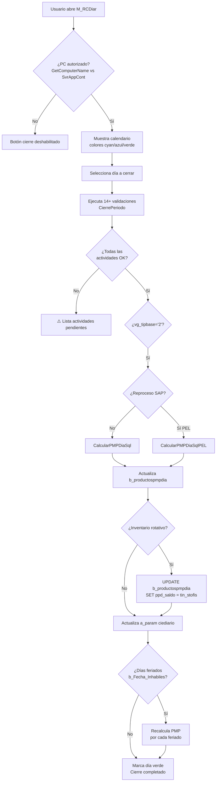

#### 3.7.6 Stored Procedures del Cierre

| SP | Descripción |
|---|---|
| `sgp_Sel_Param` | Lee parámetros de a_param |
| `sgp_Ins_Param` | Inserta parámetro nuevo |
| `sgp_Upd_Param` | Actualiza parámetro existente |
| `sgp_Sel_EnviarMensajeInventarioCalendarizado` | Verifica mensajes de inventario pendientes |
| `sgp_Upd_ReabrirCierreDiario(cencos, yyyymmdd)` | Revierte un cierre (ver 3.7.7) |

#### 3.7.7 Reapertura de Cierre (sgp_Upd_ReabrirCierreDiario)

Permite deshacer un cierre diario ya ejecutado:

```sql
-- Paso 1: Resetear saldos
UPDATE b_productospmpdia SET ppd_saldo = 0
WHERE ppd_cencos = @cencos AND ppd_fecdia = @yyyymmdd

-- Paso 2: Limpiar registros sin movimiento
DELETE b_productospmpdia
WHERE ppd_cencos = @cencos AND ppd_fecdia = @yyyymmdd
  AND ppd_propon = 0 AND ppd_saldo = 0

-- Paso 3: Reinsertar base para recálculo
INSERT INTO b_productospmpdia (ppd_cencos, ppd_codpro, ppd_fecdia, ppd_propon, ppd_saldo)
VALUES (@cencos, @codpro, @yyyymmdd, 0, 0)
```

---

### 3.8 Venta Servicio Contado (M_VtaCon)


> 📸 *Pendiente: insertar captura del formulario Venta Servicio Contado*

#### 3.8.1 Descripción

Registra las ventas de servicios de alimentación pagadas al contado (o formas de pago equivalentes). Organiza los montos en un calendario mensual.

**Archivo:** `codigo_fuente/M_VtaCon.frm` (1.942 líneas)

#### 3.8.2 Formas de Pago

| Código | Descripción |
|---|---|
| 0 | Contado |
| 1 | Cheque |
| 2 | Cheque Restaurant |
| 3 | Tarjeta de Crédito |
| 4 | Vale |

#### 3.8.3 Estructura de Datos

- **`b_ventacontado`:** Encabezado (vtc_codigo, cencos, codreg, codser, fecvta, vtc_forpag, vtc_totmon, vtc_opccli)
- **`b_ventacontadodet`:** Detalle por centro de costo (cuando cliente pertenece a CoCo en b_clientecencos)

#### 3.8.4 Pestañas del Formulario

- **Tab1:** Grilla calendario monto × día
- **Tab2:** Detalle Centro de Costo — Solo visible cuando el cliente tiene configuración de CoCo (`b_clientecencos`)

#### 3.8.5 Características Técnicas

- **NO usa Stored Procedures** — Usa SQL inline directo desde VB6
- Usa **`BeginTrans`/`CommitTrans`** VB6 en operaciones de Borrar y Confirmar

---

### 3.9 Venta Cafetería (M_VenCaf)


> 📸 *Pendiente: insertar captura del formulario Venta Cafetería*

#### 3.9.1 Descripción

Gestiona las ventas de productos en la cafetería del casino. Maneja un inventario propio de productos de cafetería con decremento de stock al cerrar la venta.

**Archivo:** `codigo_fuente/M_VenCaf.frm` (2.089 líneas)

#### 3.9.2 Pestañas

| Pestaña | Contenido |
|---|---|
| Tab1 | Venta Cafetería — ingreso de ítems vendidos |
| Tab2 | Inventario Producto — stock actual de productos |

#### 3.9.3 Tipos de Pago

| Código | Descripción | Requiere cliente |
|---|---|---|
| CR | Crédito | Sí |
| CU | Cuenta | Sí |
| CA | Contado | No |

#### 3.9.4 Ciclo de Vida de una Venta de Cafetería

| Operación | Estado `tvc_estado` | Efecto en b_bodegas |
|---|---|---|
| Crear venta | `''` (vacío) | Sin efecto |
| Op=1 Cerrar | `'C'` | `bod_canmer = bod_canmer - cantidad` |
| Op=2 Reabrir | `''` | Revierte decremento de stock |

#### 3.9.5 Tablas Involucradas

- `b_totventascaf` — Encabezado de venta cafetería
- `b_detventascaf` — Detalle de ítems vendidos
- `b_detventascafpro` — Detalle de productos descontados
- `b_bodegas` — Actualización de stock

Usa **`BeginTrans`/`CommitTrans`** VB6 en múltiples operaciones.

---

### 3.10 Venta Directa (M_VenDir)


> 📸 *Pendiente: insertar captura del formulario Venta Directa*

#### 3.10.1 Descripción

Registra ventas directas de productos del casino que no pasan por el proceso normal de servicio de casino.

**Archivo:** `codigo_fuente/M_VenDir.frm` (1.447 líneas)

#### 3.10.2 Características

- **Tablas:** `b_totventas`, `b_detventas`, `b_bodegas`
- **Control de stock visual:** Color **azul** indica que la cantidad supera el stock disponible
- Usa **`BeginTrans`/`CommitTrans`** VB6

---

### 3.11 Árbol Ingrediente (M_Produ1)


> 📸 *Pendiente: insertar captura del formulario Árbol Ingrediente*

#### 3.11.1 Descripción

Formulario de **solo lectura** que permite visualizar la composición de una receta hasta el nivel de ingredientes, junto con los aportes nutricionales calculados.

**Archivo:** `codigo_fuente/M_Produ1.frm`

#### 3.11.2 Tablas Consultadas

| Tabla | Información |
|---|---|
| `b_ingrediente` | Catálogo de ingredientes nutricionales |
| `b_productos` | Catálogo de productos/materias primas |
| `a_unidad` | Unidades de medida |
| `b_productospmpdia` | PMP actual para valorización |

---

### 3.12 Tabla Gramaje (M_TabGra)


> 📸 *Pendiente: insertar captura del formulario Tabla Gramaje*

#### 3.12.1 Descripción

Define los gramos por porción para cada combinación de Zona, Sub-segmento, Ingrediente de Receta, Régimen, Tipo de Minuta y Fecha. Organizado en un TreeView jerárquico.

**Archivo:** `codigo_fuente/M_TabGra.frm` (1.782 líneas)

#### 3.12.2 Jerarquía del TreeView

```
Zona
└── Sub-segmento
    └── Ingrediente de Receta
        └── Régimen
```

#### 3.12.3 Stored Procedure Utilizado

`sgpadm_s_zona(6, 0, '')` — Obtiene la jerarquía de zonas para el TreeView.

---

### 3.13 Lista Precio Cafetería (T_LiPrCa)


> 📸 *Pendiente: insertar captura del formulario Lista Precio Cafetería*

#### 3.13.1 Descripción

Formulario de mantenimiento del catálogo de artículos de cafetería con sus precios de venta y composición de ingredientes. Permite administrar el catálogo completo de artículos ofrecidos en la cafetería del casino: nombre, precio de venta y estado activo. Adicionalmente permite registrar los ingredientes (productos del maestro de bodega) que componen cada artículo con sus cantidades.

Opera siempre sobre el casino activo en sesión (`tpc_cencos`) sin dependencia de fechas ni estado del período de cierre. Cada casino tiene su propio catálogo independiente.

**Archivo:** `codigo_fuente/T_LiPrCa.frm`

> ⚠️ **Sin Stored Procedures:** Todas las operaciones (SELECT, INSERT, UPDATE, DELETE) se realizan mediante SQL directo desde el código VB6. No utiliza SPs dedicados.

La pantalla se organiza en dos pestañas:
- **Pestaña 1 — "Artículos de cafetería":** grilla con todos los artículos del casino activo (tabla `b_totpreciocaf`). Incluye panel de búsqueda por código o nombre.
- **Pestaña 2 — "Composición":** ingredientes del artículo seleccionado en la primera pestaña (tabla `b_detpreciocaf`). El título de la pestaña refleja el nombre del artículo activo.

#### 3.13.2 Estructura de la Grilla

**Pestaña 1 — Artículos de cafetería (`b_totpreciocaf`)**

| Col | Nombre | Campo BD | Editable | Observaciones |
|---|---|---|---|---|
| 1 | Código | `tpc_codigo` | No | Asignado automáticamente al grabar (MAX+1 por casino). No editable. |
| 2 | Nombre del artículo | `tpc_nombre` | Sí | Descripción libre. Campo obligatorio. |
| 3 | Precio | `tpc_precio` | Sí | Precio de venta. Separador de miles, 2 decimales. No puede ser cero. |
| 4 | Activo | `tpc_activo` | Sí | `1`=activo, `0`=inactivo. Casilla de verificación embebida en la grilla. |

**Pestaña 2 — Composición del artículo (`b_detpreciocaf` + `b_productos` + `a_unidad`)**

| Col | Nombre | Campo BD | Editable | Observaciones |
|---|---|---|---|---|
| 1 | Código producto | `dpc_codmer` | Sí | FK a `b_productos.pro_codigo`. Se selecciona via buscador. No puede repetirse. |
| 2 | Nombre del producto | `b_productos.pro_nombre` | No | Cargado automáticamente al seleccionar código. Solo lectura. |
| 3 | Unidad | `a_unidad.uni_nomcor` | No | Unidad de medida abreviada desde maestro. Solo lectura. |
| 4 | Cantidad | `dpc_cantidad` | Sí | Cantidad del ingrediente para el artículo. 3 decimales. No puede ser cero. |

#### 3.13.3 Flujo de Usuario

Al abrir el formulario, el sistema carga automáticamente todos los artículos del casino activo ordenados por `tpc_codigo`, `tpc_nombre`. La búsqueda en tiempo real filtra la grilla según el campo selector (código o nombre). Al cambiar de artículo en la primera pestaña, la segunda se recarga con los ingredientes del artículo seleccionado.

El código de cada artículo nuevo es calculado por el sistema como `MAX(CONVERT(int, tpc_codigo)) + 1` para el casino activo. El campo no puede ser editado manualmente.

El botón Grabar también se activa automáticamente al salir de una fila en modo Agregar o Modificar (auto-save al perder foco).

#### 3.13.4 Operaciones Disponibles

| Botón | Pestaña | Acción |
|---|---|---|
| Agregar | Artículos | Agrega fila vacía al final; deshabilita pestaña Composición hasta grabar. |
| Agregar | Composición | Abre buscador de productos (con control de stock activo y vigentes). Carga nombre y unidad automáticamente. |
| Modificar | Artículos | Habilita edición de la fila activa. Deshabilita pestaña Composición. |
| Modificar | Composición | Habilita edición de la fila activa. Deshabilita pestaña Artículos. |
| Eliminar | Artículos | Confirmación + verifica que no tenga datos asociados en otra tabla antes de DELETE. |
| Eliminar | Composición | Confirmación + DELETE del ingrediente seleccionado. |
| Grabar | Artículos | INSERT (`b_totpreciocaf`) o UPDATE según modo. Asigna código automático en INSERT. |
| Grabar | Composición | INSERT (`b_detpreciocaf`) o UPDATE de cantidad. |
| Cancelar | Ambas | Descarta cambios, recarga desde BD, vuelve a solo lectura y rehabilita ambas pestañas. |
| Refrescar | Artículos | Limpia búsqueda y recarga todos los artículos del casino. |
| Refrescar | Composición | Recarga composición del artículo activo. |
| Imprimir | Artículos | Genera informe "Lista de precios cafetería" o "Lista de precios cafetería con composición" según checkbox. |
| Imprimir | Composición | Genera informe "Composición artículo de cafetería" para el artículo activo. |
| Cerrar | Ambas | Cierra el formulario. |

#### 3.13.5 Validaciones

| # | Momento | Condición | Resultado |
|---|---|---|---|
| 1 | Al grabar artículo | Nombre vacío | Mensaje "Falta información...", cursor en Nombre. No graba. |
| 2 | Al grabar artículo | Precio = 0 | Mensaje "Falta información...", cursor en Precio. No graba. |
| 3 | Al grabar composición | Código ingrediente vacío | Mensaje "Falta información...", cursor en campo Código. No graba. |
| 4 | Al grabar composición | Cantidad = 0 | Mensaje "Falta información...", cursor en Cantidad. No graba. |
| 5 | Al agregar ingrediente (buscador) | Producto ya existe en la composición | Mensaje "Producto ya fue ingresado". Cancela incorporación. |
| 6 | Al agregar ingrediente (digitación) | Código no existe en `b_productos` | Mensaje "Producto no existe". Limpia campo. |
| 7 | Al agregar ingrediente (digitación) | Código ya existe en la composición | Mensaje "Producto ya fue ingresado". Limpia campo. |
| 8 | Al eliminar artículo | Sin fila seleccionada | Mensaje "Debe seleccionar un registro...". No procede. |
| 9 | Al eliminar ingrediente | Sin fila seleccionada en composición | Mensaje "Debe seleccionar un registro...". No procede. |
| 10 | Al eliminar artículo | Artículo con registros asociados en otra tabla | Mensaje de dato asociado. Revierte operación. No elimina. |
| 11 | Al imprimir | Grilla sin artículos | Mensaje "No existe datos a imprimir". No genera informe. |
| 12 | Al agregar ingrediente (buscador) | No hay artículos cargados en pestaña 1 | No ejecuta el buscador. Sin acción. |

#### 3.13.6 Tablas que utiliza

| Tabla | Uso | Operación |
|---|---|---|
| `b_totpreciocaf` | Artículos de cafetería con precio y estado activo | SELECT, INSERT, UPDATE, DELETE |
| `b_detpreciocaf` | Composición (ingredientes) de cada artículo | SELECT, INSERT, UPDATE, DELETE |
| `b_productos` | Maestro de productos para nombre e ingredientes | SELECT (solo lectura) |
| `a_unidad` | Unidades de medida para mostrar en grilla | SELECT (solo lectura) |
| `b_clientes` | Casino activo en sesión (para filtrar por `tpc_cencos`) | SELECT (solo lectura) |
| `a_tiposervicio` | Filtro de productos por tipo de servicio compatible con el casino (buscador) | SELECT (solo lectura) |

**Campos clave `b_totpreciocaf`:**

| Campo | Descripción |
|---|---|
| `tpc_codigo` | Código correlativo del artículo. Calculado como MAX+1 por casino. |
| `tpc_nombre` | Nombre del artículo de cafetería. |
| `tpc_precio` | Precio de venta. |
| `tpc_cencos` | Casino (centro de costo) al que pertenece el artículo. |
| `tpc_activo` | `1`=activo, `0`/vacío=inactivo. |

**Clave primaria `b_totpreciocaf`:** `tpc_codigo` + `tpc_cencos`.

**Campos clave `b_detpreciocaf`:**

| Campo | Descripción |
|---|---|
| `dpc_codigo` | FK a `b_totpreciocaf.tpc_codigo`. |
| `dpc_codmer` | FK a `b_productos.pro_codigo` (ingrediente). |
| `dpc_cantidad` | Cantidad del ingrediente por artículo. |
| `dpc_cencos` | Casino al que pertenece el detalle. |

**Clave primaria `b_detpreciocaf`:** `dpc_codigo` + `dpc_codmer` + `dpc_cencos`.

**Consultas de lectura principales:**

```sql
-- Carga artículos al abrir o refrescar
SELECT * FROM b_totpreciocaf
WHERE tpc_cencos = '<casino_activo>'
ORDER BY tpc_codigo, tpc_nombre

-- Carga composición del artículo seleccionado
SELECT dpc.*, pro.pro_nombre, uni.uni_nomcor
FROM b_detpreciocaf dpc, b_productos pro, a_unidad uni
WHERE pro.pro_codigo = dpc.dpc_codmer
  AND pro.pro_coduni = uni.uni_codigo
  AND dpc_cencos = '<casino_activo>'
  AND dpc_codigo = '<codigo_articulo>'

-- Cálculo de siguiente código al agregar artículo
SELECT MAX(CONVERT(int, tpc_codigo)) AS tpc_codigo
FROM b_totpreciocaf
WHERE tpc_cencos = '<casino_activo>'
```

---

### 3.14 Precio Venta Cliente (M_PVtaCl)


> 📸 *Pendiente: insertar captura del formulario Precio Venta Cliente*

#### 3.14.1 Descripción

Formulario que permite registrar y mantener el precio de venta individual por cliente para una combinación de Contrato + Régimen + Servicio + Fecha de vigencia. Es el punto de configuración previo al control de raciones: el precio registrado aquí queda asociado a las raciones planificadas en `b_minutaraciones` a partir de la fecha indicada.

**Archivo:** `codigo_fuente/M_PVtaCl.frm`

> ⚠️ **Sin Stored Procedures dedicados:** La lectura se realiza mediante una query dinámica construida en `RutinaLectura.PrecioVta` (clase `RutinaLectura.cls`). Las operaciones de escritura (INSERT, UPDATE, DELETE) se ejecutan como SQL directo desde VB6.

#### 3.14.2 Parámetros de Entrada (Encabezado)

Los cuatro campos del encabezado deben estar completos antes de cualquier operación sobre la grilla:

| Campo | Descripción | Obligatorio |
|---|---|---|
| Contrato (CeCo) | Código del casino / centro de costo | Sí |
| Régimen | Código del régimen alimenticio | Sí |
| Servicio | Código del servicio (desayuno, almuerzo, etc.) | Sí |
| Inicio de Validez | Fecha desde la cual rige el precio (formato dd/mm/yyyy, almacenado YYYYMMDD) | Sí |

#### 3.14.3 Estructura de la Grilla

| Col | Nombre | Campo BD | Editable | Observaciones |
|---|---|---|---|---|
| 1 | RUT Cliente | `b_clientes.cli_codigo` (formateado con dígito verificador) | Sí (modo Agregar) | Validado en `b_clientes`: debe existir, tipo=1 (externo) y activo. |
| 2 | Nombre Cliente | `b_clientes.cli_nombre` | No | Cargado automáticamente al validar el RUT. Solo lectura. |
| 3 | Precio de Venta | `b_preciovta.prv_preven` | Sí | Precio individual por cliente. |
| 4 | RUT interno | Copia sin formatear del RUT | No | Uso interno del sistema. |

#### 3.14.4 Operaciones Disponibles

| Botón | Acción |
|---|---|
| Agregar | Habilita ingreso de nueva fila. Requiere encabezado completo. |
| Modificar | Habilita edición del precio en la fila seleccionada. Requiere encabezado completo. |
| Eliminar | Verifica raciones asociadas en `b_minutaraciones` antes de confirmar. |
| Grabar | Persiste el registro (INSERT o UPDATE) en `b_preciovta`. |
| Cancelar | Descarta cambio pendiente y restaura valor anterior desde BD. |
| Refrescar | Recarga la grilla con datos actuales de la BD. |
| Imprimir | Genera informe de precios de venta para el encabezado seleccionado. |
| Cerrar | Cierra el formulario. |

#### 3.14.5 Validaciones

| # | Condición | Mensaje / Resultado |
|---|---|---|
| 1 | Encabezado incompleto al Agregar/Modificar/Eliminar | "Falta información en encabezado...". Operación no continúa. |
| 2 | Fecha de vigencia inválida | Grilla se limpia. Sin consulta. |
| 3 | RUT no existe en `b_clientes` | Campo RUT queda en blanco, cursor vuelve a la celda. |
| 4 | Cliente no es tipo 1 (externo) o está inactivo (`cli_activo ≠ '1'`) | Campo RUT queda en blanco, cursor vuelve a la celda. |
| 5 | Dígito verificador RUT incorrecto | Valor no se acepta. |
| 6 | RUT duplicado en la grilla (memoria) | "Cliente existe". Limpia celda. |
| 7 | RUT duplicado en `b_preciovta` (misma combinación encabezado+RUT) | "Cliente existe". Cancela inserción. |
| 8 | RUT vacío al intentar grabar | "Falta información...". Foco vuelve a celda RUT. |
| 9 | Eliminación con raciones asociadas en `b_minutaraciones` | "Elimina registro que está asociado control raciones...". Requiere confirmación explícita. |

> ⚠️ La validación de precio mínimo (precio ≥ 1) existe en el código pero está **comentada** (inactiva). El sistema acepta precio igual a cero.

#### 3.14.6 Tablas que utiliza

| Tabla | Uso | Operación |
|---|---|---|
| `b_preciovta` | Precios de venta por cliente, período y combinación Contrato+Régimen+Servicio | SELECT, INSERT, UPDATE, DELETE |
| `b_clientes` | Validación de RUT (existencia, tipo, estado activo) y carga de nombre | SELECT (solo lectura) |
| `b_minutaraciones` | Verificación de raciones asociadas antes de eliminar un precio | SELECT (solo lectura) |
| `B_HistPm` | Historial de precios anteriores (accesible desde botón de fecha Image1 Index=3) | SELECT (solo lectura) |

**Campos de `b_preciovta`:**

| Campo | Descripción |
|---|---|
| `prv_cencos` | Centro de costo (PK compuesta) |
| `prv_codreg` | Código de régimen (PK compuesta) |
| `prv_codser` | Código de servicio (PK compuesta) |
| `prv_fecvig` | Fecha de vigencia YYYYMMDD (PK compuesta) |
| `prv_rutcli` | RUT del cliente (PK compuesta) |
| `prv_preven` | Precio de venta |
| `prv_SPRS` | Indicador de integración SPRS (precio proveniente del sistema SPRS de Sodexo) |

**Clave primaria `b_preciovta`:** `prv_cencos` + `prv_codreg` + `prv_codser` + `prv_fecvig` + `prv_rutcli`.

**Consulta de lectura (`RutinaLectura.PrecioVta`):**

```sql
SELECT a.cli_codigo,
       ISNULL(a.cli_nombre, '') AS cli_nombre,
       ISNULL(b.prv_preven, 0)  AS prv_preven,
       ISNULL(b.prv_SPRS, '')   AS prv_SPRS
FROM   b_clientes  a,
       b_preciovta b
WHERE  b.prv_rutcli = a.cli_codigo
AND    b.prv_cencos = :cencos
AND    b.prv_codreg = :codreg
AND    b.prv_codser = :codser
AND    b.prv_fecvig = :fecha          -- formato YYYYMMDD
AND   (b.prv_rutcli = :codcli OR :codcli = '')
AND    a.cli_tipo   = 1
```

Cuando `codcli` está vacío retorna todos los clientes del período. Con valor, filtra por cliente específico (usado para validar duplicados al agregar).

> ⚠️ La validación que bloqueaba la edición de registros marcados con `prv_SPRS` (provenientes del sistema SPRS de Sodexo) está **comentada** en el código fuente (inactiva).

---

## 4. Reglas de Negocio Consolidadas

### 4.1 Planificación

| ID | Regla | Fuente |
|---|---|---|
| RN-PROD-001 | La planificación teórica se genera con un mes de anticipación | Sesiones levantamiento dic-2025 |
| RN-PROD-002 | El chef ajusta la planificación real antes de comenzar la producción del día | Sesiones levantamiento |
| RN-PROD-003 | Una minuta con `min_indblo IN (2, 11)` no puede ser modificada | M_Plami1 / sgp_Sel_ValidarMinBloque |
| RN-PROD-004 | Los regímenes con código > 9999 corresponden a minutas centralizadas (5-etapas) y son de solo lectura | M_MinRea / a_param '5etapas' |
| RN-PROD-005 | El número máximo de recetas adicionales por día está configurado en `a_param 'addreceta'` | M_MinRea |
| RN-PROD-006 | No se puede reducir el número de raciones planificadas por debajo de las mermas ya registradas | sgp_Ins_XmlMinutaReal |
| RN-PROD-007 | No se puede cambiar una receta si ya tiene mermas registradas | sgp_Ins_XmlMinutaReal |

### 4.2 Raciones

| ID | Regla | Fuente |
|---|---|---|
| RN-PROD-010 | Existen tres niveles de raciones: Planificadas, Producidas y Vendidas | Sesiones levantamiento |
| RN-PROD-011 | La fila PRODUCIDAS en Control de Raciones requiere password para edición | M_ConRac / a_param 'parcomdia' |
| RN-PROD-012 | Los valores especiales 'PRODUCIDAS', 'PERSONAL' y 'MERMAS' en mir_rutcli son preservados en operaciones de facturación | sgp_Ins_MinutaRacionFacturable |
| RN-PROD-013 | Al marcar raciones como facturables (Fac=1), se eliminan las raciones de clientes reales pero se conservan las filas especiales | sgp_Ins_MinutaRacionFacturable |

### 4.3 Mermas

| ID | Regla | Fuente |
|---|---|---|
| RN-PROD-020 | Las mermas por raciones no pueden superar las raciones planificadas (mid_nummer ≤ mid_numrac) | M_MerPre col5 validación |
| RN-PROD-021 | Los días con fecha anterior al cierre diario aparecen bloqueados (rojo) en el editor de mermas | M_MerPre / vg_ciedia |
| RN-PROD-022 | La merma de producción tiene dos componentes: merma por receta (en b_minutadet) y merma global de desconche/pan/producción (en b_mermadesconche) | Análisis BD |
| RN-PROD-023 | El check "No considera Mermas" guarda Considera_Merma='N' y excluye la merma del cálculo de costos | M_MerPre / b_mermadesconche |

### 4.4 Requisición y Salida de Bodega

| ID | Regla | Fuente |
|---|---|---|
| RN-PROD-030 | La fórmula de requisición es: Cantidad = (Raciones × GramajePorRación) / FacingProducto | I_SalBod / sgp_DelIns_formatorequesicionestdetallado |
| RN-PROD-031 | Solo se incluyen días abiertos (no cerrados) en el cálculo de requisición | sgp_DelIns_formatorequesicionestdetallado |
| RN-PROD-032 | La requisición tipo 2 (xEstructura Detallado) es el documento oficial para SAP | I_SalBod |
| RN-PROD-033 | Si existen servicios sin comensales, se muestra advertencia y se exporta Excel de alerta | I_SalBod |
| RN-PROD-034 | Una Salida de Producción (SP) no puede modificarse si ya tiene una Devolución de Producción (DP) asociada | M_SalBod / sgp_Sel_ValidarDevolucionProduccion |
| RN-PROD-035 | Si al procesar una salida de bodega el stock resulta negativo, se ejecuta ROLLBACK automático | M_SalBod |

### 4.5 Cierre Diario

| ID | Regla | Fuente |
|---|---|---|
| RN-PROD-040 | El cierre diario solo puede ejecutarse desde el PC configurado en a_param 'SvrAppCont' | M_RCDiar |
| RN-PROD-041 | Antes de cerrar, deben estar completas todas las actividades del día en b_casinotipoactividades | M_RCDiar / 14+ validaciones |
| RN-PROD-042 | El cierre diario calcula el PMP de todos los productos del casino | M_RCDiar / CalcularPMPDiaSql |
| RN-PROD-043 | Los días feriados (b_Fecha_Inhabiles) requieren recálculo del PMP | M_RCDiar |
| RN-PROD-044 | En casinos con inventario rotativo, el saldo PMP se actualiza con el stock físico (tin_stofis) | M_RCDiar |
| RN-PROD-045 | La fecha del último cierre se almacena encriptada en a_param 'ciediario' | a_param / sgp_p_desencripta |

### 4.6 Ventas

| ID | Regla | Fuente |
|---|---|---|
| RN-PROD-050 | Las ventas de cafetería tienen ciclo: Abierta → Cerrada → Reabierta (con efecto de stock en cierre) | M_VenCaf |
| RN-PROD-051 | Las ventas de cafetería con tipo CR o CU requieren cliente identificado | M_VenCaf |
| RN-PROD-052 | En venta directa, el color azul indica que la cantidad supera el stock disponible | M_VenDir |
| RN-PROD-053 | La venta servicio contado admite 5 formas de pago: Contado, Cheque, Cheque Restaurant, Tarjeta de Crédito, Vale | M_VtaCon |

### 4.7 Integración FLMS/SAP

| ID | Regla | Fuente |
|---|---|---|
| RN-PROD-060 | Los movimientos de bodega llegan desde SAP a través de la tabla b_totventas_SGP_FLMS | FLMS_SGP_ValidaCargaSalidasDeBodega |
| RN-PROD-061 | El proceso de integración valida 9 categorías de error antes de aceptar un movimiento | FLMS_SGP_IdentificaErrores |
| RN-PROD-062 | Los registros con Estado=3 en FLMS son reprocesados por FLMS_SGP_ReprocesaCargaSalidasDeBodega | Análisis BD |

### 4.8 Cafetería — Lista de Precios

| ID | Regla | Fuente |
|---|---|---|
| RN-PROD-063 | Cada casino tiene su propio catálogo de artículos de cafetería independiente, filtrado por `tpc_cencos` | T_LiPrCa / b_totpreciocaf |
| RN-PROD-064 | El código de artículo de cafetería es asignado automáticamente por el sistema como MAX(tpc_codigo)+1 por casino; el usuario no puede modificarlo | T_LiPrCa |
| RN-PROD-065 | No se puede eliminar un artículo de cafetería que tenga ingredientes u otros registros asociados en tablas relacionadas | T_LiPrCa / b_detpreciocaf |
| RN-PROD-066 | El buscador de productos para composición de artículos filtra a productos con control de stock activo y con fecha de vigencia no expirada | T_LiPrCa / b_productos.pro_ctrsto=1 |
| RN-PROD-067 | Un mismo producto (ingrediente) no puede repetirse dentro de la composición de un mismo artículo de cafetería | T_LiPrCa / b_detpreciocaf |
| RN-PROD-068 | Durante la edición de artículos, la pestaña de Composición queda deshabilitada y viceversa (operación mutuamente excluyente) | T_LiPrCa |

### 4.9 Precio Venta Cliente

| ID | Regla | Fuente |
|---|---|---|
| RN-PROD-069 | El precio de venta es individual por cliente y se asocia a la combinación Contrato + Régimen + Servicio + Fecha de vigencia | M_PVtaCl / b_preciovta |
| RN-PROD-070 | No puede existir más de un precio para el mismo cliente en la misma combinación (clave única: prv_cencos + prv_codreg + prv_codser + prv_fecvig + prv_rutcli) | M_PVtaCl / b_preciovta |
| RN-PROD-071 | Solo clientes de tipo 1 (externos) y con estado activo (cli_activo='1') pueden ser registrados con precio de venta | M_PVtaCl / b_clientes |
| RN-PROD-072 | El RUT del cliente se valida con algoritmo de dígito verificador chileno antes de aceptar | M_PVtaCl |
| RN-PROD-073 | Al eliminar un precio con raciones ya registradas en b_minutaraciones para fechas iguales o posteriores a la vigencia, el sistema advierte explícitamente y requiere confirmación | M_PVtaCl / b_minutaraciones |
| RN-PROD-074 | Los cuatro campos del encabezado (Contrato, Régimen, Servicio, Fecha) deben estar completos antes de ejecutar cualquier operación de ABM sobre la grilla | M_PVtaCl |

---

## 5. Validaciones del Sistema

### 5.1 Validaciones en Frontend (VB6)

| Formulario | Validación | Acción si falla |
|---|---|---|
| M_Plami1 | Período no bloqueado (min_indblo IN 2,11) | Mensaje de error, no abre M_MinRea |
| M_MinRea | Régimen > 9999 + parámetro 5etapas activo | Celda solo lectura (amarilla) |
| M_MerPre | Col5 (MermaxRaciones) ≤ mid_numrac | Rechaza el valor y muestra mensaje |
| M_MerPre | Día anterior a vg_ciedia | Fila bloqueada en color rojo |
| M_ConRac | Fila PRODUCIDAS sin password | Bloquea edición de la celda |
| M_SalBod | Stock resultante negativo | ROLLBACK y mensaje al usuario |
| M_SalBod | Existe DP para el SP | Bloquea modificación del documento |
| M_VenDir | Cantidad > stock disponible | Color azul en celda (advertencia visual) |
| M_RCDiar | PC ≠ SvrAppCont | Botón cierre deshabilitado |
| M_RCDiar | Actividades del día incompletas | Lista actividades pendientes |

### 5.2 Validaciones en Stored Procedures (BD)

| SP | Validación | Código error retornado |
|---|---|---|
| `sgp_Ins_XmlMinutaReal` | mid_nummer > mid_numrac (merma > raciones) | @Num_error > 0 |
| `sgp_Ins_XmlMinutaReal` | Cambio de receta con mermas existentes | @Num_error > 0 |
| `sgp_Sel_ValidarMinBloque` | min_indblo IN (2,11) | Retorna registros (bloqueo) |
| `sgp_Sel_ValidarMinutaMermaPorPreparacion` | mid_tipmin='2' no existe | Sin datos → error |
| `sgp_Sel_ValidarServicioComensalesCeroSalProduccion` | Servicios con comensales=0 | Retorna registros (warning) |
| `sgp_Upd_ValidarProductoVigente` | Productos no vigentes en bodega | Error específico |
| `sgp_Sel_ValidarDevolucionProduccion` | Existe DP para el SP | Retorna registros (bloqueo) |
| `FLMS_SGP_IdentificaErrores` | 9 categorías de errores FLMS | VARCHAR(200) con códigos |
| `FLMS_SGP_ValidaRacionesNoVendidas` | mid_nummer > mid_numrac en FLMS | Estado=3 |

### 5.3 Validaciones de Integridad FLMS (9 Categorías)

| Código | Categoría | Descripción |
|---|---|---|
| 1 | Centro de Costo | El ceco del movimiento no existe en el sistema |
| 2 | Tipo Documento | El tipo de documento no es válido |
| 4 | Régimen | El régimen no existe para el casino |
| 5 | Servicio | El servicio no existe para el régimen |
| 6 | Total ≠ Suma | El total del documento no coincide con la suma del detalle |
| 7 | Ingrediente | El ingrediente no está en el catálogo |
| 8 | Producto | El producto no existe en el sistema |
| 9 | Cantidad negativa | La cantidad del movimiento es negativa |

> 🔍 **Nota:** Los códigos 3 no aparece en la documentación. Puede ser reservado o eliminado. Confirmar con el equipo técnico.

### 5.4 Validaciones en T_LiPrCa (Lista Precio Cafetería)

| Formulario | Validación | Momento | Acción si falla |
|---|---|---|---|
| T_LiPrCa | Nombre del artículo no vacío | Al grabar artículo | Mensaje "Falta información...", cursor en Nombre. Sin grabado. |
| T_LiPrCa | Precio del artículo ≠ 0 | Al grabar artículo | Mensaje "Falta información...", cursor en Precio. Sin grabado. |
| T_LiPrCa | Código de ingrediente no vacío | Al grabar composición | Mensaje "Falta información...", cursor en campo Código. Sin grabado. |
| T_LiPrCa | Cantidad de ingrediente ≠ 0 | Al grabar composición | Mensaje "Falta información...", cursor en Cantidad. Sin grabado. |
| T_LiPrCa | Producto no duplicado en composición (vía buscador) | Al agregar ingrediente | Mensaje "Producto ya fue ingresado". Cancela incorporación. |
| T_LiPrCa | Código ingresado manualmente existe en b_productos | Al agregar ingrediente manualmente | Mensaje "Producto no existe". Limpia campo. |
| T_LiPrCa | Código ingresado manualmente no duplicado en composición | Al agregar ingrediente manualmente | Mensaje "Producto ya fue ingresado". Limpia campo. |
| T_LiPrCa | Artículo seleccionado al Eliminar artículo | Al Eliminar | Mensaje "Debe seleccionar un registro...". No procede. |
| T_LiPrCa | Artículo sin datos asociados en otras tablas | Al Eliminar artículo | Mensaje de dato asociado a otra tabla. Revierte. No elimina. |
| T_LiPrCa | Grilla con datos al Imprimir | Al Imprimir | Mensaje "No existe datos a imprimir". No genera informe. |

### 5.5 Validaciones en M_PVtaCl (Precio Venta Cliente)

| Formulario | Validación | Momento | Acción si falla |
|---|---|---|---|
| M_PVtaCl | Encabezado completo (Contrato + Régimen + Servicio + Fecha) | Al Agregar/Modificar/Eliminar | Mensaje "Falta información en encabezado...". Operación no continúa. |
| M_PVtaCl | Fecha de vigencia válida | Al cambiar fecha | Grilla se limpia. Sin consulta. |
| M_PVtaCl | RUT existe en b_clientes, tipo=1 (externo), activo | Al ingresar/salir del campo RUT | Campo RUT queda en blanco. Cursor vuelve a la celda. |
| M_PVtaCl | Dígito verificador RUT correcto (algoritmo chileno) | Al abandonar campo RUT | Valor no se acepta. |
| M_PVtaCl | RUT no duplicado en grilla activa | Al ingresar RUT | Mensaje "Cliente existe". Limpia celda. |
| M_PVtaCl | RUT no duplicado en b_preciovta (misma combinación encabezado) | Al Grabar (INSERT) | Mensaje "Cliente existe". Cancela inserción. |
| M_PVtaCl | RUT no vacío al Grabar | Al Grabar | Mensaje "Falta información...". Foco vuelve a celda RUT. |
| M_PVtaCl | Raciones asociadas en b_minutaraciones al Eliminar | Al Eliminar | Mensaje con advertencia de raciones asociadas. Requiere confirmación explícita (Sí/No). |

---

## 6. Objetos de Base de Datos

### 6.1 Stored Procedures

#### 6.1.1 Módulo Planificación

##### sgp_Ins_XmlMinutaReal

```sql
-- Firma completa
EXEC sgp_Ins_XmlMinutaReal
    @XmlMinuta = N'<GrabaMinuta>...</GrabaMinuta>',
    @Ceco = '001',
    @CodRegimen = 5001,
    @CodServicio = 1001,
    @FechaDia = 20260115,
    @Raciones = 150,
    @Color = '0',
    @Usuario = 'CHEF01'
```

**Flujo interno detallado:**

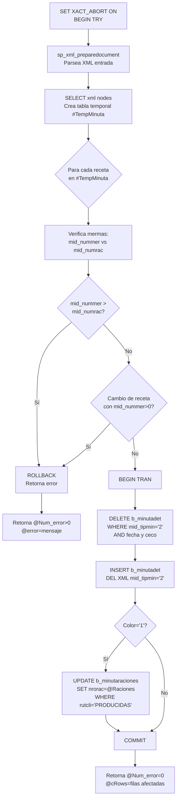

##### sgp_Ins_XmlMinutaTeorica

Similar a `sgp_Ins_XmlMinutaReal` pero:
- Inserta con `mid_tipmin='1'`
- **Sin validaciones de mermas** (la teórica no tiene mermas)

##### sgp_Sel_ValidarMinBloque

```sql
SELECT min_codigo, min_indblo
FROM b_minuta
WHERE min_cencos = @Ceco
  AND min_fecmin = @FechaMinuta
  AND min_indblo IN (2, 11)
```

#### 6.1.2 Módulo Mermas

##### sgp_Sel_MermaPorPreparacion

```sql
-- Parámetros
EXEC sgp_Sel_MermaPorPreparacion
    @cencos = '001',
    @codreg = 5001,
    @codser = 1001,
    @fecha = 20260115,
    @codbod = 1
```

**Cálculo clave:**
```sql
CantBruta = CASE
    WHEN mid_nummer > 0 AND mid_mermaxkilo = 0
    THEN dbo.SGP_FN_RNVCantidadesReceta(params) * mid_nummer
    ELSE mid_mermaxkilo
END
```

#### 6.1.3 Módulo Control de Raciones

##### sgp_Sel_DetalleLecturaxPeriodo

```sql
EXEC sgp_Sel_DetalleLecturaxPeriodo
    @Ceco = '001',
    @Periodo = 202601  -- YYYYMM
```
- Agrupa `b_detallelectura` por período
- Retorna lecturas de vales por punto

##### sgp_Ins_MinutaRacionFacturable (con Fac=1)

```sql
-- Lógica cuando @Fac = 1
DELETE FROM b_minutaraciones
WHERE mir_cencos = @Ceco
  AND mir_codreg = @Reg
  AND mir_codser = @Ser
  AND mir_fecmin = @Fecha
  AND mir_rutcli NOT IN ('PRODUCIDAS', 'PERSONAL', 'MERMAS')
```

#### 6.1.4 Módulo Requisición

##### sgp_DelIns_formatorequesicionestdetallado

```sql
-- Fórmula de cálculo
Cantidad = (mid_numrac * red_canpro) / pro_facing
```

**Restricciones:**
- `mid_tipmin = '2'` (solo planificación real)
- Excluye días `ppd_fecdia <= CONVERT(INT, desencripta(ciediario))`
- Aplica a los servicios y regímenes incluidos en los XML de parámetros

#### 6.1.5 Módulo Cierre Diario

##### sgp_Upd_ReabrirCierreDiario

```sql
EXEC sgp_Upd_ReabrirCierreDiario
    @cencos = '001',
    @yyyymmdd = 20260115
```

Reversa un cierre diario eliminando y recreando registros PMP del día.

#### 6.1.6 Módulo Integración FLMS

##### FLMS_SGP_ValidaCargaSalidasDeBodega

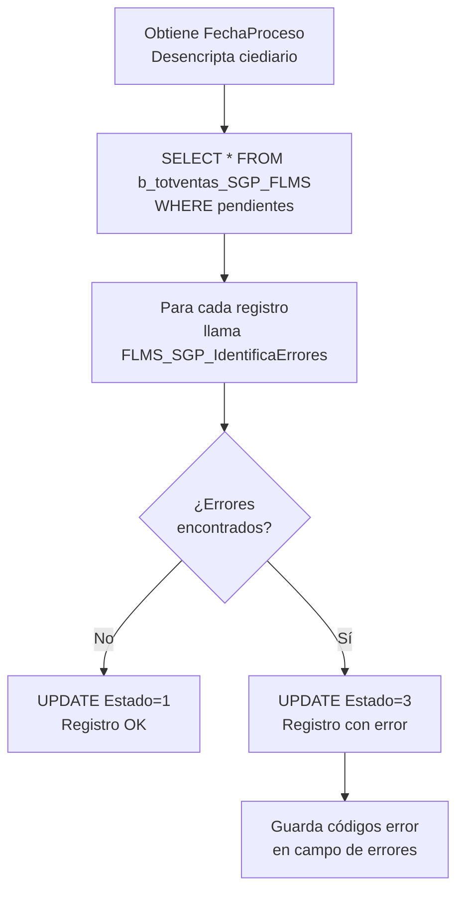

##### FLMS_SGP_ValidaRacionesNoVendidas

```sql
-- CURSOR sobre b_minuta_SGP_FLMS
DECLARE cur_flms CURSOR FOR
SELECT * FROM b_minuta_SGP_FLMS
WHERE estado_proceso IS NULL

-- Para cada registro
IF mid_nummer > mid_numrac
    UPDATE ... SET Estado = 3  -- Error
ELSE
    UPDATE ... SET Estado = 1  -- OK
```

#### 6.1.7 Formularios sin Stored Procedures dedicados

Los siguientes formularios realizan todas sus operaciones mediante SQL directo desde el código VB6, sin invocar Stored Procedures dedicados:

| Formulario | Tablas afectadas | Observación |
|---|---|---|
| `T_LiPrCa` (Lista Precio Cafetería) | `b_totpreciocaf`, `b_detpreciocaf` | SELECT, INSERT, UPDATE, DELETE vía SQL inline. Lectura de `b_productos` y `a_unidad` también inline. |
| `M_PVtaCl` (Precio Venta Cliente) | `b_preciovta` | Escritura vía SQL inline. Lectura a través de `RutinaLectura.PrecioVta` (query dinámica en `RutinaLectura.cls`). |

> ⚠️ La ausencia de SPs en estos formularios implica que la lógica de validación de integridad reside completamente en el código VB6 y no en la capa de base de datos.

---

### 6.2 Funciones (UDFs)

#### sgp_p_desencripta

```sql
CREATE FUNCTION sgp_p_desencripta(@psw_encripta VARCHAR(200))
RETURNS VARCHAR(200)
AS BEGIN
    -- Algoritmo: CHAR(ASCII(char) - 73 - posición_1_based)
    DECLARE @resultado VARCHAR(200) = ''
    DECLARE @i INT = 1
    WHILE @i <= LEN(@psw_encripta)
    BEGIN
        SET @resultado = @resultado +
            CHAR(ASCII(SUBSTRING(@psw_encripta, @i, 1)) - 73 - @i)
        SET @i = @i + 1
    END
    RETURN @resultado
END
```

> ⚠️ Esta función desencripta los valores de `a_param` para `ciediario` (fecha cierre) y `parcomdia` (password de celda PRODUCIDAS). La clave de encriptación está embebida en el código.

#### fn_sgp_p_CalculaCosaliCosdes

```sql
CREATE FUNCTION fn_sgp_p_CalculaCosaliCosdes(
    @Op INT,           -- 1=alimento, 2=desechable
    @CenCos VARCHAR(10),
    @CodRec INT,
    @TipRec INT,
    @TipMin VARCHAR(1),
    @Fecha INT
)
RETURNS FLOAT
AS BEGIN
    -- Si @Op=1: usa cuenta ctainsumo de a_param
    -- Si @Op=2: usa cuenta ctalimdes de a_param
    -- Receta patrón: cencos='0'
    RETURN (
        SELECT SUM(red_canpro * mic_cospro)
        FROM b_recetadet
        JOIN b_minutacosto ON ...
        WHERE ...
    )
END
```

#### fn_sgp_Pro_TraerDiaSeguridad

```sql
-- Recorre árbol: a_tipopro → b_paramdesp
-- Retorna días de seguridad para un producto en un casino
RETURN SELECT par_diaseg
FROM b_paramdesp
WHERE par_codpro IN (
    SELECT tip_codpro FROM a_tipopro
    WHERE tip_codigo = @codigo
)
AND par_cencos = @Ceco
```

#### FLMS_SGP_IdentificaErrores

```sql
-- Retorna VARCHAR(200) con códigos separados por coma
-- Ejemplo retorno: '1,4,8'
-- Validaciones:
-- 1 = Centro de costo no existe
-- 2 = Tipo documento inválido
-- 4 = Régimen no existe
-- 5 = Servicio no existe
-- 6 = Total != suma de detalle
-- 7 = Ingrediente no existe
-- 8 = Producto no existe
-- 9 = Cantidad < 0
```

---

### 6.3 Vistas

#### Sel_FechaUltimoCierre

```sql
CREATE VIEW Sel_FechaUltimoCierre AS
SELECT
    par_cencos,
    DATEADD(DAY, -1,
        CONVERT(DATE, dbo.sgp_p_desencripta(par_valor))
    ) AS FechaCierre,
    GETDATE() AS FechaProceso
FROM a_param
WHERE par_codigo = 'ciediario'
```

#### Sel_Minuta_Planificada

```sql
CREATE VIEW Sel_Minuta_Planificada AS
SELECT
    m.*,
    md.*,
    ROUND((md.mid_numrac / m.min_racrea) * 100, 0) AS Ponderacion
FROM b_minuta m
JOIN b_minutadet md ON m.min_codigo = md.mid_codigo
WHERE md.mid_tipmin = '2'
  AND md.mid_numrac > 0
  AND m.min_racrea > 0
```

#### Sel_Precio_Stock_SGP

```sql
CREATE VIEW Sel_Precio_Stock_SGP AS
SELECT p.*, ppd.ppd_propon, ppd.ppd_saldo, b.bod_canmer
FROM b_productos p
JOIN b_productospmpdia ppd ON p.pro_codigo = ppd.ppd_codpro
JOIN b_bodegas b ON ...
WHERE ppd.ppd_fecdia = (SELECT MAX(ppd_fecdia) FROM b_productospmpdia ...)
  AND b.bod_canmer > 0
```

#### Sel_Producto_Ingrediente_SGP

```sql
CREATE VIEW Sel_Producto_Ingrediente_SGP AS
SELECT
    p.pro_codigo,
    p.pro_descri,
    i.ing_codigo,
    i.ing_descri,
    ppd.ppd_propon AS PMP
FROM b_productos p
JOIN b_productosing pri ON p.pro_codigo = pri.pri_codpro
JOIN b_contlistpreing cli ON ...
JOIN b_productospmpdia ppd ON p.pro_codigo = ppd.ppd_codpro
JOIN b_ingrediente i ON pri.pri_coding = i.ing_codigo
```

---

## 7. Integraciones y Dependencias

### 7.1 Diagrama General de Integraciones

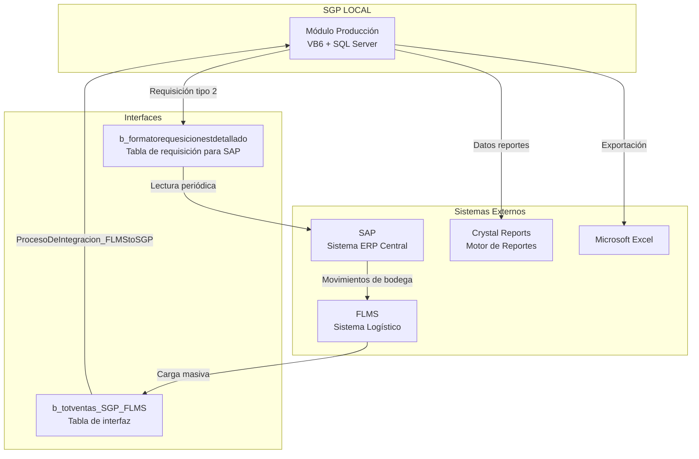

### 7.2 Flujo de Integración FLMS → SGP

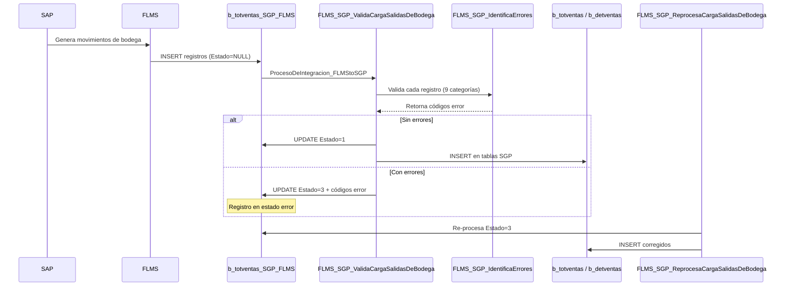

### 7.3 Flujo de Requisición SGP → SAP

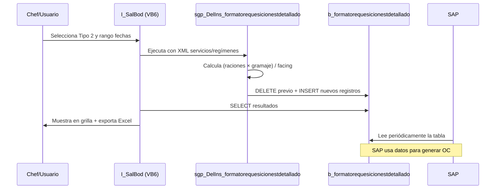

### 7.4 Dependencias entre Formularios

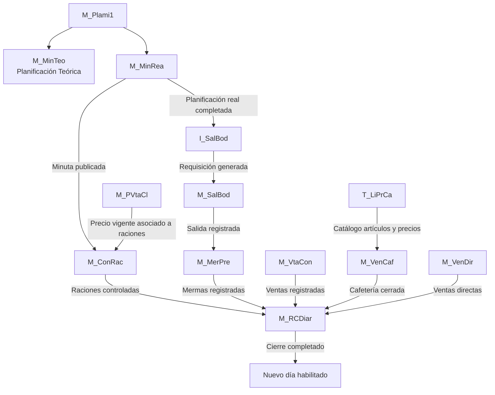

**Relaciones de los nuevos formularios:**

| Formulario | Depende de | Lo usan |
|---|---|---|
| `T_LiPrCa` (Lista Precio Cafetería) | `b_productos` (maestro de productos, solo lectura); `a_unidad` (unidades, solo lectura); `b_clientes` (casino activo) | `M_VenCaf` (usa `b_totpreciocaf` como catálogo de artículos disponibles para la venta) |
| `M_PVtaCl` (Precio Venta Cliente) | `b_clientes` (validación RUT, tipo y estado); `b_minutaraciones` (verificación de raciones asociadas al eliminar) | `M_ConRac` (el precio vigente en `b_preciovta` se asocia a las raciones planificadas) |

**Nota sobre independencia de ciclo productivo:**
- `T_LiPrCa` no depende del estado del período de cierre. Puede usarse en cualquier momento.
- `M_PVtaCl` establece precios con fecha de vigencia (`prv_fecvig`), por lo que es un formulario de configuración que debe ejecutarse antes de registrar raciones para el período correspondiente.

### 7.5 Crystal Reports Utilizados

| Informe | Formulario | Tipo |
|---|---|---|
| Requisición Resumida | I_SalBod tipo 0 | Crystal Reports |
| Requisición por Sector | I_SalBod tipo 1 | Crystal Reports |
| Requisición Estructura Resumida | I_SalBod tipo 3 | Crystal Reports |
| Resumen Requisición | I_SalBod tipo 4 | Crystal Reports |
| Devoluciones | I_SalBod tipo 5 | Crystal Reports |
| MenosDev | I_SalBod tipo 6 | Crystal Reports |

---

## 8. Trazabilidad y Auditoría

### 8.1 Campos de Auditoría por Tabla

| Tabla | Campo Usuario | Campo Fecha | Observación |
|---|---|---|---|
| `b_minuta` | `min_usuariocreacion` | `min_fechacreacion` | Solo creación |
| `b_mermadesconche` | `Usuario` | `Fecha_Modificacion`, `Fecha_Creacion` | Creación y modificación |
| `b_formatorequesicionestdetallado` | Sin campo usuario | Sin fecha | Sin auditoría (tabla temporal SAP) |
| Llamadas a SP | Parámetro `@Usuario` | Implícito en SP | El usuario se pasa como parámetro |

### 8.2 Logs del Sistema

| Tabla | Descripción |
|---|---|
| `log_enviocierrediario` | Registro de envíos del cierre diario al servidor central |
| `log_cierrediario` | Log detallado de cada ejecución del cierre diario |
| `FLMS_SGP_IU_LogIntegraMermaMin_Out` | Log de integración de mermas desde FLMS |
| `FLMS_SGP_IU_LogIntegraOut` | Log general de integración FLMS saliente |

### 8.3 Estados de los Documentos

#### Minuta (b_minuta.min_indblo)

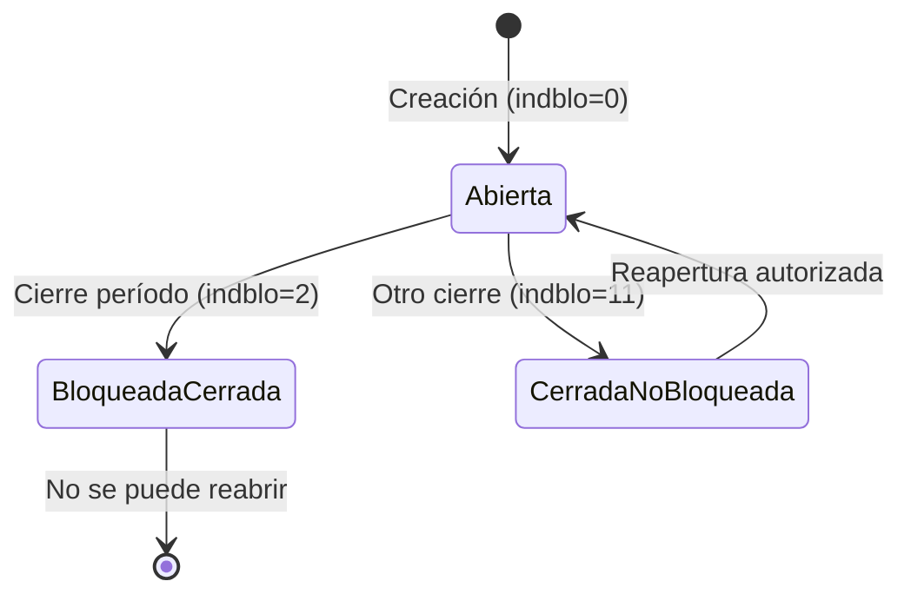

#### Cierre Período (b_cierreperiodo.cie_estado)

| Estado | Valor | Descripción |
|---|---|---|
| Abierto | 1 | Período en operación normal |
| Cerrado | 0 | Período finalizado, sin modificaciones |

#### Venta Cafetería (b_totventascaf.tvc_estado)

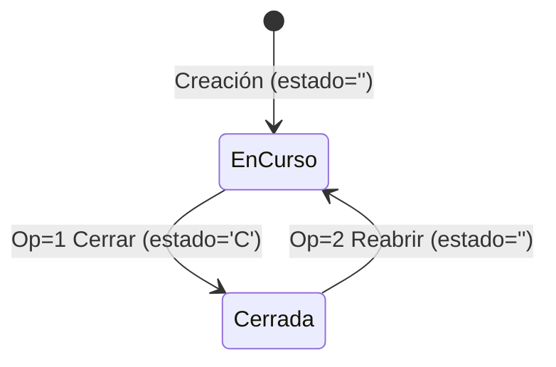

#### Integración FLMS (b_totventas_SGP_FLMS.Estado)

| Estado | Descripción |
|---|---|
| NULL | Pendiente de procesar |
| 1 | Procesado correctamente |
| 3 | Error en validación |

### 8.4 Trazabilidad del Precio (PMP)

El PMP (Precio Medio Ponderado) es recalculado diariamente por el cierre y queda registrado por:
- Centro de costo (`ppd_cencos`)
- Producto (`ppd_codpro`)
- Día (`ppd_fecdia`)

Esto permite reconstruir el costo de inventario para cualquier fecha histórica.

---

## 9. Valorización y Costos

### 9.1 Precio Medio Ponderado (PMP)

El PMP es el método de valorización de inventario utilizado por el sistema.

**Fórmula:**
```
PMP_nuevo = (Stock_anterior × PMP_anterior + Cantidad_entrada × Precio_entrada)
            / (Stock_anterior + Cantidad_entrada)
```

**Ejecución:** Una vez al día, durante el cierre diario, mediante:
- `CalcularPMPDiaSql()` — Método estándar
- `CalcularPMPDiaSqlPEL()` — Cuando hay reproceso de integración SAP (PEL)

### 9.2 Costo de Receta

La función `fn_sgp_p_CalculaCosaliCosdes` calcula dos tipos de costo:

| Operación | Cuenta | Descripción |
|---|---|---|
| Op=1 | `ctainsumo` (de a_param) | Costo alimentos/insumos |
| Op=2 | `ctalimdes` (de a_param) | Costo desechables |

**Fórmula:**
```sql
Costo = SUM(red_canpro * mic_cospro)
FROM b_recetadet JOIN b_minutacosto
WHERE codrec = @CodRec AND fecha <= @Fecha
```

Para recetas patrón: busca con `cencos='0'` (patrón global).

### 9.3 Costo de Merma

El costo de merma se calcula en la grilla de M_MerPre como:

```
CostoMerma = CostoTotal × (MermaxRaciones / RacionesPlan)
```

### 9.4 Fórmula de Requisición (Valorización de Ingredientes)

```
Cantidad_requerida = Raciones × Gramaje_por_ración / Facing_producto
```

Donde:
- **Raciones:** `b_minutadet.mid_numrac`
- **Gramaje por ración:** `b_recetadet.red_canpro`
- **Facing:** `b_productos.pro_facing` (factor de conversión/empaque)

### 9.5 Ponderación de Minuta

La vista `Sel_Minuta_Planificada` calcula la ponderación de cada receta:

```sql
Ponderacion = ROUND((mid_numrac / min_racrea) * 100, 0)
```

Representa el porcentaje de las raciones totales que corresponde a cada receta del día.

### 9.6 Diagrama de Flujo de Costos

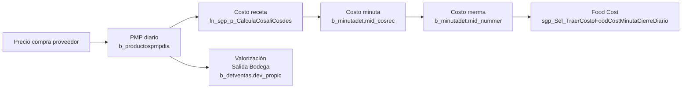

---

## 10. Reportes y Consultas

### 10.1 Inventario de Reportes

| ID | Nombre | Formulario | Tipo | Destino |
|---|---|---|---|---|
| R-001 | Requisición Resumida | I_SalBod tipo 0 | Crystal Reports | Pantalla/Impresora |
| R-002 | Requisición por Sector | I_SalBod tipo 1 | Crystal Reports | Pantalla/Impresora |
| R-003 | Requisición xEstructura Detallado | I_SalBod tipo 2 | Excel + BD | SAP/Excel |
| R-004 | Requisición xEstructura Resumido | I_SalBod tipo 3 | Crystal Reports | Pantalla/Impresora |
| R-005 | Requisición Resumen | I_SalBod tipo 4 | Crystal Reports | Pantalla/Impresora |
| R-006 | Devoluciones | I_SalBod tipo 5 | Crystal Reports | Pantalla/Impresora |
| R-007 | Requisición MenosDev | I_SalBod tipo 6 | Crystal Reports | Pantalla/Impresora |
| R-008 | Alerta Servicios Sin Comensales | I_SalBod | Excel automático | Excel |
| R-009 | Food Cost Minuta Cierre Diario | M_RCDiar | En pantalla | Pantalla |
| R-010 | Lista de precios cafetería | T_LiPrCa (Pestaña Artículos) | InforAN.bas | Pantalla/Impresora |
| R-011 | Lista de precios cafetería con composición | T_LiPrCa (Pestaña Artículos, con checkbox) | InforAN.bas | Pantalla/Impresora |
| R-012 | Composición artículo de cafetería | T_LiPrCa (Pestaña Composición) | InforAN.bas | Pantalla/Impresora |
| R-013 | Precios de venta por cliente | M_PVtaCl | Informe VB6 | Pantalla/Impresora |

### 10.2 Consultas Principales (Vistas SQL)

| Vista | Descripción | Uso |
|---|---|---|
| `Sel_FechaUltimoCierre` | Fecha del último cierre diario por casino | Control de acceso a edición |
| `Sel_Minuta_Planificada` | Minutas reales con ponderación por receta | Análisis planificación |
| `Sel_Precio_Stock_SGP` | Precios y stocks al último cierre | Valorización inventario |
| `Sel_Producto_Ingrediente_SGP` | Árbol producto → ingrediente con PMP | Análisis nutricional y costos |

### 10.3 SP de Análisis y Reportes

| SP | Descripción |
|---|---|
| `sgp_Sel_TraerCostoFoodCostMinutaCierreDiario` | Food Cost: teórico + real + vendido en tabla #TempPaso |
| `sgp_Sel_CalcularSalidaProduccionMinutaTeorica` | Compara teórico vs realizado en b_totventas (tov_tipdoc='SP') |
| `sgp_Sel_DetalleMermasCierreDiario` | Detalle de mermas para el período YYYYMM (usa pargrarnve) |
| `sgp_Sel_MermaDesconcheCierreDiario` | Datos de b_mermadesconche para el período |

---

## 11. Casos Especiales y Excepciones

### 11.1 Casinos con Sistema 5-Etapas

**Descripción:** Casinos que reciben minutas centralizadas desde una cocina central (régimen código > 9999).

**Comportamiento:**
- Las celdas de la grilla en M_MinRea se muestran en **amarillo**
- Son de **solo lectura** — el chef no puede modificarlas
- El parámetro `a_param '5etapas'` controla si el casino opera bajo este esquema

**Impacto en requisición:** La requisición se genera igualmente desde los datos de la minuta centralizada.

### 11.2 Inventario Rotativo

**Descripción:** Casinos donde el inventario físico se toma periódicamente y se usa como saldo real en lugar del calculado.

**Comportamiento en cierre:**
```sql
-- Si inventario rotativo activo:
UPDATE b_productospmpdia
SET ppd_saldo = tin_stofis  -- stock físico tomado
WHERE ppd_fecdia = @fecha AND ppd_cencos = @ceco
```

Reemplaza el saldo calculado con el stock físico del inventario tomado.

### 11.3 Días Feriados (b_Fecha_Inhabiles)

**Descripción:** Días declarados como feriados en la tabla `b_Fecha_Inhabiles`.

**Comportamiento en cierre:**
- El proceso de cierre detecta feriados dentro del período
- Para cada feriado, recalcula el PMP nuevamente
- Garantiza que el PMP del día siguiente al feriado incluya los movimientos correctos

### 11.4 Reproceso SAP (PEL)

**Descripción:** Cuando SAP envía una corrección de datos (PEL = Proceso de Enrutamiento FLMS), el sistema usa un método alternativo de cálculo de PMP.

**Comportamiento:**
- `CalcularPMPDiaSqlPEL()` reemplaza a `CalcularPMPDiaSql()`
- Procesa primero los movimientos del reproceso antes de recalcular PMP

### 11.5 Control de Stock Negativo

**En M_SalBod:**
- Si durante la generación del documento SP el stock de algún producto queda negativo:
  - Se ejecuta `ROLLBACK` de toda la transacción VB6
  - Se informa al usuario el producto y cantidad problemática
  - El documento SP no se genera

**En M_VenDir:**
- El sistema muestra en color **azul** las líneas donde la cantidad supera el stock disponible
- Permite al usuario tomar decisiones, pero no bloquea automáticamente

### 11.6 Clientes CoCo (Centro de Costo)

**Descripción:** Algunos clientes tienen configuración especial que requiere desglosar la venta por centro de costo.

**En M_VtaCon:**
- Si el cliente aparece en `b_clientecencos`, se habilita el **Tab2** (Detalle Centro Costo)
- Permite ingresar montos de venta diferenciados por sub-centro de costo

### 11.7 Receta Patrón vs Receta de Régimen

| Tipo | `mid_tiprec` | `cencos` en función costo |
|---|---|---|
| Receta Patrón | 0 | `'0'` (global) |
| Receta de Régimen | > 0 | Centro de costo específico |

La función `fn_sgp_p_CalculaCosaliCosdes` busca primero en el régimen específico y, si no encuentra, usa el patrón global (`cencos='0'`).

### 11.8 Reapertura de Cierre

**Condiciones para reabrir:**
- Solo el PC autorizado (`SvrAppCont`) puede reabrir
- Se usa el SP `sgp_Upd_ReabrirCierreDiario`
- El proceso reinicia los saldos PMP del día a cero para recálculo

> ⚠️ **Riesgo:** La reapertura de un cierre invalida todos los registros PMP del día. Si existen documentos posteriores que ya usaron el PMP calculado, pueden quedar inconsistentes. Se debe gestionar con precaución.

---

## 12. Preguntas Abiertas

> ❓ Las siguientes preguntas quedaron sin respuesta definitiva durante el análisis. Son críticas para el diseño del nuevo sistema.

| ID | Pregunta | Contexto | Impacto |
|---|---|---|---|
| Q-001 | ¿Cuál es la distinción exacta entre `min_indblo=2` (cerrado bloqueado) y `min_indblo=11` (cerrado no bloqueado)? | Ambos bloquean la edición en M_MinRea | Diseño estados workflow |
| Q-002 | ¿El código de error 3 de FLMS_SGP_IdentificaErrores fue eliminado o reservado? | Solo se documentaron 9 pero el código 3 no aparece | Validación integración |
| Q-003 | ¿Qué módulo genera la planificación teórica inicial (M_MinTeo)? ¿Tiene lógica similar a M_MinRea? | Se referencia pero no fue analizado en detalle | Módulo planificación |
| Q-004 | ¿El proceso de digitalización de la requisición (bodeguero confirma físico vs planificado) está implementado o es una propuesta? | Mencionado en sesiones como mejora deseada | Roadmap desarrollo |
| Q-005 | ¿Cuáles son los criterios exactos para que un casino tenga inventario rotativo? | Solo se mencionó la existencia de este modo | Configuración de casinos |
| Q-006 | ¿Qué es la tabla `b_minutafijadia` y cuándo se usa en lugar de la minuta real en M_SalBod? | Se referencia como fuente alternativa | Flujo salida bodega |
| Q-007 | ¿Qué SP o proceso actualiza `b_casinotipoactividades` al completar cada actividad del día? | Se verifica en cierre pero no se documentó cómo se completa | Automatización cierre |
| Q-008 | ¿Qué representa `mir_nroguia` en b_minutaraciones y desde qué módulo se genera? | Campo presente en tabla pero sin documentación | Control de raciones |
| Q-009 | ¿La tabla `b_detallelectura` corresponde a lecturas de tarjetas/vales electrónicos? ¿Qué sistema las genera? | Usada en sgp_Sel_DetalleLecturaxPeriodo | Integración terceros |
| Q-010 | ¿El parámetro `pargrarnve` (gramos por ración no vendida) es fijo por casino o varía por receta? | Usado en sgp_Sel_MermaPorPreparacion | Cálculo mermas RNV |
| Q-011 | ¿Qué ocurre con los documentos tipo ME (Merma) y SE/DE en el correlativo de b_parametros? | Se mencionan tipdoc SP/DP/ME/SE/DE | Tipos documentos |
| Q-012 | ¿El proceso `FLMS_SGP_ValidaRacionesNoVendidas` es parte del cierre diario o un proceso independiente? | Referenciado en FLMS pero sin flujo claro | Integración FLMS |
| Q-013 | ¿Existe un proceso para sincronizar la planificación teórica con cambios de última hora antes de producción? | Gap identificado en sesiones | Workflow planificación |
| Q-014 | ¿Cómo se maneja el control de versiones de la planificación cuando un chef cambia la minuta real después de generada la requisición? | La requisición tipo 2 se genera puntualmente | Consistencia datos |

---

## 13. Glosario

| Término | Definición |
|---|---|
| **Ceco / Centro de Costo** | Identificador único de cada casino operado por Sodexo Chile. Corresponde al código del contrato. |
| **Régimen** | Clasificación del tipo de alimentación dentro de un casino (ej: régimen normal, régimen hipercalórico). Código ≤ 9999 = local/patrón. Código > 9999 = centralizado. |
| **Servicio** | Tiempo de comida dentro de un régimen: desayuno, almuerzo, once, cena, etc. |
| **Minuta** | Planificación del menú para un día específico, régimen y servicio. Puede ser teórica (tipmin='1') o real (tipmin='2'). |
| **Minuta Teórica** | Planificación inicial del menú, hecha con un mes de anticipación. Sirve como base para la real. |
| **Minuta Real** | Planificación ajustada por el chef antes de la producción del día. |
| **Raciones** | Número de porciones a servir. Hay tres niveles: planificadas, producidas y vendidas. |
| **PMP** | Precio Medio Ponderado. Método de valorización de inventario calculado diariamente en el cierre. |
| **SP (Salida Producción)** | Documento que registra la salida de mercaderías desde bodega hacia cocina. |
| **DP (Devolución Producción)** | Documento que registra el retorno de mercaderías no utilizadas desde cocina a bodega. |
| **ME (Merma)** | Documento o registro de pérdida de materias primas durante el proceso productivo. |
| **5-Etapas** | Sistema de producción centralizado donde una cocina central prepara y distribuye a varios casinos. Los regímenes tienen código > 9999. |
| **Facing** | Factor de conversión que representa la cantidad de producto por unidad de empaque/presentación. |
| **Merma por Preparación** | Pérdida de materia prima durante el proceso de cocción/preparación, medida en raciones o kilogramos. |
| **Desconche** | Tipo específico de merma correspondiente a restos de alimentos después del servicio. |
| **RNV** | Raciones No Vendidas. Corresponde a raciones producidas pero no consumidas por comensales. |
| **Food Cost** | Porcentaje del costo de alimentos sobre el total de ventas. Indicador clave de gestión. |
| **FLMS** | Sistema logístico externo (SAP) que envía movimientos de bodega al SGP LOCAL para su integración. |
| **CoCo** | Cliente con configuración de "Centro de Costo" que requiere desglose de ventas por sub-unidad. |
| **ciediario** | Parámetro de a_param que almacena encriptada la fecha del último cierre diario. |
| **parcomdia** | Parámetro de a_param que almacena encriptado el password para editar la fila PRODUCIDAS. |
| **SvrAppCont** | Parámetro de a_param con el nombre del PC autorizado para ejecutar el cierre diario. |
| **addreceta** | Parámetro de a_param que limita el número de recetas adicionales por día en la planificación. |
| **pargrarnve** | Parámetro de a_param con los gramos por ración no vendida para cálculo de merma RNV. |
| **InvBlo (indblo)** | Indicador de bloqueo de una minuta: 0=abierta, 2=cerrada bloqueada, 11=cerrada no bloqueada. |
| **vaSpread1** | Componente de grilla (FarPoint Spread) utilizado en los formularios VB6 para mostrar datos tabulares interactivos. |
| **fpText / fpLongInteger / fpDoubleSingle** | Controles de entrada de datos del componente FarPoint usado en VB6. |
| **SSTab** | Control de pestañas (tabs) de Sheridan Software usado en los formularios VB6. |
| **Crystal Reports** | Motor de reportes utilizado para generar los informes de requisición e inventario. |
| **BeginTrans / CommitTrans / RollbackTrans** | Métodos de control de transacciones en ADO/DAO desde VB6. |
| **SET XACT_ABORT ON** | Instrucción SQL Server que hace que la transacción se revierta automáticamente ante cualquier error. |
| **sp_xml_preparedocument** | SP del sistema SQL Server que parsea un documento XML y retorna un handle para su procesamiento. |
| **tin_stofis** | Campo que representa el stock físico tomado en un inventario físico rotativo. |
| **ppd_fecdia** | Fecha del día de cálculo del PMP en formato entero YYYYMMDD. |
| **mid_tipmin** | Tipo de minuta en b_minutadet: '1'=teórica, '2'=real. |
| **red_canpro** | Cantidad de producto por receta en b_recetadet (gramaje). |
| **pro_facing** | Factor de empaque/presentación del producto en b_productos. |

---

*Documento generado en febrero de 2026 a partir del análisis del código fuente VB6 (553 archivos), base de datos SQL Server (39.776 líneas), manual de usuario v.226 y sesiones de levantamiento funcional (diciembre 2025 - enero 2026).*

*Para consultas sobre este documento, contactar al equipo de análisis del proyecto SGP-Producción.*
