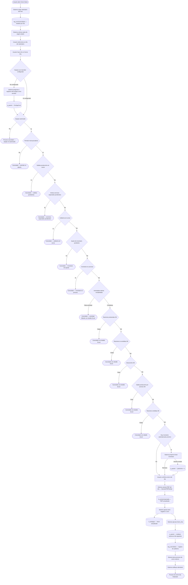
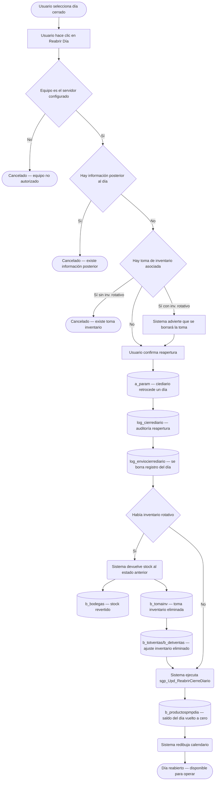

# Cierre Diario

**Formulario VB6:** `M_RCDiar.frm`
**Tabla(s) principal(es):** `a_param` (parámetros de configuración del sistema, incluye la fecha de cierre y el PC servidor), `log_enviocierrediario` (registro de estados del cierre diario por día), `log_cierrediario` (auditoría de operaciones de cierre y reapertura), `b_productospmpdia` (tabla de precios medios ponderados por día y producto)
**SP principal:** `sgp_Upd_ReabrirCierreDiario` — procedimiento de reapertura del día; `sgp_Sel_EnviarMensajeInventarioCalendarizado` — verificación de inventarios programados próximos al cierre; rutina interna `CierrePeriodo` con más de 20 índices de validación

---

## Contexto

El Cierre Diario es la operación que marca el fin de un día operativo en el casino. Una vez ejecutado, el sistema avanza su contador interno de fecha activa al día siguiente, dejando el día cerrado como histórico inamovible. Todos los módulos de producción —planificación, salidas, mermas, raciones, ventas y cafetería— dependen de que el día esté abierto para registrar información; el cierre bloquea esas operaciones para la fecha procesada.

Este formulario pertenece a la etapa final del flujo diario del casino. Para poder cerrar un día se debe haber completado previamente: las salidas a producción, el registro de raciones vendidas y producidas, las mermas, las ventas de cafetería y servicios especiales, y en algunos casos la toma de inventario. El formulario actúa como punto de control que verifica todas esas condiciones antes de ejecutar el proceso.

Visualmente el formulario presenta un calendario mensual donde cada día aparece coloreado según su estado: días habilitados (pendientes de cierre), días cerrados y no enviados, y días cerrados y enviados. El usuario selecciona un día en el calendario y utiliza los botones de la barra de herramientas para Cerrar el día o Reabrirlo. También incluye un botón especial para desactivar el proceso de toma de inventario en curso cuando corresponde. El formulario no tiene pestañas: toda la interacción ocurre sobre un único panel.

---

## Parámetros de Entrada

El formulario no requiere que el usuario complete campos antes de operar. Al abrirse carga automáticamente el calendario del mes actual. El único campo de selección es el mes y año que el usuario puede ajustar para consultar otros meses.

| Campo | Descripción | Obligatorio |
|---|---|---|
| Mes / Año | Selector de mes en formato MM/AAAA. Determina qué mes se muestra en el calendario. Por defecto muestra el mes en curso. | Sí (cargado automáticamente) |

---

## Estructura de la Grilla (Calendario Mensual)

El calendario ocupa la parte central del formulario. Está organizado como una cuadrícula de 6 filas por 7 columnas visibles (una semana por fila, un día de la semana por columna). Las columnas visibles van de lunes a domingo. Cada celda muestra el número del día del mes.

| Col | Nombre visible | Origen | Editable | Visible | Calculado | Observaciones |
|---|---|---|---|---|---|---|
| 1 | Lunes | Calculado dinámicamente por el sistema | No | Sí | Sí | Muestra el número de día si corresponde a lunes en esa semana |
| 2 | Martes | Calculado dinámicamente | No | Sí | Sí | Ídem martes |
| 3 | Miércoles | Calculado dinámicamente | No | Sí | Sí | Ídem miércoles |
| 4 | Jueves | Calculado dinámicamente | No | Sí | Sí | Ídem jueves |
| 5 | Viernes | Calculado dinámicamente | No | Sí | Sí | Ídem viernes |
| 6 | Sábado | Calculado dinámicamente | No | Sí | Sí | Ídem sábado |
| 7 | Domingo | Calculado dinámicamente | No | Sí | Sí | Ídem domingo |
| 8–14 | (internas) | `log_enviocierrediario.fecsub` | No | No | No | Columnas ocultas. Guardan la fecha de envío para mostrarla en el tooltip al pasar el cursor sobre cada día |

##### Cálculo — Color de fondo de cada día

El color de fondo de cada celda del calendario es el indicador de estado del día. No se obtiene directamente de un campo almacenado; el sistema lo determina en el momento de dibujar el calendario cruzando la fecha del día con la fecha de cierre activa del sistema y los registros de la tabla `log_enviocierrediario`.

**Origen del cálculo:** Subconsulta / cruce de tablas

**Lógica:**

1. Si la fecha del día es igual o posterior a la fecha de cierre activa del sistema → el día está **habilitado** (pendiente de cerrar) y se muestra en color celeste claro.
2. Si la fecha del día es anterior a la fecha de cierre activa Y existe un registro en `log_enviocierrediario` con estado `estenv = '0'` → el día está **cerrado pero no enviado** a los sistemas centrales, y se muestra en color salmón/naranja.
3. Si la fecha del día es anterior a la fecha de cierre activa Y existe un registro en `log_enviocierrediario` con `estenv` distinto de `'0'` → el día está **cerrado y enviado**, y se muestra en color verde.
4. Si la celda no corresponde a ningún día del mes (por ejemplo las celdas vacías al inicio del mes) → queda sin contenido y sin color significativo.

| Componente | Descripción | Origen |
|---|---|---|
| Fecha de cierre activa del sistema | Indica hasta qué fecha el sistema ha cerrado días | `a_param.par_valor` donde `par_codigo = 'ciediario'`, desencriptada por la función del sistema |
| Estado de envío del día | Indica si el día fue enviado a sistemas externos | `log_enviocierrediario.estenv` |
| Fecha de envío | Fecha en que se realizó el envío | `log_enviocierrediario.fecsub` |

> Ejemplo: Si hoy es 13/03/2026 y el sistema tiene como fecha activa el 13/03/2026, los días del 1 al 12 de marzo aparecerán coloreados (según si fueron enviados o no), y el 13 aparecerá en celeste (habilitado para cerrar).

##### Cálculo — Tooltip de cada día

Al pasar el cursor sobre un día del calendario, el sistema muestra un pequeño globo de texto indicando el número del día y, si el día está cerrado, si fue enviado o no y cuándo.

**Origen del cálculo:** Columnas internas de la grilla (columnas 8 a 14)

**Lógica:** El sistema lee la celda visible (columna 1–7) para obtener el número del día y la celda oculta correspondiente (columna+7) para obtener la fecha de envío almacenada durante el proceso de cierre.

---

## Operaciones Disponibles

| Botón | Acción |
|---|---|
| **Cerrar Día** | Ejecuta el proceso completo de cierre del día seleccionado en el calendario. El sistema verifica entre 10 y 15 condiciones previas, calcula el Precio Medio Ponderado (PMP) del día, avanza la fecha activa del sistema al día siguiente y registra el evento en el log. Disponible solo cuando el día seleccionado coincide con la fecha activa del sistema y está en estado habilitado. |
| **Reabrir Día** | Revierte el cierre del último día cerrado. Retrocede la fecha activa del sistema al día anterior, elimina los registros de envío correspondientes y —si existe una toma de inventario rotativo— la borra y devuelve el stock a su estado previo. Disponible únicamente sobre el día inmediatamente anterior a la fecha activa. |
| **Desactivar proceso de inventario** | Cancela una toma de inventario que quedó marcada como "en proceso" (por ejemplo si el usuario respondió "sí" a la propuesta de tomar inventario pero no completó el proceso). Solo se activa cuando hay un inventario en proceso pendiente de completar y el usuario opera desde el PC configurado como servidor. |
| **Actualizar** | Redibuja el calendario consultando nuevamente la base de datos. Útil si otro usuario realizó operaciones desde otro equipo. |
| **Cerrar** | Cierra el formulario y regresa al menú principal. |

---

## Validaciones

### Al intentar Cerrar el Día

| # | Momento | Condición | Resultado |
|---|---|---|---|
| 1 | Antes de iniciar | El equipo desde el que opera el usuario no está configurado como PC servidor del casino | El sistema pregunta si se desea designar este equipo como servidor. Si el usuario acepta, registra el nombre del equipo. Si el nombre de servidor ya estaba configurado y es diferente al equipo actual, cancela con el mensaje "Debe realizar el cierre diario en el computador configurado como Servidor..." |
| 2 | Selección de día | El día seleccionado en el calendario tiene color de "bloqueado" (ya fue cerrado) | El sistema muestra "Día Bloqueado" y no continúa |
| 3 | Selección de día | El día seleccionado no corresponde a la fecha activa del sistema | El sistema muestra "Día no corresponde al cierre diario" y cancela |
| 4 | Verificación de período | El período mensual contable no está abierto en la base de datos | El sistema muestra "No ha cerrado periodo anterior..." y cancela |
| 5 | Verificación de salidas | Existen documentos de salida a producción en estado pendiente para ese día | El sistema muestra "Existen documentos pendientes en la salida producción. Debe cerrar las salidas" y cancela |
| 6 | Verificación de servicios especiales | Existen ventas de servicios especiales sin cerrar | El sistema muestra "Existen documentos pendientes en las ventas servicios especiales" y cancela |
| 7 | Verificación de cafetería | Existen ventas de cafetería sin estado de cierre | El sistema muestra "Existen ventas cafetería sin cerrar" y cancela |
| 8 | Verificación de inventario | Existe una toma de inventario pendiente de ajuste desde el último inventario | El sistema muestra "No ha realizado el ajuste correspondiente a la última toma de inventario" y cancela |
| 9 | Verificación de inventario en proceso | El parámetro de toma de inventario en curso está activado | El sistema muestra "Existe un inventario en proceso..." y cancela |
| 10 | Verificación de raciones producidas | Hay servicios con planificación real que no tienen raciones producidas registradas | El sistema muestra un mensaje de advertencia, genera un archivo Excel con el detalle de los servicios faltantes y cancela (o advierte según la configuración del casino) |
| 11 | Verificación de raciones no vendidas | Hay servicios que no tienen registradas las raciones no vendidas | El sistema muestra "Falta ingresar raciones no vendidas" con detalle en archivo Excel y cancela |
| 12 | Verificación de desconche | Hay servicios sin registro de desconche en raciones no vendidas | El sistema muestra "Falta ingresar desconche" con detalle en archivo Excel y cancela |
| 13 | Verificación de salida producción por servicio | Hay servicios preferidos que no registran salida a producción | El sistema muestra "Falta ingresar salida producción" con detalle en archivo Excel y cancela |
| 14 | Verificación de raciones vendidas | Hay clientes (regímenes/servicios) sin raciones vendidas registradas | El sistema muestra "Falta ingresar raciones vendidas (Control de raciones)" con detalle en archivo Excel y cancela |
| 15 | Verificación de actividades por tipo | El casino tiene configuradas actividades obligatorias diarias (documentos de proveedor, devoluciones, mermas, cafetería, venta directa, inventario rotativo) que no se completaron | Mensaje específico por tipo de actividad faltante; en algunos casos genera archivo Excel con el detalle |
| 16 | Confirmación final | Ninguna condición anterior falló | El sistema solicita confirmación al usuario: "Para ejecutar este proceso, todos los otros equipos con SGP no deben estar utilizando ninguna funcionalidad del sistema. ¿Está seguro de cerrar el día?" |

### Al intentar Reabrir el Día

| # | Momento | Condición | Resultado |
|---|---|---|---|
| 1 | Antes de iniciar | El equipo no está configurado como servidor | Misma validación que en Cerrar Día |
| 2 | Selección de día | El día seleccionado no es el último día cerrado ni la fecha activa del sistema | El sistema muestra "Día no corresponde al cierre diario" y cancela |
| 3 | Verificación posterior | Existen registros en ventas, compras o inventario con fecha posterior al día que se quiere reabrir | El sistema muestra "Existe información posterior, proceso cancelado" |
| 4 | Verificación de inventario | Existe una toma de inventario asociada al día (inventario rotativo) | Si no hay inventario rotativo configurado, el sistema cancela con "Existe una toma inventario, proceso cancelado". Si hay inventario rotativo, advierte que al reabrir se borrará la toma. |
| 5 | Verificación de inventario en proceso | El parámetro de inventario en proceso está activo | El sistema muestra "Existe un inventario en proceso..." y cancela |
| 6 | Confirmación final | El usuario acepta la advertencia de borrado de inventario (si aplica) | El sistema solicita "¿Está Seguro Reabrir Día?" antes de proceder |

---

## Flujo de Datos

### Cerrar Día

### Reabrir Día

---

## Dónde se Almacena

### Parámetros del sistema (`a_param`)

| Campo | Descripción |
|---|---|
| `par_codigo` | Código del parámetro. Los más relevantes son: `ciediario` (fecha de cierre activa), `SvrAppCont` (nombre del PC servidor autorizado), `partominv` (indicador de toma de inventario en proceso: `'0'` = inactivo, `'1'` = activo) |
| `par_nombre` | Nombre descriptivo del parámetro |
| `par_tipo` | Tipo del valor: `'C'` para texto, otro para numérico |
| `par_valor` | Valor del parámetro. Para `ciediario` el valor está cifrado con la función de encriptación del sistema |
| `par_cencos` | Centro de costo (casino) al que pertenece el parámetro |

**Clave primaria:** La combinación de `par_codigo` + `par_cencos` identifica unívocamente un parámetro dentro de un casino.

---

### Registro de envío de cierre diario (`log_enviocierrediario`)

| Campo | Descripción |
|---|---|
| `cencos` | Casino al que corresponde el registro |
| `fecha` | Fecha del día cerrado en formato AAAAMMDD |
| `estenv` | Estado de envío: `'0'` = cerrado pero no enviado a sistemas externos, `'1'` = cerrado y enviado |
| `fecsub` | Fecha y hora en que se realizó el envío a los sistemas externos. Vacío si aún no se envió |

**Clave primaria:** La combinación de `cencos` + `fecha` identifica el estado de cierre y envío de un día específico en un casino.

---

### Auditoría de cierre diario (`log_cierrediario`)

| Campo | Descripción |
|---|---|
| Fecha-hora | Marca de tiempo de cuando se realizó la operación |
| Fecha operada | Día al que corresponde la operación (cierre o reapertura) |
| Usuario | Nombre del usuario que ejecutó la operación |
| Tipo operación | Descripción del tipo: `'2.- Reabrir Día'` para reaperturas; en cierres registra el tipo de cierre |
| Casino | Centro de costo al que pertenece el registro |

**Clave primaria:** No hay clave única definida explícitamente; el registro es acumulativo (log de auditoría) y se identifican los eventos por la combinación fecha-hora + casino + usuario.

---

### Precios medios ponderados por día (`b_productospmpdia`)

| Campo | Descripción |
|---|---|
| `ppd_cencos` | Casino al que pertenece el registro |
| `ppd_codpro` | Código del producto |
| `ppd_fecdia` | Fecha del día de cierre en formato AAAAMMDD |
| `ppd_propon` | Precio de costo promedio del producto para ese día (PMP calculado) |
| `ppd_saldo` | Cantidad en stock del producto al cierre del día. Si hubo toma de inventario rotativo, se actualiza con el stock físico real |
| `ppd_upreco` | Último precio de recibo (precio unitario de la última entrada) |
| `ppd_fecuco` | Fecha del último costo registrado |

**Clave primaria:** La combinación de `ppd_cencos` + `ppd_codpro` + `ppd_fecdia` identifica el PMP de un producto en un día específico para un casino.

---

## SP / Funciones Referenciados

### `sgp_Upd_ReabrirCierreDiario` — Reinicializa los datos de PMP del día al reabrir

**Parámetros de entrada:**

| Parámetro | Descripción |
|---|---|
| `@Ceco` | Código del casino (centro de costo) |
| `@FecDia` | Fecha del día que se reabre, en formato numérico AAAAMMDD |

**Lógica principal:**
Al reabrir un día, el SP borra los datos de costo calculados durante el cierre. Primero pone en cero el saldo de todos los productos para ese día en la tabla de precios por día. Luego elimina los registros que tenían precio cero y saldo cero (que corresponden a productos sin actividad). Finalmente reinsertar los productos del casino con precio cero y saldo cero, dejando la tabla limpia y lista para que el sistema vuelva a calcular el PMP cuando se realice el cierre nuevamente.

**Tablas que modifica:** `b_productospmpdia`

---

### `sgp_Sel_EnviarMensajeInventarioCalendarizado` — Detecta si hay un inventario programado próximo a la fecha de cierre

**Parámetros de entrada:**

| Parámetro | Descripción |
|---|---|
| `@Ceco` | Código del casino |
| `@Fecha` | Fecha de cierre actual en formato numérico AAAAMMDD |

**Lógica principal:**
Consulta si el casino tiene un inventario calendarizado (programado por el área de administración) cuya ventana de realización incluya la fecha de cierre actual. La ventana se define como la fecha exacta del inventario más un margen de días antes y días después configurados en la base de datos. Retorna una indicación de si la fecha actual cae "antes", "hoy" o "después" de la fecha objetivo del inventario, para que el sistema muestre al usuario el mensaje de aviso correspondiente.

**Tablas que consulta:** `b_casinoinventariocalendarizado`, `b_casinodiasholgurainvcalendarizado`, `b_clientes`

---

### `sgp_Sel_Param` — Consulta un parámetro de configuración del sistema

**Parámetros de entrada:**

| Parámetro | Descripción |
|---|---|
| `@Aux` | Modo de consulta (1: busca por código exacto, 2: trae un conjunto predefinido de parámetros de módulo, 3: verifica si el valor es 'S', 4: busca por valor en lista) |
| `@Ceco` | Casino |
| `@Codigo` | Código del parámetro a consultar |

**Lógica principal:**
Retorna el valor, tipo y nombre de un parámetro de configuración. En el formulario de cierre se usa principalmente para verificar el nombre del PC servidor (`SvrAppCont`) y para consultar si el casino tiene activada cierta funcionalidad de control de raciones.

**Tablas que consulta:** `a_param`

---

### `sgp_Ins_Param` — Registra un nuevo parámetro de configuración

**Parámetros de entrada:**

| Parámetro | Descripción |
|---|---|
| `@Codigo` | Código del parámetro |
| `@Nombre` | Nombre descriptivo |
| `@Tipo` | Tipo: `'C'` para texto |
| `@Valor` | Valor a guardar |
| `@Ceco` | Casino |

**Lógica principal:**
Se usa en el formulario de cierre cuando el PC servidor aún no está registrado: inserta por primera vez el parámetro `SvrAppCont` con el nombre del equipo actual.

**Tablas que modifica:** `a_param`

---

### `sgp_Upd_Param` — Actualiza el valor de un parámetro de configuración existente

**Parámetros de entrada:**

| Parámetro | Descripción |
|---|---|
| `@Aux` | Modo: 1 = actualiza por código y casino, 2 = actualiza solo por código |
| `@Ceco` | Casino |
| `@Codigo` | Código del parámetro |
| `@Nombre` | No se usa en este formulario |
| `@Tipo` | No se usa en este formulario |
| `@Valor` | Nuevo valor |

**Lógica principal:**
Se usa para actualizar el nombre del PC servidor cuando ya existe un valor previo en el parámetro `SvrAppCont`.

**Tablas que modifica:** `a_param`

---

### `CierrePeriodo` (función interna del sistema) — Motor de validaciones previas al cierre

Esta función es el corazón del proceso de cierre. Recibe una fecha, un código de bodega y un número de índice que indica qué validación ejecutar. Retorna verdadero si la condición impide el cierre, falso si todo está en orden.

Las validaciones utilizadas específicamente por el formulario de Cierre Diario son:

| Índice | Qué valida |
|---|---|
| 0 | El período mensual contable está abierto para la fecha indicada |
| 2 | Existen ventas, compras o inventarios con fecha posterior al día que se quiere reabrir |
| 4 | Existe una toma de inventario para la fecha indicada |
| 8 | La última toma de inventario tiene diferencia entre stock físico y stock del sistema sin ajuste |
| 14 | Existen documentos de salida a producción en estado pendiente para el día |
| 15 | Existen ventas de cafetería sin estado de cierre |
| 17 | No se ingresaron documentos de proveedor para el día (cuando el casino lo exige) |
| 18 | No se completaron salidas a producción para todos los servicios (genera Excel con detalle) |
| 19 | No se registraron devoluciones a bodega (cuando el casino lo exige) |
| 20 | No se registraron mermas (cuando el casino lo exige) |
| 21 | Falta registrar raciones no vendidas para algún régimen/servicio |
| 23 | No se registraron ventas de cafetería (cuando el casino lo exige) |
| 25 | No se registraron ventas directas (cuando el casino lo exige) |
| 26 | El inventario rotativo no fue tomado (cuando el casino lo exige) |
| 27 | El casino tiene configurada la actividad tipo 10 (inventario rotativo en actividades) |
| 28 | La fecha de cierre corresponde a un día feriado |
| 29 | La fecha es el último día del período mensual |
| 30 | Existe una toma de inventario para la fecha |
| 31 | El período del día feriado coincide con el período mensual activo |
| 36 | Faltan raciones producidas (muestra Excel con servicios faltantes, con opción de continuar igual) |
| 37 | Existen servicios sin precios de venta ajustados (genera Excel con detalle, es advertencia) |
| 38 | El parámetro de toma de inventario en proceso está activado |
| 39 | Hay un inventario calendarizado vencido sin procesar |
| 41 | La fecha de cierre es fin de mes |
| 42 | El parámetro de toma de inventario está activo y no se completó la toma |
| 43 | Faltan raciones producidas en servicios preferidos (cancela con Excel) |
| 44 | Faltan raciones vendidas para clientes con planificación (cancela con Excel) |
| 46 | Existen ventas de servicios especiales en estado pendiente |
| 47 | Faltan raciones no vendidas en servicios preferidos (cancela con Excel) |
| 50 | Falta registrar desconche en raciones no vendidas de servicios preferidos (cancela con Excel) |
| 51 | Faltan salidas a producción en servicios preferidos (cancela con Excel) |

**Tablas que consulta:** `b_cierreperiodo`, `b_totventas`, `b_totcompras`, `b_tomainv`, `b_totventascaf`, `b_totventaserviciosespeciales`, `b_minuta`, `b_minutadet`, `b_minutaraciones`, `b_Fecha_Inhabiles`, `b_casinotipoactividades`, `a_param`, `b_ventacontado`

---

### `CalcularPMPDiaSql` (función interna del sistema) — Calcula el Precio Medio Ponderado del día

Esta función ejecuta el recálculo completo del PMP para todos los productos del casino al momento del cierre. El PMP es el costo promedio ponderado que resulta de combinar el stock anterior con las entradas del día. La función actualiza la tabla `b_productospmpdia` y `b_bodegas` con los nuevos costos calculados.

Existen dos variantes:
- `CalcularPMPDiaSql`: Cálculo estándar para días sin integración PEL (integración de facturación SAP).
- `CalcularPMPDiaSqlPEL`: Se usa cuando existe una factura en `Log_FacturaSAP` con fecha anterior a la de cierre, lo que indica que debe reprocesar días anteriores antes del cálculo normal.

**Tablas principales que modifica:** `b_productospmpdia`, `b_bodegas`

---

### `ValidaPCServidor` (función interna del sistema) — Verifica que el equipo actual es el servidor autorizado

Compara el nombre del equipo actual con el valor almacenado en el parámetro `SvrAppCont`. Retorna verdadero si coinciden, falso en caso contrario. Se usa antes de cualquier operación de cierre o reapertura.

---

### `ValidarInventarioRotativo` (función interna del sistema) — Verifica si el casino opera con inventario rotativo diario

Consulta si el casino tiene configurado el stock diario o la actividad tipo 10 (toma de inventario rotativo). Si retorna verdadero, el proceso de cierre y reapertura incluye pasos adicionales relacionados con la toma de inventario.

**Tablas que consulta:** `b_casinotipoactividades`, `b_casinometodostock`

---

## Relación con Otros Módulos

| Módulo | Relación |
|---|---|
| **Planificación Real (Minuta Real)** | Prerequisito: debe existir la minuta real del día con raciones planificadas antes del cierre. El sistema verifica que los servicios preferidos tengan raciones producidas y raciones no vendidas registradas |
| **Salida a Producción** | Prerequisito: todos los documentos de salida del día deben estar en estado cerrado (no pendiente). El cierre bloquea si hay salidas abiertas |
| **Ventas Cafetería** | Prerequisito: las ventas de cafetería deben estar cerradas para el día |
| **Ventas Servicios Especiales** | Prerequisito: los documentos de servicios especiales deben estar cerrados |
| **Control de Raciones** | Prerequisito: deben existir registros de raciones vendidas para todos los clientes activos con planificación |
| **Raciones no Vendidas** | Prerequisito: debe registrarse la información de raciones no vendidas y desconche para servicios preferidos |
| **Mermas** | Prerequisito opcional (según configuración del casino): deben existir registros de merma para el día |
| **Toma de Inventario** | El cierre puede disparar una toma de inventario si el casino lo tiene calendarizado. Al reabrir un día con inventario rotativo, el sistema elimina la toma y revierte el stock |
| **Cierre de Período Mensual** | El cierre diario solo opera dentro de un período mensual abierto. El cierre del último día del mes habilita el proceso de cierre de período mensual |
| **FLMS / Envío externo** | Al completar el cierre, el sistema lanza automáticamente el proceso de envío de datos a los sistemas externos de Sodexo (proceso `sgpsdx.exe`). Los días aparecen en el calendario como "enviados" o "no enviados" según el resultado |
| **Documentos de Proveedor** | Prerequisito opcional: si el casino tiene activada la actividad de documentos de proveedor, debe existir al menos un documento registrado en el día antes del cierre |

---

*Fuentes: `M_RCDiar.frm`, `Rutinas.bas` (función `CierrePeriodo`, `CalcularPMPDiaSql`, `CalcularPMPDiaSqlPEL`, `CalcularPMPDiaAccess`), `RutinasI.bas` (funciones `ValidaPCServidor`, `ValidarInventarioRotativo`), procedimientos `sgp_Upd_ReabrirCierreDiario`, `sgp_Sel_EnviarMensajeInventarioCalendarizado`, `sgp_Sel_Param`, `sgp_Ins_Param`, `sgp_Upd_Param` en `SGP_Local.sql`, tablas `a_param`, `log_enviocierrediario`, `log_cierrediario`, `b_productospmpdia`, `b_bodegas`, `b_cierreperiodo` en `SGP_Local.sql`*
