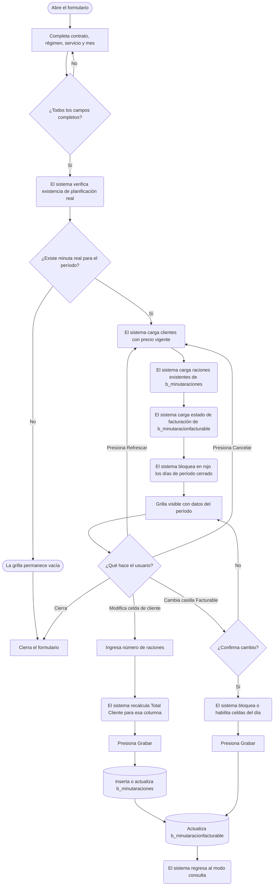
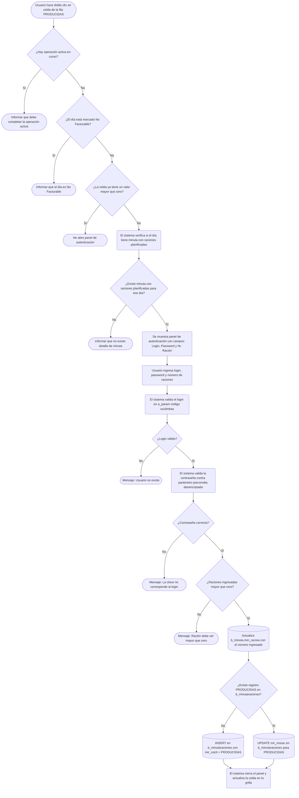
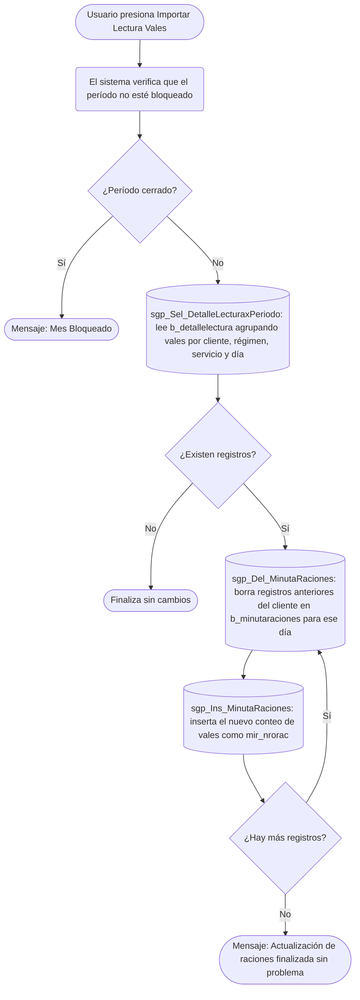

# Control de Raciones

**Formulario VB6:** `M_ConRac.frm`
**Tabla(s) principal(es):** `b_minutaraciones` (raciones por cliente y día), `b_minutaracionfacturable` (estado de facturabilidad por día), `b_minuta` (cabecera de planificación de minuta)
**SP principal:** `sgp_Ins_MinutaRacionFacturable`, `sgp_Del_MinutaRacionFacturable`, `sgp_Ins_MinutaRaciones`, `sgp_Del_MinutaRaciones`, `sgp_Sel_MinutaRacionesFacturable`, `sgp_Sel_MinutaconcomensalesCeroConRac`, `sgp_Sel_DetalleLecturaxPeriodo`

---

## Contexto

El formulario de Control de Raciones permite registrar y gestionar cuántos comensales consumieron cada servicio de alimentación durante el mes, diferenciando entre los distintos tipos de clientes del casino (empresas o grupos contratantes), el personal del casino y las raciones efectivamente producidas. Es la pantalla central donde el jefe o encargado del casino fija la cantidad real de raciones servidas por día, por régimen y por servicio, para cada contrato vigente durante el período.

Este formulario se ubica en la etapa posterior a la planificación de la minuta real: antes de poder ingresar raciones, debe existir una minuta de tipo real (`mid_tipmin = '2'`) para el período seleccionado. Los datos que se registran aquí sirven de base para el cierre mensual, la facturación a los clientes y el seguimiento de producción versus venta.

La pantalla se organiza en dos paneles. El superior reúne los campos de contexto: contrato, régimen, servicio y mes de la minuta. El inferior contiene una grilla matricial donde cada fila es un tipo de comensal (cliente, personal, muestra de referencia, producidas) y cada columna es un día del mes. Al abrirse, la grilla permanece vacía hasta que el usuario complete todos los filtros y el sistema cargue los datos existentes. Los días que pertenecen a un período ya cerrado se bloquean visualmente (en rojo) y no admiten modificación.

---

## Parámetros de Entrada

| Campo | Descripción | Obligatorio |
|---|---|---|
| Contrato | Código del casino o contrato para el cual se gestionan las raciones. Se puede escribir directamente o buscar mediante el ícono de búsqueda. | Sí |
| Régimen | Código numérico del régimen dietético (por ejemplo, régimen general, dieta blanda, etc.). Se puede escribir directamente o buscar mediante el ícono de búsqueda. | Sí |
| Servicio | Código numérico del servicio dentro del régimen (por ejemplo, desayuno, almuerzo, cena). Se puede escribir directamente o buscar mediante el ícono de búsqueda. | Sí |
| Fecha Minuta | Mes y año del período a trabajar, en formato `mm/yyyy`. El sistema lo inicializa con el mes actual al abrir el formulario. | Sí |

Una vez completados todos los campos, la grilla se carga automáticamente con los datos existentes. Si alguno de los campos está vacío, la grilla se mantiene sin datos.

---

## Estructura de la Grilla

La grilla es matricial: las filas representan los tipos de comensales y las columnas representan los días del período seleccionado. Los dos primeros encabezados de columna muestran el código y nombre del comensal; a partir de la tercera columna aparecen los días del mes, con su nombre de día abreviado y la fecha completa.

El período puede comenzar desde el día de cierre del mes anterior (si el contrato tiene configurado un día de cierre distinto al 1) y termina en el último día del mes seleccionado.

### Fila de encabezado de facturación (fila 1 de la grilla)

Esta fila especial no corresponde a un tipo de comensal sino al estado de facturación del día. Cada celda muestra una casilla de verificación con la leyenda "Facturable" o "No Facturable". Controla si las raciones del día se incluyen o excluyen del proceso de facturación al cliente.

| Col | Nombre | Origen | Editable | Visible | Calculado | Observaciones |
|---|---|---|---|---|---|---|
| 1 | — | Vacío | No | Sí | No | Columna de identificador, vacía en la fila de encabezado de facturación |
| 2 | — | Vacío | No | Sí | No | Columna de nombre, vacía en la fila de encabezado de facturación |
| 3 en adelante | Facturable / No Facturable | `b_minutaracionfacturable.mrf_facturado` | Sí (casilla de verificación) | Sí | No | Un casillero por cada día del período |

### Filas de clientes (tipo comensal = empresa contratante)

Cada empresa con precio de venta vigente para el período aparece como una fila independiente. El usuario ingresa cuántas raciones consumió esa empresa en cada día.

| Col | Nombre | Origen | Editable | Visible | Calculado | Observaciones |
|---|---|---|---|---|---|---|
| 1 | RUT del cliente | `b_clientes.cli_codigo` (formateado) | No | Sí | No | Muestra el RUT con formato visual (guion y dígito verificador) |
| 2 | Nombre del cliente | `b_clientes.cli_nombre` | No | Sí | No | Nombre completo del contrato |
| 3 en adelante | Número de raciones | `b_minutaraciones.mir_nrorac` | Sí | Sí | No | Raciones del cliente para ese día; 0 o vacío si no hubo consumo. Si el día ya fue integrado desde SPRS, la celda queda bloqueada |

### Fila "Total Cliente"

Fila automática de totales que suma las raciones de todos los clientes para cada día. No es editable.

| Col | Nombre | Origen | Editable | Visible | Calculado | Observaciones |
|---|---|---|---|---|---|---|
| 2 | "Total Cliente" | Calculado | No | Sí | Sí | Etiqueta fija |
| 3 en adelante | Suma de raciones | Calculado en pantalla | No | Sí | Sí | Suma de todas las filas de clientes para ese día |

##### Cálculo — Suma de raciones (fila Total Cliente)

El total de raciones de una columna de día se obtiene sumando las cantidades ingresadas en todas las filas de clientes para ese mismo día. Este total se recalcula automáticamente cada vez que el usuario modifica el valor de alguna celda de cliente en esa columna.

**Origen del cálculo:** Fórmula aritmética

**Fórmula o lógica:**
Total del día = Suma de `mir_nrorac` de todos los clientes para ese día

| Componente | Descripción | Origen |
|---|---|---|
| `mir_nrorac` | Raciones registradas para cada cliente en un día específico | `b_minutaraciones.mir_nrorac` |

> Ejemplo: Si el día 15 tiene tres clientes con 120, 45 y 30 raciones respectivamente, el total del día 15 mostrará 195.

### Fila "PERSONAL"

Registra las raciones consumidas por el personal del casino (trabajadores del casino, no comensales-clientes).

| Col | Nombre | Origen | Editable | Visible | Calculado | Observaciones |
|---|---|---|---|---|---|---|
| 1 | "PERSONAL" | Valor fijo | No | Sí | No | Identificador interno reservado |
| 2 | "PERSONAL" | Valor fijo | No | Sí | No | Nombre descriptivo |
| 3 en adelante | Número de raciones del personal | `b_minutaraciones.mir_nrorac` donde `mir_rutcli = 'PERSONAL'` | Sí | Sí | No | Raciones del personal para ese día |

### Fila "MUESTRA REFERENCIA"

Registra las raciones destinadas a muestras de referencia (uso de control de calidad interno o auditorías).

| Col | Nombre | Origen | Editable | Visible | Calculado | Observaciones |
|---|---|---|---|---|---|---|
| 1 | "MUESTRA R" | Valor fijo | No | Sí | No | Identificador interno reservado |
| 2 | "MUESTRA REFERENCIA" | Valor fijo | No | Sí | No | Nombre descriptivo |
| 3 en adelante | Número de raciones de muestra | `b_minutaraciones.mir_nrorac` donde `mir_rutcli = 'MUESTRA R'` | Sí | Sí | No | Raciones de muestra para ese día |

### Fila "PRODUCIDAS"

Registra el total de raciones efectivamente producidas en cocina para ese día y servicio. Es la única fila que requiere autenticación especial para ser modificada (ver más adelante el flujo de doble clic).

| Col | Nombre | Origen | Editable | Visible | Calculado | Observaciones |
|---|---|---|---|---|---|---|
| 1 | "PRODUCIDAS" | Valor fijo | No | Sí | No | Identificador interno reservado |
| 2 | "PRODUCIDAS" | Valor fijo | No | Sí | No | Nombre descriptivo |
| 3 en adelante | Raciones producidas | `b_minutaraciones.mir_nrorac` donde `mir_rutcli = 'PRODUCIDAS'` y también `b_minuta.min_racrea` | Bloqueada (requiere doble clic + autenticación) | Sí | No | Si `min_racrea` está registrado, toma ese valor. Modificación protegida por contraseña del parámetro `parcomdia` |

**Nota sobre codificación de colores de las columnas de días:**
- Fondo azul-morado: día bloqueado por pertenecer a un período cerrado (no editable).
- Fondo verde claro: día habilitado para edición dentro del período abierto.
- Fondo celeste claro: leyenda de color del encabezado de la grilla.

---

## Operaciones Disponibles

| Botón | Acción |
|---|---|
| **Agregar** | Inicializa la grilla en modo alta. Carga los clientes con precio de venta vigente para el período seleccionado, agrega las filas especiales (Total Cliente, Personal, Muestra Referencia, Producidas) y permite ingresar raciones día a día. Bloquea en rojo los días ya cerrados. |
| **Modificar** | Activa el modo edición sobre una grilla ya cargada con datos existentes. Permite corregir las raciones de días que aún no estén bloqueados por cierre. |
| **Eliminar** | Borra todos los registros de raciones del período (contrato + régimen + servicio + mes) y también elimina el registro de facturación asociado. Muestra confirmación previa. Si algún registro fue importado desde el sistema SPRS, el borrado es rechazado. |
| **Grabar** | Persiste los datos de la grilla. Para cada celda con raciones mayor que cero, inserta o actualiza en `b_minutaraciones`. Paralelamente actualiza el estado de facturación en `b_minutaracionfacturable`. En modo "Agregar", también actualiza `b_minuta.min_racrea` si la fila corresponde a "PRODUCIDAS". |
| **Cancelar** | Descarta los cambios no grabados. Si el modo era "Agregar", limpia la grilla completamente. Si el modo era "Modificar", recarga los datos desde la base de datos. |
| **Refrescar** | Recarga los datos actuales del período seleccionado sin cambiar los filtros. |
| **Importar Lectura Vales** | Lee los vales electrónicos del período desde la tabla de detalle de lectura (`b_detallelectura`), borra las raciones anteriores del período para cada cliente y las reemplaza con los conteos actualizados de vales leídos. Verifica que el período no esté bloqueado antes de ejecutar. |
| **Exportar Vtas. Diarias** | Abre la pantalla de exportación de ventas diarias hacia el sistema SPRS (generación de archivo Excel con el formato de plantilla de carga masiva). |
| **Imprimir** | Genera el informe impreso de control de raciones para el contrato, régimen, servicio y período seleccionados. |
| **Cerrar** | Cierra el formulario. |

---

## Validaciones

| # | Momento | Condición | Resultado |
|---|---|---|---|
| 1 | Al importar vales | El período seleccionado tiene el mes bloqueado en el proceso de cierre | El sistema informa "Mes Bloqueado..." y detiene la importación |
| 2 | Al eliminar | Existe al menos un registro del período con marca de integración SPRS (`mir_SPRS = '1'`) | El sistema informa que existen datos de integración SPRS y no permite el borrado |
| 3 | Al eliminar | No existen datos en la grilla (ninguna fila activa) | El sistema informa "No existe información a borrar..." |
| 4 | Al eliminar | Ninguna de las restricciones anteriores aplica | El sistema solicita confirmación antes de proceder |
| 5 | Al grabar | El contrato, régimen, servicio o fecha están vacíos | El sistema no ejecuta la grabación |
| 6 | Al hacer doble clic en la fila PRODUCIDAS | El día seleccionado está marcado como "No Facturable" | El sistema informa que ese día tiene ticket no facturable y no permite ingresar raciones producidas |
| 7 | Al hacer doble clic en la fila PRODUCIDAS | La fila PRODUCIDAS ya tiene un valor mayor que cero para ese día | El sistema no abre el panel de autenticación (solo se puede ingresar cuando el valor es cero o vacío) |
| 8 | Al hacer doble clic en la fila PRODUCIDAS | El día no tiene detalle de minuta con raciones planificadas (`mid_numrac > 0`) | El sistema informa "Para ese día no existe detalle de la minuta o bien no tiene asignado raciones por receta..." |
| 9 | Al hacer doble clic en la fila PRODUCIDAS | Están activos los botones de Cancelar o Grabar (hay una operación en curso) | El sistema informa que se debe completar la operación activa antes de continuar |
| 10 | Al confirmar raciones PRODUCIDAS (panel de autenticación) | El usuario ingresado no existe en la tabla de parámetros (`a_param`, código `usulimbas`) para el casino activo | El sistema informa "Usuario no existe..." y cancela |
| 11 | Al confirmar raciones PRODUCIDAS (panel de autenticación) | La contraseña ingresada no coincide con el valor desencriptado del parámetro `parcomdia` para el casino activo | El sistema informa "La clave no corresponde al login..." y cancela |
| 12 | Al confirmar raciones PRODUCIDAS (panel de autenticación) | El número de raciones ingresado es cero o negativo | El sistema informa "Ración debe ser mayor que cero..., proceso cancelado" |
| 13 | Al marcar un día como "No Facturable" (casilla de verificación) | El usuario intenta cambiar el estado de facturación de un día | El sistema solicita confirmación explícita con el nombre del día antes de cambiar el estado |
| 14 | Al cargar datos | No existe planificación real (`mid_tipmin = '2'`) para el período filtrado | La grilla no muestra filas de clientes; el sistema regresa al estado vacío |

---

## Flujo de Datos

### Flujo principal: carga y edición de raciones

### Flujo especial: ingreso de raciones PRODUCIDAS

### Flujo de importación de vales electrónicos

---

## Dónde se Almacena

### Raciones por cliente y día (`b_minutaraciones`)

Cada fila de esta tabla registra cuántas raciones consumió un determinado comensal (cliente, personal, producidas o muestra) en un día específico para un contrato, régimen y servicio determinados.

| Campo | Descripción |
|---|---|
| `mir_cencos` | Código del casino (contrato) al que pertenece el registro |
| `mir_codreg` | Código del régimen dietético |
| `mir_codser` | Código del servicio (desayuno, almuerzo, cena, etc.) |
| `mir_fecmin` | Fecha del día en formato numérico `YYYYMMDD` |
| `mir_rutcli` | Identificador del comensal: RUT del cliente empresa, o el valor especial `'PERSONAL'`, `'PRODUCIDAS'` o `'MUESTRA R'` |
| `mir_nrorac` | Número de raciones registradas para ese comensal en ese día |
| `mir_nroguia` | Número de guía asociado (cuando aplica, principalmente en importación de vales) |
| `mir_codcli` | Código adicional del cliente (campo complementario, puede estar vacío) |

**Clave primaria:** La combinación de `mir_cencos` + `mir_codreg` + `mir_codser` + `mir_fecmin` + `mir_rutcli` identifica de forma única cada registro. No puede existir más de un registro para el mismo casino, régimen, servicio, día y tipo de comensal.

---

### Estado de facturación por día (`b_minutaracionfacturable`)

Registra si las raciones de un día determinado están marcadas como facturables o no para el cliente. Un día marcado como "No Facturable" bloquea la edición de raciones de clientes en la grilla y, al grabar, elimina los registros de clientes de `b_minutaraciones` preservando solo las filas de PRODUCIDAS, PERSONAL y MERMAS.

| Campo | Descripción |
|---|---|
| `mrf_cencos` | Código del casino (contrato) |
| `mrf_codreg` | Código del régimen |
| `mrf_codser` | Código del servicio |
| `mrf_fecmin` | Fecha del día en formato numérico `YYYYMMDD` |
| `mrf_facturado` | Indica si el día es "No Facturable" (valor 1) o "Facturable" (valor 0) |

**Clave primaria:** La combinación de `mrf_cencos` + `mrf_codreg` + `mrf_codser` + `mrf_fecmin` identifica de forma única el estado de facturación de un día.

---

### Cabecera de planificación (`b_minuta`)

Esta tabla contiene la cabecera de cada día planificado. El formulario la lee para validar que exista planificación real antes de permitir ingresar raciones, y la actualiza con el campo `min_racrea` cuando se registran raciones producidas.

| Campo | Descripción |
|---|---|
| `min_codigo` | Código único interno de la cabecera de minuta |
| `min_cencos` | Casino al que pertenece la minuta |
| `min_codreg` | Régimen de la minuta |
| `min_codser` | Servicio de la minuta |
| `min_fecmin` | Fecha del día planificado en formato `YYYYMMDD` |
| `min_racrea` | Raciones reales registradas para ese día. El formulario lo actualiza cuando se ingresan raciones en la fila PRODUCIDAS |
| `min_indblo` | Indicador de bloqueo de la planificación |

**Clave primaria:** `min_codigo`. El acceso funcional se hace siempre a través de la combinación casino + régimen + servicio + fecha.

---

## SP / Funciones Referenciados

### `sgp_Sel_DetalleLecturaxPeriodo` — Leer vales electrónicos del período

**Parámetros de entrada:**
| Parámetro | Descripción |
|---|---|
| `@Ceco` | Código del casino |
| `@Periodo` | Período en formato `YYYYMM` |

**Lógica principal:**
Extrae de la tabla de lectura de vales (`b_detallelectura`) todos los vales registrados en el período, agrupados por cliente, régimen, servicio y día. Solo incluye clientes activos y valida que el período esté abierto en el proceso de cierre (`b_cierreperiodo`). Devuelve el código del cliente, el régimen, el servicio, la fecha en formato `YYYYMMDD` y la cantidad de vales contabilizados para esa combinación.

**Tablas que consulta:** `b_detallelectura`, `b_clientes`, `a_regimen`, `a_servicio`, `a_pto_atencion`, `b_cierreperiodo`

---

### `sgp_Del_MinutaRaciones` — Eliminar raciones de un cliente para un día

**Parámetros de entrada:**
| Parámetro | Descripción |
|---|---|
| `@mir_cencos` | Casino |
| `@mir_codreg` | Régimen |
| `@mir_codser` | Servicio |
| `@mir_rutcli` | Identificador del comensal (RUT o código especial) |
| `@mir_fecmin` | Fecha en formato `YYYYMMDD` |

**Lógica principal:**
Elimina el registro exacto de raciones para el casino, régimen, servicio, día y comensal indicados. Se utiliza durante la importación de vales para limpiar los datos previos antes de reemplazarlos con los nuevos conteos.

**Tablas que modifica:** `b_minutaraciones`

---

### `sgp_Ins_MinutaRaciones` — Insertar raciones de un cliente para un día

**Parámetros de entrada:**
| Parámetro | Descripción |
|---|---|
| `@mir_cencos` | Casino |
| `@mir_codreg` | Régimen |
| `@mir_codser` | Servicio |
| `@mir_fecmin` | Fecha en formato `YYYYMMDD` |
| `@mir_rutcli` | Identificador del comensal |
| `@mir_nrorac` | Número de raciones |

**Lógica principal:**
Inserta un nuevo registro de raciones para la combinación indicada. Se utiliza durante la importación de vales, después de haber limpiado los registros anteriores con `sgp_Del_MinutaRaciones`.

**Tablas que modifica:** `b_minutaraciones`

---

### `sgp_Ins_MinutaRacionFacturable` — Registrar o actualizar estado de facturación de un día

**Parámetros de entrada:**
| Parámetro | Descripción |
|---|---|
| `@Ceco` | Casino |
| `@Regimen` | Régimen |
| `@Servicio` | Servicio |
| `@Fecha` | Fecha en formato `YYYYMMDD` |
| `@Fac` | Indicador de "No Facturable" (1) o "Facturable" (0) |

**Lógica principal:**
Verifica si ya existe un registro para el casino, régimen, servicio y fecha indicados en `b_minutaracionfacturable`. Si no existe, lo inserta; si existe, actualiza el campo `mrf_facturado`. Si el parámetro indica "No Facturable" (valor 1), adicionalmente elimina todos los registros de raciones de clientes para ese día en `b_minutaraciones`, preservando únicamente las filas de PRODUCIDAS, PERSONAL y MERMAS. Devuelve un resultado con código de error y descripción para que el formulario informe al usuario en caso de problema.

**Tablas que modifica:** `b_minutaracionfacturable`, `b_minutaraciones` (borrado condicional)

---

### `sgp_Del_MinutaRacionFacturable` — Eliminar estado de facturación del período completo

**Parámetros de entrada:**
| Parámetro | Descripción |
|---|---|
| `@Ceco` | Casino |
| `@Regimen` | Régimen |
| `@Servicio` | Servicio |
| `@FecIni` | Fecha inicio del período en formato `YYYYMMDD` |
| `@FecFin` | Fecha fin del período en formato `YYYYMMDD` |

**Lógica principal:**
Borra todos los registros de facturación del rango de fechas indicado para el casino, régimen y servicio. Se ejecuta como parte del proceso de eliminación del período completo, después de borrar las raciones de `b_minutaraciones`. Utiliza transacción con manejo de errores y devuelve código de resultado.

**Tablas que modifica:** `b_minutaracionfacturable`

---

### `sgp_Sel_MinutaRacionesFacturable` — Consultar estado de facturación del período

**Parámetros de entrada:**
| Parámetro | Descripción |
|---|---|
| `@Ceco` | Casino |
| `@Regimen` | Régimen |
| `@Servicio` | Servicio |

**Lógica principal:**
Devuelve la lista de fechas del período con su estado de facturación (`mrf_facturado`), ordenadas por fecha. El formulario utiliza estos datos al cargar la grilla para pintar las casillas de verificación de la fila de encabezado con su estado correcto y para bloquear las celdas de los días que ya fueron marcados como "No Facturable".

**Tablas que consulta:** `b_minutaracionfacturable`

---

### `sgp_Sel_MinutaconcomensalesCeroConRac` — Verificar que el día tiene minuta planificada con raciones

**Parámetros de entrada:**
| Parámetro | Descripción |
|---|---|
| `@Ceco` | Casino |
| `@Regimen` | Régimen |
| `@Servicio` | Servicio |
| `@Fecha` | Fecha del día en formato `YYYYMMDD` |

**Lógica principal:**
Confirma que para el día seleccionado existe al menos un detalle de minuta real (`mid_tipmin = '2'`) con raciones planificadas mayores que cero (`mid_numrac > 0`) y que la cabecera de la minuta tenga raciones reales en cero (`min_racrea = 0`). Si la condición se cumple, devuelve un registro y el formulario habilita el panel de autenticación para ingresar raciones producidas.

**Tablas que consulta:** `b_minuta`, `b_minutadet`

---

## Relación con Otros Módulos

| Módulo | Relación |
|---|---|
| **Planificación de Minuta** | Prerequisito: debe existir una minuta de tipo real para el período antes de poder ingresar raciones. Este formulario lee `b_minuta` y `b_minutadet` para validar la existencia de planificación. |
| **Precio de Venta al Cliente** | Prerequisito: solo aparecen en la grilla los clientes que tienen un precio de venta vigente configurado para el casino, régimen y servicio del período (`b_preciovta`). |
| **Importar Ventas Diarias** | Destino de datos: el botón "Exportar Vts. Diarias" abre el formulario `E_ImportarVentasDiarias`, que genera el archivo de ventas para el sistema SPRS. |
| **Lectura de Vales Electrónicos** | Origen de datos: el botón "Importar Lectura Vales" lee automáticamente los vales registrados desde `b_detallelectura` y los vuelca como raciones en `b_minutaraciones`. |
| **Cierre de Período** | Restricción: los días que pertenecen a un período ya cerrado (según `CierrePeriodo()`) se bloquean y no admiten modificación. El formulario verifica el estado de cierre tanto para pintar los días bloqueados como para autorizar la importación de vales. |
| **SPRS (sistema externo)** | Integración de lectura: si un registro en `b_minutaraciones` tiene marca de integración SPRS (`mir_SPRS = '1'`), ese registro queda bloqueado para edición manual y el período no puede ser eliminado desde este formulario. |
| **Contratos y Clientes** | Dependencia maestra: los clientes, su código de bodega y su configuración de cierre (`cli_ciedia`, `cli_cievta`) son gestionados en el módulo de contratos. Este formulario los consume de solo lectura desde `b_clientes`. |
| **Parámetros del Casino** | Dependencia de configuración: el parámetro `parcomdia` (contraseña encriptada para aprobar raciones producidas), `usulimbas` (usuarios autorizados) y `diasbloq` (días de bloqueo antes del cierre) son leídos desde `a_param`. |
| **Informe Control de Raciones** | Destino de presentación: el botón "Imprimir" genera el informe `I_ConRac` con los datos cargados en la grilla. |

---

*Fuentes: `M_ConRac.frm`, tabla(s) `b_minutaraciones`, `b_minutaracionfacturable`, `b_minuta`, `b_minutadet`, `b_clientes`, `b_preciovta`, `b_detallelectura`, `a_param` en `SGP_Local.sql`*
