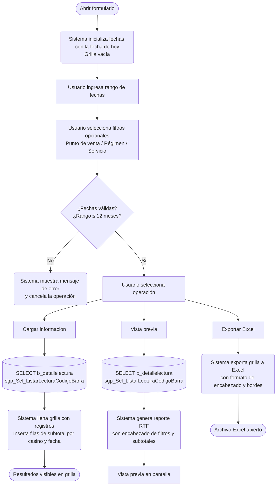

# Lectura de Vales

**Formulario VB6:** `L_LecVal.frm`
**Tabla(s) principal(es):** `b_detallelectura` (registro de lecturas de códigos de barra de vales)
**SP principal:** `sgp_Sel_ListarLecturaCodigoBarra` — Consulta el detalle de vales leídos por punto de venta, régimen, servicio y período

---

## Contexto

El formulario de Lectura de Vales es un informe de auditoría que permite consultar todos los vales que fueron leídos con lector de código de barras en los puntos de venta del casino. Cada registro representa un vale individual escaneado: a qué punto de atención ingresó, bajo qué régimen y servicio se procesó, quién era el comensal (identificado por su RUT y nombre) y en qué fecha y hora ocurrió la lectura.

El formulario pertenece a la etapa de control y auditoría de ventas. Su uso típico es verificar si un vale fue efectivamente presentado y registrado en el sistema, cruzar información entre lo planificado (raciones) y lo consumido (lecturas de vales), o investigar incidencias en puntos de atención específicos. No genera movimientos en la base de datos: es estrictamente de consulta.

El formulario se organiza en una sección de filtros en la parte superior (período, punto de venta, régimen y servicio) y una grilla de resultados en la parte inferior. Los resultados pueden visualizarse directamente en pantalla, exportarse a Excel para análisis adicional o generarse como reporte imprimible en vista previa.

---

## Parámetros de Entrada

| Campo | Descripción | Obligatorio |
|---|---|---|
| Fecha de inicio | Fecha inicial del rango de consulta. Corresponde a la fecha de registro de la lectura en el sistema. | Sí |
| Fecha de término | Fecha final del rango de consulta. Debe ser igual o posterior a la fecha de inicio. El rango máximo permitido es 12 meses. | Sí |
| Punto de venta | Código del punto de atención (comedor o ventanilla) donde se leyeron los vales. Se puede ingresar manualmente o seleccionar desde un buscador. Si se deja en 0, el sistema devuelve todos los puntos del casino. | No |
| Régimen | Código del régimen (tipo de cliente o modalidad de alimentación) a filtrar. Si se deja en 0, incluye todos los regímenes. | No |
| Servicio | Código del servicio (desayuno, almuerzo, cena, etc.) a filtrar. Si se deja en 0, incluye todos los servicios. | No |

> Los campos de Punto de venta, Régimen y Servicio tienen un botón de búsqueda que abre el catálogo correspondiente. Al seleccionar un registro, el sistema muestra automáticamente la descripción junto al código para confirmar la selección.

---

## Estructura de la Grilla

La grilla presenta una fila por cada vale leído que cumpla los filtros. Adicionalmente, el sistema inserta automáticamente **filas de subtotal** cada vez que cambia el cliente o la fecha, mostrando el recuento de vales para ese grupo (marcadas en color y en negrita). Estas filas resumen no provienen de la base de datos sino que las genera el sistema al momento de cargar los resultados.

| Col | Nombre | Origen | Editable | Visible | Calculado | Observaciones |
|---|---|---|---|---|---|---|
| 1 | Punto de venta | `a_pto_atencion.ate_codatencion` + `ate_descripcion` | No | Sí | No | Muestra código y descripción del punto de atención. |
| 2 | Régimen | `a_regimen.reg_codigo` + `reg_nombre` | No | Sí | No | Muestra código y nombre del régimen. |
| 3 | Servicio | `a_servicio.ser_codigo` + `ser_nombre` | No | Sí | No | Muestra código y nombre del servicio. |
| 4 | Código de barra | `b_detallelectura.codigobarra` | No | Sí | No | Código de barra del vale escaneado. |
| 5 | RUT comensal | `b_detallelectura.cli_codigo_rutcliente` | No | Sí | No | Identificador del comensal que presentó el vale. |
| 6 | Nombre comensal | `b_persona.per_nombre` | No | Sí | No | Nombre de la persona obtenido desde el registro de personal. Puede quedar vacío si el RUT no está registrado. |
| 7 | Fecha y hora | `b_detallelectura.fechahoravale` | No | Sí | No | Fecha y hora exacta en que fue leído el vale en el punto de atención. |
| 8 | Código cliente | `b_clientes.cli_codigo` | No | Sí | No | Código del casino al que pertenece la lectura. Usado internamente para agrupar subtotales. |
| 9 | Nombre cliente | `b_clientes.cli_nombre` | No | Sí | No | Nombre del casino. Aparece en las filas de subtotal. |

---

## Operaciones Disponibles

| Botón | Acción |
|---|---|
| **Cargar información** | Ejecuta la consulta al servidor con los filtros ingresados y llena la grilla con los resultados. Inserta filas de subtotal por casino y fecha. Muestra una barra de progreso mientras carga. |
| **Vista previa** | Genera un reporte en formato RTF con los mismos datos de la grilla y lo muestra en pantalla para revisión antes de imprimir. El reporte incluye los filtros aplicados y subtotales por grupo. |
| **Exportar Excel** | Exporta el contenido completo de la grilla a Microsoft Excel. Incluye filas de encabezado con los filtros utilizados (filas 1 a 5) y luego todos los registros a partir de la fila 6. Aplica formato de bordes, color en el encabezado y ajuste de columnas. |
| **Salir** | Cierra el formulario. |

---

## Validaciones

| # | Momento | Condición | Resultado |
|---|---|---|---|
| 1 | Al cargar o al generar vista previa | La fecha de inicio está vacía o no es una fecha válida | El sistema no ejecuta la consulta. Mensaje: "Fecha origen está en blanco". |
| 2 | Al cargar o al generar vista previa | La fecha de término está vacía o no es una fecha válida | El sistema no ejecuta la consulta. Mensaje: "Fecha destino está en blanco". |
| 3 | Al cargar o al generar vista previa | La fecha de inicio es posterior a la fecha de término | El sistema no ejecuta la consulta. Mensaje: "Fecha origen mayor destino". |
| 4 | Al cargar o al generar vista previa | El rango entre fecha de inicio y fecha de término supera los 12 meses | El sistema no ejecuta la consulta. Mensaje: "Rango de fecha no puede ser mayor a 12 meses". |
| 5 | Al ingresar un código de punto de venta | El código ingresado no existe en los registros de lecturas del casino | El campo de descripción queda vacío; el sistema no bloquea pero la consulta posterior no devolverá resultados para ese punto. |

---

## Flujo de Datos

---

## Dónde se Almacena

### Lecturas de códigos de barra (`b_detallelectura`)

| Campo | Descripción |
|---|---|
| `cli_codigo` | Código del casino al que pertenece la lectura (filtra por el casino activo en sesión). |
| `cli_codigo_rutcliente` | RUT o identificador del comensal que presentó el vale. Se usa para cruzar con el registro de personal en `b_persona`. |
| `ate_codatencion` | Código del punto de atención donde se escaneó el vale. |
| `reg_codigo` | Código del régimen bajo el que se procesó el vale. |
| `ser_codigo` | Código del servicio (desayuno, almuerzo, etc.) al que corresponde el vale. |
| `codigobarra` | Código de barra exacto del vale presentado. |
| `fechahoravale` | Fecha y hora en que el vale fue presentado al punto de atención. |
| `fechahoraregistro` | Fecha y hora en que el sistema registró la lectura. Es el campo usado para el filtro por rango de fechas. |

**Clave primaria:** No se documenta en el código de este formulario, ya que es de solo lectura. El cruce de registros se realiza por la combinación de `cli_codigo` + `ate_codatencion` + `reg_codigo` + `ser_codigo` + `codigobarra` + `fechahoravale`.

---

### Puntos de atención (`a_pto_atencion`)

| Campo | Descripción |
|---|---|
| `ate_codatencion` | Código identificador del punto de venta o atención. |
| `ate_descripcion` | Nombre descriptivo del punto (comedor principal, ventanilla norte, etc.). |

---

### Regímenes (`a_regimen`)

| Campo | Descripción |
|---|---|
| `reg_codigo` | Código del régimen de alimentación. |
| `reg_nombre` | Nombre del régimen (ejecutivo, operario, visitas, etc.). |

---

### Servicios (`a_servicio`)

| Campo | Descripción |
|---|---|
| `ser_codigo` | Código del servicio de alimentación. |
| `ser_nombre` | Nombre del servicio (desayuno, almuerzo, cena, colación, etc.). |

---

## SP / Funciones Referenciados

### `sgp_Sel_ListarLecturaCodigoBarra` — Consulta las lecturas de vales por período y filtros opcionales

**Parámetros de entrada:**

| Parámetro | Descripción |
|---|---|
| `@Ceco` | Centro de costo (código del casino activo en sesión). |
| `@CodigoAtencion` | Código del punto de atención a filtrar. Si se pasa 0, incluye todos los puntos. |
| `@CodigoRegimen` | Código del régimen a filtrar. Si se pasa 0, incluye todos los regímenes. |
| `@CodigoServicio` | Código del servicio a filtrar. Si se pasa 0, incluye todos los servicios. |
| `@FechaInicial` | Fecha de inicio del rango en formato AAAAMMDD. |
| `@FechaFinal` | Fecha de término del rango en formato AAAAMMDD. |

**Lógica principal:**

Consulta la tabla de lecturas (`b_detallelectura`) filtrando por el casino activo y el rango de fechas de registro (`fechahoraregistro`). Cruza con las tablas de puntos de atención, regímenes y servicios para obtener los nombres descriptivos. Incorpora también la tabla de personal (`b_persona`) para recuperar el nombre del comensal a partir de su identificador. Cada una de las tres dimensiones de filtro (punto de venta, régimen, servicio) es opcional: si se pasa 0, no restringe ese criterio. Los resultados se ordenan por punto de atención, régimen, servicio, identificador del comensal y fecha/hora del vale.

**Tablas que consulta:** `b_detallelectura`, `b_clientes`, `a_pto_atencion`, `a_regimen`, `a_servicio`, `b_persona`

---

## Relación con Otros Módulos

| Módulo | Relación |
|---|---|
| **Puntos de Venta / Lectura de Códigos** | Los vales se leen y registran en `b_detallelectura` mediante el sistema de lectura en punto de venta. Este formulario consulta ese registro sin modificarlo. |
| **Raciones y Planificación** | Los vales están relacionados con los servicios y regímenes planificados. Este informe permite cruzar cuántos vales fueron efectivamente leídos contra las raciones planificadas para un servicio. |
| **Personal (`b_persona`)** | Se usa para mostrar el nombre del comensal a partir de su RUT. Si el RUT no está registrado en la tabla de personal, el nombre aparece vacío. |
| **Configuración de puntos de atención (`a_pto_atencion`)** | Los puntos de venta disponibles para filtrar son los registrados en el maestro de puntos de atención, independiente del casino. |

---

*Fuentes: `L_LecVal.frm`, SP `sgp_Sel_ListarLecturaCodigoBarra` en `SGP_Local.sql`*
