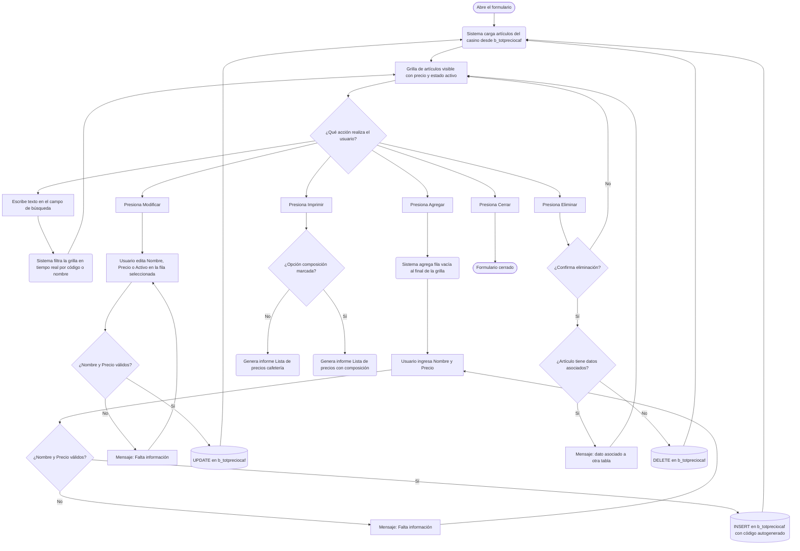

# Lista de Precio Cafetería

**Formulario VB6:** `T_LiPrCa.frm`
**Tabla(s) principal(es):** `b_totpreciocaf` (artículos de cafetería con su precio de venta), `b_detpreciocaf` (composición de ingredientes por artículo)
**SP principal:** Sin Stored Procedures: todas las operaciones se realizan con SQL directo

---

## Contexto

Este formulario permite administrar el catálogo de artículos que se ofrecen en la cafetería del casino. Para cada artículo se registra su nombre, precio de venta y si se encuentra activo para la venta. Adicionalmente se puede detallar qué ingredientes (productos del maestro de bodega) componen ese artículo y en qué cantidad, lo que permite generar listas de precios con desglose de composición.

El formulario pertenece a la etapa de configuración del servicio de cafetería. No depende de fechas ni períodos de cierre. Opera siempre sobre el casino activo en sesión y puede utilizarse en cualquier momento, independientemente del estado de la producción diaria.

La pantalla se organiza en dos pestañas: la primera ("Artículos de cafetería") muestra todos los artículos con su precio, permite agregarlos, modificarlos o eliminarlos, e incluye un panel de búsqueda por código o por nombre. La segunda pestaña ("Composición") muestra los ingredientes asociados al artículo seleccionado en la primera pestaña, y permite agregar, modificar o eliminar esos componentes.

---

## Parámetros de Entrada

Este formulario no requiere que el usuario complete ningún campo previo al abrir. Al cargarse, la grilla de artículos se llena automáticamente con todos los artículos del casino activo, ordenados por código y nombre.

El único parámetro de contexto que el usuario puede utilizar activamente es la **búsqueda**, que se realiza con los controles del panel superior de la primera pestaña:

| Campo | Descripción | Obligatorio |
|---|---|---|
| Buscar Columna | Selector que indica si la búsqueda se realiza por código o por nombre del artículo | No |
| Buscar Texto | Texto libre que filtra la grilla en tiempo real según la columna seleccionada | No |

---

## Estructura de la Grilla

### Pestaña 1 — Artículos de cafetería (`b_totpreciocaf`)

| Col | Nombre | Origen | Editable | Visible | Calculado | Observaciones |
|---|---|---|---|---|---|---|
| 1 | Código | `b_totpreciocaf.tpc_codigo` | No | Sí | No | Interno para identificar el artículo. Al agregar, el sistema asigna el siguiente número disponible automáticamente. |
| 2 | Nombre del artículo | `b_totpreciocaf.tpc_nombre` | Sí | Sí | No | Descripción libre del artículo de cafetería. Campo obligatorio al grabar. |
| 3 | Precio | `b_totpreciocaf.tpc_precio` | Sí | Sí | No | Precio de venta del artículo. Muestra separador de miles y 2 decimales. Campo obligatorio (no puede ser cero). |
| 4 | Activo | `b_totpreciocaf.tpc_activo` | Sí | Sí | No | Indica si el artículo está disponible para la venta. Valores: `1` = activo, `0` = inactivo. Se ingresa mediante una casilla de verificación embebida en la grilla. |

> Nota: el código del artículo (columna 1) es asignado por el sistema al grabar un nuevo registro. El sistema calcula el máximo código existente para el casino y suma 1. El usuario no puede editarlo directamente.

### Pestaña 2 — Composición del artículo (`b_detpreciocaf` + `b_productos` + `a_unidad`)

Esta pestaña muestra los ingredientes que componen el artículo seleccionado en la primera pestaña. El título de la pestaña indica el nombre del artículo activo.

| Col | Nombre | Origen | Editable | Visible | Calculado | Observaciones |
|---|---|---|---|---|---|---|
| 1 | Código producto | `b_detpreciocaf.dpc_codmer` | Sí | Sí | No | Código del producto (ingrediente) del maestro de bodega. Al agregar, se selecciona mediante un buscador de productos. No puede repetirse dentro del mismo artículo. |
| 2 | Nombre del producto | `b_productos.pro_nombre` | No | Sí | No | Se carga automáticamente al seleccionar el código del producto. Solo lectura. |
| 3 | Unidad | `a_unidad.uni_nomcor` | No | Sí | No | Unidad de medida abreviada del producto, leída desde el maestro de unidades. Solo lectura. |
| 4 | Cantidad | `b_detpreciocaf.dpc_cantidad` | Sí | Sí | No | Cantidad del ingrediente requerida para el artículo. Muestra 3 decimales en Chile. Campo obligatorio (no puede ser cero). |

---

## Operaciones Disponibles

| Botón | Pestaña | Acción |
|---|---|---|
| **Agregar** | Artículos | Habilita el modo de ingreso: agrega una fila al final de la grilla de artículos, posiciona el cursor en el campo Nombre, y deshabilita la pestaña de Composición hasta grabar. |
| **Agregar** | Composición | Abre el buscador de productos del maestro de bodega (filtrado a productos que controlan stock y están vigentes). Seleccionado el producto, agrega una fila en la grilla de composición con código, nombre y unidad precargados. El cursor se posiciona en el campo Cantidad. |
| **Modificar** | Artículos | Habilita la edición de la fila activa. Deshabilita la pestaña de Composición hasta grabar. La búsqueda queda inhabilitada durante la edición. |
| **Modificar** | Composición | Habilita la edición de la fila activa de la grilla de composición. Deshabilita la pestaña de Artículos hasta grabar. |
| **Eliminar** | Artículos | Pide confirmación. Si se acepta, elimina el artículo seleccionado de la base de datos y lo remueve de la grilla. Si el artículo tiene composición registrada en otra tabla, el sistema informa que el dato está asociado y no permite la eliminación. |
| **Eliminar** | Composición | Pide confirmación. Si se acepta, elimina el ingrediente seleccionado de la composición del artículo activo. |
| **Grabar** | Artículos | Persiste en `b_totpreciocaf` el artículo nuevo o modificado. En modo Agregar, asigna automáticamente el siguiente código disponible. |
| **Grabar** | Composición | Persiste en `b_detpreciocaf` el ingrediente nuevo o la cantidad modificada del ingrediente activo. |
| **Cancelar** | Ambas | Descarta los cambios no grabados. Restaura los valores originales desde la base de datos. Vuelve al modo de solo lectura y rehabilita ambas pestañas. |
| **Refrescar** | Artículos | Limpia el campo de búsqueda y recarga todos los artículos del casino desde la base de datos. |
| **Refrescar** | Composición | Recarga la composición del artículo activo desde la base de datos. |
| **Imprimir** | Artículos | Genera el informe "Lista de precios cafetería". Si la opción "Emitir lista de precios con composición" está marcada, genera en cambio el informe "Lista de precios cafetería con composición", que muestra artículo por artículo con sus ingredientes. |
| **Imprimir** | Composición | Genera el informe "Composición artículo de cafetería" para el artículo activo, mostrando código, nombre, unidad y cantidad de cada ingrediente. |
| **Cerrar** | Ambas | Cierra el formulario. |

> Nota: el botón Grabar también se activa automáticamente cuando el usuario sale de una fila mientras está en modo Agregar o Modificar. El sistema intenta guardar sin que el usuario presione el botón explícitamente.

---

## Validaciones

| # | Momento | Condición | Resultado |
|---|---|---|---|
| 1 | Al grabar artículo | El campo Nombre está vacío | El sistema muestra "Falta información..." y el cursor permanece en el campo Nombre. No se graba. |
| 2 | Al grabar artículo | El precio es igual a cero | El sistema muestra "Falta información..." y el cursor permanece en el campo Precio. No se graba. |
| 3 | Al grabar composición | El código del ingrediente está vacío | El sistema muestra "Falta información..." y el cursor permanece en el campo Cantidad. No se graba. |
| 4 | Al grabar composición | La cantidad del ingrediente es igual a cero | El sistema muestra "Falta información..." y el cursor permanece en el campo Cantidad. No se graba. |
| 5 | Al agregar ingrediente (buscador) | El producto seleccionado ya existe en la composición del artículo | El sistema muestra "Producto ya fue ingresado" y cancela la incorporación. |
| 6 | Al agregar ingrediente (digitación directa) | El código digitado no existe en el maestro de productos | El sistema muestra "Producto no existe", limpia el campo y el cursor permanece en él. |
| 7 | Al agregar ingrediente (digitación directa) | El código digitado ya existe en la composición del artículo | El sistema muestra "Producto ya fue ingresado", limpia el campo y el cursor permanece en él. |
| 8 | Al eliminar artículo | No hay ninguna fila seleccionada en la grilla | El sistema muestra "Debe seleccionar un registro..." y no procede. |
| 9 | Al eliminar ingrediente | No hay ninguna fila seleccionada en la grilla de composición | El sistema muestra "Debe seleccionar un registro..." y no procede. |
| 10 | Al eliminar artículo | El artículo tiene registros asociados en la tabla de detalle u otra tabla relacionada | El sistema informa que el dato está asociado a otra tabla, revierte la operación y no elimina. |
| 11 | Al imprimir | No hay artículos en la grilla | El sistema muestra "No existe datos a imprimir" y no genera el informe. |
| 12 | Al agregar ingrediente (buscador, pestaña 2) | No hay artículos cargados en la primera pestaña | El sistema no ejecuta el buscador y termina sin acción. |

---

## Flujo de Datos

### Pestaña 1 — Artículos de cafetería



### Pestaña 2 — Composición del artículo

```mermaid
flowchart TD
    A([Usuario cambia a pestaña Composición]) --> B(Sistema carga ingredientes del artículo seleccionado desde b_detpreciocaf)
    B --> C[Grilla de composición visible con código, nombre, unidad y cantidad]

    C --> D{¿Qué acción realiza el usuario?}

    D --> E[Presiona Agregar]
    E --> F[Se abre buscador de productos con stock controlado y vigentes]
    F --> G{¿Usuario selecciona un producto?}
    G -- No --> C
    G -- Sí --> H{¿Producto ya está en la composición?}
    H -- Sí --> I[Mensaje: Producto ya fue ingresado]
    I --> C
    H -- No --> J(Sistema carga nombre y unidad del producto automáticamente)
    J --> K[Usuario ingresa Cantidad]
    K --> L{¿Cantidad válida?}
    L -- No --> M[Mensaje: Falta información]
    M --> K
    L -- Sí --> N[(INSERT en b_detpreciocaf)]
    N --> B

    D --> O[Presiona Modificar]
    O --> P[Usuario edita Cantidad del ingrediente seleccionado]
    P --> Q{¿Cantidad válida?}
    Q -- No --> R[Mensaje: Falta información]
    R --> P
    Q -- Sí --> S[(UPDATE en b_detpreciocaf)]
    S --> B

    D --> T[Presiona Eliminar]
    T --> U{¿Confirma eliminación?}
    U -- No --> C
    U -- Sí --> V[(DELETE en b_detpreciocaf para el ingrediente seleccionado)]
    V --> B

    D --> W[Presiona Imprimir]
    W --> X(Genera informe Composición artículo de cafetería para el artículo activo)

    D --> Y[Usuario hace clic en fila de la grilla de artículos (pestaña 1)]
    Y --> B
```

---

## Dónde se Almacena

### Artículos de cafetería (`b_totpreciocaf`)

| Campo | Descripción |
|---|---|
| `tpc_codigo` | Código correlativo del artículo. Lo asigna el sistema automáticamente al grabar un nuevo artículo, calculando el máximo existente para el casino y sumando 1. |
| `tpc_nombre` | Nombre o descripción del artículo de cafetería que se muestra en los informes y en la grilla. |
| `tpc_precio` | Precio de venta del artículo. Se usa en los informes de lista de precios. |
| `tpc_cencos` | Código del casino (centro de costo) al que pertenece el artículo. Se asigna automáticamente según el casino activo en sesión. Permite que cada casino tenga su propio catálogo independiente. |
| `tpc_activo` | Indicador de si el artículo está disponible para la venta. Valor `1` = activo, `0` o vacío = inactivo. |

**Clave primaria:** la combinación de `tpc_codigo` + `tpc_cencos` identifica unívocamente un artículo dentro de un casino.

---

### Composición del artículo (`b_detpreciocaf`)

| Campo | Descripción |
|---|---|
| `dpc_codigo` | Código del artículo de cafetería al que pertenece este ingrediente. Referencia al campo `tpc_codigo` de `b_totpreciocaf`. |
| `dpc_codmer` | Código del producto (ingrediente) tomado del maestro de productos `b_productos`. |
| `dpc_cantidad` | Cantidad del ingrediente requerida para el artículo. Se ingresa con hasta 3 decimales en Chile. |
| `dpc_cencos` | Código del casino al que pertenece este detalle. Junto con `dpc_codigo`, garantiza que la composición sea propia de cada casino. |

**Clave primaria:** la combinación de `dpc_codigo` + `dpc_codmer` + `dpc_cencos` identifica unívocamente un ingrediente dentro de la composición de un artículo para un casino.

**Restricción:** cada artículo de detalle debe corresponder a un artículo registrado en `b_totpreciocaf` (mismo código y casino). Si se intenta eliminar un artículo encabezado que aún tiene ingredientes en detalle, el sistema rechaza la eliminación.

---

## Consultas de Lectura

### 1. Carga de artículos al abrir el formulario (o al refrescar)

Esta consulta trae todos los artículos de cafetería pertenecientes al casino activo, ordenados por código y luego por nombre. Se ejecuta al abrir el formulario y también al presionar el botón Refrescar. Retorna el código, nombre, precio y estado activo de cada artículo.

```sql
SELECT *
FROM b_totpreciocaf
WHERE tpc_cencos = '<casino_activo>'
ORDER BY tpc_codigo, tpc_nombre
```

---

### 2. Búsqueda por código en tiempo real

Mientras el usuario escribe en el campo de búsqueda con la columna "Código" seleccionada, la grilla se filtra mostrando solo los artículos cuyo código contenga el texto ingresado. No distingue entre mayúsculas y minúsculas.

```sql
SELECT tpc_codigo, tpc_nombre, tpc_precio, tpc_activo
FROM b_totpreciocaf
WHERE tpc_cencos = '<casino_activo>'
  AND tpc_codigo LIKE '%<texto_buscado>%'
```

---

### 3. Búsqueda por nombre en tiempo real

Cuando la columna seleccionada es "Nombre", la grilla se filtra por artículos cuyo nombre contenga el texto ingresado, sin distinguir mayúsculas de minúsculas. En SQL Server la función de conversión a mayúsculas se aplica al campo antes de comparar.

```sql
SELECT tpc_codigo, tpc_nombre, tpc_precio, tpc_activo
FROM b_totpreciocaf
WHERE tpc_cencos = '<casino_activo>'
  AND UPPER(tpc_nombre) LIKE '%<TEXTO_BUSCADO>%'
```

---

### 4. Carga de composición del artículo seleccionado

Cuando el usuario selecciona un artículo en la primera pestaña o cambia a la segunda, el sistema trae los ingredientes de ese artículo cruzando la composición con el maestro de productos y la tabla de unidades, para mostrar nombre y unidad de medida de cada ingrediente.

```sql
SELECT dpc.*,
       pro.pro_nombre,
       uni.uni_nomcor
FROM b_detpreciocaf dpc,
     b_productos pro,
     a_unidad uni
WHERE pro.pro_codigo = dpc.dpc_codmer
  AND pro.pro_coduni = uni.uni_codigo
  AND dpc_cencos = '<casino_activo>'
  AND dpc_codigo = '<codigo_articulo>'
```

---

### 5. Validación de producto al ingresar código manualmente

Cuando el usuario escribe directamente el código de un producto en la grilla de composición (sin usar el buscador), el sistema verifica que el código exista en el maestro de productos y recupera su nombre y unidad.

```sql
SELECT pro.pro_codigo,
       pro.pro_nombre,
       uni.uni_nomcor
FROM b_productos pro,
     a_unidad uni
WHERE pro.pro_coduni = uni.uni_codigo
  AND pro.pro_codigo = '<codigo_ingresado>'
```

---

### 6. Consulta para informe "Lista de precios con composición"

Esta consulta es la base del informe que lista todos los artículos con sus ingredientes. Usa una cadena de vínculos externos para incluir artículos que aún no tienen composición, cruzando encabezado, detalle, productos y unidades.

```sql
SELECT b_totpreciocaf.tpc_codigo,
       b_totpreciocaf.tpc_nombre,
       b_totpreciocaf.tpc_precio,
       b_totpreciocaf.tpc_activo,
       b_detpreciocaf.dpc_codmer,
       b_productos.pro_nombre,
       a_unidad.uni_nomcor,
       b_detpreciocaf.dpc_cantidad
FROM a_unidad
     RIGHT JOIN (
         b_productos
         RIGHT JOIN (
             b_detpreciocaf
             RIGHT JOIN b_totpreciocaf
               ON b_detpreciocaf.dpc_cencos = b_totpreciocaf.tpc_cencos
              AND b_detpreciocaf.dpc_codigo  = b_totpreciocaf.tpc_codigo
         )
         ON b_productos.pro_codigo = b_detpreciocaf.dpc_codmer
     )
     ON a_unidad.uni_codigo = b_productos.pro_coduni
WHERE b_totpreciocaf.tpc_cencos = '<casino_activo>'
ORDER BY b_totpreciocaf.tpc_codigo,
         b_detpreciocaf.dpc_codmer
```

---

### 7. Cálculo del siguiente código al agregar un artículo

Antes de insertar un nuevo artículo, el sistema determina el código máximo ya existente para el casino y le suma 1. El nuevo código resultante se graba junto con el artículo.

```sql
-- En SQL Server:
SELECT MAX(CONVERT(int, tpc_codigo)) AS tpc_codigo
FROM b_totpreciocaf
WHERE tpc_cencos = '<casino_activo>'
```

---

### 8. Buscador de productos con control de stock (modo Pst)

Cuando el usuario presiona Agregar en la pestaña de Composición, se abre el buscador de productos. Este buscador filtra el maestro de productos a los que tienen control de stock activo, están vigentes (fecha de vencimiento no expirada o sin fecha de vencimiento) y pertenecen a un tipo de servicio compatible con el casino activo.

```sql
SELECT DISTINCT a.pro_codigo, a.pro_nombre
FROM b_productos a,
     a_tiposervicio b,
     b_clientes c
WHERE (b.tis_codigo = c.cli_codtis OR a.pro_maepro < 1)
  AND c.cli_codigo = '<casino_activo>'
  AND (b.tis_codigo = a.pro_maepro OR a.pro_maepro < 1)
  AND (a.pro_fecven > <fecha_hoy_yyyymmdd> OR a.pro_fecven <= 0)
  AND a.pro_ctrsto = 1
ORDER BY a.pro_nombre
```

---

## Relación con Otros Módulos

| Módulo | Relación |
|---|---|
| **Maestro de Productos** | El módulo de cafetería consume el catálogo de productos (`b_productos`) para seleccionar los ingredientes de cada artículo. Los productos deben existir previamente con control de stock habilitado. |
| **Maestro de Unidades** | Las unidades de medida de los ingredientes (`a_unidad`) se leen solo para mostrarlas en pantalla e informes. No se modifican desde este formulario. |
| **Maestro de Clientes / Casinos** | La identificación del casino activo en sesión determina qué artículos se muestran y adónde se graban. Cada casino tiene su propio catálogo independiente. |
| **Maestro de Tipos de Servicio** | El buscador de productos considera el tipo de servicio del casino para filtrar qué productos están disponibles como ingredientes. |
| **Módulo de Ventas de Cafetería** | Los artículos configurados aquí y sus precios son la base para registrar las ventas de cafetería. Si un artículo está marcado como inactivo, no debería aparecer disponible para la venta. |
| **Módulo de Informes** | Los tres informes de este formulario (lista simple, lista con composición, composición individual) se generan directamente a partir de las tablas `b_totpreciocaf` y `b_detpreciocaf`. |

---

*Fuentes: `T_LiPrCa.frm`, `InforAN.bas`, `B_TabEst.frm`, tablas `b_totpreciocaf`, `b_detpreciocaf`, `b_productos`, `a_unidad` en `SGP_Local.sql`*
