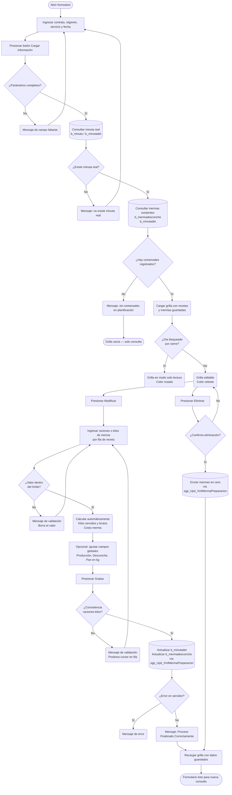

# Merma por Preparación (Raciones No Vendidas)

**Formulario VB6:** `M_MerPre.frm`
**Tabla(s) principal(es):** `b_minutadet` (detalle de minuta real, almacena los valores de merma por receta), `b_mermadesconche` (cabecera de mermas globales del día: desconche, pan, producción), `b_minuta` (encabezado de la minuta, fuente de datos de referencia)
**SP principal:** `sgp_Upd_XmlMermaPreparacion` (graba y/o elimina mermas); también usa `sgp_Sel_MermaPorPreparacion`, `sgp_Sel_ValidarMinutaMermaPorPreparacion` y `sgp_Sel_MermaPorPreparacionReceta` para consulta y validación.

---

## Contexto

Este formulario permite al jefe de casino o al operador registrar las **raciones no vendidas** (mermas de preparación) ocurridas durante el servicio del día. Una ración no vendida es una preparación que fue producida conforme a la minuta real pero que no llegó a ser consumida por ningún comensal. Registrar este dato es esencial para que el sistema pueda calcular el costo real de la operación: sin las mermas, el costo aparente queda sobreestimado respecto a las ventas reales.

El formulario pertenece a la etapa de **post-producción**, es decir, se utiliza después de que el chef ha completado el servicio y antes de que se ejecute el cierre diario. Para que la pantalla cargue datos, es imprescindible que exista una **minuta real** confirmada para la combinación contrato-régimen-servicio-fecha seleccionada. Además, el sistema verifica que se haya registrado previamente la **salida de producción** del día; si no existe esa salida, se muestra un aviso (aunque no bloquea el ingreso de mermas).

La pantalla se organiza en dos áreas claramente diferenciadas. En la parte superior se ubican los filtros de búsqueda (contrato, régimen, servicio y fecha) y los campos globales del día (producción, desconche y pan en kilogramos). En la parte central se despliega una grilla con una fila por cada receta de la minuta real, donde el usuario ingresa cuántas raciones no se vendieron. Un panel inferior muestra las leyendas de color que indican si el día está habilitado o bloqueado para edición.

---

## Parámetros de Entrada

| Campo | Descripción | Obligatorio |
|---|---|---|
| Contrato (código) | Código del centro de costo del casino. Puede escribirse directamente o buscarse con el ícono de lupa. | Sí |
| Contrato (nombre) | Nombre del casino, se completa automáticamente al ingresar el código. | No (calculado) |
| Régimen (código) | Código del régimen alimentario. Se busca con lupa o se escribe. | Sí |
| Régimen (nombre) | Nombre del régimen, se completa automáticamente. | No (calculado) |
| Servicio (código) | Código del servicio (desayuno, almuerzo, cena, etc.). | Sí |
| Servicio (nombre) | Nombre del servicio, se completa automáticamente. | No (calculado) |
| Fecha | Fecha de producción en formato dd/mm/aaaa. Por defecto se carga con la fecha actual. | Sí |
| No considera Mermas | Casilla que, al marcarse, indica que para ese día no corresponde registrar mermas. Pone en cero y deshabilita todos los campos de merma. | No |

> Una vez completados los cuatro parámetros (contrato, régimen, servicio y fecha), el usuario debe presionar el botón de recarga para que el sistema busque la minuta real y cargue las recetas en la grilla.

---

## Estructura de la Grilla

### Grilla principal de recetas

Cada fila corresponde a una receta de la minuta real del día seleccionado. Solo se muestran recetas con raciones planificadas mayores a cero y de tipo minuta real (`mid_tipmin = '2'`).

| Col | Nombre | Origen | Editable | Visible | Calculado | Observaciones |
|---|---|---|---|---|---|---|
| 1 | Código receta | `b_receta.rec_codigo` | No | Sí | No | Identificador numérico de la receta. |
| 2 | Nombre receta | `b_receta.rec_nombre` | No | Sí | No | Descripción de la preparación tal como aparece en la minuta. |
| 3 | Raciones planificadas | `b_minutadet.mid_numrac` | No | Sí | No | Total de raciones confirmadas en la minuta real. Actúa como límite máximo para las mermas. |
| 4 | Costo unitario | — | No | Sí | Sí | Suma del costo de receta más el costo de desconche, ambos congelados al momento de grabar la minuta. Ver cálculo abajo. |
| 5 | Costo total planificado | — | No | Sí | Sí | Costo unitario multiplicado por las raciones planificadas. Ver cálculo abajo. |
| 6 | Merma (raciones) | `b_minutadet.mid_nummer` | Sí | Sí | No | Cantidad de raciones no vendidas. El usuario la ingresa directamente. Bloqueada si el día está cerrado o si se marcó "No considera Mermas". |
| 7 | Merma (kilos servidos) | `b_minutadet.mid_mermaxcantservida` | Sí | Sí | Sí | Kilogramos en su forma servida correspondientes a las raciones no vendidas. Se calcula automáticamente al ingresar raciones, o puede ingresarse manualmente para que el sistema calcule las raciones inversamente. Ver cálculo abajo. |
| 8 | Costo merma | — | No | Sí | Sí | Costo económico de las raciones no vendidas: costo unitario multiplicado por raciones merma. Ver cálculo abajo. |
| 9 | Número de línea | `b_minutadet.mid_numlin` | No | No | No | Clave interna de ordenamiento. No se muestra al usuario. |
| 10 | Merma (kilos brutos) | `b_minutadet.mid_mermaxkilo` | Sí | Sí | Sí | Kilogramos en su forma bruta (antes de cocción) correspondientes a las raciones no vendidas. Se calcula automáticamente al ingresar raciones o kilos servidos. Ver cálculo abajo. |

> **Nota de colores:** la grilla muestra el fondo en color rosado-azulado cuando el día está bloqueado (fecha anterior a la fecha de cierre vigente) y en celeste cuando el día está habilitado para edición.

---

##### Cálculo — Costo unitario (columna 4)

El costo unitario de cada receta no se lee de un campo único, sino de la suma de dos valores congelados en la minuta real en el momento en que fue grabada.

**Origen del cálculo:** Fórmula aritmética

**Fórmula o lógica:**
Costo unitario = Costo de receta + Costo de desconche

| Componente | Descripción | Origen |
|---|---|---|
| Costo de receta | Costo de los ingredientes de la receta, valorizado al PMP vigente en el momento de grabar la minuta. | `b_minutadet.mid_cosrec` |
| Costo de desconche | Costo adicional por manipulación o merma de ingredientes no incluidos en la receta base. | `b_minutadet.mid_cosdes` |

> Ejemplo: si una receta tiene `mid_cosrec = 1.850` y `mid_cosdes = 0.150`, el costo unitario mostrado es `2.000` por ración.

---

##### Cálculo — Costo total planificado (columna 5)

Representa cuánto costó producir el total de raciones planificadas para esa receta.

**Origen del cálculo:** Fórmula aritmética

**Fórmula o lógica:**
Costo total planificado = (Costo de receta + Costo de desconche) × Raciones planificadas

| Componente | Descripción | Origen |
|---|---|---|
| Costo de receta | Ver columna 4 | `b_minutadet.mid_cosrec` |
| Costo de desconche | Ver columna 4 | `b_minutadet.mid_cosdes` |
| Raciones planificadas | Cantidad confirmada en la minuta real | `b_minutadet.mid_numrac` |

> Ejemplo: costo unitario `2.000` × `50` raciones = `100.000`. Este valor se usa para mostrar el total en el panel de totales (columna "Totales planificados").

---

##### Cálculo — Merma en kilos servidos (columna 7)

Convierte las raciones no vendidas a su equivalente en kilogramos de alimento ya preparado (porción servida). Si el usuario ingresa primero las raciones (columna 6), el sistema calcula los kilos automáticamente. Si el usuario ingresa primero los kilos, el sistema calcula las raciones inversamente.

**Origen del cálculo:** Stored Procedure + Fórmula aritmética

**Fórmula o lógica (desde raciones hacia kilos):**
Kilos servidos merma = (CantServida × Raciones merma) / GramosRacionNoVendida

**Fórmula o lógica (desde kilos hacia raciones):**
Raciones merma calculadas = (Kilos servidos ingresados / CantServida) × GramosRacionNoVendida

| Componente | Descripción | Origen |
|---|---|---|
| CantServida | Gramaje por ración en su forma servida (aplicando % de aprovechamiento y % de cocción de cada ingrediente). Calculado por la función `SGP_FN_RNVCantidadesReceta` con modo `'S'`. | Función SQL `SGP_FN_RNVCantidadesReceta` vía SP `sgp_Sel_MermaPorPreparacionReceta` |
| Raciones merma | Cantidad de raciones no vendidas ingresadas por el usuario (columna 6). | Ingresado por el usuario |
| GramosRacionNoVendida | Factor de conversión definido en el parámetro `pargrarnve` del casino. Por defecto vale 1 si no está configurado. | `a_param.par_valor` (parámetro `pargrarnve`) |

> Ejemplo: si `CantServida = 0.250` kg por ración, `GramosRacionNoVendida = 1`, y el usuario ingresa `10` raciones de merma, entonces `Kilos servidos = (0.250 × 10) / 1 = 2.500 kg`.
>
> A la inversa: si el usuario ingresa `2.500` kg servidos, el sistema recalcula `(2.500 / 0.250) × 1 = 10` raciones.

---

##### Cálculo — Merma en kilos brutos (columna 10)

Convierte las raciones no vendidas a su equivalente en kilogramos de materia prima bruta (antes de cocción, sin aplicar rendimiento).

**Origen del cálculo:** Stored Procedure + Fórmula aritmética

**Fórmula o lógica:**
Kilos brutos merma = (CantBruta × Raciones merma) / GramosRacionNoVendida

| Componente | Descripción | Origen |
|---|---|---|
| CantBruta | Gramaje por ración en su forma bruta (sin aplicar % de cocción, solo % de aprovechamiento e ingredientes). Calculado por la función `SGP_FN_RNVCantidadesReceta` con modo `'B'`. | Función SQL `SGP_FN_RNVCantidadesReceta` vía SP `sgp_Sel_MermaPorPreparacionReceta` |
| Raciones merma | Cantidad de raciones no vendidas ingresadas por el usuario (columna 6). | Ingresado por el usuario |
| GramosRacionNoVendida | Factor de conversión del parámetro `pargrarnve`. | `a_param.par_valor` |

> Ejemplo: si `CantBruta = 0.350` kg por ración y se registran `10` raciones de merma, entonces `Kilos brutos = (0.350 × 10) / 1 = 3.500 kg`.

---

##### Cálculo — Costo merma (columna 8)

Representa el impacto económico de las raciones no vendidas para esa receta.

**Origen del cálculo:** Fórmula aritmética

**Fórmula o lógica:**
Costo merma = Costo unitario × Raciones merma

| Componente | Descripción | Origen |
|---|---|---|
| Costo unitario | `mid_cosrec + mid_cosdes` congelados en la minuta | `b_minutadet.mid_cosrec`, `b_minutadet.mid_cosdes` |
| Raciones merma | Cantidad ingresada por el usuario en columna 6 | `b_minutadet.mid_nummer` (al grabar) |

> Ejemplo: costo unitario `2.000` × `10` raciones de merma = `20.000`. Este valor se acumula en el total de costo de mermas del día que aparece en el panel inferior de totales.

---

### Campos globales de merma del día (panel inferior "Mermas Kilos")

Estos tres campos se registran a nivel del día completo, no por receta. Son kilogramos de merma que no corresponden a una preparación específica sino a categorías generales del servicio.

| Campo | Descripción | Editable | Origen |
|---|---|---|---|
| Producción (kg) | Kilogramos de alimento producido que no se sirven, por causa general de producción. | Sí | `b_mermadesconche.Merma_Produccion` |
| Desconche (kg) | Kilogramos de alimento devuelto por los comensales en el plato (restos de plato). | Sí | `b_mermadesconche.Merma_Desconche` |
| Pan (kg) | Kilogramos de pan no consumido. | Sí | `b_mermadesconche.Merma_Pan` |

> Estos campos quedan deshabilitados si se marcó la casilla "No considera Mermas" o si el día seleccionado está bloqueado por cierre.

---

## Operaciones Disponibles

| Botón | Acción |
|---|---|
| **Cargar información** | Botón de recarga en el encabezado. Valida que los cuatro parámetros estén completos y dispara la consulta al servidor para cargar la grilla con las recetas de la minuta real. |
| **Modificar** | Habilita la edición de las columnas de merma (raciones, kilos servidos y kilos brutos) en la grilla. También habilita los campos globales del día. Bloquea los campos de encabezado para evitar cambios de contexto mientras se edita. |
| **Eliminar** | Pone en cero todos los valores de merma de todas las filas y envía al servidor una instrucción de actualización con valores vacíos. Solicita confirmación antes de ejecutar. |
| **Grabar** | Valida que cada fila tenga consistencia (si hay merma en raciones debe haber también kilos, y viceversa), luego empaqueta todos los datos en formato XML y llama al procedimiento que actualiza `b_minutadet` y `b_mermadesconche`. Muestra confirmación de éxito o mensaje de error. |
| **Cancelar** | Descarta los cambios en curso y recarga los datos desde la base de datos, restaurando la grilla al estado guardado. Re-habilita los campos de encabezado. |
| **Refrescar** | Vuelve a ejecutar la carga de datos con los parámetros actuales. Equivalente a presionar el botón de recarga del encabezado. |
| **Imprimir** | Genera el informe de merma por preparación del día. Solo disponible si existen registros con mermas (`mid_nummer > 0`). Llama al módulo de impresión `I_MermaPreparacion`. |
| **Cerrar** | Cierra el formulario sin guardar cambios pendientes. |

---

## Validaciones

| # | Momento | Condición | Resultado |
|---|---|---|---|
| 1 | Al cargar (botón recarga) | No se ha ingresado contrato | El sistema muestra "Debe ingresar ceco... proceso cancelado" y no carga la grilla. |
| 2 | Al cargar (botón recarga) | No se ha ingresado régimen | El sistema muestra "Debe ingresar regimen... proceso cancelado". |
| 3 | Al cargar (botón recarga) | No se ha ingresado servicio | El sistema muestra "Debe ingresar servicio... proceso cancelado". |
| 4 | Al cargar (botón recarga) | No se ha ingresado fecha válida | El sistema muestra "Debe ingresar fecha... proceso cancelado". |
| 5 | Al cargar datos | No existe minuta real para la combinación contrato-régimen-servicio-fecha | El sistema muestra "No existe minuta real, para ese dia" y no carga la grilla. |
| 6 | Al cargar datos | Existe minuta real pero no hay comensales registrados en la planificación real (`min_racrea = 0`) | El sistema muestra "No tiene registrado comensales del dia en la planificación real..." y la grilla queda vacía. |
| 7 | Al cargar datos | No se ha realizado la salida de producción del día (`tov_rutcli` vacío) | El sistema muestra aviso informativo "No ha realizado la salida de producción..." pero permite continuar. |
| 8 | Al ingresar raciones de merma (columna 6) | Las raciones ingresadas superan las raciones planificadas (`mid_numrac`) | El sistema muestra "Mermas x Raciones digitada es mayor que la programada", borra el valor ingresado y devuelve el cursor a la celda. |
| 9 | Al ingresar kilos servidos de merma (columna 7) | Los kilos ingresados equivalen a más raciones que las planificadas | El sistema muestra "Mermas x Kilos digitada es mayor que la programada", borra el valor y devuelve el cursor. |
| 10 | Al ingresar kilos servidos de merma (columna 7) | El cálculo inverso de kilos a raciones resulta en cero o negativo | El sistema borra los valores de kilos y raciones de esa fila sin mostrar mensaje. |
| 11 | Al grabar | Una fila tiene kilos servidos pero no tiene raciones de merma | El sistema muestra "Merma x kilo no fue confirmada, proceso cancelado..." y posiciona el cursor en la columna de raciones de esa fila. |
| 12 | Al grabar | Una fila tiene raciones de merma pero no tiene kilos servidos | El sistema muestra "Merma x Raciones no fue confirmada, proceso cancelado..." y posiciona el cursor en la columna de kilos de esa fila. |
| 13 | Al activar "No considera Mermas" | La grilla ya tiene datos ingresados | El sistema solicita confirmación: "Esta seguro activar esta opcion, movera a cero los registro ingresado...". Si se acepta, limpia todos los valores. |
| 14 | Al intentar editar | La fecha seleccionada es anterior a la fecha de cierre diario vigente (`vg_ciedia`) | Todas las celdas de merma quedan bloqueadas. La grilla se muestra en color rosado-azulado como indicador visual. |
| 15 | Al intentar editar | El costo unitario de la receta es cero | El sistema no permite ingresar merma para esa receta y borra cualquier valor ingresado en columnas 6, 7 y 8. |
| 16 | Al eliminar | El usuario no confirma la acción | El proceso se cancela sin modificar datos. |

---

## Flujo de Datos

---

## Dónde se Almacena

### Merma por receta (`b_minutadet`)

Esta tabla almacena el detalle de cada receta en la minuta. El formulario actualiza únicamente los campos de merma; los demás campos ya existen desde cuando se grabó la minuta real.

| Campo | Descripción |
|---|---|
| `mid_codigo` | Código de la minuta a la que pertenece el detalle (clave de relación con `b_minuta`). |
| `mid_tipmin` | Tipo de minuta. Solo se procesan registros con valor `'2'` (minuta real). |
| `mid_numlin` | Número de línea dentro de la minuta. Identifica de forma única cada receta del día. |
| `mid_codrec` | Código de la receta. |
| `mid_numrac` | Raciones planificadas (no se modifica por este formulario). |
| `mid_cosrec` | Costo de receta congelado al grabar la minuta (no se modifica). |
| `mid_cosdes` | Costo de desconche congelado (no se modifica). |
| `mid_nummer` | **Raciones no vendidas** (merma en raciones). Este formulario actualiza este campo. |
| `mid_mermaxkilo` | **Kilogramos brutos** de las raciones no vendidas. Actualizado por este formulario. |
| `mid_mermaxcantservida` | **Kilogramos servidos** de las raciones no vendidas. Actualizado por este formulario. |

**Clave primaria:** combinación de `mid_codigo` + `mid_tipmin` + `mid_numlin`. Cada registro identifica unívocamente una receta en un tipo de minuta de un día de servicio.

---

### Mermas globales del día (`b_mermadesconche`)

Esta tabla almacena los kilogramos de merma global del servicio, independientemente de las recetas. Si el registro no existe se inserta; si ya existe se actualiza.

| Campo | Descripción |
|---|---|
| `IdCeco` | Código del contrato (centro de costo). |
| `IdRegimen` | Código del régimen. |
| `IdServicio` | Código del servicio. |
| `Fecha_Merma` | Fecha del servicio en formato numérico (AAAAMMDD). |
| `Considera_Merma` | Indicador `'1'`/`'0'` que refleja si el usuario marcó o no la casilla "No considera Mermas". |
| `Merma_Desconche` | Kilogramos de desconche del día. |
| `Merma_Pan` | Kilogramos de pan no consumido. |
| `Merma_Produccion` | Kilogramos de merma general de producción. |
| `Fecha_Modificacion` | Fecha y hora de la última actualización. |
| `Fecha_Creacion` | Fecha y hora del primer registro. |
| `Usuario` | Nombre del usuario que realizó la última grabación. |

**Clave primaria:** combinación de `IdCeco` + `IdRegimen` + `IdServicio` + `Fecha_Merma`. Un único registro por contrato-régimen-servicio-día.

---

## SP / Funciones Referenciados

### `sgp_Sel_ValidarMinutaMermaPorPreparacion` — Verifica que exista minuta real para el contexto seleccionado

**Parámetros de entrada:**
| Parámetro | Descripción |
|---|---|
| `@Ceco` | Código del contrato. |
| `@Regimen` | Código del régimen. |
| `@Servicio` | Código del servicio. |
| `@Fecha` | Fecha en formato numérico AAAAMMDD. |

**Lógica principal:**
Busca en `b_minuta` y `b_minutadet` si existe al menos un registro de tipo minuta real (`mid_tipmin = '2'`) para la combinación indicada, verificando además que el contrato esté activo y tenga bodega asociada. Si devuelve filas, hay minuta real; si está vacío, no existe.

**Tablas que modifica:** ninguna (solo lectura).

---

### `sgp_Sel_MermaPorPreparacion` — Carga la grilla con las recetas y sus mermas existentes

**Parámetros de entrada:**
| Parámetro | Descripción |
|---|---|
| `@Ceco` | Código del contrato. |
| `@Regimen` | Código del régimen. |
| `@Servicio` | Código del servicio. |
| `@Fecha` | Fecha en formato numérico. |
| `@CodBodega` | Código de bodega del casino, usado para verificar si existe salida de producción. |

**Lógica principal:**
Cruza `b_minuta` con `b_minutadet` para obtener todas las recetas de la minuta real (`mid_tipmin = '2'`, `mid_numrac > 0`, `min_racrea > 0`). Completa los datos con la tabla de recetas (`b_receta`) y con los valores ya grabados en `b_mermadesconche`. Para calcular `CantBruta` y `CantServida`, consulta la función `SGP_FN_RNVCantidadesReceta`: si los campos `mid_mermaxkilo` y `mid_mermaxcantservida` ya están grabados los devuelve directamente; si están en cero, los calcula desde la receta. También detecta si existe una salida de producción del día (`b_totventas` con tipo `'SP'`) para mostrar el aviso correspondiente. Devuelve una fila por receta, ordenadas por número de línea.

**Tablas que modifica:** ninguna (solo lectura).

---

### `sgp_Sel_MermaPorPreparacionReceta` — Obtiene datos de la receta para calcular kilos automáticamente

**Parámetros de entrada:**
| Parámetro | Descripción |
|---|---|
| `@Ceco` | Código del contrato. |
| `@Regimen` | Código del régimen. |
| `@Servicio` | Código del servicio. |
| `@Fecha` | Fecha en formato numérico. |
| `@CodReceta` | Código de la receta específica cuya fila se está editando. |

**Lógica principal:**
Se invoca cada vez que el usuario ingresa o modifica el valor de raciones (columna 6) o de kilos servidos (columna 7) en una fila. Devuelve `CantBruta`, `CantServida` y el factor `Gramajeracionesnovendidas` para esa receta, calculando los dos primeros mediante la función `SGP_FN_RNVCantidadesReceta`. Con estos datos el formulario puede realizar la conversión bidireccional entre raciones y kilogramos.

**Tablas que modifica:** ninguna (solo lectura).

---

### `sgp_Upd_XmlMermaPreparacion` — Graba o elimina las mermas del día

**Parámetros de entrada:**
| Parámetro | Descripción |
|---|---|
| `@XmlMerma` | Documento XML con una entrada por cada receta de la grilla, conteniendo: código de receta (`CR`), raciones merma (`NM`), kilos brutos (`MO`), kilos servidos (`MS`) y número de línea (`NL`). |
| `@Ceco` | Código del contrato. |
| `@Regimen` | Código del régimen. |
| `@Servicio` | Código del servicio. |
| `@Fecha` | Fecha en formato numérico. |
| `@Considera_Merma` | `'1'` si se marcó "No considera Mermas", `'0'` en caso contrario. |
| `@Merma_Desconche` | Kilogramos de desconche global del día. |
| `@Merma_Pan` | Kilogramos de pan no consumido. |
| `@Merma_Produccion` | Kilogramos de merma de producción general. |
| `@Usuario` | Nombre del usuario que realiza la operación. |

**Lógica principal:**
Parsea el XML en una tabla temporal y dentro de una transacción realiza dos operaciones: (1) actualiza los campos `mid_nummer`, `mid_mermaxkilo` y `mid_mermaxcantservida` en `b_minutadet` para cada receta identificada por código de receta y número de línea; (2) inserta un nuevo registro en `b_mermadesconche` si no existe o lo actualiza si ya existe, guardando los valores globales del día y el nombre del usuario. Toda la operación se ejecuta dentro de una transacción: si algún paso falla, se revierte todo. Devuelve un código de error y un mensaje, o cero si el proceso fue exitoso.

**Tablas que modifica:** `b_minutadet`, `b_mermadesconche`.

---

### `SGP_FN_RNVCantidadesReceta` — Calcula el gramaje por ración de una receta

**Parámetros de entrada:**
| Parámetro | Descripción |
|---|---|
| `@Ceco` | Código del contrato (para localizar la receta local o centralizada). |
| `@TipoRec` | Tipo de receta (patrón, local, por régimen). |
| `@Receta` | Código de la receta. |
| `@TipoCant` | `'B'` para cantidad bruta; `'S'` para cantidad servida. |

**Lógica principal:**
Recorre los ingredientes de la receta desde `b_recetadet` y `b_ingrediente`. Para la cantidad bruta (`'B'`), suma las cantidades por porción de cada ingrediente (convirtiendo unidades si el ingrediente está en unidades y tiene factor nutricional). Para la cantidad servida (`'S'`), aplica además el porcentaje de aprovechamiento y el porcentaje de cocción de cada ingrediente. Devuelve el resultado redondeado a 2 decimales como un valor flotante.

**Tablas que modifica:** ninguna (solo lectura).

---

## Relación con Otros Módulos

| Módulo | Relación |
|---|---|
| **Planificación / Minuta Real** | Prerequisito obligatorio. Este formulario solo puede operar si existe una minuta real confirmada para el contexto seleccionado. Lee `b_minuta` y `b_minutadet` como fuente de datos. |
| **Salida de Producción** | La salida de producción del día (documento tipo `'SP'` en `b_totventas`) se verifica al cargar. Si no existe, el formulario muestra un aviso pero no bloquea el ingreso de mermas. |
| **Recetas** | Los datos de gramaje por ración se calculan desde `b_receta` y `b_recetadet` a través de la función `SGP_FN_RNVCantidadesReceta`. El formulario es de solo lectura respecto a las recetas. |
| **Cierre Diario** | El cierre diario determina la fecha de corte (`vg_ciedia`). Cualquier día anterior a esa fecha queda bloqueado y no permite modificar mermas. El formulario lee esta fecha al activarse. |
| **Reportes de Merma** | El botón Imprimir genera el informe `I_MermaPreparacion` con el detalle de raciones no vendidas del día, usado por el jefe de casino para respaldo documental. |
| **Inventario / Bodega** | Las mermas en kilogramos registradas en este formulario son datos de referencia para el análisis de costos, pero no descuentan stock de bodega directamente. El descuento de stock se realiza por la salida de producción. |

---

*Fuentes: `M_MerPre.frm`, procedimientos almacenados `sgp_Sel_ValidarMinutaMermaPorPreparacion`, `sgp_Sel_MermaPorPreparacion`, `sgp_Sel_MermaPorPreparacionReceta`, `sgp_Upd_XmlMermaPreparacion`, función `SGP_FN_RNVCantidadesReceta`, tablas `b_mermadesconche`, `b_minutadet`, `b_minuta`, `b_receta`, `b_recetadet` en `SGP_Local.sql`*
