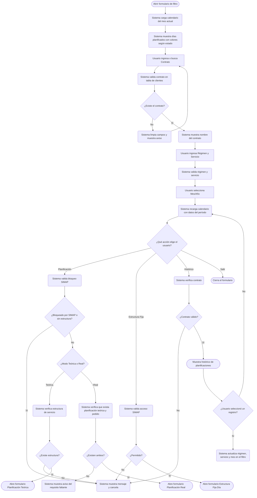

# Filtro de Acceso a Planificación (Teórica y Real)

**Formulario VB6:** `M_Plami1.frm`
**Tabla(s) principal(es):** `b_minuta` (encabezado de minuta mensual por contrato/régimen/servicio), `b_minutadet` (detalle de recetas por día dentro de la minuta), `b_clientes` (datos del contrato/casino), `a_regimen` (catálogo de regímenes alimentarios), `a_servicio` (catálogo de servicios de alimentación), `a_estservicio` (estructura del servicio: tiempos de comida)
**SP principal:** `sgp_Sel_TraerDetalleMinuta` — utilizado indirectamente al navegar al formulario de planificación real; el formulario de filtro en sí no llama SPs directamente.

---

## Contexto

Este formulario es el punto de entrada obligatorio para acceder tanto a la **Planificación Teórica** como a la **Planificación Real** de minutas en el sistema SGP. Actúa exclusivamente como pantalla de filtro: el usuario indica con qué contrato, régimen, servicio y mes desea trabajar, y el sistema valida si existe la combinación antes de abrir el formulario de planificación correspondiente.

Dentro del flujo de minutas, este formulario corresponde a la **primera etapa**: el usuario selecciona el contexto antes de entrar a crear o editar días. En el modo **Planificación Teórica** (MINTEO) se accede para definir el menú del mes por primera vez. En el modo **Planificación Real** (MINREA) se accede para ajustar la minuta real a partir de la teórica ya validada, razón por la cual el sistema exige que exista planificación teórica aprobada y pedido realizado antes de permitir el ingreso.

El formulario se organiza en un único panel con tres secciones: los campos de selección (contrato, régimen, servicio, mes y contraseña opcional), un calendario mensual que muestra visualmente los días ya planificados con distintos colores según su estado, y una barra de herramientas lateral con las acciones disponibles. No tiene pestañas; toda la interacción ocurre en una sola vista.

---

## Parámetros de Entrada

| Campo | Descripción | Obligatorio |
|---|---|---|
| Contrato | Código del contrato (casino/centro de costo). Identifica el sitio de alimentación para el que se planifica. Se puede ingresar el código directamente o usar el buscador. | Sí |
| Régimen | Número del régimen alimentario (por ejemplo: régimen normal, hipocalórico, vegetariano). Se puede ingresar directamente o usar el buscador. | Sí |
| Servicio | Número del servicio de alimentación (por ejemplo: almuerzo, cena, colación). Se puede ingresar directamente o usar el buscador. | Sí |
| Mes/Año | Período de planificación en formato mm/yyyy. Por defecto se muestra el mes en curso. | Sí |
| Contraseña | Campo de contraseña disponible en ciertas configuraciones (visible según parámetros del sistema). En la mayoría de los casos permanece oculto. Se relaciona con la validación de acceso a planificaciones protegidas. | Condicional |

> Los campos de Contrato, Régimen y Servicio cuentan cada uno con un indicador de ayuda que muestra el nombre completo del registro seleccionado (por ejemplo, al ingresar el código del contrato aparece automáticamente el nombre del casino).

---

## Estructura del Calendario

El panel inferior del formulario muestra un calendario mensual que actúa como indicador visual del estado de planificación. No es una grilla editable; su propósito es orientar al usuario antes de ingresar a la planificación.

| Col | Nombre | Origen | Editable | Visible | Calculado | Observaciones |
|---|---|---|---|---|---|---|
| 1–7 (Lu–Do) | Día del mes | `b_minuta.min_fecmin` + cálculo interno de día de la semana | No | Sí | Sí | Cada celda muestra el número de día. El color indica el estado (ver notas de color abajo). |

> **Notas de color del calendario:**
> - **Celda gris claro (fondo por defecto):** día del mes sin minuta registrada.
> - **Celda verde agua / cyan:** día con minuta registrada y dentro del período modificable.
> - **Celda azul/morado:** día con minuta registrada pero bloqueado para modificación (período cerrado o ya pasado). En Planificación Real también se bloquean días anteriores a la fecha actual según la regla de 2 días hábiles.

##### Cálculo — Color del día en el calendario

El color de cada día no está almacenado en ninguna tabla; el sistema lo determina al cargar el formulario cruzando tres condiciones.

**Origen del cálculo:** Fórmula aritmética / Subconsulta o cruce de tablas

**Lógica:**
1. El sistema consulta si existe al menos un registro en `b_minutadet` para la combinación contrato + régimen + servicio + mes seleccionados. Si existe, el día se marca con fondo verde agua (planificado y editable).
2. Para Planificación Real (MINREA), adicionalmente se compara la fecha del día con la fecha actual menos un margen de 2 días hábiles (se amplía a 4 días si el día o el día de la consulta cae en fin de semana). Si la fecha del día es anterior a ese límite, o es anterior a la fecha de cierre diario vigente (`vg_ciedia`), el color cambia a azul/morado (bloqueado).
3. Para Planificación Teórica (MINTEO), si el mes tiene al menos un detalle validado (`mid_fecval > 0`), todos los días planificados se muestran en azul/morado (período bloqueado globalmente).

| Componente | Descripción | Origen |
|---|---|---|
| Existencia de minuta | Indica si el día tiene recetas asignadas | `b_minuta` / `b_minutadet` |
| Fecha límite de modificación | Fecha actual menos 2 (o 4) días hábiles | Calculado en tiempo de ejecución |
| Fecha de cierre diario | Fecha hasta la que el período ya fue cerrado | Parámetro de sistema (`vg_ciedia`) |
| Estado de bloqueo global (Teórica) | Indica si el mes teórico ya fue validado | Campo `b_minutadet.mid_fecval` |

> Ejemplo: Si hoy es miércoles 12 de marzo, el sistema bloquea en azul los días 1 al 10 (más de 2 días atrás). El día 11 puede estar en verde si existe planificación y está dentro del margen.

---

## Operaciones Disponibles

| Botón | Acción |
|---|---|
| **Planificación** (Teórica o Real) | Valida los campos de filtro (contrato, régimen, servicio, mes) y abre el formulario de planificación correspondiente: `M_Plami2` para Teórica, `M_MinRea` para Real. Antes de abrir, el sistema verifica que el contrato no sea de tipo SIMAP bloqueado, que el régimen y el servicio existan, y en el caso de la Planificación Real, que previamente exista una planificación teórica y su pedido asociado. |
| **Estructura Fija Día** (Teórica o Real) | Abre el formulario de estructura fija del día (`M_EstFDi`) para el modo correspondiente. Aplica la misma verificación de acceso SIMAP. Solo si el formulario no está ya abierto. |
| **Histórico Planificación** | Muestra el historial de planificaciones teóricas o reales para el contrato seleccionado (`B_HistPm`). Al cerrar el histórico, si el usuario seleccionó un registro, los campos de régimen, servicio y mes se actualizan automáticamente en el filtro. Requiere que el contrato esté ingresado correctamente. |
| **Salir** | Cierra el formulario de filtro y descarga de memoria los formularios secundarios asociados. |

> El formulario no tiene operaciones de Agregar, Modificar, Eliminar ni Grabar propias: toda escritura en base de datos ocurre en los formularios de planificación que se abren desde aquí.

---

## Validaciones

| # | Momento | Condición | Resultado |
|---|---|---|---|
| 1 | Al hacer clic en Planificación o Estructura Fija | El contrato ingresado no existe en la tabla de clientes activos (`cli_tipo = 0`) | El sistema limpia el campo, muestra "No existe contrato" y cancela la navegación. |
| 2 | Al hacer clic en Planificación o Estructura Fija | El régimen ingresado no existe | El sistema muestra "No Existe Regimen" y cancela. |
| 3 | Al hacer clic en Planificación o Estructura Fija | El servicio ingresado no existe o está inactivo | El sistema muestra "No Existe Servicio" y cancela. |
| 4 | Al hacer clic en Planificación o Estructura Fija | La minuta del mes/régimen/servicio tiene indicador de bloqueo (`min_indblo IN (2, 11)`) y el contrato es de tipo SIMAP | El sistema muestra "Minuta corresponde bloque minuta" y cancela. |
| 5 | Al hacer clic en Planificación (botón principal) | El usuario no tiene permiso de creación según el perfil de seguridad (`ValidarUsuario`) y la minuta no existe aún | El sistema muestra "No está autorizado crear planificación" y cancela. |
| 6 | Al hacer clic en Planificación (Teórica) | No existe estructura de servicio definida para el servicio seleccionado en `a_estservicio` | El sistema muestra "No Existe estructura de servicio" y cancela. |
| 7 | Al hacer clic en Planificación (Teórica) | El contrato es de tipo SIMAP bloqueado y no existe minuta teórica previa | El sistema muestra "No puedes crear minuta concepto Simap, proceso cancelado" y cancela. |
| 8 | Al hacer clic en Planificación (Real) | El contrato es de tipo SIMAP | El sistema muestra "No puedes crear minuta estructura fija concepto Simap, proceso cancelado" y cancela. |
| 9 | Al hacer clic en Planificación (Real) | No existe ninguna minuta teórica (tipo `mid_tipmin = '1'`) para el período | El sistema muestra "Debe realizar la planificación teórica de este mes" y cancela. |
| 10 | Al hacer clic en Planificación (Real) | Existe planificación teórica pero no se ha realizado el pedido asociado (`mid_tipmin = '2'` sin registros) | El sistema muestra "Debe realizar el pedido para la planificación teórica de este mes" y cancela. |
| 11 | Al cambiar el contrato (campo de texto) | El código ingresado no existe en `b_clientes` | Los campos de régimen, servicio y sus indicadores se limpian automáticamente. |
| 12 | Al cambiar el régimen | El código ingresado no existe en `a_regimen` | El indicador de nombre del régimen se limpia y el calendario se recarga. |
| 13 | Al hacer clic en Histórico | El contrato no está ingresado o no existe | El sistema muestra "No existe contrato" y cancela la apertura del histórico. |

---

## Flujo de Datos



---

## Dónde se Almacena

### Encabezado de minuta (`b_minuta`)

| Campo | Descripción |
|---|---|
| `min_codigo` | Identificador único de la minuta (correlativo). |
| `min_cencos` | Código del contrato/casino al que pertenece la minuta. |
| `min_codreg` | Código del régimen alimentario. |
| `min_codser` | Código del servicio de alimentación. |
| `min_fecmin` | Fecha del día de la minuta en formato numérico `yyyymmdd`. |
| `min_indblo` | Indicador de bloqueo: `0` = abierta, `2` = bloqueada por período, `11` = bloqueada por cierre próximo (72 horas antes). |
| `min_racteo` | Raciones planificadas (teóricas) para ese día. |
| `min_racrea` | Raciones reales para ese día. |
| `ID_Bloque` | Identificador del bloque de minuta al que pertenece (para minutas agrupadas). |
| `min_fechacreacion` | Fecha y hora en que se creó el registro. |
| `min_usuariocreacion` | Usuario que creó el registro. |

**Clave primaria:** `min_codigo`. Un día de planificación de un servicio específico se identifica combinando `min_cencos` + `min_codreg` + `min_codser` + `min_fecmin`.

---

### Detalle de minuta (`b_minutadet`)

| Campo | Descripción |
|---|---|
| `mid_codigo` | Código de la minuta encabezado a la que pertenece este detalle (referencia a `b_minuta.min_codigo`). |
| `mid_tipmin` | Tipo de minuta: `'1'` = Teórica, `'2'` = Real. |
| `mid_numlin` | Número de línea dentro del día (orden de la receta en ese tiempo de comida). |
| `mid_estser` | Código de la estructura del servicio (tiempo de comida: entrada, plato fondo, postre, etc.). |
| `mid_codrec` | Código de la receta asignada a ese tiempo de comida y día. |
| `mid_numrac` | Raciones planificadas para esa receta en ese día. |
| `mid_descri` | Descripción libre de la receta en la minuta. |
| `mid_cosrec` | Costo de la receta congelado al momento de grabar. |
| `mid_cosdes` | Costo desagregado de la receta congelado al momento de grabar. |
| `mid_tiprec` | Tipo de receta: `0` = Patrón, `-1` = Local, `>0` = por régimen. |
| `mid_fecval` | Fecha de validación del detalle (si es mayor que cero, indica que el período fue validado/bloqueado). |
| `mid_rec5eta` | Indicador de receta de 5 etapas (regímenes especiales). |

**Clave primaria:** combinación de `mid_codigo` + `mid_tipmin` + `mid_numlin`.

---

### Contrato/Casino (`b_clientes`)

| Campo | Descripción |
|---|---|
| `cli_codigo` | Código del contrato/casino (centro de costo). |
| `cli_nombre` | Nombre del casino o empresa contratante. |
| `cli_tipo` | Tipo de registro: `0` = contrato activo de producción. |
| `cli_activo` | Indicador de actividad: `'1'` = activo. |
| `cli_tipominuta` | Controla el tipo de acceso a la minuta: `3` = bloqueado para sitios SIMAP. |

**Clave primaria:** `cli_codigo`.

---

### Régimen (`a_regimen`)

| Campo | Descripción |
|---|---|
| `reg_codigo` | Código numérico del régimen alimentario. |
| `reg_nombre` | Nombre descriptivo del régimen (por ejemplo: "Normal", "Hipocalórico"). |

**Clave primaria:** `reg_codigo`.

---

### Servicio (`a_servicio`)

| Campo | Descripción |
|---|---|
| `ser_codigo` | Código numérico del servicio. |
| `ser_nombre` | Nombre del servicio (por ejemplo: "Almuerzo", "Cena"). |
| `ser_activo` | Indicador de actividad: `'1'` = activo. |
| `ser_orden` | Orden de presentación en listados. |

**Clave primaria:** `ser_codigo`.

---

### Estructura del servicio (`a_estservicio`)

| Campo | Descripción |
|---|---|
| `ess_cencos` | Código del contrato al que pertenece la estructura. |
| `ess_codser` | Código del servicio al que pertenece la estructura. |
| `ess_codigo` | Código del tiempo de comida dentro del servicio (entrada, fondo, postre, etc.). |
| `ess_nombre` | Nombre del tiempo de comida. |
| `ess_orden` | Orden de presentación. |
| `ess_racmin` | Mínimo de raciones requeridas para este tiempo de comida. |

**Clave primaria:** combinación de `ess_codser` + `ess_codigo` + `ess_cencos`. El sistema exige que exista al menos una estructura definida para el servicio antes de permitir acceder a la planificación teórica.

---

## Consultas de Lectura

### 1. Verificar bloqueo de minuta por período y contrato

Al hacer clic en los botones de Planificación o Estructura Fija, el sistema consulta si la minuta del mes seleccionado tiene un indicador de bloqueo activo para el contrato ingresado. Si el contrato no opera con minuta libre (tipo SIMAP), la existencia de cualquier registro con estado bloqueado impide la apertura del formulario de planificación.

```sql
SELECT DISTINCT min_codigo
FROM b_minuta
WHERE min_cencos = '<contrato>'
  AND min_codreg = <regimen>
  AND min_codser = <servicio>
  AND convert(int, substring(convert(varchar(8), min_fecmin), 1, 6)) = <aaaamm>
  AND min_indblo IN (2, 11)
```

---

### 2. Verificar existencia de planificación teórica para el período

Antes de permitir el acceso a la Planificación Real, el sistema cuenta cuántos registros de detalle de tipo teórico existen para el período. Si el conteo es cero, el ingreso está bloqueado hasta que se complete la planificación teórica.

```sql
SELECT COUNT(a.mid_codigo) AS nreg
FROM b_minutadet a, b_minuta b
WHERE b.min_codigo = a.mid_codigo
  AND convert(int, substring(convert(varchar(8), b.min_fecmin), 1, 6)) = <aaaamm>
  AND a.mid_tipmin = '1'
```

---

### 3. Verificar existencia de pedido sobre la planificación teórica

Complementaria a la anterior, verifica que exista al menos un detalle de tipo pedido (`mid_tipmin = '2'`) asociado al período. Esto confirma que el proceso de pedido de insumos ya se realizó sobre la planificación teórica, habilitando así el acceso a la Planificación Real.

```sql
SELECT COUNT(a.mid_codigo) AS nreg
FROM b_minutadet a, b_minuta b
WHERE b.min_codigo = a.mid_codigo
  AND convert(int, substring(convert(varchar(8), b.min_fecmin), 1, 6)) = <aaaamm>
  AND a.mid_tipmin = '2'
```

---

### 4. Verificar bloqueo global del mes teórico (coloreado de calendario)

Para la Planificación Teórica, el sistema verifica si algún detalle del mes tiene fecha de validación registrada (`mid_fecval > 0`). Si existe, todos los días planificados se muestran en color azul/morado, indicando que el mes fue aprobado y no puede modificarse libremente.

```sql
SELECT DISTINCT b.mid_fecval
FROM b_minuta a, b_minutadet b
WHERE a.min_codigo = b.mid_codigo
  AND a.min_cencos = '<contrato>'
  AND convert(int, substring(convert(varchar(8), a.min_fecmin), 1, 6)) = <aaaamm>
  AND b.mid_fecval > 0
```

---

### 5. Cargar días planificados para el calendario (por régimen y servicio)

El calendario se recarga cada vez que cambia el contrato, régimen, servicio o mes. El sistema recupera todas las fechas con minutas registradas para la combinación seleccionada, determinando en qué celda del calendario mostrar el indicador de color.

```sql
SELECT b.min_fecmin, b.min_indblo
FROM b_minuta b, b_minutadet c
WHERE b.min_codigo = c.mid_codigo
  AND b.min_cencos = '<contrato>'
  AND b.min_codreg = <regimen>
  AND b.min_codser = <servicio>
  AND convert(int, substring(convert(varchar(8), b.min_fecmin), 1, 6)) = <aaaamm>
  AND c.mid_tipmin = '<tipo>'
ORDER BY b.min_fecmin
```

---

## SP / Funciones Referenciados

### `sgp_Sel_TraerDetalleMinuta` — Obtiene el detalle completo de recetas de una minuta

Este SP es invocado por el formulario de **Planificación Real** (`M_MinRea`) que se abre desde este filtro, no directamente por el formulario de filtro. Se documenta aquí porque es el resultado principal de la navegación desde este formulario.

**Parámetros de entrada:**

| Parámetro | Descripción |
|---|---|
| `@Ceco` | Código del contrato/casino. |
| `@CodRegimen` | Código del régimen alimentario. |
| `@CodServicio` | Código del servicio. |
| `@Periodo` | Mes y año en formato numérico `aaaamm`. |
| `@TipoMinuta` | Tipo de minuta: `'1'` = Teórica, `'2'` = Real. |

**Lógica principal:**
El SP cruza cuatro tablas para armar el detalle completo de la planificación de un período. Por cada fila de detalle de minuta (`b_minutadet`), obtiene el encabezado del día (`b_minuta`), el nombre de la receta (`b_receta`) y el nombre del tiempo de comida (`a_estservicio`). Solo filtra los registros del casino, régimen, servicio, período y tipo de minuta indicados. El resultado se ordena por tiempo de comida, luego por fecha del día y finalmente por número de línea.

**Tablas que consulta:** `b_minuta`, `b_minutadet`, `b_receta`, `a_estservicio`

---

## Relación con Otros Módulos

| Módulo | Relación |
|---|---|
| **Planificación Teórica** (`M_Plami2`) | Destino principal del botón Planificación cuando el formulario opera en modo Teórico (MINTEO). El filtro valida los prerequisitos antes de abrir este formulario. |
| **Planificación Real** (`M_MinRea`) | Destino principal del botón Planificación cuando el formulario opera en modo Real (MINREA). Solo se abre si existe planificación teórica y pedido previo. |
| **Estructura Fija Día** (`M_EstFDi`) | Formulario para definir la estructura fija del día por servicio. Se accede desde el botón Estructura Fija Día en ambos modos. |
| **Histórico de Planificación** (`B_HistPm`) | Formulario de consulta que lista planificaciones pasadas. Al seleccionar un registro histórico, los campos del filtro se actualizan automáticamente con los datos de ese período. |
| **Buscador de tablas** (`B_TabEst`) | Ventana de búsqueda auxiliar para Contrato, Régimen y Servicio. Se abre al hacer clic en los íconos de lupa de cada campo. |
| **Contrato/Casino** (`b_clientes`) | Prerequisito: debe existir un contrato activo (`cli_tipo = 0`, `cli_activo = '1'`). El tipo de minuta del contrato (`cli_tipominuta`) determina si se permiten operaciones SIMAP. |
| **Régimen** (`a_regimen`) | Prerequisito: el régimen debe existir en el catálogo antes de poder acceder a la planificación. |
| **Servicio** (`a_servicio`) | Prerequisito: el servicio debe existir y estar activo. Adicionalmente debe tener estructura definida en `a_estservicio` para la Planificación Teórica. |
| **Proceso de Pedido/Requisición** | Prerequisito para Planificación Real: el pedido asociado a la planificación teórica del mismo período debe haberse generado (`mid_tipmin = '2'` con registros). |
| **Cierre Diario** | El campo `vg_ciedia` (fecha de cierre) se usa para bloquear en el calendario los días anteriores al cierre en la Planificación Real. |

---

*Fuentes: `M_Plami1.frm`, `RutinaLectura.cls`, `RutinasI.bas`, `Rutinas.bas`, tablas `b_minuta`, `b_minutadet`, `b_clientes`, `a_regimen`, `a_servicio`, `a_estservicio`, SP `sgp_Sel_TraerDetalleMinuta` en `SGP_Local.sql`*
