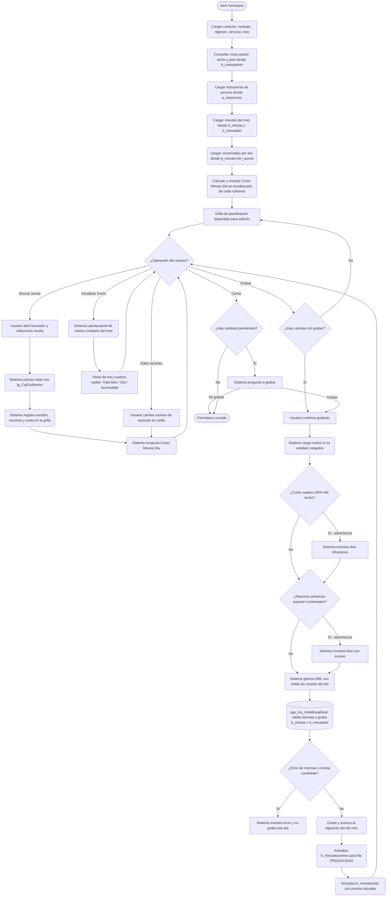
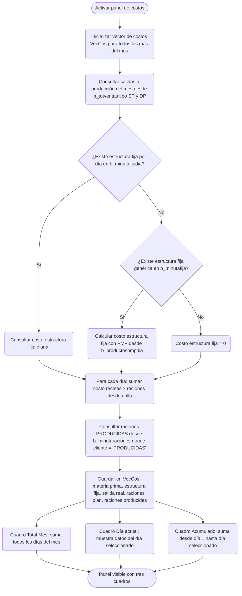

# Planificación Real — Minuta Real

**Formulario VB6:** `M_MinRea.frm`
**Tabla(s) principal(es):** `b_minuta` (encabezado de minuta por día), `b_minutadet` (detalle de recetas planificadas), `b_minutaraciones` (raciones por tipo de comensal)
**SP principal:** `sgp_Ins_XmlMinutaReal` — graba la planificación real de un día completo mediante un documento XML

---

## Contexto

La Planificación Real es la pantalla central de la operación diaria del casino. El chef o supervisor de producción la utiliza para organizar qué recetas se prepararán cada día del mes, cuántas raciones se elaborarán y en qué tipo de servicio (estructura) se enmarcan. A diferencia de la planificación teórica, que sirve como borrador inicial, este formulario registra la minuta **efectiva**, es decir, la que se compromete ante el contrato y sobre la cual se calculan los costos reales.

El formulario pertenece a la etapa de **planificación operativa**: es posterior a la definición del contrato y los regímenes, y es prerequisito para la generación de requisiciones de bodega, el registro de mermas y el cierre diario. Para poder operar, el sistema ya debe tener configurados el contrato (centro de costo), el régimen y el servicio del casino.

Visualmente, el formulario presenta una **grilla de planificación** cuyo eje horizontal son los días del mes (una columna por día) y cuyo eje vertical son las filas de recetas agrupadas por estructura de servicio (desayuno, almuerzo, cena, etc.). En la parte superior de cada columna aparecen opcionalmente los valores de referencia de costo patrón (techo y piso). La última fila de la grilla corresponde al total de comensales del día. Al pie del formulario puede activarse un panel de tres cuadros con indicadores de costos (Total Mes, Día seleccionado, Acumulado hasta la fecha).

---

## Parámetros de Entrada

El formulario no tiene campos que el usuario complete manualmente al abrirlo. Hereda el contexto de la pantalla anterior (selector de planificaciones), que fija el contrato, régimen, servicio y mes de trabajo. Todos esos valores quedan fijos durante toda la sesión de edición.

| Campo | Descripción | Obligatorio |
|---|---|---|
| Contrato (centro de costo) | Casino en el que opera el usuario, heredado del contexto de sesión | Sí (heredado) |
| Régimen | Tipo de alimentación del servicio (normal, dieta, etc.) | Sí (heredado) |
| Servicio | Turno o servicio dentro del régimen (desayuno, almuerzo, etc.) | Sí (heredado) |
| Mes de planificación | Año y mes sobre el que se trabaja (formato AAAAMM) | Sí (heredado) |

---

## Estructura de la Grilla

La grilla ocupa todo el ancho del formulario. Cada día del mes ocupa cinco columnas consecutivas. La primera columna (fija) muestra el nombre de cada estructura de servicio. Las columnas de datos se repiten por cada día.

### Columnas por cada día

| Col relativa | Nombre visible | Origen | Editable | Visible | Calculado | Observaciones |
|---|---|---|---|---|---|---|
| Col 1 (indicador) | — (color de celda) | Estado de la celda | No | Sí | No | Verde = receta del servicio (habilitada), Azul/morado = celda bloqueada (día ya cerrado o anterior al cierre), Amarillo = receta adicional régimen 5 etapas |
| Col 2 (nombre receta) | Nombre de la receta | `b_minutadet.mid_descri` / `b_receta.rec_nombre` | Sí (mediante buscar receta) | Sí | No | El usuario no escribe directamente; abre el buscador de recetas para seleccionar |
| Col 3 (raciones) | N.Rac. | `b_minutadet.mid_numrac` | Sí | Sí | No | Número de raciones planificadas para esa receta en ese día; editable en rojo |
| Col 4 (costo) | Costo | `b_minutadet.mid_cosrec + b_minutadet.mid_cosdes` | No | Sí | Sí | Suma del costo de alimentación y desechable de la receta |
| Col 5 (interno) | Cod. Receta | `b_minutadet.mid_codrec` + `b_minutadet.mid_tiprec` | No | No | No | Clave interna de referencia: almacena código y tipo de receta en formato `cod&tipo&;` |

**Fila de encabezado (fija, superior):** Muestra para cada día:
- Opcionalmente: **Costo Patrón Techo** (valor máximo de referencia por bandeja, desde `b_costopatron`)
- **Costo Minuta Día** (costo por bandeja calculado en tiempo real para ese día, campo calculado)
- Opcionalmente: **Costo Patrón Piso** (valor mínimo de referencia por bandeja, desde `b_costopatron`)
- **Estructura Servicio** (encabezado de nombre de día con fecha)

**Fila de totales (última fila):** Muestra para cada día el total de **comensales** (raciones planificadas), leído de `b_minuta.min_racrea` o del maestro del servicio. Esta fila es editable.

**Primera columna (fija, vertical):** Muestra el nombre de cada estructura de servicio (por ejemplo "ALMUERZO", "CENA"), leído de `a_estservicio.ess_nombre`.

---

##### Cálculo — Costo (columna 4 de cada día)

El costo que aparece en la grilla junto a cada receta no se lee directamente de un campo simple: es la suma de dos componentes que se congelan en el momento de la planificación.

**Origen del cálculo:** Función del sistema + campo almacenado

**Fórmula o lógica:**

```
Costo visible = Costo Alimentación + Costo Desechable
             = mid_cosrec           + mid_cosdes
```

Al insertar o cambiar una receta, el sistema invoca la función `fg_CalCtoRecInv()` con los parámetros de cuentas contables de insumo (`ctainsumo`) y desechables (`ctalimdes`) para obtener el costo actual de bodega. Este valor se guarda en `b_minutadet` al grabar y **queda congelado** (no se actualiza automáticamente si cambian los precios de bodega).

| Componente | Descripción | Origen |
|---|---|---|
| `mid_cosrec` | Costo de alimentación por ración de la receta (ingredientes) | `b_minutadet` (congelado al grabar) o calculado con `fg_CalCtoRecInv()` |
| `mid_cosdes` | Costo de desechables por ración de la receta | `b_minutadet` (congelado al grabar) o calculado con `fg_CalCtoRecInv()` |

> Ejemplo: La receta "Pollo al Horno" tiene un costo de alimentación de $1.200 y un costo de desechable (bandeja, cubiertos) de $150. La columna mostrará $1.350.

---

##### Cálculo — Costo Minuta Día (fila de encabezado)

El valor "Costo Minuta Día" que aparece en el encabezado superior de cada columna es el **costo por bandeja planificado** para ese día específico. Se recalcula en tiempo real cada vez que el usuario modifica raciones o recetas.

**Origen del cálculo:** Fórmula aritmética en memoria

**Fórmula o lógica:**

```
Costo Minuta Día (del día d) = (Σ Costo_receta × Raciones + Costo_Estructura_Fija_día) / Total_Comensales_día

Donde Costo_receta = mid_cosrec + mid_cosdes  (por cada fila del día d)
```

| Componente | Descripción | Origen |
|---|---|---|
| Costo de cada receta | Suma de costo alimentación + desechables | `b_minutadet.mid_cosrec + mid_cosdes` |
| Raciones planificadas | Número de raciones de esa receta ese día | `b_minutadet.mid_numrac` |
| Costo Estructura Fija | Costo fijo del servicio (personal, energía, etc.) | `b_minutafijadia` o `b_minutafija` × PMP |
| Total Comensales día | Total de raciones del día (fila inferior de la grilla) | `b_minuta.min_racrea` |

> Ejemplo: Día 5 tiene 3 recetas con costos totales de $600.000 y costo de estructura fija de $80.000. Si hay 200 comensales, el Costo Minuta Día = ($600.000 + $80.000) / 200 = $3.400 por bandeja.

---

## Operaciones Disponibles

Las operaciones se realizan desde la barra de herramientas superior y desde los menús contextuales.

| Botón / Opción de menú | Acción |
|---|---|
| **Grabar** | Persiste toda la planificación del mes en la base de datos. Para cada día ejecuta el SP `sgp_Ins_XmlMinutaReal` con un documento XML que contiene todas las recetas. Antes de grabar verifica costos y raciones proteicos. Al cerrar el formulario con cambios pendientes, el sistema ofrece grabar automáticamente. |
| **Buscar Receta** | Abre el buscador de recetas para seleccionar una receta y asignarla a la celda activa. El sistema calcula automáticamente el costo y lo registra en la grilla. |
| **Cambiar Plato Menú** | Permite reemplazar la receta asignada en la celda activa por otra. Equivalente funcional a buscar receta sobre una línea existente. |
| **Insertar Línea** | Agrega una nueva fila vacía en la posición activa para ingresar una receta adicional. |
| **Eliminar Línea** | Elimina la fila activa de la grilla. El sistema valida que la línea no tenga datos en ninguna columna antes de eliminarla completamente. |
| **Subir Línea** | Mueve la estructura (fila de nombre) o la receta activa una posición hacia arriba en la grilla. |
| **Bajar Línea** | Mueve la estructura (fila de nombre) o la receta activa una posición hacia abajo en la grilla. |
| **Copiar / Pegar** | Copia el contenido de celdas seleccionadas y las pega en otra posición. Admite pegado especial para copiar solo raciones. |
| **Copiar Minutas** | Copia la planificación teórica del mes como punto de partida para la planificación real. |
| **Agregar Estructura** | Añade una nueva estructura de servicio a la grilla (por ejemplo agregar "CENA" si no existía). Disponible solo si hay estructuras configuradas en el servicio que no han sido usadas aún. |
| **Visualizar Costo** | Muestra u oculta el panel de tres cuadros de costos (Total Mes, Día, Acumulado). Al mostrarlos por primera vez calcula todos los componentes de costo para el mes completo. |
| **Actualizar Costo Recetas** | Recalcula el costo de todas las recetas planificadas en el mes usando los precios actuales de bodega (`fg_CalCtoRecInv()`). Deja los costos como pendientes de grabar. |
| **Aportes Nutricionales** | Abre el informe de aporte nutricional por día para la columna activa. |
| **Frecuencia Recetas** | Muestra un informe de frecuencia de uso de recetas en el período. Solo disponible cuando no hay cambios sin grabar. |
| **Exportar Recetas** | Exporta las recetas del mes a un formato externo. Solo disponible cuando no hay cambios sin grabar. |
| **Ver Receta** | Abre la ficha de la receta seleccionada en la celda activa para consultarla. Permite cambiar la receta si la celda no está bloqueada. |
| **Grabar Semana** | Graba solo las recetas y cambios realizados en la semana actual (subconjunto del grabado completo). |
| **Cerrar** | Cierra el formulario. Si hay cambios sin grabar, el sistema pregunta si se desea actualizar antes de cerrar. |

---

## Validaciones

| # | Momento | Condición | Resultado |
|---|---|---|---|
| 1 | Al insertar o modificar receta | El día seleccionado está bloqueado (color azul) | El sistema muestra "Día Bloqueado" y rechaza la operación |
| 2 | Al insertar receta en régimen 5 etapas centralizado | La celda corresponde a una receta centralizada AMD (color verde, régimen ≥ 10.000) | El sistema muestra "No puede modificar receta, corresponde receta centralizada" |
| 3 | Al insertar receta con pedido centralizado activo | La fecha cae dentro de un período de pedido centralizado registrado en `Log_PedidoCentralizado` | El sistema consulta `sgp_Sel_ValidarMinBloque` y si no retorna resultado bloquea la inserción con "No puede insertar recetas, para esta fecha" |
| 4 | Al insertar recetas adicionales en régimen 5 etapas | La cantidad de recetas adicionales ya alcanzó el máximo configurado en parámetro `addreceta` | El sistema muestra "No puede ingresar más receta, tiene un máximo N por día" |
| 5 | Al grabar — verificación de costo techo | El costo bandeja del mes supera el 105% del valor techo configurado en `b_costopatron` | El sistema muestra advertencia informativa con los días específicos que superan el techo. No bloquea el grabado. |
| 6 | Al grabar — verificación de raciones proteicas | Existe al menos una estructura de servicio marcada como "marca platos" (`ess_marcaplatos = '1'`) y la suma de raciones en esas estructuras supera el total de comensales del día | El sistema muestra advertencia informativa con los días y cantidades infractoras. No bloquea el grabado. |
| 7 | Al grabar (dentro del SP) — raciones menores a mermas | Las raciones planificadas para una receta son inferiores a las mermas ya registradas (`mid_nummer`) en ese día | El SP retorna error: "El Día DD/MM/AAAA no será grabado, ya que existen raciones menores a las mermas realizadas. Debe normalizar Merma x Preparación" |
| 8 | Al grabar (dentro del SP) — cambio de receta con mermas | La receta enviada para una línea es diferente a la receta que tenía mermas registradas (`mid_nummer > 0`) | El SP retorna error: "El Día DD/MM/AAAA no será grabado, ya que fue cambiada la receta con respecto a la merma original. Debe normalizar Merma x Preparación" |
| 9 | Al actualizar costo recetas | Existen cambios no grabados en la planificación | El sistema muestra "Actualice Datos, para ver Información" y no permite la operación |
| 10 | Al ver frecuencia o exportar recetas | Existen cambios no grabados | El sistema muestra "Actualice Datos, para ver Información" y no permite la operación |
| 11 | Al navegar o acceder | El usuario no tiene acceso de escritura a la minuta según `ValidarAccesoMinutaBloqueyBloqueo` | Las operaciones de modificación muestran "Minuta, sin acceso a modificaciones" |
| 12 | Al intentar eliminar una línea con datos | La fila tiene información en alguna columna de ese día | El sistema muestra "Existe más información en la línea, no puede eliminarla completamente" |

---

## Flujo de Datos

### Flujo principal: Planificación y grabado



### Flujo: Cálculo del panel de costos



---

## Dónde se Almacena

### Encabezado de minuta (`b_minuta`)

| Campo | Descripción |
|---|---|
| `min_codigo` | Identificador interno de la minuta (correlativo) |
| `min_cencos` | Centro de costo del casino |
| `min_codreg` | Código del régimen |
| `min_codser` | Código del servicio |
| `min_fecmin` | Fecha de la minuta en formato AAAAMMDD |
| `min_indblo` | Indicador de bloqueo del día (1 = bloqueado para edición posterior) |
| `min_racteo` | Raciones teóricas (planificación teórica) |
| `min_racrea` | Raciones reales (comensales del día, editable en la fila inferior de la grilla) |
| `min_fechacreacion` | Fecha y hora de creación del registro |
| `min_fechamodificacion` | Fecha y hora de última modificación |
| `min_usuariocreacion` | Usuario que creó el registro |
| `min_usuariomodificacion` | Usuario que modificó por última vez |

**Clave primaria:** `min_cencos` + `min_codreg` + `min_codser` + `min_fecmin` identifica de forma única una minuta.

---

### Detalle de recetas planificadas (`b_minutadet`)

| Campo | Descripción |
|---|---|
| `mid_codigo` | Referencia al encabezado `b_minuta.min_codigo` |
| `mid_tipmin` | Tipo de minuta: `'2'` = Real (este formulario), `'1'` = Teórica |
| `mid_numlin` | Número de fila (orden de la receta dentro del día) |
| `mid_estser` | Código de la estructura de servicio a la que pertenece la receta |
| `mid_codrec` | Código de la receta planificada |
| `mid_tiprec` | Tipo de receta: 0 = Patrón, -1 = Local, > 0 = por Régimen |
| `mid_descri` | Descripción/nombre de la receta (hasta 50 caracteres) |
| `mid_numrac` | Número de raciones planificadas para esa receta ese día |
| `mid_cosrec` | Costo de alimentación de la receta, congelado al grabar |
| `mid_cosdes` | Costo de desechables de la receta, congelado al grabar |
| `mid_fecval` | Fecha de validez de la receta (usado en regímenes 5 etapas) |
| `mid_nummer` | Raciones con merma registradas (vinculado al módulo de mermas) |
| `mid_mermaxkilo` | Merma en kilos registrada |
| `mid_rec5eta` | Indicador de receta centralizada (`'1'`) o local (`'0'`), usado en regímenes 5 etapas |

**Clave primaria:** `mid_codigo` + `mid_tipmin` + `mid_numlin` identifica una línea de receta dentro de una minuta.

---

### Raciones por tipo de comensal (`b_minutaraciones`)

| Campo | Descripción |
|---|---|
| `mir_cencos` | Centro de costo |
| `mir_codreg` | Código del régimen |
| `mir_codser` | Código del servicio |
| `mir_fecmin` | Fecha de la minuta |
| `mir_rutcli` | Identificador del tipo de comensal: `'PRODUCIDAS'` = raciones efectivamente producidas ese día |
| `mir_nrorac` | Número de raciones para ese tipo de comensal |

Al grabar la planificación real, el SP inserta o actualiza la fila con `mir_rutcli = 'PRODUCIDAS'` con el valor `min_racrea` del día.

---

### Costo de referencia del patrón (`b_costopatron`)

| Campo | Descripción |
|---|---|
| `cpa_descripcion` | Tipo de referencia: `'TECHO'` (máximo) o `'PISO'` (mínimo) |
| `cpa_valor` | Valor de referencia en pesos por bandeja para el mes |

Se consulta al abrir el formulario para mostrar las filas de referencia en el encabezado de la grilla.

---

### Registro de costos para informes (`b_minutacosto`)

| Campo | Descripción |
|---|---|
| `mic_cencos` | Centro de costo |
| `mic_fecval` | Fecha del día del grabado (fecha del sistema en formato AAAAMMDD) |
| `mic_tipmin` | Tipo de minuta (`'2'` = Real) |
| `mic_codpro` | Código del producto ingrediente |
| `mic_cospro` | Precio de lista del producto al momento del grabado |

Esta tabla se actualiza cada vez que se graba la planificación. Registra los precios vigentes de los ingredientes para que los informes de costo puedan reconstruir el valor histórico.

---

## SP / Funciones Referenciados

### `sgp_Ins_XmlMinutaReal` — Graba la planificación real de un día completo

**Parámetros de entrada:**

| Parámetro | Descripción |
|---|---|
| `@XmlMinuta` | Documento XML con todas las recetas del día (número de línea, código de receta, tipo, raciones, costos) |
| `@Ceco` | Centro de costo del casino |
| `@CodRegimen` | Código del régimen |
| `@CodServicio` | Código del servicio |
| `@FechaDia` | Fecha del día en formato AAAAMMDD |
| `@Raciones` | Total de comensales del día |
| `@Color` | Estado del día: `'1'` = habilitado (editable), `'0'` = bloqueado (solo actualiza estructura, no raciones producidas) |
| `@Usuario` | Nombre del usuario que graba |

**Lógica principal:**

1. Parsea el XML recibido y carga las recetas en una tabla temporal interna.
2. **Valida mermas:** si las raciones planificadas son menores a las mermas ya registradas para alguna receta, rechaza el grabado con mensaje de error.
3. **Valida cambio de receta:** si la receta enviada difiere de la receta original que tiene mermas registradas, rechaza el grabado con mensaje de error.
4. Inicia una transacción. Si no existe encabezado (`b_minuta`) para ese día, lo crea; si ya existe, actualiza el total de raciones.
5. Si el día está habilitado (`@Color = '1'`), inserta o actualiza la fila `PRODUCIDAS` en `b_minutaraciones`.
6. Guarda en una tabla temporal auxiliar las mermas previas del detalle.
7. Elimina todos los registros de `b_minutadet` para ese día (tipo `'2'`).
8. Inserta los nuevos registros de `b_minutadet` desde la tabla temporal del XML.
9. Si el día estaba bloqueado (`@Color = '0'`), restaura los costos congelados anteriores desde la tabla temporal.
10. Restaura las mermas guardadas en la tabla temporal auxiliar sobre las filas que coinciden por código de receta y número de línea.
11. Confirma la transacción. Si ocurre cualquier error, hace rollback y retorna el mensaje de error.

**Tablas que modifica:** `b_minuta`, `b_minutadet`, `b_minutaraciones`

---

### `sgp_Sel_ValidarMinBloque` — Verifica si una fecha pertenece a un período de pedido centralizado

**Parámetros de entrada:**

| Parámetro | Descripción |
|---|---|
| `@Ceco` | Centro de costo del casino |
| `@FechaMinuta` | Fecha a verificar en formato AAAAMMDD |

**Lógica principal:**

Consulta la tabla `Log_PedidoCentralizado` para verificar si la fecha solicitada cae dentro de algún período de pedido centralizado vigente para ese casino. Si devuelve un resultado, significa que la fecha está bajo un pedido centralizado activo y el usuario puede insertar recetas aunque la minuta esté bloqueada normalmente. Si no devuelve resultados, la inserción queda bloqueada.

**Tablas que modifica:** Solo lectura sobre `Log_PedidoCentralizado`.

---

## Relación con Otros Módulos

| Módulo | Relación |
|---|---|
| **Planificación Teórica** | Prerequisito: la planificación real puede copiarse desde la teórica con la opción "Copiar Minutas". Comparten las mismas tablas `b_minuta` y `b_minutadet`, diferenciadas por el campo `mid_tipmin` (`'1'` = teórica, `'2'` = real). |
| **Contrato / Régimen / Servicio** | Prerequisito de configuración: el contrato, régimen y servicio deben existir previamente. La planificación real no crea ni modifica estos maestros. |
| **Estructuras de Servicio** (`a_estservicio`) | La grilla organiza las recetas por estructuras (desayuno, almuerzo, etc.). Las estructuras disponibles para agregar se cargan desde este maestro. |
| **Maestro de Recetas** | Al agregar una receta, el usuario abre el buscador de recetas que consulta `b_receta` y `b_recetadet`. El tipo de receta (Patrón, Local, por Régimen) determina los permisos de edición. |
| **Mermas por Preparación** | Las mermas registradas en `b_minutadet.mid_nummer` bloquean el cambio de receta y limitan la reducción de raciones. El SP `sgp_Ins_XmlMinutaReal` valida ambas condiciones antes de grabar. |
| **Requisición de Bodega** | Destino de datos: a partir de la planificación real grabada se genera la requisición de insumos. Solo días con `mid_tipmin = '2'` son considerados para la requisición. |
| **Salida a Producción** | El panel de costos lee los documentos tipo SP (salida a producción) y DP (devolución producción) desde `b_totventas` / `b_detventas` para calcular el costo realizado real por día. |
| **Cierre Diario** | El cierre consulta la planificación real para validar consistencia. Los días anteriores a la fecha de cierre (`vg_ciedia`) quedan bloqueados automáticamente en la grilla (color azul). |
| **Costo Patrón** | El módulo de configuración de costos patrón define los valores techo y piso en `b_costopatron`. Estos se muestran en el encabezado de la grilla y se usan para la advertencia al grabar. |
| **Raciones por Comensal** (`b_minutaraciones`) | Al grabar, el SP actualiza la fila `PRODUCIDAS` de esta tabla, que luego es leída por otros módulos (panel de costos, informes de producción) para comparar raciones planificadas versus producidas. |

---

*Fuentes: `M_MinRea.frm`, `doc_funcional/otros/MinutaReal_Costos.md`, `RutinaLectura.cls` (funciones `Minutas`, `EstServicio`, `CostoPatron`, `MinutaFija`, `MinutaFijaDia`, `MinutaRaciones`, `ServicioRaciones`, `Regimen`, `Servicio`), tablas `b_minuta`, `b_minutadet`, `b_minutaraciones`, `b_costopatron`, `b_minutacosto` en `SGP_Local.sql`, SPs `sgp_Ins_XmlMinutaReal` y `sgp_Sel_ValidarMinBloque`*
