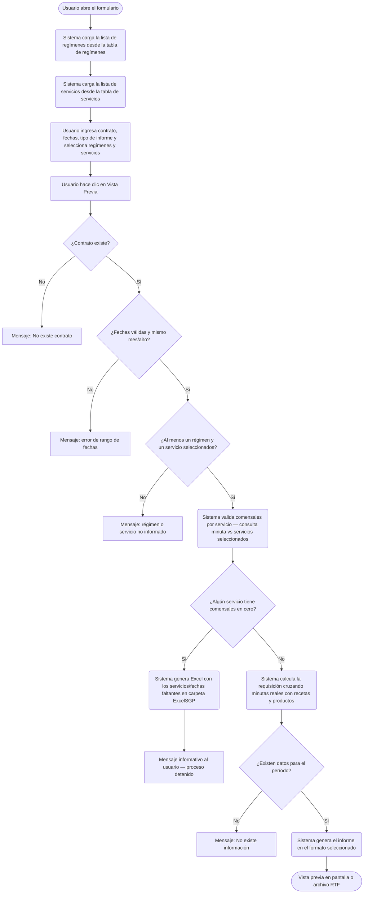
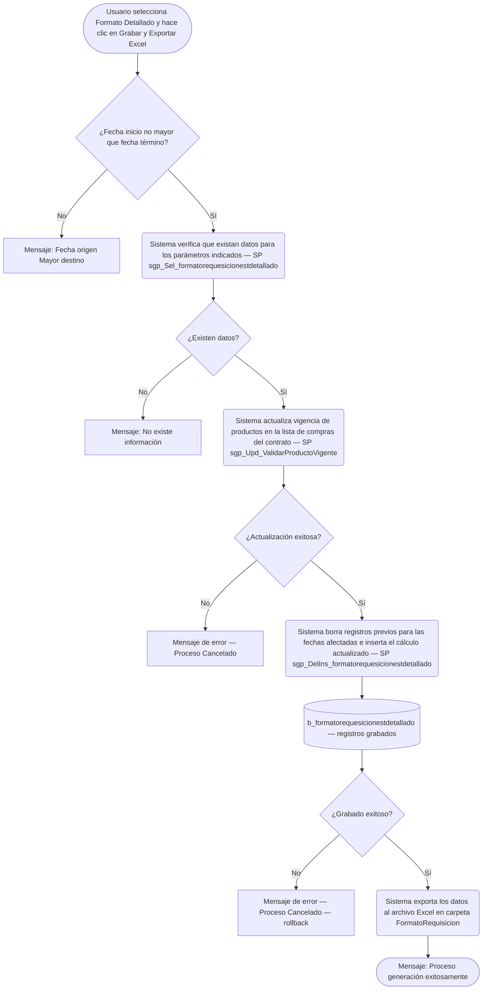
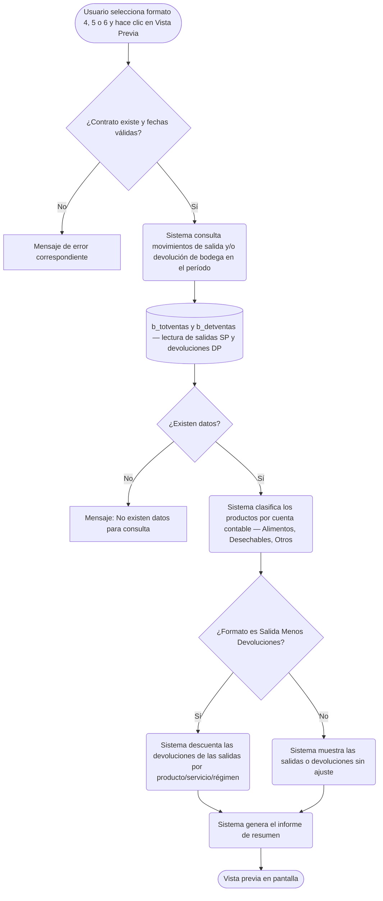

# Formato de Requisición — Salida y Devolución de Producción

**Formulario VB6:** `I_SalBod.frm`
**Tabla(s) principal(es):** `b_formatorequesicionestdetallado` (requisición calculada y persistida), `b_minuta` / `b_minutadet` (planificación de minuta real, fuente del cálculo), `b_totventas` / `b_detventas` (movimientos de salida y devolución de bodega)
**SP principal:** `sgp_DelIns_formatorequesicionestdetallado` (grabar requisición detallada), `sgp_Sel_formatorequesicionestdetallado` (leer datos para informe/Excel), `sgp_Upd_ValidarProductoVigente` (actualizar vigencia de productos antes de grabar), `sgp_Sel_ValidarServicioComensalesCeroSalProduccion` (validar que todos los servicios tengan comensales)

---

## Contexto

Este formulario es la herramienta de **generación de requisiciones de bodega** para producción. A partir de la minuta real planificada —es decir, las preparaciones con sus recetas, raciones y gramajes— el sistema calcula cuánto producto debe salir de la bodega hacia la cocina para el período seleccionado. El resultado puede visualizarse como vista previa imprimible en varios formatos o exportarse como archivo Excel para uso del bodeguero o del jefe de casino.

Dentro del flujo operativo del casino, este formulario se ubica **entre la etapa de planificación de minutas y la etapa de producción efectiva**. Para que la requisición tenga sentido, deben existir minutas reales aprobadas (`mid_tipmin = '2'`) con raciones asignadas para los regímenes y servicios del período. Si algún servicio no tiene comensales registrados, el sistema advierte y genera un Excel con los faltantes antes de continuar.

Además del flujo de requisición, el formulario ofrece tres informes de **resumen histórico** (salidas, devoluciones, y salidas netas de devoluciones) que consultan los movimientos de bodega ya registrados en el sistema. El formulario no tiene pestañas visibles: toda la operación se realiza desde una única pantalla donde el usuario define el contrato, el período, los regímenes, los servicios y el tipo de informe.

---

## Parámetros de Entrada

| Campo | Descripción | Obligatorio |
|---|---|---|
| Contrato | Código del casino (centro de costo SAP). Permite ingreso manual o búsqueda por lupa. Al cambiar, el sistema muestra el nombre del casino junto al campo. | Sí |
| Fecha Inicio | Primer día del período para el que se calculará la requisición o se consultará el resumen. | Sí |
| Fecha Término | Último día del período. No puede ser menor que Fecha Inicio ni pertenecer a un mes o año distinto. | Sí |
| Tipo de Informe | Lista desplegable con 7 opciones que determinan el formato del resultado (ver tabla de operaciones). | Sí |
| Regímenes | Panel con la lista de todos los regímenes activos. Por defecto quedan todos seleccionados ("Todos"). Puede cambiarse a "Lista" para marcar solo los deseados mediante búsqueda. | Sí (al menos uno) |
| Servicios | Panel con la lista de todos los servicios activos. Por defecto quedan todos seleccionados ("Todos"). Puede cambiarse a "Lista" para marcar solo los deseados mediante búsqueda. | Sí (al menos uno) |
| Salto de Página | Casilla de verificación disponible para los formatos de requisición (opciones 0 a 3). Cuando está marcada, el informe imprime cada grupo en una página separada. | No |

> **Nota:** Las listas de regímenes y servicios se cargan automáticamente al abrir el formulario desde las tablas `a_regimen` y `a_servicio` respectivamente. Inicialmente todos quedan marcados como "seleccionados".

---

## Estructura de las Listas de Selección

El formulario contiene dos listas internas (no visibles al usuario como grillas editables) que se usan para filtrar la consulta.

### Lista de Regímenes (panel "Regimen")

| Col | Nombre | Origen | Editable | Visible | Calculado | Observaciones |
|---|---|---|---|---|---|---|
| 1 | Seleccionado | Interna | Sí | No | No | Valor "1" = incluido en el filtro, "0" = excluido |
| 2 | Código | `a_regimen.reg_codigo` | No | No | No | Clave interna que se incluye en el XML enviado a los SPs |
| 3 | Nombre | `a_regimen.reg_nombre` | No | Sí | No | Nombre del régimen mostrado al usuario |

### Lista de Servicios (panel "Servicio")

| Col | Nombre | Origen | Editable | Visible | Calculado | Observaciones |
|---|---|---|---|---|---|---|
| 1 | Seleccionado | Interna | Sí | No | No | Valor "1" = incluido en el filtro, "0" = excluido |
| 2 | Código | `a_servicio.ser_codigo` | No | No | No | Clave interna que se incluye en el XML enviado a los SPs |
| 3 | Nombre | `a_servicio.ser_nombre` | No | Sí | No | Nombre del servicio mostrado al usuario |

---

## Columnas del Formato de Requisición Detallada

Cuando se genera la requisición detallada (botón "Grabar y Exportar Excel"), el resultado guardado en `b_formatorequesicionestdetallado` y exportado tiene las siguientes columnas:

| Col | Nombre | Origen | Editable | Visible | Calculado | Observaciones |
|---|---|---|---|---|---|---|
| 1 | Fecha | `b_minuta.min_fecmin` | No | Sí | No | Fecha de la minuta real (formato dd/mm/yyyy) |
| 2 | Ceco SAP | `b_minuta.min_cencos` | No | Sí | No | Centro de costo del casino |
| 3 | Régimen | `b_minuta.min_codreg` | No | Sí | No | Código del régimen de la minuta |
| 4 | Servicio | `b_minuta.min_codser` | No | Sí | No | Código del servicio de la minuta |
| 5 | Cod. SGP Preparación | `b_receta.rec_codigo` | No | Sí | No | Código de la receta (preparación) en SGP |
| 6 | Cod. SGP Producto | `b_productos.pro_codigo` | No | Sí | No | Código del producto de bodega a solicitar |
| 7 | Unidad de Medición | `a_unidad.uni_nomcor` | No | Sí | No | Unidad de medida del producto (ej. KG, LT) |
| 8 | Raciones Preparación | `b_minutadet.mid_numrac` | No | Sí | No | Número de raciones planificadas para esa preparación |
| 9 | Gramaje de Producto | `b_recetadet.red_canpro` | No | Sí | No | Gramos del producto por ración según la receta |
| 10 | Cantidad | Calculado | No | Sí | **Sí** | Cantidad total del producto a solicitar a bodega |

##### Cálculo — Cantidad

La columna "Cantidad" representa cuánto producto físico debe salir de la bodega para cubrir todas las preparaciones del período seleccionado. No se almacena directamente en ningún campo de la planificación: se calcula cada vez a partir de los raciones planificadas y el gramaje de la receta.

**Origen del cálculo:** Fórmula aritmética entre campos

**Fórmula o lógica:**

```
Cantidad = (Raciones × Gramaje) / Factor de conversión
```

Más precisamente:

```
Cantidad = (mid_numrac × red_canpro) / pro_facing
```

| Componente | Descripción | Origen |
|---|---|---|
| `mid_numrac` | Raciones planificadas para esa preparación en la minuta real | `b_minutadet.mid_numrac` |
| `red_canpro` | Gramaje del producto en la receta (gramos por ración base) | `b_recetadet.red_canpro` |
| `pro_facing` | Factor de conversión de la unidad de receta a la unidad de pedido a bodega (ej. 1000 si la receta va en gramos y el pedido en kilogramos) | `b_productos.pro_facing` |

> **Ejemplo:** Una preparación tiene 200 raciones planificadas (`mid_numrac = 200`). La receta indica 150 gramos de pollo por ración (`red_canpro = 150`). El factor de conversión del producto es 1000 (la receta trabaja en gramos, el pedido es en kilogramos, `pro_facing = 1000`).
> Cantidad = (200 × 150) / 1000 = **30 kilogramos** de pollo a solicitar a bodega.

> **Importante:** Solo se incluyen productos cuyo factor de conversión sea mayor que cero (`pro_facing > 0`) y cuyo gramaje en la receta sea mayor que cero (`red_canpro > 0`). Esto evita divisiones por cero y registros sin sentido.

---

## Operaciones Disponibles

| Botón | Acción |
|---|---|
| **Vista Previa** | Genera el informe seleccionado en el campo "Tipo de Informe" y lo muestra en pantalla. Para los formatos 0 a 3 (requisición) valida primero que todos los servicios tengan comensales registrados. Si hay faltantes, genera un Excel con los datos pendientes y cancela la vista previa. Para los formatos 4, 5 y 6 (resúmenes históricos), no realiza la validación de comensales. |
| **Exportar Excel** *(deshabilitado por defecto, solo activo con el Formato de Requisición x Estructura Servicio Detallado)* | Habilitado únicamente cuando se selecciona el "Formato de Requisición x Estructura Servicio Detallado" (opción 2). Ver botón "Grabar y Exportar Excel". |
| **Grabar y Exportar Excel** *(Botón de acción especial, disponible solo con opción 2 seleccionada)* | Ejecuta tres pasos en secuencia: (1) verifica que exista información para los parámetros indicados, (2) actualiza la vigencia de los productos en la lista de compras del contrato, y (3) borra los registros existentes para las fechas/régimen/servicio afectados y guarda el cálculo actualizado en la tabla `b_formatorequesicionestdetallado`. Finalmente exporta el resultado al archivo Excel en la carpeta `FormatoRequisicion`. |
| **Ver Carpeta** | Abre el explorador de Windows en la carpeta `FormatoRequisicion` donde se guardan los archivos Excel generados. |
| **Cerrar** | Cierra el formulario. |

### Tipos de informe disponibles

| Opción | Nombre | Descripción |
|---|---|---|
| 0 | Formato de Requisición Resumido | Vista previa agrupada por período, sin detalle de estructura de servicio. Incluye opción de salto de página. |
| 1 | Formato de Requisición x Sector | Vista previa agrupada por sector del casino. Incluye opción de salto de página. |
| 2 | Formato de Requisición x Estructura Servicio Detallado | Vista previa con detalle por servicio. Habilita además el botón "Grabar y Exportar Excel". Incluye opción de salto de página. |
| 3 | Formato de Requisición x Estructura Servicio Resumido | Vista previa resumida agrupada por servicio. Incluye opción de salto de página. |
| 4 | Resumen de Salida a Bodega | Consulta histórica de salidas registradas (tipo documento SP) para el período. Sin salto de página. |
| 5 | Devolución de Salida a Bodega | Consulta histórica de devoluciones registradas (tipo documento DP) para el período. Sin salto de página. |
| 6 | Salida Menos Devoluciones a Bodega | Consulta histórica de salidas netas (salidas menos devoluciones) para el período. Sin salto de página. |

---

## Validaciones

| # | Momento | Condición | Resultado |
|---|---|---|---|
| 1 | Al hacer clic en "Vista Previa" | El código de contrato no existe en la tabla de clientes | El sistema muestra "No existe contrato", limpia el campo y detiene el proceso. |
| 2 | Al hacer clic en "Vista Previa" | La fecha de inicio es posterior a la fecha de término | El sistema muestra "Fecha origen Mayor destino" y detiene el proceso. |
| 3 | Al hacer clic en "Vista Previa" | La fecha de inicio y la fecha de término pertenecen a meses distintos | El sistema muestra "Mes origen mayor destino" y detiene el proceso. |
| 4 | Al hacer clic en "Vista Previa" | La fecha de inicio y la fecha de término pertenecen a años distintos | El sistema muestra "Año origen mayor destino" y detiene el proceso. |
| 5 | Al hacer clic en "Vista Previa" | No se seleccionó ningún régimen | El sistema muestra "Regimen debe ser informado" y detiene el proceso. |
| 6 | Al hacer clic en "Vista Previa" | No se seleccionó ningún servicio | El sistema muestra "Servicio debe ser informado" y detiene el proceso. |
| 7 | Al hacer clic en "Vista Previa" (solo formatos 0 a 3) | Alguno de los servicios seleccionados no tiene comensales registrados para algún día del período | El sistema genera automáticamente un Excel con la lista de servicios/fechas con comensales en cero en la carpeta `ExcelSGP`, informa al usuario y detiene la generación del informe. |
| 8 | Al hacer clic en "Grabar y Exportar Excel" | La fecha de inicio es posterior a la fecha de término | El sistema muestra "Fecha origen Mayor destino" y detiene el proceso. |
| 9 | Al hacer clic en "Grabar y Exportar Excel" | No existe información para los parámetros indicados (contrato, bodega, fechas, servicios, regímenes) | El sistema muestra "No existe información, con los parametros indicados" y detiene el proceso sin grabar. |
| 10 | Al hacer clic en "Grabar y Exportar Excel" | Hay productos con vigencia vencida que requieren actualización de código en la lista de compras del contrato | El SP `sgp_Upd_ValidarProductoVigente` actualiza el código de pedido vigente. Si no puede resolverlo, devuelve un mensaje de error y el proceso se cancela. |
| 11 | Al hacer clic en "Grabar y Exportar Excel" | El SP `sgp_DelIns_formatorequesicionestdetallado` retorna un código de error mayor que 0 | El sistema muestra el número de error y el mensaje devuelto por el SP, seguido de "Proceso Cancelado", y hace rollback. |
| 12 | Al calcular la requisición | La fecha de la minuta es anterior a la fecha de cierre diario desencriptada del parámetro `ciediario` | El registro se excluye del cálculo (días ya cerrados no se incluyen en la requisición). |
| 13 | Al calcular la requisición | Un producto tiene fecha de vencimiento en el pasado y no tiene stock en bodega | El producto no se incluye en la requisición (solo se consideran productos vigentes o con stock disponible). |

---

## Flujo de Datos

### Flujo para generación de informe de requisición (formatos 0 a 3)



### Flujo para Grabar y Exportar Excel (formato 2 — Detallado)



### Flujo para informes históricos (formatos 4, 5 y 6)



---

## Dónde se Almacena

### Requisición detallada calculada (`b_formatorequesicionestdetallado`)

Esta tabla almacena el resultado del cálculo de requisición tal como fue generado en un momento dado. Permite reproducir el mismo cálculo sin volver a cruzar todas las tablas.

| Campo | Descripción |
|---|---|
| `Fecha_minuta` | Fecha de la minuta real a la que corresponde la línea de requisición |
| `Ceco_Sap` | Código del casino (centro de costo SAP) |
| `Regimen` | Código del régimen de la minuta |
| `Servicio` | Código del servicio de la minuta |
| `Codigo_Receta` | Código de la preparación (receta) en SGP |
| `Codigo_Producto` | Código del producto de bodega a solicitar |
| `Unidad_Medida` | Unidad de medida del producto (ej. KG) |
| `Raciones` | Número de raciones planificadas para esa preparación |
| `Gramaje_Producto` | Gramos del producto por ración según la receta |
| `Cantidad` | Cantidad calculada a solicitar a bodega = (Raciones × Gramaje) / Factor de conversión |
| `Fecha_Creacion` | Fecha y hora en que se generó el registro |
| `Usuario` | Usuario del sistema que ejecutó la generación |

**Clave primaria:** No tiene clave primaria explícita declarada. La combinación de `Fecha_minuta` + `Ceco_Sap` + `Regimen` + `Servicio` identifica el bloque de filas que se borra y reinserta en cada ejecución del botón "Grabar y Exportar Excel".

---

### Planificación de minuta real (tablas de minuta y detalle)

Estas tablas son la fuente del cálculo. No se modifican desde este formulario; solo se consultan.

**Tabla `b_minuta` — Encabezado de la minuta por día**

| Campo | Descripción |
|---|---|
| `min_codigo` | Identificador interno de la minuta |
| `min_cencos` | Casino al que pertenece la minuta |
| `min_codreg` | Régimen de la minuta |
| `min_codser` | Servicio de la minuta |
| `min_fecmin` | Fecha de la minuta en formato numérico (yyyymmdd) |

**Tabla `b_minutadet` — Detalle de preparaciones de la minuta**

| Campo | Descripción |
|---|---|
| `mid_codigo` | Referencia al encabezado de la minuta |
| `mid_tipmin` | Tipo de minuta. Solo `'2'` (minuta real) es considerado en la requisición |
| `mid_numlin` | Número de línea de la preparación en la minuta |
| `mid_codrec` | Código de la receta (preparación) de la línea |
| `mid_numrac` | Raciones planificadas para esa preparación |
| `mid_tiprec` | Tipo de receta (patrón, local o por régimen) |
| `mid_estser` | Estructura de servicio (tiempo de alimentación) |

**Clave primaria `b_minutadet`:** Combinación de `mid_codigo` + `mid_tipmin` + `mid_numlin`.

---

### Movimientos históricos de bodega (solo lectura para informes 4, 5 y 6)

**Tabla `b_totventas` — Encabezado de cada documento de salida o devolución**

| Campo | Descripción |
|---|---|
| `tov_rutcli` | Código del casino (contrato) |
| `tov_tipdoc` | Tipo de documento: `SP` = salida a producción, `DP` = devolución de producción |
| `tov_numdoc` | Número correlativo del documento |
| `tov_codbod` | Bodega de origen del movimiento |
| `tov_fecpro` | Fecha de producción del movimiento |
| `tov_codreg` | Régimen asociado al documento |
| `tov_codser` | Servicio asociado al documento |
| `tov_estdoc` | Estado del documento (`A` = anulado, `P` = pendiente; los anulados y pendientes se excluyen) |

**Tabla `b_detventas` — Detalle de productos de cada documento**

| Campo | Descripción |
|---|---|
| `dev_rutcli` | Código del casino |
| `dev_tipdoc` | Tipo de documento (SP o DP) |
| `dev_numdoc` | Número del documento al que pertenece la línea |
| `dev_numlin` | Número de línea |
| `dev_codmer` | Código del producto de bodega |
| `dev_canmer` | Cantidad de producto del movimiento |
| `dev_ptotal` | Valor total de la línea |

**Clave primaria `b_totventas`:** Combinación de `tov_rutcli` + `tov_tipdoc` + `tov_numdoc`.
**Clave primaria `b_detventas`:** Combinación de `dev_rutcli` + `dev_tipdoc` + `dev_numdoc` + `dev_numlin`.

---

## SP / Funciones Referenciados

### `sgp_Sel_formatorequesicionestdetallado` — Consulta el cálculo de requisición para verificar y exportar

**Parámetros de entrada:**

| Parámetro | Descripción |
|---|---|
| `@XmlServicio` | XML con los códigos de los servicios seleccionados |
| `@XmlRegimen` | XML con los códigos de los regímenes seleccionados |
| `@Ceco` | Código del casino (contrato) |
| `@CodBod` | Código de la bodega activa en sesión |
| `@FecIni` | Fecha de inicio del período en formato numérico (yyyymmdd) |
| `@FecFin` | Fecha de término del período en formato numérico (yyyymmdd) |

**Lógica principal:**
El SP cruza la planificación de minutas reales con las recetas y sus ingredientes para determinar, por cada preparación de cada día, qué productos de bodega se necesitan y en qué cantidad. El cruce considera únicamente minutas reales (tipo `'2'`) con raciones mayores que cero. Solo incluye productos que estén vigentes (fecha de vencimiento futura) o que tengan stock disponible en la bodega activa, y que tengan factor de conversión y gramaje mayores que cero. El resultado se ordena por fecha, régimen, servicio, número de línea y estructura de servicio.

**Tablas que consulta:** `b_minuta`, `b_minutadet`, `b_receta`, `b_recetadet`, `b_ingrediente`, `b_contlistpreing`, `b_productos`, `a_unidad`, `a_servicio`, `a_estservicio`, `b_bodegas`

---

### `sgp_DelIns_formatorequesicionestdetallado` — Borra e inserta el cálculo de requisición

**Parámetros de entrada:**

| Parámetro | Descripción |
|---|---|
| `@XmlServicio` | XML con los códigos de los servicios seleccionados |
| `@XmlRegimen` | XML con los códigos de los regímenes seleccionados |
| `@Ceco` | Código del casino |
| `@CodBod` | Código de la bodega activa en sesión |
| `@FecIni` | Fecha de inicio en formato numérico (yyyymmdd) |
| `@FecFin` | Fecha de término en formato numérico (yyyymmdd) |
| `@Usuario` | Usuario del sistema que ejecuta la operación |

**Lógica principal:**
Primero realiza el mismo cálculo que `sgp_Sel_formatorequesicionestdetallado` para construir el resultado en una tabla temporal. Luego excluye de esa tabla los días que ya están cerrados (cuya fecha sea anterior a la fecha de cierre diario del parámetro `ciediario`, desencriptada mediante `sgp_p_desencripta()`). A continuación, dentro de una transacción, elimina de `b_formatorequesicionestdetallado` todos los registros que correspondan a las mismas fechas, casino, régimen y servicio calculados, e inserta los nuevos. Si ocurre cualquier error durante la transacción, hace rollback y devuelve el código y mensaje de error.

**Tablas que modifica:** `b_formatorequesicionestdetallado`
**Tablas que consulta:** `b_minuta`, `b_minutadet`, `b_receta`, `b_recetadet`, `b_ingrediente`, `b_contlistpreing`, `b_productos`, `a_unidad`, `a_servicio`, `a_estservicio`, `b_bodegas`, `a_param`

---

### `sgp_Upd_ValidarProductoVigente` — Actualiza la vigencia de productos en la lista de compras

**Parámetros de entrada:**

| Parámetro | Descripción |
|---|---|
| `@Ceco` | Código del casino |
| `@CodBod` | Código de la bodega activa en sesión |

**Lógica principal:**
Este SP revisa la tabla de lista de compras del contrato (`b_contlistpreing`) y actualiza los códigos de pedido y de compra para que apunten a productos vigentes. Realiza tres pasadas: (1) actualiza el código de pedido cuando el código de compra corresponde a un producto vigente o con stock, (2) busca sustitutos vigentes para productos cuyo código de pedido no tenga un equivalente en la tabla de ingredientes, y (3) detecta productos con fecha de vencimiento vencida y sin stock en bodega y actualiza su código de compra al sustituto vigente. Toda la operación se ejecuta en una sola transacción con rollback si hay error.

**Tablas que modifica:** `b_contlistpreing`
**Tablas que consulta:** `b_productos`, `b_productosing`, `b_bodegas`

---

### `sgp_Sel_ValidarServicioComensalesCeroSalProduccion` — Valida comensales antes del informe de requisición

Este SP no se encontró en el archivo SQL analizado (puede ser un SP pendiente de creación o con nombre distinto en la versión de producción). Según el código del formulario, recibe los mismos XML de servicios y regímenes, el código del contrato y el rango de fechas, y devuelve los registros de servicios que tienen comensales en cero para algún día del período. Si el resultado no está vacío, el sistema genera un Excel con esos registros y detiene la generación del informe de requisición.

---

## Consultas de Lectura

**Carga de la lista de regímenes al abrir el formulario**

> Al abrir el formulario, el sistema carga todos los regímenes disponibles ordenados por código para que el usuario pueda seleccionar cuáles incluir en la requisición.

```sql
SELECT * FROM a_regimen ORDER BY reg_codigo
```

---

**Carga de la lista de servicios al abrir el formulario**

> Al abrir el formulario, el sistema carga todos los servicios activos ordenados por prioridad de visualización para que el usuario pueda seleccionar cuáles incluir en la requisición.

```sql
SELECT * FROM a_servicio WHERE ser_activo = '1' ORDER BY ser_orden, ser_codigo
```

---

**Verificación del contrato al hacer clic en Vista Previa**

> El sistema verifica que el código de contrato ingresado corresponde a un casino válido (tipo 0 en la tabla de clientes) antes de continuar con cualquier operación.

```sql
SELECT * FROM b_clientes WHERE cli_codigo = '<codigo>' AND cli_tipo = 0
```

---

**Consulta del nombre del contrato al ingresar el código**

> Cada vez que el usuario escribe o cambia el código de contrato, el sistema busca automáticamente el nombre del casino para mostrarlo como referencia visual junto al campo de ingreso.

```sql
SELECT * FROM b_clientes WHERE cli_codigo = '<codigo>' AND cli_tipo = 0
```

---

**Consulta de salidas históricas para informe (formatos 4, 5 y 6)**

> El sistema consolida los movimientos de salida a producción (tipo SP) o devolución (tipo DP), agrupados por producto, régimen y servicio para el período y contrato seleccionados. Solo considera documentos no anulados y no pendientes.

```sql
SELECT d.dev_tipdoc, a.tov_codreg, a.tov_codser, d.dev_codmer, b.pro_nombre,
       b.pro_ctacon, c.uni_nomcor,
       SUM(d.dev_canmer) AS totalcantidad,
       SUM(d.dev_ptotal) AS ptotal
FROM b_totventas a, b_detventas d, b_productos b, a_unidad c
WHERE a.tov_rutcli = '<contrato>'
AND   a.tov_codser IN (<servicios seleccionados>)
AND   a.tov_tipdoc = 'SP'   -- o 'DP' según el informe
AND   a.tov_codbod = <bodega>
AND   a.tov_estdoc <> 'A'
AND   a.tov_estdoc <> 'P'
AND   d.dev_canmer <> 0
AND   a.tov_fecpro BETWEEN '<fecha_inicio>' AND '<fecha_termino>'
AND   a.tov_codreg IN (<regimenes seleccionados>)
AND   d.dev_rutcli = a.tov_rutcli
AND   d.dev_tipdoc = a.tov_tipdoc
AND   d.dev_numdoc = a.tov_numdoc
AND   d.dev_codmer = b.pro_codigo
AND   b.pro_coduni = c.uni_codigo
GROUP BY d.dev_tipdoc, a.tov_codreg, a.tov_codser,
         d.dev_codmer, b.pro_nombre, b.pro_ctacon, c.uni_nomcor
```

---

## Relación con Otros Módulos

| Módulo | Relación |
|---|---|
| **Planificación / Minuta Real** | Fuente principal de datos. La requisición se calcula a partir de las minutas reales (`mid_tipmin = '2'`) con raciones planificadas. Sin minutas reales aprobadas, no hay requisición. |
| **Recetas** | Fuente de los ingredientes y gramajes. La cantidad de producto a solicitar depende directamente de la receta asociada a cada preparación. |
| **Catálogo de Productos** | Fuente del factor de conversión (`pro_facing`) y del estado de vigencia del producto. Productos vencidos sin stock se excluyen automáticamente. |
| **Lista de Compras del Contrato** | La operación de grabado actualiza los códigos de productos en esta lista mediante `sgp_Upd_ValidarProductoVigente` antes de calcular la requisición, para asegurar que los códigos apunten a productos vigentes. |
| **Cierre Diario** | Los días ya cerrados (anteriores a la fecha de cierre desencriptada del parámetro `ciediario`) se excluyen del cálculo al grabar la requisición. |
| **Salida de Bodega (movimientos)** | Los informes históricos (opciones 4, 5 y 6) leen directamente los documentos de salida (SP) y devolución (DP) ya registrados en el sistema, sin recalcular desde la planificación. |
| **Catálogo de Servicios / Regímenes** | El formulario carga ambas listas al abrirse y las usa como filtro de la consulta. Son mantenidos por módulos externos a Producción. |
| **Permisos de usuario** | El botón "Vista Previa" se habilita solo si el perfil del usuario tiene permiso de impresión para este módulo, verificado al cargar el formulario. |

---

*Fuentes: `I_SalBod.frm`, `InforAN.bas`, `InforEG.bas`, `Informes.bas`, `RutinaLectura.cls`, SPs `sgp_DelIns_formatorequesicionestdetallado`, `sgp_Sel_formatorequesicionestdetallado`, `sgp_Upd_ValidarProductoVigente` en `SGP_Local.sql`, tablas `b_formatorequesicionestdetallado`, `b_minuta`, `b_minutadet`, `b_receta`, `b_recetadet`, `b_productos`, `b_contlistpreing`, `b_bodegas`, `b_totventas`, `b_detventas`, `a_regimen`, `a_servicio`*
