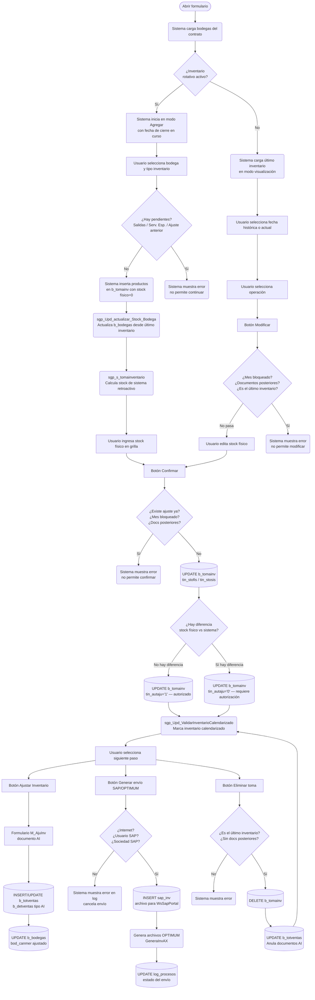

# Toma de Inventario

**Formulario VB6:** `M_TomInv.frm`
**Tabla(s) principal(es):** `b_tomainv` (registro de conteos físicos de bodega), `b_bodegas` (stock actual por producto), `b_productospmpdia` (precio promedio ponderado diario)
**SP principal:** `sgp_s_tomainventario` — Recalcula el stock de sistema retroactivamente; `sgp_Upd_actualizar_Stock_Bodega` — Actualiza el stock de bodega desde el último inventario; `sgp_Upd_ValidarInventarioCalendarizado` — Marca como procesado el inventario calendarizado

---

## Contexto

El formulario de Toma de Inventario es el punto de cierre del ciclo de inventario en cada bodega. Permite al bodeguero registrar el conteo físico de los productos almacenados en una fecha determinada: el operador anota cuántas unidades hay realmente en estante para cada artículo, y el sistema calcula simultáneamente el stock teórico que debería haber según todos los movimientos registrados (compras, salidas a producción, mermas, traspasos, devoluciones y ventas de cafetería). La diferencia entre ambas cifras es la base para generar el ajuste de inventario.

El formulario pertenece a la etapa de cierre de inventario. Puede ejecutarse de dos formas: como **Inventario Full** (cubre todos los productos de la bodega al cierre de mes) o como **Inventario Rotativo** (cubre un subconjunto de productos de alta rotación en días intermedios del período). En casinos con inventario rotativo habilitado, el formulario se abre directamente en modo de carga para el día de cierre diario en curso.

El proceso requiere que el período contable esté activo (tabla `b_cierreperiodo`), que no existan salidas de producción ni ventas de servicios especiales pendientes, y que el ajuste del inventario anterior ya haya sido procesado. Una vez confirmada la toma, el sistema puede transmitir los datos al sistema SAP a través de un servicio web y al sistema OPTIMUM a través de archivos de intercambio.

---

## Parámetros de Entrada

| Campo | Descripción | Obligatorio |
|---|---|---|
| Fecha de inventario | Fecha del conteo físico. En modo Agregar se limita al rango del período abierto y no puede retroceder más allá de la última toma registrada. | Sí |
| Bodega | Lista desplegable con las bodegas del contrato activo. Determina el conjunto de productos que aparecen en la grilla. | Sí |
| Tipo de inventario | Permite elegir entre **Inventario Rotativo** (productos de alta rotación) o **Inventario Full** (todos los productos). Solo aparece habilitado si el contrato tiene activo el parámetro de inventario rotativo. | Condicional |
| Mostrar Familia Producto | Casilla que agrupa los productos por tipo o familia en la grilla, insertando filas de encabezado de categoría. El sistema guarda esta preferencia en el parámetro `opfampro`. | No |
| Búsqueda por código | Campo de texto para filtrar la grilla mostrando solo las filas cuyo código de producto coincida con el texto ingresado. | No |
| Búsqueda por nombre | Campo de texto para filtrar la grilla mostrando solo las filas cuyo nombre de producto coincida con el texto ingresado. | No |

---

## Estructura de la Grilla

La grilla muestra un registro por producto incluido en la toma de inventario. En modo "Mostrar Familia Producto", se intercalan filas de cabecera con el nombre de la familia (sin datos editables).

| Col | Nombre | Origen | Editable | Visible | Calculado | Observaciones |
|---|---|---|---|---|---|---|
| 1 | Código de producto | `b_tomainv.tin_codpro` | No | No | No | Clave interna. Se usa para identificar la fila al grabar. |
| 2 | Nombre del producto | `b_productos.pro_nombre` | No | Sí | No | Nombre descriptivo del artículo. |
| 3 | Unidad de medida | `a_unidad.uni_nombre` | No | Sí | No | Unidad en que se expresa el stock (kg, litros, unidades, etc.). |
| 4 | Stock de sistema | `b_tomainv.tin_stosis` | No | Condicional | Sí | Calculado por `sgp_s_tomainventario`. Oculto en modo Agregar (solo visible al consultar o modificar). En Colombia siempre oculto. |
| 5 | Stock físico | `b_tomainv.tin_stofis` | Sí (en modo M/A) | Sí | No | Cantidad contada físicamente por el bodeguero. Campo principal de captura. Solo acepta valores ≥ 0. |
| 6 | PMP | `b_tomainv.tin_propon` | No | Sí | No | Precio Promedio Ponderado del producto en la fecha de cierre, tomado de `b_productospmpdia`. Oculto en Colombia. |
| 7 | Costo total | Calculado | No | Sí | Sí | Stock físico × PMP. Se recalcula en pantalla al cargar; no se almacena directamente. Oculto en Colombia. |

##### Cálculo — Stock de sistema (columna 4)

El stock de sistema representa la cantidad que teóricamente debería haber en bodega según todos los movimientos registrados desde el inicio del período hasta la fecha del inventario. No se almacena como un valor estático; se recalcula cada vez que se carga la toma, usando el estado actual de las tablas de movimientos.

**Origen del cálculo:** Stored Procedure: `sgp_s_tomainventario`

**Fórmula o lógica:**

El procedimiento parte del stock almacenado en `b_bodegas` (que corresponde al momento actual) y lo ajusta hacia atrás en el tiempo para estimar qué había en la fecha de la toma:

1. Toma como base el stock físico registrado en `b_bodegas.bod_canmer` para cada producto.
2. Suma las compras (notas de crédito y notas de débito) con fecha de recepción posterior a la fecha de la toma. Estas compras aumentaron el stock después de la toma, por lo que se suman para "volver atrás".
3. Resta las demás compras (facturas, guías) con fecha posterior a la toma, ya que ingresaron al stock después.
4. Suma las salidas por ventas (salidas a producción, mermas, facturas, guías de despacho, traspasos de salida, ajustes de inventario disminución) con fecha posterior a la toma, ya que redujeron el stock después.
5. Resta las devoluciones (devoluciones de producción, traspasos de entrada, ajustes de inventario aumento) con fecha posterior a la toma.
6. Realiza el mismo ajuste para ventas de cafetería (tabla `b_detventascafpro`) y para ventas de servicios especiales (tablas `b_totventaserviciosespeciales` / `b_detventaserviciosespeciales`).

| Componente | Descripción | Origen |
|---|---|---|
| Stock base | Cantidad actual en bodega | `b_bodegas.bod_canmer` |
| Compras posteriores (NC/CE) | Notas de crédito y corrección recibidas después de la toma | `b_totcompras` / `b_detcompras`, `dec_mueinv='S'` |
| Compras posteriores (otros) | Facturas y guías ingresadas después de la toma | `b_totcompras` / `b_detcompras`, `dec_mueinv='S'` |
| Ventas/salidas posteriores | Salidas a producción, mermas, facturas, guías, traspasos salida, ajustes disminución | `b_totventas` / `b_detventas`, `dev_mueinv='S'` |
| Devoluciones posteriores | Devoluciones de producción, traspasos entrada, ajustes aumento | `b_totventas` / `b_detventas`, `dev_mueinv='S'` |
| Ventas cafetería posteriores | Consumos de cafetería cerrados con fecha posterior a la toma | `b_totventascaf` / `b_detventascafpro` |
| Ventas especiales posteriores | Salidas de servicios especiales con fecha de producción posterior | `b_totventaserviciosespeciales` / `b_detventaserviciosespeciales` |

> **Ejemplo:** Si hoy la bodega tiene 50 kg de arroz (stock actual) y después de la fecha de la toma ingresaron 20 kg (compra) y salieron 8 kg (producción), el stock de sistema para la fecha de la toma = 50 + 8 – 20 = 38 kg.

##### Cálculo — Costo total (columna 7)

El costo total de cada producto en el inventario no se almacena en la base de datos porque depende tanto del stock físico (que cambia con cada conteo) como del PMP (que varía diariamente). Se calcula en pantalla solo para orientar al usuario sobre el valor del stock.

**Origen del cálculo:** Fórmula aritmética entre campos

**Fórmula o lógica:**

Costo total = Stock físico (col 5) × PMP (col 6)

| Componente | Descripción | Origen |
|---|---|---|
| Stock físico | Cantidad contada por el bodeguero | `b_tomainv.tin_stofis` |
| PMP | Precio promedio ponderado vigente del producto | `b_tomainv.tin_propon` (copiado de `b_productospmpdia.ppd_propon`) |

> **Ejemplo:** Si hay 38 kg de arroz (stock físico) a un PMP de $850 por kg, el costo total que se muestra en la grilla es 38 × 850 = $32,300.

---

## Operaciones Disponibles

### Barra principal (Toolbar1)

| Botón | Acción |
|---|---|
| **Agregar** | Inicia una nueva toma de inventario para la bodega y fecha seleccionadas. El sistema inserta en la tabla de toma todos los productos vigentes de la bodega con stock físico en 0, actualiza el stock de bodega (SP `sgp_Upd_actualizar_Stock_Bodega`) y calcula el stock de sistema (SP `sgp_s_tomainventario`). Solo disponible si no hay pendientes. |
| **Modificar** | Habilita la edición del stock físico del último inventario registrado. Solo permite modificar la toma de la fecha de cierre diario en curso y únicamente si no existe ajuste posterior ni documentos posteriores. |
| **Eliminar** | Borra toda la toma de inventario de la fecha seleccionada. Revierte en `b_bodegas` los movimientos del ajuste asociado, anula los documentos de ajuste (tipo `AI`) y ejecuta `sgp_Upd_ValidarInventarioCalendarizado`. Solo puede eliminarse la última toma registrada. |
| **Refrescar** | Recarga la grilla sin cambiar el modo. |
| **Cancelar** | Descarta los cambios en curso y restaura la vista al último inventario guardado. Solicita confirmación. |
| **Confirmar / Grabar** | Persiste el stock físico ingresado en `b_tomainv`. Evalúa si hay diferencia entre stock físico y stock de sistema: si no hay diferencia, activa automáticamente la autorización de ajuste (`tin_autaju='1'`); si hay diferencia, la desactiva para requerir autorización manual. Marca el inventario calendarizado como procesado. |
| **Imprimir** | Abre el informe de Toma de Inventario (`I_TomInv`). |
| **Histórico** | Muestra una lista desplegable con todas las fechas de inventario anteriores. Al seleccionar una fecha, carga esa toma en la grilla en modo solo lectura. |
| **Filtrar productos** | Abre el buscador de productos (`B_Produc`) para seleccionar un subconjunto de artículos que se quieran ver y editar. Activa modo Modificar sobre ese subconjunto. |
| **Autorizar ajuste** | Marca manualmente la toma como lista para ajustar (`tin_autaju='1'`), aunque exista diferencia entre stock físico y sistema. Requiere confirmación. |
| **Generar envío Inventario** | Genera y envía el archivo de inventario al sistema SAP a través del servicio web (`WsSapPortal.exe`). Registra el proceso en `log_procesos`. Si el casino tiene OPTIMUM activo, también genera los archivos para ese sistema (`GeneraInvAX`). Requiere conexión a internet, usuario y contraseña SAP configurados, y sociedad SAP asignada al contrato. |
| **Anular envío Inventario** | Regenera el archivo SAP/OPTIMUM marcando la toma como "envío anulado". Requiere autenticación con usuario y clave especial (`parconaein`). |
| **Ajustar Inventario** | Abre el formulario de Ajuste de Inventario (`M_AjuInv`) para la fecha seleccionada, donde se registran las diferencias como documentos de ajuste tipo `AI`. |
| **Anular Ajuste Inventario** | Revierte el ajuste de inventario ya generado: deshace los movimientos en `b_bodegas` y anula los documentos `AI` asociados. Actualiza el estado de autorización y el inventario calendarizado. |
| **Exportar Inventario** | Exporta los datos de la toma a un archivo externo para revisión fuera del sistema. |
| **Importar Inventario** | Importa un archivo con conteos físicos, poblando la grilla con los datos del archivo. Solo disponible si no existe una carátula de inventario enviada. |
| **Generar inventario OPTIMUM** | Genera los archivos para el sistema OPTIMUM de forma independiente, a través del formulario `P_GenInvAx`. |
| **Explorar carpeta OPTIMUM** | Abre el explorador de archivos en la carpeta donde se guardan los archivos generados para OPTIMUM. |
| **Cerrar** | Cierra el formulario. Si la fecha es la del cierre diario y no hay diferencia de ajuste pendiente, pregunta si desea cerrar el inventario y marca el estado en `a_param` (`partominv='0'`). |

### Barra de productos (Toolbar2)

| Botón | Acción |
|---|---|
| **Agregar Producto** | Agrega un producto individual a la toma en curso, buscándolo en el catálogo. El producto se inserta en `b_tomainv` con stock físico 0 y el PMP del día anterior. Solo disponible cuando hay una toma abierta y no hay cambios sin grabar. |
| **Eliminar Producto** | Elimina de la toma el producto actualmente seleccionado en la grilla. Solicita confirmación. |

---

## Validaciones

| # | Momento | Condición | Resultado |
|---|---|---|---|
| 1 | Al Agregar | Existen salidas de producción sin cerrar (pendientes) | No permite iniciar la toma. Mensaje: "Existen documentos pendientes en la salida producción. Debe cerrar las salidas". |
| 2 | Al Agregar | Existen ventas de servicios especiales sin cerrar | No permite iniciar la toma. Mensaje: ventas servicios especiales pendientes. |
| 3 | Al Agregar | No se ha generado el ajuste de la última toma de inventario | No permite iniciar una nueva toma. Mensaje: "No ha realizado el ajuste correspondiente a la última toma de inventario". |
| 4 | Al Agregar | Existe una carátula de inventario generada y no anulada (`tin_envsap`) | No permite iniciar la toma. Mensaje: "Existe generación de carátula inventario, debe anularla". |
| 5 | Al Modificar | El período está bloqueado (cierre de mes ya cerrado) | No permite modificar. Mensaje: "Mes Bloqueado". |
| 6 | Al Modificar | Existen documentos con fecha posterior a la toma a modificar | No permite modificar. Mensaje: "Existen documentos posteriores a esta toma inventario". |
| 7 | Al Modificar | La fecha de la toma no coincide con la fecha de cierre diario en curso | No permite modificar. Mensaje: "Día está bloqueado". |
| 8 | Al Modificar | Se intenta modificar una toma que no es la última | No permite modificar. Mensaje: "Solo puede modificar el último inventario si no se ha generado el ajuste". |
| 9 | Al Eliminar | El inventario rotativo está activo y el día no está reabierto | No permite eliminar. Mensaje: "No es posible borrar documento, debe reabrir día". |
| 10 | Al Eliminar | El período está bloqueado | No permite eliminar. Mensaje: "Mes Bloqueado". |
| 11 | Al Eliminar | Existen documentos con fecha posterior a la toma | No permite eliminar. Mensaje: "Existen documentos posteriores a la fecha de esta toma de inventario". |
| 12 | Al Eliminar | Se intenta eliminar una toma que no es la última | No permite eliminar. Mensaje: "Solo puede eliminar la última toma de inventario". |
| 13 | Al Confirmar | Ya existe un ajuste de inventario para esa fecha (`AI`) | No permite confirmar. Mensaje: "Existe ajuste de inventario. Proceso cancelado". |
| 14 | Al Confirmar | Existen documentos posteriores a la toma | No permite confirmar. Mensaje: "Existen documentos posteriores a esta toma inventario". |
| 15 | Al Confirmar | Falta la fecha o el casino activo | No permite confirmar. Mensaje: "Falta dato importante". |
| 16 | Al ingresar stock físico | El usuario escribe un valor negativo en la grilla | El sistema reemplaza el valor por 0 automáticamente. |
| 17 | Al Generar envío SAP | No hay conexión a internet | Cancela el proceso. Mensaje: "No hay conexión a internet, proceso cancelado". |
| 18 | Al Generar envío SAP | No existe usuario SAP configurado en parámetros | Cancela el proceso. Muestra en el log: "No tiene creado usuario para Web Service". |
| 19 | Al Generar envío SAP | No existe sociedad SAP asignada al contrato | Cancela el proceso. Muestra en el log: "No tiene asignado la sociedad de SAP". |
| 20 | Al Anular Ajuste | El inventario rotativo está activo y el día no está reabierto | No permite anular. Mensaje: "No es posible anular ajuste, debe reabrir día". |
| 21 | Al Anular Ajuste | Existe un envío de inventario ya procesado | No permite anular. Mensaje: "Existe un envío documento, debe anular envío documento". |
| 22 | Al Importar | Existe una carátula de inventario generada y no anulada | No permite importar. Mensaje: "Existe generación de carátula inventario, debe anularla". |
| 23 | Al Agregar producto individual | El producto ya existe en la grilla | No duplica. Mensaje: "El producto ya existe en la grilla". |
| 24 | Al Eliminar producto individual | Se intenta eliminar una fila de encabezado de familia | No permite eliminar. Mensaje: "No puede eliminar familia producto". |
| 25 | Al cerrar el formulario | La fecha es la del cierre diario y no hay diferencia de ajuste pendiente | Sistema pregunta: "¿Está seguro de cerrar inventario ya que no hay diferencia de ajuste?". Si el usuario confirma, marca `partominv='0'` y ejecuta `sgp_Upd_ValidarInventarioCalendarizado`. |

---

## Flujo de Datos

---

## Dónde se Almacena

### Toma de inventario (`b_tomainv`)

| Campo | Descripción |
|---|---|
| `tin_fectom` | Fecha del conteo físico en formato AAAAMMDD. Parte de la clave primaria. |
| `tin_codbod` | Código de la bodega donde se realizó el conteo. Parte de la clave primaria. |
| `tin_codpro` | Código del producto contado. Parte de la clave primaria. |
| `tin_stofis` | Stock físico registrado por el bodeguero (cantidad contada). |
| `tin_stosis` | Stock de sistema calculado retroactivamente por `sgp_s_tomainventario`. |
| `tin_propon` | PMP del producto en el momento de la toma. Copiado de `b_productospmpdia`. |
| `tin_ciemes` | Año y mes (`AAAAMM`) si es cierre de mes; 0 si es precierre. |
| `tin_envsap` | Estado del envío a SAP. Vacío = no enviado; valor = enviado. |
| `tin_autaju` | Autorización de ajuste: `'1'` = autorizado (sin diferencia o autorizado manualmente), `'0'` = pendiente de autorización. |
| `tin_tipinv` | Tipo de inventario: `'1'` = Rotativo, `'2'` = Full. |
| `tin_envioADMSGP` | Estado de envío al sistema central SGP. |

**Clave primaria:** La combinación de `tin_fectom` + `tin_codbod` + `tin_codpro` identifica unívocamente un registro: el conteo de un producto específico en una bodega específica en una fecha específica.

---

### Stock de bodega (`b_bodegas`)

| Campo | Descripción |
|---|---|
| `bod_codbod` | Código de la bodega. |
| `bod_codpro` | Código del producto. |
| `bod_canmer` | Cantidad actual en bodega. Se actualiza al grabar inventario (via `sgp_Upd_actualizar_Stock_Bodega`), al procesar ajustes, y al revertir eliminaciones. |

**Clave primaria:** `bod_codbod` + `bod_codpro`.

---

### Precio promedio ponderado diario (`b_productospmpdia`)

| Campo | Descripción |
|---|---|
| `ppd_cencos` | Centro de costo (contrato) al que corresponde el precio. |
| `ppd_fecdia` | Fecha del día para la que se registra el precio. |
| `ppd_codpro` | Código del producto. |
| `ppd_propon` | PMP vigente del producto en esa fecha. |
| `ppd_saldo` | Saldo de stock según la toma de inventario. Se actualiza al confirmar la toma con el valor de `tin_stofis`. |

**Clave primaria:** `ppd_cencos` + `ppd_fecdia` + `ppd_codpro`.

---

### Inventario calendarizado (`b_casinoinventariocalendarizado`)

| Campo | Descripción |
|---|---|
| `IdCeco` | Contrato al que pertenece el calendario. |
| `Fecha_Inventario` | Fecha programada para realizar el inventario. |
| `Activo` | Indica si el ítem del calendario está vigente. |
| `Procesado` | Se actualiza a `'1'` cuando la toma es confirmada o enviada, y a `'0'` cuando se anula o elimina. El SP `sgp_Upd_ValidarInventarioCalendarizado` gestiona este campo. |

---

## SP / Funciones Referenciados

### `sgp_s_tomainventario` — Calcula el stock de sistema retroactivamente para la toma de inventario

**Parámetros de entrada:**

| Parámetro | Descripción |
|---|---|
| `@cencos` | Centro de costo (contrato) del casino. |
| `@codbod` | Código de la bodega. |
| `@fecinv` | Fecha de la toma en formato AAAAMMDD. |
| `@fecdoc2` | Fecha de la toma en formato dd/mm/yyyy (para cálculos de comparación). |
| `@dca` | Número de decimales para cantidades (según configuración del casino). |
| `@Modo` | Modo de operación: `'A'` = Agregar, `'M'` = Modificar. |
| `@fecterper` | Fecha de término del período de cierre (para determinar si es cierre de mes). |

**Lógica principal:**

1. Inicializa el stock de sistema (`tin_stosis`) en 0 para todos los productos de la bodega en la fecha de la toma.
2. Copia el stock actual de `b_bodegas.bod_canmer` como punto de partida.
3. Suma compras (notas de crédito/corrección) y resta compras (facturas/guías) recibidas **después** de la fecha de la toma, usando la fecha de recepción (`toc_fecrem`).
4. Suma salidas de ventas (producción, mermas, facturas, guías, traspasos de salida, ajustes de disminución) y devoluciones (traspasos de entrada, ajustes de aumento) realizadas **después** de la toma.
5. Aplica el mismo ajuste para ventas de cafetería (`b_totventascaf`/`b_detventascafpro`) y ventas de servicios especiales (`b_totventaserviciosespeciales`/`b_detventaserviciosespeciales`).
6. El resultado final en `tin_stosis` representa cuánto había en bodega en el momento exacto de la toma.

**Tablas que modifica:** `b_tomainv` (campo `tin_stosis`)

---

### `sgp_Upd_actualizar_Stock_Bodega` — Recalcula el stock actual de bodega desde el último inventario de cierre

**Parámetros de entrada:**

| Parámetro | Descripción |
|---|---|
| `@Ceco` | Centro de costo (contrato). |
| `@CodBod` | Código de la bodega. |
| `@FechaInventario` | Fecha del inventario actual en formato AAAAMMDD. |

**Lógica principal:**

1. Identifica el último inventario de cierre de mes procesado buscando en `b_cierreperiodo`.
2. Carga en una tabla temporal los productos de ese inventario (stock físico confirmado en `b_tomainv`). Agrega también productos que estén en `b_bodegas` pero no en la toma.
3. Para cada producto, calcula el nuevo stock acumulando sobre el stock físico del último cierre: ajustes de inventario (aumentos y disminuciones), compras centralizadas, mermas, facturas y guías, salidas a producción, devoluciones de producción, traspasos de entrada y salida, ventas de cafetería y ventas de servicios especiales — todos los del día de cierre diario en curso.
4. Actualiza `b_bodegas.bod_canmer` con el valor calculado. Si el resultado es negativo, almacena 0.

**Tablas que modifica:** `b_bodegas` (campo `bod_canmer`)

---

### `sgp_Upd_ValidarInventarioCalendarizado` — Actualiza el estado del inventario calendarizado

**Parámetros de entrada:**

| Parámetro | Descripción |
|---|---|
| `@Ceco` | Centro de costo (contrato). |
| `@Fecha` | Fecha de cierre en formato AAAAMMDD. |
| `@Procesado` | Nuevo estado: `'1'` = procesado, `'0'` = pendiente. |

**Lógica principal:**

1. Busca en `b_casinoinventariocalendarizado` si hay un inventario calendarizado cuya fecha programada esté dentro del rango de holgura definido en `b_casinoinventariosholgurainvcalendarizado` (días antes y después permitidos).
2. Si existe al menos una toma en `b_tomainv` para esa bodega y fecha, actualiza el campo `Procesado` de `b_casinoinventariocalendarizado` con el valor recibido.
3. Este SP se llama al confirmar (marca `'0'`), al generar el envío SAP (marca `'1'`), al anular el ajuste (marca `'0'`) y al cerrar el formulario sin diferencia de ajuste.

**Tablas que modifica:** `b_casinoinventariocalendarizado` (campo `Procesado`)

---

## Relación con Otros Módulos

| Módulo | Relación |
|---|---|
| **Salida a Producción** | Prerequisito: deben estar cerradas todas las salidas del día antes de iniciar o confirmar una toma. Los movimientos de tipo `SP` afectan el stock de sistema calculado. |
| **Ventas de Servicios Especiales** | Prerequisito: deben estar cerradas antes de iniciar o confirmar la toma. Los movimientos de tipo `SE` / `DE` entran en el cálculo del stock de sistema. |
| **Ajuste de Inventario (`M_AjuInv`)** | El formulario de Toma de Inventario inicia el proceso; el ajuste (`M_AjuInv`) lo completa generando los documentos de tipo `AI` que corrigen el stock en `b_bodegas`. La toma no puede iniciarse si existe un ajuste pendiente del inventario anterior. |
| **Compras** | Las facturas, guías y notas de crédito registradas en `b_totcompras`/`b_detcompras` se usan para calcular el stock de sistema retroactivo. |
| **Traspasos entre casinos** | Los traspasos de tipo `TR` afectan el stock de sistema: las salidas de traspaso reducen el stock y las entradas de traspaso lo aumentan. |
| **Cierre Diario / Cierre de Período** | La toma se realiza necesariamente en la fecha de cierre diario (`vg_ciedia - 1`) o en fechas dentro del período abierto (`b_cierreperiodo`). El cierre de mes bloquea la edición de inventarios del período cerrado. |
| **SAP** | El envío de inventario a SAP a través del servicio web (`WsSapPortal.exe`) requiere usuario, contraseña y sociedad SAP configurados en `a_param`. El resultado queda registrado en `log_procesos` y en `sap_inv`. |
| **OPTIMUM** | Si el contrato tiene activo el parámetro de envío a OPTIMUM (opción `5` de `ValidarOpEnvio`), al generar o anular el envío SAP también se generan archivos para OPTIMUM mediante `GeneraInvAX`. |
| **Venta de Cafetería** | Los consumos de cafetería cerrados (`tvc_estado='C'`) con fecha posterior a la toma entran en el cálculo del stock de sistema. |

---

*Fuentes: `M_TomInv.frm`, tabla `b_tomainv`, `b_bodegas`, `b_productospmpdia`, `b_casinoinventariocalendarizado` en `SGP_Local.sql`*
