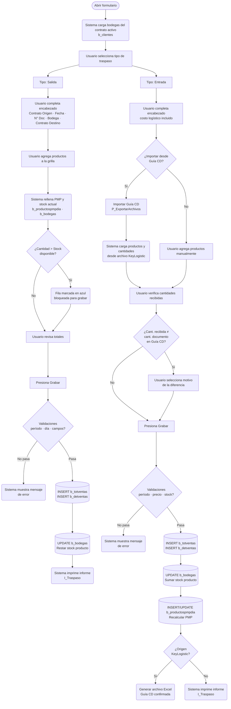

# Traspaso entre Casinos

**Formulario VB6:** `M_Traspa.frm`
**Tabla(s) principal(es):** `b_totventas` (encabezado del documento de traspaso), `b_detventas` (líneas de productos traspassados), `b_bodegas` (stock de bodega), `b_productospmpdia` (precio promedio ponderado diario)
**SP principal:** `sgp_Sel_MostrarTrapasoEntradaGrilla`, `sgp_Sel_ProductoTraspasoSalEnt`, `sgp_Sel_EncabezadoTrapaso`

---

## Contexto

El formulario de Traspasos permite mover mercadería entre dos contratos distintos dentro del sistema SGP. Un traspaso genera siempre un par de movimientos: el contrato que entrega la mercadería registra una **Salida**, y el contrato que la recibe registra una **Entrada**. Ambos documentos se registran con tipo `TR` en la base de datos y quedan ligados por el mismo número de documento.

Este módulo corresponde a la etapa de gestión de inventario: se usa cuando la bodega de un casino necesita trasladar productos a otro casino, ya sea por sobrestock, préstamo entre contratos, o recepción desde el centro de distribución (CD) de Sodexo a través del sistema KeyLogistic. Al ser un traspaso de entrada, el sistema recalcula automáticamente el precio promedio ponderado (PMP) del producto recibido en la bodega de destino.

El formulario presenta un panel de encabezado donde se completan los datos del documento, y debajo una grilla con las líneas de productos. No tiene pestañas; el contenido de la grilla cambia visualmente según si el traspaso es de Salida o de Entrada (se agrega o se oculta la columna de cantidad recibida). El botón "Importar Guía CD" solo está disponible cuando el tipo es Entrada y permite cargar datos directamente desde archivos del sistema logístico KeyLogistic.

---

## Parámetros de Entrada

| Campo | Descripción | Obligatorio |
|---|---|---|
| Contrato Origen | Código del contrato (casino) que origina el traspaso. Se llena automáticamente con el casino activo en sesión, pero puede cambiarse. | Sí |
| Fecha Emisión | Fecha del documento de traspaso en formato `dd/mm/yyyy`. Debe corresponder a un día abierto dentro del período vigente. | Sí |
| N° Documento | Número de documento del traspaso. Se ingresa para crear uno nuevo o para buscar uno existente. | Sí |
| Bodega | Lista desplegable con las bodegas disponibles del contrato. Determina de qué bodega sale o entra la mercadería. | Sí |
| Tipo Traspaso | Indica si el documento corresponde a una **Salida** (la mercadería sale del contrato origen) o a una **Entrada** (la mercadería llega al contrato destino). | Sí |
| Casino 2 (Contrato Destino) | Código del contrato receptor. No puede ser el mismo que el contrato origen. | Sí |
| Costo Logístico | Monto adicional por concepto de flete o logística. Solo habilitado en modo Entrada. Puede ser cero. | Solo en Entrada |
| Folio | Número de folio interno generado por el sistema a partir de la tabla de correlativos. Solo de lectura; el sistema lo asigna al grabar. | — |

---

## Estructura de la Grilla

La grilla muestra las líneas de productos del traspaso. Las columnas visibles varían según el tipo de traspaso y si el documento proviene de una Orden de Compra (OC) o de una Guía CD/KeyLogistic.

| Col | Nombre | Origen | Editable | Visible | Calculado | Observaciones |
|---|---|---|---|---|---|---|
| 1 | Código Producto | `b_productos.pro_codigo` | Sí (solo en nuevo) | Sí | No | Se puede ingresar directamente o buscar con el botón "Agr. Prod." |
| 2 | Descripción Producto | `b_productos.pro_nombre` | No | Sí | No | Se rellena automáticamente al ingresar el código |
| 3 | Unidad | `a_unidad.uni_nombre` | No | Sí | No | Unidad de medida del producto |
| 4 | Cantidad | `b_detventas.dev_canmin` (Entrada) / `b_detventas.dev_canmer` (Salida) | Sí | Sí | No | Cantidad enviada en Salida; cantidad comprometida en Entrada cuando viene de OC |
| 5 | PMP / Precio Documento | `b_productospmpdia.ppd_propon` (Salida) / `b_detventas.dev_predoc` (Entrada) | No (Salida) / Sí (Entrada) | Sí | Sí (en Salida) | En Salida se llena con el PMP vigente del producto; en Entrada el usuario ingresa el precio del documento |
| 6 | Total Línea | `b_detventas.dev_ptotal` | No | Sí | Sí | Calculado: Cantidad × Precio |
| 7 | Cantidad Recibida | `b_detventas.dev_canmer` | Sí | Solo en Entrada | No | Cantidad efectivamente recibida. Puede diferir de Cantidad cuando viene de Guía CD |
| 8 | Bloqueado | Interno | No | No | No | "S" = cantidad supera el stock disponible; "N" = sin problema de stock |
| 9 | Stock Actual | `b_bodegas.bod_canmer` | No | Sí | No | Stock de la bodega al momento de la consulta; se actualiza tras grabar |
| 10 | Control Stock | `b_productos.pro_ctrsto` | No | No | No | Indicador interno: "S" = el producto lleva control de stock |
| 11 | PMP Referencia | `b_productospmpdia.ppd_propon` | No | No | No | PMP del producto usado para validar precios; no se muestra al usuario |
| 12 | Acepta Precio Diferente | Interno | No | No | No | "S" = el precio ingresado supera el porcentaje permitido respecto al último registrado |
| 13 | Cantidad OC | `b_ocsacrecibido.ocr_canoc` | No | Solo en modo OC | No | Cantidad de la orden de compra correspondiente |
| 14 | Precio OC | `b_ocsacrecibido.ocr_preoc` | No | Solo en modo OC | No | Precio pactado en la orden de compra |
| 15 | Fecha OC | `b_ocsacrecibido.ocr_fecoc` | No | Solo en modo OC | No | Fecha de la orden de compra; si tiene fecha, el producto no puede eliminarse de la grilla |
| 16 | Código SAP | `b_formatocompras_sap.fcs_CodMaterial` | No | Solo en Entrada/OC | No | Código del material en el sistema SAP (solo para contratos con integración SAP) |
| 17 | Nombre SAP | `b_formatocompras_sap.fcs_DenMaterial` | No | Solo en Entrada/OC | No | Descripción del material según SAP |
| 19 | Motivo Diferencia | `a_motivo.Descripcion Motivo` | Sí (combo) | Solo en Guía CD | No | Motivo cuando la cantidad recibida difiere de la cantidad del documento; obligatorio en Guía CD si hay diferencia |
| 20 | Código Motivo | `a_motivo.IdMotivo` | No | No | No | Código interno del motivo seleccionado; se graba en `b_detventas.dev_IdMotivo` |
| 21 | Origen GuíaCD | Interno | No | No | No | Valor "GuiaCD" si la línea fue importada desde KeyLogistic; impide eliminar la línea |

##### Cálculo — PMP / Precio (Columna 5, modo Salida)

En modo Salida, el precio que se muestra en esta columna no es ingresado por el usuario sino que corresponde al precio promedio ponderado vigente del producto en la bodega del casino, calculado al momento de abrir o refrescar el formulario.

**Origen del cálculo:** Subconsulta / cruce de tablas

**Fórmula o lógica:**
El sistema busca en `b_productospmpdia` el PMP más reciente del producto para el casino activo, considerando fechas entre el día anterior al cierre diario y la fecha de emisión ingresada. Se toma el último valor mayor a cero ordenado por fecha descendente.

| Componente | Descripción | Origen |
|---|---|---|
| PMP vigente | Último precio promedio ponderado registrado para el producto | `b_productospmpdia.ppd_propon` |
| Casino activo | Código del casino actual en sesión | Variable de sesión `vg_cencos` |
| Fecha de referencia | Rango desde el día anterior al cierre hasta la fecha del documento | `a_param` (clave `ciediario`) y `fpDateTime1(0)` |

> Ejemplo: si el producto "Aceite 1L" tiene PMP = $1.800 al 15/03/2026 y la fecha de emisión es 17/03/2026, la columna mostrará $1.800. Si el usuario cambia la fecha a 20/03/2026 y hay un PMP más reciente de $1.950, se actualizará a $1.950.

##### Cálculo — Total Línea (Columna 6)

Representa el valor total de la línea en pesos, resultado de multiplicar la cantidad del documento por el precio unitario.

**Origen del cálculo:** Fórmula aritmética entre campos

**Fórmula o lógica:**
Total Línea = Cantidad (Col 4) × Precio Unitario (Col 5)

| Componente | Descripción | Origen |
|---|---|---|
| Cantidad | Unidades del producto a traspasar | Col 4 de la grilla |
| Precio Unitario | PMP (en Salida) o precio del documento (en Entrada) | Col 5 de la grilla |

> Ejemplo: si se traspasan 50 kg de harina a $800/kg, el total de la línea será $40.000.

---

## Operaciones Disponibles

| Botón | Acción |
|---|---|
| **Nuevo** | Limpia el formulario y deja listo para ingresar un nuevo traspaso. Si hay datos cargados, solicita confirmación antes de limpiar. |
| **Grabar** | Valida todos los campos y líneas; luego crea el encabezado en `b_totventas`, las líneas en `b_detventas`, actualiza el stock en `b_bodegas`, y recalcula el PMP en `b_productospmpdia` (solo en Entrada). Si proviene de KeyLogistic, genera además un archivo Excel de respaldo. Al terminar, muestra el informe de traspaso. |
| **Eliminar** | Revierte el documento: deshace el movimiento de stock en `b_bodegas`, elimina las líneas de `b_detventas`, registros de `b_ocsacrecibido` y el encabezado de `b_totventas`. Solo disponible si el período está abierto y el día no está cerrado. Solicita confirmación previa. |
| **Buscar** | Abre la ventana de búsqueda de documentos de traspaso filtrada por el contrato origen. Al seleccionar un resultado, carga el documento completo en el formulario. |
| **Imprimir** | Genera e imprime el informe del traspaso cargado. Si el documento proviene de KeyLogistic, genera un archivo Excel en la carpeta GuiaLogistico en lugar del informe habitual. |
| **Importar Guía CD** | Disponible solo en modo Entrada. Abre la pantalla de importación de archivos para cargar productos y cantidades desde una guía del sistema logístico KeyLogistic. Las líneas importadas quedan marcadas y no pueden eliminarse de la grilla. |
| **Agr. Prod.** | Agrega una fila a la grilla abriendo el buscador de productos. Valida que el producto no esté duplicado en la grilla (excepto en modo OC con varios códigos SAP). |
| **Elim. Prod.** | Elimina la fila seleccionada en la grilla. No está permitido eliminar líneas provenientes de una Guía CD ni líneas que tengan fecha de OC registrada. |
| **Cerrar** | Cierra el formulario. |

---

## Validaciones

| # | Momento | Condición | Resultado |
|---|---|---|---|
| 1 | Al grabar | El costo logístico es negativo (modo Entrada) | Se bloquea el grabado con el mensaje "Debe ingresar costo logístico, con valor mayor o igual a cero" |
| 2 | Al grabar | Falta algún campo obligatorio del encabezado (contrato, N° documento, fecha, bodega, contrato destino) | Se bloquea con el mensaje "Debe ingresar dato importante" |
| 3 | Al grabar | El contrato tiene inventario rotativo activo con actividad pendiente y la fecha supera el día de cierre | Se bloquea con el mensaje "Tiene que realizar cierre diario" |
| 4 | Al grabar | La fecha del documento no corresponde al período abierto | Se bloquea con el mensaje "Documento no corresponde al periodo" |
| 5 | Al grabar | La fecha es anterior a la última toma de inventario | Se bloquea con el mensaje "No puede ingresar documentos anteriores a la última toma de inventario" |
| 6 | Al grabar | Se está realizando una toma de inventario en ese momento | Se bloquea con el mensaje "Se está realizando la toma de inventario en estos momentos" |
| 7 | Al grabar | La fecha es anterior a un inventario calendarizado pendiente | Se bloquea con el mensaje "No puede ingresar documento, antes de un inventario calendarizado" |
| 8 | Al grabar | No se ha realizado el ajuste de la última toma de inventario | Se bloquea con el mensaje "No ha realizado el ajuste correspondiente a la última toma de inventario" |
| 9 | Al grabar | La fecha del documento es anterior al día de cierre | Se bloquea con el mensaje "Día se encuentra cerrado, no es posible ingresar" |
| 10 | Al grabar | El folio ya existe en otro período | Se bloquea con el mensaje "N° folio corresponde al periodo [mes/año]; tiene que generar un nuevo folio" |
| 11 | Al grabar | El contrato origen y el destino son el mismo | Se bloquea sin mensaje (la operación se cancela) |
| 12 | Al grabar | El total del documento es cero | Se bloquea con el mensaje "El total del documento debe ser mayor a 0" |
| 13 | Al grabar | Alguna línea tiene la cantidad superando el stock disponible | Se bloquea con el mensaje "Existe una cantidad que excede el Stock" |
| 14 | Al grabar | Alguna línea tiene precio en cero | Se bloquea con el mensaje "Existen precio en cero" y se posiciona en la celda correspondiente |
| 15 | Al grabar | Alguna línea tiene cantidad cero (salvo en modo OC o Guía CD) | Se bloquea con el mensaje "Existen cantidades documento en cero" |
| 16 | Al grabar | En modo Entrada, alguna línea tiene cantidad recibida en cero (salvo en modo OC o Guía CD) | Se bloquea con el mensaje "Existen cantidades recibidas en cero" |
| 17 | Al grabar | En Guía CD, la cantidad recibida difiere de la cantidad del documento y no hay motivo indicado | Se bloquea con el mensaje "Debe ingresar la descripción del motivo" |
| 18 | Al grabar | El precio ingresado supera el porcentaje permitido (`porprepro`) respecto al último precio registrado | Se muestra advertencia "Existen precios ingresados que exceden al último precio registrado" y se solicita confirmación para continuar |
| 19 | Al grabar (Eliminar) | El stock en bodega resulta insuficiente para revertir el traspaso de entrada | Se cancela el Eliminar con el mensaje "Documento no puede ser eliminado. No hay stock suficiente" |
| 20 | Al ingresar contrato | El contrato ingresado no existe en el sistema | Se muestra "Contrato no existe" y se limpia el campo |
| 21 | Al ingresar contrato destino | El contrato destino es igual al origen | Se muestra "No se puede realizar transferencia en el mismo contrato" |
| 22 | Al ingresar producto en grilla | El producto ya existe en otra fila de la grilla | Se muestra "El producto ya existe en la grilla" y se limpia la fila |
| 23 | Al ingresar producto en grilla | El código de producto no existe o no corresponde al casino | Se muestra "producto no existe" y se limpia la fila |
| 24 | Al intentar eliminar línea de Guía CD | La línea fue importada desde KeyLogistic | Se bloquea con el mensaje "No permite eliminar producto exportado desde guía CD. Si no desea utilizar el producto puede dejar la columna Cantidad Recibida con valor cero" |
| 25 | En tiempo real (al cambiar bodega) | Alguna cantidad supera el stock de la nueva bodega seleccionada | La fila se colorea en azul y se marca como bloqueada (indicador interno "S") |

---

## Flujo de Datos

---

## Dónde se Almacena

### Encabezado del Traspaso (`b_totventas`)

| Campo | Descripción |
|---|---|
| `tov_rutcli` | Código del contrato origen (casino que genera el documento) |
| `tov_tipdoc` | Tipo de documento; siempre `TR` para traspasos |
| `tov_numdoc` | Número de documento del traspaso |
| `tov_codbod` | Código de la bodega del contrato de donde sale o entra la mercadería |
| `tov_fecemi` | Fecha de emisión del documento |
| `tov_codser` | Tipo de traspaso: `0` = Salida, `1` = Entrada |
| `tov_codcas` | Código del contrato destino (casino que recibe) |
| `tov_totdoc` | Total monetario del documento (suma de todos los totales de línea) |
| `tov_numinf` | Folio interno asignado desde `a_infcfcfofi` |
| `tov_costologistico` | Costo logístico del despacho (solo aplica en Entrada) |
| `tov_origen` | Origen del documento: `KeyLogistic` si vino de Guía CD, vacío si fue ingresado manualmente |
| `tov_FechaEmision_GGD` | Fecha original de la Guía de Despacho del proveedor (solo en KeyLogistic) |
| `tov_estdoc` | Estado del documento; vacío = activo, `ANULADA` = anulado |

**Clave primaria:** La combinación de `tov_rutcli` + `tov_tipdoc` (`TR`) + `tov_numdoc` + `tov_codbod` identifica de manera única un encabezado de traspaso para un contrato y bodega específicos.

---

### Detalle del Traspaso (`b_detventas`)

| Campo | Descripción |
|---|---|
| `dev_rutcli` | Código del contrato origen (mismo que `tov_rutcli`) |
| `dev_tipdoc` | Tipo de documento; siempre `TR` |
| `dev_numdoc` | Número de documento |
| `dev_numlin` | Número de línea correlativo dentro del documento |
| `dev_codmer` | Código del producto traspasado |
| `dev_canmin` | Cantidad comprometida en el documento (columna 4 en modo Entrada / columna 4 en modo Salida como dev_canmer) |
| `dev_canmer` | Cantidad efectivamente recibida (solo con valor en Entrada) |
| `dev_predoc` | Precio unitario del producto en el documento |
| `dev_ptotal` | Total monetario de la línea |
| `dev_descri` | Descripción del producto en el momento del traspaso |
| `dev_mueinv` | Indicador de si el producto lleva control de movimiento de inventario (`S`/`N`) |
| `dev_IdMotivo` | Código del motivo cuando la cantidad recibida difiere de la comprometida (Guía CD) |

**Clave primaria:** La combinación de `dev_rutcli` + `dev_tipdoc` + `dev_numdoc` + `dev_numlin` identifica de manera única cada línea del traspaso.

---

### Stock en Bodega (`b_bodegas`)

| Campo | Descripción |
|---|---|
| `bod_codpro` | Código del producto |
| `bod_codbod` | Código de la bodega |
| `bod_canmer` | Cantidad actual en bodega; se incrementa al recibir (Entrada) y se descuenta al enviar (Salida) |

**Clave primaria:** La combinación de `bod_codpro` + `bod_codbod` identifica el stock de un producto en una bodega específica.

---

### PMP Diario (`b_productospmpdia`)

| Campo | Descripción |
|---|---|
| `ppd_cencos` | Código del casino (centro de costos) |
| `ppd_codpro` | Código del producto |
| `ppd_fecdia` | Fecha del registro del PMP |
| `ppd_propon` | Precio promedio ponderado calculado para ese día |

**Clave primaria:** La combinación de `ppd_cencos` + `ppd_codpro` + `ppd_fecdia` identifica el PMP de un producto en un casino para una fecha determinada.

---

### Detalle de OC/Guía CD Recibida (`b_ocsacrecibido`)

Tabla auxiliar que registra la relación entre las líneas del traspaso y la orden de compra o guía CD de origen, cuando el traspaso proviene de una Orden de Compra SAP o de KeyLogistic.

| Campo | Descripción |
|---|---|
| `ocr_rutpro` | Código del contrato/proveedor origen |
| `ocr_tipdoc` | Tipo de documento; `TR` en traspasos |
| `ocr_numdoc` | Número de documento |
| `ocr_numlin` | Número de línea |
| `ocr_codprodsgp` | Código del producto en SGP |
| `ocr_codprodsac` | Código del material en SAP/SAC |
| `ocr_cancom` | Cantidad comprometida según la OC o guía |
| `ocr_precom` | Precio comprometido según la OC o guía |
| `ocr_canrec` | Cantidad efectivamente recibida |
| `ocr_fecoc` | Fecha de la orden de compra de origen |
| `ocr_canoc` | Cantidad en la orden de compra |
| `ocr_preoc` | Precio en la orden de compra |

---

## SP / Funciones Referenciados

### `sgp_Sel_MostrarTrapasoEntradaGrilla` — Carga el documento completo en la grilla

**Parámetros de entrada:**

| Parámetro | Descripción |
|---|---|
| `@RutCli` | Código del contrato origen |
| `@NumDoc` | Número del documento a buscar |

**Lógica principal:**
Trae el encabezado y todas las líneas de un documento de traspaso existente. Cruza `b_totventas` con `b_detventas`, `b_productos`, `a_unidad`, `b_clientes`, y además busca la información de OC/SAP desde `b_ocsacrecibido` y `b_formatocompras_sap`. También incluye el stock actual de la bodega del contrato destino y el motivo de diferencia si corresponde. El resultado se usa para poblar toda la grilla y los campos del encabezado cuando se consulta un documento ya grabado.

**Tablas que lee:** `b_totventas`, `b_detventas`, `b_productos`, `a_unidad`, `b_clientes`, `b_ocsacrecibido`, `b_formatocompras_sap`, `b_bodegas`, `a_motivo`

---

### `sgp_Sel_ProductoTraspasoSalEnt` — Trae información de un producto para el traspaso

**Parámetros de entrada:**

| Parámetro | Descripción |
|---|---|
| `@Ceco` | Código del casino activo |
| `@Codigo` | Código del producto a buscar |

**Lógica principal:**
Consulta el maestro de productos cruzando con unidad de medida, el material SAP asociado (si tiene integración SAP), el PMP más reciente dentro del período activo (obtenido desencriptando la fecha de cierre desde `a_param`), y el stock actual en la bodega del casino. Este SP se usa tanto al agregar un producto a la grilla como al ingresar su código directamente en la celda.

**Tablas que lee:** `b_productos`, `a_unidad`, `b_formatocompras_sap`, `b_formatocompras_sap_sgp`, `b_productospmpdia`, `b_bodegas`, `b_clientes`, `a_param`

---

### `sgp_Sel_EncabezadoTrapaso` — Busca el encabezado de un traspaso (función auxiliar)

**Parámetros de entrada:**

| Parámetro | Descripción |
|---|---|
| `@Ceco` | Código del contrato origen |
| `@NumDoc` | Número de documento |

**Lógica principal:**
Consulta únicamente el encabezado en `b_totventas` para verificar si un documento ya existe. Se usa como primera llamada antes de cargar el detalle con `sgp_Sel_MostrarTrapasoEntradaGrilla`.

**Tablas que lee:** `b_totventas`, `b_clientes`

---

### `sgp_Sel_MotivoGuiaCD` — Lista los motivos disponibles para diferencias en Guía CD

**Parámetros de entrada:** Ninguno

**Lógica principal:**
Devuelve todos los registros de la tabla `a_motivo` ordenados por código. Se carga al abrir un documento de traspaso tipo Guía CD para poblar el combo de motivos en la columna de descripción de diferencia.

**Tablas que lee:** `a_motivo`

---

### `sgp_Sel_FormatoComprasSapTraspasoSalEnt` — Verifica si un código SAP tiene múltiples productos SGP

**Parámetros de entrada:**

| Parámetro | Descripción |
|---|---|
| `@Codigo` | Código SAP del material |

**Lógica principal:**
Cuenta cuántos productos SGP están asociados al código SAP recibido en `b_formatocompras_sap_sgp`. Si el resultado es mayor a uno, el sistema abre un selector para que el usuario elija a cuál producto SGP se debe asignar el material SAP en la grilla (doble clic sobre la línea).

**Tablas que lee:** `b_formatocompras_sap`, `b_formatocompras_sap_sgp`

---

### `sgp_Sel_ImportacionGuiaCdxUno` — Genera el reporte de Guía CD para exportar a Excel

**Parámetros de entrada:**

| Parámetro | Descripción |
|---|---|
| `@Ceco` | Código del contrato |
| `@TipDoc` | Tipo de documento (`TR`) |
| `@NumDoc` | Número de documento |
| `@CodBod` | Código de bodega |
| `@Fecha` | Fecha del documento |

**Lógica principal:**
Consulta las líneas del traspaso marcadas como `KeyLogistic` y construye un informe con código y descripción del producto en SGP y en SAP, cantidades originales y reales recibidas, precio, justificación de diferencia y costo logístico. El resultado se vuelca a un archivo Excel que queda guardado en la carpeta `GuiaLogistico` de la ruta de trabajo del sistema.

**Tablas que lee:** `b_totventas`, `b_detventas`, `b_productos`, `a_unidad`, `b_ocsacrecibido`, `b_formatocompras_sap`, `b_clientes`, `a_motivo`

---

## Relación con Otros Módulos

| Módulo | Relación |
|---|---|
| **Cierre Diario** | El traspaso valida el día de cierre (`vg_ciedia`) y el estado del período antes de permitir grabar. Un día cerrado bloquea cualquier ingreso o eliminación. |
| **Inventario / Toma de Inventario** | Si hay una toma de inventario en curso o un inventario calendarizado pendiente, el sistema bloquea el ingreso de traspasos para la fecha afectada. |
| **Maestro de Productos** | Los productos disponibles para agregar a la grilla se obtienen del maestro `b_productos`. Los productos deben tener unidad de medida y la bodega del casino debe tenerlos registrados. |
| **Precios PMP** | El módulo actualiza `b_productospmpdia` al recibir un traspaso de Entrada. El nuevo PMP se calcula con la fórmula PMP = ((PMP anterior × cantidad en bodega) + (precio recibido × cantidad recibida)) / (cantidad en bodega + cantidad recibida). |
| **Buscador de Documentos (B_SalBod)** | El botón Buscar invoca esta ventana para localizar traspasos existentes por contrato, tipo y rango de fechas. |
| **Importación Archivos KeyLogistic (P_ExportarArchivos)** | Cuando el tipo es Entrada, el botón "Importar Guía CD" abre este formulario auxiliar para cargar el archivo de la guía de despacho del centro de distribución Sodexo. |
| **Informe Traspaso (I_Traspaso)** | Al grabar o al imprimir, el sistema genera el comprobante impreso del traspaso a través de este módulo de informes. |
| **SAP / Integración Logística** | Los campos de código y descripción SAP (columnas 16 y 17) y la tabla `b_ocsacrecibido` permiten vincular el traspaso con órdenes de compra del sistema SAP, facilitando la conciliación entre ambos sistemas. |

---

*Fuentes: `M_Traspa.frm`, tabla(s) `b_totventas`, `b_detventas`, `b_bodegas`, `b_productospmpdia`, `b_ocsacrecibido`, `b_clientes`, `b_productos`, `a_motivo` en `SGP_Local.sql`*
