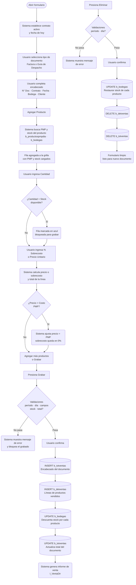

# Venta Directa

**Formulario VB6:** `M_VenDir.frm`
**Tabla(s) principal(es):** `b_totventas` (encabezado del documento de venta), `b_detventas` (líneas de productos vendidos), `b_bodegas` (stock de bodega, se descuenta al vender)
**SP principal:** Sin Stored Procedures: todas las operaciones se realizan con SQL directo

---

## Contexto

El formulario de Venta Directa permite registrar ventas de productos del casino a un cliente externo, emitiendo ya sea una **Factura** o una **Guía de Despacho**. Este tipo de venta corresponde a una salida de inventario que no pasa por el proceso habitual de planificación ni de minuta; es una venta puntual, por ejemplo cuando el casino vende excedentes de mercadería a otro operador o a un cliente autorizado.

El formulario pertenece a la etapa de salida de inventario: al grabar, el stock en bodega se descuenta automáticamente por cada producto vendido. El precio de venta se determina en base al precio promedio ponderado (PMP) vigente del producto, al cual el usuario puede agregar un porcentaje de sobrecosto para establecer el margen de venta. El sistema controla que el precio de venta nunca quede por debajo del precio de costo.

Visualmente, el formulario tiene un panel superior con los datos del encabezado (contrato, cliente, tipo de documento, fecha, bodega) y una grilla debajo donde se listan los productos a vender. No tiene pestañas. Al pie de la grilla aparece el total del documento y leyendas de color que indican si algún producto supera el stock disponible.

---

## Parámetros de Entrada

| Campo | Descripción | Obligatorio |
|---|---|---|
| Tipo Documento | Lista desplegable con dos opciones: **Factura** o **Guía de Despacho**. Define el tipo con el que se registra el documento en el sistema (`FA` o `GD`). | Sí |
| N° Documento | Número del documento de venta. Se ingresa para crear uno nuevo o para consultar uno ya grabado. | Sí |
| Contrato | Código del casino que origina la venta. Se llena automáticamente con el casino activo en sesión, pero puede modificarse. | Sí |
| Fecha Emisión | Fecha del documento en formato `dd/mm/yyyy`. Al modificarla, el sistema recalcula automáticamente el PMP y el precio de venta de todos los productos de la grilla. | Sí |
| Bodega | Lista desplegable con las bodegas del contrato. Indica de qué bodega sale la mercadería. Al cambiar la bodega, el sistema actualiza el stock disponible de cada producto en la grilla. | Sí |
| Cliente | RUT del cliente externo que compra la mercadería. Debe existir en el sistema como cliente activo (tipo 1). Se puede ingresar directamente o buscar con el ícono de búsqueda. | Sí |

---

## Estructura de la Grilla

La grilla muestra una fila por cada producto incluido en la venta. Tiene 10 columnas.

| Col | Nombre | Origen | Editable | Visible | Calculado | Observaciones |
|---|---|---|---|---|---|---|
| 1 | Código Producto | `b_productos.pro_codigo` | Solo en nuevo | Sí | No | Se puede ingresar directamente o agregar con el botón "Agregar Producto" |
| 2 | Descripción Producto | `b_productos.pro_nombre` | No | Sí | No | Se rellena automáticamente al ingresar el código |
| 3 | Unidad de Medida | `a_unidad.uni_nombre` | No | Sí | No | Unidad del producto según el maestro |
| 4 | Cantidad | `b_detventas.dev_canmer` | Sí | Sí | No | Cantidad a vender; al cambiarla el sistema recalcula el total y verifica el stock |
| 5 | % Sobrecosto | `b_detventas.dev_porcen` | Sí | Sí | Sí | Porcentaje de margen aplicado sobre el PMP para obtener el precio de venta; el usuario puede modificarlo |
| 6 | Precio Unitario | `b_detventas.dev_predoc` | Sí | Sí | Sí | Precio de venta por unidad; se calcula a partir del PMP + sobrecosto, pero también puede ingresarse directamente |
| 7 | Total Línea | `b_detventas.dev_ptotal` | No | Sí | Sí | Calculado: Cantidad × Precio Unitario |
| 8 | Bloqueado | Interno | No | No | No | "S" = la cantidad supera el stock disponible (fila se colorea en azul); "N" = sin problema |
| 9 | Stock Actual | `b_bodegas.bod_canmer` | No | Sí | No | Stock disponible en la bodega seleccionada al momento de la consulta; se actualiza al cambiar de bodega o tras grabar |
| 10 | PMP (Costo) | `b_productospmpdia.ppd_propon` | No | No | No | Precio promedio ponderado del producto; es el precio de costo de referencia. No se muestra en pantalla, pero se usa para calcular el sobrecosto y para controlar que el precio de venta no quede por debajo del costo |

*Nota: el contenido de la columna 9 (Stock Actual) se muestra también como información emergente (tooltip) al posicionarse sobre cualquier fila de la grilla, junto con el nombre del producto y la bodega seleccionada.*

##### Cálculo — % Sobrecosto (Columna 5)

El porcentaje de sobrecosto indica cuánto se añade, en términos porcentuales, al precio de costo del producto para fijar el precio de venta. El sistema lo calcula automáticamente si el usuario ingresa el precio de venta directamente, o bien el usuario lo ingresa y el sistema deriva el precio.

**Origen del cálculo:** Fórmula aritmética entre campos

**Fórmula o lógica:**
Si el usuario ingresa el % en Col 5:
`Precio de Venta = PMP + (PMP × % Sobrecosto / 100)`

Si el usuario ingresa el precio directamente en Col 6:
`% Sobrecosto = ((Precio de Venta − PMP) × 100) / PMP`

Regla de control: si el precio de venta resultante es menor que el PMP (precio de costo), el sistema fuerza el precio de venta igual al PMP y el sobrecosto queda en 0.

| Componente | Descripción | Origen |
|---|---|---|
| PMP | Precio promedio ponderado del producto vigente para el casino y la fecha del documento | `b_productospmpdia.ppd_propon` (Col 10 de la grilla) |
| % Sobrecosto | Porcentaje de margen de ganancia | Ingresado por el usuario en Col 5 |
| Precio de Venta | Precio final por unidad que paga el cliente | Col 6 de la grilla |

> Ejemplo: un producto tiene PMP = $1.000. El usuario ingresa 15% de sobrecosto → Precio de Venta = $1.000 + ($1.000 × 15/100) = $1.150. Si en cambio el usuario escribe directamente $1.200, el sistema calcula % Sobrecosto = ((1.200 − 1.000) × 100) / 1.000 = 20%.

##### Cálculo — Precio Unitario (Columna 6)

El precio unitario de venta se obtiene aplicando el porcentaje de sobrecosto sobre el precio de costo (PMP), o puede ser ingresado directamente por el usuario.

**Origen del cálculo:** Fórmula aritmética entre campos

**Fórmula o lógica:**
Precio de Venta = PMP × (1 + % Sobrecosto / 100), redondeado al entero más cercano.

| Componente | Descripción | Origen |
|---|---|---|
| PMP | Precio promedio ponderado del producto | `b_productospmpdia.ppd_propon` |
| % Sobrecosto | Porcentaje de margen | Col 5 de la grilla (ingresado por el usuario) |

> Ejemplo: PMP = $800, % sobrecosto = 25% → Precio de Venta = $800 × 1,25 = $1.000.

##### Cálculo — Total Línea (Columna 7)

Representa el valor total de la línea en pesos.

**Origen del cálculo:** Fórmula aritmética entre campos

**Fórmula o lógica:**
Total Línea = Cantidad (Col 4) × Precio Unitario (Col 6)

| Componente | Descripción | Origen |
|---|---|---|
| Cantidad | Unidades del producto a vender | Col 4 de la grilla |
| Precio Unitario | Precio de venta por unidad | Col 6 de la grilla |

> Ejemplo: 30 kg de pollo a $2.500/kg → Total Línea = $75.000.

---

## Operaciones Disponibles

| Botón | Acción |
|---|---|
| **Nuevo** | Limpia el formulario y deja listo para ingresar un nuevo documento de venta. Si hay datos cargados en la grilla, solicita confirmación antes de limpiar. |
| **Grabar** | Valida todos los campos y líneas; luego inserta el encabezado en `b_totventas`, las líneas en `b_detventas` (solo las que tienen cantidad mayor a cero), y descuenta el stock en `b_bodegas` por cada producto. Al finalizar, actualiza el total del encabezado y genera el informe de venta directa. |
| **Eliminar** | Revierte el documento: restaura el stock en `b_bodegas`, elimina las líneas de `b_detventas` y el encabezado de `b_totventas`. Solo disponible si el período está abierto y el día no está cerrado. Solicita confirmación previa. |
| **Buscar** | Abre la ventana de búsqueda filtrada por contrato y tipo de documento. Al seleccionar un resultado, carga el documento completo con todos sus productos en la grilla. |
| **Imprimir** | Genera e imprime el comprobante de venta directa del documento cargado. |
| **Cancelar** | Limpia el formulario descartando cualquier cambio no grabado, sin solicitar confirmación si la grilla está vacía. Si hay filas cargadas, solicita confirmación. |
| **Agregar Producto** | Abre el buscador de productos filtrado por bodega activa. Al seleccionar, agrega una nueva fila a la grilla con el código, nombre, unidad, PMP y stock actual del producto. |
| **Eliminar Producto** | Elimina la fila seleccionada en la grilla, previa confirmación. Solo disponible en modo de edición (documento nuevo no grabado aún). |
| **Cerrar** | Cierra el formulario. |

---

## Validaciones

| # | Momento | Condición | Resultado |
|---|---|---|---|
| 1 | Al grabar | Faltan campos obligatorios del encabezado (contrato, N° documento, cliente, tipo documento, bodega o fecha) | Se bloquea con el mensaje "Debe ingresar dato importante" |
| 2 | Al grabar | El contrato tiene inventario rotativo activo con actividad del día pendiente y la fecha supera el día de cierre | Se bloquea con el mensaje "Tiene que realizar cierre diario" |
| 3 | Al grabar | La fecha del documento no corresponde al período abierto | Se bloquea con el mensaje "Documento no corresponde al periodo" |
| 4 | Al grabar | La fecha es anterior a la última toma de inventario | Se bloquea con el mensaje "No puede ingresar documentos anteriores a la última toma de inventario" |
| 5 | Al grabar | Se está realizando una toma de inventario en ese momento | Se bloquea con el mensaje "Se está realizando la toma de inventario en estos momentos" |
| 6 | Al grabar | La fecha es anterior a un inventario calendarizado pendiente | Se bloquea con el mensaje "No puede ingresar documento, antes de un inventario calendarizado" |
| 7 | Al grabar | No se ha realizado el ajuste de la última toma de inventario | Se bloquea con el mensaje "No ha realizado el ajuste correspondiente a la última toma de inventario" |
| 8 | Al grabar | La fecha del documento es anterior al día de cierre | Se bloquea con el mensaje "Día se encuentra cerrado, no es posible ingresar" |
| 9 | Al grabar | Alguna fila tiene la cantidad superando el stock disponible en bodega | Se bloquea con el mensaje "Existe una cantidad que excede el Stock" |
| 10 | Al grabar | El total del documento es cero (todas las cantidades son cero) | Se bloquea con el mensaje "El total del documento debe ser mayor a 0" |
| 11 | Al grabar | Confirmación del usuario | Se solicita confirmación "Desea grabar..." antes de persistir los datos |
| 12 | Al eliminar | El período está cerrado | Se bloquea con el mensaje "Periodo cerrado" |
| 13 | Al eliminar | La fecha es anterior a la última toma de inventario | Se bloquea con el mensaje "No puede ingresar documentos anteriores a la última toma de inventario" |
| 14 | Al eliminar | La fecha es anterior al día de cierre | Se bloquea con el mensaje "No puede eliminar documento, día está cerrado" |
| 15 | Al eliminar | Confirmación del usuario | Se solicita confirmación "Elimina documento..." antes de borrar |
| 16 | Al ingresar contrato | El contrato ingresado no existe en el sistema | Se muestra "Contrato no existe" y se limpia el campo |
| 17 | Al ingresar cliente | El RUT del cliente no existe o no está activo en el sistema | Se muestra "Cliente no existe" y se limpia el campo |
| 18 | Al agregar producto | El producto ya existe en otra fila de la grilla | Se muestra "El producto ya existe en la grilla" y no se agrega |
| 19 | En tiempo real (al ingresar cantidad) | La cantidad supera el stock disponible en bodega | La fila se colorea en azul y se marca internamente como bloqueada para grabar |
| 20 | En tiempo real (al ingresar precio) | El precio de venta ingresado es menor al precio de costo (PMP) | El sistema ajusta automáticamente el precio de venta al PMP y deja el sobrecosto en 0% |

---

## Flujo de Datos



---

## Dónde se Almacena

### Encabezado de la Venta Directa (`b_totventas`)

| Campo | Descripción |
|---|---|
| `tov_rutcli` | Código del contrato (casino) que genera la venta |
| `tov_tipdoc` | Tipo de documento: `FA` (Factura) o `GD` (Guía de Despacho) |
| `tov_numdoc` | Número del documento ingresado por el usuario |
| `tov_codbod` | Código de la bodega de la cual sale la mercadería |
| `tov_fecemi` | Fecha de emisión del documento |
| `tov_codcas` | RUT del cliente externo que compra (sin formato puntos/guion) |
| `tov_totdoc` | Total monetario del documento; se actualiza al finalizar el grabado con la suma de todos los totales de línea |
| `tov_codser` | Siempre `0` en venta directa |
| `tov_codreg` | Siempre `0` en venta directa |
| `tov_numinf` | Siempre `0` en venta directa (no se usa folio interno) |
| `tov_estdoc` | Estado del documento; vacío = activo, `A` = anulado |

**Clave primaria:** La combinación de `tov_rutcli` + `tov_tipdoc` + `tov_numdoc` + `tov_codbod` identifica de manera única un encabezado de venta directa.

---

### Detalle de la Venta Directa (`b_detventas`)

| Campo | Descripción |
|---|---|
| `dev_rutcli` | Código del contrato origen (mismo que `tov_rutcli`) |
| `dev_tipdoc` | Tipo de documento: `FA` o `GD` |
| `dev_numdoc` | Número del documento |
| `dev_numlin` | Número de línea correlativo; las líneas con cantidad cero no se graban |
| `dev_codmer` | Código del producto vendido |
| `dev_canmer` | Cantidad vendida del producto |
| `dev_predoc` | Precio de venta unitario del producto (PMP + sobrecosto) |
| `dev_ptotal` | Total de la línea (cantidad × precio de venta) |
| `dev_descri` | Descripción del producto en el momento de la venta |
| `dev_porcen` | Porcentaje de sobrecosto aplicado sobre el PMP |
| `dev_precos` | Precio de costo (PMP) vigente al momento de la venta; sirve como referencia para el cálculo del sobrecosto |
| `dev_mueinv` | Siempre `S` (el movimiento afecta el inventario de la bodega) |
| `dev_canmin` | Siempre `0` en venta directa |
| `dev_coding` | Siempre vacío en venta directa |

**Clave primaria:** La combinación de `dev_rutcli` + `dev_tipdoc` + `dev_numdoc` + `dev_numlin` identifica de manera única cada línea de la venta.

---

### Stock en Bodega (`b_bodegas`)

| Campo | Descripción |
|---|---|
| `bod_codpro` | Código del producto |
| `bod_codbod` | Código de la bodega |
| `bod_canmer` | Cantidad actual en bodega; se descuenta al grabar la venta y se restaura al eliminar el documento |

**Clave primaria:** La combinación de `bod_codpro` + `bod_codbod` identifica el stock de un producto en una bodega específica.

---

## Consultas de Lectura

**Información del producto al agregarlo a la grilla**

> Al presionar "Agregar Producto" y seleccionar un producto del buscador, el sistema consulta el nombre y la unidad de medida del producto para mostrarlos en la grilla.

```sql
SELECT a.pro_codigo, a.pro_nombre, b.uni_nombre
FROM b_productos a, a_unidad b
WHERE a.pro_coduni = b.uni_codigo
AND   a.pro_codigo = '<codigo_producto>'
```

---

**PMP vigente del producto para la fecha del documento**

> Al agregar un producto o al cambiar la fecha de emisión, el sistema obtiene el precio de costo más reciente del producto dentro del período activo (entre el día anterior al cierre y la fecha del documento). Este valor se usa como base para calcular el precio de venta.

```sql
SELECT TOP 1 ppd_cencos, ppd_codpro, ppd_propon, Max(ppd_fecdia) AS ppd_fecdia
FROM b_productospmpdia
WHERE ppd_cencos = '<casino>'
AND   ppd_codpro = '<codigo_producto>'
AND   ppd_fecdia >= <fecha_cierre_menos_1>
AND   ppd_fecdia <= <fecha_emision>
GROUP BY ppd_cencos, ppd_codpro, ppd_propon
HAVING (ppd_propon) > 0
ORDER BY Max(ppd_fecdia) DESC
```

---

**Stock disponible del producto en la bodega seleccionada**

> Al agregar un producto o al cambiar de bodega, el sistema consulta el stock actual para mostrarlo en la grilla y controlar que la cantidad a vender no lo supere.

```sql
SELECT bod.bod_canmer
FROM b_productos AS pro, b_bodegas AS bod
WHERE bod.bod_codbod = <codigo_bodega>
AND   bod.bod_codpro = pro.pro_codigo
AND   pro.pro_codigo = '<codigo_producto>'
```

---

**Búsqueda de encabezado de un documento existente**

> Al ingresar un número de documento ya grabado, el sistema carga los datos del encabezado para mostrarlos en el formulario.

```sql
SELECT tov.tov_numdoc, tov.tov_codbod, tov.tov_fecemi, tov.tov_codser,
       tov.tov_estdoc, tov.tov_codcas, tov.tov_rutcli
FROM b_totventas tov, b_clientes cli
WHERE tov.tov_tipdoc = '<FA o GD>'
AND   tov.tov_numdoc = <numero_documento>
AND   tov.tov_codbod = <codigo_bodega>
AND   tov.tov_rutcli = cli.cli_codigo
```

---

**Detalle de las líneas de un documento existente**

> Junto con el encabezado, el sistema carga todas las líneas de productos del documento, incluyendo el porcentaje de sobrecosto y el precio de costo, para mostrar la información completa en la grilla.

```sql
SELECT dev.dev_codmer, dev.dev_canmer, dev.dev_predoc,
       dev.dev_ptotal, dev.dev_descri, uni.uni_nombre,
       dev_precos, dev_porcen
FROM b_detventas dev, b_productos pro, a_unidad uni
WHERE dev.dev_rutcli = '<contrato>'
AND   dev.dev_tipdoc = '<FA o GD>'
AND   dev.dev_numdoc = <numero_documento>
AND   dev.dev_codmer = pro.pro_codigo
AND   pro.pro_coduni = uni.uni_codigo
ORDER BY dev.dev_numlin
```

---

## Relación con Otros Módulos

| Módulo | Relación |
|---|---|
| **Cierre Diario** | El formulario verifica el estado del día de cierre (`vg_ciedia`) antes de permitir grabar o eliminar. Un día cerrado bloquea cualquier operación. |
| **Toma de Inventario** | Si hay una toma de inventario en curso o un inventario calendarizado pendiente, el sistema bloquea el ingreso de ventas directas para la fecha afectada. |
| **Maestro de Productos** | Los productos disponibles para agregar provienen de `b_productos`. Al buscar, el sistema filtra por la bodega activa. |
| **Precios PMP** | El PMP de `b_productospmpdia` es la base para el precio de venta. El módulo no modifica esta tabla; solo la lee para obtener el costo de referencia. |
| **Buscador de Documentos (B_SalBod)** | El botón Buscar invoca esta ventana para localizar ventas directas existentes por contrato y tipo de documento (FA o GD). |
| **Informe Venta Directa (I_VentaDir)** | Al grabar o al imprimir, el sistema genera el comprobante del documento de venta a través de este módulo de informes. |
| **Maestro de Clientes** | El cliente ingresado se valida contra `b_clientes` (tipo 1 = cliente externo, activo). El módulo no modifica esta tabla. |

---

*Fuentes: `M_VenDir.frm`, tabla(s) `b_totventas`, `b_detventas`, `b_bodegas`, `b_productos`, `b_productospmpdia`, `b_clientes`, `a_unidad` en `SGP_Local.sql`*
