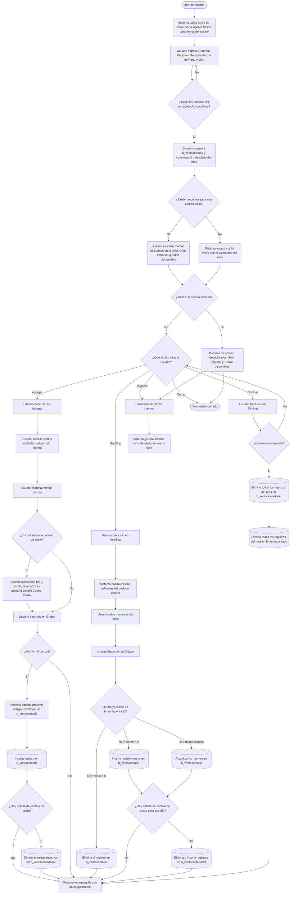

# Venta Servicio Contado

**Formulario VB6:** `M_VtaCon.frm`
**Tabla(s) principal(es):** `b_ventacontado` (encabezado de ventas al contado por día), `b_ventacontadodet` (detalle de venta distribuida por centro de costo de cliente)
**SP principal:** Sin Stored Procedures propios: todas las operaciones de grabación, modificación y eliminación se realizan con SQL directo. Se invoca `sgp_Sel_Param` (función de utilidad global) para obtener la fecha de cierre diario, y `sgp_Sel_VtaCtoServInsumosFoodCostGastoA13CierreDiario` consume los datos aquí registrados en el cierre diario.

---

## Contexto

Este formulario permite registrar y gestionar las **ventas de servicios de alimentación al contado** que no pasan por el sistema de facturación electrónica habitual (boletas o facturas). Es el punto de ingreso para cobros directos realizados en el casino mediante efectivo, cheque, cheque restaurante, tarjeta de crédito o vale. La información ingresada aquí alimenta directamente los reportes de cierre diario y de food cost, siendo una fuente crítica de ingresos del período.

Dentro del flujo operativo, este formulario opera en la etapa de **registro de ingresos del período abierto**, después de que se ha definido el servicio a operar y antes del cierre diario. Su uso es cotidiano: el encargado de caja o jefe de casino registra los montos cobrados por servicio cada día o al final del mes, según la operación del casino.

Visualmente, el formulario se organiza en dos áreas principales. La parte superior muestra el encabezado con los datos de identificación de la venta (contrato, régimen, servicio, forma de pago y mes). La parte inferior contiene un panel con dos pestañas: la primera pestaña, **Venta Servicio**, presenta un calendario mensual interactivo donde cada día del mes tiene una celda para ingresar el monto vendido; la segunda pestaña, **Detalle Centro Costo**, aparece únicamente para contratos que tienen clientes con centros de costo asociados y permite distribuir el monto diario entre esos centros. Los días ya cerrados se muestran bloqueados con color diferenciado; el total acumulado del mes se muestra al pie de la grilla.

---

## Parámetros de Entrada

| Campo | Descripción | Obligatorio |
|---|---|---|
| Contrato | Código del contrato (centro de costo) al que pertenece la venta. Se puede escribir directamente o buscar con el botón de búsqueda. | Sí |
| Régimen | Número de régimen alimentario (desayuno, almuerzo, cena, etc.) dentro del contrato. Se puede buscar en el catálogo de regímenes activos. | Sí |
| Servicio | Número del servicio activo al que corresponde la venta (casino, cafetería, etc.). Se puede buscar en el catálogo de servicios activos. | Sí |
| Forma de Pago | Modalidad de cobro utilizada. Opciones: Contado, Cheque, Cheque Restaurante, Tarjeta Crédito, Vale. | Sí |
| Mes / Año | Mes y año del período a registrar, en formato MM/AAAA. Por defecto muestra el mes en curso. Al cambiarlo, la grilla se actualiza automáticamente. | Sí |
| Cliente (Opcional) | RUT del cliente final, solo visible y aplicable cuando el contrato tiene centros de costo asociados en la tabla `b_clientecencos`. Permite distribuir el monto del día entre distintos centros de costo. | No |

> **Nota:** El campo Contrato en la parte superior izquierda del formulario es editable solo si la sesión activa corresponde al casino configurado en el sistema. De lo contrario, carga automáticamente el casino de la sesión y queda en modo de solo lectura.

---

## Estructura de la Grilla

### Pestaña 1 — Venta Servicio (calendario mensual)

La grilla muestra el mes completo como un calendario. Cada semana ocupa una fila de dos líneas: la primera línea contiene los números de día (organizados por columna según el día de la semana: lunes a domingo), y la segunda línea contiene la celda editable con el monto vendido ese día.

| Col | Nombre | Origen | Editable | Visible | Calculado | Observaciones |
|---|---|---|---|---|---|---|
| 1–7 (fila impar) | Número del día | Calculado a partir del mes/año seleccionado | No | Sí | Sí | Color de texto oscuro. Corresponde al día del mes (1 al 28/29/30/31) posicionado en la columna del día de semana correspondiente. |
| 1–7 (fila par) | Monto vendido ese día | `b_ventacontado.vtc_totmon` | Sí (si el día no está cerrado) | Sí | No | Formato moneda con separador de miles. Se bloquea en azul si la fecha es anterior o igual a la fecha de cierre diario vigente. Si el contrato tiene clientes con centros de costo, esta celda se muestra en modo lectura y su valor se calcula sumando los montos del detalle. |

##### Cálculo — Número del día (fila impar)

Indica el número de día del mes posicionado en la columna que corresponde al día de la semana de ese día (columna 1 = lunes, columna 7 = domingo). No se almacena: el sistema lo construye dinámicamente al armar el calendario del mes seleccionado.

**Origen del cálculo:** Función del sistema

**Fórmula o lógica:**
Para cada número de día del 1 al N (N = último día del mes), el sistema determina qué día de semana le corresponde usando la función `fg_Dia(AAAAMMDD)`. Dependiendo del resultado (1=domingo, 2=lunes, ... 7=sábado), coloca el número en la columna adecuada del calendario. La cantidad de días del mes se obtiene con la función `fg_mes(MMAAAA)`.

| Componente | Descripción | Origen |
|---|---|---|
| Número de día | Entero del 1 al 31 | Iteración interna del sistema |
| Día de la semana | Día de la semana del día calculado | Función del sistema `fg_Dia(AAAAMMDD)` |
| Total de días del mes | Cantidad de días del mes seleccionado | Función del sistema `fg_mes(MMAAAA)` |

> Ejemplo: si el mes es marzo 2026, el día 1 es domingo → se ubica en la columna 7. El día 2 es lunes → va en columna 1 de la semana siguiente.

---

**Leyenda de colores en el calendario:**

| Color | Significado |
|---|---|
| Azul (celda bloqueada) | Día ya cerrado: fecha anterior o igual al día de cierre diario vigente. No editable. |
| Color de sistema (habilitado) | Día dentro del período abierto. Editable. |

**Totalizador al pie:** Muestra la suma de todos los montos del mes visible en la grilla. Se recalcula automáticamente al modificar cualquier celda.

---

### Pestaña 2 — Detalle Centro Costo

Esta pestaña solo es visible cuando el contrato ingresado tiene al menos un cliente con centros de costo registrados en el sistema (tabla `b_clientecencos`). Aparece al seleccionar una celda de monto en la pestaña principal.

| Col | Nombre | Origen | Editable | Visible | Calculado | Observaciones |
|---|---|---|---|---|---|---|
| 1 | Código de centro de costo | `b_clientecencos.clc_codigo` | No | Sí | No | Identificador interno del centro de costo. |
| 2 | Nombre del centro de costo | `b_clientecencos.clc_nombre` | No | Sí | No | Nombre descriptivo del centro de costo del cliente. |
| 3 | Descripción | `b_ventacontadodet.vtd_descripcion` | Sí (si el día no está cerrado) | Sí | No | Texto libre para describir el concepto de venta en ese centro. |
| 4 | Monto | `b_ventacontadodet.vtd_detmon` | Sí (si el día no está cerrado) | Sí | No | Monto asignado a este centro de costo por el día seleccionado. La suma de todos los montos del detalle actualiza automáticamente la celda del día en la pestaña principal. |

> **Nota interna:** El código del cliente vinculado al detalle se guarda en `b_ventacontadodet.vtd_codcli` (RUT sin dígito verificador) y en `b_ventacontadodet.vtd_codcco` (código del centro de costo). El número de línea se almacena en `b_ventacontadodet.vtd_numlin`.

---

## Operaciones Disponibles

| Botón | Acción |
|---|---|
| **Agregar** | Habilita la grilla en modo ingreso. Activa las celdas de monto para que el usuario pueda escribir los valores del mes completo. Deshabilita el encabezado para evitar cambios de contexto durante la edición. |
| **Modificar** | Habilita la grilla existente para editar los montos ya grabados. Deshabilita el encabezado durante la edición. |
| **Eliminar** | Previa confirmación, borra todos los registros del mes seleccionado para la combinación contrato + régimen + servicio + forma de pago. Elimina primero el detalle (`b_ventacontadodet`) y luego el encabezado (`b_ventacontado`). La operación se realiza dentro de una transacción. |
| **Grabar** | Recorre todas las celdas de la grilla. Por cada día con monto mayor que cero: si el día no existe en la base de datos, inserta un registro nuevo; si ya existe y el monto cambió, actualiza el registro; si ya existe pero el monto quedó en cero, elimina el registro. Si hay detalle por centro de costo, graba también `b_ventacontadodet`. Todo dentro de una transacción por día. |
| **Cancelar** | Descarta los cambios no grabados. En modo Agregar, vacía la grilla. En modo Modificar, recarga los datos originales desde la base de datos. Rehabilita el encabezado. |
| **Refrescar** | Recarga los datos desde la base de datos aplicando los filtros del encabezado. Recalcula el total del mes. |
| **Imprimir** | Genera el informe "Venta Servicio Contado" en pantalla, mostrando el mes, contrato, régimen, servicio, forma de pago, el detalle día a día y el total del mes. |
| **Cerrar** | Cierra el formulario. |

> **Nota:** Los botones disponibles varían según el estado del formulario. Si el mes completo está cerrado (todos los días son anteriores al cierre diario), los botones de Agregar, Modificar y Eliminar permanecen deshabilitados.

---

## Validaciones

| # | Momento | Condición | Resultado |
|---|---|---|---|
| 1 | Al hacer clic en Agregar o Modificar | Alguno de los campos del encabezado (contrato, régimen, servicio, forma de pago o mes) está vacío o sin seleccionar | El sistema muestra el mensaje "Falta información en el encabezado..." y no continúa. |
| 2 | Al escribir el código de régimen | El código ingresado no existe en el catálogo de regímenes activos | El campo de descripción queda vacío y el sistema no carga datos. |
| 3 | Al escribir el código de servicio | El código ingresado no existe en el catálogo de servicios activos (`ser_activo = '1'`) | El campo de descripción queda vacío y el sistema no carga datos. |
| 4 | Al ingresar o salir del campo de cliente (RUT) | El RUT ingresado no existe en la tabla de clientes como persona natural activa (`cli_tipo = 1`, `cli_activo = '1'`) | El sistema muestra el mensaje "Cliente no existe..." y limpia el campo. |
| 5 | Al ingresar o salir del campo de contrato | El código ingresado no corresponde a un cliente de tipo contrato (`cli_tipo = 0`) | El campo de descripción queda vacío y no se carga la grilla. |
| 6 | Al cargar la grilla | El día calculado es anterior o igual a la fecha de cierre diario vigente | La celda del monto queda bloqueada (color azul, no editable). |
| 7 | Al cargar la grilla | La fecha de fin del mes completo es anterior al día de cierre diario | El mes queda totalmente bloqueado: se desactivan Agregar, Modificar y Eliminar. |
| 8 | Al hacer clic en Eliminar | No hay registros para la combinación de filtros del encabezado | El sistema muestra "No existe información a borrar..." y no ejecuta ninguna acción. |
| 9 | Al hacer clic en Eliminar | El usuario responde "No" en la confirmación | La operación se cancela sin modificar datos. |
| 10 | Al grabar (Confirmar) | Alguno de los campos del encabezado está incompleto | El sistema no graba y sale sin aviso (protección silenciosa). |
| 11 | Al grabar | Se produce un error de integridad referencial (el registro tiene datos asociados en otra tabla) | La transacción se revierte y el sistema muestra "El dato está asociado a otra tabla...". |
| 12 | Al abrir el formulario | La fecha de cierre diario no está configurada en los parámetros del casino | El sistema muestra un mensaje crítico indicando que el proceso debe cancelarse y cierra la sesión. |

---

## Flujo de Datos



---

## Dónde se Almacena

### Encabezado de Venta al Contado (`b_ventacontado`)

| Campo | Descripción |
|---|---|
| `vtc_codigo` | Identificador único correlativo del registro. Se asigna tomando el máximo código existente más uno al momento de insertar. |
| `vtc_cencos` | Código del contrato (centro de costo) al que pertenece la venta. |
| `vtc_codreg` | Código del régimen alimentario. |
| `vtc_codser` | Código del servicio. |
| `vtc_fecvta` | Fecha de la venta expresada como número entero en formato AAAAMMDD. Por ejemplo, el 5 de marzo de 2026 se almacena como `20260305`. |
| `vtc_forpag` | Forma de pago: 0=Contado, 1=Cheque, 2=Cheque Restaurante, 3=Tarjeta Crédito, 4=Vale. |
| `vtc_totmon` | Monto total vendido ese día. Valor decimal. |
| `vtc_opccli` | Indicador de si la venta tiene cliente con centros de costo asociados: `'1'` = sí tiene, `'0'` = no tiene. |

**Clave primaria:** `vtc_codigo`. Un registro identifica unívocamente una venta por la combinación de `vtc_cencos` + `vtc_codreg` + `vtc_codser` + `vtc_fecvta` + `vtc_forpag` + `vtc_opccli`.

---

### Detalle de Venta por Centro de Costo (`b_ventacontadodet`)

| Campo | Descripción |
|---|---|
| `vtd_codigo` | Código del encabezado al que pertenece este detalle. Referencia a `b_ventacontado.vtc_codigo`. |
| `vtd_numlin` | Número de línea dentro del detalle (1, 2, 3...). |
| `vtd_codcli` | RUT del cliente al que pertenece el centro de costo (sin dígito verificador). |
| `vtd_codcco` | Código del centro de costo del cliente. Referencia a `b_clientecencos.clc_codigo`. |
| `vtd_descripcion` | Descripción libre del concepto de venta para ese centro de costo. |
| `vtd_detmon` | Monto asignado a ese centro de costo para el día. La suma de todos los `vtd_detmon` de un mismo `vtd_codigo` debe coincidir con el `vtc_totmon` del encabezado. |

**Clave primaria:** `vtd_codigo` + `vtd_numlin`. Cada línea es única dentro de un encabezado de venta.

---

### Catálogos de apoyo consultados (solo lectura)

| Tabla | Uso |
|---|---|
| `b_clientes` | Valida el RUT del cliente ingresado y obtiene su nombre descriptivo. Se distingue entre clientes tipo contrato (`cli_tipo = 0`) y clientes persona natural (`cli_tipo = 1`). |
| `a_regimen` | Valida el código de régimen y obtiene su nombre (`reg_nombre`). |
| `a_servicio` | Valida el código de servicio activo (`ser_activo = '1'`) y obtiene su nombre (`ser_nombre`). |
| `b_clientecencos` | Verifica si el cliente tiene centros de costo asociados para habilitar la pestaña de detalle. Provee los códigos (`clc_codigo`) y nombres (`clc_nombre`) de cada centro. |
| `a_param` | Proporciona la fecha de cierre diario vigente (parámetro `ciediario`), que determina qué días están bloqueados en la grilla. |

---

## Consultas de Lectura

### 1. Consulta principal: carga de montos del mes

Recupera los montos ya registrados para la combinación de filtros del encabezado (contrato, régimen, servicio, forma de pago) dentro del mes y año seleccionados. Con los resultados construye el vector de montos por día que luego se vuelca al calendario.

**Cuándo se ejecuta:** Al completar todos los campos del encabezado, al cambiar el mes, al refrescar y al terminar de grabar o eliminar.

**Qué retorna:** Una fila por cada día con venta registrada, con el monto total y la fecha de esa venta.

```sql
-- Versión SQL Server (motor principal):
SELECT a.vtc_totmon, a.vtc_fecvta
FROM   b_ventacontado a, b_ventacontadodet b
WHERE  a.vtc_codigo = b.vtd_codigo
AND    a.vtc_cencos = '<contrato>'
AND    a.vtc_codreg = <regimen>
AND    a.vtc_codser = <servicio>
AND    a.vtc_forpag = <forma_pago>
AND    convert(int,substring(convert(varchar(8),a.vtc_fecvta),1,6)) = <AAAAMM>

-- Si el contrato NO tiene clientes con centros de costo, se omite el JOIN con b_ventacontadodet:
SELECT vtc_totmon, vtc_fecvta
FROM   b_ventacontado
WHERE  vtc_cencos = '<contrato>'
AND    vtc_codreg = <regimen>
AND    vtc_codser = <servicio>
AND    vtc_forpag = <forma_pago>
AND    convert(int,substring(convert(varchar(8),vtc_fecvta),1,6)) = <AAAAMM>
AND    vtc_opccli = '0'
```

---

### 2. Verificación de centros de costo del cliente

Determina si el cliente ingresado en el campo opcional tiene centros de costo asociados. Si los tiene, se activa la pestaña de detalle y la venta queda marcada como `vtc_opccli = '1'`.

**Cuándo se ejecuta:** Al ingresar o seleccionar un cliente en el encabezado.

```sql
SELECT DISTINCT clc_codcli
FROM   b_clientecencos
WHERE  clc_codcli = '<RUT_cliente>'
```

---

### 3. Carga del detalle por centro de costo al seleccionar un día

Al hacer clic sobre un día en el calendario (pestaña Venta Servicio), el sistema carga el detalle distribuido entre los centros de costo del cliente para esa fecha específica. Primero obtiene los centros de costo del cliente, luego busca si ya existen montos grabados para ese día en `b_ventacontadodet`.

**Cuándo se ejecuta:** Al hacer clic sobre cualquier celda de monto en la grilla de la pestaña Venta Servicio, cuando el contrato tiene clientes con centros de costo.

```sql
-- Obtener detalle existente para el día seleccionado:
SELECT b.*
FROM   b_ventacontado a, b_ventacontadodet b, b_clientecencos c
WHERE  a.vtc_codigo = b.vtd_codigo
AND    b.vtd_codcli = c.clc_codcli
AND    b.vtd_codcco = c.clc_codigo
AND    a.vtc_cencos = '<contrato>'
AND    a.vtc_codreg = <regimen>
AND    a.vtc_codser = <servicio>
AND    a.vtc_fecvta = <AAAAMMDD>
AND    a.vtc_forpag = <forma_pago>

-- Obtener lista de centros de costo del cliente:
SELECT *
FROM   b_clientecencos
WHERE  clc_codcli = '<RUT_cliente>'
```

---

### 4. Obtención del código correlativo siguiente

Antes de insertar un nuevo encabezado, el sistema obtiene el código más alto ya existente en `b_ventacontado` para asignar el siguiente.

```sql
SELECT vtc_codigo
FROM   b_ventacontado
ORDER BY vtc_codigo DESC
```

---

## SP / Funciones Referenciados

### `sgp_Sel_Param` — Consulta parámetros de configuración del casino

**Parámetros de entrada:**

| Parámetro | Descripción |
|---|---|
| `@Aux` | Modo de consulta. El formulario usa el modo `1` (buscar por código de parámetro y centro de costo). |
| `@Ceco` | Código del contrato / casino activo en sesión. |
| `@Codigo` | Código del parámetro a buscar. El formulario solicita el parámetro `'ciediario'`, que contiene la fecha de cierre diario encriptada. |

**Lógica principal:**
Busca en la tabla de parámetros del sistema (`a_param`) el valor del parámetro solicitado para el casino activo. Devuelve el valor, el tipo y el nombre del parámetro. Cuando el formulario lo invoca, usa el resultado para desencriptar la fecha de cierre diario y determinar qué días deben bloquearse en el calendario.

**Tablas que modifica:** Ninguna (solo lectura).

---

### Contexto: `sgp_Sel_VtaCtoServInsumosFoodCostGastoA13CierreDiario` — Informe de cierre diario que consume los datos de este formulario

Este SP no es invocado desde `M_VtaCon.frm`, pero es el principal consumidor de los datos registrados aquí. Pertenece al módulo de Cierre Diario (`M_RCdiar.frm`) y consolida los montos de venta al contado de `b_ventacontado` junto con otros indicadores de food cost, insumos y gastos A13, para el período cerrado.

**Tablas que lee:** `b_ventacontado`, `b_ventacontadodet`, `b_minuta`, `b_minutadet`, `b_cierreperiodo`, `a_servicio`, `b_preciovta`, entre otras.

---

## Relación con Otros Módulos

| Módulo | Relación |
|---|---|
| **Cierre Diario** | El SP de cierre diario (`sgp_Sel_VtaCtoServInsumosFoodCostGastoA13CierreDiario`) lee los montos registrados en `b_ventacontado` para calcular los ingresos del período. Una vez que el cierre avanza, los días cerrados quedan bloqueados en este formulario y no pueden modificarse. |
| **Parámetros del sistema** | La fecha de cierre diario vigente (parámetro `ciediario` en `a_param`) controla qué días son editables. Sin este parámetro configurado el formulario no puede abrirse. |
| **Catálogo de Contratos / Clientes** | La tabla `b_clientes` y la tabla `b_clientecencos` determinan si el contrato tiene clientes con centros de costo, activando o desactivando la pestaña de detalle. |
| **Catálogo de Regímenes** | La tabla `a_regimen` valida y describe el régimen seleccionado. Este catálogo es administrado desde el módulo de mantenedores de Contrato/Régimen (externo a Producción). |
| **Catálogo de Servicios** | La tabla `a_servicio` valida y describe el servicio seleccionado. Solo se permiten servicios activos. |
| **Informe Venta Servicio Contado** | El módulo de impresión (`Informes.bas`, función `I_VentaContado`) genera el reporte del mes directamente desde la grilla visible, incluyendo el detalle día a día y el total del mes. |
| **Purga de datos históricos** | El SP `sgp_Del_Limpiadatos` elimina registros de `b_ventacontado` y `b_ventacontadodet` cuando se realiza una purga de datos históricos anteriores a una fecha determinada para un centro de costo. |

---

*Fuentes: `M_VtaCon.frm`, `Informes.bas`, `Rutinas.bas`, tablas `b_ventacontado`, `b_ventacontadodet`, `b_clientecencos`, `b_clientes`, `a_regimen`, `a_servicio`, `a_param` en `SGP_Local.sql`*
