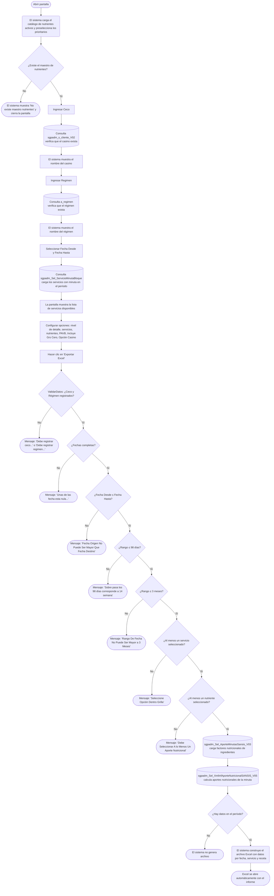

# Aporte Nutricional Sansis

**Formulario:** `I_ApoNutSansis.frm`
**Tablas principales:** `cas_b_minuta` (minutas planificadas por casino), `cas_b_minutadet` (detalle de líneas de minuta), `b_receta` (maestro de recetas), `b_recetadet` (ingredientes por receta), `b_ingrediente` (maestro de ingredientes), `b_productonut` (tabla de aportes nutricionales por producto), `a_nutriente` (catálogo de nutrientes)
**Consulta principal:** `sgpadm_Sel_XmlInfAporteNutricionalSANSIS_V05` — procedimiento almacenado principal que calcula el aporte nutricional de las minutas planificadas en el período consultado

---

## Índice

- [1 — ¿Para qué sirve esta pantalla?](#1--para-qué-sirve-esta-pantalla)
- [2 — ¿Qué necesito para usarla?](#2--qué-necesito-para-usarla)
- [3 — ¿Cómo se usa?](#3--cómo-se-usa)
  - [3.1 Flujo paso a paso](#31-flujo-paso-a-paso)
  - [3.2 Controles y acciones disponibles](#32-controles-y-acciones-disponibles)
- [4 — ¿Qué restricciones debo conocer?](#4--qué-restricciones-debo-conocer)
  - [4.1 Validaciones del sistema](#41-validaciones-del-sistema)
- [5 — ¿Qué obtengo?](#5--qué-obtengo)
  - [Estructura de datos del informe](#estructura-de-datos-del-informe)
  - [Cálculos del informe](#cálculos-del-informe)
  - [Formato de salida](#formato-de-salida)
- [6 — Referencia técnica](#6--referencia-técnica)
  - [Tablas que intervienen](#tablas-que-intervienen)
  - [Relación con otros módulos](#relación-con-otros-módulos)

---

## 1 — ¿Para qué sirve esta pantalla?

[↑ Volver al índice](#índice)

Esta pantalla genera un informe de aporte nutricional calculado a partir de las minutas planificadas de un casino, para un régimen y un período mensual determinado. El informe muestra, receta por receta y día por día, los gramos servidos, el peso bruto, el peso neto y los valores de cada nutriente seleccionado (calorías, proteínas, lípidos, hidratos de carbono, ácidos grasos saturados y cualquier otro nutriente del catálogo). Permite evaluar si la planificación alimentaria de un período cumple con los aportes nutricionales esperados.

La pantalla se organiza en dos áreas principales: un panel de filtros en la parte superior donde el usuario define el casino, el régimen y el rango de fechas; y una zona de opciones que permite controlar qué servicios y qué nutrientes incluir en el informe, así como si el resultado se presenta de forma resumida (una línea por receta y día) o detallada (con el desglose de cada ingrediente que compone cada receta). Adicionalmente, la pantalla incluye un acceso al historial de minutas planificadas para facilitar la navegación entre períodos.

El informe consolida datos de un único casino a la vez. La selección de servicios puede ser global (todos los que tienen minuta en el período) o manual (eligiendo servicios específicos desde una lista). De igual forma, la selección de nutrientes puede incluir todo el catálogo activo o solo los que el usuario marque. El resultado siempre se entrega como un archivo Excel que el usuario puede guardar y analizar libremente.

---

## 2 — ¿Qué necesito para usarla?

[↑ Volver al índice](#índice)

| Campo | Descripción | Obligatorio |
|---|---|---|
| Ceco | Código del casino. Se puede escribir directamente o buscar mediante el selector de clientes que se abre con el ícono de búsqueda contiguo. Al ingresar un código válido, el sistema muestra automáticamente el nombre del casino en el campo de ayuda. | Sí |
| Regimen | Código numérico del régimen alimentario del casino. Se puede escribir o seleccionar mediante el selector de regímenes. Al ingresar un régimen válido, el sistema muestra su nombre en el campo de ayuda. | Sí |
| Fecha Desde | Mes y año de inicio del período a consultar, en formato mm/aaaa. El sistema inicializa este campo con el mes y año actual. | Sí |
| Fecha Hasta | Mes y año de término del período a consultar, en formato mm/aaaa. El sistema inicializa este campo con el mes y año actual. | Sí |
| Nivel de detalle | Indica si el informe muestra solo el resumen por receta ("Resumido") o también el desglose de cada ingrediente ("Detallado"). Por defecto está seleccionado "Resumido". | Sí |
| Servicio | Define si se incluyen todos los servicios con minuta en el período ("Todos") o solo los que el usuario marque en la lista de servicios ("Lista"). Por defecto está seleccionado "Todos". | Sí |
| Aporte Nutricional | Define si se incluyen todos los nutrientes del catálogo ("Todos") o solo los que el usuario marque en la lista de nutrientes ("Lista"). Por defecto está seleccionado "Todos". | Sí |
| Opción Casino | Controla si el encabezado del informe muestra solo el nombre del casino o también su código. Las opciones son "Sin Código" (por defecto) y "Con Código". | No |
| Pavb | Controla si el informe incluye columnas de Proteína de Alto Valor Biológico (PAVB y PAVB%). Las opciones son "Sin Pavb" (por defecto) y "Con Pavb". | No |
| Incluye Grs Cero | Casilla que, al estar marcada, incluye en el informe los ingredientes cuyo porcentaje nutricional es cero. Por defecto no está marcada (se excluyen los ingredientes con peso neto cero). | No |
| Salto Página | Casilla de salto de página. Presente en la pantalla pero sin efecto visible documentado en la generación Excel. | No |

Una vez ingresados el casino, el régimen y el período, la pantalla carga automáticamente la lista de servicios con minuta registrada en ese período, sin necesidad de que el usuario realice ninguna acción adicional.

Al abrir el formulario, el sistema también carga automáticamente el catálogo completo de nutrientes activos y preselecciona como marcados aquellos definidos como prioritarios en el catálogo (campo `nut_indpri > 0`).

---

## 3 — ¿Cómo se usa?

### 3.1 Flujo paso a paso

[↑ Volver al índice](#índice)



### 3.2 Controles y acciones disponibles

[↑ Volver al índice](#índice)

| Control / Acción | Descripción |
|---|---|
| **Campo Ceco** | Campo de texto donde se ingresa el código del casino. Al modificar el valor, el sistema consulta automáticamente si el casino existe y muestra su nombre. Si no existe, limpia el campo de ayuda y deshabilita las fechas hasta ingresar un código válido. |
| **Ícono de búsqueda (junto a Ceco)** | Abre el selector de clientes, que permite buscar y elegir un casino de la lista de clientes activos. Al seleccionar uno, el sistema escribe su código en el campo Ceco y su nombre en el campo de ayuda. |
| **Campo Regimen** | Campo numérico donde se ingresa el código del régimen. Al modificar el valor, el sistema verifica que el régimen exista y muestra su nombre. |
| **Ícono de búsqueda (junto a Regimen)** | Abre el selector de regímenes para buscar y elegir uno de la lista. Al seleccionar, completa el código y el nombre del régimen. |
| **Fecha Desde** | Campo de fecha en formato mm/aaaa que define el inicio del período. Al cambiar su valor, el sistema recarga automáticamente la lista de servicios disponibles. |
| **Fecha Hasta** | Campo de fecha en formato mm/aaaa que define el término del período. Al cambiar su valor, el sistema recarga automáticamente la lista de servicios disponibles. |
| **Resumido / Detallado** | Botones de opción que controlan el nivel de detalle del informe. "Resumido" muestra una fila por receta; "Detallado" agrega filas adicionales con cada ingrediente que compone la receta. |
| **Servicio: Todos / Lista** | Botones de opción dentro del marco "Servicio". Si se elige "Todos", el sistema marca automáticamente todos los servicios disponibles al momento de exportar. Si se elige "Lista", se habilita el ícono que permite abrir el selector de servicios para marcar solo los deseados. |
| **Ícono de búsqueda de servicios** | Disponible cuando la opción de servicio es "Lista". Abre el selector de servicios, donde el usuario marca los que desea incluir. Los seleccionados quedan marcados en la lista interna de la pantalla. |
| **Aporte Nutricional: Todos / Lista** | Botones de opción dentro del marco "Aporte Nutricional". Si se elige "Todos", el sistema marca automáticamente todos los nutrientes al momento de exportar (si ninguno está marcado manualmente). Si se elige "Lista", se habilita el ícono para seleccionar nutrientes específicos. |
| **Ícono de búsqueda de nutrientes** | Disponible cuando la opción de aporte es "Lista" y solo si el casino y el régimen están ingresados. Abre el selector de nutrientes donde el usuario marca los que desea incluir en el informe. |
| **Sin Pavb / Con Pavb** | Botones de opción dentro del marco "Pavb". Controlan si el informe incluye columnas de Proteína de Alto Valor Biológico. Con "Con Pavb" se agregan dos columnas adicionales: gramos absolutos de PAVB y su porcentaje sobre el total de proteínas. |
| **Sin Código / Con Código** | Botones de opción dentro del marco "Opción Casino". Controlan si el encabezado del Excel incluye o no el código numérico del casino junto a su nombre. |
| **Incluye Grs Cero** | Casilla que, cuando está marcada, incluye en el informe los ingredientes con peso neto cero. Cuando no está marcada (estado por defecto), el sistema solo incluye ingredientes con peso neto mayor a cero. |
| **Salto Página** | Casilla disponible en pantalla. |
| **Exportar Excel** | Botón principal de la barra de herramientas. Ejecuta las validaciones, consulta los datos y genera el archivo Excel con el informe. El archivo se abre automáticamente en Excel al finalizar. |
| **Histórico Planificación Teórica** | Botón de la barra de herramientas que abre el historial de minutas planificadas del casino ingresado. Permite navegar al período de una minuta anterior y traspasar automáticamente su régimen y fechas a los campos de filtro de la pantalla. Requiere que el casino tenga minutas registradas. |
| **Salir** | Botón de la barra de herramientas que cierra la pantalla sin generar ningún archivo. |

---

## 4 — ¿Qué restricciones debo conocer?

### 4.1 Validaciones del sistema

[↑ Volver al índice](#índice)

| # | Cuándo aparece | Qué verifica el sistema | Qué ve o experimenta el usuario |
|---|---|---|---|
| 1 | Al abrir la pantalla | Existencia del catálogo de nutrientes activos | Si no existe ningún nutriente registrado, aparece el mensaje "No existe maestro nutrientes" y la pantalla se cierra automáticamente. |
| 2 | Al presionar "Exportar Excel" | Que el campo de casino tenga un casino válido ingresado | Si el nombre del casino está vacío, aparece el mensaje "Debe registrar ceco..." y no se genera el archivo. |
| 3 | Al presionar "Exportar Excel" | Que el campo de régimen tenga un régimen válido ingresado | Si el nombre del régimen está vacío, aparece el mensaje "Debe registrar regimen..." y no se genera el archivo. |
| 4 | Al presionar "Exportar Excel" | Que ambos campos de fecha estén completos | Si alguna fecha está vacía, aparece el mensaje "Unas de las fecha esta nula..." y no se genera el archivo. |
| 5 | Al presionar "Exportar Excel" | Que la fecha de inicio sea menor o igual a la fecha de término | Si "Fecha Desde" es posterior a "Fecha Hasta", aparece el mensaje "Fecha Origen No Puede Ser Mayor Que Fecha Destino" y no se genera el archivo. |
| 6 | Al presionar "Exportar Excel" | Que el rango de fechas no supere 98 días | Si el rango supera los 98 días (equivalente a 14 semanas), aparece el mensaje "Sobre pasa los 98 días corresponde a 14 semana" y no se genera el archivo. |
| 7 | Al presionar "Exportar Excel" | Que el rango de fechas no supere 3 meses | Si el rango abarca más de 3 meses, aparece el mensaje "Rango De Fecha No Puede Ser Mayor a 3 Meses" y no se genera el archivo. |
| 8 | Al presionar "Exportar Excel" | Que al menos un servicio esté seleccionado en la lista | Si ningún servicio está marcado (y la opción es "Lista"), aparece el mensaje "Seleccione Opción Dentro Grilla" y no se genera el archivo. |
| 9 | Al presionar "Exportar Excel" | Que al menos un nutriente esté seleccionado | Si ningún nutriente está marcado, aparece el mensaje "Debe Seleccionar A lo Menos Un Aporte Nutricional" y no se genera el archivo. |
| 10 | Al intentar abrir el selector de nutrientes | Que el casino y el régimen estén ingresados | Si el campo de casino o el campo de régimen están vacíos, el selector de nutrientes no se abre. |
| 11 | Al presionar "Histórico Planificación Teórica" | Que el casino tenga minutas registradas | Si el casino no tiene minutas, aparece el mensaje "No existe ceco planificado" y no se abre el historial. |

---

## 5 — ¿Qué obtengo?

[↑ Volver al índice](#índice)

La pantalla genera un único tipo de informe: el aporte nutricional calculado de las minutas planificadas del casino en el período seleccionado. No existe selector de tipo de informe. El resultado es siempre un archivo Excel.

### Estructura de datos del informe

[↑ Volver al índice](#índice)

El informe está organizado por fecha y, dentro de cada fecha, por servicio. Dentro de cada servicio se listan las recetas planificadas. Si se eligió el modo "Detallado", cada receta va seguida de sus ingredientes. Al final de cada servicio y de cada fecha aparecen filas de totales.

| Campo / Columna | Descripción | Calculado |
|---|---|---|
| Fecha Servicio | Fecha de la minuta en formato dd/mm/aaaa y nombre del servicio al que pertenece la receta | No |
| Nombre Receta (o Nombre Ingrediente en modo Detallado) | Nombre de la receta de la línea de minuta. En modo detallado, debajo de cada receta aparecen sus ingredientes con sangría. | No |
| G/V Servir | Gramos a servir por porción, correspondiente a la cantidad consumida (peso bruto ajustado por cocción y por aprobación) | Sí |
| Bruta | Gramos brutos por porción según la receta base, antes de aplicar mermas de cocción | Sí |
| G/V Neto | Gramos netos por porción aplicando el porcentaje nutricional del ingrediente | Sí |
| G/V Neto Nut | Gramos netos por porción aplicando el porcentaje de aprovechamiento del ingrediente | Sí |
| [Columnas de nutrientes seleccionados] | Una columna por cada nutriente marcado en la selección (por ejemplo: Calorías, Proteínas, Lípidos, Hidratos de Carbono, Hierro, etc.). El nombre de cada columna es el nombre del nutriente según el catálogo. | Sí |
| P% | Porcentaje calórico aportado por las proteínas respecto al total de calorías del servicio o día | Sí |
| G% | Porcentaje calórico aportado por los lípidos (grasas) respecto al total de calorías del servicio o día | Sí |
| Cho% | Porcentaje calórico aportado por los hidratos de carbono respecto al total de calorías del servicio o día | Sí |
| AGS | Porcentaje calórico aportado por los ácidos grasos saturados respecto al total de calorías del servicio o día | Sí |
| Pavb | Gramos de Proteína de Alto Valor Biológico del servicio o día. Aparece solo si la opción "Con Pavb" está seleccionada. | Sí |
| Pavb% | Porcentaje que la Proteína de Alto Valor Biológico representa sobre el total de proteínas del servicio o día. Aparece solo si la opción "Con Pavb" está seleccionada. | Sí |
| Total (fila de subtotal por servicio) | Suma acumulada de todos los campos numéricos para el servicio completo | Sí |
| A. Nutricional del Día (fila de total diario) | Suma acumulada de todos los campos numéricos para el día completo, incluyendo todos los servicios | Sí |

### Cálculos del informe

[↑ Volver al índice](#índice)

**Cálculo — G/V Servir (canservida)**

Representa los gramos que efectivamente se sirven por porción de cada ingrediente de la receta, luego de aplicar las mermas de cocción y de aprovechamiento sobre la cantidad bruta base de la receta.

**Fórmula o lógica:**

```
G/V Servir = (red_pctapr / 100) × red_canpro × (red_pctcoc / 100)
```

| Componente | Qué representa | De dónde viene |
|---|---|---|
| `red_canpro` | Cantidad en gramos del ingrediente según la receta base (por porción base) | `b_recetadet.red_canpro` |
| `red_pctapr` | Porcentaje de aprovechamiento del ingrediente (merma por limpieza/preparación) | `b_recetadet.red_pctapr` (o `b_ingrediente.ing_pctapr` si hay reemplazo) |
| `red_pctcoc` | Porcentaje de cocción del ingrediente (merma por cocción) | `b_recetadet.red_pctcoc` (o `b_ingrediente.ing_pctcoc` si hay reemplazo) |

> Ejemplo: si un ingrediente tiene 200 g brutos, 80% de aprovechamiento y 90% de cocción → G/V Servir = (80/100) × 200 × (90/100) = 144 g

---

**Cálculo — Bruta (WsNumPorcion)**

Representa la cantidad bruta en gramos por porción individual, obtenida a partir de la cantidad de la receta dividida por su base de raciones.

**Fórmula o lógica:**

```
Bruta = red_canpro / rec_basrac
```

| Componente | Qué representa | De dónde viene |
|---|---|---|
| `red_canpro` | Cantidad en gramos del ingrediente según la receta para el total de porciones base | `b_recetadet.red_canpro` |
| `rec_basrac` | Número de raciones base para el que está diseñada la receta | `b_receta.rec_basrac` |

> Ejemplo: si la receta define 300 g de un ingrediente para 10 raciones base → Bruta = 300 / 10 = 30 g por porción

---

**Cálculo — G/V Neto (pneto)**

Representa los gramos netos comestibles por porción, aplicando únicamente el porcentaje nutricional del ingrediente (factor que indica qué proporción del peso es nutritivamente aprovechable).

**Fórmula o lógica:**

```
G/V Neto = (red_pctnut / 100) × red_canpro
```

| Componente | Qué representa | De dónde viene |
|---|---|---|
| `red_pctnut` | Porcentaje nutricional del ingrediente | `b_recetadet.red_pctnut` (o `b_ingrediente.ing_pctnut` si hay reemplazo) |
| `red_canpro` | Cantidad en gramos del ingrediente según la receta | `b_recetadet.red_canpro` |

---

**Cálculo — G/V Neto Nut (pnetoApr)**

Representa los gramos netos por aprovechamiento del ingrediente, es decir, la cantidad resultante luego de aplicar solo el porcentaje de aprovechamiento (sin incluir el factor de cocción).

**Fórmula o lógica:**

```
G/V Neto Nut = (red_pctapr / 100) × red_canpro
```

| Componente | Qué representa | De dónde viene |
|---|---|---|
| `red_pctapr` | Porcentaje de aprovechamiento del ingrediente | `b_recetadet.red_pctapr` |
| `red_canpro` | Cantidad en gramos del ingrediente según la receta | `b_recetadet.red_canpro` |

---

**Cálculo — Valor de cada nutriente seleccionado**

Para cada nutriente marcado en la selección (calorías, proteínas, lípidos, etc.), el valor que aparece en el informe es el aporte de ese nutriente por porción de la receta, calculado cruzando la cantidad bruta por porción con la tabla de composición nutricional del ingrediente.

**Fórmula o lógica:**

```
Aporte Nutriente = (Porcentaje Nutricional / 100) × (pnu_canapo × WsNumPorcion) / ing_facnut
```

| Componente | Qué representa | De dónde viene |
|---|---|---|
| Porcentaje Nutricional (`red_pctnut`) | Proporción del ingrediente que se considera nutritivamente aprovechable | `b_recetadet.red_pctnut` |
| `pnu_canapo` | Cantidad del nutriente por unidad de referencia del ingrediente (según las tablas de composición nutricional) | `b_productonut.pnu_canapo` |
| `WsNumPorcion` | Gramos brutos del ingrediente por porción individual (= `red_canpro / rec_basrac`) | Calculado en el SP |
| `ing_facnut` | Factor de conversión nutricional del ingrediente (base de referencia de la tabla nutricional, normalmente 100 g) | `b_ingrediente.ing_facnut` |

> Ejemplo: si un ingrediente tiene 30 g brutos por porción, 95% nutricional, 8 g de proteínas por cada 100 g de tabla, y factor 100 → Proteínas = (95/100) × (8 × 30) / 100 = 2.28 g por porción

---

**Cálculo — Porcentajes calóricos (P%, G%, Cho%, AGS)**

Al final de cada servicio y de cada día, el informe muestra los porcentajes que cada macronutriente aporta al total calórico del conjunto de recetas.

**Fórmulas:**

```
P%   = (Proteínas_totales × 4 / Calorías_totales) × 100
G%   = (Lípidos_totales × 9 / Calorías_totales) × 100
Cho% = (Hidratos_totales × 4 / Calorías_totales) × 100
AGS% = (AcGrSat_totales × 9 / Calorías_totales) × 100
```

Los factores 4 y 9 corresponden a las kilocalorías por gramo de cada macronutriente según los estándares nutricionales (proteínas y carbohidratos aportan 4 kcal/g; grasas aportan 9 kcal/g). Estos porcentajes solo se calculan cuando el total de calorías es mayor que cero.

---

**Cálculo — Pavb y Pavb%**

Cuando la opción "Con Pavb" está seleccionada, el informe incluye el aporte de proteínas provenientes de ingredientes catalogados como fuentes de proteína de alto valor biológico (carnes, huevos, lácteos, etc.).

**Fórmulas:**

```
Pavb   = suma de Proteínas de ingredientes con ing_indpav = 1
Pavb%  = (Pavb / Proteínas_totales) × 100
```

El indicador `ing_indpav` se encuentra en el maestro de ingredientes y marca aquellos que el catálogo considera fuente de proteína de alto valor biológico.

---

### Formato de salida

[↑ Volver al índice](#índice)

**Formato de salida:** Excel. Una única hoja llamada "Aportes Sansis". El archivo se abre automáticamente en Excel al finalizar la generación; el usuario debe guardarlo manualmente en la carpeta que elija.

El encabezado del archivo (filas 1 a 6) contiene:
- Fila 1: título "Aporte Nutricional Resumido" o "Aporte Nutricional Detallado" según la opción elegida.
- Fila 3: nombre del casino (y su código si se eligió "Con Código").
- Fila 4: nombre del régimen.
- Fila 5: período consultado ("Correspondiente al periodo de: mm/aaaa Hasta mm/aaaa").

Los datos comienzan en la fila 7 y están organizados por bloques de fecha. Cada bloque de fecha muestra una cabecera con la fecha y debajo las filas por servicio. Dentro de cada servicio aparecen las recetas (y sus ingredientes en modo detallado). Al cerrar cada servicio se agrega una fila "Total" con los acumulados del servicio. Al cerrar cada fecha se agrega una fila "A. Nutricional del Día" con los acumulados diarios.

Las columnas fijas son: A (descripción), B (G/V Servir), C (Bruta), D (G/V Neto), E (G/V Neto Nut). A partir de la columna F se agregan dinámicamente una columna por cada nutriente seleccionado, y al final las columnas de porcentajes (P%, G%, Cho%, AGS o bien Pavb, Pavb%, P%, G%, Cho%, AGS% si se eligió "Con Pavb").

---

## 6 — Referencia técnica

### Tablas que intervienen

[↑ Volver al índice](#índice)

| Tabla | Para qué se usa en este reporte | Campos clave |
|---|---|---|
| `b_clientes` | Catálogo de casinos. Se usa para validar el código ingresado y obtener el nombre del casino. | `cli_codigo`, `cli_nombre`, `cli_tipo` |
| `a_regimen` | Catálogo de regímenes alimentarios. Se usa para validar el régimen y obtener su nombre. | `reg_codigo`, `reg_nombre`, `reg_indppr` |
| `a_nutriente` | Catálogo de nutrientes activos. Se usa al abrir la pantalla para cargar la lista de nutrientes disponibles y sus indicadores de prioridad. | `nut_codigo`, `nut_nombre`, `nut_indpri`, `nut_activo`, `nut_secnro` |
| `cas_b_minuta` | Minutas planificadas por casino. Es la fuente principal de datos: define qué recetas se planificaron en qué fecha y para qué servicio. | `min_cecori`, `min_codreg`, `min_codigo`, `min_codser`, `min_fecmin` |
| `cas_b_minutadet` | Detalle de las líneas de cada minuta. Indica qué receta corresponde a cada línea y el número de raciones planificadas. | `mid_cecori`, `mid_codigo`, `mid_codrec`, `mid_numrac`, `mid_numlin`, `mid_tipmin` |
| `b_receta` | Maestro de recetas. Aporta el nombre de la receta, su base de raciones y si es de tipo plato. | `rec_codigo`, `rec_nombre`, `rec_basrac`, `rec_canser`, `rec_tippla` |
| `b_recetadet` | Ingredientes que componen cada receta, con sus gramos y porcentajes de merma. | `red_codigo`, `red_codpro`, `red_canpro`, `red_pctapr`, `red_pctcoc`, `red_pctnut` |
| `b_ingrediente` | Maestro de ingredientes. Aporta el nombre, el factor nutricional de referencia, los porcentajes de merma y el indicador de proteína de alto valor biológico. | `ing_codigo`, `ing_nombre`, `ing_facnut`, `ing_pctnut`, `ing_pctapr`, `ing_pctcoc`, `ing_indpav`, `ing_activo` |
| `b_productonut` | Tabla de composición nutricional por ingrediente y nutriente. Registra qué cantidad de cada nutriente aporta el ingrediente por unidad de referencia. | `pnu_codpro`, `pnu_codapo`, `pnu_canapo` |
| `a_servicio` | Catálogo de servicios (almuerzo, cena, colación, etc.). Se usa para obtener el nombre del servicio. | `ser_codigo`, `ser_nombre`, `ser_posicion` |
| `b_tablagramajececo` | Tabla de gramajes personalizados por casino y régimen. Permite que un casino use cantidades o ingredientes distintos a los de la receta base. Se aplica automáticamente durante el cálculo. | `tgc_ceco`, `tgc_codreg`, `tgc_codrec`, `tgc_coding`, `tgc_codins`, `tgc_cantgr` |

### Relación con otros módulos

[↑ Volver al índice](#índice)

| Módulo | Relación |
|---|---|
| **Planificación de Minutas (Bloque)** | Las minutas que este reporte analiza son generadas y aprobadas en el módulo de planificación de minutas. Sin minutas planificadas en el período, el informe no tiene datos que mostrar. |
| **Maestro de Recetas** | Las recetas y su composición en ingredientes son mantenidas en el módulo de recetas. La tabla de gramajes personalizada por casino también se gestiona desde ese módulo, y el reporte la aplica automáticamente al calcular los aportes. |
| **Catálogo de Nutrientes** | La lista de nutrientes disponibles y su composición por ingrediente son datos maestros mantenidos en el módulo de administración de nutrientes. El catálogo debe estar cargado para que la pantalla funcione. |
| **Maestro de Casinos (Clientes)** | El módulo de administración de casinos mantiene el catálogo de clientes, regímenes y servicios que esta pantalla usa como filtros. |

---

*Fuentes: `I_ApoNutSansis.frm`, SP `sgpadm_Sel_XmlInfAporteNutricionalSANSIS_V05` en `SGP_Admin.sql`, SP `sgpadm_Sel_AporteMinutasSansis_V03` en `SGP_Admin.sql`, SP `sgpadm_Sel_ServicioMinutaBloque` en `SGP_Admin.sql`, SP `sgpadm_s_nutriente` en `SGP_Admin.sql`, SP `sgpadm_Sel_CountAportes` en `SGP_Admin.sql`, SP `sgpadm_Sel_CecoMinutaBloque` en `SGP_Admin.sql`, tablas `cas_b_minuta`, `cas_b_minutadet`, `b_receta`, `b_recetadet`, `b_ingrediente`, `b_productonut`, `a_nutriente`, `b_tablagramajececo`, `a_servicio`, `b_clientes`, `a_regimen` en `SGP_Admin.sql`*
