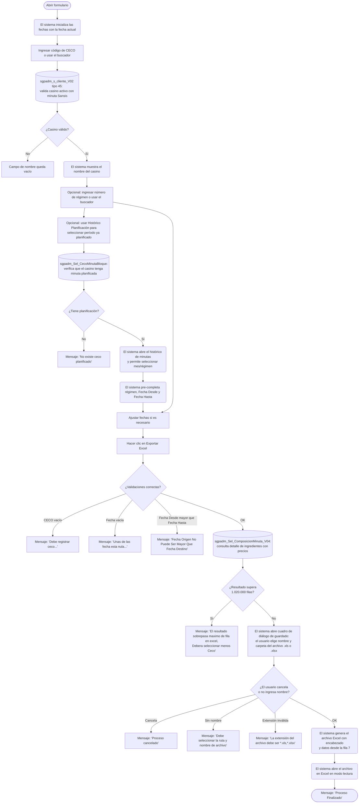

# Composición Minutas Sansis

**Formulario:** `E_ComposicionMinutasSansis.frm`
**Tabla(s) principal(es):** `cas_b_minuta` (cabecera de minutas planificadas por casino), `cas_b_minutadet` (detalle de recetas por línea de minuta), `b_recetadet` (ingredientes de cada receta)
**Consulta principal:** `sgpadm_Sel_ComposicionMinuta_V04`

---

## Índice

- [1 — ¿Para qué sirve esta pantalla?](#1--para-qué-sirve-esta-pantalla)
- [2 — ¿Qué necesito para usarla?](#2--qué-necesito-para-usarla)
- [3 — ¿Cómo se usa?](#3--cómo-se-usa)
  - [3.1 Flujo paso a paso](#31-flujo-paso-a-paso)
  - [3.2 Controles y acciones disponibles](#32-controles-y-acciones-disponibles)
- [4 — ¿Qué restricciones debo conocer?](#4--qué-restricciones-debo-conocer)
  - [4.1 Validaciones del sistema](#41-validaciones-del-sistema)
- [5 — ¿Qué obtengo?](#5--qué-obtengo)
- [6 — Referencia técnica](#6--referencia-técnica)
  - [Tablas que intervienen](#tablas-que-intervienen)
  - [Relación con otros módulos](#relación-con-otros-módulos)

---

## 1 — ¿Para qué sirve esta pantalla?
[↑ Volver al índice](#índice)

Esta pantalla permite exportar a Excel el detalle completo de ingredientes que componen las recetas incluidas en la minuta planificada de un casino, para un período de fechas determinado. El resultado muestra, por cada línea de la minuta y cada receta, qué ingredientes se utilizan, en qué cantidad por ración, a qué precio unitario según el convenio de compras vigente, y cuántas unidades de producto (en formato de compra) se requerirán considerando las raciones planificadas.

La pantalla está organizada en un único panel de filtros con tres datos a completar: el código del casino (CECO), el régimen alimenticio (opcional) y el rango de fechas. Además del botón de exportación, dispone de una acción auxiliar que permite consultar el histórico de planificación del casino para seleccionar rápidamente un período ya planificado, lo que facilita pre-completar las fechas y el régimen sin necesidad de ingresarlos manualmente.

Este formulario no consolida datos de múltiples casinos en una sola ejecución: la consulta siempre corresponde a un único CECO. Si el régimen se deja en blanco, el sistema entrega los ingredientes de todos los regímenes planificados para ese casino en el período indicado.

---

## 2 — ¿Qué necesito para usarla?
[↑ Volver al índice](#índice)

| Campo | Descripción | Obligatorio |
|---|---|---|
| Ceco | Código del casino (centro de costo). Se puede escribir directamente o buscar usando el ícono de lupa, que abre un selector de casinos activos de tipo servicio de alimentación y con tipo de minuta Sansis (tipos 3 o 4). Al ingresar el código, el sistema muestra automáticamente el nombre del casino en el campo de ayuda adyacente. | Sí |
| Regimen | Número del régimen alimenticio. Se puede ingresar directamente o buscar con el ícono de lupa correspondiente, que abre un selector de regímenes. Al ingresar el número, el sistema muestra el nombre del régimen en el campo de ayuda. Si se deja vacío, el informe incluye todos los regímenes planificados para el casino. | No |
| Fecha Desde | Fecha de inicio del período a consultar, en formato dd/mm/aaaa. Al abrir el formulario se inicializa con la fecha del día. | Sí |
| Fecha Hasta | Fecha de término del período a consultar, en formato dd/mm/aaaa. Al abrir el formulario se inicializa con la fecha del día. | Sí |

---

## 3 — ¿Cómo se usa?
[↑ Volver al índice](#índice)

### 3.1 Flujo paso a paso
[↑ Volver al índice](#índice)

### 3.2 Controles y acciones disponibles
[↑ Volver al índice](#índice)

| Control / Acción | Descripción |
|---|---|
| **Campo Ceco** | Campo de texto donde se ingresa el código del casino. Al confirmar con Enter o al cambiar el foco, el sistema valida que el casino sea activo, de tipo alimentación y con formato de minuta Sansis (tipo 3 o 4), y muestra su nombre en el campo de ayuda. |
| **Ícono de búsqueda de Ceco** | Abre un selector de casinos filtrado a los casinos activos con minuta tipo Sansis. Al seleccionar uno, completa automáticamente el código y el nombre del casino. |
| **Campo de nombre del casino** | Campo de ayuda, no editable directamente, que muestra el nombre del casino correspondiente al código ingresado. |
| **Campo Regimen** | Campo numérico para ingresar el código del régimen. Al cambiar su valor, el sistema consulta la tabla de regímenes y muestra el nombre en el campo de ayuda adyacente. Si se deja vacío, el informe incluye todos los regímenes. |
| **Ícono de búsqueda de Régimen** | Abre un selector de regímenes. Al seleccionar uno, completa el código y el nombre en los campos correspondientes. |
| **Campo de nombre del régimen** | Campo de ayuda que muestra el nombre del régimen seleccionado. |
| **Campo Fecha Desde** | Campo de fecha en formato dd/mm/aaaa. Define el inicio del período a consultar. Se inicializa con la fecha actual al abrir el formulario. |
| **Campo Fecha Hasta** | Campo de fecha en formato dd/mm/aaaa. Define el término del período a consultar. Se inicializa con la fecha actual al abrir el formulario. |
| **Histórico Planificación** | Botón de la barra de herramientas. Primero verifica que el casino ingresado tenga minutas planificadas en la base de datos. Si las tiene, abre el histórico de minutas del casino para que el usuario elija un mes y régimen ya planificados, con lo que el sistema pre-completa automáticamente el régimen, la Fecha Desde (primer día del mes) y la Fecha Hasta (día 27 del mes). |
| **Exportar Excel** | Botón principal de la barra de herramientas. Ejecuta la consulta de composición de minuta con los filtros ingresados, genera el archivo Excel en la ruta que el usuario elija y lo abre en modo lectura. Su disponibilidad depende del perfil del usuario (se habilita solo si el usuario tiene permiso de exportación asignado en la configuración de acceso). |
| **Salir** | Cierra y descarga el formulario. |

---

## 4 — ¿Qué restricciones debo conocer?
[↑ Volver al índice](#índice)

### 4.1 Validaciones del sistema
[↑ Volver al índice](#índice)

| # | Cuándo aparece | Qué verifica el sistema | Qué ve o experimenta el usuario |
|---|---|---|---|
| 1 | Al hacer clic en Histórico Planificación | Que el casino ingresado tenga al menos una minuta en la tabla de minutas planificadas | Si no tiene planificación: `"No existe ceco planificado"` |
| 2 | Al hacer clic en Exportar Excel | Que el campo de nombre del casino no esté vacío (es decir, que se haya ingresado y validado un CECO) | Si el CECO no está registrado: `"Debe registrar ceco..."` |
| 3 | Al hacer clic en Exportar Excel | Que los campos Fecha Desde y Fecha Hasta tengan un valor ingresado | Si alguna fecha está vacía: `"Unas de las fecha esta nula..."` |
| 4 | Al hacer clic en Exportar Excel | Que la Fecha Desde no sea posterior a la Fecha Hasta | Si el rango es inválido: `"Fecha Origen No Puede Ser Mayor Que Fecha Destino"` |
| 5 | Después de consultar la base de datos | Que el número de filas del resultado no supere el límite de Excel (1.020.000 filas) | Si se supera: `"El resultado sobrepasa maximo de fila en excel, Debera seleccionar menos Ceco"`. El usuario debe acotar el período o el régimen. |
| 6 | En el cuadro de guardado de archivo | Que el usuario proporcione un nombre de archivo y no cancele el diálogo | Si cancela: `"Proceso cancelado"`. Si no escribe nombre: `"Debe seleccionar la ruta y nombre de archivo"` |
| 7 | En el cuadro de guardado de archivo | Que la extensión del archivo sea `.xls` o `.xlsx` | Si la extensión es otra: `"La extensión del archivo debe ser (*.xls,*.xlsx)"` |
| 8 | Al ingresar el CECO manualmente | Que el casino sea de tipo servicio de alimentación (tipo 1), esté activo y tenga tipo de minuta Sansis (3 o 4) | Si no cumple las condiciones, el campo de nombre queda vacío y el sistema no lo reconoce como válido |

---

## 5 — ¿Qué obtengo?
[↑ Volver al índice](#índice)

Este formulario genera un único reporte en formato Excel. No existe selector de tipo de informe.

**Qué muestra:** el informe entrega el detalle de todos los ingredientes que componen cada receta planificada en la minuta del casino, para el período indicado. Por cada ingrediente se informa la fecha de la minuta, el régimen y servicio al que pertenece la receta, la receta, el ingrediente (con su código y descripción), la unidad de medida, el gramaje por ración, el precio unitario según el convenio de compras vigente (o el precio más reciente disponible si no hay convenio activo para la fecha exacta), el número de raciones planificadas, la cantidad total de unidades del ingrediente y la cantidad equivalente en formato de compra SAP.

**Opciones de configuración disponibles:**
- **Régimen:** si se deja en blanco, el informe incluye todos los regímenes. Si se especifica un régimen, el informe se acota a ese régimen.
- **Rango de fechas:** define el período exacto de minuta planificada a incluir.

**Estructura de datos del informe:**

| Campo / Columna | Descripción | Calculado |
|---|---|---|
| Fecha | Fecha de la minuta planificada (formato dd/mm/aaaa) | No |
| Regimen | Código numérico del régimen alimenticio | No |
| Desc. Regimen | Nombre del régimen alimenticio | No |
| Servicio | Nombre y código del servicio (ej.: "Almuerzo (1)") | No |
| Receta | Nombre y código de la receta (ej.: "Cazuela de vacuno (1234)") | No |
| Homologación SAP | Código de material SAP asociado al ingrediente según el convenio de compras | No |
| Homologación JUSTICIA | Código de material en el sistema SIGES (utilizado en contratos del Ministerio de Justicia) | No |
| Cód. Ingrediente | Código interno del ingrediente en SGP | No |
| Desc. Ingrediente | Nombre del ingrediente | No |
| Uni. | Unidad de medida del ingrediente (abreviatura) | No |
| Cantidad | Gramaje del ingrediente por ración, tal como está definido en la receta (puede ser el valor del ingrediente de reemplazo si aplica una tabla de gramaje por nivel) | Sí |
| Precio | Precio unitario del ingrediente según el convenio SAP vigente para la fecha. Si no hay convenio activo en la fecha exacta, se usa el precio del convenio más reciente disponible | Sí |
| Raciones | Número de raciones planificadas para esa línea de minuta | No |
| Unidad Ing. | Cantidad total del ingrediente = Cantidad × Raciones | Sí |
| Unidad Producto. | Cantidad en unidades de formato de compra = (Cantidad × Raciones) / Facing del producto SAP | Sí |

**Cálculo — Cantidad (gramaje con reemplazo)**

El gramaje del ingrediente que aparece en el informe no siempre corresponde al valor original de la receta. El sistema aplica una jerarquía de sustitución de ingredientes configurada por casino, que puede reemplazar tanto el ingrediente como su gramaje según la combinación de CECO, régimen, receta y tipo de plato.

**Fórmula o lógica:**
La sustitución se evalúa en hasta cuatro niveles, aplicando el primero que coincida:
1. CECO + régimen + receta + ingrediente original (tabla de gramaje por CECO)
2. CECO + régimen + tipo de plato + ingrediente original (tabla de gramaje por nivel)
3. CECO + régimen + ingrediente original (sin tipo de plato)
4. CECO + ingrediente original (sin régimen ni tipo de plato)

Si ningún nivel coincide, se usa el gramaje original de la receta.

| Componente | Qué representa | De dónde viene |
|---|---|---|
| Gramaje original | Cantidad del ingrediente según la definición de la receta | `b_recetadet.red_canpro` |
| Ingrediente/gramaje de reemplazo | Cantidad alternativa configurada para el casino | `b_tablagramajececo` (nivel 1) o `b_tablagramajececo_nivel` (niveles 2-4), resuelto por la función `fn_ObtenerIngredienteReemplazoJerarquia` |

> Ejemplo: Si la receta "Cazuela" usa "Vacuno trozado" con 150 g/ración, pero el casino tiene configurado un reemplazo por "Vacuno molido" con 130 g/ración para ese régimen, el informe mostrará "Vacuno molido" con 130 g y el código de "Vacuno molido".

---

**Cálculo — Precio**

El precio unitario que aparece en el informe se obtiene del convenio de compras SAP vigente para el ingrediente en el casino durante el período. El sistema determina cuál precio usar según una jerarquía que prioriza el convenio más adecuado al tipo de formato de compra del casino y a si el convenio tiene condiciones especiales activas. Si no hay convenio vigente para la fecha exacta, se usa el precio del convenio más reciente anterior a esa fecha.

El cálculo varía según si el casino es un sitio de operación real (tipo CECO = 0) o un sitio de propuesta (tipo CECO = 1): en el caso de propuesta, el precio más alto disponible tiene preferencia.

| Componente | Qué representa | De dónde viene |
|---|---|---|
| Precio del convenio | Precio unitario negociado con el proveedor | `b_precio_ingrediente.Precio` |
| Orden de preferencia | Jerarquía que determina cuál precio usar cuando hay múltiples precios vigentes | Calculado según tipo de formato de compra del casino (`b_clientes.cli_tipoformatocompras`), condiciones del convenio SAP (`I_CONVENIO_SAP.CONDICIONES`) y excepciones por proveedor/ingrediente (`b_Pedido_ExcepcionFormatoCompra`) |
| Precio vigente más reciente | Precio del último convenio disponible si no hay vigencia exacta | `b_precio_ingrediente.Valido_Hasta` comparado con la fecha de la minuta |

> Ejemplo: Un ingrediente tiene dos precios en convenio SAP: $1.200 (convenio principal, vigente hasta el 15/10/2024) y $1.350 (convenio genérico, vigente hasta el 31/12/2024). Para una minuta del 10/10/2024 el sistema asigna $1.200 (convenio principal, prioritario). Para una minuta del 20/10/2024 ya no hay precio en el convenio principal, por lo que usa el último precio disponible.

---

**Cálculo — Unidad Ing. (unidades totales del ingrediente)**

Representa la cantidad total del ingrediente necesaria para todas las raciones planificadas, expresada en la unidad de medida del ingrediente.

**Fórmula:**
Unidad Ing. = Cantidad × Raciones

| Componente | Qué representa | De dónde viene |
|---|---|---|
| Cantidad | Gramaje por ración (con reemplazo si aplica) | Campo "Cantidad" resuelto según jerarquía de reemplazo |
| Raciones | Número de raciones planificadas en esa línea de minuta | `cas_b_minutadet.mid_numrac` |

> Ejemplo: Ingrediente con 0,15 kg/ración y 200 raciones planificadas → Unidad Ing. = 0,15 × 200 = 30 kg.

---

**Cálculo — Unidad Producto. (unidades en formato de compra)**

Representa la cantidad equivalente en la unidad de compra SAP (por ejemplo, cajas, bolsas, bandejas), dividiendo la cantidad total del ingrediente por el contenido unitario del formato de compra (facing).

**Fórmula:**
Unidad Producto. = (Cantidad × Raciones) / Facing del producto SAP

| Componente | Qué representa | De dónde viene |
|---|---|---|
| Cantidad × Raciones | Total de unidades del ingrediente (ver cálculo anterior) | Calculado |
| Facing | Cantidad de ingrediente que contiene una unidad de compra del producto SAP | `b_productos.pro_facing`, obtenido a través de la homologación `b_formatocompras_sap_sgp` |

> Ejemplo: Unidad Ing. = 30 kg, y el facing del producto SAP es 5 kg por caja → Unidad Producto. = 30 / 5 = 6 cajas. Si el ingrediente no tiene formato de compra SAP asociado, el facing vale 1 y la unidad de producto es igual a la unidad de ingrediente.

---

**Formato de salida:** Excel (.xls o .xlsx). Una única hoja llamada "Hoja1". El usuario elige el nombre y la carpeta del archivo a través del cuadro de diálogo de guardado. El archivo se abre automáticamente en modo lectura al finalizar la exportación.

Estructura de la hoja:
- **Fila 1:** título "Composición Minutas"
- **Fila 2:** "Casino" | nombre y código del casino seleccionado
- **Fila 3:** "Regimen" | nombre y código del régimen, o "Todos" si no se especificó
- **Fila 4:** "Periodo" | rango de fechas seleccionado
- **Fila 6:** encabezados de columna (nombres de campos del resultado)
- **Fila 7 en adelante:** datos del informe, un registro por ingrediente por receta por día de minuta

Las columnas se ajustan automáticamente al ancho del contenido. Los datos se ordenan por fecha, régimen, servicio (orden y código), y línea de minuta.

---

## 6 — Referencia técnica
[↑ Volver al índice](#índice)

### Tablas que intervienen
[↑ Volver al índice](#índice)

| Tabla | Para qué se usa en este reporte | Campos clave |
|---|---|---|
| `cas_b_minuta` | Cabecera de minutas planificadas por casino. Fuente principal para identificar qué recetas están planificadas en cada fecha. | `min_cecori`, `min_fecmin`, `min_codigo`, `min_codreg`, `min_codser`, `ID_Bloque` |
| `cas_b_MinutaBloque` | Define el bloque de planificación del casino, incluyendo el rango de fechas de vigencia de la minuta. | `ID_Bloque`, `Ceco`, `FechaDesde`, `FechaHasta` |
| `cas_b_minutadet` | Detalle de recetas por línea de minuta. Contiene el código de receta y las raciones planificadas por línea. | `mid_cecori`, `mid_codigo`, `mid_codrec`, `mid_numrac`, `mid_numlin`, `mid_tipmin` |
| `b_receta` | Maestro de recetas. Proporciona el nombre de la receta y su tipo de plato. | `rec_codigo`, `rec_nombre`, `rec_tippla` |
| `b_recetadet` | Detalle de ingredientes por receta con el gramaje original. | `red_codigo`, `red_codpro`, `red_canpro` |
| `b_ingrediente` | Maestro de ingredientes. Proporciona el nombre, unidad de medida y porcentajes de aprovechamiento. | `ing_codigo`, `ing_nombre`, `ing_unimed` |
| `a_regimen` | Catálogo de regímenes alimenticios. Proporciona el nombre del régimen. | `reg_codigo`, `reg_nombre`, `reg_indppr` |
| `a_servicio` | Catálogo de servicios (tiempos de comida). Proporciona el nombre y orden del servicio. | `ser_codigo`, `ser_nombre`, `ser_orden` |
| `a_unidadmed` | Catálogo de unidades de medida. Proporciona la abreviatura de la unidad del ingrediente. | `unm_codigo`, `unm_nomcor` |
| `b_clientes` | Maestro de casinos (centros de costo). Permite validar el casino y determinar su tipo (sitio real o sitio propuesta) para aplicar la lógica de precios correspondiente. | `cli_codigo`, `cli_nombre`, `cli_tipo`, `cli_activo`, `cli_tipominuta`, `cli_tipoformatocompras`, `cli_tipoceco` |
| `b_tablagramajececo` | Tabla de sustitución de ingredientes a nivel de CECO + régimen + receta (nivel 1 de reemplazo). | `tgc_ceco`, `tgc_codreg`, `tgc_codrec`, `tgc_coding`, `tgc_codins`, `tgc_cantgr` |
| `b_tablagramajececo_nivel` | Tabla de sustitución de ingredientes por niveles 2, 3 y 4 (combinaciones de CECO, régimen, tipo de plato e ingrediente). | `IdCeco`, `IdRegimen`, `IdTipoPlato`, `IdIngredienteOrigen`, `IdIngredienteCambio`, `CantidadBruta`, `Activo` |
| `b_precio_ingrediente` | Precios de ingredientes por convenio SAP, con rango de fechas de vigencia. | `Ceco`, `Ingrediente`, `Valido_Desde`, `Valido_Hasta`, `Precio`, `Proveedor`, `Codigo_Material`, `Id_OrgCompra` |
| `I_CONVENIO_SAP` | Tabla de integración con los convenios de compra SAP. Relaciona material, proveedor y organización de compra. | `ID_ORGCOMPRA`, `ID_MATERIAL`, `ID_PROVEEDOR`, `CONDICIONES`, `BORRADO` |
| `b_formatocompras_sap` | Catálogo de formatos de compra SAP con la descripción del material. | `fcs_CodMaterial`, `fcs_DenMaterial`, `fcs_tipoformatocompras` |
| `b_formatocompras_sap_sgp` | Homologación entre códigos de material SAP y códigos de producto SGP. | `fss_CodMaterial`, `fss_CodSgp` |
| `b_formatocompras_sap_siges` | Homologación entre códigos de material SAP y códigos de material SIGES (sistema de Gendarmería/Justicia). | `fcs_CodMaterial`, `fcs_CodMaterial_siges` |
| `b_productos` | Maestro de productos SGP. Proporciona el facing (contenido por unidad de compra). | `pro_codigo`, `pro_facing` |
| `b_Pedido_ExcepcionFormatoCompra` | Excepciones al formato de compra por proveedor, casino e ingrediente, con rango de fechas de vigencia. Afecta la prioridad con que se selecciona el precio del convenio. | `proveedor`, `cencos`, `ing_codigo`, `fcs_CodMaterial`, `Fecha_inicio`, `Fecha_Termino` |
| `b_tipominuta` | Catálogo de tipos de minuta. Usado para validar que el casino tenga un tipo de minuta Sansis activo. | `tip_codigo`, `Activo` |

### Relación con otros módulos
[↑ Volver al índice](#índice)

| Módulo | Relación |
|---|---|
| **Planificación de minutas (SGP Admin / SGP Local)** | Las minutas consultadas en este informe son generadas por el módulo de planificación. Solo se incluyen recetas de minutas de tipo planificado (`mid_tipmin = '1'`). |
| **Maestro de recetas (SGP Admin)** | Los ingredientes y gramajes base provienen de las recetas definidas en el módulo de mantenimiento de recetas. |
| **Tablas de gramaje por CECO (SGP Admin)** | Las sustituciones de ingredientes y ajustes de gramaje configurados por casino determinan qué ingrediente y cantidad aparece en el informe cuando difieren de la receta base. |
| **Integración SAP (SGP Admin)** | Los precios unitarios y los códigos de homologación (SAP y SIGES) provienen de los convenios cargados desde el sistema SAP a través de las tablas de integración. |
| **Maestro de casinos / Contratos (SGP Admin)** | El tipo de casino (real o propuesta) determina la lógica de selección de precio del convenio que se aplica en el informe. |

---

*Fuentes: `E_ComposicionMinutasSansis.frm`, SP `sgpadm_Sel_ComposicionMinuta_V04` en `SGP_Admin.sql`, SP `sgpadm_Sel_CecoMinutaBloque` en `SGP_Admin.sql`, SP `sgpadm_s_cliente_V02` en `SGP_Admin.sql`, función `fn_ObtenerIngredienteReemplazoJerarquia` en `SGP_Admin.sql`*
