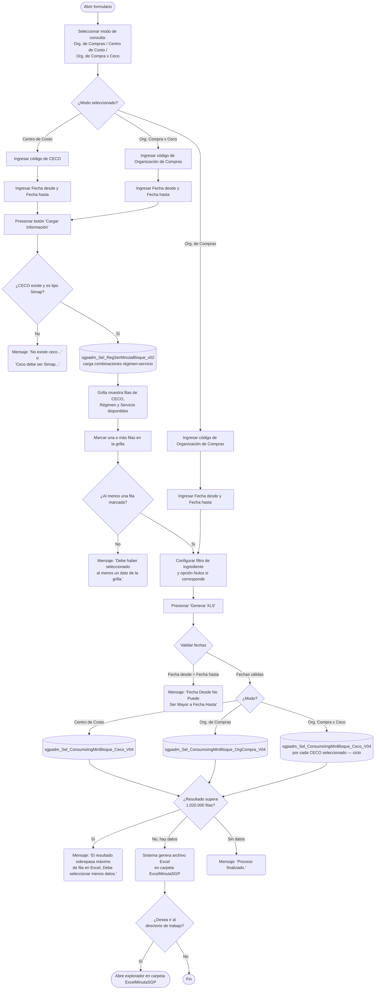

# Consumo Ingrediente Minuta Bloque

**Formulario:** `C_ConIngMinBlo.frm`
**Tabla(s) principal(es):** `cas_b_MinutaBloque` (bloques de minuta planificados por CECO, régimen y servicio), `cas_b_minuta` (minutas de casino), `b_recetadet` (detalle de ingredientes por receta)
**Consulta principal:** `sgpadm_Sel_ConsumoIngMinBloque_Ceco_V04` (modo Centro de Costo) / `sgpadm_Sel_ConsumoIngMinBloque_OrgCompra_V04` (modo Organización de Compras)

---

## Índice

- [1 — ¿Para qué sirve esta pantalla?](#1--para-qué-sirve-esta-pantalla)
- [2 — ¿Qué necesito para usarla?](#2--qué-necesito-para-usarla)
- [3 — ¿Cómo se usa?](#3--cómo-se-usa)
  - [3.1 Flujo paso a paso](#31-flujo-paso-a-paso)
  - [3.2 Controles y acciones disponibles](#32-controles-y-acciones-disponibles)
- [4 — ¿Qué restricciones debo conocer?](#4--qué-restricciones-debo-conocer)
  - [4.1 Validaciones del sistema](#41-validaciones-del-sistema)
- [5 — ¿Qué obtengo?](#5--qué-obtengo)
  - [Modo Centro de Costo — Consumo por régimen y servicio](#modo-centro-de-costo--consumo-por-régimen-y-servicio)
  - [Modo Organización de Compras — Consumo consolidado por ingrediente](#modo-organización-de-compras--consumo-consolidado-por-ingrediente)
  - [Modo Org. de Compra x Ceco — Consumo por CECO dentro de una organización](#modo-org-de-compra-x-ceco--consumo-por-ceco-dentro-de-una-organización)
- [6 — Referencia técnica](#6--referencia-técnica)
  - [Tablas que intervienen](#tablas-que-intervienen)
  - [Relación con otros módulos](#relación-con-otros-módulos)

---

## 1 — ¿Para qué sirve esta pantalla?
[↑ Volver al índice](#índice)

Esta pantalla genera un archivo Excel con el detalle de los ingredientes que se consumen en las minutas de tipo bloque de uno o varios casinos durante un período seleccionado. Para cada ingrediente muestra la cantidad bruta que aparece en la receta, el número de raciones planificadas, la cantidad a comprar según el formato de convenio vigente, el proveedor negociado y el último precio pactado.

La pantalla ofrece dos modos de consulta. En el modo **Centro de Costo** el usuario selecciona un casino Simap específico y luego elige qué combinaciones de régimen y servicio incluir en el informe; el resultado entrega el consumo desglosado por fecha de minuta, régimen y servicio. En el modo **Organización de Compras** el usuario selecciona una organización de compras SAP y obtiene el consumo consolidado de todos los casinos que pertenecen a esa organización, sin desagregación por régimen ni servicio.

Visualmente la pantalla se organiza en tres zonas: un panel superior con los parámetros de búsqueda (modo de consulta, entidad de referencia y rango de fechas), una grilla intermedia donde el sistema carga las combinaciones de régimen y servicio disponibles para el período indicado (solo activa en los modos Centro de Costo y Organización de Compras por CECO), y un panel inferior con el filtro opcional por ingrediente de tabla de gramaje. Los botones **Generar XLS** y **Salir** se ubican en la parte inferior del formulario.

---

## 2 — ¿Qué necesito para usarla?
[↑ Volver al índice](#índice)

| Campo | Descripción | Obligatorio |
|---|---|---|
| Modo de consulta | Selector con tres opciones: **Org. de Compras**, **Centro de Costo** u **Org. de Compra x Ceco**. Determina qué campo de entidad se habilita y qué procedimiento se ejecuta. | Sí |
| Org. de Compras | Código de la organización de compras SAP. Se habilita cuando el modo es "Org. de Compras" o "Org. de Compra x Ceco". Admite búsqueda mediante un selector auxiliar de organizaciones de compra. | Condicional |
| Contrato (CECO) | Código del centro de costo (casino). Se habilita cuando el modo es "Centro de Costo". El sistema muestra automáticamente el nombre del casino al escribir el código. Admite búsqueda mediante un selector auxiliar de clientes. Solo acepta casinos de tipo Simap. | Condicional |
| Fecha desde | Fecha de inicio del período a consultar. El sistema inicializa este campo con la fecha del día al abrir el formulario. | Sí |
| Fecha hasta | Fecha de fin del período a consultar. El sistema inicializa este campo con la fecha del día al abrir el formulario. | Sí |
| Ingrediente tabla gramaje — Uno / Todos | Selector que indica si el informe filtra por un ingrediente específico de la tabla de gramaje o incluye todos. Por defecto está en "Todos". | Sí |
| Ingrediente (código) | Código del ingrediente a filtrar. Solo se habilita cuando se selecciona "Uno". Admite búsqueda mediante un selector auxiliar de ingredientes. Solo acepta ingredientes activos marcados como referencia de gramaje (`ing_indppr = 1`). | Condicional |
| Solo Permitir Nulos | Casilla de verificación. Cuando está marcada, el informe muestra únicamente los ingredientes que no tienen proveedor negociado o cuyo convenio de precio no cubre el período de la minuta. | No |

> El botón de proceso de la barra superior (ícono de carga) es necesario para poblar la grilla de régimen-servicios antes de generar el Excel cuando se usa el modo Centro de Costo o el modo Organización de Compras por CECO. Sin ese paso previo el sistema rechaza la exportación.

---

## 3 — ¿Cómo se usa?
[↑ Volver al índice](#índice)

### 3.1 Flujo paso a paso
[↑ Volver al índice](#índice)

### 3.2 Controles y acciones disponibles
[↑ Volver al índice](#índice)

| Control / Acción | Descripción |
|---|---|
| **Selector de modo (Org. de Compras / Centro de Costo / Org. de Compra x Ceco)** | Determina qué campo de entidad se habilita y qué procedimiento ejecuta el informe. Al cambiar la selección, el sistema limpia todos los campos de filtro y la grilla de régimen-servicios. |
| **Campo Org. de Compras** | Permite ingresar el código de la organización de compras SAP manualmente o buscarlo con el selector auxiliar de organizaciones (tabla `b_centrologisticoceco_sap`). Se habilita con los modos Org. de Compras y Org. de Compra x Ceco. |
| **Campo Contrato (CECO)** | Permite ingresar el código del centro de costo manualmente o buscarlo con el selector auxiliar de casinos (tabla `b_clientes`, solo tipo Simap). Al escribir el código el sistema muestra el nombre del casino junto al campo. Se habilita solo con el modo Centro de Costo. |
| **Fecha desde / Fecha hasta** | Campos de fecha con formato dd/mm/yyyy. El sistema inicializa ambos con la fecha del día al abrir el formulario. |
| **Botón "Cargar Información" (barra de proceso)** | Solo disponible cuando el modo es Centro de Costo o Org. de Compra x Ceco. Consulta las combinaciones de régimen y servicio con minuta bloque activa para el CECO y período indicados, y las carga en la grilla. Es necesario ejecutarlo antes de poder generar el Excel. |
| **Grilla de Régimen — Servicios** | Muestra las combinaciones de CECO / Régimen / Servicio disponibles para el período. El usuario marca con un clic las filas que desea incluir en el informe. Los campos de texto de la fila inferior de la grilla permiten filtrar las filas por código de CECO, nombre de CECO, código de régimen, nombre de régimen, código de servicio o nombre de servicio. |
| **Selector Ingrediente Tabla Gramaje (Uno / Todos)** | Controla si el informe acota los resultados a un ingrediente específico. Al seleccionar "Uno" se habilita el campo de código de ingrediente y el botón de búsqueda. |
| **Campo Ingrediente (código)** | Código del ingrediente a filtrar. Al escribir el código el sistema muestra el nombre junto al campo. Admite búsqueda mediante el selector auxiliar de ingredientes (tabla `b_ingrediente`, solo activos y marcados como referencia de gramaje). |
| **Casilla "Solo Permitir Nulos"** | Cuando está marcada, restringe el informe a los ingredientes sin proveedor o con convenio de precio vencido respecto a la fecha de la minuta. Útil para identificar brechas de cobertura en convenios. |
| **Botón "Generar XLS"** | Ejecuta las validaciones, llama al procedimiento almacenado correspondiente y genera el archivo Excel en la carpeta de trabajo (`ExcelMinutaSGP`). El nombre del archivo incluye el código de la entidad consultada, la fecha y la hora de generación. Al finalizar, pregunta si desea abrir esa carpeta en el explorador. |
| **Botón "Salir"** | Cierra el formulario. |

---

## 4 — ¿Qué restricciones debo conocer?
[↑ Volver al índice](#índice)

### 4.1 Validaciones del sistema
[↑ Volver al índice](#índice)

| # | Cuándo aparece | Qué verifica el sistema | Qué ve o experimenta el usuario |
|---|---|---|---|
| 1 | Al presionar "Cargar Información" con modo Centro de Costo | Que el código de CECO ingresado exista en el catálogo de clientes y sea de tipo 0 | Mensaje: `No existe ceco...` |
| 2 | Al presionar "Cargar Información" o "Generar XLS" con modo Centro de Costo | Que el CECO sea de tipo minuta Simap (`cli_tipominuta = 3`) | Mensaje: `Ceco debe ser Simap...` |
| 3 | Al presionar "Generar XLS" con modo Centro de Costo | Que exista minuta bloque registrada para el CECO y el período indicado | Mensaje: `No existe Minuta...` |
| 4 | Al presionar "Generar XLS" con modo Centro de Costo | Que al menos una fila de la grilla de régimen-servicios esté marcada | Mensaje: `Regimen debe ser informado de la lista` |
| 5 | Al presionar "Generar XLS" con modo Centro de Costo y grilla vacía | Que la grilla haya sido cargada previamente con el botón de proceso | Mensaje: `Para la visualizar lista de regimen, debe seleccionar icono de proceso` |
| 6 | Al presionar "Generar XLS" con modo Org. de Compras | Que el código de organización de compras exista en la tabla `i_org_ceco` y no esté borrado | Mensaje: `No existe organización de compras...` |
| 7 | Al presionar "Generar XLS" con modo Org. de Compra x Ceco | Que al menos una fila de la grilla esté marcada | Mensaje: `Debe haber selecionado al menos un dato de la grilla.` |
| 8 | Al presionar "Generar XLS" (todos los modos) | Que Fecha desde no sea posterior a Fecha hasta | Mensaje: `Fecha Desde No Puede Ser Mayor a Fecha Hasta`. Restablece Fecha desde a la fecha actual. |
| 9 | Al presionar "Generar XLS" con ingrediente específico seleccionado | Que el código de ingrediente ingresado exista, esté activo y sea referencia de gramaje | Mensaje: `No existe Ingrediente` |
| 10 | Al evaluar el resultado de la consulta | Que el número de filas devuelto no supere 1.020.000 (límite de filas en Excel) | Mensaje: `El resultado sobrepasa máximo de fila en Excel, Debe seleccionar menos datos.` |
| 11 | Al finalizar sin datos | Que el resultado de la consulta no esté vacío | Mensaje: `Proceso finalizado.` (sin apertura del explorador) |

---

## 5 — ¿Qué obtengo?
[↑ Volver al índice](#índice)

Este formulario genera un único tipo de informe en Excel, con tres variantes según el modo de consulta seleccionado: una orientada al casino individual (Centro de Costo), otra consolidada por organización de compras, y una tercera que combina ambas perspectivas (Org. de Compra x Ceco).

---

### Modo Centro de Costo — Consumo por régimen y servicio
[↑ Volver al índice](#índice)

**Qué muestra:** Detalla el consumo de cada ingrediente por fecha de minuta, régimen y servicio para un casino Simap específico. Incluye la cantidad bruta de la receta, el número de raciones planificadas, la cantidad a comprar calculada, el proveedor y precio negociado vigente para cada ingrediente.

**Cómo se seleccionan los servicios:** El usuario carga la grilla de régimen-servicios con el botón "Cargar Información" y marca las combinaciones que desea incluir. El sistema construye un XML interno con esas selecciones y lo envía al procedimiento almacenado como parámetro.

**Opciones de configuración disponibles:**
- **Ingrediente tabla gramaje (Uno / Todos):** permite acotar el informe a un ingrediente específico de la tabla de gramaje o incluir todos.
- **Solo Permitir Nulos:** cuando está marcada, solo incluye ingredientes sin proveedor negociado o con convenio vencido respecto a la fecha de minuta.

**Estructura de datos del informe:**

| Campo / Columna | Descripción | Calculado |
|---|---|---|
| Ceco | Código del centro de costo (casino) | No |
| Descripción (casino) | Nombre del casino | No |
| Régimen | Código del régimen alimenticio | No |
| Descripción (régimen) | Nombre del régimen | No |
| Servicio | Código del servicio | No |
| Descripción (servicio) | Nombre del servicio | No |
| Fecha Minuta | Fecha de la minuta en formato dd/mm/yyyy | No |
| Código Ingrediente | Código del ingrediente según catálogo | No |
| Descripción (ingrediente) | Nombre del ingrediente | No |
| Consumo Ingrediente | Cantidad bruta del ingrediente sumada para todas las recetas del día, régimen y servicio | Sí |
| Unidad | Unidad de medida del ingrediente | No |
| Raciones | Número de raciones planificadas para la fecha, régimen y servicio | No |
| Cantidad Consumir | Cantidad total del producto a adquirir, ajustada al formato de convenio | Sí |
| Unidad SGP | Unidad de medida del producto según catálogo SGP | No |
| Proveedor | Código del proveedor negociado en el convenio SAP | No |
| Nombre Proveedor | Nombre del proveedor | No |
| Código Material | Código de material SAP del producto | No |
| Descripción (material) | Descripción del material SAP | No |
| Ult. Precio Neg. | Último precio unitario negociado en el convenio vigente para la fecha de la minuta | No |
| Fecha Vig. | Fecha hasta la cual es válido el convenio de precio | No |
| Formato Compra | Tipo de formato de compra del convenio: GR (granel), CH (chuico), ST (stock) o S/F si no hay formato registrado | Sí |

**Cálculo — Consumo Ingrediente**

La cantidad bruta del ingrediente que aparece en la receta puede estar ajustada por la tabla de gramaje por nivel del casino. Si existe un reemplazo configurado para ese casino, régimen y receta, el sistema sustituye el ingrediente original y su cantidad antes de sumar.

**Fórmula o lógica:**
1. El sistema obtiene el detalle de ingredientes de las recetas asociadas a las minutas bloque del período y las combinaciones régimen-servicio seleccionadas.
2. Si existe una regla de reemplazo de ingrediente en la tabla de gramaje por nivel (`fn_ObtenerIngredienteReemplazoJerarquia`), reemplaza el código de ingrediente y la cantidad antes de agrupar.
3. Agrupa por fecha, régimen, servicio e ingrediente y suma la cantidad bruta resultante.

| Componente | Qué representa | De dónde viene |
|---|---|---|
| Cantidad bruta receta | Cantidad del ingrediente según la receta base | `b_recetadet.red_canpro` |
| Reemplazo de ingrediente | Sustitución de ingrediente o cantidad según tabla de gramaje jerárquica del CECO | Función `dbo.fn_ObtenerIngredienteReemplazoJerarquia`, tabla `b_tablagramajececo_nivel` |

> Ejemplo: si la receta indica 50 g de harina y la tabla de gramaje del casino define un reemplazo por 45 g de harina integral, el informe mostrará el ingrediente reemplazado con 45 g como consumo.

---

**Cálculo — Cantidad Consumir**

Representa la cantidad del producto en la unidad del convenio SAP que debe solicitarse al proveedor, ajustada al formato de presentación del producto.

**Fórmula o lógica:**
Cantidad Consumir = REDONDEAR( (Consumo Ingrediente × Raciones) / Facing del producto , 4 )

| Componente | Qué representa | De dónde viene |
|---|---|---|
| Consumo Ingrediente | Cantidad bruta del ingrediente por ración (sumada para el grupo) | Calculado (ver arriba) |
| Raciones | Número de raciones planificadas para la fecha, régimen y servicio | `cas_b_minutadet.mid_numrac` |
| Facing del producto | Factor de conversión al formato de compra (unidades por envase o caja) | `b_productos.pro_facing` |

> Ejemplo: si el consumo es 0,050 kg por ración y hay 200 raciones, el total es 10 kg. Si el facing del producto es 5 kg por caja, la cantidad a comprar es 2,0000 cajas.

---

**Cálculo — Formato Compra**

Es un código textual derivado del tipo de formato de compra registrado en el convenio SAP.

| Valor en convenio | Texto en informe |
|---|---|
| 1 | GR (granel) |
| 2 | CH (chuico) |
| 3 | ST (stock) |
| Otro o sin convenio | S/F |

**Formato de salida:** Excel. Una única hoja (`Hoja1`). El usuario no elige la ruta: el archivo se guarda automáticamente en la subcarpeta `ExcelMinutaSGP` dentro del directorio de trabajo del sistema. El nombre del archivo tiene el patrón `FiltroIngrediente <CECO> <fecha>-<hora>.xlsx`. El encabezado ocupa las filas 1 a 5: fila 1 con el título "Consumo Ingrediente Minuta Bloque" (celdas A1 a E1 combinadas), fila 3 con el rótulo "Centro de Costo:" y su valor, fila 4 con el rótulo "Periodo:" y el rango de fechas. Los nombres de columna se escriben en la fila 6 directamente desde los nombres de campo del resultado de la consulta. Los datos comienzan en la fila 7. Las columnas se ajustan automáticamente al contenido.

---

### Modo Organización de Compras — Consumo consolidado por ingrediente
[↑ Volver al índice](#índice)

**Qué muestra:** Entrega el consumo total de cada ingrediente sumado para todos los casinos que pertenecen a la organización de compras indicada, en el período seleccionado. No desagrega por fecha de minuta ni por régimen o servicio: consolida todo en una sola fila por ingrediente y convenio de precio.

**Restricciones propias de este modo:** No requiere cargar la grilla de régimen-servicios ni marcar filas; el botón "Cargar Información" no tiene efecto en este modo.

**Opciones de configuración disponibles:**
- **Ingrediente tabla gramaje (Uno / Todos):** permite acotar el informe a un ingrediente específico o incluir todos.
- **Solo Permitir Nulos:** cuando está marcada, solo incluye ingredientes sin proveedor negociado o con convenio vencido.

**Estructura de datos del informe:**

| Campo / Columna | Descripción | Calculado |
|---|---|---|
| Código Ingrediente | Código del ingrediente según catálogo | No |
| Descripción (ingrediente) | Nombre del ingrediente | No |
| Unidad | Unidad de medida del ingrediente | No |
| Consumo | Cantidad total consumida sumada para todos los casinos, fechas y servicios del período | Sí |
| Proveedor | Código del proveedor negociado en el convenio SAP | No |
| Código Material SAP | Código de material SAP del producto | No |
| Descripción (material) | Descripción del material SAP | No |
| Ult. Precio Neg. | Último precio unitario negociado (redondeado a 2 decimales) | No |
| Fecha Vig. | Fecha hasta la cual es válido el convenio de precio (vacío si no hay formato registrado) | No |
| Formato Compra | Tipo de formato de compra: GR, CH, ST o S/F | Sí |

**Cálculo — Consumo (modo Org. de Compras)**

A diferencia del modo Centro de Costo, este procedimiento también aplica la tabla de gramaje jerárquica por nivel antes de agregar, y calcula el consumo multiplicando la cantidad de la receta ya ajustada por el número de raciones.

**Fórmula o lógica:**
Consumo = SUM( cantidad_ingrediente_ajustada × raciones_planificadas )

| Componente | Qué representa | De dónde viene |
|---|---|---|
| cantidad_ingrediente_ajustada | Cantidad del ingrediente por ración, tras aplicar reemplazos de la tabla de gramaje jerárquica | `b_recetadet.red_canpro` ajustado por `fn_ObtenerIngredienteReemplazoJerarquia` |
| raciones_planificadas | Número de raciones para esa fecha, régimen y servicio | `cas_b_minutadet.mid_numrac` |

> Ejemplo: si un ingrediente tiene 0,030 kg de consumo por ración en una receta, y el servicio planificó 300 raciones en 10 fechas, el consumo total para ese ingrediente sería al menos 90 kg (sumado para todos los cecos y fechas del período).

---

**Cálculo — Formato Compra**

Idéntico al descrito en el modo Centro de Costo: código textual derivado del campo `fcs_tipoformatocompras` del convenio SAP.

**Formato de salida:** Excel. Una única hoja (`Hoja1`). Guardado automático en subcarpeta `ExcelMinutaSGP`. El nombre del archivo tiene el patrón `FiltroIngrediente <CódigoOrg> <fecha>-<hora>.xlsx`. El encabezado ocupa las filas 1 a 5: fila 1 con título (A1:E1 combinadas), fila 3 con el rótulo "Organización de Compra:" y su valor, fila 4 con el período. Nombres de columna en fila 6. Datos desde fila 7. Columnas ajustadas automáticamente al contenido.

---

### Modo Org. de Compra x Ceco — Consumo por CECO dentro de una organización
[↑ Volver al índice](#índice)

**Qué muestra:** Entrega el mismo detalle que el modo Centro de Costo — consumo por fecha, régimen, servicio e ingrediente — pero aplicado a todos los casinos que el usuario selecciona en la grilla, siempre dentro del universo de la organización de compras indicada. El sistema genera un archivo Excel independiente por cada CECO marcado.

**Cómo se seleccionan los servicios:** El usuario ingresa primero el código de organización de compras y el rango de fechas, luego presiona el botón **Cargar Información** para poblar la grilla con todas las combinaciones de CECO / Régimen / Servicio disponibles en esa organización para el período. A continuación marca las filas que desea incluir. El sistema agrupa las selecciones por CECO y ejecuta el procedimiento una vez por cada casino distinto.

**Opciones de configuración disponibles:**
- **Ingrediente tabla gramaje (Uno / Todos):** permite acotar el informe a un ingrediente específico de la tabla de gramaje o incluir todos.
- **Solo Permitir Nulos:** cuando está marcada, solo incluye ingredientes sin proveedor negociado o con convenio vencido respecto a la fecha de la minuta.

**Estructura de datos del informe:**

La estructura de columnas es idéntica a la del modo Centro de Costo. Cada archivo Excel corresponde a un CECO y contiene las mismas columnas con los datos filtrados para ese casino:

| Campo / Columna | Descripción | Calculado |
|---|---|---|
| Ceco | Código del centro de costo (casino) | No |
| Descripción (casino) | Nombre del casino | No |
| Régimen | Código del régimen alimenticio | No |
| Descripción (régimen) | Nombre del régimen | No |
| Servicio | Código del servicio | No |
| Descripción (servicio) | Nombre del servicio | No |
| Fecha Minuta | Fecha de la minuta en formato dd/mm/yyyy | No |
| Código Ingrediente | Código del ingrediente según catálogo | No |
| Descripción (ingrediente) | Nombre del ingrediente | No |
| Consumo Ingrediente | Cantidad bruta del ingrediente sumada para todas las recetas del día, régimen y servicio | Sí |
| Unidad | Unidad de medida del ingrediente | No |
| Raciones | Número de raciones planificadas para la fecha, régimen y servicio | No |
| Cantidad Consumir | Cantidad total del producto a adquirir, ajustada al formato de convenio | Sí |
| Unidad SGP | Unidad de medida del producto según catálogo SGP | No |
| Proveedor | Código del proveedor negociado en el convenio SAP | No |
| Nombre Proveedor | Nombre del proveedor | No |
| Código Material | Código de material SAP del producto | No |
| Descripción (material) | Descripción del material SAP | No |
| Ult. Precio Neg. | Último precio unitario negociado en el convenio vigente para la fecha de la minuta | No |
| Fecha Vig. | Fecha hasta la cual es válido el convenio de precio | No |
| Formato Compra | Tipo de formato de compra del convenio: GR (granel), CH (chuico), ST (stock) o S/F si no hay formato registrado | Sí |

Los cálculos de **Consumo Ingrediente**, **Cantidad Consumir** y **Formato Compra** son idénticos a los descritos en el modo Centro de Costo: aplican la tabla de gramaje jerárquica por nivel antes de agregar, y la cantidad a comprar se calcula dividiendo el consumo total por el facing del producto.

**Formato de salida:** Excel. Una hoja por archivo (`Hoja1`). El sistema genera **un archivo por cada CECO** seleccionado en la grilla, guardado automáticamente en la subcarpeta `ExcelMinutaSGP`. El nombre del archivo sigue el patrón `FiltroIngrediente <CECO> <fecha>-<hora>.xlsx`. El encabezado ocupa las filas 1 a 5 con el mismo diseño que el modo Centro de Costo: título en fila 1, rótulo «Centro de Costo:» y su valor en fila 3, período en fila 4. Los nombres de columna se escriben en la fila 6 y los datos comienzan en la fila 7. Las columnas se ajustan automáticamente al contenido.

> **Nota:** Si el usuario marca filas de varios CECOs en la grilla, el sistema ejecuta el proceso secuencialmente para cada casino distinto y genera un archivo Excel independiente por cada uno. Al finalizar el último, pregunta si desea abrir la carpeta `ExcelMinutaSGP` en el explorador.

---

## 6 — Referencia técnica
[↑ Volver al índice](#índice)

### Tablas que intervienen
[↑ Volver al índice](#índice)

| Tabla | Para qué se usa en este reporte | Campos clave |
|---|---|---|
| `cas_b_MinutaBloque` | Bloque de minuta que define la relación entre un CECO, un régimen, un servicio y un rango de fechas planificado | `ID_Bloque`, `Ceco`, `Regimen`, `Servicio`, `FechaDesde`, `FechaHasta` |
| `cas_b_minuta` | Minutas diarias de cada casino; relaciona el bloque con fechas específicas | `min_cecori`, `min_codigo`, `min_codreg`, `min_codser`, `min_fecmin`, `ID_Bloque` |
| `cas_b_minutadet` | Detalle de recetas y raciones por cada minuta | `mid_cecori`, `mid_codigo`, `mid_codrec`, `mid_numrac`, `mid_tipmin` |
| `b_receta` | Catálogo de recetas del sistema | `rec_codigo`, `rec_tippla` |
| `b_recetadet` | Ingredientes que componen cada receta con sus cantidades brutas | `red_codigo`, `red_codpro`, `red_canpro` |
| `b_ingrediente` | Catálogo de ingredientes con unidad de medida y estado | `ing_codigo`, `ing_nombre`, `ing_unimed`, `ing_activo`, `ing_indppr` |
| `b_clientes` | Catálogo de casinos (clientes); identifica el tipo de minuta y el tipo de formato de compras | `cli_codigo`, `cli_nombre`, `cli_tipo`, `cli_tipominuta`, `cli_activo`, `cli_tipoformatocompras` |
| `b_tipominuta` | Catálogo de tipos de minuta; solo tipos activos se consideran | `tip_codigo`, `activo` |
| `I_ORG_CECO` | Relación entre organizaciones de compras SAP y centros de costo | `ID_ORGCOMPRA`, `ID_CECO`, `BORRADO` |
| `b_precio_ingrediente` | Precios de ingredientes por organización de compras y proveedor con vigencia | `Ingrediente`, `Id_OrgCompra`, `Ceco`, `Proveedor`, `Codigo_Material`, `Precio`, `Valido_Desde`, `Valido_Hasta` |
| `I_CONVENIO_SAP` | Convenios SAP que relacionan material, proveedor y organización de compras | `ID_ORGCOMPRA`, `ID_MATERIAL`, `ID_PROVEEDOR`, `CONDICIONES`, `BORRADO` |
| `b_formatocompras_sap` | Descripción y tipo del formato de compras de cada material SAP | `fcs_CodMaterial`, `fcs_DenMaterial`, `fcs_tipoformatocompras` |
| `b_Pedido_ExcepcionFormatoCompra` | Excepciones de formato de compra por proveedor y casino con rango de fechas opcional | `ID`, `proveedor`, `cencos`, `ing_codigo`, `fcs_CodMaterial`, `fecha_inicio`, `Fecha_Termino` |
| `b_proveedor` | Catálogo de proveedores; aporta el nombre del proveedor al informe | `prv_codigo`, `prv_nombre` |
| `b_productos` | Catálogo de productos SGP con su factor de conversión (facing) y unidad | `pro_codigo`, `pro_facing`, `pro_coduni` |
| `a_regimen` | Catálogo de regímenes alimenticios | `reg_codigo`, `reg_nombre` |
| `a_servicio` | Catálogo de servicios (desayuno, almuerzo, cena, etc.) | `ser_codigo`, `ser_nombre`, `ser_orden` |
| `a_unidadmed` | Catálogo de unidades de medida de ingredientes | `unm_codigo`, `unm_nomcor` |
| `a_unidad` | Catálogo de unidades de medida de productos SGP | `uni_codigo`, `uni_nomcor` |
| `b_tablagramajececo_nivel` | Tabla de gramaje jerárquica por CECO: define reemplazos de ingredientes y ajustes de cantidad por casino, régimen y receta | `idceco`, `idingredienteorigen`, `idingredientecambio`, `activo` |

### Relación con otros módulos
[↑ Volver al índice](#índice)

| Módulo | Relación |
|---|---|
| **Planificación de minutas bloque** | Origina los datos que este reporte consume: las minutas tipo bloque (`cas_b_MinutaBloque`, `cas_b_minuta`) con sus recetas y raciones planificadas. |
| **Maestro de recetas** | Las recetas y su detalle de ingredientes (`b_receta`, `b_recetadet`) determinan qué ingredientes se reportan y en qué cantidad base. |
| **Convenios SAP / Precios** | Los convenios de precio (`b_precio_ingrediente`, `I_CONVENIO_SAP`) son cruzados con el período de la minuta para identificar proveedor, precio unitario y formato de compra vigente. |
| **Tabla de gramaje por nivel** | La función de reemplazo jerárquico de ingredientes (`fn_ObtenerIngredienteReemplazoJerarquia`, `b_tablagramajececo_nivel`) puede sustituir ingredientes o ajustar cantidades antes de calcular el consumo, afectando los totales reportados. |
| **Organizaciones de compras SAP** | La tabla `I_ORG_CECO` vincula cada casino con su organización de compras SAP, lo que permite consultar el consumo consolidado a ese nivel. |

---

*Fuentes: `C_ConIngMinBlo.frm`, SP `sgpadm_Sel_ConsumoIngMinBloque_Ceco_V04` en `SGP_Admin.sql`, SP `sgpadm_Sel_ConsumoIngMinBloque_OrgCompra_V04` en `SGP_Admin.sql`, SP `sgpadm_Sel_RegSerMinutaBloque_v02` en `SGP_Admin.sql`, tablas `cas_b_MinutaBloque`, `b_precio_ingrediente`, `I_CONVENIO_SAP`, `b_tablagramajececo_nivel` en `SGP_Admin.sql`*
