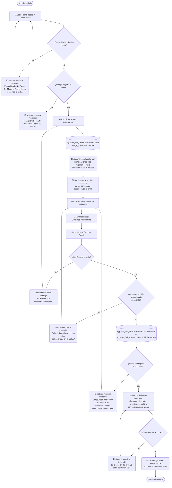

# Costo Merma Sitio

**Formulario:** `E_CostoMermaSitio.frm`
**Tabla(s) principal(es):** `cas_b_mermadesconche` (registro de mermas de desconche por sitio), `b_CostoMermas` (parámetros de costo de merma por segmento y servicio)
**Consulta principal:** `sgpadm_Sel_XmlCostoMermaSitioDetallado` / `sgpadm_Sel_XmlCostoMermaSitioResumido` (según la modalidad elegida), precedida de `sgpadm_Sel_ListarCostoMermaSitios` para cargar los sitios disponibles.

---

## Índice

- [1 — ¿Para qué sirve esta pantalla?](#1--para-qué-sirve-esta-pantalla)
- [2 — ¿Qué necesito para usarla?](#2--qué-necesito-para-usarla)
- [3 — ¿Cómo se usa?](#3--cómo-se-usa)
  - [3.1 Flujo paso a paso](#31-flujo-paso-a-paso)
  - [3.2 Controles y acciones disponibles](#32-controles-y-acciones-disponibles)
- [4 — ¿Qué restricciones debo conocer?](#4--qué-restricciones-debo-conocer)
  - [4.1 Validaciones del sistema](#41-validaciones-del-sistema)
- [5 — ¿Qué obtengo?](#5--qué-obtengo)
  - [Detallado](#detallado)
  - [Resumido](#resumido)
- [6 — Referencia técnica](#6--referencia-técnica)
  - [Tablas que intervienen](#tablas-que-intervienen)
  - [Relación con otros módulos](#relación-con-otros-módulos)

---

## 1 — ¿Para qué sirve esta pantalla?

[↑ Volver al índice](#índice)

Esta pantalla permite consultar el costo económico de las mermas de desconche registradas en uno o varios sitios (casinos) durante un rango de fechas determinado. Para cada combinación de sitio, régimen y servicio, el sistema calcula cuántos kilogramos se perdieron en cada tipo de desconche —General, de Pan y de Producción— y los multiplica por el costo unitario vigente para ese segmento y período, entregando el costo total resultante.

La pantalla se organiza en dos etapas visuales. En la primera, el usuario ingresa el rango de fechas y hace clic en el botón de carga para obtener en la grilla central la lista de combinaciones sitio-régimen-servicio que registraron mermas en ese período. En la segunda etapa, el usuario selecciona de esa grilla los registros que desea incluir en el informe, elige la modalidad (Detallado o Resumido) y exporta el resultado a un archivo Excel.

El formulario opera exclusivamente sobre datos ya registrados en el sistema; no permite ingresar ni modificar mermas. El botón de exportación a Excel solo está habilitado si el usuario tiene el permiso correspondiente asignado en su perfil.

---

## 2 — ¿Qué necesito para usarla?

[↑ Volver al índice](#índice)

| Campo | Descripción | Obligatorio |
|---|---|---|
| Fecha desde | Fecha de inicio del período a consultar. Al abrir el formulario se inicializa con la fecha del día. | Sí |
| Fecha hasta | Fecha de fin del período a consultar. Al abrir el formulario se inicializa con la fecha del día. | Sí |
| Selección de sitios en la grilla | Luego de cargar los datos, el usuario debe marcar con un check al menos un sitio (fila) de la grilla para poder exportar. | Sí |
| Modalidad del informe | Opción entre **Detallado** (una fila por día y tipo de desconche) y **Resumido** (una fila por mes y tipo de desconche). El sistema selecciona **Detallado** por defecto al abrir el formulario. | Sí |

---

## 3 — ¿Cómo se usa?

### 3.1 Flujo paso a paso

[↑ Volver al índice](#índice)

### 3.2 Controles y acciones disponibles

[↑ Volver al índice](#índice)

| Control / Acción | Descripción |
|---|---|
| **Fecha desde** | Campo de fecha con formato dd/mm/yyyy. Determina el inicio del período a consultar. Cuando se modifica, la grilla se limpia automáticamente para forzar una nueva carga. |
| **Fecha hasta** | Campo de fecha con formato dd/mm/yyyy. Determina el fin del período a consultar. Cuando se modifica, la grilla se limpia automáticamente. |
| **Cargar Información** | Botón ubicado junto a los campos de fecha. Valida el rango de fechas y, si es correcto, ejecuta la consulta que llena la grilla con los sitios que tuvieron mermas en ese período. Limpia los campos de filtro de texto antes de cargar. |
| **Grilla de sitios** | Muestra las combinaciones de sitio (CECO), régimen y servicio disponibles para el período consultado. El usuario marca o desmarca filas haciendo clic en la columna de selección o en cualquier celda de la fila. Al hacer clic en el encabezado de la primera columna se alternan todas las filas visibles. |
| **Campos de búsqueda sobre la grilla** | Seis campos de texto ubicados debajo de la grilla que permiten filtrar las filas visibles buscando por CECO, nombre de sitio, código de régimen, nombre de régimen, código de servicio o nombre de servicio. Al ingresar un texto y presionar Enter, el sistema oculta las filas que no coincidan. Solo puede haber un campo de búsqueda activo a la vez: activar uno limpia todos los demás. El campo acepta múltiples términos separados por coma. |
| **Detallado** | Opción de modalidad. Genera el Excel con una fila por día y tipo de desconche. Seleccionado por defecto. |
| **Resumido** | Opción de modalidad. Genera el Excel con una fila por mes (en formato MM/AAAA) y tipo de desconche, acumulando kilos y costo total. |
| **Exportar Excel** | Botón de la barra derecha. Requiere permiso de exportación en el perfil del usuario. Valida que la grilla tenga datos y que al menos una fila esté marcada. Presenta un cuadro de diálogo para elegir el nombre y la carpeta del archivo. Genera el archivo Excel y lo abre automáticamente al terminar. |
| **Salir** | Botón de la barra derecha. Cierra el formulario. |

---

## 4 — ¿Qué restricciones debo conocer?

### 4.1 Validaciones del sistema

[↑ Volver al índice](#índice)

| # | Cuándo aparece | Qué verifica el sistema | Qué ve o experimenta el usuario |
|---|---|---|---|
| 1 | Al hacer clic en "Cargar Información" o en "Exportar Excel" | Que la fecha desde no sea posterior a la fecha hasta. | Mensaje: `Fecha Desde No Puede Ser Mayor a Fecha Hasta`. El campo de fecha desde se resetea a la fecha actual y recibe el foco. |
| 2 | Al hacer clic en "Cargar Información" o en "Exportar Excel" | Que la fecha hasta no sea anterior a la fecha desde. | Mensaje: `Fecha Hasta No Puede Ser Mayor a Fecha Desde`. El campo de fecha hasta se resetea a la fecha actual y recibe el foco. |
| 3 | Al hacer clic en "Cargar Información" o en "Exportar Excel" | Que el rango entre ambas fechas no supere los 12 meses (365 días). | Mensaje: `Rango De Fecha No Puede Ser Mayor a 12 Meses`. La grilla se limpia. |
| 4 | Al hacer clic en "Exportar Excel" | Que la grilla tenga al menos una fila cargada. | Mensaje: `No existe datos selecionado en la grilla...` |
| 5 | Al hacer clic en "Exportar Excel" | Que al menos una fila de la grilla esté marcada como seleccionada. | Mensaje: `Debe haber a lo menos un dato seleccionado en la grilla...` |
| 6 | Tras ejecutar la consulta de exportación | Que el resultado no supere 1.020.000 filas (límite de filas de Excel). | Mensaje: `El resultado sobrepasa maximo de fila en excel, Debera seleccionar menos Ceco`. El proceso se cancela; el usuario debe reducir la selección de sitios. |
| 7 | En el cuadro de diálogo de guardado | Que el usuario elija un nombre de archivo con extensión `.xls` o `.xlsx`. | Mensaje: `La extensión del archivo debe ser (*.xls,*.xlsx)`. El proceso se cancela. |
| 8 | En el cuadro de diálogo de guardado | Que el usuario no haya cancelado sin elegir un archivo. | Mensaje: `Proceso cancelado` si se cierra el diálogo, o `Debe seleccionar la ruta y nombre de archivo` si el nombre queda vacío. |
| 9 | Al abrir el formulario | Que el perfil del usuario tenga el permiso de exportación a Excel. | El botón "Exportar Excel" aparece deshabilitado si el usuario no tiene el permiso correspondiente. |

---

## 5 — ¿Qué obtengo?

[↑ Volver al índice](#índice)

Este formulario genera un único archivo Excel cuyo contenido varía según la modalidad elegida. No existe selector de tipos de informe con códigos: la elección entre Detallado y Resumido determina directamente el nivel de agrupación de los datos.

Ambas modalidades entregan las mismas columnas pero difieren en la granularidad temporal:

- **Detallado:** una fila por cada día con merma registrada, dentro de cada combinación sitio-régimen-servicio-tipo de desconche.
- **Resumido:** una fila por mes (formato MM/AAAA), acumulando los kilos y el costo total del período mensual.

En ambos casos los tres tipos de desconche —General, Pan y Producción— generan filas independientes para cada combinación de sitio-régimen-servicio-fecha.

---

### Detallado

[↑ Volver al índice](#índice)

**Qué muestra:** El archivo entrega el detalle diario de las mermas de desconche para los sitios seleccionados. Por cada día con merma, aparecen hasta tres filas —una por tipo de desconche— mostrando los kilogramos perdidos, el costo unitario vigente para ese segmento y servicio, y el costo total resultante de multiplicar ambos valores.

**Estructura de datos del informe:**

| Campo / Columna | Descripción | Calculado |
|---|---|---|
| Ceco | Código del sitio (casino). | No |
| Descripción Ceco | Nombre del sitio. | No |
| Regimen | Código del régimen de alimentación. | No |
| Descripción Regimen | Nombre del régimen. | No |
| Servicio | Código del servicio (ej. almuerzo, cena). | No |
| Descripción Servicio | Nombre del servicio. | No |
| Fecha Minuta | Fecha exacta de la merma (dd/mm/aaaa). | No |
| Descripción Merma | Tipo de desconche: `Desconche General`, `Desconche Pan` o `Desconche Produccion`. | No |
| Kilos | Cantidad de kilogramos de merma registrada para ese tipo de desconche en esa fecha. | No |
| Costo | Costo unitario (por kilogramo) vigente para el segmento y servicio del sitio en esa fecha, según la tabla de parámetros de costos activa. | No |
| Total Costo | Costo económico total de la merma en esa fila. | Sí |

**Cálculo — Total Costo**

Representa el impacto económico de la merma de desconche en una fecha, tipo de desconche, sitio-régimen-servicio determinados.

**Fórmula:**
Total Costo = Kilos × Costo

| Componente | Qué representa | De dónde viene |
|---|---|---|
| Kilos | Kilogramos de merma registrados | `cas_b_mermadesconche.Merma_Desconche` / `Merma_Pan` / `Merma_Produccion` según el tipo |
| Costo | Costo unitario por kg activo para el segmento y servicio | `b_CostoMermas.Costo_Desconche` / `Costo_Pan` / `Costo_Produccion`, filtrado por `Activo = '1'` y por el rango de vigencia (Fecha_Desde–Fecha_Hasta) que contenga la fecha de la merma |

> Ejemplo: un Desconche General de 12,5 kg con un costo de $350/kg da un Total Costo de $4.375.

**Formato de salida:** Excel. Una única hoja (`Hoja1`). La fila 1 contiene los encabezados de columna generados automáticamente desde el conjunto de resultados. Los datos comienzan en la fila 2. El usuario elige el nombre y la carpeta del archivo mediante cuadro de diálogo de guardado. Las columnas y filas se ajustan automáticamente al contenido (AutoFit). El archivo se abre automáticamente en modo solo lectura al terminar.

---

### Resumido

[↑ Volver al índice](#índice)

**Qué muestra:** El archivo entrega el resumen mensual de las mermas de desconche. En lugar de mostrar cada día, agrupa los datos por mes y tipo de desconche, acumulando los kilogramos totales y el costo total del período mensual para cada combinación de sitio-régimen-servicio.

**Estructura de datos del informe:**

| Campo / Columna | Descripción | Calculado |
|---|---|---|
| Ceco | Código del sitio (casino). | No |
| Descripción Ceco | Nombre del sitio. | No |
| Regimen | Código del régimen de alimentación. | No |
| Descripción Regimen | Nombre del régimen. | No |
| Servicio | Código del servicio. | No |
| Descripción Servicio | Nombre del servicio. | No |
| Fecha Minuta | Mes y año del período acumulado, en formato MM/AAAA. | Sí |
| Descripción Merma | Tipo de desconche: `Desconche General`, `Desconche Pan` o `Desconche Produccion`. | No |
| Kilos | Suma de kilogramos de merma del mes para ese tipo de desconche y combinación sitio-régimen-servicio. | Sí |
| Costo | Costo unitario (por kilogramo) vigente para el segmento y servicio, según la tabla de parámetros de costos activa. | No |
| Total Costo | Costo económico total acumulado del mes para esa fila. | Sí |

**Cálculo — Fecha Minuta (formato mensual)**

En la modalidad resumida, la fecha no es el día exacto sino el mes de la merma, expresado como MM/AAAA.

**Fórmula:**
Fecha Minuta = MM + '/' + AAAA extraídos de la fecha numérica de la merma.

| Componente | Qué representa | De dónde viene |
|---|---|---|
| Fecha numérica | Fecha de la merma en formato YYYYMMDD | `cas_b_mermadesconche.Fecha_Merma` |

> Ejemplo: mermas del 5, 12 y 20 de agosto de 2023 quedan agrupadas bajo `08/2023`.

**Cálculo — Kilos (acumulado mensual)**

**Fórmula:**
Kilos = SUM(Merma del tipo correspondiente) para todas las fechas del mes dentro de la combinación sitio-régimen-servicio.

| Componente | Qué representa | De dónde viene |
|---|---|---|
| Merma del tipo | Kilogramos diarios del tipo de desconche | `cas_b_mermadesconche.Merma_Desconche` / `Merma_Pan` / `Merma_Produccion` |

> Ejemplo: desconches de Pan de 2 kg el día 3 y 1,5 kg el día 15 del mismo mes acumulan 3,5 kg en la fila resumen.

**Cálculo — Total Costo (acumulado mensual)**

**Fórmula:**
Total Costo = SUM(Kilos diarios × Costo unitario vigente) para todas las fechas del mes.

| Componente | Qué representa | De dónde viene |
|---|---|---|
| Kilos diarios | Merma por día para el tipo de desconche | `cas_b_mermadesconche` |
| Costo unitario | Costo por kg activo para el segmento-servicio en cada fecha | `b_CostoMermas`, filtrado por `Activo = '1'` y vigencia de fechas |

> Ejemplo: 3,5 kg totales en el mes × $280/kg = $980 de Total Costo mensual.

**Formato de salida:** Excel. Una única hoja (`Hoja1`). La fila 1 contiene los encabezados de columna. Los datos comienzan en la fila 2. El usuario elige el nombre y la carpeta del archivo mediante cuadro de diálogo de guardado. Las columnas y filas se ajustan automáticamente al contenido. El archivo se abre automáticamente en modo solo lectura al terminar.

---

## 6 — Referencia técnica

### Tablas que intervienen

[↑ Volver al índice](#índice)

| Tabla | Para qué se usa en este reporte | Campos clave |
|---|---|---|
| `cas_b_mermadesconche` | Fuente principal. Contiene los registros de mermas de desconche por sitio, régimen, servicio y fecha. Solo se consultan registros con `Considera_Merma = '0'`. | `IdCeco`, `IdRegimen`, `IdServicio`, `Fecha_Merma`, `Merma_Desconche`, `Merma_Pan`, `Merma_Produccion`, `Considera_Merma` |
| `b_CostoMermas` | Catálogo de parámetros de costos de merma. Relaciona un segmento de cliente y un servicio con los costos unitarios (por kg) de cada tipo de desconche, dentro de un rango de vigencia. Solo se usan registros con `Activo = '1'`. | `IdSegmento`, `IdServicio`, `Fecha_Desde`, `Fecha_Hasta`, `Costo_Desconche`, `Costo_Pan`, `Costo_Produccion`, `Activo` |
| `b_clientes` | Catálogo de sitios (casinos). Se usa para obtener el nombre del CECO. Solo se consideran registros con `cli_tipo = 0`. | `cli_codigo`, `cli_nombre`, `cli_tipo`, `cli_codseg` |
| `a_regimen` | Catálogo de regímenes de alimentación. Se usa para obtener el nombre del régimen. | `reg_codigo`, `reg_nombre` |
| `a_servicio` | Catálogo de servicios (tipos de comida). Se usa para obtener el nombre del servicio. | `ser_codigo`, `ser_nombre` |

### Relación con otros módulos

[↑ Volver al índice](#índice)

| Módulo | Relación |
|---|---|
| **Producción / Operaciones de sitio** | Las mermas de desconche que este reporte consulta son registradas por los operadores de casino a través del módulo de producción local (SGP Local). Este reporte las consolida para consulta administrativa. |
| **Parámetros de costos (Configuración SGP Admin)** | Los costos unitarios por kilogramo de merma que se aplican en el cálculo provienen de la tabla de parámetros de costos, que es mantenida por administradores del sistema de forma independiente a este formulario. Si no existe un parámetro activo y vigente para un segmento-servicio-fecha determinados, el costo se trata como cero. |

---

*Fuentes: `E_CostoMermaSitio.frm`, SP `sgpadm_Sel_ListarCostoMermaSitios` en `SGP_Admin.sql`, SP `sgpadm_Sel_XmlCostoMermaSitioDetallado` en `SGP_Admin.sql`, SP `sgpadm_Sel_XmlCostoMermaSitioResumido` en `SGP_Admin.sql`, tablas `cas_b_mermadesconche`, `b_CostoMermas`, `b_clientes`, `a_regimen`, `a_servicio` en `SGP_Admin.sql`*
