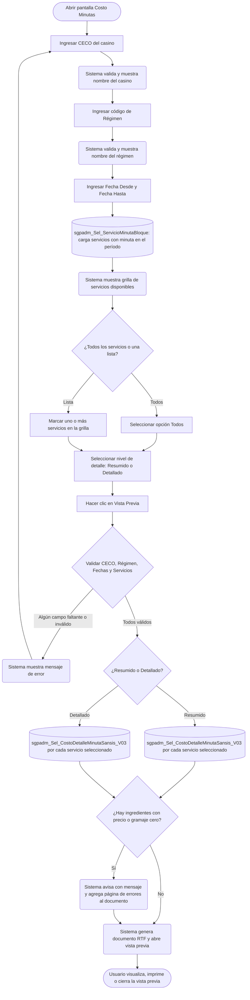

# Costo Minutas

**Formulario:** `I_CostoSansis.frm`
**Tabla(s) principal(es):** `cas_b_minuta` (cabecera de minutas planificadas por casino), `cas_b_minutadet` (detalle de recetas por minuta), `b_receta` / `b_recetadet` (recetas y sus ingredientes)
**Consulta principal:** `sgpadm_Sel_CostoDetalleMinutaSansis_V03` — calcula el costo por ingrediente de cada receta planificada en el período

---

## Índice

- [1 — ¿Para qué sirve esta pantalla?](#1--para-qué-sirve-esta-pantalla)
- [2 — ¿Qué necesito para usarla?](#2--qué-necesito-para-usarla)
- [3 — ¿Cómo se usa?](#3--cómo-se-usa)
  - [3.1 Flujo paso a paso](#31-flujo-paso-a-paso)
  - [3.2 Controles y acciones disponibles](#32-controles-y-acciones-disponibles)
- [4 — ¿Qué restricciones debo conocer?](#4--qué-restricciones-debo-conocer)
  - [4.1 Validaciones del sistema](#41-validaciones-del-sistema)
- [5 — ¿Qué obtengo?](#5--qué-obtengo)
  - [Resumen de tipos disponibles](#resumen-de-tipos-disponibles)
  - [(Resumido) Costo Minutas Resumido (`I_CostoMinutaResumidoSansis`)](#resumido-costo-minutas-resumido-i_costominutaresumidosansis)
  - [(Detallado) Costo Minutas Detallado (`I_CostoMinutaDetalladoSansis`)](#detallado-costo-minutas-detallado-i_costominutadetalladosansis)
- [6 — Referencia técnica](#6--referencia-técnica)
  - [Tablas que intervienen](#tablas-que-intervienen)
  - [Relación con otros módulos](#relación-con-otros-módulos)

---

## 1 — ¿Para qué sirve esta pantalla?

[↑ Volver al índice](#índice)

Esta pantalla permite consultar el costo económico de las minutas planificadas para un casino durante un rango de fechas. Para cada día del período seleccionado, el sistema toma las recetas que componen la minuta, suma el costo de cada ingrediente según el precio vigente, y entrega un valor de costo por servicio y por día.

La pantalla tiene dos modalidades de presentación. El modo **Resumido** muestra una tabla comparativa con una columna por servicio y una fila por día, de modo que el usuario puede ver rápidamente la evolución del costo diario en todos los servicios a la vez y obtener un total promedio al final. El modo **Detallado** recorre servicio por servicio, listando receta por receta con su costo individual, subtotales por servicio y un promedio del período.

Para definir el alcance del informe, la pantalla solicita el código del casino (CECO), el régimen y el rango de fechas. Una vez ingresados esos cuatro parámetros, el sistema carga automáticamente la lista de servicios con minuta planificada en ese período. El usuario puede optar por incluir todos los servicios o seleccionar una lista específica. El informe se genera como documento para visualización en vista previa, desde donde puede imprimirse. Si algún ingrediente de la minuta tiene precio cero o gramaje cero, el sistema agrega una página de advertencia al final del informe con los productos problemáticos.

---

## 2 — ¿Qué necesito para usarla?

[↑ Volver al índice](#índice)

| Campo | Descripción | Obligatorio |
|---|---|---|
| Ceco | Código del casino cuyas minutas se consultarán. Se puede escribir directamente o buscarlo mediante el ícono de búsqueda, que abre un selector de clientes (sitios remotos activos). Al ingresar un código válido, el sistema muestra el nombre del casino junto al campo. | Sí |
| Regimen | Código numérico del régimen alimenticio para el cual se quiere ver el costo. Se puede escribir directamente o buscarlo con el ícono de búsqueda, que abre el selector de regímenes. Al ingresar un valor válido el sistema muestra el nombre del régimen. | Sí |
| Fecha Desde | Fecha de inicio del período a consultar, en formato dd/mm/aaaa. Al abrirse la pantalla queda inicializada con la fecha del día. | Sí |
| Fecha Hasta | Fecha de fin del período a consultar, en formato dd/mm/aaaa. Al abrirse la pantalla queda inicializada con la fecha del día. | Sí |
| Servicio — Todos / Lista | Indica si se incluyen todos los servicios o solo los marcados. Si se elige **Todos**, el sistema marca automáticamente todos los servicios antes de generar el informe. Si se elige **Lista**, el usuario debe marcar manualmente al menos un servicio en la grilla de servicios. | Sí |
| Nivel de detalle — Resumido / Detallado | Determina el formato del informe: una tabla comparativa por día y servicio (Resumido), o el detalle receta por receta dentro de cada servicio (Detallado). Por defecto queda seleccionado Resumido. | Sí |

Una vez que los cuatro parámetros obligatorios de filtro (CECO, Régimen, Fecha Desde, Fecha Hasta) están completos, el sistema carga automáticamente la grilla de servicios sin necesidad de presionar ningún botón.

---

## 3 — ¿Cómo se usa?

### 3.1 Flujo paso a paso

[↑ Volver al índice](#índice)

### 3.2 Controles y acciones disponibles

[↑ Volver al índice](#índice)

| Control / Acción | Descripción |
|---|---|
| **Campo Ceco** | Ingreso del código del casino. Al escribir un código y avanzar con Tab, el sistema busca el casino y muestra su nombre. Si el código no existe, el nombre queda en blanco. |
| **Ícono de búsqueda junto a Ceco** | Abre el selector de clientes tipo "sitio remoto" para buscar el casino por nombre o código. Al confirmar la selección, rellena automáticamente el campo y su nombre descriptivo. |
| **Campo Regimen** | Ingreso del código numérico del régimen. Al avanzar con Tab, el sistema muestra el nombre correspondiente. |
| **Ícono de búsqueda junto a Regimen** | Abre el selector de regímenes para buscar por nombre. Al confirmar, rellena el campo y su descripción. |
| **Fecha Desde** | Campo de fecha de inicio del período. El sistema lo inicializa con la fecha de hoy al abrir la pantalla. Cada vez que se modifica, el sistema recarga automáticamente la grilla de servicios. |
| **Fecha Hasta** | Campo de fecha de fin del período. Mismo comportamiento que Fecha Desde. |
| **Grilla de servicios** | Muestra los servicios que tienen minuta planificada para el CECO, régimen y período indicados. El usuario activa la casilla de la primera columna para incluir cada servicio. Se carga automáticamente al completar todos los filtros. |
| **Ícono de selección de servicios** (habilitado solo cuando se elige "Lista") | Abre un selector de servicios para elegir de una lista asistida qué servicios incluir en la grilla. |
| **Opción Servicio — Todos / Lista** | Cuando se selecciona "Todos", el sistema marcará automáticamente todos los servicios al momento de generar el informe. Cuando se selecciona "Lista", el ícono de selección de servicios queda habilitado y el usuario elige manualmente. |
| **Opción Nivel de detalle — Resumido / Detallado** | Determina el formato del documento generado. Por defecto está en "Resumido". |
| **Botón Vista Previa** (barra de herramientas) | Ejecuta las validaciones, genera el documento RTF y lo muestra en la ventana de Vista Previa del sistema para revisar e imprimir. Solo está habilitado para usuarios con permiso de vista previa. |
| **Botón Histórico Planificación Teórica** (barra de herramientas) | Abre el formulario de histórico de minutas del casino, donde el usuario puede navegar por períodos pasados y, al seleccionar uno, los campos de régimen y fechas de la pantalla actual se rellenan automáticamente. Solo puede usarse si el casino tiene minutas planificadas registradas. |
| **Botón Salir** (barra de herramientas) | Cierra el formulario. |

---

## 4 — ¿Qué restricciones debo conocer?

### 4.1 Validaciones del sistema

[↑ Volver al índice](#índice)

| # | Cuándo aparece | Qué verifica el sistema | Qué ve o experimenta el usuario |
|---|---|---|---|
| 1 | Al intentar generar el informe | Que el campo CECO tenga un casino reconocido (nombre no vacío) | Mensaje: **"Debe registrar ceco..."** y el proceso se detiene. |
| 2 | Al intentar generar el informe | Que el campo Régimen tenga un régimen reconocido (nombre no vacío) | Mensaje: **"Debe registrar regimen..."** y el proceso se detiene. |
| 3 | Al intentar generar el informe | Que ambas fechas estén completas | Mensaje: **"Unas de las fecha esta nula..."** y el proceso se detiene. |
| 4 | Al intentar generar el informe | Que Fecha Desde no sea posterior a Fecha Hasta | Mensaje: **"Fecha Origen No Puede Ser Mayor Que Fecha Destino"** y el proceso se detiene. |
| 5 | Al intentar generar el informe | Que al menos un servicio esté marcado en la grilla (o que la opción "Todos" esté seleccionada) | Mensaje: **"Servicio debe ser selecionado"** y el proceso se detiene. |
| 6 | Al hacer clic en el botón de Histórico Planificación Teórica | Que el casino tenga al menos una minuta registrada en el sistema | Mensaje: **"No existe ceco planificado"** y el proceso se detiene. |
| 7 | Durante la generación del informe, al encontrar ingredientes con problema | Que todos los ingredientes de las recetas planificadas tengan precio mayor que cero y gramaje mayor que cero | Mensaje: **"Existe producto valor cero. Ver Página : [N]"** y se agrega una página de advertencia al documento con el código, descripción y tipo de error de cada producto problemático (Gramaje Cero o Precio Cero). |

---

## 5 — ¿Qué obtengo?

[↑ Volver al índice](#índice)

La pantalla genera uno de dos tipos de documento según la opción de nivel de detalle elegida. Ambos tipos utilizan el mismo procedimiento de cálculo de costos y se presentan en la ventana de Vista Previa del sistema.

### Resumen de tipos disponibles

[↑ Volver al índice](#índice)

| Código | Nombre en el selector | Formato de salida | Procedimiento almacenado principal |
|---|---|---|---|
| Resumido | Resumido | RTF — Vista Previa (orientación Horizontal) | `sgpadm_Sel_CostoDetalleMinutaSansis_V03` |
| Detallado | Detallado | RTF — Vista Previa (orientación Vertical) | `sgpadm_Sel_CostoDetalleMinutaSansis_V03` |

---

### (Resumido) Costo Minutas Resumido (`I_CostoMinutaResumidoSansis`)

[↑ Volver al índice](#índice)

**Qué muestra:** una tabla donde cada columna corresponde a un servicio seleccionado y cada fila representa un día del período. La celda de intersección contiene el costo total de ese servicio en ese día. Al final aparece una fila de totales promedio por servicio y el gran total del período.

**Cómo se seleccionan los servicios:** el usuario marca individualmente los servicios en la grilla de la pantalla, o bien activa la opción "Todos" para que el sistema los incluya todos. Cada servicio marcado se convierte en una columna del informe.

**Estructura de datos del informe:**

| Campo / Columna | Descripción | Calculado |
|---|---|---|
| Fecha | Fecha del día de la minuta, presentada en formato legible (ej. "15/03/2025") | No |
| [Nombre del servicio 1] … [Nombre del servicio N] | Una columna por cada servicio seleccionado; contiene el costo total de todos los ingredientes de todas las recetas planificadas para ese servicio en ese día | Sí |
| Total | Suma de los costos de todos los servicios en ese día | Sí |
| Tot. Promedio | Fila final que muestra el promedio diario de costo para cada servicio, calculado sobre los días efectivamente planificados | Sí |

**Cálculo — Costo de servicio por día**

El costo que aparece en cada celda de la tabla representa el gasto en ingredientes que implica ejecutar un servicio en un día determinado, valorizado al precio vigente de cada producto.

**Fórmula o lógica:**

Costo servicio-día = Σ (Gramaje del ingrediente en la receta × Precio unitario del ingrediente vigente en esa fecha)

| Componente | Qué representa | De dónde viene |
|---|---|---|
| Gramaje del ingrediente | Cantidad bruta del ingrediente que indica la receta | Tabla `b_recetadet`, campo `red_canpro` (puede ser reemplazado por tabla de gramaje por nivel jerárquico si corresponde) |
| Precio unitario del ingrediente | Precio vigente según la modalidad seleccionada (Convenio, PMP o Lista) para la fecha del día | SP `PA_sgpadm_CostoMinBloqueServicios_V03`, tablas `b_precio_ingrediente`, `I_CONVENIO_SAP`, campos PMP, Convenio o Lista según `@OpPrecio` |

> Ejemplo: una receta tiene 200 g de pollo (precio convenio $0,002/g) y 50 g de papas ($0,001/g). Costo receta = 200×0,002 + 50×0,001 = $0,45. Si ese día hay 3 recetas en el servicio, el costo del servicio es la suma de los costos de cada receta.

**Cálculo — Total promedio**

Promedio servicio = Costo total del período para el servicio ÷ Número de días planificados para ese servicio

El divisor es la cantidad de días en que ese servicio efectivamente tiene al menos una receta planificada en el período, no el total de días del rango.

**Formato de salida:** Documento RTF. Orientación horizontal (paisaje). Una única tabla con todos los servicios. Encabezado: "Sodexho Chile S.A. | Costo Minutas Resumido | Fecha: [fecha actual]". Pie: número de página. Cabecera de datos con nombre del casino, régimen y rango de fechas. Si existen ingredientes con precio o gramaje cero, se agrega una nueva página con la tabla "Listado Producto Con Error" (columnas: Código, Descripción, Tipo Error).

---

### (Detallado) Costo Minutas Detallado (`I_CostoMinutaDetalladoSansis`)

[↑ Volver al índice](#índice)

**Qué muestra:** para cada servicio seleccionado, una tabla con tres columnas — Fecha, Nombre Receta y Costo — donde cada fila corresponde a una receta planificada. Al final de cada servicio se incluyen dos filas de resumen: Total Servicio (suma de costos del período) y Costo Promedio (total dividido por los días planificados). Si se seleccionaron varios servicios, cada uno ocupa su propia página.

**Cómo se seleccionan los servicios:** igual que en el modo Resumido, el usuario marca los servicios en la grilla o usa la opción "Todos". A diferencia del modo Resumido, cada servicio genera una sección independiente en el documento.

**Estructura de datos del informe:**

| Campo / Columna | Descripción | Calculado |
|---|---|---|
| Fecha | Fecha del día de la minuta, presentada en formato legible | No |
| Nombre Receta | Nombre de la receta planificada en ese día para el servicio | No |
| Costo | Costo total de la receta en ese día, calculado como la suma del costo de cada uno de sus ingredientes | Sí |
| TOTAL SERVICIO | Suma de los costos de todas las recetas del servicio en todo el período | Sí |
| COSTO PROMEDIO | Total del servicio dividido por la cantidad de días planificados en el período | Sí |

**Cálculo — Costo de receta**

El costo de cada receta es la suma del costo de cada ingrediente que la compone, valorizado al precio del día.

**Fórmula o lógica:**

Costo receta = Σ (Gramaje del ingrediente × Precio unitario vigente en la fecha)

| Componente | Qué representa | De dónde viene |
|---|---|---|
| Gramaje del ingrediente | Cantidad bruta indicada en la receta, campo `Ing_Cost` del resultado del SP | SP `sgpadm_Sel_CostoDetalleMinutaSansis_V03`, campo `Ing_Cost` = AVG(precio unitario) × gramaje |
| Precio unitario | Precio del producto en el período, según modalidad (Convenio, PMP o Lista) | SP auxiliar `PA_sgpadm_CostoMinBloqueServicios_V03` |

> Ejemplo: una receta de "Cazuela de vacuno" tiene 3 ingredientes. El sistema calcula el costo de cada uno (gramaje × precio) y los suma. Si el costo es $650, esa cifra aparece en la columna Costo de la fila de esa receta.

**Cálculo — Costo Promedio de servicio**

Costo Promedio = TOTAL SERVICIO ÷ número de días con minuta planificada en el período.

Si no hay ningún día planificado (división por cero), el sistema muestra $0,00.

**Formato de salida:** Documento RTF. Orientación vertical (retrato). Una sección por servicio seleccionado; cada sección inicia en página nueva. Encabezado: fecha de emisión a la derecha. Pie: número de página. Cabecera de datos con nombre del casino, régimen, nombre del servicio y rango de fechas. Tabla de datos con columnas Fecha | Nombre Receta | Costo. Si existen ingredientes con precio o gramaje cero, se agrega una nueva página con la tabla "Listado Producto Con Error" (columnas: Código, Descripción, Tipo Error) por cada servicio afectado.

---

## 6 — Referencia técnica

### Tablas que intervienen

[↑ Volver al índice](#índice)

| Tabla | Para qué se usa en este reporte | Campos clave |
|---|---|---|
| `b_clientes` | Catálogo de casinos (CECOs); se valida que el casino ingresado exista y esté activo | `cli_codigo`, `cli_nombre`, `cli_activo`, `cli_tipo`, `cli_tipoceco` |
| `a_regimen` | Catálogo de regímenes alimenticios; se valida el código ingresado y se obtiene el nombre | `reg_codigo`, `reg_nombre`, `reg_indppr` |
| `cas_b_minuta` | Cabecera de minutas planificadas; fuente principal de la consulta (período, CECO, régimen, servicio) | `min_cecori`, `min_fecmin`, `min_codreg`, `min_codser`, `min_codigo`, `min_racteo` |
| `cas_b_minutadet` | Detalle de recetas por día de minuta | `mid_cecori`, `mid_codigo`, `mid_codrec`, `mid_numlin`, `mid_numrac` |
| `b_receta` | Maestro de recetas; proporciona nombre y tipo de planificación | `rec_codigo`, `rec_nombre`, `rec_tippla`, `rec_indppr`, `rec_fecvig`, `rec_LYD` |
| `b_recetadet` | Detalle de ingredientes de cada receta con sus gramajes | `red_codigo`, `red_codpro`, `red_canpro` |
| `b_ingrediente` | Catálogo de ingredientes; provee el nombre de cada ingrediente | `ing_codigo`, `ing_nombre`, `ing_indppr` |
| `b_productosing` | Tabla de relación entre ingredientes y productos de compra | `pri_coding`, `pri_codpro` |
| `b_productos` | Catálogo de productos comerciales (unidades de compra) | `pro_codigo`, `pro_nombre`, `pro_facing`, `pro_indppr`, `pro_fecven` |
| `b_precio_ingrediente` | Precios de ingredientes por convenio SAP, con rangos de vigencia | `Ingrediente`, `Valido_Desde`, `Valido_Hasta`, `Precio`, `Cod_Sgp`, `Ceco`, `Proveedor`, `Codigo_Material` |
| `I_CONVENIO_SAP` | Convenios de compra vigentes; se usa para determinar el precio por convenio | `ID_ORGCOMPRA`, `ID_MATERIAL`, `ID_PROVEEDOR`, `FECHA_INICIO_VALIDEZ`, `FECHA_FIN_VALIDEZ`, `CONDICIONES`, `BORRADO` |
| `b_formatocompras_sap` | Formato de compras por material; se usa para priorizar el convenio aplicable | `fcs_CodMaterial`, `fcs_tipoformatocompras` |
| `b_Pedido_ExcepcionFormatoCompra` | Excepciones al formato de compras para ingredientes específicos por casino | `cencos`, `ing_codigo`, `fcs_CodMaterial`, `proveedor`, `fecha_inicio`, `Fecha_Termino` |
| `a_servicio` | Catálogo de servicios; proporciona nombre y posición para la grilla y el informe | `ser_codigo`, `ser_nombre`, `Ser_Posicion` |
| `fn_ObtenerIngredienteReemplazoJerarquia` | Función que resuelve reemplazos jerárquicos de ingredientes por CECO, régimen y tipo de planificación | Parámetros: `@Ceco`, `@Regimen`, `@rec_codigo`, `@red_codpro`, `@rec_tippla` |

### Relación con otros módulos

[↑ Volver al índice](#índice)

| Módulo | Relación |
|---|---|
| **Planificación de Minutas (SGP Local / Módulo Sansis)** | Genera las minutas que este reporte consume. Sin minutas planificadas en el período y CECO seleccionados, el informe queda vacío. |
| **Maestro de Recetas** | Proporciona la composición de cada receta (ingredientes y gramajes). Los costos se calculan con base en esa información. |
| **Gestión de Precios / Convenios SAP** | Suministra los precios de compra de cada ingrediente por rango de vigencia. Un precio faltante o cero genera la advertencia de "producto valor cero" en el informe. |
| **Maestro de Casinos y Clientes** | El CECO que se filtra debe existir y estar activo en el catálogo de clientes. |
| **Maestro de Regímenes** | El régimen ingresado debe existir en el catálogo de regímenes, con validación de tipo de contrato si corresponde. |
| **Tabla de Gramaje por Nivel Jerárquico** | Cuando está configurada, reemplaza el gramaje estándar de la receta por uno específico para el CECO o régimen. Esto afecta directamente el cálculo de costos. |

---

*Fuentes: `I_CostoSansis.frm`, `Informes.bas` (funciones `I_CostoMinutaResumidoSansis` e `I_CostoMinutaDetalladoSansis`), SPs `sgpadm_Sel_CostoDetalleMinutaSansis_V03`, `sgpadm_Sel_ServicioMinutaBloque`, `sgpadm_Sel_ServiciosMinutaSansis_V02`, `sgpadm_Sel_CecoMinutaBloque`, `PA_sgpadm_CostoMinBloqueServicios_V03`, `sgpadm_s_cliente_V02` en `SGP_Admin.sql`*
