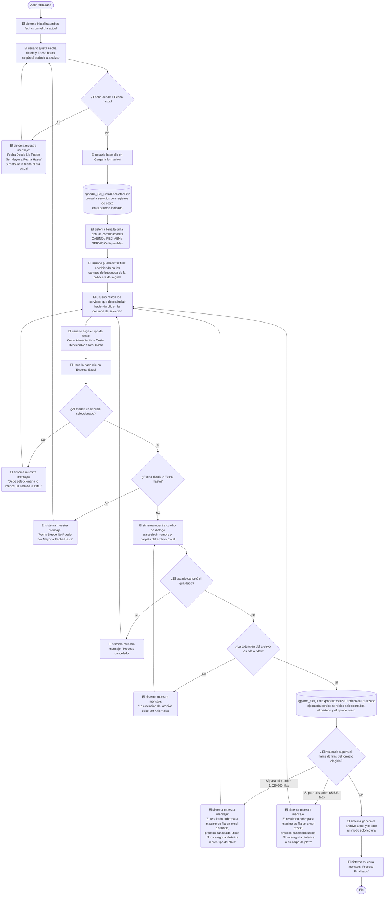

# Costo Planificado Teórico - Real - Realizado

**Formulario:** `I_CostoPlanTeoRealRealizado.frm`
**Tabla principal:** `Cas_B_CostoMinutaRealizadoFoodCost` (registro consolidado de costos de minuta por tipo: teórico, real y realizado)
**Consulta principal:** `sgpadm_Sel_XmlExportarExcelPlaTeoricoRealRealizado` — exportación de costos comparativos por servicio y período

---

## Índice

- [1 — ¿Para qué sirve esta pantalla?](#1--para-qué-sirve-esta-pantalla)
- [2 — ¿Qué necesito para usarla?](#2--qué-necesito-para-usarla)
- [3 — ¿Cómo se usa?](#3--cómo-se-usa)
  - [3.1 Flujo paso a paso](#31-flujo-paso-a-paso)
  - [3.2 Controles y acciones disponibles](#32-controles-y-acciones-disponibles)
- [4 — ¿Qué restricciones debo conocer?](#4--qué-restricciones-debo-conocer)
  - [4.1 Validaciones del sistema](#41-validaciones-del-sistema)
- [5 — ¿Qué obtengo?](#5--qué-obtengo)
- [6 — Referencia técnica](#6--referencia-técnica)
  - [Tablas que intervienen](#tablas-que-intervienen)
  - [Relación con otros módulos](#relación-con-otros-módulos)

---

## 1 — ¿Para qué sirve esta pantalla?

[↑ Volver al índice](#índice)

Esta pantalla permite obtener un informe comparativo de costos de alimentación para uno o varios servicios de casino, contrastando tres dimensiones del costo en un mismo período: el **costo teórico** (calculado en base a la planificación de recetas), el **costo real** (según las raciones vendidas y el valor de los ingredientes al momento de producción) y el **costo realizado** (correspondiente al consumo efectivo registrado durante el cierre). El resultado se exporta como archivo Excel para su análisis fuera del sistema.

La pantalla se organiza en dos etapas claramente diferenciadas. En la primera, el usuario define un rango de fechas y carga la lista de servicios disponibles para ese período: aparece una grilla con las combinaciones de casino, régimen y servicio que tienen registros de costo en el rango indicado. En la segunda etapa, el usuario selecciona qué servicios incluir en el informe, elige el tipo de costo que desea analizar (alimentación, desechable o total) y ejecuta la exportación.

El formulario no genera ningún documento de vista previa: el resultado es directamente un archivo Excel (.xls o .xlsx) que el usuario guarda en la ruta que elija. El informe puede consolidar datos de múltiples casinos, regímenes y servicios simultáneamente, siempre que todos ellos sean seleccionados en la grilla antes de exportar.

---

## 2 — ¿Qué necesito para usarla?

[↑ Volver al índice](#índice)

| Campo | Descripción | Obligatorio |
|---|---|---|
| Fecha desde | Fecha de inicio del período a analizar. El sistema inicializa automáticamente con la fecha del día al abrir el formulario. | Sí |
| Fecha hasta | Fecha de fin del período a analizar. El sistema inicializa automáticamente con la fecha del día al abrir el formulario. | Sí |
| Selección de servicios | Al menos un servicio debe ser marcado en la grilla de resultados. La grilla solo se llena después de usar el botón "Cargar Información". | Sí |
| Tipo de costo | Botón de opción que determina qué dimensión de costo se incluirá en el Excel. Valor por defecto: "Costo Alimentación". | Sí |

---

## 3 — ¿Cómo se usa?

[↑ Volver al índice](#índice)

### 3.1 Flujo paso a paso

[↑ Volver al índice](#índice)

### 3.2 Controles y acciones disponibles

[↑ Volver al índice](#índice)

| Control / Acción | Descripción |
|---|---|
| **Fecha desde** | Campo de fecha con formato dd/mm/yyyy. El usuario ingresa la fecha de inicio del período. Cualquier cambio en este campo limpia automáticamente la grilla, obligando a recargar la lista de servicios. |
| **Fecha hasta** | Campo de fecha con formato dd/mm/yyyy. El usuario ingresa la fecha de fin del período. Cualquier cambio en este campo limpia automáticamente la grilla, obligando a recargar la lista de servicios. |
| **Cargar Información** (botón de la barra de herramientas) | Consulta los servicios con registros de costo para el período indicado y llena la grilla. El sistema valida que las fechas sean coherentes antes de ejecutar la consulta. |
| **Grilla de servicios** | Lista las combinaciones de casino, régimen y servicio disponibles para el período. La primera columna funciona como casilla de selección: un clic sobre cualquier celda de una fila alterna su estado entre seleccionada (valor 1) y no seleccionada (valor 0). Un clic sobre el encabezado de la columna de selección alterna el estado de todas las filas visibles. |
| **Campos de búsqueda / filtro** (sobre la grilla) | Permiten filtrar las filas visibles de la grilla escribiendo un texto y presionando Enter. Hay campos independientes para filtrar por: organización de compras, código de casino, régimen, código de régimen, servicio y código de servicio. Usar uno de estos campos limpia automáticamente el texto de los demás, de modo que solo puede estar activo un filtro a la vez. El filtro es acumulable mediante valores separados por coma. |
| **Costo Alimentación** (opción) | Cuando está marcado (valor por defecto), el informe exporta los costos de ingredientes de alimentación (`Costo_Teorico_Alim`, `Costo_Real_Alim`, `Costo_Realizado_Alim`). |
| **Costo Desechable** (opción) | Cuando está marcado, el informe exporta los costos de insumos desechables (`Costo_Teorico_Desec`, `Costo_Real_Desec`, `Costo_Realizado_Desec`). |
| **Total Costo** (opción) | Cuando está marcado, el informe exporta la suma de costos de alimentación más desechables en cada dimensión. |
| **Exportar Excel** | Inicia el proceso de generación del archivo Excel. Valida fechas, verifica que haya al menos un servicio seleccionado, abre el cuadro de diálogo de guardado, ejecuta la consulta al servidor y genera el archivo en la ruta elegida. El botón queda deshabilitado durante el proceso para evitar ejecuciones simultáneas. |
| **Salir** | Cierra el formulario. |

---

## 4 — ¿Qué restricciones debo conocer?

[↑ Volver al índice](#índice)

### 4.1 Validaciones del sistema

[↑ Volver al índice](#índice)

| # | Cuándo aparece | Qué verifica el sistema | Qué ve o experimenta el usuario |
|---|---|---|---|
| 1 | Al hacer clic en "Cargar Información" o en "Exportar Excel" | Que la fecha desde no sea posterior a la fecha hasta | Mensaje: `Fecha Desde No Puede Ser Mayor a Fecha Hasta`. El campo de fecha desde vuelve a la fecha del día. |
| 2 | Al hacer clic en "Cargar Información" o en "Exportar Excel" | Que la fecha hasta no sea anterior a la fecha desde | Mensaje: `Fecha Hasta No Puede Ser Mayor a Fecha Desde`. El campo de fecha hasta vuelve a la fecha del día. |
| 3 | Al hacer clic en "Exportar Excel" | Que al menos una fila de la grilla esté marcada como seleccionada | Mensaje: `Debe seleccionar a lo menos un item de la lista..`. La exportación no se inicia. |
| 4 | Al elegir el nombre del archivo en el cuadro de diálogo | Que el archivo tenga extensión `.xls` o `.xlsx` | Mensaje: `La extensión del archivo debe ser (*.xls,*.xlsx)`. El cuadro de diálogo vuelve a abrirse. |
| 5 | Si el usuario cancela el cuadro de diálogo de guardado | Cancelación explícita del diálogo | Mensaje: `Proceso cancelado`. La exportación se detiene sin generar ningún archivo. |
| 6 | Después de ejecutar la consulta, antes de generar el Excel | Que el número de registros no supere el límite del formato `.xlsx` (1.020.000 filas) | Mensaje: `El resultado sobrepasa maximo de fila en excel 1020000, proceso cancelado utilice filtro categoria dietetica o bien tipo de plato`. La exportación se cancela. |
| 7 | Después de ejecutar la consulta, antes de generar el Excel | Que el número de registros no supere el límite del formato `.xls` (65.533 filas) | Mensaje: `El resultado sobrepasa maximo de fila en excel 65533, proceso cancelado utilice filtro categoria dietetica o bien tipo de plato`. La exportación se cancela. |

---

## 5 — ¿Qué obtengo?

[↑ Volver al índice](#índice)

Este formulario genera un único tipo de informe en formato Excel. No tiene selector de tipo de reporte: la única variación posible es el tipo de costo (Alimentación, Desechable o Total), que selecciona el usuario mediante los botones de opción antes de exportar.

El informe entrega una comparación día a día entre el costo planificado teórico, el costo real según raciones vendidas y el costo efectivamente realizado, para cada servicio seleccionado. Adicionalmente incluye, al final de cada servicio, una fila de **Total Servicio** con los acumulados del período, y una fila de **Total General** con el acumulado de todos los servicios del casino.

**Estructura de datos del informe:**

| Campo / Columna | Descripción | Calculado |
|---|---|---|
| Ceco | Código identificador del casino | No |
| Descripción Ceco | Nombre del casino | No |
| Regimen | Código del régimen alimentario (o vacío en fila de total general) | No |
| Descripción Regimen | Nombre del régimen alimentario | No |
| Servicio | Código del servicio (o vacío en fila de total general) | No |
| Descripción Servicio | Nombre del servicio (ej.: Almuerzo, Cena) | No |
| Fecha | Fecha de la minuta en formato yyyymmdd, o el literal `Total Servicio` / `Total General` en las filas de resumen | No |
| Costo Bandeja Teorico | Costo promedio por ración según la planificación teórica de recetas | Sí |
| Nro. Rac. Teorica | Número de raciones planificadas para ese día y servicio | No |
| Costo Total Teorico | Costo total teórico del servicio para el día | No |
| Costo Bandeja Real | Costo promedio por ración según las raciones vendidas y el valor real de los ingredientes | Sí |
| Nro. Rac. Real | Número de raciones vendidas para ese día y servicio | No |
| Costo Total Real | Costo total real del servicio para el día | No |
| Desviación C.Ban. Plan. | Diferencia entre el costo de bandeja real y el costo de bandeja teórico | Sí |
| Costo Bandeja Realizado | Costo promedio por ración según el consumo efectivo registrado al cierre | Sí |
| Nro. Rac. Realizado | Número de raciones del período realizado (usa las mismas raciones reales) | No |
| Costo Total Realizado | Costo total realizado del servicio para el día | No |
| Desviación C.Ban. Realizado | Diferencia entre el costo de bandeja realizado y el costo de bandeja real | Sí |

**Cálculo — Costo Bandeja Teórico**

Representa el costo unitario promedio por ración según la planificación. Solo se calcula cuando hay raciones teóricas registradas; si no las hay, el valor es cero.

**Fórmula o lógica:**

Costo Bandeja Teórico = Costo Total Teórico ÷ Nro. Rac. Teórica
(si Nro. Rac. Teórica = 0, resultado = 0)

| Componente | Qué representa | De dónde viene |
|---|---|---|
| Costo Total Teórico | Costo total planificado del servicio en ese día | `Cas_B_CostoMinutaRealizadoFoodCost.Costo_Teorico_Alim` (o `Costo_Teorico_Desec`, o suma de ambos según la opción elegida) |
| Nro. Rac. Teórica | Raciones planificadas para el servicio en ese día | `Cas_B_CostoMinutaRealizadoFoodCost.Raciones_Teorica` |

> Ejemplo: si un servicio tiene 200 raciones teóricas y un costo total teórico de $120.000, el costo de bandeja teórico es $600 por ración.

---

**Cálculo — Costo Bandeja Real**

Representa el costo unitario promedio por ración según las raciones efectivamente vendidas y el valor real de los ingredientes. Solo se calcula cuando hay raciones reales registradas.

**Fórmula o lógica:**

Costo Bandeja Real = Costo Total Real ÷ Nro. Rac. Real
(si Nro. Rac. Real = 0, resultado = 0)

| Componente | Qué representa | De dónde viene |
|---|---|---|
| Costo Total Real | Costo total según raciones vendidas y precio real de ingredientes | `Cas_B_CostoMinutaRealizadoFoodCost.Costo_Real_Alim` (o `Costo_Real_Desec`, o suma de ambos según la opción elegida) |
| Nro. Rac. Real | Raciones vendidas para el servicio en ese día | `Cas_B_CostoMinutaRealizadoFoodCost.Raciones_Real` |

> Ejemplo: si el mismo servicio tuvo 195 raciones vendidas y un costo total real de $118.950, el costo de bandeja real es $610 por ración.

---

**Cálculo — Desviación C.Ban. Plan.**

Mide la diferencia entre el costo de bandeja real y el costo de bandeja teórico. Un valor positivo indica que el costo real superó lo planificado; uno negativo, que fue menor. Solo se calcula cuando ambos costos (real y teórico) son mayores a cero y hay raciones en ambos.

**Fórmula o lógica:**

Desviación C.Ban. Plan. = Costo Bandeja Real − Costo Bandeja Teórico
(si cualquiera de los dos componentes es cero o no tiene raciones, resultado = 0)

| Componente | Qué representa | De dónde viene |
|---|---|---|
| Costo Bandeja Real | Costo promedio por ración real | Calculado según fórmula anterior |
| Costo Bandeja Teórico | Costo promedio por ración teórica | Calculado según fórmula anterior |

> Ejemplo: Costo Bandeja Real ($610) − Costo Bandeja Teórico ($600) = **$10** de desviación positiva por ración.

---

**Cálculo — Costo Bandeja Realizado**

Representa el costo unitario promedio por ración según el consumo efectivamente registrado al cierre del período (ingredientes utilizados en producción). Solo se calcula cuando hay raciones reales registradas.

**Fórmula o lógica:**

Costo Bandeja Realizado = Costo Total Realizado ÷ Nro. Rac. Real
(si Nro. Rac. Real = 0, resultado = 0)

| Componente | Qué representa | De dónde viene |
|---|---|---|
| Costo Total Realizado | Costo total según el consumo real de ingredientes registrado al cierre | `Cas_B_CostoMinutaRealizadoFoodCost.Costo_Realizado_Alim` (o `Costo_Realizado_Desec`, o suma de ambos según la opción elegida) |
| Nro. Rac. Real | Raciones vendidas (se usan las mismas que para el costo real) | `Cas_B_CostoMinutaRealizadoFoodCost.Raciones_Real` |

> Ejemplo: con 195 raciones reales y un costo total realizado de $121.290, el costo de bandeja realizado es $622 por ración.

---

**Cálculo — Desviación C.Ban. Realizado**

Mide la diferencia entre el costo de bandeja realizado y el costo de bandeja real. Un valor positivo indica que el consumo efectivo superó lo vendido; uno negativo, que fue menor. Solo se calcula cuando ambos costos (realizado y real) son mayores a cero y hay raciones reales.

**Fórmula o lógica:**

Desviación C.Ban. Realizado = Costo Bandeja Realizado − Costo Bandeja Real
(si cualquiera de los dos componentes es cero, resultado = 0)

| Componente | Qué representa | De dónde viene |
|---|---|---|
| Costo Bandeja Realizado | Costo promedio por ración según consumo efectivo al cierre | Calculado según fórmula anterior |
| Costo Bandeja Real | Costo promedio por ración según raciones vendidas | Calculado según fórmula anterior |

> Ejemplo: Costo Bandeja Realizado ($622) − Costo Bandeja Real ($610) = **$12** de desviación positiva por ración.

---

**Formato de salida:** Excel (.xls o .xlsx, a elección del usuario mediante el cuadro de diálogo de guardado). Una única hoja llamada `Hoja1`. El usuario elige nombre y carpeta del archivo. Los datos comienzan a partir de la fila 2 (la fila 1 se reserva para el encabezado generado por la función `encabezado`). Las columnas H, J, K, M, O y Q tienen formato numérico `#,##0.00`. Las columnas C y E, que contienen los códigos de régimen y servicio respectivamente, tienen el valor `999999999` reemplazado por celda vacía en las filas de total general. El archivo se abre automáticamente en modo solo lectura al finalizar la generación.

---

## 6 — Referencia técnica

[↑ Volver al índice](#índice)

### Tablas que intervienen

[↑ Volver al índice](#índice)

| Tabla | Para qué se usa en este reporte | Campos clave |
|---|---|---|
| `Cas_B_CostoMinutaRealizadoFoodCost` | Fuente principal. Contiene los costos consolidados de minuta por tipo (teórico, real y realizado) para cada combinación de casino, régimen, servicio y fecha. | `IdCeco`, `IdRegimen`, `IdServicio`, `Fecha_Minuta`, `Raciones_Teorica`, `Raciones_Real`, `Costo_Teorico_Alim`, `Costo_Real_Alim`, `Costo_Realizado_Alim`, `Costo_Teorico_Desec`, `Costo_Real_Desec`, `Costo_Realizado_Desec` |
| `b_clientes` | Catálogo de casinos. Proporciona el nombre del casino y filtra solo los activos de tipo casino (no clientes de otro tipo). | `cli_codigo`, `cli_nombre`, `cli_activo`, `cli_tipo` |
| `i_org_ceco` | Tabla de relación entre organización de compras y casino. Permite mostrar el código de organización y filtra registros marcados como borrados o sin carga en el sistema de compras (PEL). | `Id_Ceco`, `Id_OrgCompra`, `borrado`, `cargado_pel` |
| `a_regimen` | Catálogo de regímenes alimentarios. Proporciona el nombre del régimen. | `reg_codigo`, `reg_nombre` |
| `a_servicio` | Catálogo de servicios. Proporciona el nombre del servicio (Almuerzo, Cena, etc.). | `ser_codigo`, `ser_nombre` |
| `#TmpMinuta` | Tabla temporal creada por el procedimiento almacenado a partir del XML de servicios seleccionados. Aísla los datos de la sesión activa para evitar interferencias entre usuarios conectados simultáneamente. | `Org`, `Ceco`, `Reg`, `Ser` |

### Relación con otros módulos

[↑ Volver al índice](#índice)

| Módulo | Relación |
|---|---|
| **Módulo de Producción / Cierre de período** | Los datos de la tabla `Cas_B_CostoMinutaRealizadoFoodCost` son generados por el proceso de cierre de período del módulo de producción. Sin cierre ejecutado para el período, la tabla no tiene registros y la grilla aparecerá vacía. |
| **Contrato / Régimen / Servicio** | Los catálogos de régimen (`a_regimen`) y servicio (`a_servicio`) son mantenidos por los módulos de configuración de contratos. Este reporte los consume como referencia de solo lectura. |
| **Administración de casinos (b_clientes / i_org_ceco)** | El maestro de casinos y la asignación de organización de compras determinan qué casinos son visibles en la grilla de selección. Solo aparecen casinos activos con organización de compras vigente. |
| **Power BI / Integraciones externas** | Existe un procedimiento relacionado (`sgpadm_Sel_XmlExportarExcelPlaTeoricoRealRealizado_OutputSGPtoPBI`) que usa la misma lógica de cálculo para alimentar herramientas de análisis externas. Este formulario no lo invoca directamente. |

---

*Fuentes: `I_CostoPlanTeoRealRealizado.frm`, SP `sgpadm_Sel_XmlExportarExcelPlaTeoricoRealRealizado` en `SGP_Admin.sql`, SP `sgpadm_Sel_ListarEncDatosSitio` en `SGP_Admin.sql`, tabla `Cas_B_CostoMinutaRealizadoFoodCost` en `SGP_Admin.sql`*
