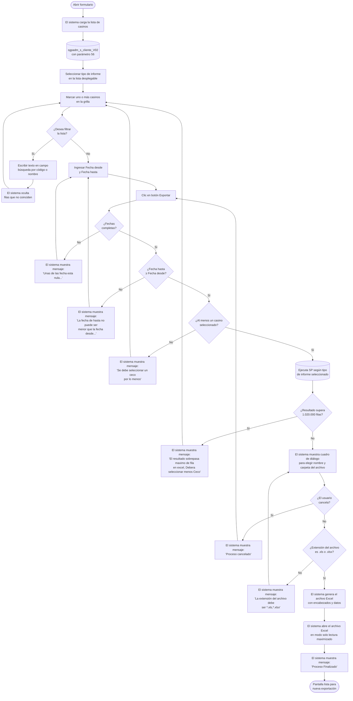

# Exportar Excel Q Sitios

**Formulario:** `E_QSitios.frm`
**Tabla(s) principal(es):** `cas_b_minutaraciones` (registro de raciones por cliente, servicio y régimen), `cas_b_minuta` (planificación de raciones teóricas), `cas_b_preciovta` (precios de venta vigentes por cliente y servicio)
**Consulta principal:** Cinco procedimientos almacenados según el tipo seleccionado: `sgpadm_Sel_DetalladoRacClientesRealTeorica_02`, `sgpadm_Sel_DetalladoRacClientesRealTeorica_01`, `sgpadm_Sel_ResumenRacClientesRealTeorica`, `sgpadm_Sel_DetalladoRacClientesRealTeorica_03`, `sgpadm_Sel_PrecioVtaSitios`

---

## Índice

- [1 — ¿Para qué sirve esta pantalla?](#1--para-qué-sirve-esta-pantalla)
- [2 — ¿Qué necesito para usarla?](#2--qué-necesito-para-usarla)
- [3 — ¿Cómo se usa?](#3--cómo-se-usa)
  - [3.1 Flujo paso a paso](#31-flujo-paso-a-paso)
  - [3.2 Controles y acciones disponibles](#32-controles-y-acciones-disponibles)
- [4 — ¿Qué restricciones debo conocer?](#4--qué-restricciones-debo-conocer)
  - [4.1 Validaciones del sistema](#41-validaciones-del-sistema)
- [5 — ¿Qué obtengo?](#5--qué-obtengo)
  - [Resumen de tipos disponibles](#resumen-de-tipos-disponibles)
  - [(1) Detallado x Tipo Q](#1-detallado-x-tipo-q)
  - [(2) Detallado x Cliente](#2-detallado-x-cliente)
  - [(3) Resumen Mensual](#3-resumen-mensual)
  - [(4) Detallado Q x día](#4-detallado-q-x-día)
  - [(5) Detallado x Precio Venta](#5-detallado-x-precio-venta)
- [6 — Referencia técnica](#6--referencia-técnica)
  - [Tablas que intervienen](#tablas-que-intervienen)
  - [Relación con otros módulos](#relación-con-otros-módulos)

---

## 1 — ¿Para qué sirve esta pantalla?

[↑ Volver al índice](#índice)

Esta pantalla permite exportar a Excel información de raciones (Q) de uno o varios casinos para un período determinado. El usuario selecciona los centros de costo que desea incluir en el reporte, define un rango de fechas y elige uno de cinco formatos de análisis: detallado por tipo de ración, detallado por cliente, resumen mensual, detallado por día o detallado por precio de venta. El resultado se guarda como archivo Excel (.xls o .xlsx) y se abre automáticamente al finalizar.

La pantalla se organiza en una zona central con una grilla que lista todos los casinos disponibles en el sistema. El usuario marca los casinos de interés en esa grilla, pudiendo filtrarlos por código o por nombre mediante campos de búsqueda. En la parte inferior se encuentran los campos de fecha de inicio y fecha de término del período a consultar, y en la parte superior el selector del tipo de informe que se desea generar. Dos botones al pie permiten ejecutar la exportación o cerrar la pantalla.

Un aspecto clave del funcionamiento es que los datos entregados cubren solo hasta la fecha del último cierre procesado en cada casino, incluso si la fecha de término indicada es posterior. Esto garantiza que el informe muestre únicamente información ya consolidada. La pantalla puede procesar múltiples casinos simultáneamente; la única restricción de volumen es que el total de filas resultantes no supere el máximo admitido por Excel.

---

## 2 — ¿Qué necesito para usarla?

[↑ Volver al índice](#índice)

| Campo | Descripción | Obligatorio |
|---|---|---|
| Formato | Lista desplegable con cinco tipos de informe. Determina qué información se incluye en el Excel generado y qué procedimiento almacenado se ejecuta. | Sí |
| Selección de centros de costo | Grilla con todos los casinos activos que tienen registros de raciones en el sistema. El usuario debe marcar al menos uno haciendo clic sobre la fila. Se puede filtrar la grilla usando los campos de búsqueda por código o por nombre. | Sí (mínimo 1) |
| Búsqueda por código | Campo de texto que filtra la grilla ocultando las filas cuyo código de casino no coincide con el texto ingresado. Se excluye con el campo de búsqueda por nombre: al escribir en uno, el otro se borra. | No |
| Búsqueda por nombre | Campo de texto que filtra la grilla ocultando las filas cuyo nombre de casino no coincide con el texto ingresado. Se excluye con el campo de búsqueda por código. | No |
| Fecha desde | Fecha de inicio del período a consultar. Se inicializa con la fecha del día al abrir el formulario. | Sí |
| Fecha hasta | Fecha de término del período a consultar. Se inicializa con la fecha del día al abrir el formulario. Debe ser igual o posterior a la Fecha desde. | Sí |

Al abrir el formulario, el sistema carga automáticamente la lista de centros de costo y establece ambas fechas con la fecha actual. No se requiere ninguna acción previa del usuario para que la pantalla esté operativa.

---

## 3 — ¿Cómo se usa?

[↑ Volver al índice](#índice)

### 3.1 Flujo paso a paso

[↑ Volver al índice](#índice)

### 3.2 Controles y acciones disponibles

[↑ Volver al índice](#índice)

| Control / Acción | Descripción |
|---|---|
| **Lista desplegable Formato** | Permite seleccionar el tipo de informe. Debe elegirse antes de exportar. Contiene cinco opciones que determinan el nivel de detalle y las columnas del Excel generado. |
| **Campo de búsqueda por código** | Filtra la grilla de casinos mostrando solo aquellos cuyo código contiene el texto ingresado. Al escribir en este campo se borra automáticamente el campo de búsqueda por nombre. Si se deja vacío, la grilla muestra todos los casinos sin filtro. |
| **Campo de búsqueda por nombre** | Filtra la grilla de casinos mostrando solo aquellos cuyo nombre contiene el texto ingresado. Al escribir en este campo se borra automáticamente el campo de búsqueda por código. Si se deja vacío, la grilla muestra todos los casinos sin filtro. |
| **Grilla de centros de costo** | Lista los casinos disponibles con su código y nombre. Al hacer clic sobre cualquier parte de una fila, el sistema alterna su selección (de no seleccionado a seleccionado, y viceversa). Es posible seleccionar o deseleccionar un rango de filas arrastrando el cursor. Solo las filas visibles (no ocultas por el filtro) pueden ser seleccionadas. |
| **Campo Fecha desde** | Define el inicio del período a consultar. Acepta formato dd/mm/aaaa. Se inicializa con la fecha del día. |
| **Campo Fecha hasta** | Define el término del período a consultar. Acepta formato dd/mm/aaaa. Se inicializa con la fecha del día. |
| **Botón Exportar** | Ejecuta el proceso completo: valida los datos ingresados, consulta la base de datos, solicita al usuario la ruta de destino del archivo y genera el Excel. Al terminar, abre el archivo generado en modo solo lectura. |
| **Botón Salir** | Cierra el formulario sin generar ningún archivo. |

---

## 4 — ¿Qué restricciones debo conocer?

[↑ Volver al índice](#índice)

### 4.1 Validaciones del sistema

[↑ Volver al índice](#índice)

| # | Cuándo aparece | Qué verifica el sistema | Qué ve o experimenta el usuario |
|---|---|---|---|
| 1 | Al hacer clic en Exportar | Que ambos campos de fecha estén completos | Mensaje: `Unas de las fecha esta nula...` El proceso se detiene y el usuario debe completar las fechas. |
| 2 | Al hacer clic en Exportar | Que la Fecha hasta no sea anterior a la Fecha desde | Mensaje: `La fecha de hasta no puede ser menor que la fecha desde...` El proceso se detiene. |
| 3 | Al hacer clic en Exportar | Que al menos un casino esté marcado en la grilla | Mensaje: `Se debe seleccionar un ceco por lo menos` El proceso se detiene. |
| 4 | Al hacer clic en Exportar, tras obtener el resultado | Que el resultado de la consulta no supere 1.020.000 filas | Mensaje: `El resultado sobrepasa maximo de fila en excel, Debera seleccionar menos Ceco` El proceso se detiene y el usuario debe reducir la selección de casinos o acotar el período. |
| 5 | Al cerrar el cuadro de guardado sin elegir archivo | Que el usuario haya elegido una ruta de destino | Mensaje: `Debe seleccionar la ruta y nombre de archivo` El proceso se detiene. |
| 6 | Al cancelar el cuadro de guardado | El usuario presionó Cancelar explícitamente | Mensaje: `Proceso cancelado` El proceso se detiene limpiamente. |
| 7 | Al confirmar la ruta del archivo | Que la extensión del archivo elegido sea .xls o .xlsx | Mensaje: `La extensión del archivo debe ser (*.xls,*.xlsx)` El cuadro de guardado se vuelve a mostrar. |
| 8 | Al abrir el formulario | Que existan casinos con registros de raciones en el sistema | Si no hay datos, muestra mensaje: `No existe información requerida` y la grilla queda vacía. |
| 9 | Para todos los tipos 1 al 4 | Los datos se acotarán hasta la fecha del último cierre procesado de cada casino, incluso si la Fecha hasta indicada es posterior | El usuario no ve un mensaje de aviso, pero el informe solo incluirá datos hasta el cierre más reciente de cada casino seleccionado. |

---

## 5 — ¿Qué obtengo?

[↑ Volver al índice](#índice)

### Resumen de tipos disponibles

[↑ Volver al índice](#índice)

| Código | Nombre en el selector | Formato de salida | Procedimiento almacenado principal |
|---|---|---|---|
| (1) | Detallado x Tipo Q | Excel | `sgpadm_Sel_DetalladoRacClientesRealTeorica_02` |
| (2) | Detallado x Cliente | Excel | `sgpadm_Sel_DetalladoRacClientesRealTeorica_01` |
| (3) | Resumen Mensual | Excel | `sgpadm_Sel_ResumenRacClientesRealTeorica` |
| (4) | Detallado Q x día | Excel | `sgpadm_Sel_DetalladoRacClientesRealTeorica_03` |
| (5) | Detallado x Precio Venta | Excel | `sgpadm_Sel_PrecioVtaSitios` |

---

### (1) Detallado x Tipo Q

[↑ Volver al índice](#índice)

**Qué muestra:** Entrega una fila por cada combinación de casino, régimen, servicio, fecha y tipo de ración (Planificada, Producida o Vendida por cliente). Permite comparar directamente las raciones planificadas con las producidas y las vendidas a nivel diario, identificando a qué cliente corresponde cada ración vendida.

**Restricción:** Los datos de raciones reales se incluyen solo hasta la fecha del último cierre procesado de cada casino, aunque la Fecha hasta indicada sea posterior.

**Estructura de datos del informe:**

| Campo / Columna | Descripción | Calculado |
|---|---|---|
| Código Centro de Costo | Código del casino | No |
| Centro de Costo | Nombre del casino | No |
| Código Regimen | Código del régimen alimenticio | No |
| Regimen | Nombre del régimen alimenticio | No |
| Código Servicio | Código del servicio (desayuno, almuerzo, etc.) | No |
| Servicio | Nombre del servicio | No |
| Fecha | Fecha de la ración en formato dd/mm/aaaa | Sí |
| Descripcion Q | Etiqueta del tipo de ración: `Planificada`, `Producida   ` o `Vendida    ` | Sí |
| Código Cliente | RUT o identificador del cliente que consumió las raciones. Vacío para filas de tipo Planificada o Producida. | No |
| Cliente | Nombre del cliente. Vacío para filas de tipo Planificada o Producida. | No |
| Raciones | Cantidad de raciones del tipo indicado en ese día, régimen y servicio | Sí |

**Cálculo — Fecha**

La fecha se almacena como número entero en formato YYYYMMDD y se convierte a formato legible dd/mm/aaaa en la presentación final.

**Fórmula o lógica:**
Fecha visible = conversión de YYYYMMDD a formato datetime y luego a varchar con estilo 103 (dd/mm/aaaa)

| Componente | Qué representa | De dónde viene |
|---|---|---|
| Fecha numérica | Fecha de la ración almacenada como entero | `cas_b_minutaraciones.mir_fecmin` o `cas_b_minuta.min_fecmin` |

**Cálculo — Descripcion Q**

Este campo no se almacena: se calcula en el momento de la consulta para identificar el tipo de ración con una etiqueta descriptiva de ancho fijo.

**Fórmula o lógica:**
Si el identificador de cliente es `PRODUCIDAS` → `Producida   `; en cualquier otro caso (incluyendo clientes reales) → `Vendida    `; las filas provenientes de la planificación llevan `Planificada`.

| Componente | Qué representa | De dónde viene |
|---|---|---|
| Identificador de cliente | Código que identifica el tipo de registro (cliente real, `PRODUCIDAS`, `PLANIFICADO`) | `cas_b_minutaraciones.mir_rutcli` |

**Cálculo — Raciones**

Las raciones se agregan (suman) por casino, régimen, servicio, fecha e identificador de cliente, ya que en la tabla pueden existir múltiples registros para la misma combinación.

**Fórmula o lógica:**
Raciones = SUMA de `mir_nrorac` agrupado por casino, régimen, servicio, fecha e identificador de cliente

| Componente | Qué representa | De dónde viene |
|---|---|---|
| mir_nrorac | Cantidad de raciones en cada registro | `cas_b_minutaraciones.mir_nrorac` |

> Ejemplo: Si un casino tiene tres registros de raciones vendidas al mismo cliente en un mismo servicio y fecha (cada uno con 10, 15 y 5 raciones respectivamente), el informe mostrará una sola fila con 30 raciones.

**Formato de salida:** Excel. Una única hoja (`Hoja1`). El usuario elige nombre y carpeta del archivo mediante cuadro de diálogo de guardado. La fila 1 contiene los nombres de las columnas tomados directamente del resultado de la consulta. Los datos comienzan en la fila 2. Las columnas y filas se ajustan automáticamente al contenido. El archivo se abre al terminar en modo solo lectura.

---

### (2) Detallado x Cliente

[↑ Volver al índice](#índice)

**Qué muestra:** Entrega una fila por cada combinación de casino, régimen, servicio y fecha, mostrando en columnas separadas las raciones planificadas, producidas y vendidas de ese día. Adicionalmente incluye una fila por cada cliente individual con sus raciones vendidas. Este formato permite ver de un vistazo la diferencia entre lo planeado, lo producido y lo vendido, con el desglose por cliente cuando corresponde.

**Restricción:** Los datos de raciones reales se incluyen solo hasta la fecha del último cierre procesado de cada casino.

**Estructura de datos del informe:**

| Campo / Columna | Descripción | Calculado |
|---|---|---|
| Código Centro de Costo | Código del casino | No |
| Centro de Costo | Nombre del casino | No |
| Código Regimen | Código del régimen alimenticio | No |
| Regimen | Nombre del régimen alimenticio | No |
| Código Servicio | Código del servicio | No |
| Servicio | Nombre del servicio | No |
| Fecha | Fecha en formato dd/mm/aaaa | Sí |
| Código Cliente | Identificador del cliente. Vacío en filas de resumen diario. | No |
| Cliente | Nombre del cliente. Vacío en filas de resumen diario. | No |
| Planificado | Raciones planificadas para ese día, régimen y servicio. Vacío si el valor es cero. | Sí |
| Producidas | Raciones producidas para ese día, régimen y servicio. Vacío si el valor es cero. | Sí |
| Vendidas | Total de raciones vendidas para ese día, régimen y servicio (suma de todos los clientes). En filas de detalle por cliente, corresponde a las raciones de ese cliente específico. | Sí |

**Cálculo — Planificado**

Las raciones planificadas provienen de la tabla de minutas (planificación teórica) y se suman por casino, régimen, servicio y fecha. Se muestra vacío cuando el valor es cero para facilitar la lectura.

**Fórmula o lógica:**
Planificado = SUMA de raciones teóricas donde el identificador de cliente es `PLANIFICADO`, agrupado por casino, régimen, servicio y fecha. Si el resultado es 0, se muestra como cadena vacía.

| Componente | Qué representa | De dónde viene |
|---|---|---|
| min_racteo | Raciones teóricas planificadas | `cas_b_minuta.min_racteo` |

**Cálculo — Producidas**

Las raciones producidas provienen de los registros con identificador `PRODUCIDAS` y se suman por casino, régimen, servicio y fecha. Se muestra vacío cuando el valor es cero.

**Fórmula o lógica:**
Producidas = SUMA de raciones donde el identificador de cliente es `PRODUCIDAS`, agrupado por casino, régimen, servicio y fecha. Si el resultado es 0, se muestra como cadena vacía.

| Componente | Qué representa | De dónde viene |
|---|---|---|
| mir_nrorac (PRODUCIDAS) | Cantidad de raciones marcadas como producidas | `cas_b_minutaraciones.mir_nrorac` donde `mir_rutcli = 'PRODUCIDAS'` |

**Cálculo — Vendidas**

Las raciones vendidas son la suma de todos los registros que no corresponden a `PLANIFICADO` ni a `PRODUCIDAS`, es decir, los registros asociados a clientes reales.

**Fórmula o lógica:**
Vendidas = SUMA de raciones donde el identificador de cliente no es `PLANIFICADO` ni `PRODUCIDAS`, agrupado por casino, régimen, servicio y fecha.

| Componente | Qué representa | De dónde viene |
|---|---|---|
| mir_nrorac (clientes reales) | Cantidad de raciones vendidas a clientes | `cas_b_minutaraciones.mir_nrorac` donde `mir_rutcli NOT IN ('PLANIFICADO','PRODUCIDAS')` |

> Ejemplo: Para un servicio de almuerzo del día 15/03, si se planificaron 200 raciones, se produjeron 195 y se vendieron 180 en total a tres clientes (80+60+40), la fila de resumen mostrará Planificado=200, Producidas=195, Vendidas=180. Debajo, tres filas adicionales mostrarán las 80, 60 y 40 raciones de cada cliente.

**Formato de salida:** Excel. Una única hoja (`Hoja1`). El usuario elige nombre y carpeta mediante cuadro de diálogo de guardado. La fila 1 contiene los nombres de las columnas. Los datos comienzan en la fila 2. El archivo se abre al terminar en modo solo lectura.

---

### (3) Resumen Mensual

[↑ Volver al índice](#índice)

**Qué muestra:** Entrega una fila de resumen por cada combinación de casino, régimen y servicio, consolidando todas las fechas del período en una sola fila. Muestra la fecha de inicio y fecha de fin efectivas de los datos, y las raciones planificadas, producidas y vendidas totales del período. Es el formato más compacto para comparar el desempeño de los casinos en el período seleccionado.

**Restricción:** Los datos de raciones reales se incluyen solo hasta la fecha del último cierre procesado de cada casino.

**Estructura de datos del informe:**

| Campo / Columna | Descripción | Calculado |
|---|---|---|
| Código Centro de Costo | Código del casino | No |
| Centro de Costo | Nombre del casino | No |
| Código Regimen | Código del régimen alimenticio | No |
| Regimen | Nombre del régimen alimenticio | No |
| Código Servicio | Código del servicio | No |
| Servicio | Nombre del servicio | No |
| Fecha Ini | Fecha más antigua con datos en el período, en formato dd/mm/aaaa | Sí |
| Fecha Fin | Fecha más reciente con datos en el período, en formato dd/mm/aaaa | Sí |
| Planificadas | Total de raciones planificadas en el período para este casino, régimen y servicio | Sí |
| Producidas | Total de raciones producidas en el período para este casino, régimen y servicio | Sí |
| Vendidas | Total de raciones vendidas en el período para este casino, régimen y servicio | Sí |

**Cálculo — Fecha Ini / Fecha Fin**

En lugar de mostrar una fila por día, el resumen agrupa todo el período y determina las fechas extremas con datos reales.

**Fórmula o lógica:**
Fecha Ini = mínimo de las fechas de ración en el período; Fecha Fin = máximo de las fechas de ración en el período. Ambas convertidas a formato dd/mm/aaaa.

| Componente | Qué representa | De dónde viene |
|---|---|---|
| mir_fecmin | Fecha de cada registro de ración | `cas_b_minutaraciones.mir_fecmin` |

**Cálculo — Planificadas, Producidas, Vendidas**

Cada total es la suma de las raciones de su tipo en todo el período, agrupadas por casino, régimen y servicio (sin desglose por día).

**Fórmula o lógica:**
Planificadas = SUMA de `min_racteo` del período, agrupado por casino+régimen+servicio; Producidas = SUMA de raciones con identificador `PRODUCIDAS`; Vendidas = SUMA de raciones con identificadores distintos de `PLANIFICADO` y `PRODUCIDAS`.

| Componente | Qué representa | De dónde viene |
|---|---|---|
| min_racteo | Raciones teóricas | `cas_b_minuta.min_racteo` |
| mir_nrorac | Raciones reales registradas | `cas_b_minutaraciones.mir_nrorac` |

> Ejemplo: Para el mes de octubre, un casino con régimen Ejecutivo en el servicio de Almuerzo tuvo actividad entre el 03/10 y el 28/10. El informe mostrará una única fila con Fecha Ini=03/10/2016, Fecha Fin=28/10/2016 y los totales del mes.

**Formato de salida:** Excel. Una única hoja (`Hoja1`). El usuario elige nombre y carpeta mediante cuadro de diálogo de guardado. La fila 1 contiene los nombres de las columnas. Los datos comienzan en la fila 2. El archivo se abre al terminar en modo solo lectura.

---

### (4) Detallado Q x día

[↑ Volver al índice](#índice)

**Qué muestra:** Entrega una fila por cada combinación de casino, régimen, servicio y fecha, mostrando en columnas separadas las raciones planificadas, producidas y vendidas de ese día. A diferencia del tipo (2), no incluye el desglose por cliente individual; agrupa todas las ventas en una sola columna "Q Vendidas". Es el formato más directo para analizar el cumplimiento diario sin el detalle por cliente.

**Restricción:** Los datos de raciones reales se incluyen solo hasta la fecha del último cierre procesado de cada casino.

**Estructura de datos del informe:**

| Campo / Columna | Descripción | Calculado |
|---|---|---|
| Ceco | Código del casino | No |
| Nombre Ceco | Nombre del casino | No |
| Cód. Regimen | Código del régimen alimenticio | No |
| Nombre Regimen | Nombre del régimen alimenticio | No |
| Cód. Servicio | Código del servicio | No |
| Nombre Servicio | Nombre del servicio | No |
| Fecha | Fecha en formato numérico YYYYMMDD | No |
| PLANIFICADAS | Total de raciones planificadas para ese día, régimen y servicio | Sí |
| PRODUCIDAS | Total de raciones producidas para ese día, régimen y servicio | Sí |
| Q VENDIDAS | Total de raciones vendidas (suma de todos los clientes) para ese día, régimen y servicio | Sí |

**Cálculo — PLANIFICADAS, PRODUCIDAS, Q VENDIDAS**

El sistema separa los registros según su identificador de cliente y suma las raciones de cada tipo por casino, régimen, servicio y fecha.

**Fórmula o lógica:**
PLANIFICADAS = SUMA de raciones donde identificador = `PLANIFICADO`; PRODUCIDAS = SUMA donde identificador = `PRODUCIDAS`; Q VENDIDAS = SUMA donde identificador no es `PLANIFICADO` ni `PRODUCIDAS` (es decir, raciones vendidas a clientes reales agrupados como `VENDIDAS`).

| Componente | Qué representa | De dónde viene |
|---|---|---|
| min_racteo | Raciones planificadas | `cas_b_minuta.min_racteo` |
| mir_nrorac (PRODUCIDAS) | Raciones producidas | `cas_b_minutaraciones.mir_nrorac` donde `mir_rutcli = 'PRODUCIDAS'` |
| mir_nrorac (VENDIDAS) | Suma de raciones de todos los clientes | `cas_b_minutaraciones.mir_nrorac` donde identificador no es `PLANIFICADO` ni `PRODUCIDAS` |

> Ejemplo: Para el servicio de Desayuno del 10/10, un casino planificó 150 raciones, produjo 148 y vendió en total 140 raciones a distintos clientes. El informe mostrará PLANIFICADAS=150, PRODUCIDAS=148, Q VENDIDAS=140.

**Formato de salida:** Excel. Una única hoja (`Hoja1`). El usuario elige nombre y carpeta mediante cuadro de diálogo de guardado. La fila 1 contiene los nombres de las columnas. Los datos comienzan en la fila 2. El archivo se abre al terminar en modo solo lectura.

---

### (5) Detallado x Precio Venta

[↑ Volver al índice](#índice)

**Qué muestra:** Entrega una fila por cada combinación de casino, régimen, servicio, cliente y fecha de vigencia del precio, mostrando el precio de venta pactado con ese cliente. Permite conocer qué precio de venta estaba activo para cada cliente durante el período consultado, cruzando los precios configurados con las raciones efectivamente registradas.

**Diferencia respecto a los otros tipos:** Este tipo no acota los datos al último cierre del casino; utiliza directamente el rango de fechas ingresado por el usuario. Solo incluye precios activos (`prv_activo = '1'`).

**Estructura de datos del informe:**

| Campo / Columna | Descripción | Calculado |
|---|---|---|
| Código Centro de Costo | Código del casino | No |
| Centro de Costo | Nombre del casino | No |
| Código Regimen | Código del régimen alimenticio | No |
| Regimen | Nombre del régimen alimenticio | No |
| Código Servicio | Código del servicio | No |
| Servicio | Nombre del servicio | No |
| Fecha Vigencia | Fecha desde la que rige el precio de venta | Sí |
| Precio de Venta | Precio de venta pactado con el cliente para ese régimen y servicio | No |
| Código Cliente | Identificador del cliente | No |
| Cliente | Nombre del cliente | No |

**Cálculo — Fecha Vigencia**

Para cada combinación de casino, régimen, servicio y cliente, el sistema determina la fecha de vigencia del precio más reciente dentro del período consultado.

**Fórmula o lógica:**
Fecha Vigencia = máximo de `prv_fecvig` donde la fecha de ración sea mayor o igual a la fecha de vigencia del precio.

| Componente | Qué representa | De dónde viene |
|---|---|---|
| prv_fecvig | Fecha desde la que rige el precio | `cas_b_preciovta.prv_fecvig` |
| mir_fecmin | Fecha de la ración registrada | `cas_b_minutaraciones.mir_fecmin` |

> Ejemplo: Si un cliente tiene un precio de venta desde el 01/10 y el período consultado es octubre, el informe mostrará ese precio con Fecha Vigencia = 01/10/2016.

**Formato de salida:** Excel. Una única hoja (`Hoja1`). El usuario elige nombre y carpeta mediante cuadro de diálogo de guardado. La fila 1 contiene los nombres de las columnas. Los datos comienzan en la fila 2. El archivo se abre al terminar en modo solo lectura.

---

## 6 — Referencia técnica

[↑ Volver al índice](#índice)

### Tablas que intervienen

[↑ Volver al índice](#índice)

| Tabla | Para qué se usa en este reporte | Campos clave |
|---|---|---|
| `b_clientes` | Catálogo de casinos (centros de costo). Se usa para poblar la grilla al abrir el formulario y para obtener el nombre del casino en los informes. Solo se incluyen casinos de tipo 0 o 2, activos, con tipo de minuta 1, 2 o 3, no borrados de la organización de compra. | `cli_codigo`, `cli_nombre`, `cli_tipo`, `cli_activo`, `cli_TipoMinuta` |
| `cas_b_minutaraciones` | Fuente principal de raciones reales (vendidas, producidas). Contiene una fila por cada cliente y fecha con sus raciones registradas. Se usa en los tipos 1, 2, 3 y 4. | `mir_cecori`, `mir_codreg`, `mir_codser`, `mir_fecmin`, `mir_rutcli`, `mir_nrorac` |
| `cas_b_minuta` | Fuente de raciones planificadas (teóricas). Se usa en los tipos 1, 2, 3 y 4 para comparar contra las raciones reales. | `min_cecori`, `min_codreg`, `min_codser`, `min_fecmin`, `min_racteo` |
| `cas_b_preciovta` | Tabla de precios de venta por cliente, régimen y servicio. Se usa exclusivamente en el tipo 5. | `prv_cecori`, `prv_codreg`, `prv_codser`, `prv_rutcli`, `prv_fecvig`, `prv_preven`, `prv_activo` |
| `cas_log_envio` | Registro de cierres enviados. Se usa en los tipos 1, 2, 3 y 4 para determinar la fecha máxima de datos disponibles por casino (último cierre con estado 99). | `len_cecori`, `len_feccie`, `len_estenv` |
| `cas_a_regimen` | Catálogo de regímenes alimenticios del casino. Se cruza para obtener el nombre del régimen. | `reg_cecori`, `reg_codigo`, `reg_nombre` |
| `cas_a_servicio` | Catálogo de servicios del casino (desayuno, almuerzo, etc.). Se cruza para obtener el nombre del servicio. | `ser_cecori`, `ser_codigo`, `ser_nombre` |
| `cas_b_clientes` | Catálogo de clientes por casino (distinto de `b_clientes`). Se cruza para obtener el nombre del cliente en los tipos 1 y 2. | `cli_cecori`, `cli_codigo`, `cli_nombre` |
| `I_ORG_CECO` | Tabla de organización de compra por casino. Se usa al cargar la grilla para excluir casinos marcados como borrados en la organización de compra. | `ID_CECO`, `ID_ORGCOMPRA`, `BORRADO` |

### Relación con otros módulos

[↑ Volver al índice](#índice)

| Módulo | Relación |
|---|---|
| **SGP Local — Producción** | Genera los registros de raciones en `cas_b_minutaraciones` (raciones vendidas, producidas) y en `cas_b_minuta` (planificación). Este reporte consume esos datos. |
| **SGP Local — Cierre de Período** | El proceso de cierre actualiza `cas_log_envio` con el estado 99. Los tipos 1, 2, 3 y 4 usan esta información para determinar hasta qué fecha se muestran los datos de cada casino. |
| **SGP Admin — Mantención de Precios** | Genera y mantiene los registros en `cas_b_preciovta`. El tipo 5 consume esos precios para mostrar el precio de venta vigente. |
| **SGP Admin — Mantención de Clientes** | Mantiene el catálogo `b_clientes` con los casinos disponibles. La grilla de selección de centros de costo se alimenta de este catálogo. |

---

*Fuentes: `E_QSitios.frm`, SP `sgpadm_Sel_DetalladoRacClientesRealTeorica_02` en `SGP_Admin.sql`, SP `sgpadm_Sel_DetalladoRacClientesRealTeorica_01` en `SGP_Admin.sql`, SP `sgpadm_Sel_ResumenRacClientesRealTeorica` en `SGP_Admin.sql`, SP `sgpadm_Sel_DetalladoRacClientesRealTeorica_03` en `SGP_Admin.sql`, SP `sgpadm_Sel_PrecioVtaSitios` en `SGP_Admin.sql`, SP `sgpadm_s_cliente_V02` en `SGP_Admin.sql`*
