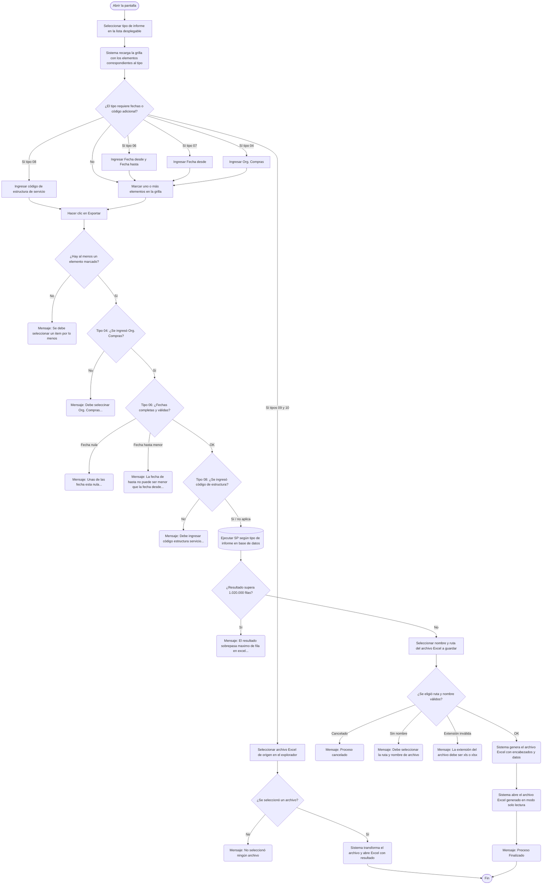

# Exportación Excel Varios

**Formulario:** `E_ExcelVarios.frm`
**Tablas principales:** `b_ingrediente` (catálogo de ingredientes), `b_receta` / `b_recetadet` (recetas y sus detalles), `cas_b_minuta` / `cas_b_minutadet` (minutas planificadas), `b_clientes` (centros de costo)
**Consultas principales:** múltiples procedimientos almacenados según el tipo seleccionado — ver sección 5

---

## Índice

- [1 — ¿Para qué sirve esta pantalla?](#1--para-qué-sirve-esta-pantalla)
- [2 — ¿Qué necesito para usarla?](#2--qué-necesito-para-usarla)
- [3 — ¿Cómo se usa?](#3--cómo-se-usa)
  - [3.1 Flujo paso a paso](#31-flujo-paso-a-paso)
  - [3.2 Controles y acciones disponibles](#32-controles-y-acciones-disponibles)
- [4 — ¿Qué restricciones debo conocer?](#4--qué-restricciones-debo-conocer)
  - [4.1 Validaciones del sistema](#41-validaciones-del-sistema)
- [5 — ¿Qué obtengo?](#5--qué-obtengo)
  - [Resumen de tipos disponibles](#resumen-de-tipos-disponibles)
  - [(01) Ingredientes con aportes](#01-ingredientes-con-aportes)
  - [(02) Ingrediente - productos sgp - Material Sap](#02-ingrediente---productos-sgp---material-sap)
  - [(03) Resumen de Recetas con Aportes](#03-resumen-de-recetas-con-aportes)
  - [(04) Detalle de Recetas](#04-detalle-de-recetas)
  - [(05) Listado de Ceco Ultima Planificación](#05-listado-de-ceco-ultima-planificación)
  - [(06) Listado Cantidades Comensales x Sitios](#06-listado-cantidades-comensales-x-sitios)
  - [(07) Listado Recetas en Planificación Maxima Fecha con Frecuencia](#07-listado-recetas-en-planificación-maxima-fecha-con-frecuencia)
  - [(08) Ubicar Estructura Servicio Minuta Bloque](#08-ubicar-estructura-servicio-minuta-bloque)
  - [(09) Transformar Recetas Optimum Excel](#09-transformar-recetas-optimum-excel)
  - [(10) Transformar Ingredientes Optimum Excel](#10-transformar-ingredientes-optimum-excel)
  - [(11) Listado Receta Metodo Preparación](#11-listado-receta-metodo-preparación)
- [6 — Referencia técnica](#6--referencia-técnica)
  - [Tablas que intervienen](#tablas-que-intervienen)
  - [Relación con otros módulos](#relación-con-otros-módulos)

---

## 1 — ¿Para qué sirve esta pantalla?
[↑ Volver al índice](#índice)

Esta pantalla centraliza once tipos distintos de exportación Excel que no tienen un lugar propio en el resto del sistema. Agrupa en un único acceso la extracción masiva de datos sobre ingredientes, recetas, planificación y estructura de servicios, orientada a análisis, integración con otras herramientas y tareas de administración que requieren manejar los datos fuera del sistema.

La pantalla se organiza en dos áreas principales. En la parte superior hay un panel con el selector de tipo de informe y campos complementarios que aparecen o se ocultan según la opción elegida. En la parte central e inferior hay una grilla que muestra los elementos disponibles para seleccionar (ingredientes, recetas o centros de costo según el tipo), junto con campos de búsqueda para filtrar la lista y campos de fecha que se habilitan cuando el informe lo requiere. Los botones de acción se ubican en la parte inferior derecha.

Dependiendo del tipo seleccionado, el usuario trabaja de una de estas dos formas: (a) elige uno o más elementos de la grilla y exporta la información asociada a esos elementos a un archivo Excel nuevo; o (b) proporciona un archivo Excel de origen que el sistema transforma y convierte a un formato diferente. Los tipos del 01 al 08 y el 11 siguen el primer flujo; los tipos 09 y 10 siguen el segundo.

---

## 2 — ¿Qué necesito para usarla?
[↑ Volver al índice](#índice)

| Campo | Descripción | Obligatorio |
|---|---|---|
| Informes | Lista desplegable con los once tipos de exportación disponibles. Al cambiar la selección, la grilla de elementos se recarga automáticamente. | Sí |
| Grilla de elementos | Lista de ingredientes, recetas o centros de costo que el sistema carga según el tipo elegido. El usuario debe marcar al menos un elemento antes de exportar (salvo en los tipos 08, 09 y 10). | Sí (según tipo) |
| Fecha desde | Fecha de inicio del período a consultar. Solo visible y requerida para los tipos (06) y (07). | Según tipo |
| Fecha hasta | Fecha de fin del período. Solo visible y requerida para el tipo (06). | Según tipo |
| Org. Compras | Código de la organización de compras (por ejemplo, `CL14`). Solo visible y requerido para el tipo (04) Detalle de Recetas. | Según tipo |
| Código estructura servicio | Código o lista de códigos de estructura de servicio/minuta separados por coma. Solo visible y requerido para el tipo (08). | Según tipo |
| Casilla "No Mostrar Recetas No Vigentes" | Opción disponible para los tipos (03), (04) y (07). Cuando está marcada, la grilla excluye recetas que ya superaron su fecha de vigencia. Por defecto viene marcada. | No |
| Archivo Excel de origen | Solo para los tipos (09) y (10): el usuario debe seleccionar un archivo `.xls` o `.xlsx` existente desde el explorador de archivos que el sistema abre. | Según tipo |

---

## 3 — ¿Cómo se usa?
[↑ Volver al índice](#índice)

### 3.1 Flujo paso a paso
[↑ Volver al índice](#índice)

### 3.2 Controles y acciones disponibles
[↑ Volver al índice](#índice)

| Control / Acción | Descripción |
|---|---|
| **Lista desplegable "Informes"** | Permite elegir el tipo de exportación. Al seleccionar una opción, el sistema recarga automáticamente la grilla con los elementos correspondientes (ingredientes, recetas o centros de costo). |
| **Campo "Org. Compras"** | Campo de texto que aparece únicamente al seleccionar el tipo (04). Permite ingresar el código de la organización de compras que se usará para calcular precios de convenio en el detalle de recetas. |
| **Casilla "No Mostrar Recetas No Vigentes"** | Aparece al seleccionar los tipos (03), (04) y (07). Cuando está marcada, la grilla excluye recetas con fecha de vigencia vencida. Al cambiarla, la grilla se recarga. |
| **Grilla de elementos** | Muestra los ingredientes, recetas o centros de costo disponibles según el tipo. El usuario selecciona o deselecciona filas haciendo clic en ellas. La columna de selección actúa como casilla de verificación: clic activa o desactiva la fila. |
| **Campo de búsqueda izquierdo** | Permite filtrar la grilla escribiendo un texto y presionando Enter. Resalta y mueve hacia arriba las filas que coinciden con el texto, ocultando las que no coinciden. Admite múltiples términos separados por coma. |
| **Campo de búsqueda derecho** | Funciona igual que el campo de búsqueda izquierdo pero busca en la columna de nombre. Si se usa uno de los campos de búsqueda, el otro se limpia. |
| **Campo "Fecha desde"** | Selector de fecha en formato dd/mm/yyyy. Se habilita y muestra únicamente para los tipos (06) y (07). |
| **Campo "Fecha hasta"** | Selector de fecha en formato dd/mm/yyyy. Se habilita y muestra únicamente para el tipo (06). |
| **Campo "Código estructura servicio"** | Campo de texto que aparece únicamente para el tipo (08). Acepta uno o varios códigos de estructura de servicio separados por coma. |
| **Botón "Exportar"** | Ejecuta las validaciones, consulta la base de datos y genera el archivo Excel. Para los tipos (09) y (10), abre el explorador de archivos para seleccionar el archivo de origen. Para el tipo (11), procesa directamente los datos en la grilla. |
| **Botón "Salir"** | Cierra la pantalla. |

---

## 4 — ¿Qué restricciones debo conocer?
[↑ Volver al índice](#índice)

### 4.1 Validaciones del sistema
[↑ Volver al índice](#índice)

| # | Cuándo aparece | Qué verifica el sistema | Qué ve o experimenta el usuario |
|---|---|---|---|
| 1 | Al hacer clic en Exportar (tipo 04) | Que el campo Org. Compras no esté vacío | Mensaje: `Debe seleccinar Org. Compras...` y el proceso se detiene. |
| 2 | Al hacer clic en Exportar (tipo 06) | Que ambas fechas estén completas | Mensaje: `Unas de las fecha esta nula...` y el proceso se detiene. |
| 3 | Al hacer clic en Exportar (tipo 06) | Que la fecha hasta no sea anterior a la fecha desde | Mensaje: `La fecha de hasta no puede ser menor que la fecha desde...` y el proceso se detiene. |
| 4 | Al hacer clic en Exportar (tipos 01 al 07 y 11) | Que al menos una fila de la grilla esté seleccionada | Mensaje: `Se debe seleccionar un item por lo menos` y el proceso se detiene. |
| 5 | Al hacer clic en Exportar (tipo 08) | Que el campo de código de estructura no esté vacío | Mensaje: `Debe ingresar código estructura servicio...` y el proceso se detiene. |
| 6 | Al hacer clic en Exportar (tipos 09 y 10) | Que se haya seleccionado un archivo de origen | Mensaje: `No seleccionó ningún archivo` y el proceso se detiene. |
| 7 | Después de consultar la base de datos | Que el volumen de datos no supere 1.020.000 filas | Mensaje: `El resultado sobrepasa maximo de fila en excel, Debera seleccionar menos Ceco` y el proceso se detiene. El usuario debe reducir la cantidad de elementos seleccionados. |
| 8 | Al elegir el nombre del archivo de destino | Que el usuario no cancele el diálogo de guardado | Mensaje: `Proceso cancelado` si se cierra sin elegir archivo. |
| 9 | Al elegir el nombre del archivo de destino | Que se ingrese un nombre de archivo | Mensaje: `Debe seleccionar la ruta y nombre de archivo` si el campo queda vacío. |
| 10 | Al elegir el nombre del archivo de destino | Que la extensión del archivo sea `.xls` o `.xlsx` | Mensaje: `La extensión del archivo debe ser (*.xls,*.xlsx)` y el proceso se detiene. |
| 11 | Al cargar la grilla | Que existan datos para el tipo seleccionado | Mensaje: `No existe información requerida` y la grilla queda vacía. |

---

## 5 — ¿Qué obtengo?
[↑ Volver al índice](#índice)

### Resumen de tipos disponibles
[↑ Volver al índice](#índice)

| Código | Nombre en el selector | Formato de salida | Procedimiento almacenado principal |
|---|---|---|---|
| (01) | Ingredientes con aportes | Excel | `sgpadm_Sel_ExcelAportesNutricionales_V02` |
| (02) | Ingrediente - productos sgp - Material Sap | Excel | `sgpadm_Sel_Excelingrediente_prodsgp_MaterialSap` |
| (03) | Resumen de Recetas con Aportes | Excel | `sgpadm_Sel_ExcelRecetaResumenAportes` |
| (04) | Detalle de Recetas | Excel | `sgpadm_Sel_ExcelDetalleRecetas_V02` |
| (05) | Listado de Ceco Ultima Planificación | Excel | `sgpadm_Sel_ExcelCecoUltimoPlanificacion` |
| (06) | Listado Cantidades Comensales x Sitios | Excel | `sgpadm_Sel_ExcelListaCantComensales` |
| (07) | Listado Recetas en Planificación Maxima Fecha con Frecuencia | Excel | `sgpadm_Sel_ExcelRecetaPlanificacionMaxima` |
| (08) | Ubicar Estructura Servicio Minuta Bloque | Excel | `sgpadm_Sel_UbicarEstServicio` |
| (09) | Transformar Recetas Optimum Excel | Excel (transformado) | Sin SP — procesamiento directo del archivo de origen |
| (10) | Transformar Ingredientes Optimum Excel | Excel (transformado) | Sin SP — procesamiento directo del archivo de origen |
| (11) | Listado Receta Metodo Preparación | Excel (desde archivo intermedio) | `sgpadm_s_receta_V06_JPA` (para cargar la grilla) |

---

### (01) Ingredientes con aportes
[↑ Volver al índice](#índice)

**Qué muestra:** Un archivo Excel con los valores de aportes nutricionales de cada ingrediente seleccionado. Incluye 36 nutrientes distintos, con su valor numérico por ingrediente, más los porcentajes de aprovechamiento, cocción y factor nutricional. También incluye la huella de carbono del ingrediente.

**Cómo se seleccionan los elementos:** La grilla carga todos los ingredientes activos que tienen al menos un producto asociado (`b_productosing`). El usuario marca los que desea exportar.

**Estructura del archivo generado:**

| Columna | Descripción |
|---|---|
| Cód. Ingrediente | Código interno del ingrediente |
| Nombre Ingrediente | Nombre del ingrediente en el catálogo |
| % Aprovechamiento | Porcentaje de aprovechamiento configurado en el catálogo |
| % Cocción | Porcentaje de cocción configurado en el catálogo |
| % Nutricional | Porcentaje nutricional configurado |
| Factor Nutricional | Factor de conversión nutricional |
| Huella Carbono | Huella de carbono asociada al ingrediente |
| Cód. Humedad / Humedad | Código interno y valor de humedad (g/100g) |
| Cód. Calorias / Calorias | Código interno y kilocalorías |
| Cód. Proteinas / Proteinas | Código interno y gramos de proteínas |
| Cód. Hidratos / Hidratos | Código interno y gramos de hidratos de carbono |
| Cód. Fibras / Fibras | Código interno y gramos de fibra dietética |
| Cód. Lipidos / Lipidos | Código interno y gramos de lípidos totales |
| Cód. Grasa Total / Grasa Total | Código interno y gramos de grasa total |
| Cód. Ac. Grasos Sat. / Ac. Grasos Sat. | Código interno y ácidos grasos saturados |
| Cód. Grasos Mon / Ac. Grasos Mon | Código interno y ácidos grasos monoinsaturados |
| Cód. Ac. Grasos Poli / Ac. Grasos Poli | Código interno y ácidos grasos poliinsaturados |
| Cód. Colesterol / Colesterol | Código interno y mg de colesterol |
| Cód. N6 / N6 | Código interno y ácidos grasos omega-6 |
| Cód. N3 / N3 | Código interno y ácidos grasos omega-3 |
| Cód. Caroteno / Caroteno | Código interno y microgramos de caroteno |
| Cód. Retinol / Retinol | Código interno y microgramos de retinol |
| Cód. Vit. A Tot Re / Vit. A Tot Re | Código interno y vitamina A total (equivalentes retinol) |
| Cód. Vitamina B1 / Vitamina B1 | Código interno y tiamina |
| Cód. Vitamina B2 / Vitamina B2 | Código interno y riboflavina |
| Cód. Niacina (B3) / Niacina ( B3) | Código interno y niacina |
| Cód. Vitamina B6 / Vitamina B6 | Código interno y piridoxina |
| Cód. Vitamina B12 / Vitamina B12 | Código interno y cobalamina |
| Cód. Folatos / Folatos | Código interno y folatos |
| Cód. Ac. Pantot (B5) / Ac. Pantot (B5) | Código interno y ácido pantoténico |
| Cód. Vitamina C / Vitamina C | Código interno y ácido ascórbico |
| Cód. Vitamina E / Vitamina E | Código interno y tocoferol |
| Cód. Calcio / Calcio | Código interno y mg de calcio |
| Cód. Cobre / Cobre | Código interno y mg de cobre |
| Cód. Hierro / Hierro | Código interno y mg de hierro |
| Cód. Magnesio / Magnesio | Código interno y mg de magnesio |
| Cód. Fosforo / Fosforo | Código interno y mg de fósforo |
| Cód. Potasio / Potasio | Código interno y mg de potasio |
| Cód. Selenio / Selenio | Código interno y microgramos de selenio |
| Cód. Sodio / Sodio | Código interno y mg de sodio |
| Cód. Zinc / Zinc | Código interno y mg de zinc |
| Cód. A.c Graso Trans. / A.c Graso Trans. | Código interno y ácidos grasos trans |
| Cód. Azucares Totales / Azucares Totales | Código interno y gramos de azúcares totales |

> Para cada nutriente el archivo genera dos columnas: el código interno del nutriente y el valor numérico. Los valores de los nutrientes provienen de la tabla de aportes nutricionales por producto (`b_productonut`). El archivo se ordena por nombre de ingrediente.

**Formato:** Archivo Excel (`.xls` o `.xlsx`), una hoja, con encabezados en la primera fila y una fila por ingrediente.

---

### (02) Ingrediente - productos sgp - Material Sap
[↑ Volver al índice](#índice)

**Qué muestra:** Un archivo Excel que cruza cada ingrediente con su producto equivalente en SGP y con el código de material en SAP. Permite verificar la correspondencia entre la codificación interna del sistema y los códigos utilizados en el ERP corporativo, incluyendo la familia de productos y las unidades y factores de conversión.

**Cómo se seleccionan los elementos:** La grilla carga todos los ingredientes existentes en el catálogo (tanto reales como propuestos), sin filtro de activos. El usuario marca los que desea exportar.

**Estructura del archivo generado:**

| Columna | Descripción |
|---|---|
| Código Ingrediente | Código interno del ingrediente en SGP |
| Nombre Ingrediente | Nombre del ingrediente |
| U.Medida | Unidad de medida del ingrediente |
| % Aprovechamiento | Porcentaje de aprovechamiento |
| % Coccion | Porcentaje de cocción |
| % Nutricional | Porcentaje nutricional |
| Factor Nutricional | Factor de conversión nutricional |
| T.Ing | Tipo de ingrediente: `Real` si es un ingrediente real (`ing_indppr=1`), `Prop.` si es propuesto |
| Còdigo SGP | Código del producto en el catálogo de productos SGP (puede estar vacío si no hay vínculo) |
| Nombre Producto | Nombre del producto SGP asociado |
| Cód. Familia | Código de la familia de productos en el catálogo |
| Desp. Familia | Descripción de la familia de productos (árbol completo) |
| Codigo SAP | Código del material en SAP |
| Descripcion SAP | Descripción del material en SAP |
| U.Stock | Unidad de stock del producto SGP |
| F.Conv. Prod. | Factor de conversión del producto (`pro_facsto`) |
| F.Conv.Ingr. | Factor de conversión del ingrediente (`pro_facing`) |
| T.Prod. | Tipo del producto en el catálogo SGP |

**Formato:** Archivo Excel, una hoja, ordenado por nombre de ingrediente y nombre de producto.

---

### (03) Resumen de Recetas con Aportes
[↑ Volver al índice](#índice)

**Qué muestra:** Un archivo Excel con el resumen nutricional calculado de cada receta seleccionada, expresado como la suma ponderada de los aportes de todos sus ingredientes. Incluye información de categoría dietética, tipo de plato, oferta asociada, cantidades brutas/netas/servidas, y los 36 nutrientes sumados para la receta completa.

**Restricciones propias del tipo:** Solo incluye recetas vigentes (`rec_fecvig` mayor a la fecha actual o sin fecha de vencimiento) y cuyo tipo sea real (`rec_indppr=1`) y estén activas.

**Cómo se seleccionan los elementos:** La grilla carga todas las recetas disponibles en el catálogo. La casilla "No Mostrar Recetas No Vigentes" filtra la grilla para mostrar solo las vigentes.

**Opciones de configuración:** La casilla "No Mostrar Recetas No Vigentes" permite restringir la grilla de selección.

**Estructura del archivo generado:**

| Columna | Descripción |
|---|---|
| Código Receta | Código interno de la receta |
| rec_nombre | Nombre de la receta |
| rec_nomfan | Nombre de fantasía de la receta |
| Código Categoria Dietitica | Código de la categoría dietética |
| Categoría Dietética | Nombre completo de la categoría dietética (árbol) |
| Código Tipo Plato | Código del tipo de plato |
| Tipo Plato | Nombre del tipo de plato (árbol) |
| Código Oferta | Código de la oferta comercial vinculada a la receta |
| Nombre Oferta | Descripción de la oferta (descripción + descripción corta) |
| Cantidad Bruta | Suma de los gramajes brutos de todos los ingredientes |
| Cantidad Neta | Suma de gramajes después de aplicar el porcentaje de aprovechamiento |
| Cantidad Servida | Suma de gramajes después de aprovechamiento y cocción |
| Cantidad Neta Nut. | Suma de gramajes después de aplicar el porcentaje nutricional |
| Humedad … Azucares Totales | 36 columnas de aportes nutricionales calculados para la receta completa |

**Cálculo de cada nutriente por receta:**

Por cada ingrediente de la receta, el valor del nutriente se calcula como:

`(% Nutricional / 100) × (Valor del nutriente × (Cantidad ingrediente / Raciones base)) / Factor Nutricional`

Donde el Factor Nutricional equivale a 1 si el ingrediente lo tiene definido como cero. Luego se suman todos los ingredientes de la receta.

**Formato:** Archivo Excel, una hoja, con una fila por receta.

---

### (04) Detalle de Recetas
[↑ Volver al índice](#índice)

**Qué muestra:** Un archivo Excel con el detalle línea por línea de cada ingrediente que compone cada receta seleccionada, incluyendo los porcentajes de aprovechamiento, cocción y nutricional, las cantidades calculadas y el costo del ingrediente según el precio de convenio vigente para la organización de compras indicada. Al final de cada receta se agrega una fila de totales.

**Cómo se seleccionan los elementos:** La grilla carga todas las recetas disponibles. La casilla "No Mostrar Recetas No Vigentes" filtra la grilla.

**Opciones de configuración:** El campo Org. Compras (obligatorio) determina qué precios de convenio se utilizan para calcular el costo de cada ingrediente.

**Estructura del archivo generado:**

| Columna | Descripción |
|---|---|
| Cód. Receta | Código interno de la receta |
| rec_nombre | Nombre de la receta |
| Cód. Cat. Dietetica | Código de categoría dietética |
| nombrecatdiet | Nombre de la categoría dietética |
| Tipo Plato | Código del tipo de plato |
| nombretipoplato | Nombre del tipo de plato |
| ofertas | Descripción corta de las ofertas asociadas a la receta (separadas por guión) |
| Fecha Vigencia | Fecha de vigencia de la receta o el texto "Vigente" si no tiene vencimiento |
| Numero Linea | Número de línea del ingrediente dentro de la receta (vacío en la fila de totales) |
| Cód. Ingrediente | Código del ingrediente (vacío en la fila de totales) |
| Nombre Ingrediente | Nombre del ingrediente (vacío en la fila de totales) |
| Cantidad Ingrediente | Gramaje bruto del ingrediente en la receta |
| Costo Ingrediente | Costo del ingrediente calculado según precio de convenio y factor de conversión |
| %Aprovechamiento | Porcentaje de aprovechamiento del ingrediente |
| Cantidad Neta | Gramaje después de aplicar el aprovechamiento |
| %Cocción | Porcentaje de cocción |
| Cantidad Servida | Gramaje después de aprovechamiento y cocción |
| %Nutricional | Porcentaje nutricional |
| Cantidad Neta Nut | Gramaje después de aplicar el porcentaje nutricional |

> El archivo incluye dos filas por receta para el campo "orden": las filas de detalle con `orden=1` y una fila de totales con `orden=2` que suma las cantidades y el costo de todos los ingredientes.

**Cálculo — Costo Ingrediente:**

`Costo Ingrediente = ROUND(SUM(Cantidad Ingrediente × (Precio Convenio / Factor Conversión)), 2)`

El precio se obtiene del procedimiento `PA_sgpadm_CostoRecetaxOrgCompras` usando la organización de compras indicada, con prioridad: primero precio de convenio, luego PMP, y en último lugar precio de lista.

**Formato:** Archivo Excel, una hoja, ordenado por código de receta y número de orden (detalle primero, totales al final).

---

### (05) Listado de Ceco Ultima Planificación
[↑ Volver al índice](#índice)

**Qué muestra:** Un archivo Excel con la información del bloque de planificación más reciente de cada centro de costo seleccionado, desglosado por régimen y servicio. Permite saber hasta qué fechas tiene planificación vigente cada combinación de casino/régimen/servicio.

**Cómo se seleccionan los elementos:** La grilla carga todos los centros de costo (clientes) que tienen minutas registradas. El usuario marca los que desea consultar.

**Estructura del archivo generado:**

| Columna | Descripción |
|---|---|
| Ceco | Código del centro de costo (casino) |
| Descripción | Nombre del centro de costo |
| Cód. Regimen | Código del régimen alimenticio |
| Descripción | Nombre del régimen |
| Cód. Servicio | Código del servicio (desayuno, almuerzo, etc.) |
| Descripción | Nombre del servicio |
| Fecha Desde | Fecha de inicio del bloque de planificación más reciente |
| Fecha Hasta | Fecha de término del bloque de planificación más reciente |
| Num Bloque | Identificador del bloque de planificación |

**Formato:** Archivo Excel, ordenado por centro de costo, régimen y servicio.

---

### (06) Listado Cantidades Comensales x Sitios
[↑ Volver al índice](#índice)

**Qué muestra:** Un archivo Excel con la cantidad de raciones planificadas por día de la semana (lunes a domingo), desglosadas por centro de costo, régimen y servicio, en el período de fechas indicado. Es útil para analizar la distribución de comensales a lo largo de la semana en cada casino y servicio.

**Cómo se seleccionan los elementos:** La grilla carga los centros de costo disponibles. El usuario marca los que desea incluir.

**Opciones de configuración:** Los campos Fecha desde y Fecha hasta definen el período de análisis.

**Estructura del archivo generado:**

| Columna | Descripción |
|---|---|
| min_cecori | Código del centro de costo |
| reg_codigo | Código del régimen |
| reg_nombre | Nombre del régimen |
| ser_codigo | Código del servicio |
| ser_nombre | Nombre del servicio |
| Lunes | Total de raciones planificadas en días lunes dentro del período |
| Martes | Total de raciones planificadas en días martes |
| Miercoles | Total de raciones planificadas en días miércoles |
| Jueves | Total de raciones planificadas en días jueves |
| Viernes | Total de raciones planificadas en días viernes |
| Sabado | Total de raciones planificadas en días sábado |
| Domingo | Total de raciones planificadas en días domingo |

> Solo se incluyen minutas con raciones teóricas mayores a cero (`min_racteo > 0`). El archivo se ordena por centro de costo, régimen y servicio.

**Formato:** Archivo Excel, ordenado por centro de costo, régimen y servicio.

---

### (07) Listado Recetas en Planificación Maxima Fecha con Frecuencia
[↑ Volver al índice](#índice)

**Qué muestra:** Un archivo Excel con el detalle de ingredientes de cada receta seleccionada, junto con la última fecha en que esa receta fue planificada y la cantidad de veces que aparece en la planificación desde la fecha indicada. Permite identificar qué recetas se usan más y cuándo se usaron por última vez.

**Cómo se seleccionan los elementos:** La grilla carga recetas. La casilla "No Mostrar Recetas No Vigentes" filtra la grilla.

**Opciones de configuración:** El campo Fecha desde limita el período de análisis de frecuencia de uso.

**Estructura del archivo generado:**

| Columna | Descripción |
|---|---|
| Código receta | Código interno de la receta |
| Nombre receta | Nombre de la receta |
| Ultima fecha planificada | Última fecha en que la receta fue incluida en una minuta |
| Cód. Categoria Dietetica | Código de categoría dietética |
| Cat. Dietetica | Nombre completo de la categoría dietética |
| Cód. Tipo Plato | Código del tipo de plato |
| Tipo Plato | Nombre del tipo de plato |
| Cód. Ingrediente | Código del ingrediente de la receta |
| Nom. Ingrediente | Nombre del ingrediente |
| Cant. Bruta | Gramaje bruto del ingrediente en la receta |
| rec_fecvig | Fecha de vigencia de la receta |
| Tipo Receta | `Real` o `Propuesta` según el tipo de receta |
| Frecuencia Receta | Número de veces que la receta aparece en la planificación desde la fecha indicada |

**Formato:** Archivo Excel, ordenado por nombre de receta.

---

### (08) Ubicar Estructura Servicio Minuta Bloque
[↑ Volver al índice](#índice)

**Qué muestra:** Un archivo Excel que, dado un código de estructura de servicio/minuta, devuelve todos los centros de costo, regímenes, servicios y bloques de fechas en los que esa estructura aparece en la planificación. Permite saber en qué casinos y períodos se usa un menú o estructura de servicio específico.

**Cómo se seleccionan los elementos:** Este tipo no usa la grilla de selección. En su lugar, el usuario ingresa directamente el código (o códigos separados por coma) de la estructura de servicio en el campo de texto correspondiente.

**Restricciones propias del tipo:** Solo se consideran minutas de tipo 1 (`mid_tipmin = 1`).

**Estructura del archivo generado:**

| Columna | Descripción |
|---|---|
| Código Ceco | Código del centro de costo |
| Nombre Ceco | Nombre del centro de costo |
| Código Regimen | Código del régimen |
| Nombre Regimen | Nombre del régimen |
| Código Servicio | Código del servicio |
| Nombre Servicio | Nombre del servicio |
| Fecha Desde | Fecha de inicio del bloque de planificación |
| Fecha Hasta | Fecha de término del bloque de planificación |

**Formato:** Archivo Excel, ordenado por código de ceco, régimen, servicio y fechas.

---

### (09) Transformar Recetas Optimum Excel
[↑ Volver al índice](#índice)

**Qué muestra:** Este tipo no genera un informe desde la base de datos. En cambio, recibe un archivo Excel exportado desde el sistema Optimum y lo convierte a un formato tabular plano separado por barras verticales (`|`), abriendo el resultado en Excel. El archivo resultante contiene el detalle de recetas e ingredientes en el formato que SGP puede consumir.

**Cómo se seleccionan los elementos:** El usuario selecciona el archivo Excel de origen desde el explorador de archivos que el sistema abre al hacer clic en Exportar.

**Estructura del archivo resultante:**

| Columna | Descripción |
|---|---|
| Código Receta | Código de la receta (prefijo `REC0`, `ING0` o `PRO0`) |
| Nombre Receta | Nombre de la receta |
| Código Ingrediente | Código del ingrediente (prefijo `ING` o `PRO`) |
| Nombre Ingrediente | Nombre del ingrediente |
| Num Lin | Número de línea del ingrediente dentro de la receta |
| Gramaje | Cantidad del ingrediente en la receta |
| Bom Receta | Código BOM (lista de materiales) asociado a la receta |
| Sitio | Sitio o casino al que pertenece la receta |

> El sistema recorre el archivo de origen identificando filas de encabezado de receta (cuando el código comienza con `REC0`, `ING0` o `PRO0`) y filas de ingrediente (cuando el código comienza con `ING` o `PRO`). El código BOM se detecta cuando el valor en la columna 14 comienza con `BOM`.

**Formato:** El resultado se abre en Excel como archivo de texto delimitado por `|`.

---

### (10) Transformar Ingredientes Optimum Excel
[↑ Volver al índice](#índice)

**Qué muestra:** Este tipo sigue el mismo flujo que el tipo (09), pero el archivo de origen contiene datos de ingredientes en formato Optimum. El sistema lo convierte a un formato tabular plano separado por `|` y lo abre en Excel para su uso posterior.

**Cómo se seleccionan los elementos:** El usuario selecciona el archivo Excel de origen desde el explorador de archivos.

**Formato:** El resultado se abre en Excel como archivo de texto delimitado por `|`.

---

### (11) Listado Receta Metodo Preparación
[↑ Volver al índice](#índice)

**Qué muestra:** Un archivo Excel con el texto del método de preparación de cada receta seleccionada, extraído desde el campo de texto enriquecido (RTF) del catálogo de recetas. El texto se convierte a texto plano eliminando el formato RTF. Es útil para extraer y revisar masivamente los métodos de preparación registrados en el sistema.

**Cómo se seleccionan los elementos:** La grilla carga todas las recetas disponibles en el catálogo, con opción de filtrar las no vigentes mediante la casilla correspondiente.

**Opciones de configuración:** La casilla "No Mostrar Recetas No Vigentes" filtra la grilla de selección.

**Estructura del archivo generado:**

| Columna | Descripción |
|---|---|
| Código Receta | Código interno de la receta |
| Nombre Receta | Nombre de la receta |
| Metodo Preparación | Texto del método de preparación, convertido a texto plano desde formato RTF |

> El sistema genera un archivo de texto intermedio separado por `|` y luego lo abre en Excel. A diferencia de los otros tipos, en este caso la grilla también muestra el método de preparación en la columna 5 durante la carga.

**Formato:** El resultado se abre en Excel como archivo de texto delimitado por `|`.

---

## 6 — Referencia técnica
[↑ Volver al índice](#índice)

### Tablas que intervienen
[↑ Volver al índice](#índice)

| Tabla | Para qué se usa en este reporte | Campos clave |
|---|---|---|
| `b_ingrediente` | Catálogo maestro de ingredientes. Se usa en todos los tipos que involucran ingredientes (01, 02, 03, 04, 07, 11). | `ing_codigo`, `ing_nombre`, `ing_activo`, `ing_indppr`, `ing_pctapr`, `ing_pctcoc`, `ing_pctnut`, `ing_facnut` |
| `b_productonut` | Valores de aportes nutricionales por ingrediente y nutriente. Se usa en los tipos 01 y 03. | `pnu_codpro`, `pnu_codapo`, `pnu_canapo` |
| `b_productosing` | Vínculo entre ingredientes y productos. Se usa en los tipos 01 y 02. | `pri_coding`, `pri_codpro` |
| `b_productos` | Catálogo de productos SGP. Se usa en el tipo 02. | `pro_codigo`, `pro_nombre`, `pro_codtip`, `pro_facing`, `pro_facsto` |
| `b_formatocompras_sap` | Catálogo de materiales SAP. Se usa en el tipo 02 para cruzar el código SAP. | `fcs_CodMaterial`, `fcs_DenMaterial` |
| `b_formatocompras_sap_sgp` | Tabla de correspondencia entre materiales SAP y productos SGP. | `fss_CodMaterial`, `fss_CodSgp` |
| `b_receta` | Catálogo maestro de recetas. Se usa en los tipos 03, 04, 07 y 11. | `rec_codigo`, `rec_nombre`, `rec_nomfan`, `rec_activo`, `rec_indppr`, `rec_fecvig`, `rec_catdie`, `rec_tippla`, `rec_basrac` |
| `b_recetadet` | Detalle de ingredientes de cada receta. Se usa en los tipos 03, 04 y 07. | `red_codigo`, `red_codpro`, `red_canpro`, `red_pctapr`, `red_pctcoc`, `red_pctnut`, `red_nroite` |
| `b_receta_Oferta` | Vinculación entre recetas y ofertas comerciales. Se usa en los tipos 03 y 04. | `rec_codigo`, `codigo_oferta`, `Activo` |
| `b_Ofertas` | Catálogo de ofertas comerciales. Se usa en los tipos 03 y 04. | `Codigo_oferta`, `Descripcion`, `DescripcionCorta` |
| `cas_b_minuta` | Encabezados de minutas planificadas. Se usa en los tipos 05, 06 y 07. | `min_cecori`, `min_codreg`, `min_codser`, `min_fecmin`, `min_racteo`, `min_codigo`, `ID_Bloque` |
| `cas_b_minutadet` | Detalle de recetas en la minuta. Se usa en los tipos 07 y 08. | `mid_cecori`, `mid_codigo`, `mid_codrec`, `mid_estser`, `mid_tipmin` |
| `CAS_b_MinutaBloque` | Bloques de planificación de minutas con fechas de inicio y fin. Se usa en los tipos 05 y 08. | `ID_Bloque`, `Ceco`, `Regimen`, `Servicio`, `FechaDesde`, `FechaHasta` |
| `b_clientes` | Catálogo de centros de costo (casinos). Se usa en los tipos 05 y 08. | `cli_codigo`, `cli_nombre` |
| `a_regimen` | Catálogo de regímenes alimenticios. Se usa en los tipos 05, 06 y 08. | `reg_codigo`, `reg_nombre` |
| `a_servicio` | Catálogo de servicios (desayuno, almuerzo, etc.). Se usa en los tipos 05, 06 y 08. | `ser_codigo`, `ser_nombre` |
| `a_unidadmed` | Catálogo de unidades de medida. Se usa en el tipo 02. | `unm_codigo`, `unm_nomcor`, `unm_nombre` |
| `a_tipopro` | Catálogo de tipos de productos. Se usa en el tipo 02. | `tip_codigo` |
| `a_nutriente` | Catálogo de nutrientes. Se usa como referencia para los códigos de nutrientes en los tipos 01 y 03. | `nut_codigo`, `nut_nombre` |

### Relación con otros módulos
[↑ Volver al índice](#índice)

| Módulo | Relación |
|---|---|
| **Catálogo de Ingredientes** | Los tipos 01, 02, 03, 04, 07 y 11 consumen el catálogo de ingredientes (`b_ingrediente`) con sus aportes nutricionales y porcentajes de aprovechamiento/cocción. |
| **Catálogo de Recetas** | Los tipos 03, 04, 07 y 11 consumen el catálogo de recetas (`b_receta` / `b_recetadet`) con su composición de ingredientes y método de preparación. |
| **Catálogo de Productos** | El tipo 02 cruza los ingredientes con los productos del catálogo SGP y sus equivalentes en SAP. |
| **Planificación de Minutas** | Los tipos 05, 06, 07 y 08 consumen los datos de planificación de minutas (`cas_b_minuta`, `cas_b_minutadet`, `CAS_b_MinutaBloque`) para analizar la última planificación, frecuencia de uso de recetas y distribución de comensales. |
| **Ofertas Comerciales** | Los tipos 03 y 04 cruzan las recetas con sus ofertas comerciales asociadas (`b_receta_Oferta`, `b_Ofertas`). |
| **Integración SAP / Optimum** | Los tipos 02, 09 y 10 están orientados a la integración con sistemas externos: el tipo 02 expone los códigos de material SAP, mientras que los tipos 09 y 10 transforman archivos exportados desde el sistema Optimum al formato requerido por SGP. |
| **Precios y Compras** | El tipo 04 utiliza los precios de convenio por organización de compras para calcular el costo de los ingredientes de cada receta, consumiendo la lógica del procedimiento `PA_sgpadm_CostoRecetaxOrgCompras`. |

---

*Fuentes: `E_ExcelVarios.frm`, SPs `sgpadm_Sel_ExcelAportesNutricionales_V02`, `sgpadm_Sel_Excelingrediente_prodsgp_MaterialSap`, `sgpadm_Sel_ExcelRecetaResumenAportes`, `sgpadm_Sel_ExcelDetalleRecetas_V02`, `sgpadm_Sel_ExcelCecoUltimoPlanificacion`, `sgpadm_Sel_ExcelListaCantComensales`, `sgpadm_Sel_ExcelRecetaPlanificacionMaxima`, `sgpadm_Sel_UbicarEstServicio` en `SGP_Admin.sql`*
