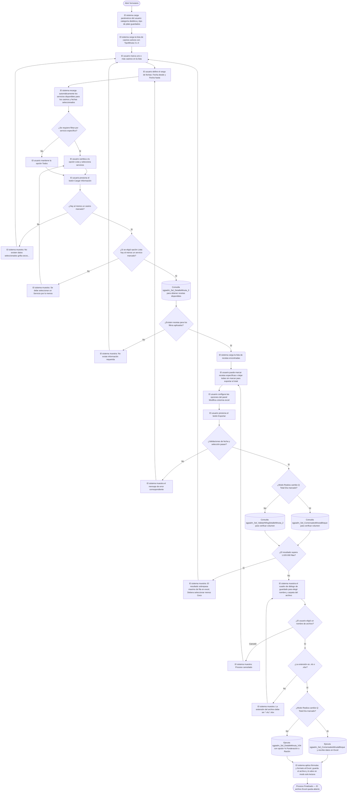

# Exportar Detalle Minuta

**Formulario:** `E_PlanMinuta.frm`
**Tabla(s) principal(es):** `cas_b_minuta` (cabecera de minuta planificada por casino) · `cas_b_minutadet` (líneas de detalle de la minuta con recetas y raciones)
**Consultas principales:**
- Modo detalle: `sgpadm_Sel_DetalleMinuta_V04`
- Modo comensales: `sgpadm_Sel_ComensalesMinutaBloque`

---

## Índice

- [1 — ¿Para qué sirve esta pantalla?](#1--para-qué-sirve-esta-pantalla)
- [2 — ¿Qué necesito para usarla?](#2--qué-necesito-para-usarla)
- [3 — ¿Cómo se usa?](#3--cómo-se-usa)
  - [3.1 Flujo paso a paso](#31-flujo-paso-a-paso)
  - [3.2 Controles y acciones disponibles](#32-controles-y-acciones-disponibles)
- [4 — ¿Qué restricciones debo conocer?](#4--qué-restricciones-debo-conocer)
  - [4.1 Validaciones del sistema](#41-validaciones-del-sistema)
- [5 — ¿Qué obtengo?](#5--qué-obtengo)
  - [Modo Detalle Minuta](#modo-detalle-minuta)
  - [Modo Comensales Totales por Minuta](#modo-comensales-totales-por-minuta)
- [6 — Referencia técnica](#6--referencia-técnica)
  - [Tablas que intervienen](#tablas-que-intervienen)
  - [Relación con otros módulos](#relación-con-otros-módulos)

---

## 1 — ¿Para qué sirve esta pantalla?
[↑ Volver al índice](#índice)

Esta pantalla permite exportar a Excel el detalle de la planificación de minutas de uno o varios casinos para un rango de fechas determinado. El resultado es un archivo Excel que contiene, por cada día y casino seleccionado, las recetas planificadas con sus raciones, porcentajes de ponderación, comensales teóricos, categoría dietética y tipo de plato. Existe además un modo simplificado que entrega únicamente el total de comensales por minuta, sin el detalle de recetas.

La pantalla está organizada en dos áreas principales. La parte superior muestra la lista de casinos disponibles con casillas de selección, campos de búsqueda y los filtros de rango de fechas, categoría dietética y tipo de plato. La parte inferior muestra las recetas que corresponden a los casinos y fechas seleccionados, junto con un panel de opciones para ajustar qué columna del Excel queda disponible para edición posterior.

El formulario no tiene un selector de tipo de informe con lista desplegable como otros formularios del sistema. En cambio, el modo de operación se determina mediante una casilla de verificación ("Realiza cambio Q Total Día") que conmuta entre exportar el detalle completo de recetas o exportar únicamente los totales de comensales. La distinción determina qué procedimiento almacenado se ejecuta y qué columnas aparecen en el archivo Excel resultante.

---

## 2 — ¿Qué necesito para usarla?
[↑ Volver al índice](#índice)

| Campo | Descripción | Obligatorio |
|---|---|---|
| Casinos (lista de CECO) | Lista de casinos que se carga automáticamente al abrir el formulario. El usuario debe marcar uno o más casinos de la lista para incluirlos en el reporte. Soporta búsqueda por código o nombre escribiendo en los campos de búsqueda y presionando Enter. | Sí (al menos uno) |
| No Mostrar Casinos Propuesta | Casilla marcada por defecto. Cuando está activada, oculta los casinos en estado de propuesta y muestra solo casinos en producción activa. Al cambiar su estado se recarga la lista de casinos automáticamente. | No (tiene valor por defecto) |
| Fecha desde | Inicio del rango de fechas a consultar, en formato dd/mm/yyyy. Se inicializa con la fecha actual. Al cambiar el valor se recarga la lista de servicios disponibles. | Sí |
| Fecha hasta | Fin del rango de fechas a consultar, en formato dd/mm/yyyy. Se inicializa con la fecha actual. Al cambiar el valor se recarga la lista de servicios disponibles. | Sí |
| C. Dietética | Filtro opcional de categoría dietética. Permite restringir las recetas al grupo dietético seleccionado. Si muestra "Todos" no hay filtro activo. Al hacer clic en el ícono contiguo se abre un selector jerárquico de categorías dietéticas. Si el usuario tiene un valor guardado en sus parámetros personales, se carga automáticamente al abrir el formulario. | No |
| Tipo Plato | Filtro opcional de tipo de plato. Permite restringir las recetas al tipo de plato seleccionado. Si muestra "Todos" no hay filtro activo. Al hacer clic en el ícono contiguo se abre un selector jerárquico de tipos de plato. Si el usuario tiene un valor guardado en sus parámetros personales, se carga automáticamente al abrir el formulario. | No |
| Servicio — Todos / Lista | Selector que determina si se incluyen todos los servicios disponibles en el período o solo los que el usuario elija explícitamente. Con la opción "Lista" se habilita el ícono para abrir el selector de servicios; con "Todos" el ícono queda inhabilitado. | Sí (tiene valor por defecto "Todos") |
| Recetas (grilla de recetas) | Grilla que se carga al presionar el botón "Cargar Información". Muestra las recetas que corresponden a los casinos, fechas y servicios seleccionados. El usuario puede marcar recetas individuales para filtrar el Excel por recetas específicas; si no marca ninguna, se exportan todas las recetas encontradas. Soporta búsqueda por código o nombre. | No (si no se marca ninguna, se exportan todas) |
| Realiza cambio Q Total Día | Casilla dentro del panel "Modifica columna excel". Cuando está marcada, el modo de exportación cambia a totales de comensales (sin detalle de recetas). Cuando está desmarcada, se exporta el detalle completo de recetas. Al marcar esta casilla, las opciones "% Ponderación" y "Ración" se deshabilitan. | No (por defecto desmarcado) |
| % Ponderación / Ración | Par de opciones dentro del panel "Modifica columna excel" (disponibles solo cuando la casilla "Realiza cambio Q Total Día" está desmarcada). Determina cuál de las dos columnas del Excel queda habilitada para que el usuario pueda editarla: si selecciona "% Ponderación", la columna de porcentaje queda editable y la columna de raciones se calcula automáticamente mediante fórmula; si selecciona "Ración", la columna de raciones queda editable y la de porcentaje se calcula. Por defecto se selecciona "% Ponderación". | No (tiene valor por defecto) |

---

## 3 — ¿Cómo se usa?
[↑ Volver al índice](#índice)

### 3.1 Flujo paso a paso
[↑ Volver al índice](#índice)

### 3.2 Controles y acciones disponibles
[↑ Volver al índice](#índice)

| Control / Acción | Descripción |
|---|---|
| **Lista de casinos** | Grilla que se carga automáticamente al abrir el formulario y cada vez que se cambia el estado de la casilla "No Mostrar Casinos Propuesta". El usuario hace clic en la fila para marcar o desmarcar un casino. El marcado de una fila actualiza automáticamente la lista de servicios disponibles en el período. |
| **Campos de búsqueda de casinos** | Dos campos de texto ubicados sobre la grilla de casinos (búsqueda por código y por nombre). Al escribir uno o más términos separados por coma y presionar Enter, la grilla se filtra mostrando solo las filas que coinciden; los casinos ya marcados antes del filtro no se pierden. Borrar el texto y presionar Enter restaura todas las filas visibles. |
| **No Mostrar Casinos Propuesta** | Casilla marcada por defecto. Al cambiarla, recarga la lista de casinos completa desde el servidor, incluyendo o excluyendo los casinos en estado de propuesta. |
| **Fecha desde / Fecha hasta** | Campos de fecha con selector de calendario. Al modificar cualquiera de los dos valores, el sistema desactiva el botón Exportar y recarga la lista de servicios disponibles para los nuevos criterios. |
| **Ícono selector de Categoría Dietética** | Abre un árbol jerárquico de categorías dietéticas. El valor elegido se aplica como filtro al cargar las recetas. |
| **Ícono selector de Tipo Plato** | Abre un árbol jerárquico de tipos de plato. El valor elegido se aplica como filtro al cargar las recetas. |
| **Servicio: Todos / Lista** | Par de opciones que controla si se incluyen todos los servicios del período o solo los elegidos. Al seleccionar "Lista" se habilita el ícono del selector de servicios y se desactiva el botón Exportar, obligando a recargar la información. Al seleccionar "Todos" el ícono del selector queda deshabilitado. |
| **Ícono selector de Servicios** | Disponible solo cuando se elige la opción "Lista". Abre un formulario de selección de servicios que permite elegir uno o varios servicios específicos a incluir en el reporte. |
| **Botón Cargar Información** | Ejecuta la consulta de recetas disponibles para los casinos, fechas, servicios, categoría dietética y tipo de plato seleccionados. Carga la grilla de recetas con los resultados. Si hay recetas disponibles, habilita el botón Exportar. |
| **Grilla de recetas** | Muestra las recetas encontradas después de presionar "Cargar Información". El usuario puede marcar recetas individuales para exportar solo esas recetas. Si no se marca ninguna, se exportan todas. Soporta búsqueda por código y nombre con los campos de texto ubicados sobre ella. |
| **Panel "Modifica columna excel"** | Contiene la casilla "Realiza cambio Q Total Día" y las opciones "% Ponderación" / "Ración". Controla el modo de exportación y qué columna del Excel queda disponible para edición por el usuario. |
| **Botón Exportar** | Inicia el proceso de exportación. Realiza las validaciones previas, verifica el volumen de filas, solicita al usuario el nombre y carpeta del archivo de destino, genera el Excel y lo abre en modo solo lectura. Durante el proceso los controles de filtro quedan deshabilitados para evitar cambios accidentales. |
| **Botón Salir** | Cierra el formulario. |

---

## 4 — ¿Qué restricciones debo conocer?
[↑ Volver al índice](#índice)

### 4.1 Validaciones del sistema
[↑ Volver al índice](#índice)

| # | Cuándo aparece | Qué verifica el sistema | Qué ve o experimenta el usuario |
|---|---|---|---|
| 1 | Al presionar "Cargar Información" o "Exportar" | Que ambas fechas (desde y hasta) estén completas | Mensaje: `"Unas de las fecha esta nula..."` |
| 2 | Al presionar "Cargar Información" o "Exportar" | Que la fecha hasta no sea anterior a la fecha desde | Mensaje: `"La fecha de hasta no puede ser menor que la fecha desde..."` |
| 3 | Al presionar "Cargar Información" o "Exportar" | Que haya al menos un casino marcado en la lista | Mensaje: `"Se debe seleccionar un Bloque por lo menos"` |
| 4 | Al presionar "Cargar Información" o "Exportar" (solo cuando se eligió la opción "Lista" para servicios) | Que haya al menos un servicio marcado en la lista de servicios | Mensaje: `"Se debe seleccionar un Servicio por lo menos"` |
| 5 | Al cargar recetas con "Cargar Información" | Que existan recetas para los filtros aplicados | Mensaje: `"No existe información requerida"`. La grilla de recetas queda vacía y el botón Exportar se desactiva. |
| 6 | Al presionar "Exportar" (verificación de volumen, modo detalle) | Que el número de filas del resultado no supere 1.020.000 (límite de filas de Excel) | Mensaje: `"El resultado sobrepasa maximo de fila en excel, Debera seleccionar menos Ceco"` |
| 7 | Al presionar "Exportar" (verificación de volumen, modo comensales) | Que el número de registros de comensales no supere 1.020.000 | Mismo mensaje que la validación anterior. |
| 8 | En el cuadro de diálogo de guardado, si el usuario cancela | Que el usuario haya seleccionado un archivo de destino | Mensaje: `"Proceso cancelado"`. El proceso se interrumpe y el usuario puede reintentar. |
| 9 | Al elegir nombre de archivo | Que el archivo tenga extensión .xls o .xlsx | Mensaje: `"La extensión del archivo debe ser (*.xls,*.xlsx)"` |

---

## 5 — ¿Qué obtengo?
[↑ Volver al índice](#índice)

Este formulario produce un único archivo Excel con dos modos de contenido. El modo se elige antes de exportar mediante la casilla "Realiza cambio Q Total Día":

| Modo | Descripción | Casilla marcada | Procedimiento principal |
|---|---|---|---|
| Detalle Minuta | Exporta cada receta planificada con raciones, ponderación, comensales, categoría dietética y tipo de plato | No (desmarcada) | `sgpadm_Sel_DetalleMinuta_V04` |
| Comensales Totales | Exporta únicamente el total de comensales por día, régimen y servicio, sin detalle de recetas | Sí (marcada) | `sgpadm_Sel_ComensalesMinutaBloque` |

---

### Modo Detalle Minuta
[↑ Volver al índice](#índice)

**Qué muestra:** una fila por cada receta planificada en la minuta, con toda la información de identificación del casino, régimen, servicio, fecha, receta, categoría dietética, tipo de plato, raciones, porcentaje de ponderación y comensales teóricos. Este modo es el principal para análisis de minutas planificadas a nivel de receta individual.

**Opciones de configuración disponibles:**

- **% Ponderación (opción activa por defecto):** la columna "% Ponderación" se almacena en la base de datos y queda editable en el Excel (fondo amarillo); la columna "Raciones" se genera mediante fórmula automática `= (% Ponderación × Comensales) / 100`. La columna de Raciones queda bloqueada para escritura manual.
- **Ración (opción alternativa):** la columna "Raciones" queda editable en el Excel (fondo amarillo); la columna "% Ponderación" se genera mediante fórmula automática `= (Raciones / Comensales) × 100`. La columna de Ponderación queda bloqueada.

**Estructura de datos del informe:**

| Campo / Columna | Descripción | Calculado |
|---|---|---|
| (col. auxiliar, se elimina antes de entregar) | Columna técnica que el sistema elimina automáticamente antes de guardar el archivo | Sí |
| CECO | Código del casino de origen | No |
| Código Régimen | Código del régimen alimentario al que pertenece la minuta | No |
| Nombre Régimen | Nombre del régimen alimentario | No |
| Código Servicio | Código del servicio (tipo de comida: almuerzo, cena, etc.) | No |
| Nombre Servicio | Nombre del servicio | No |
| Código Estructura Servicio | Código de la estructura de servicio (subdivisión dentro del servicio) | No |
| Nombre Estructura Servicio | Nombre de la estructura de servicio. Se prioriza el nombre guardado en el detalle de minuta sobre el nombre del maestro | No |
| Fecha Minuta | Fecha del día al que corresponde la planificación | No |
| Código Receta | Código interno de la receta | No |
| Nombre Receta | Nombre de la receta | No |
| rec_catdie | Código numérico de la categoría dietética de la receta | No |
| Descripción Dietética | Nombre completo de la categoría dietética con su jerarquía | Sí |
| rec_tippla | Código numérico del tipo de plato | No |
| Descripción Tipo Plato | Nombre completo del tipo de plato con su jerarquía | Sí |
| % Ponderación o % Ponderación_1 | Porcentaje de ponderación de la receta dentro del servicio. La variante "_1" indica que queda bloqueada (el usuario eligió opción "Ración") | No (viene de la base de datos) |
| Raciones o Raciones_1 | Cantidad de raciones planificadas para la receta. La variante "_1" indica que queda bloqueada (el usuario eligió opción "% Ponderación") | No (viene de la base de datos) |
| Comensales | Total de comensales teóricos de la minuta completa para ese día | No |
| mid_numlin | Número de línea del detalle de minuta (uso técnico de ordenamiento) | No |
| Cód. New Receta | Columna reservada para código nuevo de receta; queda como cero, editable en Excel | Sí |

**Cálculo — Descripción Dietética**

La categoría dietética se almacena como un código numérico. El nombre descriptivo con su jerarquía completa se obtiene invocando una función de base de datos que recorre el árbol de categorías desde la hoja hasta la raíz.

**Fórmula o lógica:**
La función `sgpadm_p_buscararbolcatdietetica(rec_catdie)` devuelve la ruta jerárquica de la categoría; se toma todo el texto excepto el último carácter (separador final).

| Componente | Qué representa | De dónde viene |
|---|---|---|
| `rec_catdie` | Código de la categoría dietética de la receta | Tabla `b_receta`, campo `rec_catdie` |
| `sgpadm_p_buscararbolcatdietetica` | Función que recorre el árbol jerárquico de categorías | SP/función en `SGP_Admin.sql` |

**Cálculo — Descripción Tipo Plato**

De modo idéntico al anterior, el tipo de plato se almacena como código y se resuelve a texto mediante una función que recorre el árbol jerárquico.

**Fórmula o lógica:**
La función `sgpadm_p_buscararboltipplato1(rec_tippla)` devuelve la ruta jerárquica del tipo de plato; se toma todo el texto excepto el último carácter.

| Componente | Qué representa | De dónde viene |
|---|---|---|
| `rec_tippla` | Código del tipo de plato de la receta | Tabla `b_receta`, campo `rec_tippla` |
| `sgpadm_p_buscararboltipplato1` | Función que recorre el árbol jerárquico de tipos de plato | SP/función en `SGP_Admin.sql` |

**Cálculo — Raciones (fórmula Excel, modo % Ponderación activo)**

Cuando el usuario elige exportar con la opción "% Ponderación", las raciones no provienen directamente de la base de datos como valor editable; en cambio, el Excel inserta una fórmula que calcula las raciones a partir de lo que el usuario modifique en la columna de ponderación.

**Fórmula:**
`Raciones = (% Ponderación × Comensales) / 100`

| Componente | Qué representa | De dónde viene |
|---|---|---|
| % Ponderación | Porcentaje que la receta representa dentro del servicio | Columna P del Excel (editable por el usuario) |
| Comensales | Total de comensales del servicio para ese día | Columna R del Excel (desde la base de datos) |

> Ejemplo: si el usuario ajusta el porcentaje de ponderación de una receta a 45 % y los comensales son 200, la columna Raciones calculará automáticamente 90 raciones.

**Cálculo — % Ponderación (fórmula Excel, modo Ración activo)**

Cuando el usuario elige exportar con la opción "Ración", el porcentaje se calcula a partir de las raciones que el usuario edite.

**Fórmula:**
`% Ponderación = (Raciones / Comensales) × 100`

| Componente | Qué representa | De dónde viene |
|---|---|---|
| Raciones | Cantidad de raciones editada por el usuario | Columna Q del Excel (editable) |
| Comensales | Total de comensales del servicio para ese día | Columna R del Excel (desde la base de datos) |

> Ejemplo: si el usuario ingresa 90 raciones y los comensales son 200, el porcentaje calculado será 45 %.

**Formato de salida:** Excel (`.xls` o `.xlsx`). Una única hoja de cálculo ("Hoja1"). El usuario elige la ruta y nombre del archivo mediante un cuadro de diálogo de guardado. La fila 1 contiene los nombres de columna (los mismos del resultado del procedimiento almacenado). Los datos comienzan desde la fila 2. Según la opción elegida, una de las columnas P o Q queda con fondo amarillo indicando que es editable. La columna T (Cód. New Receta) también queda desbloqueada para uso posterior. Las columnas de ancho se ajustan automáticamente. Después de guardar, el archivo se abre directamente en modo solo lectura para revisión inmediata.

---

### Modo Comensales Totales
[↑ Volver al índice](#índice)

**Qué muestra:** una fila por cada combinación de casino, régimen, servicio y fecha de minuta, con el total de comensales teóricos de la minuta (sin desglosar por recetas). Este modo es útil para obtener un resumen de la demanda planificada sin el detalle de qué recetas se sirvieron.

**Restricciones propias del modo:** el filtro de recetas (grilla de recetas) no tiene efecto en este modo: aunque el usuario haya marcado recetas específicas, estas no se utilizan como filtro en la consulta de comensales. Los filtros activos son solo casino, servicio y rango de fechas.

**Estructura de datos del informe:**

| Campo / Columna | Descripción | Calculado |
|---|---|---|
| (col. auxiliar, se elimina antes de entregar) | Columna técnica que el sistema elimina antes de guardar el archivo | Sí |
| min_cecori | Código del casino de origen | No |
| reg_codigo | Código del régimen alimentario | No |
| reg_nombre | Nombre del régimen alimentario | No |
| ser_codigo | Código del servicio | No |
| ser_nombre | Nombre del servicio | No |
| min_fecmin | Fecha de la minuta | No |
| Comensales | Total de comensales teóricos registrados en la cabecera de la minuta para ese día | No |

**Opciones de configuración disponibles:**

- En este modo, las opciones "% Ponderación" y "Ración" quedan deshabilitadas ya que no aplican al resumen de comensales. La columna H del Excel queda desbloqueada para edición posterior por el usuario.

**Formato de salida:** Excel (`.xls` o `.xlsx`). Una única hoja de cálculo. El usuario elige la ruta y nombre del archivo mediante un cuadro de diálogo de guardado. Fila 1 con nombres de columna, datos desde fila 2. La columna H queda desbloqueada para edición. Las columnas se ajustan automáticamente al contenido. El archivo se abre en modo solo lectura al finalizar.

---

## 6 — Referencia técnica
[↑ Volver al índice](#índice)

### Tablas que intervienen
[↑ Volver al índice](#índice)

| Tabla | Para qué se usa en este reporte | Campos clave |
|---|---|---|
| `cas_b_minuta` | Cabecera de la minuta planificada. Fuente principal de fechas, comensales totales, casino, régimen y servicio | `min_cecori`, `min_codigo`, `min_fecmin`, `min_codreg`, `min_codser`, `min_racteo` |
| `cas_b_minutadet` | Detalle de cada receta dentro de la minuta. Fuente de raciones planificadas, porcentaje de ponderación y estructura de servicio | `mid_cecori`, `mid_codigo`, `mid_codrec`, `mid_numrac`, `mid_porrac`, `mid_estser`, `mid_numlin`, `mid_desest`, `mid_tipmin` |
| `b_receta` | Catálogo de recetas. Proporciona nombre, categoría dietética y tipo de plato | `rec_codigo`, `rec_nombre`, `rec_catdie`, `rec_tippla` |
| `a_regimen` | Catálogo de regímenes alimentarios. Proporciona el nombre del régimen | `reg_codigo`, `reg_nombre` |
| `a_servicio` | Catálogo de servicios (almuerzo, cena, etc.). Proporciona nombre y clasificación L&D | `ser_codigo`, `ser_nombre`, `ser_orden`, `ser_activo`, `ser_Lyd` |
| `a_estservicio` | Catálogo de estructuras de servicio (subdivisiones dentro del servicio) | `ess_codigo`, `ess_nombre`, `ess_codser` |
| `b_clientes` | Catálogo de clientes/casinos. Se usa para filtrar por tipo de minuta activo y tipo de casino | `cli_codigo`, `cli_nombre`, `cli_activo`, `cli_tipo`, `cli_TipoMinuta` |
| `a_tiposervicio` | Catálogo de tipos de servicio. Se usa para limitar los casinos con TipoServicio = 1 (casino comedor) | `tis_codigo`, `tis_activo` |
| `I_ORG_CECO` | Tabla de organización de compras por CECO. Proporciona el indicador de estado de propuesta (CARGADO_PEL) para el filtro "No Mostrar Casinos Propuesta" | `ID_CECO`, `ID_ORGCOMPRA`, `CARGADO_PEL`, `BORRADO` |
| `b_paramtiporeceta` | Tabla de parámetros personalizados por usuario. Almacena el último valor de categoría dietética y tipo de plato seleccionados por el usuario | `par_codigo`, `par_valor` |
| `a_recetacatdie` | Árbol jerárquico de categorías dietéticas. Se usa en el selector de categoría y para resolver la descripción en el Excel | `car_codigo` |
| `a_recetatippla` | Árbol jerárquico de tipos de plato. Se usa en el selector de tipo de plato y para resolver la descripción en el Excel | `tip_codigo` |

### Relación con otros módulos
[↑ Volver al índice](#índice)

| Módulo | Relación |
|---|---|
| **Planificación de Minutas** | Las minutas que este formulario exporta son creadas y mantenidas en el módulo de Planificación. Los datos en `cas_b_minuta` y `cas_b_minutadet` que se leen aquí son generados íntegramente por ese módulo. |
| **Maestro de Recetas** | Las recetas referenciadas en la minuta (`b_receta`) se mantienen en el módulo de Recetas. Los atributos de categoría dietética y tipo de plato que aparecen en el Excel provienen de ese maestro. |
| **Maestro de Casinos / Clientes** | La lista de casinos disponibles y su clasificación (en producción vs. propuesta) proviene del maestro de clientes (`b_clientes`). La información de organización de compras (`I_ORG_CECO`) define el indicador de propuesta. |
| **Maestro de Servicios y Estructuras** | Los catálogos `a_servicio` y `a_estservicio` se mantienen en el módulo de configuración de servicios. Determinan qué servicios aparecen disponibles para selección y sus nombres en el reporte. |
| **Configuración de Parámetros de Usuario** | Los filtros de categoría dietética y tipo de plato del usuario se leen al inicio desde `b_paramtiporeceta`. Este mecanismo es compartido con otros formularios de planificación del sistema. |

---

*Fuentes: `E_PlanMinuta.frm`, SPs `sgpadm_Sel_DetalleMinuta_V04`, `sgpadm_Sel_ComensalesMinutaBloque`, `sgpadm_Sel_DetalleMinuta_3`, `sgpadm_Sel_ValidarNRegDetalleMinuta_2`, `sgpadm_Sel_FiltrarCecoxPropoProd_V02`, `sgpadm_Sel_ServiciosClientes` en `SGP_Admin.sql`, tablas `cas_b_minuta`, `cas_b_minutadet`, `b_receta`, `b_clientes`, `a_regimen`, `a_servicio`, `a_estservicio`, `b_paramtiporeceta`, `I_ORG_CECO` en `SGP_Admin.sql`*
