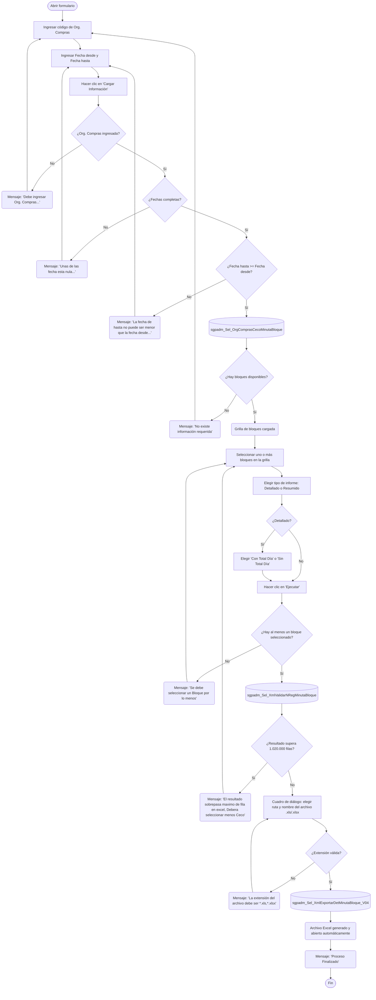

# Exportar Detalle Minuta Bloque

**Formulario:** `I_ExpDetMinBloque.frm`
**Tabla(s) principal(es):** `CAS_b_MinutaBloque` (bloques de minuta por casino y período), `cas_b_minuta` (cabecera de minutas), `cas_b_minutadet` (detalle de recetas por minuta)
**Consulta principal:** `sgpadm_Sel_XmlExportarDetMinutaBloque_V04` — procedimiento almacenado principal de exportación

---

## Índice

- [1 — ¿Para qué sirve esta pantalla?](#1--para-qué-sirve-esta-pantalla)
- [2 — ¿Qué necesito para usarla?](#2--qué-necesito-para-usarla)
- [3 — ¿Cómo se usa?](#3--cómo-se-usa)
  - [3.1 Flujo paso a paso](#31-flujo-paso-a-paso)
  - [3.2 Controles y acciones disponibles](#32-controles-y-acciones-disponibles)
- [4 — ¿Qué restricciones debo conocer?](#4--qué-restricciones-debo-conocer)
  - [4.1 Validaciones del sistema](#41-validaciones-del-sistema)
- [5 — ¿Qué obtengo?](#5--qué-obtengo)
  - [Descripción del reporte único](#descripción-del-reporte-único)
  - [Modo Detallado](#modo-detallado)
  - [Modo Resumido](#modo-resumido)
- [6 — Referencia técnica](#6--referencia-técnica)
  - [Tablas que intervienen](#tablas-que-intervienen)
  - [Relación con otros módulos](#relación-con-otros-módulos)

---

## 1 — ¿Para qué sirve esta pantalla?

[↑ Volver al índice](#índice)

Esta pantalla permite exportar a Excel el detalle de las minutas organizadas en bloques para uno o varios casinos que pertenezcan a una misma organización de compras. El resultado incluye, por cada bloque seleccionado, las recetas planificadas con sus raciones, porcentaje de ponderación, estructura de servicio y el costo estimado calculado según el tipo de precio configurado (convenio, precio de mercado promedio o precio de lista).

La pantalla se organiza en dos paneles. El panel superior, denominado "Org. Compras", concentra todos los filtros de búsqueda: el campo de organización de compras, el rango de fechas de vigencia del bloque, y las opciones que controlan el formato y nivel de detalle del archivo exportado. El panel inferior, denominado "Detalle Minuta Bloque", muestra la grilla de bloques disponibles para la organización y período indicados. Desde esa grilla el usuario selecciona los bloques que desea incluir en la exportación.

El formulario admite dos modos de salida: **Detallado**, que incluye una fila por receta planificada dentro de cada día del bloque y opcionalmente una fila de subtotal de costo al cierre de cada día; y **Resumido**, que consolida la información mostrando únicamente el costo total de la minuta por casino, régimen, servicio y fecha. Ambos modos producen un único archivo Excel con una sola hoja de cálculo.

---

## 2 — ¿Qué necesito para usarla?

[↑ Volver al índice](#índice)

| Campo | Descripción | Obligatorio |
|---|---|---|
| Org. Compras | Código de la organización de compras (máximo 10 caracteres). Permite filtrar los casinos asociados a esa organización. Debe ingresarse antes de hacer clic en "Cargar Información". | Sí |
| Fecha desde | Fecha de inicio del período de vigencia del bloque. El sistema inicializa este campo con la fecha actual al abrir el formulario. | Sí |
| Fecha hasta | Fecha de fin del período de vigencia del bloque. El sistema inicializa este campo con la fecha actual al abrir el formulario. | Sí |
| Tipo de informe (Detallado / Resumido) | Controla el nivel de detalle del archivo generado. "Detallado" entrega una fila por receta; "Resumido" entrega una fila por día con el costo total de la minuta. El valor por defecto es "Detallado". | Sí |
| Con Total Día / Sin Total Día | Solo disponible cuando el tipo de informe es "Detallado". Controla si el archivo incluye una fila de costo total al cierre de cada día. El valor por defecto es "Con Total Día". | Solo en modo Detallado |
| Selección de bloques en la grilla | Una vez cargada la grilla, el usuario debe marcar la casilla de selección de al menos un bloque. Es posible seleccionar varios bloques de distintos casinos de la misma organización. | Sí |
| Ruta y nombre del archivo Excel | El cuadro de diálogo de guardado que el sistema presenta antes de exportar. El archivo debe tener extensión `.xls` o `.xlsx`. | Sí |

---

## 3 — ¿Cómo se usa?

### 3.1 Flujo paso a paso

[↑ Volver al índice](#índice)



### 3.2 Controles y acciones disponibles

[↑ Volver al índice](#índice)

| Control / Acción | Descripción |
|---|---|
| **Campo Org. Compras** | Campo de texto donde se ingresa el código de la organización de compras. Al modificar su contenido, la grilla de bloques se vacía para forzar una nueva carga. |
| **Fecha desde** | Campo de fecha que define el inicio del período de búsqueda de bloques. Al modificarlo, la grilla de bloques se vacía automáticamente. |
| **Fecha hasta** | Campo de fecha que define el fin del período de búsqueda de bloques. Al modificarlo, la grilla de bloques se vacía automáticamente. |
| **Cargar Información** | Botón de la barra de herramientas (ícono de carga). Valida los filtros ingresados y consulta la base de datos para poblar la grilla con los bloques disponibles para la organización y fechas indicadas. |
| **Grilla de bloques** | Lista los bloques encontrados con las columnas: CECO, nombre del casino, ID de bloque, régimen, servicio y fechas desde/hasta del bloque. Permite filtrar filas escribiendo en los campos de texto ubicados debajo de las columnas CECO (col. 2), Régimen (col. 5) y Servicio (col. 6). Al hacer clic en el encabezado de la columna de selección, el sistema invierte el estado de selección de todas las filas visibles. |
| **Casilla de selección (col. 1 de la grilla)** | Marca o desmarca un bloque individual para incluirlo en la exportación. El valor "1" indica seleccionado; "0", no seleccionado. |
| **Filtros de texto en la grilla** | Campos de texto ubicados debajo de las columnas CECO, Régimen y Servicio. Al escribir en uno de ellos, la grilla oculta las filas que no coincidan con el texto ingresado. Solo puede estar activo uno a la vez; al escribir en uno se limpian los otros dos. |
| **Detallado / Resumido** | Opciones que controlan el nivel de detalle del archivo exportado. Al seleccionar "Resumido", el panel de opciones "Con Total Día / Sin Total Día" se oculta. |
| **Con Total Día / Sin Total Día** | Opciones visibles únicamente en modo Detallado. Controlan si el archivo incluye filas de subtotal de costo al cierre de cada día de la minuta. |
| **Ejecutar** | Inicia el proceso de exportación: valida la selección, verifica el volumen de datos, solicita el nombre del archivo y genera el Excel. |
| **Salir** | Cierra el formulario sin generar ningún archivo. |

---

## 4 — ¿Qué restricciones debo conocer?

### 4.1 Validaciones del sistema

[↑ Volver al índice](#índice)

| # | Cuándo aparece | Qué verifica el sistema | Qué ve o experimenta el usuario |
|---|---|---|---|
| 1 | Al hacer clic en "Cargar Información" | Que el campo de organización de compras no esté vacío | Mensaje: `Debe ingresar Org. Compras...` |
| 2 | Al hacer clic en "Cargar Información" | Que ambas fechas estén completas | Mensaje: `Unas de las fecha esta nula...` |
| 3 | Al hacer clic en "Cargar Información" | Que la fecha hasta no sea anterior a la fecha desde | Mensaje: `La fecha de hasta no puede ser menor que la fecha desde...` |
| 4 | Al hacer clic en "Cargar Información" y no hay resultados | Que la consulta devuelva al menos un bloque | Mensaje: `No existe información requerida`. La grilla queda vacía. |
| 5 | Al hacer clic en "Ejecutar" sin datos en la grilla | Que la grilla contenga al menos una fila | Mensaje: `Debe seleccionar datos del encabezado...` |
| 6 | Al hacer clic en "Ejecutar" sin selección marcada | Que al menos una fila tenga la casilla de selección marcada | Mensaje: `Se debe seleccionar un Bloque por lo menos` |
| 7 | Al hacer clic en "Ejecutar" después de marcar bloques | Que el volumen total de filas no supere el límite de Excel (1.020.000 filas) | Mensaje: `El resultado sobrepasa maximo de fila en excel, Debera seleccionar menos Ceco`. El proceso se detiene; el usuario debe desmarcar casinos. |
| 8 | En el cuadro de diálogo de guardado al cancelar | Que el usuario no haya cancelado el diálogo | Mensaje: `Proceso cancelado`. El proceso se interrumpe sin generar archivo. |
| 9 | En el cuadro de diálogo de guardado al confirmar | Que se haya ingresado un nombre de archivo | Mensaje: `Debe seleccionar la ruta y nombre de archivo` |
| 10 | En el cuadro de diálogo de guardado al confirmar | Que la extensión del archivo sea `.xls` o `.xlsx` | Mensaje: `La extensión del archivo debe ser (*.xls,*.xlsx)` |

---

## 5 — ¿Qué obtengo?

### Descripción del reporte único

[↑ Volver al índice](#índice)

Este formulario genera un único archivo Excel con una sola hoja de cálculo. El contenido varía según el modo elegido: **Detallado** o **Resumido**. No hay un selector de tipo de informe con códigos; la elección se realiza mediante los botones de opción descritos en la sección anterior.

El archivo se genera a partir de los bloques seleccionados en la grilla, procesando cada par casino/bloque de forma individual. El sistema calcula el costo de cada receta cruzando los ingredientes de la receta con los precios disponibles para la organización de compras y el período del bloque (convenio SAP como precio principal para el modo `@OpPrecio = 1`). Los datos se ordenan por casino, régimen, servicio, fecha y número de línea de la minuta.

---

### Modo Detallado

[↑ Volver al índice](#índice)

**Qué muestra:** Una fila por cada receta planificada dentro de cada día del bloque seleccionado, con el costo calculado para esa receta. Si la opción "Con Total Día" está activa, el sistema agrega al final de cada día una fila especial que muestra el costo total del día por comensal.

**Opciones de configuración disponibles:**
- **Con Total Día / Sin Total Día:** cuando está activo "Con Total Día", el archivo incluye filas de subtotal al cierre de cada combinación casino/régimen/servicio/fecha. Estas filas de subtotal muestran el texto `Costo Total Día : DD/MM/AAAA` en la columna de organización de compras, y las columnas de identificación (casino, régimen, servicio, estructura) aparecen en blanco.

**Estructura de datos del informe:**

| Campo / Columna | Descripción | Calculado |
|---|---|---|
| Org. Compras | Código de la organización de compras. En las filas de total día muestra el texto `Costo Total Día : DD/MM/AAAA`. | No |
| Ceco | Código del casino. En las filas de total día aparece en blanco. | No |
| Cód. Régimen | Código numérico del régimen alimenticio. En las filas de total día aparece en blanco. | No |
| Nom. Régimen | Nombre del régimen alimenticio. | No |
| Cód. Servicio | Código numérico del servicio (desayuno, almuerzo, cena, etc.). En las filas de total día aparece en blanco. | No |
| Nom. Servicio | Nombre del servicio. | No |
| Cód. Estructura | Código de la estructura de servicio (posición dentro del menú: entrada, fondo, postre, etc.). En las filas de total día aparece en blanco. | No |
| Nom. Estructura | Nombre de la estructura de servicio. | No |
| Fecha Minuta | Fecha del día de la minuta en formato DD/MM/AAAA. En las filas de total día aparece en blanco (o con formato numérico cuando la opción "Sin Total Día" está activa). | No |
| Cód. Receta | Código de la receta planificada. En las filas de total día aparece en blanco. | No |
| Nom. Receta | Nombre de la receta. Si la receta tiene unidad de receta definida, incluye entre corchetes la descripción corta de esa unidad. En las filas de total día aparece en blanco. | No |
| Ponderación | Porcentaje de ponderación de la estructura de servicio dentro del total del día. En las filas de total día aparece en blanco. | No |
| Raciones | Cantidad de raciones planificadas para esa receta en ese día. En las filas de total día aparece en blanco. | No |
| Comensales | Número de comensales teóricos del día según la minuta. En las filas de total día se muestra el valor real. | No |
| Núm. Línea | Número de línea de la receta dentro de la minuta. En las filas de total día aparece en blanco. | No |
| Costo Receta | Costo calculado de la receta por ración, o costo total del día por comensal en las filas de subtotal. | Sí |
| Receta Reemplaza | Columna reservada, se entrega vacía. | No |

**Cálculo — Costo Receta**

El costo de cada receta representa el gasto estimado por ración, calculado multiplicando el gramaje de cada ingrediente por el precio unitario del producto correspondiente (convertido a la misma unidad de medida mediante el factor de conversión del formato de compra), y sumando el resultado para todos los ingredientes.

**Fórmula o lógica:**

Para cada ingrediente de la receta:
```
Costo_ingrediente = (Precio_por_formato / Factor_conversión_formato) × Gramaje_ingrediente
```
Costo_receta = SUM(Costo_ingrediente) para todos los ingredientes de la receta en ese día.

El precio utilizado se selecciona según la siguiente prioridad (con `@OpPrecio = 1`, modo convenio):
1. Precio de convenio SAP vigente para la organización de compras y el período del bloque (condición preferente).
2. Si no hay convenio, el proceso devuelve costo cero para ese ingrediente.

| Componente | Qué representa | De dónde viene |
|---|---|---|
| Precio_por_formato | Precio del producto en la unidad de compra según el convenio SAP activo para la organización | Tablas de convenios vía SP `PA_sgpadm_CostoMinutaProducto` |
| Factor_conversión_formato | Cuántas unidades base contiene el formato de compra (ej. kg por caja) | Campo `pro_facing` en `b_productos` |
| Gramaje_ingrediente | Cantidad bruta del ingrediente en la receta, en gramos o la unidad de la receta, ajustada por la tabla de gramajes por casino si existe | Campos `red_canpro` / `tgc_cantgr` en `b_recetadet` / `b_tablagramajececo` |

> Ejemplo: ingrediente harina con gramaje 250 g, precio de convenio $1.200 por saco de 25 kg (factor 25.000 g). Costo_ingrediente = (1.200 / 25.000) × 250 = $12. Si la receta tiene 3 ingredientes con costos $12, $8 y $5, el Costo_receta = $25.

**Cálculo — Costo Total Día (filas de subtotal)**

Las filas de total día muestran el costo total diario dividido por el número de comensales teóricos de ese día.

**Fórmula o lógica:**
```
Costo_total_día = SUM(Raciones_receta × Costo_receta) para todas las recetas del día
Costo_por_comensal = Costo_total_día / Comensales_teóricos_del_día
```

| Componente | Qué representa | De dónde viene |
|---|---|---|
| Raciones_receta | Cantidad de raciones planificadas para la receta en ese día | Campo `mid_numrac` en `cas_b_minutadet` |
| Costo_receta | Costo calculado por ración (descrito arriba) | Calculado por SP |
| Comensales_teóricos_del_día | Número de comensales teóricos registrados en la cabecera de la minuta | Campo `min_racteo` en `cas_b_minuta` |

> Ejemplo: día con 3 recetas cuyos costos son $25, $18 y $12 con raciones 100, 100 y 100 respectivamente. Costo_total_día = (100×25) + (100×18) + (100×12) = $5.500. Con 98 comensales teóricos: Costo_por_comensal = $5.500 / 98 ≈ $56,12.

**Formato de salida:** Excel. Una única hoja de cálculo (`Hoja1`). El usuario elige la ruta y nombre del archivo mediante cuadro de diálogo de guardado. La primera fila contiene los encabezados de columna tomados directamente de los nombres de campo del resultado de la consulta. Los datos comienzan en la fila 2. El archivo se abre automáticamente en modo de solo lectura al finalizar el proceso. Las columnas se ajustan automáticamente al contenido.

---

### Modo Resumido

[↑ Volver al índice](#índice)

**Qué muestra:** Una fila por cada combinación de casino, régimen, servicio y fecha de minuta, mostrando únicamente el costo total de la minuta para ese día. No incluye el detalle de recetas individuales. Solo se incluyen los días que tengan comensales teóricos registrados (distinto de cero).

**Estructura de datos del informe:**

| Campo / Columna | Descripción | Calculado |
|---|---|---|
| Org. Compras | Código de la organización de compras. | No |
| Ceco | Código del casino. | No |
| Cód. Régimen | Código numérico del régimen. | No |
| Nom. Régimen | Nombre del régimen. | No |
| Cód. Servicio | Código numérico del servicio. | No |
| Nom. Servicio | Nombre del servicio. | No |
| Fecha Minuta | Fecha del día en formato DD/MM/AAAA. | No |
| Costo Minuta Día | Costo total de la minuta para ese día, calculado como la suma del producto raciones × costo_receta para todas las recetas del día dividido por los comensales teóricos. | Sí |

**Cálculo — Costo Minuta Día**

Equivalente al cálculo de las filas de subtotal del modo Detallado (ver cálculo "Costo Total Día" en la sección anterior). El sistema filtra y solo entrega filas donde el número de comensales teóricos del día sea distinto de cero.

**Formato de salida:** Excel. Una única hoja de cálculo (`Hoja1`). El usuario elige la ruta y nombre del archivo mediante cuadro de diálogo de guardado. La primera fila contiene los encabezados de columna. Los datos comienzan en la fila 2. El archivo se abre automáticamente en modo de solo lectura al finalizar el proceso. Las columnas se ajustan automáticamente al contenido.

---

## 6 — Referencia técnica

### Tablas que intervienen

[↑ Volver al índice](#índice)

| Tabla | Para qué se usa en este reporte | Campos clave |
|---|---|---|
| `CAS_b_MinutaBloque` | Fuente principal. Contiene la definición de cada bloque de minuta: el casino al que pertenece, el régimen, el servicio y el rango de fechas de vigencia del bloque. | `ID_Bloque`, `Ceco`, `Regimen`, `Servicio`, `FechaDesde`, `FechaHasta` |
| `cas_b_minuta` | Cabecera de cada minuta diaria dentro del bloque. Aporta la fecha, el régimen, el servicio y el número de comensales teóricos del día. | `min_codigo`, `min_cecori`, `min_codreg`, `min_codser`, `min_fecmin`, `min_racteo`, `ID_Bloque` |
| `cas_b_minutadet` | Detalle de recetas por minuta. Aporta el número de raciones planificadas, el porcentaje de ponderación y la estructura de servicio para cada receta de cada día. | `mid_cecori`, `mid_codigo`, `mid_codrec`, `mid_numrac`, `mid_porrac`, `mid_estser`, `mid_numlin` |
| `b_receta` | Catálogo de recetas. Aporta el nombre, la unidad de receta y otros atributos de cada receta. | `rec_codigo`, `rec_nombre`, `cod_uniReceta`, `rec_indppr`, `rec_fecvig` |
| `b_recetadet` | Detalle de ingredientes de cada receta con sus gramajes base. | `red_codigo`, `red_codpro`, `red_canpro`, `red_numlin` |
| `b_ingrediente` | Catálogo de ingredientes. Relaciona el ingrediente con sus productos de compra. | `ing_codigo`, `ing_indppr` |
| `b_productosing` | Tabla de relación entre ingredientes y productos de compra. | `pri_coding`, `pri_codpro` |
| `b_productos` | Catálogo de productos de compra. Aporta el nombre, el factor de conversión de formato y la fecha de vencimiento del producto. | `pro_codigo`, `pro_nombre`, `pro_facing`, `pro_indppr`, `pro_fecven` |
| `b_clientes` | Catálogo de casinos (clientes). Aporta el nombre del casino y su tipo para identificar si es un sitio real o propuesta. | `cli_codigo`, `cli_nombre`, `cli_tipo`, `cli_tipoceco`, `cli_tipoformatocompras` |
| `a_regimen` | Catálogo de regímenes alimenticios. Aporta el nombre del régimen. | `reg_codigo`, `reg_nombre` |
| `a_servicio` | Catálogo de servicios (desayuno, almuerzo, cena, etc.). Aporta el nombre del servicio. | `ser_codigo`, `ser_nombre`, `ser_activo` |
| `a_estservicio` | Catálogo de estructuras de servicio (posición dentro del menú). Aporta el código y nombre de cada posición y su grupo de agrupación. | `ess_codigo`, `ess_nombre`, `ess_agrupacionestructura` |
| `cas_b_minutagrupoestructura` | Tabla de ponderaciones por grupo de estructura para cada bloque y casino. Aporta el porcentaje de ponderación total del grupo. | `mge_cencos`, `mge_id_bloque`, `mge_grupoestructura`, `mge_ponderaciontotal` |
| `b_tablagramajececo` | Tabla de ajustes de gramaje específicos por casino y régimen. Permite reemplazar el gramaje base de la receta por uno personalizado para un casino determinado. | `tgc_ceco`, `tgc_codreg`, `tgc_codrec`, `tgc_coding`, `tgc_codins`, `tgc_cantgr` |
| `b_UnidadReceta` | Catálogo de unidades de receta. Aporta la descripción corta que se agrega entre corchetes al nombre de la receta en el informe detallado. | `Codigo_unidad`, `DescripcionCorta` |
| `I_ORG_CECO` | Tabla de relación entre organizaciones de compras y casinos. Permite filtrar los casinos que pertenecen a una organización de compras específica. | `ID_ORGCOMPRA`, `ID_CECO`, `borrado` |

### Relación con otros módulos

[↑ Volver al índice](#índice)

| Módulo | Relación |
|---|---|
| **Minutas / Planificación** | Los bloques de minuta y el detalle de recetas planificadas son generados y mantenidos por el módulo de minutas. Este reporte los consume en modo de solo lectura para generar la exportación. |
| **Maestro de Recetas** | Las recetas, su detalle de ingredientes y los gramajes base provienen del módulo de recetas. Este reporte los utiliza para calcular el costo de cada receta planificada. |
| **Convenios SAP / Precios** | Los precios de los productos utilizados en el cálculo de costos provienen de las tablas de convenios cargadas desde SAP. El SP `PA_sgpadm_CostoMinutaProducto` consulta estos precios según la organización de compras y el período del bloque. |
| **Maestro de Casinos y Estructuras** | Los catálogos de regímenes, servicios, estructuras de servicio y datos del casino (comensales, tipo de formato de compras) son gestionados por el módulo de contratos y configuración de casinos. |

---

*Fuentes: `I_ExpDetMinBloque.frm`, SP `sgpadm_Sel_XmlExportarDetMinutaBloque_V04` en `SGP_Admin.sql`, SP `sgpadm_Sel_OrgComprasCecoMinutaBloque` en `SGP_Admin.sql`, SP `sgpadm_Sel_XmlValidarNRegMinutaBloque` en `SGP_Admin.sql`, SP `PA_sgpadm_CostoMinutaProducto` en `SGP_Admin.sql`, tablas `CAS_b_MinutaBloque`, `cas_b_minuta`, `cas_b_minutadet`, `b_receta`, `b_recetadet`, `b_productos`, `I_ORG_CECO` en `SGP_Admin.sql`*
