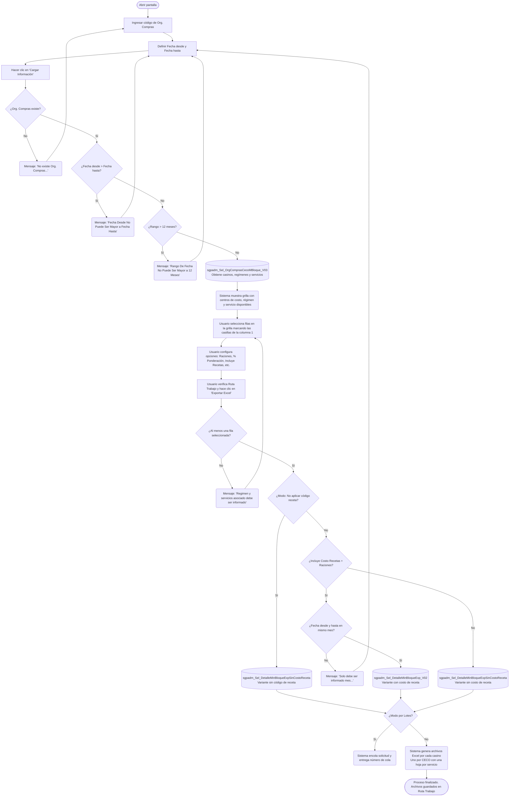

# Exportar Excel Minuta Bloque

**Formulario:** `I_ExpMinBlo.frm`
**Tabla(s) principal(es):** `cas_b_minuta` (cabecera de minutas por casino/régimen/servicio), `cas_b_minutadet` (detalle de recetas por línea de minuta), `CAS_b_MinutaBloque` (asignación de minutas a bloques)
**Consulta principal:** `sgpadm_Sel_DetalleMinBloqueExp_V02` (con costo de receta) / `sgpadm_Sel_DetalleMinBloqueExpSinCostoReceta` (sin costo de receta)

---

## Índice

- [1 — ¿Para qué sirve esta pantalla?](#1--para-qué-sirve-esta-pantalla)
- [2 — ¿Qué necesito para usarla?](#2--qué-necesito-para-usarla)
- [3 — ¿Cómo se usa?](#3--cómo-se-usa)
  - [3.1 Flujo paso a paso](#31-flujo-paso-a-paso)
  - [3.2 Controles y acciones disponibles](#32-controles-y-acciones-disponibles)
- [4 — ¿Qué restricciones debo conocer?](#4--qué-restricciones-debo-conocer)
  - [4.1 Validaciones del sistema](#41-validaciones-del-sistema)
- [5 — ¿Qué obtengo?](#5--qué-obtengo)
  - [Tres variantes de exportación](#tres-variantes-de-exportación)
  - [Variante A: Con código de receta y sin costo (`ExportarExcelMinutaBloqueSinCostoReceta`)](#variante-a-con-código-de-receta-y-sin-costo-exportarexcelminutabloquesincostoreceta)
  - [Variante B: Con código de receta y con costo (`ExportarExcelMinutaBloqueCostoReceta`)](#variante-b-con-código-de-receta-y-con-costo-exportarexcelminutabloquecostoreceta)
  - [Variante C: Sin código de receta (`ExportarExcelMinutaBloqueSinCodigoReceta`)](#variante-c-sin-código-de-receta-exportarexcelminutabloquesincódigoreceta)
- [6 — Referencia técnica](#6--referencia-técnica)
  - [Tablas que intervienen](#tablas-que-intervienen)
  - [Procedimientos almacenados que intervienen](#procedimientos-almacenados-que-intervienen)
  - [Relación con otros módulos](#relación-con-otros-módulos)

---

## 1 — ¿Para qué sirve esta pantalla?
[↑ Volver al índice](#índice)

Esta pantalla permite exportar a Excel el contenido de la minuta bloque de uno o varios casinos para un período de fechas. La minuta bloque organiza las recetas planificadas por día, régimen y servicio; el archivo Excel resultante replica esa estructura con cada día del período como columna, de modo que quien lo recibe puede leer de un vistazo qué receta estaba planificada en cada posición del menú para cada fecha.

La pantalla se organiza en tres zonas: una barra de filtros en la parte superior donde se ingresa el código de organización de compras y el rango de fechas; una grilla central que, al cargar, muestra todos los casinos (centros de costo), regímenes y servicios disponibles para esa organización y ese período; y un panel de opciones a la derecha que define qué columnas adicionales aparecerán en el Excel (raciones, porcentaje de ponderación, costo de plato). El archivo se guarda automáticamente en la ruta de trabajo configurada en la sesión.

El formulario ofrece tres modos de exportación que se activan según la combinación de casillas marcadas: exportación sin costo de receta (modo estándar), exportación con costo de receta calculado sobre la base de precios de la organización de compras, y exportación sin código de receta (solo nombre). Adicionalmente, existe la opción de generar el reporte en modo por lotes, en cuyo caso la solicitud queda encolada para ser procesada de forma diferida por el sistema.

---

## 2 — ¿Qué necesito para usarla?
[↑ Volver al índice](#índice)

| Campo | Descripción | Obligatorio |
|---|---|---|
| **Org. Compras** | Código de la organización de compras (por ejemplo, `CL14`). Determina qué casinos quedan disponibles en la grilla de selección. Si el código no existe en el sistema, el proceso se detiene con aviso. | Sí |
| **Fecha desde** | Fecha de inicio del período a exportar, en formato `dd/mm/yyyy`. Al abrir el formulario se establece automáticamente en la fecha del día. | Sí |
| **Fecha hasta** | Fecha de fin del período a exportar, en formato `dd/mm/yyyy`. Al abrir el formulario se establece automáticamente en la fecha del día. | Sí |
| **Ruta Trabajo** | Carpeta de destino donde se guardarán los archivos Excel generados. El sistema toma la ruta de trabajo configurada en la sesión del usuario. Se puede cambiar usando el botón de exploración junto al campo. | Sí |
| **Raciones** (casilla) | Cuando está marcada, el Excel incluye una columna de raciones junto a cada día. | No |
| **% Ponderación Día** (casilla) | Cuando está marcada, el Excel incluye una columna con el porcentaje de ponderación diaria junto a cada día. Al activarse, aparece adicionalmente la casilla "Aplicar formula porcentaje". | No |
| **No aplicar código receta** (casilla) | Cuando está marcada, el Excel muestra solo el nombre de la receta, sin el código numérico asociado. Este modo usa una variante de exportación distinta. | No |
| **Incluye Recetas** (casilla) | Cuando está marcada, se agrega al libro Excel una hoja adicional llamada "Recetas" con el catálogo de recetas activas del casino. Al activarse, aparece adicionalmente la casilla "Incluye Costo Recetas" y el botón de filtro de categoría dietética y tipo de plato. | No |
| **Incluye Costo Recetas** (casilla, visible solo si "Incluye Recetas" está activa) | Incorpora el costo calculado de cada receta en la hoja "Recetas" del libro Excel. Solo disponible cuando "Incluye Recetas" está marcada y "No aplicar código receta" está desmarcada. | No |
| **Filtro C.Dietica y Tipo Plato** (botón, visible solo si "Incluye Recetas" está activa) | Abre un selector auxiliar donde se eligen las categorías dietéticas y tipos de plato a incluir en la hoja de recetas. | No |
| **Generar Reporte por Lotes** (casilla) | Cuando está marcada, la exportación no se realiza en el momento sino que la solicitud queda encolada para ser procesada en diferido. El sistema entrega un número de solicitud como confirmación. | No |

---

## 3 — ¿Cómo se usa?
[↑ Volver al índice](#índice)

### 3.1 Flujo paso a paso
[↑ Volver al índice](#índice)

### 3.2 Controles y acciones disponibles
[↑ Volver al índice](#índice)

| Control / Acción | Descripción |
|---|---|
| **Campo Org. Compras** | El usuario ingresa el código de organización de compras. Al modificarlo, la grilla se vacía y debe cargarse nuevamente. |
| **Campo Fecha desde** | Define el inicio del período. Al modificarlo, la grilla se vacía. |
| **Campo Fecha hasta** | Define el fin del período. Al modificarlo, la grilla se vacía. |
| **Botón "Cargar Información"** | Consulta la base de datos y llena la grilla con todos los centros de costo, regímenes y servicios que tienen datos de minuta en el rango indicado. Realiza validaciones de Org. Compras y rango de fechas antes de cargar. |
| **Grilla de selección** (centros de costo) | Muestra el listado de centros de costo, regímenes y servicios disponibles. La columna 1 actúa como casilla de selección: al hacer clic o seleccionar un bloque de filas, se marca o desmarca. Las columnas 2–7 muestran código CECO, nombre cliente, código régimen, nombre régimen, código servicio y nombre servicio. |
| **Campos de búsqueda en la grilla** | Hay seis campos de texto sobre la grilla (columnas 2 a 7) que permiten filtrar filas en tiempo real al presionar Enter. Al ingresar texto en uno de ellos, los demás campos de búsqueda se limpian. Se puede ingresar varios valores separados por coma para buscar múltiples términos simultáneamente. |
| **Casilla "Raciones"** | Agrega una columna "Rac." por cada día en el Excel. Si se activa junto con "% Ponderación Día", aparecen adicionalmente los botones de radio para elegir el modo de cálculo de ponderación. |
| **Casilla "% Ponderación Día"** | Agrega una columna "% Pond." por cada día en el Excel. Al activarse, muestra la casilla "Aplicar formula porcentaje". |
| **Casilla "No aplicar código receta"** | Cambia el modo de exportación para omitir el código numérico de la receta en la celda, mostrando solo el nombre. |
| **Casilla "Incluye Recetas"** | Al marcarse, activa la casilla "Incluye Costo Recetas" y el botón "Filtro C.Dietica y Tipo Plato". Cuando se exporta, se agrega una hoja "Recetas" al libro Excel de cada casino. |
| **Casilla "Incluye Costo Recetas"** (visible al marcar "Incluye Recetas") | Agrega el costo promedio de cada receta en la hoja "Recetas". Solo disponible cuando no está activo el modo "No aplicar código receta". |
| **Botón "Filtro C.Dietica y Tipo Plato"** (visible al marcar "Incluye Recetas") | Abre un selector auxiliar con árbol de categorías dietéticas y tipos de plato. Los valores seleccionados se usan como filtro al construir la hoja de recetas con costo. |
| **Botones de radio "Permite habilitar la columna Raciones" / "Permite habilitar la columna % Ponderaciones"** (visibles solo si Raciones y % Ponderación están ambas activas) | Determinan cuál de las dos columnas queda editable en el Excel protegido con contraseña y cuál queda bloqueada como referencia. |
| **Campo Ruta Trabajo** | Muestra la carpeta de destino donde se guardarán los archivos generados. El usuario puede cambiarla con el botón de búsqueda de carpetas que se encuentra junto al campo; si la carpeta no tiene permisos de escritura, el sistema muestra un aviso y restaura la ruta anterior. |
| **Casilla "Generar Reporte por Lotes"** | Cuando está activa, al presionar "Exportar Excel" el sistema encola la solicitud en lugar de ejecutarla de inmediato, y confirma con el número asignado a la solicitud. |
| **Botón "Exportar Excel"** | Inicia el proceso de exportación según la configuración actual. Genera un archivo Excel por cada casino seleccionado, con una hoja por servicio. Muestra una barra de progreso mientras procesa. Al terminar, muestra el mensaje "Proceso Finalizado Correctamente". |
| **Botón "Salir"** | Cierra el formulario. |

---

## 4 — ¿Qué restricciones debo conocer?
[↑ Volver al índice](#índice)

### 4.1 Validaciones del sistema
[↑ Volver al índice](#índice)

| # | Cuándo aparece | Qué verifica el sistema | Qué ve o experimenta el usuario |
|---|---|---|---|
| 1 | Al cargar la grilla o al exportar | Que el código de Org. Compras ingresado exista en la base de datos | Mensaje: `No existe Org. Compras...` El proceso se detiene. |
| 2 | Al cargar la grilla o al exportar | Que la fecha desde no sea posterior a la fecha hasta | Mensaje: `Fecha Desde No Puede Ser Mayor a Fecha Hasta` La fecha desde se restablece a la fecha actual. |
| 3 | Al cargar la grilla o al exportar | Que la fecha hasta no sea anterior a la fecha desde | Mensaje: `Fecha Hasta No Puede Ser Mayor a Fecha Desde` La fecha hasta se restablece a la fecha actual. |
| 4 | Al cargar la grilla o al exportar | Que el rango entre fecha desde y fecha hasta no supere 12 meses (365 días) | Mensaje: `Rango De Fecha No Puede Ser Mayor a 12 Meses` La grilla se vacía. |
| 5 | Al hacer clic en "Exportar Excel" | Que al menos una fila de la grilla esté marcada (seleccionada) | Mensaje: `Regimen y servicios asociado debe ser informado` El proceso se detiene. |
| 6 | Al hacer clic en "Exportar Excel" con el modo "Incluye Costo Recetas" + "Raciones" activos | Que la fecha desde y la fecha hasta correspondan al mismo mes calendario | Mensaje: `Solo debe ser informado mes...` El proceso se detiene. El usuario debe ajustar el rango para que quede dentro de un único mes. |
| 7 | Al cambiar la ruta de trabajo | Que la carpeta seleccionada exista y tenga permisos de escritura | Mensaje: `La carpeta <ruta> no está disponible o bien no tiene permiso de escritura.` La ruta vuelve al valor anterior. |
| 8 | El botón "Exportar Excel" solo está habilitado | Si el usuario tiene permiso de exportación en el sistema | El botón aparece deshabilitado para usuarios sin permiso. No se muestra mensaje; simplemente no se puede hacer clic. |

---

## 5 — ¿Qué obtengo?
[↑ Volver al índice](#índice)

### Tres variantes de exportación
[↑ Volver al índice](#índice)

Este formulario no tiene un selector desplegable de tipo de informe. En cambio, el modo de exportación se determina automáticamente según la combinación de casillas marcadas al presionar "Exportar Excel":

| Condición activa | Variante que se ejecuta | Procedimiento almacenado de detalle |
|---|---|---|
| "No aplicar código receta" marcada (cualquier otra combinación) | Variante C: Sin código de receta | `sgpadm_Sel_DetalleMinBloqueExpSinCostoReceta` |
| "No aplicar código receta" desmarcada + "Incluye Costo Recetas" marcada + "Raciones" marcada | Variante B: Con costo de receta | `sgpadm_Sel_DetalleMinBloqueExp_V02` |
| "No aplicar código receta" desmarcada + "Incluye Costo Recetas" desmarcada (o "Raciones" desmarcada) | Variante A: Sin costo de receta | `sgpadm_Sel_DetalleMinBloqueExpSinCostoReceta` |

En todos los casos el sistema genera **un archivo Excel por cada casino (CECO) seleccionado**, con una hoja por cada servicio que tenga datos en el período. Los archivos se guardan en la ruta de trabajo configurada con el nombre: `<CECO>-<Nombre cliente> <FechaDesde> <FechaHasta> <FechaHoraGeneracion>.xlsx`.

---

### Variante A: Con código de receta y sin costo (`ExportarExcelMinutaBloqueSinCostoReceta`)
[↑ Volver al índice](#índice)

**Qué muestra:** El Excel presenta la minuta bloque del período seleccionado, con cada día como columna y cada posición del menú (línea dentro de la estructura del servicio) como fila. Cada celda contiene el nombre de la receta más su código numérico. Es la variante estándar para consulta operativa cuando no se necesita información de costos.

**Cómo se seleccionan los servicios:** A través de la grilla principal del formulario. Cada fila representa una combinación única de CECO, régimen y servicio. El usuario marca las que desea exportar.

**Opciones de configuración disponibles:**

- **Raciones:** Cuando está activa, agrega por cada día una columna adicional con la cantidad de raciones planificadas (`Rac.`).
- **% Ponderación Día:** Cuando está activa, agrega por cada día una columna adicional con el porcentaje de ponderación de la receta dentro del total del día (`% Pond.`).
- **Incluye Recetas:** Agrega una hoja adicional "Recetas" al libro con el catálogo de recetas activas del casino (código, nombre, categoría dietética, tipo de plato).

**Estructura de datos del informe:**

| Campo / Columna | Descripción | Calculado |
|---|---|---|
| Encabezado fila 1 | Nombre del centro de costo (casino) y código CECO | No |
| Encabezado fila 2 | Nombre del régimen y código de régimen | No |
| Encabezado fila 5 (columna A) | Etiqueta "Estructura Servicio" | No |
| Encabezado fila 5 (columnas de días) | Abreviatura del día de la semana y fecha (`Lun 01/01/2024`, etc.) | Sí |
| Encabezado columna "Rac." (opcional) | Encabezado de raciones por día | No |
| Encabezado columna "% Pond." (opcional) | Encabezado de porcentaje de ponderación por día | No |
| Columna A (filas de datos) | Nombre de la estructura del servicio (agrupador de filas del menú) | No |
| Celda de receta por día | Nombre de la receta seguido del código numérico (`Ensalada de tomate 12345`) | No |
| Raciones por día (opcional) | Número de raciones planificadas para esa receta en ese día | No |
| % Ponderación por día (opcional) | Porcentaje que representa esta receta sobre el total del día, expresado con el símbolo `%` | No |
| Fila "Comensales" (al pie de cada día, opcional, si Raciones activa) | Total de comensales (raciones totales) del día | No |

**Cálculo — Encabezado de fechas**

El sistema determina automáticamente el rango real de días con datos consultando la fecha mínima y máxima de la minuta en el período indicado. El encabezado de cada columna se construye con los primeros cuatro caracteres del nombre del día de la semana (abreviado) más la fecha completa.

**Fórmula o lógica:**
Rango de columnas = `sgpadm_Sel_MinBloqueMinMax` devuelve `FecMin` y `FecMax` → el sistema itera desde `FecMin` hasta `FecMax` generando una columna por día.

| Componente | Qué representa | De dónde viene |
|---|---|---|
| `FecMin` | Primera fecha con datos de minuta en el período y servicio | SP `sgpadm_Sel_MinBloqueMinMax`, campo `FecMin` |
| `FecMax` | Última fecha con datos de minuta en el período y servicio | SP `sgpadm_Sel_MinBloqueMinMax`, campo `FecMax` |

> Ejemplo: Si el período solicitado es 01/01/2024 al 31/01/2024 pero el casino solo tiene minutas del 08/01 al 26/01, el Excel tendrá columnas solo para esas 19 fechas.

**Formato de salida:** Excel (`.xlsx`). Una hoja por servicio dentro del libro. Si se activa la opción "Incluye Recetas", se agrega adicionalmente una hoja "Recetas". Encabezado en filas 1–2 con nombre del casino y régimen; encabezados de columna en fila 5; datos desde fila 6. El ancho de columnas se ajusta automáticamente al contenido. Si se activan "% Ponderación Día" y la opción de fórmula, la hoja queda protegida con contraseña contra edición accidental, y la columna de raciones o la de ponderación queda editable según la opción de radio seleccionada. Los archivos se guardan directamente en la ruta de trabajo; si la ruta de trabajo difiere de la carpeta de generación temporal, el sistema copia el archivo y elimina la copia temporal.

---

### Variante B: Con código de receta y con costo (`ExportarExcelMinutaBloqueCostoReceta`)
[↑ Volver al índice](#índice)

**Qué muestra:** Igual que la Variante A, pero agrega para cada día dos columnas adicionales de costo: "Cto. Plato" (costo unitario de la receta, obtenido del catálogo de costos) y "Cto. Plato Pon." (costo ponderado de la receta en función de su participación en el total del día). Además, en la hoja de cada servicio aparecen filas de resumen con el costo de bandeja planificado y el costo de bandeja del sitio. La hoja "Recetas" incluye también el costo promedio de cada receta.

**Restricciones propias de este modo:** La fecha desde y la fecha hasta deben estar dentro del mismo mes calendario. Si el rango abarca dos meses distintos, el sistema lo impide con el mensaje `Solo debe ser informado mes...`.

**Cómo se seleccionan los servicios:** Igual que en la Variante A, a través de la grilla principal.

**Opciones de configuración disponibles:**

- **Raciones:** Obligatoria para activar este modo (la variante con costo requiere que "Raciones" esté marcada). Agrega la columna `Rac.` por día.
- **% Ponderación Día:** Cuando está activa junto con la opción de fórmula (casilla "Aplicar formula porcentaje"), el sistema inscribe fórmulas Excel en la columna de ponderación o raciones que se recalculan al editar los valores. La hoja queda protegida con contraseña.
- **Botones de radio** (visibles cuando Raciones y % Ponderación están ambas activas):
  - **"Permite habilitar la columna Raciones":** La columna de raciones queda editable; el porcentaje se recalcula como fórmula. Color gris en la columna de raciones.
  - **"Permite habilitar la columna % Ponderaciones":** La columna de porcentaje queda editable; las raciones se calculan en función del porcentaje. Color gris en la columna de porcentaje.
- **Filtro C.Dietica y Tipo Plato:** Filtra qué recetas se incluyen en la hoja "Recetas" al cargar su costo.

**Estructura de datos del informe:**

| Campo / Columna | Descripción | Calculado |
|---|---|---|
| Encabezado fila 1 | Nombre del casino y código CECO | No |
| Encabezado fila 2 | Nombre del régimen y código de régimen; etiqueta "Costo Bandeja Planificado" (col. B) | No |
| Fila 3 | Etiqueta "Costo Bandeja Sitio" (col. A); valor en col. B | Sí |
| Fila 6 | "Costo Planificación" (col. A); valor por día en columna correspondiente | Sí |
| Fila 7 | "Costo Sitio" (col. A) | Sí |
| Encabezado fila 8 (columna A) | Etiqueta "Estructura Servicio" | No |
| Encabezado fila 8 (columnas de días) | Abreviatura del día y fecha | Sí |
| Encabezado columna "Rac." (opcional) | Raciones por día | No |
| Encabezado columna "% Pond." (opcional) | Porcentaje de ponderación por día | No |
| Encabezado columna "Cto. Plato" | Costo unitario del plato | Sí |
| Encabezado columna "Cto. Plato Pon." | Costo ponderado del plato en el día | Sí |
| Columna A (filas de datos) | Nombre de la estructura del servicio (con código de estructura adjunto) | No |
| Celda de receta por día | Nombre de la receta seguido del código numérico | No |
| Raciones por día | Número de raciones planificadas para esa receta | No |
| % Ponderación por día | Porcentaje de la receta sobre el total del día | No |
| Cto. Plato por día | Costo unitario de la receta, buscado en el catálogo de costos del casino | Sí |
| Cto. Plato Pon. por día | Costo de la receta ponderado por su participación en el total del día | Sí |
| Fila "Comensales" (pie de cada día) | Total de comensales planificados en ese día | No |
| Fila "Costo Bandeja Planificado" (fila 2) | Costo por comensal calculado sobre el total de recetas y raciones del período | Sí |
| Fila "Costo Bandeja Sitio" (fila 3) | Costo ponderado por comensal del período completo | Sí |

**Cálculo — Costo Plato Ponderado (`Cto. Plato Pon.`)**

Representa cuánto aporta en costo esta receta al costo total del día, ponderado por la cantidad de raciones que se sirven.

**Fórmula o lógica:**
Costo Plato Ponderado = (Costo Unitario Receta × Raciones de la Receta) ÷ Total Raciones del Día

| Componente | Qué representa | De dónde viene |
|---|---|---|
| Costo Unitario Receta | Costo promedio de la receta calculado a través de SP de valorización | SP `sgpadm_Sel_XMLResumenCostoReceta_Excel_V03` → campo `promedioreceta` |
| Raciones de la Receta | Número de raciones planificadas para esa receta en ese día | `cas_b_minutadet.mid_numrac` |
| Total Raciones del Día | Total de comensales planificados para ese servicio en ese día | `cas_b_minuta.min_racteo` |

> Ejemplo: Si una receta tiene costo $1.200, se planifican 80 raciones de ella y el día tiene 200 comensales totales, el costo ponderado es ($1.200 × 80) / 200 = $480.

**Cálculo — Costo Planificación**

Es el costo total ponderado acumulado de todas las recetas del servicio en un día. Se coloca en la fila 6 del Excel para el día correspondiente.

**Fórmula o lógica:**
Costo Planificación del Día = Suma de todos los (Costo Unitario Receta × Raciones Receta ÷ Total Raciones Día) para cada receta del servicio en ese día.

**Cálculo — Costo de Bandeja Sitio**

Costo promedio de bandeja para todo el período, calculado dividiendo el costo total acumulado de todas las recetas del servicio por el número total de comensales del período.

**Fórmula o lógica:**
Costo Bandeja Sitio = Suma de (Costo Unitario Receta × Raciones) para todas las recetas del período ÷ Total de comensales del período.

**Formato de salida:** Excel (`.xlsx`). Una hoja por servicio; una hoja "Recetas" adicional si está activada la opción correspondiente. La hoja "Recetas" se posiciona como primera hoja del libro. Cuando se activan las opciones de fórmula de ponderación, la hoja queda protegida con contraseña (la clave se obtiene del parámetro `parhojaexc` de la base de datos; si no está configurado, se usa el valor por defecto del sistema). Las columnas con datos de clave de actualización quedan ocultas. El ancho de columnas se ajusta automáticamente. Datos de cuerpo desde fila 9. Encabezados de fila y resumen de costos en filas 1–8.

---

### Variante C: Sin código de receta (`ExportarExcelMinutaBloqueSinCodigoReceta`)
[↑ Volver al índice](#índice)

**Qué muestra:** Igual que la Variante A en cuanto a estructura de días y filas, pero las celdas de recetas contienen únicamente el nombre de la receta, sin el código numérico adjunto. Está diseñada para presentaciones donde el código interno no debe quedar visible.

**Cómo se seleccionan los servicios:** Igual que en las variantes anteriores, a través de la grilla principal. Las filas de la grilla que corresponden al ítem "Recetas" quedan excluidas del procesamiento aunque estén marcadas.

**Opciones de configuración disponibles:**

- **Raciones:** Agrega la columna `Rac.` por día.
- **% Ponderación Día:** Agrega la columna `% Pond.` por día. Si se combina con "Aplicar formula porcentaje", se generan fórmulas y la hoja queda protegida.

**Estructura de datos del informe:**

| Campo / Columna | Descripción | Calculado |
|---|---|---|
| Encabezado fila 1 | Nombre del casino y código CECO | No |
| Encabezado fila 2 | Nombre del régimen y código de régimen | No |
| Encabezado fila 5 (columna A) | Etiqueta "Estructura Servicio" | No |
| Encabezado fila 5 (columnas de días) | Abreviatura del día y fecha | Sí |
| Encabezado columna "Rac." (opcional) | Raciones por día | No |
| Encabezado columna "% Pond." (opcional) | Porcentaje de ponderación por día | No |
| Columna A (filas de datos) | Nombre de la estructura del servicio | No |
| Celda de receta por día | Solo el nombre de la receta, sin código | No |
| Raciones por día (opcional) | Número de raciones planificadas | No |
| % Ponderación por día (opcional) | Porcentaje de ponderación diario con símbolo `%` | No |
| Fila "Comensales" (pie de cada día, si Raciones activa) | Total de comensales del día | No |

**Formato de salida:** Excel (`.xlsx`). Una hoja por servicio. Encabezado en filas 1–2; encabezados de columna en fila 5; datos desde fila 6. Mismo esquema de protección y de columnas ocultas que las variantes anteriores cuando se activan las opciones de fórmula. El ancho de columnas se ajusta automáticamente. Un archivo Excel por casino.

---

## 6 — Referencia técnica
[↑ Volver al índice](#índice)

### Tablas que intervienen
[↑ Volver al índice](#índice)

| Tabla | Para qué se usa en este reporte | Campos clave |
|---|---|---|
| `cas_b_minuta` | Cabecera de la minuta: asocia un día con un casino, régimen y servicio, y almacena el total de comensales del día | `min_cecori`, `min_codreg`, `min_codser`, `min_fecmin`, `min_racteo`, `ID_Bloque` |
| `cas_b_minutadet` | Detalle de la minuta: una fila por cada receta planificada, con su posición dentro del menú, número de raciones y porcentaje de ponderación | `mid_cecori`, `mid_codigo`, `mid_codrec`, `mid_numlin`, `mid_numrac`, `mid_porrac`, `mid_tipmin`, `mid_estser`, `mid_desest` |
| `CAS_b_MinutaBloque` | Registra la asignación de minutas a bloques y permite vincular la cabecera con el bloque de planificación | `Ceco`, `ID_Bloque`, `Regimen`, `Servicio`, `FechaDesde`, `FechaHasta` |
| `b_receta` | Catálogo de recetas: provee el nombre de cada receta a partir de su código | `rec_codigo`, `rec_nombre`, `rec_catdie`, `rec_tippla`, `rec_indppr`, `rec_fecvig` |
| `a_estservicio` | Catálogo de estructuras de servicio: agrupa las posiciones del menú bajo un nombre (ej. "Entrada", "Fondo", "Postre") | `ess_codigo`, `ess_nombre`, `ess_codser` |
| `b_clientes` | Catálogo de clientes / casinos: provee el nombre del casino a partir del código CECO | `cli_codigo`, `cli_nombre`, `cli_activo`, `cli_tipo` |
| `a_regimen` | Catálogo de regímenes: provee el nombre del régimen a partir de su código | `reg_codigo`, `reg_nombre` |
| `a_servicio` | Catálogo de servicios: provee el nombre del servicio y el indicador L&D (lunch and dinner) | `ser_codigo`, `ser_nombre`, `ser_activo`, `ser_LYD` |
| `I_ORG_CECO` | Tabla de relación entre organizaciones de compras y centros de costo: permite filtrar los casinos que pertenecen a una organización | `ID_ORGCOMPRA`, `ID_CECO`, `ID_PAIS`, `BORRADO` |
| `b_paramcostopatron` | Tabla de parámetros de costo patrón / comercial por casino, régimen y servicio | `pcp_cencos`, `pcp_codreg`, `pcp_codser`, `pcp_anomes`, `pcp_descripcion`, `pcp_valor` |
| `b_paramcecoregimen` | Parámetro que asocia un casino a un régimen alternativo para el cálculo de costos | `par_cencos`, `par_codreg` |
| `b_recetadet` | Detalle de ingredientes de cada receta, usado en el cálculo de costo a través del SP de valorización | `red_codigo`, `red_codpro` |
| `b_receta_Oferta` / `b_Ofertas` / `b_Cliente_Oferta` | Tablas de ofertas que determinan qué recetas están disponibles para un casino específico (usadas en la hoja opcional de recetas) | `rec_codigo`, `codigo_oferta`, `cli_codigo`, `Activo` |

### Procedimientos almacenados que intervienen
[↑ Volver al índice](#índice)

| SP | Qué hace | Parámetros principales |
|---|---|---|
| `sgpadm_Sel_OrgCompras_V02` | Verifica que el código de organización de compras exista | `@OrgCompras` |
| `sgpadm_Sel_OrgComprasCecoMBloque_V03` | Devuelve la lista de casinos, regímenes y servicios disponibles para la organización y el rango de fechas | `@OrgCompras`, `@FechaDesde`, `@FechaHasta` |
| `sgpadm_Sel_MinBloqueMinMax` | Determina la fecha mínima y máxima real con datos para un casino/régimen/servicio en el período | `@Ceco`, `@CodRegimen`, `@CodServicio`, `@FechaInicial`, `@FechaFinal` |
| `sgpadm_Sel_MaxLineaMinBloqueExp` | Devuelve el número de línea máximo de la minuta (necesario para dimensionar las filas del Excel) | `@Ceco`, `@CodRegimen`, `@CodServicio`, `@FechaInicial`, `@FechaFinal` |
| `sgpadm_Sel_DetalleMinBloqueExp_V02` | Devuelve el detalle completo de la minuta bloque incluyendo el campo `ser_LYD` (lunch and dinner). Usado en Variante B | `@Ceco`, `@CodRegimen`, `@CodServicio`, `@FechaInicial`, `@FechaFinal` |
| `sgpadm_Sel_DetalleMinBloqueExpSinCostoReceta` | Devuelve el detalle de la minuta bloque sin el campo L&D. Usado en Variantes A y C | `@Ceco`, `@CodRegimen`, `@CodServicio`, `@FechaInicial`, `@FechaFinal` |
| `sgpadm_Sel_CostoComercialCeco` | Obtiene el costo comercial (patrón) del casino para el mes | `@Ceco`, `@Regimen`, `@Servicio`, `@anomes`, `@Descripcion` |
| `sgpadm_Sel_ParametroCecoregimen` | Obtiene el código de régimen alternativo configurado para el casino a efectos de cálculo de costos | `@Ceco` |
| `sgpadm_Sel_XMLResumenCostoReceta_Excel_V03` | Calcula el costo promedio de cada receta del casino para el mes, con filtros de categoría dietética y tipo de plato en formato XML | `@Ceco`, `@CodRegimen`, `@CodServicio`, `@Fecha`, `@OpPrecio`, `@OpMuestraPre`, `@XmlDietetica`, `@XmlPlato`, `@AnoMesInicio`, `@AnoMesFinal` |
| `sgpadm_Sel_ExportarExcelRecetas_V01` | Devuelve el catálogo de recetas activas para un casino (para la hoja "Recetas"). Devuelve código, nombre, categoría dietética y tipo de plato | `@Ceco` |
| `sgpadm_s_parametro` | Obtiene el valor del parámetro `parhojaexc` con la contraseña de protección de la hoja Excel | Parámetros internos del sistema |

### Relación con otros módulos
[↑ Volver al índice](#índice)

| Módulo | Relación |
|---|---|
| **Módulo de Minutas (SGP Admin)** | Genera y mantiene las minutas bloque (`cas_b_minuta`, `cas_b_minutadet`, `CAS_b_MinutaBloque`) que este reporte consume. Sin minutas planificadas, el reporte no produce datos. |
| **Módulo de Recetas (SGP Admin)** | Provee el catálogo de recetas (`b_receta`, `b_recetadet`) y las ofertas por casino (`b_receta_Oferta`, `b_Ofertas`, `b_Cliente_Oferta`). El costo de receta que aparece en la Variante B proviene de la valorización de ingredientes de la receta. |
| **Módulo de Clientes / Contratos** | Define los centros de costo (`b_clientes`), su asignación a organizaciones de compras (`I_ORG_CECO`) y los parámetros de costo patrón (`b_paramcostopatron`, `b_paramcecoregimen`). |
| **Módulo de Compras / Precios** | El costo de receta se calcula a partir de los precios de productos (PMP, convenio o lista) vigentes para la organización de compras en el período. Este dato alimenta el SP `sgpadm_Sel_XMLResumenCostoReceta_Excel_V03`. |

---

*Fuentes: `I_ExpMinBlo.frm`, SP `sgpadm_Sel_OrgComprasCecoMBloque_V03`, `sgpadm_Sel_MinBloqueMinMax`, `sgpadm_Sel_MaxLineaMinBloqueExp`, `sgpadm_Sel_DetalleMinBloqueExp_V02`, `sgpadm_Sel_DetalleMinBloqueExpSinCostoReceta`, `sgpadm_Sel_CostoComercialCeco`, `sgpadm_Sel_ParametroCecoregimen`, `sgpadm_Sel_XMLResumenCostoReceta_Excel_V03`, `sgpadm_Sel_ExportarExcelRecetas_V01` en `SGP_Admin.sql`*
