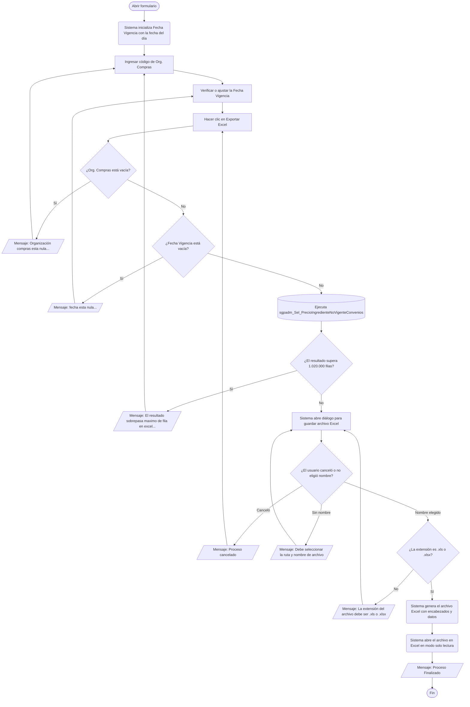

# Exportar Ingredientes sin Precio Vigente en Convenios SAP

**Formulario:** `E_PrecioIngredienteNoVigente.frm`
**Tabla(s) principal(es):** `I_CONVENIO_SAP` (convenios de precios de materiales SAP), `b_ingrediente` (maestro de ingredientes SGP)
**Consulta principal:** `sgpadm_Sel_PrecioIngredienteNoVigenteConvenios`

---

## Índice

- [1 — ¿Para qué sirve esta pantalla?](#1--para-qué-sirve-esta-pantalla)
- [2 — ¿Qué necesito para usarla?](#2--qué-necesito-para-usarla)
- [3 — ¿Cómo se usa?](#3--cómo-se-usa)
  - [3.1 Flujo paso a paso](#31-flujo-paso-a-paso)
  - [3.2 Controles y acciones disponibles](#32-controles-y-acciones-disponibles)
- [4 — ¿Qué restricciones debo conocer?](#4--qué-restricciones-debo-conocer)
  - [4.1 Validaciones del sistema](#41-validaciones-del-sistema)
- [5 — ¿Qué obtengo?](#5--qué-obtengo)
- [6 — Referencia técnica](#6--referencia-técnica)
  - [Tablas que intervienen](#tablas-que-intervienen)
  - [Relación con otros módulos](#relación-con-otros-módulos)

---

## 1 — ¿Para qué sirve esta pantalla?

[↑ Volver al índice](#índice)

Esta pantalla permite identificar y exportar a Excel la lista de ingredientes que, para una organización de compras SAP determinada, no tienen un precio de convenio vigente a una fecha específica. En concreto, detecta aquellos materiales SAP que sí tienen registros de convenio en el sistema pero cuya última fecha de fin de validez ya expiró respecto a la fecha consultada, y que además no cuentan con ningún convenio activo para ese mismo día.

La pantalla es muy compacta: contiene únicamente dos campos de entrada (organización de compras y fecha de vigencia), más un botón para iniciar la exportación y otro para cerrar. No existe grilla de previsualización ni selector de tipos de informe; el resultado se entrega directamente como un archivo Excel que el sistema guarda en la ruta que el usuario elige.

El reporte cruza los convenios SAP con el catálogo de ingredientes SGP para presentar una tabla que relaciona el código de material SAP con el ingrediente SGP equivalente, su último precio conocido y las fechas del convenio vencido. Esto permite detectar brechas en la cobertura de precios antes de procesar compras o valorizar recetas.

---

## 2 — ¿Qué necesito para usarla?

[↑ Volver al índice](#índice)

Al abrir el formulario, el campo de fecha se inicializa automáticamente con la fecha del día. El campo de organización de compras queda en blanco y debe llenarse manualmente.

| Campo | Descripción | Obligatorio |
|---|---|---|
| **Org. Compras** | Código de la organización de compras SAP (por ejemplo, `CL14`). Identifica el ámbito de convenios que se consultará. | Sí |
| **Fecha Vigencia** | Fecha a partir de la cual se evalúa si el precio del convenio está vigente o no. Se ingresa en formato `dd/mm/yyyy`. El sistema la inicializa con la fecha del día al abrir el formulario. | Sí |

---

## 3 — ¿Cómo se usa?

### 3.1 Flujo paso a paso

[↑ Volver al índice](#índice)

### 3.2 Controles y acciones disponibles

[↑ Volver al índice](#índice)

| Control / Acción | Descripción |
|---|---|
| **Org. Compras** | Campo de texto donde se ingresa el código de la organización de compras SAP. Es el primer filtro que el usuario debe completar. |
| **Fecha Vigencia** | Campo de fecha en formato `dd/mm/yyyy`. El sistema lo pre-carga con la fecha actual al abrir el formulario. Puede modificarse manualmente o usando el selector de calendario que incluye el campo. Presionar Enter avanza al siguiente campo. |
| **Exportar Excel** | Valida los campos ingresados, ejecuta la consulta en la base de datos, solicita al usuario que elija la ruta y nombre del archivo de destino, genera el archivo Excel con los datos y lo abre automáticamente en modo solo lectura al finalizar. |
| **Salir Opción** | Cierra el formulario sin generar ningún archivo ni ejecutar ninguna consulta. |

---

## 4 — ¿Qué restricciones debo conocer?

### 4.1 Validaciones del sistema

[↑ Volver al índice](#índice)

| # | Cuándo aparece | Qué verifica el sistema | Qué ve o experimenta el usuario |
|---|---|---|---|
| 1 | Al hacer clic en **Exportar Excel** | Que el campo de fecha no esté vacío | Mensaje: `"fecha esta nula..."` con botón OK. La exportación no continúa. |
| 2 | Al hacer clic en **Exportar Excel** | Que el campo de organización de compras no esté vacío | Mensaje: `"Organización compras esta nula..."` con botón OK. La exportación no continúa. |
| 3 | Después de ejecutar la consulta, antes de elegir el archivo | Que el número de filas del resultado no supere 1.020.000 | Mensaje: `"El resultado sobrepasa maximo de fila en excel, Debera seleccionar menos Ceco"`. La exportación se cancela y el formulario vuelve a estar disponible. |
| 4 | En el diálogo de guardar archivo | Que el usuario confirme un nombre de archivo (no cancele) | Si el usuario presiona Cancelar en el diálogo, aparece el mensaje `"Proceso cancelado"` y la exportación se detiene. |
| 5 | En el diálogo de guardar archivo | Que el usuario haya ingresado un nombre de archivo | Si el campo queda vacío, aparece el mensaje `"Debe seleccionar la ruta y nombre de archivo"` y el diálogo se vuelve a mostrar. |
| 6 | Después de elegir el nombre del archivo | Que la extensión del archivo sea `.xls` o `.xlsx` | Mensaje: `"La extensión del archivo debe ser (*.xls,*.xlsx)"`. El usuario debe elegir un nombre válido. |

---

## 5 — ¿Qué obtengo?

[↑ Volver al índice](#índice)

El reporte genera un único archivo Excel (`.xls` o `.xlsx`) que contiene una hoja con los ingredientes SGP que tienen convenios de precio en SAP pero cuyo precio no está vigente a la fecha consultada. Es decir, lista los ingredientes que en algún momento tuvieron un convenio activo para la organización de compras indicada, pero cuyo último precio registrado ya venció y no fue reemplazado por uno nuevo con validez a esa fecha.

El archivo se abre automáticamente en Excel en modo solo lectura al finalizar el proceso.

**Estructura de columnas del archivo Excel:**

| # | Nombre de columna | Descripción |
|---|---|---|
| 1 | `Org. Compras` | Código de la organización de compras SAP (parámetro ingresado por el usuario). |
| 2 | `Código Ingrediente` | Código del ingrediente en el catálogo SGP. |
| 3 | `Descripción` | Nombre del ingrediente según el maestro SGP. |
| 4 | `Unidad Medida` | Nombre corto de la unidad de medida del ingrediente (por ejemplo, KG, LT). |
| 5 | `Código Material Sap` | Código con el que el ingrediente/producto está registrado en SAP. |
| 6 | `Descripción Material SAP` | Nombre del material según el maestro SAP. |
| 7 | `Proveedor` | Código del proveedor asociado al último convenio vencido. |
| 8 | `Descripción` (proveedor) | Nombre o razón social del proveedor. |
| 9 | `Precio` | Importe del precio registrado en el último convenio vencido. |
| 10 | `Fecha Inicio Validez` | Fecha en que comenzó a regir el convenio vencido. |
| 11 | `Fecha Fin Validez` | Fecha en que venció el convenio (última fecha de fin disponible para ese material e ingrediente). |

La primera fila del archivo contiene los nombres de columna exactamente como se listan arriba. Las columnas se ajustan automáticamente al ancho de su contenido. Las filas se ordenan por organización de compras, código de material SAP, fecha de fin de validez y código de ingrediente.

---

## 6 — Referencia técnica

### Tablas que intervienen

[↑ Volver al índice](#índice)

| Tabla | Para qué se usa en este reporte | Campos clave |
|---|---|---|
| `I_CONVENIO_SAP` | Fuente principal. Contiene los convenios de precios de materiales SAP por organización de compras, proveedor y fechas de validez. | `ID_ORGCOMPRA`, `ID_MATERIAL`, `ID_PROVEEDOR`, `FECHA_INICIO_VALIDEZ`, `FECHA_FIN_VALIDEZ`, `BORRADO`, `IMPORTE`, `NOMBRE_MATERIAL` |
| `b_formatocompras_sap` | Tabla puente que relaciona el código de material SAP con el catálogo de formatos de compra SGP. | `fcs_codmaterial`, `fcs_CodMaterial` |
| `b_formatocompras_sap_sgp` | Segunda tabla puente que vincula el formato de compra SAP con el producto SGP correspondiente. | `fss_CodMaterial`, `fss_codsgp` |
| `b_productos` | Catálogo de productos SGP. Permite llegar al ingrediente a través de la relación producto-ingrediente. | `pro_codigo` |
| `b_productosing` | Relación entre productos e ingredientes en SGP. | `pri_codpro`, `pri_coding` |
| `b_ingrediente` | Maestro de ingredientes SGP. Filtra solo los ingredientes con precio por preparación habilitado (`ing_indppr = 1`) y provee nombre y unidad de medida. | `ing_codigo`, `ing_nombre`, `ing_unimed`, `ing_indppr` |
| `a_unidadmed` | Catálogo de unidades de medida. Traduce el código de unidad a su nombre corto. | `unm_codigo`, `unm_nomcor` |
| `b_proveedor` | Maestro de proveedores. Agrega el nombre del proveedor al convenio vencido. | `prv_codigo`, `prv_nombre` |

### Relación con otros módulos

[↑ Volver al índice](#índice)

| Módulo | Relación |
|---|---|
| **SAP / Integración de convenios** | Los precios de convenio que este reporte analiza provienen de la carga de datos SAP en la tabla `I_CONVENIO_SAP`. Sin esta carga, el reporte no tendrá datos que mostrar. |
| **Maestro de productos e ingredientes (SGP)** | El reporte solo considera ingredientes que existen en el catálogo SGP y que tienen activo el indicador de precio por preparación. Los ingredientes no vinculados al catálogo SGP no aparecerán aunque tengan convenios en SAP. |
| **Maestro de proveedores (SGP)** | El nombre del proveedor se resuelve desde el catálogo de proveedores SGP (`b_proveedor`). Si un proveedor del convenio no existe en este catálogo, el campo de descripción del proveedor quedará en blanco en el Excel. |

---

*Fuentes: `E_PrecioIngredienteNoVigente.frm`, SP `sgpadm_Sel_PrecioIngredienteNoVigenteConvenios` en `SGP_Admin.sql`, tablas `I_CONVENIO_SAP`, `b_ingrediente`, `b_productos`, `b_productosing`, `b_formatocompras_sap`, `b_formatocompras_sap_sgp`, `a_unidadmed`, `b_proveedor` en `SGP_Admin.sql`*
