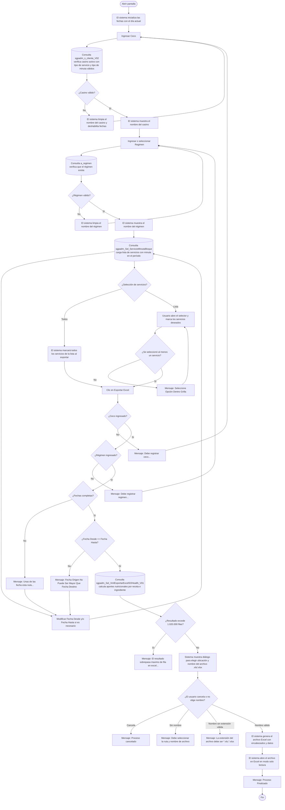

# Exportar Excel SO Health

**Formulario:** `C_SoHealth.frm`
**Tablas principales:** `cas_b_minuta` (minutas planificadas por casino), `cas_b_minutadet` (detalle de líneas de minuta), `b_receta` (maestro de recetas), `b_recetadet` (ingredientes por receta), `b_ingrediente` (maestro de ingredientes), `b_productonut` (aportes nutricionales por producto), `a_nutriente` (catálogo de nutrientes)
**Consulta principal:** `sgpadm_Sel_XmlExportarExcelSOHealth_V01` — procedimiento almacenado que extrae el detalle de recetas con todos sus ingredientes y el cálculo de cada nutriente por línea de minuta, filtrado por casino, régimen, servicios seleccionados y período

---

## Índice

- [1 — ¿Para qué sirve esta pantalla?](#1--para-qué-sirve-esta-pantalla)
- [2 — ¿Qué necesito para usarla?](#2--qué-necesito-para-usarla)
- [3 — ¿Cómo se usa?](#3--cómo-se-usa)
  - [3.1 Flujo paso a paso](#31-flujo-paso-a-paso)
  - [3.2 Controles y acciones disponibles](#32-controles-y-acciones-disponibles)
- [4 — ¿Qué restricciones debo conocer?](#4--qué-restricciones-debo-conocer)
  - [4.1 Validaciones del sistema](#41-validaciones-del-sistema)
  - [4.2 Reglas de cálculo](#42-reglas-de-cálculo)
- [5 — ¿Qué obtengo?](#5--qué-obtengo)
  - [Estructura de datos del informe](#estructura-de-datos-del-informe)
  - [Cálculos del informe](#cálculos-del-informe)
  - [Formato de salida](#formato-de-salida)
- [6 — Referencia técnica](#6--referencia-técnica)
  - [Tablas que intervienen](#tablas-que-intervienen)
  - [Relación con otros módulos](#relación-con-otros-módulos)

---

## 1 — ¿Para qué sirve esta pantalla?

[↑ Volver al índice](#índice)

Esta pantalla genera un archivo Excel con el detalle nutricional completo de las recetas que componen la minuta planificada de un casino, para un régimen y un período de fechas determinado. Por cada combinación de fecha, servicio, receta e ingrediente, el archivo entrega los gramos brutos, los gramos en distintas fracciones de rendimiento y el valor de 36 nutrientes calculados a partir de las tablas nutricionales del sistema. La pantalla está orientada a reportes del tipo SO Health, donde se requiere una visión exhaustiva de la composición nutricional de la planificación alimentaria.

La pantalla se organiza en un panel de filtros que contiene cuatro campos de cabecera: código de casino (Ceco), régimen, fecha de inicio y fecha de término. Junto a los campos de Ceco y Régimen se encuentran íconos de búsqueda que abren selectores auxiliares. La selección de servicios puede realizarse de dos formas: eligiendo "Todos" (incluye automáticamente todos los servicios con minuta en el período) o "Lista" (permite seleccionar servicios individuales desde un formulario auxiliar de selección múltiple). La barra de herramientas contiene el botón de exportación y el botón de salida.

El informe consolida datos de un único casino a la vez. Cada vez que el usuario modifica el Ceco, el régimen, la fecha de inicio o la fecha de término, el sistema actualiza de forma automática la lista interna de servicios disponibles para ese período. La exportación solo se habilita si el usuario cuenta con el permiso de exportación asignado en el sistema.

---

## 2 — ¿Qué necesito para usarla?

[↑ Volver al índice](#índice)

| Campo | Descripción | Obligatorio |
|---|---|---|
| Ceco | Código del casino. Se puede escribir directamente o abrir el selector de clientes mediante el ícono de búsqueda contiguo. Al ingresar un código válido, el sistema muestra el nombre del casino en el campo de ayuda. El selector filtra solo casinos activos de tipo servicio de alimentación (tipo de servicio = 1, tipo de minuta 3 o 4). | Sí |
| Regimen | Código numérico del régimen alimentario. Se puede escribir o seleccionar mediante el ícono de búsqueda de regímenes. Al ingresar un régimen válido, el sistema muestra su nombre en el campo de ayuda. Si la configuración del sistema limita los regímenes por tipo de programa (PPR), el sistema filtra solo los que corresponden. | Sí |
| Fecha Desde | Fecha de inicio del período a consultar, en formato dd/mm/aaaa. El sistema inicializa este campo con la fecha del día actual. | Sí |
| Fecha Hasta | Fecha de término del período a consultar, en formato dd/mm/aaaa. El sistema inicializa este campo con la fecha del día actual. | Sí |
| Servicio | Define si se incluyen todos los servicios con minuta en el período ("Todos", opción por defecto) o solo los seleccionados manualmente ("Lista"). Si se elige "Lista", se abre un formulario de selección múltiple donde el usuario puede marcar o desmarcar cada servicio. | Sí |

Al abrir el formulario, el sistema inicializa automáticamente los campos de fecha con la fecha actual. Cada vez que se modifica el Ceco, el régimen, la fecha de inicio o la fecha de término — siempre que todos estén completos —, el sistema consulta la base de datos y actualiza la lista interna de servicios disponibles para ese cruce de filtros.

---

## 3 — ¿Cómo se usa?

### 3.1 Flujo paso a paso

[↑ Volver al índice](#índice)



### 3.2 Controles y acciones disponibles

[↑ Volver al índice](#índice)

| Control / Acción | Descripción |
|---|---|
| **Ceco** | Campo de texto donde se escribe el código del casino. Al modificar el valor, el sistema verifica si existe y muestra el nombre correspondiente. Si el código no es válido, limpia el nombre y los campos de ayuda del régimen. |
| **Ícono de búsqueda de Ceco** | Abre el selector de clientes (casinos). Permite buscar por nombre o código. Al confirmar la selección, carga el código y el nombre del casino en los campos correspondientes y posiciona el cursor en el campo Regimen. |
| **Regimen** | Campo numérico donde se escribe el código del régimen. Al modificar el valor, el sistema verifica su existencia y muestra el nombre correspondiente. Si el valor es menor que 1, limpia el campo de ayuda del régimen. |
| **Ícono de búsqueda de Régimen** | Abre el selector de regímenes. Al confirmar la selección, carga el código y el nombre del régimen y posiciona el cursor en el campo Fecha Desde. |
| **Fecha Desde** | Campo de fecha en formato dd/mm/aaaa. Al modificar una fecha válida, el sistema recarga automáticamente la lista interna de servicios para el período resultante (siempre que Ceco, Régimen y Fecha Hasta también estén completos). |
| **Fecha Hasta** | Campo de fecha en formato dd/mm/aaaa. Mismo comportamiento que Fecha Desde al modificarse. |
| **Todos** (opción de servicio) | Opción seleccionada por defecto. Al ejecutar la exportación, el sistema marcará automáticamente todos los servicios disponibles en la lista interna sin que el usuario deba seleccionarlos uno a uno. |
| **Lista** (opción de servicio) | Permite seleccionar servicios individuales. Al hacer clic en el ícono del panel Servicio con esta opción activa, se requiere que Ceco, Régimen y fechas estén completos; si no lo están, el sistema muestra el mensaje de validación correspondiente. |
| **Ícono de selección de servicios** (dentro del panel Servicio) | Abre el formulario de selección múltiple de servicios. Muestra los servicios con minuta en el período definido por los filtros actuales. El usuario marca o desmarca los servicios que desea incluir. Requiere que todos los filtros estén completos. |
| **Exportar Excel** (botón de barra de herramientas) | Ejecuta las validaciones completas, consulta la base de datos y genera el archivo Excel. Durante el proceso, deshabilita la barra de herramientas y el panel de filtros para evitar modificaciones. Solo está disponible si el usuario tiene el permiso de exportación habilitado. |
| **Salir** (botón de barra de herramientas) | Cierra el formulario sin generar ningún archivo. |

---

## 4 — ¿Qué restricciones debo conocer?

### 4.1 Validaciones del sistema

[↑ Volver al índice](#índice)

| # | Cuándo aparece | Qué verifica el sistema | Qué ve o experimenta el usuario |
|---|---|---|---|
| 1 | Al hacer clic en Exportar Excel | Que el nombre del casino esté cargado (Ceco ingresado y reconocido) | Mensaje: `Debe registrar ceco...` |
| 2 | Al hacer clic en Exportar Excel | Que el nombre del régimen esté cargado (Régimen ingresado y reconocido) | Mensaje: `Debe registrar regimen...` |
| 3 | Al hacer clic en Exportar Excel | Que los campos Fecha Desde y Fecha Hasta no estén vacíos | Mensaje: `Unas de las fecha esta nula...` |
| 4 | Al hacer clic en Exportar Excel | Que la Fecha Desde no sea posterior a la Fecha Hasta | Mensaje: `Fecha Origen No Puede Ser Mayor Que Fecha Destino` |
| 5 | Al hacer clic en Exportar Excel (opción Lista activa) | Que al menos un servicio esté marcado en la grilla | Mensaje: `Seleccione Opción Dentro Grilla` |
| 6 | Después de consultar la base de datos | Que el número de filas del resultado no supere 1.020.000 | Mensaje: `El resultado sobrepasa maximo de fila en excel...` y el proceso se cancela |
| 7 | Al elegir nombre del archivo | Que el usuario no cancele el diálogo de guardado | Mensaje: `Proceso cancelado` |
| 8 | Al elegir nombre del archivo | Que el usuario haya escrito un nombre de archivo | Mensaje: `Debe seleccionar la ruta y nombre de archivo` |
| 9 | Al elegir nombre del archivo | Que la extensión sea `.xls` o `.xlsx` | Mensaje: `La extensión del archivo debe ser (*.xls,*.xlsx)` |
| 10 | Al ingresar un código de Ceco | Que el casino exista en el maestro de clientes, sea de tipo servicio de alimentación (tis_codigo = 1), esté activo y tenga un tipo de minuta válido (3 o 4) | El nombre del casino no se carga; los campos quedan en blanco |
| 11 | Al ingresar o seleccionar servicios (botón del panel Servicio, opción Lista) | Que Ceco, Régimen, Fecha Desde y Fecha Hasta estén completos y sean válidos | Mensaje: `Debe seleccionar datos como Ceco, regimen o bien fecha...` |

### 4.2 Reglas de cálculo

[↑ Volver al índice](#índice)

El cálculo de cada nutriente por línea de ingrediente sigue una fórmula uniforme aplicada dentro del procedimiento almacenado principal:

```
Valor_Nutriente = (red_pctnut / 100) × (pnu_canapo × Cant_Origen) / ing_facnut
```

Donde:
- `red_pctnut` es el porcentaje de rendimiento nutricional del ingrediente en esa receta (porcentaje de la cantidad bruta que se considera para el cálculo nutricional).
- `pnu_canapo` es el aporte del nutriente por unidad de producto, según la tabla nutricional del ingrediente.
- `Cant_Origen` es la cantidad bruta del ingrediente en la receta (en gramos o la unidad de medida registrada).
- `ing_facnut` es el factor de conversión nutricional del ingrediente.

Esta misma fórmula se aplica individualmente para cada uno de los 36 nutrientes del catálogo (Humedad, Calorías, Proteínas, Hidratos, Fibras, Lípidos, y los ácidos grasos, vitaminas y minerales detallados en la sección 5).

Adicionalmente, el procedimiento aplica una lógica de reemplazo de ingredientes: si el casino tiene configurado un ingrediente sustituto para una combinación de receta y tipo de plato, el sistema reemplaza el ingrediente original por el sustituto y recalcula los porcentajes de rendimiento (`red_pctnut`, `red_pctapr`, `red_pctcoc`) con los valores del ingrediente de reemplazo.

---

## 5 — ¿Qué obtengo?

[↑ Volver al índice](#índice)

El formulario genera un único tipo de informe: un archivo Excel con el detalle nutricional ingrediente a ingrediente de todas las recetas que componen la minuta planificada del casino, filtradas por los servicios seleccionados y el período indicado. No hay selector de tipo de informe.

### Estructura de datos del informe

[↑ Volver al índice](#índice)

El archivo contiene una fila por cada combinación de fecha + servicio + receta + ingrediente presente en la minuta planificada. Las columnas son las siguientes:

| Columna | Qué representa |
|---|---|
| Ceco | Código del casino consultado |
| Nombre Ceco | Nombre del casino |
| Fecha | Fecha de la minuta en formato dd/mm/aaaa |
| Regimen | Código del régimen |
| Nombre Regimen | Nombre del régimen |
| Servicio | Código del servicio (desayuno, almuerzo, cena, etc.) |
| Nombre Servicio | Nombre del servicio |
| Código Receta | Código de la receta en el maestro de recetas |
| Nombre Receta | Nombre oficial de la receta |
| Nombre fantasia | Nombre comercial o de fantasía de la receta |
| Categoria Dietetica | Categoría dietética de la receta, expresada como ruta jerárquica completa del árbol de categorías dietéticas |
| Tipo de Plato | Tipo de plato de la receta, expresado como ruta jerárquica completa del árbol de tipos de plato |
| Ing. Origen | Código del ingrediente |
| Nombre Ing. Origen | Nombre del ingrediente |
| Gramos Bruto | Cantidad bruta del ingrediente tal como se registra en la receta (`red_canpro`) |
| Gramos Neto | Calculado. Ver detalle en Cálculos del informe |
| Gramo Neto Servido | Calculado. Ver detalle en Cálculos del informe |
| Gramo Neto Nutricional | Calculado. Ver detalle en Cálculos del informe |
| Unidad Medida | Unidad de medida abreviada del ingrediente |
| Humedad | Aporte calculado del nutriente Humedad (nutriente código 1) |
| Calorias | Aporte calculado del nutriente Calorías (nutriente código 2) |
| Proteinas | Aporte calculado del nutriente Proteínas (nutriente código 3) |
| Hidratos | Aporte calculado del nutriente Hidratos de Carbono (nutriente código 4) |
| Fibras | Aporte calculado del nutriente Fibras (nutriente código 5) |
| Lipidos | Aporte calculado del nutriente Lípidos (nutriente código 6) |
| Grasa Total | Aporte calculado del nutriente Grasa Total (nutriente código 7) |
| Ac. Grasos Sat. | Aporte calculado del nutriente Ácidos Grasos Saturados (nutriente código 8) |
| Ac. Grasos Mon | Aporte calculado del nutriente Ácidos Grasos Monoinsaturados (nutriente código 9) |
| Ac. Grasos Poli | Aporte calculado del nutriente Ácidos Grasos Poliinsaturados (nutriente código 10) |
| Colesterol | Aporte calculado del nutriente Colesterol (nutriente código 11) |
| N6 | Aporte calculado del nutriente N6 — Omega 6 (nutriente código 12) |
| N3 | Aporte calculado del nutriente N3 — Omega 3 (nutriente código 13) |
| Caroteno | Aporte calculado del nutriente Caroteno (nutriente código 14) |
| Retinol | Aporte calculado del nutriente Retinol (nutriente código 15) |
| Vit. A Tot Re | Aporte calculado del nutriente Vitamina A Total en Retinol Equivalentes (nutriente código 16) |
| Vitamina B1 | Aporte calculado del nutriente Vitamina B1 — Tiamina (nutriente código 17) |
| Vitamina B2 | Aporte calculado del nutriente Vitamina B2 — Riboflavina (nutriente código 18) |
| Niacina ( B3) | Aporte calculado del nutriente Niacina — Vitamina B3 (nutriente código 19) |
| Vitamina B6 | Aporte calculado del nutriente Vitamina B6 — Piridoxina (nutriente código 20) |
| Vitamina B12 | Aporte calculado del nutriente Vitamina B12 — Cobalamina (nutriente código 21) |
| Folato | Aporte calculado del nutriente Folato (nutriente código 22) |
| Ac. Pantot (B5) | Aporte calculado del nutriente Ácido Pantoténico — Vitamina B5 (nutriente código 23) |
| Vitamina C | Aporte calculado del nutriente Vitamina C (nutriente código 24) |
| Vitamina E | Aporte calculado del nutriente Vitamina E (nutriente código 25) |
| Calcio | Aporte calculado del nutriente Calcio (nutriente código 26) |
| Cobre | Aporte calculado del nutriente Cobre (nutriente código 27) |
| Hierro | Aporte calculado del nutriente Hierro (nutriente código 28) |
| Magnesio | Aporte calculado del nutriente Magnesio (nutriente código 29) |
| Fosforo | Aporte calculado del nutriente Fósforo (nutriente código 30) |
| Potasio | Aporte calculado del nutriente Potasio (nutriente código 31) |
| Selenio | Aporte calculado del nutriente Selenio (nutriente código 32) |
| Sodio | Aporte calculado del nutriente Sodio (nutriente código 33) |
| Zinc | Aporte calculado del nutriente Zinc (nutriente código 34) |
| A.c Graso Trans. | Aporte calculado del nutriente Ácidos Grasos Trans (nutriente código 35) |
| Azucares Totales | Aporte calculado del nutriente Azúcares Totales (nutriente código 36) |

### Cálculos del informe

[↑ Volver al índice](#índice)

**Cálculo — Gramos Neto**

Representa la fracción de la cantidad bruta del ingrediente que se considera para el rendimiento nutricional.

| Componente | Descripción |
|---|---|
| `red_pctnut` | Porcentaje de rendimiento nutricional del ingrediente en la receta |
| `Cant Origen` | Cantidad bruta del ingrediente en gramos |

Fórmula:
```
Gramos Neto = (red_pctnut / 100) × Cant_Origen
```

---

**Cálculo — Gramo Neto Servido**

Representa la cantidad final del ingrediente que efectivamente llega al plato del comensal, aplicando los porcentajes de aprovechamiento y cocción.

| Componente | Descripción |
|---|---|
| `red_pctapr` | Porcentaje de aprovechamiento del ingrediente (fracción comestible) |
| `red_pctcoc` | Porcentaje de cocción del ingrediente (variación de peso por cocción) |
| `Cant Origen` | Cantidad bruta del ingrediente en gramos |

Fórmula:
```
Gramo Neto Servido = ((red_pctapr / 100) × Cant_Origen) × (red_pctcoc / 100)
```

---

**Cálculo — Gramo Neto Nutricional**

Representa la base de cálculo nutricional: la cantidad bruta reducida por el porcentaje de rendimiento nutricional.

Fórmula:
```
Gramo Neto Nutricional = (Cant_Origen × red_pctnut) / 100
```

---

**Cálculo — Valor de cada nutriente**

Cada una de las 36 columnas de nutrientes se calcula de forma independiente con la misma fórmula, usando el aporte registrado en la tabla nutricional del ingrediente para ese nutriente específico.

| Componente | Descripción |
|---|---|
| `red_pctnut` | Porcentaje de rendimiento nutricional del ingrediente en la receta |
| `pnu_canapo` | Aporte del nutriente por unidad del ingrediente según la tabla nutricional |
| `Cant Origen` | Cantidad bruta del ingrediente en gramos |
| `ing_facnut` | Factor de conversión nutricional del ingrediente |

Fórmula:
```
Valor_Nutriente = (red_pctnut / 100) × (pnu_canapo × Cant_Origen) / ing_facnut
```

### Formato de salida

[↑ Volver al índice](#índice)

El resultado se entrega como un archivo Excel (`.xls` o `.xlsx`) en la ubicación y con el nombre que el usuario elige en el diálogo de guardado. El archivo contiene una hoja única llamada "Hoja1", con la primera fila como encabezado de columnas y los datos a partir de la segunda fila. Las columnas se ajustan automáticamente al contenido (autofit). Una vez guardado, el sistema abre el archivo en Excel en modo solo lectura para que el usuario pueda revisarlo inmediatamente.

Los datos se ordenan por: Régimen, Servicio, Fecha, número de línea de la minuta.

---

## 6 — Referencia técnica

### Tablas que intervienen

[↑ Volver al índice](#índice)

| Tabla | Para qué se usa en este reporte | Campos clave |
|---|---|---|
| `b_clientes` | Maestro de casinos. Se usa para validar el Ceco ingresado y obtener el nombre del casino en el resultado. | `cli_codigo`, `cli_nombre`, `cli_tipo`, `cli_activo`, `cli_codtis`, `cli_tipominuta` |
| `a_regimen` | Catálogo de regímenes. Se usa para validar el régimen ingresado y obtener su nombre en el resultado. | `reg_codigo`, `reg_nombre`, `reg_indppr` |
| `a_servicio` | Catálogo de servicios. Proporciona el nombre del servicio (desayuno, almuerzo, etc.) en el resultado. | `ser_codigo`, `ser_nombre` |
| `cas_b_minuta` | Cabecera de minutas planificadas. Es la tabla principal desde la que se parte para obtener las minutas del casino, régimen y período indicados. | `min_cecori`, `min_codigo`, `min_codreg`, `min_codser`, `min_fecmin` |
| `cas_b_minutadet` | Detalle de líneas de minuta (recetas por servicio y día). Relaciona cada día y servicio con las recetas planificadas. | `mid_cecori`, `mid_codigo`, `mid_codrec`, `mid_tipmin`, `mid_numlin` |
| `b_receta` | Maestro de recetas. Proporciona el nombre, nombre de fantasía, categoría dietética y tipo de plato de cada receta. | `rec_codigo`, `rec_nombre`, `rec_nomfan`, `rec_catdie`, `rec_tippla`, `rec_indppr` |
| `b_recetadet` | Detalle de ingredientes por receta. Contiene los gramajes y porcentajes de rendimiento de cada ingrediente. | `red_codigo`, `red_codpro`, `red_canpro`, `red_pctapr`, `red_pctcoc`, `red_pctnut`, `red_nroite` |
| `b_ingrediente` | Maestro de ingredientes (insumos en su presentación de compra). Proporciona el nombre, factor nutricional y unidad de medida del ingrediente. | `ing_codigo`, `ing_nombre`, `ing_facnut`, `ing_pctnut`, `ing_pctapr`, `ing_pctcoc`, `ing_unimed`, `ing_activo`, `ing_indppr` |
| `b_productosing` | Tabla de relación entre ingredientes (presentaciones de compra) y productos base. | `pri_coding`, `pri_codpro` |
| `b_productos` | Maestro de productos base. | `pro_codigo`, `pro_activo`, `pro_indppr` |
| `b_productonut` | Tabla nutricional de ingredientes. Contiene el aporte de cada nutriente por unidad de ingrediente. | `pnu_codpro`, `pnu_codapo`, `pnu_canapo` |
| `a_nutriente` | Catálogo de nutrientes. Define los 36 nutrientes y su estado de actividad. | `nut_codigo`, `nut_activo` |
| `a_recetacatdie` | Catálogo de categorías dietéticas. Permite construir la ruta jerárquica de la categoría dietética de cada receta. | `car_codigo` |
| `a_recetatippla` | Catálogo de tipos de plato. Permite construir la ruta jerárquica del tipo de plato de cada receta. | `tip_codigo` |
| `b_receta_Oferta` | Tabla que vincula recetas con ofertas gastronómicas. | `rec_codigo`, `codigo_oferta` |
| `b_Cliente_Oferta` | Tabla que vincula casinos con ofertas. | `cli_codigo`, `codigo_oferta` |
| `b_Ofertas` | Maestro de ofertas gastronómicas. | `Codigo_oferta` |
| `a_tiposervicio` | Catálogo de tipos de servicio. Se usa para filtrar que el casino sea de tipo alimentación (tis_codigo = 1). | `tis_codigo`, `tis_activo` |
| `b_tipominuta` | Catálogo de tipos de minuta. Se usa para validar que el casino tenga un tipo de minuta activo. | `tip_codigo`, `Activo` |

### Relación con otros módulos

[↑ Volver al índice](#índice)

| Módulo | Relación |
|---|---|
| **Planificación de Minutas** | La fuente principal del informe son las minutas planificadas (`cas_b_minuta`, `cas_b_minutadet`). Sin minuta planificada en el período no hay datos para exportar. |
| **Maestro de Recetas** | Las recetas y sus ingredientes provienen del módulo de mantención de recetas. Los gramajes, porcentajes de rendimiento y la categoría dietética y tipo de plato se leen directamente del maestro. |
| **Tablas Nutricionales** | Los aportes de cada nutriente por ingrediente se obtienen de la tabla nutricional de productos (`b_productonut`) y el catálogo de nutrientes (`a_nutriente`). |
| **Ofertas Gastronómicas** | El SP filtra solo las recetas que pertenecen a una oferta gastronómica activa vinculada al casino, garantizando que se reporten únicamente las recetas autorizadas para ese casino. |
| **Ingredientes con Sustitución** | Si el casino tiene configurados ingredientes sustitutos (mediante la función `fn_ObtenerIngredienteReemplazoJerarquia`), el sistema aplica automáticamente esos reemplazos antes de calcular los nutrientes, sin intervención del usuario. |
| **Maestro de Clientes (Cecos)** | El Ceco ingresado se valida contra el maestro de casinos, filtrando que sea un casino activo, de tipo servicio de alimentación y con tipo de minuta compatible con SO Health (tipos 3 o 4). |

---

*Fuentes: `C_SoHealth.frm`, SP `sgpadm_Sel_XmlExportarExcelSOHealth_V01` en `SGP_Admin.sql`, SP `sgpadm_Sel_ServicioMinutaBloque` en `SGP_Admin.sql`, SP `sgpadm_s_cliente_V02` en `SGP_Admin.sql`, tablas `cas_b_minuta`, `cas_b_minutadet`, `b_receta`, `b_recetadet`, `b_ingrediente`, `b_productonut`, `a_nutriente` en `SGP_Admin.sql`*
