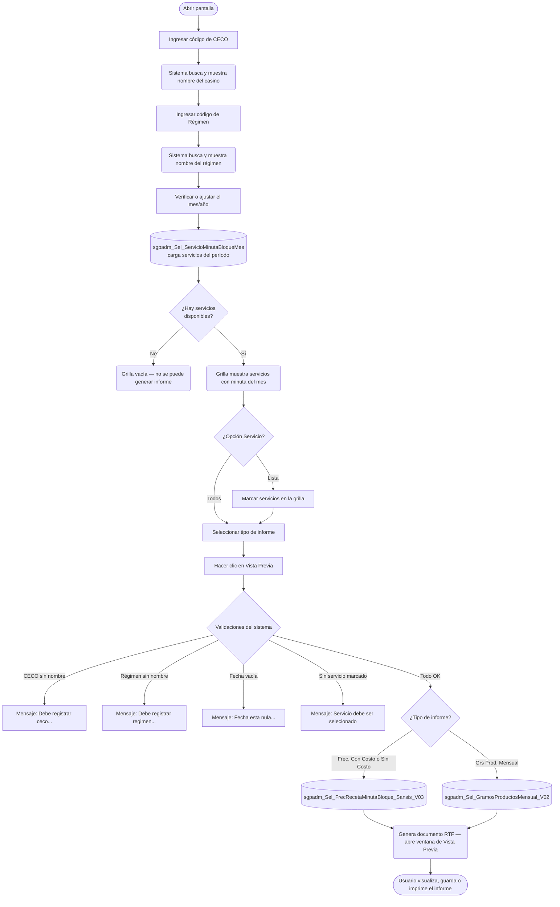

# Frecuencia de Recetas o Gramos Producto Mensual

**Formulario:** `I_FreGrP.frm`
**Tabla(s) principal(es):** `cas_b_minuta` (cabecera de minutas bloque), `cas_b_minutadet` (detalle de minutas bloque), `b_receta` (maestro de recetas), `b_recetadet` (detalle/ingredientes de recetas)
**Consultas principales:**
- Frecuencia de Recetas: `sgpadm_Sel_FrecRecetaMinutaBloque_Sansis_V03` — frecuencia de aparición de recetas en la minuta mensual, con costo opcional por receta
- Gramos Producto Mensual: `sgpadm_Sel_GramosProductosMensual_V02` — gramos totales de cada producto (ingrediente) consumidos día a día durante el mes

---

## Índice

- [1 — ¿Para qué sirve esta pantalla?](#1--para-qué-sirve-esta-pantalla)
- [2 — ¿Qué necesito para usarla?](#2--qué-necesito-para-usarla)
- [3 — ¿Cómo se usa?](#3--cómo-se-usa)
  - [3.1 Flujo paso a paso](#31-flujo-paso-a-paso)
  - [3.2 Controles y acciones disponibles](#32-controles-y-acciones-disponibles)
- [4 — ¿Qué restricciones debo conocer?](#4--qué-restricciones-debo-conocer)
  - [4.1 Validaciones del sistema](#41-validaciones-del-sistema)
- [5 — ¿Qué obtengo?](#5--qué-obtengo)
  - [Resumen de tipos disponibles](#resumen-de-tipos-disponibles)
  - [Frec. Recetas Con Costo (`I_FrecuenciaRecetas`)](#frec-recetas-con-costo-i_frecuenciarecetas)
  - [Frec. Recetas Sin Costo (`I_FrecuenciaRecetas`)](#frec-recetas-sin-costo-i_frecuenciarecetas)
  - [Grs Prod. Mensual (`I_GramosProductos`)](#grs-prod-mensual-i_gramosproductos)
- [6 — Referencia técnica](#6--referencia-técnica)
  - [Tablas que intervienen](#tablas-que-intervienen)
  - [Relación con otros módulos](#relación-con-otros-módulos)

---

## 1 — ¿Para qué sirve esta pantalla?
[↑ Volver al índice](#índice)

Esta pantalla genera dos tipos de informes sobre la minuta mensual planificada de un casino: uno que muestra la **frecuencia de aparición de cada receta** a lo largo del mes (con o sin el costo asociado), y otro que muestra los **gramos totales de cada producto** (ingrediente) utilizados en la minuta, distribuidos día a día durante el mes. Ambos informes se basan en la minuta real planificada y aprobada para el período seleccionado.

La pantalla se organiza en un panel de filtros donde el usuario ingresa el casino (CECO), el régimen y el mes/año de consulta. Una vez ingresados estos datos, el sistema carga automáticamente los servicios disponibles para ese casino y período en una grilla de selección. Si el usuario elige la opción "Lista" en el selector de servicio, puede marcar manualmente qué servicios incluir; si elige "Todos", el sistema los marca todos al generar el informe. Un segundo panel permite elegir entre los tres tipos de informe disponibles: Frecuencia de Recetas Con Costo, Frecuencia de Recetas Sin Costo, y Gramos Producto Mensual.

Adicionalmente, la barra de herramientas incluye un acceso al historial de planificación teórica, que permite seleccionar un régimen y período directamente desde minutas históricas, facilitando la consulta de períodos anteriores sin ingresar los filtros manualmente.

---

## 2 — ¿Qué necesito para usarla?
[↑ Volver al índice](#índice)

| Campo | Descripción | Obligatorio |
|---|---|---|
| **CECO** | Código del casino a consultar. Se puede ingresar directamente o buscar abriendo el selector de clientes con la tecla F9 o el ícono de búsqueda junto al campo. El sistema muestra el nombre del casino al costado para confirmar la selección. | Sí |
| **Régimen** | Código del régimen alimenticio a consultar. Se puede ingresar directamente o buscar con la tecla F9 o el ícono de búsqueda junto al campo. El sistema muestra el nombre del régimen al costado. | Sí |
| **Fecha (mm/aa)** | Mes y año del informe, en formato mes/año (por ejemplo, 03/2026). El sistema inicializa este campo con el mes y año actuales al abrir la pantalla. | Sí |
| **Servicio** | Selector de cobertura de servicios: "Todos" incluye automáticamente todos los servicios disponibles al generar el informe; "Lista" habilita la grilla de servicios para que el usuario marque manualmente cuáles incluir. | Sí (debe haber al menos uno marcado) |
| **Tipo de informe** | Selección entre "Frec. Recetas Con Costo", "Frec. Recetas Sin Costo" y "Grs Prod. Mensual". El tipo "Frec. Recetas Con Costo" está seleccionado por defecto al abrir la pantalla. | Sí |

Cuando se ingresan o modifican el CECO, el régimen o la fecha, el sistema consulta automáticamente los servicios con minuta planificada en ese período y los carga en la grilla de selección. Si no existe planificación para la combinación ingresada, la grilla quedará vacía y no será posible generar el informe.

---

## 3 — ¿Cómo se usa?

### 3.1 Flujo paso a paso
[↑ Volver al índice](#índice)

### 3.2 Controles y acciones disponibles
[↑ Volver al índice](#índice)

| Control / Acción | Descripción |
|---|---|
| **Campo CECO** | Permite ingresar el código del casino. Al confirmar con Enter o Tab, el sistema busca el nombre y lo muestra junto al campo. |
| **Ícono de búsqueda de CECO / F9** | Abre el selector de casinos donde el usuario puede buscar y seleccionar por nombre o código. Al confirmar, el campo CECO y su nombre se actualizan automáticamente. |
| **Campo Régimen** | Permite ingresar el código de régimen. Al confirmar, el sistema muestra el nombre del régimen y recarga la grilla de servicios. |
| **Ícono de búsqueda de Régimen / F9** | Abre el selector de regímenes. Al confirmar, el campo régimen y su nombre se actualizan y el sistema recarga los servicios disponibles. |
| **Campo Fecha (mm/aa)** | Mes y año del informe. Al modificarlo, el sistema recarga automáticamente la grilla de servicios. Soporta navegación con los botones de incremento del campo. |
| **Opción "Todos" (Servicio)** | Cuando está seleccionada (valor por defecto), al generar el informe el sistema marca automáticamente todos los servicios de la grilla, sin que el usuario deba hacerlo manualmente. |
| **Opción "Lista" (Servicio)** | Habilita la grilla de servicios para selección manual. El usuario puede marcar o desmarcar cada servicio con una casilla de verificación. |
| **Ícono de búsqueda de Servicios / F9 (desde Lista)** | Solo disponible cuando "Lista" está seleccionado. Abre el selector de servicios (`B_MTaEst`) donde se puede elegir los servicios a incluir. |
| **Grilla de servicios** | Muestra los servicios con minuta planificada para el CECO, régimen y mes indicados. Cada fila tiene una casilla de verificación para seleccionar el servicio. Solo es visible e interactiva cuando la opción "Lista" está activa. |
| **Opción "Frec. Recetas Con Costo"** | Selecciona el tipo de informe de frecuencia de recetas incluyendo el costo calculado por receta y el costo promedio del servicio. Activa por defecto. |
| **Opción "Frec. Recetas Sin Costo"** | Selecciona el tipo de informe de frecuencia de recetas sin información de costos. |
| **Opción "Grs Prod. Mensual"** | Selecciona el informe de gramos de producto mensual, agrupado por categoría de producto. |
| **Botón "Vista Previa"** | Ejecuta las validaciones de datos, consulta la base de datos y genera el documento RTF en una ventana de Vista Previa del sistema, desde donde el usuario puede revisar, imprimir o guardar el informe. Solo está habilitado si el usuario tiene permiso de Vista Previa en el módulo. |
| **Botón "Histórico Planificación Teórica"** | Abre el formulario de histórico de minutas donde el usuario puede buscar y seleccionar un período planificado previo. Al confirmar, el sistema carga automáticamente el régimen y la fecha seleccionados en los campos de filtro. |
| **Botón "Salir"** | Cierra el formulario y lo descarga de memoria. |

---

## 4 — ¿Qué restricciones debo conocer?

### 4.1 Validaciones del sistema
[↑ Volver al índice](#índice)

| # | Cuándo aparece | Qué verifica el sistema | Qué ve o experimenta el usuario |
|---|---|---|---|
| 1 | Al hacer clic en Vista Previa | Que el campo CECO tenga un nombre de casino resuelto (es decir, que el código ingresado corresponda a un casino válido) | Mensaje: `Debe registrar ceco...` — el informe no se genera |
| 2 | Al hacer clic en Vista Previa | Que el campo Régimen tenga un nombre resuelto (es decir, que el código de régimen sea válido) | Mensaje: `Debe registrar regimen...` — el informe no se genera |
| 3 | Al hacer clic en Vista Previa | Que el campo de fecha no esté vacío | Mensaje: `Fecha esta nula...` — el informe no se genera |
| 4 | Al hacer clic en Vista Previa | Que al menos un servicio esté marcado en la grilla (si la opción es "Todos", el sistema los marca todos automáticamente antes de esta validación) | Mensaje: `Servicio debe ser selecionado` — el informe no se genera |
| 5 | Al hacer clic en "Histórico Planificación Teórica" | Que el CECO ingresado tenga al menos una minuta planificada registrada en el sistema | Mensaje: `No existe ceco planificado` — el formulario de histórico no se abre |
| 6 | Al ingresar el CECO | Que el código corresponda a un casino registrado en el sistema (tipo 0 o tipo 2 en el catálogo de clientes) | Si el código no existe, el campo de nombre queda vacío, el campo de régimen se limpia y el campo de fecha queda habilitado sin datos de servicios |
| 7 | Al ingresar el Régimen con filtro de tipo de régimen activo | Que el régimen corresponda al tipo de régimen configurado en la sesión (`vg_Indppr`), cuando aplique | Si el código de régimen no coincide con el tipo esperado, el nombre queda vacío y no se cargan servicios |

---

## 5 — ¿Qué obtengo?
[↑ Volver al índice](#índice)

### Resumen de tipos disponibles
[↑ Volver al índice](#índice)

| Nombre en el selector | Formato de salida | Procedimiento almacenado principal |
|---|---|---|
| Frec. Recetas Con Costo | Documento RTF (Vista Previa) | `sgpadm_Sel_FrecRecetaMinutaBloque_Sansis_V03` + `sgpadm_Sel_CantDiaPlanificado` |
| Frec. Recetas Sin Costo | Documento RTF (Vista Previa) | `sgpadm_Sel_FrecRecetaMinutaBloque_Sansis_V03` |
| Grs Prod. Mensual | Documento RTF (Vista Previa) | `sgpadm_Sel_GramosProductosMensual_V02` |

---

### Frec. Recetas Con Costo (`I_FrecuenciaRecetas`)
[↑ Volver al índice](#índice)

**Qué muestra:** Lista todas las recetas que aparecen en la minuta del mes para el casino, régimen y servicio seleccionados. Por cada receta indica en qué días del mes fue planificada (marcada con "x" en la columna del día correspondiente), cuántas veces en total apareció en el mes, y el costo promedio de esa receta calculado en función de los ingredientes y precios de convenio. Al final del informe se muestra el total de recetas listadas y el costo promedio del servicio para el mes.

**Cómo se seleccionan los servicios:** el usuario utiliza la grilla de servicios (casillas de verificación por servicio). Si la opción "Todos" está activa, el sistema marca todos los servicios automáticamente al generar el informe. El informe genera una página separada por cada servicio marcado.

**Estructura de datos del informe:**

| Campo / Columna | Descripción | Calculado |
|---|---|---|
| Cód. | Código interno de la receta | No |
| Nombre Receta | Nombre descriptivo de la receta tal como está registrado en el maestro | No |
| Semana N° 1 … Semana N° 6 (columnas l, m, m, j, v, s, d) | Columnas de los 7 días de cada semana. La celda del día en que la receta aparece en la minuta se marca con "x" | No (lectura directa de fechas de minuta) |
| Total | Cantidad de días distintos en que la receta fue planificada durante el mes | Sí |
| Valor Recetas | Costo promedio de la receta (suma de costos de ingredientes dividida por el número de apariciones en el mes) | Sí |

**Cálculo — Total (veces que aparece la receta)**

Cuenta cuántas fechas distintas de minuta corresponden a la misma receta dentro del mes consultado. Se incrementa por cada fecha nueva del campo `min_fecmin` que corresponde a la misma receta.

**Fórmula o lógica:**
Total = cantidad de fechas distintas de minuta en las que aparece la receta en el mes

| Componente | Qué representa | De dónde viene |
|---|---|---|
| Fecha distinta de minuta | Cada día del mes en que la receta fue planificada | `cas_b_minuta.min_fecmin`, campo `Fecha_Minutas` devuelto por el SP |

> Ejemplo: si la receta "Pollo al jugo" aparece los días 3, 10 y 17 del mes, el Total es 3.

**Cálculo — Valor Recetas (costo promedio de la receta)**

El costo de cada receta se calcula sumando el costo de cada aparición (suma de costos de ingredientes a precio de convenio) y dividiéndolo por el número de apariciones en el mes. La lógica de costos se delega al procedimiento auxiliar `PA_sgpadm_CostoMinutaProducto_V03`, que resuelve los precios de convenio vigentes para cada ingrediente en el período de la minuta.

**Fórmula o lógica:**
Valor Recetas = Σ(costo por aparición) ÷ número de apariciones en el mes

| Componente | Qué representa | De dónde viene |
|---|---|---|
| Costo por aparición | Suma del costo de cada ingrediente de la receta, valorizado a precio de convenio | SP `PA_sgpadm_CostoMinutaProducto_V03`, campo `Ing_Cost` |
| Número de apariciones | Cantidad de fechas distintas en que aparece la receta | Calculado durante la iteración del informe |

> Ejemplo: si la receta apareció 3 veces con costos de $1.200, $1.200 y $1.200, el Valor Recetas sería $1.200.

**Cálculo — Costo Promedio Servicio**

Al final de cada servicio, cuando el tipo de informe incluye costos, el sistema calcula el costo promedio del servicio dividiendo el costo total de todas las recetas del mes por el número de días planificados con minuta real en ese servicio. Para obtener el número de días planificados utiliza el procedimiento `sgpadm_Sel_CantDiaPlanificado`.

**Fórmula o lógica:**
Costo Promedio Servicio = Σ(costos de todas las recetas del mes) ÷ número de días con minuta real planificada

| Componente | Qué representa | De dónde viene |
|---|---|---|
| Suma de costos de todas las recetas | Costo acumulado de todas las recetas que aparecieron en el servicio durante el mes | Acumulado en `costotreceta` durante la iteración |
| Días planificados | Cantidad de fechas distintas con minuta de tipo real (tipo '1') | SP `sgpadm_Sel_CantDiaPlanificado`, columna `nreg` |

> Ejemplo: si el costo total acumulado del mes es $36.000 y hubo 20 días planificados, el costo promedio del servicio es $1.800.

**Formato de salida:** Documento RTF en orientación horizontal (paisaje). Una página de encabezado por servicio, seguida de las filas de recetas. Si el número de recetas supera 35 filas por página, el sistema genera una nueva página de continuación con el mismo encabezado de columnas. Cada sección de servicio comienza en página nueva cuando hay más de un servicio en el informe. El encabezado de cada sección contiene: nombre del casino con código CECO, nombre del régimen con código, mes y año en texto, y nombre del servicio con código. Las columnas de días se agrupan visualmente por semanas (hasta 6 semanas por mes). Al pie de cada servicio aparece el total de recetas listadas y, para el tipo con costo, el costo promedio del servicio.

---

### Frec. Recetas Sin Costo (`I_FrecuenciaRecetas`)
[↑ Volver al índice](#índice)

**Qué muestra:** Lista todas las recetas de la minuta del mes para el casino, régimen y servicio seleccionados. Por cada receta indica en qué días del mes fue planificada (marcada con "x"), cuántas veces en total apareció en el mes, y al pie el total de recetas listadas. No incluye información de costos.

**Cómo se seleccionan los servicios:** igual al tipo con costo, se usa la grilla de servicios con casillas de verificación.

**Estructura de datos del informe:**

| Campo / Columna | Descripción | Calculado |
|---|---|---|
| Cód. | Código interno de la receta | No |
| Nombre Receta | Nombre descriptivo de la receta | No |
| Semana N° 1 … Semana N° 6 (columnas l, m, m, j, v, s, d) | Días de cada semana donde la receta aparece marcada con "x" | No |
| Total | Cantidad de días distintos en que la receta fue planificada durante el mes | Sí |

El cálculo del campo Total es idéntico al descrito en el tipo "Con Costo". La columna "Valor Recetas" no aparece en este tipo de informe.

**Formato de salida:** idéntico al tipo con costo en cuanto a orientación, estructura de páginas y encabezados, salvo que la columna de costo por receta y el resumen de costo promedio del servicio no se incluyen (la tabla tiene 45 columnas en lugar de 46).

---

### Grs Prod. Mensual (`I_GramosProductos`)
[↑ Volver al índice](#índice)

**Qué muestra:** Lista todos los productos (ingredientes materializados) utilizados en las recetas de la minuta del mes, agrupados por categoría de producto. Para cada producto indica cuántos gramos fueron utilizados cada día del mes (distribuidos en columnas del día 1 al 31) y el total de gramos del mes. Al pie de cada categoría se muestra el total de gramos de esa categoría, y al final del servicio se muestran el total de productos listados y el total general de gramos.

**Cómo se seleccionan los servicios:** igual a los tipos anteriores, se usa la grilla de servicios con casillas de verificación.

**Estructura de datos del informe:**

| Campo / Columna | Descripción | Calculado |
|---|---|---|
| Cód. | Código interno del producto (ingrediente materializado) | No |
| Nombre Producto | Nombre del producto tal como está registrado en el catálogo de productos | No |
| Día 1 … Día 31 (columnas numéricas) | Gramos del producto utilizados en ese día del mes, calculados a partir del gramaje por ración de la receta | Sí |
| Tot. Grs. | Total de gramos del producto durante todo el mes | Sí |

**Cálculo — Gramos por día**

La cantidad de gramos de cada producto por día se obtiene de la relación entre el gramaje del ingrediente en la receta y la base de raciones de la receta. El sistema aplica además las tablas de gramaje por nivel (jerarquía de reemplazos de ingredientes configurada para el casino y régimen), si existen, antes de calcular el gramaje final.

**Fórmula o lógica:**
Gramos por día = (gramaje del ingrediente en la receta ÷ base de raciones de la receta) × raciones planificadas para ese día

| Componente | Qué representa | De dónde viene |
|---|---|---|
| Gramaje del ingrediente | Cantidad del ingrediente por la base de raciones de la receta, con posible ajuste por tabla de gramaje por nivel | `b_recetadet.red_canpro` ajustado por `fn_ObtenerIngredienteReemplazoJerarquia` |
| Base de raciones | Número de raciones base para las que está formulada la receta | `b_receta.rec_basrac` |
| Raciones planificadas | Número de raciones planificadas para ese día en la minuta | `cas_b_minutadet.mid_numrac` |

> Ejemplo: si una receta tiene 500 g de harina para una base de 100 raciones, y el día 5 se planificaron 120 raciones, los gramos de harina para ese día son (500 ÷ 100) × 120 = 600 g.

**Cálculo — Tot. Grs. (total mensual por producto)**

Suma de los gramos calculados para todos los días del mes en que el producto aparece en la minuta. Se acumula internamente en una matriz de 31 posiciones (una por día) y la posición 32 acumula el total.

**Fórmula o lógica:**
Tot. Grs. = Σ(gramos del día 1 + gramos del día 2 + … + gramos del día 31)

| Componente | Qué representa | De dónde viene |
|---|---|---|
| Gramos por día | Calculado según fórmula anterior | Calculado durante la iteración del informe |

**Formato de salida:** Documento RTF en orientación horizontal (paisaje). Una sección por servicio, con página nueva para cada categoría de producto. El encabezado de cada sección contiene: nombre del casino con código CECO, nombre del régimen con código, mes y año en texto, y nombre del servicio con código. La fila de encabezado de la tabla muestra el código, el nombre del producto, los números de día del 1 al 31, y la columna de total de gramos. Al pie de cada grupo de categoría se muestra el total de gramos de esa categoría. Al pie de cada servicio se muestran el total de productos listados y el total general de gramos del mes.

---

## 6 — Referencia técnica

### Tablas que intervienen
[↑ Volver al índice](#índice)

| Tabla | Para qué se usa en este reporte | Campos clave |
|---|---|---|
| `cas_b_minuta` | Cabecera de la minuta planificada: vincula el casino, régimen, servicio y fecha de cada día planificado | `min_cecori`, `min_codreg`, `min_codser`, `min_fecmin`, `Id_Bloque` |
| `cas_b_minutadet` | Detalle de la minuta: contiene qué receta fue planificada en cada día y para cuántas raciones | `mid_cecori`, `mid_codigo`, `mid_codrec`, `mid_numrac`, `mid_tipmin`, `mid_estser` |
| `b_receta` | Maestro de recetas: proporciona el nombre, la base de raciones y el tipo de receta | `rec_codigo`, `rec_nombre`, `rec_basrac`, `rec_tippla` |
| `b_recetadet` | Detalle/ingredientes de cada receta: gramaje de cada ingrediente en la receta base | `red_codigo`, `red_codpro`, `red_canpro`, `red_nroite` |
| `b_ingrediente` | Catálogo de ingredientes: vincula ingredientes con productos | `ing_codigo`, `ing_activo` |
| `b_productos` | Catálogo de productos materializados: nombre, categoría y código de producto | `pro_codigo`, `pro_nombre`, `pro_codtip`, `pro_activo`, `pro_indppr` |
| `b_productosing` | Tabla de relación ingrediente–producto: indica el producto preferente para cada ingrediente | `pri_coding`, `pri_codpro`, `pri_propre` |
| `a_servicio` | Catálogo de servicios: proporciona el nombre del servicio y su posición de ordenamiento | `ser_codigo`, `ser_nombre`, `ser_posicion` |
| `a_tipopro` | Catálogo de categorías de producto (tipos analíticos): proporciona el nombre de cada categoría | `tip_codigo`, `tip_nombre` |
| `b_clientes` | Catálogo de casinos: proporciona el nombre del casino y filtra por tipo de cliente | `cli_codigo`, `cli_nombre`, `cli_tipo` |
| `a_regimen` | Catálogo de regímenes: proporciona el nombre del régimen, con filtro opcional por tipo de régimen | `reg_codigo`, `reg_nombre`, `reg_indppr` |
| `fn_ObtenerIngredienteReemplazoJerarquia` | Función que resuelve los reemplazos de ingredientes por jerarquía (tabla de gramaje por nivel configurada para el casino y régimen) | Parámetros: `cli_codigo`, `CodRegimen`, `Rcpe_No`, `Rcpe_Item_Ref_No`, `rec_tippla` |

### Relación con otros módulos
[↑ Volver al índice](#índice)

| Módulo | Relación |
|---|---|
| **Planificación / Minuta Bloque** | Los datos de este informe provienen de las minutas planificadas y aprobadas en el módulo de planificación de minutas bloque. Sin minuta planificada para el período y casino, el informe no devuelve datos. |
| **Maestro de Recetas** | El informe consume el maestro de recetas (nombre, ingredientes y gramajes) para calcular la frecuencia de aparición y los gramos de cada producto. Cambios en las recetas afectan retrospectivamente los cálculos solo si la minuta está vinculada a la versión actual. |
| **Maestro de Productos e Ingredientes** | La categorización de los productos y los nombres que aparecen en el informe de gramos provienen del catálogo de productos. |
| **Convenios de precios (PA_sgpadm_CostoMinutaProducto_V03)** | Para el tipo "Frec. Recetas Con Costo", el costo de cada receta se valoriza usando los precios de convenio vigentes para el casino en el período de la minuta. Si un ingrediente no tiene precio de convenio vigente, su costo se considera cero. |
| **Tabla de gramaje por nivel / jerarquía de reemplazos** | Si el casino tiene configurados reemplazos de ingredientes por jerarquía, el sistema ajusta los gramajes utilizados tanto en frecuencia de recetas como en gramos producto mensual, usando la función `fn_ObtenerIngredienteReemplazoJerarquia`. |

---

*Fuentes: `I_FreGrP.frm`, `Informes.bas` (funciones `I_FrecuenciaRecetas` e `I_GramosProductos`), SP `sgpadm_Sel_FrecRecetaMinutaBloque_Sansis_V03` en `SGP_Admin.sql`, SP `sgpadm_Sel_GramosProductosMensual_V02` en `SGP_Admin.sql`, SP `sgpadm_Sel_CantDiaPlanificado` en `SGP_Admin.sql`, SP `sgpadm_Sel_ServicioMinutaBloqueMes` en `SGP_Admin.sql`*
