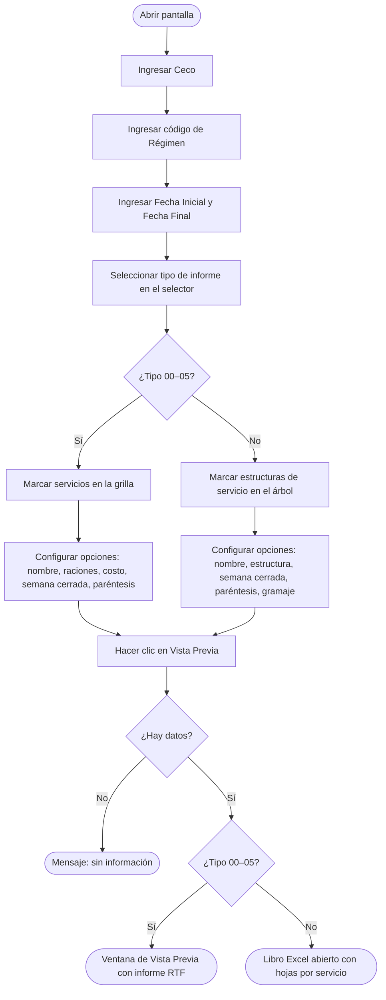

# Informe de Planificación de Minuta en Bloque

**Formulario:** `I_PlanifBloque.frm`
**Tabla(s) principal(es):** `cas_b_minuta` (cabecera de la minuta), `cas_b_minutadet` (detalle de la minuta — recetas por día y estructura de servicio)
**Consulta principal:** Múltiples procedimientos almacenados `sgpadm_` según el tipo de informe seleccionado

---

## Índice

- [1 — ¿Para qué sirve esta pantalla?](#1--para-qué-sirve-esta-pantalla)
- [2 — ¿Qué necesito para usarla?](#2--qué-necesito-para-usarla)
- [3 — ¿Cómo se usa?](#3--cómo-se-usa)
  - [3.1 Flujo paso a paso](#31-flujo-paso-a-paso)
  - [3.2 Controles y acciones disponibles](#32-controles-y-acciones-disponibles)
- [4 — ¿Qué restricciones debo conocer?](#4--qué-restricciones-debo-conocer)
  - [4.1 Validaciones del sistema](#41-validaciones-del-sistema)
- [5 — ¿Qué obtengo?](#5--qué-obtengo)
  - [Resumen de tipos disponibles](#resumen-de-tipos-disponibles)
  - [(00) Menú Mecano](#00-menú-mecano-i_menuplanmecanobloque)
  - [(01) Menú Mensual](#01-menú-mensual-i_menuplanmensualbloque)
  - [(02) Aporte Nutricional Detallado](#02-aporte-nutricional-detallado-i_aporteplandetalladobloque)
  - [(03) Aporte Nutricional Resumido](#03-aporte-nutricional-resumido-i_aporteplanresbloque)
  - [(04) Aporte Nutricional por Estructura](#04-aporte-nutricional-por-estructura-i_aporteplanestrresbloque)
  - [(05) Menú Mensual Servicios](#05-menú-mensual-servicios-i_menuplanbloquemensualserviciook)
  - [(06) Menú Mensual Formato Comercial](#06-menú-mensual-formato-comercial-excel)
  - [(07) Aporte Nutricional Detallado Formato Comercial](#07-aporte-nutricional-detallado-formato-comercial-excel)
  - [(08) Aporte Nutricional Resumido Formato Comercial](#08-aporte-nutricional-resumido-formato-comercial-excel)
  - [(09) Aporte Nutricional por Estructura Formato Comercial](#09-aporte-nutricional-por-estructura-formato-comercial-excel)
  - [(10) Solo Tabla Gramaje Formato Comercial](#10-solo-tabla-gramaje-formato-comercial-excel)
  - [(11) Tabla Gramaje y Frecuencia Formato Comercial](#11-tabla-gramaje-y-frecuencia-formato-comercial-excel)
  - [(12) Molécula Calórica Diario Detallado](#12-molécula-calórica-diario-detallado-excel)
  - [(13) Huella Carbono x Estructura Servicio](#13-huella-carbono-x-estructura-servicio-excel)
  - [(14) Huella Carbono x Minuta Detallado](#14-huella-carbono-x-minuta-detallado-excel)
  - [(15) Huella Carbono x Minuta Resumido](#15-huella-carbono-x-minuta-resumido-excel)
- [6 — Referencia técnica](#6--referencia-técnica)
  - [Tablas que intervienen](#tablas-que-intervienen)
  - [Relación con otros módulos](#relación-con-otros-módulos)

---

## 1 — ¿Para qué sirve esta pantalla?

[↑ Volver al índice](#índice)

Esta pantalla permite generar informes sobre la planificación de minutas en régimen bloque. A partir de un casino (ceco), un régimen y un rango de fechas, el usuario puede obtener 16 variantes de informe que cubren cuatro grandes áreas: presentación del menú, aportes nutricionales, tabla de gramajes y huella de carbono.

Los tipos del (00) al (05) producen un documento en la ventana de Vista Previa del sistema (formato RTF), desde donde se puede imprimir o exportar. Los tipos del (06) al (15) abren un libro de Microsoft Excel directamente con los datos organizados por hojas, una por servicio seleccionado.

La selección de servicios funciona de dos maneras según el tipo elegido: para los tipos (00)–(05) el usuario marca filas en una grilla de servicios disponibles; para los tipos (06)–(15) el usuario expande un árbol de servicios y estructuras de servicio, marcando las casillas de las estructuras que desea incluir.

---

## 2 — ¿Qué necesito para usarla?

[↑ Volver al índice](#índice)

| Campo | Obligatorio | Condición |
|---|---|---|
| Ceco | Sí | Debe existir en el maestro de clientes |
| Régimen | Sí | Debe existir en el maestro de regímenes |
| Fecha Inicial | Sí | Formato dd/mm/yyyy |
| Fecha Final | Sí | Formato dd/mm/yyyy; debe ser igual o mayor a la fecha inicial |
| Tipo de informe | Sí | Seleccionar uno de los 16 tipos en el selector |
| Servicio(s) | Sí | Al menos un servicio marcado (tipos 00–05) o al menos una estructura de servicio marcada en el árbol (tipos 06–15) |
| Nutriente(s) | Condicional | Al menos un nutriente marcado cuando el tipo es (02), (03), (04), (07), (08), (09) o (12) |
| Opción de nombre de receta | No | Elegir entre nombre fantasia o nombre de receta |
| Opción de nombre de estructura | No | Disponible para tipos que muestran estructura de servicio |
| Semana cerrada | No | Aplica a tipos (01), (05) y (06); cambia encabezados de columna de fecha real a "DIA 01", "DIA 02"… |
| Mostrar raciones | No | Disponible para tipos (01), (05) y (06) |
| Mostrar costo | No | Disponible para tipos (01), (05) y (06) |
| Incluir paréntesis en nombre | No | Incluye o excluye el texto entre paréntesis del nombre de la receta |
| Tipo de gramaje | Condicional | "Bruto" o "Cant. Servida"; solo activo para tipos (10) y (11) |

---

## 3 — ¿Cómo se usa?

[↑ Volver al índice](#índice)

### 3.1 Flujo paso a paso

[↑ Volver al índice](#índice)

### 3.2 Controles y acciones disponibles

[↑ Volver al índice](#índice)

| Control | Descripción |
|---|---|
| Campo Ceco | Código del casino. Al cambiarlo, la grilla de servicios se recarga automáticamente |
| Icono búsqueda Ceco | Abre la ventana de búsqueda de clientes |
| Campo Régimen | Código numérico del régimen. Al cambiarlo, la grilla y el árbol se recargan |
| Icono búsqueda Régimen | Abre la ventana de búsqueda de regímenes |
| Fecha Inicial / Fecha Final | Rango de fechas del período a informar |
| Icono búsqueda Servicio | Abre la ventana de selección de servicios (para tipos 00–05) o la de estructuras (para tipos 06–15) |
| Icono búsqueda Nutrientes | Abre la ventana de selección de nutrientes |
| Selector de tipo de informe (Combo1) | Lista desplegable con los 16 tipos disponibles. Al cambiar el tipo, habilita o deshabilita los paneles de opciones correspondientes |
| Panel "Servicio" | Botones "Todos" / "Lista"; controla si se incluyen todos los servicios o solo los marcados |
| Panel "Nutrientes" | Botones "Todos" / "Lista"; controla si se incluyen todos los nutrientes o solo los marcados |
| Panel "Aportes" | Opciones de tipo de peso: Peso Bruto, Peso Servido, Peso Neto, Peso Neto Nut., Todos; disponible para tipos de aporte nutricional |
| Panel "Recetas" | Opciones de nombre: nombre fantasia o nombre estándar |
| Panel "Estructuras" | Árbol con servicios y estructuras de servicio (tipos 06–15) |
| Panel "Semana Cerrada" | Casilla que reemplaza fechas reales por "DIA 01", "DIA 02"… en el encabezado |
| Panel "Gramaje" | Opciones "Bruto" / "Cant. Servida"; solo para tipos (10) y (11) |
| Casilla "Incluir paréntesis" | Incluye o excluye el texto entre paréntesis del nombre de receta |
| Botón "Vista Previa" (toolbar) | Ejecuta las validaciones y genera el informe |
| Botón "Histórico Planificación Teórica" (toolbar) | Abre la ventana de historial de planificaciones teóricas del casino |
| Botón "Salir" (toolbar) | Cierra el formulario |

---

## 4 — ¿Qué restricciones debo conocer?

[↑ Volver al índice](#índice)

### 4.1 Validaciones del sistema

[↑ Volver al índice](#índice)

| # | Cuándo aparece | Qué verifica el sistema | Qué ve o experimenta el usuario |
|---|---|---|---|
| 1 | Al hacer clic en Vista Previa | Que la grilla de servicios no esté vacía | Mensaje: "No existe Información Servicio" |
| 2 | Al hacer clic en Vista Previa | Que el ceco ingresado exista en el maestro | Mensaje: "No existe ceco" |
| 3 | Al hacer clic en Vista Previa | Que el régimen ingresado exista en el maestro | Mensaje: "No existe regimen" |
| 4 | Al hacer clic en Vista Previa | Que la fecha inicial no sea mayor que la final | Mensaje: "Fecha origen Mayor destino" |
| 5 | Al hacer clic en Vista Previa (tipos distintos al 06) | Que el mes de la fecha inicial no sea mayor que el mes de la final | Mensaje: "Mes origen mayor destino" |
| 6 | Al hacer clic en Vista Previa | Que el año de la fecha inicial no sea mayor que el año de la final | Mensaje: "Año origen mayor destino" |
| 7 | Al hacer clic en Vista Previa (tipos 01 y 05) | Que ambas fechas pertenezcan al mismo mes | Mensaje: "El mes debe ser el mismo en ambas fechas" |
| 8 | Al hacer clic en Vista Previa (tipo 06) | Que el rango de fechas no supere los 31 días | Mensaje: "Ha sobrepasado los 31 días de planificación" |
| 9 | Al hacer clic en Vista Previa (tipos 00–05, opción "Lista") | Que al menos un servicio esté marcado en la grilla | Mensaje: "Servicio debe ser informado" |
| 10 | Al hacer clic en Vista Previa (tipos 06–15) | Que al menos una estructura de servicio esté marcada en el árbol | Mensaje: "No ha seleccionado estructura de servicio..." |
| 11 | Al hacer clic en Vista Previa (tipos con panel Nutrientes habilitado) | Que al menos un nutriente esté marcado | Mensaje: "Nutriente debe ser informado" |
| 12 | Al cargar el formulario | Que exista el maestro de nutrientes en la base de datos | Mensaje: "No existe maestro nutrientes" y el formulario se cierra |
| 13 | Al ingresar el régimen | Que el código de régimen exista | Si no existe, el campo de nombre del régimen queda en blanco |
| 14 | Al ejecutar cualquier consulta que no retorna datos | Que el SP retorne al menos un registro | El informe no se genera; se libera la pantalla sin mensaje de error |

---

## 5 — ¿Qué obtengo?

[↑ Volver al índice](#índice)

### Resumen de tipos disponibles

[↑ Volver al índice](#índice)

| Código | Nombre en el selector | Formato de salida | Procedimiento almacenado principal |
|---|---|---|---|
| (00) | Menú Mecano | Vista Previa (RTF) | `sgpadm_Sel_InfMecanoMinutaBloque_V02` |
| (01) | Menú Mensual | Vista Previa (RTF) | `sgpadm_Sel_MinutaBloqueMenuMensualxEstservicio` |
| (02) | Aporte Nutricionales Detallado | Vista Previa (RTF) | `sgpadm_Sel_MinutaBloqueAporteDetxEstServicio_V02` |
| (03) | Aporte Nutricionales Resumido | Vista Previa (RTF) | `sgpadm_Sel_AportePlanifMinutaBloque_V02` + `sgpadm_Sel_AporteMinutasDetBloque_V02` |
| (04) | Aporte Nutricionales por Estructura | Vista Previa (RTF) | `sgpadm_Sel_MinutaBloqueAporteDetxEstServicio_V02` |
| (05) | Menú Mensual Servicios | Vista Previa (RTF) | `sgpadm_Sel_MinutaBloqueMenuMensualxEstservicio` |
| (06) | Menú Mensual (Formato Comercial) | Excel | `sgpadm_Sel_MinutaBloqueMenuMensualxEstservicio` |
| (07) | Aporte Nutricionales Detallado (Formato Comercial) | Excel | `sgpadm_Sel_MinutaBloqueAporteDetxEstServicio_V02` |
| (08) | Aporte Nutricionales Resumido (Formato Comercial) | Excel | `sgpadm_Sel_MinutaBloqueAporteDetxEstServicio_V02` |
| (09) | Aporte Nutricionales por Estructura (Formato Comercial) | Excel | `sgpadm_Sel_MinutaBloqueAporteDetxEstServicio_V02` |
| (10) | Solo Tabla Gramaje (Formato Comercial) | Excel | `sgpadm_Sel_MinutaBloqueTablaGramajeFrecuencia_V02` |
| (11) | Tabla Gramaje y Frecuencia (Formato Comercial) | Excel | `sgpadm_Sel_MinutaBloqueTablaGramajeFrecuencia_V02` |
| (12) | Molécula Calórica Diario Detallado | Excel | `sgpadm_Sel_MinutaBloqueMoleculaCaloricaNDia` + `sgpadm_Sel_MinutaBloqueAporteDetxEstServicio_V02` |
| (13) | Huella Carbono x Estructura Servicio | Excel | `sgpadm_Sel_HuellaCarbonoxEstructuraServicio_V01` |
| (14) | Huella Carbono x Minuta Detallado | Excel | `sgpadm_Sel_HuellaCarbonoxEstructuraServicio_V01` |
| (15) | Huella Carbono x Minuta Resumido | Excel | `sgpadm_Sel_HuellaCarbonoxEstructuraServicio_V01` |

---

### (00) Menú Mecano (`I_MenuPlanMecanoBloque`)

[↑ Volver al índice](#índice)

1. **Qué muestra.** Genera un informe de "menú mecano" en la ventana de Vista Previa. Cada página corresponde a un servicio y un día de la minuta. El contenido se organiza en una tabla de tres columnas: nombre de la estructura de servicio, columna separadora en blanco, y nombre de la receta planificada para esa estructura en ese día.

2. **Restricciones propias.** No hay restricciones adicionales más allá de las generales del formulario. Si no existen registros para el servicio y el rango de fechas, el informe no genera ninguna página para ese servicio.

3. **Cómo se seleccionan los servicios.** El usuario marca filas en la grilla de servicios (panel "Servicio" con opciones "Todos" / "Lista"). El informe genera una sección por cada servicio marcado.

4. **Opciones de configuración disponibles.**
   - Nombre de receta: nombre fantasia (`rec_nomfan`) o nombre estándar (`rec_nombre`)
   - Nombre de estructura de servicio: nombre del campo `ess_nombre` o descripción de la planificación (`mid_desest`) según la opción "opnomest"
   - Semana cerrada: los encabezados de página muestran "DIA 01", "DIA 02"… en vez de la fecha real
   - Incluir o excluir texto entre paréntesis del nombre de receta

5. **Estructura de datos del informe.**

   El informe se construye a partir del SP `sgpadm_Sel_InfMecanoMinutaBloque_V02`. Cada fila del resultado corresponde a una combinación de día, estructura de servicio y receta.

   | Campo / Columna | Descripción | Calculado |
   |---|---|---|
   | Nombre de régimen | Nombre del régimen, leído desde `a_regimen.reg_nombre` | No |
   | Nombre de servicio | Nombre del servicio, leído desde la grilla del formulario (origen: `a_servicio.ser_nombre`) | No |
   | Fecha / Día | Fecha de la minuta (`min_fecmin`) o número de día si "semana cerrada" está activa | No / Sí |
   | Nombre de estructura | `ess_nombre` de `a_estservicio`, o `mid_desest` de `cas_b_minutadet` si "opnomest" está activo y `mid_desest` no es nulo | Sí (condicional) |
   | Nombre de receta | `rec_nomfan` de `b_receta` (nombre fantasia) o `rec_nombre` (nombre estándar), según la opción seleccionada; opcionalmente se elimina el contenido entre paréntesis | Sí (condicional) |

   **Campos del SP que alimentan el informe:**

   | Campo del SP | Tabla de origen | Calculado |
   |---|---|---|
   | `mid_tipmin` | `cas_b_minutadet` | No |
   | `mid_numlin` | `cas_b_minutadet` (número de línea de la minuta) | No |
   | `mid_codrec` | `cas_b_minutadet` | No |
   | `mid_descri` | `cas_b_minutadet` | No |
   | `mid_cosrec` | `cas_b_minutadet` (costo congelado al grabar) | No |
   | `mid_cosdes` | `cas_b_minutadet` | No |
   | `min_fecmin` | `cas_b_minuta` | No |
   | `rec_nombre` | `b_receta` | No |
   | `rec_nomfan` | `b_receta` | No |
   | `mid_numrac` | `cas_b_minutadet` (raciones planificadas) | No |
   | `mid_estser` | `cas_b_minutadet` (código de estructura de servicio) | No |
   | `ess_nombre` | `a_estservicio`, con lógica condicional según `@opest` y `mid_desest` | Sí |
   | `Numdia` | `IDENTITY(INT,1,1)` — número correlativo generado en tabla temporal | Sí |

   **Cálculo — Número de día secuencial (`Numdia`)**

   El SP genera un contador automático con `IDENTITY(1,1)` que asigna un número de orden a cada fila del resultado. Este número no tiene relación con la fecha sino con el orden de aparición en el resultado.

   | Componente | Valor |
   |---|---|
   | Tipo | Contador `IDENTITY(INT,1,1)` en tabla temporal `#PASO` |
   | Inicio | 1 para el primer registro del resultado |
   | Incremento | 1 por cada fila |

   **Cálculo — `ess_nombre` (nombre de estructura)**

   El SP aplica la siguiente lógica:
   - Si `@opest = 1` y `mid_desest` no es nulo ni vacío → muestra `mid_desest`
   - Si `@opest = 1` y `mid_desest` es nulo o vacío → muestra `aes.ess_nombre`
   - Si `@opest = 0` → muestra siempre `aes.ess_nombre`

6. **Formato de salida.** Documento en la ventana de Vista Previa, orientación vertical. Una tabla sin bordes por servicio/día. El usuario puede imprimir o exportar desde esa ventana.

---

### (01) Menú Mensual (`I_MenuPlanMensualBloque`)

[↑ Volver al índice](#índice)

1. **Qué muestra.** Genera un informe mensual en la ventana de Vista Previa con las recetas planificadas organizadas en una grilla donde las filas son estructuras de servicio y las columnas son los días de la semana (Lunes a Domingo). Cada hoja de la grilla representa una semana del mes. El encabezado muestra el nombre del casino, régimen y servicio con el mes/año.

2. **Restricciones propias.** Las fechas inicial y final deben pertenecer al mismo mes calendario. Si se viola esta condición, el sistema emite el mensaje "El mes debe ser el mismo en ambas fechas" y no genera el informe. Cuando la casilla "Semana Cerrada" está activa, los encabezados de columna muestran "DIA 01" … "DIA 07" en lugar del día de la semana con fecha.

3. **Cómo se seleccionan los servicios.** El usuario marca filas en la grilla de servicios. Se genera una hoja por servicio marcado.

4. **Opciones de configuración disponibles.**
   - Nombre de receta: fantasia o estándar
   - Nombre de estructura: nombre propio o descripción de la planificación
   - Semana cerrada: columnas por número de día en vez de día de semana con fecha
   - Mostrar raciones: agrega el número de raciones planificadas al nombre de la receta
   - Mostrar costo: agrega el costo unitario formateado al nombre de la receta
   - Incluir paréntesis en nombre de receta

5. **Estructura de datos del informe.**

   Utiliza `sgpadm_Sel_MinutaBloqueMenuMensualxEstservicio` (cuando "semana cerrada" está inactiva) o `sgpadm_Sel_DetalleMinutaBloqueSemanaCerrada_V02` (cuando "semana cerrada" está activa). El informe recibe el XML de estructuras seleccionadas.

   | Campo / Columna | Descripción | Calculado |
   |---|---|---|
   | Encabezado "Estructura" | Columna fija con el nombre de la estructura de servicio (`ess_nombre`) | No |
   | Columnas de día (Lunes … Domingo o DIA 01 … DIA 07) | Cabeceras generadas por el formulario según la posición de la fecha en la semana | Sí |
   | Celda día × estructura | Nombre de la receta planificada, opcionalmente con raciones y costo | Sí (condicional) |

   **Campos del SP `sgpadm_Sel_MinutaBloqueMenuMensualxEstservicio`:**

   | Campo | Tabla de origen | Calculado |
   |---|---|---|
   | `mid_tipmin` | `cas_b_minutadet` | No |
   | `mid_numlin` | `cas_b_minutadet` | No |
   | `mid_codrec` | `cas_b_minutadet` | No |
   | `mid_descri` | `cas_b_minutadet` | No |
   | `mid_cosrec` | `cas_b_minutadet` | No |
   | `mid_cosdes` | `cas_b_minutadet` | No |
   | `min_fecmin` | `cas_b_minuta` | No |
   | `min_indblo` | `cas_b_minuta` (indicador de bloqueo) | No |
   | `rec_nombre` | `b_receta` | No |
   | `rec_nomfan` | `b_receta` | No |
   | `mid_numrac` | `cas_b_minutadet` | No |
   | `mid_estser` | `cas_b_minutadet` | No |
   | `ess_nombre` | `a_estservicio` | No |
   | `mid_desest` | `cas_b_minutadet` | No |

   **Cálculo — Nombre en celda día × estructura**

   El formulario construye el texto de la celda combinando varios campos:
   - Si "nombre fantasia" → usa `rec_nomfan`; si no → usa `rec_nombre`
   - Si "no incluir paréntesis" → aplica función `ExtraeParentesis()` que elimina el contenido entre paréntesis
   - Si "mostrar raciones" → agrega `"( " & mid_numrac & " raciones)"`
   - Si "mostrar costo" → agrega `"- Costo uni. $ " & Format(mid_cosrec, ...)`

   **Cálculo — Columna del día en la grilla**

   El formulario calcula la posición de columna para cada fila del resultado según la función `fg_Dia(min_fecmin)` que devuelve el número de día de la semana (Domingo=1, Lunes=2 … Sábado=7). Luego mapea ese valor al índice de columna correspondiente (1=Domingo→columna 1, 2=Lunes→columna 2, etc.).

6. **Formato de salida.** Documento en la ventana de Vista Previa, orientación horizontal. Tabla con bordes que agrupa la semana. El encabezado de la tabla se repite cada semana.

---

### (02) Aporte Nutricional Detallado (`I_AportePlanDetalladoBloque`)

[↑ Volver al índice](#índice)

1. **Qué muestra.** Genera en la ventana de Vista Previa el detalle de aportes nutricionales por ingrediente de cada receta de la minuta. Para cada día del período, lista las recetas y, dentro de cada receta, los ingredientes con sus cantidades de aporte nutricional para los nutrientes seleccionados. Al final de cada receta imprime un subtotal ("Total Aporte") y al final del día un total del día.

2. **Restricciones propias.** Requiere que al menos un nutriente esté marcado en el panel de nutrientes. Si la opción "Todos" está activa en el panel de Nutrientes, usa todos los nutrientes con `nut_indpri = 1` (los que se cargan por defecto al abrir el formulario).

3. **Cómo se seleccionan los servicios.** El usuario marca filas en la grilla de servicios.

4. **Opciones de configuración disponibles.**
   - Tipo de peso para columna de cantidad: Peso Bruto (`canpro`), Peso Servido (`canpro × red_pctcoc/100 × red_pctapr/100`), Neta Nut. (`canpro × red_pctnut/100`), Peso Neto (`canpro × red_pctapr/100`), o Todos (las cuatro columnas simultáneamente)
   - Nombre de receta: fantasia o estándar
   - Semana cerrada: número de día en vez de fecha real
   - Incluir paréntesis en nombre de receta
   - Nutrientes: selección libre de los nutrientes que aparecerán como columnas del informe

5. **Estructura de datos del informe.**

   Usa `sgpadm_Sel_AporteMinutasDetBloque_V02` para el detalle de ingredientes y `sgpadm_Sel_AportePlanifMinutaBloque_V02` para los aportes nutricionales (tabla de producto-nutriente-cantidad).

   | Campo / Columna | Descripción | Calculado |
   |---|---|---|
   | Encabezado de día o fecha | Fecha real (`min_fecmin`) o número de día según "semana cerrada" | Condicional |
   | Casino | `Cli_nombre` de `b_clientes` | No |
   | Régimen | `reg_nombre` de `a_regimen` | No |
   | Servicio | `ser_nombre` del servicio seleccionado | No |
   | Preparaciones | Nombre de la receta (`rec_nomfan` o `rec_nombre`) | Sí (condicional) |
   | Cant. Servida Ma. | Cantidad servida máxima (`rec_canser`) de `b_receta` | No |
   | Ingrediente | `ing_nombre` de `b_ingrediente` | No |
   | C.Bruta | Cantidad bruta por ración (`canpro` = `red_canpro / rec_basrac`) | Sí |
   | C.Neta | Cantidad neta por ración = `canpro × (red_pctapr / 100)` | Sí |
   | C.Servida | Cantidad servida = `canpro × (red_pctcoc/100) × (pctapr/100)` | Sí |
   | Neta Nut. | Cantidad neta nutricional = `canpro × (red_pctnut / 100)` | Sí |
   | [Nutriente N] | Aporte del nutriente N para el ingrediente | Sí |
   | Total Aporte | Suma de aportes por nutriente acumulada durante la receta | Sí |
   | Total Día | Suma de aportes por nutriente acumulada durante el día | Sí |

   **Cálculo — Cantidad bruta por ración (`canpro`)**

   | Componente | Valor |
   |---|---|
   | Fórmula | `red_canpro / rec_basrac` |
   | `red_canpro` | Cantidad del ingrediente en la receta (gramos), campo directo de `b_recetadet` |
   | `rec_basrac` | Base de raciones de la receta, campo directo de `b_receta` |
   | Resultado | Gramos del ingrediente por ración de la receta |

   **Cálculo — Cantidad neta (`C.Neta`)**

   | Componente | Valor |
   |---|---|
   | Fórmula | `canpro × (red_pctapr / 100)` |
   | `red_pctapr` | Porcentaje de aprovechamiento del ingrediente en la receta |
   | Resultado | Peso neto por ración, en gramos |

   **Cálculo — Cantidad servida (`C.Servida`)**

   | Componente | Valor |
   |---|---|
   | Fórmula | `canpro × (red_pctcoc / 100) × (pctapr / 100)` |
   | `red_pctcoc` | Porcentaje de cocción del ingrediente en la receta |
   | `pctapr` | Si el ingrediente fue reemplazado (`red_codpro ≠ ori_codpro`) usa `ing_pctapr` de `b_ingrediente`; si no, usa `red_pctapr` de la receta |
   | Resultado | Peso servido por ración, en gramos |

   **Cálculo — Cantidad neta nutricional (`Neta Nut.`)**

   | Componente | Valor |
   |---|---|
   | Fórmula | `canpro × (red_pctnut / 100)` |
   | `red_pctnut` | Porcentaje nutricional del ingrediente |
   | Resultado | Peso neto para cálculo de nutrientes, en gramos |

   **Cálculo — Aporte de nutriente N**

   | Componente | Valor |
   |---|---|
   | Fórmula | `(red_pctnut / 100) × pnu_canapo × canpro / ing_facnut` |
   | `pnu_canapo` | Cantidad de aporte del nutriente por unidad de ingrediente, de `b_productonut` |
   | `ing_facnut` | Factor nutricional del ingrediente, de `b_ingrediente` |
   | Resultado | Gramos (o unidad del nutriente) por ración |

   El aporte por nutriente se acumula en `vecrec(j)` (total de la receta) y en `VecDia(j)` (total del día) durante el recorrido del cursor.

   **Ejemplo:** Ingrediente con `canpro = 100 g`, `red_pctnut = 90%`, `pnu_canapo = 2.5`, `ing_facnut = 100`:
   Aporte = `(90/100) × 2.5 × 100 / 100 = 2.25` unidades del nutriente.

6. **Formato de salida.** Documento en la ventana de Vista Previa, orientación vertical. Se genera una nueva página por cada día del período.

---

### (03) Aporte Nutricional Resumido (`I_AportePlanResBloque`)

[↑ Volver al índice](#índice)

1. **Qué muestra.** Similar al tipo (02) pero sin el detalle por ingrediente. Para cada receta de la minuta muestra directamente el total de aporte nutricional por nutriente seleccionado, sin listar los ingredientes uno a uno. Al final del día incluye el total del día por nutriente.

2. **Restricciones propias.** Requiere al menos un nutriente marcado.

3. **Cómo se seleccionan los servicios.** Grilla de servicios (tipos 00–05).

4. **Opciones de configuración disponibles.**
   - Nombre de receta: fantasia o estándar
   - Semana cerrada
   - Nutrientes: selección de columnas
   - Incluir paréntesis en nombre de receta

5. **Estructura de datos del informe.**

   Usa el mismo par de SPs que el tipo (02): `sgpadm_Sel_AportePlanifMinutaBloque_V02` (tabla de aportes) y `sgpadm_Sel_AporteMinutasDetBloque_V02` (detalle de ingredientes).

   | Campo / Columna | Descripción | Calculado |
   |---|---|---|
   | Casino | `Cli_nombre` de `b_clientes` | No |
   | Régimen | `reg_nombre` de `a_regimen` | No |
   | Servicio | Nombre del servicio seleccionado | No |
   | Fecha / Día | Fecha real o número de día | No / Sí |
   | Preparaciones | Nombre de la receta (`rec_nomfan` o `rec_nombre`) | Sí (condicional) |
   | [Nutriente N] (columna por receta) | Total de aporte del nutriente N acumulado para toda la receta | Sí |
   | Total Día | Suma total de aportes por nutriente durante el día | Sí |

   **Cálculo — Total de aporte por receta y por nutriente**

   El formulario recorre el cursor de `sgpadm_Sel_AporteMinutasDetBloque_V02` (ingredientes) y acumula en `vecrec(j)`:

   `vecrec(j) += (red_pctnut / 100) × pnu_canapo × canpro / ing_facnut`

   Donde `pnu_canapo` viene de `b_productonut` cruzado previamente vía `sgpadm_Sel_AportePlanifMinutaBloque_V02`. Al cambiar de receta se imprime el acumulado y se reinicia `vecrec`. Al cambiar de día se imprime el total del día desde `VecDia(j)` y se reinicia.

6. **Formato de salida.** Documento en la ventana de Vista Previa, orientación vertical. Una página por día del período.

---

### (04) Aporte Nutricional por Estructura (`I_AportePlanEstrResBloque`)

[↑ Volver al índice](#índice)

1. **Qué muestra.** Similar al tipo (03) pero agrupado por estructura de servicio. Para cada estructura de servicio en la minuta muestra el total de aporte nutricional por nutriente seleccionado, acumulando todos los días del período.

2. **Restricciones propias.** Requiere al menos un nutriente marcado. Las fechas no están restringidas al mismo mes.

3. **Cómo se seleccionan los servicios.** Grilla de servicios.

4. **Opciones de configuración disponibles.**
   - Nombre de receta: fantasia o estándar
   - Nombre de estructura de servicio
   - Nutrientes: selección de columnas
   - Semana cerrada: no aplica para este tipo (el parámetro `opSemCerrada` no se pasa en el formulario)

5. **Estructura de datos del informe.**

   Usa `sgpadm_Sel_MinutaBloqueAporteDetxEstServicio_V02` (recibe XML de estructuras seleccionadas).

   | Campo / Columna | Descripción | Calculado |
   |---|---|---|
   | Ceco | `Cli_nombre` | No |
   | Régimen | `reg_nombre` | No |
   | Servicio | `ser_nombre` | No |
   | Estructura | `ess_nombre` de `a_estservicio` | No |
   | Preparaciones | Nombre de receta | Sí (condicional) |
   | [Nutriente N] | Aporte acumulado del nutriente para la estructura durante el período | Sí |

   **Cálculo — Aportes acumulados por estructura**

   El formulario usa `sgpadm_Sel_TotalRegMinutaBloque` y vectores de resumen para acumular el aporte total por estructura. La fórmula base es la misma que en el tipo (02), pero el corte de control es por estructura (`mid_estser`) en vez de por receta.

   **Campos clave del SP `sgpadm_Sel_MinutaBloqueAporteDetxEstServicio_V02`:**

   | Campo | Tabla de origen | Calculado |
   |---|---|---|
   | `mid_tipmin` | `cas_b_minutadet` | No |
   | `mid_numlin` | `cas_b_minutadet` | No |
   | `mid_codrec` | `cas_b_minutadet` | No |
   | `mid_cosrec` | `cas_b_minutadet` | No |
   | `min_fecmin` | `cas_b_minuta` | No |
   | `min_indblo` | `cas_b_minuta` | No |
   | `rec_nombre` | `b_receta` | No |
   | `rec_nomfan` | `b_receta` | No |
   | `mid_numrac` | `cas_b_minutadet` | No |
   | `red_codpro` | `b_recetadet`, actualizado por `fn_ObtenerIngredienteReemplazoJerarquia` | Sí |
   | `red_pctapr` | `b_recetadet` | No |
   | `red_pctcoc` | `b_recetadet` | No |
   | `red_pctnut` | `b_recetadet` | No |
   | `canpro` | `red_canpro / rec_basrac` (calculado en SP) | Sí |
   | `ing_nombre` | `b_ingrediente` | No |
   | `ing_facnut` | `b_ingrediente` | No |
   | `ing_pctapr` | `b_ingrediente` | No |
   | `ori_codpro` | Código original antes del reemplazo | Sí |
   | `nreg` | Conteo total de filas del resultado (`@nreg`) | Sí |
   | `rec_indppr` | `b_receta` (indicador propuesta/real) | No |
   | `rec_canser` | `b_receta` (cantidad servida máxima) | No |

   **Cálculo — `canpro` (cantidad bruta por ración)**

   | Componente | Valor |
   |---|---|
   | Fórmula | `red_canpro / rec_basrac` |
   | Calculado en | SP, columna `canpro` |

6. **Formato de salida.** Documento en la ventana de Vista Previa, orientación vertical.

---

### (05) Menú Mensual Servicios (`I_MenuPlanBloqueMensualServicioOk`)

[↑ Volver al índice](#índice)

1. **Qué muestra.** Variante del tipo (01) que combina múltiples servicios en una misma tabla semanal. Las filas tienen dos columnas identificadoras: "Servicio" y "Estructura", seguidas de las columnas de días de la semana. Permite ver en una sola grilla todos los servicios seleccionados comparativamente.

2. **Restricciones propias.** Las fechas deben pertenecer al mismo mes. El sistema llama a la función escalar `sgpadm_p_DiasSemanaCorridaServicioBloque` para determinar cuántas columnas de día incluir (hasta 8 columnas, contemplando posibilidad de sábado y domingo). El procesamiento es semana a semana: por cada semana del mes llama a `sgpadm_Sel_InformeMensualServicioBloque_V02` con el rango de esa semana.

3. **Cómo se seleccionan los servicios.** Grilla de servicios (tipos 00–05). Todos los servicios marcados se incluyen en la misma tabla.

4. **Opciones de configuración disponibles.**
   - Nombre de receta: fantasia o estándar
   - Nombre de estructura
   - Semana cerrada
   - Mostrar raciones y costo
   - Incluir paréntesis en nombre de receta

5. **Estructura de datos del informe.**

   El SP `sgpadm_Sel_InformeMensualServicioBloque_V02` retorna los mismos campos que `sgpadm_Sel_MinutaBloqueMenuMensualxEstservicio` pero para todos los servicios de una semana simultáneamente, más el campo `min_codser` que identifica el servicio.

   | Campo / Columna | Descripción | Calculado |
   |---|---|---|
   | Servicio | `min_codser` — código del servicio de la minuta | No |
   | Estructura | `ess_nombre` de `a_estservicio` | No |
   | Columnas de día (Lunes … Domingo o DIA N) | Nombre de receta por día | Sí |

   Los mismos campos del SP que el tipo (01). El formulario usa `mid_numlin` para posicionar la receta en la fila correcta de la grilla y usa `fg_Dia(min_fecmin)` para posicionarla en la columna correcta.

6. **Formato de salida.** Documento en la ventana de Vista Previa, orientación horizontal.

---

### (06) Menú Mensual (Formato Comercial) [Excel]

[↑ Volver al índice](#índice)

1. **Qué muestra.** Equivalente al tipo (01) pero en formato Excel. Genera un libro con una hoja por servicio seleccionado. Cada hoja muestra la grilla semanal de la minuta con estructuras en filas y días en columnas. El encabezado de la hoja contiene el título "S e t de M i n u t a", el nombre del casino, el nombre del servicio, y la fecha con el mes y año.

2. **Restricciones propias.** El rango no puede superar 31 días. Las fechas deben pertenecer al mismo mes en los tipos 01 y 05, pero el tipo 06 permite hasta 31 días. La hoja de Excel lleva el nombre del servicio (hasta 31 caracteres, sin caracteres inválidos). Si el nombre ya existe en el libro, se antepone el código del servicio.

3. **Cómo se seleccionan los servicios.** Árbol de servicios y estructuras (tipos 06–15).

4. **Opciones de configuración disponibles.**
   - Nombre de receta: fantasia o estándar
   - Nombre de estructura (opción `opnomest`)
   - Semana cerrada
   - Mostrar raciones y costo
   - Incluir paréntesis en nombre de receta

5. **Estructura de datos del informe.**

   Usa `sgpadm_Sel_MinutaBloqueMenuMensualxEstservicio` con el XML de estructuras seleccionadas.

   | Campo / Columna Excel | Campo del SP | Calculado |
   |---|---|---|
   | Fila de encabezado: "S e t de M i n u t a" | Texto fijo | Sí |
   | Fila de casino | `Cli_nombre` de `sgpadm_s_cliente_V02` | No |
   | Fila de servicio | Nombre del servicio de la grilla | No |
   | Columna A (fila 7): "Estructura" | Texto fijo | Sí |
   | Columnas B–H (fila 7): día de la semana con fecha o DIA N | Calculado por el formulario a partir de `min_fecmin` | Sí |
   | Columna A (filas 9+): nombre de estructura | `ess_nombre` o `mid_desest` según `opnomest` | Sí |
   | Columnas B–H (filas 9+): nombre de receta | `rec_nomfan` o `rec_nombre` + raciones + costo opcionales | Sí |

   **Cálculo — Posición de columna para cada receta**

   Para "semana natural" (opSemCerrada=False): la columna se determina por `fg_Dia(min_fecmin)` mapeado al vector `VecDia()`. Para "semana cerrada" (opSemCerrada=True): la columna se determina por la posición relativa del día dentro de los grupos de 7 (días 1–7 → columna 1, días 8–14 → columna 2 de esa semana, etc.).

6. **Formato de salida.** Libro de Microsoft Excel abierto al terminar. Ancho de columna 40, texto con ajuste automático, sin líneas de cuadrícula.

---

### (07) Aporte Nutricional Detallado (Formato Comercial) [Excel]

[↑ Volver al índice](#índice)

1. **Qué muestra.** Equivalente al tipo (02) en formato Excel. Genera un libro con una hoja por servicio. Cada hoja contiene el detalle de aportes nutricionales por ingrediente de cada receta, con las columnas de cantidad de peso y los nutrientes seleccionados.

2. **Restricciones propias.** Requiere al menos un nutriente marcado.

3. **Cómo se seleccionan los servicios.** Árbol de servicios y estructuras.

4. **Opciones de configuración disponibles.**
   - Nombre de receta: fantasia o estándar
   - Tipo de peso: Peso Bruto, Peso Neto, Peso Servido, Neta Nut., o Todos
   - Semana cerrada
   - Nutrientes: selección de columnas
   - Incluir paréntesis en nombre de receta

5. **Estructura de datos del informe.**

   Usa `sgpadm_Sel_MinutaBloqueAporteDetxEstServicio_V02` con XML de estructuras. El formulario usa la subrutina `ExportaExcelPlanDetalladoResumidoMKT` con `EstadoPresentacion = 1` (modo detallado).

   | Campo / Columna Excel | Origen | Calculado |
   |---|---|---|
   | Fila de casino | `Cli_nombre` | No |
   | Fila de régimen | `reg_nombre` | No |
   | Fila de servicio | Nombre del servicio | No |
   | Fila fecha / día | `min_fecmin` o número de día | No / Sí |
   | Columna "Preparaciones" | Nombre de receta + raciones + costo opcionales | Sí |
   | Columna "C.Bruta" (si opción activa) | `canpro` = `red_canpro / rec_basrac` | Sí |
   | Columna "C.Neta" (si opción activa) | `canpro × (red_pctapr / 100)` | Sí |
   | Columna "C.Servida" (si opción activa) | `canpro × (red_pctcoc/100) × (pctapr/100)` | Sí |
   | Columna "Neta Nut." (si opción activa) | `canpro × (red_pctnut / 100)` | Sí |
   | Columna ingrediente | `ing_nombre` | No |
   | Columna [Nutriente N] | `(red_pctnut/100) × pnu_canapo × canpro / ing_facnut` | Sí |
   | Fila "Total Aporte" (por receta) | Acumulado `vecrec(j)` | Sí |
   | Fila "Total Día" | Acumulado `VecDia(j)` | Sí |

   Los cálculos de cantidades son idénticos a los descritos en el tipo (02).

6. **Formato de salida.** Libro Excel abierto al terminar.

---

### (08) Aporte Nutricional Resumido (Formato Comercial) [Excel]

[↑ Volver al índice](#índice)

1. **Qué muestra.** Equivalente al tipo (03) en formato Excel. Aportes nutricionales a nivel de receta (sin detalle por ingrediente), con totales por día.

2. **Restricciones propias.** Requiere al menos un nutriente marcado.

3. **Cómo se seleccionan los servicios.** Árbol de servicios y estructuras.

4. **Opciones de configuración disponibles.** Mismas que el tipo (07), excepto que no hay opción de "Todos" los pesos simultáneamente.

5. **Estructura de datos del informe.**

   Usa `sgpadm_Sel_MinutaBloqueAporteDetxEstServicio_V02`. El formulario usa `ExportaExcelPlanDetalladoResumidoMKT` con `EstadoPresentacion = 2` (modo resumido). Los campos del SP y los cálculos son idénticos a los del tipo (07), pero el formulario omite las filas de ingredientes y solo imprime las filas de receta y totales.

   | Campo / Columna Excel | Origen | Calculado |
   |---|---|---|
   | Fila de encabezado (casino, régimen, servicio, fecha) | Mismo que tipo (07) | Igual |
   | Columna "Preparaciones" | Nombre de receta | Sí (condicional) |
   | Columna [Nutriente N] (por receta) | Acumulado `vecrec(j)` | Sí |
   | Fila "Total Día" | Acumulado `VecDia(j)` | Sí |

6. **Formato de salida.** Libro Excel abierto al terminar.

---

### (09) Aporte Nutricional por Estructura (Formato Comercial) [Excel]

[↑ Volver al índice](#índice)

1. **Qué muestra.** Equivalente al tipo (04) en formato Excel. Aportes nutricionales agrupados por estructura de servicio para el período completo.

2. **Restricciones propias.** Requiere al menos un nutriente marcado.

3. **Cómo se seleccionan los servicios.** Árbol de servicios y estructuras.

4. **Opciones de configuración disponibles.**
   - Nombre de receta y nombre de estructura
   - Tipo de peso (Peso Bruto, etc.)
   - Nutrientes

5. **Estructura de datos del informe.**

   Usa `sgpadm_Sel_MinutaBloqueAporteDetxEstServicio_V02` con XML de estructuras. El formulario usa `ExportarExcelAportePlanEstrResMKT`. Los campos son los mismos que el tipo (07) pero el corte de control es por estructura (`mid_estser`).

   | Campo / Columna Excel | Origen | Calculado |
   |---|---|---|
   | Casino / Régimen / Servicio | Mismos que tipo (07) | Igual |
   | Columna "Estructura" | `ess_nombre` o `mid_desest` | Sí (condicional) |
   | Columna [Nutriente N] (por estructura) | Acumulado por estructura | Sí |

6. **Formato de salida.** Libro Excel abierto al terminar.

---

### (10) Solo Tabla Gramaje (Formato Comercial) [Excel]

[↑ Volver al índice](#índice)

1. **Qué muestra.** Genera en Excel una tabla de gramajes organizada por categorías de tipo de plato. Para cada categoría (primera y segunda) muestra los valores de gramaje acumulados de las recetas planificadas. No incluye la columna de frecuencia.

2. **Restricciones propias.** No están habilitados los paneles de nutrientes ni de servicio RTF. El usuario elige en el panel "Gramaje" si el valor corresponde al peso bruto o a la cantidad servida.

3. **Cómo se seleccionan los servicios.** Árbol de servicios y estructuras.

4. **Opciones de configuración disponibles.**
   - Tipo de gramaje: "Bruto" (columna `red_canpro`) o "Cant. Servida" (`red_canser`)

5. **Estructura de datos del informe.**

   Usa `sgpadm_Sel_MinutaBloqueTablaGramajeFrecuencia_V02`. Solo se presentan las columnas de categoría y gramaje.

   | Campo / Columna Excel | Campo del SP | Calculado |
   |---|---|---|
   | Primera categoría | `PrimeraCategoria` = `fn_sgpadm_Pro_TraerRaizTipoPlato(rec_tippla)` | Sí |
   | Segunda categoría | `SegundaCategoria` = subcadena de `fn_sgpadm_Pro_TraerDesdeSegundoTipoPlato(rec_tippla)` | Sí |
   | Encabezado columna E: "Gramos" / "Peso Bruto" o "Servido" | Texto fijo según opción | Sí |
   | Valor de gramaje | `valor` = `CEILING(ISNULL(tippla.valor, 0))` donde `valor` es `red_canpro` (bruto) o `red_canser` (servido) | Sí |

   **Cálculo — `PrimeraCategoria`**

   Función escalar `fn_sgpadm_Pro_TraerRaizTipoPlato(rec_tippla)` que extrae la primera parte del código de tipo de plato. Texto directo.

   **Cálculo — `SegundaCategoria`**

   Función escalar `fn_sgpadm_Pro_TraerDesdeSegundoTipoPlato(rec_tippla)` que extrae la jerarquía desde el segundo nivel. Si está vacía devuelve `'Nivel sin datos'`.

   **Cálculo — `valor` (gramaje)**

   El SP calcula el gramaje total agrupado por tipo de plato en la tabla temporal `#TempRecetaDetFinal`:
   - Si `@TipoGramaje = '1'` → `SUM(red_canpro)` (peso bruto total de los ingredientes marcados con `red_IndentificadorIngSumaTablaGramaje = '1'`)
   - Si `@TipoGramaje = '2'` → `ROUND(red_canser, 0)` donde `red_canser = SUM((red_pctapr/100 × red_canpro) × red_pctcoc/100)`

   Luego aplica `CEILING()` para redondear hacia arriba al entero más cercano.

   | Componente | Valor |
   |---|---|
   | `red_canpro` (bruto) | `SUM(red_canpro)` de ingredientes marcados como "suma tabla gramaje" |
   | `red_canser` (servido) | `SUM((red_pctapr/100 × red_canpro) × red_pctcoc/100)` |
   | `@TipoGramaje = '1'` → bruto | seleccionado con Option2(0) = True |
   | `@TipoGramaje = '2'` → servido | seleccionado con Option2(1) = True |

   La tabla gramaje (`b_tablagramajececo`) puede sobrescribir los valores de `red_canpro` y los porcentajes si el ceco/régimen tiene gramajes personalizados.

   **Cálculo — `CodTipPla`**

   Función escalar `fn_sgpadm_Pro_TraerCodRaizTipoPlato(rec_tippla)` que extrae el código raíz del tipo de plato; se usa solo para el orden del resultado, no se muestra al usuario.

6. **Formato de salida.** Libro Excel con una hoja por servicio. Ancho de columna E = 20. Los valores de gramaje de una misma segunda categoría se concatenan separados por " — " en la columna E.

---

### (11) Tabla Gramaje y Frecuencia (Formato Comercial) [Excel]

[↑ Volver al índice](#índice)

1. **Qué muestra.** Idéntico al tipo (10) pero agrega una columna adicional con la frecuencia de aparición de cada tipo de plato en la minuta del período (cantidad de veces que aparece una receta del tipo de plato).

2. **Restricciones propias.** Mismas que el tipo (10).

3. **Cómo se seleccionan los servicios.** Árbol de servicios y estructuras.

4. **Opciones de configuración disponibles.** Mismas que el tipo (10).

5. **Estructura de datos del informe.**

   Usa `sgpadm_Sel_MinutaBloqueTablaGramajeFrecuencia_V02` con el mismo XML. El formulario usa `ExportarExcelTabkaGramajeFrecuenciaMKT`. Agrega la lectura del campo `frecuencia`.

   | Campo / Columna Excel | Campo del SP | Calculado |
   |---|---|---|
   | Primera categoría | `PrimeraCategoria` | Sí (función escalar) |
   | Segunda categoría | `SegundaCategoria` | Sí (función escalar) |
   | Valor gramaje | `valor` = `CEILING(ISNULL(tippla.valor, 0))` | Sí |
   | Frecuencia | `frecuencia` = `ISNULL(FrecuenciaTipoPlato, 0)` | Sí |

   **Cálculo — `frecuencia`**

   | Componente | Valor |
   |---|---|
   | Fórmula | `COUNT(rec_codigo)` agrupado por `rec_tippla` en tabla temporal `#TempFrecuenciaTipoPlato` |
   | Filtro | Solo recetas activas (`rec_activo = '1'`) en el período y estructuras seleccionadas |
   | Resultado | Número de veces que aparece alguna receta del tipo de plato en la minuta del período |

6. **Formato de salida.** Libro Excel con una hoja por servicio. Se agrega columna de frecuencia a la derecha del gramaje.

---

### (12) Molécula Calórica Diario Detallado [Excel]

[↑ Volver al índice](#índice)

1. **Qué muestra.** Informe de aportes nutricionales diario en formato Excel, con la variante de que incluye un cálculo previo de "número de días" (`Ndias`) del período, obtenido de `sgpadm_Sel_MinutaBloqueMoleculaCaloricaNDia`. El detalle de datos es el mismo que el tipo (07) (ingredientes con aportes), pero organizado para el concepto de molécula calórica.

2. **Restricciones propias.** Requiere al menos un nutriente marcado.

3. **Cómo se seleccionan los servicios.** Árbol de servicios y estructuras.

4. **Opciones de configuración disponibles.**
   - Nombre de receta: fantasia o estándar
   - Tipo de peso (opciones de peso bruto, neto, servido, etc.)
   - Semana cerrada
   - Nutrientes
   - Incluir paréntesis

5. **Estructura de datos del informe.**

   Primero llama a `sgpadm_Sel_MinutaBloqueMoleculaCaloricaNDia` para obtener el recuento de días distintos con minuta en el período (campo `Ndias = COUNT(DISTINCT min_fecmin)`). Luego usa `sgpadm_Sel_MinutaBloqueAporteDetxEstServicio_V02` para el detalle de ingredientes.

   | Campo / Columna Excel | Origen | Calculado |
   |---|---|---|
   | Número de días (`Ndias`) | `COUNT(DISTINCT min_fecmin)` de `cas_b_minuta` en el período | Sí |
   | Resto de columnas | Mismas que el tipo (07) | Igual que tipo (07) |

   **Cálculo — `Ndias`**

   | Componente | Valor |
   |---|---|
   | Fórmula | `COUNT(DISTINCT c.min_fecmin)` en `sgpadm_Sel_MinutaBloqueMoleculaCaloricaNDia` |
   | Filtro | Mismos parámetros que el detalle (ceco, régimen, fechas, tipo de minuta, XML de estructuras) |
   | Resultado | Entero: cantidad de días distintos en que existe al menos una minuta en el período |

6. **Formato de salida.** Libro Excel con una hoja por servicio.

---

### (13) Huella Carbono x Estructura Servicio [Excel]

[↑ Volver al índice](#índice)

1. **Qué muestra.** Genera en Excel el cálculo de huella de carbono de las recetas planificadas, organizado por estructura de servicio y día. El resultado incluye filas normales (una por receta), subtotales por grupo de estructura, totales por día, y un total general al final.

2. **Restricciones propias.** Si el resultado supera 1.020.000 registros, el sistema no lo procesa. El SP aplica el reemplazo de ingredientes por jerarquía (`fn_ObtenerIngredienteReemplazoJerarquia`).

3. **Cómo se seleccionan los servicios.** Árbol de servicios y estructuras (XML con pares Servicio-Estructura).

4. **Opciones de configuración disponibles.**
   - Nombre de estructura
   - Semana cerrada (no aplica directamente, el SP ya calcula la fecha)

5. **Estructura de datos del informe.**

   Usa `sgpadm_Sel_HuellaCarbonoxEstructuraServicio_V01`. El SP retorna un conjunto UNION ALL de cuatro tipos de filas: detalle, subtotal por grupo de estructura, total por día y total general. La columna `EsTotal` distingue el tipo: 0=normal, 1=subtotal grupo, 2=total día, 3=total general.

   | Campo del SP | Tabla de origen | Calculado |
   |---|---|---|
   | `[Código Ceco]` | `cas_b_minuta.min_cecori` | No |
   | `[Nombre Ceco]` | `b_clientes.cli_nombre` | No |
   | `[Código Régimen]` | `cas_b_minuta.min_codreg` | No |
   | `[Nombre Régimen]` | `a_regimen.reg_nombre` | No |
   | `[Código Servicio]` | `cas_b_minuta.min_codser` | No |
   | `[Nombre Servicio]` | `a_servicio.ser_nombre` | No |
   | `Fecha` | `CONVERT(VARCHAR(10), min_fecmin, 103)` | Sí |
   | `[Grupo Estructura]` | `a_grupoestructura.Nombre` | No |
   | `[Estructura]` | `a_estservicio.ess_nombre` (o texto de total) | No / Sí |
   | `[Huella Carbono]` | `e.TotalHuellaCarbono` (calculado en tabla temporal `#Receta`) | Sí |
   | `[Ración]` | `cas_b_minutadet.mid_numrac` | No |
   | `[Total]` | `TotalHuellaCarbono × mid_numrac` (o SUM en filas de total) | Sí |
   | `EsTotal` | 0/1/2/3 según tipo de fila | Sí |

   **Cálculo — `TotalHuellaCarbono` (por receta)**

   | Componente | Valor |
   |---|---|
   | Fórmula | `SUM(huella_carbono × CantIngredienteCambio)` agrupado por `rec_codigo` en tabla temporal `#Receta` |
   | `huella_carbono` | Campo de `b_ingrediente` |
   | `CantIngredienteCambio` | Cantidad del ingrediente tras aplicar reemplazo jerárquico (`fn_ObtenerIngredienteReemplazoJerarquia`); si no hay reemplazo, usa `red_canpro` |
   | Resultado | Total de huella de carbono para todos los ingredientes de la receta |

   **Cálculo — `[Total]` (fila normal)**

   | Componente | Valor |
   |---|---|
   | Fórmula | `ISNULL(TotalHuellaCarbono, 0) × mid_numrac` |
   | Resultado | Huella de carbono total para la receta considerando las raciones planificadas |

   **Ejemplo:** Si una receta tiene `TotalHuellaCarbono = 0.45` y se planificaron `mid_numrac = 100` raciones, el total es `0.45 × 100 = 45` unidades de huella de carbono.

6. **Formato de salida.** El SP retorna los datos ordenados por `[Código Servicio]`, `Fecha`, `[Grupo Estructura]`, `EsTotal`, `[Estructura]`. El formulario vuelca el resultado directamente al archivo Excel usando la API de automatización.

---

### (14) Huella Carbono x Minuta Detallado [Excel]

[↑ Volver al índice](#índice)

1. **Qué muestra.** Variante del tipo (13) con presentación detallada por minuta. Usa el mismo SP (`sgpadm_Sel_HuellaCarbonoxEstructuraServicio_V01`) y los mismos campos. La diferencia reside en cómo el formulario organiza las filas en el Excel (subrutina `ExportarExcelHuellaCarboboxMinutaEstructuraSer`).

2. **Restricciones propias.** Mismas que el tipo (13).

3. **Cómo se seleccionan los servicios.** Árbol de servicios y estructuras.

4. **Opciones de configuración disponibles.** Mismas que el tipo (13).

5. **Estructura de datos del informe.** Idéntica al tipo (13). Todos los campos y cálculos son los mismos; solo cambia el formato de presentación en el Excel.

6. **Formato de salida.** Libro Excel con detalle por receta y por día.

---

### (15) Huella Carbono x Minuta Resumido [Excel]

[↑ Volver al índice](#índice)

1. **Qué muestra.** Variante resumida del tipo (13). Usa el mismo SP y campos que los tipos (13) y (14). La subrutina `ExportarExcelHuellaCarboboxMinutaEstructuraSerResumido` consolida los datos de manera resumida.

2. **Restricciones propias.** Mismas que el tipo (13).

3. **Cómo se seleccionan los servicios.** Árbol de servicios y estructuras.

4. **Opciones de configuración disponibles.** Mismas que el tipo (13).

5. **Estructura de datos del informe.** Idéntica al tipo (13). Todos los campos y cálculos son los mismos que en los tipos (13) y (14).

6. **Formato de salida.** Libro Excel con datos consolidados/resumidos por período.

---

## 6 — Referencia técnica

[↑ Volver al índice](#índice)

### Tablas que intervienen

[↑ Volver al índice](#índice)

| Tabla | Rol |
|---|---|
| `cas_b_minuta` | Cabecera de la minuta (ceco, régimen, servicio, fecha) |
| `cas_b_minutadet` | Detalle de la minuta: recetas por día, estructura de servicio, raciones, costos |
| `b_receta` | Maestro de recetas: nombre, nombre fantasia, base de raciones, costo, indicadores |
| `b_recetadet` | Detalle de la receta: ingredientes con cantidades y porcentajes |
| `b_ingrediente` | Maestro de ingredientes: nombre, factor nutricional, porcentajes de aprovechamiento y cocción, huella de carbono |
| `b_productonut` | Tabla de aportes nutricionales por ingrediente (código de aporte, cantidad de aporte por unidad) |
| `a_estservicio` | Maestro de estructuras de servicio (nombre, código de servicio al que pertenece) |
| `a_servicio` | Maestro de servicios (nombre, orden) |
| `a_regimen` | Maestro de regímenes (nombre) |
| `b_clientes` | Maestro de clientes/cecos (nombre, tipo de ceco) |
| `a_grupoestructura` | Agrupación de estructuras de servicio (para huella de carbono) |
| `b_tablagramajececo` | Tabla de gramajes personalizados por ceco/régimen/ingrediente (sobrescribe `red_canpro`) |
| `paso_servicio` | Tabla de paso de servicios seleccionados por sesión (se limpia antes y después del informe) |

### Relación con otros módulos

[↑ Volver al índice](#índice)

| Módulo / Formulario | Relación |
|---|---|
| `B_TabEst` (búsqueda de clientes) | Invocado al hacer clic en el icono de búsqueda del ceco |
| `B_TabEst` (búsqueda de regímenes) | Invocado al hacer clic en el icono de búsqueda del régimen |
| `B_MTaEst` (selección de servicios) | Invocado para tipos (00)–(05); carga la grilla `vaSpread1` con los servicios disponibles |
| `B_TabSel` (selección de estructuras) | Invocado para tipos (06)–(15); carga el árbol `TvwDir` con servicios y estructuras |
| `B_MTaEst` (selección de nutrientes) | Invocado para seleccionar nutrientes específicos en la grilla `vaSpread2` |
| `B_HistPm` (historial de planificación) | Invocado por el botón "Histórico Planificación Teórica"; carga régimen y mes en los campos del formulario |
| `Preview` (vista previa) | Formulario donde se renderiza el informe RTF para los tipos (00)–(05) |
| Maestro de Planificación de Minuta Bloque | Genera los registros en `cas_b_minuta` / `cas_b_minutadet` que este informe consulta |

---

*Fuentes: `codigo_fuente/SGP_Admin/I_PlanifBloque.frm`, `codigo_fuente/SGP_Admin/Informes.bas`, base de datos `/tmp/SGP_Admin_utf8.sql` (SPs: `sgpadm_Sel_InfMecanoMinutaBloque_V02`, `sgpadm_Sel_MinutaBloqueMenuMensualxEstservicio`, `sgpadm_Sel_AporteMinutasDetBloque_V02`, `sgpadm_Sel_AportePlanifMinutaBloque_V02`, `sgpadm_Sel_MinutaBloqueAporteDetxEstServicio_V02`, `sgpadm_Sel_MinutaBloqueTablaGramajeFrecuencia_V02`, `sgpadm_Sel_MinutaBloqueMoleculaCaloricaNDia`, `sgpadm_Sel_HuellaCarbonoxEstructuraServicio_V01`).*
