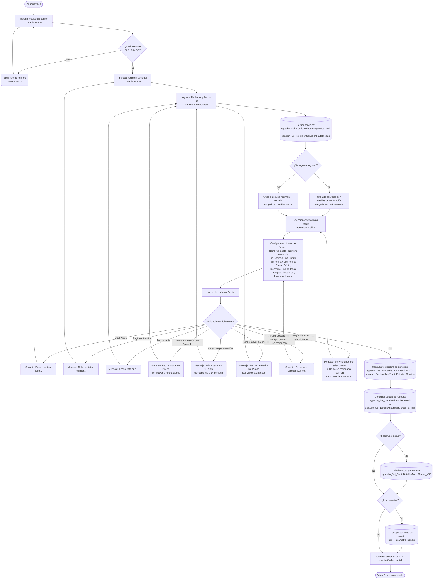

# Planificación Minuta Sansis

**Formulario:** `I_SetPlaSansis.frm`
**Tabla(s) principal(es):** `cas_b_minuta` (cabecera de la minuta planificada por casino), `cas_b_minutadet` (líneas de detalle de la minuta con recetas y estructuras de servicio)
**Consulta principal:** `sgpadm_Sel_DetalleMinutaSetSansis` / `sgpadm_Sel_DetalleMinutaSetSansisTipPlato` — según opción de incorporar tipo de plato

---

## Índice

- [1 — ¿Para qué sirve esta pantalla?](#1--para-qué-sirve-esta-pantalla)
- [2 — ¿Qué necesito para usarla?](#2--qué-necesito-para-usarla)
- [3 — ¿Cómo se usa?](#3--cómo-se-usa)
  - [3.1 Flujo paso a paso](#31-flujo-paso-a-paso)
  - [3.2 Controles y acciones disponibles](#32-controles-y-acciones-disponibles)
- [4 — ¿Qué restricciones debo conocer?](#4--qué-restricciones-debo-conocer)
  - [4.1 Validaciones del sistema](#41-validaciones-del-sistema)
- [5 — ¿Qué obtengo?](#5--qué-obtengo)
- [6 — Referencia técnica](#6--referencia-técnica)
  - [Tablas que intervienen](#tablas-que-intervienen)
  - [Procedimientos almacenados que intervienen](#procedimientos-almacenados-que-intervienen)
  - [Relación con otros módulos](#relación-con-otros-módulos)

---

## 1 — ¿Para qué sirve esta pantalla?

[↑ Volver al índice](#índice)

Esta pantalla genera un informe de la planificación de minutas registradas en el sistema para un casino específico. El documento resultante muestra, en formato de grilla mensual, las recetas asignadas a cada día del mes por servicio y estructura de servicio (por ejemplo: desayuno-opción 1, almuerzo-menú A), permitiendo visualizar de un vistazo el programa alimentario planificado para el período seleccionado.

La pantalla está organizada en un panel de filtros en la parte superior, donde el usuario indica el casino, el régimen y el rango de meses a consultar. Debajo del panel de filtros se encuentran las opciones de formato del informe: nombre a mostrar para las recetas, si se incluye o no el código de la receta, si se muestran o no las fechas en la cabecera, el tamaño de papel, si se incorpora el tipo de plato de cada receta y si se agrega un cálculo de Food Cost por servicio. En la zona inferior hay un área de texto para redactar un texto adicional de inserto opcional que puede adjuntarse al final del documento.

El informe admite dos modalidades de selección de servicios: cuando el usuario ingresa un régimen específico, la pantalla carga automáticamente los servicios disponibles en una grilla con casillas de verificación para que el usuario elija cuáles incluir. Cuando no se ingresa régimen, la pantalla muestra un árbol jerárquico con todos los regímenes y sus servicios asociados al casino en el período indicado, también con casillas de verificación. Ambas modalidades pueden abarcar hasta 3 meses consecutivos en un mismo reporte.

---

## 2 — ¿Qué necesito para usarla?

[↑ Volver al índice](#índice)

| Campo | Descripción | Obligatorio |
|---|---|---|
| Ceco | Código del casino (centro de costo) a consultar. Se puede ingresar directamente o buscarlo a través del selector de clientes que se abre con el ícono adyacente. Al ingresar el código el sistema valida que exista y muestra el nombre del casino en el campo de descripción contiguo. | Sí |
| Régimen | Código numérico del régimen alimentario (por ejemplo: régimen de almuerzo, régimen de once). Se puede ingresar directamente o buscarlo con el ícono de búsqueda. Al ingresar el código el sistema muestra el nombre del régimen. Si no se ingresa, el informe incluye todos los regímenes con planificación para el ceco y período indicados. | No |
| Fecha Ini (mm/aa) | Mes y año de inicio del período a reportar (formato mm/aaaa). El sistema inicializa este campo con el mes y año actuales al abrir la pantalla. | Sí |
| Fecha Fin (mm/aa) | Mes y año de término del período a reportar (formato mm/aaaa). El sistema inicializa este campo con el mes y año actuales al abrir la pantalla. | Sí |

Una vez que el ceco, el régimen y las fechas están completos, el sistema carga automáticamente la lista de servicios disponibles en la grilla inferior (cuando hay régimen) o en el árbol jerárquico (cuando no hay régimen), lo que permite al usuario seleccionar qué servicios incluir antes de generar el informe.

---

## 3 — ¿Cómo se usa?

### 3.1 Flujo paso a paso

[↑ Volver al índice](#índice)

### 3.2 Controles y acciones disponibles

[↑ Volver al índice](#índice)

| Control / Acción | Descripción |
|---|---|
| **Campo Ceco** | Campo de ingreso del código de casino. Al escribir y salir del campo, el sistema valida el código contra el catálogo de clientes y muestra el nombre del casino en el espacio de descripción adyacente. |
| **Ícono de búsqueda de casino** | Abre el selector de casinos para buscar y seleccionar el casino por nombre o código. Al confirmar la selección, completa automáticamente el campo Ceco y su descripción. |
| **Campo Régimen** | Campo numérico para ingresar el código del régimen. Al salir del campo, el sistema valida el código contra el catálogo de regímenes y muestra su nombre. Si se deja vacío, el informe considera todos los regímenes con planificación en el período. |
| **Ícono de búsqueda de régimen** | Abre el selector de regímenes. Al seleccionar, completa el campo Régimen y su descripción. |
| **Campo Fecha Ini (mm/aa)** | Campo de fecha en formato mes/año para indicar el mes de inicio del período. Acepta navegación con el calendario desplegable del campo. Cada cambio recarga la grilla de servicios o el árbol. |
| **Campo Fecha Fin (mm/aa)** | Campo de fecha en formato mes/año para indicar el mes de término del período. Cada cambio recarga la grilla de servicios o el árbol. |
| **Ícono de selección de servicios** | Disponible cuando hay ceco y régimen ingresados. Abre el selector de servicios para elegir cuáles incluir en el informe (cuando hay régimen), o abre el selector del árbol jerárquico de regímenes y servicios (cuando no hay régimen ingresado). |
| **Grilla de servicios (casillas de verificación)** | Aparece cuando hay régimen ingresado. Lista los servicios disponibles para el ceco y período indicados. Cada fila tiene una casilla para marcar o desmarcar el servicio. El sistema marca todos los servicios cuando la opción de servicio es "Todos". |
| **Árbol jerárquico de regímenes y servicios** | Aparece cuando no hay régimen ingresado. Muestra los regímenes como nodos raíz y sus servicios como nodos hijo, todos con casillas de verificación. El sistema marca todos los nodos al cargar. |
| **Selector de Servicio: Todos / Lista** | Dentro del panel "Servicio". Si se elige "Todos", el sistema marca automáticamente todos los servicios disponibles al generar el informe. Si se elige "Lista", el usuario selecciona los servicios manualmente en la grilla. |
| **Selector de Nombre Receta / Nombre Fantasía** | Controla si en el cuerpo del informe se muestra el nombre oficial de la receta o su nombre de fantasía (nombre comercial). |
| **Selector Sin Código / Con Código** | Controla si se muestra o no el código interno de la receta junto al nombre en las celdas del informe. |
| **Selector Sin Fecha / Con Fecha** | Controla si el encabezado del informe incluye o no la fecha de impresión al pie de página. |
| **Panel Opción Impresión: Carta / Oficio** | Define el tamaño de papel del documento RTF generado, lo que afecta el ancho de las columnas del informe. |
| **Casilla Incorpora Tipo de Plato** | Cuando está marcada, el informe añade bajo el nombre de la receta el tipo de plato al que pertenece. Activa la consulta de la variante con tipo de plato. |
| **Casilla Incorpora Food Cost** | Cuando está marcada, el informe incluye al final de cada mes un resumen del costo estimado por servicio. Al marcarla se habilita la lista desplegable "Calcular Costo x" donde se debe elegir el tipo de precio a utilizar. |
| **Lista desplegable Calcular Costo x** | Solo disponible cuando "Incorpora Food Cost" está activo. Permite elegir el tipo de precio con el que se calculará el costo: según la configuración del sistema, puede ser precio de convenio, PMP u otro tipo de precio disponible. |
| **Casilla Incorpora Inserto** | Cuando está marcada, el informe agrega al final una sección con el texto escrito en el área de texto libre. El sistema lee y guarda ese texto en la tabla de parámetros para que se conserve entre sesiones. |
| **Área de texto libre** | Solo activa cuando "Incorpora Inserto" está marcada. Permite escribir libremente el texto que se incluirá al final del informe. El sistema recupera el último texto guardado al marcar la casilla. |
| **Botón Vista Previa** | Ejecuta las validaciones, lanza las consultas a la base de datos y genera el documento RTF con orientación horizontal. Muestra el resultado en la ventana de Vista Previa del sistema desde donde el usuario puede imprimir o guardar el archivo. |
| **Botón Histórico Planificación Teórica** | Abre el historial de minutas planificadas para el casino ingresado. Permite seleccionar una planificación del historial, y al confirmar completa automáticamente los campos de régimen y fechas con los datos de la planificación seleccionada. Para poder usarlo debe haber un código de casino ingresado. |
| **Botón Salir** | Cierra la pantalla. |

---

## 4 — ¿Qué restricciones debo conocer?

### 4.1 Validaciones del sistema

[↑ Volver al índice](#índice)

| # | Cuándo aparece | Qué verifica el sistema | Qué ve el usuario |
|---|---|---|---|
| 1 | Al hacer clic en Vista Previa | Que el nombre del casino no esté vacío, es decir, que el código de ceco haya sido reconocido y tenga descripción | Mensaje: `Debe registrar ceco...` |
| 2 | Al hacer clic en Vista Previa | Que si se ingresó un número de régimen mayor que cero, su nombre también esté cargado (es decir, que sea un código válido) | Mensaje: `Debe registrar regimen...` |
| 3 | Al hacer clic en Vista Previa | Que el campo Fecha Ini no esté vacío | Mensaje: `Fecha esta nula...` |
| 4 | Al hacer clic en Vista Previa | Que el campo Fecha Fin no esté vacío | Mensaje: `Fecha esta nula...` |
| 5 | Al hacer clic en Vista Previa | Que la Fecha Fin no sea anterior a la Fecha Ini | Mensaje: `Fecha Hasta No Puede Ser Mayor a Fecha Desde` |
| 6 | Al hacer clic en Vista Previa | Que el rango entre el primer día del mes inicial y el último día del mes final no supere los 98 días (equivalente a 14 semanas) | Mensaje: `Sobre pasa los 98 días corresponde a 14 semana` |
| 7 | Al hacer clic en Vista Previa | Que el rango no sea mayor a 3 meses | Mensaje: `Rango De Fecha No Puede Ser Mayor a 3 Meses` |
| 8 | Al hacer clic en Vista Previa, con Food Cost activo | Que se haya seleccionado un tipo de precio en la lista desplegable de costo | Mensaje: `Seleccione Calcular Costo x` |
| 9 | Al hacer clic en Vista Previa, con régimen ingresado | Que al menos un servicio esté marcado en la grilla de casillas | Mensaje: `Servicio debe ser selecionado` |
| 10 | Al hacer clic en Vista Previa, sin régimen ingresado | Que en el árbol jerárquico al menos un nodo de tipo servicio (no nodo régimen) esté marcado | Mensaje: `No ha seleccionado regimen con su asociado servicio...` |
| 11 | Al abrir el histórico de planificaciones | Que el casino ingresado tenga minutas registradas en el sistema | Mensaje: `No existe ceco planificado` |

---

## 5 — ¿Qué obtengo?

[↑ Volver al índice](#índice)

Esta pantalla genera un único tipo de informe: un documento RTF con orientación horizontal (paisaje) que se abre en la ventana de Vista Previa del sistema, desde donde el usuario puede imprimirlo directamente o exportarlo como archivo.

**Qué muestra el informe:**

El informe presenta la planificación de minutas en formato de calendario mensual. Cada página corresponde a un mes y, cuando se trabaja sin régimen específico, a una combinación de mes y régimen. La estructura del documento es:

- **Encabezado de página:** nombre del casino, nombre del régimen (con o sin código según la opción elegida) y el mes/año consultado. Si la opción "Con Fecha" está activa, el pie de página incluye la fecha y hora de impresión.
- **Tabla de planificación:** la primera columna indica el día del mes (número). Las columnas siguientes agrupan los servicios seleccionados; dentro de cada servicio, hay una sub-columna por cada estructura de servicio (por ejemplo: menú 1, menú 2, dieta, etc.). La cabecera de la tabla muestra en la primera fila el nombre del servicio y en la segunda fila el nombre de la estructura de servicio correspondiente. En las celdas de datos aparece el nombre de la receta planificada para ese día, servicio y estructura; si la opción "Con Código" está activa, la celda también incluye el código de la receta. Cuando "Incorpora Tipo de Plato" está activo, bajo el nombre de la receta se muestra el tipo de plato al que pertenece.
- **Sección Food Cost (opcional):** si la opción está activa, aparece después de la tabla de cada mes un resumen con el costo estimado promedio diario por servicio, expresado en la moneda del sistema con el tipo de precio elegido (convenio, PMP u otro). Si durante el cálculo el sistema detecta ingredientes o productos con precio o gramaje igual a cero, genera automáticamente una página adicional con el listado de productos con error, identificados por código, nombre y tipo de error (gramaje cero o precio cero). En ese caso muestra el mensaje: `Existe producto valor cero. Ver Página : <número>`.
- **Sección Inserto (opcional):** si la casilla "Incorpora Inserto" está activa, al final del documento se agrega el texto libre escrito por el usuario, dentro de un recuadro. El sistema guarda este texto en la base de datos para que quede disponible en la próxima sesión.

**Opciones de configuración disponibles:**

- **Nombre Receta / Nombre Fantasía:** si se elige "Nombre Receta", en cada celda aparece el nombre oficial de la receta. Si se elige "Nombre Fantasía", se muestra el nombre de fantasía registrado para la receta (nombre comercial).
- **Sin Código / Con Código:** si se elige "Con Código", el código del casino y el número de régimen se incluyen en el encabezado junto al nombre.
- **Sin Fecha / Con Fecha:** si se elige "Con Fecha", el pie de página del documento incluye la fecha y hora de impresión.
- **Carta / Oficio:** define el tamaño de papel del documento, lo que ajusta el ancho de las columnas de la tabla.
- **Incorpora Tipo de Plato:** agrega el tipo de plato bajo el nombre de cada receta en las celdas de la tabla.
- **Incorpora Food Cost:** agrega una sección de costo promedio diario por servicio al final de cada mes. Requiere elegir el tipo de precio a utilizar.
- **Incorpora Inserto:** agrega al final del documento un recuadro con el texto libre ingresado por el usuario.

**Formato de salida:** Documento RTF. Orientación horizontal (paisaje). La tabla de planificación tiene columnas dinámicas: una columna fija para el día y una columna por cada estructura de servicio de cada servicio seleccionado. El ancho de cada columna se ajusta automáticamente según el número de columnas total y el tamaño de papel elegido. Se genera una nueva página al cambiar de mes y, cuando no hay régimen específico, también al cambiar de régimen. El documento se muestra en la ventana de Vista Previa del sistema para impresión directa.

---

## 6 — Referencia técnica

### Tablas que intervienen

[↑ Volver al índice](#índice)

| Tabla | Para qué se usa en este reporte | Campos clave |
|---|---|---|
| `cas_b_minuta` | Cabecera de la minuta planificada: relaciona el casino, el régimen, el servicio y la fecha de la minuta | `min_cecori`, `min_codreg`, `min_codser`, `min_fecmin`, `min_codigo` |
| `cas_b_minutadet` | Detalle de la minuta: cada línea con la receta, la estructura de servicio y el número de raciones teóricas planificadas | `mid_cecori`, `mid_codigo`, `mid_codrec`, `mid_estser`, `mid_numlin`, `mid_numrac`, `mid_tipmin` |
| `b_receta` | Catálogo de recetas: fuente del nombre oficial y nombre de fantasía de cada receta, y su tipo de plato | `rec_codigo`, `rec_nombre`, `rec_nomfan`, `rec_tippla` |
| `b_recetadet` | Detalle de ingredientes de cada receta: se usa para el cálculo de Food Cost (ingredientes y cantidades brutas) | `red_codigo`, `red_codpro`, `red_canpro` |
| `a_regimen` | Catálogo de regímenes: proporciona el nombre del régimen para encabezados y validación del código ingresado | `reg_codigo`, `reg_nombre`, `reg_indppr` |
| `a_servicio` | Catálogo de servicios: proporciona nombre y orden de posición de cada servicio | `ser_codigo`, `ser_nombre`, `ser_posicion` |
| `a_estservicio` | Estructura de servicio: define las subcolumnas dentro de cada servicio (opciones del menú del día) | `ess_codigo`, `ess_nombre`, `ess_codser` |
| `b_clientes` | Catálogo de casinos: valida el código de ceco ingresado y provee el nombre del casino | `cli_codigo`, `cli_nombre`, `cli_tipo`, `cli_activo`, `cli_TipoMinuta` |
| `b_ingrediente` | Catálogo de ingredientes: proporciona el nombre de cada ingrediente para el listado de errores de Food Cost | `ing_codigo`, `ing_nombre` |
| `b_tablagramajececo` | Tabla de gramaje por ceco: permite aplicar gramajes específicos del casino sobreponiendo los gramajes estándar de la receta al calcular el Food Cost | `tgc_ceco`, `tgc_codreg`, `tgc_codrec`, `tgc_coding`, `tgc_codins`, `tgc_cantgr` |
| `Sdx_Parametro_Sansis` | Tabla de parámetros del sistema Sansis: almacena el texto del inserto (número de parámetro 9999) para que persista entre sesiones | `Parametro_Num`, `Parametro_Glosa`, `Parametro_Desc`, `Parametro_Val` |

### Procedimientos almacenados que intervienen

[↑ Volver al índice](#índice)

| Procedimiento | Cuándo se invoca | Qué hace |
|---|---|---|
| `sgpadm_s_cliente_V02` (con código 45) | Al escribir un código de casino | Valida que el código ingresado corresponda a un casino activo con tipo de minuta habilitado (tipo 1 o 3) y devuelve el nombre del casino |
| `sgpadm_Sel_ServicioMinutaBloqueMes_V02` | Al cambiar ceco, régimen o fechas (cuando hay régimen) | Carga la lista de servicios disponibles para el ceco, régimen y rango de meses indicado, para poblar la grilla de selección de servicios |
| `sgpadm_Sel_RegimenServicioMinutaBloque` | Al cambiar ceco o fechas (cuando no hay régimen) | Carga todos los regímenes y servicios con planificación para el ceco y período, para poblar el árbol jerárquico |
| `sgpadm_Sel_CecoMinutaBloque` | Al hacer clic en el botón Histórico | Verifica que el casino tenga minutas registradas antes de abrir el historial |
| `sgpadm_Sel_ParametroSansis` | Al marcar "Incorpora Inserto" | Lee el texto del inserto previamente guardado con código de parámetro 9999 |
| `sgpadm_Sel_MinutaEstruturaServicio_V02` | Durante la generación del informe, por cada mes y régimen/servicio | Obtiene la estructura de servicios del mes (servicios y sus sub-columnas de estructura) para construir la cabecera de la tabla del informe |
| `sgpadm_Sel_NroRegMinutaEstruturaServicio` | Durante la generación, por cada servicio incluido | Cuenta el número de estructuras de servicio distintas de un servicio en el mes, para calcular el ancho en columnas de la cabecera |
| `sgpadm_Sel_DetalleMinutaSetSansis` | Durante la generación, por cada servicio incluido, cuando "Incorpora Tipo de Plato" está desactivado | Devuelve el detalle de recetas del mes por día, posición y columna dentro de la grilla, usando el nombre oficial o nombre de fantasía según la opción elegida |
| `sgpadm_Sel_DetalleMinutaSetSansisTipPlato` | Durante la generación, cuando "Incorpora Tipo de Plato" está activo | Igual que el anterior pero incluye además el tipo de plato de cada receta en el resultado |
| `sgpadm_Sel_CostoDetalleMinutaSansis_V03` | Durante la generación, cuando "Incorpora Food Cost" está activo, por cada servicio | Calcula el costo estimado por día e ingrediente para el servicio, usando el tipo de precio elegido (convenio, PMP u otro); devuelve también ingredientes y productos con precio o gramaje cero |

### Relación con otros módulos

[↑ Volver al índice](#índice)

| Módulo | Relación |
|---|---|
| **Planificación de Minutas** | Genera las minutas (`cas_b_minuta` / `cas_b_minutadet`) que este reporte consume. Sin minutas planificadas en el período consultado, el informe no produce contenido. |
| **Mantenedor de Recetas** | Provee los nombres, nombres de fantasía y tipos de plato de las recetas (`b_receta`) que se muestran en las celdas del informe. |
| **Mantenedor de Servicios y Estructuras de Servicio** | Define la estructura de columnas del informe: los servicios (`a_servicio`) se convierten en grupos de columnas y sus estructuras (`a_estservicio`) en sub-columnas individuales. |
| **Módulo de Costos / Inventario** | El cálculo de Food Cost depende de los precios de productos asociados a los ingredientes de las recetas; estos precios provienen de las tablas de costos del módulo de inventario, procesados a través del procedimiento auxiliar `PA_sgpadm_CostoMinBloqueServicios_V03`. |
| **Mantenedor de Clientes / Casinos** | Valida el código de casino (`b_clientes`) y filtra solo los que tienen tipo de minuta habilitado (tipo 1 o 3). |

---

*Fuentes: `I_SetPlaSansis.frm`, `Informes.bas`, SPs `sgpadm_Sel_DetalleMinutaSetSansis`, `sgpadm_Sel_DetalleMinutaSetSansisTipPlato`, `sgpadm_Sel_MinutaEstruturaServicio_V02`, `sgpadm_Sel_NroRegMinutaEstruturaServicio`, `sgpadm_Sel_CostoDetalleMinutaSansis_V03`, `sgpadm_Sel_ServicioMinutaBloqueMes_V02`, `sgpadm_Sel_RegimenServicioMinutaBloque`, `sgpadm_Sel_CecoMinutaBloque`, `sgpadm_Sel_ParametroSansis`, `sgpadm_s_cliente_V02` en `SGP_Admin.sql`*
