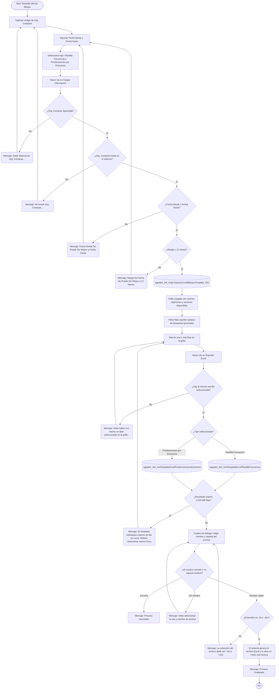

# Template Minuta Bloque

**Formulario:** `E_TemplateMinI.frm`
**Tabla(s) principal(es):** `cas_b_minuta` (cabecera de minuta en bloque), `cas_b_minutadet` (detalle de líneas de minuta en bloque)
**Consultas principales:**
- Carga de grilla: `sgpadm_Sel_OrgComprasCecoMBloqueTemplate_V01`
- Exportación Plantilla Frecuencia: `sgpadm_Sel_XmlTemplateExcelPlantillaFrecuencia`
- Exportación Ponderaciones por Estructura: `sgpadm_Sel_XmlTemplateExcelPonderacionesxEstructura`

---

## Índice

- [1 — ¿Para qué sirve esta pantalla?](#1--para-qué-sirve-esta-pantalla)
- [2 — ¿Qué necesito para usarla?](#2--qué-necesito-para-usarla)
- [3 — ¿Cómo se usa?](#3--cómo-se-usa)
  - [3.1 Flujo paso a paso](#31-flujo-paso-a-paso)
  - [3.2 Controles y acciones disponibles](#32-controles-y-acciones-disponibles)
- [4 — ¿Qué restricciones debo conocer?](#4--qué-restricciones-debo-conocer)
  - [4.1 Validaciones del sistema](#41-validaciones-del-sistema)
- [5 — ¿Qué obtengo?](#5--qué-obtengo)
  - [Resumen de tipos disponibles](#resumen-de-tipos-disponibles)
  - [Plantilla Frecuencia](#plantilla-frecuencia)
  - [Ponderaciones por Estructura](#ponderaciones-por-estructura)
- [6 — Referencia técnica](#6--referencia-técnica)
  - [Tablas que intervienen](#tablas-que-intervienen)
  - [Relación con otros módulos](#relación-con-otros-módulos)

---

## 1 — ¿Para qué sirve esta pantalla?
[↑ Volver al índice](#índice)

Esta pantalla permite generar dos tipos de plantillas Excel sobre las minutas en bloque de los casinos asociados a una organización de compras: una plantilla de **frecuencia de ingredientes principales** y otra de **ponderaciones por estructura de servicio**. Ambas se extraen del mismo rango de fechas y de los mismos casinos seleccionados, pero entregan información analítica distinta: la primera permite conocer con qué frecuencia aparece cada tipo de ingrediente principal en la planificación, y la segunda permite revisar el balance de ponderaciones por estructura de servicio a lo largo de la semana.

La pantalla se organiza en un encabezado con tres campos de filtro (organización de compras, fecha desde y fecha hasta) y dos opciones de tipo de plantilla. Debajo del encabezado hay una grilla que muestra todos los casinos, regímenes y servicios disponibles para el período indicado; el usuario marca las filas de interés antes de exportar. La barra de búsqueda sobre la grilla permite filtrar por cualquier columna de texto para localizar rápidamente un casino, régimen o servicio específico.

No existe un selector de tipo de informe en lista desplegable: el tipo se elige mediante dos botones de opción visibles directamente en el formulario. La pantalla opera exclusivamente sobre casinos activos con minuta en bloque planificada en el período consultado, dentro de la organización de compras indicada.

---

## 2 — ¿Qué necesito para usarla?
[↑ Volver al índice](#índice)

| Campo | Descripción | Obligatorio |
|---|---|---|
| Org. Compras | Código de la organización de compras (por ejemplo, `CL14`). Determina el conjunto de casinos disponibles. Debe corresponder a un código existente y activo en el sistema. | Sí |
| Fecha desde | Fecha de inicio del período a consultar, en formato `dd/mm/yyyy`. Al abrir la pantalla se carga la fecha del día. | Sí |
| Fecha hasta | Fecha de fin del período a consultar, en formato `dd/mm/yyyy`. Al abrir la pantalla se carga la fecha del día. | Sí |
| Tipo de plantilla | Selección entre "Plantilla Frecuencia" y "Ponderaciones por Estructura". Determina qué información se incluirá en el archivo Excel generado. | Sí |
| Selección de filas en la grilla | Después de cargar la grilla, el usuario debe marcar al menos un casino/régimen/servicio para poder exportar. | Sí |

---

## 3 — ¿Cómo se usa?
[↑ Volver al índice](#índice)

### 3.1 Flujo paso a paso
[↑ Volver al índice](#índice)

### 3.2 Controles y acciones disponibles
[↑ Volver al índice](#índice)

| Control / Acción | Descripción |
|---|---|
| **Org. Compras** | Campo de texto donde se ingresa el código de la organización de compras. Cualquier cambio en este campo limpia la grilla, forzando una nueva carga antes de exportar. |
| **Fecha desde** | Campo de fecha con selector de calendario. Acepta el formato `dd/mm/yyyy`. Cualquier cambio limpia la grilla. |
| **Fecha hasta** | Campo de fecha con selector de calendario. Acepta el formato `dd/mm/yyyy`. Cualquier cambio limpia la grilla. |
| **Plantilla Frecuencia** | Botón de opción. Cuando está seleccionado, la exportación genera la plantilla de frecuencia de ingredientes principales. Es la opción predeterminada al abrir la pantalla. |
| **Ponderaciones por Estructura** | Botón de opción. Cuando está seleccionado, la exportación genera la plantilla de ponderaciones por estructura de servicio. |
| **Cargar Información** | Botón de la barra de acciones interna. Valida los filtros y carga la grilla con todos los casinos, regímenes y servicios que tienen minuta en bloque en el período indicado. Limpia también los campos de búsqueda antes de ejecutar. |
| **Campos de búsqueda por columna** | Seis campos de texto ubicados sobre la grilla, uno por cada columna de datos (CECO, nombre del sitio, código de régimen, nombre de régimen, código de servicio, nombre de servicio). Al ingresar texto y presionar Enter, la grilla filtra las filas que contienen el texto ingresado en esa columna; las demás filas se ocultan. Solo un campo puede estar activo a la vez: activar uno limpia los demás. Dejarlo vacío restaura todas las filas. Acepta múltiples términos separados por coma para buscar más de un valor simultáneamente. |
| **Grilla de casinos/regímenes/servicios** | Muestra los resultados de la carga. Cada fila corresponde a una combinación de casino, régimen y servicio con minuta en bloque en el período. La columna de la izquierda es una casilla de selección: hacer clic en una celda cualquiera de la fila alterna su estado entre seleccionado (1) y no seleccionado (0). Solo las filas visibles (no ocultas por el filtro) pueden seleccionarse. |
| **Exportar Excel** | Botón en la barra lateral derecha. Valida que haya filas seleccionadas, llama al procedimiento almacenado correspondiente al tipo elegido, verifica que el resultado no supere el límite de Excel, abre el cuadro de diálogo de guardado, genera el archivo y lo abre en modo solo lectura. |
| **Salir** | Botón en la barra lateral derecha. Cierra y descarga la pantalla sin generar ningún archivo. |

---

## 4 — ¿Qué restricciones debo conocer?
[↑ Volver al índice](#índice)

### 4.1 Validaciones del sistema
[↑ Volver al índice](#índice)

| # | Cuándo aparece | Qué verifica el sistema | Qué ve o experimenta el usuario |
|---|---|---|---|
| 1 | Al hacer clic en "Cargar Información" o en "Exportar Excel" sin ingresar código de organización de compras | Que el campo Org. Compras no esté vacío | Mensaje: `Debe seleccionar Org. Compras...` |
| 2 | Al hacer clic en "Cargar Información" o en "Exportar Excel" con un código de organización de compras que no existe | Que el código ingresado corresponda a un registro activo en el catálogo de organizaciones de compras | Mensaje: `No existe Org. Compras...` |
| 3 | Al hacer clic en "Cargar Información" o en "Exportar Excel" con fechas inconsistentes | Que la Fecha Desde no sea posterior a la Fecha Hasta | Mensaje: `Fecha Desde No Puede Ser Mayor a Fecha Hasta`. El sistema restablece automáticamente la Fecha Desde a la fecha del día. |
| 4 | Al hacer clic en "Cargar Información" o en "Exportar Excel" con un rango superior a un año | Que la diferencia entre Fecha Hasta y Fecha Desde no supere 365 días | Mensaje: `Rango De Fecha No Puede Ser Mayor a 12 Meses`. La grilla queda en cero filas. |
| 5 | Al hacer clic en "Exportar Excel" con la grilla sin datos | Que la grilla tenga al menos una fila cargada | Mensaje: `No existe datos selecionado en la grilla...` |
| 6 | Al hacer clic en "Exportar Excel" sin marcar ninguna fila | Que al menos una fila de la grilla esté marcada como seleccionada y sea visible | Mensaje: `Debe haber a lo menos un dato seleccionado en la grilla...` |
| 7 | Después de ejecutar la consulta de exportación | Que el resultado no supere 1.020.000 filas (límite de Excel) | Mensaje: `El resultado sobrepasa maximo de fila en excel, Debera seleccionar menos Ceco`. El proceso se cancela y el usuario debe reducir la selección de casinos. |
| 8 | En el cuadro de diálogo de guardado, si el usuario cancela | Que el usuario haya completado el paso de guardar | Mensaje: `Proceso cancelado`. El proceso se cancela sin generar archivo. |
| 9 | En el cuadro de diálogo de guardado, si el usuario no ingresa nombre | Que se haya ingresado un nombre de archivo | Mensaje: `Debe seleccionar la ruta y nombre de archivo`. |
| 10 | En el cuadro de diálogo de guardado, si la extensión no es válida | Que la extensión del archivo sea `.xls` o `.xlsx` | Mensaje: `La extensión del archivo debe ser (*.xls,*.xlsx)`. |

---

## 5 — ¿Qué obtengo?
[↑ Volver al índice](#índice)

Esta pantalla no tiene un selector de tipo en lista desplegable. El tipo de plantilla se elige con los botones de opción visibles en el formulario. Cada tipo genera un archivo Excel diferente con columnas distintas.

### Resumen de tipos disponibles
[↑ Volver al índice](#índice)

| Tipo | Nombre en el formulario | Formato de salida | Procedimiento almacenado principal |
|---|---|---|---|
| Botón de opción (0) | Plantilla Frecuencia | Excel (.xls / .xlsx) | `sgpadm_Sel_XmlTemplateExcelPlantillaFrecuencia` |
| Botón de opción (1) | Ponderaciones por Estructura | Excel (.xls / .xlsx) | `sgpadm_Sel_XmlTemplateExcelPonderacionesxEstructura` |

---

### Plantilla Frecuencia
[↑ Volver al índice](#índice)

**Qué muestra:** Una fila por cada combinación de casino, régimen, servicio, estructura, categoría dietética, tipo de plato y tipo de ingrediente principal que aparece en las minutas del período. El dato central es la cantidad de veces que cada tipo de ingrediente principal se utilizó en la planificación (frecuencia de uso), lo que permite analizar la variedad y repetición en la composición de las minutas.

**Cómo se seleccionan los casinos:** el usuario marca filas en la grilla de casinos/regímenes/servicios. Los casinos marcados se empaquetan en un mensaje XML y se envían al procedimiento almacenado. Solo se procesan las filas visibles y seleccionadas.

**Opciones de configuración disponibles:**
- **Tipo de plantilla:** seleccionado mediante el botón de opción "Plantilla Frecuencia".

**Estructura de datos del informe:**

| Campo / Columna | Descripción | Calculado |
|---|---|---|
| Sitios (Ceco) | Código del casino | No |
| Nombre del sitio | Nombre descriptivo del casino | No |
| CL | Código de la organización de compras consultada | No |
| Fecha Inicial | Fecha de inicio del período consultado | No |
| Fecha Final | Fecha de fin del período consultado | No |
| Cód. Regimen | Código numérico del régimen alimentario | No |
| Nombre Regimen | Nombre del régimen alimentario | No |
| Cód. Servicio | Código numérico del servicio (desayuno, almuerzo, cena, etc.) | No |
| Nombre Servicio | Nombre del servicio | No |
| Cód. Gran Est. | Código del grupo de estructura de servicio (gran estructura) | No |
| Nombre Gran Est. | Nombre del grupo de estructura de servicio | No |
| Cód. Estructura | Código de la estructura de servicio (posición dentro de un servicio, por ejemplo, primer plato) | No |
| Nombre Estructura | Nombre de la estructura de servicio. Puede ser sobreescrito con la descripción personalizada registrada en el detalle de la minuta, si existe. | No |
| Cód. Categoria Dietetica | Código de la categoría dietética de la receta planificada | No |
| Nombre Categoria Dietetica | Nombre completo de la categoría dietética, construido recorriendo el árbol de categorías. | Sí |
| Cód. Tipo Plato | Código del tipo de plato de la receta planificada | No |
| Nombre Tipo Plato | Nombre completo del tipo de plato, construido recorriendo el árbol de tipos de plato. | Sí |
| Cód. Tipo de plato Generico | Código del grupo de ingrediente principal asociado al tipo de ingrediente principal de la receta | No |
| Nombre Tipo de plato Generico | Nombre del grupo de ingrediente principal | No |
| Cód. Tipo Ingrediente Principal | Código del tipo de ingrediente principal de la receta | No |
| Nombre. Tipo Ingrediente Principal | Nombre del tipo de ingrediente principal | No |
| N° de Frecuencia de Ingrediente Principal SGP | Cantidad de veces que el tipo de ingrediente principal aparece en la planificación para esa combinación de casino/régimen/servicio/estructura/categoría dietética/tipo de plato | Sí |

**Cálculo — Nombre Categoria Dietetica**

El nombre de la categoría dietética no se almacena como texto plano: el sistema guarda solo el código y el nombre completo se construye navegando la jerarquía del árbol de categorías dietéticas.

**Fórmula o lógica:**
El sistema llama a la función `sgpadm_p_buscararbolcatdietetica(código)`, que recorre la jerarquía de categorías y devuelve una cadena con la ruta completa. El resultado final se recorta eliminando el último carácter (separador).

| Componente | Qué representa | De dónde viene |
|---|---|---|
| Código categoría dietética | Identificador de la categoría dietética de la receta o del detalle de minuta (el del detalle tiene prioridad si es mayor que cero) | `cas_b_minutadet.IdCategoriadietetica` o `b_receta.rec_catdie` |
| Función de árbol | Devuelve la ruta completa de la categoría en la jerarquía | Función `sgpadm_p_buscararbolcatdietetica` en `SGP_Admin.sql` |

> Ejemplo: si el código es 45 y la jerarquía es "Sin Gluten > Celíaco", la función devuelve `"Sin Gluten > Celíaco/"` y el sistema muestra `"Sin Gluten > Celíaco"`.

**Cálculo — Nombre Tipo Plato**

De forma análoga, el nombre del tipo de plato se construye recorriendo el árbol de tipos de plato.

**Fórmula o lógica:**
El sistema llama a la función `sgpadm_p_buscararboltipplato1(código)` y recorta el separador final.

| Componente | Qué representa | De dónde viene |
|---|---|---|
| Código tipo de plato | Identificador del tipo de plato de la receta o del detalle de minuta (el del detalle tiene prioridad si es mayor que cero) | `cas_b_minutadet.IdTipoPlato` o `b_receta.rec_tippla` |
| Función de árbol | Devuelve la ruta completa del tipo de plato en la jerarquía | Función `sgpadm_p_buscararboltipplato1` en `SGP_Admin.sql` |

**Cálculo — N° de Frecuencia de Ingrediente Principal SGP**

Este valor no está almacenado: se calcula contando cuántas líneas de detalle de minuta comparten la misma combinación de clasificaciones.

**Fórmula o lógica:**
N° de Frecuencia = `COUNT(tipo de ingrediente principal)` agrupado por casino, régimen, servicio, estructura, gran estructura, categoría dietética, tipo de plato, tipo de ingrediente principal, dentro del período y para los casinos seleccionados. Solo se cuentan las líneas con raciones planificadas mayores a cero.

| Componente | Qué representa | De dónde viene |
|---|---|---|
| Líneas de detalle de minuta | Cada preparación planificada en una estructura del servicio | `cas_b_minutadet` |
| Filtro de raciones | Solo líneas con raciones planificadas > 0 | `cas_b_minutadet.mid_numrac` |
| Agrupación | Combinación de todas las clasificaciones del informe | Agrupación del SELECT final del SP |

> Ejemplo: si el tipo de ingrediente principal "Cerdo" aparece en 3 líneas de detalle dentro del período para el mismo servicio y estructura, el valor será 3.

**Formato de salida:** Excel (.xls o .xlsx). Una única hoja (`Hoja1`). El usuario elige la ruta y el nombre del archivo en un cuadro de diálogo de guardado. La fila 1 contiene los nombres de columna tomados directamente de los nombres devueltos por el procedimiento almacenado. Los datos comienzan en la fila 2. Las columnas y filas se ajustan automáticamente al contenido. El archivo se abre en modo solo lectura al finalizar el proceso.

---

### Ponderaciones por Estructura
[↑ Volver al índice](#índice)

**Qué muestra:** Una fila por cada combinación de casino, régimen, servicio y estructura de servicio, con el promedio de ponderación de esa estructura en el período y su distribución por día de la semana. Permite revisar si el balance de ponderaciones se mantiene a lo largo de los días (lunes a domingo) y si la suma total de ponderaciones por gran estructura es coherente.

**Cómo se seleccionan los casinos:** igual que en la Plantilla Frecuencia, el usuario marca filas en la grilla antes de exportar.

**Opciones de configuración disponibles:**
- **Tipo de plantilla:** seleccionado mediante el botón de opción "Ponderaciones por Estructura".

**Estructura de datos del informe:**

| Campo / Columna | Descripción | Calculado |
|---|---|---|
| Sitios (Ceco) | Código del casino | No |
| Nombre del sitio | Nombre descriptivo del casino | No |
| CL | Código de la organización de compras consultada | No |
| Fecha Inicial | Fecha de inicio del período consultado | No |
| Fecha Final | Fecha de fin del período consultado | No |
| Cód. Regimen | Código numérico del régimen alimentario | No |
| Nombre Regimen | Nombre del régimen alimentario | No |
| Cód. Servicio | Código numérico del servicio | No |
| Nombre Servicio | Nombre del servicio | No |
| Cód. Gran Est. | Código del grupo de estructura de servicio | No |
| Nombre Gran Est. | Nombre del grupo de estructura de servicio | No |
| Suma de ponderaciones por gran estructura | Suma de los promedios de ponderación ajustados de todas las estructuras que pertenecen a la misma gran estructura, para el mismo casino/régimen/servicio | Sí |
| Cód. Estructura | Código de la estructura de servicio | No |
| Nombre Estructura | Nombre de la estructura de servicio. Puede ser sobreescrito con la descripción personalizada del detalle de minuta si existe. | No |
| Lunes | Indicador (1 / 0): la estructura tuvo raciones planificadas al menos un lunes en el período | Sí |
| Martes | Indicador (1 / 0): la estructura tuvo raciones planificadas al menos un martes en el período | Sí |
| Miercoles | Indicador (1 / 0): la estructura tuvo raciones planificadas al menos un miércoles en el período | Sí |
| Jueves | Indicador (1 / 0): la estructura tuvo raciones planificadas al menos un jueves en el período | Sí |
| Viernes | Indicador (1 / 0): la estructura tuvo raciones planificadas al menos un viernes en el período | Sí |
| Sabado | Indicador (1 / 0): la estructura tuvo raciones planificadas al menos un sábado en el período | Sí |
| Domingo | Indicador (1 / 0): la estructura tuvo raciones planificadas al menos un domingo en el período | Sí |
| Promedio de % Ponderación | Ponderación promedio ajustada de la estructura, normalizada según la cantidad de días de la minuta en el período | Sí |

**Cálculo — Promedio de % Ponderación**

La ponderación que figura en cada línea del detalle de minuta (`mid_porrac`) puede variar día a día. Para obtener un valor representativo del período, el sistema calcula el promedio de ponderación y lo normaliza respecto al número de días con minuta activa.

**Fórmula o lógica:**

Paso 1 — Promedio base por estructura:
`Promedio base = SUM(mid_porrac) / COUNT(líneas de detalle)` agrupado por casino, régimen, servicio y estructura, dentro del período.

Paso 2 — Normalización por días de servicio:
`Ponderación ajustada = Promedio base × (número de veces que aparece la estructura / número de días con minuta en el servicio)`

Paso 3 — Redondeo con regla de ajuste:
Si la parte decimal de la ponderación ajustada (redondeada a 1 decimal) es mayor que 0.0, se redondea hacia arriba (se suma 1 antes de redondear a entero). En caso contrario, se redondea normalmente.

| Componente | Qué representa | De dónde viene |
|---|---|---|
| `mid_porrac` | Porcentaje de ponderación de la línea de detalle de minuta | `cas_b_minutadet.mid_porrac` |
| Número de veces | Cuántas veces aparece esa estructura en el período | Conteo en la tabla temporal del SP |
| Número de días con minuta | Cantidad de fechas distintas con minuta activa para ese casino/régimen/servicio, contando solo días con raciones > 0 y raciones teóricas > 0 | Tabla temporal calculada en el SP |

> Ejemplo: si una estructura tiene ponderación promedio de 33.33% y aparece 10 veces en un período de 22 días con minuta, la ponderación ajustada es `33.33 × (10/22) = 15.15`. Como la parte decimal redondeada a 1 decimal es 0.2 (mayor que 0.0), el resultado final es `round(15.15 + 1, 0) = 16`.

**Cálculo — Suma de ponderaciones por gran estructura**

Representa la suma de las ponderaciones ajustadas de todas las estructuras pertenecientes a la misma gran estructura, para un casino/régimen/servicio dado.

**Fórmula o lógica:**
`Suma gran estructura = SUM(Ponderación ajustada)` de todas las estructuras con el mismo código de gran estructura, dentro del mismo casino/régimen/servicio.

| Componente | Qué representa | De dónde viene |
|---|---|---|
| Ponderación ajustada por estructura | Calculada según la fórmula anterior | Tabla temporal interna del SP |
| Agrupación por gran estructura | Código de grupo que agrupa varias estructuras de servicio | `a_grupoestructura.IdGrupoEstructura` |

**Cálculo — Indicadores de día de la semana (Lunes a Domingo)**

Cada indicador de día señala si esa estructura de servicio tuvo raciones planificadas en algún día de esa semana dentro del período.

**Fórmula o lógica:**
Para cada fila de la tabla de resultados, el sistema busca en el detalle de minuta si existe alguna línea para esa estructura cuya fecha corresponda al día de la semana indicado y tenga raciones mayores a cero. Si existe, el indicador toma el valor 1; si no existe (o si el campo quedó vacío), se muestra 0.

| Componente | Qué representa | De dónde viene |
|---|---|---|
| Fecha de minuta | Fecha en que está planificada la minuta | `cas_b_minuta.min_fecmin` |
| Día de la semana | Nombre del día extraído de la fecha (`Monday`, `Tuesday`, etc.) | Función `DATENAME(dw, fecha)` |
| Raciones > 0 | Condición para que el día se marque como activo | `cas_b_minutadet.mid_numrac > 0` |

> Ejemplo: si en el período hay minutas los días lunes 3, miércoles 5 y viernes 7, los indicadores para esa estructura serán: Lunes=1, Martes=0, Miercoles=1, Jueves=0, Viernes=1, Sabado=0, Domingo=0.

**Formato de salida:** Excel (.xls o .xlsx). Una única hoja (`Hoja1`). El usuario elige la ruta y el nombre del archivo en un cuadro de diálogo de guardado. La fila 1 contiene los nombres de columna tomados de los nombres devueltos por el procedimiento almacenado. Los datos comienzan en la fila 2. Las columnas y filas se ajustan automáticamente al contenido. El archivo se abre en modo solo lectura al finalizar el proceso.

---

## 6 — Referencia técnica
[↑ Volver al índice](#índice)

### Tablas que intervienen
[↑ Volver al índice](#índice)

| Tabla | Para qué se usa en este reporte | Campos clave |
|---|---|---|
| `cas_b_minuta` | Cabecera de las minutas en bloque; fuente principal para filtrar por período y casino | `min_cecori`, `min_fecmin`, `min_codreg`, `min_codser`, `min_racteo` |
| `cas_b_minutadet` | Detalle de líneas de cada minuta; contiene ponderaciones, raciones, estructura y clasificaciones de cada preparación | `mid_cecori`, `mid_codigo`, `mid_numrac`, `mid_porrac`, `mid_estser`, `mid_numlin`, `mid_desest`, `IdCategoriadietetica`, `IdTipoPlato` |
| `I_ORG_CECO` | Catálogo que asocia cada casino (CECO) con su organización de compras | `ID_ORGCOMPRA`, `ID_CECO`, `BORRADO` |
| `b_clientes` | Catálogo de casinos; provee el nombre descriptivo de cada casino | `cli_codigo`, `cli_nombre`, `cli_activo` |
| `a_regimen` | Catálogo de regímenes alimentarios | `reg_codigo`, `reg_nombre` |
| `a_servicio` | Catálogo de servicios; se excluyen servicios de tipo L/D (`ser_Lyd = 0`) | `ser_codigo`, `ser_nombre`, `ser_activo`, `ser_Lyd` |
| `a_estservicio` | Catálogo de estructuras de servicio (posiciones dentro de un servicio, como primer plato, ensalada, etc.) | `ess_codigo`, `ess_nombre`, `ess_codser`, `ess_agrupacionestructura` |
| `a_grupoestructura` | Catálogo de grupos de estructuras (gran estructura); agrupa varias estructuras bajo un mismo concepto | `IdGrupoEstructura`, `nombre` |
| `b_receta` | Catálogo de recetas; provee la clasificación dietética y de tipo de plato de cada preparación | `rec_codigo`, `rec_catdie`, `rec_tippla`, `Idtipoingprincipal` |
| `a_recetacatdie` | Catálogo de categorías dietéticas | `car_codigo` |
| `a_recetatippla` | Catálogo de tipos de plato | `tip_codigo` |
| `a_grupoingprincipal` | Catálogo de grupos de ingrediente principal (tipo de plato genérico) | `IdGrupoIngPrincipal`, `nombre` |
| `a_tipoingredienteprincipalreceta` | Catálogo de tipos de ingrediente principal | `Idtipoingprincipal`, `Nombretipoingprincipal`, `IdGrupoIngPrincipal` |
| `Parametro_Ceco_Optimum` | Usado en la validación de la organización de compras para verificar si tiene parámetros de configuración activos | `[Org. Compras]`, `Estado` |

### Relación con otros módulos
[↑ Volver al índice](#índice)

| Módulo | Relación |
|---|---|
| **Planificación de minutas (SGP Local / SGP Admin)** | Las minutas en bloque (`cas_b_minuta` y `cas_b_minutadet`) son generadas y mantenidas por el módulo de planificación. Este reporte las consume en modo de solo lectura. |
| **Mantenedor de recetas** | Las clasificaciones dietéticas, tipos de plato y tipos de ingrediente principal que aparecen en el reporte se definen en el mantenedor de recetas y se asocian a cada preparación en `b_receta`. |
| **Mantenedor de estructuras de servicio** | Las estructuras de servicio y sus grupos (gran estructura) se configuran en el mantenedor correspondiente y se referencian en el detalle de minuta. |
| **Organización de compras / Administración de CECO** | La asignación de cada casino a una organización de compras se gestiona en `I_ORG_CECO`. Este reporte filtra todos sus datos por esa asignación. |

---

*Fuentes: `E_TemplateMinI.frm`, SP `sgpadm_Sel_OrgComprasCecoMBloqueTemplate_V01` en `SGP_Admin.sql`, SP `sgpadm_Sel_XmlTemplateExcelPlantillaFrecuencia` en `SGP_Admin.sql`, SP `sgpadm_Sel_XmlTemplateExcelPonderacionesxEstructura` en `SGP_Admin.sql`, SP `sgpadm_Sel_OrgCompras_V02` en `SGP_Admin.sql`*
