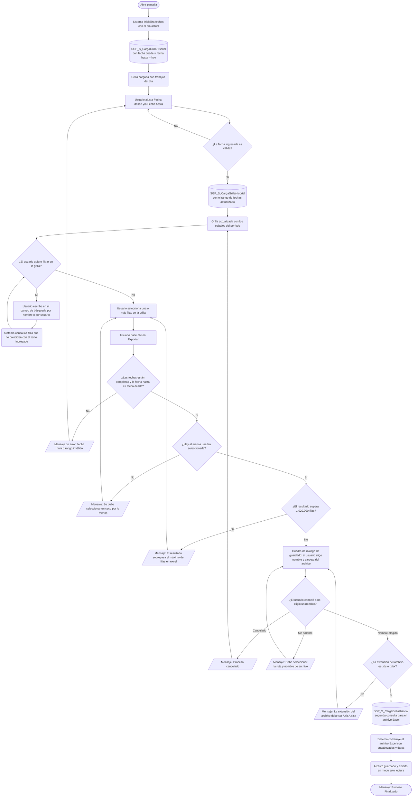

# Historial de Trabajos por Lotes

**Formulario:** `E_TrabajosPorLotes.frm`
**Tablas principales:** `b_coladetrabajo` (cola de ejecución de trabajos programados), `b_trabajosporlotes` (catálogo de tipos de trabajo), `b_paramcolatrabcab` (cabecera de parámetros por trabajo), `b_paramcolatrabdet` (detalle de casinos y servicios por trabajo)
**Consulta principal:** `SGP_S_CargaGrillaHisorial` — procedimiento almacenado que recupera el historial de trabajos ejecutados en el rango de fechas indicado

---

## Índice

- [1 — ¿Para qué sirve esta pantalla?](#1--para-qué-sirve-esta-pantalla)
- [2 — ¿Qué necesito para usarla?](#2--qué-necesito-para-usarla)
- [3 — ¿Cómo se usa?](#3--cómo-se-usa)
  - [3.1 Flujo paso a paso](#31-flujo-paso-a-paso)
  - [3.2 Controles y acciones disponibles](#32-controles-y-acciones-disponibles)
- [4 — ¿Qué restricciones debo conocer?](#4--qué-restricciones-debo-conocer)
  - [4.1 Validaciones del sistema](#41-validaciones-del-sistema)
- [5 — ¿Qué obtengo?](#5--qué-obtengo)
- [6 — Referencia técnica](#6--referencia-técnica)
  - [Tablas que intervienen](#tablas-que-intervienen)
  - [Relación con otros módulos](#relación-con-otros-módulos)

---

## 1 — ¿Para qué sirve esta pantalla?
[↑ Volver al índice](#índice)

Esta pantalla permite consultar el historial de ejecuciones de los trabajos programados por lotes que el sistema SGP Admin ha procesado o tiene pendientes de procesar. Para cada entrada registrada, muestra el nombre del trabajo, el usuario que lo programó, las fechas de programación, inicio y fin del procesamiento, y el estado actual de la ejecución (Pendiente, En Proceso, Terminado o Error).

La pantalla se organiza en dos áreas principales: una barra de filtros en la parte superior donde el usuario define el rango de fechas a consultar, y una grilla de resultados que muestra todos los trabajos registrados en ese período. La grilla se actualiza automáticamente cada vez que el usuario modifica cualquiera de las dos fechas de filtro. Adicionalmente, la pantalla dispone de dos campos de búsqueda rápida sobre el texto de la grilla, que permiten filtrar filas por coincidencia parcial sin necesidad de volver a consultar la base de datos.

El resultado obtenido en la grilla puede exportarse a un archivo Excel. Para iniciar la exportación el usuario debe seleccionar al menos una fila en la grilla, lo que hace que el sistema envíe una segunda consulta a la base de datos con los mismos parámetros de fecha y construya el archivo. La pantalla no genera documentos RTF ni imprime directamente: el único formato de salida disponible es Excel.

---

## 2 — ¿Qué necesito para usarla?
[↑ Volver al índice](#índice)

| Campo | Descripción | Obligatorio |
|---|---|---|
| Fecha desde | Fecha inicial del período de consulta, en formato dd/mm/aaaa. Al abrir la pantalla se inicializa con la fecha del día. Cualquier cambio en este campo actualiza la grilla de forma inmediata. | Sí |
| Fecha hasta | Fecha final del período de consulta, en formato dd/mm/aaaa. Al abrir la pantalla se inicializa con la fecha del día. Cualquier cambio en este campo actualiza la grilla de forma inmediata. | Sí |
| Selección de fila en la grilla | Para poder exportar, el usuario debe marcar al menos una fila en la grilla haciendo clic sobre ella. El sistema no permite iniciar la exportación si no hay ninguna fila seleccionada. | Sí (solo para exportar) |

Al abrir la pantalla el sistema ejecuta automáticamente la consulta con la fecha del día como rango inicial, por lo que la grilla se carga sin que el usuario deba hacer ninguna acción adicional.

---

## 3 — ¿Cómo se usa?
[↑ Volver al índice](#índice)

### 3.1 Flujo paso a paso
[↑ Volver al índice](#índice)

### 3.2 Controles y acciones disponibles
[↑ Volver al índice](#índice)

| Control / Acción | Descripción |
|---|---|
| **Fecha desde** | Campo de fecha editable. Al modificarlo, el sistema reconsulta automáticamente la base de datos y actualiza la grilla con los trabajos del nuevo período. |
| **Fecha hasta** | Campo de fecha editable. Al modificarlo, el sistema reconsulta automáticamente la base de datos y actualiza la grilla con los trabajos del nuevo período. |
| **Campo de búsqueda por nombre** | Caja de texto ubicada en la parte inferior del panel principal. Permite filtrar las filas visibles de la grilla por coincidencia parcial con el nombre del trabajo. Mientras haya texto en este campo, el campo de búsqueda por usuario se limpia automáticamente. |
| **Campo de búsqueda por usuario** | Caja de texto complementaria al campo anterior. Permite filtrar las filas visibles de la grilla por coincidencia parcial con el nombre del usuario. Mientras haya texto en este campo, el campo de búsqueda por nombre se limpia automáticamente. |
| **Grilla de resultados** | Muestra los trabajos registrados en el período indicado. El usuario hace clic sobre una fila para seleccionarla y habilitarla para exportación. Es posible seleccionar varias filas consecutivas haciendo clic y arrastrando. |
| **Exportar** | Inicia el proceso de generación del archivo Excel. Aplica las validaciones de fechas y selección, solicita al usuario el nombre y la carpeta del archivo mediante un cuadro de diálogo, y genera el Excel con el historial de trabajos. |
| **Salir** | Cierra la pantalla sin guardar ningún cambio. |

---

## 4 — ¿Qué restricciones debo conocer?
[↑ Volver al índice](#índice)

### 4.1 Validaciones del sistema
[↑ Volver al índice](#índice)

| # | Cuándo aparece | Qué verifica el sistema | Qué ve o experimenta el usuario |
|---|---|---|---|
| 1 | Al hacer clic en Exportar | Que los campos de fecha desde y fecha hasta estén completos | Mensaje: `"Unas de las fecha esta nula..."` — el proceso se detiene y el usuario debe completar las fechas. |
| 2 | Al hacer clic en Exportar | Que la fecha hasta no sea anterior a la fecha desde | Mensaje: `"La fecha de hasta no puede ser menor que la fecha desde..."` — el proceso se detiene y el usuario debe corregir el rango. |
| 3 | Al hacer clic en Exportar | Que al menos una fila de la grilla esté seleccionada | Mensaje: `"Se debe seleccionar un ceco por lo menos"` — el proceso se detiene y el usuario debe marcar al menos una fila. |
| 4 | Después de consultar la base de datos | Que el resultado no supere 1.020.000 filas | Mensaje: `"El resultado sobrepasa el máximo de filas en excel, deberá seleccionar menos Cecos"` — el proceso se cancela. El usuario debe acotar el período o la selección. |
| 5 | Al mostrar el cuadro de diálogo de guardado | Que el usuario no haya cancelado el diálogo | Mensaje: `"Proceso cancelado"` — el proceso se detiene y el usuario regresa a la pantalla con la grilla visible. |
| 6 | Al mostrar el cuadro de diálogo de guardado | Que el usuario haya ingresado un nombre de archivo | Mensaje: `"Debe seleccionar la ruta y nombre de archivo"` — el cuadro de diálogo se cierra pero el proceso no continúa. |
| 7 | Antes de crear el archivo Excel | Que la extensión del nombre de archivo elegido sea `.xls` o `.xlsx` | Mensaje: `"La extensión del archivo debe ser (*.xls,*.xlsx)"` — el proceso se cancela y el usuario debe reiniciar la exportación con el nombre correcto. |

---

## 5 — ¿Qué obtengo?
[↑ Volver al índice](#índice)

Esta pantalla genera un único tipo de salida: un archivo Excel con el historial de trabajos por lotes que corresponden al período de fechas seleccionado.

**Formato de salida:** Excel (`.xls` o `.xlsx`). Una única hoja llamada "Hoja1". El usuario elige el nombre del archivo y la carpeta de destino mediante un cuadro de diálogo de guardado. El archivo se abre automáticamente en modo solo lectura al finalizar el proceso. Las columnas se ajustan automáticamente al ancho del contenido.

**Estructura de datos del informe:**

| Campo / Columna | Descripción | Calculado |
|---|---|---|
| ID Cola Trabajo | Identificador numérico único de la entrada en la cola de trabajos. | No |
| Nombre Trabajo | Nombre descriptivo del tipo de trabajo programado, según el catálogo de trabajos por lotes. | No |
| Usuario | Nombre del usuario que programó la ejecución del trabajo. | No |
| Fecha Programación | Fecha y hora en que el trabajo fue agendado para su ejecución. | No |
| Fecha Inicio Procesamiento | Fecha y hora en que el sistema comenzó a ejecutar el trabajo. Puede estar vacía si el trabajo aún no inició. | No |
| Fecha Final Procesamiento | Fecha y hora en que el sistema finalizó la ejecución del trabajo. Puede estar vacía si el trabajo no ha terminado. | No |
| Estado | Estado actual del trabajo expresado en texto. Los valores posibles son: **Pendiente** (en espera de ser procesado), **En Proceso** (ejecutándose en este momento), **Terminado** (ejecución completada sin errores) o **Error** (la ejecución finalizó con fallo). | Sí |

**Cálculo — Estado**

El estado del trabajo no se almacena como texto en la base de datos sino como un código numérico. Al consultar los datos, el sistema lo convierte al texto que ve el usuario según la siguiente correspondencia:

**Fórmula o lógica:**

| Código almacenado | Texto mostrado al usuario |
|---|---|
| 0 | Pendiente |
| 1 | En Proceso |
| 2 | Terminado |
| 3 | Error |

| Componente | Qué representa | De dónde viene |
|---|---|---|
| Código numérico de estado | Valor interno que indica la fase de procesamiento del trabajo | Tabla `b_coladetrabajo`, campo `cdt_estado` |
| Texto descriptivo | Etiqueta legible que el sistema asigna al código | Calculado por el procedimiento almacenado `SGP_S_CargaGrillaHisorial` mediante una expresión condicional sobre `cdt_estado` |

> Ejemplo: Si un trabajo quedó con código `3`, la columna Estado mostrará `"Error"` en lugar del número.

La fila de encabezados del Excel contiene los mismos nombres de columna que devuelve el procedimiento almacenado. Los datos comienzan desde la fila 2.

---

## 6 — Referencia técnica
[↑ Volver al índice](#índice)

### Tablas que intervienen
[↑ Volver al índice](#índice)

| Tabla | Para qué se usa en este reporte | Campos clave |
|---|---|---|
| `b_coladetrabajo` | Registro de cada ejecución de trabajo programado: usuario, fechas y estado. Es la tabla principal de datos del historial. | `cdt_idcola`, `cdt_idtrab`, `cdt_fecpro`, `cdt_fecini`, `cdt_fecfin`, `cdt_user`, `cdt_estado` |
| `b_trabajosporlotes` | Catálogo de los tipos de trabajo disponibles en el sistema. Provee el nombre descriptivo de cada trabajo. | `tpl_idtrab`, `tpl_nombre`, `tpl_estado` |
| `b_paramcolatrabcab` | Cabecera de los parámetros con que fue configurada cada entrada en la cola: organización, tipo de reporte, rango de fechas de datos y opciones de columnas. | `pcc_idpaco`, `pcc_idcola`, `pcc_orgcom`, `pcc_tiprep`, `pcc_fecini`, `pcc_fecfin` |
| `b_paramcolatrabdet` | Detalle de los casinos (centros de costo) y servicios incluidos en cada trabajo programado. Vincula la cabecera de parámetros con el nivel de servicio. | `pcd_idpaco`, `pcd_numlin`, `pcd_cecori`, `pcd_codreg`, `pcd_codser` |

### Relación con otros módulos
[↑ Volver al índice](#índice)

| Módulo | Relación |
|---|---|
| **Trabajos por Lotes (programación)** | Las entradas que esta pantalla muestra fueron creadas por el módulo de configuración y programación de trabajos por lotes. Esta pantalla solo consulta el resultado; no crea ni modifica trabajos. |
| **Reportes generados por lotes** | Cada trabajo registrado en la cola corresponde a un proceso de generación de reportes (por ejemplo, exportación de menús o minutas para múltiples casinos). El estado y las fechas de esta pantalla reflejan si esos reportes fueron producidos correctamente. |

---

*Fuentes: `E_TrabajosPorLotes.frm`, SP `SGP_S_CargaGrillaHisorial` en `SGP_Admin.sql`, tablas `b_coladetrabajo`, `b_trabajosporlotes`, `b_paramcolatrabcab`, `b_paramcolatrabdet` en `SGP_Admin.sql`*
