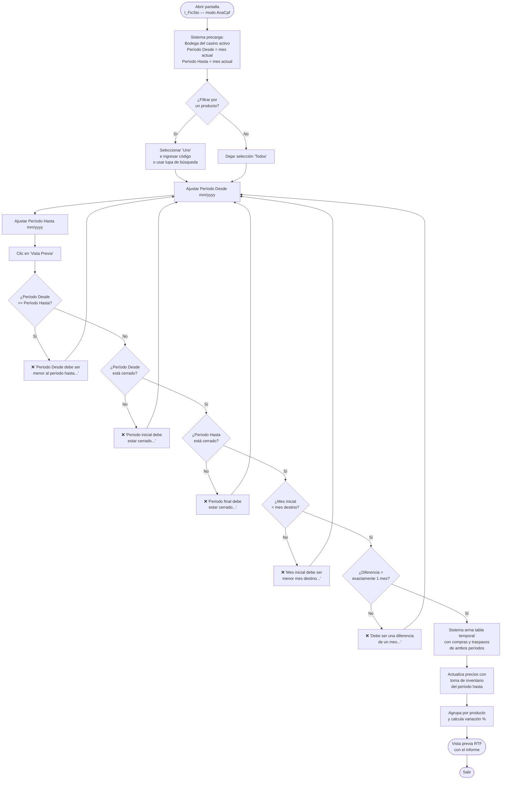

# Análisis de Consumo Precio Fijo

**Formulario:** `I_FicSto.frm` (modo `AnaCpf`)
**Función principal:** `I_AnalisisConsumoPrecioFijo` en `Informes.bas`
**Tablas principales:** `b_totcompras` (cabeceras de compras), `b_detcompras` (líneas de compras), `b_totventas` (cabeceras de traspasos entrada), `b_detventas` (líneas de traspasos), `b_tomainv` (toma de inventario mensual), `b_cierreperiodo` (períodos de cierre), `b_productos` (maestro de productos), `a_unidad` (unidades de medida)
**Consulta principal:** Consulta directa (sin procedimientos almacenados); usa tabla temporal `<usuario>_tmp_AnalisisConsumoPrecioFijo`

---

## Índice

- [1 — ¿Para qué sirve esta pantalla?](#1--para-qué-sirve-esta-pantalla)
- [2 — ¿Qué necesito para usarla?](#2--qué-necesito-para-usarla)
- [3 — ¿Cómo se usa?](#3--cómo-se-usa)
  - [3.1 Flujo paso a paso](#31-flujo-paso-a-paso)
  - [3.2 Controles y acciones disponibles](#32-controles-y-acciones-disponibles)
- [4 — ¿Qué restricciones debo conocer?](#4--qué-restricciones-debo-conocer)
  - [4.1 Validaciones del sistema](#41-validaciones-del-sistema)
  - [4.2 Reglas de cálculo](#42-reglas-de-cálculo)
- [5 — ¿Qué obtengo?](#5--qué-obtengo)
- [6 — Referencia técnica](#6--referencia-técnica)
  - [Tablas que intervienen](#tablas-que-intervienen)
  - [Relación con otros módulos](#relación-con-otros-módulos)

---

## 1 — ¿Para qué sirve esta pantalla?

[↑ Volver al índice](#índice)

Este informe compara el consumo de ingredientes y materiales entre **dos meses cerrados consecutivos**, eliminando el efecto del cambio de precio. La técnica consiste en valorizar las cantidades consumidas de ambos períodos al **mismo precio fijo** (el precio de inventario del mes más reciente), de modo que la variación de valor que aparece en el informe refleja exclusivamente diferencias en **cantidad consumida**, no en precio de compra.

El análisis agrupa los movimientos de compra y traspasos de entrada de cada mes, los pondera con el precio de inventario del período más reciente y calcula la variación porcentual resultante. Esto permite al responsable de costos determinar si el gasto subió o bajó porque se compró o transfirió más cantidad, con independencia de si los precios de mercado fluctuaron.

Dos restricciones clave delimitan el uso del informe:
- Ambos períodos deben estar **cerrados** en el sistema; no es posible comparar meses aún abiertos.
- Los meses comparados deben ser **consecutivos**: la diferencia entre el período hasta y el período desde debe ser exactamente un mes (por ejemplo, enero y febrero de un mismo año).

---

## 2 — ¿Qué necesito para usarla?

[↑ Volver al índice](#índice)

Antes de generar el informe se deben cumplir las siguientes condiciones:

| Requisito | Detalle |
|---|---|
| **Período desde cerrado** | El mes inicial seleccionado debe tener estado cerrado (`cie_estado = 0`) en la tabla de períodos de cierre. |
| **Período hasta cerrado** | El mes final seleccionado debe tener igualmente estado cerrado. |
| **Períodos consecutivos** | La diferencia entre ambos períodos, expresada en formato `yyyymm`, debe ser exactamente **1**. Por ejemplo: `202501` y `202502`. |
| **Período desde < Período hasta** | El mes inicial debe ser anterior al mes final (no pueden ser iguales ni estar invertidos). |
| **Bodega activa** | El sistema precarga automáticamente la bodega del casino en sesión. No es necesario seleccionar bodega manualmente. |
| **Toma de inventario registrada** | Para que el precio fijo esté disponible, la bodega debe tener una toma de inventario cerrada (`tin_ciemes <> 0`) en la fecha de término del período hasta. |

---

## 3 — ¿Cómo se usa?

[↑ Volver al índice](#índice)

### 3.1 Flujo paso a paso



### 3.2 Controles y acciones disponibles

[↑ Volver al índice](#índice)

| Control | Descripción |
|---|---|
| **Bodega** (Frame4) | Muestra la bodega del casino activo. Está deshabilitada; no se puede cambiar. |
| **Todos** (Opción en Frame2) | Incluye todos los productos de la bodega. Es la selección por defecto. |
| **Uno** (Opción en Frame2) | Restringe el informe a un único producto. Al seleccionar esta opción se habilita el campo de código de producto y el ícono de búsqueda. |
| **Campo código de producto** | Activo solo cuando se selecciona "Uno". Se puede escribir el código directamente. Al perder el foco, el sistema valida que el producto exista; de lo contrario muestra el mensaje *"Producto no existe..."*. |
| **Ícono de búsqueda** | Abre el buscador de productos. Solo activo en modo "Uno". |
| **Nombre del producto** | Campo de solo lectura que muestra el nombre del producto una vez validado el código. |
| **Período Desde** (mm/yyyy) | Mes inicial del rango de comparación. Se inicializa con el mes en curso. |
| **Período Hasta** (mm/yyyy) | Mes final del rango de comparación. Se inicializa con el mes en curso. |
| **Vista Previa** (botón toolbar, índice 1) | Ejecuta todas las validaciones y, si pasan, genera el informe en formato RTF con vista previa en pantalla. |
| **Salir** (botón toolbar, índice 3) | Cierra el formulario sin generar el informe. |

> **Nota:** El Frame3 ("Familia de producto") no aparece en este modo del formulario. El filtro de familia no aplica para este informe.

---

## 4 — ¿Qué restricciones debo conocer?

[↑ Volver al índice](#índice)

### 4.1 Validaciones del sistema

Las siguientes validaciones se ejecutan en orden al pulsar "Vista Previa". Si alguna falla, el informe no se genera y se muestra el mensaje correspondiente.

| # | Mensaje exacto del sistema | Condición que la dispara |
|---|---|---|
| 1 | `Periodo Desde debe ser menor al periodo hasta...` | El período desde es mayor o igual al período hasta, o ambos son el mismo mes. |
| 2 | `Periodo inicial debe estar cerrado...` | El período desde no tiene `cie_estado = 0` en `b_cierreperiodo` para el casino activo. |
| 3 | `Periodo final debe estar cerrado...` | El período hasta no tiene `cie_estado = 0` en `b_cierreperiodo` para el casino activo. |
| 4 | `Mes inicial debe ser menor mes destino...` | Validación adicional de orden cronológico de los períodos expresados como `yyyymm`. |
| 5 | `Debe ser una diferencia de un mes...` | La diferencia entre `yyyymm_hasta` y `yyyymm_desde` no es exactamente 1 (los períodos no son consecutivos). |

### 4.2 Reglas de cálculo

[↑ Volver al índice](#índice)

El informe aplica las siguientes reglas durante la construcción del resultado:

- **Precio fijo:** Se toma el precio de inventario (`tin_propon`) de la tabla de toma de inventario (`b_tomainv`) correspondiente a la **fecha de término del período hasta** (`cie_fecter`) y a la bodega activa, siempre que la toma de inventario esté cerrada (`tin_ciemes <> 0`). Este precio único es el que se usa para valorizar las cantidades de **ambos** períodos, eliminando así el efecto de variaciones de precio.

- **Fuentes de movimiento incluidas:** El análisis considera dos tipos de movimiento de entrada a bodega:
  1. **Compras de proveedores** (`b_totcompras` / `b_detcompras`): guías de despacho u otros tipos de documento que mueven inventario (`dec_mueinv = 'S'`), excluyendo documentos sin movimiento de inventario según la tabla `a_tipodocumento` (campo `tdo_IdCodigo <> 'SN'`), y con cantidad recibida mayor a cero (`dec_canrec > 0`).
  2. **Traspasos de entrada** (`b_totventas` / `b_detventas`): documentos de tipo `'TR'` (traspaso), no anulados ni pendientes (`tov_estdoc <> 'A'` y `tov_estdoc <> 'P'`), que muevan inventario (`dev_mueinv = 'S'`) con cantidad mayor a cero.

- **Cálculo del Valor Total:** Para cada producto y período:
  - Valor Total = Precio Fijo × Cantidad consumida en ese período

- **Cálculo de la Variación (Inflación):** Por producto:
  ```
  Variación % = ((Precio Fijo × Cant. Período Hasta) - (Precio Fijo × Cant. Período Desde))
                / (Precio Fijo × Cant. Período Desde)  × 100
  ```
  Si el valor del período anterior es 0, la variación se muestra como 0%.

- **Total General:** Se calcula la suma de todos los valores totales del período desde y del período hasta, y se aplica la misma fórmula de variación sobre los totales acumulados.

- **Tabla temporal:** El sistema crea una tabla temporal en la base de datos con el nombre `<usuario>_tmp_AnalisisConsumoPrecioFijo` (donde `<usuario>` es el nombre de usuario de sesión). Si ya existe de una ejecución anterior, la elimina antes de crearla. Esta tabla acumula los movimientos de ambos períodos antes de la consulta final.

---

## 5 — ¿Qué obtengo?

[↑ Volver al índice](#índice)

El informe se genera en **formato RTF** con orientación **vertical (Portrait)** y se abre en una ventana de vista previa. Puede imprimirse o exportarse desde esa vista.

**Cabecera del informe:**

| Campo | Contenido |
|---|---|
| Contrato | Código y nombre del casino activo |
| Período | Fecha de inicio y término de cada mes comparado |
| Producto | "TODOS" o el código y nombre del producto seleccionado |

**Detalle del informe (una fila por producto):**

| Columna | Descripción |
|---|---|
| **Código** | Código del producto en el maestro (`pro_codigo`) |
| **Descripción** | Nombre del producto (`pro_nombre`) |
| **Unidad** | Abreviación de la unidad de medida (`uni_nomcor`) |
| **Costo** | Precio fijo utilizado para la valorización (precio de inventario del período hasta) |
| **Compras** (período desde) | Cantidad total consumida en el mes anterior (compras + traspasos de entrada) |
| **Valor Total** (período desde) | Precio fijo × cantidad del período desde |
| **Compras** (período hasta) | Cantidad total consumida en el mes más reciente |
| **Valor Total** (período hasta) | Precio fijo × cantidad del período hasta |
| **Inflación** | Variación porcentual del valor total entre ambos períodos, expresada en % |

**Fila de Total General:**

Muestra la suma de todos los valores totales de ambos períodos y la variación porcentual global. Las columnas de cantidad no tienen total (solo se totalizan los valores monetarios).

**Qué significa "precio fijo" en este contexto:**

El precio utilizado para valorizar ambas columnas es el **precio de inventario al cierre del mes más reciente** (`tin_propon` en `b_tomainv`). Al usar el mismo precio para los dos períodos, si el porcentaje de variación es positivo, significa que se consumió **más cantidad** ese mes; si es negativo, se consumió menos. El efecto del precio de mercado queda neutralizado.

---

## 6 — Referencia técnica

[↑ Volver al índice](#índice)

### Tablas que intervienen

| Tabla | Rol en este informe |
|---|---|
| `b_totcompras` | Cabeceras de documentos de compra a proveedores. Se filtra por bodega (`toc_codbod`) y fecha de recepción (`toc_fecrem`) dentro del rango de cada período. |
| `b_detcompras` | Líneas de los documentos de compra. Aporta la cantidad recibida (`dec_canrec`), el precio de recepción (`dec_prerec`) y el flag de movimiento de inventario (`dec_mueinv`). |
| `b_totventas` | Cabeceras de documentos de salida/traspaso. Se filtra por tipo de documento `'TR'` (traspasos de entrada) y estado activo (`tov_estdoc`). |
| `b_detventas` | Líneas de los documentos de traspaso. Aporta la cantidad (`dev_canmer`), el precio del documento (`dev_predoc`) y el flag de movimiento de inventario (`dev_mueinv`). |
| `b_tomainv` | Toma de inventario mensual por bodega y producto. Se usa para obtener el precio de inventario del período hasta (`tin_propon`) que actúa como precio fijo. Solo se considera cuando la toma está cerrada (`tin_ciemes <> 0`). |
| `b_cierreperiodo` | Registro del estado de cada período mensual por casino. Se usa para validar que ambos períodos estén cerrados (`cie_estado = 0`) y para obtener las fechas exactas de inicio (`cie_fecini`) y término (`cie_fecter`) de cada mes. |
| `b_productos` | Maestro de productos. Aporta nombre (`pro_nombre`) y código de unidad de medida (`pro_coduni`). |
| `a_unidad` | Maestro de unidades de medida. Aporta la abreviación de la unidad (`uni_nomcor`) para la columna "Unidad" del informe. |
| `a_tipodocumento` | Catálogo de tipos de documento. Se usa para excluir documentos sin movimiento de inventario real (aquellos con `tdo_IdCodigo = 'SN'`). |

### Relación con otros módulos

[↑ Volver al índice](#índice)

| Módulo relacionado | Tipo de relación |
|---|---|
| **Inventario — Recepción de compras** | Los documentos de compra registrados en `b_totcompras` / `b_detcompras` son los que alimentan las columnas de cantidad de este informe. |
| **Inventario — Traspasos** | Los traspasos de entrada (tipo `'TR'`) registrados en `b_totventas` / `b_detventas` se suman a las compras como fuente de consumo. |
| **Inventario — Toma de inventario** | El precio fijo proviene del inventario físico cerrado del período hasta (`b_tomainv`). Sin una toma de inventario cerrada, el precio será el de la última compra en lugar del precio de inventario. |
| **Cierre de período** | El módulo de cierre es prerequisito: ambos períodos deben estar cerrados para poder ejecutar este informe. El cierre registra las fechas exactas del período en `b_cierreperiodo`. |
| **Maestros — Productos y Unidades** | El informe muestra nombre y unidad de medida de cada producto consultando `b_productos` y `a_unidad`. Estos maestros son mantenidos por otros módulos del sistema (Contrato/Régimen). |

---

*Fuentes: `I_FicSto.frm`, función `I_AnalisisConsumoPrecioFijo` en `Informes.bas`, tablas `b_totcompras`, `b_detcompras`, `b_totventas`, `b_detventas`, `b_tomainv`, `b_cierreperiodo`, `b_productos`, `a_unidad`, `a_tipodocumento` en `SGP_Local.sql`*
