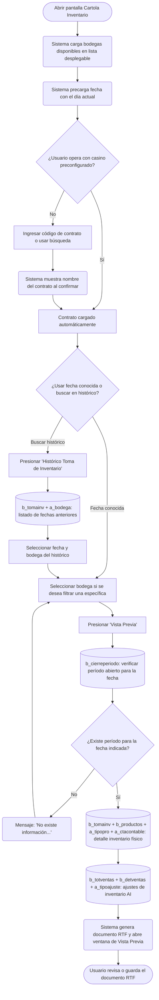

# Cartola Inventario

**Formulario:** `I_CarInv.frm`
**Tabla principal:** `b_tomainv` (registro de tomas de inventario físico por bodega y producto)
**Consulta principal:** Sin procedimiento almacenado — consultas directas al servidor mediante la función `I_CartolaInventario` en `Informes.bas`

---

## Índice

- [1 — ¿Para qué sirve esta pantalla?](#1--para-qué-sirve-esta-pantalla)
- [2 — ¿Qué necesito para usarla?](#2--qué-necesito-para-usarla)
- [3 — ¿Cómo se usa?](#3--cómo-se-usa)
  - [3.1 Flujo paso a paso](#31-flujo-paso-a-paso)
  - [3.2 Controles y acciones disponibles](#32-controles-y-acciones-disponibles)
- [4 — ¿Qué restricciones debo conocer?](#4--qué-restricciones-debo-conocer)
  - [4.1 Validaciones del sistema](#41-validaciones-del-sistema)
  - [4.2 Reglas de cálculo](#42-reglas-de-cálculo)
- [5 — ¿Qué obtengo?](#5--qué-obtengo)
- [6 — Referencia técnica](#6--referencia-técnica)
  - [Tablas que intervienen](#tablas-que-intervienen)
  - [Relación con otros módulos](#relación-con-otros-módulos)

---

## 1 — ¿Para qué sirve esta pantalla?

[↑ Volver al índice](#índice)

Esta pantalla genera la **Cartola Inventario**: un documento que consolida el resultado de la última toma de inventario físico realizada en el casino para una fecha y bodega determinadas. El documento agrupa los productos inventariados por cuenta contable y familia de producto, mostrando los montos valorizados del stock físico contado, los ajustes de inventario que se hayan registrado posteriormente, y el porcentaje que cada ajuste representa sobre el total general.

La pantalla es de tamaño fijo y pequeño: contiene únicamente los filtros necesarios para identificar el inventario a consultar (código de contrato, bodega y fecha), más una barra de herramientas con tres acciones. No dispone de grilla de resultados integrada; el documento se genera y se presenta en una ventana de vista previa, desde donde también puede exportarse como archivo RTF.

El formulario admite tanto una bodega específica como todas las bodegas del casino, controlado por la lista desplegable del panel Bodega. Adicionalmente, ofrece un asistente de histórico que permite seleccionar fechas de inventarios anteriores directamente desde la base de datos, sin necesidad de recordar o digitar la fecha manualmente.

---

## 2 — ¿Qué necesito para usarla?

[↑ Volver al índice](#índice)

| Campo | Descripción | Obligatorio |
|---|---|---|
| Contrato (código) | Código del contrato (centro de costo) del casino. Se puede digitar directamente o seleccionar usando el ícono de búsqueda, que abre un formulario auxiliar con el listado de contratos disponibles. Al perder el foco, el sistema muestra automáticamente el nombre del contrato junto al campo. | Sí |
| Bodega | Lista desplegable que muestra las bodegas configuradas en el sistema (tabla `a_bodega`). Se carga automáticamente al abrir la pantalla. Dejar sin selección equivale a consultar todas las bodegas (el sistema interpreta código 0 como "todas"). | No |
| Fecha Inventario | Fecha de la toma de inventario a consultar, en formato dd/mm/aaaa. Se inicializa automáticamente con la fecha del día en que se abre la pantalla. Puede modificarse manualmente o cargarse desde el histórico. | Sí |

> **Nota:** Si el usuario del sistema opera en un casino preconfigurado (variable `ModCasino` desactivada), el campo de código de contrato y el ícono de búsqueda aparecen deshabilitados, y el contrato se carga automáticamente desde los parámetros de sesión. En ese caso no se requiere ninguna acción adicional del usuario para identificar el casino.

---

## 3 — ¿Cómo se usa?

### 3.1 Flujo paso a paso

[↑ Volver al índice](#índice)

### 3.2 Controles y acciones disponibles

[↑ Volver al índice](#índice)

| Control / Acción | Descripción |
|---|---|
| **Campo código de contrato** | Permite ingresar el código del casino a consultar. Al presionar Tab o abandonar el campo, el sistema valida el código contra la tabla de contratos y muestra el nombre correspondiente a la derecha del campo. |
| **Ícono de búsqueda (lupa junto al contrato)** | Abre un formulario auxiliar de búsqueda de contratos. Al seleccionar uno, completa automáticamente el código y el nombre en la pantalla. También se puede activar presionando la tecla F9 mientras el cursor está en el campo de código. |
| **Lista desplegable Bodega** | Permite elegir una bodega específica para filtrar el inventario. Si no se selecciona ninguna, el informe incluye todas las bodegas del casino. |
| **Campo Fecha Inventario** | Permite indicar la fecha de la toma de inventario. Se puede editar directamente en formato dd/mm/aaaa. |
| **Vista Previa** (botón de la barra) | Ejecuta la consulta con los parámetros ingresados y abre la ventana de vista previa con el documento RTF generado. Si no existe información para la fecha indicada, muestra un mensaje de advertencia. |
| **Histórico Toma de Inventario** (botón de la barra) | Abre una ventana auxiliar que lista todas las fechas de inventario registradas en el sistema para la bodega de sesión activa (tabla `b_tomainv`). Al seleccionar una fila, carga automáticamente la fecha y la bodega en la pantalla principal. |
| **Salir** (botón de la barra) | Cierra la pantalla y la descarga de memoria. |

---

## 4 — ¿Qué restricciones debo conocer?

### 4.1 Validaciones del sistema

[↑ Volver al índice](#índice)

| # | Cuándo aparece | Qué verifica el sistema | Qué ve o experimenta el usuario |
|---|---|---|---|
| 1 | Al presionar Vista Previa | El sistema busca en la tabla `b_cierreperiodo` si existe un período contable abierto que corresponda al año-mes de la fecha de inventario indicada para el contrato seleccionado. | Si no existe el período, aparece el mensaje **"No existe información..."** y el proceso se detiene. El usuario debe verificar que la fecha ingresada corresponde a un período que haya sido creado en el sistema. |
| 2 | Al presionar Vista Previa | El sistema verifica que existan registros en la tabla `b_tomainv` con stock físico (`tin_stofis > 0`) y precio ponderado (`tin_propon > 0`) para la fecha y bodega indicadas. | Si la consulta no devuelve filas, el informe se cierra sin mostrar datos. El usuario no recibe un mensaje de texto explícito, pero la ventana de vista previa no se abre. |
| 3 | Al ingresar el código de contrato | El sistema consulta la tabla `b_clientes` para verificar si el código ingresado existe (con `cli_tipo = 0`, que corresponde a un contrato activo). | Si el código no existe, el campo de nombre del contrato queda en blanco. El usuario puede continuar, pero el informe se generará sin identificar correctamente el contrato en el encabezado. |

### 4.2 Reglas de cálculo

[↑ Volver al índice](#índice)

Los cálculos del informe ocurren íntegramente dentro de la función de generación del documento. No existen valores calculados visibles en los controles de la pantalla principal antes de ejecutar el informe. Los detalles de cálculo se describen en la Sección 5.

---

## 5 — ¿Qué obtengo?

[↑ Volver al índice](#índice)

Esta pantalla genera un único tipo de informe. No dispone de selector de tipo.

**Formato de salida:** Documento RTF con vista previa en pantalla. Orientación retrato. El archivo se guarda automáticamente en la carpeta de trabajo configurada en el sistema, con nombre `CARTOLA INVENTARIO<cencos><yyyymm>.rtf`. El usuario puede imprimirlo o guardarlo desde la ventana de vista previa.

El documento incluye:

- **Encabezado de página:** generado automáticamente con el encabezado de página estándar del sistema (función `fg_poneencpagina`).
- **Pie de página:** contiene tres secciones de firma: "Vº Jefe Contrato", "VºBº Gerencia Operaciones", "VºBº Contabilidad".
- **Encabezado del informe:** bloque con los datos de identificación: nombre del contrato con su código, fecha de inventario y nombre de la bodega consultada. Si el inventario fue enviado a SAP, también muestra el número del documento SAP correspondiente.
- **Cuerpo del informe:** tabla con el detalle por cuenta contable y familia de producto.
- **Fila de totales por cuenta:** al cambiar de cuenta contable, el sistema inserta una fila de total acumulado para esa cuenta.
- **Fila de total general:** al final del cuerpo, muestra el total general del inventario (suma de cuenta de insumos y cuenta de alimentos desechables).

**Estructura de datos del informe:**

| Campo / Columna | Descripción | Calculado |
|---|---|---|
| Num. | Número de línea correlativo dentro del grupo de cada cuenta contable | No |
| Denominación del Grupo | Nombre de la familia de producto (tipo de producto) a la que pertenecen los artículos inventariados | No |
| Monto | Valor total del stock físico inventariado para esa familia, expresado en pesos | Sí |
| Ajuste | Monto neto de los ajustes de inventario (tipo documento 'AI') registrados para esa familia en el período, expresado en pesos | Sí |
| % | Porcentaje que representa el ajuste de esa familia sobre el total general del inventario | Sí |
| Total Cuenta | Fila de subtotal: suma de Monto y Ajuste para todos los grupos de la misma cuenta contable | Sí |
| Total General Inventario | Fila de cierre: suma de los montos de la cuenta de insumos y la cuenta de alimentos desechables | Sí |

---

**Cálculo — Monto**

Representa el valor monetario del stock físico contado durante la toma de inventario para cada familia de producto.

**Fórmula o lógica:**

Monto (por familia) = SUMA( tin_propon × tin_stofis ) para todos los productos de esa familia

| Componente | Qué representa | De dónde viene |
|---|---|---|
| `tin_propon` | Precio ponderado (PMP) del producto al momento de la toma de inventario | `b_tomainv.tin_propon` |
| `tin_stofis` | Cantidad física contada en el inventario (en unidades del producto) | `b_tomainv.tin_stofis` |
| Familia de producto | Agrupación definida por el tipo de producto (`tip_previo`) al que pertenece cada artículo | `a_tipopro.tip_previo`, enlazada a través de `b_productos.pro_codtip` |

> Ejemplo: si se contaron 50 kg de harina con PMP de $400/kg y 30 unidades de aceite con PMP de $1.200/unidad, ambos pertenecientes a la familia "Abarrotes", el Monto de esa familia sería $50 × $400 + $30 × $1.200 = $20.000 + $36.000 = $56.000.

---

**Cálculo — Ajuste**

Representa el impacto monetario neto de los ajustes de inventario (documentos de tipo 'AI') que se registraron para esa familia de producto entre el inicio del período y la fecha del inventario.

**Fórmula o lógica:**

Para cada producto y tipo de ajuste se calcula:
- Si el tipo de ajuste es 'A' (aumento): cantidad × precio costo → suma positiva
- Si el tipo de ajuste es cualquier otro (disminución): cantidad × precio costo → suma negativa

El resultado se acumula por familia (`tip_previo`) y cuenta contable (`pro_ctacon`).

| Componente | Qué representa | De dónde viene |
|---|---|---|
| `dev_canmer` | Cantidad de mercadería ajustada en la línea del documento | `b_detventas.dev_canmer` |
| `dev_precos` | Precio de costo unitario aplicado en la línea de ajuste | `b_detventas.dev_precos` |
| `aju_tipo` | Indica si el ajuste aumenta ('A') o disminuye el inventario | `a_tipoajuste.aju_tipo`, enlazado por `b_totventas.tov_codser = a_tipoajuste.aju_codigo` |
| Rango de fechas | Desde el inicio del período (`cie_fecini` en `b_cierreperiodo`) hasta la fecha del inventario | `b_cierreperiodo.cie_fecini` y parámetro `FecInv` |

> Ejemplo: si se registró un ajuste de aumento de 10 kg de azúcar a $500/kg (ajuste positivo = $5.000) y una disminución de 5 kg de sal a $200/kg (ajuste negativo = −$1.000), el Ajuste neto para la familia de esos productos sería $5.000 − $1.000 = $4.000.

---

**Cálculo — % (Porcentaje del ajuste)**

Mide qué fracción del total general inventariado representan los ajustes de cada familia.

**Fórmula o lógica:**

% = (Ajuste de la familia / Total general del inventario) × 100

| Componente | Qué representa | De dónde viene |
|---|---|---|
| Ajuste de la familia | Monto neto de ajustes para la familia, calculado como se describe arriba | Calculado en tiempo de ejecución |
| Total general | Suma de stock valorizado de todas las familias y cuentas contables del inventario (variable `totgrl`) | Calculado en tiempo de ejecución a partir de `b_tomainv` |

> Ejemplo: si el total general del inventario es $1.000.000 y el ajuste de la familia "Lácteos" es $25.000, el porcentaje mostrado sería (25.000 / 1.000.000) × 100 = 2,50%.

---

> **Nota sobre cuentas contables filtradas:** el informe incluye únicamente los productos cuya cuenta contable (`pro_ctacon`) corresponde a la cuenta de insumos (parámetro `ctainsumo`) o a la cuenta de alimentos desechables (parámetro `ctalimdes`), ambos configurados en la tabla de parámetros del sistema (`a_param`). Los productos asignados a otras cuentas no aparecen en el informe.

> **Nota sobre productos mal clasificados:** si un producto tiene un tipo de producto (`pro_codtip`) que no existe en la tabla de familias (`a_tipopro`), la columna "Denominación del Grupo" mostrará el texto **"Existe producto mal asignado familia de producto"**.

> **Nota sobre documento SAP:** en el encabezado del informe puede aparecer el número de documento SAP asociado al inventario, si el inventario fue marcado como enviado a SAP (`tin_envsap = '1'`) y existe el registro correspondiente en la tabla `log_procesos` con tipo de proceso '2' y estado '1'.

---

## 6 — Referencia técnica

### Tablas que intervienen

[↑ Volver al índice](#índice)

| Tabla | Para qué se usa en este reporte | Campos clave |
|---|---|---|
| `b_tomainv` | Fuente principal: contiene el registro de cada producto inventariado con su stock físico y precio ponderado al momento del inventario | `tin_fectom`, `tin_codbod`, `tin_codpro`, `tin_stofis`, `tin_propon`, `tin_envsap` |
| `b_productos` | Catálogo de productos: permite obtener el tipo de producto y la cuenta contable de cada artículo inventariado | `pro_codigo`, `pro_codtip`, `pro_ctacon` |
| `a_tipopro` | Catálogo de familias/tipos de producto: provee el nombre de la familia y el código de agrupación (`tip_previo`) para ordenar el informe | `tip_codigo`, `tip_previo`, `tip_nombre` |
| `a_ctacontable` | Catálogo de cuentas contables: provee el nombre descriptivo de cada cuenta para el encabezado de grupo | `cta_codigo`, `cta_nombre` |
| `b_cierreperiodo` | Tabla de períodos contables: el sistema obtiene la fecha de inicio del período para determinar el rango de ajustes a incluir | `cie_cencos`, `cie_periodo`, `cie_fecini` |
| `b_totventas` | Cabecera de documentos de movimiento de bodega: filtra los documentos de ajuste de inventario (tipo 'AI') dentro del período | `tov_rutcli`, `tov_tipdoc`, `tov_numdoc`, `tov_fecemi`, `tov_codbod`, `tov_codser`, `tov_estdoc` |
| `b_detventas` | Detalle de líneas de los documentos de ajuste: aporta la cantidad y precio de costo de cada ítem ajustado | `dev_rutcli`, `dev_tipdoc`, `dev_numdoc`, `dev_codmer`, `dev_canmer`, `dev_precos` |
| `a_tipoajuste` | Catálogo de tipos de ajuste: determina si cada ajuste es de aumento ('A') o disminución para calcular el signo del monto | `aju_codigo`, `aju_tipo` |
| `a_bodega` | Catálogo de bodegas: permite cargar la lista de bodegas en el selector y obtener el nombre para el encabezado del informe | `bod_codigo`, `bod_nombre`, `bod_ubicac` |
| `b_clientes` | Catálogo de contratos/casinos: permite validar y mostrar el nombre del contrato en el encabezado del informe | `cli_codigo`, `cli_nombre`, `cli_tipo` |
| `log_procesos` | Registro de procesos de integración: permite mostrar el número de documento SAP asociado al inventario cuando corresponde | `cencos`, `tipo_proceso`, `estado`, `num_documento`, `mensaje` |

### Relación con otros módulos

[↑ Volver al índice](#índice)

| Módulo | Relación |
|---|---|
| **Toma de Inventario** | Genera los registros de la tabla `b_tomainv` que este informe consume. Sin una toma de inventario realizada para la fecha y bodega seleccionadas, el informe no produce datos. |
| **Cierre de Período** | Define la fecha de inicio del período contable (`cie_fecini`) que delimita el rango de ajustes incluidos en el informe. Sin un período configurado, el informe no puede ejecutarse. |
| **Ajustes de Inventario** | Los documentos de tipo 'AI' registrados a través del módulo de Inventario se reflejan en la columna Ajuste. Solo se consideran documentos con estado distinto de Anulado ('A') y Pendiente ('P'). |
| **Integración SAP** | Si el inventario fue transmitido a SAP a través del proceso de integración, el número de documento generado en SAP se muestra en el encabezado del informe, obtenido desde la tabla `log_procesos`. |
| **Parámetros del sistema** | Los parámetros `ctainsumo` y `ctalimdes` (configurados en la tabla `a_param`) determinan qué cuentas contables se incluyen en el informe. Solo los productos asignados a estas dos cuentas son considerados. |

---

*Fuentes: `I_CarInv.frm`, función `I_CartolaInventario` en `Informes.bas`, tablas `b_tomainv`, `b_cierreperiodo`, `b_totventas`, `b_detventas`, `a_tipopro`, `a_ctacontable`, `a_tipoajuste`, `a_bodega`, `b_clientes`, `log_procesos` en `SGP_Local.sql`*
