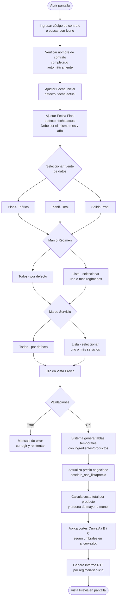

# Comparativo Curva ABC

**Formulario:** `I_FCost.frm` (modo `CocABC`)
**Función principal:** `I_ComparativoCurvaABC` en `Informes.bas`
**Tabla(s) principal(es):** `b_minuta` / `b_minutadet` (planificación), `b_minutafijadia` (estructura fija), `b_totventas` / `b_detventas` (salidas de producción), `a_curvaabc` (umbrales de clasificación), `b_sac_listaprecio` (precio negociado SAC)
**Consulta principal:** Consulta directa (SQL dinámico con tablas temporales)

---

## Índice

- [1 — ¿Para qué sirve esta pantalla?](#1--para-qué-sirve-esta-pantalla)
- [2 — ¿Qué necesito para usarla?](#2--qué-necesito-para-usarla)
- [3 — ¿Cómo se usa?](#3--cómo-se-usa)
  - [3.1 Flujo paso a paso](#31-flujo-paso-a-paso)
  - [3.2 Controles y acciones disponibles](#32-controles-y-acciones-disponibles)
- [4 — ¿Qué restricciones debo conocer?](#4--qué-restricciones-debo-conocer)
  - [4.1 Validaciones del sistema](#41-validaciones-del-sistema)
  - [4.2 Reglas de cálculo](#42-reglas-de-cálculo)
- [5 — ¿Qué obtengo?](#5--qué-obtengo)
- [6 — Referencia técnica](#6--referencia-técnica)
  - [Tablas que intervienen](#tablas-que-intervienen)
  - [Relación con otros módulos](#relación-con-otros-módulos)

---

## 1 — ¿Para qué sirve esta pantalla?

[↑ Volver al índice](#índice)

Este informe permite comparar el **costo real de cada ingrediente o producto** utilizado durante un período mensual contra el **precio negociado con el proveedor** (lista de precios SAC), clasificando los productos según la metodología de análisis **Curva ABC**.

La Curva ABC organiza los productos en tres grupos según su peso en el costo total del período:

- **Curva A** — productos que acumulan el porcentaje más alto del gasto (los más críticos)
- **Curva B** — productos de impacto intermedio
- **Curva C** — productos de menor impacto en el costo total

Los porcentajes de corte de cada curva (p. ej., A = 70 %, B = 20 %, C = 10 %) se mantienen en el maestro del sistema y son configurables.

El informe admite tres fuentes de datos para la columna de costo comparado:

| Opción en pantalla | Significado |
|---|---|
| Planif. Teórico | Ingredientes calculados a partir de la planificación teórica de la minuta |
| Planif. Real | Ingredientes calculados a partir de la planificación real de la minuta |
| Salida Prod. | Productos efectivamente despachados según los documentos de salida de bodega (tipo SP/DP) |

En todos los casos, el comparativo se realiza **contra el precio negociado SAC** del mismo período, permitiendo identificar desviaciones entre lo que costó producir y lo que se comprometió en el contrato de abastecimiento.

---

## 2 — ¿Qué necesito para usarla?

[↑ Volver al índice](#índice)

Antes de ejecutar el informe se deben cumplir las siguientes condiciones:

- Tener asignado permiso de **Vista Previa** en el perfil de usuario (el botón queda deshabilitado si no se tiene).
- Que el contrato (centro de costo) exista registrado en el sistema.
- Que existan minutas planificadas (teóricas o reales) **o** documentos de salida de producción en el rango de fechas indicado, según la fuente de datos elegida.
- Que se haya cargado la **lista de precios negociados SAC** del período en la tabla `b_sac_listaprecio`; sin ella, la columna "Costo Neg." aparecerá en cero para todos los productos.
- Que la configuración de la Curva ABC (tabla `a_curvaabc`) esté completa con los tres códigos: A, B y C y sus porcentajes de corte respectivos.

---

## 3 — ¿Cómo se usa?

[↑ Volver al índice](#índice)

### 3.1 Flujo paso a paso

[↑ Volver al índice](#índice)



### 3.2 Controles y acciones disponibles

[↑ Volver al índice](#índice)

| Control | Descripción |
|---|---|
| **Contrato** (campo de texto) | Código del centro de costo. Se puede escribir directamente o usar el ícono de búsqueda para seleccionar desde un listado. Al ingresar el código, el nombre del contrato se completa automáticamente. |
| **Fecha Inicial** | Fecha de inicio del período a analizar (formato dd/mm/yyyy). Se inicializa con la fecha del día. |
| **Fecha Final** | Fecha de fin del período a analizar (formato dd/mm/yyyy). Se inicializa con la fecha del día. Debe corresponder al mismo mes y año que la fecha inicial. |
| **Planif. Teórico** | Opción de fuente: usa la planificación teórica de la minuta (`mid_tipmin = '1'`). |
| **Planif. Real** | Opción de fuente: usa la planificación real de la minuta (`mid_tipmin = '2'`). |
| **Salida Prod.** | Opción de fuente: usa los documentos de salida de producción registrados en bodega (tipo SP y DP). |
| **Marco Régimen → Todos** | Incluye todos los regímenes del contrato (marcado por defecto). |
| **Marco Régimen → Lista** | Permite seleccionar uno o más regímenes específicos desde un listado. |
| **Marco Servicio → Todos** | Incluye todos los servicios del contrato (marcado por defecto). |
| **Marco Servicio → Lista** | Permite seleccionar uno o más servicios específicos desde un listado. |
| **Botón Vista Previa** (barra de herramientas) | Ejecuta las validaciones y genera el informe. Sólo está habilitado si el usuario tiene el permiso correspondiente. |
| **Botón Histórico Planificación Teórica** (barra de herramientas) | Abre el historial de períodos de planificación para seleccionar un mes/año de análisis. Al confirmar, ajusta automáticamente las fechas inicial y final al primer y último día del período seleccionado. |
| **Botón Salir** (barra de herramientas) | Cierra el formulario. |

---

## 4 — ¿Qué restricciones debo conocer?

[↑ Volver al índice](#índice)

### 4.1 Validaciones del sistema

[↑ Volver al índice](#índice)

Las siguientes validaciones se ejecutan al presionar **Vista Previa**, en el orden indicado:

| N° | Mensaje del sistema | Condición que lo genera |
|---|---|---|
| 1 | `No existe contrato` | El código ingresado en el campo de contrato no existe en la tabla de clientes/contratos. |
| 2 | `Fecha origen Mayor destino` | La Fecha Inicial es posterior a la Fecha Final. |
| 3 | `Mes origen mayor destino` | El mes de la Fecha Inicial es distinto al mes de la Fecha Final (el informe exige que ambas fechas pertenezcan al mismo mes). |
| 4 | `Año origen mayor destino` | El año de la Fecha Inicial es distinto al año de la Fecha Final (el informe exige que ambas fechas pertenezcan al mismo año). |
| 5 | `Regimen debe ser informado` | No hay ningún régimen seleccionado en el marco Régimen. |
| 6 | `Servicio debe ser informado` | No hay ningún servicio seleccionado en el marco Servicio. |

> **Nota:** Si las validaciones pasan pero no existen datos para el rango y filtros indicados, el informe simplemente no genera ninguna página (la función termina sin imprimir nada).

### 4.2 Reglas de cálculo

[↑ Volver al índice](#índice)

**Cálculo de cantidad e importe según fuente de datos**

Para **Planif. Teórico** o **Planif. Real** (`tipmin = '1'` ó `'2'`):

- Se recorren todas las recetas planificadas en la minuta para el período, régimen y servicio indicados.
- Por cada ingrediente de receta se calcula:
  ```
  cantidad = (red_canpro / rec_basrac) × mid_numrac × pro_facsto
  costo_total = (red_canpro / rec_basrac) × mid_numrac × mic_cospro
  ```
  donde `red_canpro` es la cantidad de ingrediente por base de raciones, `rec_basrac` es la base de raciones de la receta, `mid_numrac` es el número de raciones planificadas y `mic_cospro` es el costo unitario vigente del ingrediente en el período.
- Adicionalmente, se incorporan los productos de **estructura fija del día** (`b_minutafijadia`) con su cantidad y costo registrados directamente.
- Tras construir la tabla temporal, se ajustan cantidad y costo unitario aplicando el factor de conversión del producto (`pro_facing`):
  ```
  mic_cospro_ajustado = mic_cospro × pro_facing
  cantidad_ajustada   = cantidad / pro_facing
  ```

Para **Salida Prod.** (`tipmin = '0'`):

- Se toman los documentos de salida de bodega de tipo `SP` (salida de producción) y `DP` (devolución de producción), excluyendo documentos anulados (`tov_estdoc <> 'A'`) y pendientes (`tov_estdoc <> 'P'`).
- La cantidad neta se calcula sumando las salidas y restando las devoluciones:
  ```
  cantidad = SUM(dev_canmer) si tipdoc = 'SP'  −  SUM(dev_canmer) si tipdoc = 'DP'
  costo_total = cantidad_neta × dev_precos
  ```

**Cálculo del precio negociado**

Una vez construida la tabla temporal de productos, el sistema actualiza el campo `preneg` con el precio de la lista SAC correspondiente al período:

- Se vincula el producto SGP con su código SAC a través de las tablas `b_formatocomprassgp` y `b_formatocompras`.
- Se busca el precio en `b_sac_listaprecio` filtrando por contrato (`lps_cencos`) y período en formato `YYYYMM` (`lps_periodo`).
- Si el producto no tiene equivalencia SAC o no existe precio para el período, `preneg` queda en 0.

**Clasificación Curva ABC**

1. Se calcula el **costo total general** del servicio sumando todos los `costot`.
2. Los productos se ordenan de **mayor a menor** por costo total.
3. Se recorre la lista acumulando el porcentaje que cada producto representa sobre el total:
   ```
   porcentaje_acumulado += (costot_producto / costo_total_general) × 100
   ```
4. Cuando el porcentaje acumulado supera el umbral de la Curva A (campo `abc_porce` donde `abc_codigo = 'A'`), el siguiente producto inicia la Curva B; al superar el umbral de la Curva B, inicia la Curva C.
5. Los umbrales se leen de la tabla `a_curvaabc` al inicio de la función.

**Cálculo de diferencias**

Para cada producto se calculan dos métricas comparativas:

| Métrica | Fórmula |
|---|---|
| % Diferencia sobre Costo Total | `((cantidad × preneg) / costot − 1) × 100` |
| Diferencia de Costo Total | `costot − (cantidad × preneg)` |

Un valor positivo en "Diferencia Costo Total" indica que el costo real/planificado **superó** al precio negociado; un valor negativo indica que estuvo **por debajo**.

El informe también acumula totales por Curva (A, B, C) y un **Total General del Servicio**, incluyendo los mismos indicadores de diferencia a nivel agregado.

---

## 5 — ¿Qué obtengo?

[↑ Volver al índice](#índice)

El resultado es un **informe en formato RTF**, orientación horizontal (landscape), con una página por cada combinación régimen-servicio que tenga datos en el período seleccionado.

**Encabezado de cada página del informe:**

| Campo | Contenido |
|---|---|
| Contrato | Código y nombre del centro de costo |
| Rango Fecha | Fecha inicial y fecha final del período analizado |
| Régimen | Código y nombre del régimen |
| Servicio | Código y nombre del servicio |

**Título del informe según fuente de datos:**

| Opción seleccionada | Título que aparece |
|---|---|
| Planif. Teórico | Comparativo Curva ABC — Planificación Teórico Vs Negociado |
| Planif. Real | Comparativo Curva ABC — Planificación Real Vs Negociado |
| Salida Prod. | Comparativo Curva ABC — Realizado Vs Negociado |

**Estructura de columnas del cuerpo del informe:**

| Columna | Descripción | Calculado |
|---|---|---|
| — | Etiqueta de curva ("Curva A", "Curva B", "Curva C") | No (agrupador visual) |
| Código | Código del producto/ingrediente | No |
| Descripción | Nombre del producto/ingrediente | No |
| UN | Unidad de medida abreviada | No |
| Consumo | Cantidad total consumida/planificada en el período | Sí |
| Costo Unit. | Costo unitario del ingrediente en el período | No (tomado de `mic_cospro` o `dev_precos`) |
| Costo Total | Costo total del producto (cantidad × costo unitario) | Sí |
| % Sobre Total | Porcentaje que representa el costo total de este producto sobre el costo total del servicio | Sí |
| Costo Neg. | Precio negociado SAC para este producto en el período | No (tomado de `lps_precio`) |
| Costo Total (Neg.) | Costo total valorizado al precio negociado (cantidad × precio negociado) | Sí |
| % Difer. Cost. Tot. | Diferencia porcentual entre costo negociado y costo real | Sí |
| Difer. Cost. Tot. | Diferencia absoluta en pesos entre costo real y costo negociado | Sí |

**Filas de subtotales:**

Al finalizar cada grupo de curva (A, B o C) aparece una fila de **Total General Curva X** con:
- Costo Total acumulado de la curva
- Porcentaje del costo de la curva sobre el total del servicio
- Costo Total negociado acumulado
- % Diferencia y Diferencia absoluta del grupo

Al final de cada servicio aparece una fila de **Total General Servicio** con los mismos campos pero sumando las tres curvas.

---

## 6 — Referencia técnica

[↑ Volver al índice](#índice)

### Tablas que intervienen

[↑ Volver al índice](#índice)

| Tabla | Descripción | Rol en este informe |
|---|---|---|
| `a_curvaabc` | Maestro de clasificación ABC. Contiene los tres registros (A, B, C) con su porcentaje de corte (`abc_porce`). | Define los umbrales de clasificación A/B/C. |
| `a_clientes` / `b_clientes` | Tabla de contratos/centros de costo. | Valida que el contrato exista y recupera el nombre. |
| `a_servicio` | Maestro de servicios de alimentación. | Proporciona código y nombre del servicio. |
| `a_regimen` | Maestro de regímenes alimenticios. | Proporciona código y nombre del régimen. |
| `a_unidad` | Maestro de unidades de medida. | Proporciona el nombre abreviado de la unidad (`uni_nomcor`). |
| `b_minuta` | Cabecera de la minuta (planificación por fecha, régimen y servicio). | Filtra las minutas del período, contrato, régimen y servicio indicados. |
| `b_minutadet` | Detalle de recetas por minuta, con número de raciones planificadas (`mid_numrac`) y tipo de minuta (`mid_tipmin`). | Aporta las raciones para el cálculo de cantidades. |
| `b_receta` | Cabecera de receta con base de raciones (`rec_basrac`). | Permite calcular proporciones de ingredientes. |
| `b_recetadet` | Detalle de ingredientes por receta, con cantidad por base (`red_canpro`). | Fuente de los ingredientes y cantidades. |
| `b_ingrediente` | Maestro de ingredientes con nombre y unidad de medida. | Descripción e identificación del ingrediente. |
| `b_minutacosto` | Costo vigente de cada ingrediente para un período y tipo de minuta. Clave: contrato, fecha de validez, tipo de minuta, código de producto. | Aporta el costo unitario (`mic_cospro`) para el cálculo del costo planificado. |
| `b_productos` | Maestro de productos con factor de conversión almacenamiento (`pro_facsto`) y factor compras (`pro_facing`). | Conversión de unidades; también filtra productos vigentes. |
| `b_contlistpreing` | Lista de ingredientes por contrato con su equivalencia de producto (`cpi_codped`). | Vincula ingrediente de receta con código de producto en bodega. |
| `b_minutafijadia` | Estructura fija diaria de productos por régimen, servicio, fecha y tipo de minuta. | Complementa los ingredientes de receta con productos de costo fijo. |
| `b_totventas` | Cabecera de documentos de salida de bodega (SP: salida producción, DP: devolución producción). | Fuente cuando se elige "Salida Prod."; filtra por tipo de documento, estado y período. |
| `b_detventas` | Detalle de productos por documento de salida, con cantidad (`dev_canmer`) y precio de costo (`dev_precos`). | Aporta cantidades y costos reales de despacho. |
| `b_formatocompras` | Maestro de artículos SAC (códigos del sistema de abastecimiento centralizado). | Punto de enlace entre SGP y SAC para obtener el precio negociado. |
| `b_formatocomprassgp` | Tabla de equivalencia entre código SAC (`fcs_codsac`) y código SGP (`fcs_codsgp`). | Permite cruzar productos SGP con su precio en la lista SAC. |
| `b_sac_listaprecio` | Lista de precios negociados SAC por contrato, período (YYYYMM) y artículo SAC (`lps_precio`). | Provee el precio negociado contra el que se compara el costo planificado o realizado. |

### Relación con otros módulos

[↑ Volver al índice](#índice)

| Módulo relacionado | Relación |
|---|---|
| **Planificación de Minuta** | Genera los registros en `b_minuta` y `b_minutadet` que son la base del análisis cuando se elige Planif. Teórico o Real. Las raciones planificadas (`mid_numrac`) determinan directamente las cantidades calculadas. |
| **Estructura Fija** | Los productos de `b_minutafijadia` (cargados desde el módulo de estructura fija diaria) se suman a los ingredientes de receta en el informe de planificación. |
| **Curva ABC** (informe simple) | La pantalla `CurABC` (`I_CurvaABC`) utiliza las mismas tablas y lógica de clasificación, pero sin la columna comparativa de precio negociado. |
| **Salida de Bodega / Producción** | Los documentos SP y DP registrados en `b_totventas` / `b_detventas` son la fuente cuando se elige "Salida Prod.", conectando este informe con el módulo de inventario/bodega. |
| **Lista de Precios SAC** | La columna de precio negociado depende de que el módulo de abastecimiento centralizado haya cargado los precios del período en `b_sac_listaprecio`. Sin esa carga, el comparativo no tiene referencia de negociación. |
| **Maestro de Recetas** | Las tablas `b_receta`, `b_recetadet` e `b_ingrediente` deben estar actualizadas para reflejar correctamente los ingredientes y gramajes de las preparaciones planificadas. |
| **Histórico de Planificación** | El botón "Histórico Planificación Teórica" invoca el formulario `B_HistPm`, que permite navegar por períodos cerrados y cargar automáticamente el rango de fechas en el formulario. |

---

*Fuentes: `I_FCost.frm`, función `I_ComparativoCurvaABC` en `Informes.bas`, tablas `a_curvaabc`, `b_minuta`, `b_minutadet`, `b_minutafijadia`, `b_minutacosto`, `b_receta`, `b_recetadet`, `b_ingrediente`, `b_contlistpreing`, `b_productos`, `b_totventas`, `b_detventas`, `b_formatocompras`, `b_formatocomprassgp`, `b_sac_listaprecio` en `SGP_Local.sql`*
