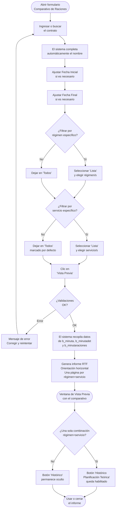

# Comparativo de Raciones

**Formulario:** `I_FCost.frm` (modo `ConRac`)
**Función principal:** `I_ComparativodeRaciones` en `Informes.bas`
**Tabla(s) principal(es):** `b_minuta` (cabecera de minuta/planificación), `b_minutadet` (detalle de recetas por minuta), `b_minutaraciones` (raciones registradas: producidas, vendidas, personal, muestra)
**Consulta principal:** Consulta directa (sin stored procedures)

---

## Índice

- [1 — ¿Para qué sirve esta pantalla?](#1--para-qué-sirve-esta-pantalla)
- [2 — ¿Qué necesito para usarla?](#2--qué-necesito-para-usarla)
- [3 — ¿Cómo se usa?](#3--cómo-se-usa)
  - [3.1 Flujo paso a paso](#31-flujo-paso-a-paso)
  - [3.2 Controles y acciones disponibles](#32-controles-y-acciones-disponibles)
- [4 — ¿Qué restricciones debo conocer?](#4--qué-restricciones-debo-conocer)
  - [4.1 Validaciones del sistema](#41-validaciones-del-sistema)
  - [4.2 Reglas de cálculo](#42-reglas-de-cálculo)
- [5 — ¿Qué obtengo?](#5--qué-obtengo)
- [6 — Referencia técnica](#6--referencia-técnica)
  - [Tablas que intervienen](#tablas-que-intervienen)
  - [Relación con otros módulos](#relación-con-otros-módulos)

---

## 1 — ¿Para qué sirve esta pantalla?

[↑ Volver al índice](#índice)

El **Comparativo de Raciones** permite revisar, día a día y por combinación de régimen/servicio, cuántas raciones se planificaron, cuántas se produjeron realmente y cómo se distribuyeron entre los distintos destinos (venta, personal Sodexo, muestra de referencia y mermas).

El informe es especialmente útil para:

- Detectar diferencias entre lo planificado teóricamente y lo realmente producido.
- Comparar la planificación real con las raciones efectivamente vendidas (control de venta).
- Identificar el peso relativo de las raciones no vendidas (mermas expresadas en raciones equivalentes).
- Analizar el consumo de personal y las muestras de referencia dentro del período.

A diferencia de los demás informes del mismo formulario (`I_FCost.frm`), este modo **no impone restricción de mismo mes ni mismo año** entre la fecha inicial y la fecha final. Es posible solicitar rangos que abarquen varios meses o incluso años distintos, lo que permite análisis de tendencia de largo plazo sin limitaciones de período.

---

## 2 — ¿Qué necesito para usarla?

[↑ Volver al índice](#índice)

| Requisito | Detalle |
|-----------|---------|
| **Contrato** | Código de contrato válido y activo en el sistema. Se puede ingresar directamente o buscar con el ícono de búsqueda. |
| **Fecha Inicial** | Primer día del período a analizar (formato dd/mm/yyyy). El sistema la inicializa con la fecha del día. |
| **Fecha Final** | Último día del período a analizar (formato dd/mm/yyyy). El sistema la inicializa con la fecha del día. |
| **Régimen** | Uno o más regímenes del contrato, o la opción "Todos". |
| **Servicio** | Uno o más servicios del contrato, o la opción "Todos" (marcado por defecto al abrir). |
| **Datos en el sistema** | Debe existir al menos una minuta planificada o raciones registradas en el período solicitado para que el informe genere contenido. |

No se requieren permisos especiales ni contraseña adicional para ejecutar este informe.

---

## 3 — ¿Cómo se usa?

[↑ Volver al índice](#índice)

### 3.1 Flujo paso a paso



### 3.2 Controles y acciones disponibles

[↑ Volver al índice](#índice)

| Control | Tipo | Comportamiento |
|---------|------|---------------|
| **Contrato** | Campo de texto + ícono de búsqueda | Permite ingresar el código directamente o abrir el buscador de contratos. Al confirmar, el nombre del contrato se muestra automáticamente en la etiqueta adyacente. |
| **Fecha Inicial** | Campo de fecha (dd/mm/yyyy) | Se inicializa con la fecha actual. El usuario puede modificarla libremente. |
| **Fecha Final** | Campo de fecha (dd/mm/yyyy) | Se inicializa con la fecha actual. No tiene restricción de mismo mes ni mismo año respecto a la Fecha Inicial. |
| **Marco "Régimen"** | Radio buttons | Opciones: "Todos" (muestra todos los regímenes del contrato) o "Lista" (habilita selector múltiple). |
| **Marco "Servicio"** | Radio buttons | Opciones: "Todos" (seleccionado por defecto al abrir) o "Lista" (habilita selector múltiple). |
| **Botón Vista Previa** | Toolbar | Ejecuta las validaciones y genera el informe RTF en pantalla. |
| **Botón Histórico Planificación Teórica** | Toolbar | Solo visible cuando se consulta exactamente un régimen y un servicio, y existen datos. Permite acceder al histórico de planificación teórica para esa combinación. |
| **Botón Salir** | Toolbar | Cierra el formulario sin generar el informe. |

> **Nota:** Las opciones de "tipo de costo" que aparecen en otros modos del mismo formulario están ocultas en este modo. El Comparativo de Raciones no requiere especificar tipo de costo.

---

## 4 — ¿Qué restricciones debo conocer?

[↑ Volver al índice](#índice)

### 4.1 Validaciones del sistema

Al hacer clic en "Vista Previa", el sistema verifica las siguientes condiciones en orden. Si alguna falla, muestra un mensaje y detiene la generación:

| # | Mensaje del sistema | Causa |
|---|---------------------|-------|
| 1 | `No existe contrato` | El código de contrato ingresado no existe en la base de datos. |
| 2 | `Fecha origen Mayor destino` | La Fecha Inicial es posterior a la Fecha Final. |
| 3 | `Regimen debe ser informado` | Se eligió la opción "Lista" para régimen pero no se seleccionó ninguno. |
| 4 | `Servicio debe ser informado` | Se eligió la opción "Lista" para servicio pero no se seleccionó ninguno. |

> **Diferencia importante respecto a otros informes del mismo formulario:** Este es el único modo de `I_FCost.frm` que **NO valida** que ambas fechas pertenezcan al mismo mes ni al mismo año. Es perfectamente válido consultar, por ejemplo, desde el 01/10/2025 hasta el 31/03/2026.

### 4.2 Reglas de cálculo

[↑ Volver al índice](#índice)

**Cálculo de raciones de merma (Rac. no Ven.):**

Las mermas no se almacenan como un conteo directo de raciones, sino como un costo de merma en la tabla de detalle de minuta. El sistema las convierte a raciones equivalentes aplicando la siguiente fórmula:

```
Raciones merma = ROUND( CostoMerma / (CostoReal / RacionesReal) , 0 )
```

Donde:
- `CostoMerma` = suma de `(mid_cosrec + mid_cosdes) × mid_nummer` (costo por recetas con merma real, `mid_tipmin = '2'`)
- `CostoReal` = suma de `(mid_cosrec + mid_cosdes) × mid_numrac` (costo total de la planificación real)
- `RacionesReal` = `min_racrea` (raciones de la planificación real registrada en cabecera)

Esta fórmula solo se aplica cuando `RacionesReal > 0` y `CostoReal > 0`; en caso contrario, las raciones de merma se reportan como 0.

**Clasificación de raciones desde `b_minutaraciones`:**

Las raciones registradas en la tabla de raciones se distribuyen en las columnas del informe según el campo `mir_rutcli`:

| Valor de `mir_rutcli` | Columna en el informe |
|-----------------------|-----------------------|
| `PRODUCIDAS` | Producidas |
| `PERSONAL` | Personal Sodexo |
| `MUESTRA R` | Muestra Referencia |
| Cualquier otro valor | Ctrl. Venta |

**Segmentación del informe:**

El informe genera una página separada por cada combinación única de régimen + servicio encontrada en los datos. Dentro de cada página, las columnas representan los días del período y las filas representan los tipos de raciones.

---

## 5 — ¿Qué obtengo?

[↑ Volver al índice](#índice)

El resultado es un **informe RTF en orientación horizontal (landscape)**, visualizable en la ventana de vista previa del sistema y exportable como archivo `.rtf`.

**Estructura del informe:**

Cada combinación de régimen + servicio ocupa una página independiente. El encabezado de cada página muestra:

| Dato | Descripción |
|------|-------------|
| Contrato | Código y nombre del contrato |
| Régimen | Código y nombre del régimen |
| Servicio | Código y nombre del servicio |
| Período | Fecha inicial — Fecha final consultada |

**Tabla de datos (una columna por día del período):**

| Fila | Descripción | Fuente |
|------|-------------|--------|
| **Plan. Teó.** | Raciones planificadas teóricamente | `b_minuta.min_racteo` |
| **Plan. Rea.** | Raciones planificadas en la minuta real | `b_minuta.min_racrea` |
| **Producidas** | Raciones efectivamente producidas (requiere registro manual con contraseña) | `b_minutaraciones` donde `mir_rutcli = 'PRODUCIDAS'` |
| **Ctrl. Venta** | Raciones vendidas a comensales (control de venta) | `b_minutaraciones` para clientes que no son PRODUCIDAS/PERSONAL/MUESTRA R |
| **Rac. no Ven.** | Raciones equivalentes a la merma de preparación | Calculado: `CostoMerma / (CostoReal / RacionesReal)` desde `b_minutadet` |
| **Personal Sodexo** | Raciones consumidas por personal interno Sodexo | `b_minutaraciones` donde `mir_rutcli = 'PERSONAL'` |
| **Muestra Referencia** | Raciones destinadas a muestra de referencia | `b_minutaraciones` donde `mir_rutcli = 'MUESTRA R'` |

**Formato de salida:**
- Orientación: horizontal (landscape)
- Fuente principal: Arial 5.5 pt para datos, 8 pt para encabezados, 14 pt para título
- Encabezado de página: información del casino (función `fg_poneencpagina`)
- Pie de página: información de cierre + número de página
- Logo de la empresa impreso al inicio

**Botón "Histórico Planificación Teórica":**
Este botón se activa solo cuando la consulta corresponde exactamente a **un único régimen y un único servicio** y existen datos en el período. Permite navegar al informe histórico de planificación teórica para esa combinación específica, manteniendo el período consultado.

---

## 6 — Referencia técnica

[↑ Volver al índice](#índice)

### Tablas que intervienen

| Tabla | Descripción | Campos clave utilizados |
|-------|-------------|------------------------|
| `b_minuta` | Cabecera de la planificación diaria (minuta). Contiene las raciones teóricas y reales planificadas por régimen, servicio y fecha. | `min_cencos`, `min_codreg`, `min_codser`, `min_fecmin`, `min_racteo`, `min_racrea`, `min_codigo` |
| `b_minutadet` | Detalle de recetas dentro de cada minuta. Almacena los costos de receta y los conteos de mermas por preparación. | `mid_codigo` (FK a `b_minuta`), `mid_tipmin`, `mid_nummer` (cantidad merma), `mid_numrac` (raciones planificadas), `mid_cosrec`, `mid_cosdes` |
| `b_minutaraciones` | Registro de raciones por destino: vendidas, producidas, personal, muestra. Cada fila es una combinación de fecha/régimen/servicio/tipo de comensal. | `mir_cencos`, `mir_codreg`, `mir_codser`, `mir_fecmin`, `mir_rutcli`, `mir_nrorac` |
| `a_regimen` | Maestro de regímenes. Solo se consulta para obtener el nombre del régimen a mostrar en el encabezado del informe. | `reg_codigo`, `reg_nombre` |
| `a_servicio` | Maestro de servicios. Solo se consulta para obtener el nombre del servicio a mostrar en el encabezado del informe. | `ser_codigo`, `ser_nombre` |

**Nota sobre `mid_tipmin`:** La consulta de mermas filtra por `mid_tipmin IN ('2')`, es decir, considera solo las filas de la minuta real (tipo `'2'`), no las de planificación teórica.

**Variable global `vg_opgra`:** Se establece en `2` antes de llamar a la función. Este valor identifica al informe como un "control de raciones" dentro del sistema de gestión de informes de producción.

### Relación con otros módulos

[↑ Volver al índice](#índice)

| Módulo relacionado | Tipo de relación |
|--------------------|-----------------|
| **Planificación (Minuta)** | Origen de datos. Las raciones teóricas y reales provienen de la planificación diaria registrada en `b_minuta`. |
| **Mermas de Preparación** | Origen de datos. Las mermas expresadas en raciones equivalentes se calculan desde el detalle de la minuta (`b_minutadet`), donde se registran los costos de merma al ejecutar la preparación. |
| **Cierre Diario** | Condición de disponibilidad. Las raciones de tipo Producidas requieren la marcación manual con contraseña (`parcomdia`). Las raciones de Control de Venta se consolidan durante el cierre del período. |
| **Raciones Clientes** | Origen de datos parcial. Las raciones vendidas (Ctrl. Venta) provienen de `b_minutaraciones` y representan el resultado final tras el proceso de cierre. Al marcar facturado, se eliminan las raciones de clientes pero se preservan las filas PRODUCIDAS y PERSONAL. |
| **Informe Histórico Planificación Teórica** | Informe complementario. Se accede desde el botón del toolbar cuando la consulta es de un único régimen y servicio. |
| **Módulo de Contratos/Regímenes/Servicios** | Dependencia de maestros. Los nombres de régimen y servicio se obtienen de `a_regimen` y `a_servicio`, tablas mantenidas fuera del módulo de Producción. |

---

*Fuentes: `I_FCost.frm`, función `I_ComparativodeRaciones` en `Informes.bas`, tablas `b_minuta`, `b_minutadet`, `b_minutaraciones`, `a_regimen`, `a_servicio` en `SGP_Local.sql`*
