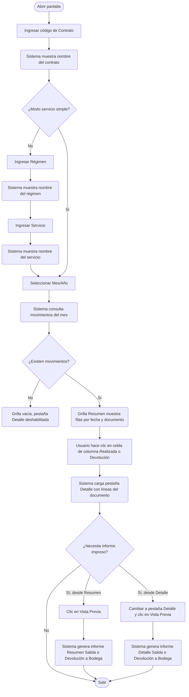

# Consulta Salida o Devolución a Bodega

**Formulario:** `C_SaDebo.frm`
**Tablas principales:** `b_totventas` (cabecera de documentos de bodega), `b_detventas` (líneas de productos), `b_ingrediente` (ingredientes/recetas), `b_productos` (productos de bodega), `b_minutaraciones` (raciones producidas por sector)
**Consulta principal:** SQL inline sobre `b_totventas` + `b_detventas` filtrado por contrato, régimen, servicio, mes y tipo de documento (`SP` = Salida a Producción, `DP` = Devolución a Producción)

---

## Índice

- [1 — ¿Para qué sirve esta pantalla?](#1--para-qué-sirve-esta-pantalla)
- [2 — ¿Qué necesito para usarla?](#2--qué-necesito-para-usarla)
- [3 — ¿Cómo se usa?](#3--cómo-se-usa)
  - [3.1 Flujo paso a paso](#31-flujo-paso-a-paso)
  - [3.2 Controles y acciones disponibles](#32-controles-y-acciones-disponibles)
- [4 — ¿Qué restricciones debo conocer?](#4--qué-restricciones-debo-conocer)
  - [4.1 Validaciones del sistema](#41-validaciones-del-sistema)
- [5 — ¿Qué obtengo?](#5--qué-obtengo)
- [6 — Referencia técnica](#6--referencia-técnica)
  - [Tablas que intervienen](#tablas-que-intervienen)
  - [Relación con otros módulos](#relación-con-otros-módulos)

---

## 1 — ¿Para qué sirve esta pantalla?

[↑ Volver al índice](#índice)

Esta pantalla permite **consultar el historial mensual de salidas e ingresos de productos desde y hacia la bodega**, asociados a un contrato específico. Cubre dos tipos de movimiento: las **salidas a producción** (productos que salen de bodega para ser usados en la cocina) y las **devoluciones a bodega** (productos que retornan porque no se utilizaron o hubo excedente). Ambos movimientos quedan agrupados por fecha y número de documento.

La pantalla se organiza en **dos pestañas**. La primera, llamada "Resumen", presenta una vista consolidada por día del mes: cuánto salió, cuánto se devolvió y el total neto de cada fecha. La segunda pestaña, "Detalle Salida" o "Detalle Devolución" (según lo que el usuario seleccione), muestra el desglose exacto de los productos involucrados en un documento específico, con cantidades, precio medio ponderado (PMP) y costo total.

Esta pantalla es de **solo consulta**: no permite agregar ni modificar movimientos. Su propósito es que el jefe de casino, coordinador o analista pueda revisar y verificar los movimientos de bodega de un período, y generar informes impresos para respaldo o análisis de costos.

---

## 2 — ¿Qué necesito para usarla?

[↑ Volver al índice](#índice)

| Campo | Descripción | Obligatorio |
|---|---|---|
| Contrato | Código del contrato o centro de costo del casino. Se puede escribir directamente o buscar con el ícono de lupa. | Sí |
| Régimen | Número del régimen alimentario asociado al contrato (por ejemplo: régimen normal, dieta, etc.). Solo aplica cuando el modo de operación no es de servicio simple. | Condicional |
| Servicio | Código del servicio dentro del régimen (desayuno, almuerzo, cena, etc.). Solo aplica cuando el modo de operación no es de servicio simple. | Condicional |
| Mes / Año | Período mensual a consultar, en formato MM/AAAA. Determina el rango de fechas que se consulta (desde el primer día hasta el último día del mes indicado). | Sí |

> **Nota sobre Régimen y Servicio:** en instalaciones configuradas como "servicio simple" (casinos con un único servicio sin régimen), estos dos campos no aparecen en pantalla. El sistema los descarta automáticamente y consulta todos los movimientos del contrato sin ese filtro.

---

## 3 — ¿Cómo se usa?

[↑ Volver al índice](#índice)

### 3.1 Flujo paso a paso

[↑ Volver al índice](#índice)

### 3.2 Controles y acciones disponibles

[↑ Volver al índice](#índice)

| Control / Acción | Descripción |
|---|---|
| Campo Contrato | Ingreso manual del código del contrato. Al cambiar el valor, el sistema valida que exista y muestra el nombre a la derecha. |
| Lupa junto a Contrato | Abre un buscador de contratos (tabla `b_clientes`) para seleccionar con doble clic o búsqueda por nombre. |
| Campo Régimen | Ingreso manual del número de régimen. Al cambiar, el sistema muestra el nombre correspondiente. (Oculto en modo servicio simple.) |
| Lupa junto a Régimen | Abre buscador de regímenes (`a_regimen`). (Oculto en modo servicio simple.) |
| Campo Servicio | Ingreso manual del código de servicio. Al cambiar, el sistema muestra el nombre. (Oculto en modo servicio simple.) |
| Lupa junto a Servicio | Abre buscador de servicios (`a_servicio`). (Oculto en modo servicio simple.) |
| Campo Mes/Año | Selector de período en formato MM/AAAA. Cada vez que cambia, el sistema recarga automáticamente la grilla de resumen. |
| Pestaña "Resumen" | Muestra la grilla consolidada de movimientos del mes. Siempre visible. |
| Pestaña "Detalle Salida" / "Detalle Devolución" | Muestra el desglose del documento seleccionado. Se habilita solo cuando el usuario hace clic en una celda con monto en la columna "Realizada" o "Devolución" de la grilla resumen. El nombre de la pestaña cambia según el tipo de documento. |
| Clic en celda "Realizada" (columna 3 del resumen) | Carga el detalle del documento de salida (`SP`) correspondiente a esa fecha en la pestaña de detalle. |
| Clic en celda "Devolución" (columna 4 del resumen) | Carga el detalle del documento de devolución (`DP`) correspondiente y habilita la pestaña. |
| Lista de sectores (pestaña Detalle, modo por sectores) | Lista auxiliar que muestra los sectores del documento. Al hacer clic en un sector, filtra la grilla de ingredientes/productos mostrando solo los de ese sector. |
| Botón "Vista Previa" (barra de herramientas) | Genera e imprime el informe correspondiente a la pestaña activa. Si la pestaña activa es "Resumen", imprime el informe resumen del mes. Si es "Detalle", imprime el detalle del documento seleccionado. |
| Botón "Salir" (barra de herramientas) | Cierra la pantalla y regresa al menú anterior. |

---

## 4 — ¿Qué restricciones debo conocer?

[↑ Volver al índice](#índice)

### 4.1 Validaciones del sistema

[↑ Volver al índice](#índice)

| # | Cuándo aparece | Qué verifica el sistema | Qué ve o experimenta el usuario |
|---|---|---|---|
| 1 | Al intentar generar Vista Previa desde la pestaña Resumen | Que la grilla de resumen tenga al menos una fila | Si está vacía, aparece un mensaje: "No Existe Resumen a Visualizar" y no se genera el informe. |
| 2 | Al intentar generar Vista Previa desde la pestaña Detalle | Que la grilla de detalle tenga al menos una fila | Si está vacía, aparece un mensaje: "No Existe Detalle a Visualizar" y no se genera el informe. |
| 3 | Al hacer clic en una celda de monto en la columna "Realizada" del resumen | Que el monto sea mayor a cero (que exista un número de documento válido) | Si el valor es 0 o la celda está vacía, la pestaña de detalle permanece deshabilitada y no muestra nada. |
| 4 | Al hacer clic en una celda de monto en la columna "Devolución" del resumen | Que el monto sea mayor a cero | Igual que el caso anterior: si no hay devolución en esa fecha, la pestaña no se habilita. |
| 5 | Al ingresar un código de contrato | Que el código exista en la tabla de contratos/clientes | Si no existe, el campo de nombre del contrato queda en blanco y los campos de régimen y servicio se limpian. La grilla queda vacía. |
| 6 | Al ingresar un número de régimen | Que el régimen exista en el maestro de regímenes | Si no existe, el campo de nombre del régimen queda en blanco. El sistema no bloquea, pero la consulta devolverá sin resultados. |
| 7 | Durante toda la consulta | Que los documentos consultados no tengan estado "Anulado" (`A`) ni "Pendiente" (`P`) | Los documentos anulados o pendientes de confirmación no aparecen en ninguna grilla ni en los informes. Solo se muestran documentos vigentes. |
| 8 | Durante la consulta de detalle con sectores | Que el período consultado tenga raciones producidas registradas | Si no hay raciones, la columna "Costo Per Cápita" aparece sin valor calculado. El sistema no genera error; simplemente omite ese cálculo. |

---

## 5 — ¿Qué obtengo?

[↑ Volver al índice](#índice)

La pantalla entrega dos tipos de visualización e informes impresos:

### Grilla de Resumen (pestaña "Resumen")

Muestra una fila por cada documento del mes, con las siguientes columnas:

| Columna | Contenido |
|---|---|
| Fecha | Fecha de proceso del documento (día del movimiento). |
| Tipo | Indica si el documento es de tipo "Resumen" (sin desglose por sector) o "Sector" (detallado por sector de producción). |
| Realizada | Monto total del documento de salida a bodega (en pesos). Solo se muestra si existe una salida ese día. |
| Devolución | Monto total del documento de devolución (en pesos). Solo se muestra si existe una devolución ese día. |
| Total | Resultado neto del día: Realizada menos Devolución. |

Al pie de la grilla el sistema muestra totales acumulados del mes para cada columna.

### Grilla de Detalle (pestaña "Detalle Salida" / "Detalle Devolución")

Muestra el desglose línea a línea del documento seleccionado. Cada fila corresponde a un ingrediente (encabezado en fondo verde) o a un producto de bodega (detalle en fondo gris). Las columnas son:

| Columna | Contenido |
|---|---|
| Código | Código del ingrediente o producto de bodega. |
| Descripción | Nombre del ingrediente o producto. |
| Unidad | Unidad de medida abreviada. |
| Cant. Calculada (en Salida) / Cant. Salida (en Devolución) | Cantidad teórica calculada según receta y raciones, expresada en la unidad del producto. Solo aplica a líneas con ingrediente de receta. |
| Cant. Salida (en Salida) / Cant. Devolver (en Devolución) | Cantidad real que salió o que se devuelve a bodega. |
| P.M.P. | Precio Medio Ponderado unitario del producto al momento del movimiento. |
| Total | Monto total de la línea (cantidad real × PMP). |
| Costo Per Cápita | Costo de esa línea dividido por el número de raciones producidas del día. Solo aparece en el informe impreso cuando el documento tiene desglose por sectores. |

Cuando el documento está organizado por sectores, aparece adicionalmente una lista de sectores a la izquierda. Al hacer clic en un sector, la grilla de detalle filtra las filas mostrando solo los productos de ese sector. Al volver al primer sector, se muestran todos.

**Cálculo — Total de línea**

> Total = Cantidad real de salida o devolución × Precio Medio Ponderado (PMP) unitario
>
> Componentes:
> - `dev_canmer`: cantidad real en la unidad del producto
> - `dev_predoc`: PMP unitario al momento del documento
>
> Ejemplo: si se sacaron 5,500 kg de pollo a un PMP de $2.450/kg, el total de la línea es $13.475.

**Cálculo — Costo Per Cápita por sector**

> Costo Per Cápita = Total del sector ÷ Número de raciones producidas del día
>
> El número de raciones se obtiene de la tabla `b_minutaraciones`, filtrando por el registro de tipo `PRODUCIDAS` para el contrato, régimen, servicio y fecha del documento. Si no hay raciones registradas, este campo no se calcula.

### Informes impresos

Al hacer clic en "Vista Previa" desde cada pestaña, el sistema genera un informe en formato RTF con:

- **Informe Resumen Salida o Devolución a Bodega**: encabezado con contrato, régimen, servicio y mes; tabla con las mismas columnas de la grilla de resumen más los totales del mes.
- **Informe Detalle Salida/Devolución a Bodega (Resumen o Sector)**: encabezado con contrato, régimen, servicio y fecha del documento; tabla con columnas Código, Descripción, Unidad, Cant. Calculada, Cant. Salida/Devolver, PMP, Total, Costo Per Cápita.

---

## 6 — Referencia técnica

[↑ Volver al índice](#índice)

### Tablas que intervienen

[↑ Volver al índice](#índice)

| Tabla | Para qué se usa | Campos clave |
|---|---|---|
| `b_totventas` | Cabecera de cada documento de bodega. Contiene el tipo de documento, la fecha, el contrato, el régimen, el servicio y la bodega. | `tov_rutcli` (contrato), `tov_tipdoc` (`SP`/`DP`), `tov_numdoc` (número de documento), `tov_fecpro` (fecha), `tov_codreg` (régimen), `tov_codser` (servicio), `tov_codbod` (bodega), `tov_estdoc` (estado: `A`=anulado, `P`=pendiente) |
| `b_detventas` | Líneas de cada documento: qué productos se movieron y en qué cantidades. | `dev_rutcli`, `dev_tipdoc`, `dev_numdoc`, `dev_coding` (código ingrediente), `dev_codmer` (código producto), `dev_canmin` (cantidad calculada), `dev_canmer` (cantidad real), `dev_predoc` (PMP), `dev_ptotal` (total línea), `dev_codsec` (sector), `dev_numlin` (número de línea) |
| `b_ingrediente` | Maestro de ingredientes (recetas). Provee el nombre y la unidad de medida del ingrediente. | `ing_codigo`, `ing_nombre`, `ing_unimed` |
| `b_productos` | Maestro de productos de bodega. Provee el nombre, unidad de despacho y el factor de conversión (`pro_facing`). | `pro_codigo`, `pro_nombre`, `pro_coduni`, `pro_facing` |
| `a_unidadmed` | Unidades de medida de ingredientes (kg, litro, etc.). | `unm_codigo`, `unm_nomcor` |
| `a_unidad` | Unidades de despacho de productos de bodega. | `uni_codigo`, `uni_nomcor` |
| `a_sector` | Maestro de sectores de producción. Usado cuando el documento es de tipo "Sector". | `sec_codigo`, `sec_nombre`, `sec_orden` |
| `b_minutaraciones` | Registro de raciones producidas por día, contrato, régimen y servicio. Se usa para calcular el costo per cápita en documentos con sectores. | `mir_cencos`, `mir_codreg`, `mir_codser`, `mir_fecmin`, `mir_nrorac`, `mir_rutcli` (valor `'PRODUCIDAS'`) |
| `b_clientes` | Maestro de contratos/centros de costo. Usado para validar y mostrar el nombre del contrato. | `cli_codigo`, `cli_nombre` |
| `a_regimen` | Maestro de regímenes. Usado para validar y mostrar el nombre del régimen. | `reg_codigo`, `reg_nombre` |
| `a_servicio` | Maestro de servicios. Usado para validar y mostrar el nombre del servicio. | `ser_codigo`, `ser_nombre` |

### Relación con otros módulos

[↑ Volver al índice](#índice)

| Módulo | Relación |
|---|---|
| Salida a Bodega | Los documentos de tipo `SP` (Salida a Producción) que se visualizan aquí son generados por el módulo de salida de bodega. Esta pantalla solo los consulta; no los crea ni modifica. |
| Devolución a Bodega | Los documentos de tipo `DP` (Devolución a Producción) que se visualizan aquí son generados por el módulo de devolución. Esta pantalla solo los consulta. |
| Planificación y Raciones Producidas | El cálculo de costo per cápita depende de que el módulo de planificación haya registrado raciones de tipo `PRODUCIDAS` para el día y servicio consultado. |
| Inventario / Stock | Los valores de PMP (`dev_predoc`) que se muestran en el detalle provienen del cálculo de stock realizado por el módulo de inventario al momento en que se generó el documento. |
| Cierre de Período | Los documentos en estado "Pendiente" (`P`) no aparecen en esta consulta; se vuelven visibles solo después de que el período esté cerrado y el estado cambie a vigente. |
| Informes | Las funciones de impresión `I_ResSalDevBod` e `I_DetSalDevBod` (definidas en `Informes.bas`) generan los reportes RTF de esta pantalla, reutilizando la misma lógica de consulta. |

---

*Fuentes: `C_SaDebo.frm`, funciones `I_ResSalDevBod` e `I_DetSalDevBod` en `Informes.bas`, tablas consultadas en `SGP_Local.sql`*
