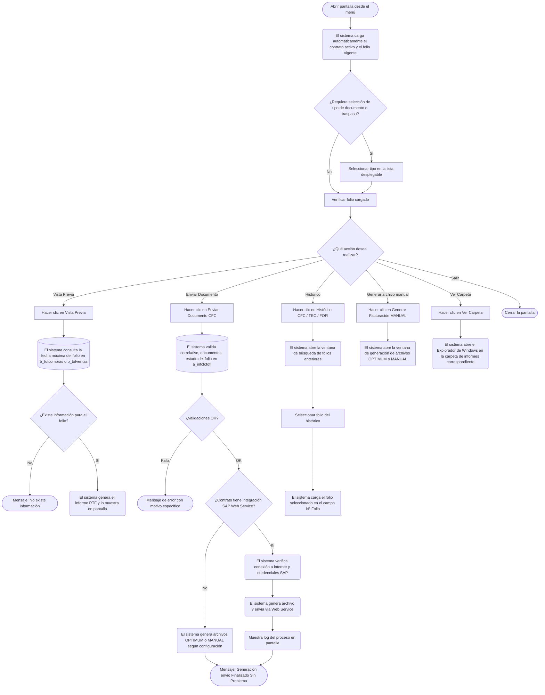

# Control Facturas Compras

**Formulario:** `I_CtrFCo.frm`
**Tablas principales:** `b_totcompras` (encabezados de documentos de compra/traspaso), `b_detcompras` (líneas de detalle de compras), `a_infcfcfofi` (registro de folios y estado de cierre por tipo de documento), `b_totventas` (encabezados de documentos de traspaso entre contratos)
**Consultas principales:** Consultas SQL directas sobre las tablas indicadas; SP auxiliares `sgp_Sel_Param`, `sgp_Sel_CierrePeriodo`, `sgp_Sel_ValidarFacturasDigitadaPortal_V01`; funciones de generación de informes `I_CFC`, `I_CTC`, `I_NewFoFi` (en `Informes.bas`)

---

## Índice

- [1 — ¿Para qué sirve esta pantalla?](#1--para-qué-sirve-esta-pantalla)
- [2 — ¿Qué necesito para usarla?](#2--qué-necesito-para-usarla)
- [3 — ¿Cómo se usa?](#3--cómo-se-usa)
  - [3.1 Flujo paso a paso](#31-flujo-paso-a-paso)
  - [3.2 Controles y acciones disponibles](#32-controles-y-acciones-disponibles)
- [4 — ¿Qué restricciones debo conocer?](#4--qué-restricciones-debo-conocer)
  - [4.1 Validaciones del sistema](#41-validaciones-del-sistema)
  - [4.2 Reglas de cálculo](#42-reglas-de-cálculo)
- [5 — ¿Qué obtengo?](#5--qué-obtengo)
  - [5.1 Modo Control Facturas Compras — Vista Previa del informe](#51-modo-control-facturas-compras--vista-previa-del-informe)
  - [5.2 Modo Control Traspasos Entre Contratos — Vista Previa del informe](#52-modo-control-traspasos-entre-contratos--vista-previa-del-informe)
  - [5.3 Modo Fondo Fijo — Vista Previa del informe](#53-modo-fondo-fijo--vista-previa-del-informe)
  - [5.4 Envío de documentos al sistema SAP o plataforma OPTIMUM](#54-envío-de-documentos-al-sistema-sap-o-plataforma-optimum)
  - [5.5 Generación manual de archivos de facturación](#55-generación-manual-de-archivos-de-facturación)
- [6 — Referencia técnica](#6--referencia-técnica)
  - [Tablas que intervienen](#tablas-que-intervienen)
  - [Procedimientos almacenados y funciones](#procedimientos-almacenados-y-funciones)
  - [Relación con otros módulos](#relación-con-otros-módulos)

---

## 1 — ¿Para qué sirve esta pantalla?
[↑ Volver al índice](#índice)

Esta pantalla es el punto de control y despacho de los documentos de compra e interfaz hacia sistemas externos. Dependiendo del modo en que se abra (determinado por el sistema al invocarla), opera como **Control de Facturas de Compra (CFC)**, como **Control de Traspasos Entre Contratos (CTC)** o como **Control de Fondo Fijo (FOFI)**. En los tres casos, el usuario puede visualizar el informe en pantalla, enviar los documentos al sistema SAP mediante un Web Service, generar archivos de intercambio para la plataforma OPTIMUM/AX, y cerrar el folio activo para habilitar el siguiente.

La pantalla se organiza en una barra de herramientas superior con los botones de acción y un área de filtros con el código de contrato, el número de folio a procesar y, según la configuración del contrato, una lista desplegable para seleccionar el tipo de documento o el tipo de traspaso. En los contratos habilitados para integración con SAP vía Web Service, se despliega adicionalmente un cuadro de texto con el log del proceso de envío.

El formulario opera siempre en el contexto de un único contrato (casino): no consolida datos de múltiples contratos. El contrato activo se muestra automáticamente al abrir la pantalla y solo puede modificarse si el usuario tiene habilitada la opción de cambio de casino.

---

## 2 — ¿Qué necesito para usarla?
[↑ Volver al índice](#índice)

| Campo | Descripción | Obligatorio |
|---|---|---|
| Contrato | Código del casino/contrato activo. Se carga automáticamente; modificable según permisos del usuario. | Sí |
| N° Folio | Número correlativo del folio a procesar. El sistema lo carga automáticamente con el folio vigente según el tipo de documento activo. Se puede modificar manualmente para consultar o reenviar un folio anterior. | Sí |
| Tipo de Documento / Tipo de Traspaso | Lista desplegable visible solo en modo CFC o CTC. En CFC para contratos sin integración AX: selecciona entre "Cfc Manual (C)" y "Cfc Portal Electrónico (P)". En CTC: selecciona entre "Entrada (1)" y "Salida (0)". En CFC con integración AX estándar: las opciones son "Entrada (1)" y "Salida (0)" equivalentes al tipo de movimiento. | Condicional |
| Lugar Físico | Lista desplegable para seleccionar la bodega o lugar físico de destino, utilizada en la generación de archivos para OPTIMUM/AX. Se precarga con el último valor guardado para el contrato. Solo visible cuando el contrato tiene integración AX activa. | Condicional |

---

## 3 — ¿Cómo se usa?
[↑ Volver al índice](#índice)

### 3.1 Flujo paso a paso
[↑ Volver al índice](#índice)

### 3.2 Controles y acciones disponibles
[↑ Volver al índice](#índice)

| Control / Acción | Descripción |
|---|---|
| Campo Contrato | Muestra el código del contrato activo. Si el usuario tiene permiso de cambio de casino, puede modificarlo manualmente o buscarlo con el botón de lupa adyacente. |
| Lupa de búsqueda de contrato | Abre una ventana de búsqueda de contratos. Al seleccionar uno, carga su código y nombre en el campo Contrato. |
| Campo N° Folio | Muestra el folio activo según el tipo de documento. Se puede modificar para apuntar a un folio anterior. |
| Lista desplegable Tipo Documento / Tipo Traspaso | Visible según el tipo de modo activo y la configuración del contrato. En modo CFC sin AX: "Cfc Manual (C)" / "Cfc Portal Electrónico (P)". En modo CTC: "Entrada (1)" / "Salida (0)". |
| Lista desplegable Lugar Físico | Disponible cuando el contrato tiene integración AX activa. Permite seleccionar el lugar físico de destino para los archivos OPTIMUM. El valor seleccionado se guarda automáticamente como preferencia del contrato. |
| Botón Vista Previa | Genera el informe en formato RTF para el folio indicado y lo muestra en una ventana de Vista Previa. Habilitado según permisos del usuario. |
| Botón Enviar Documento CFC | Ejecuta el proceso completo de cierre de folio y envío al sistema externo (SAP, OPTIMUM o MANUAL). El texto del botón cambia a "Generar Folio" en algunos contextos. Habilitado según permisos del usuario. |
| Botón Histórico CFC / TEC / FOFI | Abre la ventana de historial de folios enviados para el contrato activo. Permite seleccionar un folio anterior para cargarlo. El texto del botón cambia según el modo activo. |
| Botón Generar Facturación MANUAL / Traspaso de Salida / FOFI | Abre la ventana de generación de archivos de facturación para procesamiento manual o integración con OPTIMUM. El texto cambia según el modo activo. |
| Botón Ver Carpeta | Abre el Explorador de Windows en la carpeta donde se almacenan los informes generados (`InformesAXFacturacion` o `InformesAXFacturacionManual` según la configuración del contrato). |
| Botón Salir | Cierra la pantalla. |
| Cuadro de log de envío | Visible únicamente cuando el contrato tiene habilitado el envío vía SAP Web Service. Muestra el detalle del proceso: centro de costo, usuario, folio procesado, resultado por documento y mensajes de error. |

---

## 4 — ¿Qué restricciones debo conocer?
[↑ Volver al índice](#índice)

### 4.1 Validaciones del sistema
[↑ Volver al índice](#índice)

| # | Cuándo aparece | Qué verifica el sistema | Qué ve o experimenta el usuario |
|---|---|---|---|
| 1 | Al hacer clic en Vista Previa | Que el contrato ingresado exista en la tabla de clientes con tipo = 0 (contrato activo). | Si no existe, se limpia el nombre del contrato y el proceso se cancela sin mensaje. |
| 2 | Al hacer clic en Vista Previa en modo CTC | Que se haya seleccionado un tipo de traspaso en la lista desplegable. | Mensaje: "Debe selecionar tipo traspaso". |
| 3 | Al hacer clic en Vista Previa | Que exista al menos un documento con fecha asociada al folio indicado en `b_totcompras` o `b_totventas`. | Mensaje: "No existe información". |
| 4 | Al hacer clic en Enviar Documento | Que no existan folios anteriores del mismo contrato y tipo sin enviar (validación de correlativo). | Mensaje: "Existe Numero CFC anterior a este folio que no ha sido enviado (N°: XXX)". |
| 5 | Al hacer clic en Enviar Documento | Que el folio no haya sido enviado previamente en su totalidad. | Mensaje: "Folio fue enviado en su totalidad". |
| 6 | Al hacer clic en Enviar Documento | Que existan documentos con clase de documento SAP asignada para el folio. | Mensaje: "No existe información, para enviar". En algunos casos el folio se cierra automáticamente con fecha actual y se avanza al siguiente. |
| 7 | Al hacer clic en Enviar Documento con integración AX activa | Que se haya seleccionado un Lugar Físico. | Mensaje: "Debe selecionar lugar fisico". |
| 8 | Al hacer clic en Enviar Documento con integración SAP Web Service | Que exista conexión a internet. | Mensaje: "No hay conexión a internet, proceso cancelado". |
| 9 | Al hacer clic en Enviar Documento con integración SAP Web Service | Que el contrato tenga creado un usuario SAP (parámetro `sapusu`) con valor no vacío. | El log muestra: "No tiene creado usuario, para Web Service" y el proceso se cancela. |
| 10 | Al hacer clic en Enviar Documento con integración SAP Web Service | Que el contrato tenga creada una contraseña SAP (parámetro `sappas`) con valor no vacío. | El log muestra: "No tiene creado password, para Web Service" y el proceso se cancela. |
| 11 | Al hacer clic en Enviar Documento con integración SAP Web Service | Que el contrato tenga asignada la sociedad SAP (`cli_socsap`) en la tabla de clientes. | El log muestra: "No tiene asignado la sociedad de SAP, en contrato." y el proceso se cancela. |
| 12 | Al hacer clic en Enviar Documento con integración SAP Web Service | Que exista configurado el código SAP del impuesto IVA en la tabla `a_impuesto` (`imp_adicional = 0`). | El log muestra: "No existe código SAP asignado impuesto iva, Comuniquesen con departamento de informatica." |
| 13 | Al hacer clic en Enviar Documento con integración SAP Web Service | Que existan configurados los códigos SAP de impuestos adicionales (Harina, Carne, etc.) en `a_impuesto` (`imp_adicional = 1`). | El log muestra: "No existe código SAP asignado impuesto Harina, Carne, Etc. Comuniquesen con departamento de informatica." |
| 14 | Al hacer clic en Enviar Documento con integración SAP Web Service | Que exista clave de documento exento configurada globalmente (`vg_docexento`). | El log muestra: "No existe clave exento sap, comuniquese con departamento de informatica." |
| 15 | Al hacer clic en Enviar Documento con integración SAP Web Service | Que exista clave de documento afecto configurada globalmente (`vg_docafecto`). | El log muestra: "No existe clave afecto sap, comuniquese con departamento de informatica." |
| 16 | Al hacer clic en Enviar Documento cuando el folio ya tiene registro en `a_infcfcfofi` con fecha de cierre mayor a 0 | Que el folio no haya sido ya generado. | Mensaje: "N° Documento ya fue generado". |
| 17 | Al confirmar el envío cuando el folio tiene registro abierto en `a_infcfcfofi` | Confirmación antes de cerrar el folio actual y crear el siguiente. | Mensaje: "El Folio N°XXX sera cerrado y se generara un nuevo folio, para los sgtes documentos ¿Desea continuar...?" con opción Sí/No. |
| 18 | Al usar el botón Histórico en modo CTC | Que se haya seleccionado un tipo de traspaso en la lista desplegable. | Mensaje: "Debe selecionar tipo traspaso". |
| 19 | Al usar el botón Generar Traspaso de Salida en modo CTC con tipo "Entrada" seleccionado | Que el tipo de traspaso sea Salida para acceder a la generación. | Mensaje: "Para acceder a esta opción, solo tiene que seleccionar tipo traspaso de salida". |
| 20 | Al enviar documentos del Portal Electrónico (tipinf = "P") | Verifica si ya existen registros previos en `sap_cfc` para el folio indicado. | Si ya existen, el sistema retorna éxito inmediatamente sin reprocesar. |

### 4.2 Reglas de cálculo
[↑ Volver al índice](#índice)

Al generar el archivo SAP (función `GenerarArcSap`), el sistema calcula el valor total de cada documento de la siguiente manera:

- **Valor base del documento:** suma de `(cantidad × precio de compra + precio flete)` sobre las líneas de detalle en `b_detcompras`.
- **IVA:** se toma directamente del campo `toc_ivadoc` de `b_totcompras`. Si la suma `(valfac + toc_ivadoc + toc_otrimp)` difiere del total del documento `toc_totdoc`, el sistema usa `toc_totdoc` como valor de referencia.
- **Ajuste de redondeo:** cuando la suma acumulada de impuestos difiere del total del documento en 1 o 2 unidades, el sistema ajusta automáticamente el último tramo para cuadrar el total.
- **Documentos exentos:** cuando la línea de detalle no tiene impuesto asociado en `b_detcomprasimp`, el sistema toma el campo `toc_exedoc` de `b_totcompras` como valor del tramo exento.
- **Tipo de asiento SAP:** el código de posición (`bseg_newbs`) se determina por el tipo de documento: FA/ND → "31" (deudor), NC → "21", CE → "23", FE → "33", resto → "30". Para líneas de haber: FA/FE/ND/DE → "40", NC/CE → "50".

---

## 5 — ¿Qué obtengo?
[↑ Volver al índice](#índice)

La pantalla puede generar cuatro tipos de salida distintos dependiendo del modo activo y la acción seleccionada.

### 5.1 Modo Control Facturas Compras — Vista Previa del informe
[↑ Volver al índice](#índice)

(`I_CFC` en `Informes.bas`)

Genera un **informe RTF en orientación horizontal (Landscape)** que se muestra en una ventana de Vista Previa. El archivo se guarda en la carpeta de informes con el nombre `CFC<cencos><yyyymm>.rtf`.

El encabezado del informe muestra: título "Control Facturas Compras", el mes correspondiente al folio, la indicación del sistema de origen ("SGP" o "Plataforma Electrónica"), el nombre y código del contrato, y el número de folio. El pie de página incluye la firma "VºBº ADC" y el número de página.

**Datos que muestra el informe:**

| Campo | Descripción | Calculado |
|---|---|---|
| Tipo de documento | Código y nombre del tipo de documento (FA = Factura, NC = Nota Crédito, CE = Crédito Electrónico, FE = Factura Electrónica, ND = Nota Débito, DE = Débito Electrónico) | No |
| RUT proveedor | RUT del proveedor emisor del documento | No |
| N° documento | Número del documento de compra | No |
| Fecha de emisión | Fecha de emisión del documento (`toc_fecemi`) | No |
| Fecha de remesa | Fecha de recepción/remesa del documento (`toc_fecrem`) | No |
| Neto alimentación | Monto neto correspondiente a productos de tipo alimentación | Sí |
| Neto desechables | Monto neto correspondiente a productos desechables | Sí |
| Neto general | Monto neto total del documento | Sí |
| IVA | Monto del IVA del documento (`toc_ivadoc`) | No |
| Total documento | Total del documento incluyendo impuestos (`toc_totdoc`) | No |
| Estado de envío SAP | Indica si el documento fue enviado a SAP (`toc_envsap`) | No |

La fuente de datos es la consulta que cruza `b_totcompras`, `b_detcompras` y `a_tipodocumento`, filtrando por bodega (`vg_codbod`), tipo de informe (C o P) y número de folio.

**Estructura del archivo generado:**
- Formato: RTF
- Nombre: `CFC<código_contrato><año><mes>.rtf`
- Ubicación: carpeta de informes configurada en la variable `dir_trabajo_Inf`

### 5.2 Modo Control Traspasos Entre Contratos — Vista Previa del informe
[↑ Volver al índice](#índice)

(`I_CTC` en `Informes.bas`)

Genera un **informe RTF en orientación horizontal (Landscape)** que se muestra en una ventana de Vista Previa. El archivo se guarda con el nombre `CTC<cencos><yyyymm>.rtf`.

El encabezado indica: "Control Traspasos Entre Contratos (Entrada)" o "(Salida)" según el tipo seleccionado, el mes, el nombre del contrato y el número de folio.

**Datos que muestra el informe:**

| Campo | Descripción | Calculado |
|---|---|---|
| Servicio | Código de servicio asociado al traspaso (`tov_codser`) | No |
| Cuenta contable | Código de cuenta contable del producto (`pro_ctacon`) | No |
| Costo saldo anterior | Costo acumulado de traspasos del tipo seleccionado en el período actual, anteriores al folio consultado | Sí |
| Costo del folio | Costo de los traspasos incluidos en el folio actual | Sí |
| Costo total | Suma de saldo anterior más folio actual | Sí |

La fuente de datos son `b_totventas`, `b_detventas` y `b_productos`, filtrando por tipo de documento 'TR', bodega (`vg_codbod`), tipo de traspaso (1=Entrada, 0=Salida) y período activo según `b_cierreperiodo`.

**Estructura del archivo generado:**
- Formato: RTF
- Nombre: `CTC<código_contrato><año><mes>.rtf`
- Ubicación: carpeta de informes configurada en `dir_trabajo_Inf`

### 5.3 Modo Fondo Fijo — Vista Previa del informe
[↑ Volver al índice](#índice)

(`I_NewFoFi` en `Informes.bas`)

Genera un **informe RTF en orientación vertical (Portrait)** con el título "RENDICION DE GASTOS", que se muestra en una ventana de Vista Previa. El archivo se guarda con el nombre `FOFI<codcas><yyyymm>.rtf`.

Los datos se cargan desde `b_totcompras`, `b_detcompras`, `b_productos` y `b_proveedor`, filtrando por bodega y tipo de informe 'F', excluyendo documentos de tipo 'SN'. Luego se clasifican los productos en categorías según los parámetros del contrato:

| Categoría | Parámetro que define las cuentas contables |
|---|---|
| Alimentos | `ctainsumo` |
| Desechables | `ctalimdes` |
| Movilización | `ctamovil` |
| Varios | Todo lo que no encaja en las categorías anteriores |

**Datos que muestra el informe:**

| Campo | Descripción | Calculado |
|---|---|---|
| RUT proveedor | RUT del proveedor | No |
| Tipo de documento | Código del tipo de documento | No |
| N° documento | Número del documento | No |
| Fecha de emisión | Fecha de emisión del documento | No |
| IVA | Monto del IVA | No |
| Flete | Monto del flete asociado | No |
| Categoría | Alimentos / Desechables / Movilización / Varios | Sí |
| Total neto por categoría | Suma de `dec_ptotal + dec_prefle` agrupado por categoría | Sí |
| Total con IVA | Total del documento | No |

**Estructura del archivo generado:**
- Formato: RTF
- Nombre: `FOFI<código_contrato><año><mes>.rtf`
- Ubicación: carpeta de informes configurada en `dir_trabajo_Inf`

### 5.4 Envío de documentos al sistema SAP o plataforma OPTIMUM
[↑ Volver al índice](#índice)

Al presionar el botón de envío, el sistema ejecuta los siguientes pasos según la configuración del contrato:

**Para contratos con integración SAP Web Service (`cai_codtii = 1`):**
- El sistema abre el panel de log en pantalla.
- Verifica credenciales SAP, sociedad, configuración de impuestos y claves contables.
- Para cada documento del folio, construye los registros de asiento contable con las posiciones de encabezado y detalle (con sus cuentas, importes, impuestos y centros de costo).
- Inserta los registros en la tabla de staging `sap_cfc`.
- Envía los datos vía Web Service a SAP.
- Marca los documentos enviados en `b_totcompras` (`toc_envsap`).
- Registra el cierre del folio en `a_infcfcfofi` con la fecha actual e inserta el siguiente folio como abierto.

**Para contratos con integración OPTIMUM/AX (`cai_codtii = 5` o `6`):**
- Si el contrato opera con documentos manuales (no AX): llama a la función `GeneraCfcDigitado` para generar el archivo Excel de facturación MANUAL.
- Si el contrato opera con AX estándar: llama a `GeneraCfcAX` que genera el archivo para OPTIMUM usando el lugar físico seleccionado y el período del cierre activo.

**Para traspasos de salida:** llama a `GenerarTraspasoSalidaAX` para generar el archivo correspondiente.

En todos los casos, al finalizar el envío se registra la fecha de cierre del folio en `a_infcfcfofi` y se crea el registro del siguiente folio con fecha de cierre = 0 (abierto).

### 5.5 Generación manual de archivos de facturación
[↑ Volver al índice](#índice)

El botón "Generar Facturación MANUAL" / "Generar Traspaso de Salida" abre la ventana `P_GenCfcAx` con uno de tres modos:

| Modo | Cuándo se activa | Descripción |
|---|---|---|
| 1 — CFC Digitado Manual | Contrato CFC o Portal Electrónico sin AX | Genera archivos de facturación para procesamiento manual |
| 2 — CFC AX OPTIMUM | Contrato CFC o Portal Electrónico con AX estándar | Genera archivos para integración con plataforma OPTIMUM |
| 3 — Traspaso Salida AX | Contrato de Traspaso con tipo Salida sin AX | Genera archivos de traspaso de salida para OPTIMUM |

---

## 6 — Referencia técnica
[↑ Volver al índice](#índice)

### Tablas que intervienen
[↑ Volver al índice](#índice)

| Tabla | Para qué se usa | Campos clave |
|---|---|---|
| `b_totcompras` | Encabezados de documentos de compra. Se consulta para obtener la fecha del folio (Vista Previa) y los documentos a enviar. | `toc_codbod`, `toc_tipdoc`, `toc_numdoc`, `toc_numinf`, `toc_tipinf`, `toc_fecemi`, `toc_fecrem`, `toc_totdoc`, `toc_ivadoc`, `toc_otrimp`, `toc_exedoc`, `toc_envsap`, `toc_rutpro` |
| `b_detcompras` | Líneas de detalle de cada documento de compra. Contiene cantidades, precios unitarios y fletes. | `dec_rutpro`, `dec_tipdoc`, `dec_numdoc`, `dec_codmer`, `dec_canmer`, `dec_precom`, `dec_prefle`, `dec_ptotal`, `dec_numlin` |
| `b_detcomprasimp` | Detalle de impuestos por línea de compra. Se usa para determinar si el documento es exento o afecto y calcular montos por tipo de impuesto. | `imd_rutdoc`, `imd_tipdoc`, `imd_numdoc`, `imd_codpro`, `imd_codimp`, `imd_monimp`, `imd_pctimp` |
| `b_totventas` | Encabezados de documentos de venta/traspaso. Se usa en modo CTC para obtener la fecha del folio y en la generación del informe de traspasos. | `tov_codbod`, `tov_tipdoc`, `tov_numdoc`, `tov_numinf`, `tov_fecemi`, `tov_codser`, `tov_estdoc`, `tov_rutcli` |
| `b_detventas` | Líneas de detalle de traspasos. Se usa en el informe CTC para calcular costos por cuenta contable. | `dev_rutcli`, `dev_tipdoc`, `dev_numdoc`, `dev_codmer`, `dev_canmer`, `dev_precos` |
| `a_infcfcfofi` | Registro de control de folios por contrato y tipo de documento. Mantiene el estado de cada folio (abierto/cerrado). | `inf_cencos`, `inf_tipo`, `inf_numero`, `inf_feccie`, `inf_usuario` |
| `b_clientes` | Tabla de contratos/casinos. Se usa para validar que el contrato exista y obtener su nombre y sociedad SAP. | `cli_codigo`, `cli_tipo`, `cli_nombre`, `cli_socsap`, `cli_codbod`, `cli_codreg`, `cli_activo` |
| `b_casinointerfaz` | Configuración de interfaces del contrato. Determina el tipo de integración activa (SAP Web Service, AX/OPTIMUM, Manual). | `cai_cencos`, `cai_codtii` |
| `a_tipodocumento` | Catálogo de tipos de documento. Se usa para filtrar documentos válidos para envío (los que tienen clase de documento SAP asignada). | `tdo_codigo`, `tdo_cladoc`, `tdo_IdCodigo` |
| `a_impuesto` | Catálogo de impuestos. Contiene los códigos SAP de IVA e impuestos adicionales. | `imp_codigo`, `imp_codsap`, `imp_adicional`, `imp_pctimp`, `imp_inccos`, `imp_cimsap1`–`imp_cimsap4` |
| `b_productos` | Catálogo de productos. Proporciona la cuenta contable de cada producto. | `pro_codigo`, `pro_ctacon`, `pro_tippro` |
| `a_ctacontable` | Catálogo de cuentas contables. Proporciona el nombre de la cuenta. | `cta_codigo`, `cta_nombre` |
| `sap_cfc` | Tabla de staging para el envío SAP. Se insertan los registros construidos antes de enviarlos al Web Service. | `cfc_codigo`, `cfc_nuedoc` (marcador de encabezado 'X'), `cfc_cueaux`, `cfc_refere`, `cfc_cladoc`, `cfc_ccosto` |
| `a_param` | Tabla de parámetros por contrato. Almacena credenciales SAP, códigos SAP de cuentas exentas, lugar físico preferido, tipo de operación. | `par_cencos`, `par_codigo`, `par_valor` |
| `b_cierreperiodo` | Registro de períodos de cierre. Se usa para obtener las fechas de inicio y término del período activo en el informe CTC. | `cie_cencos`, `cie_fecini`, `cie_fecter`, `cie_periodo` |
| `a_clasedocsap` | Clases de documento SAP por región (usada en contratos de Colombia). | `cds_coddoc`, `cds_codreg`, `cds_cdosap` |

### Procedimientos almacenados y funciones
[↑ Volver al índice](#índice)

| Nombre | Ubicación | Para qué se usa |
|---|---|---|
| `sgp_Sel_Param` | `SGP_Local.sql` | Recupera parámetros de configuración del contrato (modo @Aux=1) desde `a_param`. En este formulario se usa para obtener y guardar el parámetro `ParLugFis` (lugar físico preferido). |
| `sgp_Upd_Param` | `SGP_Local.sql` | Actualiza el valor de un parámetro en `a_param`. Se usa para guardar el lugar físico seleccionado. |
| `sgp_Ins_Param` | `SGP_Local.sql` | Inserta un nuevo parámetro en `a_param`. Se usa la primera vez que se selecciona un lugar físico para el contrato. |
| `sgp_Sel_CierrePeriodo` | `SGP_Local.sql` | Obtiene el período activo del contrato. Se usa para determinar el período al generar los archivos OPTIMUM o AX. |
| `sgp_Sel_ValidarFacturasDigitadaPortal_V01` | `SGP_Local.sql` | Verifica si ya existen registros SAP (`sap_cfc`) para el folio de tipo Portal Electrónico (P), cruzando con `b_totcompras` y `b_clientes`. Si retorna filas, el proceso de envío se considera ya completado. Parámetros: `@Ceco` (código contrato), `@CodigoEnv` (número de folio), `@TipInf` (tipo de informe). |
| `I_CFC` | `Informes.bas` | Genera el informe RTF de Control Facturas Compras. |
| `I_CTC` | `Informes.bas` | Genera el informe RTF de Control Traspasos Entre Contratos. |
| `I_NewFoFi` | `Informes.bas` | Genera el informe RTF de Rendición de Gastos Fondo Fijo. |
| `GenerarArcSap` | `I_CtrFCo.frm` | Función interna que construye y envía los registros de asiento contable al Web Service de SAP. |
| `GeneraCfcAX` | `RutinasI.bas` | Genera el archivo de facturación para la plataforma OPTIMUM/AX estándar. |
| `GeneraCfcDigitado` | `RutinasI.bas` | Genera el archivo de facturación para procesamiento manual (contratos sin AX). |
| `GenerarTraspasoSalidaAX` | `RutinasI.bas` | Genera el archivo de traspaso de salida para OPTIMUM/AX. |
| `TraerFolioDocumento` | `RutinasI.bas` | Devuelve el número de folio vigente para el tipo de documento activo del contrato. |
| `ValidarEnvioCorrelativo` | `RutinasI.bas` | Verifica si existen folios anteriores del mismo contrato y tipo sin enviar. Retorna `True` si hay folios pendientes. |

### Relación con otros módulos
[↑ Volver al índice](#índice)

| Módulo / Pantalla | Relación |
|---|---|
| Módulo de Inventario — Ingreso de Compras | Genera los documentos en `b_totcompras` y `b_detcompras` que esta pantalla procesa y envía. |
| Módulo de Inventario — Traspasos | Genera los documentos en `b_totventas` de tipo 'TR' que se controlan en modo CTC. |
| Módulo de Inventario — Fondo Fijo | Genera los documentos en `b_totcompras` de tipo 'F' que se controlan en modo FOFI. |
| SAP (sistema corporativo) | Destino de los asientos contables generados a partir de los documentos de compra. La integración se realiza vía Web Service cuando `cai_codtii = 1`. |
| Plataforma OPTIMUM/AX | Destino alternativo para contratos con `cai_codtii = 5` o `6`. Recibe archivos generados por `GeneraCfcAX` o `GeneraCfcDigitado`. |
| Módulo de Cierre Diario | El período activo obtenido por `sgp_Sel_CierrePeriodo` determina el período incluido en los archivos generados. |
| Tabla `a_infcfcfofi` | Esta pantalla es el único responsable de mantener el estado de los folios (abrir y cerrar) para los tipos CFC (C), Portal (P), TEC (T/G) y FOFI (F). |
| Formulario `P_GenCfcAx` | Se abre desde el botón de generación manual para procesar lotes de folios en modo OPTIMUM o MANUAL. |
| Formulario `B_HistPm` | Se abre desde el botón Histórico para consultar y seleccionar folios anteriores enviados. |

---

*Fuentes: `I_CtrFCo.frm`, funciones `I_CFC`, `I_CTC`, `I_NewFoFi`, `GenerarArcSap` en `Informes.bas` y `I_CtrFCo.frm`, funciones `GeneraCfcAX`, `GeneraCfcDigitado`, `GenerarTraspasoSalidaAX`, `TraerFolioDocumento`, `ValidarEnvioCorrelativo` en `RutinasI.bas`, SPs `sgp_Sel_Param`, `sgp_Sel_CierrePeriodo`, `sgp_Sel_ValidarFacturasDigitadaPortal_V01` en `SGP_Local.sql`*
