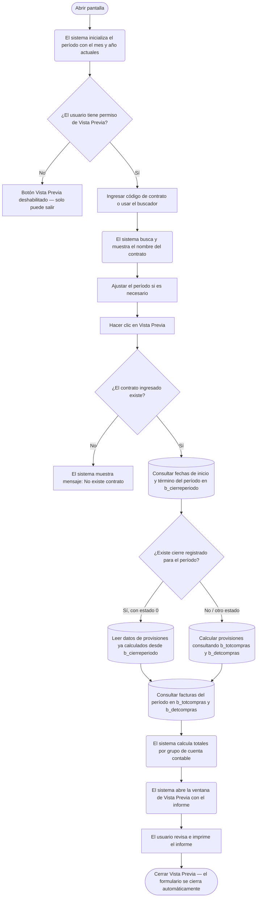

# Control Facturas Compras (Cierre de Mes)

**Formulario:** `I_CfcCie.frm`
**Tablas principales:** `b_totcompras` (encabezados de documentos de compra), `b_detcompras` (líneas de detalle de compra), `b_cierreperiodo` (registro de cierres de período por contrato), `b_productos` (maestro de productos), `b_proveedor` (maestro de proveedores)
**Consulta principal:** Sin procedimiento almacenado — consultas directas a la base de datos ejecutadas desde la función `I_CFCCierre` en `Informes.bas`

---

## Índice

- [1 — ¿Para qué sirve esta pantalla?](#1--para-qué-sirve-esta-pantalla)
- [2 — ¿Qué necesito para usarla?](#2--qué-necesito-para-usarla)
- [3 — ¿Cómo se usa?](#3--cómo-se-usa)
  - [3.1 Flujo paso a paso](#31-flujo-paso-a-paso)
  - [3.2 Controles y acciones disponibles](#32-controles-y-acciones-disponibles)
- [4 — ¿Qué restricciones debo conocer?](#4--qué-restricciones-debo-conocer)
  - [4.1 Validaciones del sistema](#41-validaciones-del-sistema)
  - [4.2 Reglas de cálculo](#42-reglas-de-cálculo)
- [5 — ¿Qué obtengo?](#5--qué-obtengo)
  - [Estructura del informe generado](#estructura-del-informe-generado)
  - [Detalle de secciones del informe](#detalle-de-secciones-del-informe)
- [6 — Referencia técnica](#6--referencia-técnica)
  - [Tablas que intervienen](#tablas-que-intervienen)
  - [Relación con otros módulos](#relación-con-otros-módulos)

---

## 1 — ¿Para qué sirve esta pantalla?

[↑ Volver al índice](#índice)

Esta pantalla genera un informe de cierre mensual de facturas de compras para un contrato específico. El informe consolida los montos comprados durante el período de cierre, junto con las provisiones pendientes (guías sin factura asociada y solicitudes de nota de crédito sin resolver), permitiendo al jefe de casino o coordinador conocer el gasto real del mes incluyendo los documentos que aún están en tránsito.

El informe organiza la información en tres grupos de gastos definidos por la cuenta contable del producto: **Alimentos & Bebidas**, **Gastos Generales** y **Limpieza & Desechable**. Para cada grupo presenta el total de facturas recibidas, las provisiones del mes anterior que se revierten, las provisiones pendientes del mes actual y de meses anteriores, y el gasto total resultante. Al final del informe se presentan los totales consolidados de los tres grupos.

La pantalla no muestra datos directamente en pantalla: toda la información se presenta en una ventana de Vista Previa con formato de impresión (RTF orientación vertical), desde la cual el usuario puede revisar e imprimir el informe. El sistema también genera un archivo de texto complementario en la carpeta de trabajo de informes. El informe es por contrato único: el usuario selecciona un solo contrato y un solo período mensual.

---

## 2 — ¿Qué necesito para usarla?

[↑ Volver al índice](#índice)

| Campo | Descripción | Obligatorio |
|---|---|---|
| Contrato | Código del contrato (casino) para el cual se generará el informe. Se ingresa directamente o se selecciona desde el buscador de contratos. | Sí |
| Período | Mes y año del cierre a consultar, en formato MM/AAAA. El sistema lo inicializa automáticamente con el mes y año actuales. | Sí |

> **Nota sobre permisos:** El botón "Vista Previa" solo se habilita si el usuario tiene el permiso correspondiente configurado en el sistema (posición 4 del perfil de validación del formulario). Si no aparece habilitado, el usuario no tiene acceso para generar este informe.

---

## 3 — ¿Cómo se usa?

[↑ Volver al índice](#índice)

### 3.1 Flujo paso a paso

[↑ Volver al índice](#índice)



### 3.2 Controles y acciones disponibles

[↑ Volver al índice](#índice)

| Control / Acción | Descripción |
|---|---|
| Campo Contrato | Ingreso del código del contrato. Acepta entrada manual o búsqueda. Al perder el foco, el sistema muestra automáticamente el nombre del contrato asociado. |
| Ícono de búsqueda (junto a Contrato) | Abre una ventana de búsqueda de contratos desde la tabla de clientes. Permite ubicar el contrato por nombre. Al seleccionar uno, se completa el código y el nombre automáticamente. |
| Nombre del contrato (etiqueta informativa) | Campo de solo lectura que muestra el nombre completo del contrato luego de ingresar o seleccionar el código. |
| Campo Período | Selector de mes/año con formato MM/AAAA. Se puede editar manualmente o usando los botones incrementales integrados. |
| Botón Vista Previa | Valida el contrato, ejecuta las consultas y abre la ventana de Vista Previa con el informe. Solo disponible si el usuario tiene el permiso habilitado. |
| Botón Salir | Cierra el formulario. |

---

## 4 — ¿Qué restricciones debo conocer?

[↑ Volver al índice](#índice)

### 4.1 Validaciones del sistema

[↑ Volver al índice](#índice)

| # | Cuándo aparece | Qué verifica el sistema | Qué ve o experimenta el usuario |
|---|---|---|---|
| 1 | Al hacer clic en Vista Previa | El sistema verifica que el código de contrato ingresado exista en la tabla de contratos/clientes. | Si el contrato no existe, aparece el mensaje **"No existe contrato"** y no se genera el informe. El campo de contrato se limpia. |
| 2 | Al abrir el formulario | El sistema verifica el perfil de permisos del usuario para este formulario (posición 4 del perfil). | Si el usuario no tiene permiso, el botón "Vista Previa" aparece deshabilitado desde el inicio y no puede usarse. |
| 3 | Al generar el informe | El sistema verifica si existe un período de cierre registrado en la tabla de cierres para el contrato y mes indicados. | Si no existe el período de cierre, el informe no puede determinar las fechas de inicio y término del mes, y los campos de período en el encabezado del informe quedarán en blanco. |

### 4.2 Reglas de cálculo

[↑ Volver al índice](#índice)

El sistema clasifica cada línea de compra en uno de tres grupos según la cuenta contable del producto (`pro_ctacon`), determinada por los parámetros configurados en el sistema:

- **Alimentos & Bebidas:** productos cuya cuenta contable coincide con el parámetro `ctainsumo`.
- **Limpieza & Desechable:** productos cuya cuenta contable coincide con el parámetro `ctalimdes`.
- **Gastos Generales:** todos los productos que no corresponden a ninguno de los dos grupos anteriores.

Los tipos de documento considerados para el cálculo son:

| Tipo de documento | Código interno | Efecto en los totales |
|---|---|---|
| Factura | FA | Suma al total de facturas |
| Factura Electrónica | FE | Suma al total de facturas |
| Nota de Débito | ND | Suma al total de facturas |
| Nota de Débito Electrónica | DE | Suma al total de facturas |
| Nota de Crédito | NC | Resta del total de facturas |
| Nota de Crédito Electrónica | CE | Resta del total de facturas |
| Guía de Despacho pendiente | GD | Se incluye en las provisiones pendientes |
| Solicitud de Nota de Crédito pendiente | SN | Se incluye en las solicitudes de nota de crédito pendientes |

**Cálculo del monto de cada línea:**

El monto de cada línea se calcula aplicando el descuento y sumando los impuestos adicionales que inciden en el costo (aquellos con `imp_inccos = 1`):

```
Monto línea = Flete + (Total línea − (Total línea × % descuento / 100)) + Impuestos adicionales al costo
```

**Comportamiento según estado del período de cierre:**

- Si el período ya tiene un cierre registrado con estado `0` (cerrado), el sistema lee directamente los totales de provisiones precalculados desde la tabla `b_cierreperiodo` (campos `cie_gdpenmes*`, `cie_sncpenmes*`, `cie_gdpenmesant*`, `cie_sncpenmesant*`).
- Si el período no tiene cierre con estado `0`, el sistema calcula las provisiones en tiempo real consultando las guías de despacho y solicitudes de nota de crédito directamente desde `b_totcompras`.

**Fórmula TOTAL GASTOS por grupo:**

```
TOTAL GASTOS = TOTAL FACTURAS + REVERSO DE LA PROVISION + TOTAL PROVISION
```

donde:

```
REVERSO DE LA PROVISION = montos de provisión del cierre del mes anterior
TOTAL PROVISION = (Provisión pendiente meses anteriores) + (Guías pendientes mes actual) − (Notas de crédito pendientes mes actual)
```

---

## 5 — ¿Qué obtengo?

[↑ Volver al índice](#índice)

El resultado es un único informe en ventana de Vista Previa con orientación vertical (retrato). El archivo generado se almacena temporalmente en la carpeta de trabajo de informes del sistema con el nombre `CFCCIERREMES<código_contrato><yyyymm>.rtf`.

### Estructura del informe generado

[↑ Volver al índice](#índice)

El informe tiene el siguiente encabezado:

| Elemento | Contenido |
|---|---|
| Título | "Control Facturas Compras (Cierre de Mes) Mes : \<nombre mes\> \<año\>" |
| Contrato | Nombre y código del contrato seleccionado |
| Período | Fecha de inicio y fecha de término del cierre (obtenidas de `b_cierreperiodo`) |
| Encabezado de página | Logo de la empresa y fecha de emisión del informe |
| Pie de página | Nombre del contrato, código y número de página |

### Detalle de secciones del informe

[↑ Volver al índice](#índice)

El informe contiene cuatro secciones de filas descriptivas. Las tres primeras corresponden a los grupos de gasto y la cuarta consolida los totales generales.

**Campos por sección de grupo (Alimentos & Bebidas / Gastos Generales / Limpieza & Desechable):**

| Campo en el informe | Descripción | Calculado |
|---|---|---|
| TOTAL DE FACTURAS | Suma de facturas, notas de débito, menos notas de crédito del período, con descuentos e impuestos adicionales aplicados. | Sí — calculado en tiempo real desde `b_totcompras` / `b_detcompras` |
| REVERSO DE LA PROVISION | Monto de provisión registrado en el cierre del mes anterior para este grupo (campo `cie_proant*` de `b_cierreperiodo` del período anterior). | Sí — leído del cierre anterior |
| PROVISION PENDIENTE | Suma de guías pendientes de meses anteriores más solicitudes de nota de crédito pendientes de meses anteriores. | Sí — calculado o leído según estado del cierre |
| GUIAS PENDIENTES MES ACTUAL | Valor de guías de despacho del mes actual que aún no tienen factura asociada (`toc_docaso` vacío o nulo). | Sí — calculado desde `b_totcompras` tipo GD |
| NOTAS DE CREDITOS PENDIENTES | Valor de solicitudes de nota de crédito del mes actual donde el documento asociado (`toc_docaso` o `toc_docsnc`) aún está pendiente, con signo negativo. | Sí — calculado desde `b_totcompras` tipo SN |
| TOTAL PROVISION | PROVISION PENDIENTE + GUIAS PENDIENTES MES ACTUAL − NOTAS DE CREDITOS PENDIENTES | Sí — calculado |
| TOTAL GASTOS | TOTAL DE FACTURAS + REVERSO DE LA PROVISION + TOTAL PROVISION | Sí — calculado |

**Sección de totales generales (última sección del informe):**

| Campo en el informe | Descripción |
|---|---|
| TOTAL DE FACTURAS | Suma de los totales de facturas de los tres grupos |
| TOTAL REVERSO DE LA PROVISION | Suma de los reversos de provisión de los tres grupos |
| TOTAL PROVISION PENDIENTE | Suma de las provisiones pendientes de los tres grupos |
| TOTAL GUIAS PENDIENTE MES ACTUAL | Suma de guías pendientes del mes actual de los tres grupos |
| TOTAL NOTA DE CREDITO PENDIENTE | Suma de notas de crédito pendientes de los tres grupos |
| TOTAL PROVISION | Suma de las provisiones totales de los tres grupos |
| TOTAL GASTOS | Total consolidado de gastos de los tres grupos |

---

## 6 — Referencia técnica

[↑ Volver al índice](#índice)

### Tablas que intervienen

[↑ Volver al índice](#índice)

| Tabla | Para qué se usa | Campos clave |
|---|---|---|
| `b_cierreperiodo` | Obtener las fechas exactas de inicio y término del período de cierre, y leer los totales precalculados de provisiones cuando el período ya fue cerrado. | `cie_cencos`, `cie_periodo`, `cie_fecini`, `cie_fecter`, `cie_estado`, `cie_gdpenmesali`, `cie_gdpenmesdes`, `cie_gdpenmesgrl`, `cie_gdpenmesantali`, `cie_gdpenmesantdes`, `cie_gdpenmesantgrl`, `cie_sncpenmesali`, `cie_sncpenmesdes`, `cie_sncpenmesgrl`, `cie_sncpenmesantali`, `cie_sncpenmesantdes`, `cie_sncpenmesantgrl`, `cie_proantali`, `cie_proantdes`, `cie_proantgrl` |
| `b_totcompras` | Encabezados de todos los documentos de compra (facturas, guías, notas de crédito/débito). Filtra por bodega (`toc_codbod`), tipo de documento (`toc_tipdoc`), tipo de información (`toc_tipinf` IN 'C','P'), fecha de recepción y documento asociado. | `toc_rutpro`, `toc_tipdoc`, `toc_numdoc`, `toc_fecrem`, `toc_codbod`, `toc_tipinf`, `toc_docaso`, `toc_docsnc` |
| `b_detcompras` | Líneas de detalle de cada documento de compra. Aporta cantidades, precios, descuentos y totales por línea. | `dec_rutpro`, `dec_tipdoc`, `dec_numdoc`, `dec_numlin`, `dec_codmer`, `dec_canmer`, `dec_precom`, `dec_ptotal`, `dec_pctdes`, `dec_canrec`, `dec_prerec`, `dec_ptotrec`, `dec_prefle`, `dec_mueinv` |
| `b_detcomprasimp` | Impuestos adicionales por línea de compra. Se consulta para cada línea de detalle para sumar los impuestos que inciden en el costo. | `imd_rutdoc`, `imd_tipdoc`, `imd_numdoc`, `imd_numlin`, `imd_codpro`, `imd_codimp`, `imd_monimp` |
| `b_productos` | Maestro de productos. Se usa para obtener la cuenta contable (`pro_ctacon`) que determina a qué grupo de gasto pertenece el producto. | `pro_codigo`, `pro_ctacon`, `pro_ctrsto` |
| `b_proveedor` | Maestro de proveedores. Se usa para obtener el nombre del proveedor asociado a cada documento. | `prv_codigo`, `prv_nombre` |
| `b_clientes` | Maestro de contratos/clientes. Se usa para validar que el contrato ingresado existe y para mostrar el nombre del contrato en el informe. | `cli_codigo`, `cli_nombre` |
| `a_tipodocumento` | Tabla de tipos de documento. Se usa para filtrar los documentos por su código estandarizado (FA, FE, NC, CE, ND, DE, GD, SN). | `tdo_Codigo`, `tdo_idCodigo` |
| `a_impuesto` | Maestro de impuestos. Se une con `b_detcomprasimp` para determinar si un impuesto incide en el costo (`imp_inccos = 1`). | `imp_codigo`, `imp_inccos` |

### Relación con otros módulos

[↑ Volver al índice](#índice)

| Módulo | Relación |
|---|---|
| Módulo de Compras / Ingreso de Facturas | Es la fuente de los datos: las facturas, notas de débito, notas de crédito, guías de despacho y solicitudes de nota de crédito ingresadas en ese módulo son las que este informe consolida. |
| Módulo de Cierre de Período | El informe depende del registro de cierre (`b_cierreperiodo`) para obtener las fechas exactas del período y, si el período ya fue cerrado, leer los totales de provisiones precalculados. Si no existe el cierre, el informe puede calcularlos en tiempo real pero sin las fechas de cabecera. |
| Parámetros del sistema (`a_param`) | Los parámetros `ctainsumo` y `ctalimdes` determinan la clasificación de los productos en los grupos Alimentos & Bebidas y Limpieza & Desechable. Sin estos parámetros configurados, todos los productos caerían en Gastos Generales. |
| Módulo de Inventario / Bodega | El campo `vg_codbod` (bodega activa en la sesión) filtra los documentos de compra: solo se consideran los documentos asociados a la bodega del casino activo. |

---

*Fuentes: `I_CfcCie.frm`, función `I_CFCCierre` en `Informes.bas`, tablas `b_cierreperiodo`, `b_totcompras`, `b_detcompras`, `b_detcomprasimp`, `b_productos`, `b_proveedor`, `b_clientes`, `a_tipodocumento`, `a_impuesto` en `SGP_Local.sql`*
