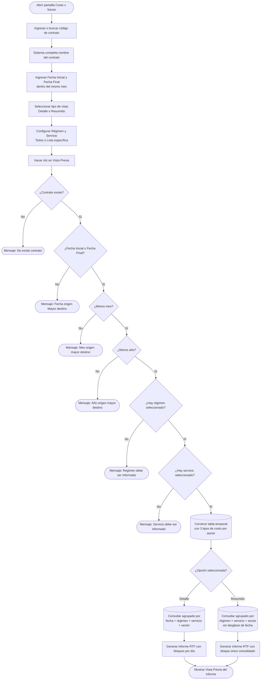

# Costo x Sector

**Formulario:** `I_FCost.frm` (modo `CosSec`)
**Función principal:** `I_CostoxSector` en `Informes.bas`
**Tabla(s) principal(es):** `b_totventas` (encabezados de documentos de venta/salida), `b_detventas` (líneas de detalle de venta/salida), `b_minuta` (planificación de minutas), `b_minutadet` (detalle de recetas planificadas), `b_minutaraciones` (raciones producidas/registradas)
**Consulta principal:** Consulta directa (sin stored procedures)

---

## Índice

- [1 — ¿Para qué sirve esta pantalla?](#1--para-qué-sirve-esta-pantalla)
- [2 — ¿Qué necesito para usarla?](#2--qué-necesito-para-usarla)
- [3 — ¿Cómo se usa?](#3--cómo-se-usa)
  - [3.1 Flujo paso a paso](#31-flujo-paso-a-paso)
  - [3.2 Controles y acciones disponibles](#32-controles-y-acciones-disponibles)
- [4 — ¿Qué restricciones debo conocer?](#4--qué-restricciones-debo-conocer)
  - [4.1 Validaciones del sistema](#41-validaciones-del-sistema)
  - [4.2 Reglas de cálculo](#42-reglas-de-cálculo)
- [5 — ¿Qué obtengo?](#5--qué-obtengo)
  - [Resumen de tipos disponibles](#resumen-de-tipos-disponibles)
  - [(Detalle) Vista Detallada](#detalle-vista-detallada)
  - [(Resumido) Vista Resumida](#resumido-vista-resumida)
- [6 — Referencia técnica](#6--referencia-técnica)
  - [Tablas que intervienen](#tablas-que-intervienen)
  - [Relación con otros módulos](#relación-con-otros-módulos)

---

## 1 — ¿Para qué sirve esta pantalla?

[↑ Volver al índice](#índice)

El informe **Costo x Sector** permite conocer cuánto costó alimentar a los comensales de un contrato durante un período determinado, desglosado por el sector al que pertenece cada servicio (por ejemplo: cocina caliente, ensaladas, postres, etc.). Para cada sector se muestran simultáneamente tres perspectivas de costo: el costo que se estimó al planificar teóricamente la minuta, el costo ajustado según la planificación real, y el costo efectivo basado en lo que realmente se despachó (food cost).

El informe trabaja con un único mes calendario a la vez (fechas de inicio y fin deben pertenecer al mismo mes y año). Esto responde a que los precios de los insumos (PMP — Precio Medio Ponderado) se calculan por período mensual. Dentro de ese mes se puede acotar el análisis a días específicos, a uno o varios regímenes y a uno o varios servicios del contrato.

La visualización está disponible en dos modalidades: **Detallada**, donde cada día del período aparece como un bloque separado con sus costos por sector; y **Resumida**, donde los costos de todos los días del período se consolidan en un único bloque de totales por sector, ideal para una vista de cierre mensual.

---

## 2 — ¿Qué necesito para usarla?

[↑ Volver al índice](#índice)

| Campo | Tipo | Obligatorio | Descripción |
|---|---|---|---|
| Contrato | Texto / búsqueda | Sí | Código del contrato (casino) a analizar. Se puede digitar directamente o buscar con el ícono de lupa. Al ingresar un código válido, el sistema completa automáticamente el nombre del contrato. |
| Fecha Inicial | Fecha (dd/mm/yyyy) | Sí | Primer día del período a analizar. Se inicializa con la fecha actual. |
| Fecha Final | Fecha (dd/mm/yyyy) | Sí | Último día del período a analizar. Se inicializa con la fecha actual. Debe estar en el mismo mes y año que la Fecha Inicial. |
| Tipo de vista | Opción | Sí | **Detalle**: muestra cada día del período por separado. **Resumido**: consolida todos los días en un único resumen. Por defecto se selecciona la opción "Detalle". |
| Régimen | Opción + lista | Sí | Define si se consideran todos los regímenes del contrato o solo algunos seleccionados de una lista. Por defecto: "Todos". |
| Servicio | Opción + lista | Sí | Define si se consideran todos los servicios del contrato o solo algunos seleccionados de una lista. Por defecto: "Todos". |

---

## 3 — ¿Cómo se usa?

### 3.1 Flujo paso a paso

[↑ Volver al índice](#índice)

### 3.2 Controles y acciones disponibles

[↑ Volver al índice](#índice)

| Control | Tipo | Descripción |
|---|---|---|
| Código de contrato | Campo de texto | Permite ingresar el código del casino directamente con el teclado. |
| Ícono búsqueda contrato | Botón | Abre un selector para buscar y elegir el contrato deseado. |
| Nombre contrato | Etiqueta (solo lectura) | Se completa automáticamente al ingresar o seleccionar un contrato válido. |
| Fecha Inicial | Selector de fecha | Primer día del período. Formato dd/mm/yyyy. |
| Fecha Final | Selector de fecha | Último día del período. Formato dd/mm/yyyy. |
| Detalle / Resumido | Botones de opción | Elige entre vista por día o vista consolidada del período. |
| Marco Régimen — Todos | Botón de opción | Incluye todos los regímenes del contrato. Seleccionado por defecto. |
| Marco Régimen — Lista | Botón de opción + buscador | Permite seleccionar uno o más regímenes específicos. |
| Marco Servicio — Todos | Botón de opción | Incluye todos los servicios del contrato. Seleccionado por defecto. |
| Marco Servicio — Lista | Botón de opción + buscador | Permite seleccionar uno o más servicios específicos. |
| Vista Previa | Botón de barra de herramientas | Valida los parámetros y genera el informe RTF para su previsualización e impresión. |
| Histórico Planificación Teórica | Botón de barra de herramientas | Accede al historial de planificación teórica del contrato. |
| Salir | Botón de barra de herramientas | Cierra el formulario. |

---

## 4 — ¿Qué restricciones debo conocer?

### 4.1 Validaciones del sistema

[↑ Volver al índice](#índice)

| # | Cuándo aparece | Qué verifica | Qué ve el usuario |
|---|---|---|---|
| 1 | Al hacer clic en Vista Previa | El código de contrato ingresado existe en la base de datos | `No existe contrato` |
| 2 | Al hacer clic en Vista Previa | La Fecha Inicial no es posterior a la Fecha Final | `Fecha origen Mayor destino` |
| 3 | Al hacer clic en Vista Previa | Las dos fechas pertenecen al mismo mes calendario | `Mes origen mayor destino` |
| 4 | Al hacer clic en Vista Previa | Las dos fechas pertenecen al mismo año | `Año origen mayor destino` |
| 5 | Al hacer clic en Vista Previa | Al usar "Lista" en Régimen, hay al menos un régimen seleccionado | `Regimen debe ser informado` |
| 6 | Al hacer clic en Vista Previa | Al usar "Lista" en Servicio, hay al menos un servicio seleccionado | `Servicio debe ser informado` |

### 4.2 Reglas de cálculo

[↑ Volver al índice](#índice)

**Clasificación de las tres perspectivas de costo**

El informe construye internamente una tabla temporal que reúne datos de tres orígenes distintos, identificados con un campo `tipo`:

- `tipo = 1` → **Planificación Teórica**: costo calculado multiplicando las raciones teóricas planificadas (`mid_numrac`) por el costo de la receta congelado al momento de planificar (`mid_cosrec`), usando la minuta de tipo teórico (`mid_tipmin = '1'`).
- `tipo = 2` → **Planificación Real**: mismo cálculo anterior pero utilizando la minuta real (`mid_tipmin = '2'`), que refleja los ajustes hechos antes de producir.
- `tipo = 3` → **Realizado (Food Cost)**: costo proveniente de los documentos de salida reales (`b_totventas` + `b_detventas`), considerando salidas de producción (`tov_tipdoc = 'SP'`) y descontando devoluciones (`tov_tipdoc = 'DP'`). Solo se incluyen productos cuya cuenta contable coincide con el parámetro del sistema `ctainsumo`.

**Estructura Fija**

Además de los sectores de la minuta, el informe incorpora un sector especial denominado **"Estructura Fija"**, que agrupa los costos de insumos que no están asociados a un sector de servicio específico sino que son costos fijos del régimen. Su código de sector es `-1` y aparece al final del listado (orden `999999999`). Estos costos se obtienen de las tablas `b_minutafija` (estructura fija mensual) y `b_minutafijadia` (estructura fija por día), usando el PMP del día anterior al cierre como precio de valorización cuando no existe una estructura fija por día específica.

**Costo per cápita**

Para cada sector y cada perspectiva de costo se calcula el **costo per cápita** dividiendo el costo total del sector por el número de raciones correspondiente:

- Para tipo 1 (Teórico): `Costo per cápita = Costo Total / Raciones Teóricas (min_racteo)`
- Para tipo 2 (Real): `Costo per cápita = Costo Total / Raciones Reales (min_racrea)`
- Para tipo 3 (Realizado): `Costo per cápita = Costo Total / Raciones Producidas (b_minutaraciones donde mir_rutcli = 'PRODUCIDAS')`

Si el denominador de raciones es cero, el sistema muestra cero sin dividir.

**Filtro de insumos**

Solo se incluyen productos cuya cuenta contable (`pro_ctacon`) esté en la lista definida por el parámetro del sistema `ctainsumo`. Esto evita incluir costos de artículos que no son materias primas alimentarias.

**Exclusión de documentos anulados o pendientes**

Los documentos con estado `'A'` (Anulado) o `'P'` (Pendiente) en `tov_estdoc` son excluidos del cálculo del food cost. Tampoco se consideran líneas de detalle con cantidad cero (`dev_canmer <> 0`) ni con costo total cero (`dev_ptotal > 0`).

---

## 5 — ¿Qué obtengo?

[↑ Volver al índice](#índice)

El informe se genera en formato **RTF** (visualización e impresión desde vista previa) con orientación de página **vertical (Portrait)**. Simultáneamente se exporta un archivo de texto plano separado por `|` para uso en planillas de cálculo.

### Resumen de tipos disponibles

| Opción | Agrupación temporal | Uso recomendado |
|---|---|---|
| Detalle | Un bloque por cada día del período | Análisis diario de desviaciones de costo |
| Resumido | Un único bloque para todo el período | Cierre mensual y comparación de totales |

### (Detalle) Vista Detallada

[↑ Volver al índice](#índice)

Muestra el costo de cada sector desagregado día por día dentro del período seleccionado. Para cada combinación de Fecha + Régimen + Servicio se genera un bloque independiente con encabezado y tabla de sectores.

**Estructura por bloque (Detalle)**

Cada bloque contiene:
1. **Encabezado de Régimen** (fondo amarillo): código y nombre del régimen.
2. **Encabezado de Servicio** (fondo amarillo): nombre del servicio + fecha del día + cantidad de raciones para cada perspectiva.
3. **Cabecera de columnas** (fondo amarillo): Código | Descripción | Total | Cto. Per Capita | Total | Cto. Per Capita | Total | Cto. Per Capita
4. **Filas de sectores**: una fila por sector, con datos en las columnas correspondientes a cada perspectiva (Teórico, Real, Realizado).
5. **Fila TOTAL**: suma de todos los sectores para el día con sus costos per cápita.

**Campos por fila de sector (Detalle)**

| Campo | Descripción | Calculado |
|---|---|---|
| Código | Código del sector (vacío si es Estructura Fija) | No |
| Descripción | Nombre del sector o "Estructura Fija" | No |
| Total (Teórico) | Costo total de planificación teórica para el sector en el día | Sí |
| Cto. Per Capita (Teórico) | Costo teórico dividido entre las raciones teóricas del día | Sí |
| Total (Real) | Costo total de planificación real para el sector en el día | Sí |
| Cto. Per Capita (Real) | Costo real dividido entre las raciones reales del día | Sí |
| Total (Realizado) | Costo efectivo food cost para el sector en el día | Sí |
| Cto. Per Capita (Realizado) | Costo realizado dividido entre las raciones producidas del día | Sí |

**Cálculo — Total (Teórico)**

`SUM(mid_numrac × mid_cosrec)` agrupado por fecha, régimen, servicio y sector, filtrando minutas de tipo `'1'` (teórica) con raciones mayores a cero y costo de receta mayor a cero.

**Cálculo — Total (Real)**

`SUM(mid_numrac × mid_cosrec)` agrupado por fecha, régimen, servicio y sector, filtrando minutas de tipo `'2'` (real) con raciones mayores a cero y costo de receta mayor a cero.

**Cálculo — Total (Realizado)**

`SUM(CASE WHEN tov_tipdoc = 'SP' THEN dev_ptotal ELSE (-1 × dev_ptotal) END)` sobre los documentos de salida de producción y sus devoluciones, agrupado por fecha, régimen, servicio y sector, solo para productos con cuenta contable `ctainsumo`.

**Cálculo — Cto. Per Capita**

`Total de la perspectiva / Raciones de la perspectiva`. Si el número de raciones es cero, se muestra `0`.

**Formato de salida (Detalle)**

- Documento: RTF vertical, fuente Arial 8pt, márgenes 500 twips izquierdo.
- Encabezado de página: generado por `fg_poneencpagina` (incluye logo de empresa).
- Pie de página: generado por `fg_ponepiepagina` + número de página.
- Números de costo: formato de miles con separador y dos decimales para per cápita, sin decimales para totales.

### (Resumido) Vista Resumida

[↑ Volver al índice](#índice)

Consolida todos los días del período en un único bloque por cada combinación de Régimen + Servicio, sin desglose por fecha. Es equivalente al modo Detalle pero los costos de cada sector se suman para todos los días seleccionados.

**Estructura por bloque (Resumido)**

Idéntica a la del modo Detalle, con las siguientes diferencias:
- El encabezado de Servicio **no muestra la fecha** (solo nombre del servicio y raciones totales del período).
- La consulta de raciones utiliza el **rango completo** del período (de `fecini` a `fecfin`) en lugar de un único día.
- La agrupación en la consulta final omite el campo de fecha, acumulando todos los días.

**Campos por fila de sector (Resumido)**

Los mismos 8 campos que en el modo Detalle. La diferencia es que los valores `Total` ya representan la suma acumulada de todo el período y el costo per cápita se divide entre las raciones totales del período.

**Cálculo — Raciones en modo Resumido**

- Raciones Teóricas: `SUM(min_racteo)` desde `b_minuta` para todo el rango de fechas.
- Raciones Reales: `SUM(min_racrea)` desde `b_minuta` para todo el rango de fechas.
- Raciones Producidas: `SUM(mir_nrorac)` desde `b_minutaraciones` donde `mir_rutcli = 'PRODUCIDAS'` para todo el rango de fechas.

**Formato de salida (Resumido)**

Idéntico al modo Detalle en cuanto a fuente, márgenes, encabezados y pies de página.

---

## 6 — Referencia técnica

### Tablas que intervienen

[↑ Volver al índice](#índice)

| Tabla | Descripción funcional | Rol en este informe |
|---|---|---|
| `b_totventas` | Encabezados de documentos de venta/salida de producción | Fuente de food cost; filtra por contrato, régimen, servicio, fechas, bodega y estado del documento |
| `b_detventas` | Líneas de detalle de cada documento de venta/salida | Aporta el costo total por producto (`dev_ptotal`), sector (`dev_codsec`) y código de insumo |
| `b_productos` | Maestro de productos/insumos | Filtra por cuenta contable (`pro_ctacon`) para incluir solo insumos alimentarios |
| `a_sector` | Maestro de sectores de servicio | Aporta código, nombre y orden de presentación de cada sector |
| `b_minuta` | Encabezado de minutas planificadas | Base para tipos 1 (teórico) y 2 (real); aporta raciones teóricas y reales |
| `b_minutadet` | Detalle de recetas en la minuta | Aporta raciones planificadas y costo de receta congelado (`mid_cosrec`) por tipo de minuta |
| `a_servicio` | Maestro de servicios | Aporta nombre del servicio para el encabezado del informe |
| `a_regimen` | Maestro de regímenes | Aporta nombre del régimen para el encabezado del informe |
| `a_estservicio` | Estructura de sectores por servicio y régimen | Relaciona servicios con sus sectores dentro de un contrato |
| `b_minutaraciones` | Raciones registradas por tipo de comensal | Aporta las raciones producidas (`mir_rutcli = 'PRODUCIDAS'`) para el cálculo del per cápita realizado |
| `b_minutafija` | Estructura de costos fijos mensual por régimen/servicio | Base para calcular la "Estructura Fija" cuando no existe registro por día |
| `b_minutafijadia` | Estructura de costos fijos diaria por régimen/servicio | Versión diaria de la estructura fija; tiene prioridad sobre `b_minutafija` cuando existe |
| `b_productospmpdia` | PMP diario de productos por contrato | Precio de valorización para la estructura fija cuando no hay registro diario (SQL Server: PMP del día anterior al cierre) |
| `a_param` / `b_parametros` | Parámetros del sistema | Aporta `ctainsumo` (cuentas contables de insumos) y `ciediario` (fecha de cierre vigente) |

### Relación con otros módulos

[↑ Volver al índice](#índice)

| Módulo relacionado | Relación |
|---|---|
| **Planificación de Minutas** | Provee los datos base del costo teórico y real (`b_minuta`, `b_minutadet`). Sin minuta planificada, las columnas Teórico y Real aparecen vacías. |
| **Salidas de Producción / Food Cost** | Los documentos tipo `SP` (Salida de Producción) y `DP` (Devolución de Producción) en `b_totventas`/`b_detventas` alimentan la columna Realizado. |
| **Cierre Diario** | El PMP calculado en el proceso de cierre diario se almacena en `b_productospmpdia` y es la fuente de valorización de la Estructura Fija. |
| **Estructura Fija** | El módulo de configuración de estructura fija (`b_minutafija`, `b_minutafijadia`) define los costos fijos que aparecen como sector "Estructura Fija" en el informe. |
| **Maestros (Contrato, Régimen, Servicio, Sector)** | Las tablas `a_regimen`, `a_servicio`, `a_sector` y `a_estservicio` son mantenidas desde módulos externos al módulo de Producción. |
| **Parámetros del sistema** | El parámetro `ctainsumo` (cuenta contable de insumos) determina qué productos se consideran en el food cost; es configurable desde el módulo de administración. |

---

*Fuentes: `I_FCost.frm`, función `I_CostoxSector` en `Informes.bas`, tablas `b_totventas`, `b_detventas`, `b_minuta`, `b_minutadet`, `b_minutaraciones`, `b_minutafija`, `b_minutafijadia`, `b_productospmpdia`, `a_sector`, `a_servicio`, `a_regimen`, `a_estservicio` en `SGP_Local.sql`*
