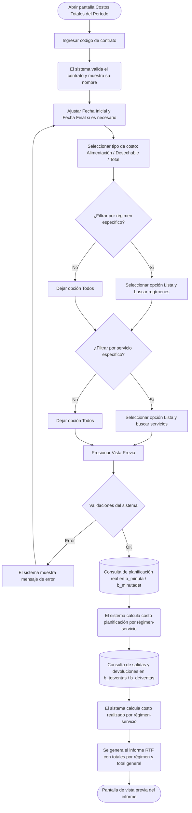

# Costos Totales del Período

**Formulario:** `I_FCost.frm` (modo `CosTot`)
**Función principal:** `I_CostosTotPeriodo` en `Informes.bas`
**Tabla(s) principal(es):** `b_minuta` (encabezado de minutas planificadas), `b_minutadet` (detalle de recetas por minuta), `b_totventas` (encabezado de salidas y devoluciones de bodega), `b_detventas` (líneas de productos en salidas/devoluciones)
**Consulta principal:** Consulta directa (sin stored procedures)

---

## Índice

- [1 — ¿Para qué sirve esta pantalla?](#1--para-qué-sirve-esta-pantalla)
- [2 — ¿Qué necesito para usarla?](#2--qué-necesito-para-usarla)
- [3 — ¿Cómo se usa?](#3--cómo-se-usa)
  - [3.1 Flujo paso a paso](#31-flujo-paso-a-paso)
  - [3.2 Controles y acciones disponibles](#32-controles-y-acciones-disponibles)
- [4 — ¿Qué restricciones debo conocer?](#4--qué-restricciones-debo-conocer)
  - [4.1 Validaciones del sistema](#41-validaciones-del-sistema)
  - [4.2 Reglas de cálculo](#42-reglas-de-cálculo)
- [5 — ¿Qué obtengo?](#5--qué-obtengo)
- [6 — Referencia técnica](#6--referencia-técnica)
  - [Tablas que intervienen](#tablas-que-intervienen)
  - [Relación con otros módulos](#relación-con-otros-módulos)

---

## 1 — ¿Para qué sirve esta pantalla?

[↑ Volver al índice](#índice)

Este informe entrega un resumen consolidado de los costos de alimentación de un contrato durante un período dentro del mismo mes. Para cada régimen y servicio seleccionado muestra dos columnas económicas: el **costo de planificación real** (lo que costó la minuta planificada, incluyendo la estructura fija de recetas) y el **costo realizado** (lo que efectivamente salió de bodega y fue facturado mediante salidas de producción y devoluciones).

El informe se organiza jerárquicamente: primero por régimen y dentro de cada régimen por servicio, con subtotales por régimen y un total general al final. Esto permite a los responsables de casino comparar en una sola vista cuánto se planificó gastar versus cuánto se gastó realmente en el período, detectando desviaciones por servicio o por régimen.

El usuario puede elegir si los costos corresponden solo a alimentación (insumos), solo a desechables, o al total combinado de ambos. La restricción de que el período debe estar dentro del mismo mes y año responde a que los parámetros de costo unitario (PMP) corresponden a un período de cierre mensual y combinar meses distintos arrojaría valores inconsistentes.

---

## 2 — ¿Qué necesito para usarla?

[↑ Volver al índice](#índice)

| Campo | Descripción | Obligatorio |
|---|---|---|
| Contrato | Código del contrato (casino) sobre el que se quiere analizar los costos. El sistema muestra el nombre automáticamente al ingresar el código. | Sí |
| Fecha inicial | Primer día del período a consultar (formato dd/mm/yyyy). Se inicializa con la fecha del día. | Sí |
| Fecha final | Último día del período a consultar (formato dd/mm/yyyy). Se inicializa con la fecha del día. | Sí |
| Tipo de costo | Define qué componente de costo se incluye: **Costo Alimentación** (solo insumos), **Costo Desechable** (solo desechables) o **Total Costo** (ambos combinados). Por defecto se selecciona Total Costo. | Sí |
| Régimen | Permite filtrar por uno o varios regímenes. La opción **Todos** incluye todos los regímenes del contrato; la opción **Lista** habilita la búsqueda y selección individual de regímenes. | Sí |
| Servicio | Permite filtrar por uno o varios servicios. La opción **Todos** incluye todos los servicios; la opción **Lista** habilita la búsqueda y selección individual de servicios. | Sí |

---

## 3 — ¿Cómo se usa?

### 3.1 Flujo paso a paso

[↑ Volver al índice](#índice)

### 3.2 Controles y acciones disponibles

[↑ Volver al índice](#índice)

| Control | Descripción | Observaciones |
|---|---|---|
| Campo de contrato | Ingreso manual del código del contrato | El nombre se carga automáticamente al salir del campo |
| Icono de búsqueda (contrato) | Abre el buscador de contratos para seleccionar uno de la lista | Busca en la tabla de clientes/contratos |
| Fecha inicial | Campo de fecha con formato dd/mm/yyyy | Se inicializa con la fecha actual |
| Fecha final | Campo de fecha con formato dd/mm/yyyy | Se inicializa con la fecha actual |
| Costo Alimentación | Botón de opción que limita el informe a insumos de alimentación | Usa las cuentas contables del parámetro `ctainsumo` |
| Costo Desechable | Botón de opción que limita el informe a desechables | Usa las cuentas contables del parámetro `ctalimdes` |
| Total Costo | Botón de opción que incluye alimentación y desechables (seleccionado por defecto) | Combina ambas cuentas contables |
| Régimen — Todos | Botón de opción: incluye todos los regímenes del contrato (seleccionado por defecto) | |
| Régimen — Lista | Botón de opción: habilita la selección individual de regímenes | El icono de búsqueda abre el buscador de regímenes |
| Icono de búsqueda (régimen) | Abre el buscador de regímenes para agregar a la lista de filtro | Solo disponible cuando se elige la opción Lista |
| Servicio — Todos | Botón de opción: incluye todos los servicios (seleccionado por defecto) | |
| Servicio — Lista | Botón de opción: habilita la selección individual de servicios | El icono de búsqueda abre el buscador de servicios |
| Icono de búsqueda (servicio) | Abre el buscador de servicios para agregar a la lista de filtro | Solo disponible cuando se elige la opción Lista |
| Vista Previa | Botón de la barra de herramientas: ejecuta las consultas y muestra el informe | Aplica todas las validaciones antes de generar |
| Histórico Planificación Teórica | Botón de la barra de herramientas: permite seleccionar un período histórico cerrado y actualiza las fechas automáticamente | Útil para consultar períodos anteriores ya cerrados |
| Salir | Botón de la barra de herramientas: cierra el formulario | |

---

## 4 — ¿Qué restricciones debo conocer?

### 4.1 Validaciones del sistema

[↑ Volver al índice](#índice)

| # | Cuándo aparece | Qué verifica el sistema | Qué ve el usuario |
|---|---|---|---|
| 1 | Al presionar Vista Previa | Que el contrato ingresado exista en la base de datos | "No existe contrato" |
| 2 | Al presionar Vista Previa | Que la fecha inicial no sea posterior a la fecha final | "Fecha origen Mayor destino" |
| 3 | Al presionar Vista Previa | Que ambas fechas pertenezcan al mismo mes | "Mes origen mayor destino" |
| 4 | Al presionar Vista Previa | Que ambas fechas pertenezcan al mismo año | "Año origen mayor destino" |
| 5 | Al presionar Vista Previa | Que haya al menos un régimen seleccionado (en modo Lista, que la grilla no esté vacía) | "Regimen debe ser informado" |
| 6 | Al presionar Vista Previa | Que haya al menos un servicio seleccionado (en modo Lista, que la grilla no esté vacía) | "Servicio debe ser informado" |

### 4.2 Reglas de cálculo

[↑ Volver al índice](#índice)

**Filtro de cuenta contable según tipo de costo seleccionado**

El sistema filtra los productos incluidos en el cálculo según la cuenta contable del producto (`pro_ctacon`) y el tipo de costo elegido:

- **Costo Alimentación:** solo productos cuya cuenta contable esté en la lista del parámetro `ctainsumo` (definido en la tabla `a_param`).
- **Costo Desechable:** solo productos cuya cuenta contable esté en la lista del parámetro `ctalimdes`.
- **Total Costo:** productos de ambas listas combinadas.

**Resolución del precio unitario (PMP) para estructura fija**

Cuando el costo de un servicio proviene de la estructura fija de minuta (tabla `b_minutafija`, que almacena recetas permanentes sin detalle diario), el sistema necesita el precio unitario de cada ingrediente. Lo obtiene desde la tabla `b_productospmpdia` (PMP diario de productos), tomando el registro del día anterior al cierre vigente. En la versión SQL Server el sistema busca directamente en `b_productospmpdia` con la fecha del día anterior al cierre; en la versión Access legada genera una tabla temporal con los últimos PMP registrados.

**Fuente del costo de planificación real**

Existen dos fuentes para el costo planificado, que el sistema selecciona automáticamente según los datos disponibles:

1. **Estructura diaria (`b_minutafijadia`):** si existe un registro específico para el día consultado, el costo se calcula como `SUM(cantidad × precio_unitario)` de esa tabla. Este precio ya está grabado en la estructura fija del día.
2. **Estructura fija periódica (`b_minutafija`):** si no existe estructura diaria, se usa la estructura fija más reciente (`MAX(mif_fecval)`), multiplicando la cantidad de la receta por el PMP del día anterior al cierre.

Adicionalmente, para cada minuta (detalle en `b_minutadet` con `mid_tipmin='2'`), el sistema suma el costo congelado en la minuta (`mid_cosrec` para alimentación, `mid_cosdes` para desechables) multiplicado por las raciones planificadas (`mid_numrac`).

**Fuente del costo realizado**

El costo realizado se obtiene de los documentos de salida de producción (tipo `SP`) y de las devoluciones de producción (tipo `DP`) registrados en `b_totventas` y `b_detventas`. Los documentos anulados (`tov_estdoc = 'A'` o `'P'`) quedan excluidos. Las devoluciones se descuentan (se suman con signo negativo) del total de salidas.

---

## 5 — ¿Qué obtengo?

[↑ Volver al índice](#índice)

El sistema genera un **informe en formato RTF** con orientación vertical (portrait), listo para imprimir o guardar como archivo. El encabezado del informe incluye el logo de la empresa, el nombre del contrato y el rango de fechas consultado.

### Opciones de configuración disponibles en el informe

| Opción | Efecto en el informe |
|---|---|
| Costo Alimentación | Muestra solo los costos de insumos de alimentación |
| Costo Desechable | Muestra solo los costos de materiales desechables |
| Total Costo | Muestra la suma de ambos tipos de costo |
| Régimen/Servicio filtrados | El informe incluye solo los regímenes y servicios seleccionados |

### Estructura de datos del informe

| Campo | Descripción | Calculado |
|---|---|---|
| Régimen | Nombre del régimen (agrupador de primer nivel, en negrita) | No |
| Código y nombre del servicio | Identificador y descripción del servicio dentro del régimen | No |
| Costos Planificación Real | Total monetario del costo planificado para el servicio en el período | Sí |
| Costos Realizados | Total monetario del costo efectivamente salido de bodega para el servicio | Sí |
| Total Régimen | Suma de los valores de todos los servicios dentro del régimen (en negrita) | Sí |
| Total | Gran total del período sumando todos los regímenes (en negrita) | Sí |

#### Cálculo — Costos Planificación Real

Acumula, para cada combinación régimen-servicio y cada día del período, el costo de la minuta planificada real más el costo de la estructura fija de recetas, filtrado por el tipo de cuenta contable seleccionado.

| Componente | Fuente | Fórmula |
|---|---|---|
| Costo minuta (recetas variables) | `b_minutadet` + `b_minuta` | `SUM(mid_cosrec × mid_numrac)` para alimentación; `SUM(mid_cosdes × mid_numrac)` para desechable; suma de ambos para total |
| Costo estructura fija — diaria | `b_minutafijadia` | `SUM(mfd_canpro × mfd_cospro)` cuando existe registro del día |
| Costo estructura fija — periódica | `b_minutafija` + `b_productospmpdia` | `SUM(ppd_propon × mif_canpro)` usando PMP del día anterior al cierre |

Solo se consideran minutas de tipo real (`mid_tipmin = '2'`).

#### Cálculo — Costos Realizados

Suma el valor total de los documentos de salida de producción menos las devoluciones, filtrado por cuenta contable.

| Componente | Fuente | Fórmula |
|---|---|---|
| Salidas de producción (tipo SP) | `b_totventas` + `b_detventas` | `SUM(dev_ptotal)` donde `tov_tipdoc = 'SP'` |
| Devoluciones de producción (tipo DP) | `b_totventas` + `b_detventas` | `-SUM(dev_ptotal)` donde `tov_tipdoc = 'DP'` (se descuenta) |
| Filtro de cuenta | `b_productos` | Solo productos con `pro_ctacon` en las cuentas del tipo de costo seleccionado |
| Filtro de estado | `b_totventas` | Excluye documentos con `tov_estdoc = 'A'` (anulados) o `'P'` |

### Formato de salida

| Atributo | Valor |
|---|---|
| Tipo de archivo | RTF (Rich Text Format), visualizado en pantalla de vista previa antes de imprimir |
| Orientación | Vertical (portrait) |
| Fuente | Arial 8pt |
| Encabezado de página | Logo empresa + encabezado general del sistema |
| Pie de página | Pie general del sistema + número de página |
| Tabla principal | 3 columnas: Servicio / Costos Planificación Real / Costos Realizados |
| Columnas numéricas | Alineadas a la derecha, formateadas con separador de miles |
| Filas de agrupación | Encabezados de régimen y filas de totales en negrita, fondo amarillo en cabecera de columnas |

---

## 6 — Referencia técnica

### Tablas que intervienen

[↑ Volver al índice](#índice)

| Tabla | Para qué se usa | Campos clave |
|---|---|---|
| `b_minuta` | Encabezado de la minuta planificada; provee la asociación contrato-régimen-servicio-fecha y las raciones reales | `min_codigo`, `min_cencos`, `min_codreg`, `min_codser`, `min_fecmin`, `min_racrea` |
| `b_minutadet` | Detalle de recetas por minuta; contiene el costo congelado por receta y las raciones planificadas | `mid_codigo`, `mid_tipmin`, `mid_cosrec`, `mid_cosdes`, `mid_numrac` |
| `b_minutafija` | Estructura fija periódica de recetas (válida a partir de una fecha); usada cuando no existe estructura diaria | `mif_cencos`, `mif_codreg`, `mif_codser`, `mif_fecval`, `mif_codpro`, `mif_dianro`, `mif_canpro` |
| `b_minutafijadia` | Estructura fija del día; si existe para la fecha consultada, tiene prioridad sobre la estructura periódica | `mfd_cencos`, `mfd_codreg`, `mfd_codser`, `mfd_fecha`, `mfd_codpro`, `mfd_tipmin`, `mfd_canpro`, `mfd_cospro` |
| `b_productospmpdia` | Precio Medio Ponderado diario de productos; provee el precio unitario para calcular el costo de la estructura fija periódica | `ppd_cencos`, `ppd_codpro`, `ppd_fecdia`, `ppd_propon` |
| `b_productos` | Maestro de productos; permite filtrar por cuenta contable para separar alimentación de desechables | `pro_codigo`, `pro_ctacon` |
| `b_totventas` | Encabezado de documentos de movimiento de bodega; provee los documentos de salida (SP) y devolución (DP) | `tov_rutcli`, `tov_tipdoc`, `tov_numdoc`, `tov_codreg`, `tov_codser`, `tov_fecpro`, `tov_estdoc`, `tov_codbod` |
| `b_detventas` | Líneas de productos de cada documento de movimiento; contiene el valor monetario por línea | `dev_rutcli`, `dev_tipdoc`, `dev_numdoc`, `dev_codmer`, `dev_ptotal`, `dev_canmer` |
| `a_servicio` | Maestro de servicios; provee el nombre del servicio para mostrarlo en el informe | `ser_codigo`, `ser_nombre` |
| `a_regimen` | Maestro de regímenes; provee el nombre del régimen para el agrupador de primer nivel | `reg_codigo`, `reg_nombre` |
| `b_clientes` | Maestro de contratos/clientes; valida que el contrato exista y obtiene su nombre para el encabezado del informe | `cli_codigo`, `cli_nombre` |
| `a_param` | Tabla de parámetros del sistema; provee las cuentas contables de insumos (`ctainsumo`) y desechables (`ctalimdes`) | `par_codigo`, `par_valor`, `par_cencos` |

### Relación con otros módulos

[↑ Volver al índice](#índice)

| Módulo | Relación |
|---|---|
| Planificación / Minuta | Fuente del costo planificado: la minuta real (`b_minuta`, `b_minutadet`) y la estructura fija de recetas (`b_minutafija`, `b_minutafijadia`) alimentan el componente "Costos Planificación Real" del informe |
| Inventario / Bodega | Fuente del costo realizado: los documentos de salida de producción (SP) y devoluciones (DP) registrados en `b_totventas` y `b_detventas` alimentan el componente "Costos Realizados" |
| Cierre de período | El PMP vigente al momento del cierre (`b_productospmpdia`) es el precio unitario usado para valorizar la estructura fija periódica; por eso el informe se restringe a un único mes |
| Mantenedor de Productos | La cuenta contable asignada a cada producto (`b_productos.pro_ctacon`) determina si el producto se incluye en el cálculo de alimentación, desechables o ambos |
| Mantenedor de Parámetros | Los parámetros `ctainsumo` y `ctalimdes` (tabla `a_param`) definen qué cuentas contables corresponden a cada tipo de costo; si estos parámetros no están configurados el informe no filtrará correctamente |

---

*Fuentes: `I_FCost.frm`, función `I_CostosTotPeriodo` en `Informes.bas`, tablas `b_minuta`, `b_minutadet`, `b_minutafija`, `b_minutafijadia`, `b_totventas`, `b_detventas` en `SGP_Local.sql`*
