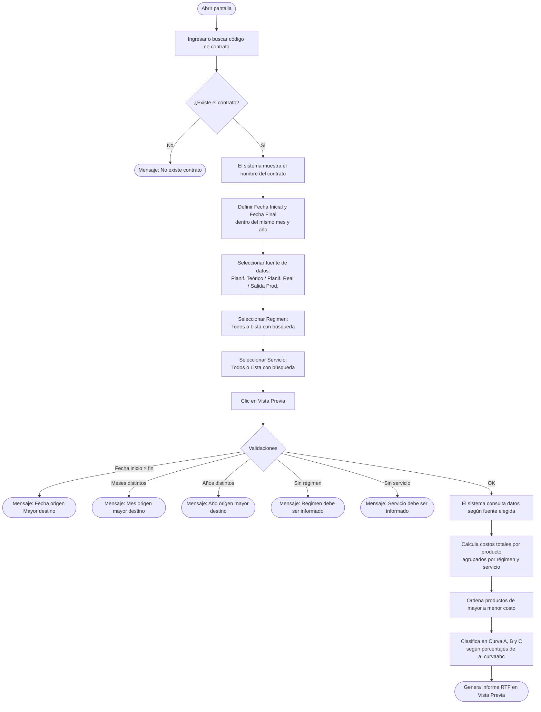

# Curva ABC

**Formulario:** `I_FCost.frm` (modo `CurABC`)
**Función principal:** `I_CurvaABC` en `Informes.bas`
**Tabla(s) principal(es):** `a_curvaabc` (parámetros de clasificación A/B/C), `b_minuta` / `b_minutadet` (planificación teórica y real), `b_minutafijadia` (estructura fija diaria), `b_totventas` / `b_detventas` (salidas reales de producción)
**Consulta principal:** consulta directa (sin stored procedure)

---

## Índice

- [1 — ¿Para qué sirve esta pantalla?](#1--para-qué-sirve-esta-pantalla)
- [2 — ¿Qué necesito para usarla?](#2--qué-necesito-para-usarla)
- [3 — ¿Cómo se usa?](#3--cómo-se-usa)
  - [3.1 Flujo paso a paso](#31-flujo-paso-a-paso)
  - [3.2 Controles y acciones disponibles](#32-controles-y-acciones-disponibles)
- [4 — ¿Qué restricciones debo conocer?](#4--qué-restricciones-debo-conocer)
  - [4.1 Validaciones del sistema](#41-validaciones-del-sistema)
  - [4.2 Reglas de cálculo](#42-reglas-de-cálculo)
- [5 — ¿Qué obtengo?](#5--qué-obtengo)
- [6 — Referencia técnica](#6--referencia-técnica)
  - [Tablas que intervienen](#tablas-que-intervienen)
  - [Relación con otros módulos](#relación-con-otros-módulos)

---

## 1 — ¿Para qué sirve esta pantalla?

[↑ Volver al índice](#índice)

La pantalla **Curva ABC** permite identificar qué productos concentran el mayor gasto dentro de un contrato, para un período de tiempo acotado a un mes. Aplica la metodología ABC de análisis de inventarios: ordena todos los productos de mayor a menor costo total y los agrupa en tres categorías (A, B y C) según los umbrales de porcentaje configurados en el sistema.

El análisis puede realizarse sobre tres fuentes de datos distintas, elegidas por el usuario:

- **Planificación Teórica**: considera las recetas y raciones planificadas en la minuta teórica.
- **Planificación Real**: considera las recetas y raciones confirmadas en la minuta real.
- **Salida de Producción (Realizado)**: considera los movimientos de salida efectiva de bodega registrados como despachos (tipo SP) con sus devoluciones (tipo DP).

El resultado se presenta como un informe imprimible en formato RTF, separado por régimen y servicio, que permite al jefe de producción o al nutricionista tomar decisiones sobre compras, sustitución de ingredientes o control de costos.

---

## 2 — ¿Qué necesito para usarla?

[↑ Volver al índice](#índice)

| Requisito | Detalle |
|---|---|
| Contrato activo | Debe existir en la tabla de clientes (`a_clientes`) y estar asociado a una bodega válida. |
| Régimen y servicio seleccionados | Al menos un régimen y un servicio deben estar informados (no es posible generar el informe con la selección vacía). |
| Rango de fechas dentro del mismo mes y año | El sistema solo permite analizar períodos dentro de un mismo mes calendario. El rango puede ser de un día o del mes completo. |
| Datos en la fuente elegida | Deben existir minutas (teóricas o reales) o salidas de producción registradas para el período y el contrato seleccionados. Si no hay datos, el informe no genera ninguna página. |
| Parámetros ABC configurados | La tabla `a_curvaabc` debe tener los tres registros ('A', 'B', 'C') con sus porcentajes de corte. Estos son configurados por administración del sistema. |

---

## 3 — ¿Cómo se usa?

[↑ Volver al índice](#índice)

### 3.1 Flujo paso a paso

[↑ Volver al índice](#índice)



### 3.2 Controles y acciones disponibles

[↑ Volver al índice](#índice)

| Control | Tipo | Descripción |
|---|---|---|
| Código de contrato | Campo de texto | Ingreso manual del código del contrato (centro de costo). Se puede buscar con el ícono de lupa. |
| Nombre del contrato | Etiqueta | Se completa automáticamente al ingresar o validar el contrato. |
| Fecha Inicial | Selector de fecha | Fecha de inicio del período. Formato `dd/mm/yyyy`. Se inicializa con la fecha actual. |
| Fecha Final | Selector de fecha | Fecha de término del período. Formato `dd/mm/yyyy`. Se inicializa con la fecha actual. |
| Planif. Teórico | Opción (radio) | Fuente de datos: planificación teórica de recetas y raciones. |
| Planif. Real | Opción (radio) | Fuente de datos: planificación real de recetas y raciones. |
| Salida Prod. | Opción (radio) | Fuente de datos: movimientos de salida efectiva de bodega. |
| Marco Regimen – Todos | Opción | Incluye todos los regímenes del contrato. |
| Marco Regimen – Lista | Opción + búsqueda | Permite seleccionar uno o más regímenes específicos mediante búsqueda. |
| Marco Servicio – Todos | Opción (marcado por defecto) | Incluye todos los servicios del contrato. |
| Marco Servicio – Lista | Opción + búsqueda | Permite seleccionar uno o más servicios específicos mediante búsqueda. |
| Botón Vista Previa | Toolbar | Ejecuta las validaciones y genera el informe en pantalla (formato RTF). |
| Botón Histórico Planificación Teórica | Toolbar | Abre el histórico de planificación teórica (funcionalidad complementaria). |
| Botón Salir | Toolbar | Cierra el formulario. |

---

## 4 — ¿Qué restricciones debo conocer?

[↑ Volver al índice](#índice)

### 4.1 Validaciones del sistema

[↑ Volver al índice](#índice)

Las siguientes validaciones se ejecutan al presionar **Vista Previa**, en el orden indicado:

| # | Condición que genera error | Mensaje del sistema | Acción requerida |
|---|---|---|---|
| 1 | El código de contrato no existe en la base de datos | `No existe contrato` | Verificar el código ingresado o usar la búsqueda. |
| 2 | Fecha Inicial es mayor que Fecha Final | `Fecha origen Mayor destino` | Corregir el rango de fechas. |
| 3 | Las fechas pertenecen a meses distintos | `Mes origen mayor destino` | El análisis solo abarca un mes calendario. Ajustar fechas. |
| 4 | Las fechas pertenecen a años distintos | `Año origen mayor destino` | El análisis solo abarca un año. Ajustar fechas. |
| 5 | No se seleccionó ningún régimen en "Lista" | `Regimen debe ser informado` | Seleccionar al menos un régimen o marcar "Todos". |
| 6 | No se seleccionó ningún servicio en "Lista" | `Servicio debe ser informado` | Seleccionar al menos un servicio o marcar "Todos". |

> **Nota:** Si todas las validaciones pasan pero no existen datos en la fuente seleccionada para el período y filtros indicados, el informe se genera en blanco (sin páginas).

### 4.2 Reglas de cálculo

[↑ Volver al índice](#índice)

**1. Restricción de un mes calendario**

El informe solo puede abarcar fechas dentro del mismo mes y año. No es posible generar un análisis que cruce meses.

**2. Cálculo de cantidad y costo total (Planif. Teórico o Real)**

Para cada línea de receta planificada, la cantidad de producto se calcula como:

```
Cantidad = (cantidad en receta / raciones base de la receta) × raciones planificadas × factor de stock del producto
```

El costo total de cada línea se calcula como:

```
Costo total = (cantidad en receta / raciones base de la receta) × raciones planificadas × costo unitario del ingrediente (mic_cospro)
```

Luego se ajusta por el factor de conversión (`pro_facing`) del producto:

```
Costo unitario final = costo unitario × pro_facing
Cantidad final       = cantidad calculada / pro_facing
```

La fuente de costos unitarios es la tabla `b_minutacosto`, que contiene el costo validado por contrato, fecha y tipo de minuta. A los costos de la planificación se agrega la **estructura fija diaria** (`b_minutafijadia`), que contiene los productos con cantidades y costos fijos pre-asignados por día.

**3. Cálculo de cantidad y costo total (Salida de Producción)**

Para cada movimiento de bodega, la cantidad se calcula considerando el signo según el tipo de documento:

- Documento tipo `SP` (Salida de Producción): la cantidad suma positivamente.
- Documento tipo `DP` (Devolución de Producción): la cantidad resta (se descuenta).

Se excluyen documentos con estado `A` (Anulado) o `P` (Pendiente).

**4. Porcentajes de corte ABC**

Los umbrales para clasificar los productos en categorías A, B y C se leen de la tabla `a_curvaabc`:

| Código | Significado | Campo |
|---|---|---|
| `A` | Porcentaje acumulado hasta el corte de Curva A | `abc_porce` |
| `B` | Porcentaje acumulado hasta el corte de Curva B | `abc_porce` |
| `C` | Porcentaje acumulado hasta el corte de Curva C | `abc_porce` |

El sistema acumula el porcentaje que representa cada producto sobre el total general. Cuando el acumulado supera el umbral de la Curva A, se inicia la Curva B; al superar el umbral de la Curva B, se inicia la Curva C.

**5. Ordenamiento**

Los productos se ordenan de **mayor a menor costo total** antes de aplicar la clasificación. Si dos productos tienen el mismo costo total, se ordenan alfabéticamente por nombre.

**6. Generación por régimen y servicio**

El informe se genera en páginas separadas para cada combinación de régimen y servicio que tenga datos en el período. El resumen de cada sección incluye subtotales por curva y el total general del servicio.

**7. Productos excluidos (Planif. Teórico/Real)**

Para la estructura fija diaria, solo se consideran productos cuya fecha de vencimiento (`pro_fecven`) sea futura, no tenga fecha, o que tengan stock en bodega (`b_bodegas.bod_canmer > 0`).

---

## 5 — ¿Qué obtengo?

[↑ Volver al índice](#índice)

El informe es un documento **RTF** que se muestra en la Vista Previa y puede imprimirse. Se genera en orientación **vertical (Portrait)**. El documento incluye encabezado y pie de página con logo e información de la empresa.

Por cada combinación de régimen y servicio con datos, el informe muestra:

**Encabezado de sección:**

| Campo | Descripción |
|---|---|
| Título | "Curva ABC Teórico", "Curva ABC Real" o "Curva ABC Realizado" según la fuente elegida. |
| Contrato | Código y nombre del contrato. |
| Rango Fecha | Fecha inicial y final del período analizado. |
| Regimen | Código y nombre del régimen. |
| Servicio | Código y nombre del servicio. |

**Detalle de productos (tabla de 8 columnas):**

| Columna | Descripción | Calculado |
|---|---|---|
| (Indicador de curva) | Encabezado de sección: "Curva A", "Curva B" o "Curva C" | No |
| Código | Código del producto (`pro_codigo`) | No |
| Descripción | Nombre del producto (`pro_nombre`) | No |
| UN | Unidad de medida abreviada (`uni_nomcor`) | No |
| Consumo | Cantidad total consumida en el período (ajustada por `pro_facing`) | Sí |
| Costo Unit. | Costo unitario del producto (ajustado por `pro_facing`) | Sí |
| Costo Total | Costo total del producto en el período (`Consumo × Costo Unit.`) | Sí |
| % Sobre Total | Porcentaje que representa este producto sobre el costo total del servicio | Sí |

**Subtotales por curva:**

Al finalizar cada grupo (A, B o C), el sistema imprime una fila con:
- "Total General Curva A/B/C": suma del costo total de todos los productos del grupo.
- Porcentaje que representa esa curva sobre el total general del servicio.

**Total general del servicio:**

Al final de cada sección de régimen/servicio se imprime el costo total sumando todas las curvas.

**Ejemplo de estructura del informe:**

```
[Título: Curva ABC Teórico]
Contrato: XXXXXX - Nombre Casino
Rango Fecha: 01/03/2026 - 31/03/2026
Regimen: 1 - Régimen Normal
Servicio: 1 - Almuerzo

  Curva A
  Cod.   Descripción          UN    Consumo  Costo Unit.  Costo Total  % Sobre Total
  P001   Pollo entero         KG    1.250,0       1.850       2.312.500      45,23 %
  P002   Aceite vegetal       LT      320,5         950         304.475       5,96 %
  ...
         Total General Curva A                             2.616.975      51,19 %

  Curva B
  ...
         Total General Curva B                             1.800.000      35,21 %

  Curva C
  ...
         Total General Curva C                               703.025      13,60 %

         Total General Servicio                            5.120.000
```

---

## 6 — Referencia técnica

[↑ Volver al índice](#índice)

### Tablas que intervienen

[↑ Volver al índice](#índice)

| Tabla | Descripción | Rol en este informe |
|---|---|---|
| `a_curvaabc` | Parámetros de clasificación ABC: código ('A'/'B'/'C'), nombre y porcentaje de corte. | Define los umbrales de clasificación. Solo lectura. |
| `a_servicio` | Catálogo de servicios (desayuno, almuerzo, cena, etc.). | Obtiene nombre del servicio para el encabezado. |
| `a_regimen` | Catálogo de regímenes dietéticos. | Obtiene nombre del régimen para el encabezado. |
| `a_unidad` | Catálogo de unidades de medida (kg, lt, un, etc.). | Obtiene la unidad abreviada (`uni_nomcor`) para cada producto. |
| `b_minuta` | Encabezado de la planificación (cabecera de minuta): contrato, régimen, servicio, fecha. | Filtra minutas por contrato, régimen, servicio y rango de fechas (modos Teórico y Real). |
| `b_minutadet` | Detalle de la planificación: receta asignada, número de raciones, tipo de minuta, costo de receta. | Aporta el número de raciones (`mid_numrac`) y el tipo de minuta (`mid_tipmin`). |
| `b_minutacosto` | Costo unitario de cada producto por contrato, fecha de vigencia y tipo de minuta. | Fuente del costo unitario de los ingredientes en los modos de planificación. |
| `b_minutafijadia` | Estructura fija diaria: productos con cantidad y costo fijo asignados directamente por día, sin depender de recetas. | Complementa la planificación (tanto teórica como real) con los productos de estructura fija. |
| `b_receta` | Maestro de recetas: código, nombre, raciones base (`rec_basrac`). | Relaciona el código de receta con sus ingredientes y la base de raciones para el cálculo proporcional. |
| `b_recetadet` | Detalle de ingredientes por receta: producto, cantidad, tipo de receta, centro de costo. | Aporta la cantidad por receta (`red_canpro`) para el cálculo de consumo. |
| `b_ingrediente` | Maestro de ingredientes: código, nombre, unidad de medida. | Obtiene el nombre y unidad del ingrediente. |
| `b_contlistpreing` | Lista de precios de contrato por ingrediente: mapea el código de ingrediente al código de producto pedible (`cpi_codped`). | Vincula ingrediente con el producto de compra para obtener el código y nombre de producto final. |
| `b_productos` | Maestro de productos: código, nombre, unidad, factor de stock (`pro_facsto`), factor de conversión (`pro_facing`), fecha de vencimiento. | Aporta datos del producto final y los factores de ajuste de cantidad y costo. |
| `b_totventas` | Encabezado de documentos de movimiento de inventario: tipo (SP/DP), número, cliente, fecha, régimen, servicio, estado. | Fuente del modo Salida de Producción; filtra por tipo SP/DP y excluye anulados y pendientes. |
| `b_detventas` | Detalle de líneas de cada documento de movimiento: producto, cantidad, precio de costo. | Aporta la cantidad (`dev_canmer`) y el costo unitario (`dev_precos`) de cada producto en el modo Salida Prod. |

**Tablas temporales creadas en tiempo de ejecución:**

| Tabla temporal | Descripción |
|---|---|
| `<usuario>_tmp_EncCurvaABC` | Contiene las combinaciones distintas de régimen, servicio y mes encontradas para los filtros seleccionados. Se elimina al finalizar el informe. |
| `<usuario>_tmp_DetCurvaABC` | Contiene el detalle de productos, cantidades y costos acumulados para cada combinación régimen/servicio. Se elimina al finalizar el informe. |

> El nombre de cada tabla temporal incluye el nombre de usuario del sistema (`vg_NUsr`) para permitir ejecuciones simultáneas sin conflictos.

### Relación con otros módulos

[↑ Volver al índice](#índice)

| Módulo relacionado | Relación |
|---|---|
| **Planificación (Módulo Minuta)** | Las fuentes "Planif. Teórico" y "Planif. Real" leen directamente las minutas generadas en este módulo (`b_minuta`, `b_minutadet`). El informe refleja el estado actual de la planificación. |
| **Costeo de Minuta** | La tabla `b_minutacosto` es actualizada cuando se validan costos en el proceso de planificación. Sin ese paso previo, los costos en el informe pueden estar en cero. |
| **Salida de Bodega / Producción** | El modo "Salida Prod." consume los documentos SP/DP generados al registrar las salidas reales de producción (`b_totventas`, `b_detventas`). |
| **Maestro de Productos e Ingredientes** | El informe depende de los catálogos de productos (`b_productos`), ingredientes (`b_ingrediente`) y la tabla de equivalencia (`b_contlistpreing`) para resolver nombres y unidades. |
| **Parámetros del sistema (a_curvaabc)** | Los umbrales de clasificación A/B/C son configurados por administración. Un cambio en estos porcentajes afecta directamente qué productos caen en cada categoría. |
| **Contrato / Centro de Costo** | El informe es siempre por contrato. El usuario debe tener acceso al contrato para poder generarlo. |

---

*Fuentes: `I_FCost.frm`, función `I_CurvaABC` en `Informes.bas`, tablas `a_curvaabc`, `b_minuta`, `b_minutadet`, `b_minutacosto`, `b_minutafijadia`, `b_receta`, `b_recetadet`, `b_ingrediente`, `b_contlistpreing`, `b_productos`, `b_totventas`, `b_detventas`, `a_unidad`, `a_servicio`, `a_regimen` en `SGP_Local.sql`*
