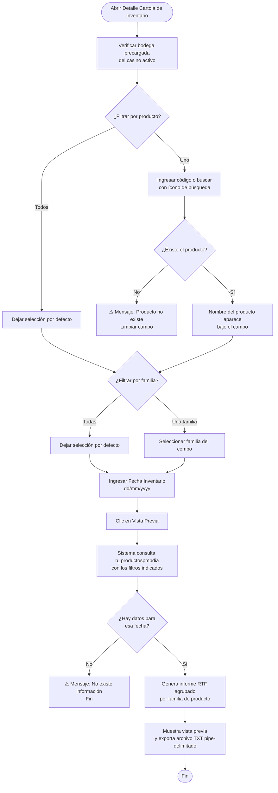

# Detalle Cartola de Inventario

**Formulario:** `I_FicSto.frm` (modo `DetCarInv`)
**Función principal:** `I_DetCarInvMichel` en `Informes.bas`
**Tabla(s) principal(es):** `b_productospmpdia` (saldo y precio PMP por producto/casino/fecha), `b_productos` (maestro de productos), `a_unidad` (unidades de medida)
**Consulta principal:** Consulta directa SQL (sin stored procedure)

---

## Índice

- [1 — ¿Para qué sirve esta pantalla?](#1--para-qué-sirve-esta-pantalla)
- [2 — ¿Qué necesito para usarla?](#2--qué-necesito-para-usarla)
- [3 — ¿Cómo se usa?](#3--cómo-se-usa)
  - [3.1 Flujo paso a paso](#31-flujo-paso-a-paso)
  - [3.2 Controles y acciones disponibles](#32-controles-y-acciones-disponibles)
- [4 — ¿Qué restricciones debo conocer?](#4--qué-restricciones-debo-conocer)
  - [4.1 Validaciones del sistema](#41-validaciones-del-sistema)
  - [4.2 Reglas de cálculo](#42-reglas-de-cálculo)
- [5 — ¿Qué obtengo?](#5--qué-obtengo)
- [6 — Referencia técnica](#6--referencia-técnica)
  - [Tablas que intervienen](#tablas-que-intervienen)
  - [Relación con otros módulos](#relación-con-otros-módulos)

---

## 1 — ¿Para qué sirve esta pantalla?

[↑ Volver al índice](#índice)

Este informe muestra el estado valorizado del inventario de bodega en una fecha específica. Para cada producto que tenía saldo en esa fecha, se indica cuántas unidades había en stock, el precio promedio ponderado (PMP) vigente a ese día y el valor total resultante.

A diferencia de otros informes del módulo que trabajan con rangos de fechas, este informe trabaja con **una sola fecha** (la "Fecha Inventario"), mostrando una fotografía del inventario en ese momento. Los productos se agrupan por familia de producto y, al final de cada familia y del informe completo, se calculan subtotales y un total general valorizado.

El resultado se genera en formato RTF (vista previa imprimible) y simultáneamente se exporta a un archivo de texto delimitado por `|` (compatible con Excel).

---

## 2 — ¿Qué necesito para usarla?

[↑ Volver al índice](#índice)

- Tener registros en `b_productospmpdia` para la fecha y el casino seleccionados. Si no existen datos para esa fecha, el sistema informa "No existe información" y no genera el informe.
- La bodega se toma automáticamente del casino activo en sesión; el usuario no la selecciona.
- Opcionalmente, conocer el código del producto específico si desea filtrar por uno solo, o la familia de producto si desea acotar el informe.
- Que el cierre diario de la fecha consultada haya sido ejecutado, ya que `b_productospmpdia` se pobla durante el proceso de cierre.

---

## 3 — ¿Cómo se usa?

[↑ Volver al índice](#índice)

### 3.1 Flujo paso a paso



### 3.2 Controles y acciones disponibles

[↑ Volver al índice](#índice)

| Control | Descripción | Comportamiento |
|---|---|---|
| **Bodega** | Casino activo en sesión | Deshabilitado; se carga automáticamente y no puede modificarse |
| **Todos** (opción productos) | Incluir todos los productos de bodega | Seleccionado por defecto |
| **Uno** (opción productos) | Filtrar por un producto específico | Al elegir esta opción, habilita el campo de código y el ícono de búsqueda |
| **Campo código de producto** | Código del producto a filtrar | Solo activo en modo "Uno"; al perder foco valida existencia en `b_productos` |
| **Ícono de búsqueda** | Selector de producto con buscador | Solo activo en modo "Uno"; abre ventana de búsqueda |
| **Label nombre producto** | Muestra el nombre del producto seleccionado | Se actualiza automáticamente al validar el código |
| **Todas** (opción familia) | Incluir todas las familias de producto | Seleccionado por defecto |
| **Una Familia** (opción familia) | Filtrar por una familia específica | Habilita el combo cargado desde `a_tipopro` |
| **Combo familia** | Lista de familias de producto | Solo activo en modo "Una Familia" |
| **Fecha Invent.** | Fecha del inventario a consultar (dd/mm/yyyy) | Inicializado con la fecha actual; solo se usa esta fecha, no hay fecha fin |
| **Vista Previa** (toolbar) | Genera y muestra el informe | Ejecuta `I_DetCarInvMichel`; muestra barra de progreso con el nombre de cada producto procesado |
| **Salir** (toolbar) | Cierra el formulario | Cierra sin generar informe |

---

## 4 — ¿Qué restricciones debo conocer?

[↑ Volver al índice](#índice)

### 4.1 Validaciones del sistema

- **Producto inexistente:** Si el usuario elige filtrar por un producto específico y escribe un código que no existe en `b_productos`, al salir del campo aparece el mensaje "Producto no existe..." y el código queda en blanco.
- **Sin datos para la fecha:** Si la consulta no retorna filas (porque no hubo cierre para esa fecha, o no hay productos con saldo distinto de cero y PMP distinto de cero), el sistema muestra el mensaje "No existe información" y cancela la generación del informe.
- **Exclusión de saldo cero y PMP cero:** El informe filtra automáticamente los productos cuyo saldo (`ppd_saldo`) o precio PMP (`ppd_propon`) sea igual a cero; estos no aparecen en el resultado.
- **Bodega fija:** No es posible consultar otra bodega distinta a la del casino activo en sesión; el control de bodega está deshabilitado.
- **Fecha fin no visible:** Aunque el control de fecha fin existe en el formulario, no se muestra al usuario en este modo. El valor que toma es el valor por defecto del control (sin significado funcional para este informe).

### 4.2 Reglas de cálculo

[↑ Volver al índice](#índice)

- **Total por producto:** `ppd_saldo × ppd_propon` (calculado en la consulta SQL como columna `total`).
- **Subtotal por familia:** Suma acumulada del campo `total` de todos los productos que pertenecen a la misma familia (`pro_codtip`). Se imprime al cambiar de familia.
- **Total General:** Suma de los subtotales de todas las familias. Se imprime al final del informe.
- **PMP utilizado:** El precio promedio ponderado almacenado en `b_productospmpdia.ppd_propon` para la fecha exacta indicada. Este valor fue calculado y congelado durante el cierre diario de esa fecha.
- **Formato numérico:** Saldo, precio PMP y totales se presentan con 2 decimales usando la función `fg_Pict(9, 2)` del sistema.

---

## 5 — ¿Qué obtengo?

[↑ Volver al índice](#índice)

El informe se entrega en dos formatos simultáneos:

1. **Vista previa RTF** (imprimible): orientación horizontal (landscape), fuente Arial 8pt, con logo de la empresa en el encabezado, número de página en el pie y encabezado de página con el nombre del casino.
2. **Archivo de texto delimitado por `|`** (compatible con Excel): generado automáticamente en paralelo con el RTF, con las mismas columnas.

### Encabezado del informe

| Campo | Valor |
|---|---|
| Título | "Informe Detalle Cartola de Inventario" |
| Fecha Inventario | Fecha seleccionada en formato dd/mm/yyyy |

### Estructura del cuerpo (por producto)

Los productos se presentan agrupados por familia. Antes de cada grupo se imprime el nombre de la familia en negrita (obtenido desde `a_tipopro`). Las columnas del detalle son:

| Columna | Origen | Descripción |
|---|---|---|
| **Código Producto** | `b_productos.pro_codigo` | Identificador único del producto |
| **Descripción** | `b_productos.pro_nombre` | Nombre del producto |
| **Unidad** | `a_unidad.uni_nomcor` | Abreviatura de la unidad de medida (ej.: KG, LT, UN) |
| **Saldo** | `b_productospmpdia.ppd_saldo` | Cantidad en stock a la fecha indicada |
| **Precio PMP** | `b_productospmpdia.ppd_propon` | Precio promedio ponderado vigente a esa fecha |
| **Total** | `ppd_saldo × ppd_propon` | Valorización del saldo (calculado en la consulta) |

### Totales al final de cada familia y del informe

| Nivel | Descripción |
|---|---|
| **Total** (por familia) | Suma de la columna "Total" de todos los productos de esa familia |
| **Total General** | Suma de todos los subtotales de familia; aparece al final del informe separado por una fila en blanco |

### Ordenamiento

Los productos se presentan ordenados por familia (`pro_codtip`) y luego por nombre del producto (`pro_nombre`) dentro de cada familia.

---

## 6 — Referencia técnica

[↑ Volver al índice](#índice)

### Tablas que intervienen

| Tabla | Rol en este informe |
|---|---|
| `b_productospmpdia` | Tabla principal. Contiene el saldo (`ppd_saldo`) y el precio PMP (`ppd_propon`) de cada producto (`ppd_codpro`) por casino (`ppd_cencos`) y fecha (`ppd_fecdia`). Clave primaria compuesta: `(ppd_cencos, ppd_codpro, ppd_fecdia)`. |
| `b_productos` | Maestro de productos. Aporta el nombre (`pro_nombre`), el código de familia (`pro_codtip`) y el código de unidad de medida (`pro_coduni`). Se filtra opcionalmente por `pro_codigo` y/o `pro_codtip`. |
| `a_unidad` | Catálogo de unidades de medida. Aporta la abreviatura (`uni_nomcor`) para mostrar en el informe. |
| `a_tipopro` | Catálogo de familias de producto (`tip_codigo`, `tip_nombre`). Se usa para obtener el nombre de la familia (vía `fg_BuscaenArbol`) y para cargar el combo de filtro en el formulario. |

#### Consulta principal (resumida)

```sql
SELECT DISTINCT
    a.pro_codigo,
    a.pro_nombre,
    c.uni_nomcor,
    a.pro_coduni,
    a.pro_codtip,
    b.ppd_codpro,
    b.ppd_saldo,
    b.ppd_propon,
    b.ppd_saldo * b.ppd_propon AS total
FROM b_productos a, b_productospmpdia b, a_unidad c
WHERE a.pro_codigo  = b.ppd_codpro
  AND a.pro_coduni  = c.uni_codigo
  AND b.ppd_cencos  = <casino_activo>
  AND b.ppd_fecdia  = <fecha_inventario_yyyymmdd>
  AND (b.ppd_codpro = <codpro> OR <codpro> = '')   -- filtro producto (vacío = todos)
  AND (a.pro_codtip = <codtip> OR <codtip> = 0)    -- filtro familia (0 = todas)
  AND b.ppd_propon <> 0
  AND b.ppd_saldo  <> 0
ORDER BY a.pro_codtip, a.pro_nombre
```

### Relación con otros módulos

[↑ Volver al índice](#índice)

| Módulo relacionado | Relación |
|---|---|
| **Cierre Diario** | La tabla `b_productospmpdia` se genera y actualiza durante el proceso de cierre diario (`CierrePeriodo`). Sin un cierre ejecutado para la fecha consultada, no habrá datos en este informe. |
| **Inventario / Bodega** | El saldo `ppd_saldo` refleja el stock de bodega calculado durante el cierre, considerando entradas (compras, traspasos), salidas y mermas. |
| **Valorización PMP** | El precio `ppd_propon` es el PMP calculado según la regla: `((PMP_ant × CantBod) + (Precio × CantIng)) / (CantBod + CantIng)`, congelado al cierre del día. |
| **Maestro de Productos** | El formulario valida la existencia del producto en `b_productos` al ingresar un código específico. |
| **Familias de Producto** | El combo de familia se carga desde `a_tipopro`; el agrupamiento visual del informe se basa en `pro_codtip`. |

---

*Fuentes: `I_FicSto.frm`, función `I_DetCarInvMichel` en `Informes.bas`, tablas `b_productospmpdia`, `b_productos`, `a_unidad`, `a_tipopro` en `SGP_Local.sql`*
