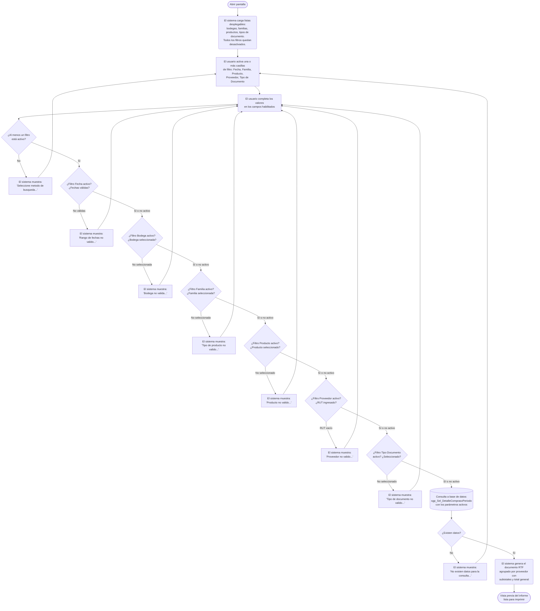

# Detalle de Compras por Producto

**Formulario:** `I_DetCom.frm`
**Tabla(s) principal(es):** `b_totcompras` (cabecera de documentos de compra), `b_detcompras` (líneas de detalle de cada compra)
**Consulta principal:** `sgp_Sel_DetalleComprasxPeriodo`

---

## Índice

- [1 — ¿Para qué sirve esta pantalla?](#1--para-qué-sirve-esta-pantalla)
- [2 — ¿Qué necesito para usarla?](#2--qué-necesito-para-usarla)
- [3 — ¿Cómo se usa?](#3--cómo-se-usa)
  - [3.1 Flujo paso a paso](#31-flujo-paso-a-paso)
  - [3.2 Controles y acciones disponibles](#32-controles-y-acciones-disponibles)
- [4 — ¿Qué restricciones debo conocer?](#4--qué-restricciones-debo-conocer)
  - [4.1 Validaciones del sistema](#41-validaciones-del-sistema)
- [5 — ¿Qué obtengo?](#5--qué-obtengo)
- [6 — Referencia técnica](#6--referencia-técnica)
  - [Tablas que intervienen](#tablas-que-intervienen)
  - [Relación con otros módulos](#relación-con-otros-módulos)

---

## 1 — ¿Para qué sirve esta pantalla?

[↑ Volver al índice](#índice)

Esta pantalla genera un informe imprimible que lista el detalle de las compras registradas en el casino, agrupadas por proveedor. Para cada proveedor muestra los productos adquiridos indicando código, nombre, unidad de medida, cantidad comprada y monto total. Al final de cada proveedor aparece un subtotal y al cierre del informe se presenta el total general de todas las compras.

La pantalla se organiza en dos áreas principales. La primera es el panel de filtros de selección, donde el usuario activa mediante casillas de verificación los criterios con los que desea acotar la consulta: rango de fechas, bodega, familia de producto, producto específico, proveedor y tipo de documento. Cada criterio es independiente y puede activarse o combinarse con otros. La segunda área es el detalle de cada criterio activado, donde el usuario especifica los valores concretos del filtro en campos y listas desplegables que se habilitan dinámicamente al marcar la casilla correspondiente.

El informe no está restringido a una única bodega ni a un único proveedor: si el usuario no activa el filtro de bodega o el de proveedor, la consulta abarca todos los documentos disponibles que cumplan los demás criterios seleccionados. La salida se presenta en una ventana de vista previa antes de imprimir.

---

## 2 — ¿Qué necesito para usarla?

[↑ Volver al índice](#índice)

Al abrir la pantalla todos los filtros están desactivados. El usuario debe habilitar al menos uno antes de ejecutar el informe. Los campos de cada filtro solo se activan tras marcar la casilla correspondiente. La casilla **Bodega** está marcada por defecto y no se puede desmarcar; su lista desplegable queda bloqueada a menos que se requiera un filtro adicional sobre ella (ver nota en la tabla).

| Campo | Descripción | Obligatorio |
|---|---|---|
| Casilla **Fecha** | Activa el filtro por rango de fechas de recepción del documento. Al marcarla se habilitan los campos de fecha y se cargan con la fecha del día. | No (pero al menos un filtro debe estar activo) |
| **Fecha Desde** | Límite inferior del rango de fechas a consultar. Se ingresa en formato dd/mm/aaaa. | Solo si la casilla Fecha está marcada |
| **Fecha Hasta** | Límite superior del rango de fechas a consultar. Debe ser igual o posterior a Fecha Desde. | Solo si la casilla Fecha está marcada |
| Casilla **Bodega** | Marcada por defecto y no modificable por el usuario. La lista desplegable de bodega está cargada con todas las bodegas del casino (tabla de clientes / bodegas). | Sí (siempre activa, pero la lista desplegable de bodega permanece bloqueada) |
| Casilla **Familia de Producto** | Activa el filtro por familia o tipo de producto. Al marcarla habilita la lista desplegable de familias. | No |
| **Familia** | Lista desplegable con las familias de productos disponibles en el sistema. | Solo si la casilla Familia de Producto está marcada |
| Casilla **Producto** | Activa el filtro por producto específico. Al marcarla habilita la lista desplegable de productos. | No |
| **Producto** | Lista desplegable con todos los productos activos del catálogo. | Solo si la casilla Producto está marcada |
| Casilla **Proveedor** | Activa el filtro por proveedor. Al marcarla habilita el campo de RUT y el botón de búsqueda. | No |
| **Rut** (Proveedor) | Campo de texto donde se ingresa el RUT del proveedor. El sistema valida el dígito verificador y muestra el nombre del proveedor al salir del campo. Existe un botón de búsqueda que abre un selector de proveedores para elegir sin tipear el RUT manualmente. | Solo si la casilla Proveedor está marcada |
| Casilla **Tipo de Documento** | Activa el filtro por tipo de documento de compra. Al marcarla habilita la lista desplegable de tipos de documento. | No |
| **Documento** | Lista desplegable con los tipos de documento disponibles (facturas, notas de crédito, etc.). | Solo si la casilla Tipo de Documento está marcada |

---

## 3 — ¿Cómo se usa?

### 3.1 Flujo paso a paso

[↑ Volver al índice](#índice)

### 3.2 Controles y acciones disponibles

[↑ Volver al índice](#índice)

| Control / Acción | Descripción |
|---|---|
| **Casilla Fecha** | Al marcarla, habilita los campos Fecha Desde y Fecha Hasta, ambos inicializados con la fecha del día. Al desmarcarla, los limpia y los deshabilita. |
| **Casilla Bodega** | Marcada por defecto y no modificable. La lista desplegable de bodega está cargada pero deshabilitada, por lo que este filtro está activo pero sin posibilidad de elegir una bodega específica distinta. |
| **Casilla Familia de Producto** | Al marcarla, habilita la lista desplegable de familias de producto para que el usuario seleccione una. Al desmarcarla, limpia la selección y la deshabilita. |
| **Casilla Producto** | Al marcarla, habilita la lista desplegable de productos. Al desmarcarla, limpia la selección y la deshabilita. |
| **Casilla Proveedor** | Al marcarla, habilita el campo de RUT y el botón de búsqueda de proveedor. Al desmarcarla, limpia el RUT y el nombre mostrado y deshabilita el campo. |
| **Campo RUT / Botón de búsqueda de proveedor** | El usuario puede ingresar el RUT manualmente; al salir del campo el sistema valida el dígito verificador y muestra el nombre del proveedor. Alternativamente, el botón abre un selector de proveedores para elegir uno de la lista y trasladar el RUT y nombre automáticamente. |
| **Casilla Tipo de Documento** | Al marcarla, habilita la lista desplegable de tipos de documento. Al desmarcarla, limpia la selección y la deshabilita. |
| **Vista Previa** (botón de la barra de herramientas) | Valida todos los filtros activos y, si son correctos, ejecuta la consulta y genera el informe en una ventana de vista previa. Es el botón principal de ejecución. |
| **Salir** (botón de la barra de herramientas) | Cierra la pantalla sin generar ningún informe. |

---

## 4 — ¿Qué restricciones debo conocer?

### 4.1 Validaciones del sistema

[↑ Volver al índice](#índice)

| # | Cuándo aparece | Qué verifica el sistema | Qué ve o experimenta el usuario |
|---|---|---|---|
| 1 | Al hacer clic en Vista Previa sin ningún filtro activo | Que al menos uno de los seis filtros esté marcado | Mensaje: `Seleccione metodo de busqueda...` El informe no se ejecuta. |
| 2 | Al hacer clic en Vista Previa con el filtro de Fecha activo | Que ambas fechas tengan un valor válido (formato correcto y reconocible como fecha) | Mensaje: `Rango de fechas no valido...` si alguna fecha está vacía o tiene formato incorrecto. |
| 3 | Al hacer clic en Vista Previa con el filtro de Fecha activo | Que Fecha Desde sea menor o igual a Fecha Hasta | Mensaje: `Rango de fechas no valido...` si Fecha Desde es posterior a Fecha Hasta. |
| 4 | Al hacer clic en Vista Previa con el filtro de Bodega activo | Que haya una bodega seleccionada en la lista | Mensaje: `Bodega no valida...` |
| 5 | Al hacer clic en Vista Previa con el filtro de Familia de Producto activo | Que haya una familia seleccionada en la lista | Mensaje: `Tipo de producto no valido...` |
| 6 | Al hacer clic en Vista Previa con el filtro de Producto activo | Que haya un producto seleccionado en la lista | Mensaje: `Producto no valido...` |
| 7 | Al hacer clic en Vista Previa con el filtro de Proveedor activo | Que el campo de RUT no esté vacío | Mensaje: `Proveedor no valido...` |
| 8 | Al salir del campo RUT con un valor ingresado | Que el RUT exista en el catálogo de proveedores | Si no existe, el campo se limpia y el foco vuelve al campo de RUT. |
| 9 | Al hacer clic en Vista Previa con el filtro de Tipo de Documento activo | Que haya un tipo de documento seleccionado en la lista | Mensaje: `Tipo de documento no valido...` |
| 10 | Tras ejecutar la consulta con todos los filtros válidos | Que la consulta devuelva al menos un registro | Mensaje: `No existen datos para la consulta...` El informe no se genera. |
| 11 | En todos los resultados | Los documentos de tipo `SN` quedan excluidos siempre de la consulta, independientemente del filtro de tipo de documento | El usuario no los verá en el informe aunque existan en el sistema. |

---

## 5 — ¿Qué obtengo?

[↑ Volver al índice](#índice)

Este formulario genera un único tipo de informe. No tiene selector de tipos.

**Formato de salida:** Documento RTF con vista previa. Orientación vertical (retrato). Una única sección continua con todos los resultados. El usuario visualiza el informe en pantalla antes de imprimir.

**Qué muestra el informe:**

El documento está estructurado en tres bloques:

1. **Encabezado del informe:** título "Detalle de Compras por Periodo", seguido de una tabla con los criterios de filtro activos (por ejemplo: "Compras entre 01/01/2025 y 31/01/2025", "Bodega: Central", "Producto: Arroz", etc.). Solo se listan los filtros que el usuario activó.

2. **Cuerpo por proveedor:** Para cada proveedor que aparece en los resultados se muestra su RUT con formato (ej. `12.345.678-9`) como encabezado de sección, seguido del detalle de sus compras fila por fila, y al final una línea de "Total Proveedor" con el monto acumulado de ese proveedor.

3. **Total General:** al cierre del documento, una línea con la suma de todos los totales de proveedores.

**Estructura de datos del informe:**

| Campo / Columna | Descripción | Calculado |
|---|---|---|
| Código | Código interno del producto comprado | No |
| Descripción | Nombre del producto | No |
| Unidad | Nombre de la unidad de medida del producto (ej. Kg, Lt, Un) | No |
| Cantidad | Cantidad adquirida en el documento de compra | No |
| Total | Monto total de la línea incluyendo flete, con tratamiento especial para notas de crédito y créditos especiales | Sí |
| Total Proveedor | Suma de los totales de todas las líneas del proveedor dentro del resultado | Sí |
| Total General | Suma de todos los totales de proveedor | Sí |

**Cálculo — Total (por línea)**

El monto total de cada línea de compra combina el precio neto del ítem con el valor de flete asociado al documento. Cuando el documento es una nota de crédito (`NC`) o un crédito especial (`CE`), el monto se muestra entre paréntesis para indicar que es un valor negativo (una devolución o descuento).

**Fórmula o lógica:**
- Para facturas y otros documentos: `Total = dec_ptotal + dec_prefle`
- Para notas de crédito y créditos especiales: `Total = (dec_ptotal + dec_prefle)` mostrado entre paréntesis

| Componente | Qué representa | De dónde viene |
|---|---|---|
| `dec_ptotal` | Precio total neto de la línea del documento de compra | `b_detcompras.dec_ptotal` |
| `dec_prefle` | Valor del flete proporcional asignado a esa línea | `b_detcompras.dec_prefle` |
| Tipo de documento (`toc_tipdoc`) | Determina si la línea es un cargo positivo o un abono negativo | `b_totcompras.toc_tipdoc` |

> Ejemplo: Si una línea tiene `dec_ptotal = 10.000` y `dec_prefle = 500`, el total mostrado es `10.500`. Si el documento es una nota de crédito, se muestra `(10.500)`.

**Cálculo — Total Proveedor**

Suma acumulada de los totales netos de cada línea del proveedor. Para las notas de crédito y créditos especiales, el valor se resta (se aplica como negativo) al acumulado del proveedor, de modo que el Total Proveedor refleja el gasto neto real después de devoluciones.

**Fórmula o lógica:**
`Total Proveedor = Σ (Total de cada línea, con NC y CE restando)`

**Cálculo — Total General**

Suma de los totales de proveedor de todos los proveedores que aparecen en el informe.

**Fórmula o lógica:**
`Total General = Σ Total Proveedor (por cada proveedor en el resultado)`

---

## 6 — Referencia técnica

### Tablas que intervienen

[↑ Volver al índice](#índice)

| Tabla | Para qué se usa en este reporte | Campos clave |
|---|---|---|
| `b_totcompras` | Cabecera de cada documento de compra. Provee la fecha de recepción, el tipo de documento, el número de documento, la bodega y el RUT del proveedor. Es la tabla de filtrado principal. | `toc_rutpro`, `toc_tipdoc`, `toc_numdoc`, `toc_codbod`, `toc_fecrem` |
| `b_detcompras` | Líneas de detalle de cada documento de compra. Provee el código del producto, la cantidad comprada, el precio total y el flete por línea. | `dec_rutpro`, `dec_tipdoc`, `dec_numdoc`, `dec_codmer`, `dec_canmer`, `dec_ptotal`, `dec_prefle` |
| `b_proveedor` | Catálogo de proveedores. Se usa para validar el RUT ingresado y obtener el nombre del proveedor que se muestra en el informe. | `prv_codigo`, `prv_nombre` |
| `b_productos` | Catálogo de productos. Provee el nombre del producto y su relación con la familia y la unidad de medida. | `pro_codigo`, `pro_nombre`, `pro_codtip`, `pro_coduni` |
| `a_tipopro` | Catálogo de familias o tipos de producto. Se usa para filtrar por familia y poblar la lista desplegable correspondiente. | `tip_codigo`, `tip_nombre` |
| `a_unidad` | Catálogo de unidades de medida. Provee el nombre de la unidad que aparece en la columna Unidad del informe. | `uni_codigo`, `uni_nombre` |
| `b_clientes` | Catálogo de bodegas del casino. Se usa para poblar la lista desplegable de bodegas al abrir la pantalla. | `cli_` (código y descripción de bodega) |
| `a_tipodocumento` | Catálogo de tipos de documento de compra (factura, nota de crédito, crédito especial, etc.). Se usa para poblar la lista desplegable de tipos de documento. | `tdo_codigo`, `tdo_nombre` |

### Relación con otros módulos

[↑ Volver al índice](#índice)

| Módulo | Relación |
|---|---|
| **Ingreso de Compras / Recepción de mercadería** | Es el proceso que genera los documentos de compra (cabecera en `b_totcompras` y líneas en `b_detcompras`) que este informe consulta. Sin recepciones registradas no hay datos disponibles. |
| **Maestro de Proveedores** | Mantiene el catálogo de proveedores (`b_proveedor`) que este informe utiliza para validar RUTs, mostrar nombres y filtrar resultados. |
| **Maestro de Productos** | Mantiene el catálogo de productos (`b_productos`), familias (`a_tipopro`) y unidades (`a_unidad`) que el informe usa para enriquecer cada línea con nombre, familia y unidad de medida. |
| **Maestro de Bodegas** | Mantiene el catálogo de bodegas (`b_clientes`) que se carga al abrir la pantalla para el filtro de bodega. |

---

*Fuentes: `I_DetCom.frm`, función `I_DetalleCom` en `InforEG.bas`, SP `sgp_Sel_DetalleComprasxPeriodo` en `SGP_Local.sql`, tablas `b_totcompras`, `b_detcompras`, `b_proveedor`, `b_productos`, `a_tipopro`, `a_unidad`, `b_clientes`, `a_tipodocumento` en `SGP_Local.sql`*
