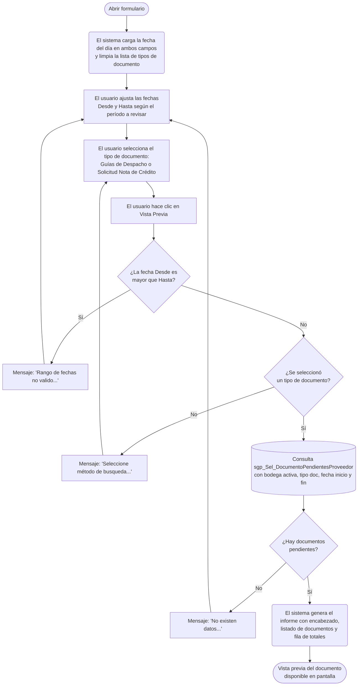

# Documentos Pendientes Proveedor

**Formulario:** `I_DocPen.frm`
**Tabla(s) principal(es):** `b_totcompras` (cabecera de documentos de compra), `b_detcompras` (líneas de detalle de cada documento)
**Consulta principal:** `sgp_Sel_DocumentoPendientesProveedor` — procedimiento almacenado en `SGP_Local.sql`

---

## Índice

- [1 — ¿Para qué sirve esta pantalla?](#1--para-qué-sirve-esta-pantalla)
- [2 — ¿Qué necesito para usarla?](#2--qué-necesito-para-usarla)
- [3 — ¿Cómo se usa?](#3--cómo-se-usa)
  - [3.1 Flujo paso a paso](#31-flujo-paso-a-paso)
  - [3.2 Controles y acciones disponibles](#32-controles-y-acciones-disponibles)
- [4 — ¿Qué restricciones debo conocer?](#4--qué-restricciones-debo-conocer)
  - [4.1 Validaciones del sistema](#41-validaciones-del-sistema)
- [5 — ¿Qué obtengo?](#5--qué-obtengo)
- [6 — Referencia técnica](#6--referencia-técnica)
  - [Tablas que intervienen](#tablas-que-intervienen)
  - [Relación con otros módulos](#relación-con-otros-módulos)

---

## 1 — ¿Para qué sirve esta pantalla?

[↑ Volver al índice](#índice)

Esta pantalla genera un informe de documentos de compra que han sido registrados en el sistema pero que aún no tienen un documento asociado que los cierre o liquide. Dependiendo del tipo de documento seleccionado, permite identificar las **guías de despacho** recibidas de proveedores que todavía no tienen factura de compra vinculada, o las **solicitudes de nota de crédito** que no tienen aún una nota de crédito emitida que las respalde.

La pantalla se compone de dos paneles: uno de **fecha** (rango Desde–Hasta) y uno de **documentos** (selector del tipo a consultar). Una vez completados ambos filtros, el usuario ejecuta el informe desde la barra de herramientas y el sistema genera un documento en vista previa que puede revisar en pantalla antes de exportar o imprimir.

El informe muestra los documentos pendientes de la bodega activa en la sesión del usuario y consolida los montos por rubro contable (alimentación, desechos, otros), calculando el total por cada documento y el gran total al final del listado.

---

## 2 — ¿Qué necesito para usarla?

[↑ Volver al índice](#índice)

| Campo | Descripción | Obligatorio |
|---|---|---|
| Desde | Fecha de inicio del período a consultar. El sistema la inicializa con la fecha del día al abrir el formulario. | Sí |
| Hasta | Fecha de término del período a consultar. El sistema la inicializa con la fecha del día al abrir el formulario. | Sí |
| Tipo de Documento | Lista desplegable con las dos opciones de documento a consultar: **Guías de Despacho** o **Solicitud Nota de Crédito**. Se debe seleccionar una antes de ejecutar. | Sí |

No se requiere ninguna acción previa adicional: al abrir el formulario, las fechas ya están cargadas con la fecha actual y la bodega consultada es la que tiene activa el usuario en su sesión.

---

## 3 — ¿Cómo se usa?

[↑ Volver al índice](#índice)

### 3.1 Flujo paso a paso

[↑ Volver al índice](#índice)

### 3.2 Controles y acciones disponibles

[↑ Volver al índice](#índice)

| Control / Acción | Descripción |
|---|---|
| **Desde** | Campo de fecha de inicio del período. El usuario puede ingresar o modificar la fecha manualmente. Acepta navegación con la tecla Enter para avanzar al siguiente campo. |
| **Hasta** | Campo de fecha de término del período. Mismo comportamiento que el campo Desde. |
| **Tipo de Documento** | Lista desplegable con las opciones disponibles: `Guías de Despacho` y `Solicitud Nota de Crédito`. El usuario debe seleccionar una opción antes de ejecutar; si no lo hace, el sistema lo advierte. |
| **Vista Previa** | Botón de la barra de herramientas que ejecuta la consulta y genera el informe. Solo está disponible si el usuario tiene permisos de visualización asignados para este formulario. Al ejecutarse, valida el rango de fechas y la selección del tipo, luego abre el documento en una ventana de vista previa. |
| **Salir** | Botón de la barra de herramientas que cierra el formulario sin generar ningún documento. |

---

## 4 — ¿Qué restricciones debo conocer?

[↑ Volver al índice](#índice)

### 4.1 Validaciones del sistema

[↑ Volver al índice](#índice)

| # | Cuándo aparece | Qué verifica el sistema | Qué ve o experimenta el usuario |
|---|---|---|---|
| 1 | Al hacer clic en Vista Previa | Que la fecha Desde no sea posterior a la fecha Hasta | Mensaje: `Rango de fechas no valido...` El usuario debe corregir el rango antes de continuar. |
| 2 | Al hacer clic en Vista Previa (después de validar las fechas) | Que se haya seleccionado un tipo de documento en la lista | Mensaje: `Seleccione método de busqueda...` El usuario debe elegir entre Guías de Despacho o Solicitud Nota de Crédito. |
| 3 | Después de ejecutar la consulta al servidor | Que existan documentos pendientes para los filtros ingresados | Mensaje: `No existen datos...` El informe no se genera y el usuario puede ajustar los filtros. |
| 4 | Al abrir el formulario | Que el usuario tenga permisos de visualización | El botón Vista Previa aparece deshabilitado si el usuario no tiene el permiso correspondiente. |

---

## 5 — ¿Qué obtengo?

[↑ Volver al índice](#índice)

Esta pantalla genera un único informe cuyo contenido varía según el tipo de documento seleccionado. No hay un selector de múltiples tipos de informe con estructuras radicalmente distintas: ambas opciones utilizan el mismo formato de salida y la misma estructura de columnas, diferenciándose únicamente en qué campo se muestra en la columna central y en la lógica de filtro de pendientes.

**Formato de salida:** Documento RTF generado en orientación retrato. El sistema abre automáticamente una ventana de vista previa donde el usuario puede revisar el documento antes de exportarlo o imprimirlo. El encabezado del documento incluye el nombre del contrato (casino) y la bodega activa en la sesión del usuario.

**Título del documento generado:**
- Si se seleccionó `Guías de Despacho`: *Informe de Guías de Despacho Pendientes*
- Si se seleccionó `Solicitud Nota de Crédito`: *Informe de Solicitudes de Nota de Crédito Pendientes*

**Estructura de datos del informe:**

| Campo / Columna | Descripción | Calculado |
|---|---|---|
| Fecha Emisión | Fecha en que fue emitido el documento por el proveedor | No |
| ND | Número del documento (número de la guía de despacho o de la solicitud de nota de crédito) | No |
| Nº Factura | Número de la factura asociada. Solo aparece para el tipo Solicitud Nota de Crédito; en Guías de Despacho esta columna queda vacía | No |
| TD | Tipo de documento (código interno del tipo de documento registrado en el sistema) | No |
| R.U.T | RUT del proveedor, formateado con puntos y guión | No |
| Nombre | Nombre o razón social del proveedor | No |
| Alim | Monto del documento correspondiente a productos clasificados como insumos de alimentación | Sí |
| Desech | Monto del documento correspondiente a productos clasificados como desechos o limpieza | Sí |
| Otros | Monto del documento correspondiente a productos de otras categorías contables | Sí |
| Monto | Suma de los tres rubros anteriores para el documento | Sí |
| **Total** (fila de cierre) | Suma de cada columna de monto para todos los documentos listados | Sí |

**Cálculo — Alim (monto alimentación por documento)**

El sistema no almacena los montos por rubro directamente en el documento. Los calcula en tiempo de generación del informe clasificando cada línea del detalle según la cuenta contable del producto, y acumulando el monto neto de cada línea según a qué rubro pertenece.

**Fórmula o lógica — tipo Guías de Despacho:**

Monto Alim = Σ (cantidad recibida × precio de compra) − (cantidad del documento × precio de compra × % descuento / 100)

para todas las líneas cuyo producto tenga cuenta contable igual al parámetro `ctainsumo` (cuenta de insumos de alimentación).

**Fórmula o lógica — tipo Solicitud Nota de Crédito:**

Monto Alim = Σ (total línea − total ya recibido) − ((total línea − total ya recibido) × % descuento / 100) + monto impuesto incluido en costo

para todas las líneas cuyo producto tenga cuenta contable igual al parámetro `ctainsumo`.

| Componente | Qué representa | De dónde viene |
|---|---|---|
| Cantidad recibida (`dec_canrec`) | Cantidad de unidades que efectivamente ingresaron a bodega | `b_detcompras.dec_canrec` |
| Precio de compra (`dec_precom`) | Precio unitario pactado con el proveedor | `b_detcompras.dec_precom` |
| % descuento (`dec_pctdes`) | Porcentaje de descuento aplicado en la línea del documento | `b_detcompras.dec_pctdes` |
| Total línea (`dec_ptotal`) | Monto total registrado en la línea del documento | `b_detcompras.dec_ptotal` |
| Total ya recibido (`dec_ptotrec`) | Monto del total que ya fue procesado en recepciones anteriores | `b_detcompras.dec_ptotrec` |
| Impuesto incluido en costo (`imd_monimp`) | Monto de impuestos adicionales cuya cuenta tiene el indicador de inclusión en costo activo | `b_detcomprasimp` cruzada con `a_impuesto` donde `imp_inccos = 1` |
| Cuenta contable del producto (`pro_ctacon`) | Código de cuenta contable asignado al producto, que determina si va a Alim, Desech u Otros | `b_productos.pro_ctacon` |
| Parámetro `ctainsumo` | Código de cuenta contable que identifica los insumos de alimentación del casino | Tabla `a_param`, parámetro `ctainsumo` para el centro de costo activo |
| Parámetro `ctalimdes` | Código de cuenta contable que identifica los productos de desechos o limpieza | Tabla `a_param`, parámetro `ctalimdes` para el centro de costo activo |

> Ejemplo (Guías de Despacho): Una línea con 10 unidades recibidas a $500 cada una y 5% de descuento, cuyo producto es de alimentación, contribuye: (10 × $500) − (10 × $500 × 5/100) = $5.000 − $250 = $4.750 al rubro Alim.

**Cálculo — Desech (monto desechos por documento)**

Mismo cálculo que Alim pero para las líneas cuyo producto tiene cuenta contable igual al parámetro `ctalimdes`.

**Cálculo — Otros (monto otros rubros por documento)**

Mismo cálculo pero para las líneas cuyo producto tiene una cuenta contable distinta a `ctainsumo` y a `ctalimdes`.

**Cálculo — Monto (total por documento)**

Monto = Alim + Desech + Otros

Representa el monto total pendiente del documento, sumando los tres rubros calculados.

**Cálculo — Fila Total**

El sistema acumula los tres totales parciales (total alimentación, total desechos, total otros) a lo largo de todos los documentos listados, y los muestra en una fila de cierre al final del informe con la leyenda `Total`.

---

## 6 — Referencia técnica

[↑ Volver al índice](#índice)

### Tablas que intervienen

[↑ Volver al índice](#índice)

| Tabla | Para qué se usa en este reporte | Campos clave |
|---|---|---|
| `b_totcompras` | Fuente principal: cabecera de cada documento de compra (guía o solicitud de NC). Filtra por bodega, tipo de documento, rango de fechas y condición de pendiente (sin documento asociado) | `toc_rutpro`, `toc_tipdoc`, `toc_numdoc`, `toc_fecrem`, `toc_docaso`, `toc_docsnc`, `toc_codbod` |
| `b_detcompras` | Líneas de detalle de cada documento: productos, cantidades, precios y descuentos | `dec_rutpro`, `dec_tipdoc`, `dec_numdoc`, `dec_numlin`, `dec_codmer`, `dec_canmer`, `dec_precom`, `dec_pctdes`, `dec_canrec`, `dec_prerec`, `dec_ptotal`, `dec_ptotrec` |
| `b_productos` | Catálogo de productos: proporciona la cuenta contable de cada producto para clasificarlo en el rubro correspondiente (alimentación, desechos, otros) | `pro_codigo`, `pro_ctacon` |
| `b_proveedor` | Catálogo de proveedores: proporciona el RUT y el nombre del proveedor para mostrar en el informe | `prv_codigo`, `prv_nombre` |
| `b_detcomprasimp` | Detalle de impuestos por línea de compra: proporciona el monto de impuestos incluidos en costo cuando aplica | `imd_rutdoc`, `imd_tipdoc`, `imd_numdoc`, `imd_numlin`, `imd_codpro`, `imd_monimp`, `imd_codimp` |
| `a_impuesto` | Catálogo de impuestos: filtra los que tienen el indicador de inclusión en costo activo | `imp_codigo`, `imp_inccos` |
| `a_tipodocumento` | Catálogo de tipos de documento: permite traducir el código genérico `GD` a los códigos internos reales de guías de despacho registrados en el sistema | `tdo_Codigo`, `tdo_IdCodigo` |
| `a_param` | Parámetros del casino: proporciona los códigos de cuenta contable `ctainsumo` y `ctalimdes` para clasificar los rubros del informe | `par_codigo`, `par_valor`, `par_cencos` |
| `b_clientes` | Catálogo de clientes/contratos: proporciona el nombre y código del contrato para mostrar en el encabezado del informe | `cli_nombre`, `cli_codigo` |
| `b_bodegas` | Catálogo de bodegas: proporciona el nombre y código de la bodega activa para mostrar en el encabezado del informe | `bod_nombre`, `bod_codigo` |

### Relación con otros módulos

[↑ Volver al índice](#índice)

| Módulo | Relación |
|---|---|
| **Recepción de documentos (Inventario)** | Los registros de guías de despacho y solicitudes de nota de crédito que aparecen en este informe son generados por el proceso de recepción de mercadería en bodega. Un documento pendiente es aquel que fue recibido pero cuyo proceso de facturación o emisión de nota de crédito aún no ha sido completado en el sistema. |
| **Cuentas contables (Configuración/Contrato)** | La clasificación de cada documento en los rubros Alim, Desech y Otros depende de los parámetros `ctainsumo` y `ctalimdes` configurados por contrato. Cambios en esos parámetros afectan directamente cómo se agrupan los montos en el informe. |
| **Impuestos (Configuración)** | Los montos incluidos en costo provenientes de impuestos especiales (por ejemplo ILA u otros impuestos con `imp_inccos = 1`) se suman al monto de cada rubro. Estos impuestos se configuran en el módulo de parámetros del sistema. |

---

*Fuentes: `I_DocPen.frm`, función `I_Pendocpro` en `InforEG.bas`, SP `sgp_Sel_DocumentoPendientesProveedor` en `SGP_Local.sql`, tablas `b_totcompras`, `b_detcompras`, `b_productos`, `b_proveedor`, `b_detcomprasimp`, `a_impuesto`, `a_tipodocumento`, `a_param` en `SGP_Local.sql`*
