# Facturación Clientes

**Formulario:** `I_FacCli.frm`
**Tabla(s) principal(es):** `b_minutaraciones` (raciones planificadas por cliente, régimen y servicio), `b_preciovta` (precios de venta vigentes por cliente), `b_ventacontado` / `b_ventacontadodet` (ventas al contado registradas)
**Consulta principal:** Sin procedimiento almacenado — consulta directa al servidor; generación del informe delegada a la función `I_FacturaCli` en `InforAN.bas`

---

## Índice

- [1 — ¿Para qué sirve esta pantalla?](#1--para-qué-sirve-esta-pantalla)
- [2 — ¿Qué necesito para usarla?](#2--qué-necesito-para-usarla)
- [3 — ¿Cómo se usa?](#3--cómo-se-usa)
  - [3.1 Flujo paso a paso](#31-flujo-paso-a-paso)
  - [3.2 Controles y acciones disponibles](#32-controles-y-acciones-disponibles)
- [4 — ¿Qué restricciones debo conocer?](#4--qué-restricciones-debo-conocer)
  - [4.1 Validaciones del sistema](#41-validaciones-del-sistema)
  - [4.2 Reglas de cálculo](#42-reglas-de-cálculo)
- [5 — ¿Qué obtengo?](#5--qué-obtengo)
  - [5.1 Modo Resumido](#51-modo-resumido)
  - [5.2 Modo Detallado](#52-modo-detallado)
  - [5.3 Estructura del informe generado](#53-estructura-del-informe-generado)
- [6 — Referencia técnica](#6--referencia-técnica)
  - [Tablas que intervienen](#tablas-que-intervienen)
  - [Relación con otros módulos](#relación-con-otros-módulos)

---

## 1 — ¿Para qué sirve esta pantalla?
[↑ Volver al índice](#índice)

Esta pantalla genera el informe de **Facturación Clientes**, que consolida las raciones planificadas y los montos a cobrar a cada cliente del casino para un período determinado. El informe toma en cuenta el precio de venta vigente registrado para cada cliente, régimen y servicio, y multiplica ese precio por la cantidad de raciones consumidas, calculando así el total a facturar por cliente.

El informe integra dos fuentes de datos de forma simultánea: las **raciones de minuta** (consumos registrados en la planificación diaria) y las **ventas al contado** (transacciones cobradas directamente en el punto de venta). Ambas aparecen consolidadas en un mismo documento, agrupadas por cliente.

La pantalla opera sobre un único casino (el contrato activo del usuario), y permite filtrar el alcance del informe seleccionando uno o más clientes, regímenes y servicios. El resultado se presenta en una **ventana de Vista Previa** orientada en formato vertical (retrato), desde la cual el usuario puede imprimirlo o exportarlo. Adicionalmente, el sistema genera de forma automática un archivo de texto plano con los mismos datos, útil para procesamiento posterior.

---

## 2 — ¿Qué necesito para usarla?
[↑ Volver al índice](#índice)

| Campo | Descripción | Obligatorio |
|---|---|---|
| Contrato | Código del contrato/casino. Se carga automáticamente desde la sesión activa del usuario. Es posible ingresar el código manualmente o usar el buscador. | Sí |
| Fecha Inicio | Fecha desde la cual se incluyen los datos. Formato dd/mm/aaaa. | Sí |
| Fecha Término | Fecha hasta la cual se incluyen los datos. Formato dd/mm/aaaa. Se habilita solo cuando Fecha Inicio tiene un valor válido. | Sí |
| Clientes | Permite seleccionar todos los clientes del contrato o una lista específica de ellos. Por defecto se incluyen todos. | Sí (debe existir al menos uno seleccionado) |
| Regimen | Permite seleccionar todos los regímenes o una lista específica. Por defecto se incluyen todos. | Sí (debe existir al menos uno seleccionado) |
| Servicios | Permite seleccionar todos los servicios o una lista específica. Por defecto se incluyen todos. | Sí (debe existir al menos uno seleccionado) |
| Tipo de informe | Resumido o Detallado. Por defecto: Resumido. | Sí |

---

## 3 — ¿Cómo se usa?
[↑ Volver al índice](#índice)

### 3.1 Flujo paso a paso
[↑ Volver al índice](#índice)



```mermaid
flowchart TD
    A([Abrir pantalla Facturación Clientes]) --> B(El sistema carga el contrato activo del usuario y la fecha actual en ambos campos de fecha)
    B --> C(El sistema carga la lista completa de clientes, regímenes y servicios disponibles, todos seleccionados por defecto)
    C --> D[El usuario verifica o ajusta el contrato]
    D --> E[El usuario ingresa Fecha Inicio y Fecha Término]
    E --> F{¿Fecha Inicio mayor a Fecha Término?}
    F -- Sí --> G(El sistema ajusta Fecha Término para igualar Fecha Inicio)
    G --> H
    F -- No --> H[El usuario elige el tipo de informe: Resumido o Detallado]
    H --> I{¿Filtrar Clientes por lista?}
    I -- Sí --> J[El usuario elige Lista en el panel Clientes y selecciona clientes usando el buscador]
    I -- No --> K[Todos los clientes quedan seleccionados]
    J --> L
    K --> L{¿Filtrar Regimen por lista?}
    L -- Sí --> M[El usuario elige Lista en el panel Regimen y selecciona regímenes usando el buscador]
    L -- No --> N[Todos los regímenes quedan seleccionados]
    M --> O
    N --> O{¿Filtrar Servicios por lista?}
    O -- Sí --> P[El usuario elige Lista en el panel Servicios y selecciona servicios usando el buscador]
    O -- No --> Q[Todos los servicios quedan seleccionados]
    P --> R
    Q --> R[El usuario hace clic en Vista Previa]
    R --> S{¿Algún filtro vacío — sin clientes, regímenes o servicios seleccionados?}
    S -- Sí --> T(El sistema muestra mensaje de error y cancela)
    S -- No --> U[(El sistema consulta b_minutaraciones + b_preciovta y b_ventacontado + b_ventacontadodet)]
    U --> V{¿Existen datos en el período?}
    V -- No --> W(El sistema muestra: No existe información...)
    V -- Sí --> X(El sistema genera el informe y abre la ventana de Vista Previa)
    X --> Y([Usuario imprime o cierra la Vista Previa])
```

### 3.2 Controles y acciones disponibles
[↑ Volver al índice](#índice)

| Control / Acción | Descripción |
|---|---|
| Campo Contrato | Muestra el código del contrato/casino activo. Permite ingresar otro código manualmente. El nombre del contrato se muestra en la etiqueta adyacente al campo. |
| Buscador de contrato (ícono junto al campo Contrato) | Abre una ventana de búsqueda para seleccionar el contrato desde la tabla `b_clientes`. Solo disponible si el usuario tiene permisos de cambio de casino (`ModCasino`). |
| Fecha Inicio | Campo de fecha con formato dd/mm/aaaa. Inicializado con la fecha actual. |
| Fecha Término | Campo de fecha con formato dd/mm/aaaa. Inicializado con la fecha actual. Se desactiva si Fecha Inicio queda vacía. Si se ingresa una fecha de inicio posterior a la de término, el sistema ajusta la fecha de término automáticamente. |
| Panel Clientes — opción Todos | Incluye todos los clientes cargados en el sistema (selección por defecto). El buscador de lista de clientes queda deshabilitado. |
| Panel Clientes — opción Lista | Habilita el buscador de clientes. Permite elegir uno o más clientes de la lista interna. |
| Buscador de lista Clientes (ícono en panel Clientes) | Solo activo al seleccionar "Lista" en el panel Clientes. Abre una ventana de selección múltiple filtrada por contrato y período. |
| Panel Regimen — opción Todos | Incluye todos los regímenes disponibles (selección por defecto). El buscador de lista de regímenes queda deshabilitado. |
| Panel Regimen — opción Lista | Habilita el buscador de regímenes. Permite elegir uno o más regímenes de la lista interna. |
| Buscador de lista Regimen (ícono en panel Regimen) | Solo activo al seleccionar "Lista" en el panel Regimen. Abre una ventana de selección múltiple filtrada por contrato y período. |
| Panel Servicios — opción Todos | Incluye todos los servicios disponibles (selección por defecto). El buscador de lista de servicios queda deshabilitado. |
| Panel Servicios — opción Lista | Habilita el buscador de servicios. Permite elegir uno o más servicios de la lista interna. |
| Buscador de lista Servicios (ícono en panel Servicios) | Solo activo al seleccionar "Lista" en el panel Servicios. Abre una ventana de selección múltiple filtrada por contrato y período. |
| Opción Resumido | Agrupa la información por servicio, sumando el total de raciones de todos los días del período. No muestra desglose por fecha. Seleccionada por defecto. |
| Opción Detallado | Muestra una fila por cada fecha dentro del período, con su cantidad de raciones y monto individual. |
| Botón Vista Previa (barra de herramientas) | Ejecuta las consultas a la base de datos, genera el informe y abre la ventana de Vista Previa para revisión e impresión. |
| Botón Salir (barra de herramientas) | Cierra el formulario sin generar ningún informe. |

---

## 4 — ¿Qué restricciones debo conocer?
[↑ Volver al índice](#índice)

### 4.1 Validaciones del sistema
[↑ Volver al índice](#índice)

| # | Cuándo aparece | Qué verifica el sistema | Qué ve o experimenta el usuario |
|---|---|---|---|
| 1 | Al hacer clic en Vista Previa | Que exista al menos un cliente seleccionado en la lista interna | Si no hay ninguno, aparece el mensaje: `"Cliente debe ser informado"` y el proceso se cancela. |
| 2 | Al hacer clic en Vista Previa | Que exista al menos un régimen seleccionado en la lista interna | Si no hay ninguno, aparece el mensaje: `"Regimen debe ser informado"` y el proceso se cancela. |
| 3 | Al hacer clic en Vista Previa | Que exista al menos un servicio seleccionado en la lista interna | Si no hay ninguno, aparece el mensaje: `"Servicio debe ser informado"` y el proceso se cancela. |
| 4 | Tras ejecutar las consultas a la base de datos | Que el período y los filtros seleccionados retornen al menos un registro en cualquiera de las dos fuentes de datos (raciones de minuta o ventas al contado) | Si no hay datos, aparece el mensaje: `"No existe información..."` y no se genera informe. |
| 5 | Al cambiar la Fecha Inicio | Que la fecha de inicio no sea posterior a la fecha de término | Si lo es, el sistema actualiza automáticamente la Fecha Término para igualarla a la Fecha Inicio. |
| 6 | Al cambiar la Fecha Inicio a vacío | Control de campos dependientes | El sistema desactiva el campo Fecha Término y lo deja en blanco. |
| 7 | Si ocurre cualquier error técnico durante la generación | Manejo de errores generales de ejecución | Aparece el mensaje: `"Error: <número> <descripción>"` con el detalle del error. |

### 4.2 Reglas de cálculo
[↑ Volver al índice](#índice)

El sistema utiliza una tabla temporal de trabajo (nombrada con el formato `<usuario>_tmp_fact1`) para procesar las raciones. El cálculo del precio vigente se obtiene localizando, para cada combinación de cliente/régimen/servicio/fecha, la **última fecha de vigencia del precio de venta** que sea anterior o igual a la fecha de la ración (`prv_fecvig <= mir_fecmin`). Esta lógica garantiza que se aplique el precio que estaba activo en el momento en que se registraron las raciones, no el precio actual.

La fórmula aplicada a cada fila de raciones es:

```
Total por fila = prv_preven (precio de venta vigente) × Cantidad (número de raciones)
```

El total por cliente se acumula sumando las filas correspondientes. El **Total General** del informe es la suma de todos los totales por cliente (tanto de raciones de minuta como de ventas al contado), redondeado a entero.

Para el **modo Resumido**, las raciones de todos los días del período se suman en una sola fila por servicio (`SUM(mir_nrorac)`). Para el **modo Detallado**, se presenta una fila por cada fecha con su cantidad individual.

---

## 5 — ¿Qué obtengo?
[↑ Volver al índice](#índice)

El informe se presenta en una **ventana de Vista Previa** orientada en formato vertical (retrato). El sistema genera simultáneamente un **archivo de texto** con los mismos datos (separados por `|`), disponible para procesamiento externo. Ambos documentos tienen la misma estructura.

El informe incluye:
- Encabezado con logotipo de la empresa.
- Cabecera con Contrato y Rango de Fechas seleccionados.
- Cuerpo con las raciones (fuente: minuta) agrupadas por cliente.
- Cuerpo con las ventas al contado agrupadas por cliente (a continuación de las raciones).
- Total por cliente al cierre de cada grupo.
- **Total General** al final del documento.

### 5.1 Modo Resumido
[↑ Volver al índice](#índice)

En modo Resumido, el informe presenta **una fila por servicio** dentro de cada cliente, consolidando todas las fechas del período en una sola cantidad total. No aparece el desglose por fecha.

**Estructura de datos — Sección Raciones (Modo Resumido):**

| Columna | Descripción | Calculado |
|---|---|---|
| Servicio | Código y nombre del servicio | No |
| N° Raciones | Suma total de raciones del período para ese cliente y servicio | Sí — `SUM(mir_nrorac)` |
| Precio | Precio de venta vigente (`prv_preven`) para la última vigencia aplicable | No |
| Total | Precio × N° Raciones | Sí — `prv_preven × SUM(mir_nrorac)` |

**Estructura de datos — Sección Ventas al Contado (Modo Resumido):**

| Columna | Descripción | Calculado |
|---|---|---|
| Servicio | Código y nombre del servicio | No |
| Monto | Suma del monto de detalle de venta (`vtd_detmon`) | Sí — `SUM(vtd_detmon)` |

### 5.2 Modo Detallado
[↑ Volver al índice](#índice)

En modo Detallado, el informe presenta **una fila por cada fecha** dentro del período para cada cliente y servicio. Adicionalmente, en la sección de ventas al contado se muestra el centro de costo del cliente (`clc_codigo`) y la descripción del concepto cobrado (`vtd_descripcion`).

**Estructura de datos — Sección Raciones (Modo Detallado):**

| Columna | Descripción | Calculado |
|---|---|---|
| Fecha | Fecha de la ración en formato dd/mm/aaaa | No — formateada desde `mir_fecmin` (YYYYMMDD) |
| N° Raciones | Cantidad de raciones del día (`mir_nrorac`) | No |
| Precio | Precio de venta vigente (`prv_preven`) para esa fecha | No |
| Total | Precio × N° Raciones de ese día | Sí — `prv_preven × mir_nrorac` |

**Cálculo — Total por cliente (Detallado):**
```
Total cliente = SUM(prv_preven × mir_nrorac) para todas las fechas del período del cliente
```
Se imprime un subtotal al cambio de cliente, y si el modo es Detallado también al cambio de servicio dentro del mismo cliente.

**Estructura de datos — Sección Ventas al Contado (Modo Detallado):**

| Columna | Descripción | Calculado |
|---|---|---|
| Fecha / Descripción | Fecha de la venta (`vtc_fecvta`) y descripción del concepto (`vtd_descripcion`) | No |
| Monto | Monto del detalle de venta (`vtd_detmon`) | No |

### 5.3 Estructura del informe generado
[↑ Volver al índice](#índice)

```
ENCABEZADO: Logotipo empresa
TÍTULO: "Facturación Clientes (Resumido)" o "Facturación Clientes (Detallado)"

Contrato : <código> - <nombre del contrato>
Rango Fecha : <fecha_inicio> - <fecha_término>

ENCABEZADO DE COLUMNAS:
  [Servicio o Fecha]  |  N° Raciones  |  Precio  |  Total

--- SECCIÓN RACIONES (fuente: b_minutaraciones) ---
POR CADA CLIENTE:
  <RUT cliente> - <nombre cliente> [(código servicio - nombre servicio) solo en Detallado]
    <fila 1>
    <fila 2>
    ...
    _____________________ Total: <subtotal cliente>

--- SECCIÓN VENTAS AL CONTADO (fuente: b_ventacontado) ---
POR CADA CLIENTE:
  <RUT cliente> - <nombre cliente> [(servicio) solo en Detallado]
  [solo Detallado: (centro de costo cliente)]
    <fila 1>
    ...
    _____________________ Total: <subtotal cliente>

TOTAL GENERAL: <suma de todos los subtotales>

PIE: encabezado de página / número de página
```

---

## 6 — Referencia técnica
[↑ Volver al índice](#índice)

### Tablas que intervienen
[↑ Volver al índice](#índice)

| Tabla | Para qué se usa | Campos clave |
|---|---|---|
| `b_minutaraciones` | Registro de raciones planificadas por cliente, contrato, régimen, servicio y fecha | `mir_cencos`, `mir_codreg`, `mir_codser`, `mir_fecmin`, `mir_rutcli`, `mir_nrorac` |
| `b_preciovta` | Precios de venta por cliente, contrato, régimen, servicio y fecha de vigencia | `prv_cencos`, `prv_codreg`, `prv_codser`, `prv_rutcli`, `prv_fecvig`, `prv_preven` |
| `b_ventacontado` | Cabecera de ventas al contado registradas en el punto de venta | `vtc_codigo`, `vtc_cencos`, `vtc_codreg`, `vtc_codser`, `vtc_fecvta` |
| `b_ventacontadodet` | Detalle de cada venta al contado: cliente, centro de costo, descripción y monto | `vtd_codigo`, `vtd_numlin`, `vtd_codcli`, `vtd_codcco`, `vtd_descripcion`, `vtd_detmon` |
| `b_clientes` | Nombre del cliente a mostrar en el informe; también usada para la búsqueda de contrato | `cli_codigo`, `cli_nombre` |
| `b_clientecencos` | Centro de costo del cliente (solo en modo Detallado, sección ventas al contado) | `clc_codigo`, `clc_codcli`, `clc_nombre` |
| `a_servicio` | Nombre del servicio a mostrar en el informe | `ser_codigo`, `ser_nombre` |
| `a_regimen` | Validación de regímenes seleccionados en la consulta | `reg_codigo`, `reg_nombre` |
| `<usuario>_tmp_fact1` | Tabla temporal de trabajo creada durante la ejecución para calcular la vigencia de precio aplicable a cada ración | Campos equivalentes a `b_minutaraciones` más `prv_fecvig` calculada |

### Relación con otros módulos
[↑ Volver al índice](#índice)

| Módulo | Relación |
|---|---|
| Módulo de Planificación / Minuta Real | Provee los datos de raciones (`b_minutaraciones`) que son la base del informe |
| Módulo de Precios de Venta | Define los precios por cliente, régimen y servicio con vigencia temporal (`b_preciovta`) |
| Módulo de Venta al Contado | Registra transacciones cobradas directamente (`b_ventacontado`, `b_ventacontadodet`) que se consolidan en el mismo informe |
| Módulo de Contratos / Clientes | Provee el maestro de clientes (`b_clientes`) y centros de costo (`b_clientecencos`) |
| Módulo de Regímenes y Servicios | Provee los catálogos de regímenes (`a_regimen`) y servicios (`a_servicio`) usados para filtrar y describir los datos |

---

*Fuentes: `I_FacCli.frm`, función `I_FacturaCli` en `InforAN.bas`, tablas `b_minutaraciones`, `b_preciovta`, `b_ventacontado`, `b_ventacontadodet`, `b_clientes`, `b_clientecencos`, `a_servicio`, `a_regimen` en `SGP_Local.sql`*
